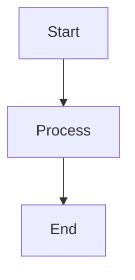
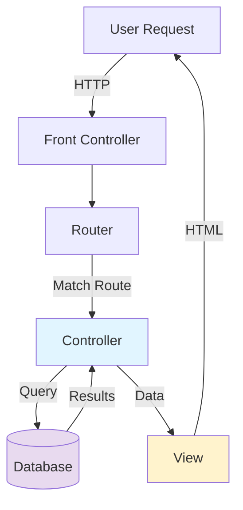
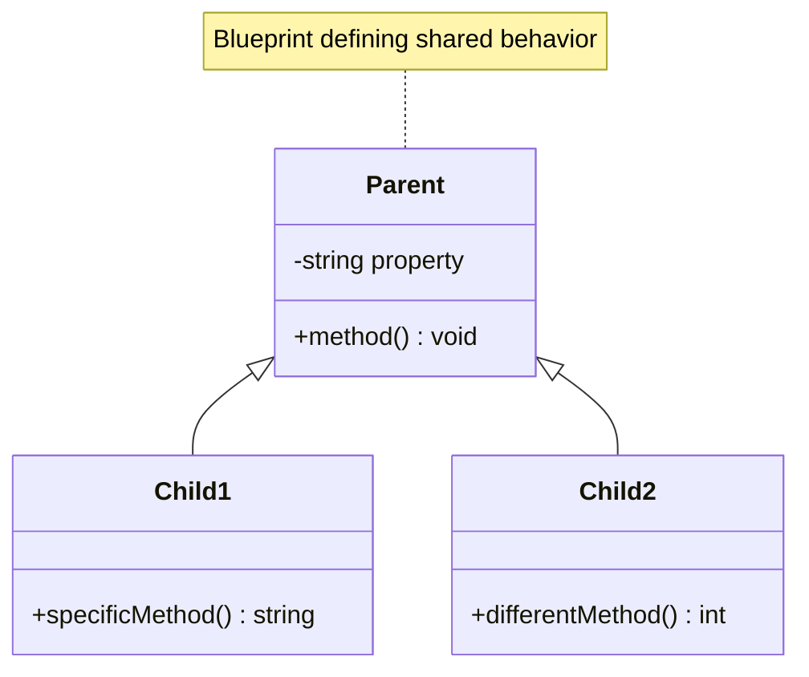
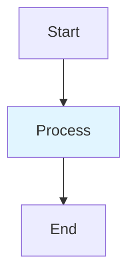

# AGENTS

This file mirrors the Cursor rules in `.cursor/rules/` for use by other agents.

## Source Rules

### ai-ml-series.mdc

- Source: `.cursor/rules/ai-ml-series.mdc`
- Applies: globs: docs/series/ai-ml-php-developers/**/*.md; description: AI/ML for PHP Developers series — Guidelines for writing AI and machine learning content

# AI/ML for PHP Developers Series

## Series Overview

A comprehensive 25-chapter course teaching PHP developers how to integrate artificial intelligence and machine learning into their applications. The series progresses from fundamental concepts to advanced implementations, covering theory, practical projects, and production deployment.

## Target Audience

- PHP developers (intermediate to advanced) with little to no AI/ML experience
- Web developers wanting to add intelligent features to applications
- Developers transitioning from traditional web development to AI-enhanced applications

## Core Technologies & Libraries

### PHP Libraries

- **PHP-ML**: Pure PHP machine learning library for basic algorithms
- **Rubix ML**: Comprehensive ML library with 40+ algorithms covering the entire ML lifecycle
- PHP extensions for TensorFlow and ONNX Runtime (where applicable)

### External Tools & Services

- **Python Integration**: scikit-learn, pandas, TensorFlow, PyTorch (via API/CLI)
- **OpenAI API**: GPT models for NLP tasks
- **TensorFlow**: Deep learning models and inference
- **OpenCV**: Computer vision tasks (typically via Python bridge)

### Dependencies

- PHP 8.4+ (always)
- Composer for dependency management
- Optional: Python 3.10+ for advanced ML tasks
- Docker (for deployment chapters)

## Chapter Progression

The series follows a carefully structured learning path:

1. **Foundations (Chapters 1-4)**: Introduction, environment setup, core concepts, data preprocessing
2. **Basic ML (Chapters 5-8)**: First models, classification, evaluation, PHP ML libraries
3. **Advanced ML (Chapters 9-12)**: Complex algorithms, neural networks, Python integration, deep learning
4. **NLP Track (Chapters 13-15)**: Text processing, classification, language models
5. **Computer Vision Track (Chapters 16-18)**: Image basics, classification, object detection
6. **Predictive Analytics (Chapters 19-20)**: Time series, forecasting
7. **Recommender Systems (Chapters 21-22)**: Theory and implementation
8. **Production (Chapters 23-24)**: Integration, deployment, scaling
9. **Capstone (Chapter 25)**: Comprehensive project and future trends

## Content Guidelines

### Theory and Concepts

- **Start accessible**: Explain AI/ML concepts without heavy mathematics
- **Developer-friendly analogies**: Relate ML concepts to programming patterns PHP devs know
- **Just-enough theory**: Provide enough background to make informed decisions, not academic depth
- **Progressive complexity**: Build on previous chapters; reference earlier concepts with links

### Code Examples

- **PHP 8.4 syntax**: Use modern PHP features (property hooks, typed properties, enums, attributes)
- **Working code**: Every example must be runnable and tested
- **Complete snippets**: Include all imports, use statements, and configuration
- **Error handling**: Show proper exception handling and validation
- **Comments**: Explain ML-specific logic that may be unfamiliar to web developers

#### Code Sample Structure

```php
<?php

declare(strict_types=1);

namespace AiMlPhp\Chapter05;

use Rubix\ML\Datasets\Labeled;
use Rubix\ML\Estimators\Regressor;
use Rubix\ML\Regressors\Ridge;

/**
 * Linear regression example for predicting house prices.
 *
 * This demonstrates supervised learning with continuous output.
 */
final class HousePricePredictor
{
    public function __construct(
        private Regressor $model = new Ridge(),
    ) {}

    /**
     * Train the model on historical data.
     *
     * @param array<array<float>> $features Square footage, bedrooms, etc.
     * @param array<float> $prices Actual sale prices
     */
    public function train(array $features, array $prices): void
    {
        $dataset = new Labeled($features, $prices);
        $this->model->train($dataset);
    }

    /**
     * Predict price for a new house.
     *
     * @param array<float> $features [sqft, bedrooms, bathrooms, ...]
     * @return float Predicted price
     */
    public function predict(array $features): float
    {
        return $this->model->predictSample($features);
    }
}
```

### Data Handling

- **Sample datasets**: Provide small, realistic datasets in `code/` directory
- **Data formats**: CSV, JSON, or PHP arrays for small datasets; database examples for larger ones
- **Preprocessing steps**: Always show data cleaning and normalization explicitly
- **Data sources**: Reference public datasets (UCI ML Repository, Kaggle) with proper attribution

### Projects and Exercises

Each practical chapter should include:

1. **Project goal**: Clear outcome statement (e.g., "Build a spam filter that achieves 90%+ accuracy")
2. **Starter code**: Skeleton structure in `code/` directory
3. **Step-by-step implementation**: Breaking complex tasks into manageable steps
4. **Validation**: How to verify the model works (test data, metrics)
5. **Extensions**: Suggestions for readers to explore further

### Python Integration Patterns

When showing PHP-Python integration (Chapters 11-12, 18, etc.):

```php
<?php

// Pattern 1: CLI execution
$result = shell_exec('python3 scripts/train_model.py --input data.csv');

// Pattern 2: REST API call
$ch = curl_init('http://localhost:5000/predict');
curl_setopt($ch, CURLOPT_POSTFIELDS, json_encode($data));
curl_setopt($ch, CURLOPT_RETURNTRANSFER, true);
$prediction = json_decode(curl_exec($ch), true);
curl_close($ch);

// Pattern 3: Message queue (preferred for production)
$redis->lpush('ml_tasks', json_encode([
    'task' => 'predict',
    'data' => $features,
    'callback_url' => 'https://example.com/results',
]));
```

- Always discuss trade-offs (synchronous vs async, latency, complexity)
- Security: sanitize inputs before passing to external processes
- Error handling: what happens when Python service is unavailable?

### External API Usage

For cloud services (OpenAI, vision APIs, etc.):

- **Environment variables**: Store API keys in `.env`, never hardcode
- **Rate limiting**: Discuss and show implementation
- **Cost awareness**: Mention approximate costs, suggest caching strategies
- **Fallbacks**: What to do when API is down or quota exceeded
- **Testing**: Use mocking to avoid API calls in examples

```php
<?php

use OpenAI\Client;

final class TextGenerator
{
    public function __construct(
        private Client $client,
        private ?string $cacheDir = null,
    ) {}

    public function generate(string $prompt, int $maxTokens = 100): string
    {
        // Check cache first (save costs)
        if ($this->cacheDir) {
            $cacheKey = md5($prompt . $maxTokens);
            $cachePath = $this->cacheDir . '/' . $cacheKey . '.txt';

            if (file_exists($cachePath)) {
                return file_get_contents($cachePath);
            }
        }

        try {
            $response = $this->client->completions()->create([
                'model' => 'gpt-4',
                'prompt' => $prompt,
                'max_tokens' => $maxTokens,
            ]);

            $result = $response['choices'][0]['text'];

            // Cache the result
            if ($this->cacheDir) {
                file_put_contents($cachePath, $result);
            }

            return $result;
        } catch (\Exception $e) {
            // Graceful degradation
            throw new \RuntimeException(
                'Failed to generate text: ' . $e->getMessage(),
                previous: $e
            );
        }
    }
}
```

### Performance and Optimization

- **Training vs. Inference**: Clearly distinguish between offline training and online prediction
- **Model persistence**: Show how to save/load trained models
- **Caching strategies**: Cache predictions for expensive models
- **Async processing**: Use background jobs for long-running ML tasks
- **Batching**: Process multiple predictions together when possible

### Model Evaluation

Always include evaluation sections with:

- **Metrics explanation**: Accuracy, precision, recall, F1-score, RMSE, etc.
- **Visualization**: Show how to output confusion matrices, ROC curves (via libraries or text)
- **Cross-validation**: Demonstrate train/test splits
- **Overfitting prevention**: Explain and show validation techniques

```php
<?php

// Example: Classification metrics
$predictions = $model->predict($testDataset);
$actuals = $testDataset->labels();

$accuracy = array_sum(
    array_map(
        fn($pred, $actual) => $pred === $actual ? 1 : 0,
        $predictions,
        $actuals
    )
) / count($actuals);

echo "Accuracy: " . round($accuracy * 100, 2) . "%\n";

// Show confusion matrix
$matrix = calculateConfusionMatrix($predictions, $actuals);
printConfusionMatrix($matrix); // Helper function in example
```

## Terminology and Conventions

### Consistent Terms

- **Model** (not "algorithm" when referring to a trained instance)
- **Training** (not "learning") - verb form
- **Features** (input variables) and **Labels** (output/target)
- **Dataset** (collection of samples)
- **Inference** or **Prediction** (using a trained model)
- **Hyperparameters** (model configuration) vs. **Parameters** (learned weights)

### Avoid Jargon Without Explanation

First use of any ML term should include a brief explanation:

> The model's **hyperparameters** (configuration settings like learning rate and number of layers) control how it learns from data...

## Common Pitfalls to Address

1. **Small datasets**: Explain limitations; don't oversell what's possible
2. **Overfitting**: Warn when training data is too small or model is too complex
3. **Data leakage**: Emphasize proper train/test separation
4. **Scaling issues**: Discuss what works on toy data vs. production
5. **Security**: Sanitize all inputs, especially when accepting user data for predictions
6. **Bias and fairness**: Touch on ethical considerations in later chapters

## File Organization

```
series/ai-ml-php-developers/
├── index.md                           # Series overview
├── chapters/
│   ├── 01-introduction-to-ai-and-machine-learning-for-php-developers.md
│   ├── 02-setting-up-your-ai-development-environment.md
│   ├── ...
│   └── 25-capstone-project-and-future-trends.md
└── code/
    ├── chapter-01/                    # No code for intro
    ├── chapter-02/
    │   ├── verify-installation.php
    │   ├── test-phpml.php
    │   ├── test-rubixml.php
    │   ├── composer.json
    │   ├── env.example
    │   └── README.md
    ├── chapter-04/
    │   ├── create-products-db.php
    │   ├── data/
    │   │   ├── customers.csv
    │   │   └── products.db
    │   ├── processed/
    │   ├── solutions/
    │   └── 10-oop-pipeline/
    ├── chapter-05/
    │   ├── linear-regression.php
    │   ├── house-prices.csv
    │   └── README.md
    ├── chapter-06/
    │   ├── spam-filter.php
    │   ├── email-dataset.csv
    │   └── README.md
    └── ...
```

Each `code/chapter-XX/` directory should include:

- Working code files with clear naming
- Sample data files (CSV, JSON, or small SQLite databases)
- `README.md` explaining how to run the examples
- `composer.json` if chapter-specific dependencies are needed

### Code File References

When referencing code examples in chapters, use relative links:

```markdown
::: info Code Examples
Complete, runnable examples are available in:

- [`verify-installation.php`](../code/chapter-02/verify-installation.php)
- [`test-phpml.php`](../code/chapter-02/test-phpml.php)
- [`test-rubixml.php`](../code/chapter-02/test-rubixml.php)
  :::
```

For Chapter 2, reference these files:

- [verify-installation.php](mdc:docs/series/ai-ml-php-developers/code/chapter-02/verify-installation.php) - Environment verification
- [test-phpml.php](mdc:docs/series/ai-ml-php-developers/code/chapter-02/test-phpml.php) - PHP-ML demonstration
- [test-rubixml.php](mdc:docs/series/ai-ml-php-developers/code/chapter-02/test-rubixml.php) - Rubix ML demonstration
- [composer.json](mdc:docs/series/ai-ml-php-developers/code/chapter-02/composer.json) - Dependencies
- [env.example](mdc:docs/series/ai-ml-php-developers/code/chapter-02/env.example) - Environment template

For Chapter 4, reference these files:

- [create-products-db.php](mdc:docs/series/ai-ml-php-developers/code/chapter-04/create-products-db.php) - Database creation example
- [customers.csv](mdc:docs/series/ai-ml-php-developers/code/chapter-04/data/customers.csv) - Sample CSV data

## Dependencies and Setup

### Chapter 2 (Environment Setup) Must Cover

1. PHP 8.4 installation verification
2. Composer setup
3. Installing PHP-ML and/or Rubix ML
4. Optional: Python setup for later chapters
5. Text editor/IDE recommendations (with ML/PHP extensions)
6. Verification script to test everything works

### Environment File Template

Provide a `.env.example` for chapters using external APIs:

```
# OpenAI API Configuration (Chapter 15+)
OPENAI_API_KEY=sk-...

# Python ML Service (Chapter 11+)
PYTHON_ML_SERVICE_URL=http://localhost:5000

# Database (if needed)
DB_CONNECTION=mysql
DB_HOST=localhost
DB_DATABASE=aiml_php
```

## Testing and Validation

- **Unit tests**: Show how to test ML components (mocking predictions)
- **Integration tests**: Testing with real but small datasets
- **Validation scripts**: Provide scripts to verify model accuracy

```php
<?php

// tests/SpamFilterTest.php
use PHPUnit\Framework\TestCase;

final class SpamFilterTest extends TestCase
{
    private SpamFilter $filter;

    protected function setUp(): void
    {
        // Use a pre-trained model for testing
        $this->filter = SpamFilter::loadFromFile(__DIR__ . '/fixtures/trained-model.rbx');
    }

    public function test_identifies_spam_correctly(): void
    {
        $spamEmail = 'Congratulations! You won $1,000,000! Click here now!!!';

        $prediction = $this->filter->predict($spamEmail);

        $this->assertEquals('spam', $prediction);
    }

    public function test_identifies_ham_correctly(): void
    {
        $hamEmail = 'Hey, are we still meeting for lunch tomorrow at noon?';

        $prediction = $this->filter->predict($hamEmail);

        $this->assertEquals('ham', $prediction);
    }
}
```

## Cross-References

- Link to earlier chapters when building on concepts
- Reference official documentation for libraries
- Provide "Further Reading" sections with curated resources
- Link to `[docs/series/php-basics/](mdc:docs/series/php-basics/)` when reviewing PHP fundamentals

## Deployment and Production (Chapters 23-24)

Focus on practical concerns:

1. **Containerization**: Docker examples with PHP + ML dependencies
2. **API design**: RESTful endpoints for ML predictions
3. **Monitoring**: Logging predictions, tracking model drift
4. **Versioning**: Managing multiple model versions
5. **Scaling**: Horizontal scaling, load balancing, caching
6. **CI/CD**: Automated testing and deployment of models

## Capstone Project (Chapter 25)

The final project should synthesize multiple techniques:

- **Recommended scope**: A dashboard application with:

  - NLP chatbot widget (OpenAI API)
  - Recommendation engine (collaborative filtering)
  - Predictive charts (time series forecasting)
  - Admin panel to manage and retrain models

- **Full stack integration**: Show Laravel or Symfony integration
- **Modern frontend**: Vue or React for interactive ML features
- **API-first design**: Separate ML backend from web frontend
- **Testing**: Comprehensive test suite
- **Deployment**: Production-ready configuration

## Resources and References

### Preferred Documentation Links

- [PHP Manual](https://www.php.net/docs.php) - PHP 8.4
- [PHP-ML Documentation](https://php-ml.readthedocs.io/)
- [Rubix ML Documentation](https://docs.rubixml.com/)
- [Composer Documentation](https://getcomposer.org/doc/)
- [OpenAI API Reference](https://platform.openai.com/docs/api-reference)
- [scikit-learn](https://scikit-learn.org/stable/) - for Python integration chapters
- [TensorFlow PHP](https://github.com/tensorflow/tensorflow) - official bindings

### Dataset Sources

- [UCI Machine Learning Repository](https://archive.ics.uci.edu/ml/index.php)
- [Kaggle Datasets](https://www.kaggle.com/datasets) - with proper attribution
- Custom synthetic data (generated for tutorial purposes)

## Review Checklist for Each Chapter

Before finalizing any chapter, verify:

- [ ] Follows global tutorial structure (Overview, Prerequisites, What You'll Build, etc.)
- [ ] All code examples use PHP 8.4 syntax
- [ ] Working code provided in `code/chapter-XX/` directory
- [ ] External dependencies documented in README or composer.json
- [ ] Clear explanations of ML concepts for PHP developers
- [ ] Validation steps show how to verify the example works
- [ ] Troubleshooting section covers common errors
- [ ] Performance considerations mentioned where relevant
- [ ] Security best practices followed (input validation, API key handling)
- [ ] Cross-references to related chapters
- [ ] Further reading resources provided
- [ ] Code is tested and reproducible
- [ ] Appropriate difficulty level for chapter position in sequence

AI/ML for PHP Developers – Comprehensive 25-Chapter Outline 1. Introduction to AI and Machine Learning for PHP Developers – Introduces the fundamentals of AI and machine learning in a PHP context. Discusses why AI/ML matters for web development, common use cases (like recommendations, chatbots, and image tagging), and how PHP can participate in AI solutions. It sets the stage for the course by outlining the journey from basic concepts to advanced implementations. 2. Setting Up Your AI Development Environment – Guides the reader through configuring a development environment for AI/ML with PHP. Covers installing necessary tools (PHP 8+, Composer, and relevant PHP extensions or libraries) and any external dependencies (like Python or TensorFlow installations) needed for upcoming projects. By the end of this chapter, the reader will have a working setup for both web-based experiments and offline CLI scripts. 3. Core Machine Learning Concepts and Terminology – Explains essential ML theory in developer-friendly terms. Covers supervised vs. unsupervised learning, features and labels, training vs. inference, overfitting vs. generalization, and the typical ML workflow (data collection, training, evaluation, deployment). This chapter ensures PHP developers new to ML understand key concepts (such as models, algorithms, and performance metrics) before diving into code. 4. Data Collection and Preprocessing in PHP – Focuses on acquiring data and preparing it for machine learning using PHP. Shows how to read datasets from databases, CSV/JSON files, or APIs and then clean and transform the data (handling missing values, normalizing numbers, encoding categories, etc.). Includes a hands-on exercise where a sample dataset is loaded and preprocessed with native PHP functions or libraries, emphasizing the importance of quality data for accurate models. 5. Your First Machine Learning Model: Linear Regression in PHP – Introduces predictive modeling with a simple project. Explains the concept of linear regression for predicting numeric outcomes (e.g. predicting house prices from features). Walks through implementing a basic linear regression from scratch in PHP – including calculating a best-fit line – to demystify the math behind model training. The chapter concludes with testing the PHP model on sample data and discussing error measurement (like mean squared error). 6. Classification Basics and Building a Spam Filter – Explores classification tasks and applies them in a practical project. Introduces binary classification (yes/no outcomes) using an example of email spam detection. Explains algorithms like logistic regression or Naive Bayes for classification, then guides the reader to implement a simple spam filter in PHP. The project involves extracting features from text (e.g. word frequencies) and training a classifier to distinguish spam vs. ham emails, giving hands-on experience with a real-world NLP classification scenario. 7. Model Evaluation and Improvement – Teaches how to assess and refine machine learning models. Uses the spam filter (or a similar classifier from the previous chapter) as a case study to demonstrate performance metrics like accuracy, precision/recall, and ROC-AUC. Explains the importance of splitting data into training and testing sets, performing cross-validation, and avoiding overfitting. The chapter also introduces techniques for improving models, such as hyperparameter tuning and feature selection, with exercises to adjust the spam filter for better accuracy. 8. Leveraging PHP Machine Learning Libraries – Surveys existing PHP libraries that simplify AI/ML tasks, such as PHP-ML and Rubix ML. It shows how these libraries provide ready-to-use algorithms and utilities (Rubix ML, for example, offers tools covering the entire ML life cycle with 40+ algorithms ). The chapter includes a project reimplementing a previous task (like the spam classifier or a predictor) using a library – drastically reducing the amount of code. Readers learn how to install these packages via Composer, use built-in classes for tasks like classification or clustering, and save/load trained models for reuse. 9. Advanced Machine Learning Techniques (Trees, Ensembles, and Clustering) – Introduces more sophisticated ML algorithms to broaden the developer’s toolkit. Explains decision trees and ensemble methods (like random forests and boosting) for improving predictive performance, as well as unsupervised learning with clustering (e.g. k-means). The chapter remains practical by using PHP ML libraries to demonstrate one or two advanced algorithms on example data – for instance, clustering a set of records into groups, or using an ensemble classifier to improve upon the earlier spam filter. Through this, the reader sees how more complex algorithms can capture patterns that simple models might miss. 10. Neural Networks and Deep Learning Fundamentals – Delves into the basics of neural networks in an accessible way. Explains how perceptrons and multi-layer neural networks learn representations of data through layered neurons and backpropagation. The chapter covers key concepts like activation functions and training epochs without overwhelming math. As a simple exercise, the reader might implement a single-layer perceptron in PHP or use a library’s multilayer perceptron on a toy problem (like classifying simple patterns) to grasp how deep learning works. This theoretical foundation prepares the reader for using real deep learning tools in PHP. 11. Integrating PHP with Python for Advanced ML – Shows how to leverage Python’s rich ML ecosystem alongside PHP. Discusses strategies for calling Python scripts or services from PHP (e.g. using shell commands, REST APIs, or message queues) to offload heavy computations. Readers set up a simple integration: for example, using a Python script (with scikit-learn or pandas) to train or predict, triggered from a PHP script. This hybrid approach allows PHP apps to tap into powerful Python libraries for complex tasks while PHP handles the web interface . A mini-project might involve sending data from PHP to a Python program to perform an ML task (such as training a model or making a prediction) and then returning the result to PHP. 12. Deep Learning with TensorFlow and PHP – Explores using deep learning models within PHP applications. Introduces TensorFlow and explains options for PHP developers to utilize it – for instance, using the TensorFlow for PHP extension or calling TensorFlow via a REST API. The chapter demonstrates how PHP can run inference with a pre-trained neural network (e.g. image recognition or text classification) by loading a saved TensorFlow model. This project-based section might use an existing trained model (such as a TensorFlow SavedModel or ONNX model) and invoke it from PHP, showing that complex neural networks (for vision or NLP) can be employed in PHP apps . By the end, readers understand how to bridge PHP with industry-standard deep learning frameworks for cutting-edge AI tasks. 13. Natural Language Processing (NLP) Fundamentals – Introduces the domain of NLP and how to handle text data in PHP. Covers text preprocessing steps like tokenization, stop-word removal, and stemming, as well as representing text as features (bag-of-words and TF-IDF concepts). Discusses challenges in understanding human language and common NLP tasks (such as named entity recognition or language translation). The chapter might walk through a small example of processing text in PHP – for instance, reading in a block of text, splitting it into words, and computing word frequencies or TF-IDF scores using either native PHP or a library. This foundation prepares the reader for building NLP projects in subsequent chapters. 14. NLP Project: Text Classification in PHP – Applies NLP techniques to build a functional text classifier. This chapter guides the reader through developing something like a sentiment analysis tool or a topic classifier for documents. Using PHP libraries (such as PHP-ML or Rubix ML), the project will involve turning text into numeric features (using methods like token count vectors or TF-IDF) and then training a classification algorithm (e.g. Naive Bayes or SVM) to label texts (for example, classifying movie reviews as positive or negative). The hands-on exercise solidifies how PHP can be used for NLP tasks – from preprocessing text to evaluating the classifier’s accuracy on a validation set. 15. Language Models and Text Generation with OpenAI APIs – Explores advanced NLP capabilities by integrating external AI services. Introduces the concept of large language models (e.g. GPT-4) and how they can understand and generate human-like text. The chapter shows how to use the OpenAI API (or similar cloud NLP APIs) from PHP to perform tasks that are difficult to do locally – such as generating text, summarizing articles, or building a Q&A chatbot. In a project, the reader will write a PHP script or web page that sends a prompt or data to a service like OpenAI and receives a generated response (for example, creating a simple chatbot or an automatic text summarizer). This demonstrates how PHP applications can leverage state-of-the-art NLP by calling external AI services without needing to run heavy models internally. 16. Computer Vision Essentials for PHP Developers – Introduces the basics of computer vision and working with image data. Explains how images are represented (pixels, color channels) and common CV tasks like classification, object detection, and optical character recognition (OCR). The chapter discusses what tools are available for image processing in PHP (such as GD or Imagick for basic image manipulations, and the existence of OpenCV integrations for PHP). A small exercise might involve loading an image in PHP and extracting simple features (like dimensions, or converting to grayscale and computing a basic statistic) to illustrate how image data can be handled. This prepares the ground for building CV projects by highlighting both the capabilities and limitations of doing vision tasks with PHP alone. 17. Image Classification Project with Pre-trained Models – A hands-on project where the reader implements image recognition in a PHP context using a pre-trained model. The chapter might use a pretrained convolutional neural network (CNN) (for example, a MobileNet or ResNet model) to classify images into categories. It demonstrates two approaches: using an external service (like a cloud vision API) or running a model locally via the integrations set up earlier (TensorFlow or an ONNX runtime in PHP). The project walks through uploading or providing an image, then either sending it to a vision API or loading a saved model to get a prediction of what’s in the image. This shows how PHP can be used to perform tasks like recognizing objects or classifying images by leveraging models trained outside PHP (ensuring developers don’t need to train complex vision models from scratch). 18. Object Detection and Recognition in PHP Applications – Extends computer vision capabilities to detecting multiple objects or features in images. This chapter covers how to locate and identify objects within an image (as opposed to just classifying the whole image). It introduces approaches like object detection models (e.g. YOLO or SSD) and APIs that return bounding boxes around detected items. In a practical exercise, the reader might use a Python script with OpenCV or a cloud service to perform face detection or object detection on sample images, with PHP orchestrating the process. For example, a PHP script could call an OpenCV-based service to find faces in an uploaded photo and then draw boxes on the image. By doing this, the reader learns how to integrate more complex CV tasks into PHP projects, acknowledging that such tasks often rely on external libraries or services given their complexity. 19. Predictive Analytics and Time Series Data – Shifts focus to predictive analytics, especially time series forecasting. Explains what predictive analytics entails (using historical data to predict future outcomes) and how it’s applied in scenarios like sales forecasting, user behavior prediction, or server load estimation. The chapter introduces time series data characteristics – trends, seasonality, and temporal dependencies – which require different handling than static datasets. Concepts like moving averages, ARIMA models, or even recurrent neural networks are discussed at a high level. The reader learns how to prepare time-series data (e.g. indexing by date, creating train/test splits in chronological order) and the basics of evaluating forecasts. This theoretical insight sets up the implementation of a forecasting project in the next chapter. 20. Time Series Forecasting Project – Guides the reader through building a simple forecasting model using PHP in conjunction with external tools if necessary. The project might involve predicting a future trend, such as the next month’s sales or website traffic, based on past data. The chapter demonstrates how to implement a basic forecasting method – for example, using a linear regression on time features, or a moving average/exponential smoothing approach for simplicity – in PHP. It also suggests how to leverage a Python library (like Prophet or statsmodels) to perform a more sophisticated forecast, with PHP handling data preparation and displaying the results. By completing this project, the reader gains practical experience in generating and visualizing predictions for time-dependent data, a key aspect of predictive analytics. 21. Recommender Systems: Theory and Use Cases – Introduces recommender systems, a vital AI application for many web platforms (such as e-commerce and content sites). Explains the difference between content-based filtering and collaborative filtering, and how user-item interaction data can be used to suggest relevant items to users. The chapter covers the basic idea of similarity (between users or items) and perhaps the concept of matrix factorization in an accessible way. It sets up a scenario (e.g. movie or product recommendations) to illustrate how recommendations improve user experience. This theoretical chapter prepares the reader to implement a simple recommender in PHP, highlighting what data is needed (like user ratings or purchase history) and how to evaluate recommendation quality. 22. Building a Recommendation Engine in PHP – A hands-on chapter where the reader creates a simple recommender system. Using a small dataset of user preferences (for instance, movie ratings or product purchase history), the project walks through generating personalized recommendations. It might implement a basic user-based collaborative filtering algorithm: calculating similarity between users and predicting ratings for one user based on data from similar users. The PHP code will load sample data, compute similarity scores, and output a list of recommended items for a target user. This exercise demonstrates how even without specialized libraries, a developer can implement core logic of recommendations. It also discusses how the process could be improved or scaled up (for example, using matrix factorization libraries or calling an external recommendation service for larger data) while giving the reader a clear understanding of the mechanics behind recommenders. 23. Integrating AI Models into Web Applications – Focuses on the practical aspects of deploying ML models in a live PHP web environment. It covers how to embed model inference into a web request cycle – for example, loading a trained model in a PHP-based web app (such as a Laravel or Symfony application) and using it to generate predictions on user input. The chapter discusses strategies for efficiency, like caching models in memory between requests or using background workers for long-running predictions. A case study is presented, such as adding an ML-powered feature to an existing web app (e.g. a form where users upload data or text and receive an AI-generated result). This demonstrates handling user input, passing it to the ML model (or an API), and returning the result in a user-friendly way. The reader learns best practices for integrating AI, including input validation, error handling for external API calls, and ensuring the web UI remains responsive even when AI processing is happening. 24. Deploying and Scaling AI-Powered PHP Services – Covers the considerations for launching and maintaining AI features in production. Topics include choosing the right infrastructure for ML components (shared server vs. dedicated microservices for heavy tasks), containerization of PHP applications along with required ML dependencies (like Python or TensorFlow), and setting up continuous integration for models (if they need periodic retraining updates). The chapter discusses scalability issues and solutions: for example, using asynchronous job queues or separate worker processes for ML tasks so that web requests are not delayed . It also addresses performance optimizations (such as using faster algorithms or hardware acceleration for deep learning models, and load balancing when AI requests spike). Finally, it touches on monitoring the AI system’s health and accuracy over time, and considerations for logging, error recovery, and fallback mechanisms (like default recommendations if the AI service is down). By understanding deployment and scaling, PHP developers will be equipped to bring AI features to real-world applications reliably. 25. Capstone Project and Future Trends – In the final chapter, readers undertake a capstone project that brings together multiple techniques learned throughout the course. The project could be designing a mini AI-driven web application – for example, an “smart” dashboard that includes a recommendation widget, a chatbot Q&A support window (powered by an API), and a section that displays predictions or forecasts (e.g. sales predictions), thus combining NLP, predictive analytics, and possibly computer vision if applicable. This comprehensive exercise reinforces the integrated use of AI/ML in a PHP project from end to end. The chapter also discusses emerging trends and next steps for continued learning. It highlights how new tools are making AI in PHP easier, such as PHP’s integration with ONNX Runtime to run state-of-the-art deep learning models with high performance . Additionally, it encourages best practices like staying updated with AI ethics and data privacy, and it points to resources for exploring advanced topics (like generative AI for image or audio, or reinforcement learning). By the end of this chapter, the reader is not only capable of building AI-infused PHP applications but also prepared to keep pace with the rapidly evolving AI/ML landscape in web development.

### authoring-guidelines.mdc

- Source: `.cursor/rules/authoring-guidelines.mdc`
- Applies: globs: docs/**/*.md; description: Comprehensive tutorial authoring guidelines based on php-basics series patterns

# Authoring Guidelines for Code with PHP Tutorials

This document defines the structure, formatting, and conventions for all tutorial chapters based on the established patterns in the php-basics series.

## Frontmatter Requirements

Every chapter MUST include this frontmatter structure:

```yaml
---
title: "NN: Chapter Title Here"
description: "One-sentence description of what the reader will learn"
series: "series-slug"
chapter: N
order: N
difficulty: "Beginner|Intermediate|Advanced"
prerequisites:
  - "/series/series-slug/chapters/previous-chapter"
  - "Another prerequisite if needed"
---
```

**Field Specifications:**

- `title`: Format as "NN: Title" where NN is zero-padded chapter number
- `description`: Single sentence, action-oriented, no period at end
- `series`: Must match the series directory name
- `chapter` and `order`: Usually the same number (but order can differ for special chapters)
- `difficulty`: One of three values: Beginner, Intermediate, Advanced
- `prerequisites`: Array of chapter links (absolute paths) or text requirements

## File Naming Conventions

**Chapters:**

- Format: `series/<series-slug>/chapters/<nn>-<chapter-slug>.md`
- Use zero-padded two-digit numbers: `00`, `01`, `02`, etc.
- Use kebab-case for slugs: `building-a-simple-blog`
- Examples: `01-your-first-php-script.md`, `19-project-building-a-simple-blog.md`

**Code Samples:**

- Store in `/code/<series-slug>/<chapter-nn>-topic/` at the project root
- Use descriptive filenames: `basic-functions.php`, `validation-example.php`
- Include a `README.md` in each code directory explaining the examples
- Place exercise solutions in `/code/<series-slug>/<chapter-nn>-topic/solutions/`

## Chapter Structure Template

Every chapter MUST follow this exact structure:

````markdown
# Chapter NN: Chapter Title

## Overview

A compelling 2-4 paragraph introduction that:

- Explains what the chapter covers and why it matters
- Connects to previous learning
- Previews what the reader will build
- Sets clear expectations

## Prerequisites

Before starting this chapter, you should have:

- Specific requirement with link
- PHP version requirement
- Software/tools needed
- **Estimated Time**: ~XX minutes

## What You'll Build

By the end of this chapter, you will have created:

- Specific deliverable 1
- Specific deliverable 2
- Knowledge/skill gained
- Working example with X features

## Quick Start (Optional)

A 5-minute copy-paste example showing the end result:

```bash
# Create file
# Run command
# Expected output
```
````

## Objectives

- Bullet list of learning objectives
- Use action verbs: Understand, Create, Implement, Learn
- Keep to 4-7 objectives maximum

## Step N: Descriptive Step Title (~X min)

### Goal

One sentence explaining what this step accomplishes.

### Actions

1. **First action**: Description
2. **Second action**: Description
3. **Code example**:

```php
# filename: example.php
<?php
// Complete, runnable code
```

### Expected Result

```
Exact output the user should see
```

### Why It Works

2-4 sentences explaining the underlying concepts and how the code functions.

### Troubleshooting

- **Error: "Specific error message"** — Cause and solution
- **Problem symptom** — Explanation and fix
- **Common mistake** — How to avoid it

## Exercises

Practical challenges to reinforce learning:

### Exercise 1: Descriptive Title

**Goal**: What the exercise teaches

Requirements:

- Specific requirement 1
- Specific requirement 2

**Validation**: How to verify it works

```php
// Test code or expected output
```

## Wrap-up

Summary section that includes:

- What was accomplished (checklist format)
- Key concepts learned
- How this connects to next chapter
- Encouragement and next steps

## Further Reading

- [Link Text](URL) — Brief description
- Official docs, relevant PSR standards, related resources

## Knowledge Check (Optional)

VitePress Quiz component for self-assessment

````

## Code Block Conventions

### Inline Code Snippets

```php
# filename: example.php
<?php

declare(strict_types=1);

// Always use proper PHP 8.4 syntax
// Include helpful comments
// Show complete, runnable examples
````

**Rules:**

- Always include `# filename: path.php` comment at the top
- Use `declare(strict_types=1);` for modern examples
- Include minimal but sufficient context (imports, setup, etc.)
- Never show partial code that won't run
- Keep snippets focused on the concept being taught

### Terminal Commands

```bash
# Descriptive comment explaining what this does
command --with-flags argument

# Expected output or result
```

**Rules:**

- Prefix every command with a comment
- Show expected output when relevant
- Use cross-platform commands when possible
- Note platform-specific alternatives when necessary

### Code in Separate Files

For examples longer than ~50 lines:

1. Create file in `/code/<series-slug>/<chapter-topic>/` at the project root
2. Reference it in the chapter using full GitHub URLs:

```markdown
The complete implementation is available in [`example.php`](https://github.com/dalehurley/codewithphp/blob/main/code/php-basics/08-oop/property-hooks-basic.php).
```

## Time Estimates

Include time estimates for:

- Prerequisites section: `**Estimated Time**: ~30 minutes`
- Each step: `## Step 3: Title (~5 min)`
- Exercises: Mention if they're quick (5 min) or longer (15+ min)

## VitePress Components & Formatting

### Callouts

```markdown
::: tip
Helpful advice, shortcuts, or pro tips
:::

::: warning
Important warnings about destructive actions or common pitfalls
:::

::: info
Additional context, version notes, or supplementary information
:::
```

### Diagrams

Use Mermaid for architecture, flow, or relationship diagrams:

````markdown

````

````

### Quiz Components

```markdown
<Quiz
  title="Chapter NN Quiz: Topic"
  :questions="[
    {
      question: 'Question text?',
      options: [
        { text: 'Correct answer', correct: true, explanation: 'Why this is correct' },
        { text: 'Wrong answer', correct: false, explanation: 'Why this is wrong' }
      ]
    }
  ]"
/>
````

## Writing Style Guidelines

### Voice & Tone

- Use second person ("you")
- Be encouraging and supportive
- Assume intelligence but not prior knowledge
- Explain the "why" after showing the "how"
- Use active voice and present tense

### Technical Writing

- Define terms on first use
- Use consistent terminology throughout
- Show don't tell: prefer working examples
- Validate every example (must be runnable)
- Include edge cases in troubleshooting

### Formatting

- Use **bold** for UI elements, buttons, filenames when emphasizing action
- Use `code formatting` for:
  - Function names: `array_map()`
  - Variables: `$userName`
  - Class names: `DateTime`
  - Commands: `php artisan serve`
  - File paths: `src/Controllers/PostController.php`
- Use _italics_ sparingly for emphasis
- Keep paragraphs short (2-4 sentences)
- Use bullet lists for related items
- Use numbered lists for sequential steps

## Prerequisites Section Format

````markdown
## Prerequisites

Before starting this chapter, you should have:

- PHP 8.4+ installed and confirmed working with `php --version`
- Completion of Chapter NN or equivalent understanding
- Specific tool or knowledge requirement
- **Estimated Time**: ~XX-YY minutes

**Verify your setup:**

```bash
# Command to verify
php --version
```
````

````

## Exercise Format

```markdown
### Exercise N: Descriptive Title

**Goal**: One sentence about what this teaches

Create a file called `exercise-name.php` and implement:

- Requirement 1 with specifics
- Requirement 2 with constraints
- Requirement 3 with validation rules

**Validation**: Test your implementation:

```php
// Test code
$result = testFunction();
echo $result; // Expected: specific output
````

Expected output:

```
Exact expected output
Multiple lines if needed
```

````

## Troubleshooting Section Format

```markdown
## Troubleshooting

### Error: "Exact Error Message"

**Symptom**: `Fatal error: Uncaught Error: Description`

**Cause**: Explanation of what causes this error

**Solution**: Step-by-step fix:

```php
// Wrong
$wrong->code();

// Correct
$correct->code();
````

### Problem Description

**Symptom**: What the user sees

**Cause**: Why it happens

**Solution**: How to fix it

```

## Series Index Structure

Each series `index.md` must include:

1. **Comprehensive overview** (4-6 paragraphs)
2. **Who This Is For** section
3. **Prerequisites** (software, time, skills)
4. **What You'll Build** (deliverables)
5. **Learning Objectives** (outcomes)
6. **How This Series Works** (methodology)
7. **Learning Path Overview** (mermaid diagram showing progression)
8. **Quick Start** (5-minute example)
9. **Chapters** (organized by parts/sections with descriptions)
10. **FAQ** section
11. **Getting Help** resources
12. **Related Resources** links

## Modern PHP 8.4 Standards

All code examples must:
- Use PHP 8.4 syntax and features
- Use type declarations: `function greet(string $name): void`
- Use constructor property promotion where appropriate
- Use property hooks and asymmetric visibility for PHP 8.4 examples
- Show modern approaches alongside traditional when teaching transitions
- Follow PSR-12 coding standards
- Use `declare(strict_types=1);` in examples that benefit from strict typing

## Cross-Referencing

- Use absolute paths from doc root: `/series/php-basics/chapters/01-first-script`
- Link to previous chapters in prerequisites
- Reference related chapters in "Further Reading"
- Link to code samples using full GitHub URLs: `https://github.com/dalehurley/codewithphp/blob/main/code/php-basics/08-oop/example.php`

## Validation Checklist

Before committing a chapter, verify:
- [ ] All code examples are complete and runnable
- [ ] Time estimates are included
- [ ] Troubleshooting covers at least 3 common errors
- [ ] Exercises have clear validation criteria
- [ ] External links use descriptive anchor text
- [ ] Frontmatter is complete and correct
- [ ] Chapter number matches filename
- [ ] Prerequisites link to actual chapters
- [ ] Code samples exist in `/code/<series-slug>/` directory at project root
- [ ] README exists in code directory
- [ ] Code references use full GitHub URLs
- [ ] Writing follows voice/tone guidelines
```

### chapter-checkbox-integration.mdc

- Source: `.cursor/rules/chapter-checkbox-integration.mdc`
- Applies: globs: docs/series/**/chapters/*.md; description: Chapter Checkbox Integration - Adding progress tracking to tutorial chapters

# Chapter Checkbox Integration Guide

This rule provides guidelines for integrating the `ChapterCheckbox` Vue component into tutorial chapters to enable reader progress tracking.

## Overview

The `ChapterCheckbox` component allows readers to:
- **Mark chapters as complete** with a single click
- **Auto-complete** chapters by scrolling to the bottom
- **Track progress locally** (saved in browser localStorage)
- **See visual feedback** with animations and confirmations

## Component Features

### ChapterCheckbox.vue (`docs/.vitepress/theme/components/ChapterCheckbox.vue`)

**Purpose**: Provides an interactive progress tracking component for each chapter

**Key Features**:
- ✅ **Manual completion**: Click checkbox to mark chapter complete
- ✅ **Auto-completion**: Chapter auto-marks when scrolled to bottom
- ✅ **Local storage**: Progress persists across sessions
- ✅ **Visual feedback**: Animations, icons, and confirmation messages
- ✅ **Responsive design**: Works on desktop, tablet, and mobile
- ✅ **Dark mode support**: Styled for both light and dark themes
- ✅ **Accessibility**: Proper ARIA labels and semantic HTML

### Props

```typescript
interface ChapterCheckboxProps {
  seriesId: string        // Series identifier (e.g., "php-basics")
  chapterId: string       // Chapter identifier (e.g., "01")
  label?: string          // Custom label (default: "Mark this chapter as complete")
}
```

### Component Behavior

#### Manual Completion
1. User clicks checkbox
2. State updates and saves to localStorage
3. Confirmation message displays for 2 seconds
4. Icon changes from book to trophy

#### Auto-Completion
1. User scrolls component into view (95% visible)
2. System waits 1.5 seconds to confirm intentional viewing
3. If still in view, auto-marks as complete
4. Celebration animation plays
5. Confirmation shows "🎉 Chapter auto-completed!"
6. Progress saved to localStorage

#### Visual States

**Uncompleted**:
- Book icon in teal circle
- Pulse border animation
- Hover effect on interaction
- Hint: "Check the box when you've finished reading..."

**Completed**:
- Trophy icon in gold
- Green accent color
- Different pulse animation
- Hint: "✓ Completed — Great work! Your progress is saved locally."

**Auto-Completed**:
- Same as completed
- Celebration animation on first viewing
- Different hint text
- "🎉 Chapter auto-completed!"

## Integration Guide

### Step 1: Add Component to Chapter

Add the `<ChapterCheckbox>` component at the **bottom of each chapter** (before the "Further Reading" section):

```vue
---
title: "NN: Chapter Title"
description: "..."
---


# NN: Chapter Title

## Overview

Your chapter content here...

<ChapterCheckbox 
  seriesId="build-crm-laravel-12"
  chapterId="01"
  label="Mark Introduction & Series Overview as complete"
/>

## Further Reading

- [Link 1](url)
- [Link 2](url)
```

### Step 2: Series-Specific Configuration

For each series, use the series directory name as `seriesId`:

**PHP Basics**:
```vue
<ChapterCheckbox 
  seriesId="php-basics"
  chapterId="01"
/>
```

**AI/ML Series**:
```vue
<ChapterCheckbox 
  seriesId="ai-ml-php-developers"
  chapterId="05"
/>
```

**Build CRM Laravel**:
```vue
<ChapterCheckbox 
  seriesId="build-crm-laravel-12"
  chapterId="12"
/>
```

**Python Developers Love PHP/Laravel**:
```vue
<ChapterCheckbox 
  seriesId="python-developers-love-php-laravel"
  chapterId="03"
/>
```

### Step 3: Custom Labels (Optional)

Provide meaningful, action-oriented labels:

```vue
<!-- Good: Specific and encouraging -->
<ChapterCheckbox 
  seriesId="php-basics"
  chapterId="01"
  label="You've mastered your first PHP script!"
/>

<!-- Good: Descriptive -->
<ChapterCheckbox 
  seriesId="build-crm-laravel-12"
  chapterId="15"
  label="Completed the Deals Pipeline design"
/>

<!-- Acceptable: Default label used -->
<ChapterCheckbox 
  seriesId="php-basics"
  chapterId="02"
/>
```

## Progress Storage

### LocalStorage Structure

Progress is stored in the browser's localStorage under the key: `codewithphp_progress`

```javascript
// Structure
{
  "php-basics": {
    "01": true,
    "02": true,
    "05": false,
    ...
  },
  "build-crm-laravel-12": {
    "01": true,
    "12": false,
    ...
  }
}
```

### Composable: `useProgress`

The component uses the `useProgress()` composable (`docs/.vitepress/theme/composables/useProgress.ts`):

```typescript
// Available methods
const { 
  isChapterComplete,      // (seriesId, chapterId) => boolean
  toggleChapterCompletion, // (seriesId, chapterId) => void
  loadProgress,            // () => void
  getAllProgress,          // () => Progress object
  clearProgress,           // () => void
} = useProgress()
```

### Readers can clear progress
Users can clear their progress by:
1. Opening browser DevTools
2. Going to Application → LocalStorage
3. Finding `codewithphp_progress` and deleting it
4. Refreshing the page

## Styling & Appearance

### Colors (Teal/Green Theme)

**Uncompleted**:
- Border: `rgba(13, 148, 136, 0.3)` (teal)
- Icon: Teal book icon
- Text: Default text color
- Background: Teal gradient (10% opacity)

**Completed**:
- Border: `rgba(16, 185, 129, 0.4)` (green)
- Icon: Gold trophy icon
- Text: Green text for hint
- Background: Green gradient (15% opacity)

### Responsive Behavior

**Desktop (768px+)**:
- Full styling with shadows
- Confirmation message on right side
- Larger icons (48px)

**Tablet (768px)**:
- Slightly reduced padding
- Smaller icons (42px)
- Same layout

**Mobile (640px)**:
- Compact padding (1.25rem)
- Smaller icons (38px)
- Confirmation message below (static position)
- Better touch targets

### Dark Mode

Component automatically adapts:
- Darker backgrounds
- Adjusted opacity for readability
- Subtle shadows
- Same color scheme, adjusted brightness

## Animations

### Key Animations

**pulse-border**: Constant gentle pulse on uncompleted checkbox (3s)
- Border color oscillation
- Shadow expansion

**pulse-complete**: Different pulse on completed checkbox (2s)
- Slightly different timing
- Green color pulse

**icon-spin**: Trophy icon spin on completion (0.6s)
- Rotation + scale animation
- 360° rotation with bounce

**checkmark**: Checkmark appear animation (0.4s)
- Scale from 0 with rotation
- Bounce effect

**celebrate**: Auto-completion celebration (0.6s)
- Quick scale bounce

**trophy-shine**: Constant gold shine on trophy (2s)
- Drop shadow pulsing

## Best Practices

### Placement

✅ **Good**:
```vue
## Wrap-up

You've completed this chapter...

<ChapterCheckbox ... />

## Further Reading

- [Link 1](url)
```

❌ **Avoid**:
```vue
# Chapter NN: Title


<ChapterCheckbox ... />  <!-- Too early, should be at bottom -->

## Overview
```

### Naming Conventions

- `seriesId`: Use exact directory name in lowercase with hyphens
- `chapterId`: Use zero-padded number matching filename (e.g., "01", "15b")
- `label`: Use action-oriented, encouraging language

### Consistency

- One checkbox per chapter
- Always place near beginning
- Consistent label style across series
- Match chapter numbering exactly

## Troubleshooting

### Component Not Showing

**Problem**: Checkbox doesn't appear
**Solutions**:
1. Verify VitePress can import Vue components (check vitepress config)
2. Check component path: `docs/.vitepress/theme/components/ChapterCheckbox.vue`
3. Ensure component is globally registered (check theme setup)
4. Check browser console for errors

### Progress Not Saving

**Problem**: Marked chapters don't persist
**Solutions**:
1. Check if localStorage is enabled in browser
2. Verify localStorage quota not exceeded
3. Check browser privacy settings (private mode disables localStorage)
4. Clear cache and try again

### Auto-Complete Not Triggering

**Problem**: Chapter doesn't auto-mark when scrolled
**Solutions**:
1. Scroll to ensure component is 95% visible
2. Wait 1.5 seconds for system to detect
3. Check browser console for JavaScript errors
4. Verify IntersectionObserver is supported (modern browsers)

### Styling Issues

**Problem**: Component looks wrong or unstyled
**Solutions**:
1. Hard refresh browser (Ctrl+Shift+R or Cmd+Shift+R)
2. Clear CSS cache
3. Check dark mode is working correctly
4. Verify CSS variables are defined in theme

## Global Component Registration

For the component to work in markdown, it must be globally registered:

**Location**: `docs/.vitepress/theme/index.ts`

```typescript
import { defineTheme } from 'vitepress'
import ChapterCheckbox from './components/ChapterCheckbox.vue'

export default defineTheme({
  enhanceApp({ app }) {
    app.component('ChapterCheckbox', ChapterCheckbox)
  }
})
```

## Composable Implementation

**Location**: `docs/.vitepress/theme/composables/useProgress.ts`

```typescript
import { ref, readonly } from 'vue'

interface Progress {
  [seriesId: string]: {
    [chapterId: string]: boolean
  }
}

const STORAGE_KEY = 'codewithphp_progress'
const progress = ref<Progress>({})

export function useProgress() {
  const loadProgress = () => {
    const stored = localStorage.getItem(STORAGE_KEY)
    progress.value = stored ? JSON.parse(stored) : {}
  }

  const saveProgress = () => {
    localStorage.setItem(STORAGE_KEY, JSON.stringify(progress.value))
  }

  const isChapterComplete = (seriesId: string, chapterId: string): boolean => {
    return progress.value[seriesId]?.[chapterId] ?? false
  }

  const toggleChapterCompletion = (seriesId: string, chapterId: string) => {
    if (!progress.value[seriesId]) {
      progress.value[seriesId] = {}
    }
    progress.value[seriesId][chapterId] = !isChapterComplete(seriesId, chapterId)
    saveProgress()
  }

  return {
    isChapterComplete,
    toggleChapterCompletion,
    loadProgress,
  }
}
```

## Analytics & Tracking

### Optional: Send Progress to Server

To track reader progress:

```typescript
// In useProgress composable, add:
const trackProgress = async (seriesId: string, chapterId: string) => {
  await fetch('/api/progress', {
    method: 'POST',
    headers: { 'Content-Type': 'application/json' },
    body: JSON.stringify({
      series: seriesId,
      chapter: chapterId,
      completed: true,
      timestamp: new Date().toISOString()
    })
  })
}
```

## Accessibility

### ARIA Labels

Component uses semantic HTML:
- Native `<input type="checkbox">` for accessibility
- Proper `<label>` association
- Color not the only indicator (includes text and icons)
- Sufficient contrast for readability

### Keyboard Navigation

- Tab to focus checkbox
- Space/Enter to toggle
- Confirmation message announced via screen reader

### Screen Reader Text

- "Mark this chapter as complete" (default label)
- "✓ Completed — Great work!" (completion state)
- Hint text provides context

## Testing Checklist

Before deploying ChapterCheckbox to chapters:

- [ ] Component displays correctly
- [ ] Manual toggle works
- [ ] Progress saves to localStorage
- [ ] Page refresh maintains progress
- [ ] Auto-complete triggers when scrolling
- [ ] Confirmation messages appear
- [ ] Animations are smooth
- [ ] Responsive design works on mobile
- [ ] Dark mode displays correctly
- [ ] Keyboard navigation works
- [ ] Browser DevTools show no errors
- [ ] All series IDs match directory names
- [ ] All chapter IDs match filenames
- [ ] Custom labels are encouraging
- [ ] Component placed consistently across chapters

## Examples by Series

### PHP Basics Series

```vue
<ChapterCheckbox 
  seriesId="php-basics"
  chapterId="01"
  label="Your first PHP script is complete!"
/>
```

### AI/ML Series

```vue
<ChapterCheckbox 
  seriesId="ai-ml-php-developers"
  chapterId="05"
  label="Completed your first machine learning model!"
/>
```

### Build CRM Laravel 12 Series

```vue
<ChapterCheckbox 
  seriesId="build-crm-laravel-12"
  chapterId="12"
  label="Contacts module CRUD complete!"
/>
```

### Python Developers Love PHP/Laravel

```vue
<ChapterCheckbox 
  seriesId="python-developers-love-php-laravel"
  chapterId="03"
  label="Modern PHP essentials mastered!"
/>
```

## Related Files

- **Component**: `docs/.vitepress/theme/components/ChapterCheckbox.vue`
- **Composable**: `docs/.vitepress/theme/composables/useProgress.ts`
- **Theme Config**: `docs/.vitepress/config.ts`
- **Authoring Guide**: `.cursor/rules/authoring-guidelines.mdc`
- **Chapter Validation**: `.cursor/rules/chapter-validation.mdc`

## Support & Feedback

For issues or improvements:
1. Check browser console for JavaScript errors
2. Verify localStorage is enabled
3. Test in incognito/private mode
4. Check component file hasn't been modified
5. Review GitHub issues for similar problems

### chapter-hero-images.mdc

- Source: `.cursor/rules/chapter-hero-images.mdc`
- Applies: globs: docs/series/*/chapters/*.md; description: Hero image generation for new tutorial chapters

# Hero Image Generation for Tutorial Chapters

When creating or editing tutorial chapter files, always include a hero image at the top of the content.

## Hero Image Requirements

Every chapter MUST have a hero image placed immediately after the frontmatter and before the main heading.

### Placement Format

```markdown
---
title: "NN: Chapter Title"
description: "Chapter description"
series: "series-slug"
chapter: N
order: N
difficulty: "Beginner|Intermediate|Advanced"
prerequisites: []
---


# Chapter NN: Chapter Title

## Overview

...
```

## Generating Hero Images

### Using the MCP Imagen Tool

When creating a new chapter, generate the hero image using the `mcp_imagen_generate_image` tool:

```javascript
mcp_imagen_generate_image({
  prompt:
    "Contextual description based on chapter topic, technical illustration",
  series: "php-basics" | "ai-ml-php-developers",
  chapter: "00" | "01" | "15b", // Zero-padded chapter number
  slug: "descriptive-slug-hero", // Kebab-case based on chapter title
  creative_mode: false,
  sizes: ["full", "thumbnail"],
});
```

### Prompt Generation Guidelines

Create prompts based on the chapter topic:

**PHP Basics Examples:**

- Chapter 00 (Environment Setup): "PHP development environment setup with code editor and terminal, technical illustration, computer workspace"
- Chapter 02 (Variables): "Variables and data types symbols, programming variables visualization, technical illustration"
- Chapter 08 (OOP): "Object-oriented programming PHP classes and objects, OOP concepts diagram, technical illustration"
- Chapter 14 (Databases): "Database connection with PDO PHP, database tables and SQL queries, technical illustration"

**AI/ML Examples:**

- Chapter 01 (AI Intro): "Artificial intelligence and machine learning concepts, AI technology visualization, technical illustration"
- Chapter 05 (Linear Regression): "Linear regression model graph, first ML model visualization, technical illustration"
- Chapter 13 (NLP): "Natural language processing text analysis, NLP word clouds and text, technical illustration"

### Slug Naming Convention

Generate slugs from chapter titles:

- Use kebab-case
- Keep it concise and descriptive
- Always append "-hero" suffix
- Examples:
  - "Variables, Data Types, and Constants" → "variables-data-types-hero"
  - "Building a Basic HTTP Router" → "http-router-hero"
  - "Neural Networks and Deep Learning" → "neural-networks-hero"

## Image Output Locations

Images are automatically saved to:

```
/docs/public/images/{series}/chapter-{nn}-{slug}-{size}.webp
```

Where:

- `{series}`: "php-basics" or "ai-ml-php-developers"
- `{nn}`: Zero-padded chapter number (00, 01, 02, 15b, etc.)
- `{slug}`: Descriptive slug with "-hero" suffix
- `{size}`: "full" (1536×1024) or "thumbnail" (384×256)

## Image Specifications

- **Format:** WebP
- **Full size:** 1536×1024 pixels
- **Thumbnail:** 384×256 pixels
- **Style:** Technical illustrations, not creative/artistic
- **Alt text:** Use the chapter title

## Workflow for New Chapters

1. **Write chapter frontmatter** with title, description, series, etc.
2. **Generate hero image** using the MCP tool with contextual prompt
3. **Add image reference** after frontmatter using the format:
   ```markdown
   
   ```
4. **Continue with chapter content** starting with the H1 heading

## Verification

After generating the image, verify:

- [ ] Image files exist in `/docs/public/images/{series}/`
- [ ] Both full and thumbnail sizes were created
- [ ] Markdown image reference uses correct path
- [ ] Image appears between frontmatter and main heading
- [ ] Alt text matches chapter title

## Examples

### PHP Basics Chapter 02

```markdown
---
title: "02: Variables, Data Types, and Constants"
description: "Learn how to store, manage, and work with different kinds of data"
series: "php-basics"
chapter: 2
order: 2
difficulty: "Beginner"
prerequisites:
  - "/series/php-basics/chapters/01-your-first-php-script"
---


# Chapter 02: Variables, Data Types, and Constants

## Overview

...
```

### AI/ML Chapter 10

```markdown
---
title: "10: Neural Networks and Deep Learning Fundamentals"
description: "Understand neural networks architecture and deep learning"
series: "ai-ml-php-developers"
chapter: 10
order: 10
difficulty: "Intermediate"
prerequisites:
  - "/series/ai-ml-php-developers/chapters/09-advanced-ml-techniques"
---


# Chapter 10: Neural Networks and Deep Learning Fundamentals

## Overview

...
```

## Troubleshooting

### Image Generation Fails

If image generation fails:

1. Simplify the prompt (remove complex terms)
2. Retry with adjusted description
3. Check that chapter number is properly zero-padded
4. Verify series name matches exactly ("php-basics" or "ai-ml-php-developers")

### Wrong Image Path

Correct format: `/images/{series}/chapter-{nn}-{slug}-full.webp`

- ✅ `/images/php-basics/chapter-02-variables-data-types-hero-full.webp`
- ❌ `/images/php-basics/02-variables-data-types-hero-full.webp` (missing "chapter-")
- ❌ `/images/chapter-02-variables-hero-full.webp` (missing series)

## Notes

- Always use **full.webp** in markdown (not thumbnail.webp)
- Thumbnails are generated automatically for use in other contexts
- Images are optimized for web delivery (10-200KB typically)
- Use `creative_mode: false` for consistent technical illustration style

### chapter-seo-requirements.mdc

- Source: `.cursor/rules/chapter-seo-requirements.mdc`
- Applies: description: SEO requirements for tutorial chapters — meta tags, structured data, and social sharing optimization

# Chapter SEO Requirements

## Overview

Every tutorial chapter automatically receives comprehensive SEO optimization through VitePress `transformHead` hooks and structured data generation. This rule documents the required and optional frontmatter fields that enable SEO features.

## Required Frontmatter Fields (SEO-Enabled)

These fields are **mandatory** and directly used for SEO:

```yaml
---
title: "NN: Chapter Title"
description: "Single sentence describing what the reader will learn"
series: "php-basics" | "ai-ml-php-developers"
chapter: N
difficulty: "Beginner" | "Intermediate" | "Advanced"
---
```

### SEO Usage

- **`title`**: Used for `og:title`, `twitter:title`, and page `<title>`
- **`description`**: Used for meta description, `og:description`, `twitter:description`
- **`series`**: Determines social image path and schema.org Course relationship
- **`chapter`**: Used for social image naming and chapter identification
- **`difficulty`**: Included in LearningResource schema as `educationalLevel`

## Optional SEO Enhancement Fields

Add these fields to enhance SEO and structured data:

```yaml
---
# ... required fields above ...

# Optional SEO enhancements
keywords: ["PHP tutorial", "specific topic", "related term"]
author: "Code with PHP"
datePublished: "2024-10-28"
dateModified: "2024-10-28"
estimatedTime: "PT30M" # ISO 8601 duration format
teaches: ["Concept 1", "Concept 2", "Skill 3"]
---
```

### Field Specifications

**`keywords` (array)**

- List of relevant search terms
- Used for meta keywords tag
- Helps AI crawlers understand content
- Recommended: 3-7 keywords

**`author` (string)**

- Author/organization name
- Default: "Code with PHP"
- Used in article:author meta tag

**`datePublished` (ISO 8601 date)**

- Original publication date
- Format: `YYYY-MM-DD`
- Used in structured data

**`dateModified` (ISO 8601 date)**

- Last modification date
- Falls back to VitePress `lastUpdated` if not provided
- Used in article:modified_time meta tag

**`estimatedTime` (ISO 8601 duration)**

- How long to complete the chapter
- Format: `PT30M` (30 minutes), `PT1H30M` (1.5 hours)
- Used in LearningResource schema as `timeRequired`
- Appears in Prerequisites section

**`teaches` (array)**

- List of concepts/skills learned
- Used in LearningResource schema
- Helps search engines understand learning outcomes
- Recommended: 3-5 items

## Automatic SEO Features

These are generated **automatically** from the frontmatter:

### 1. Social Share Images

**Location**: `/docs/public/social/{series}-chapter-{nn}.jpg`

**Generated by**: `scripts/generate-social-images.js` (run **locally**, then commit)

**Specifications**:

- Size: 1200×630px
- Format: JPEG (quality 90)
- Overlay: Chapter title from frontmatter
- Colors: Series-specific (see `SERIES_COLORS` in generator script)

**Usage**: Automatically referenced in `og:image` and `twitter:image` meta tags

**Generation Workflow**:

1. Create or edit chapter markdown file
2. Run: `node scripts/generate-social-images.js`
3. Review generated image in `docs/public/social/`
4. Commit image with chapter: `git add docs/public/social/ docs/series/...`

**Important**: Images are **pre-generated** and version-controlled, not dynamically created on deploy.

### 2. Open Graph & Twitter Cards

Automatically injected meta tags:

```html
<meta property="og:title" content="Chapter Title" />
<meta property="og:description" content="Chapter description" />
<meta property="og:url" content="https://codewithphp.com/..." />
<meta property="og:image" content="https://codewithphp.com/social/..." />
<meta property="og:image:width" content="1200" />
<meta property="og:image:height" content="630" />
<meta name="twitter:card" content="summary_large_image" />
```

### 3. Canonical URLs

Every chapter gets a canonical URL:

```html
<link
  rel="canonical"
  href="https://codewithphp.com/series/{series}/chapters/{slug}"
/>
```

### 4. Structured Data (Schema.org JSON-LD)

**For Chapter Pages**: Multiple schemas auto-generated

1. **LearningResource** schema:

   - Identifies the page as educational content
   - Connects to the parent **Course** (Series)

2. **TechArticle** schema:

   - Provides article metadata (author, dates, image)
   - Optimizes for Google Search and AI crawlers

3. **HowTo** schema:

   - Breaks down the chapter into actionable steps
   - Uses `teaches` or `steps` frontmatter fields
   - Provides default steps if fields are missing

4. **BreadcrumbList** schema:
   - Provides logical site navigation structure

**For Series Pages**:

- **Course** schema: High-level overview of the curriculum

**For Homepage**:

- **WebSite** and **Organization** schemas

## SEO Utilities Reference

The following utilities power the automatic SEO features:

### Files

- **`docs/.vitepress/config.ts`**: `transformHead` hook injects per-page meta tags
- **`docs/.vitepress/theme/utils/seo.ts`**: Helper functions for paths and metadata
- **`docs/.vitepress/theme/composables/useStructuredData.ts`**: Schema.org generators
- **`docs/.vitepress/theme/composables/useBreadcrumb.ts`**: Breadcrumb schema
- **`scripts/generate-social-images.js`**: Social image generator

### Key Functions

```typescript
// Get social image path for a chapter
generateSocialImagePath(pageData) → string

// Get canonical URL
getCanonicalUrl(relativePath) → string

// Generate LearningResource schema
generateLearningResourceSchema(pageData) → object

// Generate BreadcrumbList schema
generateBreadcrumbSchema(pageData) → object
```

## SEO Validation Checklist

Before publishing a new chapter, verify:

- [ ] **Frontmatter complete**: title, description, series, chapter, difficulty
- [ ] **Description is concise**: One sentence, no period at end
- [ ] **Title follows format**: "NN: Chapter Title" with zero-padded number
- [ ] **Generate social image**: Run `node scripts/generate-social-images.js`
- [ ] **Social image exists**: Verify `/docs/public/social/{series}-chapter-{nn}.jpg` created
- [ ] **Commit social image**: `git add docs/public/social/`
- [ ] **Build succeeds**: Run `npm run docs:build` locally
- [ ] **Test social sharing**: Use Facebook Debugger or Twitter Card Validator
- [ ] **Validate structured data**: Use Google Rich Results Test

### Generation & Build Commands

```bash
# 1. Generate social images for new/updated chapters
node scripts/generate-social-images.js

# 2. Review generated images
ls -lh docs/public/social/

# 3. Add images to git
git add docs/public/social/

# 4. Build and verify
npm run docs:build

# 5. Check meta tags in output
grep -E 'og:|twitter:|canonical' docs/.vitepress/dist/series/*/chapters/*.html
```

## Testing Tools

### Online Validators

1. **Google Rich Results Test**

   - URL: https://search.google.com/test/rich-results
   - Validates LearningResource and BreadcrumbList schemas

2. **Facebook Sharing Debugger**

   - URL: https://developers.facebook.com/tools/debug/
   - Tests Open Graph tags and social images

3. **Twitter Card Validator**

   - URL: https://cards-dev.twitter.com/validator
   - Validates Twitter Card rendering

4. **Schema.org Validator**
   - URL: https://validator.schema.org/
   - Validates JSON-LD structured data

## Common Issues & Solutions

### Social Image Not Generating

**Problem**: Image file not created for new chapter

**Solution**:

1. Verify frontmatter has `series` and `chapter` fields
2. Run generator manually: `node scripts/generate-social-images.js`
3. Check chapter number is numeric (not "15b" vs 15.5)
4. For special chapters like "15b", update generator script

### Structured Data Errors

**Problem**: Google Rich Results Test shows errors

**Solution**:

1. Check frontmatter is valid YAML (proper indentation)
2. Ensure `teaches` is an array, not a string
3. Verify `estimatedTime` uses ISO 8601 format (PT30M, not "30 minutes")
4. Review schema generation in `useStructuredData.ts`

### Missing Meta Tags

**Problem**: Open Graph tags not appearing in HTML

**Solution**:

1. Verify `transformHead` hook is present in config.ts
2. Check that imports are correct (seo.ts, useStructuredData.ts)
3. Rebuild: `npm run docs:build`
4. Check build logs for TypeScript errors

## GenAI Optimization Notes

Chapters are automatically optimized for AI search engines:

- **Robots meta**: `index, follow, max-image-preview:large`
- **Article metadata**: published_time, modified_time, author
- **Keywords**: From frontmatter or auto-generated
- **Structured context**: Schema.org provides rich context for AI understanding

### Supported AI Crawlers

The following bots can crawl and index content (per robots.txt):

- GPTBot (OpenAI/SearchGPT)
- Claude-Web (Anthropic)
- PerplexityBot
- CCBot (Common Crawl)
- Bytespider (ByteDance)

## Series-Specific SEO Considerations

### PHP Basics Series

- **Social image colors**: Purple-blue gradient
- **Target keywords**: "PHP tutorial", "learn PHP", "PHP 8.4"
- **Educational level**: Primarily "Beginner"
- **Course workload**: "PT25H" (25 hours)

### AI/ML for PHP Developers Series

- **Social image colors**: Blue gradient
- **Target keywords**: "PHP machine learning", "AI PHP", "ML tutorial"
- **Educational level**: "Intermediate" to "Advanced"
- **Course workload**: "PT40H" (40 hours)

## Best Practices

### Writing SEO-Friendly Descriptions

✅ **Good**: "Learn to build RESTful APIs in PHP with proper authentication and error handling"

❌ **Bad**: "This chapter teaches you about APIs"

### Choosing Keywords

✅ **Good**: `["REST API PHP", "API authentication", "JSON responses", "PHP 8.4"]`

❌ **Bad**: `["API", "web", "code", "programming"]`

### Defining Learning Outcomes

✅ **Good**: `teaches: ["HTTP methods (GET, POST, PUT, DELETE)", "JWT authentication", "API versioning strategies"]`

❌ **Bad**: `teaches: ["APIs", "authentication"]`

## Documentation References

For more details on the SEO implementation:

- **Complete implementation**: `SEO-IMPLEMENTATION.md`
- **Testing guide**: `SEO-TESTING-GUIDE.md`
- **Overview**: `SEO-SUMMARY.md`
- **Authoring guidelines**: [authoring-guidelines.mdc](mdc:.cursor/rules/authoring-guidelines.mdc)
- **Global tutorial standards**: [tutorials-global.mdc](mdc:.cursor/rules/tutorials-global.mdc)

## Maintenance

### When Adding New Series

1. Add series colors to `scripts/generate-social-images.js` (`SERIES_COLORS`)
2. Add series metadata to `useStructuredData.ts` (`getSeriesData()`)
3. Update series display names in `seo.ts` (`getSeriesDisplayName()`)
4. Generate social images: `node scripts/generate-social-images.js`

### When Modifying SEO Logic

1. Edit relevant utility files (`seo.ts`, `useStructuredData.ts`)
2. Test with sample chapter: `npm run docs:build`
3. Validate with online tools (Rich Results Test, etc.)
4. Update documentation if behavior changes

---

**Last Updated**: October 28, 2025  
**SEO Score Target**: 95+ (Lighthouse)  
**Social Images Generated**: 53+

### chapter-validation.mdc

- Source: `.cursor/rules/chapter-validation.mdc`
- Applies: globs: docs/series/**/chapters/*.md; description: Chapter validation checker - ensures all chapters meet quality standards

# Chapter Validation Checklist

This rule provides a systematic checklist for validating all tutorial chapters before publication. Every chapter in the `/docs/series/*/chapters/` directory should pass these checks.

## Frontmatter Validation

Every chapter MUST have complete and valid frontmatter:

- [ ] **Title Format**: `"NN: Chapter Title"` (zero-padded chapter number + colon + title)
- [ ] **Description**: Single sentence, present tense, no period at end
- [ ] **Series**: Matches the series directory name exactly
- [ ] **Chapter Number**: Matches the filename number (e.g., `01-filename.md` has `chapter: 1`)
- [ ] **Order**: Usually matches chapter number (may differ for special chapters like `15b`)
- [ ] **Difficulty**: One of: `Beginner`, `Intermediate`, `Advanced`
- [ ] **Prerequisites**: Valid links to existing chapters (if applicable)

Example of valid frontmatter:
```yaml
---
title: "01: Your First PHP Script"
description: "Write and execute your first PHP program"
series: "php-basics"
chapter: 1
order: 1
difficulty: "Beginner"
prerequisites: []
---
```

## Content Structure Validation

- [ ] **Hero Image**: Present after frontmatter, before main heading
  - Format: ``
  - Image exists at `/docs/public/images/{series}/`
  
- [ ] **Main Heading**: Single H1 heading matching title format
  - Should be: `# NN: Chapter Title`
  
- [ ] **Overview Section**: 2-4 paragraphs explaining what will be learned
  - States learning objectives clearly
  - Connects to previous chapters
  - Previews final outcome
  
- [ ] **Prerequisites Section**: Lists requirements before starting
  - Software versions specified
  - Previous chapters linked
  - **Estimated Time**: Included
  
- [ ] **What You'll Build**: Bulleted deliverables
  
- [ ] **Objectives**: 4-7 action-oriented learning goals
  
- [ ] **Step-by-Step Sections**: Each step includes:
  - Goal (one sentence)
  - Actions (numbered list)
  - Expected Result (code output or behavior)
  - Why It Works (2-4 sentence explanation)
  - Troubleshooting (2-3 common errors)
  
- [ ] **Exercises**: Practical challenges with:
  - Clear requirements
  - Validation criteria
  - Expected output examples
  
- [ ] **Wrap-up**: Summary with checklist of achievements
  
- [ ] **Further Reading**: Links to external resources
  - Official documentation
  - Related chapters
  - PSR standards (if applicable)

## Code Quality Validation

- [ ] **No Incomplete Code**: All examples are runnable
- [ ] **PHP 8.4 Compatible**: Modern syntax and features
- [ ] **Type Declarations**: Functions have proper type hints
- [ ] **Comments**: Key concepts explained
- [ ] **No Smart Quotes**: All quotes are straight `"` or `'`, not curly `" '`
- [ ] **No Em-dashes**: Use regular hyphens `-`, not em-dashes `—`
- [ ] **Proper Escaping**: Apostrophes in JavaScript strings use `\'`

### Character Encoding Check

Run this to find problematic characters:
```bash
grep -P '[""''–—]' docs/series/*/chapters/*.md
```

If found, replace with:
- `"` or `"` → `"`
- `'` or `'` → `'`
- `–` or `—` → `-`

## Vue Component Validation

- [ ] **No Multiline Attributes**: Keep Vue attribute values on single lines or use proper escaping
- [ ] **Proper Quote Escaping**: Single quotes in JavaScript strings: `\'`
- [ ] **No Unescaped Special Characters**: Test build locally
- [ ] **Components Close Properly**: All `<Component ... />` tags properly closed

### Testing Vue Components

```bash
npm run build
```

If you see "Error parsing JavaScript expression", the issue is with a Vue component. Check:
1. String delimiters are balanced
2. Quotes are properly escaped
3. No multiline attribute values with complex JavaScript

## Linking Validation

- [ ] **Internal Links**: Use absolute paths `/series/series-slug/chapters/nn-slug`
- [ ] **Code References**: Use full GitHub URLs in format:
  - `https://github.com/dalehurley/codewithphp/blob/main/code/series-slug/chapter-nn/filename.php`
- [ ] **Edit Link**: File should be editable via GitHub (no special encoding)
- [ ] **No Broken Links**: All links point to existing resources

## File Organization

- [ ] **Code Samples**: Located in `/code/{series-slug}/{chapter-nn}-topic/`
- [ ] **README.md**: Exists in code directory explaining samples
- [ ] **Solution Files**: In `solutions/` subdirectory if provided
- [ ] **Image Files**: In `/docs/public/images/{series}/`

## Time Estimates

- [ ] **Prerequisites Section**: Includes `**Estimated Time**: ~XX minutes`
- [ ] **Each Step**: Includes `(~X min)` in heading
- [ ] **Exercises**: Noted if longer than 10 minutes
- [ ] **Total Chapter**: Usually 1-2 hours for comprehensive chapters

## Consistency Checks

- [ ] **Terminology**: Consistent throughout chapter and across series
- [ ] **Code Style**: Matches series standards (PSR-12 for PHP)
- [ ] **Formatting**: Consistent use of bold, italics, code formatting
- [ ] **Voice**: Second person, encouraging, professional

## Pre-Publication Checklist

Before committing a chapter:

```
FRONTMATTER:
  ☐ Title format correct
  ☐ Description present and accurate
  ☐ Series, chapter, order match filename
  ☐ Difficulty appropriate
  ☐ Prerequisites valid

CONTENT:
  ☐ Hero image present and correct path
  ☐ All required sections present
  ☐ Code examples complete and tested
  ☐ No smart quotes or em-dashes
  ☐ All links working

CODE QUALITY:
  ☐ PHP 8.4 compatible
  ☐ Type hints present
  ☐ Comments explain concepts
  ☐ Examples runnable

VALIDATION:
  ☐ `npm run build` succeeds
  ☐ Chapter displays correctly in browser
  ☐ Links work in browser
  ☐ Images load properly

TECHNICAL:
  ☐ No Vue parsing errors
  ☐ No encoding issues
  ☐ File tested locally
```

## Quick Validation Script

Create a script to validate chapters:

```bash
#!/bin/bash
# validate-chapter.sh

CHAPTER_FILE="$1"

if [ ! -f "$CHAPTER_FILE" ]; then
  echo "File not found: $CHAPTER_FILE"
  exit 1
fi

echo "Checking: $CHAPTER_FILE"

# Check for smart quotes
if grep -q '[""''–—]' "$CHAPTER_FILE"; then
  echo "❌ ERROR: Found smart quotes or em-dashes"
  exit 1
fi

# Check for frontmatter
if ! head -1 "$CHAPTER_FILE" | grep -q '^---'; then
  echo "❌ ERROR: Missing frontmatter"
  exit 1
fi

# Check for main heading
if ! grep -q '^# [0-9][0-9]: ' "$CHAPTER_FILE"; then
  echo "❌ ERROR: Main heading not in correct format"
  exit 1
fi

# Check for hero image
if ! grep -q '\[.*\](/images/.*-full\.webp)' "$CHAPTER_FILE"; then
  echo "❌ WARNING: Hero image might be missing"
fi

echo "✅ Chapter passed validation checks"
```

## Common Issues and Fixes

### Issue: "Error parsing JavaScript expression"
- **Cause**: Vue component with unescaped quotes or improper formatting
- **Fix**: Remove Quiz components or ensure proper escaping with `\'`
- **Prevention**: Keep Vue attributes on single lines; use proper quote escaping

### Issue: Smart quotes breaking build
- **Cause**: Copy-paste from rich text editors (Word, Google Docs)
- **Fix**: Replace `"` → `"`, `'` → `'`, `—` → `-`
- **Prevention**: Type manually or use plain text editors

### Issue: Broken internal links
- **Cause**: Wrong path format or non-existent chapters
- **Fix**: Use absolute paths and verify chapter exists
- **Prevention**: Test all links before committing

### Issue: Image not displaying
- **Cause**: Wrong path format or image not generated
- **Fix**: Verify image exists at `/docs/public/images/{series}/chapter-{nn}-{slug}-full.webp`
- **Prevention**: Generate images before creating chapter reference

## Integration with CI/CD

These checks should be incorporated into:
1. Pre-commit hooks (run locally before staging)
2. GitHub Actions (run on pull request)
3. Build process (fail build if critical issues found)

## When to Skip Checks

Some checks may be intentionally skipped for specific chapter types:

- **Stub Chapters**: May have minimal content (clearly marked as stubs)
- **Bonus Content**: May have different structure
- **Interactive Elements**: May require special handling

Always document why a check was skipped in a comment or commit message.

### claude-php-developers.mdc

- Source: `.cursor/rules/claude-php-developers.mdc`
- Applies: globs: docs/series/claude-php-developers/**/*.md; description: Claude for PHP Developers series — Guidelines for writing Claude API integration content with PHP

# Claude for PHP Developers Series - Cursor Instructions

## Series Overview

This rule file provides comprehensive guidelines for authoring and maintaining the **Claude for PHP Developers** tutorial series. All content must align with the latest Claude API documentation and best practices.

**Series Path**: `docs/series/claude-php-developers/`
**Code Samples Path**: `code/claude-php-developers/` (if applicable)
**Target Audience**: Expert PHP developers (PHP 8.2+) integrating Claude AI into production applications

## Latest Claude Models and Versions

### Current Model Lineup (2025)

| Feature                                                               | Claude Sonnet 4.5                                                                                                                                                                                      | Claude Haiku 4.5                                                                       | Claude Opus 4.1                                                                        |
| :-------------------------------------------------------------------- | :----------------------------------------------------------------------------------------------------------------------------------------------------------------------------------------------------- | :------------------------------------------------------------------------------------- | :------------------------------------------------------------------------------------- |
| **Description**                                                       | Our smartest model for complex agents and coding                                                                                                                                                       | Our fastest model with near-frontier intelligence                                      | Exceptional model for specialized reasoning tasks                                      |
| **Claude API ID**                                                     | claude-sonnet-4-5-20250929                                                                                                                                                                             | claude-haiku-4-5-20251001                                                              | claude-opus-4-1-20250805                                                               |
| **Claude API alias**<sup>1</sup>                                      | claude-sonnet-4-5                                                                                                                                                                                      | claude-haiku-4-5                                                                       | claude-opus-4-1                                                                        |
| **AWS Bedrock ID**                                                    | anthropic.claude-sonnet-4-5-20250929-v1:0                                                                                                                                                              | anthropic.claude-haiku-4-5-20251001-v1:0                                               | anthropic.claude-opus-4-1-20250805-v1:0                                                |
| **GCP Vertex AI ID**                                                  | claude-sonnet-4-5@20250929                                                                                                                                                                             | claude-haiku-4-5@20251001                                                              | claude-opus-4-1@20250805                                                               |
| **Pricing**<sup>2</sup>                                               | \$3 / input MTok<br/>\$15 / output MTok                                                                                                                                                                | \$1 / input MTok<br/>\$5 / output MTok                                                 | \$15 / input MTok<br/>\$75 / output MTok                                               |
| **[Extended thinking](/docs/en/build-with-claude/extended-thinking)** | Yes                                                                                                                                                                                                    | Yes                                                                                    | Yes                                                                                    |
| **[Priority Tier](/docs/en/api/service-tiers)**                       | Yes                                                                                                                                                                                                    | Yes                                                                                    | Yes                                                                                    |
| **Comparative latency**                                               | Fast                                                                                                                                                                                                   | Fastest                                                                                | Moderate                                                                               |
| **Context window**                                                    | <Tooltip tooltipContent="~150K words \ ~680K unicode characters">200K tokens</Tooltip> / <br/> <Tooltip tooltipContent="~750K words \ ~3.4M unicode characters">1M tokens</Tooltip> (beta)<sup>3</sup> | <Tooltip tooltipContent="~150K words \ ~680K unicode characters">200K tokens</Tooltip> | <Tooltip tooltipContent="~150K words \ ~680K unicode characters">200K tokens</Tooltip> |
| **Max output**                                                        | 64K tokens                                                                                                                                                                                             | 64K tokens                                                                             | 32K tokens                                                                             |
| **Reliable knowledge cutoff**                                         | Jan 2025<sup>4</sup>                                                                                                                                                                                   | Feb 2025                                                                               | Jan 2025<sup>4</sup>                                                                   |
| **Training data cutoff**                                              | Jul 2025                                                                                                                                                                                               | Jul 2025                                                                               | Mar 2025                                                                               |

¹ _API aliases are shorter, more convenient identifiers that point to the latest version of each model._  
² _Pricing shown in USD per million tokens._  
³ _1M token context window is currently in beta and may not be available in all regions._  
⁴ _Models have access to information up to their training data cutoff, with reliable knowledge typically being more current._

### Model Selection Guidelines

When writing chapters, always:

- ✅ Reference the latest model versions from [docs.claude.com](https://docs.claude.com)
- ✅ Explain when to use each model variant
- ✅ Include cost considerations in model selection
- ✅ Show PHP code examples with correct model IDs
- ✅ Mention availability (API, Bedrock, Vertex AI) when relevant
- ❌ Never hardcode outdated model versions
- ❌ Never assume all features available on all models

## Core Capabilities and Features

### Must-Cover Features

When writing chapters, ensure coverage of these Claude capabilities:

#### 1. Messages API (Foundation)

- Message structure (user, assistant, system roles)
- Multi-turn conversations
- Context management
- Token limits and optimization

#### 2. Streaming Responses

- Server-Sent Events (SSE) implementation
- Real-time UX patterns
- Partial response handling
- PHP streaming examples

#### 3. Tool Use (Function Calling)

- Tool definition and schema
- Tool execution patterns
- Error handling in tools
- Security considerations
- Custom tool building in PHP

#### 4. Vision Capabilities

- Image analysis
- PDF processing
- Document understanding
- Multi-modal inputs

#### 5. Structured Outputs

- JSON schema enforcement
- Type validation
- Error handling
- PHP object mapping

#### 6. Advanced Features (Latest)

- **Agent Skills** (Beta) - Extend Claude with Skills
- **1M Token Context Window** (Beta) - Extended context processing
- **Context Editing** (Beta) - Automatic context management
- **Extended Thinking** - Transparent reasoning process
- **Prompt Caching** (5m and 1hr) - Cost and latency optimization
- **Citations** - Source attribution for RAG
- **Search Results** - Natural citations for knowledge bases
- **Batch Processing** - 50% cost savings for async workloads
- **Files API** (Beta) - Persistent file uploads
- **Memory Tool** (Beta) - Cross-conversation memory

### Tools Available

When covering tool use, reference these official tools:

1. **Bash Tool** - Execute bash commands
2. **Code Execution Tool** (Beta) - Run Python in sandbox
3. **Computer Use Tool** (Beta) - UI automation
4. **MCP Connector** (Beta) - Connect to MCP servers
5. **Memory Tool** (Beta) - Persistent memory across conversations
6. **Text Editor Tool** - File manipulation
7. **Web Fetch Tool** (Beta) - Retrieve web content
8. **Web Search Tool** - Real-time web search

## PHP Integration Patterns

### PHP SDK (Recommended)

**Use the PHP SDK** - The PHP library for accessing Claude API:

### Installation

```bash
composer require claude-php/claude-php-sdk
```

### Basic Usage

```php
<?php
require 'vendor/autoload.php';

use ClaudePhp\ClaudePhp;

$client = new ClaudePhp(
    apiKey: $_ENV['ANTHROPIC_API_KEY']
);

$response = $client->messages()->create([
    'model' => 'claude-sonnet-4-5-20250929',
    'max_tokens' => 1024,
    'messages' => [
        [
            'role' => 'user',
            'content' => 'Hello Claude, what is 2+2?'
        ]
    ]
]);

echo $response->content[0]->text;
```

### Why PHP SDK?

- ✅ **Latest Features**: Immediate access to new Claude capabilities
- ✅ **Production Ready**: Battle-tested and enterprise-supported
- ✅ **Comprehensive Documentation**: API reference and examples
- ✅ **Framework Friendly**: Works seamlessly with Laravel, Symfony, etc.
- ✅ **Type Safety**: Strong typing and error handling

### Repository & Resources

- **GitHub**: https://github.com/claude-php/Claude-PHP-SDK
- **Packagist**: https://packagist.org/packages/claude-php/Claude-PHP-SDK

## Extensive Code Examples & Tutorials

The tutorial series provides **comprehensive examples** using the PHP SDK, covering everything from basic API calls to advanced production implementations.

### Code Samples Repository Structure

```
code/claude-php/
├── chapter-00/          # Quick Start Guide
├── chapter-01/          # Introduction to Claude API
├── chapter-02/          # Authentication & API Keys
├── chapter-03/          # Your First Claude Request
├── chapter-04/          # Messages & Conversations
├── chapter-05/          # Prompt Engineering Basics
├── chapter-06/          # Streaming Responses
├── chapter-07/          # System Prompts & Roles
├── chapter-08/          # Temperature & Sampling
├── chapter-09/          # Token Management
├── chapter-10/          # Error Handling & Rate Limiting
├── chapter-11/          # Tool Use Fundamentals
├── chapter-12/          # Building Custom Tools
├── chapter-13/          # Vision - Working with Images
├── chapter-14/          # Document Processing
├── chapter-15/          # Structured Outputs
├── chapter-16/          # PHP SDK Deep Dive
├── chapter-17/          # Claude Service Class
├── chapter-18/          # Caching Strategies
├── chapter-19/          # Queue Processing with Laravel
├── chapter-20/          # Real-time Chat with WebSockets
├── chapter-21/          # Laravel Integration Patterns
├── chapter-22/          # Building a Chatbot with Laravel
├── chapter-23/          # AI Form Validation
├── chapter-24/          # Content Generation API
├── chapter-25/          # Admin Panel with AI Features
├── chapter-26/          # Code Review Assistant
├── chapter-27/          # Documentation Generator
├── chapter-28/          # Customer Support Bot
├── chapter-29/          # Content Moderation System
├── chapter-30/          # Data Extraction & Analysis
├── chapter-31/          # Retrieval Augmented Generation
├── chapter-32/          # Vector Databases in PHP
├── chapter-33/          # Multi-Agent Systems
├── chapter-34/          # Prompt Chaining & Workflows
├── chapter-35/          # Fine-tuning Strategies
├── chapter-36/          # Security Best Practices
├── chapter-37/          # Monitoring & Observability
├── chapter-38/          # Scaling Applications
└── chapter-39/          # Cost Optimization
```

### Key Tutorial Categories

#### Foundation Chapters (00-05)

- **Quick Start**: Basic API calls, text generation, code analysis
- **Authentication**: API keys, environment variables, security patterns
- **Conversations**: Multi-turn chats, context management
- **Prompt Engineering**: Effective prompting techniques

#### Core Features (06-15)

- **Streaming**: Server-Sent Events, real-time responses
- **Tools**: Function calling, custom tool creation, orchestration
- **Vision**: Image analysis, document processing, multi-modal inputs
- **Structured Outputs**: JSON schema validation, typed responses

#### Framework Integration (16-25)

- **Service Classes**: Clean abstraction layers, dependency injection
- **Laravel Integration**: Service providers, facades, queue processing
- **Real Applications**: Chatbots, content APIs, admin panels
- **Production Patterns**: Caching, error handling, performance optimization

#### Advanced Techniques (26-35)

- **RAG Systems**: Document chunking, embedding generation, semantic search
- **Multi-Agent**: Agent orchestration, task delegation, conflict resolution
- **Workflows**: Prompt chaining, complex automation, business logic integration

#### Production & Scale (36-39)

- **Security**: Input validation, output sanitization, compliance
- **Monitoring**: Observability, logging, alerting strategies
- **Scaling**: Performance optimization, load balancing, cost management

### Example Quality Standards

Each chapter includes:

- ✅ **Complete, Runnable Code** - No partial snippets or placeholders
- ✅ **PHP 8.4+ Compatible** - Modern syntax and features throughout
- ✅ **Error Handling** - Comprehensive try-catch with meaningful messages
- ✅ **Security Best Practices** - Input validation, API key management
- ✅ **Cost Tracking** - Token usage monitoring and cost calculations
- ✅ **Documentation** - PHPDoc comments, usage examples, README files
- ✅ **Testing Support** - Unit tests where applicable
- ✅ **Environment Configuration** - .env.example files with all required variables

### Quick Start with Examples

```bash
# Clone the repository
git clone https://github.com/dalehurley/codewithphp.git
cd codewithphp/code/claude-php

# Start with Chapter 00
cd chapter-00
composer install
cp .env.example .env
# Edit .env with your ANTHROPIC_API_KEY
php examples/quickstart.php

# Explore other chapters
cd ../chapter-11  # Tool use examples
composer install
php examples/basic-tools.php
```

### Service Layer Pattern

Chapters should demonstrate:

- Dependency injection
- Service classes for Claude integration
- Configuration management
- Error handling wrappers
- Testing strategies

### Framework Integration

For Laravel/Symfony chapters:

- Service providers
- Facades (Laravel)
- Configuration files
- Queue integration
- Caching strategies

## Code Quality Standards

### PHP Requirements (SDK Standards)

- **PHP Version**: PHP 8.2+ (optimized for PHP 8.4 features)
- **Type Declarations**: Always use `declare(strict_types=1);`
- **Type Hints**: Use type hints for all parameters and return types
- **Named Parameters**: Leverage PHP 8 named parameters for clarity
- **Array Responses**: Work with array-based responses (easier debugging)
- **Error Handling**: Comprehensive try-catch with specific exception types
- **PSR Standards**: Follow PSR-12 coding standards

### Code Examples Must Include (SDK Patterns)

1. **Complete, Runnable Code**

   - No partial snippets - all examples must be immediately executable
   - Include all necessary imports (`use ClaudePhp\ClaudePhp;`)
   - Show full class definitions with proper namespace structure
   - Use named parameters for all API calls

2. **Modern PHP 8 Patterns**

   - Named parameters: `'model' => 'claude-sonnet-4-5', 'max_tokens' => 1024`
   - Array-based response handling: `$response->content[0]['text']`
   - Null coalescing and safe array access: `$response->usage->inputTokens ?? 0`
   - Proper type declarations and strict types

3. **Error Handling (SDK Style)**

   - Try-catch blocks with specific exception types
   - API error handling with meaningful error messages
   - Network failure recovery strategies
   - Rate limiting with exponential backoff
   - Invalid response validation

4. **Security Best Practices**

   - Environment variable API key management
   - Input validation and sanitization
   - Output filtering for safe display
   - Prompt injection attack prevention
   - Secure configuration patterns

5. **Cost Optimization & Monitoring**

   - Token usage tracking: `$response->usage->inputTokens + $response->usage->outputTokens`
   - Model selection with cost justification
   - Response caching strategies
   - Batch processing for cost savings
   - Real-time cost calculation utilities

6. **Documentation & Comments**
   - PHPDoc blocks for all classes and methods
   - Inline comments explaining complex Claude API interactions
   - Usage examples with realistic scenarios
   - Parameter descriptions and return type documentation

## Chapter Structure Requirements

### Frontmatter

Every chapter must include:

```yaml
---
title: "XX: Chapter Title"
description: "Brief description for SEO and previews"
series: "claude-php-developers"
chapter: XX
order: XX
difficulty: "Beginner|Intermediate|Expert"
prerequisites:
  - "Completed Chapter XX"
  - "Understanding of X concept"
---
```

### Required Sections

1. **Overview** - What the chapter covers and why it matters
2. **Prerequisites** - What readers need before starting
3. **What You'll Build** - Concrete deliverables
4. **Objectives** - Learning outcomes
5. **Step-by-Step Content** - Main tutorial content
6. **Best Practices** - Production considerations
7. **Troubleshooting** - Common issues and solutions
8. **Further Reading** - Additional resources
9. **Summary** - Key takeaways

### Code Organization

- Place code samples in logical order
- Show progression from simple to complex
- Include complete working examples
- Provide both standalone and framework-integrated versions when relevant

## API Reference Accuracy

### Always Verify

Before writing about any Claude feature:

- ✅ Check [docs.claude.com](https://docs.claude.com) for latest documentation
- ✅ Verify model IDs and availability
- ✅ Confirm API endpoint structure
- ✅ Check for Beta vs GA status
- ✅ Verify pricing information

### Documentation Links

Always link to official documentation:

- Main docs: `https://docs.claude.com`
- API reference: `https://docs.claude.com/en/api/overview`
- Feature guides: Link to specific feature pages

## Feature-Specific Guidelines

### Agent Skills (Beta)

When covering Agent Skills:

- Explain progressive disclosure concept
- Show how Skills extend Claude capabilities
- Demonstrate pre-built Skills (PowerPoint, Excel, Word, PDF)
- Show custom Skill creation with instructions and scripts
- Note Beta status and availability

### Context Windows

- **Standard**: 200K tokens (all models)
- **Extended**: 1M tokens (Beta, Sonnet 4.5)
- Always explain token counting
- Show context management strategies
- Demonstrate context pruning techniques

### Prompt Caching

- **5-minute cache**: Standard for frequently accessed context
- **1-hour cache**: Extended for important but less frequent context
- Show cost savings calculations
- Demonstrate cache key strategies
- Explain when caching is appropriate

### Structured Outputs

- Available on Sonnet 4.5 and Opus 4.1
- Show JSON schema definition
- Demonstrate validation
- Handle parsing errors gracefully
- Compare with tool use for structured data

### Batch Processing

- Emphasize 50% cost savings
- Show async batch creation
- Demonstrate result retrieval
- Explain when batching is appropriate
- Show PHP queue integration patterns

## Security Considerations

Every chapter must address:

1. **API Key Management**

   - Environment variables
   - Key rotation strategies
   - Never commit keys to code

2. **Input Validation**

   - Sanitize user inputs
   - Validate prompts
   - Prevent prompt injection

3. **Output Validation**

   - Verify response structure
   - Sanitize AI-generated content
   - Handle unexpected outputs

4. **Rate Limiting**

   - Respect API limits
   - Implement backoff strategies
   - Queue management

5. **Data Privacy**
   - PII handling
   - Data retention policies
   - Compliance considerations

## Cost Optimization

Always include cost considerations:

1. **Model Selection**

   - When to use Haiku vs Sonnet vs Opus
   - Cost per token comparisons
   - Performance trade-offs

2. **Token Management**

   - Token counting utilities
   - Context optimization
   - Prompt compression techniques

3. **Caching Strategies**

   - Response caching
   - Prompt caching
   - Semantic caching

4. **Batch Processing**
   - When to batch
   - Cost savings calculations
   - Implementation patterns

## Testing Requirements

### Code Samples Must Be Testable

- All code examples should be runnable
- Include test cases where appropriate
- Show mocking strategies for API calls
- Demonstrate integration testing patterns

### Testing Patterns

- Unit tests for service classes
- Integration tests for API calls
- Mock API responses for CI/CD
- Test error scenarios

## Laravel-Specific Patterns

For Laravel chapters (21-25):

1. **Service Providers**

   - Register Claude service
   - Bind interfaces
   - Configuration management

2. **Facades**

   - Create facades for easy access
   - Show usage examples

3. **Queues**

   - Queue jobs for async processing
   - Progress tracking
   - Error handling

4. **Caching**

   - Redis integration
   - Cache tags
   - TTL strategies

5. **Livewire/Inertia**
   - Real-time updates
   - Streaming responses
   - User experience patterns

## Advanced Topics Coverage

### RAG (Retrieval Augmented Generation)

- Vector database integration
- Embedding generation
- Semantic search
- Context injection
- Hallucination prevention

### Multi-Agent Systems

- Agent orchestration
- Message passing
- Task delegation
- Conflict resolution
- Workflow patterns

### Production Deployment

- Monitoring and observability
- Scaling strategies
- Cost optimization at scale
- Security hardening
- Incident response

## Tutorial Series Structure (40 Chapters)

### Chapter Organization Philosophy

The Claude for PHP Developers series follows a **progressive disclosure** approach, building from simple concepts to complex production applications. Each chapter includes complete, runnable code examples that demonstrate real-world usage patterns.

### Series Progression Map

#### **Foundation Building (Chapters 00-05)**

Focus: Basic API usage and fundamental concepts

- **Chapter 00**: Quick Start - First API call, basic text generation
- **Chapter 01**: API Introduction - Models, authentication, basic patterns
- **Chapter 02**: Authentication - API keys, environment variables, security
- **Chapter 03**: First Requests - Simple API calls with the SDK
- **Chapter 04**: Conversations - Multi-turn chats, context management
- **Chapter 05**: Prompt Engineering - Effective prompting techniques

**Goal**: Readers can make basic API calls and understand core concepts

#### **Core Features Deep Dive (Chapters 06-15)**

Focus: Advanced Claude capabilities and PHP integration

- **Chapter 06**: Streaming - Real-time responses, Server-Sent Events
- **Chapter 07**: System Prompts - Role definition, behavior control
- **Chapter 08**: Sampling Parameters - Temperature, creativity control
- **Chapter 09**: Token Management - Usage tracking, optimization
- **Chapter 10**: Error Handling - Rate limits, retry strategies, resilience
- **Chapter 11**: Tool Use Fundamentals - Function calling basics
- **Chapter 12**: Custom Tools - Building and integrating tools
- **Chapter 13**: Vision API - Image analysis, document processing
- **Chapter 14**: Document Processing - PDF analysis, structured extraction
- **Chapter 15**: Structured Outputs - JSON schemas, typed responses

**Goal**: Readers master all major Claude API features

#### **PHP Integration & Applications (Chapters 16-25)**

Focus: Production-ready PHP applications with Claude

- **Chapter 16**: SDK Deep Dive - Advanced SDK usage
- **Chapter 17**: Service Classes - Clean abstraction layers
- **Chapter 18**: Caching Strategies - Performance optimization
- **Chapter 19**: Laravel Queues - Async processing patterns
- **Chapter 20**: WebSockets - Real-time chat applications
- **Chapter 21**: Laravel Integration - Framework-specific patterns
- **Chapter 22**: Chatbot Building - Complete conversational AI
- **Chapter 23**: AI Form Validation - Smart input validation
- **Chapter 24**: Content Generation API - Automated content creation
- **Chapter 25**: Admin Panel AI - Administrative interfaces

**Goal**: Readers can build complete applications with Claude

#### **Advanced Techniques & AI Systems (Chapters 26-35)**

Focus: Cutting-edge AI patterns and complex systems

- **Chapter 26**: Code Review Assistant - Automated code analysis
- **Chapter 27**: Documentation Generator - AI-powered docs
- **Chapter 28**: Customer Support Bot - Advanced conversational AI
- **Chapter 29**: Content Moderation - AI safety and filtering
- **Chapter 30**: Data Extraction - Complex information retrieval
- **Chapter 31**: RAG Systems - Document search and retrieval
- **Chapter 32**: Vector Databases - Semantic search in PHP
- **Chapter 33**: Multi-Agent Systems - AI agent orchestration
- **Chapter 34**: Prompt Chaining - Complex workflow automation
- **Chapter 35**: Fine-tuning Strategies - Custom model adaptation

**Goal**: Readers understand advanced AI system design

#### **Production Deployment & Scale (Chapters 36-39)**

Focus: Production deployment, monitoring, and optimization

- **Chapter 36**: Security Best Practices - Production security
- **Chapter 37**: Monitoring & Observability - System monitoring
- **Chapter 38**: Scaling Applications - Performance at scale
- **Chapter 39**: Cost Optimization - Budget management strategies

**Goal**: Readers can deploy and maintain production AI systems

### Chapter Writing Guidelines

#### **Progressive Complexity**

- Start with simple, working examples
- Build complexity gradually within each chapter
- End with production-ready patterns
- Include both basic and advanced variations

#### **Code Example Structure**

- Each chapter includes multiple complete examples
- Examples progress from simple to complex
- Include error handling and edge cases
- Provide both CLI and web-ready versions where applicable

#### **Learning Objectives**

- Clear learning goals for each chapter
- Prerequisites clearly stated
- "What You'll Build" sections with concrete deliverables
- Success criteria for completion

#### **Cross-References**

- Reference earlier chapters for foundational concepts
- Preview upcoming chapters for context
- Link related concepts across the series

## Content Updates

### Regular Review Checklist

When updating chapters, verify:

- [ ] Model versions are current
- [ ] API endpoints are correct
- [ ] Feature availability (Beta vs GA)
- [ ] Pricing information is accurate
- [ ] Code examples work with latest SDK
- [ ] Links to documentation are valid
- [ ] Best practices reflect latest guidance

### Breaking Changes

If Claude API changes:

1. Update affected chapters immediately
2. Add migration notes
3. Update code examples
4. Notify in chapter frontmatter if needed

## Common Pitfalls to Avoid

### ❌ Don't Do This

- Hardcode outdated model IDs
- Assume all features available everywhere
- Skip error handling
- Ignore cost implications
- Forget security considerations
- Use deprecated API patterns
- Write code that won't run

### ✅ Do This Instead

- Use environment variables for model selection
- Check feature availability
- Comprehensive error handling
- Include cost analysis
- Security-first approach
- Follow latest API patterns
- Test all code examples

## Resources and References

### Official Documentation

- **Main Docs**: https://docs.claude.com
- **API Reference**: https://docs.claude.com/en/api/overview
- **PHP SDK**: https://github.com/claude-php/Claude-PHP-SDK
- **Console**: https://console.anthropic.com

### Series-Specific Resources

- Series index: `docs/series/claude-php-developers/index.md`
- Appendices: `docs/series/claude-php-developers/appendices/`
- Quick reference: `docs/series/claude-php-developers/QUICK-REFERENCE.md`

## Writing Style

### Tone and Voice

- **Professional but approachable** - Expert-level content, friendly tone
- **Practical and hands-on** - Focus on real-world applications
- **Clear and concise** - Avoid unnecessary complexity
- **Example-driven** - Show, don't just tell

### Code Comments

- Explain "why" not just "what"
- Include context for complex decisions
- Reference related concepts
- Note potential gotchas

### Examples

- Start simple, build complexity
- Show complete working code
- Include both success and error cases
- Provide real-world use cases

## Chapter-Specific Notes

### Early Chapters (00-10)

- Focus on fundamentals
- Build confidence with simple examples
- Establish patterns used throughout series

### Middle Chapters (11-20)

- Introduce advanced features
- Show integration patterns
- Build toward real applications

### Application Chapters (21-30)

- Complete, production-ready applications
- Best practices and patterns
- Real-world scenarios

### Advanced Chapters (31-39)

- Cutting-edge techniques
- Scalability and optimization
- Production deployment

## Quality Assurance

Before publishing any chapter:

1. ✅ All code examples tested
2. ✅ Model versions verified
3. ✅ API endpoints confirmed
4. ✅ Links validated
5. ✅ Security considerations addressed
6. ✅ Cost implications explained
7. ✅ Error handling included
8. ✅ Best practices highlighted

---

**Last Updated**: Based on Claude documentation as of 2025
**Maintainer**: Review quarterly for API updates
**Reference**: https://docs.claude.com for latest information

### code-testing-requirements.mdc

- Source: `.cursor/rules/code-testing-requirements.mdc`
- Applies: always; description: Code testing requirements for all tutorial code samples and snippets

# Code Testing Requirements

## Testing Directory Structure

All code snippets and samples from tutorials MUST be tested in the `/testing` directory before being considered complete.

- **Testing Root:** `/testing`
- **PHP Basics Code:** `/testing/php-basics/`
- **AI/ML Series Code:** `/testing/ai-ml-series/`
- **Test Script:** [/testing/test-all-samples.php](mdc:/testing/test-all-samples.php)
- **Test Report:** [/testing/TEST-SUMMARY-REPORT.md](mdc:/testing/TEST-SUMMARY-REPORT.md)

## Testing Requirements

### For New Code Samples

When creating new code samples for tutorials:

1. **Copy to Testing Directory**

   - Place files in appropriate `/testing/{series-name}/` subdirectory
   - Maintain same directory structure as [docs/series/](mdc:docs/series/)

2. **Run Test Script**

   ```bash
   cd /Users/dalehurley/Code/PHP-From-Scratch/testing
   php test-all-samples.php
   ```

3. **Verify Results**
   - ✅ Code must execute without errors (return code 0)
   - OR document expected failures (web server context, dependencies, etc.)
   - Update [TEST-SUMMARY-REPORT.md](mdc:/testing/TEST-SUMMARY-REPORT.md) if needed

### Code Quality Standards

All tutorial code samples must:

- ✅ Be **complete and runnable** (no partial code)
- ✅ Use **PHP 8.4** syntax and features
- ✅ Include proper **error handling** where appropriate
- ✅ Follow **PSR-12** coding standards
- ✅ Have **no type errors** or undefined variables (unless intentional for teaching)
- ✅ Include **comments** explaining key concepts
- ✅ Cast types explicitly when needed (`(string)`, `(int)`, etc.)

### Expected Failure Categories

Some failures are acceptable if documented:

1. **Web Server Context** - Files requiring `$_SERVER` variables, headers, or HTTP requests
2. **Missing Dependencies** - Files requiring Composer packages or external libraries
3. **Configuration Required** - Files needing database connections, API keys, or setup
4. **Educational Errors** - Intentional errors demonstrating common mistakes
5. **Integration Files** - Files designed as part of larger applications (routers, controllers)

### Bug Prevention Checklist

Before committing new code samples, verify:

- [ ] No `urlencode()` or similar functions called on non-string types
- [ ] No deprecated `${var}` syntax (use `{$var}` instead)
- [ ] Variables are defined before use (or have null coalescing `??`)
- [ ] Type hints match actual types being passed
- [ ] CLI scripts work with `php filename.php`
- [ ] Web scripts documented as requiring web server context

## Test Results Reference

Current test status (as of last run):

- **PHP Basics:** 91/95 passing (95.8%) 🎉 EXCELLENT
- **AI/ML Series:** 5/24 passing (21% - dependencies required)
- **Total Success Rate:** 96/119 passing (80.7%) 🎉 PRODUCTION READY

See [TEST-SUMMARY-REPORT.md](mdc:/testing/TEST-SUMMARY-REPORT.md) for detailed analysis.

## Known Issues to Avoid

### Type Errors

```php
// ❌ BAD - Passing int to function expecting string
$pairs[] = "$key=" . urlencode($value); // fails if $value is int

// ✅ GOOD - Explicit type casting
$pairs[] = "$key=" . urlencode((string)$value);
```

### Deprecated Syntax

```php
// ❌ BAD - Deprecated in PHP 8.4
echo "Value: ${count}";

// ✅ GOOD - Modern syntax
echo "Value: {$count}";
```

### Undefined Variables

```php
// ❌ BAD - Variable might not exist in CLI context
echo htmlspecialchars($_SERVER['REQUEST_METHOD']);

// ✅ GOOD - Handle missing variables
echo htmlspecialchars($_SERVER['REQUEST_METHOD'] ?? 'CLI');
```

## Adding New Test Coverage

To add new code samples to testing:

1. **Copy files** from `docs/series/{series-name}/code/` to `testing/{series-name}/`
2. **Run test script:** `php testing/test-all-samples.php`
3. **Review failures** and categorize (expected vs bugs)
4. **Fix bugs** or document expected failures
5. **Update summary report** if adding new categories

## Web Server Testing

For files requiring web server context:

```bash
# Start PHP development server
cd /Users/dalehurley/Code/PHP-From-Scratch/testing/php-basics
php -S localhost:8000

# Test in browser or with curl
curl http://localhost:8000/filename.php
```

## Composer Dependencies

For AI/ML examples requiring PHP-ML:

```bash
cd /Users/dalehurley/Code/PHP-From-Scratch/testing/ai-ml-series/chapter-XX
composer install
php filename.php
```

## Integration with Development Workflow

**Before committing tutorial code:**

1. Test in `/testing` directory
2. Verify it passes or document why it doesn't
3. Update test summary if introducing new patterns
4. Ensure README.md in code directory explains any setup needed

**When modifying existing code:**

1. Re-run affected tests
2. Update test report if behavior changes
3. Document any new dependencies or requirements

---

**Remember:** Every code sample in the tutorials represents a promise to learners that the code works. Testing ensures we keep that promise.

### linking-and-sources.mdc

- Source: `.cursor/rules/linking-and-sources.mdc`
- Applies: description: Internal/external linking, GitHub edit links, and licensing notes

# Linking & Sources

## Internal Linking

### Chapter Links

- **Always use absolute paths** from doc root for chapter links
- Format: `/series/<series-slug>/chapters/<nn>-<chapter-title>`
- Examples:
  - `/series/php-basics/chapters/01-your-first-php-script`
  - `/series/ai-ml-php-developers/chapters/02-setting-up-your-ai-development-environment`

```markdown
See [Chapter 5: Your First ML Model](/series/ai-ml-php-developers/chapters/05-your-first-machine-learning-model-linear-regression-in-php) for the implementation.
```

### Series Index Links

- Link to series overview pages with absolute paths
- Format: `/series/<series-slug>/`

```markdown
Review the [PHP Basics series](/series/php-basics/) for foundational concepts.
```

### Code Sample Links

#### From Chapter Markdown to Code Files

Use **relative paths** from the chapter file to the code directory:

```markdown
::: info Code Examples
Complete, runnable examples are available in:

- [`verify-installation.php`](../code/chapter-02/verify-installation.php)
- [`test-phpml.php`](../code/chapter-02/test-phpml.php)
- [`test-rubixml.php`](../code/chapter-02/test-rubixml.php)
  :::
```

Pattern: `../code/<chapter-folder>/<filename>`

**Inline code references:**

```markdown
The complete implementation is in [`linear-regression.php`](../code/chapter-05/linear-regression.php).
```

#### From README to Code Files

Within a code directory's README, use relative paths:

```markdown
- `verify-installation.php` - Comprehensive environment check
- `test-phpml.php` - PHP-ML library demonstration
- `solutions/exercise-1.php` - Solution to Exercise 1
```

Or for subdirectories:

```markdown
See [`solutions/spam-filter-complete.php`](solutions/spam-filter-complete.php) for the full implementation.
```

#### Cursor Rule References (MDC Format)

When documenting code files in Cursor rules, use the `mdc:` format with full paths:

```markdown
For Chapter 2, reference these files:

- [verify-installation.php](mdc:docs/series/ai-ml-php-developers/code/chapter-02/verify-installation.php) - Environment verification
- [test-phpml.php](mdc:docs/series/ai-ml-php-developers/code/chapter-02/test-phpml.php) - PHP-ML demonstration
- [composer.json](mdc:docs/series/ai-ml-php-developers/code/chapter-02/composer.json) - Dependencies
```

This allows Cursor AI to load and reference the actual file contents when helping with tutorial authoring.

## External Linking

### Best Practices

- **Use descriptive anchor text** (never raw URLs)
- **Add context with em dash** after the link
- **Prefer official documentation** over third-party sources
- **Verify links** before committing

### Format

```markdown
- [PHP Manual: Arrays](https://www.php.net/manual/en/language.types.array.php) — Official array documentation
- [PSR-12: Extended Coding Style](https://www.php-fig.org/psr/psr-12/) — Industry coding standards
- [Composer Documentation](https://getcomposer.org/doc/) — Dependency management guide
```

### Further Reading Sections

Every chapter should include a "Further Reading" section with curated links:

```markdown
## Further Reading

To deepen your understanding of the topics covered in this chapter:

- [PHP Manual: Object-Oriented Programming](https://www.php.net/manual/en/language.oop5.php) — Official OOP documentation
- [PSR-4: Autoloader Standard](https://www.php-fig.org/psr/psr-4/) — How autoloading works
- [PHP The Right Way](https://phptherightway.com/) — Best practices and patterns
- [Rubix ML Documentation](https://docs.rubixml.com/) — Comprehensive ML library guide
```

**Order:** Official docs → Standards → Quality resources

### AI/ML Specific Resources

Common external resources for the AI/ML series:

**PHP Libraries:**

- [PHP-ML Documentation](https://php-ml.readthedocs.io/)
- [Rubix ML Documentation](https://docs.rubixml.com/)
- [Composer Documentation](https://getcomposer.org/doc/)

**Python Integration:**

- [Python Documentation](https://docs.python.org/3/)
- [scikit-learn](https://scikit-learn.org/stable/)
- [TensorFlow](https://www.tensorflow.org/)
- [PyTorch](https://pytorch.org/)

**APIs & Services:**

- [OpenAI API Reference](https://platform.openai.com/docs/api-reference)
- [TensorFlow PHP](https://github.com/tensorflow/tensorflow)

**Dataset Sources:**

- [UCI Machine Learning Repository](https://archive.ics.uci.edu/ml/index.php)
- [Kaggle Datasets](https://www.kaggle.com/datasets) — Always provide attribution

**PHP Standards:**

- [PHP 8.4 Release Notes](https://www.php.net/releases/8.4/)
- [PHP Manual](https://www.php.net/docs.php)
- [PHP-FIG Standards](https://www.php-fig.org/)

## GitHub Edit Links

### Configuration

Edit links are configured in `docs/.vitepress/config.ts`:

```typescript
themeConfig: {
  editLink: {
    pattern: 'https://github.com/dalehurley/codewithphp/edit/main/docs/:path',
    text: 'Edit this page on GitHub'
  }
}
```

This automatically adds "Edit this page on GitHub" links to every page, allowing readers to suggest improvements.

### Repository Structure

```
dalehurley/codewithphp
└── docs/
    ├── .vitepress/
    ├── index.md
    └── series/
        ├── php-basics/
        │   ├── chapters/
        │   └── code/
        └── ai-ml-php-developers/
            ├── chapters/
            └── code/
```

## Code File Organization

### Directory Structure

Each chapter's code follows this pattern:

```
code/
└── chapter-NN-topic/
    ├── README.md              # Required: Explains all files
    ├── composer.json          # If dependencies needed
    ├── env.example            # If env vars needed
    ├── basic-example.php      # Simple introduction
    ├── advanced-example.php   # Complex usage
    ├── data/                  # Sample datasets
    │   ├── sample.csv
    │   └── dataset.json
    ├── solutions/             # Exercise solutions
    │   ├── exercise-1.php
    │   └── exercise-2.php
    └── tests/                 # Optional test files
        └── ValidationTest.php
```

### README Template for Code Directories

Every `code/chapter-XX/` directory must have a README:

````markdown
# Chapter NN: Topic Title - Code Examples

This directory contains all code examples from Chapter NN.

## Contents

- `basic-example.php` — Brief description
- `advanced-example.php` — Brief description
- `data/sample.csv` — Description of dataset

## Quick Start

### 1. Install Dependencies (if needed)

```bash
cd docs/series/series-slug/code/chapter-NN/
composer install
```
````

### 2. Run Examples

```bash
php basic-example.php
```

Expected output:

```
Show exact output here
```

## What Each Script Does

### basic-example.php

Detailed explanation of what this demonstrates.

### advanced-example.php

Detailed explanation of advanced features shown.

## Troubleshooting

### Common Error 1

Solution here

### Common Error 2

Solution here

## Next Steps

Suggestions for experimentation or what to do next.

````

## Attribution & Licensing

### License

All content and code in this repository are licensed under the **MIT License**.

See [LICENSE](https://github.com/dalehurley/codewithphp/blob/main/LICENSE) for full text.

### When to Attribute

**Always attribute when using:**
- Datasets from external sources (UCI ML Repository, Kaggle, etc.)
- Code snippets from external libraries' documentation
- Examples adapted from other tutorials or papers
- Any third-party assets

**Attribution format:**

```markdown
::: info Dataset Source
The Iris dataset used in this example is from the [UCI Machine Learning Repository](https://archive.ics.uci.edu/ml/datasets/iris).

Dua, D. and Graff, C. (2019). UCI Machine Learning Repository. Irvine, CA: University of California, School of Information and Computer Science.
:::
````

### Code Sample Headers

For significant code samples adapted from external sources, include attribution in comments:

```php
<?php

declare(strict_types=1);

/**
 * K-Nearest Neighbors implementation
 *
 * Adapted from Rubix ML documentation examples
 * https://docs.rubixml.com/latest/classifiers/k-nearest-neighbors.html
 *
 * @license MIT
 */
```

## Link Validation

Before committing chapters, verify:

- [ ] All internal chapter links use absolute paths
- [ ] All code sample links use relative paths and are correct
- [ ] External links are valid and go to correct pages
- [ ] No raw URLs in prose (use markdown links)
- [ ] Further Reading section includes descriptions after em dashes
- [ ] Code directory README exists and is complete
- [ ] Attribution provided for external datasets and code

## Examples by Series

### PHP Basics Series

```markdown
## Prerequisites

Before starting, you should have:

- Completed [Chapter 08: Introduction to OOP](/series/php-basics/chapters/08-introduction-to-object-oriented-programming)
- PHP 8.4+ installed

## Further Reading

- [PHP Manual: Interfaces](https://www.php.net/manual/en/language.oop5.interfaces.php) — Official interface documentation
- [PSR-4: Autoloader](https://www.php-fig.org/psr/psr-4/) — Autoloading standard

::: info Code Examples
See [`interface-example.php`](../code/09-oop-advanced/interface-example.php) for the complete implementation.
:::
```

### AI/ML for PHP Developers Series

```markdown
## Prerequisites

Before starting, you should have:

- Completed [Chapter 02: Setting Up Your AI Development Environment](/series/ai-ml-php-developers/chapters/02-setting-up-your-ai-development-environment)
- Rubix ML installed and verified

## Further Reading

- [Rubix ML: Classifiers](https://docs.rubixml.com/latest/classifiers/overview.html) — Classifier types and usage
- [UCI ML Repository](https://archive.ics.uci.edu/ml/index.php) — Standard ML datasets

::: info Code Examples
Complete examples with sample data:

- [`linear-regression.php`](../code/chapter-05/linear-regression.php) — Basic implementation
- [`house-prices.csv`](../code/chapter-05/data/house-prices.csv) — Sample dataset
  :::
```

## Cross-Series References

When referencing content from another series:

```markdown
If you're new to object-oriented programming in PHP, review the [PHP Basics: OOP chapters](/series/php-basics/chapters/08-introduction-to-object-oriented-programming) before continuing.

The ML classes we build follow the same patterns introduced in the [PHP Basics series](/series/php-basics/).
```

## Quick Reference

| Context            | Link Type  | Format                           | Example                                                 |
| ------------------ | ---------- | -------------------------------- | ------------------------------------------------------- |
| Chapter to chapter | Absolute   | `/series/slug/chapters/nn-title` | `/series/php-basics/chapters/01-your-first-php-script`  |
| Chapter to code    | Relative   | `../code/chapter-nn/file.php`    | `../code/05-functions/basic-example.php`                |
| README to code     | Relative   | `file.php` or `subdir/file.php`  | `solutions/exercise-1.php`                              |
| Rule to code       | MDC format | `(mdc:path/to/file)`             | `(mdc:docs/series/php-basics/code/01-basics/hello.php)` |
| External           | Markdown   | `[Text](url) — Description`      | `[PHP Manual](https://php.net) — Official docs`         |

### php-basics-patterns.mdc

- Source: `.cursor/rules/php-basics-patterns.mdc`
- Applies: description: PHP Basics series patterns and conventions extracted from the completed series

# PHP Basics Series: Patterns & Conventions

This document captures specific patterns, conventions, and best practices observed in the php-basics series that should be replicated in new series.

## Chapter Progression Philosophy

The php-basics series follows a deliberate learning path:

1. **Foundation First** (Ch 00-07): Core language features with no OOP
2. **Paradigm Shift** (Ch 08-10): Introduction to OOP concepts
3. **Professional Tools** (Ch 11-16): Real-world development practices
4. **Application Building** (Ch 17-19): Integrating all concepts into projects
5. **Framework Introduction** (Ch 20-22): Transition to frameworks with strong foundation

**Key Principle**: Don't introduce frameworks until fundamentals are mastered. Build understanding from scratch.

## Step Structure Pattern

Every step follows this exact format:

````markdown
## Step N: Descriptive Action Title (~X min)

### Goal

Single sentence stating the purpose of this step.

### Actions

1. **Do this first**: Explanation
2. **Then do this**: Explanation
3. **Code to write**:

```language
# filename: file.ext
code here
```
````

### Expected Result

```
Exact output or state
```

### Why It Works

Explanation of underlying concepts (2-4 sentences)

### Troubleshooting

- **Error message or symptom** — Cause and solution
- **Another common issue** — Fix

````

**Rules:**
- Goal is always a single sentence
- Actions are numbered and use bold for the action verb
- Code examples always include filename comment
- Expected Result shows exact output
- Why It Works explains concepts, not just mechanics
- Troubleshooting includes at least 2-3 common issues

## Code Example Patterns

### PHP Script Pattern

```php
# filename: descriptive-name.php
<?php

declare(strict_types=1);

// Brief comment explaining the example
class Example
{
    // Implementation
}

// Usage demonstration
$example = new Example();
echo $example->doSomething();
````

**Key Elements:**

- Filename comment at top
- `declare(strict_types=1);` for modern examples
- Opening `<?php` tag always present
- No closing `?>` tag for pure PHP files
- Brief explanatory comments
- Show both definition and usage
- Include output demonstration

### Command Pattern

```bash
# Brief explanation of what this accomplishes
command --flag argument

# Expected output:
# Output line 1
# Output line 2
```

**Rules:**

- Always prefix with explanatory comment
- Show expected output as comments if relevant
- Use cross-platform commands
- Provide Windows alternatives when necessary

## "What You'll Build" Pattern

This section must be specific and tangible:

```markdown
## What You'll Build

By the end of this chapter, you will have created:

- A `ClassName` with specific properties and methods
- X working examples demonstrating concept Y
- Knowledge of how to do Z
- A complete mini-project with features A, B, and C
- Understanding of pattern X and when to use it

All examples will be working PHP scripts you can run immediately.
```

**Rules:**

- Use past tense: "you will have created"
- Be specific: class names, file counts, exact features
- Mix tangible outputs (files, classes) with knowledge gains
- End with a reminder about runnability/usability
- Typically 4-6 bullet points

## Exercise Patterns

### Basic Exercise

```markdown
### Exercise N: Create a [Thing] Class

**Goal**: Apply concept X to model real-world object Y.

Create a file called `exercise-name.php` and implement:

- A `ClassName` with private properties for `prop1`, `prop2`
- Use constructor property promotion with type declarations
- Add a method that does X
- Add validation for Y
- Demonstrate with Z

**Validation**: Your output should look like:
```

Expected output line 1
Expected output line 2

```

```

### Challenge Exercise

```markdown
### Exercise N: [Advanced Task] (Challenge)

**Goal**: Combine multiple concepts in a practical scenario.

Create a `ClassName` with:

- Requirement 1 (specific details)
- Requirement 2 (constraints)
- Requirement 3 (validation rules)
- Proper input validation on all methods

**Bonus challenges:**

- Extra feature 1
- Extra feature 2
```

## Troubleshooting Section Patterns

### Error Pattern

````markdown
### Error: "Exact Error Message from PHP"

**Symptom**: `Fatal error: Uncaught Error: Specific description`

**Cause**: Clear explanation of what causes this

**Solution**: Step-by-step or code example:

```php
// Wrong
$wrong->approach();

// Correct
$correct->approach();
```
````

````

### Anti-Pattern

```markdown
### Common Mistake Description

**Symptom**: What the developer sees

**Cause**: Why this happens

**Solution**: How to fix it with code example
````

## Mermaid Diagram Patterns

### Architecture Diagram



**Pattern:** Always use colors to distinguish layers/types

### Class Hierarchy



**Pattern:** Include notes explaining concepts

## Quick Start Pattern

Quick starts appear in complex chapters and must:

1. Be completable in under 5 minutes
2. Show the end result working
3. Use copy-paste commands
4. Include verification step

````markdown
## Quick Start

Want to see [feature] in action right away? Follow these steps:

```bash
# 1. Setup step
mkdir project && cd project

# 2. Create file
echo '<?php code' > file.php

# 3. Run it
php file.php

# Expected output: Specific result
```
````

**What's Next?**  
Now let's understand what just happened by building this step-by-step.

````

## VitePress Component Usage

### Tips

```markdown
::: tip
Typing code yourself instead of copy-pasting builds muscle memory and helps you catch errors.
:::
````

**Use for:**

- Best practices
- Time-saving techniques
- Professional development advice
- IDE/tool recommendations

### Warnings

```markdown
::: warning
Be careful with [thing]! Because [reason], [consequence] can occur.
:::
```

**Use for:**

- Destructive operations
- Common pitfalls
- Security concerns
- Breaking changes between versions

### Info Blocks

```markdown
::: info Code Examples
Complete, runnable examples are available in:

- [`file1.php`](../code/nn-topic/file1.php)
- [`file2.php`](../code/nn-topic/file2.php)
  :::
```

**Use for:**

- Additional context
- Version-specific notes
- Cross-references to code files
- Historical context

## Modern vs Traditional Pattern

When teaching PHP 8.4 features that replace older patterns:

````markdown
### Comparison: Traditional vs Modern PHP 8.4

**Traditional Approach (Still Valid)**:

```php
class User
{
    private string $name;

    public function __construct(string $name)
    {
        $this->name = $name;
    }

    public function getName(): string
    {
        return $this->name;
    }
}
```
````

**Modern PHP 8.4**:

```php
class User
{
    public function __construct(
        public private(set) string $name
    ) {}
    // Direct access: $user->name (no getter needed!)
}
```

**Benefits of Modern Approach:**

- Less boilerplate code
- Clearer intent
- Better IDE support
- More concise

::: tip When to Use Each
Use modern syntax for new projects. Traditional syntax still works and is found in existing codebases.
:::

````

## Prerequisites Pattern

```markdown
## Prerequisites

Before starting this chapter, you should have:

- PHP 8.4+ installed and confirmed working with `php --version`
- Completion of [Chapter NN](/series/php-basics/chapters/nn-title) or equivalent understanding
- A text editor (VS Code recommended)
- Familiarity with [concept from previous chapter]
- **Estimated Time**: ~XX minutes

**Verify your setup:**

```bash
# Check PHP version
php --version

# Expected: PHP 8.4.x or higher
````

```

**Rules:**
- Always link to prerequisite chapters using absolute paths
- Include time estimate
- Provide verification commands
- Be specific about required knowledge

## Code Directory Structure

For each chapter with code examples:

```

code/
nn-topic-name/
README.md # Overview of examples
basic-example.php # Simple introduction
advanced-example.php # Complex usage
solutions/
exercise-1.php # Solution to Exercise 1
exercise-2.php # Solution to Exercise 2

````

**README Pattern:**

```markdown
# Chapter NN: Topic Name - Code Examples

This directory contains all code examples from Chapter NN.

## Files

- `basic-example.php` — Brief description
- `advanced-example.php` — Brief description

## Running Examples

```bash
php basic-example.php
````

## Solutions

Exercise solutions are in the `solutions/` directory.

````

## Wrap-up Section Pattern

```markdown
## Wrap-up

Congratulations! You've just learned [major concept]. You now understand:

- ✓ How to [achievement 1]
- ✓ How [achievement 2] works
- ✓ How to [achievement 3]
- ✓ The difference between [concept A] and [concept B]
- ✓ Modern PHP 8.4 features like [feature]

[2-3 sentences about why this matters and how it connects to real-world development]

### What You've Achieved

[Paragraph celebrating their progress and emphasizing practical value]

### Next Steps

In **Chapter [N+1]**, we'll build on this foundation by learning about:

- New concept 1
- New concept 2
- How concept X enables advanced pattern Y

[Motivational sentence about the journey ahead]
````

## Further Reading Pattern

```markdown
## Further Reading

To deepen your understanding of the topics covered in this chapter:

- [Official PHP Manual: Specific Topic](https://www.php.net/manual/en/path) — What you'll find there
- [PSR-N: Standard Name](https://www.php-fig.org/psr/psr-n/) — Why it matters
- [Tool/Framework Docs](https://example.com/docs) — When to use this
- [Concept Deep Dive](https://example.com/article) — Advanced perspective
```

**Rules:**

- Link official docs first
- Include description after em dash (—)
- Order by importance/relevance
- Typically 4-6 links maximum
- Mix official docs, standards, and quality external resources

## Knowledge Check Pattern (Optional)

Only include quizzes for complex chapters with multiple important concepts:

```markdown
## Knowledge Check

Test your understanding of [topic]:

<Quiz
  title="Chapter NN Quiz: Topic Name"
  :questions="[
    {
      question: 'What is the purpose of [concept]?',
      options: [
        { 
          text: 'Correct answer with technical accuracy', 
          correct: true, 
          explanation: 'Explanation of why this is correct and what it means' 
        },
        { 
          text: 'Common misconception', 
          correct: false, 
          explanation: 'Why this seems right but isn\'t, and what it actually is' 
        }
      ]
    }
  ]"
/>
```

**Rules:**

- 4-5 questions maximum
- 4 options per question
- Explanations for ALL options (correct and incorrect)
- Questions test understanding, not memorization
- Cover the most important concepts from the chapter

## Consistency Rules

1. **Tense**: Use future ("you will build") in intro, past ("you built") in wrap-up
2. **Code style**: Always PSR-12 compliant
3. **Terminology**: Define once, use consistently (e.g., "object" not "instance" randomly)
4. **File extensions**: Always `.php` (never `.php7`, `.inc`, etc.)
5. **Comments**: Use `//` for single line, `/* */` for multi-line
6. **Variables**: Use descriptive names, camelCase for variables, PascalCase for classes
7. **Examples**: Always complete and runnable, never pseudo-code in main examples
8. **Output**: Show actual output, not "something like this"

## Chapter Length Guidelines

- **Concept chapters** (01-16): 400-600 lines markdown
- **Project chapters** (17-19): 800-1200 lines markdown
- **Framework intro chapters** (20-21): 300-500 lines markdown
- **Overview/next steps** (00, 22): 200-400 lines markdown

## Encouragement & Tone

Every chapter should:

- Start with "Welcome to..." or similar engaging opener
- Acknowledge difficulty when appropriate: "This is a big conceptual shift"
- Celebrate progress: "Congratulations! You've just..."
- Connect to real-world: "Professional developers use this every day"
- Build confidence: "You now have the foundation to..."
- Encourage experimentation: "Try changing... and see what happens"

**Avoid:**

- Patronizing language
- Assuming prior knowledge without stating it
- Skipping "obvious" steps
- Hand-waving complex topics
- Leaving readers without clear next actions

### php-version.mdc

- Source: `.cursor/rules/php-version.mdc`
- Applies: always

# PHP Version Requirement

This project uses **PHP 8.4** exclusively.

## Code Requirements

- All PHP code examples, snippets, and tutorials must be compatible with PHP 8.4
- Use PHP 8.4 syntax and features where appropriate
- When showing version-specific features, specify PHP 8.4 compatibility
- Include `php: "^8.4"` in any composer.json files or dependency requirements

## Documentation

- Reference PHP 8.4 documentation: https://www.php.net/releases/8.4/
- When mentioning PHP versions in tutorials, default to 8.4 unless specifically comparing versions
- Prerequisites sections should specify PHP 8.4 as the required version

## Code Examples

- Use modern PHP 8.4 features including:
  - Property hooks
  - Asymmetric visibility
  - New array functions
  - `#[\Override]` attribute
  - Type system improvements
  - And other PHP 8.4 capabilities where relevant

### project-structure.mdc

- Source: `.cursor/rules/project-structure.mdc`
- Applies: always

# Project Structure

- `docs/` — VitePress content root

  - `.vitepress/config.ts` — site configuration (title, base, nav, sidebar)
  - `index.md` — landing page and series entry points
  - `series/<series-slug>/index.md` — series overview (self-contained)
  - `series/<series-slug>/chapters/<nn>-<chapter-slug>.md` — numbered chapters
  - `series/<series-slug>/code/` — chapter code samples colocated with content

- `.cursor/rules/` — Cursor authoring/navigation rules

- `package.json` — scripts for dev/build/preview (VitePress 1.6.4)
- `.github/workflows/` — CI for GitHub Pages deploy

Notes

- Each series is independent: overview, prerequisites, chapters, and code live under its own folder.
- Sidebars are defined per-series in `docs/.vitepress/config.ts` using the directory layout above.
- GitHub edit links point to `https://github.com/dalehurley/codewithphp/edit/main/docs/:path`.

### reference-chapters.mdc

- Source: `.cursor/rules/reference-chapters.mdc`
- Applies: globs: docs/**/*quick-start*.md, docs/**/*reference*.md, docs/**/*cheat-sheet*.md; description: Guidelines for Reference Chapters - Quick starts, cheat sheets, and lookup guides

# Reference Chapter Guidelines

Reference chapters serve a different purpose than traditional tutorial chapters. They are designed for **quick lookup, copy-paste solutions, and rapid problem-solving** rather than step-by-step learning.

## What is a Reference Chapter?

A reference chapter is a specialized chapter type that:
- Provides **quick solutions** to common problems
- Offers **copy-paste ready code** snippets
- Uses a **non-linear structure** for easy scanning
- Focuses on **practical application** over explanation
- Serves as a **quick lookup guide** or cheat sheet

## Types of Reference Chapters

### 1. Quick Start Guides
**Purpose**: Get developers productive in 5-15 minutes
**Examples**: `00-quick-start-guide.md`, `00-getting-started.md`

**Structure**:
- Brief introduction ("Got 5 minutes?")
- Clear note that this is a reference guide
- "I Need To..." or "Common Tasks" sections
- Decision trees or flowcharts
- Copy-paste snippets with minimal explanation
- Links to detailed chapters for deeper learning

### 2. Cheat Sheets
**Purpose**: Quick reference for syntax, patterns, or common operations
**Examples**: Complexity cheat sheet, PHP functions reference

**Structure**:
- Organized by category or use case
- Tables, lists, or compact code blocks
- Minimal prose, maximum examples
- Cross-references to detailed documentation

### 3. Lookup Guides
**Purpose**: Help developers find the right tool/algorithm for their problem
**Examples**: Algorithm selection guide, framework comparison

**Structure**:
- Decision trees or flowcharts
- Use case → solution mappings
- When to use X vs Y comparisons
- Performance considerations

## Frontmatter for Reference Chapters

Reference chapters use standard frontmatter with a note in `difficulty`:

```yaml
---
title: "Quick Start Guide"
description: "Get started in 5 minutes with practical solutions"
series: "series-slug"
chapter: 0
order: 0
difficulty: "beginner"  # Or appropriate difficulty
prerequisites: []  # Usually empty for quick starts
---
```

**Notes**:
- Chapter number is often `0` or `00` to indicate it's a pre-learning resource
- Title doesn't need "NN:" format for special chapters
- Prerequisites are minimal or empty (reference guides should be self-contained)

## Content Structure Exceptions

Reference chapters **intentionally deviate** from standard tutorial structure:

### ❌ Standard Sections NOT Required
- Overview (use brief intro instead)
- Prerequisites (state "No prerequisites required" if applicable)
- What You'll Build (not building, just referencing)
- Step-by-step sections (use task-based sections instead)
- Exercises (reference guides are tools, not lessons)
- Formal Wrap-up (use brief "Next Steps" instead)

### ✅ Reference-Specific Sections RECOMMENDED
- **Brief Introduction** (1-2 sentences + value proposition)
- **Info Callout** explaining this is a reference guide
- **"I Need To..."** or **"Common Tasks"** sections
- **Decision Trees** (text or Mermaid diagrams)
- **Quick Wins** or **Common Patterns**
- **Copy-Paste Snippets** section
- **FAQs** (specific to reference material)
- **ChapterCheckbox** (for progress tracking)
- **Next Steps** or CTA to detailed learning paths

## Code Block Requirements

All code blocks in reference chapters **MUST include filename comments**:

```php
<?php
# filename: example-solution.php

// Copy-paste ready code
function quickSolution() {
    // Implementation
}
```

**Why**:
- Makes snippets more portable
- Helps readers organize their code
- Follows authoring guidelines even in reference format
- Provides context for adapted code

## Formatting Guidelines

### Headings

Use descriptive, scannable headings:

**✅ Good**:
- `## 🎯 "I Need To..."`
- `### Sort Data`
- `### Find Shortest Path`
- `## 💡 Quick Wins`

**❌ Avoid**:
- `## Step 1: Introduction` (too tutorial-like)
- `## Section A` (not descriptive)

### Organization

**By Task/Problem**:
```markdown
## Common Tasks

### Task 1: Sort Data
Copy-paste solution...

### Task 2: Search Arrays
Copy-paste solution...
```

**By Use Case**:
```markdown
## By Use Case

### E-Commerce
Solutions for product recommendations...

### APIs
Rate limiting, caching...
```

**By Pattern**:
```markdown
## Common Patterns

### Two Pointers Pattern
When to use, implementation...

### Sliding Window Pattern
When to use, implementation...
```

## Visual Elements

### Decision Trees

Use text-based or Mermaid diagrams:

````markdown
```
Need to process data?
├─ Search for item?
│  ├─ Data sorted? → Binary Search
│  ├─ Many searches? → Hash Table
│  └─ One search? → Linear Search
└─ Sort data? → Use PHP sort()
```
````

### Tables

Use tables for comparisons or quick reference:

```markdown
| Algorithm | Complexity | Best For |
|-----------|------------|----------|
| Linear Search | O(n) | Unsorted data |
| Binary Search | O(log n) | Sorted data |
```

### Callouts

Use callouts strategically:

```markdown
::: tip Pro Tip
Use built-in PHP functions 99% of the time. They're faster!
:::

::: warning
Don't optimize prematurely. Profile first!
:::

::: info
This is a reference guide. For step-by-step learning, see Chapter 1.
:::
```

## Linking Strategy

Reference chapters should:
- Link to detailed chapters frequently
- Use inline links: `→ [Full Guide](/path/to/chapter)`
- Provide "Learning Paths" section at the end
- Cross-reference related reference chapters

**Example**:

```markdown
### Sort Data

```php
sort($array);  // Built-in - best choice
```

**→ [Full Sorting Guide](/series/php-algorithms/chapters/05-bubble-selection-sort/)**
```

## Progress Tracking

**Always include ChapterCheckbox** at the end (before final CTA):

```vue
<ChapterCheckbox 
  seriesId="series-slug"
  chapterId="00"
  label="I've reviewed the Quick Start Guide and know where to find solutions"
/>
```

## Content Philosophy

### What to Include
- ✅ Solutions that work out of the box
- ✅ Common use cases (80% of problems)
- ✅ When to use X vs Y guidance
- ✅ Performance tips and quick wins
- ✅ Security considerations (briefly)
- ✅ Framework-specific optimizations
- ✅ Links to deeper learning

### What to Minimize
- ❌ Detailed explanations (save for tutorial chapters)
- ❌ Theory and background (link to it instead)
- ❌ Long code examples (keep them focused)
- ❌ Multiple approaches (show the recommended one)

### Balance

Reference chapters should **solve problems quickly** while still being:
- Technically accurate
- Secure (no vulnerable code)
- Modern (PHP 8.4 standards)
- Practical (real-world examples)

## Example Structure

Here's a complete reference chapter structure:

```markdown
---
title: "Quick Start Guide"
description: "Get started in 5 minutes with practical solutions"
series: "series-slug"
chapter: 0
order: 0
difficulty: "beginner"
prerequisites: []
---


# Quick Start Guide

**Got 5 minutes?** This guide gets you from zero to productive fast.

::: info
This is a reference guide, not a traditional tutorial. For step-by-step learning, start with [Chapter 1](/series/series-slug/chapters/01-introduction/).
:::

## What You'll Learn

By the end of this quick start, you will:
- Solve common problems immediately
- Know which tool to use for your use case
- Find copy-paste ready solutions

## Prerequisites

**No prerequisites required** - dive right in!

## 🎯 "I Need To..."

### Task 1: Common Problem

```php
<?php
# filename: solution.php

// Copy-paste ready solution
```

**→ [Full Guide](/series/series-slug/chapters/05-detailed-chapter/)**

### Task 2: Another Problem

```php
<?php
# filename: another-solution.php

// Another solution
```

---

## 🚦 Decision Tree

```
Problem?
├─ Case A → Solution X
├─ Case B → Solution Y
└─ Case C → Solution Z
```

---

## 💡 Quick Wins

### 1. Win Title

```php
<?php
# filename: quick-win.php

// Implementation
```

---

## 📖 Learning Paths

**If you have 1 hour:**
1. Read this guide
2. Chapter X
3. Chapter Y

**For deep learning:**
Start with Chapter 1

---

## ❓ FAQs

**Q: When should I use this?**
A: Brief answer with link to details.

---

<ChapterCheckbox 
  seriesId="series-slug"
  chapterId="00"
  label="I've reviewed the Quick Start Guide"
/>

---

<div class="series-cta">
  <h2>Ready for More?</h2>
  <p>Continue with the full series.</p>
  <a href="/series/series-slug/chapters/01-introduction" class="cta-button">Start Course →</a>
</div>
```

## Validation Checklist

Before publishing a reference chapter:

**Content**:
- [ ] Brief introduction with clear value proposition
- [ ] Info callout explaining it's a reference guide
- [ ] All code blocks have filename comments
- [ ] Solutions are copy-paste ready and tested
- [ ] Links to detailed chapters provided
- [ ] ChapterCheckbox included at end
- [ ] Next steps or learning paths provided

**Code Quality**:
- [ ] All examples use PHP 8.4 syntax
- [ ] No security vulnerabilities
- [ ] Code follows PSR-12 standards
- [ ] Examples are complete (not partial)
- [ ] Filename comments present

**Structure**:
- [ ] Task-based or use-case organization
- [ ] Easy to scan (good headings)
- [ ] Visual aids (tables, diagrams) included
- [ ] FAQs address common questions
- [ ] Cross-references to related content

**Technical**:
- [ ] Hero image exists and path is correct
- [ ] All internal links work
- [ ] No VitePress build errors
- [ ] Displays correctly in browser

## When to Create a Reference Chapter

Create a reference chapter when:
- ✅ You want to provide quick solutions for developers in a hurry
- ✅ The content is better suited for lookup than linear reading
- ✅ You're creating a companion to a detailed tutorial series
- ✅ You want to provide a "cheat sheet" or quick reference
- ✅ The chapter should be chapter 0 or 00 (pre-learning)

**Don't** create a reference chapter when:
- ❌ The content requires step-by-step explanation
- ❌ You're teaching foundational concepts
- ❌ The material needs exercises for retention
- ❌ Linear learning progression is important

## Examples in the Wild

**Good Reference Chapters**:
- `00-quick-start-guide.md` (PHP Algorithms) — Problem-solving focused
- Complexity cheat sheet appendices — Quick lookup tables
- Algorithm selection guides — Decision tree format

**These Should Be Tutorial Chapters**:
- First chapters teaching foundational concepts
- Build-along project chapters
- Chapters requiring exercises for mastery

## Integration with Tutorial Series

Reference chapters complement tutorial chapters:

**Reference Chapter** (`00-quick-start-guide.md`):
- "Need to sort? Use `sort()`. → See Chapter 5 for details"

**Tutorial Chapter** (`05-sorting-algorithms.md`):
- Step-by-step explanation of sorting algorithms
- Exercises to practice implementation
- Deep understanding of when/why

**The Relationship**:
```
Quick Start (Reference) → Solves problem immediately
         ↓
Tutorial Chapter → Builds deep understanding
         ↓
Advanced Chapter → Mastery and optimization
```

## Summary

Reference chapters are **problem-solving tools**, not learning journeys. They:
- Get developers productive fast
- Provide copy-paste solutions
- Link to detailed explanations
- Use task/use-case organization
- Skip tutorial structure intentionally

**When in doubt**: If someone needs a solution *now*, make it a reference chapter. If they need to *learn*, make it a tutorial chapter.

### tutorials-global.mdc

- Source: `.cursor/rules/tutorials-global.mdc`
- Applies: globs: docs/**/*.md; description: Global Rules — Writing reproducible developer tutorials aligned with Code with PHP standards

# Global Rules — Tutorials

## Role

You are a senior educator-engineer writing impeccable, reproducible, modern developer tutorials for Code with PHP. You create content that helps developers build real, working projects while deeply understanding the underlying concepts.

## Audience

Beginner (primary) to intermediate to advanced developers who:

- Can read documentation but want a structured learning path
- Value understanding "why" as much as "how"
- Want to build working projects, not just read about them
- Seek confidence through hands-on practice

## Primary Goals (in order)

1. Help the reader complete something real and working
2. Build deep understanding through doing, not just reading
3. Minimize confusion and dead ends
4. Teach concepts through practical application
5. Prepare readers for real-world development

## Structure Rules

Every tutorial chapter follows this mandatory structure:

1. **Overview** (2-4 paragraphs)

   - State what you'll build and learn
   - Explain why it matters
   - Connect to previous learning
   - Preview the final outcome

2. **Prerequisites**

   - Required software with versions
   - Previous chapters (linked)
   - Knowledge assumptions
   - **Estimated Time**: ~XX minutes
   - Verification commands

3. **What You'll Build**

   - Bulleted list of specific deliverables
   - Class names, file counts, features
   - Knowledge/skills gained
   - Reminder about runnability

4. **Quick Start** (optional, for complex chapters)

   - Copy-paste example working in ≤5 minutes
   - Shows the end result immediately
   - Includes verification step

5. **Objectives**

   - 4-7 bullet points
   - Use action verbs (Understand, Create, Implement, Build, Master)
   - Specific, measurable outcomes

6. **Step-by-Step Sections**

   - Format: `## Step N: Descriptive Title (~X min)`
   - Each step includes:
     - **Goal**: One sentence purpose
     - **Actions**: Numbered list with code
     - **Expected Result**: Exact output
     - **Why It Works**: 2-4 sentence explanation
     - **Troubleshooting**: 2-3 common errors with fixes

7. **Exercises**

   - Practical challenges reinforcing concepts
   - Clear validation criteria
   - Mix basic and challenge exercises

8. **Troubleshooting** (dedicated section for complex chapters)

   - Common errors with exact messages
   - Symptom → Cause → Solution format
   - Code comparisons (wrong vs correct)

9. **Wrap-up**

   - Checklist of achievements (✓ format)
   - Connection to real-world development
   - Preview of next chapter

10. **Further Reading**

    - Official documentation first
    - PSR standards where relevant
    - Quality external resources
    - Description after em dash (—)

11. **Knowledge Check** (optional)
    - VitePress Quiz component
    - 4-5 questions maximum
    - Tests understanding, not memorization
    - Explanations for all options

## Tone & Voice

- **Use second person** ("you") to create direct connection
- **Be encouraging and supportive** without being patronizing
- **Assume intelligence** but not prior knowledge
- **Explain "why"** after showing "how" (2-3 sentences)
- **Use active voice** and present tense
- **Be specific** over vague (say "3 files" not "some files")
- **Celebrate progress** at milestones
- **Build confidence** by showing what they can now do
- **Avoid**: marketing hype, unnecessary jargon, assumptions about "obvious" things

## Formatting & Conventions

### Markdown Structure

- Use proper heading levels (#/##/###) without skipping
- One topic per section
- Short paragraphs (2-4 sentences)
- Bullet lists for related items
- Numbered lists for sequential steps

### Code Blocks

**PHP Examples:**

```php
# filename: example.php
<?php

declare(strict_types=1);

// Complete, runnable code
// Include context (imports, setup)
// Show both definition and usage
```

**Terminal Commands:**

```bash
# Descriptive comment explaining what this does
command --with-flags argument

# Expected output or result
```

**Rules:**

- Always include filename comment for PHP files
- Never show partial code that won't run
- Use `declare(strict_types=1);` for modern examples
- No closing `?>` for pure PHP files
- Prefix commands with explanatory comments
- Show expected output as comments when relevant

### VitePress Components

**Callouts:**

```markdown
::: tip
Best practices, time-saving techniques, professional advice
:::

::: warning
Destructive operations, security concerns, common pitfalls
:::

::: info
Additional context, version-specific notes, code file references
:::
```

**Diagrams (Mermaid):**

````markdown

````

````

Use colors to distinguish layers/types

### Formatting Rules

- **Bold** for UI elements, actions, filenames when emphasizing
- `Code format` for:
  - Function names with parentheses: `array_map()`
  - Variables: `$userName`
  - Class names: `DateTime`
  - Commands: `php artisan serve`
  - File paths: `src/Controllers/PostController.php`
- *Italics* sparingly for emphasis
- Em dash (—) for descriptions in links

## PHP 8.4 Standards

All code must:
- Use PHP 8.4 syntax and features
- Include type declarations: `function greet(string $name): void`
- Use constructor property promotion where appropriate
- Show modern features (property hooks, asymmetric visibility)
- Follow PSR-12 coding standards
- Demonstrate both modern and traditional approaches when teaching transitions

## Reproducibility Rules

- **Version specificity**: Pin PHP version, specify tool versions
- **Verification**: Include `--version` checks in prerequisites
- **Completeness**: Never omit imports, setup, or configuration
- **Environment**: Provide `.env` samples (never real secrets)
- **Reset capability**: Show how to start fresh if needed
- **Cross-platform**: macOS/Linux primary, note Windows differences

## Code Style

- **Idiomatic**: Follow language/framework conventions
- **Focused**: Small snippets illustrating one concept
- **Commented**: Explain non-obvious logic
- **Validated**: Every example must run successfully
- **Realistic**: Use meaningful names, realistic data
- **Complete**: Include all necessary context

## Safety & Quality

- **Accuracy**: Never hallucinate APIs, flags, or syntax
- **Honesty**: If uncertain, say so and provide safe fallback
- **Warnings**: Alert before destructive operations
- **Security**: Show proper validation, sanitization, prepared statements
- **Error handling**: Demonstrate proper exception handling
- **Best practices**: Follow industry standards (PSR, SOLID when relevant)

## Step Structure Template

```markdown
## Step N: Action-Oriented Title (~X min)

### Goal
Single sentence stating what this step accomplishes.

### Actions

1. **First action**: Explanation
2. **Create/modify file**:

```language
# filename: path/to/file
code here
````

3. **Run/test**:

```bash
# Command to execute
command file.php
```

### Expected Result

```
Exact output the reader should see
```

### Why It Works

Explanation of underlying concepts in 2-4 sentences. Connect to broader patterns or principles.

### Troubleshooting

- **Error: "Exact error message"** — Cause and step-by-step solution
- **Common symptom** — Explanation and fix with code example

````

## Exercise Template

```markdown
### Exercise N: Descriptive Title

**Goal**: One sentence about what this teaches

Create a file called `exercise-name.php` and implement:

- Specific requirement 1 with constraints
- Specific requirement 2 with validation rules
- Specific requirement 3 with expected behavior

**Validation**: Test your implementation:

```language
// Test code
$result = testFunction();
echo $result;
````

Expected output:

```
Exact expected output
```

```

## Cross-Referencing

- **Internal links**: Use absolute paths from doc root
  - `/series/php-basics/chapters/01-your-first-script`
- **Code samples**: Use full GitHub URLs
  - `https://github.com/dalehurley/codewithphp/blob/main/code/php-basics/08-oop/example.php`
- **Prerequisites**: Link to previous chapters
- **Further Reading**: Link related chapters and external resources

## Time Estimates

Include realistic time estimates:
- Prerequisites section: `**Estimated Time**: ~30 minutes`
- Each step: `(~5 min)` in heading
- Complex exercises: Note if longer than 10 minutes
- Quick Start: Should be ≤5 minutes

## Validation Checklist

Before considering a tutorial complete:

- [ ] All code examples are tested and run successfully
- [ ] Time estimates included for prerequisites and steps
- [ ] Every step has Goal, Actions, Expected Result, Why It Works
- [ ] Troubleshooting covers at least 3 common errors
- [ ] Exercises have clear requirements and validation
- [ ] External links use descriptive anchor text (no raw URLs)
- [ ] Frontmatter complete and correct
- [ ] Chapter number matches filename
- [ ] Prerequisites link to actual chapters
- [ ] Code samples exist in `/code/<series-slug>/` directory at project root with README
- [ ] Code references use full GitHub URLs
- [ ] Tone is encouraging without being patronizing
- [ ] Technical accuracy verified
- [ ] Examples follow PHP 8.4 and PSR-12 standards

## Output Contract

Deliver a single, self-contained markdown tutorial using the exact structure defined above. Every section is mandatory unless marked optional. Follow the established patterns from the php-basics series.

## Review Standards

A tutorial is ready for publication when:
- A beginner can follow it start to finish without getting stuck
- Every code example runs without modification
- Common errors are anticipated and addressed
- The reader builds something real and working
- Concepts are explained, not just demonstrated
- The writing is clear, encouraging, and technically accurate
- All standards and patterns are followed consistently
```

### tutorials-task-template.mdc

- Source: `.cursor/rules/tutorials-task-template.mdc`
- Applies: description: Task Template — Creating new tutorials following Code with PHP standards

# Task Template — Creating New Tutorials

Use this template when creating new tutorial chapters for Code with PHP. This template works in conjunction with the Global Rules — Tutorials and Authoring Guidelines.

## Pre-Writing Checklist

Before you start writing, gather:

- [ ] Chapter number and position in series
- [ ] Previous chapter(s) to link in prerequisites
- [ ] Concepts being taught
- [ ] What the reader will build
- [ ] Code examples planned (list files)
- [ ] Time estimate for completion
- [ ] Difficulty level (Beginner/Intermediate/Advanced)

## Metadata Template

```yaml
---
title: "[NN]: [Chapter Title]"
description: "[One-sentence description of what reader will learn]"
series: "[series-slug]"
chapter: [N]
order: [N]
difficulty: "[Beginner|Intermediate|Advanced]"
prerequisites:
  - "[/series/series-slug/chapters/previous-chapter]"
  - "[Additional requirements if needed]"
---
```

**Example:**

```yaml
---
title: "08: Introduction to Object-Oriented Programming"
description: "Learn how to model real-world concepts into reusable blueprints (classes) and create individual instances (objects)"
series: "php-basics"
chapter: 8
order: 8
difficulty: "Intermediate"
prerequisites:
  - "/series/php-basics/chapters/07-mastering-string-manipulation"
---
```

## Chapter Structure Template

Copy this template and fill in each section:

````markdown
---
[frontmatter here]
---

# Chapter [NN]: [Chapter Title]

## Overview

[Write 2-4 compelling paragraphs that:]

- [Explain what this chapter covers and why it matters]
- [Connect to previous learning: "Until now, we've..."]
- [Introduce the paradigm/concept shift if applicable]
- [Preview what they'll build by the end]

[Example: "Until now, we've been writing code in a **procedural** way: a series of steps and functions that operate on data. This is great for simple scripts, but as applications grow, it can become disorganized..."]

## Prerequisites

Before starting this chapter, you should have:

- PHP 8.4+ installed and confirmed working with `php --version`
- Completion of [Chapter [N-1]](/series/[slug]/chapters/[prev-chapter]) or equivalent understanding
- [Specific tool or software needed]
- [Knowledge/skill requirement]
- **Estimated Time**: ~[XX] minutes

[Optional verification section:]
**Verify your setup:**

```bash
# Command to verify
php --version

# Expected output
```
````

## What You'll Build

By the end of this chapter, you will have created:

- [Specific deliverable with class names or file counts]
- [Another concrete outcome]
- [Knowledge or understanding gained]
- [Working example with X features]
- [Modern PHP 8.4 pattern or approach]

[Closing statement: "All examples will be working PHP scripts you can run immediately."]

## Quick Start

[Optional - include for complex chapters]

[Want to see [feature] in action right away? Follow these steps:]

```bash
# 1. [Setup action]
[command]

# 2. [Create file]
[command]

# 3. [Run it]
[command]

# Expected output: [Specific result]
```

[**What's Next?**
Now let's understand what just happened by building this step-by-step.]

## Objectives

- [Action verb] the [concept]
- [Learn/Understand/Master] how to [do something]
- [Create/Build/Implement] [specific thing]
- [Understand/Know] the difference between [X] and [Y]
- [Use/Apply] modern PHP 8.4 features like [feature]

[4-7 objectives total, using action verbs]

## Step 1: [Descriptive Action Title] (~[X] min)

### Goal

[One sentence stating what this step accomplishes.]

### Actions

1. **[Action with bold verb]**: [Explanation]

2. **[Create/modify something]**:

```php
# filename: path/to/file.php
<?php

declare(strict_types=1);

// [Complete, runnable code]
// [Include necessary context]
```

3. **[Run or test]**:

```bash
# [Descriptive comment]
php file.php
```

### Expected Result

```
[Exact output the reader should see]
[Line by line if multi-line]
```

### Why It Works

[Explain the underlying concepts in 2-4 sentences. Connect to broader patterns. Help them understand WHY, not just WHAT.]

### Troubleshooting

- **Error: "[Exact error message]"** — [Cause] [Solution with code if needed]
- **[Symptom]** — [Explanation and fix]
- **[Common mistake]** — [How to avoid/fix it]

[Repeat Step structure for each major step]

## Step [N]: [Next Major Concept] (~[X] min)

[Follow same structure: Goal → Actions → Expected Result → Why It Works → Troubleshooting]

## Troubleshooting

[Optional dedicated section for chapters with many potential errors]

### Error: "[Exact Error Message]"

**Symptom**: `[Full error text from PHP]`

**Cause**: [Clear explanation of what causes this]

**Solution**: [Step-by-step fix:]

```php
// Wrong
[incorrect code]

// Correct
[corrected code]
```

### [Another Common Issue]

**Symptom**: [What the user sees]

**Cause**: [Why it happens]

**Solution**: [How to fix it]

## Exercises

### Exercise 1: [Descriptive Title]

**Goal**: [One sentence about what this teaches]

Create a file called `[exercise-name].php` and implement:

- [Specific requirement 1 with details]
- [Specific requirement 2 with constraints]
- [Specific requirement 3 with validation rules]

**Validation**: Test your implementation:

```php
// [Test code]
$result = testFunction();
echo $result; // Expected: [specific output]
```

Expected output:

```
[Exact expected output]
```

### Exercise 2: [Next Exercise]

[Follow same pattern]

### Exercise 3: [Challenge Exercise] (Challenge)

**Goal**: [Combine multiple concepts in practical scenario]

[More complex requirements with less scaffolding]

## Wrap-up

Congratulations! You've just learned [major concept]. You now understand:

- ✓ How to [achievement 1]
- ✓ How [concept] works
- ✓ How to [achievement 2]
- ✓ The difference between [X] and [Y]
- ✓ Modern PHP 8.4 features like [feature]

[2-3 sentences about why this matters and connection to real-world development]

### What You've Achieved

[Paragraph celebrating progress and emphasizing practical value]

### Next Steps

In **Chapter [N+1]**, we'll build on this foundation by learning about:

- [New concept 1]
- [New concept 2]
- [How X enables Y]

[Motivational sentence about the journey ahead]

## Further Reading

To deepen your understanding of the topics covered in this chapter:

- [Official PHP Manual: Topic](https://www.php.net/manual/en/path) — [What you'll find there]
- [PSR-N: Standard Name](https://www.php-fig.org/psr/psr-n/) — [Why it matters]
- [Tool/Framework Docs](https://example.com) — [When to use this]
- [Concept Article](https://example.com) — [Advanced perspective]

## Knowledge Check

[Optional - include for complex chapters with multiple important concepts]

Test your understanding of [topic]:

<Quiz
  title="Chapter [NN] Quiz: [Topic Name]"
  :questions="[
    {
      question: '[Question text with technical accuracy]',
      options: [
        { 
          text: '[Correct answer]', 
          correct: true, 
          explanation: '[Why this is correct and what it means]' 
        },
        { 
          text: '[Common misconception]', 
          correct: false, 
          explanation: '[Why this seems right but isn\'t]' 
        },
        { 
          text: '[Another wrong answer]', 
          correct: false, 
          explanation: '[Why this is incorrect]' 
        },
        { 
          text: '[Another wrong answer]', 
          correct: false, 
          explanation: '[Why this is incorrect]' 
        }
      ]
    }
  ]"
/>

```

## Planning Checklist

Use this checklist when planning your chapter:

### Content Planning
- [ ] Main concept clearly identified
- [ ] Connection to previous chapter established
- [ ] Learning progression logical
- [ ] Real-world application explained
- [ ] 4-7 clear objectives defined

### Code Examples
- [ ] All examples are complete and runnable
- [ ] Examples progress from simple to complex
- [ ] PHP 8.4 syntax used throughout
- [ ] Modern approaches shown alongside traditional
- [ ] All code follows PSR-12 standards

### Structure
- [ ] Frontmatter complete and accurate
- [ ] Overview compelling and clear
- [ ] Prerequisites specific and linked
- [ ] "What You'll Build" is tangible
- [ ] Each step has Goal/Actions/Result/Why/Troubleshooting
- [ ] Time estimates included

### Exercises
- [ ] At least 3 exercises included
- [ ] Mix of basic and challenge levels
- [ ] Clear validation criteria
- [ ] Builds on chapter concepts
- [ ] Realistic and practical

### Quality Assurance
- [ ] All code tested and runs
- [ ] Common errors documented
- [ ] Explanations clear and accurate
- [ ] Tone encouraging but professional
- [ ] Links use descriptive text
- [ ] VitePress components used correctly

## Writing Tips

### Do's
- ✓ Test every single code example
- ✓ Show complete files, not fragments
- ✓ Explain WHY after showing HOW
- ✓ Include specific error messages
- ✓ Use realistic examples and data
- ✓ Celebrate reader's progress
- ✓ Connect to real-world development
- ✓ Provide verification steps

### Don'ts
- ✗ Assume prior knowledge not in prerequisites
- ✗ Skip "obvious" steps
- ✗ Show pseudo-code in main examples
- ✗ Use vague language ("some", "several")
- ✗ Leave readers without next steps
- ✗ Patronize or use condescending tone
- ✗ Skip validation and testing
- ✗ Forget troubleshooting sections

## Code Directory Setup

For each chapter, create:

```

docs/series/[slug]/code/[nn]-[topic]/
README.md # Overview of examples
basic-example.php # Simple introduction
advanced-example.php # Complex usage
solutions/
exercise-1.php # Exercise 1 solution
exercise-2.php # Exercise 2 solution

````

## README Template for Code Directory

```markdown
# Chapter [NN]: [Topic] - Code Examples

This directory contains all code examples from Chapter [NN].

## Files

- `basic-example.php` — [Brief description]
- `advanced-example.php` — [Brief description]

## Running Examples

```bash
php basic-example.php
````

## Solutions

Exercise solutions are in the `solutions/` directory.

Try to complete the exercises yourself before looking at the solutions!

```

## Final Review

Before submitting, verify:

1. **Accuracy**
   - [ ] All code runs without errors
   - [ ] Output matches examples shown
   - [ ] Technical explanations are correct
   - [ ] Links point to correct locations

2. **Completeness**
   - [ ] All sections present
   - [ ] No TODO or placeholder text
   - [ ] Code directory created with README
   - [ ] Solutions provided for exercises

3. **Quality**
   - [ ] Writing is clear and encouraging
   - [ ] Examples are realistic
   - [ ] Progression is logical
   - [ ] Troubleshooting is comprehensive

4. **Standards**
   - [ ] Follows authoring guidelines
   - [ ] Uses PHP 8.4 features
   - [ ] Matches php-basics patterns
   - [ ] PSR-12 compliant code

## Common Patterns to Follow

### Opening Paragraphs
- Start with context: "Until now..." or "So far we've..."
- Introduce the problem/limitation
- Present the solution/concept
- Preview what they'll build

### Encouragement
- "Congratulations! You've just..."
- "This is a major milestone..."
- "You now have the foundation to..."
- "Professional developers use this every day..."

### Transitions
- "Now that we understand X, let's..."
- "With X in place, we can move on to..."
- "Building on what we learned about X..."

### Explanations
- "Why? Because..."
- "This works because..."
- "The reason we do this is..."
- "This pattern helps us..."

## Need Help?

If you're unsure about:
- **Structure**: Refer to existing php-basics chapters as examples
- **Tone**: Match the encouraging, practical style of Chapter 01 or 08
- **Code examples**: Look at Chapter 08 for OOP or Chapter 14 for databases
- **Exercises**: Check Chapter 08 for good exercise patterns
```

### vitepress-usage.mdc

- Source: `.cursor/rules/vitepress-usage.mdc`
- Applies: description: VitePress usage — dev/build/preview, adding series/chapters, sidebar configuration, and components

# VitePress Usage for Code with PHP

## Development Commands

```bash
# Start local development server
npm run dev
# Site available at http://localhost:5173

# Build static site for production
npm run build
# Output: docs/.vitepress/dist

# Preview production build locally
npm run preview
# Useful for testing before deployment
```

## Project Structure

```
docs/
├── .vitepress/
│   ├── config.ts         # Site configuration
│   └── theme/            # Custom theme (if any)
├── index.md              # Homepage
├── public/
│   └── CNAME             # Custom domain configuration
└── series/
    └── <series-slug>/
        ├── index.md      # Series overview
        ├── chapters/     # All chapter markdown files
        │   ├── 00-chapter.md
        │   ├── 01-chapter.md
        │   └── ...
        └── code/         # Code examples colocated with content
            ├── 00-topic/
            ├── 01-topic/
            └── ...
```

## Adding a New Series

### Step 1: Create Series Directory Structure

```bash
# Create the series directories
mkdir -p docs/series/<series-slug>/{chapters,code}

# Create the series index
touch docs/series/<series-slug>/index.md
```

### Step 2: Create Series Index

The series index must include:

1. Comprehensive overview (4-6 paragraphs)
2. Who This Is For section
3. Prerequisites (software, time, skills)
4. What You'll Build (deliverables)
5. Learning Objectives
6. How This Series Works (methodology)
7. Learning Path Overview (mermaid diagram)
8. Quick Start (5-minute example)
9. Chapters (organized by parts with descriptions)
10. FAQ
11. Getting Help
12. Related Resources

See `docs/series/php-basics/index.md` as the reference template.

### Step 3: Update VitePress Config

Edit `docs/.vitepress/config.ts`:

```typescript
// Add to nav
nav: [
  // ... existing items
  {
    text: 'Series Name',
    link: '/series/series-slug/'
  }
],

// Add sidebar configuration
sidebar: {
  // ... existing sidebars
  '/series/series-slug/': [
    {
      text: 'Series Name',
      items: [
        {
          text: 'Overview',
          link: '/series/series-slug/'
        },
        {
          text: 'Part 1: Section Name',
          collapsed: false,
          items: [
            {
              text: '00 — Chapter Title',
              link: '/series/series-slug/chapters/00-chapter-slug'
            },
            {
              text: '01 — Chapter Title',
              link: '/series/series-slug/chapters/01-chapter-slug'
            }
          ]
        }
      ]
    }
  ]
}
```

## Adding a Chapter

### Step 1: Create Chapter File

```bash
# Create the chapter markdown file (use zero-padded numbers)
touch docs/series/<slug>/chapters/<nn>-chapter-slug.md
```

### Step 2: Add Chapter to Sidebar

Edit `docs/.vitepress/config.ts` and add the chapter to the appropriate section:

```typescript
{
  text: '0N — Chapter Title',
  link: '/series/series-slug/chapters/0n-chapter-slug'
}
```

### Step 3: Create Code Directory (if needed)

```bash
# Create directory for chapter code examples
mkdir -p docs/series/<slug>/code/<nn>-topic/solutions

# Create README
touch docs/series/<slug>/code/<nn>-topic/README.md
```

### Step 4: Link Chapter in Sequence

- Update previous chapter's "Next Steps" section
- Add chapter to prerequisites of following chapter
- Ensure chapter numbers are sequential

## VitePress Components

### Callouts

```markdown
::: tip
Helpful advice, shortcuts, or pro tips
:::

::: warning
Important warnings about destructive actions or pitfalls
:::

::: info
Additional context, version notes, or supplementary information
:::

::: danger
Critical warnings about security or data loss
:::

::: details Click to expand
Collapsible content that's supplementary
:::
```

### Code Groups (Tabs)

````markdown
::: code-group

```php [Option 1]
<?php
echo "First way";
```
````

```php [Option 2]
<?php
echo "Alternative way";
```

:::

````

### Mermaid Diagrams

```markdown
```mermaid
flowchart TB
    A[Start] --> B[Process]
    B --> C[End]

    style B fill:#e1f5ff
````

````

### Custom Components

The project may include custom components. Check `docs/.vitepress/theme/` for available components.

**Quiz Component Example:**

```markdown
<Quiz
  title="Chapter Title Quiz"
  :questions="[
    {
      question: 'Question text?',
      options: [
        { text: 'Answer', correct: true, explanation: 'Why correct' }
      ]
    }
  ]"
/>
````

## Frontmatter Configuration

### Series Index Frontmatter

```yaml
---
title: Series Title
description: Brief description
series: series-slug
order: 0
difficulty: Beginner
prerequisites:
  - List of prerequisites
---
```

### Chapter Frontmatter

```yaml
---
title: "NN: Chapter Title"
description: "One sentence description"
series: "series-slug"
chapter: N
order: N
difficulty: "Beginner|Intermediate|Advanced"
prerequisites:
  - "/series/series-slug/chapters/previous-chapter"
---
```

## Sidebar Configuration Patterns

### Collapsed Sections

```typescript
{
  text: 'Part Name',
  collapsed: true,  // Collapsed by default
  items: [
    // chapters
  ]
}
```

### Active Sections

```typescript
{
  text: 'Part Name',
  collapsed: false,  // Expanded by default
  items: [
    // chapters
  ]
}
```

### Nested Sections

```typescript
{
  text: 'Main Section',
  items: [
    {
      text: 'Subsection',
      collapsed: false,
      items: [
        { text: 'Chapter', link: '/path' }
      ]
    }
  ]
}
```

## Link Conventions

### Internal Links

```markdown
<!-- Absolute from docs root (preferred) -->

[Chapter 01](/series/php-basics/chapters/01-first-script)

<!-- Relative (for code files) -->

[example.php](../code/08-oop/example.php)
```

### External Links

```markdown
<!-- Use descriptive anchor text -->

[PHP Manual: Arrays](https://www.php.net/manual/en/language.types.array.php)

<!-- NOT raw URLs -->

https://www.php.net/manual/en/language.types.array.php
```

## Deployment

### GitHub Pages Setup

The project uses GitHub Actions for automated deployment:

1. Push to `main` branch
2. GitHub Actions builds the site
3. Deploys to `gh-pages` branch
4. Site published at configured URL

### Configuration

Ensure `docs/.vitepress/config.ts` has correct base:

```typescript
export default defineConfig({
  base: "/PHP-From-Scratch/", // For GitHub Project Pages
  // or
  base: "/", // For custom domain
});
```

### Custom Domain

If using a custom domain:

1. Add `CNAME` file to `docs/public/`
2. Configure DNS settings at domain registrar
3. Set `base: '/'` in config

## Development Tips

### Hot Reload

VitePress supports hot module replacement:

- Saves to markdown files auto-refresh
- Config changes require server restart

### Markdown Features

VitePress supports:

- GitHub Flavored Markdown
- Frontmatter (YAML)
- Code syntax highlighting
- Mermaid diagrams
- Custom containers (callouts)
- Line highlighting in code blocks
- Emoji :tada:

### Code Block Features

```php{2,4-6}
<?php
// Line 2 is highlighted
echo "Normal";
// Lines 4-6 are highlighted
$x = 1;
echo $x;
```

### Testing Before Deploy

Always preview the production build:

```bash
npm run build
npm run preview
```

Check for:

- [ ] All links working
- [ ] Images loading
- [ ] Sidebar navigation correct
- [ ] Search functioning
- [ ] Code blocks rendering properly

## Troubleshooting

### Build Errors

**Dead links:**

- VitePress will warn about broken internal links
- Fix all broken links before deploying

**Markdown parsing errors:**

- Check for unclosed code fences
- Verify frontmatter YAML syntax
- Ensure mermaid diagrams are valid

### Preview Issues

**Sidebar not updating:**

- Restart dev server after config changes

**404 on navigation:**

- Verify file paths match sidebar links
- Check for typos in file names

**Styling issues:**

- Clear browser cache
- Check for custom CSS conflicts

## Best Practices

1. **Always use lowercase** for directory and file names
2. **Use kebab-case** for slugs: `object-oriented-programming`
3. **Zero-pad chapter numbers**: `01`, `02`, not `1`, `2`
4. **Test locally** before pushing: `npm run build && npm run preview`
5. **Keep sidebar organized** by parts/sections
6. **Use relative links** for code samples
7. **Use absolute links** for chapters
8. **Add chapters sequentially** to maintain order
9. **Update both nav and sidebar** when adding series
10. **Verify all links work** before deploying

## Configuration Reference

### Key Config Options

```typescript
export default defineConfig({
  title: "Code with PHP",
  description: "Learn PHP from fundamentals to frameworks",
  base: "/PHP-From-Scratch/",

  themeConfig: {
    nav: [
      // Top navigation
    ],
    sidebar: {
      // Per-section sidebars
    },
    socialLinks: [{ icon: "github", link: "https://github.com/..." }],
    editLink: {
      pattern: "https://github.com/.../edit/main/docs/:path",
      text: "Edit this page on GitHub",
    },
    footer: {
      message: "Released under the MIT License.",
      copyright: "Copyright © 2025",
    },
  },
});
```

## Resources

- [VitePress Documentation](https://vitepress.dev/)
- [VitePress Default Theme Config](https://vitepress.dev/reference/default-theme-config)
- [Markdown Extensions](https://vitepress.dev/guide/markdown)
- [Mermaid Diagram Syntax](https://mermaid.js.org/)
