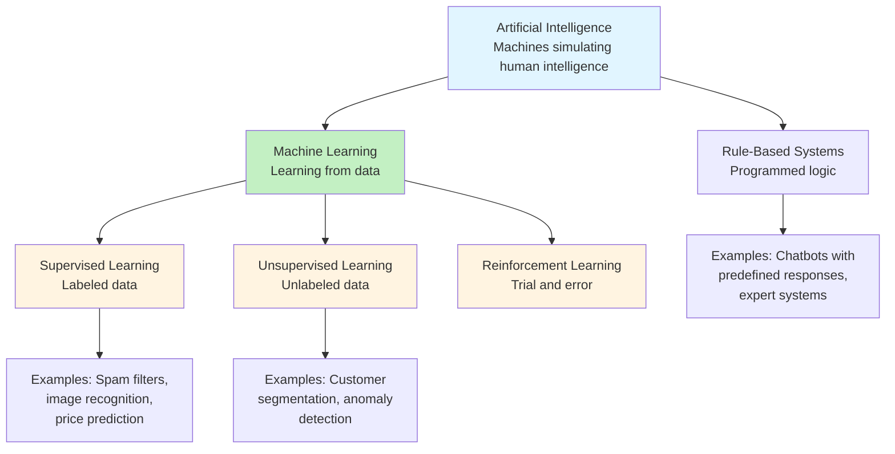
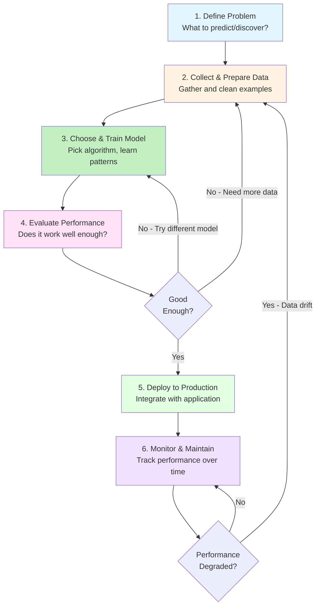
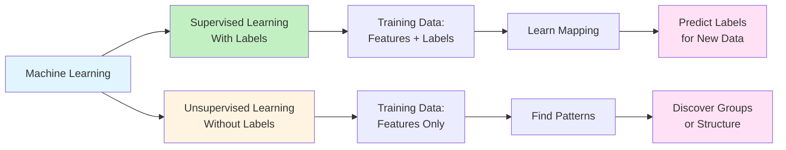
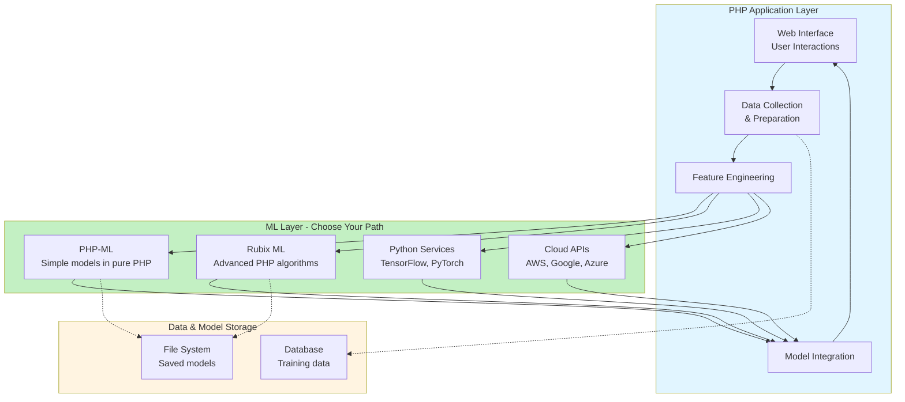

# Chapter 01: Introduction to AI and Machine Learning for PHP Developers

## Overview

Welcome to the first chapter of our series on AI and Machine Learning (ML) tailored specifically for PHP developers. This chapter lays the groundwork by explaining what AI and ML are, why they matter in the context of web development, and how PHP developers can start leveraging these technologies. You'll learn the fundamental concepts and terminology, discover real-world use cases, and understand how PHP fits into the AI/ML ecosystem.

By the end of this chapter, you'll have a clear mental model of what AI and ML actually do, why they're relevant to your work as a web developer, and the different paths available to you for integrating these capabilities into PHP applications.

## Prerequisites

Before starting this chapter, you should have:

- PHP 8.4+ installed and working (from the php-basics series or equivalent experience)
- Comfortable with object-oriented PHP programming (classes, methods, properties)
- Basic familiarity with how web applications work (client-server, HTTP requests/responses)
- Curiosity about data, statistics, and how decisions can be automated
- No prior ML or AI experience required — we'll start from the ground up

**Estimated Time**: ~20 minutes to read; ~30 minutes including exercises and reflection

## What You'll Learn

By the end of this chapter, you will have:

- A clear understanding of what Artificial Intelligence and Machine Learning are (and how they differ)
- Knowledge of five real-world AI/ML use cases relevant to web development
- A mental model of how PHP developers can participate in AI/ML projects
- Awareness of the tools, libraries, and integration points available to you
- A realistic roadmap for your journey from beginner concepts to advanced implementations
- Recognition of when to build vs. integrate vs. collaborate on AI/ML features
- Understanding of supervised vs. unsupervised learning and when each applies
- Knowledge of the ML lifecycle and why it's iterative, not linear
- Awareness of ethical considerations and responsible AI practices from the start
- Clear thinking about when to use (and when NOT to use) machine learning

::: info Code Examples
Complete, runnable examples for this chapter:

- [`quick-start-demo.php`](https://github.com/dalehurley/codewithphp/blob/main/docs/series/ai-ml-php-developers/code/chapter-01/quick-start-demo.php) — Your first ML model in 5 minutes
- [`supervised-example.php`](https://github.com/dalehurley/codewithphp/blob/main/docs/series/ai-ml-php-developers/code/chapter-01/supervised-example.php) — Detailed spam classification demo
- [`unsupervised-example.php`](https://github.com/dalehurley/codewithphp/blob/main/docs/series/ai-ml-php-developers/code/chapter-01/unsupervised-example.php) — Customer segmentation clustering
- [`ml-lifecycle-demo.php`](https://github.com/dalehurley/codewithphp/blob/main/docs/series/ai-ml-php-developers/code/chapter-01/ml-lifecycle-demo.php) — Complete 6-step ML workflow
- [`recommendation-example.php`](https://github.com/dalehurley/codewithphp/blob/main/docs/series/ai-ml-php-developers/code/chapter-01/recommendation-example.php) — Movie recommendation system

All files are in [`docs/series/ai-ml-php-developers/code/chapter-01/`](/series/ai-ml-php-developers/code/chapter-01/README.md)
:::

## Quick Start

Want to see machine learning in action right now? Here's a 5-minute spam classifier that demonstrates supervised learning:

```php
# filename: quick-start-demo.php
<?php

declare(strict_types=1);

require_once __DIR__ . '/vendor/autoload.php';

use Phpml\Classification\KNearestNeighbors;

// Step 1: Prepare training data with labels
$trainingEmails = [
    "WIN FREE MONEY NOW!!!",
    "Meeting scheduled for 2pm",
    "URGENT: Claim your prize",
    "Thanks for the project update",
    "FREE discount! Act fast!",
    "Can we discuss the proposal?",
];

// Extract features: [word_count, exclamation_count, has_free, has_urgent]
$trainingFeatures = [
    [4, 3, 1, 0],  // spam
    [4, 0, 0, 0],  // ham
    [4, 1, 0, 1],  // spam
    [5, 0, 0, 0],  // ham
    [4, 1, 1, 0],  // spam
    [6, 1, 0, 0],  // ham
];

$trainingLabels = ['spam', 'ham', 'spam', 'ham', 'spam', 'ham'];

// Step 2: Train the classifier
$classifier = new KNearestNeighbors(k: 3);
$classifier->train($trainingFeatures, $trainingLabels);

// Step 3: Make predictions on new emails
$newEmails = [
    "FREE gift! Click NOW!!!",
    "See you at the meeting",
];

$newFeatures = [
    [4, 3, 1, 0],  // [word_count, exclamations, has_free, has_urgent]
    [5, 0, 0, 0],
];

foreach ($newEmails as $index => $email) {
    $prediction = $classifier->predict($newFeatures[$index]);
    $icon = $prediction === 'spam' ? '🚫' : '✓';
    echo "{$icon} \"{$email}\" → {$prediction}\n";
}
```

**Run it:**

First, install dependencies (one-time setup):

```bash
cd docs/series/ai-ml-php-developers/code/chapter-01
composer install
```

Then run the example:

```bash
php quick-start-demo.php
```

**Expected output:**

```
🚫 "FREE gift! Click NOW!!!" → spam
✓ "See you at the meeting" → ham
```

**What just happened?** You trained a supervised learning model with labeled examples (spam/ham), extracted numeric features from text, and made predictions on new emails. That's machine learning in 20 lines of PHP!

Now let's understand exactly how this works and when to use these techniques...

## Objectives

By the end of this chapter, you will be able to:

- **Define Artificial Intelligence and Machine Learning with concrete examples** — So you can recognize when ML is actually being used vs. hype
- **Understand the relationship between AI and ML** — To avoid confusion and communicate clearly with others
- **Recognize five real-world use cases for AI/ML in web applications** — To identify opportunities in your own work
- **Distinguish between supervised and unsupervised learning** — To understand what types of problems each solves
- **Explain the ML lifecycle** — To have realistic expectations about the iterative, non-linear process
- **Identify ethical considerations in AI/ML** — To build responsibly from day one
- **Evaluate whether to build, integrate, or collaborate on AI/ML features** — To make smart architectural decisions for your projects
- **Determine when to use (and when NOT to use) machine learning** — To avoid overengineering simple problems
- **Map out a personal learning roadmap for this series** — To understand your progression and stay motivated

## What is Artificial Intelligence and Machine Learning?

**Artificial Intelligence (AI)** refers to the simulation of human intelligence in machines that are programmed to think and learn. It covers a broad range of technologies, including rule-based systems, natural language processing, robotics, and more.

### Example of AI

A chatbot that answers customer support questions is AI. It doesn't necessarily learn from new interactions—it may just follow predefined rules or responses. However, if that chatbot adapts its answers based on user feedback over time, it's now using Machine Learning.

**Machine Learning (ML)** is a subset of AI focused on algorithms that improve automatically through experience. Instead of explicitly programming every rule, ML models learn patterns from data to make predictions or decisions.

### Example of Machine Learning

A spam filter that learns to identify unwanted emails by examining thousands of emails marked as spam by users is ML. The system doesn't have explicit rules like "if sender is X, it's spam." Instead, it learns patterns (unusual sender domains, certain keywords, formatting anomalies) and improves over time as it processes more examples.

### The Relationship Between AI and ML

Think of it this way:

- **AI** is the broad umbrella: "How can machines behave intelligently?"
- **ML** is one answer: "By learning patterns from data instead of being explicitly programmed."

Not all AI uses ML, but all ML is a form of AI.



## Why Should PHP Developers Care About AI/ML?

PHP powers a huge portion of the web, from small blogs to large-scale applications. Integrating AI/ML capabilities can help you:

- **Enhance User Experience:** Personalized recommendations, smarter search, and interactive chatbots.
- **Automate Tasks:** Automate content moderation, spam detection, and data analysis.
- **Add Intelligence:** Image recognition, sentiment analysis, fraud detection, and more.

Even if you don't build AI models yourself, understanding these concepts lets you better integrate third-party AI services or collaborate with data scientists and engineers.

### Why It Works

The key is that PHP's role in modern applications is shifting. Users expect:

- Smart features (recommendations, predictions, autocomplete)
- Personalized experiences (unique for each user)
- Automated moderation (safe communities)

Python dominates in research and data science, but **application development happens in PHP**. By understanding ML concepts, you can:

1. Recognize when ML solves a problem better than traditional logic
2. Know when to build vs. when to use a service
3. Communicate effectively with data scientists
4. Implement simple ML features directly

You don't need to become a data scientist. You need to know enough to make smart engineering decisions.

## The Machine Learning Lifecycle: How It Actually Works

Building an ML feature isn't a straight line. It's an iterative cycle. Understanding this process is crucial for realistic expectations:



### Key Insights About This Process

**It's not linear.** You'll loop back to step 2 or 3 many times. This is normal, not failure.

**Data quality matters more than algorithm choice.** Garbage in = garbage out. A simple algorithm with clean data beats a fancy algorithm with messy data.

**Training ≠ Done.** Even deployed models require ongoing monitoring and retraining as user behavior and data distributions change.

**Monitoring is critical.** A model that worked perfectly in testing can fail in production due to data drift (when real-world data changes over time).

## Ethical Considerations & Responsible AI

As you build ML features, ethical questions will arise. These are important from day one, not afterthoughts:

### Common Ethical Concerns

**Bias & Fairness:** If you train a model on biased historical data, it will perpetuate that bias. Example: a hiring model trained on past hires (which were predominantly male) will discriminate against female candidates.

**Privacy:** Collecting and storing user data for ML creates privacy risks. How do you protect sensitive information? How do users opt out?

**Transparency:** Should users know they're interacting with an ML system? Should they understand why they got a particular recommendation or decision?

**Accountability:** If an ML system makes a harmful decision, who's responsible? Your app? The model? The data?

### Starting with Responsible Practices

- **Know your data source**: Where did it come from? Is it representative or biased?
- **Test for bias**: Evaluate your model's performance across different user groups.
- **Be transparent**: Tell users when they're interacting with an ML feature.
- **Plan for humans**: Keep humans in the loop for high-stakes decisions (hiring, lending, medical).
- **Respect privacy**: Minimize data collection; anonymize when possible; provide opt-out options.

These topics will be explored more deeply in later chapters, but starting with these principles now sets you up for responsible ML development.

## When NOT to Use Machine Learning

Just as important as knowing when to use ML is knowing when to skip it:

### Skip ML If:

- **The problem is deterministic and rules-based**: Email validation (regex works), age check, user permissions (if/else logic is clearer)
- **You don't have enough data**: Most ML needs hundreds or thousands of examples. If you have 10 examples, skip it.
- **The real-world rules are simple**: "Show premium features only to premium users" doesn't need ML.
- **Latency is critical**: Traditional logic is faster than ML inference for simple decisions.
- **You can't explain predictions**: Some use cases (medical, legal) require interpretability. Complex ML models are black boxes.

### Use ML When:

- **Patterns are hard to define explicitly**: "Detect fraud" is vague; rules-based systems miss edge cases.
- **You have sufficient, quality data**: Hundreds or thousands of labeled examples.
- **Accuracy matters more than speed**: Recommending a product can be slightly slow; precision matters.
- **The problem is inherently complex**: Image recognition, sentiment analysis, anomaly detection.

**The real lesson:** Start simple (rules, heuristics), and only add ML when you've proven it solves a real problem better than alternatives.

You now have the conceptual foundation to understand the ML landscape. You know what it is, why it matters, and the realistic process for building it. You're ready to dive deeper into the practical details in the next chapters.

## Types of Machine Learning: Supervised vs. Unsupervised

Before diving deeper, it's important to understand that ML comes in different flavors. This concept will be explored in detail in Chapter 3, but here's the essential idea:



### Supervised Learning

You provide **labeled examples** (input + correct answer), and the model learns to predict answers for new inputs.

**Examples:**

- Email spam filter: You show the system 1,000 emails labeled "spam" or "not spam." It learns patterns and predicts for new emails.
- House price prediction: You provide 500 houses with features (size, location) and their actual sale price. The model learns the relationship.
- Medical diagnosis: You show the system thousands of medical images labeled "healthy" or "disease." It learns to classify new images.

**Why it's common:** This is how most real-world ML works because labeled data maps directly to business outcomes.

### Unsupervised Learning

You provide **unlabeled data**, and the model finds patterns, structure, or groupings on its own.

**Examples:**

- Customer segmentation: Group customers by shopping behavior without predefined categories.
- Anomaly detection: Identify unusual transactions in a dataset without being told "what's unusual."
- Topic discovery: Automatically find themes in a collection of documents without predefined topics.

**Why it matters:** Some problems don't have clear labels. Unsupervised learning discovers hidden patterns.

### The Key Difference

- **Supervised**: You know the answer you want; teach the model to predict it.
- **Unsupervised**: You explore the data to discover something new.

In this series, we'll focus primarily on **supervised learning** because it's more common in web applications and easier to evaluate (you know if your predictions are right).

## Common AI/ML Use Cases in Web Development

Here are some examples where AI/ML can add value:

- **Recommendation Engines:** Suggest products, articles, or media based on user behavior. _(Supervised or Unsupervised)_
- **Chatbots and Virtual Assistants:** Provide 24/7 customer support and automate FAQs. _(Supervised)_
- **Image and Video Tagging:** Automatically categorize and label media content. _(Supervised)_
- **Spam and Fraud Detection:** Identify suspicious activities or content. _(Supervised)_
- **Sentiment Analysis:** Understand user feedback and social media trends. _(Supervised)_

## How Can PHP Participate in AI/ML?

While Python is the dominant language in AI/ML, PHP developers are not left out. Here's how PHP fits in:

- **Implement Simple Algorithms:** For learning or lightweight tasks, PHP can implement basic algorithms like linear regression or k-nearest neighbors.
- **Use PHP ML Libraries:** Libraries like [PHP-ML](https://php-ml.readthedocs.io/en/latest/) and [Rubix ML](https://rubixml.com/) provide tools for data processing, model training, and prediction directly in PHP.
- **Integrate with External Services:** Use PHP to interact with Python scripts, REST APIs, or cloud AI services (AWS, Google Cloud, Azure) for advanced models.
- **Process and Prepare Data:** PHP can handle data collection, cleaning, and feature extraction before feeding it into ML models.



**PHP's Strengths in ML:**

1. **Data Pipeline**: Your existing PHP app already collects user data
2. **Business Logic**: You understand your domain and requirements
3. **Integration**: Easy to add ML predictions to existing workflows
4. **Deployment**: Use your current infrastructure and hosting
5. **Maintenance**: One language for both web app and simple ML

## Overview of What You’ll Learn in This Series

This series will guide you through:

- Understanding core AI/ML concepts and terminology.
- Collecting and preprocessing data using PHP.
- Building and evaluating models such as regression, classification, and clustering.
- Using PHP ML libraries and integrating with Python or TensorFlow.
- Developing real-world projects like spam filters, text classifiers, image recognition, and recommendation systems.
- Best practices for deploying and scaling AI-powered PHP applications.

## Exercises

Test your understanding with these hands-on challenges. Each exercise includes validation criteria so you know when you've completed it successfully.

### Exercise 1: Distinguish AI from ML

**Goal**: Develop the ability to recognize ML in real-world systems

Find three real-world examples (from your own experience or research) and classify each as AI, ML, or both. Explain your reasoning.

**Requirements:**

- Three distinct examples
- Classification for each (AI only, ML only, or both)
- 2-3 sentence explanation for each

**Example Response**:

1. Calculator app: AI (rules-based) but not ML. It follows programmed arithmetic rules but doesn't learn from data.
2. Netflix recommendations: Both AI and ML. It uses ML to learn viewing patterns, making it intelligent through data-driven learning.
3. Spell checker: AI (rules-based dictionary lookup) but traditional versions don't learn from corrections.

**Validation**: You can explain why each example fits its category and identify whether learning from data is involved.

---

### Exercise 2: Use Case Mapping

**Goal**: Understand ML system requirements and trade-offs

Pick one of the five use cases mentioned (Recommendations, Chatbots, Image Tagging, Spam Detection, Sentiment Analysis). Document:

**Requirements:**

- High-level explanation of how it works
- Data requirements (what and how much)
- Stakeholders who benefit
- Potential risks and ethical concerns

**Template**:

```
Use Case: [Your Choice]

How it works:
- [3-5 sentences describing the system]

Data needed:
- Type: [e.g., labeled emails, user clicks, images]
- Quantity: [e.g., thousands of examples]
- Quality requirements: [e.g., must be recent, balanced classes]

Who benefits:
- [List stakeholders and how they benefit]

Risks:
- Privacy: [specific concerns]
- Bias: [potential issues]
- Other: [any other concerns]
```

**Validation**: You can explain the complete system with realistic data requirements and identify at least 2 risks.

---

### Exercise 3: PHP Integration Strategy

**Goal**: Make informed build vs. buy vs. collaborate decisions

Choose a web application you've built or know well. Identify one feature that could be enhanced with AI/ML.

**Requirements:**

- **The Problem**: What user pain point would ML solve?
- **Build vs. Integrate**: Should you build it (using PHP-ML), integrate it (call an API), or collaborate (hire expertise)?
- **Decision Criteria**: What factors influenced your choice? (complexity, budget, timeline, data availability)
- **Data & Risks**: What data would you need? What privacy/ethical concerns exist?

**Example Response**:

```
Application: E-commerce platform

Problem: Users overwhelmed by 10,000+ products, need personalized recommendations

Decision: Integrate with Amazon Personalize API
Reasoning:
- Complexity: Collaborative filtering is too complex for PHP-ML
- Budget: $50-100/month acceptable for 10K users
- Timeline: API integration takes 1 week vs. 2+ months to build
- Data: We have 2 years of purchase history

Data needed: User IDs, product IDs, purchase timestamps
Privacy concerns: Must anonymize data, allow opt-out, comply with GDPR
```

**Validation**: You've made a specific build/integrate/collaborate decision with clear reasoning and identified data requirements and at least one privacy concern.

---

### Exercise 4: Research Task

**Goal**: Familiarize yourself with available PHP ML tools

Visit the [PHP-ML GitHub repository](https://github.com/php-ml/php-ml) or [Rubix ML documentation](https://rubixml.com/). Pick one algorithm or feature and document:

**Requirements:**

- What the algorithm/feature does (100-150 words)
- When and why you'd use it
- A simple web app scenario where it applies

**Example Response**:
"K-Means Clustering groups similar data points without requiring labels. It works by finding cluster centers and assigning each point to the nearest center. Use it when you want to discover natural groupings in your data but don't know what those groups are beforehand. A music streaming platform could use K-Means to find user segments with similar listening patterns—perhaps discovering groups like 'morning workout listeners', 'evening classical fans', or 'all-genre explorers'. Once segments are identified, the platform can create targeted playlists and marketing campaigns for each group."

**Validation**: You've written 100-150 words explaining an algorithm and provided a specific web application scenario.

---

### Exercise 5: Conceptual Deep Dive

**Goal**: Explain ML concepts in simple, jargon-free language

Write a 5-7 sentence explanation (in your own words) of how a spam filter learns to identify spam over time. Explain it as if you're talking to someone who's never heard of machine learning.

**Requirements:**

- 5-7 sentences
- No technical jargon (avoid: "algorithm", "features", "training", "model")
- Use everyday analogies

**Example Response**:
"Imagine showing a friend hundreds of emails and telling them which ones are spam and which are legitimate. Your friend starts noticing patterns: spam emails often have lots of exclamation marks, words like 'FREE' and 'URGENT', and strange sender addresses. After seeing enough examples, your friend can spot new spam emails even ones they've never seen before because they've learned what spam 'looks like'. The computer does the same thing: you show it thousands of labeled examples, it finds patterns, and then applies those patterns to decide if new emails are spam. The more examples it sees, the better it gets at spotting spam."

**Validation**: A non-technical person could understand your explanation and it captures the essence of supervised learning.

---

### Exercise 6: Roadmap Reflection

**Goal**: Plan your learning journey through this series

Based on this chapter and the series outline, create a personalized learning plan.

**Requirements:**

- List 3 topics you're most excited to learn
- List 3 topics that seem challenging
- Rank all 6 by priority for your learning goals (1 = highest priority)
- Write 1 sentence for each explaining why

**Template**:

```
Excited Topics:
1. [Topic] - [Why it excites you]
2. [Topic] - [Why it excites you]
3. [Topic] - [Why it excites you]

Challenging Topics:
1. [Topic] - [Why it seems challenging]
2. [Topic] - [Why it seems challenging]
3. [Topic] - [Why it seems challenging]

Priority Ranking:
1. [Most important for your goals]
2. [Second priority]
...
```

**Validation**: You've identified specific chapters/topics and explained your personal motivation for each.

---

### Exercise 7: Supervised vs. Unsupervised Classification

**Goal**: Apply learning type concepts to real use cases

For each of the five use cases (Recommendations, Chatbots, Image Tagging, Spam Detection, Sentiment Analysis), determine:

**Requirements:**

- Is it supervised or unsupervised learning?
- What labeled data would you need (if supervised)?
- Why is that learning type appropriate?

**Template for each use case**:

```
Use Case: [Name]
Learning Type: Supervised / Unsupervised
Labeled Data Needed: [Describe if supervised]
Why This Type: [2-3 sentences]
```

**Example**:

```
Use Case: Spam Detection
Learning Type: Supervised
Labeled Data Needed: Thousands of emails labeled as "spam" or "ham" (legitimate)
Why This Type: We know what spam is and can provide examples. The model needs to learn the specific patterns that distinguish spam from legitimate email, which requires labeled examples to train on.
```

**Validation**: You've correctly classified all 5 use cases and can justify each choice.

---

### Exercise 8: ML Lifecycle Application

**Goal**: Apply the 6-step ML workflow to a real problem

Pick a real-world problem you understand (e.g., detecting duplicate user accounts, routing support tickets, predicting user churn). Walk through all 6 steps:

**Requirements:**

- **Step 1**: Problem definition (what exactly are you predicting?)
- **Step 2**: Data requirements (what data, how much, where from?)
- **Step 3**: Model selection strategy (which algorithms to try?)
- **Step 4**: Success metrics (how do you know it works?)
- **Step 5**: Deployment challenges (how to integrate?)
- **Step 6**: Monitoring needs (what to track?)

**Template**:

```
Problem: [Describe the problem]

1. Define Problem:
   - Prediction target: [What you're predicting]
   - Success criteria: [When is it good enough?]

2. Data Requirements:
   - Data sources: [Where data comes from]
   - Volume needed: [How many examples]
   - Features: [What information to use]

3. Model Strategy:
   - Algorithms to try: [List 2-3]
   - Why these: [Reasoning]

4. Success Metrics:
   - Primary: [Main metric, e.g., accuracy > 90%]
   - Secondary: [Other metrics to track]

5. Deployment:
   - Integration point: [Where in app?]
   - Response time: [Latency requirement]
   - Challenges: [What could go wrong?]

6. Monitoring:
   - Track: [What to measure]
   - Alerts: [When to retrain?]
   - Feedback loop: [How to improve?]
```

**Validation**: You've thought through all 6 steps with specific, actionable details for each.

---

### Exercise 9: Ethical Audit

**Goal**: Develop critical thinking about AI ethics

Think of an AI/ML system you use regularly (Netflix recommendations, Gmail spam filter, social media feed). Analyze its ethical implications:

**Requirements:**

- Identify one potential bias or fairness issue
- Identify one privacy concern
- Identify one case where humans should stay in the loop
- Suggest how the company could communicate more transparently

**Template**:

```
System: [Name of AI system]

Bias/Fairness Issue:
[Describe the issue and who it might harm]

Privacy Concern:
[What data is collected and why it matters]

Human-in-the-Loop Need:
[When humans should review or override AI decisions]

Transparency Suggestion:
[How to communicate better to users]
```

**Example**:

```
System: Social Media Feed Ranking Algorithm

Bias/Fairness Issue:
The algorithm might amplify sensational or divisive content because it generates more engagement. This creates filter bubbles and can harm users by limiting exposure to diverse viewpoints.

Privacy Concern:
The system tracks every click, like, and scroll to build detailed behavioral profiles. Users often don't realize how much data is collected or how it's used to manipulate their attention.

Human-in-the-Loop Need:
Content moderation decisions should involve humans, especially for edge cases involving political speech, satire, or cultural context that algorithms might misinterpret.

Transparency Suggestion:
Show users a "why am I seeing this?" explanation for each recommended post, allow users to view their behavioral profile, and provide clear opt-out options with meaningful alternatives.
```

**Validation**: You've identified concrete ethical issues with specific examples and provided actionable transparency suggestions.

## Wrap-up

Congratulations! You've completed a comprehensive introduction to AI and Machine Learning in the context of PHP development. Here's what you've accomplished:

- ✓ Defined Artificial Intelligence and Machine Learning with concrete examples
- ✓ Understood the relationship between AI and ML
- ✓ Explored five real-world use cases for AI/ML in web applications
- ✓ Learned the difference between supervised and unsupervised learning
- ✓ Understood the ML lifecycle and why it's iterative, not linear
- ✓ Recognized ethical considerations and responsible AI practices
- ✓ Identified three strategies for PHP developers to participate in AI/ML projects
- ✓ Learned when to use (and when NOT to use) machine learning
- ✓ Examined a concrete PHP code example showing ML integration
- ✓ Mapped out a learning roadmap for this series

You now have a solid conceptual foundation and realistic expectations about building ML features. You understand that ML is a tool, not magic—it requires data, iteration, and ongoing maintenance. You also know when to reach for ML and when to stick with simpler solutions.

More importantly, you're thinking about ML responsibly from day one: considering bias, privacy, transparency, and accountability.

You're ready to move forward into the practical implementation chapters ahead.

### What's Next

In the next chapter, we'll explore the **fundamental concepts of machine learning**, including the types of learning (supervised, unsupervised, reinforcement), how algorithms learn from data, and the typical workflow for building ML models. You'll also learn how to prepare and understand your data—a critical first step in any ML project.

### Quick Recap

**Key Definitions:**

- **AI (Artificial Intelligence)**: Machines programmed to simulate human intelligence; includes rule-based systems and learning algorithms.
- **ML (Machine Learning)**: A subset of AI where systems improve automatically through experience with data.
- **Supervised Learning**: Learning from labeled data (e.g., spam/not spam examples). Used when you know the answer you want to predict.
- **Unsupervised Learning**: Finding patterns in unlabeled data (e.g., customer segmentation). Used when you want to discover hidden structure.
- **Training**: The process of feeding labeled data to an algorithm so it learns patterns and relationships.
- **Model**: The result of training; a mathematical representation of learned patterns.
- **Prediction**: Using a trained model to answer a question about new data.
- **PHP's Role**: Can implement simple algorithms, use ML libraries, integrate with external services, or prepare/process data.

**The ML Lifecycle (6 Steps):**

1. Define the problem
2. Collect & prepare data
3. Choose & train model
4. Evaluate performance
5. Deploy to production
6. Monitor & maintain

**Common Use Cases:**

- Recommendation engines (Netflix, Amazon)
- Chatbots (customer support)
- Spam/fraud detection
- Image tagging and recognition
- Sentiment analysis

**Ethical Principles to Start With:**

- Know your data source and potential biases
- Test model performance across different user groups
- Be transparent about AI/ML usage
- Keep humans in the loop for high-stakes decisions
- Respect user privacy and consent

**When to Use ML:**

- Patterns are hard to define explicitly
- You have sufficient, quality data
- Accuracy matters more than speed
- The problem is inherently complex

**When to Skip ML:**

- Problem is deterministic/rules-based
- Insufficient data (< hundreds of examples)
- Simple rules would be clearer
- Latency is critical
- Predictions must be explainable

**Three Strategies for PHP Developers:**

1. **Build**: Use PHP-ML or Rubix ML for simple models
2. **Integrate**: Connect to Python scripts or REST APIs
3. **Collaborate**: Work with data scientists on complex projects

## Further Reading

To deepen your understanding of the topics covered in this chapter:

- [Artificial Intelligence on Wikipedia](https://en.wikipedia.org/wiki/Artificial_intelligence) — A comprehensive overview of AI history, definitions, and applications across industries
- [Machine Learning Crash Course](https://developers.google.com/machine-learning/crash-course/ml-intro) — Google's beginner-friendly introduction to ML concepts, featuring interactive exercises and clear explanations
- [PHP-ML Documentation](https://php-ml.readthedocs.io/en/latest/) — Official documentation for the PHP-ML library, including algorithm reference, examples, and API details
- [Rubix ML: High-Level Machine Learning for PHP](https://rubixml.com/) — Comprehensive library designed for PHP developers, with tutorials, API reference, and real-world examples
- [What is Machine Learning?](https://www.ibm.com/cloud/learn/machine-learning) — IBM's clear guide explaining ML concepts, learning types, and practical applications
- [The Difference Between AI and Machine Learning](https://www.coursera.org/articles/ai-vs-machine-learning) — Coursera's article clarifying AI vs. ML with examples and addressing common misconceptions
- [AI for Everyone](https://www.coursera.org/learn/ai-for-everyone) — Andrew Ng's beginner course providing accessible explanations of ML, deep learning, and data science fundamentals
- [PHP and Python Integration for ML](https://www.php.net/manual/en/function.shell-exec.php) — Reference for executing external scripts from PHP to leverage Python ML libraries

## Knowledge Check

Test your understanding of AI and Machine Learning fundamentals:

<Quiz
title="Chapter 01 Quiz: Introduction to AI and Machine Learning for PHP Developers"
:questions="[
{
question: 'What is the primary difference between Artificial Intelligence and Machine Learning?',
options: [
{ text: 'AI is a broad field that includes ML as one approach; ML specifically learns from data without explicit programming', correct: true, explanation: 'AI is the umbrella term for machines simulating intelligence. ML is one method: learning patterns from data automatically.' },
{ text: 'AI and Machine Learning are the same thing', correct: false, explanation: 'ML is a subset of AI. All ML is AI, but not all AI uses machine learning.' },
{ text: 'AI is used for chatbots; ML is used for image recognition', correct: false, explanation: 'Both AI and ML can be used for either task. The distinction is about how they work, not what they do.' },
{ text: 'ML requires more data than AI', correct: false, explanation: 'While ML often works better with more data, the key difference is that ML learns patterns whereas AI uses predefined rules.' }
]
},
{
question: 'Which of the following is an example of Machine Learning (not just AI)?',
options: [
{ text: 'A spam filter that learns to identify spam by analyzing thousands of user-marked emails', correct: true, explanation: 'This is ML because the system learns patterns from data and improves over time, rather than using predefined rules.' },
{ text: 'A calculator that performs arithmetic based on programmed rules', correct: false, explanation: 'This is rule-based AI but not ML, because it does not learn from data.' },
{ text: 'A chatbot with predefined responses for common questions', correct: false, explanation: 'Without learning from user interactions, this is rule-based AI but not ML.' },
{ text: 'A traffic light system that switches colors on a timer', correct: false, explanation: 'This is programmed logic, not AI or ML.' }
]
},
{
question: 'In which ways can PHP developers contribute to Machine Learning projects? (Multiple answers are correct)',
options: [
{ text: 'Implement simple algorithms using PHP-ML or Rubix ML libraries for lightweight tasks', correct: true, explanation: 'PHP libraries enable direct ML model building, training, and prediction for tasks like spam filtering or classification.' },
{ text: 'Integrate with external Python scripts or cloud APIs (AWS, Google Cloud) for advanced models', correct: true, explanation: 'PHP orchestrates ML workflows by calling Python services or managed AI APIs when specialized models are needed.' },
{ text: 'Collect, clean, and prepare data before it goes into ML models', correct: true, explanation: 'Data collection, validation, and feature engineering are critical PHP developer roles in the ML pipeline.' },
{ text: 'Deploy and monitor ML models in production, handling predictions and retraining', correct: true, explanation: 'PHP applications serve ML predictions to users and must track model performance over time.' }
]
},
{
question: 'Which of these is a real-world use case for AI/ML in web development?',
options: [
{ text: 'E-commerce sites recommending products based on browsing history and purchase behavior', correct: true, explanation: 'Recommendations are a common ML use case that improve user experience and increase sales.' },
{ text: 'Detecting and filtering spam emails or fraudulent transactions', correct: true, explanation: 'Spam and fraud detection are classic supervised ML problems that protect users and platforms.' },
{ text: 'Analyzing sentiment in user reviews and social media to understand customer opinions', correct: true, explanation: 'Sentiment analysis is an NLP task that helps businesses understand feedback at scale.' },
{ text: 'All of the above', correct: true, explanation: 'All three are legitimate, high-impact use cases for AI/ML in modern web applications.' }
]
},
{
question: 'When is it better to build an ML feature in PHP rather than integrate with an external service?',
options: [
{ text: 'When you have a simple, well-understood problem and want full control over the model and data', correct: true, explanation: 'Building in PHP is ideal for lightweight tasks where you own the data and avoid external dependencies.' },
{ text: 'When you need state-of-the-art models (like GPT-4) or specialized algorithms (like advanced image recognition)', correct: false, explanation: 'For advanced models, integration with specialized services is better because they are optimized and battle-tested.' },
{ text: 'When you have strict latency requirements and need sub-millisecond predictions on large data volumes', correct: false, explanation: 'For strict performance requirements at scale, specialized services or languages may be more suitable.' },
{ text: 'When your team has no prior experience with ML or PHP', correct: false, explanation: 'This scenario calls for collaboration with experts or integration with managed services.' }
]
},
{
question: 'What is the difference between supervised and unsupervised learning?',
options: [
{ text: 'Supervised learning uses labeled data (input + correct answer); unsupervised learning finds patterns in unlabeled data', correct: true, explanation: 'This is the fundamental distinction. Supervised = you know the answer. Unsupervised = you explore to discover structure.' },
{ text: 'Supervised is faster; unsupervised is more accurate', correct: false, explanation: 'Speed and accuracy depend on the specific algorithm and data, not whether learning is supervised or unsupervised.' },
{ text: 'Supervised is for PHP; unsupervised is for Python', correct: false, explanation: 'Both types of learning can be implemented in any language, including PHP.' },
{ text: 'Supervised requires deep learning; unsupervised uses traditional algorithms', correct: false, explanation: 'Both supervised and unsupervised can use deep learning or traditional algorithms.' }
]
},
{
question: 'Which statement best describes the ML lifecycle?',
options: [
{ text: 'It is iterative and non-linear; you often loop back to earlier steps when results are unsatisfactory', correct: true, explanation: 'The ML lifecycle is not a straight line. Looping back to data collection or model selection is normal and expected.' },
{ text: 'It is linear: define problem → collect data → train → deploy → done', correct: false, explanation: 'While these are the general steps, real ML projects loop back frequently. Deployment is not done; monitoring is ongoing.' },
{ text: 'Training is the longest phase; everything else is quick', correct: false, explanation: 'Data collection and preparation often take longer than training. Monitoring and maintenance are ongoing.' },
{ text: 'Once deployed, you do not need to update or retrain the model', correct: false, explanation: 'Models require ongoing monitoring and retraining as user behavior and data distributions change over time.' }
]
},
{
question: 'Why is data quality often more important than algorithm choice in ML projects?',
options: [
{ text: 'A simple algorithm trained on clean, relevant data outperforms a complex algorithm on messy, biased data', correct: true, explanation: 'This is a fundamental principle: garbage in, garbage out. Data quality trumps algorithmic sophistication.' },
{ text: 'Algorithms are less important than marketing', correct: false, explanation: 'Algorithm choice matters, but it is secondary to data quality for model performance.' },
{ text: 'Data quality only matters if you use PHP-ML', correct: false, explanation: 'Data quality is universally important in ML, regardless of library or language.' },
{ text: 'Complex algorithms automatically handle noisy, biased data', correct: false, explanation: 'No algorithm can fix inherently bad data. Garbage in = garbage out, always.' }
]
},
{
question: 'Which of the following is a valid ethical concern when building ML systems? (Multiple answers are correct)',
options: [
{ text: 'Bias and fairness: models trained on biased historical data will perpetuate discrimination', correct: true, explanation: 'This is a real and serious concern. Historical hiring data, loan data, etc., often contain systemic bias.' },
{ text: 'Privacy: collecting and storing user data for ML creates risks and privacy obligations', correct: true, explanation: 'ML systems often require large amounts of personal data. Privacy protection and user consent are essential.' },
{ text: 'Transparency: users should understand when they are interacting with an ML system', correct: true, explanation: 'Users have a right to know they are using AI/ML. Transparency builds trust and accountability.' },
{ text: 'Accountability: someone must be responsible if an ML system makes a harmful decision', correct: true, explanation: 'High-stakes decisions (hiring, lending, medical) require clear accountability and often human oversight.' }
]
},
{
question: 'When should you NOT use machine learning?',
options: [
{ text: 'The problem is deterministic and rules-based (e.g., email validation, user permissions)', correct: true, explanation: 'Simple if/else or regex logic is clearer, faster, and more maintainable than ML for deterministic problems.' },
{ text: 'You have insufficient data (fewer than hundreds of labeled examples)', correct: true, explanation: 'Most ML algorithms need hundreds or thousands of examples to learn meaningful patterns.' },
{ text: 'Latency is critical and real-time predictions are required', correct: true, explanation: 'Traditional logic is faster than ML inference. Use ML only if accuracy is worth the latency cost.' },
{ text: 'Predictions must be explainable or interpretable', correct: true, explanation: 'Complex ML models are often black boxes. For high-stakes decisions, you need interpretability.' }
]
}
]"
/>

## Further Exploration

If you're eager to start coding, here are some optional, hands-on next steps with clear success criteria:

1. **Install PHP-ML and explore its structure** (~15 minutes)

   - Run `composer require php-ml/php-ml` in a test project
   - Browse the `vendor/php-ml` directory
   - Read the README and identify 3 algorithms you might use
   - **Success**: You can list at least 3 algorithms and describe what they do

2. **Explore a real dataset** (~20 minutes)

   - Download the Iris dataset from [UCI Machine Learning Repository](https://archive.ics.uci.edu/ml/)
   - Open the CSV file in a spreadsheet or text editor
   - Spend 10 minutes understanding: How many rows? What do columns represent? What are the values?
   - **Success**: You can explain what the dataset measures and why it's commonly used for learning ML

3. **Read one real-world ML case study** (~15 minutes)

   - Find a blog post about how a company (Netflix, Spotify, GitHub, Shopify, etc.) uses ML
   - Note: (1) What business problem did they solve? (2) What data did they use? (3) What was the outcome?
   - **Success**: You can write 2-3 sentences explaining a real company's ML use case

4. **Participate in the PHP developer community** (ongoing)
   - Star the [PHP-ML GitHub repository](https://github.com/php-ml/php-ml)
   - Check out 2-3 recent discussions or issues
   - Join the [PHP community Slack](https://phpcommunity.org/) or find a PHP subreddit
   - **Success**: You're connected to resources and can ask questions when you get stuck

## Common Misconceptions & Troubleshooting

As you begin your AI/ML journey, here are some common misunderstandings and how to navigate them:

### "I need to be a math expert to learn ML"

**Reality**: While understanding statistics and linear algebra helps, you don't need advanced math knowledge to start. Most libraries and frameworks handle complex calculations for you. Focus on understanding _concepts_ and _when_ to apply them; deep math comes later if needed.

### "ML is always better than traditional rules-based logic"

**Reality**: Not every problem needs ML. A simple regex pattern for email validation works better than an ML model. Use ML when: (1) the problem is complex, (2) you have enough data, and (3) rules are hard to define explicitly. Otherwise, keep it simple.

### "PHP can't do 'real' ML"

**Reality**: PHP can absolutely do ML for many tasks. Libraries like PHP-ML and Rubix ML are production-ready for classification, regression, and clustering. For cutting-edge deep learning research, Python dominates. But for business logic, recommendations, and data processing in PHP applications, you have solid tools.

### "I must collect massive datasets to train models"

**Reality**: Start small. Many effective models train on thousands or even hundreds of examples. As your ML skills grow, you'll learn how to work with limited data and improve quality. "Bigger is better" is a common trap; focus on _clean, relevant_ data first.

### "Once I build a model, I'm done"

**Reality**: Models require ongoing monitoring and retraining. User behavior changes, data distributions shift, and performance degrades over time. Plan for maintenance from the start.

## Why This Matters: A Simple PHP + AI Example

Here's a concrete scenario showing how PHP developers participate in ML. This recommendation system demonstrates all the roles PHP plays in the ML lifecycle.

### Goal

Show how a PHP web application orchestrates an entire machine learning workflow for movie recommendations.

### The Complete Flow

```mermaid
sequenceDiagram
    participant User
    participant PHP App
    participant Database
    participant ML Model

    User->>PHP App: Browse movies
    PHP App->>Database: Collect viewing patterns
    Database-->>PHP App: User behavior data
    PHP App->>PHP App: Prepare features
    PHP App->>ML Model: Train classifier
    ML Model-->>PHP App: Trained model
    User->>PHP App: Request recommendations
    PHP App->>ML Model: Predict user type
    ML Model-->>PHP App: "action_lover"
    PHP App->>Database: Query action movies
    Database-->>PHP App: Movie list
    PHP App-->>User: Show recommendations

    style PHP App fill:#e1f5ff
    style ML Model fill:#c3f0c3
```

### The Code

Run the complete example:

```bash
cd docs/series/ai-ml-php-developers/code/chapter-01
php recommendation-example.php
```

Here's the core concept (excerpt from [`recommendation-example.php`](https://github.com/dalehurley/codewithphp/blob/main/docs/series/ai-ml-php-developers/code/chapter-01/recommendation-example.php)):

```php
# filename: recommendation-example.php (excerpt)
<?php

use Phpml\Classification\KNearestNeighbors;

// User viewing patterns: [action, comedy, drama, romance]
$trainingData = [
    [1, 0, 1, 0],  // user watched: action and drama
    [1, 0, 1, 0],  // similar pattern - action lover
    [0, 1, 0, 1],  // user watched: comedy and romance
    [0, 1, 0, 1],  // similar pattern - romance fan
];

$labels = ['action_lover', 'action_lover', 'romance_fan', 'romance_fan'];

// Train a simple classifier
$classifier = new KNearestNeighbors(k: 2);
$classifier->train($trainingData, $labels);

// New user's viewing pattern
$newUser = [1, 0, 1, 0];
$prediction = $classifier->predict($newUser);

echo "This user is likely: $prediction"; // Output: "action_lover"
```

### Expected Result

```
User: Alice
  Viewing pattern: Action, Drama
  Predicted type: action_lover
  📺 Recommendations: Mad Max, John Wick, Die Hard
```

### Why This Works

**Your PHP Developer Roles:**

1. **Data Collection** — Your web app tracks what users watch
2. **Data Preparation** — PHP transforms viewing history to numeric features
3. **Model Training** — PHP-ML library trains the classifier
4. **Deployment** — Model runs in your existing PHP infrastructure
5. **Serving Predictions** — PHP generates recommendations on each request
6. **Monitoring** — PHP logs which recommendations users click
7. **Retraining** — PHP script periodically updates the model

This is a simple k-nearest neighbors classifier, but the pattern is the same for more complex models. **Your PHP application is the orchestrator** — it controls data, training, deployment, and monitoring.

### Troubleshooting

- **Predictions seem random** — This toy example has only 4 training samples. Real systems need hundreds or thousands of examples.
- **How to scale this?** — Cache trained models, use background jobs for training, consider Redis for feature storage.
- **When to use Python instead?** — For complex collaborative filtering or deep learning models, Python + REST API may be better.

---

## Next Steps

You now have a solid conceptual foundation in AI and ML. In the next chapter, we'll explore core ML concepts (supervised vs. unsupervised learning, training vs. testing data) and see how to prepare your first dataset.

Let's continue this exciting journey of bringing AI and Machine Learning into your PHP development toolkit!
