# Chapter 02: Setting Up Your AI Development Environment

## Overview

In Chapter 01, you learned what AI and Machine Learning are, why they matter for PHP developers, and how PHP fits into the AI/ML ecosystem. Now it's time to prepare your development environment so you can start building working AI/ML projects.

A proper development environment is critical for AI/ML work. Unlike traditional web development where you might get away with a basic PHP installation, AI/ML projects require specific libraries, extensions, and tools. You'll need a modern PHP version (8.4+), dependency management with Composer, specialized ML libraries, and optionally Python for advanced tasks in later chapters.

This chapter guides you through installing and configuring everything you need. By the end, you'll have a verified, working environment ready to build your first machine learning models. You'll create a verification script that confirms all components are installed correctly, ensuring you won't encounter frustrating "missing dependency" errors when you start coding in Chapter 03.

Think of this chapter as setting up your workshop. You're gathering the tools you'll use throughout this series. Take your time, follow each step carefully, and verify everything works before moving forward.

## System Requirements

Before you begin, ensure your system meets these minimum requirements:

### Hardware Requirements

- **Processor**: 1.5 GHz or faster (2+ GHz recommended for ML tasks)
- **RAM**: 4 GB minimum (8 GB recommended for ML libraries)
- **Disk Space**: 2-5 GB free space for PHP, Composer, libraries, and datasets
- **Network**: Internet connection for downloading packages and dependencies

### Operating System Support

**✅ Fully Supported:**

- **macOS**: 12.0 (Monterey) or newer
- **Ubuntu Linux**: 20.04 LTS or newer
- **Windows**: 10 version 2004 or newer, Windows 11

**⚠️ Limited Support:**

- **Other Linux distributions**: May require manual package management
- **Windows Server**: Should work but not extensively tested
- **Older macOS versions**: May need additional setup steps

### Software Prerequisites

- **Command Line Access**: Terminal (macOS/Linux) or Command Prompt/PowerShell (Windows)
- **Package Manager**: Homebrew (macOS), apt (Ubuntu/Debian), or manual downloads (Windows)
- **Text Editor**: Any editor that can save plain text files (VS Code recommended)

::: tip
If you're new to command-line tools, don't worry! This chapter provides specific commands for each platform. Copy and paste them exactly as shown.
:::

### Environment Architecture

Here's what you'll be setting up:


## Prerequisites

Before starting this chapter, you should have:

- Completion of [Chapter 01](/series/ai-ml-php-developers/chapters/01-introduction-to-ai-and-machine-learning-for-php-developers) or equivalent understanding of AI/ML concepts
- Basic familiarity with the command line (navigating directories, running commands)
- Administrator or sudo access on your computer to install software
- Internet connection for downloading packages and dependencies
- Approximately 2-5 GB of free disk space for software and libraries
- A text editor or IDE (VS Code, PhpStorm, Sublime Text, or similar)

**Estimated Time**: ~45-60 minutes (depending on your current setup and internet speed)

## What You'll Build

By the end of this chapter, you will have created:

- A verified PHP 8.4+ installation with required extensions
- Composer dependency manager installed and configured
- A project directory structure for AI/ML experiments
- PHP-ML library installed and tested with a working example
- Rubix ML library installed and tested with a working example
- A comprehensive environment verification script (`verify-installation.php`) that checks all dependencies
- Optional: Python 3.10+ installation for advanced chapters
- Optional: IDE configuration with PHP and ML development extensions

You'll run actual code examples that prove your environment works, giving you confidence to proceed with the rest of the series.

::: info Code Examples
Complete, runnable verification scripts for this chapter:

- [`quick-start-verify.php`](/series/ai-ml-php-developers/code/chapter-02/quick-start-verify.php) — 2-minute environment check
- [`verify-installation.php`](/series/ai-ml-php-developers/code/chapter-02/verify-installation.php) — Comprehensive 10+ check verification
- [`composer-setup-check.php`](/series/ai-ml-php-developers/code/chapter-02/composer-setup-check.php) — Composer installation verification
- [`extension-checker.php`](/series/ai-ml-php-developers/code/chapter-02/extension-checker.php) — Detailed extension analysis
- [`test-phpml.php`](/series/ai-ml-php-developers/code/chapter-02/test-phpml.php) — PHP-ML library test
- [`test-rubixml.php`](/series/ai-ml-php-developers/code/chapter-02/test-rubixml.php) — Rubix ML library test

All files are in [`docs/series/ai-ml-php-developers/code/chapter-02/`](/series/ai-ml-php-developers/code/chapter-02/README.md)
:::

## Quick Start

Want to verify your environment right now? Here's a 2-minute quick check:

```php
# filename: quick-start-verify.php
<?php

declare(strict_types=1);

echo "\n⚡ Quick Environment Check\n";
echo "==========================\n\n";

// Check 1: PHP Version
echo "1. PHP Version... ";
$versionOk = version_compare(PHP_VERSION, '8.4.0', '>=');
echo $versionOk ? "✅ " . PHP_VERSION : "❌ " . PHP_VERSION . " (need 8.4+)";
echo "\n";

// Check 2: Critical Extensions
echo "2. Critical Extensions...\n";
foreach (['json', 'mbstring', 'curl'] as $ext) {
    echo "   {$ext}... ";
    echo extension_loaded($ext) ? "✅\n" : "❌\n";
}

// Check 3: Composer
echo "3. Composer... ";
exec('composer --version 2>&1', $output, $code);
echo $code === 0 ? "✅ Installed\n" : "❌ Not found\n";

echo "\n==========================\n";
if ($versionOk && extension_loaded('json') && $code === 0) {
    echo "🎉 Basic checks passed!\n";
    echo "Run the full verification:\n";
    echo "  php verify-installation.php\n\n";
} else {
    echo "⚠️  Some issues found.\n";
    echo "See Chapter 2 for fixes.\n\n";
}
```

**Run it:**

```bash
cd docs/series/ai-ml-php-developers/code/chapter-02
php quick-start-verify.php
```

**Expected output:**

```
⚡ Quick Environment Check
==========================

1. PHP Version... ✅ 8.4.0
2. Critical Extensions...
   json... ✅
   mbstring... ✅
   curl... ✅
3. Composer... ✅ Installed

==========================
🎉 Basic checks passed!
Run the full verification:
  php verify-installation.php
```

**What just happened?** You verified the three most critical components: PHP 8.4, essential extensions, and Composer. If all passed, you're ready for the detailed setup!

Now let's walk through the complete environment setup step by step...

## Objectives

By the end of this chapter, you will be able to:

- **Install and verify PHP 8.4** with required extensions for AI/ML work
- **Set up Composer** and use it to manage PHP dependencies
- **Install PHP-ML and Rubix ML libraries** and understand when to use each
- **Create and run verification scripts** to confirm your environment is correctly configured
- **Structure a PHP project** for machine learning experiments
- **Configure your IDE or text editor** with helpful extensions for PHP and ML development
- **Optionally install Python 3.10+** for integration with advanced ML libraries in later chapters
- **Troubleshoot common installation issues** on macOS, Linux, and Windows

### Installation Workflow Overview

Follow this sequence for a smooth setup:

```mermaid
flowchart LR
    A[1. Install PHP 8.4] --> B[2. Install Composer]
    B --> C[3. Create Project]
    C --> D[4. Install PHP-ML]
    D --> E[5. Install Rubix ML]
    E --> F[6. Verify Everything]
    F --> G{All Checks<br/>Pass?}
    G -->|Yes| H[7. Optional: Python]
    G -->|No| I[Troubleshoot]
    I --> J{Fixed?}
    J -->|Yes| F
    J -->|No| K[Check Chapter 2<br/>Troubleshooting]
    H --> L[8. IDE Setup]
    L --> M[✅ Ready for<br/>Chapter 3!]

    style A fill:#e1f5ff
    style B fill:#e1f5ff
    style C fill:#c3f0c3
    style D fill:#c3f0c3
    style E fill:#c3f0c3
    style F fill:#ffe1f5
    style H fill:#fff4e1
    style L fill:#fff4e1
    style M fill:#c3f0c3
```



## Step 1: Verify or Install PHP 8.4 (~10 min)

### Goal

Confirm you have PHP 8.4 or newer installed with the required extensions for machine learning work.

### Actions

1. **Check your current PHP version**:

```bash
# Check PHP version
php --version
```

You should see output like:

```
PHP 8.4.0 (cli) (built: Nov 21 2024 12:00:00) ( NTS )
Copyright (c) The PHP Group
Zend Engine v4.4.0, Copyright (c) Zend Technologies
```

2. **If you don't have PHP 8.4+, install it**:

**macOS** (using Homebrew):

```bash
# Install Homebrew if you don't have it
/bin/bash -c "$(curl -fsSL https://raw.githubusercontent.com/Homebrew/install/HEAD/install.sh)"

# Install PHP 8.4
brew install php@8.4

# Link it to be the default PHP
brew link php@8.4 --force --overwrite
```

**Ubuntu/Debian Linux**:

```bash
# Add the Ondřej Surý PPA for PHP 8.4
sudo add-apt-repository ppa:ondrej/php
sudo apt update

# Install PHP 8.4 and common extensions
sudo apt install php8.4 php8.4-cli php8.4-common php8.4-mbstring php8.4-dom php8.4-curl php8.4-zip
```

**Windows**:

1. Download PHP 8.4 from [windows.php.net/download](https://windows.php.net/download/)
2. Extract to `C:\php84`
3. Add `C:\php84` to your system PATH environment variable:
   - Open System Properties → Advanced → Environment Variables
   - Add `C:\php84` to the PATH variable
   - Restart Command Prompt
4. Verify installation:

```cmd
php --version
```

::: warning
On Windows, you may need to restart your terminal or computer after adding PHP to PATH before the `php` command is recognized.
:::

3. **Verify required extensions are installed**:

```bash
# Check for required extensions
php -m | grep -E 'json|mbstring|curl'
```

**macOS/Linux expected output** (these should all appear):

```
curl
json
mbstring
```

**Windows note**: On Windows, you may need to use `findstr` instead of `grep`:

```cmd
php -m | findstr "json mbstring curl"
```

Expected output (these should all appear):

```
curl
json
mbstring
```

4. **If any extensions are missing**, install them:

**macOS** (Homebrew usually includes these by default)

**Ubuntu/Debian**:

```bash
# Install missing extensions (adjust package names as needed)
sudo apt install php8.4-mbstring php8.4-dom php8.4-curl php8.4-zip
```

**Windows**: Edit `php.ini` (in your PHP directory) and uncomment extension lines:

```ini
extension=curl
extension=mbstring
extension=openssl
```

### Expected Result

Running `php --version` shows PHP 8.4.x, and `php -m` lists json, mbstring, dom, curl, and zip among the installed extensions.

### Why It Works

PHP 8.4 is required for this series because it includes modern features like property hooks, asymmetric visibility, and performance improvements. The extensions we verified are essential:

- **json**: For working with data in JSON format (common in ML datasets and APIs)
- **mbstring**: For handling multi-byte strings (important for NLP and international text)
- **dom**: For parsing and manipulating XML/HTML data sources (replaces older xml extension)
- **curl**: For making HTTP requests to external ML APIs and services
- **zip**: For reading compressed data files (common in ML datasets)

### Troubleshooting

- **Error: "php: command not found"** — PHP is not installed or not in your system PATH. Follow the installation steps above for your operating system.

- **PHP version is 7.4 or 8.0-8.3** — You have an older PHP version. Follow the installation steps to upgrade. On macOS, you may need to unlink the old version first: `brew unlink php@8.3 && brew link php@8.4`

- **Extensions not showing with `php -m`** — The extensions are not enabled. On Linux, run `sudo apt install php8.4-<extension>`. On Windows, edit `php.ini` and uncomment the extension lines. Restart your terminal after changes.

## Step 2: Install Composer (~5 min)

### Goal

Install Composer, PHP's dependency manager, which we'll use to install machine learning libraries.

### Actions

1. **Check if Composer is already installed**:

```bash
# Check Composer version
composer --version
```

If you see output like `Composer version 2.7.x`, you're set. Skip to Step 3.

2. **If Composer is not installed, install it**:

**macOS/Linux**:

```bash
# Download and run the Composer installer
php -r "copy('https://getcomposer.org/installer', 'composer-setup.php');"
php composer-setup.php
php -r "unlink('composer-setup.php');"

# Move Composer to a globally accessible location
sudo mv composer.phar /usr/local/bin/composer

# Verify installation
composer --version
```

**Windows**:

- Download and run [Composer-Setup.exe](https://getcomposer.org/Composer-Setup.exe)
- The installer will detect your PHP installation and configure everything
- Verify in a new Command Prompt: `composer --version`

3. **Configure Composer memory limit** (optional but recommended for ML libraries):

```bash
# Increase Composer memory limit to avoid issues with large dependencies
export COMPOSER_MEMORY_LIMIT=-1
```

Add this line to your `~/.bashrc`, `~/.zshrc`, or equivalent shell configuration file to make it permanent.

### Expected Result

Running `composer --version` displays Composer version 2.7.x or newer.

### Why It Works

Composer is the standard dependency manager for PHP. It downloads libraries from Packagist (the PHP package repository) and manages version conflicts automatically. ML libraries like PHP-ML and Rubix ML are distributed via Composer, making installation and updates straightforward.

The memory limit configuration prevents Composer from running out of memory when downloading large ML libraries with many dependencies.

### Troubleshooting

- **Error: "Failed to open stream: HTTP request failed"** — Network or firewall issue. Check your internet connection. On corporate networks, you may need to configure a proxy.

- **Error: "Allowed memory size exhausted"** — Composer ran out of memory. Set the environment variable as shown above: `export COMPOSER_MEMORY_LIMIT=-1`

- **Windows: "composer: command not found"** — The installer didn't add Composer to PATH. Add `C:\ProgramData\ComposerSetup\bin` to your system PATH manually, then restart your terminal.

## Step 3: Create Project Structure (~5 min)

### Goal

Set up a dedicated directory for AI/ML experiments with a proper structure.

### Actions

1. **Create a project directory**:

```bash
# Create and navigate to your AI/ML workspace
mkdir ~/aiml-php-workspace
cd ~/aiml-php-workspace
```

2. **Initialize a Composer project**:

```bash
# Create a composer.json file
composer init --name="your-name/aiml-experiments" --type=project --no-interaction
```

3. **Configure autoloading** by editing `composer.json`:

```bash
# Open composer.json in your text editor
```

Add an `autoload` section:

```json
{
  "name": "your-name/aiml-experiments",
  "type": "project",
  "require": {},
  "autoload": {
    "psr-4": {
      "AiMl\\": "src/"
    }
  }
}
```

4. **Create directory structure**:

```bash
# Create directories for organized code
mkdir -p src tests data models
```

Your structure should look like:

```
aiml-php-workspace/
├── composer.json
├── src/           # Your PHP classes
├── tests/         # Test files
├── data/          # Datasets and CSV files
└── models/        # Trained ML models
```

### Expected Result

You have a directory with `composer.json` and organized subdirectories for code, tests, data, and models.

### Why It Works

This structure follows PHP best practices and sets you up for success:

- **src/**: Contains your PHP classes, following PSR-4 autoloading standards
- **tests/**: Unit and integration tests for your ML code
- **data/**: Store CSV files, JSON datasets, and training data
- **models/**: Save trained ML models for reuse without retraining

Proper structure makes it easier to find files, collaborate with others, and maintain your code as projects grow.

### Troubleshooting

- **Error: "composer init failed"** — You may not have write permissions in the directory. Try `sudo` on Linux/macOS or run Command Prompt as Administrator on Windows.

- **Directory already exists** — If `~/aiml-php-workspace` exists, either remove it (`rm -rf ~/aiml-php-workspace`) or choose a different directory name.

## Step 4: Install PHP-ML Library (~5 min)

### Goal

Install PHP-ML, a pure PHP machine learning library with no external dependencies.

### Actions

1. **Install PHP-ML via Composer**:

```bash
# From your aiml-php-workspace directory
composer require php-ai/php-ml
```

You'll see Composer downloading the library and its dependencies:

```
Using version ^0.10.0 for php-ai/php-ml
./composer.json has been updated
Loading composer repositories with package information
Updating dependencies
...
```

2. **Verify installation**:

```bash
# Check that PHP-ML is listed in composer.json
cat composer.json
```

You should see:

```json
"require": {
    "php-ai/php-ml": "^0.10.0"
}
```

3. **Test PHP-ML with a simple example**:

Create `test-phpml.php`:

```php
# filename: test-phpml.php
<?php

require __DIR__ . '/vendor/autoload.php';

use Phpml\Classification\KNearestNeighbors;

// Simple training data: [height, weight] -> 'tall' or 'short'
$samples = [
    [180, 75],  // tall person
    [175, 70],  // tall person
    [160, 55],  // short person
    [155, 50],  // short person
];

$labels = ['tall', 'tall', 'short', 'short'];

// Train a classifier
$classifier = new KNearestNeighbors();
$classifier->train($samples, $labels);

// Predict for a new person
$prediction = $classifier->predict([170, 65]);

echo "PHP-ML is working! Prediction: $prediction\n";
// Expected output: "PHP-ML is working! Prediction: tall"
```

4. **Run the test**:

```bash
# Execute the test script
php test-phpml.php
```

### Expected Result

```
PHP-ML is working! Prediction: tall
```

### Why It Works

PHP-ML is a pure PHP implementation of machine learning algorithms. It's perfect for learning ML concepts and building lightweight classifiers, regressors, and clustering models without external dependencies. The k-nearest neighbors algorithm we tested classifies data by finding the "k" closest training examples.

This library is ideal for:

- Learning ML fundamentals
- Small to medium datasets
- Simple classification and regression tasks
- Projects where you want to avoid Python dependencies

### Troubleshooting

- **Error: "Class 'Phpml\Classification\KNearestNeighbors' not found"** — Autoloading isn't working. Run `composer dump-autoload` to regenerate autoload files.

- **Error: "require(vendor/autoload.php): failed to open stream"** — You're not in the right directory or didn't run `composer install`. Navigate to `~/aiml-php-workspace` and run `composer install`.

- **Warning about PHP version** — PHP-ML requires PHP 7.2+, but you should be using 8.4. If you see this warning, verify your PHP version with `php --version`.

## Step 5: Install Rubix ML Library (~5 min)

### Goal

Install Rubix ML, a more comprehensive machine learning library for PHP with 40+ algorithms.

### Actions

1. **Install Rubix ML and its extension**:

```bash
# Install Rubix ML core library
composer require rubix/ml

# Install the Tensor extension for better performance (optional but recommended)
composer require rubix/tensor
```

::: info
The Tensor extension provides optimized mathematical operations for ML. If you encounter issues installing it, you can skip it for now—Rubix ML will fall back to pure PHP implementations.
:::

2. **Verify installation**:

```bash
# Check installed packages
composer show | grep rubix
```

You should see:

```
rubix/ml        3.x.x  A high-level machine learning ...
rubix/tensor    3.x.x  A library for scientific computing
```

3. **Test Rubix ML with a simple example**:

Create `test-rubixml.php`:

```php
# filename: test-rubixml.php
<?php

require __DIR__ . '/vendor/autoload.php';

use Rubix\ML\Datasets\Labeled;
use Rubix\ML\Classifiers\KNearestNeighbors;

// Training data: [feature1, feature2] -> label
$samples = [
    [5.1, 3.5],  // Iris setosa
    [4.9, 3.0],  // Iris setosa
    [7.0, 3.2],  // Iris versicolor
    [6.4, 3.2],  // Iris versicolor
];

$labels = ['setosa', 'setosa', 'versicolor', 'versicolor'];

// Create a labeled dataset
$dataset = new Labeled($samples, $labels);

// Train a K-Nearest Neighbors classifier
$estimator = new KNearestNeighbors(3);
$estimator->train($dataset);

// Make a prediction
$prediction = $estimator->predictSample([5.0, 3.4]);

echo "Rubix ML is working! Prediction: $prediction\n";
// Expected output: "Rubix ML is working! Prediction: setosa"
```

4. **Run the test**:

```bash
# Execute the test script
php test-rubixml.php
```

### Expected Result

```
Rubix ML is working! Prediction: setosa
```

### Why It Works

Rubix ML is a more advanced library than PHP-ML, offering:

- 40+ supervised and unsupervised learning algorithms
- Advanced preprocessing and feature extraction
- Model persistence (save/load trained models)
- Comprehensive evaluation metrics
- Better performance with the Tensor extension

The example demonstrates Rubix ML's API using a Labeled dataset (samples + labels) and a classifier. We'll use this library extensively in later chapters for more complex projects.

### Troubleshooting

- **Error installing rubix/tensor** — The extension requires certain PHP extensions. Try: `composer require rubix/tensor --ignore-platform-reqs` or skip it entirely (Rubix ML works without it, just slower).

- **Error: "Class 'Rubix\ML\Classifiers\KNearestNeighbors' not found"** — Run `composer dump-autoload` to regenerate autoload files.

- **Segmentation fault or memory errors** — Increase PHP's memory limit. Edit your `php.ini` file and set `memory_limit = 512M` or higher.

## Step 6: Create Environment Verification Script (~10 min)

### Goal

Build a comprehensive script that checks all dependencies and confirms your environment is ready for AI/ML development.

### Actions

1. **Create the verification script**:

Create `verify-installation.php`:

```php
# filename: verify-installation.php
<?php

declare(strict_types=1);

echo "\n🔍 AI/ML PHP Environment Verification\n";
echo "=====================================\n\n";

$checks = [];
$failures = 0;

// Check 1: PHP Version
echo "1. Checking PHP version... ";
$phpVersion = PHP_VERSION;
$versionOk = version_compare($phpVersion, '8.4.0', '>=');
$checks['PHP 8.4+'] = $versionOk;

if ($versionOk) {
    echo "✅ PHP $phpVersion\n";
} else {
    echo "❌ PHP $phpVersion (need 8.4+)\n";
    $failures++;
}

// Check 2: Required Extensions
echo "2. Checking required extensions...\n";
$requiredExtensions = ['json', 'mbstring', 'curl'];
foreach ($requiredExtensions as $ext) {
    $loaded = extension_loaded($ext);
    $checks["Extension: $ext"] = $loaded;

    if ($loaded) {
        echo "   ✅ $ext\n";
    } else {
        echo "   ❌ $ext (missing)\n";
        $failures++;
    }
}

// Check 3: Composer
echo "3. Checking Composer... ";
exec('composer --version 2>&1', $output, $returnCode);
$composerOk = $returnCode === 0;
$checks['Composer'] = $composerOk;

if ($composerOk) {
    echo "✅ Installed\n";
} else {
    echo "❌ Not found\n";
    $failures++;
}

// Check 4: Autoloader
echo "4. Checking Composer autoloader... ";
$autoloadPath = __DIR__ . '/vendor/autoload.php';
$autoloadOk = file_exists($autoloadPath);
$checks['Autoloader'] = $autoloadOk;

if ($autoloadOk) {
    echo "✅ Found\n";
    require $autoloadPath;
} else {
    echo "❌ Not found (run 'composer install')\n";
    $failures++;
    echo "\n⚠️  Cannot proceed without autoloader. Run 'composer install' first.\n\n";
    exit(1);
}

// Check 5: PHP-ML
echo "5. Checking PHP-ML library... ";
try {
    $phpmlClass = class_exists('Phpml\Classification\KNearestNeighbors');
    $checks['PHP-ML'] = $phpmlClass;

    if ($phpmlClass) {
        echo "✅ Installed\n";
    } else {
        echo "❌ Not found\n";
        $failures++;
    }
} catch (Exception $e) {
    echo "❌ Error: {$e->getMessage()}\n";
    $checks['PHP-ML'] = false;
    $failures++;
}

// Check 6: Rubix ML
echo "6. Checking Rubix ML library... ";
try {
    $rubixml = class_exists('Rubix\ML\Classifiers\KNearestNeighbors');
    $checks['Rubix ML'] = $rubixml;

    if ($rubixml) {
        echo "✅ Installed\n";
    } else {
        echo "❌ Not found\n";
        $failures++;
    }
} catch (Exception $e) {
    echo "❌ Error: {$e->getMessage()}\n";
    $checks['Rubix ML'] = false;
    $failures++;
}

// Check 7: Optional - Tensor extension
echo "7. Checking Rubix Tensor (optional)... ";
try {
    $tensor = class_exists('Tensor\Matrix');
    $checks['Rubix Tensor'] = $tensor;

    if ($tensor) {
        echo "✅ Installed (performance boost enabled)\n";
    } else {
        echo "⚠️  Not installed (optional, but recommended for speed)\n";
    }
} catch (Exception $e) {
    echo "⚠️  Not installed (optional)\n";
    $checks['Rubix Tensor'] = false;
}

// Check 8: Python (optional)
echo "8. Checking Python (optional)... ";
exec('python3 --version 2>&1', $pythonOutput, $pythonCode);
$pythonOk = $pythonCode === 0 && strpos($pythonOutput[0], 'Python 3') !== false;
$checks['Python 3'] = $pythonOk;

if ($pythonOk) {
    echo "✅ {$pythonOutput[0]}\n";
} else {
    echo "⚠️  Not found (optional, needed for advanced chapters)\n";
}

// Summary
echo "\n=====================================\n";
echo "📊 Summary\n";
echo "=====================================\n";

$passed = count(array_filter($checks, fn($v) => $v === true));
$total = count($checks);

echo "Passed: $passed / $total checks\n";

if ($failures === 0) {
    echo "\n🎉 Success! Your environment is ready for AI/ML development.\n";
    echo "You can proceed to Chapter 03.\n\n";
    exit(0);
} else {
    echo "\n⚠️  $failures critical issue(s) found. Please fix them before proceeding.\n";
    echo "Refer to the troubleshooting section in Chapter 02.\n\n";
    exit(1);
}
```

2. **Run the verification script**:

```bash
# Execute the verification script
php verify-installation.php
```

### Expected Result

```
🔍 AI/ML PHP Environment Verification
=====================================

1. Checking PHP version... ✅ PHP 8.4.0
2. Checking required extensions...
   ✅ json
   ✅ mbstring
   ✅ curl
3. Checking Composer... ✅ Installed
4. Checking Composer autoloader... ✅ Found
5. Checking PHP-ML library... ✅ Installed
6. Checking Rubix ML library... ✅ Installed
7. Checking Rubix Tensor (optional)... ✅ Installed (performance boost enabled)
8. Checking Python (optional)... ⚠️  Not found (optional, needed for advanced chapters)

=====================================
📊 Summary
=====================================
Passed: 7 / 8 checks

🎉 Success! Your environment is ready for AI/ML development.
You can proceed to Chapter 03.
```

### Why It Works

This verification script systematically checks every component of your AI/ML environment:

- **PHP version**: Ensures you have modern language features
- **Extensions**: Confirms required functionality for data processing and HTTP requests
- **Composer**: Validates dependency management is available
- **Autoloader**: Checks that installed libraries can be loaded
- **ML Libraries**: Tests that PHP-ML and Rubix ML are properly installed
- **Optional components**: Reports on performance enhancements and Python

The script provides clear visual feedback (✅/❌/⚠️) and actionable error messages. If anything fails, you know exactly what needs fixing before proceeding.

### Troubleshooting

- **Exit code 1 with failures** — The script found missing components. Review the output, identify what failed, and revisit the relevant step in this chapter.

- **Error: "vendor/autoload.php not found"** — You haven't run `composer install`. Run it, then try the verification script again.

- **All checks pass but you want Python** — Proceed to Step 7 (next) to install Python for advanced chapters.

## Step 7: Optional Python Setup (~10 min)

### Goal

Install Python 3.10+ for integration with advanced ML libraries in later chapters (11-12 and beyond).

::: info
This step is optional. You can skip it for now and return when you reach Chapter 11 (Integrating PHP with Python for Advanced ML). However, installing it now ensures you're ready for the full series.
:::

### Actions

1. **Check if Python is already installed**:

```bash
# Check Python 3 version
python3 --version
```

If you see `Python 3.10.x` or newer, you're set. Skip to Step 8.

2. **Install Python 3.10+**:

**macOS** (using Homebrew):

```bash
# Install Python 3
brew install python@3.11

# Verify installation
python3 --version
```

**Ubuntu/Debian Linux**:

```bash
# Update package list
sudo apt update

# Install Python 3.11
sudo apt install python3.11 python3.11-venv python3-pip

# Verify installation
python3.11 --version
```

**Windows**:

- Download Python 3.11 from [python.org/downloads](https://www.python.org/downloads/)
- Run the installer and **check "Add Python to PATH"**
- Verify in a new Command Prompt: `python --version`

3. **Install pip (Python package manager)**:

```bash
# Verify pip is installed
python3 -m pip --version
```

If pip is not installed:

```bash
# Install pip
curl https://bootstrap.pypa.io/get-pip.py -o get-pip.py
python3 get-pip.py
```

4. **Create a virtual environment** (recommended for Python projects):

```bash
# Create a virtual environment in your workspace
cd ~/aiml-php-workspace
python3 -m venv venv

# Activate it
source venv/bin/activate  # macOS/Linux
# OR
venv\Scripts\activate     # Windows

# Your prompt should now show (venv) at the start
```

5. **Install common Python ML libraries** (optional, for later chapters):

```bash
# Install scikit-learn, pandas, numpy
pip install scikit-learn pandas numpy

# Verify installation
python3 -c "import sklearn; print(f'scikit-learn {sklearn.__version__}')"
```

### Expected Result

Running `python3 --version` shows Python 3.10.x or newer, and you can import scikit-learn without errors.

### Why It Works

Python is the dominant language for advanced machine learning and data science. Many state-of-the-art models and libraries (TensorFlow, PyTorch, scikit-learn) are Python-first or Python-only. By installing Python, you gain the ability to:

- Use PHP to orchestrate ML workflows while Python handles heavy computation
- Call Python scripts from PHP using `shell_exec()` or REST APIs
- Leverage cutting-edge models not available in PHP libraries
- Integrate with services like Jupyter notebooks for data exploration

In Chapters 11-12, you'll learn multiple strategies for PHP-Python integration. Having Python ready now means you won't need to interrupt your learning flow later.

### Troubleshooting

- **Error: "python3: command not found"** on macOS/Linux — Python 3 may be installed as `python`. Try `python --version`. If it shows Python 2.x, install Python 3 as shown above.

- **Windows: "python: command not found"** — Python wasn't added to PATH during installation. Re-run the installer and check "Add Python to PATH", or manually add it to your system environment variables.

- **Error installing scikit-learn** — You may need build tools. On macOS, run `xcode-select --install`. On Ubuntu, run `sudo apt install build-essential python3-dev`. On Windows, install [Visual C++ Build Tools](https://visualstudio.microsoft.com/downloads/).

## Step 8: IDE/Editor Configuration (~5 min)

### Goal

Configure your text editor or IDE with helpful extensions for PHP and ML development.

### Actions

1. **Choose your editor** (if you don't have one already):

Popular choices for PHP development:

- **VS Code** (free, recommended for beginners)
- **PhpStorm** (powerful, commercial with free trial)
- **Sublime Text** (lightweight, commercial)
- **Vim/Neovim** (advanced, free)

This guide uses VS Code examples, but concepts apply to other editors.

2. **Install VS Code extensions** (if using VS Code):

Open VS Code and install these extensions:

- **PHP Intelephense** (bmewburn.vscode-intelephense-client) — PHP language support, autocomplete, go-to-definition
- **PHP Debug** (xdebug.php-debug) — Debugging support with Xdebug
- **Composer** (ikappas.composer) — Composer command integration
- **EditorConfig** (EditorConfig.EditorConfig) — Consistent coding style

Optional but helpful:

- **Python** (ms-python.python) — If you installed Python in Step 7
- **Markdown All in One** (yzhang.markdown-all-in-one) — For documentation
- **GitLens** (eamodio.gitlens) — Git integration

3. **Configure PHP path in VS Code**:

Open VS Code settings (Cmd+, on macOS, Ctrl+, on Windows/Linux) and search for "php.validate.executablePath". Set it to your PHP 8.4 binary:

```json
{
  "php.validate.executablePath": "/opt/homebrew/bin/php" // macOS Homebrew
  // "php.validate.executablePath": "/usr/bin/php",       // Linux
  // "php.validate.executablePath": "C:\\php84\\php.exe", // Windows
}
```

Find your PHP path with:

```bash
# macOS/Linux
which php

# Windows
where php
```

4. **Create a workspace configuration**:

In your `~/aiml-php-workspace` directory, create `.vscode/settings.json`:

```json
{
  "files.associations": {
    "*.php": "php"
  },
  "editor.formatOnSave": true,
  "php.suggest.basic": true,
  "php.validate.enable": true,
  "[php]": {
    "editor.defaultFormatter": "bmewburn.vscode-intelephense-client",
    "editor.tabSize": 4
  }
}
```

### Expected Result

When you open a PHP file in VS Code, you get syntax highlighting, autocomplete suggestions, and error detection. Ctrl+Click (or Cmd+Click) on a class name takes you to its definition.

### Why It Works

A properly configured IDE dramatically improves your development experience:

- **Autocomplete**: Discover available methods and properties without memorizing APIs
- **Go-to-definition**: Navigate large codebases quickly
- **Error detection**: Catch syntax errors and type issues before running code
- **Debugging**: Step through code line-by-line to understand ML algorithms
- **Refactoring**: Safely rename classes, methods, and variables

For machine learning work specifically, these features help you:

- Explore ML library APIs (PHP-ML, Rubix ML)
- Understand complex class hierarchies in ML frameworks
- Debug data preprocessing and model training issues
- Document your experiments with inline notes

### Troubleshooting

- **Autocomplete not working** — Intelephense may be indexing your workspace. Wait 30-60 seconds after opening the workspace. Check the status bar for "Indexing" progress.

- **"PHP executable not found" error** — The path in settings.json is incorrect. Run `which php` (macOS/Linux) or `where php` (Windows) and update the path.

- **Extensions won't install** — You may need to reload VS Code after installing extensions. Click the "Reload" button or restart VS Code.

## Exercises

Now that your environment is set up, practice using it with these hands-on exercises:

### Exercise 1: Explore PHP-ML Algorithms

**Goal**: Familiarize yourself with the algorithms available in PHP-ML.

Visit the [PHP-ML documentation](https://php-ml.readthedocs.io/en/latest/) and browse the "Classification" and "Regression" sections.

Tasks:

1. List 5 classification algorithms available in PHP-ML
2. List 3 regression algorithms
3. Pick one algorithm you haven't heard of before and read its documentation
4. Write a 2-3 sentence summary of when you'd use that algorithm

**Validation**: You can name 5 classifiers, 3 regressors, and explain one new algorithm in your own words.

### Exercise 2: Test Rubix ML with Sample Data

**Goal**: Create a simple Rubix ML classifier using sample data.

Create a new file `exercise2.php` that:

1. Loads sample data (you can use hardcoded arrays)
2. Splits data into training and testing sets
3. Trains a Rubix ML classifier of your choice
4. Makes predictions on the test set
5. Prints the accuracy

Refer to the [Rubix ML documentation](https://docs.rubixml.com/) for examples.

**Validation**: Your script runs without errors and outputs a prediction accuracy percentage.

Example starter code:

```php
# filename: exercise2.php
<?php

require __DIR__ . '/vendor/autoload.php';

use Rubix\ML\Datasets\Labeled;
use Rubix\ML\Classifiers\KNearestNeighbors;
use Rubix\ML\CrossValidation\Metrics\Accuracy;

// Your code here: create training data, train model, evaluate

echo "Accuracy: " . ($accuracy * 100) . "%\n";
```

### Exercise 3: Compare Library Performance

**Goal**: Understand the performance characteristics of PHP-ML vs Rubix ML.

Create two scripts that solve the same classification problem: one using PHP-ML and one using Rubix ML. Time how long each takes to train and predict.

Tasks:

1. Generate a dataset with 1,000 samples and 10 features (use random data)
2. Train a k-nearest neighbors classifier in both libraries
3. Measure training time and prediction time for 100 test samples
4. Compare results

**Validation**: You can explain which library is faster and hypothesize why.

Use `microtime(true)` to measure execution time:

```php
$start = microtime(true);
// ... your code ...
$end = microtime(true);
echo "Time: " . ($end - $start) . " seconds\n";
```

### Exercise 4: Environment Documentation

**Goal**: Document your specific setup for future reference.

Create a file `ENVIRONMENT.md` in your workspace that documents:

1. Your operating system and version
2. PHP version and installation method
3. Composer version
4. Installed ML libraries and versions
5. Optional: Python version (if installed)
6. Any issues you encountered during setup and how you solved them

**Validation**: Someone else could replicate your environment using your documentation.

### Exercise 5: Create a Custom Verification Function

**Goal**: Practice PHP and understand how environment checks work.

Modify `verify-installation.php` to add a new check function that:

1. Checks if the `data/` directory exists and is writable
2. Checks if the `models/` directory exists and is writable
3. Reports disk space available (bonus: warn if less than 1 GB free)

**Validation**: Run your modified script and see the new checks pass.

Hint: Use `is_dir()`, `is_writable()`, and `disk_free_space()`.

## Troubleshooting

This section provides comprehensive solutions for common issues you might encounter during setup. Issues are organized by category with specific error messages, causes, and step-by-step solutions.

### 🔧 PHP Installation Issues

**Problem**: "php: command not found"

**Symptoms**: Terminal shows "php: command not found" when running `php --version`

**Causes**:

- PHP not installed
- PHP installed but not in system PATH
- Multiple PHP versions with wrong one active

**Solutions by platform**:

**macOS**:

```bash
# Check if PHP is installed elsewhere
ls /usr/local/bin/php*
ls /opt/homebrew/bin/php*

# If found, add to PATH
export PATH="/usr/local/bin:$PATH"
# or
export PATH="/opt/homebrew/bin:$PATH"
```

**Ubuntu/Debian**:

```bash
# Check if PHP is installed
dpkg -l | grep php

# If not installed, install PHP 8.4
sudo apt update
sudo apt install php8.4-cli
```

**Windows**:

```cmd
# Check PATH variable
echo %PATH%

# Add PHP directory to PATH via System Properties
# Or run directly: "C:\php84\php.exe" --version
```

**Problem**: "PHP version is older than 8.4"

**Symptoms**: `php --version` shows PHP 7.4, 8.0, 8.1, 8.2, or 8.3

**Causes**: Older PHP version is installed or active

**Solutions**:

**macOS with Homebrew**:

```bash
# Unlink current version and link PHP 8.4
brew unlink php@8.3  # replace 8.3 with your current version
brew link php@8.4 --force --overwrite

# Verify
php --version
```

**Ubuntu/Debian**:

```bash
# Update PHP alternatives
sudo update-alternatives --set php /usr/bin/php8.4

# Or remove old versions
sudo apt remove php7.4 php8.0 php8.1 php8.2 php8.3
sudo apt install php8.4

# Verify
php --version
```

**Problem**: "Extensions not loading"

**Symptoms**: `php -m` doesn't show required extensions like json, mbstring, curl

**Causes**:

- Extensions not installed
- Extensions installed but not enabled in php.ini
- Wrong package names used

**Solutions**:

**Ubuntu/Debian**:

```bash
# Install extensions
sudo apt install php8.4-mbstring php8.4-dom php8.4-curl php8.4-zip php8.4-xml

# Enable extensions in php.ini
sudo phpenmod mbstring dom curl zip xml

# Restart web server if using one
sudo service apache2 restart
sudo service nginx restart
```

**macOS**:

```bash
# Homebrew usually includes extensions, but if missing:
brew install php@8.4-mbstring php@8.4-dom php@8.4-curl

# Reinstall PHP to ensure all extensions
brew reinstall php@8.4 --build-from-source
```

**Windows**:

```ini
# Edit php.ini file and uncomment these lines:
extension=curl
extension=mbstring
extension=dom
extension=zip
extension=openssl

# Find php.ini location with:
php --ini
```

**Problem**: "Permission denied" errors

**Symptoms**: Cannot install software or access directories

**Causes**: Insufficient permissions

**Solutions**:

```bash
# macOS/Linux: Use sudo for system directories
sudo apt install php8.4  # Ubuntu/Debian
sudo brew install php@8.4  # macOS (if needed)

# Or install in user directories
composer install --no-dev  # In project directory
mkdir -p ~/aiml-workspace  # Use home directory
```

### 🎵 Composer Issues

**Problem**: "composer: command not found"

**Symptoms**: Terminal shows "composer: command not found"

**Causes**: Composer not installed or not in PATH

**Solutions**:

**macOS/Linux**:

```bash
# Check if Composer is installed elsewhere
find /usr/local/bin /usr/bin ~/.composer -name "composer*" 2>/dev/null

# Reinstall Composer
php -r "copy('https://getcomposer.org/installer', 'composer-setup.php');"
php composer-setup.php
sudo mv composer.phar /usr/local/bin/composer
```

**Windows**:

```cmd
# Add Composer to PATH
set PATH=%PATH%;C:\ProgramData\ComposerSetup\bin

# Or reinstall Composer
# Download and run Composer-Setup.exe again
```

**Problem**: "Failed to download package"

**Symptoms**: Network errors during `composer install` or `composer require`

**Causes**:

- Network connectivity issues
- Firewall blocking connections
- GitHub rate limiting (60 requests/hour for unauthenticated users)
- DNS resolution problems

**Solutions**:

```bash
# Test network connectivity
ping github.com

# Increase timeout and retries
composer config -g process-timeout 2000
composer config -g github-protocols https

# Authenticate to avoid rate limits (recommended)
composer config -g github-oauth.github.com YOUR_GITHUB_TOKEN

# Use mirror if connectivity issues persist
composer config -g repos.packagist composer https://packagist.org
```

**Problem**: "Allowed memory size exhausted"

**Symptoms**: Composer stops with memory error during installation

**Causes**: Large ML libraries require more memory than default

**Solutions**:

```bash
# Set unlimited memory for this command
COMPOSER_MEMORY_LIMIT=-1 composer install

# Or increase permanently
export COMPOSER_MEMORY_LIMIT=-1

# Add to shell profile (~/.bashrc, ~/.zshrc)
echo 'export COMPOSER_MEMORY_LIMIT=-1' >> ~/.bashrc

# Alternative: increase PHP memory limit
php -d memory_limit=512M composer install
```

**Problem**: "Your requirements could not be resolved"

**Symptoms**: Composer cannot find compatible versions

**Causes**: Version conflicts or platform requirements

**Solutions**:

```bash
# Update Composer itself
composer self-update

# Clear cache
composer clear-cache

# Install with platform check ignored (if compatible)
composer require rubix/ml --ignore-platform-reqs

# Check for conflicting packages
composer show --outdated
composer update --with-dependencies
```

### 📚 Library Installation Issues

**Problem**: "Class 'Phpml\Classification\KNearestNeighbors' not found"

**Symptoms**: Fatal error when trying to use PHP-ML classes

**Causes**:

- Autoloader not generated or corrupted
- Missing require statement in script
- Wrong namespace usage
- Installation failed but didn't show clear error

**Solutions**:

```bash
# 1. Regenerate autoloader
composer dump-autoload

# 2. Verify installation
composer show php-ai/php-ml

# 3. Check vendor directory exists
ls -la vendor/php-ai/

# 4. Test autoloader directly
php -r "require 'vendor/autoload.php'; echo 'Autoloader works\n';"

# 5. Verify your script includes autoloader
# Make sure you have: require __DIR__ . '/vendor/autoload.php';
```

**Problem**: "Class 'Rubix\ML\Classifiers\KNearestNeighbors' not found"

**Symptoms**: Fatal error when trying to use Rubix ML classes

**Solutions** (same as PHP-ML, plus):

```bash
# Check Rubix ML installation
composer show rubix/ml

# Verify Tensor extension if needed
composer show rubix/tensor

# Clear Composer cache
composer clear-cache
composer install
```

**Problem**: "Error installing rubix/tensor"

**Symptoms**: Composer fails when installing the Tensor extension

**Causes**:

- Missing PHP development headers
- Missing build tools
- Platform compatibility issues

**Solutions by platform**:

**Ubuntu/Debian**:

```bash
# Install required build tools
sudo apt update
sudo apt install build-essential php8.4-dev php8.4-cli

# Try installing Tensor
composer require rubix/tensor

# If still fails, install without Tensor (Rubix ML works without it)
composer require rubix/ml
```

**macOS**:

```bash
# Install Xcode command line tools
xcode-select --install

# If using Homebrew PHP, ensure it's compiled with necessary extensions
brew reinstall php@8.4 --build-from-source

# Alternative: install without Tensor
composer require rubix/ml
```

**Windows**:

```bash
# Tensor extension may not be available or needed on Windows
composer require rubix/ml

# If you need Tensor, use WSL or Docker
```

**Problem**: "Fatal error: Uncaught Error: Call to undefined function" in ML scripts

**Symptoms**: Runtime errors when running ML scripts

**Causes**: Missing PHP extensions or functions

**Solutions**:

```bash
# Check which extensions are loaded
php -m | grep -E 'json|mbstring|curl|dom|zip'

# Install missing extensions (Ubuntu/Debian)
sudo apt install php8.4-mbstring php8.4-dom php8.4-curl php8.4-zip

# Enable extensions
sudo phpenmod mbstring dom curl zip

# Restart web server if needed
sudo service apache2 restart
```

**Problem**: "Segmentation fault" or "Access violation"

**Symptoms**: PHP crashes when running ML code

**Causes**:

- Memory issues
- Incompatible extensions
- Bug in library version

**Solutions**:

```bash
# Increase memory limits
export COMPOSER_MEMORY_LIMIT=-1
php -d memory_limit=512M your-script.php

# Update to latest versions
composer update php-ai/php-ml rubix/ml

# Try without Tensor extension
composer remove rubix/tensor
composer require rubix/ml
```

### 🐍 Python Installation Issues (Optional)

**Problem**: "python3: command not found"

**Symptoms**: Cannot find Python 3 installation

**Solutions**:

**macOS**:

```bash
# Check if Python is installed elsewhere
ls /usr/local/bin/python*
ls /opt/homebrew/bin/python*

# Install Python 3
brew install python@3.11

# Add to PATH if needed
export PATH="/opt/homebrew/bin:$PATH"
```

**Ubuntu/Debian**:

```bash
# Check installed Python versions
ls /usr/bin/python*

# Install Python 3.11
sudo apt install python3.11 python3.11-venv python3-pip

# Create symbolic link if needed
sudo ln -sf /usr/bin/python3.11 /usr/bin/python3
```

**Problem**: "pip: command not found"

**Symptoms**: Cannot install Python packages

**Solutions**:

```bash
# Install pip
python3 -m ensurepip --upgrade

# Or download get-pip.py
curl https://bootstrap.pypa.io/get-pip.py -o get-pip.py
python3 get-pip.py

# Verify pip works
python3 -m pip --version
```

**Problem**: "Permission denied" when installing Python packages

**Symptoms**: Cannot install packages with pip

**Solutions**:

```bash
# Use user install
pip install --user scikit-learn pandas numpy

# Or use virtual environment (recommended)
python3 -m venv venv
source venv/bin/activate  # macOS/Linux
# venv\Scripts\activate   # Windows
pip install scikit-learn pandas numpy

# Install system-wide (not recommended)
sudo pip install scikit-learn pandas numpy
```

### 💻 IDE/Editor Issues

**Problem**: VS Code "PHP executable not found"

**Symptoms**: VS Code shows error about PHP executable path

**Solutions**:

```bash
# Find PHP path
which php  # macOS/Linux
where php  # Windows

# Update VS Code settings
# File > Preferences > Settings > search "php.validate.executablePath"
# Set to the full path from above
```

**Problem**: Intelephense "Indexing..." forever

**Symptoms**: VS Code shows "Indexing..." in status bar indefinitely

**Solutions**:

**macOS/Linux**:

```bash
# Clear Intelephense cache
rm -rf ~/.cache/intelephense

# Reload VS Code window
# Cmd/Ctrl + Shift + P -> "Developer: Reload Window"
```

**Windows**:

```cmd
# Clear Intelephense cache
del /f /s /q %LOCALAPPDATA%\intelephense

# Reload VS Code window
# Ctrl+Shift+P -> "Developer: Reload Window"
```

**Problem**: Extensions not installing in VS Code

**Symptoms**: Cannot install PHP or other extensions

**Solutions**:

```bash
# Reload extensions window
# Cmd/Ctrl + Shift + P -> "Developer: Reload Window"

# Check for conflicting extensions
# Extensions view -> Search "php" -> Disable other PHP extensions

# Reinstall VS Code if issues persist
```

### 🧪 Verification Script Issues

**Problem**: "Exit code 1" from verification script

**Symptoms**: `php verify-installation.php` exits with error code

**Solutions**:

```bash
# Run with verbose output
php -v verify-installation.php

# Check each component individually
php -m | grep json
php -m | grep mbstring
php -m | grep curl

# Test Composer
composer --version

# Test autoloader
php -r "require 'vendor/autoload.php'; echo 'OK\n';"
```

**Problem**: "vendor/autoload.php not found"

**Symptoms**: Verification script cannot find autoloader

**Solutions**:

```bash
# Run composer install in project directory
composer install

# Check current directory
pwd  # macOS/Linux
cd  # Windows

# Verify composer.json exists
cat composer.json

# Regenerate autoloader
composer dump-autoload
```

### 🔄 Getting Help

If you continue having issues:

1. **Run the verification script** to identify specific problems
2. **Check the error messages** - they often contain specific solutions
3. **Verify your PHP version**: `php --version`
4. **Test Composer**: `composer --version`
5. **Check system requirements** match your hardware/software

**Still stuck?**

- Review the system requirements at the top of this chapter
- Try the setup on a fresh system or virtual machine
- Ask for help in PHP community forums with your error messages
- Consider using Docker for a consistent environment (covered in later chapters)

Remember: Environment setup issues are common when learning new tools. The verification script will help you identify and fix problems systematically.

## Wrap-up

Congratulations! You've successfully set up a complete AI/ML development environment for PHP. Here's what you've accomplished:

- ✓ Installed and verified PHP 8.4 with required extensions (json, mbstring, dom, curl, zip)
- ✓ Set up Composer for dependency management with memory optimization
- ✓ Created a well-organized project structure for AI/ML experiments
- ✓ Installed and tested PHP-ML library with a working classifier example
- ✓ Installed and tested Rubix ML library with the Tensor extension for performance
- ✓ Created a comprehensive verification script that checks your entire environment (10+ checks)
- ✓ Optionally installed Python 3.10+ for advanced ML integration in later chapters
- ✓ Configured your IDE or text editor with helpful extensions for PHP development

You now have a professional-grade development environment ready for machine learning work. Your verification script confirms that all components are working together correctly, and you've run successful examples with both PHP-ML and Rubix ML.

More importantly, you understand **why** each component matters and **when** you'll use it. PHP-ML is perfect for learning and lightweight tasks, while Rubix ML provides advanced algorithms and better performance for production work. Python integration opens the door to cutting-edge models in later chapters.

You're now equipped with the tools you need to start building real machine learning projects in PHP.

### What's Next

In Chapter 03, we'll dive into **Core Machine Learning Concepts and Terminology**. You'll learn:

- The difference between training and testing data
- How to prepare datasets for machine learning
- Feature engineering and why it matters
- Evaluation metrics to measure model performance
- The bias-variance tradeoff

You'll use the environment you just set up to write your first data preprocessing scripts and understand how raw data transforms into machine learning features.

## Further Reading

To deepen your understanding of the tools and libraries you've installed:

- [PHP 8.4 Release Notes](https://www.php.net/releases/8.4/en.php) — Official documentation of new features in PHP 8.4, including property hooks and asymmetric visibility
- [Composer Documentation](https://getcomposer.org/doc/) — Comprehensive guide to PHP dependency management, package versioning, and optimization
- [PHP-ML Documentation](https://php-ml.readthedocs.io/en/latest/) — Complete API reference and examples for classification, regression, clustering, and more
- [Rubix ML Documentation](https://docs.rubixml.com/) — In-depth tutorials and API docs for the most comprehensive PHP ML library
- [Rubix ML Tutorial: Iris Classifier](https://docs.rubixml.com/latest/tutorial.html) — A step-by-step walkthrough of building a classic ML classifier
- [Python Virtual Environments](https://docs.python.org/3/tutorial/venv.html) — Official guide to managing Python dependencies without conflicts
- [VS Code PHP Setup Guide](https://code.visualstudio.com/docs/languages/php) — Microsoft's official documentation for PHP development in VS Code
- [PHP The Right Way](https://phptherightway.com/) — Best practices for modern PHP development, including environment setup and tools

## Knowledge Check

Test your understanding of development environment setup:

<Quiz
title="Chapter 02 Quiz: Setting Up Your AI Development Environment"
:questions="[
{
question: 'Why is PHP 8.4 required for this series rather than older versions like PHP 7.4?',
options: [
{ text: 'PHP 8.4 includes modern features like property hooks, better type system, and performance improvements needed for ML work', correct: true, explanation: 'PHP 8.4 provides language features that make ML code clearer and more efficient, plus significant performance gains.' },
{ text: 'Older PHP versions cannot run machine learning libraries at all', correct: false, explanation: 'PHP-ML works on PHP 7.2+, but we use 8.4 for modern features and best practices.' },
{ text: 'PHP 8.4 includes built-in machine learning functions', correct: false, explanation: 'PHP does not have built-in ML functions; we use external libraries like PHP-ML and Rubix ML.' },
{ text: 'Only PHP 8.4 can integrate with Python', correct: false, explanation: 'Any PHP version can integrate with Python via shell commands or APIs.' }
]
},
{
question: 'What is the primary purpose of Composer in PHP development?',
options: [
{ text: 'Managing dependencies, downloading libraries from Packagist, and handling version conflicts automatically', correct: true, explanation: 'Composer is PHP\'s dependency manager, similar to npm for JavaScript or pip for Python.' },
{ text: 'Compiling PHP code into machine code for better performance', correct: false, explanation: 'Composer manages dependencies; PHP is interpreted, not compiled (though it has opcache).' },
{ text: 'Creating machine learning models', correct: false, explanation: 'Composer installs libraries; it doesn\'t create models. Libraries like PHP-ML create models.' },
{ text: 'Running PHP web servers', correct: false, explanation: 'Composer manages packages; web servers are separate (Apache, Nginx, or php -S).' }
]
},
{
question: 'When should you use PHP-ML versus Rubix ML?',
options: [
{ text: 'PHP-ML for learning and simple tasks; Rubix ML for advanced algorithms and production work requiring better performance', correct: true, explanation: 'PHP-ML is simpler and great for learning. Rubix ML has 40+ algorithms, better performance, and production features.' },
{ text: 'PHP-ML for web applications; Rubix ML for command-line scripts', correct: false, explanation: 'Both work in web and CLI contexts. Choose based on algorithm needs and performance requirements.' },
{ text: 'PHP-ML requires Python; Rubix ML is pure PHP', correct: false, explanation: 'Both are pure PHP libraries with no Python requirement. Python integration is optional for advanced chapters.' },
{ text: 'Always use both libraries together in every project', correct: false, explanation: 'Choose one based on project needs. Using both adds unnecessary complexity.' }
]
},
{
question: 'What PHP extensions are required for AI/ML work in this series?',
options: [
{ text: 'json, mbstring, curl, and optionally xml', correct: true, explanation: 'These extensions handle data formats (JSON), text processing (mbstring), HTTP requests (curl), and XML parsing.' },
{ text: 'Only the ml and tensor extensions', correct: false, explanation: 'PHP doesn\'t have native ml/tensor extensions. We use libraries that work with standard extensions.' },
{ text: 'Python, NumPy, and scikit-learn extensions', correct: false, explanation: 'Those are Python packages, not PHP extensions. Python integration is optional.' },
{ text: 'No extensions are needed; PHP 8.4 includes everything', correct: false, explanation: 'Extensions provide critical functionality for data processing and API communication.' }
]
},
{
question: 'What does the environment verification script (verify-installation.php) check?',
options: [
{ text: 'PHP version, required extensions, Composer, autoloader, and ML library installations', correct: true, explanation: 'The script systematically verifies every component needed for AI/ML development in PHP.' },
{ text: 'Only PHP version and Composer installation', correct: false, explanation: 'It checks much more: extensions, libraries, autoloader, and optional components like Python.' },
{ text: 'The accuracy of your machine learning models', correct: false, explanation: 'It checks environment setup, not model performance. Model evaluation comes in later chapters.' },
{ text: 'Your network connection and API keys', correct: false, explanation: 'The script checks local software installations, not network or credentials.' }
]
},
{
question: 'Why is Python installation optional in this chapter?',
options: [
{ text: 'Python is only needed for advanced ML tasks in Chapters 11-12 and beyond; PHP libraries handle most tasks', correct: true, explanation: 'PHP-ML and Rubix ML cover fundamentals. Python integration adds access to TensorFlow, PyTorch, and advanced models.' },
{ text: 'Python makes PHP slower and should be avoided', correct: false, explanation: 'Python integration is for specific advanced tasks, not regular PHP execution.' },
{ text: 'Python cannot integrate with PHP at all', correct: false, explanation: 'PHP and Python integrate well via shell commands, REST APIs, or message queues.' },
{ text: 'Python is required for all machine learning work', correct: false, explanation: 'PHP can handle many ML tasks independently with libraries like PHP-ML and Rubix ML.' }
]
},
{
question: 'What is the purpose of the project directory structure (src/, tests/, data/, models/)?',
options: [
{ text: 'Organize code, tests, datasets, and trained models following PHP best practices and PSR standards', correct: true, explanation: 'Proper structure makes projects maintainable, testable, and follows community conventions.' },
{ text: 'Required by PHP-ML and Rubix ML libraries', correct: false, explanation: 'Libraries don\'t mandate structure, but organizing projects well is best practice.' },
{ text: 'Only needed for production deployment', correct: false, explanation: 'Good structure helps from day one, making development easier and preventing technical debt.' },
{ text: 'To separate PHP code from Python code', correct: false, explanation: 'Structure organizes PHP project components; Python scripts (if used) would be separate.' }
]
},
{
question: 'What does the Rubix Tensor extension provide?',
options: [
{ text: 'Optimized mathematical operations for better ML performance; Rubix ML works without it but runs slower', correct: true, explanation: 'Tensor provides fast matrix operations. Without it, Rubix ML falls back to pure PHP (functional but slower).' },
{ text: 'Additional machine learning algorithms not in core Rubix ML', correct: false, explanation: 'Tensor provides performance, not algorithms. All algorithms are in core Rubix ML.' },
{ text: 'A requirement for any Rubix ML usage', correct: false, explanation: 'Tensor is optional. Rubix ML detects its presence and uses it if available for speed.' },
{ text: 'Deep learning capabilities like neural networks', correct: false, explanation: 'Rubix ML includes neural networks in the core library; Tensor just speeds up computations.' }
]
},
{
question: 'How can you confirm that Composer has successfully installed a package?',
options: [
{ text: 'Check composer.json for the package in require section, verify vendor/ directory exists, and test with require autoload', correct: true, explanation: 'All three confirm installation: composer.json records it, vendor/ contains files, autoload makes classes available.' },
{ text: 'Only by running composer install again', correct: false, explanation: 'composer install installs packages; confirmation comes from checking composer.json and testing code.' },
{ text: 'Composer always outputs Success! if installation worked', correct: false, explanation: 'Composer shows what was installed but may have warnings. Best to verify by testing your code.' },
{ text: 'By checking if PHP version matches package requirements', correct: false, explanation: 'This is a prerequisite check, not confirmation of installation success.' }
]
},
{
question: 'What should you do if the verification script reports failures?',
options: [
{ text: 'Review the output to identify what failed, revisit the relevant step in this chapter, and fix the issue', correct: true, explanation: 'The script provides specific feedback. Use it to diagnose and fix problems systematically.' },
{ text: 'Ignore failures and proceed to Chapter 03 anyway', correct: false, explanation: 'Failures mean missing components. Proceeding will cause errors in later chapters.' },
{ text: 'Reinstall PHP completely from scratch', correct: false, explanation: 'Most issues are specific (missing extension, wrong version). Targeted fixes are better than reinstalling everything.' },
{ text: 'Delete the vendor directory and start over', correct: false, explanation: 'This helps with corrupted Composer installations but doesn\'t fix PHP version or extension issues.' }
]
}
]"
/>
