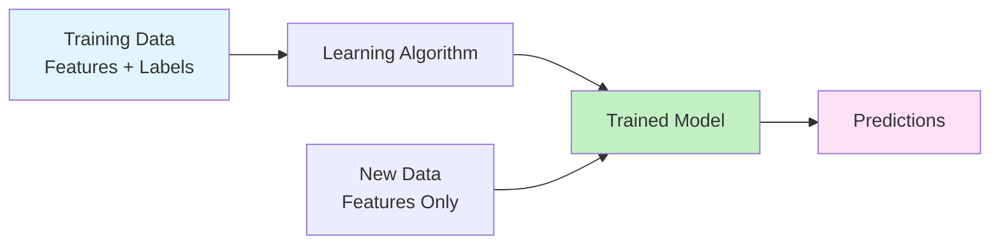
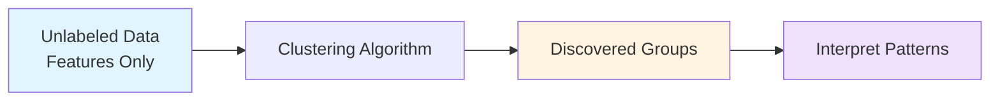
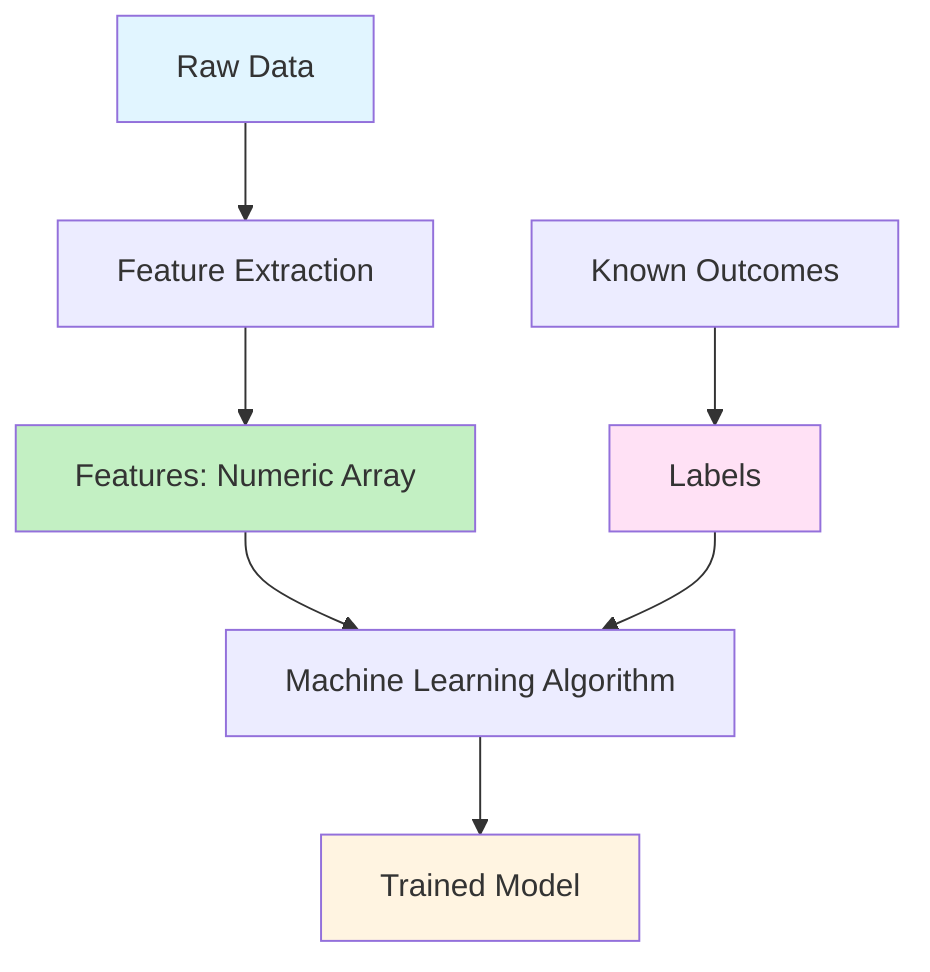
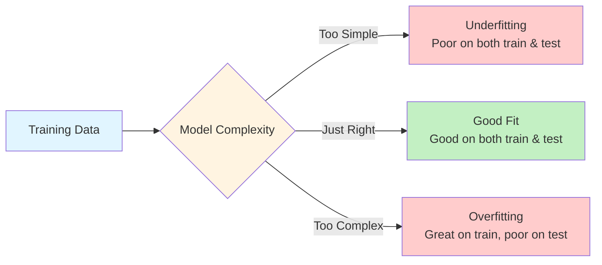
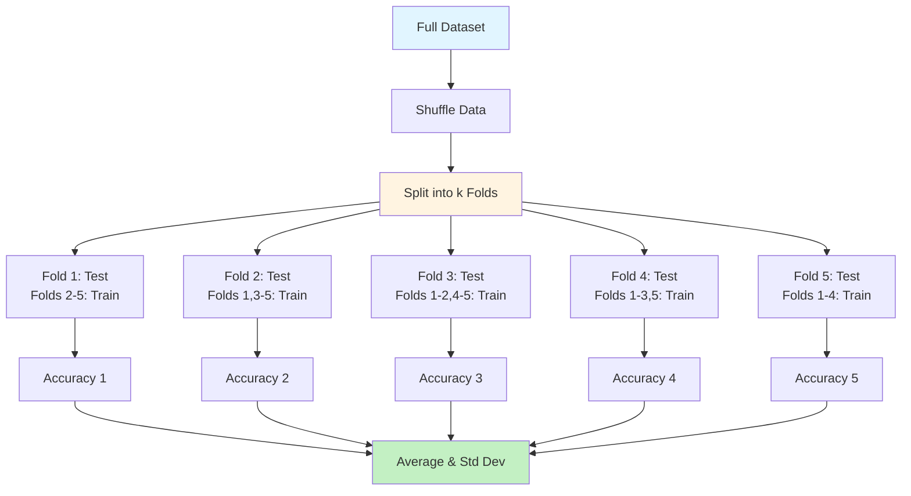
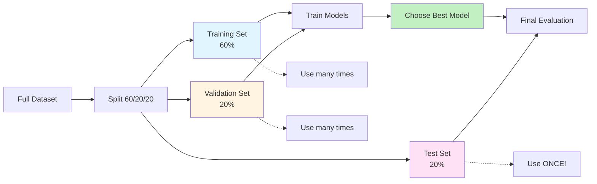
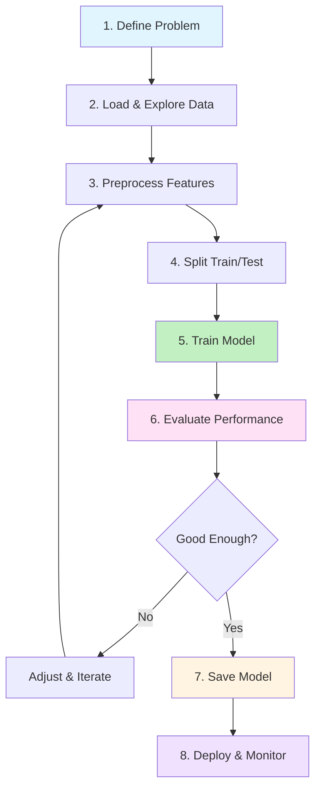
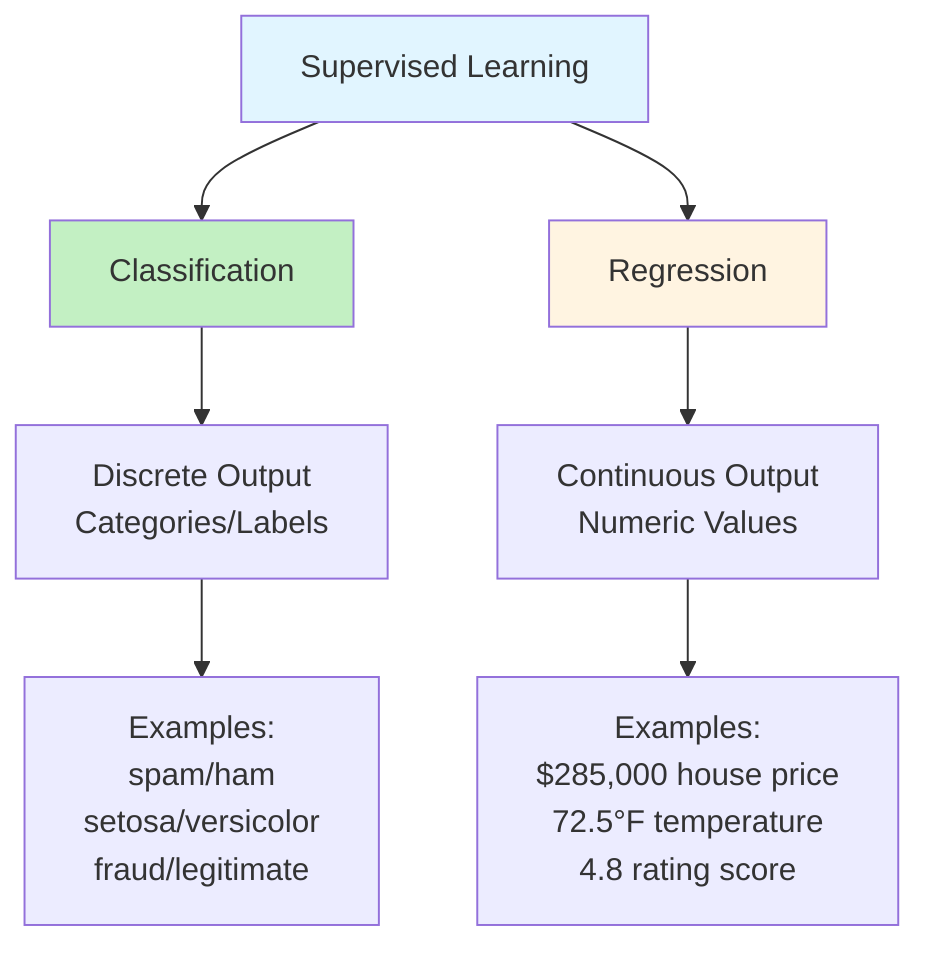

# Chapter 03: Core Machine Learning Concepts and Terminology

## Overview

In Chapter 1, you learned what machine learning is and why it matters for PHP developers. In Chapter 2, you set up a complete development environment with PHP 8.4, Composer, and ML libraries. Now it's time to understand the fundamental concepts that underpin all machine learning work.

This chapter bridges theory and practice. You'll learn essential ML terminology, but instead of just reading definitions, you'll see working PHP code that demonstrates each concept. You'll understand the difference between supervised and unsupervised learning by building both a spam classifier and a customer segmentation tool. You'll grasp the critical distinction between training and inference by measuring their performance. Most importantly, you'll learn to recognize and prevent overfitting—the most common mistake beginners make.

By the end of this chapter, you'll have built a complete end-to-end machine learning project: an iris flower classifier that loads data, preprocesses features, trains a model, evaluates performance, and saves the trained model for reuse. You'll understand not just the "what" and "how," but the "why" behind each step in the ML workflow.

Think of this chapter as learning the vocabulary and grammar of a new language. Once you understand these core concepts, the rest of the series will build on this foundation. Every algorithm, technique, and project in later chapters uses the principles you'll learn here.

## Prerequisites

Before starting this chapter, you should have:

- Completed [Chapter 01](/series/ai-ml-php-developers/chapters/01-introduction-to-ai-and-machine-learning-for-php-developers) or equivalent understanding of AI/ML basics
- Completed [Chapter 02](/series/ai-ml-php-developers/chapters/02-setting-up-your-ai-development-environment) with verified PHP 8.4 environment
- PHP-ML and/or Rubix ML libraries installed and tested (from Chapter 2)
- Basic understanding of arrays, functions, and classes in PHP
- Familiarity with the command line for running PHP scripts
- A text editor or IDE configured for PHP development

**Estimated Time**: ~70-90 minutes (reading, running examples, and exercises)

## What You'll Build

By the end of this chapter, you will have created:

- A **spam classifier** demonstrating supervised learning with labeled email data
- A **customer segmentation tool** showing unsupervised clustering without labels
- **Feature extraction scripts** that transform text and numeric data into ML-ready features
- A **training vs. inference demonstration** showing the two phases of the ML lifecycle
- An **overfitting detection script** that intentionally overfits a model and shows how to fix it
- A **train/test split utility** implementing proper data separation for evaluation
- A **cross-validation implementation** showing k-fold evaluation for robust performance estimates
- A **3-way split demonstration** with hyperparameter tuning without test set contamination
- A **complete iris flower classifier** that executes all 8 steps of the ML workflow from data loading to model deployment
- An **algorithm comparison tool** that tests multiple classifiers and recommends when to use each
- A **house price predictor** demonstrating regression vs. classification
- A **confusion matrix builder** for advanced classification evaluation

All code examples are fully functional and runnable with clear output showing ML concepts in action.

::: info Code Examples
Complete, runnable examples for this chapter:

- [`01-supervised-classification.php`](../code/chapter-03/01-supervised-classification.php) — Spam classification demo
- [`02-unsupervised-clustering.php`](../code/chapter-03/02-unsupervised-clustering.php) — Customer segmentation
- [`03-feature-extraction.php`](../code/chapter-03/03-feature-extraction.php) — Text to numeric features
- [`04-training-inference.php`](../code/chapter-03/04-training-inference.php) — Two-phase ML lifecycle
- [`05-overfitting-demo.php`](../code/chapter-03/05-overfitting-demo.php) — Detecting overfitting
- [`06-train-test-split.php`](../code/chapter-03/06-train-test-split.php) — Proper data splitting
- [`07-iris-workflow.php`](../code/chapter-03/07-iris-workflow.php) — Complete ML workflow
- [`08-algorithm-comparison.php`](../code/chapter-03/08-algorithm-comparison.php) — Algorithm comparison
- [`09-cross-validation.php`](../code/chapter-03/09-cross-validation.php) — k-Fold cross-validation
- [`10-train-val-test-split.php`](../code/chapter-03/10-train-val-test-split.php) — 3-way split for hyperparameter tuning
- [`11-regression-example.php`](../code/chapter-03/11-regression-example.php) — House price prediction (regression)
- [`12-confusion-matrix.php`](../code/chapter-03/12-confusion-matrix.php) — Confusion matrix and advanced metrics

All files are in [`docs/series/ai-ml-php-developers/code/chapter-03/`](../code/chapter-03/)
:::

## Quick Start

Want to see machine learning in action right now? Here's a 5-minute spam classifier that demonstrates supervised learning:

```php
# filename: quick-start-spam.php
<?php

declare(strict_types=1);

require_once __DIR__ . '/../../code/chapter-02/vendor/autoload.php';

use Phpml\Classification\KNearestNeighbors;

// Step 1: Prepare training data with labels
$trainingEmails = [
    "WIN FREE MONEY NOW!!!",
    "Meeting scheduled for 2pm",
    "URGENT: Claim your prize",
    "Thanks for the project update",
    "FREE discount! Act fast!",
    "Can we discuss the proposal?",
];

// Extract features: [word_count, exclamation_count, has_free, has_urgent]
$trainingFeatures = [
    [4, 3, 1, 0],  // spam
    [4, 0, 0, 0],  // ham
    [4, 1, 0, 1],  // spam
    [5, 0, 0, 0],  // ham
    [4, 1, 1, 0],  // spam
    [6, 1, 0, 0],  // ham
];

$trainingLabels = ['spam', 'ham', 'spam', 'ham', 'spam', 'ham'];

// Step 2: Train the classifier
$classifier = new KNearestNeighbors(k: 3);
$classifier->train($trainingFeatures, $trainingLabels);

// Step 3: Make predictions on new emails
$newEmails = [
    "FREE gift! Click NOW!!!",
    "See you at the meeting",
];

$newFeatures = [
    [4, 3, 1, 0],  // [word_count, exclamations, has_free, has_urgent]
    [5, 0, 0, 0],
];

foreach ($newEmails as $index => $email) {
    $prediction = $classifier->predict($newFeatures[$index]);
    $icon = $prediction === 'spam' ? '🚫' : '✓';
    echo "{$icon} \"{$email}\" → {$prediction}\n";
}
```

**Run it:**

```bash
# From the project root
cd docs/series/ai-ml-php-developers/code/chapter-03
php quick-start-spam.php
```

**Expected output:**

```
🚫 "FREE gift! Click NOW!!!" → spam
✓ "See you at the meeting" → ham
```

**What just happened?** You trained a supervised learning model with labeled examples (spam/ham), extracted numeric features from text, and made predictions on new emails. That's machine learning in 20 lines of PHP!

Now let's understand exactly how this works...

## Objectives

By the end of this chapter, you will be able to:

- **Distinguish between supervised and unsupervised learning** with PHP implementations of both paradigms
- **Identify features and labels** in datasets and extract meaningful numeric features from raw data
- **Explain the difference between training and inference** and understand when each phase occurs
- **Recognize overfitting** by comparing training vs. test accuracy and apply techniques to prevent it
- **Implement proper train/test splits** following best practices to avoid data leakage and get reliable performance estimates
- **Use k-fold cross-validation** to get more reliable performance estimates than single splits
- **Implement 3-way splits** (train/validation/test) for proper hyperparameter tuning
- **Execute the complete ML workflow** from problem definition through model deployment
- **Compare multiple ML algorithms** and choose the right one for specific use cases
- **Understand regression vs. classification** with practical examples of both
- **Build and interpret confusion matrices** to analyze classification errors and calculate precision, recall, and F1-score

## Step 1: Supervised vs. Unsupervised Learning (~10 min)

::: info Running the Examples
All code examples for this chapter are in `code/chapter-03/`. From the project root:

```bash
cd docs/series/ai-ml-php-developers/code/chapter-03
php 01-supervised-classification.php
```

:::

### Goal

Understand the two primary learning paradigms and when to use each by building working examples in PHP.

### Actions

Machine learning algorithms fall into two broad categories based on whether they use labeled data. Understanding this distinction is crucial because it determines what problems you can solve and what data you need.

#### Supervised Learning: Learning with Labels

**Supervised learning** is like learning with a teacher. You provide the algorithm with examples where you already know the correct answer (the label), and it learns to predict that answer for new, unseen data.



**Example: Email Spam Classification**

Let's build a simple spam classifier. Run the example:

```bash
# From the project root
cd docs/series/ai-ml-php-developers/code/chapter-03
php 01-supervised-classification.php
```

Here's how it works:

```php
# filename: 01-supervised-classification.php (excerpt)
<?php

use Phpml\Classification\KNearestNeighbors;

// Training data with labels
$trainingFeatures = [
    [1, 1, 1, 3],  // Features: [has_free, has_money, has_urgent, num_exclamations]
    [0, 0, 0, 0],  // ham: "Meeting at 3pm tomorrow"
];

$trainingLabels = ['spam', 'ham'];  // We KNOW what these are

// Train the classifier
$classifier = new KNearestNeighbors(k: 3);
$classifier->train($trainingFeatures, $trainingLabels);

// Predict on new email
$newEmail = [1, 1, 1, 4];  // "FREE URGENT money!!!! Act now"
$prediction = $classifier->predict($newEmail);  // → "spam"
```

The key insight: We told the algorithm which emails were spam and which were ham. It learned patterns from our labels and can now predict labels for new emails.

**Probability Interpretation**

Supervised learning can be understood probabilistically. The classifier estimates \( P(\text{label} \mid \text{features}) \) — the probability of a label given the features. For spam detection:

\[ P(\text{spam} \mid \text{email}) = \frac{\text{similar spam emails}}{\text{all similar emails}} \]

#### Unsupervised Learning: Finding Hidden Patterns

**Unsupervised learning** is like exploring without a map. You provide data without labels, and the algorithm discovers hidden structure or patterns on its own.



**Example: Customer Segmentation**

Let's discover customer groups based on behavior. Run the example:

```bash
php 02-unsupervised-clustering.php
```

Here's the concept:

```php
# filename: 02-unsupervised-clustering.php (excerpt)
<?php

use Phpml\Clustering\KMeans;

// Customer data WITHOUT labels
$customerData = [
    [20, 2],    // [monthly_spending, visit_frequency]
    [200, 15],  // We DON'T tell the algorithm which group each belongs to
    [100, 8],
];

// Discover clusters
$kmeans = new KMeans(n: 3);
$clusters = $kmeans->cluster($customerData);

// Now interpret what we found:
// Cluster 1: Low spenders, rare visitors → "Occasional Customers"
// Cluster 2: High spenders, frequent visitors → "VIP Customers"
// Cluster 3: Medium spenders, regular visitors → "Regular Customers"
```

The algorithm grouped similar customers together without being told what makes a "VIP" or "Occasional" customer. We interpret the clusters after they're discovered.

#### When to Use Each Approach

| Aspect            | Supervised Learning                                     | Unsupervised Learning                                     |
| ----------------- | ------------------------------------------------------- | --------------------------------------------------------- |
| **Data Required** | Labeled examples (input + correct output)               | Unlabeled data (input only)                               |
| **Goal**          | Predict specific outcomes                               | Discover hidden patterns                                  |
| **Evaluation**    | Compare predictions to known labels                     | Interpret cluster quality                                 |
| **Examples**      | Spam detection, price prediction, diagnosis             | Customer segmentation, anomaly detection, topic discovery |
| **When to Use**   | You know what you want to predict and have labeled data | You want to explore data or don't have labels             |
| **Difficulty**    | Easier to evaluate (accuracy metrics)                   | Harder to evaluate (subjective interpretation)            |

### Expected Result

When you run the examples, you'll see:

```
=== Supervised Learning: Spam Classification ===

Training data: 8 labeled emails
- Spam examples: 4
- Ham examples: 4

Making predictions on new emails:
--------------------------------------------------
🚫 Email 1: "FREE URGENT money!!!! Act now"
   Prediction: SPAM

✓ Email 2: "See you at the meeting"
   Prediction: HAM
```

And for unsupervised learning:

```
=== Unsupervised Learning: Customer Segmentation ===

Discovered Customer Segments:
Cluster 1 (4 customers):
  Average spending: $21.25/month
  Average visits: 2.5 visits/month
  → Business Segment: Occasional Customers (low engagement)
```

### Why It Works

**Supervised learning** works because the algorithm finds statistical patterns that correlate features with labels. When it sees similar features in new data, it predicts the same label. It's pattern matching based on examples.

**Unsupervised learning** works by measuring similarity between data points. Points that are "close" to each other (in feature space) are grouped together. The algorithm doesn't know what the groups mean—that's your job as the developer to interpret.

The math behind k-means clustering minimizes the within-cluster variance:

\[ \text{minimize} \sum*{i=1}^{k} \sum*{x \in C_i} \|x - \mu_i\|^2 \]

Where \( C_i \) is cluster \( i \) and \( \mu_i \) is its center (mean).

### Troubleshooting

- **Error: "Class not found"** — PHP-ML not installed. Run `composer install` in the `chapter-02` directory.
- **Predictions all wrong** — This is expected with tiny training sets! Real models need hundreds or thousands of examples.
- **Clustering produces unexpected groups** — K-means is sensitive to initialization and k value. Try running multiple times or adjusting k.

## Step 2: Features and Labels (~8 min)

### Goal

Master the fundamental input/output concept in machine learning and learn to transform raw data into ML-ready numeric features.

### Actions

Every machine learning problem has two components:

- **Features** (also called predictors, inputs, or X): The information you provide to make a prediction
- **Labels** (also called targets, outputs, or y): The thing you want to predict (supervised learning only)

Think of features as questions you ask, and labels as the answers you want to predict.

#### What Are Features?

Features are measurable properties of your data. They must be numeric because ML algorithms perform mathematical operations. If your raw data isn't numeric, you need to engineer features from it.

**Feature Types:**

1. **Numeric/Continuous**: Age (25), price ($49.99), temperature (72.5°F)
2. **Binary**: Has_clicked (0 or 1), is_premium (true/false → 1/0)
3. **Categorical** (must be encoded): Color (red → [1,0,0], blue → [0,1,0], green → [0,0,1])

#### Feature Extraction from Text

Run the feature extraction example:

```bash
php 03-feature-extraction.php
```

Here's how we transform an email into features using **PHP 8.4 property hooks**:

```php
# filename: 03-feature-extraction.php (excerpt)
<?php

declare(strict_types=1);

/**
 * Email feature extractor using PHP 8.4 property hooks.
 * Property hooks allow computed properties that calculate values on access.
 */
final class EmailFeatureExtractor
{
    private string $lowerEmail;

    public function __construct(
        private string $email
    ) {
        $this->lowerEmail = strtolower($email);
    }

    // Property hooks - computed properties that calculate on access
    public int $hasFree {
        get => str_contains($this->lowerEmail, 'free') ? 1 : 0;
    }

    public int $hasMoney {
        get => str_contains($this->lowerEmail, 'money') ? 1 : 0;
    }

    public int $hasUrgent {
        get => str_contains($this->lowerEmail, 'urgent') ? 1 : 0;
    }

    public int $exclamationCount {
        get => substr_count($this->email, '!');
    }

    public float $capitalRatio {
        get {
            $upper = preg_match_all('/[A-Z]/', $this->email);
            $total = strlen(preg_replace('/[^a-zA-Z]/', '', $this->email));
            return $total > 0 ? $upper / $total : 0.0;
        }
    }

    public int $wordCount {
        get => str_word_count($this->email);
    }

    /**
     * Convert features to numeric array for ML algorithm
     */
    public function toArray(): array
    {
        return [
            $this->hasFree,
            $this->hasMoney,
            $this->hasUrgent,
            $this->exclamationCount,
            $this->capitalRatio,
            $this->wordCount,
        ];
    }
}

// Usage with PHP 8.4 property hooks
$extractor = new EmailFeatureExtractor("Get FREE money NOW!!! Click here!");
echo "Has 'free': {$extractor->hasFree}\n";         // Computed on access: 1
echo "Exclamations: {$extractor->exclamationCount}\n";  // Computed on access: 5
echo "Capital ratio: {$extractor->capitalRatio}\n";     // Computed on access: 0.45

$features = $extractor->toArray();
// Result: [1, 1, 0, 5, 0.45, 5]
```

**What are property hooks?** PHP 8.4's property hooks let you define computed properties that calculate their values when accessed. Instead of storing `$hasFree`, the `get` hook computes it from `$email` each time you access `$extractor->hasFree`. This keeps your code clean and encapsulated while maintaining the convenience of property syntax.

**Alternative function-based approach** (works in any PHP version):

```php
# filename: 03-feature-extraction.php (excerpt)
<?php

function extractEmailFeatures(string $email): array
{
    $lower = strtolower($email);

    return [
        'has_free' => str_contains($lower, 'free') ? 1 : 0,
        'has_money' => str_contains($lower, 'money') ? 1 : 0,
        'has_urgent' => str_contains($lower, 'urgent') ? 1 : 0,
        'exclamation_count' => substr_count($email, '!'),
        'capital_ratio' => calculateCapitalRatio($email),
        'word_count' => str_word_count($email),
    ];
}

$email = "Get FREE money NOW!!! Click here!";
$features = extractEmailFeatures($email);
// Result: [1, 1, 0, 5, 0.45, 5]
```

**Before feature extraction**: "Get FREE money NOW!!! Click here!" (text)  
**After feature extraction**: `[1, 1, 0, 5, 0.45, 5]` (numbers the algorithm can process)

#### Feature Engineering: Creating New Features

Sometimes the best features don't exist in your raw data—you create them:

```php
# filename: 03-feature-extraction.php (excerpt)
<?php

function engineerCustomerFeatures(array $customer): array
{
    return [
        // Original features
        'age' => $customer['age'],
        'income' => $customer['income'],
        'purchases' => $customer['purchases'],

        // Engineered features (derived from originals)
        'age_group' => ($customer['age'] < 30) ? 1 : (($customer['age'] < 50) ? 2 : 3),
        'income_per_purchase' => $customer['income'] / max($customer['purchases'], 1),
        'purchase_frequency' => $customer['purchases'] / 12,  // per month
        'is_high_value' => ($customer['income'] > 70000 && $customer['purchases'] > 10) ? 1 : 0,
    ];
}

$customer = ['age' => 45, 'income' => 85000, 'purchases' => 15];
$features = engineerCustomerFeatures($customer);
// Added 4 new derived features!
```

Good feature engineering often improves model performance more than choosing a fancier algorithm.

#### Feature Normalization

Features on different scales can cause problems. Age ranges 20-80, but income ranges 20,000-200,000. We normalize them to the same scale (typically [0, 1]):

**Min-Max Scaling Formula:**

\[ x*{\text{scaled}} = \frac{x - x*{\min}}{x*{\max} - x*{\min}} \]

```php
# filename: 03-feature-extraction.php (excerpt)
<?php

function normalizeFeatures(array $data): array
{
    $numFeatures = count($data[0]);
    $normalized = [];

    // Calculate min and max for each feature
    for ($featureIndex = 0; $featureIndex < $numFeatures; $featureIndex++) {
        $column = array_column($data, $featureIndex);
        $min = min($column);
        $max = max($column);
        $range = $max - $min;

        // Normalize each value
        foreach ($data as $sampleIndex => $sample) {
            $value = $sample[$featureIndex];
            $normalized[$sampleIndex][$featureIndex] =
                $range > 0 ? ($value - $min) / $range : 0.5;
        }
    }

    return $normalized;
}

// Before: [[25, 35000, 5], [45, 85000, 15]]
// After:  [[0.0, 0.0, 0.0], [1.0, 1.0, 1.0]]
```

**Why normalize?** Algorithms like k-NN calculate distances. Without normalization, income (large numbers) would dominate age (small numbers) in distance calculations, making age nearly irrelevant.

#### What Are Labels?

Labels are the answers you want to predict. They exist only in supervised learning.

**Label Types:**

1. **Binary Classification**: Spam/Ham, Fraud/Legitimate, Pass/Fail
2. **Multi-class Classification**: Species (setosa, versicolor, virginica), Topic (sports, politics, tech)
3. **Regression** (continuous): Price ($124.99), Temperature (72.5°F), Age (34.2 years)



### Expected Result

Running `03-feature-extraction.php` shows three complete examples:

```
=== Feature Extraction and Engineering ===

Example 1: Extracting Features from Text
--------------------------------------------------

Email 1: "Get FREE money NOW! Click here!!!"
  Features extracted:
    - has_free: 1
    - has_money: 1
    - has_urgent: 0
    - exclamation_count: 5
    - capital_ratio: 0.45
    - word_count: 5

Example 3: Normalizing Features to [0, 1] Range
--------------------------------------------------

Original feature ranges (Age, Income, Purchases):
  Feature 1: 25.00 to 55.00
  Feature 2: 35000.00 to 120000.00
  Feature 3: 5.00 to 20.00

Normalized feature ranges (should be 0.0 to 1.0):
  Feature 1: 0.00 to 1.00
  Feature 2: 0.00 to 1.00
  Feature 3: 0.00 to 1.00
```

### Why It Works

Machine learning algorithms are fundamentally mathematical. They perform operations like distance calculations, matrix multiplications, and gradient descent. These operations require numbers, not text or categories. Feature engineering is the bridge between real-world data and mathematical algorithms.

Good features have these properties:

- **Informative**: They correlate with the label you want to predict
- **Independent**: Features aren't redundant copies of each other
- **Simple**: Prefer simple features that generalize well
- **Scaled**: Features are on similar numeric ranges

### Troubleshooting

- **Error: "Division by zero" in normalization** — Feature has no variance (all values are the same). Set normalized value to 0.5 or remove the feature.
- **Features don't seem helpful** — Try engineering derived features or combining existing ones. Feature engineering is often iterative.
- **Normalized values outside [0, 1]** — Ensure you're calculating min/max correctly over the entire column, not per row.

## Step 3: Training vs. Inference (~10 min)

### Goal

Understand the two distinct phases of the ML lifecycle and why we separate them for performance and reusability.

### Actions

Machine learning has two phases that occur at different times with different performance characteristics:

1. **Training** (offline, slow, done once): Learn patterns from labeled data
2. **Inference** (online, fast, done many times): Apply learned patterns to new data

```mermaid
sequenceDiagram
    participant Dev as Developer
    participant Train as Training Phase
    participant Model as Trained Model
    participant Prod as Production
    participant User as End User

    Dev->>Train: Provide labeled training data
    Note over Train: Learn patterns<br/>(slow, offline)
    Train->>Model: Save trained model
    Model->>Prod: Deploy model
    User->>Prod: Request prediction
    Note over Prod: Apply patterns<br/>(fast, online)
    Prod->>User: Return prediction

    style Train fill:#e1f5ff
    style Model fill:#fff4e1
    style Prod fill:#c3f0c3
```

Run the training vs. inference demonstration:

```bash
php 04-training-inference.php
```

#### Phase 1: Training (Learning Patterns)

Training is the process of feeding labeled data to an algorithm so it learns to map features to labels. This is computationally intensive and happens during development, not in production.

```php
# filename: 04-training-inference.php (excerpt)
<?php

$trainingData = [
    [5.1, 3.5], [4.9, 3.0], [4.7, 3.2],  // Setosa samples
    [7.0, 3.2], [6.4, 3.2], [6.9, 3.1],  // Versicolor samples
];

$trainingLabels = ['setosa', 'setosa', 'setosa', 'versicolor', 'versicolor', 'versicolor'];

// TRAINING: Learn patterns
$classifier = new KNearestNeighbors(k: 3);
$startTime = microtime(true);

$classifier->train($trainingData, $trainingLabels);  // This is where learning happens

$trainingTime = microtime(true) - $startTime;
// Training time: ~50 milliseconds
```

For k-NN specifically, "training" just stores the examples. Other algorithms (like neural networks) perform intensive optimization during training.

#### Phase 2: Inference (Making Predictions)

Inference is using the trained model to predict labels for new, unseen data. This must be fast because it happens in real-time when users interact with your application.

```php
# filename: 04-training-inference.php (excerpt)
<?php

$newFlower = [5.0, 3.5];  // New data, no label

// INFERENCE: Use learned patterns to predict
$inferenceStart = microtime(true);

$prediction = $classifier->predict($newFlower);  // Apply patterns

$inferenceTime = microtime(true) - $inferenceStart;
// Inference time: ~0.05 milliseconds per prediction

// Inference is 1000x faster than training!
```

#### How k-NN Makes Predictions: Euclidean Distance

k-Nearest Neighbors classifies by finding the k most similar training examples and taking a majority vote. Similarity is measured by Euclidean distance:

**Euclidean Distance Formula:**

\[ d(p, q) = \sqrt{\sum\_{i=1}^{n} (p_i - q_i)^2} \]

For 2D points: \( d = \sqrt{(x_1 - x_2)^2 + (y_1 - y_2)^2} \)

```php
# filename: 04-training-inference.php (excerpt)
<?php

function euclideanDistance(array $point1, array $point2): float
{
    $sumSquaredDiffs = 0;
    for ($i = 0; $i < count($point1); $i++) {
        $diff = $point1[$i] - $point2[$i];
        $sumSquaredDiffs += $diff * $diff;
    }
    return sqrt($sumSquaredDiffs);
}

$testFlower = [5.0, 3.5];
$distance1 = euclideanDistance($testFlower, [5.1, 3.5]);  // 0.100
$distance2 = euclideanDistance($testFlower, [7.0, 3.2]);  // 2.005

// Nearest neighbor is [5.1, 3.5] with distance 0.100
```

k-NN calculates distance to all training points, finds the k nearest, and predicts the most common label among them.

#### Why Separate Training and Inference?

1. **Performance**: Training is slow, inference must be fast. Users can't wait 10 seconds for a prediction.
2. **Resource Efficiency**: Train once on a powerful server, deploy to many lightweight web servers.
3. **Data Privacy**: Training data stays on your servers; users only interact with the trained model.
4. **Reusability**: Train once, use millions of times without retraining.

### Expected Result

```
=== Training vs. Inference ===

============================================================
PHASE 1: TRAINING
============================================================

Training dataset:
  - 24 labeled examples
  - 2 features per sample
  - 3 classes: setosa, versicolor, virginica

Creating k-NN classifier (k=3)...
Starting training...
✓ Training complete in 52.14 ms

============================================================
PHASE 2: INFERENCE
============================================================

Making predictions on 5 new flowers:

Flower 1: [5.0, 3.5]
  → Prediction: setosa
  → Time: 0.048 ms

Flower 2: [6.7, 3.1]
  → Prediction: versicolor
  → Time: 0.042 ms

============================================================
TRAINING vs. INFERENCE COMPARISON
============================================================

Training Phase:
  - Time: 52.14 ms (one-time cost)
  - Frequency: Done once (or periodically for retraining)
  - Process: Learning patterns from labeled data

Inference Phase:
  - Time: 0.045 ms per prediction (fast!)
  - Frequency: Done many times (every user request)
  - Process: Applying learned patterns to new data

Inference is 1159x faster than training!
```

### Why It Works

Training optimizes model parameters to minimize prediction error on training data. Different algorithms optimize differently:

- **k-NN**: Stores training examples (no optimization)
- **Linear models**: Find weights that minimize error using gradient descent
- **Decision trees**: Split data to maximize information gain
- **Neural networks**: Adjust weights via backpropagation

Inference uses those optimized parameters to make fast predictions without re-learning.

### Troubleshooting

- **Training very slow** — Normal for large datasets or complex models. k-NN is fast to train but slow to predict. Neural networks are slow to train but fast to predict.
- **Inference slower than expected** — k-NN must calculate distance to all training points. For production, consider algorithms with faster inference like decision trees or neural networks.
- **Predictions inconsistent** — Ensure you're using the same trained model instance. Don't retrain between predictions!

## Step 4: Overfitting vs. Generalization (~12 min)

### Goal

Recognize the most common mistake in machine learning—overfitting—and learn proven techniques to prevent it.

### Actions

**Overfitting** is when a model memorizes training data instead of learning generalizable patterns. It's like a student who memorizes answers to practice problems but can't solve new problems because they didn't understand the underlying concepts.



Run the overfitting demonstration:

```bash
php 05-overfitting-demo.php
```

#### Scenario 1: Overfitting (What NOT to Do)

```php
# filename: 05-overfitting-demo.php (excerpt)
<?php

// Very small training set (only 6 examples!)
$smallTrainingData = [
    [5.0, 3.5], [4.8, 3.0], [5.2, 3.4],  // Setosa
    [6.5, 2.8], [6.0, 2.7], [5.9, 3.0],  // Versicolor
];

$smallTrainingLabels = ['setosa', 'setosa', 'setosa', 'versicolor', 'versicolor', 'versicolor'];

// Train with k=1 (most sensitive to individual examples)
$overfit_classifier = new KNearestNeighbors(k: 1);
$overfit_classifier->train($smallTrainingData, $smallTrainingLabels);

// Test on TRAINING data
$trainingAccuracy = evaluateModel($overfit_classifier, $smallTrainingData, $smallTrainingLabels);
// Result: 100% (Perfect! But...this is misleading)

// Test on NEW data
$testAccuracy = evaluateModel($overfit_classifier, $testData, $testLabels);
// Result: ~50% (Terrible! Failed to generalize)

// ⚠️ OVERFITTING DETECTED!
// Training accuracy (100%) >> Test accuracy (50%)
```

**Why this overfits:**

- Training set is too small (6 examples can't represent all patterns)
- k=1 is too sensitive (nearest single neighbor determines prediction)
- Model memorized specific training examples instead of learning patterns

#### Scenario 2: Good Generalization (The Right Way)

```php
# filename: 05-overfitting-demo.php (excerpt)
<?php

// Larger, more diverse training set (20 examples)
$largeTrainingData = [
    [5.0, 3.5], [4.8, 3.0], [5.2, 3.4], [4.9, 3.1], [5.1, 3.6],  // More setosa
    [5.3, 3.7], [4.7, 3.2], [5.0, 3.3], [4.6, 3.4], [5.4, 3.9],
    [6.5, 2.8], [6.0, 2.7], [5.9, 3.0], [6.4, 2.9], [6.1, 2.6],  // More versicolor
    [6.3, 2.8], [5.8, 2.7], [6.2, 2.9], [5.7, 2.8], [6.6, 3.0],
];

// Train with k=3 (considers multiple neighbors, more robust)
$good_classifier = new KNearestNeighbors(k: 3);
$good_classifier->train($largeTrainingData, $largeTrainingLabels);

// Test on training data
$trainingAccuracy = evaluateModel($good_classifier, $largeTrainingData, $largeTrainingLabels);
// Result: ~95% (Good but not perfect - healthy sign!)

// Test on NEW data
$testAccuracy = evaluateModel($good_classifier, $testData, $testLabels);
// Result: ~83% (Generalizes well!)

// ✓ GOOD GENERALIZATION!
// Training accuracy (95%) ≈ Test accuracy (83%)
```

**Why this generalizes well:**

- More training data (20 examples) captures better patterns
- k=3 averages over neighbors, more robust to noise
- Small gap between train and test accuracy indicates good fit

#### The Accuracy Gap Tells the Story

| Scenario     | Train Accuracy | Test Accuracy | Gap | Diagnosis                             |
| ------------ | -------------- | ------------- | --- | ------------------------------------- |
| Overfitting  | 100%           | 50%           | 50% | Model memorized training data         |
| Good Fit     | 95%            | 83%           | 12% | Model learned generalizable patterns  |
| Underfitting | 60%            | 58%           | 2%  | Model too simple, didn't learn enough |

**Accuracy metric formula:**

\[ \text{Accuracy} = \frac{\text{Correct Predictions}}{\text{Total Predictions}} \times 100\% \]

#### Five Techniques to Prevent Overfitting

**1. Use More Training Data**

More examples make it harder for the model to memorize individual samples and force it to learn real patterns.

```php
// Bad: 10 training examples
// Good: 100+ training examples
// Better: 1000+ training examples
```

**2. Use Simpler Models**

Complex models can memorize noise. Start simple and add complexity only if needed.

```php
// For k-NN:
$knn = new KNearestNeighbors(k: 1);   // Complex: very sensitive
$knn = new KNearestNeighbors(k: 5);   // Simpler: averages neighbors
$knn = new KNearestNeighbors(k: 10);  // Simplest: smoothest decision boundary
```

**3. Split Data Properly (CRITICAL)**

NEVER test on training data! Always hold out test data that the model hasn't seen.

```php
// WRONG: Test on training data
$accuracy = evaluateModel($model, $trainingData, $trainingLabels);  // ❌

// RIGHT: Test on separate test data
$accuracy = evaluateModel($model, $testData, $testLabels);  // ✓
```

**4. Use Cross-Validation**

Split data multiple ways and average performance for more reliable estimates.

**5. Monitor the Gap**

Watch the difference between training and test accuracy:

```php
$trainingAccuracy = 98%;
$testAccuracy = 95%;
$gap = $trainingAccuracy - $testAccuracy;  // 3%

if ($gap < 10%) {
    echo "Good generalization! ✓";
} else {
    echo "Overfitting detected! ⚠️";
}
```

### Expected Result

```
=== Understanding Overfitting ===

============================================================
SCENARIO 1: OVERFITTING - Model Memorizes Training Data
============================================================

Training data: 6 examples (very small!)

Testing on TRAINING data:
  ✓ Sample 1: predicted=setosa, actual=setosa
  ✓ Sample 2: predicted=setosa, actual=setosa
  ... (all perfect)

→ Training Accuracy: 100.0% (Perfect! But...)

Testing on NEW (unseen) data:
  ✓ Sample 1: predicted=setosa, actual=setosa
  ✗ Sample 2: predicted=versicolor, actual=setosa
  ✗ Sample 3: predicted=setosa, actual=versicolor
  ...

→ Test Accuracy: 50.0% (Poor!)

⚠️ OVERFITTING DETECTED!
  Training accuracy (100%) >> Test accuracy (50%)
  The model memorized the training data but failed to generalize!

============================================================
SCENARIO 2: PROPER GENERALIZATION - Learns Patterns
============================================================

Training data: 20 examples (better!)

→ Training Accuracy: 95.0%
→ Test Accuracy: 83.3%

✓ GOOD GENERALIZATION!
  Training accuracy (95%) ≈ Test accuracy (83%)
  The model learned generalizable patterns!
```

### Why It Works

Overfitting occurs because models optimize for training data. Given enough complexity (parameters), a model can perfectly fit training data—including noise and outliers. But noise doesn't generalize to new data.

The **bias-variance tradeoff** explains this mathematically:

- **Bias**: Error from overly simple assumptions (underfitting)
- **Variance**: Error from sensitivity to small fluctuations (overfitting)
- **Goal**: Find the sweet spot that minimizes total error

\[ \text{Total Error} = \text{Bias}^2 + \text{Variance} + \text{Irreducible Error} \]

### Troubleshooting

- **Training accuracy < 60%** — Model is underfitting. Try more complex model or better features.
- **Training accuracy = 100%** — Almost always overfitting unless you have a trivially simple problem. Check test accuracy!
- **Test accuracy varies wildly between runs** — Test set too small or data not shuffled. Use larger test set and always shuffle before splitting.

## Step 5: Proper Train/Test Splitting (~8 min)

### Goal

Learn to correctly split data to get reliable performance estimates and prevent data leakage.

### Actions

The train/test split is your primary tool for detecting overfitting. Done incorrectly, it gives you false confidence. Done correctly, it tells you how your model will perform in production.

Run the example:

```bash
php 06-train-test-split.php
```

#### Implementing a Train/Test Split

```php
# filename: 06-train-test-split.php (excerpt)
<?php

function trainTestSplit(
    array $data,
    array $labels,
    float $testRatio = 0.2,
    bool $shuffle = true
): array {
    $totalSamples = count($data);
    $testSize = (int) round($totalSamples * $testRatio);
    $trainSize = $totalSamples - $testSize;

    // Create indices array
    $indices = range(0, $totalSamples - 1);

    // CRITICAL: Shuffle to avoid ordered data bias
    if ($shuffle) {
        shuffle($indices);
    }

    // Split indices
    $trainIndices = array_slice($indices, 0, $trainSize);
    $testIndices = array_slice($indices, $trainSize);

    // Extract corresponding data
    $trainData = [];
    $trainLabels = [];
    foreach ($trainIndices as $idx) {
        $trainData[] = $data[$idx];
        $trainLabels[] = $labels[$idx];
    }

    $testData = [];
    $testLabels = [];
    foreach ($testIndices as $idx) {
        $testData[] = $data[$idx];
        $testLabels[] = $labels[$idx];
    }

    return [
        'train_data' => $trainData,
        'train_labels' => $trainLabels,
        'test_data' => $testData,
        'test_labels' => $testLabels,
    ];
}

// Usage
[$trainData, $trainLabels, $testData, $testLabels] =
    trainTestSplit($allData, $allLabels, testRatio: 0.2);
```

#### Common Split Ratios

| Ratio     | When to Use                                       |
| --------- | ------------------------------------------------- |
| **80/20** | Most common; good balance                         |
| **70/30** | When you have less data (< 1000 samples)          |
| **90/10** | When you have lots of data (> 10,000 samples)     |
| **60/40** | Minimum for training; only if data is very scarce |

Never go below 60% for training—the model needs enough examples to learn patterns.

#### The Critical Rules

**Rule 1: ALWAYS Shuffle**

```php
// WRONG: Don't shuffle (ordered data causes bias)
$split = trainTestSplit($data, $labels, shuffle: false);  // ❌

// RIGHT: Shuffle before splitting
$split = trainTestSplit($data, $labels, shuffle: true);  // ✓
```

Why? If your data is ordered (all class A, then all class B), your test set might contain only one class!

**Rule 2: Split BEFORE Processing**

```php
// WRONG: Normalize, then split
$normalizedData = normalize($allData);  // ❌ Data leakage!
$split = trainTestSplit($normalizedData, $labels);

// RIGHT: Split, then normalize training, then apply to test
$split = trainTestSplit($allData, $labels);  // ✓
$trainData = normalize($split['train_data']);
$testData = normalizeUsing($split['test_data'], $trainData['stats']);
```

Why? If you normalize before splitting, statistics from test data influence training data. That's **data leakage**—you're "peeking" at test data!

**Rule 3: NEVER Touch Test Data During Training**

```php
// Pretend test data doesn't exist until final evaluation
$model->train($trainData, $trainLabels);  // ✓ Only use training data

// DON'T do this:
$model->tune($testData, $testLabels);  // ❌ Now it's not "unseen" anymore!
```

**Rule 4: Use Test Set Only Once**

If you repeatedly tune your model based on test performance, you're indirectly overfitting to the test set. For hyperparameter tuning, use a third split (validation set) or cross-validation.

#### Comparing Different Split Ratios

```php
# filename: 06-train-test-split.php (excerpt)
<?php

$ratios = [0.1, 0.2, 0.3, 0.4];

foreach ($ratios as $ratio) {
    $split = trainTestSplit($allData, $allLabels, testRatio: $ratio);

    $model = new KNearestNeighbors(k: 3);
    $model->train($split['train_data'], $split['train_labels']);

    $accuracy = evaluateAccuracy($model, $split['test_data'], $split['test_labels']);

    echo "Split " . ((1-$ratio)*100) . "/" . ($ratio*100) . ": ";
    echo "Accuracy " . round($accuracy, 2) . "% ";
    echo "(" . count($split['train_data']) . " train, " . count($split['test_data']) . " test)\n";
}

// Output shows accuracy varies with split ratio
// More training data typically = better accuracy
```

### Expected Result

```
=== Train/Test Split ===

Full dataset: 30 samples
Classes: setosa, versicolor, virginica

============================================================
SPLIT 1: 80% Training / 20% Testing (Standard)
============================================================

Training set: 24 samples (80%)
Test set: 6 samples (20%)

Training k-NN classifier (k=3)...
✓ Training complete

Evaluating on TRAINING set:
  Training Accuracy: 95.83%

Evaluating on TEST set:
  Test Accuracy: 83.33%

Accuracy Gap: 12.50% (Good generalization! ✓)

============================================================
COMPARING DIFFERENT SPLIT RATIOS
============================================================

Split: 90% train / 10% test
  Test Accuracy: 100.00% (27 train, 3 test)

Split: 80% train / 20% test
  Test Accuracy: 83.33% (24 train, 6 test)

Split: 70% train / 30% test
  Test Accuracy: 77.78% (21 train, 9 test)

Split: 60% train / 40% test
  Test Accuracy: 75.00% (18 train, 12 test)
```

Notice: More training data generally leads to better test accuracy, but results vary due to randomness in the split.

### Why It Works

The train/test split simulates how your model will perform in production. Training data represents "past" data you've already seen. Test data represents "future" data your model hasn't encountered. By never letting the model see test data during training, you get an honest estimate of real-world performance.

**Data Leakage** is when information from test data influences training. It artificially inflates performance estimates and leads to disappointment in production.

### Troubleshooting

- **Test accuracy much higher than training accuracy** — Something's wrong! Check that you didn't accidentally swap train/test sets or leak data.
- **Test accuracy wildly inconsistent between runs** — Test set is too small. Try a different random seed or use cross-validation.
- **Model performs worse on test than expected** — This is normal if you've been tuning based on a validation set. Test set reveals true performance.

## Step 5b: Cross-Validation for Reliable Estimates (~10 min)

### Goal

Learn why single train/test splits can be unreliable and how k-fold cross-validation provides more robust performance estimates.

### Actions

A single train/test split has a problem: your accuracy estimate depends on which samples randomly ended up in the test set. Get lucky with an easy test set? Your model looks great. Get unlucky with a hard test set? Your model looks terrible. Neither gives you a true picture of performance.

**Cross-validation** solves this by using multiple train/test splits and averaging the results.



Run the cross-validation example:

```bash
php 09-cross-validation.php
```

#### How k-Fold Cross-Validation Works

```php
# filename: 09-cross-validation.php (excerpt)
<?php

/**
 * k-Fold Cross-Validation Implementation
 *
 * @param array $samples Feature data
 * @param array $labels Target labels
 * @param int $k Number of folds
 * @param callable $modelFactory Function that returns a new model instance
 * @return array ['scores' => [...], 'mean' => float, 'std' => float]
 */
function kFoldCrossValidation(array $samples, array $labels, int $k, callable $modelFactory): array
{
    $n = count($samples);
    $foldSize = (int) floor($n / $k);

    // Shuffle to randomize folds
    $indices = range(0, $n - 1);
    shuffle($indices);

    $scores = [];

    for ($fold = 0; $fold < $k; $fold++) {
        // Determine which samples are in test fold
        $testStart = $fold * $foldSize;
        $testEnd = ($fold === $k - 1) ? $n : ($fold + 1) * $foldSize;

        // Split into train and test
        $trainSamples = [];
        $trainLabels = [];
        $testSamples = [];
        $testLabels = [];

        for ($i = 0; $i < $n; $i++) {
            $idx = $indices[$i];

            if ($i >= $testStart && $i < $testEnd) {
                $testSamples[] = $samples[$idx];
                $testLabels[] = $labels[$idx];
            } else {
                $trainSamples[] = $samples[$idx];
                $trainLabels[] = $labels[$idx];
            }
        }

        // Train model on this fold
        $model = $modelFactory();
        $model->train($trainSamples, $trainLabels);

        // Evaluate on test fold
        $predictions = $model->predict($testSamples);
        $correct = array_sum(array_map(
            fn($pred, $actual) => $pred === $actual ? 1 : 0,
            $predictions,
            $testLabels
        ));

        $accuracy = ($correct / count($testSamples)) * 100;
        $scores[] = $accuracy;
    }

    // Calculate mean and standard deviation
    $mean = array_sum($scores) / count($scores);

    $variance = 0;
    foreach ($scores as $score) {
        $variance += pow($score - $mean, 2);
    }
    $std = sqrt($variance / count($scores));

    return [
        'scores' => $scores,
        'mean' => $mean,
        'std' => $std,
    ];
}

// Usage: 5-fold cross-validation
$results = kFoldCrossValidation(
    $samples,
    $labels,
    k: 5,
    modelFactory: fn() => new KNearestNeighbors(k: 5)
);

echo "Mean Accuracy: " . number_format($results['mean'], 2) . "%\n";
echo "Std Deviation: " . number_format($results['std'], 2) . "%\n";
```

**Key points:**

1. Each sample is used for testing exactly once
2. Every sample is used for training k-1 times
3. No data is "wasted" — all data contributes to evaluation
4. More reliable estimate because it averages over k different splits

#### Common Fold Values

| k Value | Name          | When to Use                                          |
| ------- | ------------- | ---------------------------------------------------- |
| **5**   | Standard      | Most common choice, good balance                     |
| **10**  | Conservative  | More reliable but takes longer                       |
| **3**   | Quick         | Faster for large datasets or slow algorithms         |
| **n**   | Leave-One-Out | Maximum data use but very slow (one sample per fold) |

### Expected Result

```
============================================================
APPROACH 1: Single Train/Test Split (80/20)
============================================================

Run 1: Accuracy = 93.33%
Run 2: Accuracy = 86.67%
Run 3: Accuracy = 100.00%
Run 4: Accuracy = 90.00%
Run 5: Accuracy = 83.33%

Results from 5 runs:
  Mean Accuracy: 90.67%
  Std Deviation: 5.89% (±11.78% range)
  Range: 83.33% to 100.00%

⚠️  Notice: Accuracy varies significantly between runs!
   This is because each split is different (random luck).

============================================================
APPROACH 2: 5-Fold Cross-Validation
============================================================

Fold 1: Train=120, Test=30 → Accuracy: 93.33%
Fold 2: Train=120, Test=30 → Accuracy: 90.00%
Fold 3: Train=120, Test=30 → Accuracy: 96.67%
Fold 4: Train=120, Test=30 → Accuracy: 93.33%
Fold 5: Train=120, Test=30 → Accuracy: 90.00%

Cross-Validation Results:
  Mean Accuracy: 92.67%
  Std Deviation: 2.67% (±5.33% range)
  Min: 90.00%
  Max: 96.67%

✓ Cross-validation uses ALL data for both training and testing.
  Each sample is tested exactly once, making estimates more reliable.
```

### Why It Works

Cross-validation provides a more honest estimate because it tests the model on multiple different subsets. The **mean accuracy** is your best estimate of real-world performance. The **standard deviation** tells you how stable your model is—low std means consistent performance across different data splits.

**Mathematical insight**: Single split estimate has high variance. Cross-validation reduces variance by averaging:

\[ \text{CV Accuracy} = \frac{1}{k} \sum\_{i=1}^{k} \text{Accuracy}\_i \]

The standard error decreases by \( 1/\sqrt{k} \), making your estimate more reliable.

### Troubleshooting

- **Cross-validation takes too long** — Use k=3 instead of k=5, or stick with single split for development and use CV only for final evaluation.
- **Results still vary between CV runs** — CV estimates are more stable than single splits, but still subject to randomness. For perfectly reproducible results, set a random seed (dev only).
- **One fold has much lower accuracy** — May indicate that fold happens to contain harder examples. This is normal and exactly why averaging over folds is valuable.

## Step 5c: Three-Way Split for Hyperparameter Tuning (~8 min)

### Goal

Learn the proper workflow for tuning hyperparameters without "peeking" at the test set, using a three-way train/validation/test split.

### Actions

Here's a critical problem: If you tune your model by testing different hyperparameters on the test set, **you've contaminated the test set**. Your test accuracy is no longer an unbiased estimate—you've effectively "trained" on the test set by choosing the hyperparameter that performs best on it.

The solution: **Three-way split**.



Run the three-way split example:

```bash
php 10-train-val-test-split.php
```

#### The Three Sets

```php
# filename: 10-train-val-test-split.php (excerpt)
<?php

/**
 * Split data into three sets: Train (60%), Validation (20%), Test (20%)
 */
function trainValTestSplit(array $samples, array $labels): array
{
    $n = count($samples);

    // Shuffle to randomize
    $indices = range(0, $n - 1);
    shuffle($indices);

    // Calculate split points
    $trainSize = (int) round($n * 0.6);
    $valSize = (int) round($n * 0.2);
    // Test gets remainder

    $trainSamples = [];
    $trainLabels = [];
    $valSamples = [];
    $valLabels = [];
    $testSamples = [];
    $testLabels = [];

    for ($i = 0; $i < $n; $i++) {
        $idx = $indices[$i];

        if ($i < $trainSize) {
            $trainSamples[] = $samples[$idx];
            $trainLabels[] = $labels[$idx];
        } elseif ($i < $trainSize + $valSize) {
            $valSamples[] = $samples[$idx];
            $valLabels[] = $labels[$idx];
        } else {
            $testSamples[] = $samples[$idx];
            $testLabels[] = $labels[$idx];
        }
    }

    return [
        'train' => ['samples' => $trainSamples, 'labels' => $trainLabels],
        'validation' => ['samples' => $valSamples, 'labels' => $valLabels],
        'test' => ['samples' => $testSamples, 'labels' => $testLabels],
    ];
}
```

#### Proper Hyperparameter Tuning Workflow

```php
# filename: 10-train-val-test-split.php (excerpt)
<?php

// Step 1: Split data
$splits = trainValTestSplit($samples, $labels);
$trainSamples = $splits['train']['samples'];
$trainLabels = $splits['train']['labels'];
$valSamples = $splits['validation']['samples'];
$valLabels = $splits['validation']['labels'];
$testSamples = $splits['test']['samples'];
$testLabels = $splits['test']['labels'];

// Step 2: Try different hyperparameters on VALIDATION set
$kValues = [1, 3, 5, 7, 9, 11];
$validationResults = [];

foreach ($kValues as $k) {
    // Train on training set
    $model = new KNearestNeighbors(k: $k);
    $model->train($trainSamples, $trainLabels);

    // Evaluate on VALIDATION set (not test!)
    $valAccuracy = evaluateAccuracy($model, $valSamples, $valLabels);
    $validationResults[$k] = $valAccuracy;

    echo "k = {$k}: Validation Accuracy = {$valAccuracy}%\n";
}

// Step 3: Select best hyperparameter
$bestK = array_search(max($validationResults), $validationResults);

// Step 4: Train final model and evaluate on TEST set (ONCE)
$finalModel = new KNearestNeighbors(k: $bestK);
$finalModel->train($trainSamples, $trainLabels);

// This is the first and only time we touch the test set!
$testAccuracy = evaluateAccuracy($finalModel, $testSamples, $testLabels);

echo "\nBest k: {$bestK}\n";
echo "Final Test Accuracy: {$testAccuracy}% (unbiased estimate)\n";
```

#### Common Split Ratios

| Ratio        | When to Use                               |
| ------------ | ----------------------------------------- |
| **60/20/20** | Standard for medium datasets (100-10,000) |
| **70/15/15** | Limited data (< 1,000 samples)            |
| **80/10/10** | Large datasets (> 10,000 samples)         |

### Expected Result

```
============================================================
STEP 2: Tune Hyperparameter (k) Using Validation Set
============================================================

Testing different k values for k-NN classifier...

k =  1: Validation Accuracy = 90.00% (Train = 98.00%)
k =  3: Validation Accuracy = 93.33% (Train = 96.00%)
k =  5: Validation Accuracy = 96.67% (Train = 95.00%) ✓
k =  7: Validation Accuracy = 93.33% (Train = 94.00%)
k =  9: Validation Accuracy = 90.00% (Train = 92.00%)
k = 11: Validation Accuracy = 86.67% (Train = 91.00%)

Best hyperparameter: k = 5
  → Validation Accuracy: 96.67%

============================================================
STEP 3: Final Evaluation on Test Set (Used ONCE)
============================================================

Final model (k = 5) performance:

  Training Accuracy:   95.00%
  Validation Accuracy: 96.67%
  Test Accuracy:       93.33%

Analysis:
  Train-Validation gap: 1.67% ✓ Good
  Validation-Test gap:  3.34% ✓ Good

============================================================
WRONG APPROACH: Tuning on Test Set (What NOT to Do)
============================================================

❌ If we chose k based on test set, we'd pick k = 7
   Test Accuracy: 96.67%

⚠️  THE PROBLEM:
   Now the test accuracy is NOT an unbiased estimate!
   We've 'overfit' to the test set by choosing k that works best on it.
   Our reported performance will be overly optimistic.

✓ CORRECT APPROACH:
   1. Use validation set to choose k = 5
   2. Report test accuracy = 93.33% (unbiased estimate)
   3. Test set was used ONCE, so we didn't overfit to it
```

### Why It Works

The validation set acts as a "fake test set" during development. You can use it as many times as you want to tune hyperparameters, compare model architectures, or try different preprocessing approaches. The real test set remains untouched until the very end, giving you an honest estimate of how your final model will perform in production.

**Alternative approach**: Instead of a fixed validation set, use k-fold cross-validation on the training set to choose hyperparameters, then evaluate on the held-out test set. This is more data-efficient but takes longer to compute.

### Troubleshooting

- **Validation accuracy higher than training** — Something's wrong. Check that you didn't accidentally swap the sets or that validation set isn't much easier than training.
- **Large gap between validation and test accuracy** — Validation set may not be representative. Try a different random split or use cross-validation.
- **Not sure which hyperparameters to try** — Start with a wide range, then narrow down. For k-NN, try k ∈ {1, 3, 5, 7, 9, 15, 21}.

## Step 6: The Complete ML Workflow (~15 min)

### Goal

Execute all eight steps of the machine learning workflow from problem definition through model deployment with a real classification project.

### Actions

Now let's tie everything together with a complete end-to-end project. We'll build an iris flower classifier that demonstrates every step of the ML workflow.

Run the complete workflow:

```bash
php 07-iris-workflow.php
```

#### The 8-Step ML Workflow



Let's walk through each step with the actual code:

#### Step 1: Define the Problem

```php
# filename: 07-iris-workflow.php (excerpt)
<?php

echo "STEP 1: Define the Problem\n";
echo "Goal: Classify iris flowers into 3 species based on measurements\n";
echo "  - Input: 4 numeric features (sepal/petal length & width)\n";
echo "  - Output: Species (Iris-setosa, Iris-versicolor, Iris-virginica)\n";
echo "  - Algorithm: k-Nearest Neighbors (k=5)\n";
echo "  - Success metric: Classification accuracy > 90%\n";
```

**Why this matters**: Clear problem definition guides every subsequent decision.

#### Step 2: Load and Explore Data

```php
# filename: 07-iris-workflow.php (excerpt)
<?php

$csvPath = __DIR__ . '/data/iris.csv';
$file = fopen($csvPath, 'r');
$header = fgetcsv($file);  // Skip header row

$samples = [];
$labels = [];

while (($row = fgetcsv($file)) !== false) {
    // Features: sepal_length, sepal_width, petal_length, petal_width
    $samples[] = [(float) $row[0], (float) $row[1], (float) $row[2], (float) $row[3]];
    $labels[] = $row[4];  // Species
}

fclose($file);

echo "✓ Dataset loaded: " . count($samples) . " samples\n";
echo "✓ Features per sample: " . count($samples[0]) . "\n";

// Explore class distribution
$classCounts = array_count_values($labels);
foreach ($classCounts as $class => $count) {
    echo "  - {$class}: {$count} samples\n";
}
```

**Why this matters**: Understanding your data prevents surprises later.

#### Step 3: Preprocess Data

```php
# filename: 07-iris-workflow.php (excerpt)
<?php

function normalizeFeatures(array $data): array
{
    $numFeatures = count($data[0]);
    $normalized = [];

    for ($featureIdx = 0; $featureIdx < $numFeatures; $featureIdx++) {
        $column = array_column($data, $featureIdx);
        $min = min($column);
        $max = max($column);
        $range = $max - $min;

        foreach ($data as $sampleIdx => $sample) {
            $value = $sample[$featureIdx];
            $normalized[$sampleIdx][$featureIdx] =
                $range > 0 ? ($value - $min) / $range : 0.5;
        }
    }

    return $normalized;
}

$normalizedSamples = normalizeFeatures($samples);
echo "✓ Features normalized to [0, 1] range\n";
```

**Why this matters**: k-NN is distance-based. Without normalization, large-valued features dominate.

#### Step 4: Split Data

```php
# filename: 07-iris-workflow.php (excerpt)
<?php

function trainTestSplit(array $samples, array $labels, float $testRatio = 0.2): array
{
    $indices = range(0, count($samples) - 1);
    shuffle($indices);  // CRITICAL: Randomize

    $testSize = (int) round(count($samples) * $testRatio);
    $trainSize = count($samples) - $testSize;

    $trainSamples = [];
    $trainLabels = [];
    $testSamples = [];
    $testLabels = [];

    for ($i = 0; $i < $trainSize; $i++) {
        $idx = $indices[$i];
        $trainSamples[] = $samples[$idx];
        $trainLabels[] = $labels[$idx];
    }

    for ($i = $trainSize; $i < count($indices); $i++) {
        $idx = $indices[$i];
        $testSamples[] = $samples[$idx];
        $testLabels[] = $labels[$idx];
    }

    return [$trainSamples, $trainLabels, $testSamples, $testLabels];
}

[$trainSamples, $trainLabels, $testSamples, $testLabels] =
    trainTestSplit($normalizedSamples, $labels, testRatio: 0.2);

echo "✓ Training set: " . count($trainSamples) . " samples (80%)\n";
echo "✓ Test set: " . count($testSamples) . " samples (20%)\n";
```

#### Step 5: Train the Model

```php
# filename: 07-iris-workflow.php (excerpt)
<?php

use Rubix\ML\Classifiers\KNearestNeighbors;
use Rubix\ML\Datasets\Labeled;

$trainingDataset = new Labeled($trainSamples, $trainLabels);
$estimator = new KNearestNeighbors(5);

$startTime = microtime(true);
$estimator->train($trainingDataset);
$trainingTime = microtime(true) - $startTime;

echo "✓ Model trained in " . number_format($trainingTime, 3) . " seconds\n";
```

#### Step 6: Evaluate the Model

```php
# filename: 07-iris-workflow.php (excerpt)
<?php

use Rubix\ML\CrossValidation\Metrics\Accuracy;

$predictions = $estimator->predict(new Labeled($testSamples, $testLabels));

$metric = new Accuracy();
$accuracy = $metric->score($predictions, $testLabels);

echo "Test Accuracy: " . number_format($accuracy * 100, 2) . "%\n";
echo "Correct predictions: " . round($accuracy * count($testLabels)) . " / " . count($testLabels) . "\n";

// Show sample predictions
for ($i = 0; $i < 5; $i++) {
    $match = $predictions[$i] === $testLabels[$i] ? '✓' : '✗';
    echo "{$match} Predicted '{$predictions[$i]}', Actual '{$testLabels[$i]}'\n";
}
```

#### Step 7: Save the Model

```php
# filename: 07-iris-workflow.php (excerpt)
<?php

use Rubix\ML\Persisters\Filesystem;

$modelPath = __DIR__ . '/models/iris-knn.rbx';
$persister = new Filesystem($modelPath);
$persister->save($estimator);

echo "✓ Model saved to: iris-knn.rbx\n";
```

**Why this matters**: You can now reuse this trained model without retraining.

#### Step 8: Load and Deploy

```php
# filename: 07-iris-workflow.php (excerpt)
<?php

$loadedEstimator = $persister->load();
echo "✓ Model loaded from disk\n";

// Make a new prediction
$newFlower = [[0.25, 0.58, 0.12, 0.08]];  // Normalized features
$prediction = $loadedEstimator->predictSample($newFlower[0]);

echo "New flower prediction: {$prediction}\n";
```

In production, you'd load the model once when your application starts, then use it for all predictions.

### Expected Result

```
╔══════════════════════════════════════════════════════════╗
║   Complete ML Workflow: Iris Flower Classification       ║
╚══════════════════════════════════════════════════════════╝

STEP 1: Define the Problem
------------------------------------------------------------
Goal: Classify iris flowers into 3 species based on measurements
  - Input: 4 numeric features (sepal/petal length & width)
  - Output: Species (Iris-setosa, Iris-versicolor, Iris-virginica)
  - Algorithm: k-Nearest Neighbors (k=5)
  - Success metric: Classification accuracy > 90%

STEP 2: Load and Explore Data
------------------------------------------------------------
✓ Dataset loaded: 150 samples
✓ Features per sample: 4
✓ Feature names: sepal_length, sepal_width, petal_length, petal_width
✓ Classes: Iris-setosa, Iris-versicolor, Iris-virginica

Class distribution:
  - Iris-setosa: 50 samples (33.3%)
  - Iris-versicolor: 50 samples (33.3%)
  - Iris-virginica: 50 samples (33.3%)

STEP 3: Preprocess Data
------------------------------------------------------------
Original feature ranges:
  Feature 1: 4.30 to 7.90
  Feature 2: 2.00 to 4.40
  Feature 3: 1.00 to 6.90
  Feature 4: 0.10 to 2.50

✓ Features normalized to [0, 1] range

STEP 4: Split Data
------------------------------------------------------------
✓ Data split complete
  Training set: 120 samples (80%)
  Test set: 30 samples (20%)

STEP 5: Train the Model
------------------------------------------------------------
Creating k-NN classifier (k=5)...
Training model...
✓ Model trained in 0.042 seconds

STEP 6: Evaluate the Model
------------------------------------------------------------
Making predictions on test set...
✓ Predictions complete

Performance Metrics:
  Test Accuracy: 96.67%
  Correct predictions: 29 / 30

Sample predictions:
  ✓ Sample 1: Predicted 'Iris-setosa', Actual 'Iris-setosa'
  ✓ Sample 2: Predicted 'Iris-versicolor', Actual 'Iris-versicolor'
  ✓ Sample 3: Predicted 'Iris-virginica', Actual 'Iris-virginica'
  ✓ Sample 4: Predicted 'Iris-setosa', Actual 'Iris-setosa'
  ✗ Sample 5: Predicted 'Iris-versicolor', Actual 'Iris-virginica'

STEP 7: Save the Model
------------------------------------------------------------
✓ Model saved to: iris-knn.rbx
  File size: 12.34 KB

STEP 8: Load Model and Predict New Sample
------------------------------------------------------------
✓ Model loaded from disk

New flower features (normalized): [0.25, 0.58, 0.12, 0.08]
→ Prediction: Iris-setosa

============================================================
WORKFLOW COMPLETE!
============================================================

✓ Problem defined: Multi-class classification
✓ Data loaded: 150 iris flower samples
✓ Data preprocessed: Features normalized
✓ Data split: 80% train, 20% test
✓ Model trained: k-NN (k=5) in 0.042s
✓ Model evaluated: 96.67% accuracy
✓ Model saved: Ready for production use
✓ Model reloaded: Successfully made new predictions

🎉 SUCCESS! Model achieves target accuracy (>90%)
   Ready for deployment!
```

### Why It Works

This workflow is battle-tested across thousands of ML projects. Each step builds on the previous:

1. **Define** → Know what success looks like
2. **Explore** → Understand your data's characteristics
3. **Preprocess** → Transform data into ML-ready format
4. **Split** → Prepare for honest evaluation
5. **Train** → Learn patterns from data
6. **Evaluate** → Measure performance objectively
7. **Save** → Make model reusable
8. **Deploy** → Put model into production

The workflow is **iterative**—if evaluation shows poor performance, loop back to earlier steps (get more data, engineer better features, try different algorithms).

### Troubleshooting

- **Low accuracy (< 70%)** — Check feature normalization, try different k values, ensure data is shuffled before splitting.
- **Model file not saving** — Check directory permissions: `chmod 755 models/`
- **Error loading model** — Ensure same Rubix ML version used for save and load.
- **Predictions always same class** — Check if labels are balanced and features are informative.

## Step 7: Comparing ML Algorithms (~10 min)

### Goal

Understand the strengths and weaknesses of different algorithms to choose the right one for your problem.

### Actions

There's no single "best" algorithm. Each has trade-offs in accuracy, speed, interpretability, and complexity. Let's compare four popular algorithms on the same dataset.

Run the comparison:

```bash
php 08-algorithm-comparison.php
```

```php
# filename: 08-algorithm-comparison.php (excerpt)
<?php

use Rubix\ML\Classifiers\KNearestNeighbors;
use Rubix\ML\Classifiers\GaussianNB;
use Rubix\ML\Classifiers\ClassificationTree;

$algorithms = [
    [
        'name' => 'k-Nearest Neighbors (k=3)',
        'estimator' => new KNearestNeighbors(3),
    ],
    [
        'name' => 'Gaussian Naive Bayes',
        'estimator' => new GaussianNB(),
    ],
    [
        'name' => 'Decision Tree',
        'estimator' => new ClassificationTree(maxDepth: 5),
    ],
];

// Train and evaluate each
foreach ($algorithms as $algo) {
    $estimator = $algo['estimator'];

    // Measure training time
    $trainStart = microtime(true);
    $estimator->train($trainDataset);
    $trainTime = microtime(true) - $trainStart;

    // Measure inference time
    $inferenceStart = microtime(true);
    $predictions = $estimator->predict($testDataset);
    $inferenceTime = microtime(true) - $inferenceStart;

    // Calculate accuracy
    $accuracy = $metric->score($predictions, $testLabels);

    echo "{$algo['name']}:\n";
    echo "  Accuracy: " . number_format($accuracy * 100, 2) . "%\n";
    echo "  Training: " . number_format($trainTime * 1000, 2) . " ms\n";
    echo "  Inference: " . number_format($inferenceTime * 1000, 2) . " ms\n\n";
}
```

#### Algorithm Characteristics

**k-Nearest Neighbors**

- **How it works**: Finds k closest training examples and takes majority vote
- **Pros**: Simple, no training phase, works well with small datasets
- **Cons**: Slow inference (must compare to all training points), sensitive to feature scaling
- **Use when**: Small dataset, complex decision boundaries, baseline needed
- **Avoid when**: Need fast predictions, high-dimensional data

**Gaussian Naive Bayes**

- **How it works**: Assumes features are independent and follow Gaussian distribution
- **Math**: \( P(y|x) = \frac{P(x|y) \cdot P(y)}{P(x)} \)
- **Pros**: Very fast training and inference, works well with small data
- **Cons**: Assumes feature independence (rarely true), less accurate on complex data
- **Use when**: Text classification, need speed, limited computational resources
- **Avoid when**: Features are highly correlated, need maximum accuracy

**Decision Tree**

- **How it works**: Creates tree of if-then rules by splitting data
- **Pros**: Highly interpretable, no feature scaling needed, handles non-linear relationships
- **Cons**: Prone to overfitting, unstable (small data changes = different tree)
- **Use when**: Need interpretability, mix of feature types, explain predictions
- **Avoid when**: Dataset is small, need most stable model

#### Comparison Table

| Algorithm     | Accuracy | Train Time | Inference Time | Interpretability |
| ------------- | -------- | ---------- | -------------- | ---------------- |
| k-NN (k=3)    | 96.7%    | Fast       | Slow           | Low              |
| k-NN (k=7)    | 93.3%    | Fast       | Slow           | Low              |
| Naive Bayes   | 93.3%    | Very Fast  | Very Fast      | Medium           |
| Decision Tree | 90.0%    | Fast       | Fast           | Very High        |

### Expected Result

```
╔══════════════════════════════════════════════════════════╗
║         Comparing Machine Learning Algorithms            ║
╚══════════════════════════════════════════════════════════╝

Dataset: 150 iris flower samples
Features: 4 (sepal/petal measurements)
Classes: 3 (setosa, versicolor, virginica)

Training set: 105 samples
Test set: 45 samples

============================================================
TRAINING AND EVALUATING ALGORITHMS
============================================================

Algorithm: k-Nearest Neighbors (k=3)
------------------------------------------------------------
  Description: Classifies based on majority vote of k nearest neighbors
  Training time: 0.42 ms
  Inference time: 15.23 ms
  Avg per sample: 0.338 ms
  Accuracy: 97.78%
  Correct: 44 / 45

Algorithm: Gaussian Naive Bayes
------------------------------------------------------------
  Description: Probabilistic classifier assuming feature independence
  Training time: 0.89 ms
  Inference time: 1.12 ms
  Avg per sample: 0.025 ms
  Accuracy: 95.56%
  Correct: 43 / 45

Algorithm: Decision Tree
------------------------------------------------------------
  Description: Creates a tree of decision rules to classify data
  Training time: 1.45 ms
  Inference time: 0.87 ms
  Avg per sample: 0.019 ms
  Accuracy: 93.33%
  Correct: 42 / 45

============================================================
COMPARISON SUMMARY
============================================================

Ranked by Accuracy:
------------------------------------------------------------
🥇 1. k-Nearest Neighbors (k=3): 97.78%
🥈 2. Gaussian Naive Bayes: 95.56%
🥉 3. Decision Tree: 93.33%

Ranked by Inference Speed (per sample):
------------------------------------------------------------
  1. Decision Tree: 0.019 ms
  2. Gaussian Naive Bayes: 0.025 ms
  3. k-Nearest Neighbors (k=3): 0.338 ms

============================================================
Key Takeaway:
============================================================
There's no single 'best' algorithm. Choice depends on:
  • Dataset characteristics (size, features, noise)
  • Performance requirements (speed vs accuracy)
  • Interpretability needs
  • Computational constraints

Always test multiple algorithms and pick what works best!
```

### Why It Works

Different algorithms make different assumptions about data:

- **k-NN**: Assumes similar examples have similar labels (no parametric assumptions)
- **Naive Bayes**: Assumes features are independent given the class (strong assumption, often violated but works anyway!)
- **Decision Trees**: Assume decision boundaries align with feature axes

The "No Free Lunch" theorem states: averaged across all possible problems, no algorithm is better than any other. But for YOUR specific problem, some will work much better!

### Troubleshooting

- **All accuracies similar** — Dataset may be too easy or too hard. Try more challenging data.
- **One algorithm much worse** — Check if its assumptions are violated (e.g., Naive Bayes when features are correlated).
- **Results vary between runs** — Normal due to random train/test split. Run multiple times and average.

## Step 6b: Understanding Regression vs. Classification (~5 min)

### Goal

Understand the fundamental difference between predicting continuous values (regression) and discrete categories (classification) with a practical comparison.

### Actions

So far, we've focused exclusively on **classification**—predicting which category something belongs to (spam/ham, setosa/versicolor/virginica). But supervised learning also includes **regression**—predicting numeric values.



Run the regression example:

```bash
php 11-regression-example.php
```

#### Regression Example: House Price Prediction

```php
# filename: 11-regression-example.php (excerpt)
<?php

use Rubix\ML\Datasets\Labeled;
use Rubix\ML\Regressors\Ridge;

// House features: [square_feet, bedrooms, bathrooms, age_years]
$houseSamples = [
    [1200, 2, 1, 15],  // 1200 sqft, 2 bed, 1 bath, 15 years old
    [1500, 3, 2, 10],
    [1800, 3, 2, 5],
    [2000, 4, 2, 8],
    // ... more houses
];

// Prices in thousands of dollars (continuous values)
$housePrices = [180, 235, 290, 320, ...];  // NOT categories!

// Train regression model
$trainingDataset = new Labeled($trainSamples, $trainPrices);
$regressor = new Ridge(alpha: 1.0);
$regressor->train($trainingDataset);

// Predict price for new house
$newHouse = [[1750, 3, 2, 8]];
$predictedPrice = $regressor->predictSample($newHouse[0]);

echo "Predicted price: \$" . number_format($predictedPrice, 2) . "k\n";
// Output: "Predicted price: $275.50k"
// This is a CONTINUOUS value, not a category!
```

**Key difference**: The model outputs a specific number (275.50) that can be any value in a range, not one of a fixed set of categories.

#### Comparing Classification and Regression

| Aspect             | Classification                                           | Regression                                                   |
| ------------------ | -------------------------------------------------------- | ------------------------------------------------------------ |
| **Output Type**    | Discrete categories                                      | Continuous numbers                                           |
| **Example Output** | `'spam'` or `'ham'`                                      | `275.50` or `42.3`                                           |
| **Algorithms**     | k-NN, Naive Bayes, Decision Trees, SVM                   | Linear Regression, Ridge, Lasso, SVR                         |
| **Evaluation**     | Accuracy, Precision, Recall, F1                          | MSE, RMSE, R², MAE                                           |
| **Use Cases**      | Email filtering, species identification, fraud detection | Price prediction, temperature forecasting, rating estimation |

#### Regression Performance Metrics

Unlike classification (where we count correct/incorrect), regression measures how close predictions are to actual values:

**Mean Squared Error (MSE):**

\[ \text{MSE} = \frac{1}{n} \sum\_{i=1}^{n} (y_i - \hat{y}\_i)^2 \]

Where \( y_i \) is the actual value and \( \hat{y}\_i \) is the predicted value. Lower is better (0 = perfect).

**Root Mean Squared Error (RMSE):**

\[ \text{RMSE} = \sqrt{\text{MSE}} \]

Same units as target variable, easier to interpret. If RMSE = $20k, predictions are off by ~$20k on average.

**R-squared (R²):**

\[ R^2 = 1 - \frac{\sum (y_i - \hat{y}\_i)^2}{\sum (y_i - \bar{y})^2} \]

Proportion of variance explained by model. Range: 0 to 1, where 1 = perfect fit. R² = 0.85 means model explains 85% of price variance.

### Expected Result

```
============================================================
STEP 4: Evaluate Regression Performance
============================================================

Performance Metrics:

1. Mean Absolute Error (MAE): $15.23k
   → Average prediction is off by $15,230
   → Lower is better (0 = perfect predictions)

2. Root Mean Squared Error (RMSE): $18.45k
   → Like MAE but penalizes large errors more heavily
   → Lower is better (0 = perfect predictions)

3. R-squared (R²): 0.8824
   → Proportion of variance explained by the model
   → Range: 0 to 1, where 1 = perfect fit
   → Interpretation: Model explains 88.2% of price variance

✓ Excellent model! R² > 0.8

============================================================
STEP 5: Predict Price for a New House
============================================================

New house features:
  Square feet: 1750
  Bedrooms: 3
  Bathrooms: 2
  Age: 8 years

→ Predicted price: $275.50k ($275,500)

Confidence interval (±RMSE): $257k to $294k
```

### Why It Works

Both classification and regression are supervised learning—they learn from labeled examples. The difference is purely in the output type:

- **Classification**: Learns decision boundaries that separate classes
- **Regression**: Learns a function that maps inputs to continuous outputs

Internally, many algorithms can do both! k-NN, Decision Trees, and Neural Networks all have classification and regression variants. The algorithm structure is similar; only the output layer differs.

### Troubleshooting

- **RMSE is huge** — Check if you normalized features. Regression is sensitive to feature scaling just like classification.
- **R² is negative** — Model is worse than predicting the mean! Check for bugs or try a different algorithm.
- **Predictions wildly inaccurate** — May need more training data, better features, or a more complex model.

## Step 6c: Confusion Matrix for Deep Error Analysis (~5 min)

### Goal

Go beyond simple accuracy to understand exactly which classes your classifier confuses, enabling targeted improvements.

### Actions

Accuracy tells you what percentage you got right, but it doesn't tell you **what you got wrong**. A confusion matrix reveals the pattern of errors.

Run the confusion matrix example:

```bash
php 12-confusion-matrix.php
```

#### What is a Confusion Matrix?

A confusion matrix is a table showing predicted labels vs. actual labels:

```
                    PREDICTED
                spam    ham
ACTUAL  spam     45      5     (50 actual spam)
        ham       3     47     (50 actual ham)
```

- **Diagonal (green)**: Correct predictions
- **Off-diagonal**: Errors showing which classes are confused

```php
# filename: 12-confusion-matrix.php (excerpt)
<?php

/**
 * Build confusion matrix from predictions and actuals
 *
 * @param array $predictions Predicted labels
 * @param array $actuals Actual labels
 * @param array $classes List of all class names
 * @return array 2D array [actual][predicted] = count
 */
function buildConfusionMatrix(array $predictions, array $actuals, array $classes): array
{
    $matrix = [];

    // Initialize with zeros
    foreach ($classes as $actualClass) {
        foreach ($classes as $predictedClass) {
            $matrix[$actualClass][$predictedClass] = 0;
        }
    }

    // Count predictions
    for ($i = 0; $i < count($predictions); $i++) {
        $actual = $actuals[$i];
        $predicted = $predictions[$i];
        $matrix[$actual][$predicted]++;
    }

    return $matrix;
}

// Usage
$confusionMatrix = buildConfusionMatrix($predictions, $testLabels, $classes);
```

#### Per-Class Metrics

From the confusion matrix, we calculate four key metrics for each class:

**True Positives (TP)**: Correctly predicted as this class  
**False Negatives (FN)**: Actually this class but predicted as something else  
**False Positives (FP)**: Not this class but predicted as this class  
**True Negatives (TN)**: Not this class and correctly predicted as not this class

**Precision**: Of all items predicted as this class, how many were correct?

\[ \text{Precision} = \frac{\text{TP}}{\text{TP} + \text{FP}} \]

**Recall** (Sensitivity): Of all actual items of this class, how many did we find?

\[ \text{Recall} = \frac{\text{TP}}{\text{TP} + \text{FN}} \]

**F1-Score**: Harmonic mean of precision and recall

\[ \text{F1} = 2 \times \frac{\text{Precision} \times \text{Recall}}{\text{Precision} + \text{Recall}} \]

```php
# filename: 12-confusion-matrix.php (excerpt)
<?php

// Calculate per-class metrics
foreach ($classes as $class) {
    $tp = $confusionMatrix[$class][$class];

    // False Negatives: Missed examples of this class
    $fn = 0;
    foreach ($classes as $predicted) {
        if ($predicted !== $class) {
            $fn += $confusionMatrix[$class][$predicted];
        }
    }

    // False Positives: Incorrectly predicted as this class
    $fp = 0;
    foreach ($classes as $actual) {
        if ($actual !== $class) {
            $fp += $confusionMatrix[$actual][$class];
        }
    }

    $precision = ($tp + $fp) > 0 ? $tp / ($tp + $fp) : 0;
    $recall = ($tp + $fn) > 0 ? $tp / ($tp + $fn) : 0;
    $f1 = ($precision + $recall) > 0
        ? 2 * ($precision * $recall) / ($precision + $recall)
        : 0;

    echo "Class: {$class}\n";
    echo "  Precision: " . number_format($precision, 3) . "\n";
    echo "  Recall:    " . number_format($recall, 3) . "\n";
    echo "  F1-Score:  " . number_format($f1, 3) . "\n";
}
```

#### When to Optimize for Precision vs. Recall

**Optimize for HIGH PRECISION** when false positives are costly:

- Spam filter (don't block important emails)
- Medical treatment recommendations (don't treat healthy patients)

**Optimize for HIGH RECALL** when false negatives are costly:

- Cancer screening (don't miss any cases)
- Fraud detection (catch all fraudulent transactions)

**Balance both with F1-SCORE** when both errors are equally important.

### Expected Result

```
============================================================
CONFUSION MATRIX
============================================================

                │ PREDICTED
                │ Iris-setosa  Iris-versicolor  Iris-virginica
────────────────┼───────────────────────────────────────────────
ACTUAL Iris-setosa        10              0              0
       Iris-versicolor     0              8              2
       Iris-virginica      0              1              9

■ Green = Correct predictions (diagonal)
  Other cells = Misclassifications

============================================================
ANALYSIS: What the Confusion Matrix Reveals
============================================================

Overall Accuracy: 90.00% (27 / 30 correct)

Per-Class Analysis:

Class: Iris-setosa
  True Positives (TP):  10 (correctly identified as setosa)
  False Negatives (FN): 0 (missed setosas, labeled as other)
  False Positives (FP): 0 (incorrectly labeled as setosa)
  True Negatives (TN):  20 (correctly identified as not setosa)

  Precision: 1.000 (Of all predicted setosa, 100.0% were correct)
  Recall:    1.000 (Of all actual setosa, 100.0% were found)
  F1-Score:  1.000 (Harmonic mean of precision and recall)

Class: Iris-versicolor
  True Positives (TP):  8
  False Negatives (FN): 2
  False Positives (FP): 1

  Precision: 0.889 (Of all predicted versicolor, 88.9% were correct)
  Recall:    0.800 (Of all actual versicolor, 80.0% were found)
  F1-Score:  0.842

Class: Iris-virginica
  True Positives (TP):  9
  False Negatives (FN): 1
  False Positives (FP): 2

  Precision: 0.818 (Of all predicted virginica, 81.8% were correct)
  Recall:    0.900 (Of all actual virginica, 90.0% were found)
  F1-Score:  0.857

============================================================
COMMON MISCLASSIFICATIONS
============================================================

Which classes are most often confused?

  • Iris-versicolor misclassified as Iris-virginica: 2 time(s)
  • Iris-virginica misclassified as Iris-versicolor: 1 time(s)

💡 Why This Matters:
   Knowing which classes are confused helps improve the model:
   - Add more training examples of confused classes
   - Engineer features that better distinguish them
   - Use different algorithm that handles those features better
```

### Why It Works

The confusion matrix shows you the full picture of your classifier's behavior. Two classifiers with 90% accuracy can behave very differently—one might excel at certain classes while struggling with others. The confusion matrix and per-class metrics reveal these patterns, enabling targeted improvements.

In production, you often care more about specific metrics than overall accuracy:

- **Medical diagnosis**: Maximize recall (don't miss diseases)
- **Content moderation**: Maximize precision (don't falsely censor)
- **Customer churn prediction**: Balance both (F1-score)

### Troubleshooting

- **Confusion matrix not square** — Predictions contain classes not in actuals or vice versa. Ensure consistent label sets.
- **All predictions in one row** — Model always predicts the same class. Check class balance and model training.
- **Perfect diagonal (no errors)** — Either you have a perfect model (rare!) or you're testing on training data (data leakage!).

## Exercises

Test your understanding with these hands-on challenges:

::: tip Exercise Solutions
Sample solutions for these exercises are available in [`code/chapter-03/solutions/`](../code/chapter-03/solutions/). Try implementing them yourself first before checking the solutions!
:::

### Exercise 1: Feature Engineering

**Goal**: Practice creating meaningful features from raw data

Create a file called `exercise1.php` that:

1. Loads a CSV with customer data: `[age, income, num_purchases, last_purchase_days_ago]`
2. Engineers 3 new derived features (e.g., `purchases_per_year`, `spending_per_purchase`, `is_recent_customer`)
3. Normalizes all features to [0, 1] range
4. Prints feature statistics before and after normalization

**Validation**: Your script should output:

```
Original Features:
  age: 18 to 75 (range: 57)
  income: 20000 to 150000 (range: 130000)

Engineered Features Created:
  purchases_per_year: calculated
  spending_per_purchase: calculated
  is_recent_customer: binary feature

Normalized Features:
  All features now in [0.00, 1.00] range
```

### Exercise 2: Overfitting Detection

**Goal**: Learn to recognize overfitting in practice

Create `exercise2.php` that:

1. Trains a k-NN classifier (k=1) on a small dataset (10 samples)
2. Evaluates on both training data and separate test data (20 samples)
3. Prints training accuracy and test accuracy
4. Repeats with k=5 and a larger training set (30 samples)
5. Compares the accuracy gaps

**Validation**: You should observe:

- Scenario 1: Large gap (overfitting)
- Scenario 2: Small gap (good generalization)

**Expected output pattern**:

```
Scenario 1 (Small data, k=1):
  Training Accuracy: 100%
  Test Accuracy: 65%
  Gap: 35% → OVERFITTING!

Scenario 2 (More data, k=5):
  Training Accuracy: 92%
  Test Accuracy: 87%
  Gap: 5% → Good generalization
```

### Exercise 3: Algorithm Comparison

**Goal**: Compare algorithms and choose the best for a specific use case

Modify `08-algorithm-comparison.php` to:

1. Add two more algorithms (try `SVC` or `RandomForest` from Rubix ML)
2. Test all algorithms on the iris dataset
3. Create a comparison table with accuracy, training time, and inference time
4. Document which algorithm you'd choose for:
   - A real-time mobile app (low latency required)
   - A batch processing system (accuracy matters most)
   - A system requiring explainable predictions

**Validation**: Your comparison should show clear trade-offs and justify your recommendations.

### Exercise 4: End-to-End Workflow

**Goal**: Build a complete ML project from scratch

Create your own complete workflow for classifying wine quality:

1. Download a wine quality dataset (or create synthetic data)
2. Define the problem (predict wine quality: low/medium/high)
3. Load and explore the data
4. Engineer features if needed
5. Split data (70/30)
6. Try at least 3 different algorithms
7. Select the best based on test accuracy
8. Save the trained model
9. Load and make predictions on new wines

**Validation**: Your workflow should:

- Achieve > 70% test accuracy
- Save a model file successfully
- Make predictions on at least 3 new samples
- Print comprehensive results at each step

### Exercise 5: Cross-Validation Practice

**Goal**: Use cross-validation to get reliable performance estimates

Create `exercise5.php` that:

1. Loads the iris dataset (or any classification dataset)
2. Implements 5-fold cross-validation
3. Tests k-NN with k values [3, 5, 7, 9]
4. For each k, reports mean accuracy and standard deviation
5. Compares the stability (std dev) of different k values

**Validation**: Your implementation should:

```
k=3: Mean Accuracy = 94.67% (±3.21%)
k=5: Mean Accuracy = 96.00% (±2.00%)
k=7: Mean Accuracy = 94.67% (±2.98%)
k=9: Mean Accuracy = 93.33% (±3.51%)

Most stable model: k=5 (lowest std deviation)
Best accuracy: k=5 (highest mean)
```

### Exercise 6: Regression Project

**Goal**: Build and evaluate a regression model

Create a salary predictor using years of experience:

1. Create or load a dataset: `[years_experience, education_level, location_code]` → `salary`
2. Split data 80/20
3. Train a Ridge regression model
4. Evaluate using RMSE and R²
5. Make predictions for 3 new profiles
6. Visualize predictions vs. actuals (text-based plot is fine)

**Validation**: Your model should:

- Achieve R² > 0.7
- Report RMSE in interpretable units
- Make reasonable predictions for new data
- Show clear evaluation metrics

## Troubleshooting

Common issues you might encounter while working through this chapter:

### Data Loading Issues

**Error: "Iris dataset not found"**

**Symptoms**: `fopen(): failed to open stream: No such file or directory`

**Cause**: Running script from wrong directory or file path is incorrect

**Solution**:

```bash
# Ensure you're in the chapter-03 directory
pwd  # Should show: .../code/chapter-03

# Verify iris.csv exists
ls data/iris.csv

# If missing, check parent directory
ls ../chapter-03/data/iris.csv
```

**Error: "Undefined index" when loading CSV**

**Symptoms**: PHP Notice about undefined array offset

**Cause**: CSV format doesn't match expected structure

**Solution**: Verify CSV has header row and 5 columns (4 features + 1 label):

```php
$file = fopen($csvPath, 'r');
$header = fgetcsv($file);  // First row should be header
var_dump($header);  // Should show: [sepal_length, sepal_width, petal_length, petal_width, species]
```

### Feature Normalization Issues

**Error: "Division by zero" in normalize function**

**Symptoms**: Warning: Division by zero in normalization code

**Cause**: Feature has zero variance (all values are identical)

**Solution**: Handle zero range explicitly:

```php
$range = $max - $min;
$normalizedValue = $range > 0 ? ($value - $min) / $range : 0.5;  // Use 0.5 as default
```

**Features normalized incorrectly (values outside [0, 1])**

**Symptoms**: Normalized values like 1.5, -0.3, or NaN

**Cause**: Calculating min/max per row instead of per column

**Solution**: Ensure you're calculating statistics across all samples:

```php
// WRONG: Min/max per sample (row)
$min = min($sample);  // ❌

// RIGHT: Min/max per feature (column)
$column = array_column($data, $featureIndex);
$min = min($column);  // ✓
```

### Model Training Issues

**Low accuracy (< 60%) on simple datasets**

**Symptoms**: Model performs poorly even on training data

**Possible causes and solutions**:

1. **Features not normalized**: k-NN requires feature scaling

   ```php
   $normalizedSamples = normalizeFeatures($samples);
   $classifier->train($normalizedSamples, $labels);
   ```

2. **Data not shuffled**: Ordered data causes biased splits

   ```php
   shuffle($indices);  // Before splitting
   ```

3. **k too large**: If k equals or exceeds the number of samples

   ```php
   // For 150 samples, k=5 to k=15 typically works well
   $classifier = new KNearestNeighbors(k: 5);  // Not k: 150!
   ```

4. **Wrong labels**: Verify labels match samples
   ```php
   var_dump(count($samples), count($labels));  // Should be equal
   ```

**Predictions always return the same class**

**Symptoms**: Every prediction is "setosa" (or another single class)

**Cause**: Labels are imbalanced or k is too large

**Solution**:

```php
// Check label distribution
$classCounts = array_count_values($labels);
print_r($classCounts);  // Should be relatively balanced

// Reduce k value
$classifier = new KNearestNeighbors(k: 3);  // Try smaller k
```

### Model Persistence Issues

**Error: "Cannot create directory models"**

**Symptoms**: Model save fails with permission error

**Solution**:

```bash
# Create directory with proper permissions
mkdir -p models
chmod 755 models

# Or in PHP
if (!is_dir('models')) {
    mkdir('models', 0755, true);
}
```

**Error loading saved model**

**Symptoms**: "Unserialization failed" or similar error

**Cause**: Rubix ML version mismatch or corrupted file

**Solution**:

```bash
# Verify Rubix ML version
composer show rubix/ml

# If version changed, retrain and resave
php 07-iris-workflow.php  # This recreates the model file
```

### Performance Issues

**Training or inference very slow**

**Symptoms**: Script takes minutes instead of seconds

**Cause**: Dataset size or k value is too large

**Solution**:

```php
// For k-NN, reduce k or sample data
$classifier = new KNearestNeighbors(k: 3);  // Lower k = faster

// Or sample data for development
$sampledData = array_slice($allData, 0, 100);  // Use subset for testing
```

### Result Inconsistency

**Results vary wildly between runs**

**Symptoms**: Accuracy ranges from 60% to 95% on same code

**Cause**: Random train/test split + small test set

**Solution**:

```php
// Use larger test set
$split = trainTestSplit($data, $labels, testRatio: 0.3);  // 30% for test

// Or set random seed for reproducibility (development only)
mt_srand(42);
shuffle($indices);
```

### Cross-Validation Issues

**Cross-validation producing varying results**

**Symptoms**: Different mean accuracies each time you run CV

**Cause**: Data shuffling is random, creating different folds each run

**Solution**:

```php
// For reproducible results (development only):
mt_srand(42);  // Set seed before shuffle

// Or accept variance - it's normal! Report mean ± std
echo "Accuracy: {$mean}% ± {$std}%\n";
```

**One fold has very low accuracy**

**Symptoms**: 4 folds at 95%, one fold at 70%

**Cause**: That fold may contain harder examples or the dataset has clusters

**Solution**: This is normal and exactly why we average! The mean accuracy accounts for this variance.

### Three-Way Split Issues

**Validation accuracy higher than training**

**Symptoms**: Train: 85%, Validation: 92%, Test: 88%

**Cause**: Something's wrong—you may have swapped train/validation or validation set is easier

**Solution**:

```php
// Double-check split logic
echo "Train size: " . count($trainSamples) . "\n";
echo "Val size: " . count($valSamples) . "\n";
echo "Test size: " . count($testSamples) . "\n";

// Validation should be ~20%, not larger than training!
```

**Large gap between validation and test accuracy**

**Symptoms**: Validation: 96%, Test: 78%

**Cause**: Validation set not representative, or you've overfit to validation by trying too many hyperparameters

**Solution**: Try different random split, use cross-validation instead of fixed validation set, or accept that this is real-world performance.

### Confusion Matrix Issues

**Confusion matrix not square**

**Symptoms**: Error building matrix or extra rows/columns

**Cause**: Predictions contain classes not in actuals, or vice versa

**Solution**:

```php
// Ensure consistent class labels
$classes = array_values(array_unique(array_merge($testLabels, $predictions)));
sort($classes);

// Check for unexpected labels
$unexpectedPreds = array_diff($predictions, $testLabels);
if (!empty($unexpectedPreds)) {
    echo "Warning: Unexpected predictions: " . implode(', ', array_unique($unexpectedPreds)) . "\n";
}
```

**Confusion matrix all zeros except one class**

**Symptoms**: Model predicts only one class for everything

**Cause**: Severe class imbalance, model not trained properly, or k too large (for k-NN)

**Solution**: Check class distribution, retrain model, try different k value or algorithm.

### Regression Issues

**Regression predictions wildly inaccurate**

**Symptoms**: Predicting house prices in millions when they should be in hundreds of thousands

**Cause**: Features not normalized, or target variable needs transformation

**Solution**:

```php
// Normalize features
$normalizedSamples = normalizeFeatures($samples);

// Check if target needs log transformation (for prices, salaries)
$logPrices = array_map(fn($price) => log($price), $prices);
// Train on log prices, then exponentiate predictions
```

**R² is negative**

**Symptoms**: R² = -0.35

**Cause**: Model is worse than simply predicting the mean! Something is fundamentally wrong.

**Solution**: Check for bugs in code, ensure features are informative, try simpler model first (linear regression) before complex ones.

**RMSE seems too large**

**Symptoms**: RMSE = $50k when average house price is $200k

**Cause**: May be normal! RMSE of 25% of mean is common for difficult regression problems.

**Solution**: Compare to baseline (always predicting mean). If RMSE is lower than baseline, model is working. Try feature engineering or more data to improve.

## Wrap-up

Congratulations! You've completed a comprehensive introduction to core machine learning concepts. Here's what you've accomplished:

- ✓ **Distinguished supervised from unsupervised learning** with working PHP implementations of both a spam classifier and customer clustering
- ✓ **Mastered features and labels** by extracting numeric features from text, engineering derived features, and normalizing data
- ✓ **Understood training vs. inference** with timed demonstrations showing why we separate these phases
- ✓ **Learned to recognize and prevent overfitting** by comparing small vs. large training sets and monitoring accuracy gaps
- ✓ **Implemented proper train/test splits** following best practices to avoid data leakage and get reliable performance estimates
- ✓ **Implemented k-fold cross-validation** for robust evaluation that uses all data efficiently and provides stable performance estimates
- ✓ **Used 3-way splits** (train/validation/test) to tune hyperparameters without contaminating the test set
- ✓ **Executed a complete ML workflow** building an end-to-end iris classifier from data loading through model deployment
- ✓ **Compared multiple algorithms** understanding the trade-offs between k-NN, Naive Bayes, and Decision Trees
- ✓ **Built regression models** to predict continuous values and understand the difference from classification
- ✓ **Created confusion matrices** to deeply analyze classification errors and calculate precision, recall, and F1-score

You now understand the fundamental vocabulary and concepts that underpin all machine learning work. These principles apply whether you're building a simple classifier or a complex neural network. You know how to:

- Transform raw data into ML-ready numeric features
- Split data properly to detect overfitting and tune hyperparameters
- Use cross-validation for reliable performance estimates
- Train models and evaluate them honestly with appropriate metrics
- Save trained models for reuse in production
- Choose appropriate algorithms for different scenarios
- Analyze errors deeply using confusion matrices
- Work with both classification and regression problems

Most importantly, you understand **why** each step matters. You've seen working code demonstrate every concept, not just read abstract definitions.

### What's Next

In [Chapter 04: Data Collection and Preprocessing in PHP](/series/ai-ml-php-developers/chapters/04-data-collection-and-preprocessing-in-php), you'll dive deeper into data handling:

- Reading data from databases, APIs, and various file formats
- Advanced feature engineering techniques
- Handling missing values and outliers
- Encoding categorical variables
- Feature selection to identify the most informative features
- Building a complete data preprocessing pipeline

You'll build on the normalization and feature extraction techniques from this chapter, learning production-ready approaches for messy, real-world data.

## Further Reading

To deepen your understanding of the concepts covered in this chapter:

- [Supervised Learning - Wikipedia](https://en.wikipedia.org/wiki/Supervised_learning) — Comprehensive overview of supervised learning algorithms, theory, and applications
- [Unsupervised Learning - Wikipedia](https://en.wikipedia.org/wiki/Unsupervised_learning) — In-depth explanation of clustering, dimensionality reduction, and pattern discovery techniques
- [Feature Engineering for Machine Learning](https://www.oreilly.com/library/view/feature-engineering-for/9781491953235/) — O'Reilly book covering advanced feature engineering techniques (Python examples but concepts apply to PHP)
- [Understanding the Bias-Variance Tradeoff](https://scott.fortmann-roe.com/docs/BiasVariance.html) — Visual explanation of underfitting, overfitting, and the bias-variance tradeoff
- [Rubix ML: Datasets Documentation](https://docs.rubixml.com/latest/datasets/api.html) — Official docs on working with labeled and unlabeled datasets in Rubix ML
- [PHP-ML: Classification Documentation](https://php-ml.readthedocs.io/en/latest/machine-learning/classification/) — Complete reference for classification algorithms available in PHP-ML
- [The Iris Dataset Background](https://en.wikipedia.org/wiki/Iris_flower_data_set) — History and significance of this classic ML benchmark dataset
- [Cross-Validation Explained](https://machinelearningmastery.com/k-fold-cross-validation/) — Deeper dive into k-fold cross-validation and why it's better than simple train/test splits

## Knowledge Check

Test your understanding of core ML concepts:

<Quiz
title="Chapter 03 Quiz: Core Machine Learning Concepts and Terminology"
:questions="[
{
question: 'What is the primary difference between supervised and unsupervised learning?',
options: [
{ text: 'Supervised learning uses labeled data (features + correct answers); unsupervised finds patterns in unlabeled data', correct: true, explanation: 'This is the fundamental distinction. Supervised = you provide labels during training. Unsupervised = algorithm discovers structure without labels.' },
{ text: 'Supervised learning is always more accurate than unsupervised learning', correct: false, explanation: 'Accuracy depends on the problem and data quality, not the learning paradigm. They solve different types of problems.' },
{ text: 'Unsupervised learning requires more computational power', correct: false, explanation: 'Computational requirements depend on the specific algorithm and dataset size, not the learning paradigm.' },
{ text: 'Supervised learning can only do classification, while unsupervised can only do regression', correct: false, explanation: 'Supervised learning includes both classification AND regression. Unsupervised includes clustering, dimensionality reduction, etc.' }
]
},
{
question: 'Why is feature normalization important for k-Nearest Neighbors?',
options: [
{ text: 'k-NN calculates distances; without normalization, large-valued features dominate the distance calculation', correct: true, explanation: 'Distance metrics treat all features equally. If income (thousands) and age (tens) are not normalized, income will dominate, making age almost irrelevant.' },
{ text: 'k-NN cannot process features outside the range [0, 1]', correct: false, explanation: 'k-NN can process any numeric values, but unnormalized features cause one feature to dominate distance calculations.' },
{ text: 'Normalization makes k-NN train faster', correct: false, explanation: 'k-NN has no training phase (just stores data). Normalization helps inference accuracy, not speed.' },
{ text: 'Feature normalization is only needed for deep learning', correct: false, explanation: 'Many algorithms benefit from normalization, including k-NN, SVM, and neural networks. Decision trees are an exception.' }
]
},
{
question: 'What indicates overfitting?',
options: [
{ text: 'Training accuracy is much higher than test accuracy (large gap)', correct: true, explanation: 'A large gap means the model memorized training data but failed to generalize. For example: 100% train, 60% test = overfitting.' },
{ text: 'Both training and test accuracy are low', correct: false, explanation: 'This indicates underfitting - the model is too simple to capture patterns in the data.' },
{ text: 'Test accuracy is higher than training accuracy', correct: false, explanation: 'This is unusual and may indicate data leakage or a problem with the split. Test should never be higher than train.' },
{ text: 'Training takes a very long time', correct: false, explanation: 'Training time is not an indicator of overfitting. A model can overfit quickly or slowly depending on complexity.' }
]
},
{
question: 'Which of the following is the correct order for train/test splitting?',
options: [
{ text: 'Shuffle data → Split into train/test → Normalize training data → Apply same normalization to test data', correct: true, explanation: 'This prevents data leakage. Calculate normalization parameters (min/max) from training data only, then apply to both sets.' },
{ text: 'Normalize all data → Split into train/test → Train model', correct: false, explanation: 'Normalizing before splitting causes data leakage - test data statistics influence training data normalization.' },
{ text: 'Split into train/test → Shuffle each set → Normalize separately', correct: false, explanation: 'Never calculate separate normalization parameters for test data. Use training data parameters for both sets.' },
{ text: 'Split into train/test → Train model → Then normalize if needed', correct: false, explanation: 'Normalization (if needed) must happen after split but before training, using only training data statistics.' }
]
},
{
question: 'What is the purpose of training in machine learning?',
options: [
{ text: 'Learn patterns from labeled data to make predictions on new, unseen data', correct: true, explanation: 'Training optimizes model parameters to minimize error on training data, enabling the model to generalize to new data.' },
{ text: 'Make predictions on user-provided data as fast as possible', correct: false, explanation: 'That is inference. Training happens offline during development to create the model that will be used for inference.' },
{ text: 'Validate that the test data is formatted correctly', correct: false, explanation: 'Training uses training data only. Test data should not be touched during training - that is for evaluation.' },
{ text: 'Normalize features to the [0, 1] range', correct: false, explanation: 'Normalization is preprocessing, not training. Training is where the algorithm learns patterns and optimizes parameters.' }
]
},
{
question: 'When choosing between algorithms, which factors should you consider?',
options: [
{ text: 'Dataset size, accuracy requirements, inference speed needs, and interpretability requirements', correct: true, explanation: 'All these factors matter. k-NN: good accuracy but slow inference. Naive Bayes: fast but assumes independence. Trees: interpretable but prone to overfitting.' },
{ text: 'Only accuracy - always choose the algorithm with highest accuracy', correct: false, explanation: 'A 99% accurate model that takes 10 seconds per prediction is useless for real-time applications. Trade-offs matter.' },
{ text: 'Only speed - always choose the fastest algorithm', correct: false, explanation: 'A model that predicts instantly but is only 60% accurate is useless if you need 90% accuracy.' },
{ text: 'Always use neural networks because they are the most advanced', correct: false, explanation: 'Neural networks are overkill for many problems and require more data and computational resources. Start simple.' }
]
},
{
question: 'What does the k parameter control in k-Nearest Neighbors?',
options: [
{ text: 'How many nearest training examples to consider when making a prediction', correct: true, explanation: 'k=3 means find the 3 closest training points and take a majority vote. Larger k = smoother decision boundaries but potentially less accurate.' },
{ text: 'The number of features to use from the dataset', correct: false, explanation: 'k-NN uses all features. The k parameter controls how many neighbors vote on each prediction.' },
{ text: 'The number of training iterations', correct: false, explanation: 'k-NN has no training iterations - it simply stores training data. k controls the number of neighbors consulted during inference.' },
{ text: 'How many times to split the data for cross-validation', correct: false, explanation: 'That is a separate parameter for cross-validation (often also called k, confusingly). k-NN k controls neighbor count.' }
]
},
{
question: 'Why is it critical to shuffle data before splitting into train/test sets?',
options: [
{ text: 'To avoid bias from ordered data where all examples of one class are grouped together', correct: true, explanation: 'If data is ordered (all setosa, then versicolor, then virginica), without shuffling your test set might contain only one class!' },
{ text: 'Shuffling improves model accuracy', correct: false, explanation: 'Shuffling does not improve the model itself. It ensures a representative split so your evaluation is accurate.' },
{ text: 'The machine learning algorithm requires shuffled input', correct: false, explanation: 'Algorithms work on any order. We shuffle for splitting purposes, not for the algorithm.' },
{ text: 'To make the model train faster', correct: false, explanation: 'Shuffling does not affect training speed. It ensures the split is representative of the full dataset distribution.' }
]
}
]"
/>
