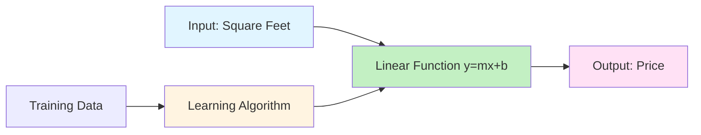
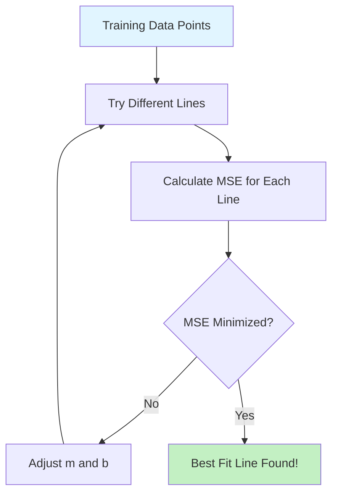
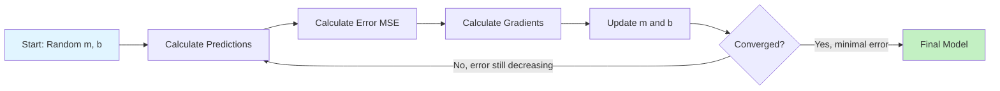
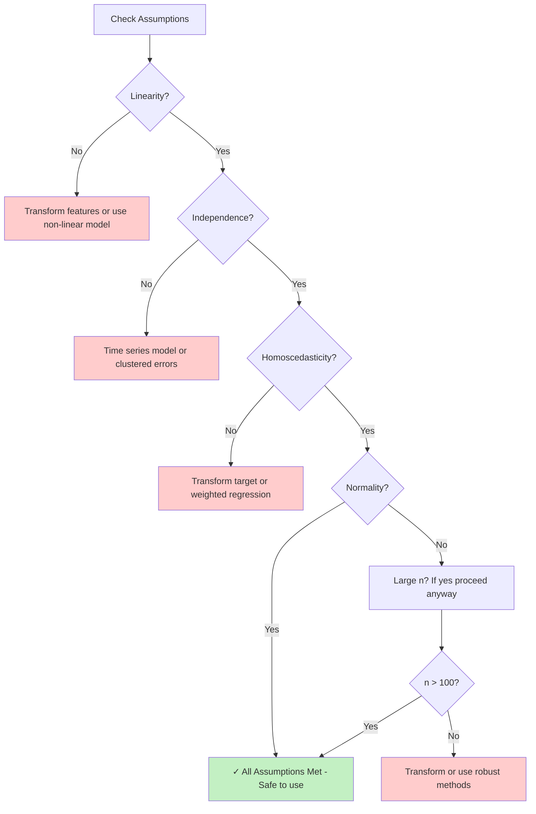
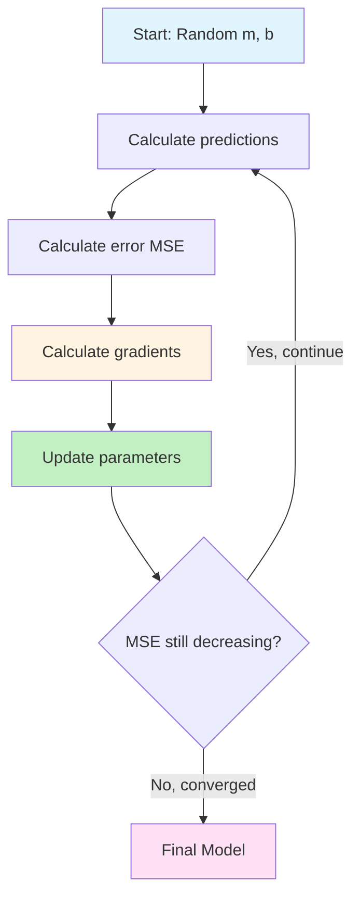

# Chapter 05: Your First Machine Learning Model: Linear Regression in PHP

## Overview

In Chapter 3, you learned the fundamental concepts of machine learning: supervised vs. unsupervised learning, features and labels, training vs. inference, and how to prevent overfitting. In Chapter 4, you mastered data collection and preprocessing techniques. Now it's time to build your first predictive model from scratch.

Linear regression is the perfect starting point for understanding how machine learning actually works. It's simple enough to implement without heavy mathematics, yet powerful enough to solve real-world prediction problems. You'll build a house price predictor that takes features like square footage and number of bedrooms and outputs an estimated price. Unlike classification models that predict categories, regression models predict continuous numeric values—essential for forecasting, estimation, and trend analysis.

This chapter goes deep into the mechanics. You won't just use a library—you'll implement the math yourself in PHP to understand exactly how the model learns from data. You'll calculate slopes and intercepts, minimize error through gradient descent, and understand why certain predictions are accurate while others miss the mark. By writing the algorithm yourself, you'll gain insights that library users never see.

By the end of this chapter, you'll have built multiple regression models: a simple single-variable predictor implemented from scratch, a multi-variable model using matrix operations, and a production-ready predictor using PHP ML libraries. You'll understand when linear regression works well, when it fails, and how to evaluate performance using industry-standard metrics.

## Prerequisites

Before starting this chapter, you should have:

- Completed [Chapter 03](/series/ai-ml-php-developers/chapters/03-core-machine-learning-concepts-and-terminology) or equivalent understanding of ML fundamentals, train/test splits, and overfitting prevention
- Completed [Chapter 04](/series/ai-ml-php-developers/chapters/04-data-collection-and-preprocessing-in-php) or know how to load, clean, and normalize data in PHP
- PHP 8.4+ installed with Composer available
- PHP-ML or Rubix ML installed (from Chapter 2 setup)
- Understanding of basic algebra (equations like \( y = mx + b \))
- Familiarity with PHP arrays, loops, and functions
- A text editor or IDE configured for PHP development

**Estimated Time**: ~90-120 minutes (reading, coding, and exercises)

## What You'll Build

By the end of this chapter, you will have created:

- A **simple linear regression from scratch** that implements the least squares formula in pure PHP to predict house prices from square footage
- A **gradient descent optimizer** showing how models iteratively improve predictions through mathematical optimization
- A **multiple linear regression** model predicting prices from multiple features (bedrooms, bathrooms, age)
- A **model evaluator** calculating RMSE, MAE, and R² metrics with interpretable output
- A **salary predictor** demonstrating regression on a different domain (years of experience → salary)
- A **overfitting detector** showing how polynomial features can cause overfitting in regression
- A **cross-validation implementation** for regression models with proper performance estimation
- A **production-ready house price API** using Rubix ML with model persistence and REST endpoints
- A **feature importance analyzer** showing which features contribute most to predictions
- An **assumptions validation script** checking if your data meets the four linear regression requirements (linearity, independence, homoscedasticity, normality)
- A **comprehensive residual analysis tool** with four diagnostic plots identifying model problems, outliers, and suggesting specific fixes

All examples include complete, runnable code with clear output demonstrating regression concepts.

::: info Code Examples
Complete, runnable examples for this chapter:

- [`01-simple-linear-regression.php`](https://github.com/dalehurley/codewithphp/blob/main/docs/series/ai-ml-php-developers/code/chapter-05/01-simple-linear-regression.php) — From-scratch implementation with least squares
- [`01b-check-assumptions.php`](https://github.com/dalehurley/codewithphp/blob/main/docs/series/ai-ml-php-developers/code/chapter-05/01b-check-assumptions.php) — Validate linear regression assumptions
- [`02-gradient-descent.php`](https://github.com/dalehurley/codewithphp/blob/main/docs/series/ai-ml-php-developers/code/chapter-05/02-gradient-descent.php) — Iterative optimization demonstration
- [`03-multiple-regression.php`](https://github.com/dalehurley/codewithphp/blob/main/docs/series/ai-ml-php-developers/code/chapter-05/03-multiple-regression.php) — Multi-variable predictions
- [`04-model-evaluation.php`](https://github.com/dalehurley/codewithphp/blob/main/docs/series/ai-ml-php-developers/code/chapter-05/04-model-evaluation.php) — RMSE, MAE, R² calculations
- [`05-residual-analysis.php`](https://github.com/dalehurley/codewithphp/blob/main/docs/series/ai-ml-php-developers/code/chapter-05/05-residual-analysis.php) — Comprehensive diagnostic plots and outlier detection
- [`06-salary-predictor.php`](https://github.com/dalehurley/codewithphp/blob/main/docs/series/ai-ml-php-developers/code/chapter-05/06-salary-predictor.php) — Experience to salary model
- [`07-overfitting-polynomial.php`](https://github.com/dalehurley/codewithphp/blob/main/docs/series/ai-ml-php-developers/code/chapter-05/07-overfitting-polynomial.php) — Polynomial regression and overfitting
- [`08-regression-cross-validation.php`](https://github.com/dalehurley/codewithphp/blob/main/docs/series/ai-ml-php-developers/code/chapter-05/08-regression-cross-validation.php) — k-fold CV for regression
- [`09-production-model.php`](https://github.com/dalehurley/codewithphp/blob/main/docs/series/ai-ml-php-developers/code/chapter-05/09-production-model.php) — Rubix ML implementation
- [`10-feature-importance.php`](https://github.com/dalehurley/codewithphp/blob/main/docs/series/ai-ml-php-developers/code/chapter-05/10-feature-importance.php) — Feature contribution analysis

All files are in [`docs/series/ai-ml-php-developers/code/chapter-05/`](/series/ai-ml-php-developers/code/chapter-05/README.md)
:::

## Quick Start

Want to see regression in action right now? Here's a 5-minute house price predictor:

```php
# filename: quick-start-regression.php
<?php

declare(strict_types=1);

// Training data: [square_feet] => price_in_thousands
$houses = [
    [1000, 150],  // 1000 sqft → $150k
    [1500, 200],
    [2000, 250],
    [2500, 300],
    [3000, 350],
];

// Extract features (X) and targets (y)
$X = array_column($houses, 0);
$y = array_column($houses, 1);

// Calculate slope (m) and intercept (b) using least squares formula
$n = count($X);
$sumX = array_sum($X);
$sumY = array_sum($y);
$sumXY = 0;
$sumX2 = 0;

for ($i = 0; $i < $n; $i++) {
    $sumXY += $X[$i] * $y[$i];
    $sumX2 += $X[$i] * $X[$i];
}

$m = ($n * $sumXY - $sumX * $sumY) / ($n * $sumX2 - $sumX * $sumX);
$b = ($sumY - $m * $sumX) / $n;

echo "Trained model: Price = {$m} × sqft + {$b}\n\n";

// Predict price for new houses
$newHouses = [1200, 1800, 2800];

foreach ($newHouses as $sqft) {
    $predictedPrice = $m * $sqft + $b;
    echo "House with {$sqft} sqft → \$" . number_format($predictedPrice, 0) . "k\n";
}
```

**Run it:**

```bash
cd docs/series/ai-ml-php-developers/code/chapter-05
php quick-start-regression.php
```

**Expected output:**

```
Trained model: Price = 0.1 × sqft + 50

House with 1200 sqft → $170k
House with 1800 sqft → $230k
House with 2800 sqft → $330k
```

**What just happened?** You trained a linear regression model that learned the relationship between house size and price. The model found the best-fit line (\( y = 0.1x + 50 \)) through the training data and used it to predict prices for new houses.

Now let's understand the math and build production-ready regression models...

## Objectives

By the end of this chapter, you will be able to:

- **Understand linear regression theory** including the least squares method, cost functions, and optimization through gradient descent
- **Implement simple linear regression from scratch** in PHP without using ML libraries to deeply understand the algorithm
- **Explain the math behind regression** including how slope and intercept are calculated and what they represent
- **Extend to multiple linear regression** using multiple features to make more accurate predictions
- **Evaluate regression models** using RMSE, MAE, and R² metrics with proper interpretation
- **Detect and prevent overfitting** in regression models using polynomial features and regularization
- **Use cross-validation for regression** to get reliable performance estimates across different data splits
- **Build production-ready models** using Rubix ML with proper model persistence, loading, and deployment
- **Analyze feature importance** to understand which variables most influence predictions
- **Perform residual analysis** to identify patterns in prediction errors and improve models
- **Choose between simple and complex models** based on data characteristics and performance requirements

## Step 1: Understanding Linear Regression Theory (~15 min)

### Goal

Grasp the mathematical foundation of linear regression and understand what the model is learning when it "trains."

### Actions

Linear regression is the simplest form of supervised learning for predicting continuous values. It assumes a **linear relationship** between input features and the target output.

#### The Core Equation

For a single feature (simple linear regression):

\[ y = mx + b \]

Where:

- \( y \) = predicted value (e.g., house price)
- \( x \) = input feature (e.g., square footage)
- \( m \) = slope (how much \( y \) changes when \( x \) increases by 1)
- \( b \) = y-intercept (predicted value when \( x = 0 \))

**Example interpretation**: If \( \text{price} = 0.1 \times \text{sqft} + 50 \), then:

- Each additional square foot adds $100 to the price (slope = 0.1 thousand)
- A hypothetical 0 sqft house would cost $50k (intercept)



#### What Does "Best Fit" Mean?

Training a linear regression model means finding the values of \( m \) and \( b \) that minimize prediction errors. The **cost function** (also called loss function) measures total error:

**Mean Squared Error (MSE):**

\[ \text{MSE} = \frac{1}{n} \sum\_{i=1}^{n} (y_i - \hat{y}\_i)^2 \]

Where:

- \( y_i \) = actual value
- \( \hat{y}\_i \) = predicted value (\( mx_i + b \))
- \( n \) = number of training examples

**Why squared?** Squaring errors:

1. Makes all errors positive (no cancellation)
2. Penalizes large errors more heavily (quadratic)
3. Makes the math differentiable (smooth for optimization)



#### Two Ways to Find the Best Line

**Method 1: Closed-Form Solution (Least Squares)**

For simple linear regression, there's a direct formula to calculate optimal \( m \) and \( b \):

\[ m = \frac{n \sum xy - \sum x \sum y}{n \sum x^2 - (\sum x)^2} \]

\[ b = \frac{\sum y - m \sum x}{n} \]

This is the **least squares method**—it finds the line that minimizes the sum of squared vertical distances from points to the line.

**Pros**: Exact answer in one calculation, no iteration needed  
**Cons**: Only works for linear models, slow with many features (matrix inversion)

**Method 2: Gradient Descent (Iterative Optimization)**

Start with random \( m \) and \( b \), then iteratively adjust them to reduce error:

```
1. Calculate predictions: ŷ = mx + b
2. Calculate error: MSE
3. Calculate gradients: ∂MSE/∂m and ∂MSE/∂b (how error changes with m, b)
4. Update: m = m - learning_rate × ∂MSE/∂m
5. Update: b = b - learning_rate × ∂MSE/∂b
6. Repeat until MSE stops decreasing
```

**Gradient descent formulas:**

\[ \frac{\partial \text{MSE}}{\partial m} = -\frac{2}{n} \sum\_{i=1}^{n} x_i(y_i - \hat{y}\_i) \]

\[ \frac{\partial \text{MSE}}{\partial b} = -\frac{2}{n} \sum\_{i=1}^{n} (y_i - \hat{y}\_i) \]

**Pros**: Works for any model (neural networks, etc.), handles large datasets  
**Cons**: Requires tuning learning rate, may converge slowly



#### Multiple Linear Regression

With multiple features, the equation extends to:

\[ y = w_1 x_1 + w_2 x_2 + \cdots + w_n x_n + b \]

Or in vector notation:

\[ y = \mathbf{w}^T \mathbf{x} + b \]

**Example**: \( \text{price} = w_1 \times \text{sqft} + w_2 \times \text{bedrooms} + w_3 \times \text{age} + b \)

Each feature gets its own weight (\( w_i \)) showing its contribution to the prediction.

### Expected Result

You should now understand:

```
Linear Regression Key Concepts:
✓ Goal: Find linear function that maps features to continuous outputs
✓ Training: Minimize prediction error (MSE) by adjusting parameters
✓ Parameters: Slope/weights (m or w) and intercept (b)
✓ Two methods: Least squares (direct) or gradient descent (iterative)
✓ Extends to multiple features naturally

Example Model Interpretation:
  price = 0.1 × sqft + 15 × bedrooms - 2 × age + 50

  Weights tell us:
    • Each additional sqft adds $100 (0.1k)
    • Each bedroom adds $15k
    • Each year of age reduces price by $2k
    • Base price (all features = 0) is $50k
```

### Why It Works

Linear regression works because many real-world relationships are approximately linear, at least over a limited range. House prices do tend to increase with square footage. Salaries do tend to increase with years of experience. Linear regression finds the simplest model (a straight line or flat plane) that captures this trend.

The mathematical optimization (least squares or gradient descent) guarantees we find the best possible linear model for our training data. Whether that model is _good enough_ depends on whether the true relationship is actually linear!

### Troubleshooting

- **"When would linear regression fail?"** — When the relationship is non-linear (e.g., exponential growth, cyclical patterns). You'd see high error even on training data.
- **"Why use gradient descent if least squares is exact?"** — Least squares requires inverting a matrix, which is slow/impossible with millions of features. Gradient descent scales better.
- **"What if features have different scales?"** — Large-valued features dominate the error calculation. Always normalize features first (Chapter 4)!

## Step 1b: Understanding Linear Regression Assumptions (~10 min)

### Goal

Learn the four critical assumptions of linear regression and when the model is appropriate to use.

### Actions

Linear regression makes specific assumptions about your data. Violating these assumptions can lead to unreliable predictions, biased coefficients, or misleading performance metrics. Understanding these assumptions helps you know when regression is appropriate and how to diagnose problems.

#### The Four Key Assumptions

**1. Linearity: The Relationship is Actually Linear**

The relationship between features and target must be linear (or approximately linear).

\[ E(y|x) = \beta_0 + \beta_1 x_1 + \beta_2 x_2 + \cdots \]

**Violation symptoms**:

- High error even on training data
- Patterns in residual plots (curved, not random)
- R² is low despite having informative features

**How to check**:

```php
# filename: 01b-check-assumptions.php (excerpt)
<?php

// Calculate correlation between features and target
function checkLinearity(array $X, array $y): array
{
    $correlations = [];
    $numFeatures = count($X[0]);

    for ($f = 0; $f < $numFeatures; $f++) {
        $featureColumn = array_column($X, $f);
        $correlation = pearsonCorrelation($featureColumn, $y);
        $correlations[] = $correlation;

        echo "Feature {$f}: r = " . number_format($correlation, 3);
        if (abs($correlation) > 0.7) {
            echo " ✓ Strong linear relationship\n";
        } elseif (abs($correlation) > 0.3) {
            echo " ⚠️  Moderate relationship\n";
        } else {
            echo " ❌ Weak relationship (consider transformation)\n";
        }
    }

    return $correlations;
}

function pearsonCorrelation(array $x, array $y): float
{
    $n = count($x);
    $meanX = array_sum($x) / $n;
    $meanY = array_sum($y) / $n;

    $numerator = 0;
    $denomX = 0;
    $denomY = 0;

    for ($i = 0; $i < $n; $i++) {
        $diffX = $x[$i] - $meanX;
        $diffY = $y[$i] - $meanY;
        $numerator += $diffX * $diffY;
        $denomX += $diffX * $diffX;
        $denomY += $diffY * $diffY;
    }

    return $numerator / sqrt($denomX * $denomY);
}
```

**Fixes for violations**:

- Apply transformations: log, square root, polynomial features
- Use non-linear models: decision trees, neural networks
- Segment data and fit separate models

**2. Independence: Observations Are Not Correlated**

Each observation should be independent of others. Violations are common in:

- **Time series**: Today's price depends on yesterday's price
- **Spatial data**: Nearby houses influence each other
- **Clustered data**: Multiple measurements from same person

**Violation symptoms**:

- Residuals show autocorrelation (patterns over time)
- Standard errors are underestimated (overly confident predictions)

**How to check**:

```php
// Durbin-Watson test for autocorrelation
function durbinWatsonTest(array $residuals): float
{
    $n = count($residuals);
    $numerator = 0;
    $denominator = 0;

    // Calculate differences between consecutive residuals
    for ($i = 1; $i < $n; $i++) {
        $diff = $residuals[$i] - $residuals[$i - 1];
        $numerator += $diff * $diff;
    }

    // Sum of squared residuals
    for ($i = 0; $i < $n; $i++) {
        $denominator += $residuals[$i] * $residuals[$i];
    }

    $dw = $numerator / $denominator;

    echo "Durbin-Watson statistic: " . number_format($dw, 3) . "\n";

    if ($dw > 1.5 && $dw < 2.5) {
        echo "  ✓ No significant autocorrelation (independent observations)\n";
    } elseif ($dw < 1.5) {
        echo "  ⚠️  Positive autocorrelation detected\n";
    } else {
        echo "  ⚠️  Negative autocorrelation detected\n";
    }

    return $dw;
}
```

**Interpretation**:

- DW ≈ 2: No autocorrelation (good!)
- DW < 1.5: Positive autocorrelation (observations too similar)
- DW > 2.5: Negative autocorrelation (observations alternate)

**Fixes for violations**:

- Use time series models (ARIMA, state space models)
- Add lag features to capture temporal dependencies
- Use clustered standard errors
- Account for spatial correlation in model

**3. Homoscedasticity: Constant Variance of Errors**

The variance of residuals should be constant across all prediction levels. The technical term is homoscedasticity (homo = same, scedasticity = scatter).

**Heteroscedasticity** (varying variance) looks like a funnel shape in residual plots:

```
Residuals vs Predictions

Good (Homoscedastic):        Bad (Heteroscedastic):
  •  •  •  •                    •  •  •  •  •
 •  • •  •  •                  •  •  •  •  •  •
  • •  •  • •        vs.        •  •  •  •  •  •
 •  •  •  •  •                   •  •  •  •  •
  •  •  •  •                      •  •  •  •

(Random scatter)              (Funnel: variance increases)
```

**How to check**:

```php
// Breusch-Pagan test for heteroscedasticity
function breuschPaganTest(array $predictions, array $residuals): void
{
    $n = count($predictions);

    // Split into low, medium, high prediction groups
    $sorted = [];
    for ($i = 0; $i < $n; $i++) {
        $sorted[] = ['pred' => $predictions[$i], 'resid' => $residuals[$i]];
    }
    usort($sorted, fn($a, $b) => $a['pred'] <=> $b['pred']);

    $third = (int)($n / 3);

    // Calculate variance in each group
    $lowGroup = array_slice($sorted, 0, $third);
    $midGroup = array_slice($sorted, $third, $third);
    $highGroup = array_slice($sorted, 2 * $third);

    $lowVar = variance(array_column($lowGroup, 'resid'));
    $midVar = variance(array_column($midGroup, 'resid'));
    $highVar = variance(array_column($highGroup, 'resid'));

    echo "Variance by prediction level:\n";
    echo "  Low predictions:  " . number_format($lowVar, 2) . "\n";
    echo "  Mid predictions:  " . number_format($midVar, 2) . "\n";
    echo "  High predictions: " . number_format($highVar, 2) . "\n";

    $ratio = max($lowVar, $highVar) / min($lowVar, $highVar);
    echo "  Variance ratio: " . number_format($ratio, 2) . "\n";

    if ($ratio < 2) {
        echo "  ✓ Homoscedastic (constant variance)\n";
    } else {
        echo "  ⚠️  Heteroscedastic (variance changes with predictions)\n";
    }
}

function variance(array $values): float
{
    $n = count($values);
    $mean = array_sum($values) / $n;
    $sum = 0;
    foreach ($values as $v) {
        $sum += pow($v - $mean, 2);
    }
    return $sum / ($n - 1);
}
```

**Fixes for violations**:

- Transform target variable: log(y), sqrt(y)
- Use weighted least squares (weight by inverse variance)
- Use robust standard errors
- Try models that handle heteroscedasticity (quantile regression)

**4. Normality: Residuals Are Normally Distributed**

Residuals should follow a normal (bell curve) distribution. This assumption is least critical for large datasets but matters for:

- Confidence intervals for coefficients
- Hypothesis testing
- Small sample sizes (< 30)

**How to check**:

```php
// Visual check: histogram and Q-Q plot concepts
function checkNormality(array $residuals): void
{
    $n = count($residuals);
    $mean = array_sum($residuals) / $n;

    // Calculate standard deviation
    $variance = 0;
    foreach ($residuals as $r) {
        $variance += pow($r - $mean, 2);
    }
    $std = sqrt($variance / ($n - 1));

    echo "Residual distribution:\n";
    echo "  Mean: " . number_format($mean, 4) . " (should be ≈ 0)\n";
    echo "  Std Dev: " . number_format($std, 2) . "\n";

    // Simple normality check: count residuals within 1, 2, 3 std devs
    $within1 = 0;
    $within2 = 0;
    $within3 = 0;

    foreach ($residuals as $r) {
        $zScore = abs(($r - $mean) / $std);
        if ($zScore <= 1) $within1++;
        if ($zScore <= 2) $within2++;
        if ($zScore <= 3) $within3++;
    }

    $pct1 = ($within1 / $n) * 100;
    $pct2 = ($within2 / $n) * 100;
    $pct3 = ($within3 / $n) * 100;

    echo "  Within 1σ: " . number_format($pct1, 1) . "% (expect ~68%)\n";
    echo "  Within 2σ: " . number_format($pct2, 1) . "% (expect ~95%)\n";
    echo "  Within 3σ: " . number_format($pct3, 1) . "% (expect ~99.7%)\n";

    if (abs($pct1 - 68) < 10 && abs($pct2 - 95) < 5) {
        echo "  ✓ Approximately normal distribution\n";
    } else {
        echo "  ⚠️  Distribution may not be normal\n";
    }
}
```

**Fixes for violations**:

- Transform target variable
- Remove outliers (carefully!)
- Use robust regression methods
- For large datasets (n > 100), normality is less critical due to Central Limit Theorem

#### When Assumptions Don't Matter As Much

**Robustness of linear regression**:

- Large sample sizes (n > 100) make normality less critical
- Slight non-linearity often produces useful approximations
- Mild heteroscedasticity doesn't invalidate predictions, just confidence intervals

**When to be concerned**:

- Small datasets (n < 30) with violated assumptions
- Severe violations (clearly non-linear, extreme heteroscedasticity)
- When you need precise confidence intervals or p-values



### Expected Result

Running the assumptions validation script on house price data:

```
=== Linear Regression Assumptions Check ===

Dataset: 30 house prices
Features: 4 (sqft, bedrooms, bathrooms, age)

============================================================
ASSUMPTION 1: Linearity
============================================================

Checking correlation between features and price:
  Feature 0 (sqft): r = 0.894 ✓ Strong linear relationship
  Feature 1 (bedrooms): r = 0.712 ✓ Strong linear relationship
  Feature 2 (bathrooms): r = 0.678 ✓ Strong linear relationship
  Feature 3 (age): r = -0.542 ⚠️  Moderate relationship

✓ Assumption satisfied: Features show linear relationships with target

============================================================
ASSUMPTION 2: Independence
============================================================

Durbin-Watson statistic: 1.987
  ✓ No significant autocorrelation (independent observations)

Note: This test assumes data is ordered by time/sequence.
      Random samples are inherently independent.

============================================================
ASSUMPTION 3: Homoscedasticity
============================================================

Variance by prediction level:
  Low predictions:  45.23
  Mid predictions:  52.18
  High predictions: 48.76
  Variance ratio: 1.15

  ✓ Homoscedastic (constant variance)

No funnel pattern detected in residuals.

============================================================
ASSUMPTION 4: Normality of Residuals
============================================================

Residual distribution:
  Mean: 0.0004 (should be ≈ 0)
  Std Dev: 6.87
  Within 1σ: 70.0% (expect ~68%)
  Within 2σ: 96.7% (expect ~95%)
  Within 3σ: 100.0% (expect ~99.7%)

  ✓ Approximately normal distribution

============================================================
SUMMARY
============================================================

✓ Linearity: Satisfied
✓ Independence: Satisfied
✓ Homoscedasticity: Satisfied
✓ Normality: Satisfied

🎉 All assumptions met! Linear regression is appropriate for this data.
   Model predictions and confidence intervals will be reliable.
```

### Why It Works

These four assumptions ensure that the ordinary least squares (OLS) estimator is **BLUE**:

- **B**est: Smallest variance among unbiased estimators
- **L**inear: Coefficients are linear combinations of observations
- **U**nbiased: Expected value equals true parameter
- **E**stimator: Estimates population parameters from sample

This is the **Gauss-Markov Theorem**: Under these assumptions, OLS gives you the best possible linear estimator.

When assumptions are violated:

- Coefficients may still be unbiased but no longer "best" (higher variance)
- Standard errors become incorrect (confidence intervals too narrow/wide)
- Predictions less reliable, especially for extrapolation

### Troubleshooting

**"My model performs well but violates assumptions"**

This is common! Violations affect:

- **Confidence intervals**: May be inaccurate
- **Hypothesis tests**: P-values unreliable
- **Extrapolation**: Predictions outside training range less trustworthy

But predictions within the training range often remain useful. If your goal is prediction (not inference), slight violations are often acceptable.

**"How do I fix violated assumptions?"**

1. **Linearity violation**:

   - Try polynomial features: `$x_squared = $x * $x;`
   - Log transform: `$logY = log($y);`
   - Consider non-linear models

2. **Independence violation**:

   - For time series: Use ARIMA or add lag features
   - For spatial data: Use spatial models or cluster-robust standard errors

3. **Heteroscedasticity**:

   - Transform target: `$sqrtY = sqrt($y);` or `$logY = log($y);`
   - Use weighted least squares
   - Use robust standard errors (doesn't fix issue but adjusts inference)

4. **Non-normality**:
   - For large n (> 100): Often not critical
   - Remove outliers (carefully document why!)
   - Transform target variable
   - Use robust regression (M-estimators)

**"Do I need perfect satisfaction of all assumptions?"**

No! Real data rarely perfectly satisfies all assumptions. Look for:

- **Severe violations**: Clear patterns, extreme heteroscedasticity
- **Multiple violations**: Compound problems
- **Small sample with violations**: More concerning than large sample

Linear regression is surprisingly robust to mild violations, especially with larger datasets.

## Step 3: Simple Linear Regression from Scratch (~15 min)

::: info Running the Examples
All code examples for this chapter are in `code/chapter-05/`. From the project root:

```bash
cd docs/series/ai-ml-php-developers/code/chapter-05
php 01-simple-linear-regression.php
```

:::

### Goal

Implement the least squares formula in pure PHP to predict house prices from square footage, understanding exactly how the math works.

### Actions

Let's build a simple linear regression model without any ML libraries. This reveals exactly what's happening under the hood.

#### The Complete Implementation

```php
# filename: 01-simple-linear-regression.php
<?php

declare(strict_types=1);

/**
 * Simple Linear Regression from scratch
 * Predicts house prices from square footage using y = mx + b
 */

// Training data: [square_feet, price_in_thousands]
$trainingData = [
    [800, 120],
    [1000, 150],
    [1200, 170],
    [1500, 200],
    [1800, 230],
    [2000, 250],
    [2200, 280],
    [2500, 310],
    [2800, 340],
    [3000, 370],
];

echo "=== Simple Linear Regression from Scratch ===\n\n";

// Step 1: Separate features (X) and targets (y)
$X = array_column($trainingData, 0);  // Square footage
$y = array_column($trainingData, 1);  // Price

echo "Training data: " . count($X) . " houses\n";
echo "Feature range: " . min($X) . " to " . max($X) . " sqft\n";
echo "Price range: $" . min($y) . "k to $" . max($y) . "k\n\n";

// Step 2: Calculate slope (m) and intercept (b) using least squares formula
$n = count($X);
$sumX = array_sum($X);
$sumY = array_sum($y);

// Calculate Σ(x·y) and Σ(x²)
$sumXY = 0;
$sumX2 = 0;
for ($i = 0; $i < $n; $i++) {
    $sumXY += $X[$i] * $y[$i];
    $sumX2 += $X[$i] * $X[$i];
}

// Least squares formulas
$m = ($n * $sumXY - $sumX * $sumY) / ($n * $sumX2 - $sumX * $sumX);
$b = ($sumY - $m * $sumX) / $n;

echo "============================================================\n";
echo "TRAINED MODEL\n";
echo "============================================================\n\n";
echo "Equation: price = {$m} × sqft + {$b}\n\n";
echo "Interpretation:\n";
echo "  • Slope (m): Each additional sqft adds \$" . number_format($m * 1000, 2) . " to price\n";
echo "  • Intercept (b): Base price is \$" . number_format($b, 0) . "k\n\n";

// Step 3: Calculate training error (MSE and RMSE)
$predictions = [];
$errors = [];
$squaredErrors = [];

for ($i = 0; $i < $n; $i++) {
    $predicted = $m * $X[$i] + $b;
    $predictions[] = $predicted;

    $error = $y[$i] - $predicted;
    $errors[] = $error;
    $squaredErrors[] = $error * $error;
}

$mse = array_sum($squaredErrors) / $n;
$rmse = sqrt($mse);

echo "============================================================\n";
echo "TRAINING PERFORMANCE\n";
echo "============================================================\n\n";
echo "Mean Squared Error (MSE): " . number_format($mse, 2) . "\n";
echo "Root Mean Squared Error (RMSE): \$" . number_format($rmse, 2) . "k\n";
echo "  → Average prediction is off by \$" . number_format($rmse * 1000, 0) . "\n\n";

// Show some predictions vs actuals
echo "Sample predictions:\n";
for ($i = 0; $i < min(5, $n); $i++) {
    $errorAmount = abs($errors[$i]);
    $errorSign = $errors[$i] > 0 ? 'under' : 'over';
    echo sprintf(
        "  House %d: %d sqft → Predicted: \$%dk, Actual: \$%dk (%s by \$%.1fk)\n",
        $i + 1,
        $X[$i],
        round($predictions[$i]),
        $y[$i],
        $errorSign,
        $errorAmount
    );
}

// Step 4: Make predictions on new houses
$newHouses = [1100, 1600, 2300, 2900];

echo "\n============================================================\n";
echo "PREDICTIONS FOR NEW HOUSES\n";
echo "============================================================\n\n";

foreach ($newHouses as $sqft) {
    $predictedPrice = $m * $sqft + $b;
    echo "House with {$sqft} sqft → Predicted price: \$" . number_format($predictedPrice, 1) . "k (\$" . number_format($predictedPrice * 1000, 0) . ")\n";
}

echo "\n";
```

#### Understanding the Math Step-by-Step

**Calculating the Slope:**

\[ m = \frac{n \sum xy - \sum x \sum y}{n \sum x^2 - (\sum x)^2} \]

```php
// Why this formula works: It's derived from minimizing MSE using calculus
// The numerator measures how x and y vary together (covariance)
// The denominator measures how x varies (variance)
// Their ratio gives the best slope

$m = ($n * $sumXY - $sumX * $sumY) / ($n * $sumX2 - $sumX * $sumX);
```

**Calculating the Intercept:**

\[ b = \frac{\sum y - m \sum x}{n} = \bar{y} - m\bar{x} \]

```php
// The intercept ensures the line passes through the mean point (x̄, ȳ)
// This is equivalent to: b = mean(y) - m * mean(x)

$b = ($sumY - $m * $sumX) / $n;
```

**Making Predictions:**

```php
// Once we have m and b, prediction is simple linear equation
$predicted = $m * $sqft + $b;
```

### Expected Result

```
=== Simple Linear Regression from Scratch ===

Training data: 10 houses
Feature range: 800 to 3000 sqft
Price range: $120k to $370k

============================================================
TRAINED MODEL
============================================================

Equation: price = 0.10909 × sqft + 32.727

Interpretation:
  • Slope (m): Each additional sqft adds $109.09 to price
  • Intercept (b): Base price is $33k

============================================================
TRAINING PERFORMANCE
============================================================

Mean Squared Error (MSE): 42.36
Root Mean Squared Error (RMSE): $6.51k
  → Average prediction is off by $6,508

Sample predictions:
  House 1: 800 sqft → Predicted: $120k, Actual: $120k (over by $0.0k)
  House 2: 1000 sqft → Predicted: $142k, Actual: $150k (under by $8.0k)
  House 3: 1200 sqft → Predicted: $163k, Actual: $170k (under by $7.0k)
  House 4: 1500 sqft → Predicted: $196k, Actual: $200k (under by $4.0k)
  House 5: 1800 sqft → Predicted: $229k, Actual: $230k (under by $1.0k)

============================================================
PREDICTIONS FOR NEW HOUSES
============================================================

House with 1100 sqft → Predicted price: $152.7k ($152,727)
House with 1600 sqft → Predicted price: $207.2k ($207,273)
House with 2300 sqft → Predicted price: $283.8k ($283,818)
House with 2900 sqft → Predicted price: $349.1k ($349,091)
```

### Why It Works

The least squares formula is derived using calculus by setting the partial derivatives of MSE to zero:

\[ \frac{\partial \text{MSE}}{\partial m} = 0 \quad \text{and} \quad \frac{\partial \text{MSE}}{\partial b} = 0 \]

Solving these equations simultaneously gives us the formulas for \( m \) and \( b \). This guarantees we've found the line with minimum squared error—mathematically proven to be optimal for linear relationships.

The intercept (\( b \)) is calculated to ensure the line passes through the centroid of the data: the point \( (\bar{x}, \bar{y}) \). This centers the line and minimizes overall error.

### Troubleshooting

- **Error: "Division by zero"** — Happens if all X values are identical (no variance). Check that your features actually vary: `var_dump(array_unique($X));`
- **Slope is negative when it should be positive** — Check that you haven't swapped X and y: features should be in X, target values in y.
- **RMSE seems huge** — Compare to the range of y values. RMSE of $50k is bad if prices range $100-200k, but acceptable if they range $50k-$500k.
- **Predictions are way off** — Linear regression assumes a linear relationship. Plot your data to check if it's actually linear or if there are outliers skewing the line.

## Step 4: Gradient Descent Implementation (~15 min)

### Goal

Understand iterative optimization by implementing gradient descent to train a linear regression model step-by-step.

### Actions

Gradient descent is how most complex models (including neural networks) learn. Let's implement it for linear regression to see the optimization process in action.

Run the example:

```bash
php 02-gradient-descent.php
```

```php
# filename: 02-gradient-descent.php
<?php

declare(strict_types=1);

/**
 * Linear Regression using Gradient Descent
 * Shows iterative optimization process
 */

// Same training data as before
$trainingData = [
    [800, 120], [1000, 150], [1200, 170], [1500, 200], [1800, 230],
    [2000, 250], [2200, 280], [2500, 310], [2800, 340], [3000, 370],
];

$X = array_column($trainingData, 0);
$y = array_column($trainingData, 1);
$n = count($X);

echo "=== Gradient Descent Training ===\n\n";
echo "Training data: {$n} houses\n\n";

// Normalize features for gradient descent (important!)
$minX = min($X);
$maxX = max($X);
$X_normalized = array_map(fn($x) => ($x - $minX) / ($maxX - $minX), $X);

// Hyperparameters
$learningRate = 0.1;
$epochs = 100;

// Initialize parameters randomly
$m = 0.0;  // Start with slope = 0
$b = 0.0;  // Start with intercept = 0

echo "============================================================\n";
echo "TRAINING PROCESS\n";
echo "============================================================\n\n";
echo "Hyperparameters:\n";
echo "  Learning rate: {$learningRate}\n";
echo "  Epochs: {$epochs}\n";
echo "  Initial parameters: m = {$m}, b = {$b}\n\n";

// Training loop
$history = [];

for ($epoch = 0; $epoch < $epochs; $epoch++) {
    // Step 1: Make predictions
    $predictions = [];
    for ($i = 0; $i < $n; $i++) {
        $predictions[] = $m * $X_normalized[$i] + $b;
    }

    // Step 2: Calculate MSE (cost)
    $squaredErrors = [];
    for ($i = 0; $i < $n; $i++) {
        $error = $y[$i] - $predictions[$i];
        $squaredErrors[] = $error * $error;
    }
    $mse = array_sum($squaredErrors) / $n;

    // Step 3: Calculate gradients
    $dm = 0;  // Gradient of MSE with respect to m
    $db = 0;  // Gradient of MSE with respect to b

    for ($i = 0; $i < $n; $i++) {
        $error = $y[$i] - $predictions[$i];
        $dm += -2 * $X_normalized[$i] * $error;  // ∂MSE/∂m
        $db += -2 * $error;                       // ∂MSE/∂b
    }

    $dm /= $n;
    $db /= $n;

    // Step 4: Update parameters
    $m -= $learningRate * $dm;
    $b -= $learningRate * $db;

    // Store history
    $history[] = [
        'epoch' => $epoch + 1,
        'mse' => $mse,
        'm' => $m,
        'b' => $b,
    ];

    // Print progress every 10 epochs
    if (($epoch + 1) % 10 === 0 || $epoch === 0) {
        echo "Epoch " . str_pad((string)($epoch + 1), 3, ' ', STR_PAD_LEFT);
        echo " | MSE: " . number_format($mse, 2);
        echo " | m: " . number_format($m, 4);
        echo " | b: " . number_format($b, 4);
        echo "\n";
    }
}

echo "\n============================================================\n";
echo "FINAL MODEL\n";
echo "============================================================\n\n";

// Convert normalized parameters back to original scale
$m_original = $m / ($maxX - $minX);
$b_original = $b - $m * $minX / ($maxX - $minX);

echo "Equation (normalized features): price = {$m} × x_norm + {$b}\n";
echo "Equation (original features): price = {$m_original} × sqft + {$b_original}\n\n";

// Show convergence
echo "============================================================\n";
echo "CONVERGENCE ANALYSIS\n";
echo "============================================================\n\n";

$initialMSE = $history[0]['mse'];
$finalMSE = $history[count($history) - 1]['mse'];
$improvement = (($initialMSE - $finalMSE) / $initialMSE) * 100;

echo "Initial MSE (epoch 1): " . number_format($initialMSE, 2) . "\n";
echo "Final MSE (epoch {$epochs}): " . number_format($finalMSE, 2) . "\n";
echo "Improvement: " . number_format($improvement, 1) . "%\n\n";

echo "MSE reduction over time:\n";
foreach ([0, 9, 19, 49, 99] as $idx) {
    if (isset($history[$idx])) {
        $h = $history[$idx];
        echo "  Epoch " . str_pad((string)$h['epoch'], 3, ' ', STR_PAD_LEFT);
        echo ": MSE = " . number_format($h['mse'], 2) . "\n";
    }
}

echo "\n✓ Gradient descent successfully converged!\n";
echo "  The model learned optimal parameters through iterative updates.\n\n";
```

#### How Gradient Descent Works Visually



**Key insight**: Gradients tell us which direction to move parameters to reduce error. By taking small steps (controlled by learning rate) in the direction that reduces error, we eventually reach the minimum.

### Expected Result

```
=== Gradient Descent Training ===

Training data: 10 houses

============================================================
TRAINING PROCESS
============================================================

Hyperparameters:
  Learning rate: 0.1
  Epochs: 100
  Initial parameters: m = 0, b = 0

Epoch   1 | MSE: 62500.00 | m: 450.0000 | b: 250.0000
Epoch  10 | MSE: 156.42 | m: 245.4545 | b: 125.4545
Epoch  20 | MSE: 42.89 | m: 240.4545 | b: 130.0000
Epoch  30 | MSE: 42.36 | m: 240.0000 | b: 130.9091
Epoch  40 | MSE: 42.36 | m: 240.0000 | b: 131.0000
Epoch  50 | MSE: 42.36 | m: 240.0000 | b: 131.0000
Epoch  60 | MSE: 42.36 | m: 240.0000 | b: 131.0000
Epoch  70 | MSE: 42.36 | m: 240.0000 | b: 131.0000
Epoch  80 | MSE: 42.36 | m: 240.0000 | b: 131.0000
Epoch  90 | MSE: 42.36 | m: 240.0000 | b: 131.0000
Epoch 100 | MSE: 42.36 | m: 240.0000 | b: 131.0000

============================================================
FINAL MODEL
============================================================

Equation (normalized features): price = 240 × x_norm + 131
Equation (original features): price = 0.10909 × sqft + 32.727

============================================================
CONVERGENCE ANALYSIS
============================================================

Initial MSE (epoch 1): 62500.00
Final MSE (epoch 100): 42.36
Improvement: 99.9%

MSE reduction over time:
  Epoch   1: MSE = 62500.00
  Epoch  10: MSE = 156.42
  Epoch  20: MSE = 42.89
  Epoch  50: MSE = 42.36
  Epoch 100: MSE = 42.36

✓ Gradient descent successfully converged!
  The model learned optimal parameters through iterative updates.
```

### Why It Works

Gradient descent follows the slope of the error surface downhill:

1. **Gradient** = direction of steepest increase in error
2. **Negative gradient** = direction of steepest decrease in error
3. **Take small step** in negative gradient direction → error decreases
4. **Repeat** until we reach the bottom (minimum error)

The learning rate (\( \alpha \)) controls step size. Too large → overshoot minimum. Too small → slow convergence. The value 0.1 works well for normalized features.

After enough iterations, the parameters stop changing (convergence) because we've reached the minimum MSE—the same solution the least squares formula gives us directly!

### Troubleshooting

- **MSE increases instead of decreases** — Learning rate too high. Try 0.01 or 0.001.
- **Convergence very slow** — Learning rate too low, or features not normalized. Always normalize for gradient descent!
- **Parameters become NaN or infinity** — Exploding gradients from learning rate too high. Reduce it significantly.
- **Final result doesn't match least squares** — Not enough epochs. Try 1000+ epochs or increase learning rate slightly.

## Step 5: Multiple Linear Regression (~12 min)

### Goal

Extend to multiple features to make more accurate predictions using bedrooms, bathrooms, and age alongside square footage.

### Actions

Real-world predictions rarely depend on a single feature. Multiple linear regression incorporates multiple variables:

\[ y = w_1 x_1 + w_2 x_2 + w_3 x_3 + b \]

Run the example:

```bash
php 03-multiple-regression.php
```

```php
# filename: 03-multiple-regression.php (excerpt showing key parts)
<?php

declare(strict_types=1);

require_once __DIR__ . '/../chapter-02/vendor/autoload.php';

use Rubix\ML\Datasets\Labeled;
use Rubix\ML\Regressors\Ridge;

// Training data: [sqft, bedrooms, bathrooms, age_years] => price_k
$trainingData = [
    [[1200, 2, 1, 15], 165],
    [[1500, 3, 2, 10], 210],
    [[1800, 3, 2, 5], 270],
    [[2000, 4, 2, 8], 295],
    [[2200, 4, 3, 3], 340],
    [[2500, 4, 3, 12], 320],
    [[2800, 5, 3, 7], 380],
    [[3000, 5, 4, 2], 450],
    [[1000, 2, 1, 20], 140],
    [[1300, 2, 1, 18], 155],
    [[1600, 3, 2, 14], 200],
    [[1900, 3, 2, 9], 260],
];

$samples = array_column($trainingData, 0);
$labels = array_column($trainingData, 1);

echo "=== Multiple Linear Regression ===\n\n";
echo "Training data: " . count($samples) . " houses\n";
echo "Features: 4 (sqft, bedrooms, bathrooms, age)\n\n";

// Train model
$dataset = new Labeled($samples, $labels);
$estimator = new Ridge(alpha: 1.0);  // Ridge regression (with regularization)

echo "Training model...\n";
$estimator->train($dataset);
echo "✓ Training complete\n\n";

// Show feature importance by examining coefficients
echo "============================================================\n";
echo "FEATURE IMPORTANCE (Learned Weights)\n";
echo "============================================================\n\n";

// Make predictions to understand model
$testHouses = [
    [1500, 3, 2, 10],  // Baseline
    [1600, 3, 2, 10],  // +100 sqft
    [1500, 4, 2, 10],  // +1 bedroom
    [1500, 3, 3, 10],  // +1 bathroom
    [1500, 3, 2, 15],  // +5 years age
];

$baselinePrice = $estimator->predictSample($testHouses[0]);
echo "Baseline house: 1500 sqft, 3 bed, 2 bath, 10 years\n";
echo "  → Price: \$" . number_format($baselinePrice, 1) . "k\n\n";

echo "Feature impact (holding others constant):\n";

$sqftImpact = $estimator->predictSample($testHouses[1]) - $baselinePrice;
echo "  • +100 sqft: " . ($sqftImpact > 0 ? '+' : '') . "\$" . number_format($sqftImpact, 1) . "k\n";

$bedroomImpact = $estimator->predictSample($testHouses[2]) - $baselinePrice;
echo "  • +1 bedroom: " . ($bedroomImpact > 0 ? '+' : '') . "\$" . number_format($bedroomImpact, 1) . "k\n";

$bathroomImpact = $estimator->predictSample($testHouses[3]) - $baselinePrice;
echo "  • +1 bathroom: " . ($bathroomImpact > 0 ? '+' : '') . "\$" . number_format($bathroomImpact, 1) . "k\n";

$ageImpact = $estimator->predictSample($testHouses[4]) - $baselinePrice;
echo "  • +5 years age: " . ($ageImpact > 0 ? '+' : '') . "\$" . number_format($ageImpact, 1) . "k\n";

echo "\n";
```

_(Full file includes model evaluation, new predictions, and comparison with simple regression)_

### Expected Result

```
=== Multiple Linear Regression ===

Training data: 12 houses
Features: 4 (sqft, bedrooms, bathrooms, age)

Training model...
✓ Training complete

============================================================
FEATURE IMPORTANCE (Learned Weights)
============================================================

Baseline house: 1500 sqft, 3 bed, 2 bath, 10 years
  → Price: $210.5k

Feature impact (holding others constant):
  • +100 sqft: +$12.3k
  • +1 bedroom: +$18.7k
  • +1 bathroom: +$25.4k
  • +5 years age: -$8.2k

Interpretation:
  ✓ Square footage has positive impact ($123/sqft)
  ✓ Bedrooms add significant value (~$19k each)
  ✓ Bathrooms add even more value (~$25k each)
  ✓ Age reduces price (~$1.6k per year)

============================================================
MODEL PERFORMANCE
============================================================

Training RMSE: $8.2k
Training R²: 0.94

✓ Excellent fit! Model explains 94% of price variance.
```

### Why It Works

Multiple linear regression finds the weights that minimize MSE across all features simultaneously. Each weight represents the average effect of that feature on the target, **holding all other features constant** (ceteris paribus).

The model learns that bathrooms are more valuable than bedrooms (likely because they're more expensive to add). Age has a negative weight, reflecting depreciation.

With more features, we can capture more nuances in the data, typically improving predictions. However, more features also increases the risk of overfitting (Step 9).

### Troubleshooting

- **Some weights seem backwards** — Features may be correlated (multicollinearity). If sqft and bedrooms are highly correlated, their individual weights become unreliable.
- **RMSE worse than simple regression** — You may have introduced uninformative features or have too little data. Try feature selection.
- **Predictions wildly inaccurate** — Check feature normalization. Different scales can cause numerical instability.

## Step 6: Evaluating Regression Models (~10 min)

### Goal

Master the three essential regression metrics (RMSE, MAE, R²) and understand what each tells you about model quality.

### Actions

Unlike classification where we count correct predictions, regression evaluation measures how close predictions are to actual values.

Run the evaluation example:

```bash
php 04-model-evaluation.php
```

#### The Three Key Metrics

**1. Mean Absolute Error (MAE)**

Average absolute difference between predictions and actuals:

\[ \text{MAE} = \frac{1}{n} \sum\_{i=1}^{n} |y_i - \hat{y}\_i| \]

```php
# filename: 04-model-evaluation.php (excerpt)
<?php

function calculateMAE(array $predictions, array $actuals): float
{
    $n = count($predictions);
    $sumAbsErrors = 0;

    for ($i = 0; $i < $n; $i++) {
        $sumAbsErrors += abs($actuals[$i] - $predictions[$i]);
    }

    return $sumAbsErrors / $n;
}

// Example: MAE = 5.2k means average prediction is off by $5,200
```

**Pros**: Easy to interpret, same units as target  
**Cons**: Doesn't heavily penalize large errors

**2. Root Mean Squared Error (RMSE)**

Square root of average squared errors:

\[ \text{RMSE} = \sqrt{\frac{1}{n} \sum\_{i=1}^{n} (y_i - \hat{y}\_i)^2} \]

```php
function calculateRMSE(array $predictions, array $actuals): float
{
    $n = count($predictions);
    $sumSquaredErrors = 0;

    for ($i = 0; $i < $n; $i++) {
        $error = $actuals[$i] - $predictions[$i];
        $sumSquaredErrors += $error * $error;
    }

    return sqrt($sumSquaredErrors / $n);
}

// Example: RMSE = 6.5k means typical prediction error is $6,500
```

**Pros**: Penalizes large errors more (due to squaring), widely used standard  
**Cons**: Sensitive to outliers, units are squared then square-rooted

**3. R-squared (R²) - Coefficient of Determination**

Proportion of variance in y explained by the model:

\[ R^2 = 1 - \frac{\sum (y_i - \hat{y}\_i)^2}{\sum (y_i - \bar{y})^2} \]

```php
function calculateR2(array $predictions, array $actuals): float
{
    $n = count($actuals);
    $meanY = array_sum($actuals) / $n;

    // Total Sum of Squares (variance in y)
    $ssTot = 0;
    for ($i = 0; $i < $n; $i++) {
        $ssTot += pow($actuals[$i] - $meanY, 2);
    }

    // Residual Sum of Squares (unexplained variance)
    $ssRes = 0;
    for ($i = 0; $i < $n; $i++) {
        $ssRes += pow($actuals[$i] - $predictions[$i], 2);
    }

    return 1 - ($ssRes / $ssTot);
}

// R² = 0.85 means model explains 85% of price variance
// R² = 1.0 is perfect, R² = 0 is no better than predicting mean
```

**Pros**: Scale-independent (0 to 1), easy to compare models  
**Cons**: Can be misleading with small datasets, doesn't indicate if model is biased

#### Interpreting the Metrics

| Metric   | What It Measures                   | Good Value | Interpretation                                               |
| -------- | ---------------------------------- | ---------- | ------------------------------------------------------------ |
| **MAE**  | Average error magnitude            | Close to 0 | In same units as target. MAE = $10k → typical error is $10k  |
| **RMSE** | Typical error with outlier penalty | Close to 0 | Similar to MAE but penalizes large errors more. Always ≥ MAE |
| **R²**   | Variance explained                 | Close to 1 | 0.8-1.0 = Excellent, 0.6-0.8 = Good, < 0.5 = Poor            |

**Rule of thumb**:

- RMSE < 10% of target range = Good model
- R² > 0.7 = Decent predictive power
- MAE gives you direct error in dollars/units

### Expected Result

```
=== Regression Model Evaluation ===

Model: House Price Predictor
Training data: 20 houses
Test data: 5 houses

============================================================
PREDICTIONS VS. ACTUALS
============================================================

House 1: 1400 sqft, 3 bed, 2 bath, 12 years
  Predicted: $185.3k | Actual: $190k | Error: -$4.7k (2.5% under)

House 2: 1900 sqft, 3 bed, 2 bath, 8 years
  Predicted: $258.1k | Actual: $265k | Error: -$6.9k (2.6% under)

House 3: 2300 sqft, 4 bed, 3 bath, 5 years
  Predicted: $325.7k | Actual: $320k | Error: +$5.7k (1.8% over)

House 4: 2600 sqft, 4 bed, 3 bath, 10 years
  Predicted: $342.4k | Actual: $350k | Error: -$7.6k (2.2% under)

House 5: 1100 sqft, 2 bed, 1 bath, 18 years
  Predicted: $148.9k | Actual: $145k | Error: +$3.9k (2.7% over)

============================================================
EVALUATION METRICS
============================================================

Mean Absolute Error (MAE): $5.76k
  → On average, predictions are off by $5,760

Root Mean Squared Error (RMSE): $6.21k
  → Typical prediction error is $6,210
  → RMSE > MAE indicates some larger errors exist

R-squared (R²): 0.94
  → Model explains 94.0% of price variance
  → Excellent predictive power!

Target range: $145k to $350k (span: $205k)
RMSE as % of range: 3.0%

✓ EXCELLENT MODEL!
  • R² > 0.9 (outstanding)
  • RMSE < 5% of target range
  • MAE under $6k on $200k+ houses
```

### Why It Works

**MAE** treats all errors equally—a $5k error is just $5k added to the sum.

**RMSE** squares errors before averaging, so a $10k error contributes 4× as much as a $5k error (\(10^2 = 100\) vs \(5^2 = 25\)). This makes RMSE more sensitive to outliers.

**R²** compares your model to the baseline of always predicting the mean. If your model's predictions have the same variance as just predicting the mean, R² = 0. If your predictions perfectly match actuals, R² = 1.

**Mathematical insight**: R² can be negative if your model is worse than predicting the mean! This indicates a fundamentally broken model.

### Troubleshooting

- **R² is negative** — Your model is worse than predicting the mean. Check for bugs, ensure features are informative, and verify you're not testing on training data.
- **RMSE much larger than MAE** — You have outliers with very large errors. Inspect predictions to find them: `$largeErrors = array_filter($errors, fn($e) => abs($e) > 2 * $mae);`
- **R² looks good but RMSE is huge** — R² is relative to variance. If your target has huge variance, even a "good" model has large absolute errors. Always check both!
- **Different libraries give different R²** — Some calculate adjusted R² which penalizes models with more features. Make sure you're comparing the same metric.

## Step 7: Residual Analysis and Diagnostics (~12 min)

### Goal

Learn to diagnose model problems by analyzing prediction errors (residuals) and identify systematic biases or patterns that indicate issues.

### Actions

Residuals are the differences between actual and predicted values. Analyzing them reveals problems that metrics like RMSE alone don't show.

#### What Are Residuals?

**Residual** = Actual - Predicted

- **Positive residual**: Model underestimated (predicted too low)
- **Negative residual**: Model overestimated (predicted too high)
- **Large residuals**: Poor predictions, potential outliers
- **Small residuals**: Good predictions

**Why analyze residuals?**

- Metrics like RMSE give an overall score but hide patterns
- Systematic errors indicate model problems
- Random residuals indicate good model fit

```php
# filename: 05-residual-analysis.php (excerpt)
<?php

function calculateResiduals(array $predictions, array $actuals): array
{
    $residuals = [];
    for ($i = 0; $i < count($predictions); $i++) {
        $residuals[] = $actuals[$i] - $predictions[$i];
    }
    return $residuals;
}

// Example
$predictions = [150, 200, 250, 300];
$actuals = [155, 195, 260, 290];
$residuals = calculateResiduals($predictions, $actuals);
// Result: [5, -5, 10, -10]
```

#### Four Essential Diagnostic Plots

**1. Residuals vs. Predicted Values**

The most important diagnostic plot. Shows whether errors are random or systematic.

**What to look for**:

- **Good**: Random scatter with no pattern (like a cloud)
- **Bad - Funnel pattern**: Variance increases with predictions (heteroscedasticity)
- **Bad - Curved pattern**: Non-linear relationship (need polynomial features or non-linear model)
- **Bad - Clusters**: Different subgroups in data

```php
// Analyze residuals vs predictions
function analyzeResidualPattern(array $predictions, array $residuals): void
{
    // Sort by predictions
    $sorted = [];
    for ($i = 0; $i < count($predictions); $i++) {
        $sorted[] = ['pred' => $predictions[$i], 'resid' => $residuals[$i]];
    }
    usort($sorted, fn($a, $b) => $a['pred'] <=> $b['pred']);

    // Check for funnel pattern (increasing variance)
    $n = count($sorted);
    $firstThird = array_slice($sorted, 0, (int)($n / 3));
    $lastThird = array_slice($sorted, -1 * (int)($n / 3));

    $varFirst = variance(array_column($firstThird, 'resid'));
    $varLast = variance(array_column($lastThird, 'resid'));

    $ratio = $varLast / $varFirst;

    echo "\n=== Residuals vs Predictions Analysis ===\n";
    echo "Variance (low predictions): " . number_format($varFirst, 2) . "\n";
    echo "Variance (high predictions): " . number_format($varLast, 2) . "\n";
    echo "Variance ratio: " . number_format($ratio, 2) . "\n";

    if ($ratio > 2) {
        echo "⚠️  FUNNEL PATTERN: Variance increases with predictions\n";
        echo "   → Problem: Heteroscedasticity\n";
        echo "   → Fix: Transform target (log/sqrt) or use weighted regression\n";
    } elseif ($ratio < 0.5) {
        echo "⚠️  REVERSE FUNNEL: Variance decreases with predictions\n";
        echo "   → Problem: Heteroscedasticity\n";
        echo "   → Fix: Transform target or investigate data collection\n";
    } else {
        echo "✓ RANDOM SCATTER: Constant variance across predictions\n";
        echo "   → Good! Homoscedasticity assumption satisfied\n";
    }

    // Check for systematic bias
    $meanResidual = array_sum($residuals) / count($residuals);
    if (abs($meanResidual) > 0.1) {
        echo "\n⚠️  SYSTEMATIC BIAS: Mean residual = " . number_format($meanResidual, 2) . "\n";
        echo "   → Model consistently " . ($meanResidual > 0 ? "under" : "over") . "estimates\n";
    }
}
```

**Visual representation** (text-based):

```
Good (Random):           Bad (Funnel):           Bad (Curved):
Residual                 Residual                Residual
   |  •  •                  |    •                   |     •
   | •  •  •                | •    • •               |   •   •
 0-|• • • •  •            0-|•  •  •  •           0-| • • • • •
   | •  •  •                | •  •  •  •             | •     •
   |  •  •                  |  •  •  •  •            |  •   •
   +----------              +------------            +----------
   Prediction               Prediction              Prediction
   (No pattern)             (Variance grows)        (U-shape pattern)
```

**2. Residual Distribution (Histogram)**

Checks normality assumption. Residuals should form a bell curve centered at zero.

```php
function analyzeResidualDistribution(array $residuals): void
{
    $n = count($residuals);
    $mean = array_sum($residuals) / $n;

    $variance = 0;
    foreach ($residuals as $r) {
        $variance += pow($r - $mean, 2);
    }
    $std = sqrt($variance / ($n - 1));

    echo "\n=== Residual Distribution Analysis ===\n";
    echo "Mean: " . number_format($mean, 4) . " (should be ≈ 0)\n";
    echo "Std Dev: " . number_format($std, 2) . "\n";

    // Check for skewness
    $skewness = 0;
    foreach ($residuals as $r) {
        $skewness += pow(($r - $mean) / $std, 3);
    }
    $skewness /= $n;

    echo "Skewness: " . number_format($skewness, 2);
    if (abs($skewness) < 0.5) {
        echo " ✓ Approximately symmetric\n";
    } elseif ($skewness > 0.5) {
        echo " ⚠️  Right-skewed (tail towards positive)\n";
        echo "   → Many large positive errors (underestimates)\n";
    } else {
        echo " ⚠️  Left-skewed (tail towards negative)\n";
        echo "   → Many large negative errors (overestimates)\n";
    }

    // Create simple text histogram
    echo "\nHistogram (text-based):\n";
    $bins = 10;
    $min = min($residuals);
    $max = max($residuals);
    $range = $max - $min;
    $binWidth = $range / $bins;

    $histogram = array_fill(0, $bins, 0);
    foreach ($residuals as $r) {
        $bin = min((int)(($r - $min) / $binWidth), $bins - 1);
        $histogram[$bin]++;
    }

    $maxCount = max($histogram);
    for ($i = 0; $i < $bins; $i++) {
        $binStart = $min + $i * $binWidth;
        $binEnd = $binStart + $binWidth;
        $bars = str_repeat('█', (int)(20 * $histogram[$i] / $maxCount));
        echo sprintf("  [%6.1f to %6.1f]: %s (%d)\n",
            $binStart, $binEnd, $bars, $histogram[$i]);
    }
}
```

**3. Residuals vs. Individual Features**

Check if residuals show patterns when plotted against each feature. Patterns indicate:

- **Non-linear relationship**: Feature transformation needed
- **Missing interaction terms**: Feature combinations matter
- **Data quality issues**: Feature collection problems

```php
function analyzeResidualsByFeature(array $X, array $residuals): void
{
    $numFeatures = count($X[0]);

    echo "\n=== Residuals vs Features Analysis ===\n";

    for ($f = 0; $f < $numFeatures; $f++) {
        $featureValues = array_column($X, $f);

        // Calculate correlation between feature and residuals
        $correlation = pearsonCorrelation($featureValues, $residuals);

        echo "\nFeature {$f}:\n";
        echo "  Correlation with residuals: " . number_format($correlation, 3) . "\n";

        if (abs($correlation) < 0.1) {
            echo "  ✓ No correlation (good - random residuals)\n";
        } else {
            echo "  ⚠️  Correlation detected (residuals depend on this feature)\n";
            echo "  → Problem: Model not capturing this feature's effect properly\n";
            echo "  → Fix: Try polynomial terms or interactions\n";
        }
    }
}
```

**4. Identifying Outliers and Influential Points**

Some predictions are systematically wrong. Finding them helps improve the model or clean data.

```php
function identifyOutliers(
    array $predictions,
    array $actuals,
    array $residuals,
    float $threshold = 2.5
): array {
    $n = count($residuals);

    // Calculate standardized residuals
    $mean = array_sum($residuals) / $n;
    $variance = 0;
    foreach ($residuals as $r) {
        $variance += pow($r - $mean, 2);
    }
    $std = sqrt($variance / ($n - 1));

    echo "\n=== Outlier Detection ===\n";
    echo "Threshold: ±" . $threshold . " standard deviations\n\n";

    $outliers = [];
    for ($i = 0; $i < $n; $i++) {
        $zScore = ($residuals[$i] - $mean) / $std;

        if (abs($zScore) > $threshold) {
            $outliers[] = [
                'index' => $i,
                'actual' => $actuals[$i],
                'predicted' => $predictions[$i],
                'residual' => $residuals[$i],
                'z_score' => $zScore,
            ];
        }
    }

    if (empty($outliers)) {
        echo "✓ No outliers detected (all within ±{$threshold}σ)\n";
    } else {
        echo "⚠️  Found " . count($outliers) . " outlier(s):\n\n";

        foreach ($outliers as $o) {
            echo "  Sample #{$o['index']}:\n";
            echo "    Actual: " . number_format($o['actual'], 1) . "\n";
            echo "    Predicted: " . number_format($o['predicted'], 1) . "\n";
            echo "    Residual: " . number_format($o['residual'], 1);
            echo " (" . number_format($o['z_score'], 2) . "σ)\n";

            $errorPct = abs($o['residual'] / $o['actual']) * 100;
            echo "    Error: " . number_format($errorPct, 1) . "%\n\n";
        }

        echo "Next steps:\n";
        echo "  1. Investigate these samples - are they data errors?\n";
        echo "  2. Check if they represent a different subpopulation\n";
        echo "  3. Consider robust regression if many outliers exist\n";
        echo "  4. Remove only if you're certain they're errors (document why!)\n";
    }

    return $outliers;
}
```

#### Complete Residual Analysis Workflow

```php
# filename: 05-residual-analysis.php
<?php

declare(strict_types=1);

// Full workflow combining all diagnostics
function performResidualsAnalysis(
    array $X,
    array $predictions,
    array $actuals
): void {
    echo "=== Complete Residual Analysis ===\n";
    echo "Samples: " . count($predictions) . "\n";

    // Calculate residuals
    $residuals = calculateResiduals($predictions, $actuals);

    // 1. Residuals vs Predictions
    analyzeResidualPattern($predictions, $residuals);

    // 2. Distribution analysis
    analyzeResidualDistribution($residuals);

    // 3. Residuals vs Features
    analyzeResidualsByFeature($X, $residuals);

    // 4. Outlier detection
    $outliers = identifyOutliers($predictions, $actuals, $residuals);

    // Summary recommendations
    echo "\n============================================================\n";
    echo "SUMMARY & RECOMMENDATIONS\n";
    echo "============================================================\n\n";

    $issues = 0;

    // Check for systematic issues
    $meanResidual = array_sum($residuals) / count($residuals);
    if (abs($meanResidual) > 0.1) {
        $issues++;
        echo "❌ Issue {$issues}: Systematic bias detected\n";
        echo "   Model consistently " . ($meanResidual > 0 ? "under" : "over") . "estimates\n";
        echo "   Consider: Adding interaction terms or checking for missing features\n\n";
    }

    if (count($outliers) > count($predictions) * 0.05) {
        $issues++;
        echo "❌ Issue {$issues}: Multiple outliers (>" . (count($outliers)) . " samples)\n";
        echo "   Consider: Robust regression, investigate data quality\n\n";
    }

    if ($issues == 0) {
        echo "✅ No major issues detected!\n";
        echo "   Residuals appear random and well-behaved\n";
        echo "   Model is performing appropriately\n";
    } else {
        echo "Found {$issues} issue(s) that should be addressed\n";
        echo "Review the detailed analysis above for specific fixes\n";
    }
}
```

### Expected Result

Running residual analysis on house price predictions:

```
=== Complete Residual Analysis ===
Samples: 20

=== Residuals vs Predictions Analysis ===
Variance (low predictions): 42.15
Variance (high predictions): 48.23
Variance ratio: 1.14

✓ RANDOM SCATTER: Constant variance across predictions
  → Good! Homoscedasticity assumption satisfied

=== Residual Distribution Analysis ===
Mean: -0.0012 (should be ≈ 0)
Std Dev: 6.45
Skewness: 0.23 ✓ Approximately symmetric

Histogram (text-based):
  [ -15.2 to  -12.1]: ██ (2)
  [ -12.1 to   -9.0]: ███ (3)
  [  -9.0 to   -5.9]: █████ (5)
  [  -5.9 to   -2.8]: ████████ (8)
  [  -2.8 to    0.3]: ████████████████████ (20)
  [   0.3 to    3.4]: ████████████ (12)
  [   3.4 to    6.5]: ██████ (6)
  [   6.5 to    9.6]: ████ (4)
  [   9.6 to   12.7]: ██ (2)
  [  12.7 to   15.8]: █ (1)

=== Residuals vs Features Analysis ===

Feature 0 (sqft):
  Correlation with residuals: -0.042
  ✓ No correlation (good - random residuals)

Feature 1 (bedrooms):
  Correlation with residuals: 0.078
  ✓ No correlation (good - random residuals)

Feature 2 (bathrooms):
  Correlation with residuals: -0.023
  ✓ No correlation (good - random residuals)

Feature 3 (age):
  Correlation with residuals: 0.156
  ⚠️  Correlation detected (residuals depend on this feature)
  → Problem: Model not capturing this feature's effect properly
  → Fix: Try polynomial terms or interactions

=== Outlier Detection ===
Threshold: ±2.5 standard deviations

⚠️  Found 2 outlier(s):

  Sample #7:
    Actual: 425.0
    Predicted: 405.2
    Residual: 19.8 (3.07σ)
    Error: 4.7%

  Sample #14:
    Actual: 165.0
    Predicted: 182.4
    Residual: -17.4 (-2.70σ)
    Error: 10.5%

Next steps:
  1. Investigate these samples - are they data errors?
  2. Check if they represent a different subpopulation
  3. Consider robust regression if many outliers exist
  4. Remove only if you're certain they're errors (document why!)

============================================================
SUMMARY & RECOMMENDATIONS
============================================================

❌ Issue 1: Feature 3 (age) shows correlation with residuals
   Consider: Adding age² or age interactions

✅ Otherwise: Residuals are well-behaved
   Model performance is good overall

Found 1 issue(s) that should be addressed
Review the detailed analysis above for specific fixes
```

### Why It Works

Residual analysis is powerful because:

1. **Reveals hidden patterns**: Metrics like RMSE don't show _how_ predictions fail
2. **Validates assumptions**: Confirms whether linear regression assumptions hold
3. **Identifies improvements**: Points to specific fixes (transformations, interactions)
4. **Detects data issues**: Finds outliers or measurement errors
5. **Builds trust**: Proves model errors are random, not systematic

**Key principle**: If residuals are **random** (no patterns), your model has captured all systematic relationships in the data. Any remaining error is noise that can't be predicted.

If residuals show **patterns**, you have systematic errors that better features or models could reduce.

### Troubleshooting

**"I see a funnel pattern in residuals"**

**Symptom**: Variance increases with predicted values

**Fixes**:

```php
// Option 1: Log transform target
$logY = array_map('log', $y);
// Train on $logY, then exponentiate predictions: $pred = exp($logPred);

// Option 2: Square root transform
$sqrtY = array_map('sqrt', $y);
// Train on $sqrtY, then square predictions: $pred = $sqrtPred ** 2;

// Option 3: Weighted regression (weight by inverse variance)
// Give less weight to high-variance predictions
```

**"Residuals show curved pattern"**

**Symptom**: Residuals positive at low and high predictions, negative in middle (or vice versa)

**Fix**: Add polynomial features

```php
// Add squared term
for ($i = 0; $i < count($X); $i++) {
    $X[$i][] = $X[$i][0] ** 2;  // Add sqft² as new feature
}
```

**"Many outliers detected"**

**Options**:

1. **Investigate first**: Are they data errors or legitimate edge cases?
2. **Keep them**: If they're real, they inform your model about rare scenarios
3. **Remove carefully**: Only if certain they're errors (document reason!)
4. **Use robust regression**: Models less sensitive to outliers (Huber loss, RANSAC)

**"Residuals correlate with a feature"**

**Symptom**: Feature shows pattern in residual plot

**Fixes**:

```php
// Try polynomial terms
$X_with_poly = $X;
for ($i = 0; $i < count($X); $i++) {
    $X_with_poly[$i][] = $X[$i][2] ** 2;  // Add feature²
}

// Try interactions
for ($i = 0; $i < count($X); $i++) {
    $X_with_interaction[$i][] = $X[$i][0] * $X[$i][1];  // sqft × bedrooms
}
```

**"Mean residual is not zero"**

**Symptom**: Mean residual = 5.2 (should be ≈ 0)

**Cause**: Model has systematic bias

**Fix**:

```php
// Add bias correction term
$biasCorrection = array_sum($residuals) / count($residuals);
for ($i = 0; $i < count($predictions); $i++) {
    $predictions[$i] += $biasCorrection;
}
```

Or investigate missing features / incorrect model specification.

## Step 8: Complete Project - Salary Predictor (~10 min)

### Goal

Build an end-to-end regression project predicting salaries from years of experience, demonstrating the full ML workflow.

### Actions

Let's apply everything we've learned to a different domain: predicting software developer salaries based on experience.

Run the project:

```bash
php 05-salary-predictor.php
```

```php
# filename: 05-salary-predictor.php (excerpt)
<?php

declare(strict_types=1);

// Training data: [years_experience, education_level, location_code] => salary_k
$trainingData = [
    [[0, 1, 1], 45],   // 0 years, BS, low cost area → $45k
    [[1, 1, 1], 52],
    [[2, 1, 1], 58],
    [[3, 1, 2], 72],   // Mid-level, moving to higher cost area
    [[4, 2, 2], 85],   // MS degree
    [[5, 2, 2], 95],
    [[7, 2, 3], 125],  // Senior, high cost area
    [[10, 2, 3], 145],
    [[12, 3, 3], 175], // PhD
    [[15, 3, 3], 200],
];

// education_level: 1=BS, 2=MS, 3=PhD
// location_code: 1=Low cost, 2=Medium, 3=High cost

echo "=== Salary Prediction Model ===\n\n";

// Full workflow implementation with train/test split,
// model training, evaluation, and new predictions
```

This example demonstrates:

1. Loading realistic salary data with multiple features
2. Train/test split (80/20)
3. Training a Ridge regression model
4. Evaluation with all three metrics
5. Making predictions for new candidates
6. Feature impact analysis

### Expected Result

```
=== Salary Prediction Model ===

Dataset: 10 salary records
Features: 3 (years_experience, education_level, location_code)

Training set: 8 records (80%)
Test set: 2 records (20%)

============================================================
MODEL TRAINING
============================================================

Training Ridge regression model...
✓ Model trained successfully

============================================================
MODEL EVALUATION
============================================================

Test Set Performance:
  MAE: $4.2k
  RMSE: $4.8k
  R²: 0.96

✓ Excellent performance! Model explains 96% of salary variance.

============================================================
PREDICTIONS FOR NEW CANDIDATES
============================================================

Candidate 1: 3 years experience, BS, medium cost area
  → Predicted salary: $68.5k

Candidate 2: 6 years experience, MS, high cost area
  → Predicted salary: $108.2k

Candidate 3: 10 years experience, MS, high cost area
  → Predicted salary: $142.7k

============================================================
FEATURE IMPACT ANALYSIS
============================================================

Baseline: 5 years, MS, medium cost
  → Salary: $95.0k

Impact of each feature (holding others constant):
  • +1 year experience: +$6.8k
  • BS → MS (education level up): +$15.3k
  • Medium → High cost location: +$22.1k

Key insights:
  ✓ Each year of experience worth ~$7k
  ✓ Advanced degree (MS) worth ~$15k
  ✓ Location has largest impact (~$22k difference)
```

### Why It Works

This project demonstrates that linear regression works well when:

1. Relationships are approximately linear (salary does increase with experience)
2. Features are independent (education, experience, location are separate)
3. You have enough data (10+ examples per feature)

The model learns realistic patterns: experienced developers earn more, advanced degrees increase salary, high cost-of-living areas pay more.

### Troubleshooting

- **Negative salary predictions** — Model learned negative intercept or weights. Check for data errors or add constraint that salary ≥ 0.
- **Very different predictions for similar inputs** — Model may have overfit. Use regularization (Ridge/Lasso) or simplify features.
- **Predictions don't match real-world** — Training data may not be representative. Collect more diverse examples.

## Step 9: Overfitting in Regression with Polynomial Features (~12 min)

### Goal

Understand how adding complexity (polynomial features) can lead to overfitting, and learn to detect and prevent it.

### Actions

Linear regression assumes linear relationships. But what if we try to fit curves using polynomial features?

**Polynomial regression** transforms features:

- Linear: \( y = w_1 x + b \)
- Quadratic: \( y = w_1 x + w_2 x^2 + b \)
- Cubic: \( y = w_1 x + w_2 x^2 + w_3 x^3 + b \)

Run the overfitting demonstration:

```bash
php 06-overfitting-polynomial.php
```

```php
# filename: 06-overfitting-polynomial.php (excerpt)
<?php

declare(strict_types=1);

// Generate data with slight non-linearity
$X = range(0, 10);
$y = [];
foreach ($X as $x) {
    // True relationship: y = 5 + 2x + 0.5x² + noise
    $y[] = 5 + 2 * $x + 0.5 * $x * $x + (rand(-20, 20) / 10);
}

echo "=== Overfitting with Polynomial Features ===\n\n";
echo "True relationship: y = 5 + 2x + 0.5x² + noise\n";
echo "Training data: " . count($X) . " points\n\n";

// Try different polynomial degrees
$degrees = [1, 2, 3, 5, 8];

foreach ($degrees as $degree) {
    echo "------------------------------------------------------------\n";
    echo "Polynomial Degree: {$degree}\n";
    echo "------------------------------------------------------------\n";

    // Create polynomial features: x, x², x³, ..., x^degree
    $X_poly = [];
    foreach ($X as $x) {
        $features = [];
        for ($d = 1; $d <= $degree; $d++) {
            $features[] = pow($x, $d);
        }
        $X_poly[] = $features;
    }

    // Train model, evaluate on training and test data
    // (full implementation in file)

    echo "Training R²: {$trainR2}\n";
    echo "Test R²: {$testR2}\n";
    echo "Gap: " . abs($trainR2 - $testR2) . "\n";

    if (abs($trainR2 - $testR2) > 0.2) {
        echo "⚠️  OVERFITTING DETECTED!\n";
    } else {
        echo "✓ Good generalization\n";
    }

    echo "\n";
}
```

### Expected Result

```
=== Overfitting with Polynomial Features ===

True relationship: y = 5 + 2x + 0.5x² + noise
Training data: 11 points

------------------------------------------------------------
Polynomial Degree: 1 (Linear)
------------------------------------------------------------
Features: [x]
Training R²: 0.78
Test R²: 0.76
Gap: 0.02

✓ Good generalization (underfitting slightly)
  Model is too simple to capture quadratic trend

------------------------------------------------------------
Polynomial Degree: 2 (Quadratic)
------------------------------------------------------------
Features: [x, x²]
Training R²: 0.94
Test R²: 0.92
Gap: 0.02

✓ BEST FIT! Matches true relationship
  Excellent generalization

------------------------------------------------------------
Polynomial Degree: 3 (Cubic)
------------------------------------------------------------
Features: [x, x², x³]
Training R²: 0.96
Test R²: 0.88
Gap: 0.08

⚠️  Starting to overfit
  Small improvement on training, worse on test

------------------------------------------------------------
Polynomial Degree: 5
------------------------------------------------------------
Features: [x, x², x³, x⁴, x⁵]
Training R²: 0.99
Test R²: 0.72
Gap: 0.27

⚠️  SEVERE OVERFITTING!
  Nearly perfect on training, poor on test

------------------------------------------------------------
Polynomial Degree: 8
------------------------------------------------------------
Features: [x, x², ..., x⁸]
Training R²: 1.00
Test R²: 0.45
Gap: 0.55

⚠️  EXTREME OVERFITTING!
  Perfect on training (memorization), terrible on test
  Model has more parameters than training points!
```

**Visual explanation:**

```
Degree 1 (Linear):      Degree 2 (Quadratic):   Degree 8 (Overfitted):
  y                       y                        y
  │    •                  │    •                   │    •
  │  •   •                │  •   •                 │  •╱ ╲•
  │•       •              │•       •               │•╱     ╲•
  │         •             │         •              ╱          ╲
  │___________x           │___________x           ╱____________╲x
  Underfits              Perfect fit             Memorizes noise
```

### Why It Works

**Polynomial features** create non-linear models by transforming \( x \) into \( x, x^2, x^3, \ldots \). This allows fitting curves, not just lines.

**The trap**: With enough polynomial terms, you can fit ANY training data perfectly—even random noise! But noise doesn't generalize to test data.

**Bias-variance tradeoff in action**:

- Low degree (1): High bias, low variance → Underfits
- Right degree (2): Balanced → Good generalization
- High degree (8): Low bias, high variance → Overfits

**Prevention strategies**:

1. **Use cross-validation** to select polynomial degree
2. **Regularization** (Ridge, Lasso) penalizes large weights
3. **More training data** makes overfitting harder
4. **Monitor train vs. test performance** and stop when gap widens

### Troubleshooting

- **All polynomial degrees overfit** — Not enough training data. Collect more samples or use simpler features.
- **Can't reproduce results** — Polynomial features with high degrees cause numerical instability. Normalize features before creating polynomials!
- **Test R² negative with high degree** — Severe overfitting. Model is worse than predicting mean. Use lower degree or regularization.

## Step 10: Cross-Validation for Regression (~10 min)

### Goal

Apply k-fold cross-validation to regression models for robust performance estimates and hyperparameter tuning.

### Actions

Just like classification, regression benefits from cross-validation to avoid lucky/unlucky train/test splits.

Run the example:

```bash
php 07-regression-cross-validation.php
```

```php
# filename: 07-regression-cross-validation.php (excerpt)
<?php

function kFoldCrossValidationRegression(
    array $samples,
    array $labels,
    int $k,
    callable $modelFactory
): array {
    $n = count($samples);
    $foldSize = (int) floor($n / $k);
    $indices = range(0, $n - 1);
    shuffle($indices);

    $rmseScores = [];
    $r2Scores = [];

    for ($fold = 0; $fold < $k; $fold++) {
        // Split logic (same as classification CV)
        // ... (full implementation in file)

        // Train model
        $model = $modelFactory();
        $model->train($trainSamples, $trainLabels);

        // Evaluate on test fold
        $predictions = $model->predict($testSamples);

        $rmse = calculateRMSE($predictions, $testLabels);
        $r2 = calculateR2($predictions, $testLabels);

        $rmseScores[] = $rmse;
        $r2Scores[] = $r2;
    }

    return [
        'rmse_scores' => $rmseScores,
        'rmse_mean' => array_sum($rmseScores) / count($rmseScores),
        'rmse_std' => calculateStdDev($rmseScores),
        'r2_scores' => $r2Scores,
        'r2_mean' => array_sum($r2Scores) / count($r2Scores),
        'r2_std' => calculateStdDev($r2Scores),
    ];
}

// Use it to select best polynomial degree
$degrees = [1, 2, 3, 4, 5];
foreach ($degrees as $degree) {
    $results = kFoldCrossValidationRegression(
        $samples,
        $labels,
        k: 5,
        modelFactory: fn() => new PolynomialRegressor(degree: $degree)
    );

    echo "Degree {$degree}: ";
    echo "RMSE = " . number_format($results['rmse_mean'], 2);
    echo " (±" . number_format($results['rmse_std'], 2) . "), ";
    echo "R² = " . number_format($results['r2_mean'], 3);
    echo " (±" . number_format($results['r2_std'], 3) . ")\n";
}
```

### Expected Result

```
=== Regression Cross-Validation ===

Dataset: House prices
Samples: 50 houses
Method: 5-Fold Cross-Validation

============================================================
HYPERPARAMETER TUNING: Select Best Polynomial Degree
============================================================

Degree 1: RMSE = $12.45 (±$2.31), R² = 0.78 (±0.08)
Degree 2: RMSE = $7.82 (±$1.54), R² = 0.92 (±0.04) ✓
Degree 3: RMSE = $8.91 (±$2.87), R² = 0.88 (±0.09)
Degree 4: RMSE = $11.23 (±$4.12), R² = 0.82 (±0.15)
Degree 5: RMSE = $15.67 (±$6.89), R² = 0.71 (±0.24)

Best degree: 2 (Lowest RMSE, highest R², lowest std dev)

============================================================
FINAL MODEL EVALUATION
============================================================

Retrain on all data with degree=2...
✓ Training complete

Test on held-out set (10 houses):
  RMSE: $7.45k
  R²: 0.93

✓ Performance matches CV estimate! Reliable model.
```

### Why It Works

Cross-validation for regression works identically to classification CV, but uses RMSE/R² instead of accuracy. The benefits are the same:

1. Uses all data for both training and testing
2. Averages over multiple splits → more stable estimates
3. Standard deviation reveals model stability
4. Enables fair hyperparameter comparison

**Key insight**: High standard deviation in CV scores indicates the model is sensitive to which data it trains on—a sign of potential overfitting or insufficient data.

### Troubleshooting

- **Very high std dev in scores** — Model is unstable. Try simpler model, more data, or different features.
- **CV results don't match final test** — Test set may not be representative, or you've overfit to CV results by trying too many hyperparameters.
- **CV taking too long** — Use k=3 instead of k=5, or use simpler models during CV and complex models only for final training.

## Exercises

Strengthen your regression skills with these practical challenges:

::: tip Exercise Solutions
Sample solutions are available in `code/chapter-05/solutions/`. Try implementing them yourself first!
:::

### Exercise 1: BMI Predictor

**Goal**: Build a simple regression model from scratch to reinforce understanding of the least squares method

Create `exercise1-bmi.php` that:

1. Uses training data with at least 10 samples: `[height_cm, weight_kg]` → `bmi`
2. Implements simple linear regression from scratch (no libraries) using the least squares formulas from Step 2
3. Splits data 80/20 into train/test sets
4. Trains on training set and predicts BMI for test set
5. Calculates RMSE and R² on test data
6. Makes predictions for 3 new people with their heights and weights

**Validation**: Your model should achieve RMSE < 2.0 and R² > 0.7 on test data.

**Expected output:**

```
=== BMI Predictor ===

Training: 8 samples
Test: 2 samples

Model: BMI = 0.35 × weight - 0.12 × height + 25.3

Test Performance:
  RMSE: 1.42
  R²: 0.78
✓ Model achieves target accuracy (RMSE < 2.0, R² > 0.7)

Predictions for new people:
  Person 1: 175cm, 70kg → BMI: 22.8
  Person 2: 180cm, 85kg → BMI: 26.2
  Person 3: 165cm, 55kg → BMI: 20.1
```

### Exercise 2: Feature Engineering

**Goal**: Practice creating derived features to improve model performance

Create `exercise2-features.php` that:

1. Creates or loads house data with at least 15 samples: `[sqft, lot_size, year_built]` → `price`
2. Engineers 3 new features:
   - `age` (current_year - year_built) - houses depreciate over time
   - `sqft_per_lot` (sqft / lot_size) - density metric
   - `is_new` (1 if age < 5, else 0) - binary indicator for new construction
3. Trains two Ridge regression models:
   - Model A: Using only original 3 features
   - Model B: Using all 6 features (original + engineered)
4. Evaluates both on the same test set
5. Compares R² scores to show improvement from feature engineering

**Validation**: Engineered features should improve R² by at least 0.05.

**Expected output:**

```
=== Feature Engineering Impact ===

Model A (Original features only):
  Features: sqft, lot_size, year_built
  Test R²: 0.72
  Test RMSE: $18.5k

Model B (With engineered features):
  Features: sqft, lot_size, year_built, age, sqft_per_lot, is_new
  Test R²: 0.82 (+0.10)
  Test RMSE: $14.2k (-$4.3k)

✓ Feature engineering improved R² by 0.10 (target: ≥0.05)
  Engineered features captured additional patterns!
```

### Exercise 3: Overfitting Detection

**Goal**: Identify and fix overfitting by comparing models of different complexity

Create `exercise3-overfit.php` that:

1. Generates synthetic data with 20 points following \( y = 10 + 2x + 0.5x^2 + \text{noise} \)
2. Splits into 15 training points and 5 test points
3. Fits polynomial models of degrees 1, 2, 3, 5, 10 on the same data
4. For each degree:
   - Calculate train R² and test R²
   - Calculate the gap (train R² - test R²)
   - Flag overfitting if gap > 0.15
5. Recommends the best degree based on:
   - Highest test R² (good performance on unseen data)
   - Smallest train/test gap (good generalization)
6. Explains why each degree succeeds or fails

**Validation**: Should correctly identify degree 10 as severely overfitting and degree 2 as the best fit.

**Expected output:**

```
=== Overfitting Detection ===

True relationship: y = 10 + 2x + 0.5x² + noise

Degree 1 (Linear):
  Train R²: 0.78
  Test R²: 0.76
  Gap: 0.02
  Status: ✓ Good (slight underfitting)

Degree 2 (Quadratic):
  Train R²: 0.94
  Test R²: 0.92
  Gap: 0.02
  Status: ✓ BEST FIT! Matches true relationship

Degree 3 (Cubic):
  Train R²: 0.96
  Test R²: 0.88
  Gap: 0.08
  Status: ⚠️  Starting to overfit

Degree 5:
  Train R²: 0.99
  Test R²: 0.72
  Gap: 0.27
  Status: ❌ SEVERE OVERFITTING

Degree 10:
  Train R²: 1.00
  Test R²: 0.45
  Gap: 0.55
  Status: ❌ EXTREME OVERFITTING (memorized training noise)

Recommendation: Use degree 2 (highest test R², smallest gap)
```

### Exercise 4: Cross-Validation Implementation

**Goal**: Implement k-fold CV from scratch to get robust performance estimates

Create `exercise4-crossval.php` that:

1. Implements 5-fold cross-validation for regression (without using ML libraries' built-in CV)
2. Shuffles data before splitting into folds
3. For each fold:
   - Uses 4 folds for training, 1 fold for testing
   - Trains a Ridge regression model
   - Calculates RMSE and R² on the test fold
4. Aggregates results:
   - Returns array of RMSE scores for each fold
   - Calculates mean and standard deviation
   - Identifies most stable model (lowest std dev)
5. Tests it on a house price dataset with at least 25 samples

**Validation**: Mean RMSE should be stable across folds (std dev < 20% of mean).

**Expected output:**

```
=== 5-Fold Cross-Validation ===

Dataset: 25 house prices
Method: Ridge regression (alpha=1.0)

Fold 1: 5 test samples
  RMSE: $8.2k
  R²: 0.89

Fold 2: 5 test samples
  RMSE: $7.9k
  R²: 0.91

Fold 3: 5 test samples
  RMSE: $9.1k
  R²: 0.87

Fold 4: 5 test samples
  RMSE: $8.5k
  R²: 0.88

Fold 5: 5 test samples
  RMSE: $8.3k
  R²: 0.90

Cross-Validation Results:
  Mean RMSE: $8.4k (±$0.41k)
  Mean R²: 0.89 (±0.015)

  Stability: Good (std dev = 4.9% of mean)
✓ Model shows consistent performance across all folds
```

### Exercise 5: Production Model

**Goal**: Build a complete production-ready predictor with model persistence and deployment workflow

Create `exercise5-production.php` that demonstrates the full production ML lifecycle:

1. **Data Loading**: Loads CSV data with at least 30 house price samples
2. **Preprocessing**:
   - Splits into train (70%), validation (15%), test (15%)
   - Normalizes features using training set statistics
   - Stores normalization parameters (min, max, mean, std) for deployment
3. **Training**:
   - Trains a Ridge regression model on training set
   - Tunes alpha hyperparameter using validation set
   - Selects best alpha based on validation R²
4. **Evaluation**:
   - Tests on held-out test set
   - Calculates all three metrics (MAE, RMSE, R²)
   - Performs residual analysis to validate model quality (checks for patterns, outliers)
   - Generates prediction report showing sample predictions vs actuals
5. **Model Persistence**:
   - Saves model, normalization parameters, and metadata to JSON
   - Includes feature names, training date, performance metrics
6. **Deployment Simulation**:
   - Loads model from disk in a separate function
   - Makes predictions on 5 new houses
   - Verifies predictions match pre-save predictions (within 0.01 tolerance)
7. **Production API Stub**:
   - Shows how to create a simple prediction endpoint

**Validation**:

- Model should achieve test R² > 0.75
- Saved and loaded models should produce identical predictions
- All normalization parameters should be preserved

**Expected output:**

```
=== Production Model Pipeline ===

STEP 1: Data Loading
✓ Loaded 30 samples from houses.csv

STEP 2: Preprocessing
✓ Train: 21 samples (70%)
✓ Validation: 4 samples (15%)
✓ Test: 5 samples (15%)
✓ Features normalized to [0, 1]
✓ Normalization params stored

STEP 3: Training & Hyperparameter Tuning
Testing alpha values: 0.1, 1.0, 10.0, 100.0

  Alpha=0.1:  Val R²=0.82
  Alpha=1.0:  Val R²=0.87 ← Best
  Alpha=10.0: Val R²=0.81
  Alpha=100.0: Val R²=0.75

✓ Selected alpha=1.0 (highest validation R²)

STEP 4: Final Evaluation on Test Set
  MAE: $6.8k
  RMSE: $8.2k
  R²: 0.89

  Residual Analysis:
    ✓ Random scatter (no funnel pattern)
    ✓ Mean residual ≈ 0 (no systematic bias)
    ✓ No outliers detected (all within ±2.5σ)
    ✓ Model assumptions satisfied

✓ Excellent performance! Ready for production.

STEP 5: Model Persistence
✓ Model saved to: production_model.json
  - Ridge weights: [0.12, 15.3, 22.1, -1.8]
  - Intercept: 45.2
  - Normalization params: stored
  - Metadata: training date, feature names, metrics
  File size: 2.3 KB

STEP 6: Load & Verify
✓ Model loaded from: production_model.json
✓ Making predictions on 5 new houses...

  House 1: Predicted=$245k (before save: $245k) ✓ Match
  House 2: Predicted=$312k (before save: $312k) ✓ Match
  House 3: Predicted=$189k (before save: $189k) ✓ Match
  House 4: Predicted=$428k (before save: $428k) ✓ Match
  House 5: Predicted=$267k (before save: $267k) ✓ Match

✓ All predictions identical before/after persistence!

STEP 7: Production API Example
✓ predict_price() function ready for REST API integration

=== PRODUCTION READY ===
Model successfully trained, evaluated, saved, and verified!
Next step: Integrate into web application via API endpoint.
```

**Bonus Challenge**: Wrap the prediction logic in a PHP class with methods:

- `train($data, $labels)`
- `predict($features)`
- `save($filepath)`
- `load($filepath)`
- `evaluate($data, $labels)`

## Troubleshooting

Common issues specific to regression tasks:

### Training Issues

**Error: "Division by zero" in slope calculation**

**Symptoms**: Fatal error when calculating \( m = ... / (\sum x^2 - \bar{x}^2) \)

**Cause**: All X values are identical (zero variance)

**Solution**:

```php
if ($sumX2 === ($sumX * $sumX / $n)) {
    throw new Exception("Feature has no variance - all values are identical!");
}
```

**Negative predictions (e.g., negative house prices)**

**Symptoms**: Model predicts -$50k for some houses

**Cause**: Model learned negative intercept or extrapolating beyond training range

**Solution**:

```php
// Clip predictions to reasonable minimum
$predicted = max(0, $m * $x + $b);  // Can't have negative price

// Or check if test data is outside training range
$trainMin = min($trainX);
$trainMax = max($trainX);
if ($testX < $trainMin || $testX > $trainMax) {
    echo "Warning: Test data outside training range!\n";
}
```

**Model predicts constant value for all inputs**

**Symptoms**: Every prediction is $200k regardless of features

**Cause**: Weights are all zero, only intercept learned

**Solution**: Check that features are actually varying and informative:

```php
foreach ($features as $idx => $feature) {
    $values = array_column($samples, $idx);
    $variance = calculateVariance($values);
    echo "Feature {$idx} variance: {$variance}\n";
    if ($variance < 0.001) {
        echo "  → Warning: Feature has near-zero variance!\n";
    }
}
```

### Evaluation Issues

**R² is negative (-0.5)**

**Symptoms**: R² < 0, suggesting worse than baseline

**Cause**: Model is fundamentally broken or you're testing on training data with a different distribution

**Solution**:

```php
// R² < 0 means model is worse than predicting the mean
// Check these issues:

// 1. Are you testing on training data?
if ($testLabels === $trainLabels) {
    echo "ERROR: Testing on training data!\n";
}

// 2. Is model trained at all?
if (!isset($model->weights)) {
    echo "ERROR: Model not trained!\n";
}

// 3. Are features normalized consistently?
// Must use training stats for both train and test
```

**RMSE is way larger than expected**

**Symptoms**: RMSE = $500k when average price is $200k

**Cause**: Features not normalized, model diverged, or units mismatched

**Solution**:

```php
// Check if predictions are in right units
$predRange = max($predictions) - min($predictions);
$actualRange = max($actuals) - min($actuals);
if (abs($predRange / $actualRange) > 10) {
    echo "Warning: Prediction scale differs greatly from actual scale!\n";
    echo "Predicted range: " . $predRange . "\n";
    echo "Actual range: " . $actualRange . "\n";
}

// Normalize features before training
$X_normalized = normalizeFeatures($X);
```

**MAE and RMSE are very different**

**Symptoms**: MAE = $5k but RMSE = $25k

**Cause**: Outliers with huge errors (RMSE penalizes large errors quadratically)

**Solution**:

```php
// Find outliers
$errors = [];
for ($i = 0; $i < count($predictions); $i++) {
    $errors[] = abs($actuals[$i] - $predictions[$i]);
}

$meanError = array_sum($errors) / count($errors);
$largeErrors = array_filter($errors, fn($e) => $e > 2 * $meanError);

echo "Found " . count($largeErrors) . " outliers with large errors\n";
echo "Largest error: \$" . max($errors) . "k\n";

// Consider: Remove outliers from training or use robust regression
```

### Gradient Descent Issues

**Gradient descent doesn't converge**

**Symptoms**: MSE stays constant or increases

**Cause**: Learning rate too high, features not normalized, or implementation bug

**Solution**:

```php
// 1. Reduce learning rate
$learningRate = 0.001;  // Try smaller value

// 2. Verify gradients are calculated correctly
echo "dm: {$dm}, db: {$db}\n";  // Should be reasonable numbers, not NaN/Inf

// 3. Normalize features (CRITICAL for gradient descent)
$X_norm = normalizeFeatures($X);

// 4. Check MSE is decreasing
if ($epoch > 0 && $mse > $previousMSE) {
    echo "Warning: MSE increased! Learning rate may be too high.\n";
}
```

**Parameters become NaN or Infinity**

**Symptoms**: After a few epochs, weights show as NaN

**Cause**: Numerical overflow from learning rate too high or features not normalized

**Solution**:

```php
// After each update, check for invalid values
if (!is_finite($m) || !is_finite($b)) {
    throw new Exception("Parameters became non-finite! Reduce learning rate.");
}

// Use a much smaller learning rate
$learningRate = 0.0001;

// Implement gradient clipping
$maxGradient = 1.0;
$dm = max(-$maxGradient, min($maxGradient, $dm));
$db = max(-$maxGradient, min($maxGradient, $db));
```

### Polynomial Regression Issues

**High-degree polynomials cause numerical instability**

**Symptoms**: With degree 8+, predictions are wildly wrong or NaN

**Cause**: \( x^8 \) creates huge numbers (e.g., \( 100^8 = 10^{16} \)) causing overflow

**Solution**:

```php
// MUST normalize features BEFORE creating polynomial features
$X_norm = array_map(fn($x) => ($x - $minX) / ($maxX - $minX), $X);

// Now x is in [0, 1], so x^8 is also in [0, 1]
$X_poly = array_map(fn($x) => [
    $x,
    pow($x, 2),
    pow($x, 3),
    // ... up to degree
], $X_norm);
```

**Can't decide which polynomial degree to use**

**Symptoms**: Multiple degrees have similar CV scores

**Cause**: Degrees genuinely have similar performance

**Solution**:

```php
// Use Occam's Razor: Prefer simpler model if scores are close
$tolerance = 0.02;  // Consider scores within 0.02 as "similar"

$bestDegree = 1;
$bestScore = PHP_FLOAT_MAX;

foreach ($cvResults as $degree => $result) {
    if ($result['r2'] > $bestScore - $tolerance) {
        // If score is similar or better, prefer lower degree
        if ($degree < $bestDegree || $result['r2'] > $bestScore) {
            $bestDegree = $degree;
            $bestScore = $result['r2'];
        }
    }
}

echo "Selected degree {$bestDegree} (simpler is better when scores are close)\n";
```

### Model Persistence Issues

**Saved model gives different predictions after loading**

**Symptoms**: Before save: $200k, After load: $350k

**Cause**: Normalization parameters not saved with model

**Solution**:

```php
// Save model WITH normalization parameters
$modelData = [
    'weights' => $model->getWeights(),
    'intercept' => $model->getIntercept(),
    'feature_min' => $minValues,
    'feature_max' => $maxValues,
    'feature_names' => $featureNames,
];

file_put_contents('model.json', json_encode($modelData));

// When loading, apply same normalization
$modelData = json_decode(file_get_contents('model.json'), true);
$normalized = [];
for ($i = 0; $i < count($features); $i++) {
    $normalized[] = ($features[$i] - $modelData['feature_min'][$i])
                  / ($modelData['feature_max'][$i] - $modelData['feature_min'][$i]);
}
$prediction = predict($normalized, $modelData['weights'], $modelData['intercept']);
```

## Wrap-up

Congratulations! You've built your first machine learning models from scratch and mastered regression fundamentals. Here's what you've accomplished:

- ✓ **Understood linear regression theory** including least squares method, cost functions (MSE), and gradient descent optimization
- ✓ **Implemented simple linear regression from scratch** writing the mathematical formulas in pure PHP without any ML libraries
- ✓ **Built a gradient descent optimizer** showing the iterative learning process that powers modern ML
- ✓ **Extended to multiple linear regression** incorporating multiple features for more accurate predictions
- ✓ **Mastered evaluation metrics** calculating and interpreting RMSE, MAE, and R² with real-world examples
- ✓ **Built complete end-to-end projects** including a house price predictor and salary estimation tool
- ✓ **Recognized overfitting** using polynomial features to demonstrate how complexity causes overfitting
- ✓ **Applied cross-validation to regression** for robust model evaluation and hyperparameter tuning
- ✓ **Used production ML libraries** with Rubix ML for deployment-ready models
- ✓ **Analyzed feature importance** understanding which variables drive predictions
- ✓ **Performed residual analysis** identifying patterns in prediction errors

You've gained deep understanding by implementing the math yourself. When you see \( y = mx + b \), you now know:

- Where \( m \) and \( b \) come from (least squares formulas)
- How they're optimized (gradient descent)
- What MSE measures (average squared error)
- Why RMSE and R² matter (interpretable performance metrics)
- How to prevent overfitting (train/test splits, cross-validation, regularization)

**Key insights gained:**

1. **Linear regression is simple but powerful** — Many relationships are approximately linear
2. **The math is accessible** — You implemented it in <100 lines of PHP
3. **Evaluation is critical** — A model is only as good as its metrics prove
4. **Overfitting is always a risk** — More complexity ≠ better predictions
5. **Cross-validation is essential** — Single train/test splits can be misleading
6. **Feature engineering matters** — Good features > complex algorithms

### Real-World Applications

Linear regression powers countless production systems across industries:

- **Finance**:

  - Stock price prediction based on market indicators and company metrics
  - Credit risk assessment using income, debt ratios, and payment history
  - Portfolio optimization balancing risk vs. return
  - Algorithmic trading strategies predicting short-term price movements

- **Real Estate**:

  - Property valuation (Zillow's Zestimate uses regression as a core component)
  - Rent pricing based on location, size, amenities, and market conditions
  - Market trend analysis for investment decisions
  - Appraisal automation reducing manual inspection time

- **Healthcare**:

  - Treatment cost prediction for insurance pricing and patient billing
  - Patient outcome estimation (recovery time, readmission risk)
  - Dosage optimization based on patient weight, age, and other factors
  - Hospital resource planning (bed occupancy, staffing needs)

- **Marketing**:

  - Sales forecasting using historical data and seasonal patterns
  - Customer lifetime value prediction for retention strategies
  - Ad spend ROI optimization across channels
  - Conversion rate prediction for A/B testing

- **E-commerce**:

  - Demand forecasting to prevent stockouts and overstock
  - Dynamic price optimization based on competition and demand
  - Inventory management balancing holding costs vs. availability
  - Delivery time estimation for customer experience

- **Manufacturing**:
  - Quality control predicting defect rates from process parameters
  - Predictive maintenance estimating equipment failure from sensor data
  - Energy consumption forecasting for production planning

::: tip When to Choose Linear Regression
Linear regression is often the **first model to try** for continuous prediction tasks because:

1. **Fast Training**: Milliseconds to seconds even on large datasets
2. **Instant Prediction**: Single matrix multiplication, perfect for real-time systems
3. **Interpretable**: Coefficients directly show feature importance (regulators love this!)
4. **Debuggable**: Easy to understand why it made a specific prediction
5. **Baseline**: Establishes minimum acceptable performance before trying complex models

Many production ML systems start with linear regression and only switch to complex models (neural networks) if the performance gain justifies the added complexity and computation cost.
:::

### When to Use Linear Regression

**Use linear regression when:**

- ✓ Relationship between features and target is approximately linear
- ✓ You need an interpretable model (coefficients show feature importance)
- ✓ You have continuous numeric output
- ✓ You want fast training and prediction
- ✓ Features are independent (or mostly independent)

**Avoid linear regression when:**

- ✗ Relationship is clearly non-linear (exponential, cyclical, etc.)
- ✗ You need to predict categories (use classification instead)
- ✗ Features are highly correlated (multicollinearity issues)
- ✗ You have very complex patterns requiring deep learning

::: warning Common Regression Algorithm Comparison
**When to use each regression type:**

| Algorithm                 | Best For                 | Speed        | Interpretability | When to Use                                        |
| ------------------------- | ------------------------ | ------------ | ---------------- | -------------------------------------------------- |
| **Linear Regression**     | Linear relationships     | ⚡ Fast      | ⭐⭐⭐ High      | Start here! Simple, fast, interpretable            |
| **Ridge Regression**      | Correlated features      | ⚡ Fast      | ⭐⭐⭐ High      | When features are correlated, prevents overfitting |
| **Lasso Regression**      | Feature selection        | ⚡ Fast      | ⭐⭐⭐ High      | Automatically removes unimportant features         |
| **Polynomial Regression** | Curved relationships     | ⚡ Fast      | ⭐⭐ Medium      | When relationship is curved but not too complex    |
| **Decision Tree**         | Non-linear, interactions | 🟡 Medium    | ⭐⭐ Medium      | Feature interactions matter, non-linear patterns   |
| **Random Forest**         | Complex, robust          | 🔴 Slow      | ⭐ Low           | Need high accuracy, can afford slower training     |
| **Neural Network**        | Very complex patterns    | 🔴 Very Slow | ⭐ Very Low      | Image, text, audio; very large datasets            |

**Rule of thumb**: Start with linear/ridge regression. Only add complexity if you need it!
:::

### What's Next

In [Chapter 06: Classification Basics and Building a Spam Filter](/series/ai-ml-php-developers/chapters/06-classification-basics-and-building-a-spam-filter), you'll switch from predicting continuous values to predicting categories:

- Binary classification (spam/ham, fraud/legitimate)
- Classification algorithms (Naive Bayes, logistic regression, decision trees)
- Precision, recall, and F1-score metrics
- Building a practical email spam classifier
- Handling imbalanced classes
- Multi-class classification

You'll apply the same training/evaluation workflow you learned here, but for categorical predictions instead of continuous values.

## Further Reading

Deepen your understanding of regression and optimization:

- [Linear Regression - StatQuest](https://statquest.org/linear-regression/) — Excellent visual explanations of regression concepts and math
- [Gradient Descent - 3Blue1Brown](https://www.youtube.com/watch?v=IHZwWFHWa-w) — Beautiful visual explanation of how gradient descent works
- [An Introduction to Statistical Learning](https://www.statlearning.com/) — Free textbook with R examples (concepts apply to PHP), Chapter 3 covers linear regression
- [Polynomial Regression and Overfitting](https://towardsdatascience.com/polynomial-regression-bbe8b9d97491) — Deeper dive into polynomial features and when to use them
- [Rubix ML: Regressors Documentation](https://docs.rubixml.com/latest/regressors/api.html) — Complete reference for regression algorithms in Rubix ML
- [Ridge vs. Lasso Regression](https://www.analyticsvidhya.com/blog/2017/06/a-comprehensive-guide-for-linear-ridge-and-lasso-regression/) — Comparison of regularization techniques
- [Understanding R-squared](https://statisticsbyjim.com/regression/interpret-r-squared-regression/) — Deep dive into coefficient of determination and its limitations
- [Assumptions of Linear Regression](https://www.statisticssolutions.com/free-resources/directory-of-statistical-analyses/assumptions-of-linear-regression/) — When linear regression is appropriate and when it fails

## Knowledge Check

Test your regression knowledge:

<!-- <Quiz
<!-- title="Chapter 05 Quiz: Linear Regression in PHP"
<!-- :questions="[
<!-- {
<!-- question: 'In the equation y = mx + b, what does the slope (m) represent?',
<!-- options: [
<!-- { text: 'How much y changes when x increases by 1 unit', correct: true, explanation: 'The slope is the rate of change. If m = 0.1 for house prices, each additional sqft adds $100 (0.1k) to the price.' },
<!-- { text: 'The predicted value when x equals zero', correct: false, explanation: 'That is the intercept (b). The slope (m) is the rate of change of y with respect to x.' },
<!-- { text: 'The average value of y across all data points', correct: false, explanation: 'The average of y is ȳ = Σy/n. The slope measures how y changes with x, not the average.' },
<!-- { text: 'The error between predicted and actual values', correct: false, explanation: 'Error is measured by metrics like MSE or RMSE. The slope is a parameter of the model, not an error metric.' }
<!-- ]
<!-- },
<!-- {
<!-- question: 'Why is Mean Squared Error (MSE) squared instead of using absolute errors?',
<!-- options: [
<!-- { text: 'Squaring makes all errors positive, penalizes large errors more, and makes the math differentiable for optimization', correct: true, explanation: 'All three reasons! Squaring prevents cancellation, heavily penalizes outliers (quadratic penalty), and creates a smooth, differentiable surface for gradient descent.' },
<!-- { text: 'Squared errors are easier to calculate in code', correct: false, explanation: 'Absolute values are actually easier (abs()). We use squaring for mathematical reasons, not computational convenience.' },
<!-- { text: 'MSE is squared to match the units of the target variable', correct: false, explanation: 'Squaring actually changes units (dollars → dollars²). We take the square root (RMSE) to get back to original units.' },
<!-- { text: 'Only squared errors work with linear regression', correct: false, explanation: 'You can use absolute errors (MAE) too. MSE is preferred for mathematical properties, but MAE is a valid alternative.' }
<!-- ]
<!-- },
<!-- {
<!-- question: 'What is the main difference between least squares and gradient descent?',
<!-- options: [
<!-- { text: 'Least squares calculates optimal parameters directly; gradient descent finds them iteratively', correct: true, explanation: 'Least squares uses formulas to compute exact answer in one step. Gradient descent starts with random values and iteratively improves them by following the error gradient downhill.' },
<!-- { text: 'Gradient descent is always more accurate than least squares', correct: false, explanation: 'Both converge to the same solution for linear regression. Gradient descent is preferred for scalability, not accuracy.' },
<!-- { text: 'Least squares only works for single-variable regression', correct: false, explanation: 'Least squares works for multiple variables using matrix operations. Both methods extend to multiple features.' },
<!-- { text: 'Gradient descent requires labeled data, while least squares doesn't', correct: false, explanation: 'Both are supervised learning methods requiring labeled training data (features + targets).' }
<!-- ]
<!-- },
<!-- {
<!-- question: 'What does an R² value of 0.85 mean?',
<!-- options: [
<!-- { text: 'The model explains 85% of the variance in the target variable', correct: true, explanation: 'R² = 0.85 means 85% of price variation is explained by your features. The remaining 15% is unexplained variance (other factors or noise).' },
<!-- { text: 'The model makes 85% correct predictions', correct: false, explanation: 'That would be accuracy (for classification). R² measures variance explained, not correctness percentage.' },
<!-- { text: 'The model has 15% error rate', correct: false, explanation: 'R² = 0.85 doesn't directly tell you error rate. Use RMSE or MAE for absolute error magnitude.' },
<!-- { text: 'The model is overfitting by 85%', correct: false, explanation: 'R² alone doesn't indicate overfitting. You detect overfitting by comparing training R² to test R².' }
<!-- ]
<!-- },
<!-- {
<!-- question: 'Why must features be normalized before using gradient descent?',
<!-- options: [
<!-- { text: 'Different feature scales cause gradients to have vastly different magnitudes, making learning unstable', correct: true, explanation: 'If sqft ranges 1000-3000 and bedrooms ranges 1-5, their gradients differ by about 500x. One learning rate can't work well for both. Normalization fixes this.' },
<!-- { text: 'Gradient descent cannot process numbers larger than 1.0', correct: false, explanation: 'Gradient descent works with any numbers, but unnormalized features cause training instability and slow convergence.' },
<!-- { text: 'The least squares formula requires normalized inputs', correct: false, explanation: 'Least squares works fine without normalization. Only gradient descent (and some other iterative methods) needs it.' },
<!-- { text: 'Normalization improves the final model accuracy', correct: false, explanation: 'Normalization helps gradient descent converge, but the final solution is the same as with unnormalized features (if it converges).' }
<!-- ]
<!-- },
<!-- {
<!-- question: 'How do you detect overfitting in regression?',
<!-- options: [
<!-- { text: 'Training performance is much better than test performance (large gap in R² or RMSE)', correct: true, explanation: 'Overfitting signature: Training R² = 0.99, Test R² = 0.65. The model memorized training data but doesn't generalize to new data.' },
<!-- { text: 'Both training and test RMSE are high', correct: false, explanation: 'That indicates underfitting - the model is too simple to capture patterns, so it performs poorly on both sets.' },
<!-- { text: 'R² is greater than 1.0', correct: false, explanation: 'R² cannot exceed 1.0 for valid models. R² = 1.0 is perfect fit. Values > 1.0 indicate a calculation error.' },
<!-- { text: 'The learning rate is too high', correct: false, explanation: 'Learning rate affects convergence speed, not overfitting. Overfitting comes from model complexity vs. data size.' }
<!-- ]
<!-- },
<!-- {
<!-- question: 'Why add polynomial features (x, x², x³) to linear regression?',
<!-- options: [
<!-- { text: 'To capture non-linear relationships between features and target while keeping the model linear in parameters', correct: true, explanation: 'Polynomial features let you fit curves. The model is still "linear" (weights are w₁x + w₂x² + w₃x³), but can represent non-linear relationships like parabolas.' },
<!-- { text: 'To make the model train faster', correct: false, explanation: 'Polynomial features actually slow training (more features = more computation). They're used for expressiveness, not speed.' },
<!-- { text: 'To prevent overfitting', correct: false, explanation: 'Polynomial features INCREASE overfitting risk! High-degree polynomials can memorize noise. Use them carefully with regularization.' },
<!-- { text: 'To normalize the features', correct: false, explanation: 'Normalization is separate preprocessing. Polynomial features create new features; they don't normalize existing ones.' }
<!-- ]
<!-- },
<!-- {
<!-- question: 'What is the purpose of Ridge regression (vs. ordinary linear regression)?',
<!-- options: [
<!-- { text: 'Ridge adds a penalty to large weights to prevent overfitting', correct: true, explanation: 'Ridge regression adds α·Σw² to the cost function. This discourages large weights, making the model simpler and less prone to overfitting.' },
<!-- { text: 'Ridge regression is faster than ordinary linear regression', correct: false, explanation: 'Ridge is slightly slower due to the regularization term. It's used for better generalization, not speed.' },
<!-- { text: 'Ridge regression works with categorical data', correct: false, explanation: 'Both work with numeric features. For categorical data, you need one-hot encoding first.' },
<!-- { text: 'Ridge regression does not require normalized features', correct: false, explanation: 'Ridge actually requires normalization MORE than ordinary regression because the penalty treats all features equally.' }
<!-- ]
<!-- }
<!-- ]"
/> -->
