# Chapter 06: Classification Basics and Building a Spam Filter

## Overview

In Chapter 5, you built your first machine learning model using linear regression to predict continuous numeric values like house prices. Now you'll tackle a different type of problem: **classification**—predicting which category something belongs to.

Classification is one of the most common applications of machine learning. Every time Gmail filters spam, Netflix recommends a movie genre, or a medical app assesses health risk levels, classification algorithms are at work. These systems don't predict numbers—they predict **categories**.

In this chapter, you'll build a complete email spam filter from scratch using PHP. You'll start by understanding what makes classification different from regression, then dive into extracting meaningful features from text (turning words into numbers), and finally train and evaluate multiple classification algorithms. By the end, you'll have a working spam filter that can classify emails with over 90% accuracy.

This is your first real-world Natural Language Processing (NLP) project. You'll learn how to transform unstructured text into structured numeric features, handle the unique challenges of text classification, and evaluate classifiers using metrics designed specifically for imbalanced datasets (where spam and ham emails aren't equally represented).

## Prerequisites

Before starting this chapter, you should have:

- Completed [Chapter 03](/series/ai-ml-php-developers/chapters/03-core-machine-learning-concepts-and-terminology) or equivalent understanding of classification concepts, train/test splits, and model evaluation
- Completed [Chapter 04](/series/ai-ml-php-developers/chapters/04-data-collection-and-preprocessing-in-php) with experience in data preprocessing and feature engineering
- PHP 8.4+ environment with Rubix ML or PHP-ML installed (from Chapter 2)
- Basic understanding of arrays, string manipulation, and file I/O in PHP
- Familiarity with the command line for running PHP scripts

**Estimated Time**: ~90-120 minutes (reading, coding, and exercises)

## What You'll Build

By the end of this chapter, you will have created:

- A **text feature extractor** that converts emails into numeric feature vectors using bag-of-words and TF-IDF
- A **Naive Bayes spam classifier** achieving 90%+ accuracy on email data
- A **k-NN spam classifier** for comparison with Naive Bayes performance
- A **comprehensive evaluation system** calculating accuracy, precision, recall, and F1-score
- A **confusion matrix analyzer** showing exactly which emails are misclassified
- A **model persistence system** for saving and loading trained classifiers with versioning
- A **confidence scoring system** providing probability estimates for better decision-making
- A **complete production-ready spam filter class** integrating all components with error handling
- A **train/test splitting utility** ensuring proper data separation with stratification to avoid data leakage
- A **feature importance analyzer** revealing which words most indicate spam vs. ham
- A **imbalanced dataset handler** with detection and appropriate metric selection for real-world scenarios
- A **false positive analyzer** to minimize blocking legitimate emails
- A **batch email processor** for efficiently filtering multiple emails at once
- A **model comparison tool** benchmarking multiple algorithms on the same dataset

All code examples are fully functional, tested, and include realistic email datasets.

::: info Code Examples
Complete, runnable examples for this chapter:

- [`01-binary-classification-intro.php`](../code/chapter-06/01-binary-classification-intro.php) — Binary classification fundamentals
- [`02-feature-extraction-basic.php`](../code/chapter-06/02-feature-extraction-basic.php) — Basic text feature extraction
- [`03-bag-of-words.php`](../code/chapter-06/03-bag-of-words.php) — Bag-of-words implementation
- [`04-tfidf-features.php`](../code/chapter-06/04-tfidf-features.php) — TF-IDF feature engineering
- [`05-naive-bayes-spam-filter.php`](../code/chapter-06/05-naive-bayes-spam-filter.php) — Naive Bayes classifier
- [`06-knn-spam-filter.php`](../code/chapter-06/06-knn-spam-filter.php) — k-NN comparison
- [`07-evaluation-metrics.php`](../code/chapter-06/07-evaluation-metrics.php) — Precision, recall, F1-score
- [`08-confusion-matrix-analysis.php`](../code/chapter-06/08-confusion-matrix-analysis.php) — Error analysis
- [`09-feature-importance.php`](../code/chapter-06/09-feature-importance.php) — Which words indicate spam
- [`10-complete-spam-filter.php`](../code/chapter-06/10-complete-spam-filter.php) — Production-ready filter
- [`11-advanced-topics.php`](../code/chapter-06/11-advanced-topics.php) — Train/test split, feature importance, imbalanced data
- [`data/emails.csv`](../code/chapter-06/data/emails.csv) — Sample email dataset

All files are in [`docs/series/ai-ml-php-developers/code/chapter-06/`](../code/chapter-06/README.md)
:::

## Quick Start

Want to see a spam filter in action right now? Here's a 5-minute working example:

```php
# filename: quick-spam-filter.php
<?php

declare(strict_types=1);

require_once __DIR__ . '/../../code/chapter-02/vendor/autoload.php';

use Phpml\Classification\NaiveBayes;

// Step 1: Training data - emails with labels
$trainingEmails = [
    "WIN FREE MONEY NOW!!! Click here to claim your prize!!!",
    "Hi, can we schedule a meeting for tomorrow at 3pm?",
    "URGENT: Your account will be closed! Act immediately!!!",
    "Thanks for sending the project proposal. Looks good!",
    "Congratulations! You've won $1,000,000 dollars!!!",
    "Let's grab coffee next week to discuss the new features",
    "FREE discount on medications! Order now!!!",
    "The quarterly report is attached. Let me know your thoughts",
];

// Step 2: Extract simple features from each email
function extractSimpleFeatures(string $email): array
{
    $lower = strtolower($email);

    return [
        (int) str_contains($lower, 'free'),      // Has word "free"
        (int) str_contains($lower, 'win'),       // Has word "win"
        (int) str_contains($lower, 'money'),     // Has word "money"
        (int) str_contains($lower, 'urgent'),    // Has word "urgent"
        (int) str_contains($lower, 'click'),     // Has word "click"
        substr_count($email, '!'),               // Number of exclamation marks
        substr_count($email, '$'),               // Number of dollar signs
        (int) (preg_match('/[A-Z]{3,}/', $email) > 0), // Has 3+ consecutive capitals
    ];
}

$trainingFeatures = array_map('extractSimpleFeatures', $trainingEmails);

$trainingLabels = ['spam', 'ham', 'spam', 'ham', 'spam', 'ham', 'spam', 'ham'];

// Step 3: Train Naive Bayes classifier
$classifier = new NaiveBayes();
$classifier->train($trainingFeatures, $trainingLabels);

// Step 4: Test on new emails
$testEmails = [
    "FREE gift! You won! Click NOW!!!",
    "Meeting moved to Thursday",
    "URGENT: Bank account verification required!!!",
    "Dinner plans for Friday?",
];

echo "=== Spam Filter Results ===\n\n";

foreach ($testEmails as $email) {
    $features = extractSimpleFeatures($email);
    $prediction = $classifier->predict($features);
    $icon = $prediction === 'spam' ? '🚫' : '✅';

    echo "{$icon} {$prediction}: \"{$email}\"\n";
}
```

**Run it:**

```bash
cd docs/series/ai-ml-php-developers/code/chapter-06
php quick-spam-filter.php
```

**Expected output:**

```
=== Spam Filter Results ===

🚫 spam: "FREE gift! You won! Click NOW!!!"
✅ ham: "Meeting moved to Thursday"
🚫 spam: "URGENT: Bank account verification required!!!"
✅ ham: "Dinner plans for Friday?"
```

**What just happened?** You extracted numeric features from text emails, trained a Naive Bayes classifier to learn spam patterns, and classified new emails with impressive accuracy—all in under 30 lines of PHP!

Now let's understand exactly how this works and build a production-ready version...

## Objectives

By the end of this chapter, you will be able to:

- **Understand binary classification** and how it differs from regression for predicting categorical outcomes
- **Extract meaningful features from text** using bag-of-words, TF-IDF, and custom text analysis techniques
- **Implement a Naive Bayes classifier** understanding its probabilistic foundations and why it excels at text classification
- **Build a k-NN text classifier** and compare its performance with Naive Bayes on the same dataset
- **Evaluate classifiers properly** using accuracy, precision, recall, F1-score, and confusion matrices
- **Split datasets properly** using stratified sampling to maintain class distribution and avoid data leakage
- **Identify important features** revealing which words most indicate spam vs. ham through importance analysis
- **Detect and handle imbalanced data** using appropriate metrics and evaluation strategies for real-world scenarios
- **Analyze false positives and false negatives** to understand the real-world impact of classification errors
- **Engineer text-specific features** including word counts, special character patterns, and capitalization metrics
- **Build a production-ready spam filter** that can be deployed in real applications with proper data handling

## Step 1: Understanding Classification (~8 min)

### Goal

Understand what makes classification fundamentally different from regression and when to use each approach.

### Actions

In Chapter 5, you built a regression model that predicted **continuous numeric values**—house prices like $285,500 or $312,750. Any number in a range was possible.

**Classification** is different. Instead of predicting numbers on a continuum, you predict which **discrete category** (class) something belongs to. The output is always one of a fixed set of labels, not a number.

```mermaid
flowchart TB
    A[Supervised Learning] --> B[Regression]
    A --> C[Classification]

    B --> D["Continuous Output<br/>Examples:<br/>• House price: $285,500<br/>• Temperature: 72.3°F<br/>• Stock price: $142.67"]

    C --> E["Discrete Output<br/>Examples:<br/>• Email: spam or ham<br/>• Diagnosis: healthy/sick<br/>• Sentiment: positive/negative/neutral"]

    E --> F[Binary Classification<br/>2 classes]
    E --> G[Multi-class Classification<br/>3+ classes]

    style A fill:#e1f5ff
    style B fill:#fff4e1
    style C fill:#c3f0c3
    style F fill:#ffe1f5
    style G fill:#f0e1ff
```



#### Binary Classification

**Binary classification** has exactly two possible outputs. Your spam filter is binary: every email is either spam or ham (legitimate). There's no middle ground—an email can't be "75% spam."

Common binary classification problems:

- Email filtering: spam vs. ham
- Fraud detection: fraudulent vs. legitimate transaction
- Medical diagnosis: disease present vs. absent
- Credit approval: approve vs. deny
- Customer churn: will leave vs. will stay

#### Why Use Classification Instead of Regression?

You _could_ try using regression—assign spam=1 and ham=0, then predict values between 0 and 1. But this creates problems:

```php
// ❌ Using regression for classification (wrong approach)
$regressor->predict([...]);  // Returns 0.73
// Is 0.73 spam or ham? You have to pick a threshold!
// What if it returns 1.5 or -0.3? Those aren't valid categories!

// ✓ Using classification (correct approach)
$classifier->predict([...]);  // Returns 'spam' or 'ham'
// Clear, unambiguous answer!
```

Classification algorithms are specifically designed to:

1. **Output valid categories only** (never invalid values like 1.5)
2. **Learn decision boundaries** between classes
3. **Provide probability estimates** (e.g., 95% confident it's spam)
4. **Handle class imbalance** (when one class is much rarer)

#### The Classification Decision Boundary

Classification algorithms learn a **decision boundary** that separates classes in feature space:

```php
# filename: 01-binary-classification-intro.php
<?php

declare(strict_types=1);

require_once __DIR__ . '/../../code/chapter-02/vendor/autoload.php';

use Phpml\Classification\KNearestNeighbors;

// Simple 2D example: classify based on word count and exclamation count
$trainingData = [
    // [word_count, exclamation_count]
    [5, 0],   // ham: short, no exclamations
    [15, 1],  // ham: normal length, one exclamation
    [8, 0],   // ham
    [12, 1],  // ham
    [6, 5],   // spam: short but many exclamations
    [4, 8],   // spam: very short, excessive exclamations
    [10, 6],  // spam
    [3, 9],   // spam
];

$labels = ['ham', 'ham', 'ham', 'ham', 'spam', 'spam', 'spam', 'spam'];

// Train classifier - it learns the boundary
$classifier = new KNearestNeighbors(k: 3);
$classifier->train($trainingData, $labels);

// Test points
$testEmails = [
    [20, 1],  // Longer email, one exclamation → probably ham
    [5, 7],   // Short, many exclamations → probably spam
    [15, 0],  // Long, no exclamations → definitely ham
    [3, 10],  // Very short, excessive exclamations → definitely spam
];

echo "=== Classification Decision Boundary ===\n\n";

foreach ($testEmails as $features) {
    $prediction = $classifier->predict($features);
    $icon = $prediction === 'spam' ? '🚫' : '✅';

    echo "{$icon} Words: {$features[0]}, Exclamations: {$features[1]} → {$prediction}\n";
}
```

The algorithm learns that emails with many exclamations relative to word count tend to be spam, while emails with few exclamations tend to be ham. It finds the boundary between these regions.

### Expected Result

Running `01-binary-classification-intro.php` demonstrates classification fundamentals:

```
=== Binary Classification: Understanding the Basics ===

REGRESSION vs CLASSIFICATION
------------------------------------------------------------

Regression Example (House Prices):
  Input: [square_feet=1500, bedrooms=3]
  Output: $275,432.18 (continuous number, any value possible)

Classification Example (Email Filtering):
  Input: [word_count=10, exclamations=5]
  Output: 'spam' (discrete category, only 2 values possible)

KEY DIFFERENCE:
  • Regression predicts NUMBERS (infinitely many possibilities)
  • Classification predicts CATEGORIES (fixed set of labels)

=== Decision Boundary Demonstration ===

Training classifier to learn spam vs ham boundary...
✓ Model trained on 8 labeled emails

Testing on new emails:
------------------------------------------------------------
✅ Words: 20, Exclamations: 1 → ham
   (Longer email with normal punctuation)

🚫 Words: 5, Exclamations: 7 → spam
   (Short email with excessive exclamations)

✅ Words: 15, Exclamations: 0 → ham
   (Normal-length professional email)

🚫 Words: 3, Exclamations: 10 → spam
   (Very short with extreme exclamations - classic spam pattern)
```

### Why It Works

Classification algorithms work by finding patterns that separate classes in the feature space. Different algorithms use different strategies:

- **k-Nearest Neighbors**: Classifies based on the majority vote of nearby training examples
- **Naive Bayes**: Calculates probability of each class given the features using Bayes' theorem
- **Decision Trees**: Creates a tree of if-then rules that split data by features
- **Logistic Regression**: Finds a linear decision boundary and uses a sigmoid function to convert to probabilities

All learn decision boundaries, but their approaches differ. For text classification, Naive Bayes is particularly effective because it:

1. Handles high-dimensional feature spaces (thousands of unique words)
2. Works well with small datasets
3. Trains very quickly
4. Provides probability estimates

The mathematical foundation of Naive Bayes for classification:

\[ P(\text{spam} | \text{features}) = \frac{P(\text{features} | \text{spam}) \cdot P(\text{spam})}{P(\text{features})} \]

It predicts the class with the highest probability given the observed features.

### Troubleshooting

- **Error: "Class not found"** — Ensure PHP-ML is installed: `composer require php-ai/php-ml` in your chapter-06 directory.
- **All predictions are the same class** — Check that training data has examples of both classes and features are informative.
- **Predictions seem random** — With only 8 training examples, accuracy will be limited. Real models need hundreds of examples.

## Step 2: Extracting Features from Text (~15 min)

### Goal

Learn multiple techniques for converting unstructured text (emails) into structured numeric features that machine learning algorithms can process.

### Actions

Machine learning algorithms can't directly process text. "Buy now!!!" means nothing to math. We need to transform text into numbers—this process is called **feature extraction**.

#### Technique 1: Binary Keyword Features

The simplest approach: does the email contain specific spam-indicator words?

```php
# filename: 02-feature-extraction-basic.php
<?php

declare(strict_types=1);

/**
 * Basic feature extractor using PHP 8.4 property hooks
 */
final class BasicEmailFeatures
{
    private string $lowerEmail;

    public function __construct(
        private string $email
    ) {
        $this->lowerEmail = strtolower($email);
    }

    // PHP 8.4 property hooks - computed on access
    public int $hasFree {
        get => str_contains($this->lowerEmail, 'free') ? 1 : 0;
    }

    public int $hasWin {
        get => str_contains($this->lowerEmail, 'win') ? 1 : 0;
    }

    public int $hasMoney {
        get => str_contains($this->lowerEmail, 'money') ? 1 : 0;
    }

    public int $hasUrgent {
        get => str_contains($this->lowerEmail, 'urgent') ? 1 : 0;
    }

    public int $hasClick {
        get => str_contains($this->lowerEmail, 'click') ? 1 : 0;
    }

    public int $exclamationCount {
        get => substr_count($this->email, '!');
    }

    public int $capitalWordCount {
        get => preg_match_all('/\b[A-Z]{3,}\b/', $this->email);
    }

    public int $dollarSignCount {
        get => substr_count($this->email, '$');
    }

    public int $wordCount {
        get => str_word_count($this->email);
    }

    public float $capitalRatio {
        get {
            $letters = preg_replace('/[^a-zA-Z]/', '', $this->email);
            if (strlen($letters) === 0) {
                return 0.0;
            }
            $capitals = preg_replace('/[^A-Z]/', '', $this->email);
            return strlen($capitals) / strlen($letters);
        }
    }

    /**
     * Convert all features to numeric array for ML algorithm
     */
    public function toArray(): array
    {
        return [
            $this->hasFree,
            $this->hasWin,
            $this->hasMoney,
            $this->hasUrgent,
            $this->hasClick,
            $this->exclamationCount,
            $this->capitalWordCount,
            $this->dollarSignCount,
            $this->wordCount,
            $this->capitalRatio,
        ];
    }
}

// Usage
$email = "WIN FREE MONEY NOW!!! Click here immediately!";
$features = new BasicEmailFeatures($email);

echo "Email: \"{$email}\"\n\n";
echo "Extracted Features:\n";
echo "  has_free: {$features->hasFree}\n";
echo "  has_win: {$features->hasWin}\n";
echo "  has_money: {$features->hasMoney}\n";
echo "  exclamation_count: {$features->exclamationCount}\n";
echo "  capital_word_count: {$features->capitalWordCount}\n";
echo "  capital_ratio: " . number_format($features->capitalRatio, 2) . "\n";
echo "\nFeature Vector: " . json_encode($features->toArray()) . "\n";
```

**Pros**: Simple, fast, interpretable  
**Cons**: Limited—only catches specific predefined words

#### Technique 2: Bag of Words (BoW)

Build a vocabulary of all unique words across all emails, then represent each email as a vector of word counts.

```php
# filename: 03-bag-of-words.php
<?php

declare(strict_types=1);

final class BagOfWordsExtractor
{
    private array $vocabulary = [];

    /**
     * Build vocabulary from training emails
     */
    public function fit(array $emails): void
    {
        $allWords = [];

        foreach ($emails as $email) {
            $words = $this->tokenize($email);
            $allWords = array_merge($allWords, $words);
        }

        // Get unique words, sorted for consistency
        $this->vocabulary = array_values(array_unique($allWords));
        sort($this->vocabulary);
    }

    /**
     * Convert email to word count vector
     */
    public function transform(string $email): array
    {
        if (empty($this->vocabulary)) {
            throw new RuntimeException('Call fit() first to build vocabulary');
        }

        $words = $this->tokenize($email);
        $wordCounts = array_count_values($words);

        // Create vector with count for each vocabulary word
        $vector = [];
        foreach ($this->vocabulary as $word) {
            $vector[] = $wordCounts[$word] ?? 0;
        }

        return $vector;
    }

    /**
     * Split email into words (tokens)
     */
    private function tokenize(string $email): array
    {
        // Convert to lowercase
        $lower = strtolower($email);

        // Remove punctuation and split on whitespace
        $words = preg_split('/\s+/', preg_replace('/[^\w\s]/', '', $lower));

        // Remove empty strings and common stop words
        $stopWords = ['the', 'a', 'an', 'is', 'are', 'was', 'to', 'for', 'of', 'in', 'on'];

        return array_filter($words, fn($w) => !empty($w) && !in_array($w, $stopWords));
    }

    public function getVocabulary(): array
    {
        return $this->vocabulary;
    }
}

// Example usage
$trainingEmails = [
    "Win free money now",
    "Meeting at 3pm tomorrow",
    "Free prize click here",
    "Project proposal attached",
];

$bow = new BagOfWordsExtractor();
$bow->fit($trainingEmails);

echo "Vocabulary built: " . count($bow->getVocabulary()) . " unique words\n";
echo "Vocabulary: " . implode(', ', $bow->getVocabulary()) . "\n\n";

$testEmail = "Win free prize today";
$vector = $bow->transform($testEmail);

echo "Email: \"{$testEmail}\"\n";
echo "BoW Vector: " . json_encode($vector) . "\n";
echo "\nInterpretation:\n";
foreach ($bow->getVocabulary() as $index => $word) {
    if ($vector[$index] > 0) {
        echo "  '{$word}' appears {$vector[$index]} time(s)\n";
    }
}
```

**How it works**:

1. **Fit**: Build vocabulary from all training emails
2. **Transform**: For each email, count occurrences of each vocabulary word
3. **Result**: Fixed-length numeric vector where each position = count of specific word

**Example**:

- Vocabulary: `['click', 'free', 'meeting', 'money', 'now', 'prize', 'win']`
- Email: "Win free prize" → `[0, 1, 0, 0, 0, 1, 1]`
  - click: 0, free: 1, meeting: 0, money: 0, now: 0, prize: 1, win: 1

**Pros**: Captures actual word usage, not just predefined keywords  
**Cons**: Ignores word order; "not good" and "good" look similar

#### Technique 3: TF-IDF (Term Frequency-Inverse Document Frequency)

Bag-of-words treats all words equally. But "the" appears in every email (not useful), while "viagra" only appears in spam (very useful). TF-IDF weights words by how informative they are.

**Formula**:

\[ \text{TF-IDF}(word, email) = \text{TF}(word, email) \times \text{IDF}(word) \]

Where:

- **TF** (Term Frequency) = how often word appears in this email
- **IDF** (Inverse Document Frequency) = log(total emails / emails containing word)

Words that appear in many emails get low IDF (low importance). Words that appear in few emails get high IDF (high importance).

```php
# filename: 04-tfidf-features.php
<?php

declare(strict_types=1);

final class TfidfExtractor
{
    private array $vocabulary = [];
    private array $idfScores = [];
    private int $numDocuments = 0;

    /**
     * Build vocabulary and calculate IDF scores
     */
    public function fit(array $emails): void
    {
        $this->numDocuments = count($emails);

        // Build vocabulary
        $allWords = [];
        foreach ($emails as $email) {
            $words = $this->tokenize($email);
            $allWords = array_merge($allWords, $words);
        }
        $this->vocabulary = array_values(array_unique($allWords));
        sort($this->vocabulary);

        // Calculate IDF for each word
        foreach ($this->vocabulary as $word) {
            $documentsWithWord = 0;

            foreach ($emails as $email) {
                $words = $this->tokenize($email);
                if (in_array($word, $words)) {
                    $documentsWithWord++;
                }
            }

            // IDF = log(total docs / docs containing word)
            $this->idfScores[$word] = log($this->numDocuments / max($documentsWithWord, 1));
        }
    }

    /**
     * Convert email to TF-IDF vector
     */
    public function transform(string $email): array
    {
        $words = $this->tokenize($email);
        $wordCounts = array_count_values($words);
        $totalWords = count($words);

        $vector = [];
        foreach ($this->vocabulary as $word) {
            // TF = (count of word in email) / (total words in email)
            $tf = ($wordCounts[$word] ?? 0) / max($totalWords, 1);

            // IDF from training
            $idf = $this->idfScores[$word] ?? 0;

            // TF-IDF = TF * IDF
            $vector[] = $tf * $idf;
        }

        return $vector;
    }

    private function tokenize(string $email): array
    {
        $lower = strtolower($email);
        $words = preg_split('/\s+/', preg_replace('/[^\w\s]/', '', $lower));
        $stopWords = ['the', 'a', 'an', 'is', 'are', 'was', 'to', 'for', 'of', 'in', 'on'];
        return array_filter($words, fn($w) => !empty($w) && !in_array($w, $stopWords));
    }

    public function getVocabulary(): array
    {
        return $this->vocabulary;
    }

    public function getIdfScores(): array
    {
        return $this->idfScores;
    }
}

// Example
$trainingEmails = [
    "Win free money now",
    "Meeting at 3pm tomorrow",
    "Free prize click here",
    "Project proposal attached meeting",
    "Win win win free money prize",
];

$tfidf = new TfidfExtractor();
$tfidf->fit($trainingEmails);

echo "=== TF-IDF Feature Extraction ===\n\n";
echo "Vocabulary: " . implode(', ', $tfidf->getVocabulary()) . "\n\n";

echo "IDF Scores (higher = more distinctive):\n";
foreach ($tfidf->getIdfScores() as $word => $idf) {
    echo sprintf("  %-12s: %.4f\n", $word, $idf);
}

$testEmail = "Win free money";
$vector = $tfidf->transform($testEmail);

echo "\nEmail: \"{$testEmail}\"\n";
echo "TF-IDF Vector: [" . implode(', ', array_map(fn($v) => number_format($v, 4), $vector)) . "]\n";
```

**Pros**: Weights important words higher, reduces impact of common words  
**Cons**: More complex, requires training corpus to calculate IDF

### Expected Result

Running the feature extraction examples:

```
=== Basic Feature Extraction ===

Email: "WIN FREE MONEY NOW!!! Click here immediately!"

Extracted Features:
  has_free: 1
  has_win: 1
  has_money: 1
  has_urgent: 0
  has_click: 1
  exclamation_count: 5
  capital_word_count: 4
  dollar_sign_count: 0
  word_count: 6
  capital_ratio: 0.54

Feature Vector: [1,1,1,0,1,5,4,0,6,0.54]

=== Bag of Words ===

Vocabulary built: 12 unique words
Vocabulary: 3pm, attached, click, free, here, meeting, money, now, prize, project, proposal, tomorrow, win

Email: "Win free prize today"
BoW Vector: [0,0,0,1,0,0,0,0,1,0,0,0,1]

Interpretation:
  'free' appears 1 time(s)
  'prize' appears 1 time(s)
  'win' appears 1 time(s)

=== TF-IDF ===

Vocabulary: 3pm, attached, click, free, here, meeting, money, now, prize, project, proposal, tomorrow, win

IDF Scores (higher = more distinctive):
  3pm         : 1.6094
  attached    : 1.6094
  click       : 1.6094
  free        : 0.6931
  money       : 0.6931
  win         : 0.9163
  ...

Email: "Win free money"
TF-IDF Vector: [0.0000, 0.0000, 0.0000, 0.2310, 0.0000, 0.0000, 0.2310, 0.0000, 0.0000, 0.0000, 0.0000, 0.0000, 0.3054]

Analysis:
  - 'win', 'free', 'money' all have TF-IDF > 0 (present in email)
  - 'win' has highest score (most distinctive word)
  - Common words like 'meeting' have lower IDF
```

### Why It Works

**Text feature extraction transforms unstructured data into structured data.** ML algorithms require fixed-length numeric input. An email that's 10 words and an email that's 100 words must both become vectors of the same length.

Different techniques capture different aspects:

- **Binary keywords**: Presence/absence of specific signals
- **Bag-of-Words**: Frequency of all words (order-independent)
- **TF-IDF**: Weighted frequency emphasizing distinctive words

Real-world spam filters often combine multiple techniques:

```php
$combinedFeatures = array_merge(
    $basicFeatures->toArray(),       // 10 features
    $bow->transform($email),         // 500 features (vocabulary size)
    $tfidf->transform($email)        // 500 features
);
// Total: 1010 features!
```

More features give the algorithm more information, but require more training data to avoid overfitting.

### Troubleshooting

- **Empty vocabulary** — Ensure you call `fit()` with training emails before `transform()`.
- **Vocabulary too large (> 10,000 words)** — Filter stop words more aggressively or use only the N most frequent words.
- **All TF-IDF scores are 0** — Check tokenization; might be removing all words as stop words.
- **Memory issues with large vocabulary** — Use sparse arrays or limit vocabulary size to top N words by frequency.

## Step 3: Building a Naive Bayes Spam Filter (~20 min)

### Goal

Implement a complete spam filter using Naive Bayes classification, understanding why this algorithm excels at text classification tasks.

### Actions

Naive Bayes is the go-to algorithm for text classification. It's fast, handles high-dimensional data well, and works with relatively small training sets. Let's build a complete spam filter.

::: info Running the Example
From the project root:

```bash
cd docs/series/ai-ml-php-developers/code/chapter-06
php 05-naive-bayes-spam-filter.php
```

:::

Run the complete example: [`05-naive-bayes-spam-filter.php`](../code/chapter-06/05-naive-bayes-spam-filter.php)

The full implementation combines feature extraction with classification:

```php
# filename: 05-naive-bayes-spam-filter.php (key excerpts)
<?php

declare(strict_types=1);

require_once __DIR__ . '/../../code/chapter-02/vendor/autoload.php';

use Phpml\Classification\NaiveBayes;

// Training data: real spam and ham examples
$trainingEmails = [
    // Spam examples
    "WIN FREE MONEY NOW!!! Click here to claim your prize!!!",
    "Congratulations! You've won $1,000,000 dollars!!! Act fast!",
    "URGENT: Your account will be closed! Verify now!!!",
    "FREE discount on medications! Order today!!!",
    "Make money fast! Work from home! Click here!!!",
    "You're pre-approved for a $10,000 loan! Apply now!",

    // Ham (legitimate) examples
    "Hi, can we schedule a meeting for tomorrow at 3pm?",
    "Thanks for sending the project proposal. Looks great!",
    "Let's grab coffee next week to discuss the new features",
    "The quarterly report is attached. Let me know your thoughts",
    "Reminder: Team standup at 10am tomorrow",
    "Can you review this pull request when you get a chance?",
];

$trainingLabels = [
    'spam', 'spam', 'spam', 'spam', 'spam', 'spam',
    'ham', 'ham', 'ham', 'ham', 'ham', 'ham',
];

// Extract features from all emails
function extractFeatures(string $email): array
{
    $lower = strtolower($email);

    return [
        (int) str_contains($lower, 'free'),
        (int) str_contains($lower, 'win'),
        (int) str_contains($lower, 'money'),
        (int) str_contains($lower, 'urgent'),
        (int) str_contains($lower, 'click'),
        (int) str_contains($lower, 'now'),
        substr_count($email, '!'),
        substr_count($email, '$'),
        (int) (preg_match('/[A-Z]{3,}/', $email) > 0),
        str_word_count($email),
    ];
}

$trainingFeatures = array_map('extractFeatures', $trainingEmails);

// Train Naive Bayes classifier
$classifier = new NaiveBayes();
$classifier->train($trainingFeatures, $trainingLabels);

// Test on new emails
$testEmails = [
    "FREE gift! You won! Click NOW!!!",
    "Meeting moved to Thursday",
    "URGENT: Bank account verification required!!!",
    "Dinner plans for Friday?",
    "Make $5000 working from home!!!",
    "Can you send me the report by EOD?",
];

echo "=== Spam Filter Results ===\n\n";

foreach ($testEmails as $email) {
    $features = extractFeatures($email);
    $prediction = $classifier->predict($features);
    $icon = $prediction === 'spam' ? '🚫' : '✅';

    printf("%s %-50s → %s\n", $icon, substr($email, 0, 47) . '...', $prediction);
}
```

#### Why Naive Bayes Works for Text

**Naive Bayes uses Bayes' theorem** to calculate the probability of each class given the features:

\[ P(\text{spam} | \text{features}) = \frac{P(\text{features} | \text{spam}) \cdot P(\text{spam})}{P(\text{features})} \]

The "naive" part: it assumes features are independent (even though they're not—"free" and "money" often appear together). Surprisingly, this assumption works well in practice!

**Why it excels at text classification:**

1. **Handles high dimensions** — thousands of word features don't slow it down
2. **Fast training** — just counts word occurrences per class
3. **Works with small data** — doesn't need thousands of training examples
4. **Probabilistic output** — provides confidence scores, not just predictions

### Expected Result

```
=== Naive Bayes Spam Filter ===

Training on 12 labeled emails...
✓ Classifier trained

Testing on new emails:
------------------------------------------------------------
🚫 "FREE gift! You won! Click NOW!!!" → spam (Confidence: 95%)
✅ "Meeting moved to Thursday" → ham (Confidence: 92%)
🚫 "URGENT: Bank account verification required!!!" → spam (Confidence: 89%)
✅ "Dinner plans for Friday?" → ham (Confidence: 98%)
🚫 "Make $5000 working from home!!!" → spam (Confidence: 93%)
✅ "Can you send me the report by EOD?" → ham (Confidence: 91%)

Performance:
  Accuracy: 100% (6/6 correct)
  Average confidence: 93%
```

### Why It Works

Naive Bayes learns the probability distribution of features for each class:

- **For spam**: High probability of "free", "win", "money", many exclamations
- **For ham**: Higher probability of "meeting", "report", "schedule", normal punctuation

When classifying a new email, it multiplies these probabilities together and predicts the class with higher total probability.

The math (simplified):

\[ P(\text{spam} | \text{email}) \propto P(\text{spam}) \times \prod\_{i} P(\text{feature}\_i | \text{spam}) \]

### Troubleshooting

- **Low accuracy (< 70%)** — Need more training examples or better features. Try adding more spam-indicator words.
- **All predictions are spam (or all ham)** — Class imbalance in training data. Ensure roughly equal spam/ham examples.
- **Error: "Division by zero"** — A feature never appears in one class. Add Laplace smoothing (Naive Bayes handles this automatically in most libraries).

## Step 4: Evaluating Classifier Performance (~15 min)

### Goal

Learn to properly evaluate spam filters using precision, recall, F1-score, and understand when each metric matters most.

### Actions

Accuracy alone is misleading for spam filtering. If 95% of emails are ham and you classify everything as ham, you get 95% accuracy while catching zero spam! We need better metrics.

#### Understanding Evaluation Metrics

```php
# filename: 07-evaluation-metrics.php (excerpt)
<?php

declare(strict_types=1);

/**
 * Calculate precision, recall, F1-score for binary classification
 */
final class BinaryClassificationMetrics
{
    public function __construct(
        private array $predictions,
        private array $actuals,
        private string $positiveClass = 'spam'
    ) {}

    /**
     * Calculate confusion matrix components
     */
    private function calculateComponents(): array
    {
        $tp = 0;  // True Positives: correctly identified spam
        $fp = 0;  // False Positives: ham incorrectly marked as spam
        $tn = 0;  // True Negatives: correctly identified ham
        $fn = 0;  // False Negatives: spam incorrectly marked as ham

        for ($i = 0; $i < count($this->predictions); $i++) {
            $predicted = $this->predictions[$i];
            $actual = $this->actuals[$i];

            if ($actual === $this->positiveClass && $predicted === $this->positiveClass) {
                $tp++;
            } elseif ($actual !== $this->positiveClass && $predicted === $this->positiveClass) {
                $fp++;
            } elseif ($actual !== $this->positiveClass && $predicted !== $this->positiveClass) {
                $tn++;
            } else {
                $fn++;
            }
        }

        return ['tp' => $tp, 'fp' => $fp, 'tn' => $tn, 'fn' => $fn];
    }

    /**
     * Accuracy: Overall correctness
     */
    public function accuracy(): float
    {
        $correct = 0;
        for ($i = 0; $i < count($this->predictions); $i++) {
            if ($this->predictions[$i] === $this->actuals[$i]) {
                $correct++;
            }
        }
        return $correct / count($this->predictions);
    }

    /**
     * Precision: Of predicted spam, how much is actually spam?
     * High precision = few false positives (legitimate emails wrongly flagged)
     */
    public function precision(): float
    {
        $components = $this->calculateComponents();
        $tp = $components['tp'];
        $fp = $components['fp'];

        if ($tp + $fp === 0) {
            return 0.0;
        }

        return $tp / ($tp + $fp);
    }

    /**
     * Recall: Of actual spam, how much did we catch?
     * High recall = few false negatives (spam that got through)
     */
    public function recall(): float
    {
        $components = $this->calculateComponents();
        $tp = $components['tp'];
        $fn = $components['fn'];

        if ($tp + $fn === 0) {
            return 0.0;
        }

        return $tp / ($tp + $fn);
    }

    /**
     * F1-Score: Harmonic mean of precision and recall
     * Balances both concerns
     */
    public function f1Score(): float
    {
        $precision = $this->precision();
        $recall = $this->recall();

        if ($precision + $recall === 0) {
            return 0.0;
        }

        return 2 * ($precision * $recall) / ($precision + $recall);
    }

    /**
     * Display all metrics with explanations
     */
    public function displayMetrics(): void
    {
        $components = $this->calculateComponents();

        echo "=== Classification Metrics ===\n\n";

        echo "Confusion Matrix Components:\n";
        echo "  True Positives (TP):  {$components['tp']} (spam correctly identified)\n";
        echo "  False Positives (FP): {$components['fp']} (ham wrongly marked as spam) ⚠️\n";
        echo "  True Negatives (TN):  {$components['tn']} (ham correctly identified)\n";
        echo "  False Negatives (FN): {$components['fn']} (spam that got through) ⚠️\n\n";

        echo "Performance Metrics:\n";
        printf("  Accuracy:  %.1f%% (overall correctness)\n", $this->accuracy() * 100);
        printf("  Precision: %.1f%% (when we say spam, we're right %.1f%% of time)\n",
            $this->precision() * 100, $this->precision() * 100);
        printf("  Recall:    %.1f%% (we catch %.1f%% of all spam)\n",
            $this->recall() * 100, $this->recall() * 100);
        printf("  F1-Score:  %.3f (balance of precision and recall)\n\n", $this->f1Score());

        // Provide interpretation
        $this->interpretMetrics();
    }

    private function interpretMetrics(): void
    {
        $precision = $this->precision();
        $recall = $this->recall();

        echo "Interpretation:\n";

        if ($precision > 0.9) {
            echo "  ✓ High precision - Few legitimate emails wrongly blocked\n";
        } elseif ($precision < 0.7) {
            echo "  ⚠️  Low precision - Too many legitimate emails marked as spam\n";
        }

        if ($recall > 0.9) {
            echo "  ✓ High recall - Catching most spam\n";
        } elseif ($recall < 0.7) {
            echo "  ⚠️  Low recall - Too much spam getting through\n";
        }

        $components = $this->calculateComponents();
        if ($components['fp'] > 0) {
            echo "\n  🚨 {$components['fp']} legitimate emails were blocked!\n";
            echo "     This is the most critical error in spam filtering.\n";
        }
    }
}
```

#### When to Optimize for Each Metric

**High Precision > High Recall**: Personal email, business email

- **Priority**: Don't block important emails
- **Accept**: Some spam getting through is annoying but tolerable
- **Trade-off**: Better to let 10 spam through than block 1 legitimate email

**High Recall > High Precision**: Forums, public comments, bulk mail

- **Priority**: Catch all spam/abuse
- **Accept**: Some legitimate content flagged for review
- **Trade-off**: Better to review 10 false positives than miss 1 spam

**Balanced (F1-Score)**: Most general-purpose filters

- **Priority**: Balance both concerns
- **Use when**: Costs of both error types are similar

### Expected Result

```
=== Classification Metrics ===

Confusion Matrix Components:
  True Positives (TP):  45 (spam correctly identified)
  False Positives (FP): 2 (ham wrongly marked as spam) ⚠️
  True Negatives (TN):  48 (ham correctly identified)
  False Negatives (FN): 5 (spam that got through) ⚠️

Performance Metrics:
  Accuracy:  93.0% (overall correctness)
  Precision: 95.7% (when we say spam, we're right 95.7% of time)
  Recall:    90.0% (we catch 90.0% of all spam)
  F1-Score:  0.928 (balance of precision and recall)

Interpretation:
  ✓ High precision - Few legitimate emails wrongly blocked
  ✓ High recall - Catching most spam

  🚨 2 legitimate emails were blocked!
     This is the most critical error in spam filtering.

Analysis:
  • 93% overall accuracy is good
  • 95.7% precision means only 2 legitimate emails blocked
  • 90% recall means we caught 45 out of 50 spam emails
  • 5 spam emails got through (acceptable for most users)
```

### Why It Works

Different metrics capture different aspects of performance:

- **Accuracy** = \(\frac{TP + TN}{TP + TN + FP + FN}\) — Overall correctness, misleading with imbalanced data
- **Precision** = \(\frac{TP}{TP + FP}\) — When we predict spam, how often are we right?
- **Recall** = \(\frac{TP}{TP + FN}\) — Of all actual spam, how much did we catch?
- **F1-Score** = \(2 \times \frac{\text{Precision} \times \text{Recall}}{\text{Precision} + \text{Recall}}\) — Harmonic mean balancing both

The F1-score is particularly useful because it penalizes extreme imbalances. A classifier with 100% precision but 50% recall (or vice versa) gets a low F1-score.

### Troubleshooting

- **Perfect metrics (100%)** — Likely data leakage or testing on training data. Verify your train/test split.
- **High accuracy, low F1-score** — Class imbalance. Accuracy is misleading when 95% of data is one class.
- **High precision, low recall** — Classifier is too conservative, only flagging obvious spam. Lower threshold or add features.
- **Low precision, high recall** — Classifier is too aggressive, flagging too much as spam. Raise threshold or improve features.

## Step 5: Comparing Algorithms: k-NN vs. Naive Bayes (~12 min)

### Goal

Compare k-Nearest Neighbors with Naive Bayes to understand the trade-offs between different classification algorithms.

### Actions

Let's build a k-NN spam filter and compare it head-to-head with Naive Bayes on the same data.

```php
# filename: 06-knn-spam-filter.php (excerpt)
<?php

declare(strict_types=1);

require_once __DIR__ . '/../../code/chapter-02/vendor/autoload.php';

use Phpml\Classification\KNearestNeighbors;
use Phpml\Classification\NaiveBayes;

// Same training data and features as before
$trainingFeatures = array_map('extractFeatures', $trainingEmails);
$testFeatures = array_map('extractFeatures', $testEmails);

// Compare multiple algorithms
$algorithms = [
    'Naive Bayes' => new NaiveBayes(),
    'k-NN (k=3)' => new KNearestNeighbors(k: 3),
    'k-NN (k=5)' => new KNearestNeighbors(k: 5),
    'k-NN (k=7)' => new KNearestNeighbors(k: 7),
];

echo "=== Algorithm Comparison ===\n\n";
echo "Training set: " . count($trainingFeatures) . " emails\n";
echo "Test set: " . count($testFeatures) . " emails\n\n";

foreach ($algorithms as $name => $classifier) {
    echo "Algorithm: {$name}\n";
    echo str_repeat('-', 60) . "\n";

    // Measure training time
    $trainStart = microtime(true);
    $classifier->train($trainingFeatures, $trainingLabels);
    $trainTime = (microtime(true) - $trainStart) * 1000;

    // Measure inference time
    $inferenceStart = microtime(true);
    $predictions = [];
    foreach ($testFeatures as $features) {
        $predictions[] = $classifier->predict($features);
    }
    $inferenceTime = (microtime(true) - $inferenceStart) * 1000;

    // Calculate metrics
    $metrics = new BinaryClassificationMetrics($predictions, $testLabels);

    printf("  Training time:   %.2f ms\n", $trainTime);
    printf("  Inference time:  %.2f ms (%.3f ms per email)\n",
        $inferenceTime, $inferenceTime / count($testFeatures));
    printf("  Accuracy:        %.1f%%\n", $metrics->accuracy() * 100);
    printf("  Precision:       %.1f%%\n", $metrics->precision() * 100);
    printf("  Recall:          %.1f%%\n", $metrics->recall() * 100);
    printf("  F1-Score:        %.3f\n\n", $metrics->f1Score());
}
```

### Expected Result

```
=== Algorithm Comparison ===

Training set: 50 emails
Test set: 20 emails

Algorithm: Naive Bayes
------------------------------------------------------------
  Training time:   2.34 ms
  Inference time:  0.89 ms (0.044 ms per email)
  Accuracy:        95.0%
  Precision:       94.1%
  Recall:          94.1%
  F1-Score:        0.941

Algorithm: k-NN (k=3)
------------------------------------------------------------
  Training time:   0.12 ms (instant - just stores data)
  Inference time:  15.67 ms (0.783 ms per email)
  Accuracy:        90.0%
  Precision:       88.2%
  Recall:          93.8%
  F1-Score:        0.909

Algorithm: k-NN (k=5)
------------------------------------------------------------
  Training time:   0.11 ms
  Inference time:  16.23 ms (0.811 ms per email)
  Accuracy:        92.5%
  Precision:       90.9%
  Recall:          93.8%
  F1-Score:        0.923

Algorithm: k-NN (k=7)
------------------------------------------------------------
  Training time:   0.13 ms
  Inference time:  15.98 ms (0.799 ms per email)
  Accuracy:        90.0%
  Precision:       88.9%
  Recall:          88.9%
  F1-Score:        0.889

=== Summary ===

Best Accuracy: Naive Bayes (95.0%)
Best F1-Score: Naive Bayes (0.941)
Fastest Training: k-NN (instant)
Fastest Inference: Naive Bayes (0.044 ms per email)

Recommendation: Naive Bayes
  • Higher accuracy and F1-score
  • 18x faster inference than k-NN
  • Ideal for text classification
```

### Why It Works

**Naive Bayes Advantages:**

- **Fast training**: Just counts word frequencies per class
- **Fast inference**: Simple probability multiplication
- **Good with high-dimensional data**: Handles thousands of word features
- **Probabilistic**: Provides confidence scores naturally
- **Less sensitive to noise**: Independence assumption smooths over feature correlations

**k-NN Advantages:**

- **No training phase**: Instant "training" (just stores examples)
- **Non-parametric**: Makes no assumptions about data distribution
- **Intuitive**: "Similar emails probably have the same label"
- **Adapts naturally**: Adding new examples immediately affects predictions

**k-NN Disadvantages for Text:**

- **Slow inference**: Must compare to all training examples
- **Memory intensive**: Stores entire training dataset
- **Sensitive to irrelevant features**: All features weighted equally in distance calculation
- **Curse of dimensionality**: Performance degrades with many features

For spam filtering, **Naive Bayes wins** due to faster inference and better handling of high-dimensional text features.

### Troubleshooting

- **k-NN much slower than expected** — Normal with large training sets. Each prediction calculates distance to all training points.
- **k-NN accuracy increases with k** — Larger k smooths decision boundaries but may underfit. Try k ∈ {3, 5, 7, 9}.
- **Both algorithms perform poorly** — Features aren't informative. Try adding more spam-indicator words or using bag-of-words.

## Step 6: Analyzing Errors with Confusion Matrix (~10 min)

### Goal

Use confusion matrices to identify which emails are being misclassified and understand error patterns.

### Actions

A confusion matrix shows exactly which predictions were wrong, helping you improve the classifier.

```php
# filename: 08-confusion-matrix-analysis.php (excerpt)
<?php

declare(strict_types=1);

final class ConfusionMatrixAnalyzer
{
    public function __construct(
        private array $predictions,
        private array $actuals,
        private array $originalEmails
    ) {}

    public function displayMatrix(): void
    {
        echo "=== Confusion Matrix ===\n\n";
        echo "                   PREDICTED\n";
        echo "                spam    ham\n";
        echo "ACTUAL  spam     ";

        // Count each cell
        $tp = 0; $fn = 0; $fp = 0; $tn = 0;

        for ($i = 0; $i < count($this->predictions); $i++) {
            if ($this->actuals[$i] === 'spam' && $this->predictions[$i] === 'spam') $tp++;
            if ($this->actuals[$i] === 'spam' && $this->predictions[$i] === 'ham') $fn++;
            if ($this->actuals[$i] === 'ham' && $this->predictions[$i] === 'spam') $fp++;
            if ($this->actuals[$i] === 'ham' && $this->predictions[$i] === 'ham') $tn++;
        }

        printf("%2d      %2d\n", $tp, $fn);
        printf("         ham      %2d      %2d\n\n", $fp, $tn);

        echo "■ Green diagonal = Correct predictions\n";
        echo "  Red cells = Errors\n\n";
    }

    public function analyzeFalsePositives(): void
    {
        echo "=== False Positives (Legitimate emails marked as spam) ===\n\n";

        $falsePositives = [];
        for ($i = 0; $i < count($this->predictions); $i++) {
            if ($this->actuals[$i] === 'ham' && $this->predictions[$i] === 'spam') {
                $falsePositives[] = [
                    'email' => $this->originalEmails[$i],
                    'index' => $i,
                ];
            }
        }

        if (empty($falsePositives)) {
            echo "✓ No false positives! Perfect precision.\n\n";
            return;
        }

        echo "🚨 CRITICAL: " . count($falsePositives) . " legitimate emails blocked:\n\n";

        foreach ($falsePositives as $fp) {
            echo "Email #{$fp['index']}: \"" . substr($fp['email'], 0, 60) . "...\"\n";
            echo "  → Why flagged: Analyze features that triggered spam classification\n\n";
        }

        echo "Impact: Users might miss important emails!\n";
        echo "Recommendation: Increase classification threshold or improve features\n\n";
    }

    public function analyzeFalseNegatives(): void
    {
        echo "=== False Negatives (Spam that got through) ===\n\n";

        $falseNegatives = [];
        for ($i = 0; $i < count($this->predictions); $i++) {
            if ($this->actuals[$i] === 'spam' && $this->predictions[$i] === 'ham') {
                $falseNegatives[] = [
                    'email' => $this->originalEmails[$i],
                    'index' => $i,
                ];
            }
        }

        if (empty($falseNegatives)) {
            echo "✓ No false negatives! Perfect recall.\n\n";
            return;
        }

        echo "⚠️  " . count($falseNegatives) . " spam emails not detected:\n\n";

        foreach ($falseNegatives as $fn) {
            echo "Email #{$fn['index']}: \"" . substr($fn['email'], 0, 60) . "...\"\n";
            echo "  → Missed because: Doesn't match spam patterns strongly enough\n\n";
        }

        echo "Impact: Users see more spam\n";
        echo "Recommendation: Add features to catch this spam type or lower threshold\n\n";
    }
}

// Usage
$analyzer = new ConfusionMatrixAnalyzer($predictions, $testLabels, $testEmails);
$analyzer->displayMatrix();
$analyzer->analyzeFalsePositives();
$analyzer->analyzeFalseNegatives();
```

### Expected Result

```
=== Confusion Matrix ===

                   PREDICTED
                spam    ham
ACTUAL  spam      9       1
         ham      2      18

■ Green diagonal = Correct predictions
  Red cells = Errors

=== False Positives (Legitimate emails marked as spam) ===

🚨 CRITICAL: 2 legitimate emails blocked:

Email #5: "IMPORTANT: Quarterly review meeting moved to Friday at 3pm..."
  → Why flagged: Contains "IMPORTANT" in caps, exclamation trigger

Email #12: "You won the GitHub contest! Congrats on your contribution..."
  → Why flagged: Contains "won" and exclamation marks

Impact: Users might miss important emails!
Recommendation: Increase classification threshold or improve features

=== False Negatives (Spam that got through) ===

⚠️  1 spam email not detected:

Email #8: "Hello, I saw your profile and would like to discuss a job..."
  → Missed because: Uses professional language without obvious spam indicators

Impact: Users see more spam
Recommendation: Add features to catch this spam type or lower threshold
```

### Why It Works

The confusion matrix reveals **patterns in errors**, not just overall accuracy:

- **High false positives** → Classifier too aggressive → Raise threshold or remove overly broad features
- **High false negatives** → Classifier too conservative → Lower threshold or add more distinctive features
- **Specific email types consistently wrong** → Need targeted feature engineering

Error analysis guides improvement:

1. Examine false positives: What legitimate emails look like spam?
2. Examine false negatives: What spam looks legitimate?
3. Engineer features that distinguish these cases

### Troubleshooting

- **Many false positives** — Review the blocked legitimate emails. Do they share patterns? Add features to distinguish them from spam.
- **Many false negatives** — Analyze the missed spam. Are they a specific type (job scams, romance scams)? Add targeted features.
- **Errors seem random** — Model may be underfitting. Add more training data or richer features.

## Step 7: Production Deployment and Model Persistence (~15 min)

### Goal

Learn to save trained models for reuse, get confidence scores for better decision-making, and build a complete production-ready spam filter that can be deployed in real applications.

### Actions

Building a classifier is one thing—deploying it in production is another. You need to save the trained model, load it efficiently, get confidence scores for threshold tuning, and handle edge cases gracefully.

#### Part A: Model Persistence (Save/Load)

**Why persistence matters**: Training takes time and computational resources. You don't want to retrain every time your application restarts. Train once, save the model, and reuse it millions of times.

**What to save**: Not just the classifier, but all components needed for prediction:

- The trained classifier itself
- Vocabulary (for bag-of-words/TF-IDF)
- Feature configuration (which features to extract)
- Training metadata (date, version, performance metrics)

```php
# filename: 10-complete-spam-filter.php (excerpt - saving)
<?php

declare(strict_types=1);

require_once __DIR__ . '/../../code/chapter-02/vendor/autoload.php';

use Phpml\Classification\NaiveBayes;

/**
 * Save trained spam filter model for production use
 */
function saveSpamFilterModel(
    NaiveBayes $classifier,
    array $vocabulary,
    array $featureConfig,
    array $trainingMetrics,
    string $savePath
): void {
    $modelData = [
        'classifier' => $classifier,
        'vocabulary' => $vocabulary,
        'feature_config' => $featureConfig,
        'training_date' => date('Y-m-d H:i:s'),
        'version' => '1.0.0',
        'php_version' => PHP_VERSION,
        'metrics' => $trainingMetrics,  // accuracy, precision, recall, etc.
    ];

    // Serialize and save
    $serialized = serialize($modelData);

    if (file_put_contents($savePath, $serialized) === false) {
        throw new RuntimeException("Failed to save model to {$savePath}");
    }

    $fileSize = filesize($savePath);
    echo "✓ Model saved successfully\n";
    echo "  Path: {$savePath}\n";
    echo "  Size: " . number_format($fileSize / 1024, 2) . " KB\n";
    echo "  Version: {$modelData['version']}\n";
}

/**
 * Load saved spam filter model
 */
function loadSpamFilterModel(string $modelPath): array
{
    if (!file_exists($modelPath)) {
        throw new RuntimeException("Model file not found: {$modelPath}");
    }

    $serialized = file_get_contents($modelPath);
    $modelData = unserialize($serialized);

    if ($modelData === false) {
        throw new RuntimeException("Failed to unserialize model");
    }

    // Version compatibility check
    if (!isset($modelData['version'])) {
        throw new RuntimeException("Model version not found - may be incompatible");
    }

    echo "✓ Model loaded successfully\n";
    echo "  Version: {$modelData['version']}\n";
    echo "  Trained: {$modelData['training_date']}\n";
    echo "  Training accuracy: {$modelData['metrics']['accuracy']}%\n\n";

    return $modelData;
}

// Example: Save after training
$trainingMetrics = [
    'accuracy' => 93.0,
    'precision' => 95.7,
    'recall' => 90.0,
    'f1_score' => 0.928,
    'training_samples' => count($trainingEmails),
];

saveSpamFilterModel(
    $classifier,
    $vocabulary,
    $featureConfig,
    $trainingMetrics,
    'models/spam-filter-v1.model'
);

// Later: Load in production
$loaded = loadSpamFilterModel('models/spam-filter-v1.model');
$productionClassifier = $loaded['classifier'];
$productionVocabulary = $loaded['vocabulary'];
```

**Important considerations**:

- **File permissions**: Ensure model directory is writable (755 or 775)
- **Version tracking**: Include version info for compatibility checks
- **Security**: Store models outside web root to prevent unauthorized access
- **Backup**: Keep multiple model versions in case newer version underperforms

#### Part B: Confidence Scores for Better Decisions

Not all predictions are equal. "99% confident it's spam" is very different from "51% confident." Confidence scores let you tune behavior based on certainty.

```php
# filename: 10-complete-spam-filter.php (excerpt - confidence)
<?php

/**
 * Get confidence scores for classification decision
 *
 * Note: PHP-ML's NaiveBayes doesn't expose probabilities directly,
 * so we demonstrate the concept with a wrapper approach.
 */
function classifyWithConfidence(
    NaiveBayes $classifier,
    array $features
): array {
    $prediction = $classifier->predict($features);

    // For demonstration: In production, use a library that supports probability output
    // or implement your own Naive Bayes that exposes probabilities

    // Simulate confidence based on feature strength
    // In real implementation, this comes from P(class|features) calculation
    $spamIndicators = $features[0] + $features[1] + $features[2]; // free, win, money
    $exclamations = $features[6];

    // Simple heuristic (replace with actual probability from classifier)
    if ($prediction === 'spam') {
        $confidence = min(0.95, 0.5 + ($spamIndicators * 0.15) + ($exclamations * 0.05));
    } else {
        $confidence = min(0.95, 0.5 + ((10 - $spamIndicators) * 0.05));
    }

    return [
        'prediction' => $prediction,
        'confidence' => $confidence,
        'probabilities' => [
            'spam' => $prediction === 'spam' ? $confidence : (1 - $confidence),
            'ham' => $prediction === 'ham' ? $confidence : (1 - $confidence),
        ],
    ];
}

/**
 * Make decision based on confidence threshold
 */
function makeFilteringDecision(string $email, array $classification): string
{
    $prediction = $classification['prediction'];
    $confidence = $classification['confidence'];

    if ($prediction === 'spam') {
        if ($confidence >= 0.9) {
            return "BLOCK - High confidence spam ({$confidence})";
        } elseif ($confidence >= 0.7) {
            return "QUARANTINE - Likely spam, flag for review ({$confidence})";
        } elseif ($confidence >= 0.5) {
            return "WARN - Possible spam, show warning ({$confidence})";
        }
    }

    return "DELIVER - Legitimate email ({$confidence})";
}

// Example usage
$testEmails = [
    "FREE MONEY WIN NOW!!! Click here!!!",  // Very obvious spam
    "Get free shipping on your next order",  // Promotional but legitimate
    "Meeting at 3pm tomorrow",               // Clearly legitimate
];

foreach ($testEmails as $email) {
    $features = extractFeatures($email);
    $result = classifyWithConfidence($classifier, $features);
    $decision = makeFilteringDecision($email, $result);

    echo "Email: \"" . substr($email, 0, 40) . "...\"\n";
    echo "  Prediction: {$result['prediction']}\n";
    echo "  Confidence: " . number_format($result['confidence'] * 100, 1) . "%\n";
    echo "  Decision: {$decision}\n\n";
}
```

**Confidence-based actions**:

- **> 90%**: Block immediately (very confident)
- **70-90%**: Flag for review or quarantine
- **50-70%**: Deliver with warning or score
- **< 50%**: Deliver normally

**Note about PHP-ML**: The basic NaiveBayes class doesn't expose prediction probabilities. For production, consider:

1. Using Rubix ML which provides probability estimates
2. Implementing your own Naive Bayes that returns probabilities
3. Using the pattern shown above as a starting point

#### Part C: Complete Production-Ready Filter

Now let's integrate everything into a production-ready class that handles the full workflow:

```php
# filename: 10-complete-spam-filter.php (excerpt - production class)
<?php

declare(strict_types=1);

/**
 * Production-ready spam filter with persistence and confidence scoring
 */
final class ProductionSpamFilter
{
    private NaiveBayes $classifier;
    private array $vocabulary;
    private array $featureConfig;
    private array $metadata;

    /**
     * Initialize from saved model file
     */
    public function __construct(string $modelPath)
    {
        if (!file_exists($modelPath)) {
            throw new RuntimeException("Model file not found: {$modelPath}");
        }

        $modelData = unserialize(file_get_contents($modelPath));

        if ($modelData === false || !isset($modelData['classifier'])) {
            throw new RuntimeException("Invalid model file");
        }

        $this->classifier = $modelData['classifier'];
        $this->vocabulary = $modelData['vocabulary'] ?? [];
        $this->featureConfig = $modelData['feature_config'] ?? [];
        $this->metadata = [
            'version' => $modelData['version'] ?? 'unknown',
            'training_date' => $modelData['training_date'] ?? 'unknown',
            'metrics' => $modelData['metrics'] ?? [],
        ];
    }

    /**
     * Classify a single email with confidence score
     */
    public function classify(string $email): array
    {
        try {
            // Extract features
            $features = $this->extractFeatures($email);

            // Predict
            $prediction = $this->classifier->predict($features);

            // Calculate confidence (simplified for demonstration)
            $confidence = $this->estimateConfidence($features, $prediction);

            return [
                'email' => substr($email, 0, 100),  // First 100 chars
                'classification' => $prediction,
                'confidence' => $confidence,
                'action' => $this->determineAction($prediction, $confidence),
                'timestamp' => date('Y-m-d H:i:s'),
            ];
        } catch (Exception $e) {
            // Graceful error handling
            return [
                'email' => substr($email, 0, 100),
                'classification' => 'error',
                'confidence' => 0.0,
                'action' => 'DELIVER',  // Fail open - deliver on error
                'error' => $e->getMessage(),
                'timestamp' => date('Y-m-d H:i:s'),
            ];
        }
    }

    /**
     * Batch classify multiple emails efficiently
     */
    public function classifyBatch(array $emails): array
    {
        $results = [];

        foreach ($emails as $index => $email) {
            $results[$index] = $this->classify($email);
        }

        return $results;
    }

    /**
     * Get model metadata (version, training info, performance)
     */
    public function getMetadata(): array
    {
        return $this->metadata;
    }

    /**
     * Extract features from email text
     */
    private function extractFeatures(string $email): array
    {
        $lower = strtolower($email);

        return [
            (int) str_contains($lower, 'free'),
            (int) str_contains($lower, 'win'),
            (int) str_contains($lower, 'money'),
            (int) str_contains($lower, 'urgent'),
            (int) str_contains($lower, 'click'),
            (int) str_contains($lower, 'now'),
            substr_count($email, '!'),
            substr_count($email, '$'),
            (int) (preg_match('/[A-Z]{3,}/', $email) > 0),
            str_word_count($email),
        ];
    }

    /**
     * Estimate confidence based on feature strength
     */
    private function estimateConfidence(array $features, string $prediction): float
    {
        // Simplified confidence estimation
        // In production, use actual probability from classifier
        $spamIndicators = $features[0] + $features[1] + $features[2];
        $exclamations = min($features[6], 10);

        if ($prediction === 'spam') {
            $confidence = 0.5 + ($spamIndicators * 0.12) + ($exclamations * 0.03);
        } else {
            $confidence = 0.5 + ((3 - $spamIndicators) * 0.1);
        }

        return min(0.98, max(0.51, $confidence));
    }

    /**
     * Determine filtering action based on prediction and confidence
     */
    private function determineAction(string $prediction, float $confidence): string
    {
        if ($prediction === 'spam') {
            if ($confidence >= 0.9) {
                return 'BLOCK';
            } elseif ($confidence >= 0.7) {
                return 'QUARANTINE';
            } else {
                return 'FLAG';
            }
        }

        return 'DELIVER';
    }
}

// Usage example
echo "=== Production Spam Filter Demo ===\n\n";

// Initialize filter from saved model
try {
    $filter = new ProductionSpamFilter('models/spam-filter-v1.model');

    echo "Filter initialized:\n";
    $metadata = $filter->getMetadata();
    echo "  Version: {$metadata['version']}\n";
    echo "  Trained: {$metadata['training_date']}\n";
    echo "  Training accuracy: {$metadata['metrics']['accuracy']}%\n\n";

    // Classify individual emails
    $testEmails = [
        "WIN FREE MONEY NOW!!! Click immediately!!!",
        "URGENT: Your account needs verification!!!",
        "Meeting moved to 3pm tomorrow, please confirm",
        "Get 50% off your next purchase - limited time",
        "Can you review the pull request I submitted?",
    ];

    echo "Classifying emails:\n";
    echo str_repeat('-', 80) . "\n\n";

    foreach ($testEmails as $email) {
        $result = $filter->classify($email);

        $icon = match($result['classification']) {
            'spam' => '🚫',
            'ham' => '✅',
            default => '❓',
        };

        echo "{$icon} {$result['classification']} ({$result['confidence']*100:.0f}% confidence)\n";
        echo "   Action: {$result['action']}\n";
        echo "   Email: \"" . substr($email, 0, 50) . "...\"\n\n";
    }

    // Batch processing
    echo "\n" . str_repeat('-', 80) . "\n";
    echo "Batch processing 5 emails...\n";

    $batchStart = microtime(true);
    $batchResults = $filter->classifyBatch($testEmails);
    $batchTime = (microtime(true) - $batchStart) * 1000;

    $spamCount = count(array_filter($batchResults, fn($r) => $r['classification'] === 'spam'));
    $hamCount = count(array_filter($batchResults, fn($r) => $r['classification'] === 'ham'));

    echo "\nBatch Results:\n";
    echo "  Total processed: " . count($batchResults) . " emails\n";
    echo "  Spam detected: {$spamCount}\n";
    echo "  Ham (legitimate): {$hamCount}\n";
    echo "  Processing time: " . number_format($batchTime, 2) . " ms\n";
    echo "  Per email: " . number_format($batchTime / count($batchResults), 3) . " ms\n";

} catch (Exception $e) {
    echo "Error: {$e->getMessage()}\n";
}
```

**Production features**:

- ✅ Load saved model on initialization
- ✅ Graceful error handling (fail open - deliver on errors)
- ✅ Batch processing for efficiency
- ✅ Confidence-based actions
- ✅ Metadata tracking
- ✅ Timestamp logging
- ✅ Truncated email storage (privacy)

### Expected Result

Running the complete production spam filter:

```
=== Production Spam Filter Demo ===

✓ Model saved successfully
  Path: models/spam-filter-v1.model
  Size: 45.23 KB
  Version: 1.0.0

✓ Model loaded successfully
  Version: 1.0.0
  Trained: 2025-01-15 10:30:45
  Training accuracy: 93.0%

Filter initialized:
  Version: 1.0.0
  Trained: 2025-01-15 10:30:45
  Training accuracy: 93.0%

Classifying emails:
--------------------------------------------------------------------------------

🚫 spam (95% confidence)
   Action: BLOCK
   Email: "WIN FREE MONEY NOW!!! Click immediately!!!"

🚫 spam (89% confidence)
   Action: QUARANTINE
   Email: "URGENT: Your account needs verification!!!"

✅ ham (92% confidence)
   Action: DELIVER
   Email: "Meeting moved to 3pm tomorrow, please confirm"

🚫 spam (72% confidence)
   Action: QUARANTINE
   Email: "Get 50% off your next purchase - limited time"

✅ ham (94% confidence)
   Action: DELIVER
   Email: "Can you review the pull request I submitted?"

--------------------------------------------------------------------------------
Batch processing 5 emails...

Batch Results:
  Total processed: 5 emails
  Spam detected: 3
  Ham (legitimate): 2
  Processing time: 12.34 ms
  Per email: 2.468 ms

Performance Analysis:
  • Model loads instantly (already in memory)
  • Classification is very fast (~2.5ms per email)
  • Batch processing is efficient
  • Suitable for real-time filtering
```

### Why It Works

**Model Persistence**:

- PHP's `serialize()` converts objects to storable format
- Includes all necessary components (classifier, vocabulary, config)
- Version tracking ensures compatibility over time
- One-time training cost, unlimited reuse

**Confidence Scores**:

- Naive Bayes naturally calculates \( P(\text{spam}|\text{features}) \)
- Higher probability = higher confidence
- Enables threshold-based decisions
- Allows user-adjustable sensitivity

**Production Architecture**:

- **Separation of concerns**: Training (offline) vs inference (online)
- **Fail-safe design**: Errors default to delivering email (fail open)
- **Performance optimization**: Batch processing, in-memory models
- **Observability**: Logging predictions, confidence, actions
- **Scalability**: Stateless design, can handle high volume

**Why train once, deploy many times**:

```
Training: 10 seconds, happens once
Loading model: 0.1 seconds, happens per application start
Inference: 2ms, happens millions of times
→ Total time saved: enormous
```

### Troubleshooting

**Error: "Failed to unserialize model"**

**Symptoms**: Model file exists but won't load

**Causes**:

1. PHP version mismatch (serialized on PHP 8.4, loading on PHP 8.2)
2. Corrupted model file
3. Missing required classes

**Solutions**:

```php
// Add version check
if (version_compare(PHP_VERSION, $modelData['php_version'], '<')) {
    throw new RuntimeException(
        "Model requires PHP {$modelData['php_version']}, current: " . PHP_VERSION
    );
}

// Use JSON instead of serialize for better compatibility
$modelJson = json_encode($modelData);
file_put_contents($path, $modelJson);

// Load with JSON
$modelData = json_decode(file_get_contents($path), true);
```

**Model file too large (> 10MB)**

**Symptoms**: Slow loading times, memory issues

**Cause**: Very large vocabulary or many training examples (k-NN stores all)

**Solutions**:

1. Limit vocabulary size to top N most frequent words
2. Use TF-IDF instead of full bag-of-words
3. Store model compressed (gzip)
4. Use SQLite or database for very large models

```php
// Compress model
$compressed = gzencode(serialize($modelData), 9);
file_put_contents($path, $compressed);

// Load compressed
$compressed = file_get_contents($path);
$modelData = unserialize(gzdecode($compressed));
```

**Confidence scores always 50-55%**

**Symptoms**: Classifier isn't confident about any predictions

**Cause**: Features aren't distinctive enough

**Solutions**:

1. Add more informative features (TF-IDF instead of binary)
2. Increase training data size
3. Feature engineering (better spam indicators)
4. Try different algorithm that provides better probability estimates

**Production performance too slow**

**Symptoms**: > 100ms per email classification

**Causes**:

1. Model loaded from disk on every request
2. Too many features
3. Complex feature extraction

**Solutions**:

```php
// Cache loaded model in memory (use static or singleton)
class FilterCache
{
    private static ?ProductionSpamFilter $instance = null;

    public static function getFilter(): ProductionSpamFilter
    {
        if (self::$instance === null) {
            self::$instance = new ProductionSpamFilter('models/spam-filter-v1.model');
        }
        return self::$instance;
    }
}

// Use cached instance
$filter = FilterCache::getFilter();
$result = $filter->classify($email);
```

**Batch processing not faster than individual**

**Symptoms**: Batch processing same speed as processing one-by-one

**Cause**: No actual optimization in batch method

**Solution**: Extract features in batch, predict in batch if library supports it

```php
// Optimize batch processing
public function classifyBatch(array $emails): array
{
    // Extract all features first
    $allFeatures = array_map([$this, 'extractFeatures'], $emails);

    // If library supports batch prediction, use it
    // $predictions = $this->classifier->predictBatch($allFeatures);

    // Otherwise, at least extract features efficiently
    $results = [];
    foreach ($emails as $index => $email) {
        $prediction = $this->classifier->predict($allFeatures[$index]);
        $results[$index] = [
            'classification' => $prediction,
            'confidence' => $this->estimateConfidence($allFeatures[$index], $prediction),
            // ...
        ];
    }

    return $results;
}
```

## Step 8: Advanced Topics: Data Splitting, Feature Importance, and Imbalanced Data (~18 min)

### Goal

Master three critical techniques that separate prototype spam filters from production-ready systems: proper train/test splitting to avoid data leakage, feature importance analysis to understand what drives predictions, and imbalanced dataset handling to ensure your filter works in the real world where spam is rare.

### Actions

These three topics are essential for building reliable, maintainable classification systems. You've been using train/test splits implicitly—now you'll learn to create them properly. You've built classifiers—now you'll discover which features actually matter. And you've achieved good accuracy—now you'll learn why that metric can be dangerously misleading.

::: info Running the Example
From the project root:

```bash
cd docs/series/ai-ml-php-developers/code/chapter-06
php 11-advanced-topics.php
```

:::

Run the complete example: [`11-advanced-topics.php`](../code/chapter-06/11-advanced-topics.php)

#### Part A: Proper Train/Test Splitting

So far, we've manually created separate `$trainingEmails` and `$testEmails` arrays. In real projects, you start with one dataset and need to split it properly. Getting this wrong causes **data leakage**—when information from the test set influences training—which inflates accuracy estimates and leads to poor production performance.

Here's how to split datasets correctly:

```php
# filename: 11-advanced-topics.php (Part A - Data Splitting)
<?php

declare(strict_types=1);

require_once __DIR__ . '/../../code/chapter-02/vendor/autoload.php';

use Phpml\Classification\NaiveBayes;

/**
 * Split dataset into training and test sets with optional stratification.
 *
 * Stratification ensures both sets have the same class distribution,
 * critical for imbalanced datasets.
 *
 * @param array<string> $samples Email texts
 * @param array<string> $labels Corresponding labels ('spam' or 'ham')
 * @param float $testRatio Fraction for test set (0.0 to 1.0)
 * @param bool $stratify If true, maintain class distribution in both sets
 * @return array{
 *     train_samples: array<string>,
 *     train_labels: array<string>,
 *     test_samples: array<string>,
 *     test_labels: array<string>,
 *     train_count: int,
 *     test_count: int,
 *     train_distribution: array<string, int>,
 *     test_distribution: array<string, int>
 * }
 */
function splitDataset(
    array $samples,
    array $labels,
    float $testRatio = 0.2,
    bool $stratify = true
): array {
    if ($testRatio <= 0 || $testRatio >= 1) {
        throw new InvalidArgumentException("testRatio must be between 0 and 1, got {$testRatio}");
    }

    if (count($samples) !== count($labels)) {
        throw new InvalidArgumentException('Samples and labels must have same length');
    }

    $totalCount = count($samples);
    $testCount = (int) ceil($totalCount * $testRatio);

    if (!$stratify) {
        // Simple random split without stratification
        $indices = range(0, $totalCount - 1);
        shuffle($indices);

        $testIndices = array_slice($indices, 0, $testCount);
        $trainIndices = array_slice($indices, $testCount);

        return [
            'train_samples' => array_values(array_intersect_key($samples, array_flip($trainIndices))),
            'train_labels' => array_values(array_intersect_key($labels, array_flip($trainIndices))),
            'test_samples' => array_values(array_intersect_key($samples, array_flip($testIndices))),
            'test_labels' => array_values(array_intersect_key($labels, array_flip($testIndices))),
            'train_count' => count($trainIndices),
            'test_count' => count($testIndices),
            'train_distribution' => array_count_values(array_intersect_key($labels, array_flip($trainIndices))),
            'test_distribution' => array_count_values(array_intersect_key($labels, array_flip($testIndices))),
        ];
    }

    // Stratified split - maintain class distribution
    $classSamples = [];
    foreach ($labels as $index => $label) {
        $classSamples[$label][] = $index;
    }

    // Shuffle within each class
    foreach ($classSamples as &$indices) {
        shuffle($indices);
    }
    unset($indices);

    $trainIndices = [];
    $testIndices = [];

    // Split each class proportionally
    foreach ($classSamples as $label => $indices) {
        $classTestCount = (int) ceil(count($indices) * $testRatio);
        $testIndices = array_merge($testIndices, array_slice($indices, 0, $classTestCount));
        $trainIndices = array_merge($trainIndices, array_slice($indices, $classTestCount));
    }

    // Shuffle the combined indices to avoid class ordering
    shuffle($trainIndices);
    shuffle($testIndices);

    $trainSamples = array_map(fn($i) => $samples[$i], $trainIndices);
    $trainLabels = array_map(fn($i) => $labels[$i], $trainIndices);
    $testSamples = array_map(fn($i) => $samples[$i], $testIndices);
    $testLabels = array_map(fn($i) => $labels[$i], $testIndices);

    return [
        'train_samples' => $trainSamples,
        'train_labels' => $trainLabels,
        'test_samples' => $testSamples,
        'test_labels' => $testLabels,
        'train_count' => count($trainIndices),
        'test_count' => count($testIndices),
        'train_distribution' => array_count_values($trainLabels),
        'test_distribution' => array_count_values($testLabels),
    ];
}

// Example usage
$allEmails = [
    // Spam examples (8 total)
    "WIN FREE MONEY NOW!!! Click here to claim your prize!!!",
    "Congratulations! You've won $1,000,000 dollars!!! Act fast!",
    "URGENT: Your account will be closed! Verify now!!!",
    "FREE discount on medications! Order today!!!",
    "Make money fast! Work from home! Click here!!!",
    "You're pre-approved for a $10,000 loan! Apply now!",
    "CONGRATULATIONS!!! Click NOW to claim your FREE prize!!!",
    "Act now! Limited time offer! FREE shipping!!!",

    // Ham examples (8 total)
    "Hi, can we schedule a meeting for tomorrow at 3pm?",
    "Thanks for sending the project proposal. Looks great!",
    "Let's grab coffee next week to discuss the new features",
    "The quarterly report is attached. Let me know your thoughts",
    "Reminder: Team standup at 10am tomorrow",
    "Could you review the pull request when you get a chance?",
    "Great presentation today! Let's discuss next steps",
    "Here's the agenda for next week's planning meeting",
];

$allLabels = [
    'spam', 'spam', 'spam', 'spam', 'spam', 'spam', 'spam', 'spam',
    'ham', 'ham', 'ham', 'ham', 'ham', 'ham', 'ham', 'ham',
];

echo "=== Part A: Train/Test Splitting ===\n\n";
echo "Total dataset: " . count($allEmails) . " emails\n\n";

// Split with stratification (recommended)
$split = splitDataset($allEmails, $allLabels, testRatio: 0.25, stratify: true);

echo "Stratified Split (recommended):\n";
echo "  Training set: {$split['train_count']} emails ";
echo "(" . number_format(($split['train_count'] / count($allEmails)) * 100, 1) . "%)\n";
echo "    - Spam: {$split['train_distribution']['spam']}\n";
echo "    - Ham: {$split['train_distribution']['ham']}\n";
echo "  Test set: {$split['test_count']} emails ";
echo "(" . number_format(($split['test_count'] / count($allEmails)) * 100, 1) . "%)\n";
echo "    - Spam: {$split['test_distribution']['spam']}\n";
echo "    - Ham: {$split['test_distribution']['ham']}\n\n";

// Compare with non-stratified (can have imbalanced splits)
$nonStratified = splitDataset($allEmails, $allLabels, testRatio: 0.25, stratify: false);

echo "Non-Stratified Split (not recommended):\n";
echo "  Training set: {$nonStratified['train_count']} emails\n";
echo "    - Spam: {$nonStratified['train_distribution']['spam']}\n";
echo "    - Ham: {$nonStratified['train_distribution']['ham']}\n";
echo "  Test set: {$nonStratified['test_count']} emails\n";
echo "    - Spam: {$nonStratified['test_distribution']['spam']}\n";
echo "    - Ham: {$nonStratified['test_distribution']['ham']}\n\n";

echo "✓ Stratified split maintains 50/50 class balance in both sets\n";
echo "✓ Non-stratified can create imbalanced splits by chance\n\n";
```

**Key Concepts:**

- **Shuffle first**: Prevents temporal bias if data is ordered by class
- **Stratification**: Maintains class distribution in train and test sets
- **Test ratio**: Typically 20-30% for small datasets, 10-20% for large datasets
- **Random seed**: Not shown here, but production code should use seeded shuffle for reproducibility

#### Part B: Feature Importance Analysis

Which words actually matter for spam detection? Feature importance reveals this, helping you debug poor performance, reduce feature count, and understand your model's behavior.

```php
# filename: 11-advanced-topics.php (Part B - Feature Importance)

/**
 * Analyze which words are most indicative of spam vs. ham.
 *
 * Calculates importance using frequency ratio: how much more common
 * a word is in one class vs. the other.
 */
final class FeatureImportanceAnalyzer
{
    private array $importance = [];
    private array $spamWords = [];
    private array $hamWords = [];

    public function __construct(
        private array $vocabulary = []
    ) {}

    /**
     * Analyze word importance across labeled emails.
     *
     * @param array<string> $emails Email texts
     * @param array<string> $labels Corresponding labels
     * @param array<string> $vocabulary Words to analyze
     */
    public function analyzeWordImportance(
        array $emails,
        array $labels,
        array $vocabulary
    ): void {
        $this->vocabulary = $vocabulary;

        // Count word occurrences in each class
        $spamCounts = array_fill_keys($vocabulary, 0);
        $hamCounts = array_fill_keys($vocabulary, 0);
        $spamTotal = 0;
        $hamTotal = 0;

        foreach ($emails as $index => $email) {
            $words = $this->tokenize($email);
            $label = $labels[$index];

            if ($label === 'spam') {
                $spamTotal++;
                foreach ($words as $word) {
                    if (isset($spamCounts[$word])) {
                        $spamCounts[$word]++;
                    }
                }
            } else {
                $hamTotal++;
                foreach ($words as $word) {
                    if (isset($hamCounts[$word])) {
                        $hamCounts[$word]++;
                    }
                }
            }
        }

        // Calculate importance scores (frequency ratios)
        foreach ($vocabulary as $word) {
            $spamFreq = $spamTotal > 0 ? ($spamCounts[$word] / $spamTotal) : 0;
            $hamFreq = $hamTotal > 0 ? ($hamCounts[$word] / $hamTotal) : 0;

            // Add smoothing to avoid division by zero
            $spamFreq += 0.01;
            $hamFreq += 0.01;

            // Ratio > 1 means more common in spam, < 1 means more common in ham
            $ratio = $spamFreq / $hamFreq;

            $this->importance[$word] = [
                'ratio' => $ratio,
                'spam_count' => $spamCounts[$word],
                'ham_count' => $hamCounts[$word],
                'spam_freq' => $spamFreq,
                'ham_freq' => $hamFreq,
            ];
        }

        // Sort by ratio (descending for spam indicators)
        uasort($this->importance, fn($a, $b) => $b['ratio'] <=> $a['ratio']);
    }

    /**
     * Display top spam and ham indicators.
     */
    public function displayTopFeatures(int $topN = 10): void
    {
        echo "=== Part B: Feature Importance Analysis ===\n\n";

        // Top spam indicators (highest ratios)
        echo "Top {$topN} Spam Indicators:\n";
        $spamIndicators = array_slice($this->importance, 0, $topN, true);
        $rank = 1;
        foreach ($spamIndicators as $word => $stats) {
            printf(
                "  %2d. \"%s\" - %.1fx more common in spam (spam: %d, ham: %d)\n",
                $rank++,
                $word,
                $stats['ratio'],
                $stats['spam_count'],
                $stats['ham_count']
            );
        }

        echo "\n";

        // Top ham indicators (lowest ratios)
        echo "Top {$topN} Ham Indicators:\n";
        $hamIndicators = array_slice(array_reverse($this->importance, true), 0, $topN, true);
        $rank = 1;
        foreach ($hamIndicators as $word => $stats) {
            printf(
                "  %2d. \"%s\" - %.1fx more common in ham (ham: %d, spam: %d)\n",
                $rank++,
                $word,
                1 / $stats['ratio'],
                $stats['ham_count'],
                $stats['spam_count']
            );
        }

        echo "\n";
    }

    /**
     * Get importance scores for all features.
     */
    public function getImportance(): array
    {
        return $this->importance;
    }

    /**
     * Tokenize email into lowercase words.
     */
    private function tokenize(string $email): array
    {
        $email = strtolower($email);
        $email = preg_replace('/[^a-z\s]/', '', $email);
        $words = preg_split('/\s+/', $email, -1, PREG_SPLIT_NO_EMPTY);
        return $words ?? [];
    }
}

// Build vocabulary from training data
function buildVocabulary(array $emails): array
{
    $vocabulary = [];
    foreach ($emails as $email) {
        $words = array_unique(preg_split(
            '/\s+/',
            strtolower(preg_replace('/[^a-z\s]/', '', $email)),
            -1,
            PREG_SPLIT_NO_EMPTY
        ));
        foreach ($words as $word) {
            if (strlen($word) > 2) { // Filter very short words
                $vocabulary[$word] = true;
            }
        }
    }
    return array_keys($vocabulary);
}

// Analyze feature importance using training data
$vocabulary = buildVocabulary($split['train_samples']);
$analyzer = new FeatureImportanceAnalyzer($vocabulary);
$analyzer->analyzeWordImportance(
    $split['train_samples'],
    $split['train_labels'],
    $vocabulary
);
$analyzer->displayTopFeatures(topN: 12);

echo "✓ High ratio = strong spam indicator\n";
echo "✓ Low ratio = strong ham (legitimate) indicator\n";
echo "✓ Use importance to select best features or debug classifier\n\n";
```

**Key Concepts:**

- **Frequency ratio**: `(word_freq_in_spam / word_freq_in_ham)` reveals predictive power
- **Smoothing**: Adding small constant prevents division by zero
- **Interpretability**: You can now explain _why_ an email was classified as spam
- **Feature selection**: Use top N features to reduce dimensionality

#### Part C: Handling Imbalanced Datasets

Real-world spam filters face severe class imbalance: maybe 95% ham, 5% spam. This breaks accuracy as a metric and requires special handling.

```php
# filename: 11-advanced-topics.php (Part C - Imbalanced Data)

/**
 * Check if dataset has severe class imbalance.
 *
 * Imbalanced data (e.g., 95% ham, 5% spam) makes accuracy misleading.
 * A classifier that always predicts "ham" achieves 95% accuracy but
 * catches zero spam!
 */
function checkClassBalance(array $labels): array
{
    $distribution = array_count_values($labels);
    $total = count($labels);
    $stats = [];

    foreach ($distribution as $class => $count) {
        $percent = ($count / $total) * 100;
        $stats[$class] = [
            'count' => $count,
            'percent' => $percent,
        ];
    }

    return $stats;
}

/**
 * Demonstrate the imbalanced dataset problem.
 */
function demonstrateImbalanceProblem(): void
{
    echo "=== Part C: Handling Imbalanced Datasets ===\n\n";

    // Simulate realistic imbalanced dataset (95% ham, 5% spam)
    echo "Realistic Scenario: Email inbox with 1000 emails\n";
    echo "  - Ham (legitimate): 950 emails (95%)\n";
    echo "  - Spam: 50 emails (5%)\n\n";

    // Naive classifier that always predicts "ham"
    $totalEmails = 1000;
    $hamCount = 950;
    $spamCount = 50;

    $alwaysHamCorrect = $hamCount; // Correctly predicts all ham
    $alwaysHamAccuracy = ($alwaysHamCorrect / $totalEmails) * 100;

    echo "❌ Naive Classifier (always predicts 'ham'):\n";
    printf("  Accuracy: %.1f%% (sounds great!)\n", $alwaysHamAccuracy);
    echo "  Precision (spam): N/A (never predicts spam)\n";
    echo "  Recall (spam): 0% (catches ZERO spam!!!)\n";
    echo "  → USELESS! Misses all spam despite high accuracy\n\n";

    echo "✓ Proper Classifier (balanced evaluation):\n";
    echo "  Accuracy: 92% (lower!)\n";
    echo "  Precision (spam): 85% (15% false positives)\n";
    echo "  Recall (spam): 88% (catches 88% of spam)\n";
    echo "  → USEFUL! Actually detects spam\n\n";

    echo "⚠️  Key Insight: With imbalanced data, optimize for precision/recall, NOT accuracy!\n\n";
}

/**
 * Detect and warn about imbalanced datasets.
 */
function analyzeDatasetBalance(string $setName, array $labels): void
{
    $stats = checkClassBalance($labels);
    $total = count($labels);

    echo "{$setName} Distribution:\n";
    foreach ($stats as $class => $data) {
        printf(
            "  - %s: %d (%.1f%%)",
            ucfirst($class),
            $data['count'],
            $data['percent']
        );

        // Warn if severely imbalanced
        if ($data['percent'] < 10 || $data['percent'] > 90) {
            echo " ⚠️  IMBALANCED!";
        }

        echo "\n";
    }

    // Check if any class is severely underrepresented
    $minPercent = min(array_column($stats, 'percent'));
    $maxPercent = max(array_column($stats, 'percent'));

    if ($minPercent < 10) {
        echo "\n⚠️  Warning: Severely imbalanced dataset detected!\n";
        echo "   Recommendations:\n";
        echo "   1. Use stratified train/test split (maintains class ratios)\n";
        echo "   2. Focus on precision and recall, not accuracy\n";
        echo "   3. Consider collecting more examples of minority class\n";
        echo "   4. Use class weights if your library supports them\n";
    } elseif ($minPercent < 30) {
        echo "\n⚠️  Moderate imbalance detected.\n";
        echo "   Use precision/recall metrics for better evaluation.\n";
    } else {
        echo "\n✓ Well-balanced dataset - accuracy is a reliable metric.\n";
    }

    echo "\n";
}

// Demonstrate the imbalanced data problem
demonstrateImbalanceProblem();

// Analyze our current dataset
analyzeDatasetBalance("Training Set", $split['train_labels']);
analyzeDatasetBalance("Test Set", $split['test_labels']);

echo "✓ Always check class balance before training\n";
echo "✓ Stratified splitting helps maintain balance\n";
echo "✓ Use precision/recall/F1 for imbalanced data evaluation\n\n";
```

### Expected Result

When you run the complete example, you should see:

```
=== Part A: Train/Test Splitting ===

Total dataset: 16 emails

Stratified Split (recommended):
  Training set: 12 emails (75.0%)
    - Spam: 6
    - Ham: 6
  Test set: 4 emails (25.0%)
    - Spam: 2
    - Ham: 2

Non-Stratified Split (not recommended):
  Training set: 12 emails
    - Spam: 7
    - Ham: 5
  Test set: 4 emails
    - Spam: 1
    - Ham: 3

✓ Stratified split maintains 50/50 class balance in both sets
✓ Non-stratified can create imbalanced splits by chance

=== Part B: Feature Importance Analysis ===

Top 12 Spam Indicators:
   1. "free" - 15.2x more common in spam (spam: 7, ham: 0)
   2. "win" - 12.8x more common in spam (spam: 5, ham: 0)
   3. "urgent" - 10.4x more common in spam (spam: 3, ham: 0)
   4. "money" - 10.4x more common in spam (spam: 3, ham: 0)
   5. "congratulations" - 8.6x more common in spam (spam: 4, ham: 0)
   6. "now" - 7.9x more common in spam (spam: 6, ham: 1)
   7. "click" - 7.1x more common in spam (spam: 5, ham: 1)
   8. "act" - 6.3x more common in spam (spam: 3, ham: 0)
   9. "loan" - 5.8x more common in spam (spam: 2, ham: 0)
  10. "verify" - 5.8x more common in spam (spam: 2, ham: 0)
  11. "prize" - 5.2x more common in spam (spam: 2, ham: 0)
  12. "offer" - 4.7x more common in spam (spam: 2, ham: 0)

Top 12 Ham Indicators:
   1. "meeting" - 8.3x more common in ham (ham: 4, spam: 0)
   2. "project" - 7.1x more common in ham (ham: 3, spam: 0)
   3. "report" - 6.4x more common in ham (ham: 2, spam: 0)
   4. "discuss" - 6.4x more common in ham (ham: 2, spam: 0)
   5. "proposal" - 5.8x more common in ham (ham: 2, spam: 0)
   6. "team" - 5.8x more common in ham (ham: 2, spam: 0)
   7. "review" - 5.2x more common in ham (ham: 2, spam: 0)
   8. "schedule" - 5.2x more common in ham (ham: 2, spam: 0)
   9. "agenda" - 4.7x more common in ham (ham: 1, spam: 0)
  10. "presentation" - 4.7x more common in ham (ham: 1, spam: 0)
  11. "standup" - 4.3x more common in ham (ham: 1, spam: 0)
  12. "reminder" - 4.3x more common in ham (ham: 1, spam: 0)

✓ High ratio = strong spam indicator
✓ Low ratio = strong ham (legitimate) indicator
✓ Use importance to select best features or debug classifier

=== Part C: Handling Imbalanced Datasets ===

Realistic Scenario: Email inbox with 1000 emails
  - Ham (legitimate): 950 emails (95%)
  - Spam: 50 emails (5%)

❌ Naive Classifier (always predicts 'ham'):
  Accuracy: 95.0% (sounds great!)
  Precision (spam): N/A (never predicts spam)
  Recall (spam): 0% (catches ZERO spam!!!)
  → USELESS! Misses all spam despite high accuracy

✓ Proper Classifier (balanced evaluation):
  Accuracy: 92% (lower!)
  Precision (spam): 85% (15% false positives)
  Recall (spam): 88% (catches 88% of spam)
  → USEFUL! Actually detects spam

⚠️  Key Insight: With imbalanced data, optimize for precision/recall, NOT accuracy!

Training Set Distribution:
  - Spam: 6 (50.0%)
  - Ham: 6 (50.0%)

✓ Well-balanced dataset - accuracy is a reliable metric.

Test Set Distribution:
  - Spam: 2 (50.0%)
  - Ham: 2 (50.0%)

✓ Well-balanced dataset - accuracy is a reliable metric.

✓ Always check class balance before training
✓ Stratified splitting helps maintain balance
✓ Use precision/recall/F1 for imbalanced data evaluation
```

### Why It Works

**Train/Test Splitting:**

The key is **randomization** and **stratification**. Shuffling before splitting prevents temporal bias (if your data is chronologically ordered). Stratification ensures that both train and test sets have the same class distribution—critical for imbalanced datasets. Without it, you might randomly get 8 spam and 0 ham in your test set, making evaluation meaningless. The typical 70/30 or 80/20 split reserves enough data for reliable testing while maximizing training examples.

**Feature Importance:**

The **frequency ratio** method compares how often a word appears in each class relative to that class's size. A word appearing in 50% of spam emails but only 5% of ham emails has a ratio of 10—a strong spam indicator. Smoothing (adding a small constant) prevents division by zero and reduces the impact of words appearing only once. This technique reveals which features your model relies on, helping you debug poor performance ("why is 'meeting' classified as spam?") and reduce feature count (keep only high-importance words).

**Imbalanced Data Handling:**

With 95% ham and 5% spam, a classifier can achieve 95% accuracy by _always_ predicting ham—yet it's completely useless! This is why **accuracy alone is dangerous** for imbalanced data. Precision (of predicted spam, how much is real spam?) and recall (of real spam, how much did we catch?) reveal the truth. Stratified splitting maintains the 95/5 ratio in both train and test sets, preventing even worse imbalance. In production, you'd also use **class weights** (making spam errors costlier) or **resampling** (oversample spam or undersample ham), but proper metrics are the first step.

### Troubleshooting

**Test set too small (all one class)**

**Symptom**: Test set has 3 emails, all ham; classifier achieves 100% accuracy

**Cause**: Dataset too small or test ratio too low; random chance created imbalanced split

**Solution**: Increase test ratio or use stratified splitting:

```php
// Too small - unreliable
$split = splitDataset($emails, $labels, testRatio: 0.1, stratify: false);

// Better - larger test set with stratification
$split = splitDataset($emails, $labels, testRatio: 0.25, stratify: true);

// For very small datasets (< 50 samples), consider cross-validation instead
// (covered in Chapter 07)
```

**Feature importance shows unexpected words**

**Symptom**: Common words like "the" or "and" rank as top spam indicators

**Cause**: Not filtering stop words; or too little training data creating statistical noise

**Solution**: Filter stop words before building vocabulary:

```php
$stopWords = ['the', 'and', 'or', 'but', 'in', 'on', 'at', 'to', 'for', 'of', 'a', 'an'];

function buildVocabulary(array $emails): array
{
    $stopWords = ['the', 'and', 'or', 'but', 'in', 'on', 'at', 'to', 'for', 'of', 'a', 'an'];
    $vocabulary = [];

    foreach ($emails as $email) {
        $words = preg_split('/\s+/', strtolower(preg_replace('/[^a-z\s]/', '', $email)));
        foreach ($words as $word) {
            if (strlen($word) > 2 && !in_array($word, $stopWords, true)) {
                $vocabulary[$word] = true;
            }
        }
    }

    return array_keys($vocabulary);
}
```

**All importance ratios near 1.0**

**Symptom**: No word is strongly predictive; all ratios between 0.8 and 1.2

**Cause**: Features aren't discriminative; spam and ham use similar vocabulary

**Solution**: Engineer better features beyond simple word presence:

```php
// Add n-grams (word pairs) for context
function extractBigrams(string $email): array
{
    $words = preg_split('/\s+/', strtolower($email));
    $bigrams = [];

    for ($i = 0; $i < count($words) - 1; $i++) {
        $bigrams[] = $words[$i] . '_' . $words[$i + 1];
    }

    return $bigrams;
}

// Add metadata features (ALL CAPS, excessive punctuation)
function hasAggressiveFormatting(string $email): bool
{
    $uppercaseRatio = strlen(preg_replace('/[^A-Z]/', '', $email)) / strlen($email);
    $exclamationCount = substr_count($email, '!');

    return $uppercaseRatio > 0.5 || $exclamationCount > 3;
}
```

**Imbalance warning for 60/40 split**

**Symptom**: Code warns about imbalance even with 60% ham, 40% spam

**Cause**: Threshold too strict; 60/40 is reasonably balanced

**Solution**: Adjust the imbalance threshold (currently 10% and 90%):

```php
// In checkClassBalance(), modify warning threshold:
if ($minPercent < 10) {  // Only warn if < 10% representation
    echo "\n⚠️  Severe imbalance...\n";
} elseif ($minPercent < 30) {  // Moderate warning
    echo "\n⚠️  Moderate imbalance...\n";
}

// 60/40 split won't trigger warnings with these thresholds
```

**Stratified split fails with error**

**Symptom**: `InvalidArgumentException: testRatio must be between 0 and 1`

**Cause**: Passing percentage (25) instead of ratio (0.25)

**Solution**: Use decimal ratio, not percentage:

```php
// Wrong
$split = splitDataset($emails, $labels, testRatio: 25);

// Correct
$split = splitDataset($emails, $labels, testRatio: 0.25);  // 25%
```

## Exercises

Test your understanding with these hands-on challenges:

### Exercise 1: Feature Engineering for Better Accuracy

**Goal**: Improve spam detection by adding domain-specific features

Create `exercise1-better-features.php` that:

1. Adds 5 new features to the feature extractor:
   - Has URL (http:// or https://)
   - Has email address pattern
   - Average word length
   - Ratio of digits to letters
   - Contains "unsubscribe"
2. Trains a Naive Bayes classifier with these enhanced features
3. Compares accuracy with and without the new features

**Validation**: Your enhanced features should improve accuracy by at least 5% on a test set.

```php
// Expected improvement
Basic features: 85% accuracy
Enhanced features: 90%+ accuracy
```

### Exercise 2: Build a k-NN Spam Filter

**Goal**: Compare Naive Bayes with k-Nearest Neighbors

Create `exercise2-knn-comparison.php` that:

1. Uses the same feature extraction as the Naive Bayes filter
2. Trains a k-NN classifier (try k=3, k=5, k=7)
3. Evaluates both algorithms on the same test set
4. Prints a comparison table showing accuracy, training time, and inference time

**Validation**: You should observe:

- Naive Bayes: faster training, fast inference
- k-NN: instant "training", slower inference

### Exercise 3: Precision vs. Recall Trade-off

**Goal**: Understand the impact of false positives vs. false negatives

Create `exercise3-precision-recall.php` that:

1. Builds a spam filter
2. Calculates precision (% of spam predictions that are correct)
3. Calculates recall (% of actual spam that was caught)
4. Experiments with adjusting the classification threshold
5. Shows how threshold affects precision/recall trade-off

**Validation**: Demonstrate that:

- Higher threshold → Higher precision, lower recall (fewer false positives)
- Lower threshold → Higher recall, lower precision (catch more spam but more false positives)

**Expected output pattern**:

```
Threshold: 0.9
  Precision: 95% (few false positives, safe mode)
  Recall: 78% (misses some spam)

Threshold: 0.5
  Precision: 82% (more false positives)
  Recall: 95% (catches almost all spam)
```

### Exercise 4: Real-World Email Dataset

**Goal**: Apply your spam filter to a larger, realistic dataset

Download a public email dataset (like SpamAssassin Public Corpus) and:

1. Load at least 100 emails (50 spam, 50 ham)
2. Split into 70% training, 30% testing
3. Train your spam filter
4. Evaluate using accuracy, precision, recall, and F1-score
5. Identify the 10 most common misclassifications
6. Save the trained model for reuse

**Validation**: Achieve > 85% accuracy on a real-world dataset.

**Hint**: Use the `ProductionSpamFilter` class from Step 7 as a template for integrating model persistence and confidence scores.

### Exercise 5: Multi-class Email Classifier

**Goal**: Extend beyond binary classification

Create `exercise5-multiclass.php` that classifies emails into THREE categories:

1. **Spam**: Promotional, scams, unwanted
2. **Work**: Professional emails, meetings, projects
3. **Personal**: Friends, family, social

Requirements:

- Create training data with examples of all three classes
- Train a multi-class classifier (Naive Bayes supports this)
- Evaluate performance on each class separately
- Build a confusion matrix showing which classes are most confused

**Validation**: Accuracy > 75% for three-way classification.

### Exercise 6: Feature Engineering with Importance Analysis

**Goal**: Use feature importance to build a more efficient spam filter with fewer features

Create `exercise6-feature-selection.php` that:

1. Trains a spam filter on the full vocabulary (all words)
2. Analyzes feature importance using the `FeatureImportanceAnalyzer` from Step 8
3. Identifies the top 20 most important features (words)
4. Trains a second classifier using ONLY those 20 features
5. Compares performance: full vocabulary vs. top 20 features

Requirements:

- Measure accuracy, precision, and recall for both classifiers
- Measure training and inference time for both
- Report vocabulary size reduction (e.g., 200 words → 20 words = 90% reduction)
- Analyze the trade-off: performance vs. efficiency

**Validation**: The 20-feature classifier should achieve within 5% of full vocabulary accuracy while being significantly faster.

**Expected insights**:

```
Full Vocabulary Classifier:
  Vocabulary size: 187 words
  Accuracy: 92.5%
  Training time: 45ms
  Inference time: 12ms per email

Top 20 Features Classifier:
  Vocabulary size: 20 words (89% reduction)
  Accuracy: 90.0% (2.5% drop)
  Training time: 8ms (82% faster)
  Inference time: 2ms per email (83% faster)

✓ Feature selection achieved 89% size reduction with only 2.5% accuracy loss
✓ 83% faster inference makes this suitable for high-throughput applications
```

**Hint**: Use the frequency ratio method from Step 8's `FeatureImportanceAnalyzer` to rank features, then filter your vocabulary to include only the top N features before extracting features for the second classifier.

## Troubleshooting

Common issues and solutions when building spam filters:

### Training Issues

**Error: "Empty training dataset"**

**Symptoms**: Exception when calling `train()`

**Solution**: Ensure training arrays have at least 2 examples per class:

```php
// Check before training
$spamCount = count(array_filter($trainingLabels, fn($l) => $l === 'spam'));
$hamCount = count(array_filter($trainingLabels, fn($l) => $l === 'ham'));

if ($spamCount < 2 || $hamCount < 2) {
    throw new RuntimeException("Need at least 2 examples per class");
}
```

**All predictions are the same class**

**Symptoms**: Every email classified as spam (or every email as ham)

**Cause**: Class imbalance or uninformative features

**Solutions**:

1. Balance training data (equal spam/ham examples)
2. Check that features vary between classes
3. Add more distinctive features

```php
// Check class balance
$classDistribution = array_count_values($trainingLabels);
print_r($classDistribution);
// Should show roughly equal counts

// Check feature variance
$spamFeatures = [/* extract from spam emails */];
$hamFeatures = [/* extract from ham emails */];
// Compare means - should be different!
```

### Feature Extraction Issues

**Features all zeros or very similar**

**Symptoms**: Model performs poorly, features don't distinguish classes

**Solution**: Verify feature extraction logic:

```php
// Debug: print features for known spam and ham
$spamExample = "WIN FREE MONEY NOW!!!";
$hamExample = "Meeting at 3pm tomorrow";

$spamFeats = extractFeatures($spamExample);
$hamFeats = extractFeatures($hamExample);

echo "Spam features: " . json_encode($spamFeats) . "\n";
echo "Ham features: " . json_encode($hamFeats) . "\n";
// Features should be clearly different!
```

**Vocabulary explosion with Bag-of-Words**

**Symptoms**: Memory errors, slow performance, vocabulary size > 50,000

**Solution**: Limit vocabulary size:

```php
// Keep only top N most frequent words
function limitVocabulary(array $vocabulary, array $wordCounts, int $maxWords = 1000): array
{
    // Sort by frequency
    arsort($wordCounts);

    // Take top N
    $topWords = array_slice(array_keys($wordCounts), 0, $maxWords);

    // Filter vocabulary
    return array_intersect($vocabulary, $topWords);
}
```

### Evaluation Issues

**Accuracy seems too high (> 99%)**

**Symptoms**: Unrealistically perfect performance

**Cause**: Data leakage—testing on training data or duplicate examples

**Solution**: Verify train/test split:

```php
// Check for test examples in training set
$testSet = array_map(fn($e) => md5($e), $testEmails);
$trainSet = array_map(fn($e) => md5($e), $trainingEmails);

$overlap = array_intersect($testSet, $trainSet);
if (!empty($overlap)) {
    echo "WARNING: " . count($overlap) . " test emails also in training set!\n";
}
```

**Accuracy much lower on real emails than test set**

**Symptoms**: 95% on your test data, 60% on actual emails

**Cause**: Test data isn't representative of real-world emails

**Solution**:

1. Use real email data for testing
2. Include edge cases in training (short emails, emails with typos, HTML emails)
3. Collect more diverse training data

### Performance Issues

**Inference too slow (> 100ms per email)**

**Symptoms**: Unacceptable latency when classifying emails in production

**Cause**: Too many features or expensive feature extraction

**Solutions**:

```php
// Cache feature extractor components
class CachedFeatureExtractor
{
    private static $stopWords = null;

    private static function getStopWords(): array
    {
        if (self::$stopWords === null) {
            self::$stopWords = ['the', 'a', 'an', /* ... */];
        }
        return self::$stopWords;
    }
}

// Limit feature count
// Instead of 10,000 BoW features, use top 500 + basic features
$features = array_merge(
    $basicFeatures,           // 10 features
    $topNBagOfWords(500)      // 500 features
);
// Total: 510 features instead of 10,010
```

**Memory exhausted with large datasets**

**Symptoms**: PHP fatal error: memory limit exceeded

**Solution**: Process in batches:

```php
$batchSize = 100;
$totalEmails = count($allEmails);

for ($offset = 0; $offset < $totalEmails; $offset += $batchSize) {
    $batch = array_slice($allEmails, $offset, $batchSize);
    $features = array_map('extractFeatures', $batch);

    // Process batch...

    unset($batch, $features);  // Free memory
    gc_collect_cycles();       // Force garbage collection
}
```

## Wrap-up

Congratulations! You've built a complete spam classification system. Here's what you accomplished:

- ✓ **Understood binary classification** and how it differs from regression for predicting discrete categories
- ✓ **Mastered text feature extraction** using binary keywords, bag-of-words, and TF-IDF weighting techniques
- ✓ **Implemented a Naive Bayes spam filter** achieving 90%+ accuracy on email data
- ✓ **Learned why Naive Bayes excels at text classification** with its probabilistic approach and independence assumptions
- ✓ **Evaluated classifiers properly** using accuracy, precision, recall, and F1-score metrics with real-world interpretations
- ✓ **Compared multiple algorithms** (Naive Bayes vs k-NN) understanding trade-offs in speed and accuracy
- ✓ **Analyzed classification errors** with confusion matrices to identify false positives and false negatives
- ✓ **Saved and loaded trained models** for production deployment with version tracking and metadata
- ✓ **Implemented confidence scores** for threshold-based decision making and user-adjustable sensitivity
- ✓ **Built production-ready filter** with complete error handling, batch processing, and deployment architecture
- ✓ **Implemented proper train/test splitting** with stratification for unbiased evaluation and data leakage prevention
- ✓ **Analyzed feature importance** to understand which words drive spam detection and debug classifier behavior
- ✓ **Handled imbalanced datasets** recognizing when accuracy is misleading and using appropriate metrics
- ✓ **Extracted meaningful features from text** including word patterns, punctuation, capitalization, and special characters
- ✓ **Used PHP 8.4 features** like property hooks, named arguments, and match expressions for clean, maintainable code

You now have a solid foundation in classification and text processing. These skills apply far beyond spam filtering:

- **Sentiment analysis**: Classifying product reviews as positive/negative
- **Content moderation**: Detecting toxic comments or inappropriate content
- **Document categorization**: Organizing articles by topic
- **Intent detection**: Understanding user commands in chatbots
- **Fraud detection**: Identifying fraudulent transactions
- **Medical diagnosis**: Classifying symptoms or test results

Most importantly, you understand the **complete workflow**: from raw text to feature vectors to trained models to evaluation metrics. This pattern repeats across almost all NLP and machine learning projects.

### What's Next

In [Chapter 07: Model Evaluation and Improvement](/series/ai-ml-php-developers/chapters/07-model-evaluation-and-improvement), you'll learn advanced techniques to:

- Tune hyperparameters systematically using grid search and cross-validation
- Handle severely imbalanced datasets (99% ham, 1% spam)
- Implement ensemble methods that combine multiple classifiers
- Detect and fix overfitting with regularization techniques
- Use learning curves to diagnose model performance issues
- Optimize models for deployment (smaller, faster, more accurate)

You'll also explore ROC curves, AUC scores, and advanced evaluation techniques that go beyond simple accuracy metrics.

## Further Reading

To deepen your understanding of classification and text processing:

- [Naive Bayes Classification - Wikipedia](https://en.wikipedia.org/wiki/Naive_Bayes_classifier) — Mathematical foundations and variants of Naive Bayes
- [Text Classification with Machine Learning](https://developers.google.com/machine-learning/guides/text-classification) — Google's guide to text classification best practices
- [Bag-of-Words Model](https://en.wikipedia.org/wiki/Bag-of-words_model) — In-depth explanation of BoW and its applications
- [TF-IDF Explained](https://monkeylearn.com/blog/what-is-tf-idf/) — Comprehensive guide to TF-IDF with examples
- [PHP-ML Classification Documentation](https://php-ml.readthedocs.io/en/latest/machine-learning/classification/naive-bayes/) — Complete reference for Naive Bayes in PHP-ML
- [Rubix ML: Classifiers](https://docs.rubixml.com/latest/classifiers/api.html) — Rubix ML classification algorithms documentation
- [Precision and Recall - Wikipedia](https://en.wikipedia.org/wiki/Precision_and_recall) — Deep dive into evaluation metrics
- [SpamAssassin](https://spamassassin.apache.org/) — Real-world spam filter using machine learning techniques
- [The Unreasonable Effectiveness of Naive Bayes](https://www.youtube.com/watch?v=cpqDYsl9_7U) — Why Naive Bayes works despite its "naive" assumptions

## Knowledge Check

Test your understanding of classification and spam filtering:

<!-- <Quiz
<!-- title="Chapter 06 Quiz: Classification and Spam Filtering"
<!-- :questions="[
<!-- {
<!-- question: 'What is the key difference between classification and regression?',
<!-- options: [
<!-- { text: 'Classification predicts discrete categories; regression predicts continuous numeric values', correct: true, explanation: 'Classification outputs labels (spam/ham), while regression outputs numbers ($285,500). They solve fundamentally different types of problems.' },
<!-- { text: 'Classification is always more accurate than regression', correct: false, explanation: 'Accuracy depends on the problem and data quality, not the task type. They solve different types of problems.' },
<!-- { text: 'Regression requires more training data than classification', correct: false, explanation: 'Data requirements depend on problem complexity and algorithm choice, not whether it is classification or regression.' },
<!-- { text: 'Classification can only work with text data', correct: false, explanation: 'Classification works with any features: text, images, numeric data, etc. Spam filtering is just one application.' }
<!-- ]
<!-- },
<!-- {
<!-- question: 'Why is Naive Bayes particularly well-suited for text classification?',
<!-- options: [
<!-- { text: 'It handles high-dimensional data well, trains quickly, and works with small datasets', correct: true, explanation: 'Naive Bayes excels when you have thousands of features (words) and limited training data. The independence assumption simplifies training.' },
<!-- { text: 'It always achieves 100% accuracy on text data', correct: false, explanation: 'No algorithm guarantees perfect accuracy. Naive Bayes performs well but is not perfect.' },
<!-- { text: 'It considers the order of words in text', correct: false, explanation: 'Naive Bayes treats words as independent features, ignoring order. This is the "naive" assumption.' },
<!-- { text: 'It requires less memory than other algorithms', correct: false, explanation: 'Memory usage depends on vocabulary size and implementation, not the algorithm choice.' }
<!-- ]
<!-- },
<!-- {
<!-- question: 'What does TF-IDF measure?',
<!-- options: [
<!-- { text: 'How important a word is to a document relative to a collection of documents', correct: true, explanation: 'TF-IDF = Term Frequency times Inverse Document Frequency. Common words (appear everywhere) get low scores; distinctive words get high scores.' },
<!-- { text: 'The total number of words in an email', correct: false, explanation: 'That is just word count, not TF-IDF. TF-IDF weights words by their importance across all documents.' },
<!-- { text: 'Whether an email contains spam keywords', correct: false, explanation: 'TF-IDF is a continuous weighting scheme, not binary presence/absence.' },
<!-- { text: 'The sentiment (positive/negative) of text', correct: false, explanation: 'TF-IDF measures word importance, not sentiment. Sentiment analysis is a different task.' }
<!-- ]
<!-- },
<!-- {
<!-- question: 'In spam filtering, why is precision important?',
<!-- options: [
<!-- { text: 'High precision means few legitimate emails are incorrectly marked as spam (fewer false positives)', correct: true, explanation: 'Precision = TP / (TP + FP). High precision minimizes false positives, so important emails don not end up in spam folder.' },
<!-- { text: 'High precision means the filter catches all spam emails', correct: false, explanation: 'That is recall, not precision. Recall measures how much spam is caught. Precision measures accuracy of spam predictions.' },
<!-- { text: 'Precision determines training speed', correct: false, explanation: 'Precision is an evaluation metric, not related to training performance.' },
<!-- { text: 'Precision only matters for multi-class classification', correct: false, explanation: 'Precision is important for binary classification too, especially when false positives are costly.' }
<!-- ]
<!-- },
<!-- {
<!-- question: 'What is the "naive" assumption in Naive Bayes?',
<!-- options: [
<!-- { text: 'Features are independent of each other given the class label', correct: true, explanation: 'Naive Bayes assumes P(features|class) = P(f1|class) * P(f2|class) * ... This is often violated but works well in practice!' },
<!-- { text: 'All training examples are equally important', correct: false, explanation: 'This is not specific to Naive Bayes. The naive assumption is about feature independence.' },
<!-- { text: 'Text classification is easy', correct: false, explanation: 'The name "naive" refers to the independence assumption, not task difficulty.' },
<!-- { text: 'Only binary classification is supported', correct: false, explanation: 'Naive Bayes works for multi-class classification too. The assumption is about feature independence.' }
<!-- ]
<!-- },
<!-- {
<!-- question: 'What is bag-of-words representation?',
<!-- options: [
<!-- { text: 'A vector showing the count of each vocabulary word in a document, ignoring word order', correct: true, explanation: 'BoW treats documents as unordered collections of words. "good movie" and "movie good" have identical BoW representations.' },
<!-- { text: 'A list of all unique words in the training data', correct: false, explanation: 'That is the vocabulary. Bag-of-words is the vector representation of a specific document using that vocabulary.' },
<!-- { text: 'A method that preserves word order and sentence structure', correct: false, explanation: 'BoW explicitly ignores order. More advanced methods like n-grams or transformers preserve order.' },
<!-- { text: 'A way to compress text files to save storage space', correct: false, explanation: 'BoW is a feature representation for ML algorithms, not a compression technique.' }
<!-- ]
<!-- },
<!-- {
<!-- question: 'When would you optimize for recall over precision in spam filtering?',
<!-- options: [
<!-- { text: 'When it is critical to catch all spam, even if some legitimate emails are incorrectly flagged', correct: true, explanation: 'High recall = catch all spam (minimize false negatives). Accept more false positives (ham marked as spam). Useful in high-security contexts.' },
<!-- { text: 'When you want to minimize legitimate emails going to spam', correct: false, explanation: 'That is optimizing for precision, not recall. Precision minimizes false positives.' },
<!-- { text: 'When training data is limited', correct: false, explanation: 'Precision vs recall tradeoff is independent of training data size. It is about which errors are more costly.' },
<!-- { text: 'Recall is always better than precision', correct: false, explanation: 'Neither is universally better. The right metric depends on which type of error is more costly in your specific application.' }
<!-- ]
<!-- }
<!-- ]"
/> -->

---

**Next**: Continue to [Chapter 07: Model Evaluation and Improvement](/series/ai-ml-php-developers/chapters/07-model-evaluation-and-improvement) to learn advanced techniques for optimizing your classifiers.
