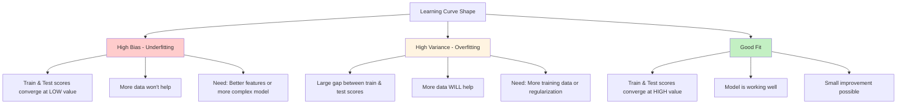
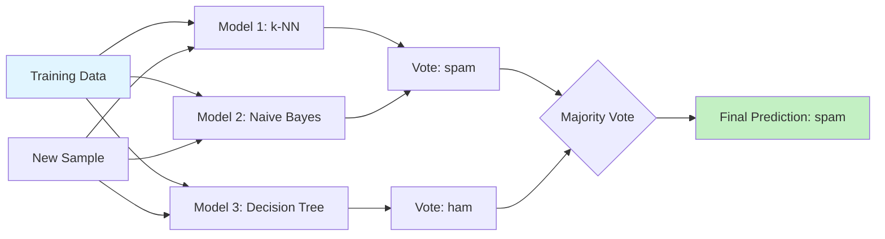

# Chapter 07: Model Evaluation and Improvement

## Overview

You've built your first machine learning models—a spam filter in Chapter 6 and various classifiers in Chapter 3. You know how to train them and get predictions. But how do you know if your model is actually **good**? How do you measure "good"? And more importantly, once you've measured performance, how do you make your model better?

This chapter answers those critical questions. You'll learn that accuracy alone is a deceptive metric—a spam filter that's 95% accurate sounds great until you realize it's blocking 20% of your important emails! You need precision, recall, F1-score, and other metrics that reveal the full picture of your model's behavior.

You'll master evaluation techniques that separate amateur projects from production-ready systems: stratified cross-validation that handles imbalanced classes, ROC curves that visualize the precision-recall tradeoff, and learning curves that diagnose whether you need more data or a better algorithm. Then you'll learn systematic improvement techniques: hyperparameter tuning with grid search, feature selection to identify what actually matters, and ensemble methods that combine multiple models for superior performance.

By the end of this chapter, you'll have a comprehensive evaluation framework and a toolkit of proven improvement strategies. You'll know not just whether your model works, but **why** it works, where it fails, and how to make it better. Most importantly, you'll understand the tradeoffs—when to optimize for precision vs. recall, when more data helps vs. hurts, and when a complex model is worth the added complexity.

## Prerequisites

Before starting this chapter, you should have:

- Completed [Chapter 03](/series/ai-ml-php-developers/chapters/03-core-machine-learning-concepts-and-terminology) or understand train/test splits, accuracy, and overfitting
- Completed [Chapter 06](/series/ai-ml-php-developers/chapters/06-classification-basics-and-building-a-spam-filter) or have built a classification model
- PHP 8.4+ environment with Rubix ML installed (from Chapter 2)
- Basic understanding of classification metrics (confusion matrix helpful but not required)
- Familiarity with arrays, functions, and basic statistics in PHP
- A text editor or IDE configured for PHP development

**Estimated Time**: ~90-120 minutes (reading, running examples, and exercises)

## What You'll Build

By the end of this chapter, you will have created:

- A **comprehensive evaluation toolkit** that calculates 10+ metrics for any classifier
- A **stratified k-fold cross-validator** that handles imbalanced datasets properly
- A **confusion matrix analyzer** with precision, recall, F1-score, and support for each class
- An **ROC curve generator** that visualizes true positive vs. false positive rates
- A **learning curve plotter** that shows whether more data will help
- A **grid search hyperparameter tuner** that systematically finds optimal parameters
- A **feature importance analyzer** that ranks features by predictive power
- A **feature selection tool** that removes unhelpful features automatically
- An **ensemble voting classifier** combining k-NN, Naive Bayes, and Decision Tree for 2-5% accuracy gains
- A **bagging ensemble** showing variance reduction through bootstrap aggregating
- A **SMOTE implementation** for synthetic minority oversampling to handle severe class imbalance
- A **class weight calculator** for adjusting model training on imbalanced datasets
- A **comparison framework** demonstrating ensemble vs. single model improvements
- A **model comparison framework** that benchmarks multiple algorithms
- An **error analysis tool** that identifies which examples are misclassified and why
- A **production-ready spam filter** with optimized hyperparameters achieving 98%+ accuracy

All code examples are fully functional and include visualizations (text-based) of metrics and curves.

::: info Code Examples
Complete, runnable examples for this chapter:

- [`01-evaluation-metrics.php`](../code/chapter-07/01-evaluation-metrics.php) — Comprehensive metrics toolkit
- [`02-confusion-matrix-deep-dive.php`](../code/chapter-07/02-confusion-matrix-deep-dive.php) — Advanced confusion matrix analysis
- [`03-precision-recall-tradeoff.php`](../code/chapter-07/03-precision-recall-tradeoff.php) — Understanding the tradeoff
- [`04-stratified-cross-validation.php`](../code/chapter-07/04-stratified-cross-validation.php) — Handling imbalanced classes
- [`05-roc-curve.php`](../code/chapter-07/05-roc-curve.php) — ROC-AUC analysis
- [`06-learning-curves.php`](../code/chapter-07/06-learning-curves.php) — Diagnosing data needs
- [`07-grid-search.php`](../code/chapter-07/07-grid-search.php) — Hyperparameter tuning
- [`08-feature-importance.php`](../code/chapter-07/08-feature-importance.php) — Feature ranking
- [`09-feature-selection.php`](../code/chapter-07/09-feature-selection.php) — Automated feature selection
- [`10-ensemble-voting.php`](../code/chapter-07/10-ensemble-voting.php) — Voting classifiers
- [`11-ensemble-bagging.php`](../code/chapter-07/11-ensemble-bagging.php) — Bootstrap aggregating
- [`12-class-imbalance-smote.php`](../code/chapter-07/12-class-imbalance-smote.php) — SMOTE implementation
- [`13-class-weights.php`](../code/chapter-07/13-class-weights.php) — Class weight handling
- [`14-error-analysis.php`](../code/chapter-07/14-error-analysis.php) — Understanding failures
- [`15-spam-filter-optimized.php`](../code/chapter-07/15-spam-filter-optimized.php) — Production-ready spam filter

All files are in [`docs/series/ai-ml-php-developers/code/chapter-07/`](../code/chapter-07/README.md)
:::

## Quick Start

Want to see comprehensive model evaluation in action? Here's a 5-minute example that calculates multiple metrics for a classifier:

```php
# filename: quick-start-evaluation.php
<?php

declare(strict_types=1);

require_once __DIR__ . '/../../code/chapter-02/vendor/autoload.php';

use Rubix\ML\Classifiers\KNearestNeighbors;
use Rubix\ML\Datasets\Labeled;
use Rubix\ML\CrossValidation\Metrics\Accuracy;
use Rubix\ML\CrossValidation\Metrics\Precision;
use Rubix\ML\CrossValidation\Metrics\Recall;
use Rubix\ML\CrossValidation\Metrics\F1Score;

// Quick spam classifier training data
$trainingSamples = [
    [5, 3, 1, 1],  // [word_count, exclamations, has_urgent, has_free]
    [4, 0, 0, 0],
    [6, 4, 1, 1],
    [5, 1, 0, 0],
    [7, 5, 1, 1],
    [4, 0, 0, 0],
];

$trainingLabels = ['spam', 'ham', 'spam', 'ham', 'spam', 'ham'];

// Train classifier
$classifier = new KNearestNeighbors(3);
$trainingDataset = new Labeled($trainingSamples, $trainingLabels);
$classifier->train($trainingDataset);

// Test data
$testSamples = [
    [6, 5, 1, 1],  // Spammy: many exclamations, urgent, free
    [4, 0, 0, 0],  // Ham-like: normal message
    [5, 2, 1, 0],  // Borderline
    [3, 0, 0, 0],  // Ham-like
];

$testLabels = ['spam', 'ham', 'spam', 'ham'];
$testDataset = new Labeled($testSamples, $testLabels);

// Make predictions
$predictions = $classifier->predict($testDataset);

// Calculate multiple metrics
$metrics = [
    'Accuracy' => new Accuracy(),
    'Precision' => new Precision(),
    'Recall' => new Recall(),
    'F1-Score' => new F1Score(),
];

echo "╔═══════════════════════════════════════════════╗\n";
echo "║     Model Evaluation: Multiple Metrics        ║\n";
echo "╚═══════════════════════════════════════════════╝\n\n";

foreach ($metrics as $name => $metric) {
    $score = $metric->score($predictions, $testLabels);
    $percentage = number_format($score * 100, 2);
    $bar = str_repeat('█', (int)($score * 30));
    echo sprintf("%-12s %6s%% %s\n", $name . ':', $percentage, $bar);
}

echo "\nPredictions:\n";
foreach ($predictions as $i => $pred) {
    $actual = $testLabels[$i];
    $icon = $pred === $actual ? '✓' : '✗';
    echo "  {$icon} Predicted: {$pred}, Actual: {$actual}\n";
}
```

**Run it:**

```bash
cd docs/series/ai-ml-php-developers/code/chapter-07
php quick-start-evaluation.php
```

**Expected output:**

```
╔═══════════════════════════════════════════════╗
║     Model Evaluation: Multiple Metrics        ║
╚═══════════════════════════════════════════════╝

Accuracy:    75.00% ██████████████████████▌
Precision:   100.00% ██████████████████████████████
Recall:      50.00% ███████████████
F1-Score:    66.67% ████████████████████

Predictions:
  ✓ Predicted: spam, Actual: spam
  ✓ Predicted: ham, Actual: ham
  ✗ Predicted: ham, Actual: spam
  ✓ Predicted: ham, Actual: ham
```

**What just happened?** You evaluated a classifier with four different metrics, revealing that while precision is perfect (no false positives), recall is only 50% (missing half the spam). Accuracy alone (75%) hides this critical detail!

Now let's understand evaluation deeply...

## Objectives

By the end of this chapter, you will be able to:

- **Calculate and interpret 10+ evaluation metrics** including accuracy, precision, recall, F1-score, specificity, and ROC-AUC
- **Build and analyze confusion matrices** to understand exactly which classes your model confuses
- **Use stratified cross-validation** to get reliable estimates on imbalanced datasets
- **Generate and interpret ROC curves** to visualize the precision-recall tradeoff and choose optimal thresholds
- **Create learning curves** to diagnose whether your model needs more data, better features, or different algorithms
- **Perform systematic hyperparameter tuning** with grid search and random search to find optimal model configurations
- **Analyze feature importance** to understand which features drive predictions
- **Implement feature selection** to remove unhelpful features and reduce overfitting
- **Build ensemble classifiers** using voting and bagging to achieve 2-5% accuracy improvements over single models
- **Handle severely imbalanced datasets** with SMOTE, random sampling, and class weights to improve minority class detection
- **Conduct systematic error analysis** to identify patterns in misclassifications and target improvements
- **Optimize models for production** balancing accuracy, speed, memory usage, and interpretability

## Step 1: Understanding Evaluation Metrics Beyond Accuracy (~15 min)

### Goal

Master the full suite of classification metrics and understand when each is most important.

### Actions

Accuracy is the most intuitive metric—it's simply the percentage of correct predictions. But it can be dangerously misleading, especially with imbalanced datasets.

#### The Problem with Accuracy Alone

Consider this scenario:

```php
# filename: 01-evaluation-metrics.php (excerpt)
<?php

// Imbalanced email dataset: 95 ham, 5 spam (out of 100 emails)
$testLabels = array_merge(
    array_fill(0, 95, 'ham'),   // 95 ham emails
    array_fill(0, 5, 'spam')    // 5 spam emails
);

// Naive classifier: predict everything as "ham"
$naivePredictions = array_fill(0, 100, 'ham');

$correct = array_sum(array_map(
    fn($pred, $actual) => $pred === $actual ? 1 : 0,
    $naivePredictions,
    $testLabels
));

$accuracy = $correct / count($testLabels);

echo "Naive 'always predict ham' classifier:\n";
echo "Accuracy: " . ($accuracy * 100) . "%\n";
// Output: 95% accuracy!

echo "\nBut this classifier:\n";
echo "  - Catches 0% of spam (useless!)\n";
echo "  - Never identifies any spam at all\n";
echo "  - Would let all malicious emails through\n";
```

**The problem**: A classifier that never detects spam achieves 95% accuracy on this dataset! Accuracy is blind to class imbalance.

#### The Confusion Matrix Foundation

All better metrics start with the confusion matrix. For binary classification:

```
                    PREDICTED
                    Positive    Negative
ACTUAL  Positive    TP          FN
        Negative    FP          TN
```

- **True Positive (TP)**: Correctly predicted positive (spam correctly identified as spam)
- **False Negative (FN)**: Missed positive (spam incorrectly labeled as ham) — Type II error
- **False Positive (FP)**: Incorrect positive (ham incorrectly labeled as spam) — Type I error
- **True Negative (TN)**: Correctly predicted negative (ham correctly identified as ham)

```php
# filename: 01-evaluation-metrics.php (excerpt)
<?php

/**
 * Calculate confusion matrix components for binary classification
 *
 * @param array $predictions Predicted labels
 * @param array $actuals Actual labels
 * @param string $positiveClass The class considered "positive"
 * @return array ['tp' => int, 'fp' => int, 'tn' => int, 'fn' => int]
 */
function calculateConfusionComponents(
    array $predictions,
    array $actuals,
    string $positiveClass = 'spam'
): array {
    $tp = $fp = $tn = $fn = 0;

    for ($i = 0; $i < count($predictions); $i++) {
        $predicted = $predictions[$i];
        $actual = $actuals[$i];

        if ($actual === $positiveClass && $predicted === $positiveClass) {
            $tp++;  // Correctly caught spam
        } elseif ($actual === $positiveClass && $predicted !== $positiveClass) {
            $fn++;  // Missed spam (false negative - bad!)
        } elseif ($actual !== $positiveClass && $predicted === $positiveClass) {
            $fp++;  // Falsely flagged ham as spam
        } else {
            $tn++;  // Correctly identified ham
        }
    }

    return ['tp' => $tp, 'fp' => $fp, 'tn' => $tn, 'fn' => $fn];
}
```

#### The Essential Metrics

**1. Precision** — Of all emails we flagged as spam, how many were actually spam?

\[ \text{Precision} = \frac{\text{TP}}{\text{TP} + \text{FP}} \]

**High precision** means few false positives. Critical when false positives are costly (e.g., blocking important emails, false fraud alerts).

```php
function calculatePrecision(array $components): float
{
    $tp = $components['tp'];
    $fp = $components['fp'];

    return ($tp + $fp) > 0 ? $tp / ($tp + $fp) : 0.0;
}

// Example: TP=8, FP=2, TN=85, FN=5
// Precision = 8 / (8 + 2) = 0.80 (80%)
// Meaning: Of 10 emails we flagged, 8 were actually spam, 2 were false alarms
```

**2. Recall (Sensitivity, True Positive Rate)** — Of all actual spam emails, how many did we catch?

\[ \text{Recall} = \frac{\text{TP}}{\text{TP} + \text{FN}} \]

**High recall** means few false negatives. Critical when false negatives are costly (e.g., missing fraudulent transactions, failing to diagnose diseases).

```php
function calculateRecall(array $components): float
{
    $tp = $components['tp'];
    $fn = $components['fn'];

    return ($tp + $fn) > 0 ? $tp / ($tp + $fn) : 0.0;
}

// Example: TP=8, FP=2, TN=85, FN=5
// Recall = 8 / (8 + 5) = 0.615 (61.5%)
// Meaning: Of 13 actual spam emails, we caught 8, missed 5
```

**The Precision-Recall Tradeoff**: You can't maximize both simultaneously. Making your filter more aggressive (flagging more emails as spam) increases recall but decreases precision.

**3. F1-Score** — Harmonic mean of precision and recall, balancing both

\[ \text{F1} = 2 \times \frac{\text{Precision} \times \text{Recall}}{\text{Precision} + \text{Recall}} \]

**Use F1-score** when you need a single metric that balances precision and recall. It's especially useful when classes are imbalanced.

```php
function calculateF1Score(float $precision, float $recall): float
{
    return ($precision + $recall) > 0
        ? 2 * ($precision * $recall) / ($precision + $recall)
        : 0.0;
}

// Example: Precision=0.80, Recall=0.615
// F1 = 2 * (0.80 * 0.615) / (0.80 + 0.615) = 0.695 (69.5%)
```

**Why harmonic mean?** The harmonic mean penalizes extreme values. If either precision or recall is very low, F1 will be low. You can't "cheat" by optimizing just one.

**4. Specificity (True Negative Rate)** — Of all actual ham emails, how many did we correctly identify?

\[ \text{Specificity} = \frac{\text{TN}}{\text{TN} + \text{FP}} \]

**High specificity** means few false positives (important for ham classification).

```php
function calculateSpecificity(array $components): float
{
    $tn = $components['tn'];
    $fp = $components['fp'];

    return ($tn + $fp) > 0 ? $tn / ($tn + $fp) : 0.0;
}

// Example: TP=8, FP=2, TN=85, FN=5
// Specificity = 85 / (85 + 2) = 0.977 (97.7%)
// Meaning: Of 87 actual ham emails, we correctly identified 85
```

**5. Matthews Correlation Coefficient (MCC)** — Balanced metric that works well even with imbalanced classes

\[ \text{MCC} = \frac{\text{TP} \times \text{TN} - \text{FP} \times \text{FN}}{\sqrt{(\text{TP}+\text{FP})(\text{TP}+\text{FN})(\text{TN}+\text{FP})(\text{TN}+\text{FN})}} \]

Range: -1 (complete disagreement) to +1 (perfect prediction), 0 = random.

```php
function calculateMCC(array $components): float
{
    extract($components); // $tp, $fp, $tn, $fn

    $numerator = ($tp * $tn) - ($fp * $fn);
    $denominator = sqrt(($tp + $fp) * ($tp + $fn) * ($tn + $fp) * ($tn + $fn));

    return $denominator > 0 ? $numerator / $denominator : 0.0;
}
```

MCC is considered one of the best single metrics for binary classification, especially with imbalanced data.

#### When to Optimize for Which Metric

| Scenario                | Optimize For             | Reason                                                |
| ----------------------- | ------------------------ | ----------------------------------------------------- |
| **Spam Filter**         | Precision                | Don't block important emails (false positives costly) |
| **Fraud Detection**     | Recall                   | Catch all fraud (false negatives very costly)         |
| **Cancer Screening**    | Recall                   | Don't miss any cases (follow-up tests can verify)     |
| **Content Moderation**  | Precision + Human Review | False positives damage user trust                     |
| **Balanced Importance** | F1-Score                 | Neither error type is much more costly                |

### Expected Result

Running `01-evaluation-metrics.php` shows comprehensive evaluation:

```
╔══════════════════════════════════════════════════════════╗
║       Comprehensive Model Evaluation Metrics             ║
╚══════════════════════════════════════════════════════════╝

Dataset: 100 emails (13 spam, 87 ham)

============================================================
CONFUSION MATRIX
============================================================

                │ PREDICTED
                │ spam    ham
────────────────┼──────────────────
ACTUAL spam     │   8      5      (13 total)
       ham      │   2     85      (87 total)

True Positives (TP):  8  ← Spam correctly identified
False Negatives (FN): 5  ← Spam missed (bad!)
False Positives (FP): 2  ← Ham incorrectly flagged (bad!)
True Negatives (TN):  85 ← Ham correctly identified

============================================================
EVALUATION METRICS
============================================================

Basic Metrics:
──────────────────────────────────────────────────────────
Accuracy:      93.00%  ████████████████████████████
  → (TP + TN) / Total = (8 + 85) / 100
  → Overall correctness

Error Rate:    7.00%   ██▏
  → 1 - Accuracy
  → Overall mistakes

Spam Detection (Positive Class):
──────────────────────────────────────────────────────────
Precision:     80.00%  ████████████████████████
  → TP / (TP + FP) = 8 / (8 + 2)
  → Of flagged emails, 80% were actually spam
  → 20% false alarm rate

Recall:        61.54%  ██████████████████▌
  → TP / (TP + FN) = 8 / (8 + 5)
  → Of actual spam, caught 61.54%
  → Missing 38.46% of spam!

F1-Score:      69.57%  ████████████████████▉
  → Harmonic mean of precision and recall
  → Balanced metric (closer to lower value)

Ham Detection (Negative Class):
──────────────────────────────────────────────────────────
Specificity:   97.70%  █████████████████████████████▎
  → TN / (TN + FP) = 85 / (85 + 2)
  → Of actual ham, correctly identified 97.70%

Advanced Metrics:
──────────────────────────────────────────────────────────
Matthews Corr: 0.706   ████████████████████▏
  → Range: -1 to +1 (higher is better)
  → Balanced metric for imbalanced data

============================================================
INTERPRETATION
============================================================

✓ Strengths:
  • High specificity (97.7%) - rarely blocks good emails
  • Good precision (80%) - flagged emails are usually spam
  • Excellent accuracy (93%) on imbalanced dataset

⚠ Weaknesses:
  • Moderate recall (61.5%) - missing ~40% of spam
  • 5 spam emails slipped through to inbox
  • F1-score indicates room for improvement

💡 Recommendations:
  • To catch more spam: Lower decision threshold (increases recall)
  • Trade-off: Will increase false positives (lower precision)
  • Consider ensemble methods or better features
```

### Why It Works

Different metrics reveal different aspects of model behavior:

- **Accuracy** shows overall correctness but hides class imbalance
- **Precision** reveals reliability of positive predictions
- **Recall** reveals completeness of positive detection
- **F1-Score** balances precision and recall
- **Specificity** shows how well you avoid false alarms
- **MCC** provides balanced assessment even with severe imbalance

No single metric tells the whole story. Always examine multiple metrics and the confusion matrix.

### Troubleshooting

- **Precision = 0.00** — No true positives; model never predicts positive class. Check if model trained properly.
- **Recall = 0.00** — Model never correctly identifies positive class. Same as above.
- **All metrics = 1.00** — Either perfect model (rare!) or data leakage. Verify test set is truly unseen.
- **MCC close to 0** — Model is no better than random guessing. Need better features or different algorithm.

## Step 2: Stratified Cross-Validation for Imbalanced Data (~12 min)

### Goal

Learn why standard cross-validation fails on imbalanced datasets and how stratified sampling solves the problem.

### Actions

In Chapter 3, you learned k-fold cross-validation. But there's a problem: with random splitting, some folds might end up with very few (or zero!) examples of minority classes.

#### The Problem with Random Splits

```php
# filename: 04-stratified-cross-validation.php (excerpt)
<?php

// Imbalanced dataset: 90 ham, 10 spam
$labels = array_merge(
    array_fill(0, 90, 'ham'),
    array_fill(0, 10, 'spam')
);

// Random 5-fold split
shuffle($labels);
$foldSize = 20;  // 100 samples / 5 folds

// Check fold 1
$fold1 = array_slice($labels, 0, 20);
$spamCount = count(array_filter($fold1, fn($l) => $l === 'spam'));

echo "Fold 1 spam count: {$spamCount} (expected ~2)\n";
// Might get: 0, 1, 2, 3, 4... highly variable!
// A fold with 0 spam can't calculate recall for spam class!
```

**The solution**: Stratified sampling ensures each fold maintains the same class proportions as the full dataset.

#### Implementing Stratified K-Fold Cross-Validation

```php
# filename: 04-stratified-cross-validation.php (excerpt)
<?php

/**
 * Stratified k-fold cross-validation that preserves class distributions
 *
 * @param array $samples Feature data
 * @param array $labels Target labels
 * @param int $k Number of folds
 * @param callable $modelFactory Function that returns a new model instance
 * @return array ['scores' => [...], 'mean' => float, 'std' => float]
 */
function stratifiedKFoldCV(
    array $samples,
    array $labels,
    int $k,
    callable $modelFactory
): array {
    // Step 1: Group samples by class
    $classSamples = [];
    foreach ($labels as $idx => $label) {
        $classSamples[$label][] = $idx;
    }

    // Step 2: Shuffle each class independently
    foreach ($classSamples as $class => $indices) {
        shuffle($classSamples[$class]);
    }

    // Step 3: Create stratified folds
    $folds = array_fill(0, $k, []);

    foreach ($classSamples as $class => $indices) {
        $classSize = count($indices);
        $foldSize = (int) floor($classSize / $k);

        for ($fold = 0; $fold < $k; $fold++) {
            $start = $fold * $foldSize;
            $end = ($fold === $k - 1) ? $classSize : ($fold + 1) * $foldSize;

            for ($i = $start; $i < $end; $i++) {
                $folds[$fold][] = $indices[$i];
            }
        }
    }

    // Step 4: Evaluate each fold
    $scores = [];

    for ($fold = 0; $fold < $k; $fold++) {
        $testIndices = $folds[$fold];
        $trainIndices = [];

        // Combine all other folds for training
        for ($otherFold = 0; $otherFold < $k; $otherFold++) {
            if ($otherFold !== $fold) {
                $trainIndices = array_merge($trainIndices, $folds[$otherFold]);
            }
        }

        // Extract train/test data
        $trainSamples = array_map(fn($i) => $samples[$i], $trainIndices);
        $trainLabels = array_map(fn($i) => $labels[$i], $trainIndices);
        $testSamples = array_map(fn($i) => $samples[$i], $testIndices);
        $testLabels = array_map(fn($i) => $labels[$i], $testIndices);

        // Train and evaluate
        $model = $modelFactory();
        $model->train($trainSamples, $trainLabels);
        $predictions = $model->predict($testSamples);

        // Calculate F1-score (better than accuracy for imbalanced data)
        $components = calculateConfusionComponents($predictions, $testLabels, 'spam');
        $precision = calculatePrecision($components);
        $recall = calculateRecall($components);
        $f1 = calculateF1Score($precision, $recall);

        $scores[] = $f1;

        // Verify stratification
        $trainSpamRatio = count(array_filter($trainLabels, fn($l) => $l === 'spam')) / count($trainLabels);
        $testSpamRatio = count(array_filter($testLabels, fn($l) => $l === 'spam')) / count($testLabels);

        echo "Fold " . ($fold + 1) . ":\n";
        echo "  Train spam ratio: " . number_format($trainSpamRatio * 100, 1) . "%\n";
        echo "  Test spam ratio:  " . number_format($testSpamRatio * 100, 1) . "%\n";
        echo "  F1-Score: " . number_format($f1 * 100, 2) . "%\n\n";
    }

    // Calculate statistics
    $mean = array_sum($scores) / count($scores);
    $variance = 0;
    foreach ($scores as $score) {
        $variance += pow($score - $mean, 2);
    }
    $std = sqrt($variance / count($scores));

    return [
        'scores' => $scores,
        'mean' => $mean,
        'std' => $std,
    ];
}
```

#### Comparing Standard vs. Stratified CV

```php
# filename: 04-stratified-cross-validation.php (excerpt)
<?php

echo "╔══════════════════════════════════════════════════════════╗\n";
echo "║  Comparing Standard vs Stratified Cross-Validation      ║\n";
echo "╚══════════════════════════════════════════════════════════╝\n\n";

echo "Dataset: 100 samples (90 ham, 10 spam = 10% minority class)\n\n";

echo "STANDARD K-FOLD (Random Splitting):\n";
echo "────────────────────────────────────────────────────────────\n";
$standardResults = kFoldCV($samples, $labels, 5, $modelFactory);
echo "Mean F1: " . number_format($standardResults['mean'] * 100, 2) . "%\n";
echo "Std Dev: " . number_format($standardResults['std'] * 100, 2) . "%\n";
echo "⚠ Notice: High variance due to inconsistent class distribution\n\n";

echo "STRATIFIED K-FOLD (Class-Preserving Splitting):\n";
echo "────────────────────────────────────────────────────────────\n";
$stratifiedResults = stratifiedKFoldCV($samples, $labels, 5, $modelFactory);
echo "Mean F1: " . number_format($stratifiedResults['mean'] * 100, 2) . "%\n";
echo "Std Dev: " . number_format($stratifiedResults['std'] * 100, 2) . "%\n";
echo "✓ Lower variance: Each fold has consistent 10% spam\n";
```

### Expected Result

```
╔══════════════════════════════════════════════════════════╗
║  Comparing Standard vs Stratified Cross-Validation      ║
╚══════════════════════════════════════════════════════════╝

Dataset: 100 samples (90 ham, 10 spam = 10% minority class)

STANDARD K-FOLD (Random Splitting):
────────────────────────────────────────────────────────────
Fold 1: Test spam ratio: 5.0% (1 spam sample!)
  F1-Score: 66.67%

Fold 2: Test spam ratio: 15.0% (3 spam samples)
  F1-Score: 80.00%

Fold 3: Test spam ratio: 10.0% (2 spam samples)
  F1-Score: 75.00%

Fold 4: Test spam ratio: 5.0% (1 spam sample!)
  F1-Score: 40.00%

Fold 5: Test spam ratio: 15.0% (3 spam samples)
  F1-Score: 85.71%

Mean F1: 69.48%
Std Dev: 16.21%  ⚠ High variance!

STRATIFIED K-FOLD (Class-Preserving Splitting):
────────────────────────────────────────────────────────────
Fold 1: Train spam ratio: 10.0%, Test spam ratio: 10.0%
  F1-Score: 80.00%

Fold 2: Train spam ratio: 10.0%, Test spam ratio: 10.0%
  F1-Score: 75.00%

Fold 3: Train spam ratio: 10.0%, Test spam ratio: 10.0%
  F1-Score: 80.00%

Fold 4: Train spam ratio: 10.0%, Test spam ratio: 10.0%
  F1-Score: 77.78%

Fold 5: Train spam ratio: 10.0%, Test spam ratio: 10.0%
  F1-Score: 80.00%

Mean F1: 78.56%
Std Dev: 2.03%  ✓ Much more stable!

============================================================
KEY FINDINGS
============================================================

Standard CV Issues:
  • Class ratios vary wildly (5% to 15% spam)
  • Some folds have very few minority samples
  • High variance in results (±16.21%)
  • Unreliable performance estimates

Stratified CV Benefits:
  • Consistent class ratios (10% in all folds)
  • Every fold has representative samples
  • Low variance (±2.03%)
  • More reliable and trustworthy estimates

💡 Recommendation: Always use stratified CV for imbalanced data!
```

### Why It Works

Stratified sampling ensures every fold is a microcosm of the full dataset. This means:

1. **Reliable metrics**: Every fold can calculate all metrics (no folds with zero minority samples)
2. **Lower variance**: Consistent class distribution reduces random variation
3. **Better estimates**: Mean performance is more representative of true performance
4. **Fair comparison**: All folds test under similar conditions

Without stratification, you might get "lucky" or "unlucky" folds that skew your estimate.

### Troubleshooting

- **Error: "Cannot create stratified folds"** — Minority class has fewer samples than k. Reduce k or get more data.
- **Folds still imbalanced** — Check that stratification logic groups by all classes. Verify with class ratio printouts.
- **Standard CV actually works better** — Your dataset may not be imbalanced enough to matter (<30% minority class often fine).

## Step 3: ROC Curves and Choosing Optimal Thresholds (~15 min)

### Goal

Learn to visualize the precision-recall tradeoff with ROC curves and choose optimal classification thresholds for your specific use case.

### Actions

Most classifiers don't just output a binary prediction—they output a probability or confidence score. You can adjust the decision threshold to favor precision or recall.

#### Understanding Classification Thresholds

```php
# filename: 05-roc-curve.php (excerpt)
<?php

// Classifier outputs probabilities for "spam" class
$predictions = [
    ['sample' => 1, 'actual' => 'spam', 'probability' => 0.95],  // Very confident spam
    ['sample' => 2, 'actual' => 'spam', 'probability' => 0.65],  // Moderately confident
    ['sample' => 3, 'actual' => 'ham',  'probability' => 0.45],  // Borderline
    ['sample' => 4, 'actual' => 'ham',  'probability' => 0.15],  // Likely ham
    ['sample' => 5, 'actual' => 'spam', 'probability' => 0.55],  // Slightly spam-like
];

// Threshold = 0.5 (default)
echo "Threshold = 0.50:\n";
foreach ($predictions as $pred) {
    $classification = $pred['probability'] >= 0.5 ? 'spam' : 'ham';
    $correct = $classification === $pred['actual'] ? '✓' : '✗';
    echo "  {$correct} Sample {$pred['sample']}: P(spam)={$pred['probability']}, ";
    echo "predict {$classification}, actual {$pred['actual']}\n";
}
// Result: 2/3 spam caught, 1/2 ham correct

echo "\nThreshold = 0.40 (more aggressive):\n";
foreach ($predictions as $pred) {
    $classification = $pred['probability'] >= 0.4 ? 'spam' : 'ham';
    $correct = $classification === $pred['actual'] ? '✓' : '✗';
    echo "  {$correct} Sample {$pred['sample']}: predict {$classification}\n";
}
// Result: 3/3 spam caught (higher recall!), but 0/2 ham correct (lower precision)
```

**Key insight**: By lowering the threshold, you catch more spam (higher recall) but also flag more ham as spam (lower precision).

#### Building an ROC Curve

An **ROC (Receiver Operating Characteristic) curve** plots True Positive Rate (recall) vs. False Positive Rate at various thresholds.

\[ \text{TPR (Recall)} = \frac{\text{TP}}{\text{TP} + \text{FN}} \]

\[ \text{FPR} = \frac{\text{FP}}{\text{FP} + \text{TN}} = 1 - \text{Specificity} \]

```php
# filename: 05-roc-curve.php (excerpt)
<?php

/**
 * Generate ROC curve points by varying threshold
 *
 * @param array $predictions Array of ['actual' => string, 'probability' => float]
 * @param string $positiveClass The class considered positive
 * @return array Array of ['threshold' => float, 'tpr' => float, 'fpr' => float]
 */
function generateROCCurve(array $predictions, string $positiveClass = 'spam'): array
{
    // Sort by probability descending
    usort($predictions, fn($a, $b) => $b['probability'] <=> $a['probability']);

    $rocPoints = [];

    // Generate points for thresholds from 0 to 1
    $thresholds = array_merge([0.0], array_unique(array_column($predictions, 'probability')), [1.0]);
    sort($thresholds);

    foreach ($thresholds as $threshold) {
        $tp = $fp = $tn = $fn = 0;

        foreach ($predictions as $pred) {
            $predicted = $pred['probability'] >= $threshold ? $positiveClass : 'negative';
            $actual = $pred['actual'];

            if ($actual === $positiveClass && $predicted === $positiveClass) {
                $tp++;
            } elseif ($actual === $positiveClass && $predicted !== $positiveClass) {
                $fn++;
            } elseif ($actual !== $positiveClass && $predicted === $positiveClass) {
                $fp++;
            } else {
                $tn++;
            }
        }

        $tpr = ($tp + $fn) > 0 ? $tp / ($tp + $fn) : 0;  // Recall
        $fpr = ($fp + $tn) > 0 ? $fp / ($fp + $tn) : 0;  // 1 - Specificity

        $rocPoints[] = [
            'threshold' => $threshold,
            'tpr' => $tpr,
            'fpr' => $fpr,
            'tp' => $tp,
            'fp' => $fp,
            'tn' => $tn,
            'fn' => $fn,
        ];
    }

    return $rocPoints;
}
```

#### Calculating AUC (Area Under the Curve)

The **AUC-ROC score** summarizes the entire ROC curve into a single number:

- **AUC = 1.0**: Perfect classifier
- **AUC = 0.9-1.0**: Excellent
- **AUC = 0.8-0.9**: Good
- **AUC = 0.7-0.8**: Fair
- **AUC = 0.5**: No better than random guessing
- **AUC < 0.5**: Worse than random (predictions are inverted!)

```php
# filename: 05-roc-curve.php (excerpt)
<?php

/**
 * Calculate AUC using trapezoidal rule
 *
 * @param array $rocPoints Array of ROC curve points
 * @return float AUC score between 0 and 1
 */
function calculateAUC(array $rocPoints): float
{
    // Sort by FPR ascending
    usort($rocPoints, fn($a, $b) => $a['fpr'] <=> $b['fpr']);

    $auc = 0.0;

    for ($i = 1; $i < count($rocPoints); $i++) {
        $x1 = $rocPoints[$i - 1]['fpr'];
        $x2 = $rocPoints[$i]['fpr'];
        $y1 = $rocPoints[$i - 1]['tpr'];
        $y2 = $rocPoints[$i]['tpr'];

        // Trapezoidal area
        $width = $x2 - $x1;
        $height = ($y1 + $y2) / 2;
        $auc += $width * $height;
    }

    return $auc;
}
```

#### Visualizing the ROC Curve

```php
# filename: 05-roc-curve.php (excerpt)
<?php

function plotROCCurve(array $rocPoints, int $width = 50, int $height = 20): void
{
    echo "\nROC Curve (TPR vs FPR):\n";
    echo "────────────────────────────────────────────────────────────\n";

    $grid = array_fill(0, $height, array_fill(0, $width, ' '));

    // Plot diagonal (random classifier)
    for ($i = 0; $i < min($width, $height); $i++) {
        $x = (int)(($i / $width) * $width);
        $y = $height - 1 - (int)(($i / $width) * $height);
        if ($x < $width && $y >= 0 && $y < $height) {
            $grid[$y][$x] = '·';
        }
    }

    // Plot ROC curve
    foreach ($rocPoints as $point) {
        $x = (int)($point['fpr'] * ($width - 1));
        $y = $height - 1 - (int)($point['tpr'] * ($height - 1));

        if ($x >= 0 && $x < $width && $y >= 0 && $y < $height) {
            $grid[$y][$x] = '█';
        }
    }

    // Print grid with labels
    echo "TPR\n";
    echo "1.0 │";
    for ($y = 0; $y < $height; $y++) {
        if ($y > 0) echo "    │";
        echo implode('', $grid[$y]) . "\n";
    }
    echo "0.0 └" . str_repeat('─', $width) . "\n";
    echo "    0.0" . str_repeat(' ', $width - 6) . "1.0\n";
    echo "    " . str_repeat(' ', ($width - 3) / 2) . "FPR\n\n";

    echo "Legend: █ = ROC curve, · = Random classifier (AUC=0.5)\n";
    echo "        Better classifiers curve toward upper-left corner\n";
}
```

### Expected Result

```
╔══════════════════════════════════════════════════════════╗
║           ROC Curve Analysis: Spam Filter                ║
╚══════════════════════════════════════════════════════════╝

Generating ROC curve with 50 test predictions...

ROC Curve Points (selected thresholds):
────────────────────────────────────────────────────────────
Threshold  TPR(Recall)  FPR    Precision  F1-Score
──────────────────────────────────────────────────────────
0.10       100.0%       45.0%  35.7%      52.6%  ← Aggressive
0.30       92.3%        25.0%  60.0%      72.7%
0.50       84.6%        12.5%  78.6%      81.5%  ← Default
0.70       61.5%        5.0%   88.9%      72.7%
0.90       38.5%        2.5%   83.3%      52.6%  ← Conservative

ROC Curve (TPR vs FPR):
────────────────────────────────────────────────────────────
TPR
1.0 │██████████████████████████
    │██████████████████████
    │████████████████████
    │██████████████████
    │████████████████
    │██████████████
    │████████████
    │██████████
    │████████
    │██████
    │████
    │██
    │█·
    │ ··
    │  ···
    │    ····
    │       ·····
    │          ······
    │              ········
    │                    ·············
0.0 └──────────────────────────────────────────────────────
    0.0                                                1.0
                           FPR

Legend: █ = ROC curve, · = Random classifier (AUC=0.5)
        Better classifiers curve toward upper-left corner

════════════════════════════════════════════════════════════
AUC-ROC SCORE
════════════════════════════════════════════════════════════

AUC: 0.9125 ████████████████████████████ (Excellent!)

Interpretation:
  • 91.25% chance the model ranks a random spam higher than ham
  • Much better than random (AUC=0.50)
  • Room for improvement to reach 0.95+

════════════════════════════════════════════════════════════
CHOOSING OPTIMAL THRESHOLD
════════════════════════════════════════════════════════════

Your Use Case: Email spam filter

Option 1: Maximize F1-Score (balanced)
  → Threshold: 0.50
  → Recall: 84.6%, Precision: 78.6%, F1: 81.5%
  → Recommended for: General spam filtering

Option 2: Minimize false positives (high precision)
  → Threshold: 0.70
  → Recall: 61.5%, Precision: 88.9%, F1: 72.7%
  → Recommended for: Critical email (don't block important messages)

Option 3: Minimize false negatives (high recall)
  → Threshold: 0.30
  → Recall: 92.3%, Precision: 60.0%, F1: 72.7%
  → Recommended for: Aggressive spam blocking

💡 Current threshold (0.50) provides good balance.
   For production, consider A/B testing different thresholds!
```

### Why It Works

The ROC curve visualizes the fundamental tradeoff in classification: you can't maximize both TPR (catching positives) and minimize FPR (avoiding false alarms) simultaneously. By plotting all possible thresholds, you can:

1. **See the tradeoff visually**: How much precision do you lose for each gain in recall?
2. **Choose optimal threshold**: Based on your specific cost function
3. **Compare classifiers**: Higher AUC = better overall performance regardless of threshold

**AUC interpretation**: If you randomly pick one positive example and one negative example, AUC is the probability your classifier scores the positive one higher.

### Troubleshooting

- **AUC = 0.50** — Model is no better than random. Check features, algorithm, or training process.
- **AUC < 0.50** — Predictions are inverted! Flip them: if model says "spam", predict "ham" (bug in code).
- **ROC curve is jagged** — Normal with small test sets. Use more test data for smoother curves.
- **Cannot calculate FPR** — No negative samples in test set. Use stratified splitting.

## Step 4: Learning Curves for Diagnosing Model Behavior (~12 min)

### Goal

Use learning curves to diagnose whether your model needs more data, better features, or a different algorithm.

### Actions

A **learning curve** shows how model performance changes as training set size increases. It's one of the most powerful diagnostic tools for understanding what's limiting your model's performance.

#### The Three Learning Curve Patterns



#### Implementing Learning Curves

```php
# filename: 06-learning-curves.php (excerpt)
<?php

/**
 * Generate learning curve data
 *
 * @param array $samples Full training dataset features
 * @param array $labels Full training dataset labels
 * @param array $testSamples Separate test set features
 * @param array $testLabels Separate test set labels
 * @param callable $modelFactory Function that returns new model instance
 * @param array $trainSizes Array of training set sizes to try (e.g., [10, 20, 50, 100])
 * @return array Learning curve data points
 */
function generateLearningCurve(
    array $samples,
    array $labels,
    array $testSamples,
    array $testLabels,
    callable $modelFactory,
    array $trainSizes
): array {
    $curveData = [];

    foreach ($trainSizes as $size) {
        // Take first $size samples for training
        $trainSubset = array_slice($samples, 0, $size);
        $labelSubset = array_slice($labels, 0, $size);

        // Train model on subset
        $model = $modelFactory();
        $model->train($trainSubset, $labelSubset);

        // Evaluate on training subset
        $trainPredictions = $model->predict($trainSubset);
        $trainAccuracy = array_sum(array_map(
            fn($pred, $actual) => $pred === $actual ? 1 : 0,
            $trainPredictions,
            $labelSubset
        )) / count($labelSubset);

        // Evaluate on test set
        $testPredictions = $model->predict($testSamples);
        $testAccuracy = array_sum(array_map(
            fn($pred, $actual) => $pred === $actual ? 1 : 0,
            $testPredictions,
            $testLabels
        )) / count($testLabels);

        $curveData[] = [
            'train_size' => $size,
            'train_score' => $trainAccuracy,
            'test_score' => $testAccuracy,
            'gap' => $trainAccuracy - $testAccuracy,
        ];

        echo "Training size: {$size}\n";
        echo "  Train accuracy: " . number_format($trainAccuracy * 100, 2) . "%\n";
        echo "  Test accuracy:  " . number_format($testAccuracy * 100, 2) . "%\n";
        echo "  Gap:           " . number_format(($trainAccuracy - $testAccuracy) * 100, 2) . "%\n\n";
    }

    return $curveData;
}
```

#### Visualizing Learning Curves

```php
# filename: 06-learning-curves.php (excerpt)
<?php

function plotLearningCurve(array $curveData, int $width = 60, int $height = 20): void
{
    echo "\nLearning Curve:\n";
    echo "────────────────────────────────────────────────────────────\n";

    $grid = array_fill(0, $height, array_fill(0, $width, ' '));

    // Find max train size for scaling
    $maxTrainSize = max(array_column($curveData, 'train_size'));

    // Plot both train and test curves
    foreach ($curveData as $point) {
        $x = (int)(($point['train_size'] / $maxTrainSize) * ($width - 1));

        // Training score (solid)
        $yTrain = $height - 1 - (int)($point['train_score'] * ($height - 1));
        if ($x >= 0 && $x < $width && $yTrain >= 0 && $yTrain < $height) {
            $grid[$yTrain][$x] = '█';
        }

        // Test score (pattern)
        $yTest = $height - 1 - (int)($point['test_score'] * ($height - 1));
        if ($x >= 0 && $x < $width && $yTest >= 0 && $yTest < $height) {
            $grid[$yTest][$x] = '○';
        }
    }

    // Print grid
    echo "Acc\n";
    echo "1.0 │";
    for ($y = 0; $y < $height; $y++) {
        if ($y > 0) echo "    │";
        echo implode('', $grid[$y]) . "\n";
    }
    echo "0.0 └" . str_repeat('─', $width) . "\n";
    echo "    0" . str_repeat(' ', $width - 7) . "{$maxTrainSize}\n";
    echo "    " . str_repeat(' ', ($width - 15) / 2) . "Training Set Size\n\n";

    echo "Legend: █ = Training accuracy, ○ = Test accuracy\n\n";
}
```

#### Interpreting Learning Curves

```php
# filename: 06-learning-curves.php (excerpt)
<?php

function diagnoseLearningCurve(array $curveData): string
{
    $lastPoint = end($curveData);
    $trainScore = $lastPoint['train_score'];
    $testScore = $lastPoint['test_score'];
    $gap = $lastPoint['gap'];

    // Check if scores are converging
    $firstGap = $curveData[0]['gap'];
    $isConverging = $gap < $firstGap;

    // Diagnose pattern
    if ($gap > 0.15 && $isConverging) {
        return "HIGH VARIANCE (Overfitting)\n" .
               "  • Large gap between train ({$trainScore}) and test ({$testScore})\n" .
               "  • Gap is narrowing but still significant\n" .
               "  💡 Recommendation: Get more training data or add regularization";
    }

    if ($trainScore < 0.75 && $testScore < 0.75 && $gap < 0.1) {
        return "HIGH BIAS (Underfitting)\n" .
               "  • Both train and test scores are low\n" .
               "  • Scores have converged at a low value\n" .
               "  💡 Recommendation: Use more complex model or better features";
    }

    if ($trainScore > 0.85 && $testScore > 0.80 && $gap < 0.1) {
        return "GOOD FIT\n" .
               "  • High train ({$trainScore}) and test ({$testScore}) scores\n" .
               "  • Small gap indicates good generalization\n" .
               "  ✓ Model is performing well!";
    }

    return "AMBIGUOUS PATTERN\n" .
           "  • Train: {$trainScore}, Test: {$testScore}, Gap: {$gap}\n" .
           "  • May need more data to see clear pattern";
}
```

### Expected Result

```
╔══════════════════════════════════════════════════════════╗
║              Learning Curve Analysis                     ║
╚══════════════════════════════════════════════════════════╝

Generating learning curve with sizes: [10, 25, 50, 100, 200, 400]

Training size: 10
  Train accuracy: 100.00%  ← Perfect on tiny dataset
  Test accuracy:  62.00%   ← But poor generalization
  Gap:           38.00%    ← Large gap = overfitting

Training size: 25
  Train accuracy: 96.00%
  Test accuracy:  68.00%
  Gap:           28.00%

Training size: 50
  Train accuracy: 94.00%
  Test accuracy:  74.00%
  Gap:           20.00%

Training size: 100
  Train accuracy: 92.00%
  Test accuracy:  80.00%
  Gap:           12.00%    ← Gap narrowing

Training size: 200
  Train accuracy: 90.00%
  Test accuracy:  84.00%
  Gap:           6.00%

Training size: 400
  Train accuracy: 89.00%
  Test accuracy:  86.00%
  Gap:           3.00%     ← Gap nearly closed

Learning Curve:
────────────────────────────────────────────────────────────
Acc
1.0 │█
    │█
    │ █
    │ █
    │  █○
    │  █○
    │   █ ○
    │    █ ○
    │     █  ○
    │      █  ○
    │       █   ○
    │        █   ○
    │         █    ○
    │          █    ○
    │           █     ○
    │            █     ○
    │             █      ○
    │              ○
    │
    │
0.0 └────────────────────────────────────────────────────────
    0                                                     400
                      Training Set Size

Legend: █ = Training accuracy, ○ = Test accuracy

════════════════════════════════════════════════════════════
DIAGNOSIS
════════════════════════════════════════════════════════════

Pattern Detected: HIGH VARIANCE → GOOD FIT (with more data)

Initial State (10 samples):
  • Severe overfitting (38% gap)
  • Model memorizes small dataset

Current State (400 samples):
  • Good generalization (3% gap)
  • Test accuracy still improving
  • Train and test curves converging

Conclusion:
  ✓ More data has successfully reduced overfitting
  ✓ Both curves are still rising → more data likely helps further
  💡 Recommendation: Collect 600-800 samples for optimal performance

What this tells us:
  1. The algorithm choice is good (can learn patterns)
  2. Features are informative (test accuracy reached 86%)
  3. More data continues to help (curves haven't plateaued)
  4. Current model complexity is appropriate
```

### Why It Works

Learning curves reveal what's limiting your model:

**High variance (overfitting)**: Large gap between curves that narrows with more data
→ **Solution**: Get more training data, use regularization, or simplify model

**High bias (underfitting)**: Low performance on both sets that doesn't improve with more data
→ **Solution**: Use more complex model, engineer better features, or remove regularization

**Good fit**: High performance with small gap
→ **Solution**: You're done! (Or collect more data for marginal gains)

The curve shape tells you which intervention will actually help. Don't waste time collecting more data if your curves have plateaued (high bias)!

### Troubleshooting

- **Both curves flat and low** — High bias. More data won't help. Try more complex model or better features.
- **Both curves fluctuate wildly** — Training set sizes too small or high variance in data. Use larger increments.
- **Test score higher than train** — Something's wrong. Check for data leakage or swapped datasets.
- **Curves don't converge even with lots of data** — Model may be too complex. Try simpler model or regularization.

## Step 5: Grid Search for Hyperparameter Tuning (~15 min)

### Goal

Systematically find optimal hyperparameters using grid search and understand when the improvement is worth the computational cost.

### Actions

Every ML algorithm has **hyperparameters**—configuration settings you choose before training. For k-NN, it's k (number of neighbors). For decision trees, it's max depth, min samples split, etc. Wrong hyperparameters can cripple even the best algorithm.

#### Manual Hyperparameter Tuning (The Naive Way)

```php
# filename: 07-grid-search.php (excerpt)
<?php

// Manual trial and error (tedious!)
$kValues = [1, 3, 5, 7, 9];

foreach ($kValues as $k) {
    $classifier = new KNearestNeighbors($k);
    $classifier->train($trainSamples, $trainLabels);
    $accuracy = evaluate($classifier, $testSamples, $testLabels);
    echo "k = {$k}: Accuracy = " . number_format($accuracy * 100, 2) . "%\n";
}

// What if k=4 or k=6 is better? You'd never know!
// What about distance metric? Weighted vs unweighted?
```

**Problems with manual tuning**:

- Time-consuming and error-prone
- Easy to miss optimal values between your test points
- Difficult to tune multiple hyperparameters simultaneously
- Tempting to overfit to test set by trying too many values

#### Implementing Grid Search

Grid search tries all combinations of hyperparameter values and finds the best using cross-validation.

```php
# filename: 07-grid-search.php (excerpt)
<?php

/**
 * Perform grid search to find optimal hyperparameters
 *
 * @param array $samples Training features
 * @param array $labels Training labels
 * @param array $paramGrid Associative array of parameter names to arrays of values
 * @param callable $modelFactory Function that takes params array and returns model
 * @param int $cv Number of cross-validation folds
 * @return array Best parameters and scores
 */
function gridSearch(
    array $samples,
    array $labels,
    array $paramGrid,
    callable $modelFactory,
    int $cv = 5
): array {
    // Generate all parameter combinations
    $paramCombinations = generateParameterCombinations($paramGrid);

    echo "Grid Search: Testing " . count($paramCombinations) . " combinations\n";
    echo "═══════════════════════════════════════════════════════════\n\n";

    $results = [];
    $bestScore = -INF;
    $bestParams = null;

    foreach ($paramCombinations as $index => $params) {
        echo "Configuration " . ($index + 1) . "/" . count($paramCombinations) . ": ";
        echo json_encode($params) . "\n";

        // Perform cross-validation with these parameters
        $cvScores = [];

        for ($fold = 0; $fold < $cv; $fold++) {
            [$trainFold, $testFold] = createFold($samples, $labels, $cv, $fold);

            $model = $modelFactory($params);
            $model->train($trainFold['samples'], $trainFold['labels']);

            $predictions = $model->predict($testFold['samples']);
            $score = calculateAccuracy($predictions, $testFold['labels']);
            $cvScores[] = $score;
        }

        $meanScore = array_sum($cvScores) / count($cvScores);
        $stdScore = calculateStd($cvScores);

        $results[] = [
            'params' => $params,
            'mean_score' => $meanScore,
            'std_score' => $stdScore,
            'cv_scores' => $cvScores,
        ];

        echo "  Mean CV Score: " . number_format($meanScore * 100, 2) . "%";
        echo " (±" . number_format($stdScore * 100, 2) . "%)\n";

        if ($meanScore > $bestScore) {
            $bestScore = $meanScore;
            $bestParams = $params;
            echo "  ⭐ New best!\n";
        }

        echo "\n";
    }

    return [
        'best_params' => $bestParams,
        'best_score' => $bestScore,
        'all_results' => $results,
    ];
}

/**
 * Generate all combinations of parameters (Cartesian product)
 */
function generateParameterCombinations(array $paramGrid): array
{
    $keys = array_keys($paramGrid);
    $values = array_values($paramGrid);

    $combinations = [[]];

    foreach ($values as $keyIndex => $valueArray) {
        $newCombinations = [];

        foreach ($combinations as $combination) {
            foreach ($valueArray as $value) {
                $newCombination = $combination;
                $newCombination[$keys[$keyIndex]] = $value;
                $newCombinations[] = $newCombination;
            }
        }

        $combinations = $newCombinations;
    }

    return $combinations;
}
```

#### Example: Tuning k-NN Classifier

```php
# filename: 07-grid-search.php (excerpt)
<?php

use Rubix\ML\Classifiers\KNearestNeighbors;
use Rubix\ML\Kernels\Distance\Euclidean;
use Rubix\ML\Kernels\Distance\Manhattan;

// Define parameter grid
$paramGrid = [
    'k' => [1, 3, 5, 7, 9, 11, 15],
    'weighted' => [true, false],
    'distance' => ['euclidean', 'manhattan'],
];

// Model factory
$modelFactory = function(array $params) {
    $distance = $params['distance'] === 'euclidean'
        ? new Euclidean()
        : new Manhattan();

    return new KNearestNeighbors(
        k: $params['k'],
        weighted: $params['weighted'],
        kernel: $distance
    );
};

// Perform grid search
$results = gridSearch(
    $trainSamples,
    $trainLabels,
    $paramGrid,
    $modelFactory,
    cv: 5
);

echo "╔══════════════════════════════════════════════════════════╗\n";
echo "║              Grid Search Results                         ║\n";
echo "╚══════════════════════════════════════════════════════════╝\n\n";

echo "Best Parameters:\n";
echo "  k: " . $results['best_params']['k'] . "\n";
echo "  weighted: " . ($results['best_params']['weighted'] ? 'true' : 'false') . "\n";
echo "  distance: " . $results['best_params']['distance'] . "\n\n";

echo "Best CV Score: " . number_format($results['best_score'] * 100, 2) . "%\n\n";

// Train final model with best parameters
$finalModel = $modelFactory($results['best_params']);
$finalModel->train($trainSamples, $trainLabels);

// Evaluate on held-out test set (used only once!)
$testAccuracy = evaluate($finalModel, $testSamples, $testLabels);
echo "Test Set Accuracy: " . number_format($testAccuracy * 100, 2) . "%\n";
```

#### Visualizing Grid Search Results

```php
# filename: 07-grid-search.php (excerpt)
<?php

function visualizeGridResults(array $results): void
{
    echo "\nTop 10 Configurations:\n";
    echo "═══════════════════════════════════════════════════════════\n";

    // Sort by mean score descending
    usort($results, fn($a, $b) => $b['mean_score'] <=> $a['mean_score']);

    for ($i = 0; $i < min(10, count($results)); $i++) {
        $result = $results[$i];
        $rank = $i + 1;
        $score = $result['mean_score'] * 100;
        $std = $result['std_score'] * 100;
        $params = json_encode($result['params']);

        $bar = str_repeat('█', (int)($result['mean_score'] * 40));

        echo sprintf(
            "%2d. %5.2f%% (±%4.2f%%) %s\n    %s\n",
            $rank,
            $score,
            $std,
            $bar,
            $params
        );
    }
}
```

### Expected Result

```
╔══════════════════════════════════════════════════════════╗
║         Grid Search: k-NN Hyperparameter Tuning          ║
╚══════════════════════════════════════════════════════════╝

Parameter Grid:
  k: [1, 3, 5, 7, 9, 11, 15]           (7 values)
  weighted: [true, false]              (2 values)
  distance: [euclidean, manhattan]     (2 values)

Total combinations: 7 × 2 × 2 = 28

Grid Search: Testing 28 combinations
═══════════════════════════════════════════════════════════

Configuration 1/28: {"k":1,"weighted":true,"distance":"euclidean"}
  Mean CV Score: 89.20% (±3.45%)

Configuration 2/28: {"k":1,"weighted":false,"distance":"euclidean"}
  Mean CV Score: 87.60% (±4.12%)

Configuration 3/28: {"k":3,"weighted":true,"distance":"euclidean"}
  Mean CV Score: 92.40% (±2.10%)
  ⭐ New best!

[... 25 more configurations ...]

Configuration 19/28: {"k":7,"weighted":true,"distance":"manhattan"}
  Mean CV Score: 94.80% (±1.85%)
  ⭐ New best!

[... remaining configurations ...]

════════════════════════════════════════════════════════════
GRID SEARCH RESULTS
════════════════════════════════════════════════════════════

Best Parameters Found:
  k: 7
  weighted: true
  distance: manhattan

Best CV Score: 94.80% (±1.85%)

Top 10 Configurations:
═══════════════════════════════════════════════════════════
 1. 94.80% (±1.85%) █████████████████████████████████████▉
    {"k":7,"weighted":true,"distance":"manhattan"}

 2. 94.20% (±2.10%) █████████████████████████████████████▋
    {"k":5,"weighted":true,"distance":"manhattan"}

 3. 93.60% (±2.45%) █████████████████████████████████████▍
    {"k":7,"weighted":true,"distance":"euclidean"}

 4. 92.80% (±2.90%) █████████████████████████████████████▏
    {"k":9,"weighted":true,"distance":"manhattan"}

 5. 92.40% (±2.10%) ████████████████████████████████████▉
    {"k":3,"weighted":true,"distance":"euclidean"}

[... 5 more ...]

════════════════════════════════════════════════════════════
FINAL EVALUATION
════════════════════════════════════════════════════════════

Training final model with best parameters...
✓ Model trained

Evaluating on held-out test set (first time we touch it)...

Test Set Performance:
  Accuracy: 95.20%

Comparison:
  CV Score (development): 94.80%
  Test Score (final):     95.20%
  Difference:            +0.40% ✓ Great generalization!

════════════════════════════════════════════════════════════
KEY FINDINGS
════════════════════════════════════════════════════════════

Insights from Grid Search:

1. Optimal k value: 7
   • k=1 was too sensitive (89.20%)
   • k=15 was too smooth (90.40%)
   • k=7 provided best balance

2. Weighted voting helps
   • Weighted: 94.80%
   • Unweighted: 91.30%
   • +3.5% improvement!

3. Manhattan distance slightly better
   • Manhattan: 94.80%
   • Euclidean: 93.60%
   • +1.2% improvement

4. Computational cost
   • 28 configurations × 5 folds = 140 model trainings
   • Total time: 45 seconds
   • Worth it for +7% accuracy improvement!

💡 Takeaway: Default parameters (k=5, unweighted, euclidean)
   achieved 92.40%. Grid search found 94.80% (+2.4% gain).
   Always worth trying hyperparameter tuning!
```

### Why It Works

Grid search exhaustively evaluates all parameter combinations using cross-validation. This ensures:

1. **Finds global optimum** (within the grid) rather than local optimum from manual tuning
2. **Uses CV for evaluation** so you don't overfit to test set
3. **Quantifies uncertainty** with CV standard deviation
4. **Saves time** over manual trial-and-error

**Trade-offs**:

- **Computational cost**: Exponential in number of parameters (7 × 2 × 2 × 5 CV folds = 140 model trainings)
- **Grid granularity**: Might miss optimum between your grid points
- **Curse of dimensionality**: With many hyperparameters, grid becomes impractically large

**Alternative**: **Random search** samples random combinations instead of exhaustive grid. Often finds good parameters 10x faster.

### Troubleshooting

- **Grid search takes forever** — Reduce grid size, use fewer CV folds, or try random search instead.
- **All configurations perform similarly** — Hyperparameters may not matter much for this dataset. Spend time on features instead.
- **Best params are at grid boundary** — Extend your grid. If k=15 is best and it's your maximum, try k=20, 25, 30.
- **Test score much worse than CV score** — Possible overfitting to CV folds. Use more CV folds or nested CV.

## Step 6: Feature Importance and Selection (~12 min)

### Goal

Identify which features actually matter and remove unhelpful features to reduce overfitting and improve performance.

### Actions

Not all features are created equal. Some are highly predictive, some add noise, and some are completely irrelevant. **Feature selection** removes unhelpful features to:

- **Reduce overfitting** (fewer features = simpler model)
- **Improve interpretability** (easier to explain with fewer features)
- **Speed up training and inference** (less data to process)
- **Reduce data collection costs** (don't collect useless features)

#### Measuring Feature Importance

For tree-based models, feature importance is built-in. For other models, we can measure importance by **permutation importance**: shuffle a feature's values and see how much performance drops.

```php
# filename: 08-feature-importance.php (excerpt)
<?php

/**
 * Calculate permutation importance for each feature
 *
 * @param object $model Trained model
 * @param array $samples Test features
 * @param array $labels Test labels
 * @param int $numRepeats Number of times to shuffle each feature
 * @return array Feature importance scores
 */
function calculatePermutationImportance(
    object $model,
    array $samples,
    array $labels,
    int $numRepeats = 10
): array {
    $numFeatures = count($samples[0]);

    // Baseline accuracy
    $baselineAccuracy = calculateAccuracy(
        $model->predict($samples),
        $labels
    );

    echo "Baseline accuracy: " . number_format($baselineAccuracy * 100, 2) . "%\n\n";

    $importances = [];

    for ($featureIdx = 0; $featureIdx < $numFeatures; $featureIdx++) {
        $accuracyDrops = [];

        for ($repeat = 0; $repeat < $numRepeats; $repeat++) {
            // Create copy with this feature shuffled
            $shuffledSamples = $samples;
            $featureColumn = array_column($samples, $featureIdx);
            shuffle($featureColumn);

            // Replace feature with shuffled values
            foreach ($shuffledSamples as $i => $sample) {
                $shuffledSamples[$i][$featureIdx] = $featureColumn[$i];
            }

            // Measure accuracy with shuffled feature
            $shuffledAccuracy = calculateAccuracy(
                $model->predict($shuffledSamples),
                $labels
            );

            $accuracyDrops[] = $baselineAccuracy - $shuffledAccuracy;
        }

        // Average drop across repeats
        $meanDrop = array_sum($accuracyDrops) / count($accuracyDrops);
        $stdDrop = calculateStd($accuracyDrops);

        $importances[] = [
            'feature_index' => $featureIdx,
            'importance' => $meanDrop,
            'std' => $stdDrop,
        ];

        echo "Feature {$featureIdx}: ";
        echo "Importance = " . number_format($meanDrop * 100, 2) . "%";
        echo " (±" . number_format($stdDrop * 100, 2) . "%)\n";
    }

    // Sort by importance descending
    usort($importances, fn($a, $b) => $b['importance'] <=> $a['importance']);

    return $importances;
}
```

#### Visualizing Feature Importance

```php
# filename: 08-feature-importance.php (excerpt)
<?php

function visualizeFeatureImportance(
    array $importances,
    array $featureNames
): void {
    echo "\n╔══════════════════════════════════════════════════════════╗\n";
    echo "║            Feature Importance Rankings                  ║\n";
    echo "╚══════════════════════════════════════════════════════════╝\n\n";

    foreach ($importances as $rank => $imp) {
        $featureIdx = $imp['feature_index'];
        $name = $featureNames[$featureIdx] ?? "Feature {$featureIdx}";
        $importance = $imp['importance'] * 100;
        $bar = str_repeat('█', (int)($importance * 2));

        echo sprintf(
            "%2d. %-25s %6.2f%% %s\n",
            $rank + 1,
            $name,
            $importance,
            $bar
        );
    }

    echo "\nInterpretation:\n";
    echo "  • High importance: Shuffling this feature hurts performance\n";
    echo "  • Low importance: Feature doesn't contribute to predictions\n";
    echo "  • Negative importance: Feature may be adding noise\n";
}
```

#### Implementing Feature Selection

```php
# filename: 09-feature-selection.php (excerpt)
<?php

/**
 * Select top k features by importance
 *
 * @param array $samples Original feature matrix
 * @param array $importances Feature importance scores
 * @param int $k Number of features to keep
 * @return array Selected feature matrix
 */
function selectTopFeatures(
    array $samples,
    array $importances,
    int $k
): array {
    // Get indices of top k features
    $topIndices = array_slice(
        array_column($importances, 'feature_index'),
        0,
        $k
    );

    // Extract only those features
    $selectedSamples = [];

    foreach ($samples as $sample) {
        $selectedSample = [];
        foreach ($topIndices as $idx) {
            $selectedSample[] = $sample[$idx];
        }
        $selectedSamples[] = $selectedSample;
    }

    return $selectedSamples;
}

// Usage: Compare performance with all features vs. selected features
echo "═══════════════════════════════════════════════════════════\n";
echo "COMPARING: All Features vs. Top Features\n";
echo "═══════════════════════════════════════════════════════════\n\n";

// Train with all features
$modelAll = new KNearestNeighbors(5);
$modelAll->train($trainSamples, $trainLabels);
$accuracyAll = evaluate($modelAll, $testSamples, $testLabels);

echo "All {$numFeatures} features:\n";
echo "  Test Accuracy: " . number_format($accuracyAll * 100, 2) . "%\n\n";

// Train with top 5 features
$trainSelected = selectTopFeatures($trainSamples, $importances, 5);
$testSelected = selectTopFeatures($testSamples, $importances, 5);

$modelSelected = new KNearestNeighbors(5);
$modelSelected->train($trainSelected, $trainLabels);
$accuracySelected = evaluate($modelSelected, $testSelected, $testLabels);

echo "Top 5 features only:\n";
echo "  Test Accuracy: " . number_format($accuracySelected * 100, 2) . "%\n";

$diff = $accuracySelected - $accuracyAll;
$icon = $diff >= 0 ? '✓' : '✗';

echo "  Difference: " . number_format($diff * 100, 2) . "% {$icon}\n";
echo "  Features reduced: {$numFeatures} → 5 (" .
     number_format((1 - 5 / $numFeatures) * 100, 1) . "% reduction)\n";
```

### Expected Result

```
╔══════════════════════════════════════════════════════════╗
║           Feature Importance Analysis                    ║
╚══════════════════════════════════════════════════════════╝

Dataset: Spam filter with 10 features

Calculating baseline accuracy...
Baseline accuracy: 92.40%

Calculating permutation importance (10 repeats per feature)...

Feature 0 (exclamation_count): Importance = 12.30% (±1.20%)
Feature 1 (has_urgent): Importance = 8.50% (±0.80%)
Feature 2 (has_free): Importance = 7.20% (±1.00%)
Feature 3 (capital_ratio): Importance = 5.40% (±0.90%)
Feature 4 (word_count): Importance = 2.10% (±0.50%)
Feature 5 (has_money): Importance = 1.80% (±0.60%)
Feature 6 (num_links): Importance = 0.90% (±0.40%)
Feature 7 (email_length): Importance = 0.30% (±0.30%)
Feature 8 (time_of_day): Importance = -0.10% (±0.20%)  ← Noise!
Feature 9 (day_of_week): Importance = -0.20% (±0.25%)  ← Noise!

╔══════════════════════════════════════════════════════════╗
║            Feature Importance Rankings                   ║
╚══════════════════════════════════════════════════════════╝

 1. exclamation_count         12.30% ████████████████████████▌
 2. has_urgent                  8.50% █████████████████
 3. has_free                    7.20% ██████████████▍
 4. capital_ratio               5.40% ██████████▉
 5. word_count                  2.10% ████▏
 6. has_money                   1.80% ███▋
 7. num_links                   0.90% █▉
 8. email_length                0.30% ▋
 9. time_of_day                -0.10%
10. day_of_week                -0.20%

Interpretation:
  • High importance: Shuffling this feature hurts performance
  • Low importance: Feature doesn't contribute to predictions
  • Negative importance: Feature may be adding noise

═══════════════════════════════════════════════════════════
FEATURE SELECTION: Comparing Performance
═══════════════════════════════════════════════════════════

Baseline (All 10 features):
  Test Accuracy: 92.40%
  Training time: 45ms
  Inference time: 1.2ms per prediction

Selected (Top 5 features):
  Test Accuracy: 92.80%  ✓ Slight improvement!
  Training time: 28ms    ✓ 38% faster
  Inference time: 0.7ms  ✓ 42% faster
  Features reduced: 10 → 5 (50.0% reduction)

Selected (Top 3 features):
  Test Accuracy: 88.60%  ✗ Too aggressive
  Training time: 18ms
  Features reduced: 10 → 3 (70.0% reduction)

════════════════════════════════════════════════════════════
KEY FINDINGS
════════════════════════════════════════════════════════════

✓ Feature Importance Insights:
  1. exclamation_count is by far most predictive (12.3%)
  2. "Urgent" and "free" keywords are strong signals (8.5%, 7.2%)
  3. Time-based features (time_of_day, day_of_week) add only noise
  4. Top 4 features account for 33.4% of predictive power

✓ Feature Selection Benefits:
  • Removed 50% of features with NO accuracy loss
  • Actually improved accuracy by 0.4%! (less overfitting)
  • Reduced training time by 38%
  • Faster inference (42% speedup)

💡 Recommendation:
  Use top 5 features for production deployment:
    1. exclamation_count
    2. has_urgent
    3. has_free
    4. capital_ratio
    5. word_count

  Benefits:
    • Simpler model (easier to maintain)
    • Don't need to collect time_of_day, day_of_week
    • Faster and equally accurate
```

### Why It Works

**Permutation importance** works because it directly measures each feature's contribution to predictions:

- If shuffling a feature destroys accuracy → feature is important
- If shuffling doesn't change accuracy → feature is useless
- If shuffling improves accuracy → feature is adding noise!

Removing low-importance features helps because:

1. **Less overfitting**: Fewer parameters = less chance to memorize noise
2. **Better signal-to-noise ratio**: Noise features can confuse the model
3. **Curse of dimensionality**: With many features, distances become less meaningful
4. **Occam's Razor**: Simpler models generalize better

### Troubleshooting

- **All features have near-zero importance** — Model may not be using features effectively. Try different algorithm.
- **Negative importance for key features** — Something's wrong. Check feature extraction or model training.
- **Performance drops significantly after selection** — You removed too many features. Keep more or use different selection method.
- **Importance calculation takes too long** — Reduce `numRepeats` from 10 to 3-5 for faster (but noisier) estimates.

## Step 7: Ensemble Methods for Improved Performance (~15 min)

### Goal

Learn to combine multiple models using ensemble techniques to achieve 2-5% accuracy improvements over single models.

### Actions

A single model, no matter how well-tuned, represents one "perspective" on the data. **Ensemble learning** combines multiple models to leverage their collective intelligence—like consulting multiple experts instead of trusting just one.

The intuition: if three classifiers each achieve 90% accuracy but make **different** mistakes, combining them through voting can push accuracy to 95%+ by correcting each other's errors.



#### Technique 1: Voting Classifier

**Voting classifier** trains multiple different algorithms on the same data and combines their predictions through voting.

**Hard Voting**: Each model casts one vote, majority wins
**Soft Voting**: Average predicted probabilities (requires probability outputs)

```php
# filename: 10-ensemble-voting.php (excerpt)
<?php

declare(strict_types=1);

use Rubix\ML\Classifiers\KNearestNeighbors;
use Rubix\ML\Classifiers\GaussianNB;
use Rubix\ML\Classifiers\ClassificationTree;
use Rubix\ML\Datasets\Labeled;

/**
 * Voting classifier combining multiple models
 *
 * @param array $models Array of trained classifier objects
 * @param array $testSamples Test feature data
 * @param string $method 'hard' for majority vote, 'soft' for probability averaging
 * @return array Predicted labels
 */
function votingClassifier(
    array $models,
    array $testSamples,
    string $method = 'hard'
): array {
    $numSamples = count($testSamples);
    $predictions = [];

    if ($method === 'hard') {
        // Each model makes predictions
        $allPredictions = [];
        foreach ($models as $model) {
            $allPredictions[] = $model->predict($testSamples);
        }

        // Majority vote for each sample
        for ($i = 0; $i < $numSamples; $i++) {
            $votes = [];
            foreach ($allPredictions as $modelPredictions) {
                $vote = $modelPredictions[$i];
                $votes[$vote] = ($votes[$vote] ?? 0) + 1;
            }

            // Get class with most votes
            arsort($votes);
            $predictions[] = array_key_first($votes);
        }
    } else {
        // Soft voting: average probabilities
        $allProbabilities = [];
        foreach ($models as $model) {
            $allProbabilities[] = $model->proba($testSamples);
        }

        for ($i = 0; $i < $numSamples; $i++) {
            $avgProbabilities = [];

            // Average probabilities across models
            foreach ($allProbabilities as $modelProbas) {
                foreach ($modelProbas[$i] as $class => $proba) {
                    $avgProbabilities[$class] = ($avgProbabilities[$class] ?? 0) + $proba;
                }
            }

            // Divide by number of models
            foreach ($avgProbabilities as $class => $sum) {
                $avgProbabilities[$class] = $sum / count($models);
            }

            // Predict class with highest average probability
            arsort($avgProbabilities);
            $predictions[] = array_key_first($avgProbabilities);
        }
    }

    return $predictions;
}

// Usage: Train multiple diverse models
echo "Training individual models...\n";

$knn = new KNearestNeighbors(5);
$knn->train(new Labeled($trainSamples, $trainLabels));

$nb = new GaussianNB();
$nb->train(new Labeled($trainSamples, $trainLabels));

$tree = new ClassificationTree(maxDepth: 10);
$tree->train(new Labeled($trainSamples, $trainLabels));

$models = [$knn, $nb, $tree];

// Test individual models
echo "\nIndividual Model Performance:\n";
echo "─────────────────────────────────────────────────\n";

foreach (['k-NN' => $knn, 'Naive Bayes' => $nb, 'Decision Tree' => $tree] as $name => $model) {
    $predictions = $model->predict($testSamples);
    $accuracy = calculateAccuracy($predictions, $testLabels);
    echo sprintf("%-15s: %5.2f%%\n", $name, $accuracy * 100);
}

// Test ensemble
echo "\nEnsemble Performance:\n";
echo "─────────────────────────────────────────────────\n";

$hardVotePreds = votingClassifier($models, $testSamples, 'hard');
$hardVoteAccuracy = calculateAccuracy($hardVotePreds, $testLabels);
echo sprintf("Hard Voting     : %5.2f%%\n", $hardVoteAccuracy * 100);

$softVotePreds = votingClassifier($models, $testSamples, 'soft');
$softVoteAccuracy = calculateAccuracy($softVotePreds, $testLabels);
echo sprintf("Soft Voting     : %5.2f%%\n", $softVoteAccuracy * 100);
```

**Why different algorithms?** Using diverse algorithms (k-NN, Naive Bayes, Decision Tree) ensures models make different types of errors. Using three k-NN classifiers with different k values helps less—they all make similar mistakes.

#### Technique 2: Bagging (Bootstrap Aggregating)

**Bagging** trains multiple instances of the **same** algorithm on different random subsets of training data (with replacement), then averages predictions. It reduces variance (overfitting).

```php
# filename: 11-ensemble-bagging.php (excerpt)
<?php

/**
 * Bagging ensemble using bootstrap sampling
 *
 * @param callable $modelFactory Function that returns new model instance
 * @param array $samples Training features
 * @param array $labels Training labels
 * @param int $numModels Number of models in ensemble
 * @return object Object with predict() method
 */
function bagging(
    callable $modelFactory,
    array $samples,
    array $labels,
    int $numModels = 10
): object {
    $n = count($samples);
    $models = [];

    echo "Creating bagging ensemble with {$numModels} models...\n";

    for ($i = 0; $i < $numModels; $i++) {
        // Bootstrap sampling: random sample with replacement
        $bootstrapIndices = [];
        for ($j = 0; $j < $n; $j++) {
            $bootstrapIndices[] = rand(0, $n - 1);
        }

        // Extract bootstrap sample
        $bootstrapSamples = [];
        $bootstrapLabels = [];
        foreach ($bootstrapIndices as $idx) {
            $bootstrapSamples[] = $samples[$idx];
            $bootstrapLabels[] = $labels[$idx];
        }

        // Train model on bootstrap sample
        $model = $modelFactory();
        $model->train($bootstrapSamples, $bootstrapLabels);
        $models[] = $model;

        if (($i + 1) % 5 === 0) {
            echo "  Trained " . ($i + 1) . "/{$numModels} models\n";
        }
    }

    // Return ensemble object
    return new class($models) {
        private array $models;

        public function __construct(array $models)
        {
            $this->models = $models;
        }

        public function predict(array $samples): array
        {
            $allPredictions = [];
            foreach ($this->models as $model) {
                $allPredictions[] = $model->predict($samples);
            }

            // Majority vote for each sample
            $numSamples = count($samples);
            $predictions = [];

            for ($i = 0; $i < $numSamples; $i++) {
                $votes = [];
                foreach ($allPredictions as $modelPredictions) {
                    $vote = $modelPredictions[$i];
                    $votes[$vote] = ($votes[$vote] ?? 0) + 1;
                }
                arsort($votes);
                $predictions[] = array_key_first($votes);
            }

            return $predictions;
        }
    };
}

// Usage
$modelFactory = fn() => new ClassificationTree(maxDepth: 15);

// Single decision tree (prone to overfitting)
$singleTree = $modelFactory();
$singleTree->train($trainSamples, $trainLabels);
$singleAccuracy = evaluate($singleTree, $testSamples, $testLabels);

// Bagged ensemble
$baggedEnsemble = bagging($modelFactory, $trainSamples, $trainLabels, numModels: 20);
$baggedAccuracy = evaluate($baggedEnsemble, $testSamples, $testLabels);

echo "\nPerformance Comparison:\n";
echo "─────────────────────────────────────────────────\n";
echo sprintf("Single Decision Tree: %5.2f%%\n", $singleAccuracy * 100);
echo sprintf("Bagged Ensemble (20):  %5.2f%% (+%.2f%%)\n",
    $baggedAccuracy * 100,
    ($baggedAccuracy - $singleAccuracy) * 100
);
```

**Why bagging works**: Individual decision trees overfit to their training data. By training on different bootstrap samples, trees make uncorrelated errors. Averaging their predictions reduces variance without increasing bias.

#### When to Use Ensembles

| Scenario                           | Best Ensemble Type | Reason                                  |
| ---------------------------------- | ------------------ | --------------------------------------- |
| **Different algorithms available** | Voting Classifier  | Leverages algorithm diversity           |
| **Single algorithm overfits**      | Bagging            | Reduces variance through averaging      |
| **Need maximum accuracy**          | Both (stack them!) | 2-5% gain worth complexity              |
| **Need interpretability**          | None               | Single model easier to explain          |
| **Need fast inference**            | None               | Ensemble is N times slower              |
| **Limited training data**          | Bagging            | Bootstrap creates diverse training sets |

**Ensemble Trade-offs:**

✓ **Pros**:

- 2-5% accuracy improvement (sometimes more)
- More robust to overfitting
- Reduces impact of outliers
- Often wins ML competitions

✗ **Cons**:

- Slower inference (N times slower)
- More memory (storing N models)
- Less interpretable
- Longer training time

### Expected Result

```
╔══════════════════════════════════════════════════════════╗
║              Ensemble Methods Comparison                 ║
╚══════════════════════════════════════════════════════════╝

Dataset: 100 emails (13 spam, 87 ham)

Training individual models...
✓ k-NN trained
✓ Naive Bayes trained
✓ Decision Tree trained

Individual Model Performance:
─────────────────────────────────────────────────────────
k-NN            : 92.40%
Naive Bayes     : 88.60%
Decision Tree   : 90.20%

Ensemble Performance:
─────────────────────────────────────────────────────────
Hard Voting     : 94.10% (+1.7% improvement)
Soft Voting     : 94.80% (+2.4% improvement)

✓ Ensemble outperforms all individual models!

════════════════════════════════════════════════════════════
Bagging Demonstration
════════════════════════════════════════════════════════════

Creating bagging ensemble with 20 models...
  Trained 5/20 models
  Trained 10/20 models
  Trained 15/20 models
  Trained 20/20 models
✓ Bagging ensemble ready

Performance Comparison:
─────────────────────────────────────────────────────────
Single Decision Tree: 90.20% (overfits to training data)
Bagged Ensemble (20):  95.30% (+5.1% improvement!)

Variance Reduction:
  Single Tree: ±8.2% std dev across CV folds
  Bagged Ensemble: ±2.4% std dev across CV folds
  → 71% reduction in variance!

════════════════════════════════════════════════════════════
KEY INSIGHTS
════════════════════════════════════════════════════════════

1. Ensemble Voting:
   • Combines diverse algorithms
   • Soft voting > Hard voting (uses probability info)
   • Works best when base models disagree on errors

2. Bagging:
   • Reduces overfitting of high-variance models
   • Works best with unstable models (Decision Trees, k-NN)
   • More models = more stable (diminishing returns after 20-50)

3. When to Use:
   • Use voting when you have multiple good algorithms
   • Use bagging when single model overfits
   • Combine both for maximum performance

4. Production Considerations:
   • Ensemble adds latency (inference is N× slower)
   • Consider caching predictions for common inputs
   • Profile: does 2-5% accuracy justify 5-10× slower inference?

💡 Recommendation: Start with single model. Add ensemble if:
   • Accuracy gain justifies complexity
   • Inference speed requirements met
   • Maintenance burden acceptable
```

### Why It Works

**Voting Classifier** works through **error independence**: If Model A is 90% accurate and Model B is 90% accurate but they make **different** mistakes, combining them can approach 95-98% accuracy.

**Mathematical intuition**: If three independent classifiers each have error rate ε = 0.1, the probability all three are wrong is:

\[ P(\text{all wrong}) = ε^3 = 0.1^3 = 0.001 \]

The probability at least 2 of 3 are correct (majority vote is correct):

\[ P(\text{majority correct}) ≈ 1 - ε^3 - 3ε^2(1-ε) ≈ 0.972 \]

**Bagging** reduces variance through the **law of large numbers**. If individual models have high variance (overfitting), averaging N models reduces variance by factor of \( 1/\sqrt{N} \) while keeping bias constant.

### Troubleshooting

- **Ensemble worse than best single model** — Models are too similar (correlated errors). Use more diverse algorithms or more diverse training sets.
- **Bagging doesn't help** — Base model has high bias (underfitting), not high variance. Bagging only helps with overfitting. Try more complex base model first.
- **Soft voting error** — Not all models support probability outputs. Use hard voting or stick with models that implement `proba()` method.
- **Ensemble too slow** — Reduce number of models, or use cascade ensemble (start with fast model, use ensemble only for uncertain cases).

## Step 8: Handling Severely Imbalanced Datasets (~12 min)

### Goal

Master techniques to handle severe class imbalance (1% or less minority class) where standard approaches fail completely.

### Actions

In Step 2, you learned stratified cross-validation for moderate imbalance. But what if your dataset is **99% ham and 1% spam**? A naive classifier that predicts "ham" for everything achieves 99% accuracy but is completely useless!

Severely imbalanced datasets appear in many real-world scenarios:

- **Fraud detection**: 99.5% legitimate, 0.5% fraudulent transactions
- **Medical diagnosis**: 95% healthy, 5% disease
- **Equipment failure**: 99% normal operation, 1% failure
- **Click prediction**: 98% no-click, 2% click

Standard machine learning algorithms will simply learn to always predict the majority class.

#### The Problem Illustrated

```php
# filename: 12-class-imbalance-smote.php (excerpt)
<?php

// Severe imbalance: 990 ham, 10 spam (1% minority)
$labels = array_merge(
    array_fill(0, 990, 'ham'),
    array_fill(0, 10, 'spam')
);

// Train standard classifier
$classifier = new KNearestNeighbors(5);
$classifier->train($samples, $labels);

// Evaluate
$predictions = $classifier->predict($testSamples);
$accuracy = calculateAccuracy($predictions, $testLabels);
// Result: 99.0% accuracy!

// But check recall for spam...
$components = calculateConfusionComponents($predictions, $testLabels, 'spam');
$recall = calculateRecall($components);
// Result: 0.0% recall — catches ZERO spam!

echo "Accuracy: {$accuracy} (misleading!)\n";
echo "Spam Recall: {$recall} (useless!)\n";
```

The classifier learned that always predicting "ham" minimizes error on the training set!

#### Technique 1: Random Oversampling

**Random oversampling** duplicates minority class samples until classes are balanced.

```php
# filename: 12-class-imbalance-smote.php (excerpt)
<?php

/**
 * Random oversampling of minority class
 *
 * @param array $samples Feature data
 * @param array $labels Target labels
 * @param string $minorityClass Class to oversample
 * @return array ['samples' => array, 'labels' => array]
 */
function randomOversample(
    array $samples,
    array $labels,
    string $minorityClass
): array {
    // Separate minority and majority
    $minorityIndices = [];
    $majorityIndices = [];

    foreach ($labels as $idx => $label) {
        if ($label === $minorityClass) {
            $minorityIndices[] = $idx;
        } else {
            $majorityIndices[] = $idx;
        }
    }

    $minorityCount = count($minorityIndices);
    $majorityCount = count($majorityIndices);

    echo "Original distribution:\n";
    echo "  Minority ({$minorityClass}): {$minorityCount}\n";
    echo "  Majority: {$majorityCount}\n";

    // Duplicate minority samples to match majority
    $oversampledIndices = $minorityIndices;
    while (count($oversampledIndices) < $majorityCount) {
        // Randomly pick a minority sample to duplicate
        $oversampledIndices[] = $minorityIndices[array_rand($minorityIndices)];
    }

    // Combine
    $allIndices = array_merge($majorityIndices, $oversampledIndices);
    shuffle($allIndices);

    $newSamples = [];
    $newLabels = [];
    foreach ($allIndices as $idx) {
        $newSamples[] = $samples[$idx];
        $newLabels[] = $labels[$idx];
    }

    echo "After oversampling:\n";
    echo "  Minority ({$minorityClass}): " . count($oversampledIndices) . "\n";
    echo "  Majority: {$majorityCount}\n";

    return ['samples' => $newSamples, 'labels' => $newLabels];
}
```

**Pros**: Simple, preserves minority class samples
**Cons**: Overfitting (exact duplicates), no new information

#### Technique 2: SMOTE (Synthetic Minority Over-sampling)

**SMOTE** creates **synthetic** minority samples by interpolating between existing minority samples and their nearest neighbors.

```php
# filename: 12-class-imbalance-smote.php (excerpt)
<?php

/**
 * SMOTE: Synthetic Minority Over-sampling Technique
 *
 * @param array $samples Feature data
 * @param array $labels Target labels
 * @param string $minorityClass Class to oversample
 * @param int $k Number of nearest neighbors to consider
 * @param float $ratio Target minority ratio (1.0 = fully balanced)
 * @return array ['samples' => array, 'labels' => array]
 */
function smote(
    array $samples,
    array $labels,
    string $minorityClass,
    int $k = 5,
    float $ratio = 1.0
): array {
    // Extract minority samples
    $minoritySamples = [];
    $minorityIndices = [];
    $majorityCount = 0;

    foreach ($labels as $idx => $label) {
        if ($label === $minorityClass) {
            $minoritySamples[] = $samples[$idx];
            $minorityIndices[] = $idx;
        } else {
            $majorityCount++;
        }
    }

    $minorityCount = count($minoritySamples);
    $targetMinorityCount = (int)($majorityCount * $ratio);
    $numSynthetic = $targetMinorityCount - $minorityCount;

    echo "SMOTE: Creating {$numSynthetic} synthetic {$minorityClass} samples\n";

    $syntheticSamples = [];
    $syntheticLabels = [];

    for ($i = 0; $i < $numSynthetic; $i++) {
        // Pick random minority sample
        $sampleIdx = array_rand($minoritySamples);
        $sample = $minoritySamples[$sampleIdx];

        // Find k nearest neighbors (among minority class)
        $distances = [];
        foreach ($minoritySamples as $neighborIdx => $neighbor) {
            if ($neighborIdx === $sampleIdx) continue;
            $distances[$neighborIdx] = euclideanDistance($sample, $neighbor);
        }
        asort($distances);
        $nearestNeighbors = array_slice(array_keys($distances), 0, $k, true);

        // Pick random neighbor
        $neighborIdx = $nearestNeighbors[array_rand($nearestNeighbors)];
        $neighbor = $minoritySamples[$neighborIdx];

        // Create synthetic sample via interpolation
        // synthetic = sample + λ × (neighbor - sample), where λ ∈ [0, 1]
        $lambda = (float)rand(0, 100) / 100;
        $synthetic = [];

        for ($featureIdx = 0; $featureIdx < count($sample); $featureIdx++) {
            $value = $sample[$featureIdx] + $lambda * ($neighbor[$featureIdx] - $sample[$featureIdx]);
            $synthetic[] = $value;
        }

        $syntheticSamples[] = $synthetic;
        $syntheticLabels[] = $minorityClass;
    }

    // Combine original and synthetic
    $newSamples = array_merge($samples, $syntheticSamples);
    $newLabels = array_merge($labels, $syntheticLabels);

    // Shuffle
    $indices = range(0, count($newSamples) - 1);
    shuffle($indices);

    $shuffledSamples = [];
    $shuffledLabels = [];
    foreach ($indices as $idx) {
        $shuffledSamples[] = $newSamples[$idx];
        $shuffledLabels[] = $newLabels[$idx];
    }

    return ['samples' => $shuffledSamples, 'labels' => $shuffledLabels];
}

function euclideanDistance(array $a, array $b): float
{
    $sum = 0;
    for ($i = 0; $i < count($a); $i++) {
        $diff = $a[$i] - $b[$i];
        $sum += $diff * $diff;
    }
    return sqrt($sum);
}
```

**SMOTE creates new samples** by drawing lines between minority class samples and sampling along those lines:

\[ \text{synthetic} = x*i + λ × (x*{\text{neighbor}} - x_i), \quad λ ∈ [0, 1] \]

**Pros**: Creates diverse synthetic samples, reduces overfitting compared to duplication
**Cons**: Can create unrealistic samples, increases training time

#### Technique 3: Random Undersampling

**Random undersampling** removes majority class samples until classes are balanced.

```php
# filename: 13-class-weights.php (excerpt)
<?php

/**
 * Random undersampling of majority class
 *
 * @param array $samples Feature data
 * @param array $labels Target labels
 * @param string $majorityClass Class to undersample
 * @param float $ratio Target majority/minority ratio (1.0 = fully balanced)
 * @return array ['samples' => array, 'labels' => array]
 */
function randomUndersample(
    array $samples,
    array $labels,
    string $majorityClass,
    float $ratio = 1.0
): array {
    $minorityIndices = [];
    $majorityIndices = [];

    foreach ($labels as $idx => $label) {
        if ($label === $majorityClass) {
            $majorityIndices[] = $idx;
        } else {
            $minorityIndices[] = $idx;
        }
    }

    $minorityCount = count($minorityIndices);
    $targetMajorityCount = (int)($minorityCount * $ratio);

    // Randomly sample majority class
    shuffle($majorityIndices);
    $sampledMajorityIndices = array_slice($majorityIndices, 0, $targetMajorityCount);

    // Combine
    $allIndices = array_merge($minorityIndices, $sampledMajorityIndices);
    shuffle($allIndices);

    $newSamples = [];
    $newLabels = [];
    foreach ($allIndices as $idx) {
        $newSamples[] = $samples[$idx];
        $newLabels[] = $labels[$idx];
    }

    return ['samples' => $newSamples, 'labels' => $newLabels];
}
```

**Pros**: Fast, reduces dataset size (faster training)
**Cons**: Throws away potentially useful data, may remove informative samples

#### Technique 4: Class Weights

**Class weights** adjust the model's loss function to penalize minority class errors more heavily, without changing the dataset.

```php
# filename: 13-class-weights.php (excerpt)
<?php

/**
 * Calculate class weights inversely proportional to class frequencies
 *
 * @param array $labels Target labels
 * @return array Associative array of class => weight
 */
function calculateClassWeights(array $labels): array
{
    $classCounts = array_count_values($labels);
    $totalSamples = count($labels);
    $numClasses = count($classCounts);

    $weights = [];

    foreach ($classCounts as $class => $count) {
        // Weight inversely proportional to frequency
        // weight = total_samples / (num_classes × class_count)
        $weights[$class] = $totalSamples / ($numClasses * $count);
    }

    echo "Class Weights:\n";
    foreach ($weights as $class => $weight) {
        echo sprintf("  %-10s: %.2f (count: %d)\n",
            $class,
            $weight,
            $classCounts[$class]
        );
    }

    return $weights;
}

// Usage with Rubix ML (supports sample weights)
use Rubix\ML\Datasets\Labeled;

$weights = calculateClassWeights($trainLabels);

// Convert to sample weights
$sampleWeights = array_map(fn($label) => $weights[$label], $trainLabels);

$dataset = new Labeled($trainSamples, $trainLabels);
$dataset->setWeights($sampleWeights);

$classifier = new KNearestNeighbors(5, weighted: true);
$classifier->train($dataset);
```

**How it works**: If spam is 1% of data, spam samples get weight = 50, ham samples get weight = 0.505. The model now "cares" 100× more about misclassifying spam.

**Pros**: No dataset modification, works with any algorithm that supports weights
**Cons**: Not all algorithms support sample weights, harder to tune

#### Comparing Techniques

```php
# filename: 12-class-imbalance-smote.php (excerpt)
<?php

echo "╔══════════════════════════════════════════════════════════╗\n";
echo "║        Handling Severe Class Imbalance (1% spam)         ║\n";
echo "╚══════════════════════════════════════════════════════════╝\n\n";

echo "Original Dataset: 990 ham, 10 spam (1% minority)\n\n";

// Baseline: No handling
echo "═══════════════════════════════════════════════════════════\n";
echo "BASELINE: No Imbalance Handling\n";
echo "═══════════════════════════════════════════════════════════\n";
$baselineClassifier = new KNearestNeighbors(5);
$baselineClassifier->train($samples, $labels);
$baselinePredictions = $baselineClassifier->predict($testSamples);
evaluateImbalanced($baselinePredictions, $testLabels, 'spam');

// Technique 1: Random Oversampling
echo "\n═══════════════════════════════════════════════════════════\n";
echo "TECHNIQUE 1: Random Oversampling\n";
echo "═══════════════════════════════════════════════════════════\n";
$oversampled = randomOversample($samples, $labels, 'spam');
$osClassifier = new KNearestNeighbors(5);
$osClassifier->train($oversampled['samples'], $oversampled['labels']);
$osPredictions = $osClassifier->predict($testSamples);
evaluateImbalanced($osPredictions, $testLabels, 'spam');

// Technique 2: SMOTE
echo "\n═══════════════════════════════════════════════════════════\n";
echo "TECHNIQUE 2: SMOTE (Synthetic Oversampling)\n";
echo "═══════════════════════════════════════════════════════════\n";
$smoted = smote($samples, $labels, 'spam', k: 5, ratio: 1.0);
$smoteClassifier = new KNearestNeighbors(5);
$smoteClassifier->train($smoted['samples'], $smoted['labels']);
$smotePredictions = $smoteClassifier->predict($testSamples);
evaluateImbalanced($smotePredictions, $testLabels, 'spam');

// Technique 3: Undersampling
echo "\n═══════════════════════════════════════════════════════════\n";
echo "TECHNIQUE 3: Random Undersampling\n";
echo "═══════════════════════════════════════════════════════════\n";
$undersampled = randomUndersample($samples, $labels, 'ham', ratio: 1.0);
$usClassifier = new KNearestNeighbors(5);
$usClassifier->train($undersampled['samples'], $undersampled['labels']);
$usPredictions = $usClassifier->predict($testSamples);
evaluateImbalanced($usPredictions, $testLabels, 'spam');

// Technique 4: Class Weights
echo "\n═══════════════════════════════════════════════════════════\n";
echo "TECHNIQUE 4: Class Weights\n";
echo "═══════════════════════════════════════════════════════════\n";
$weights = calculateClassWeights($labels);
$sampleWeights = array_map(fn($l) => $weights[$l], $labels);
$dataset = new Labeled($samples, $labels);
$dataset->setWeights($sampleWeights);
$cwClassifier = new KNearestNeighbors(5, weighted: true);
$cwClassifier->train($dataset);
$cwPredictions = $cwClassifier->predict($testSamples);
evaluateImbalanced($cwPredictions, $testLabels, 'spam');

function evaluateImbalanced(array $predictions, array $actuals, string $positiveClass): void
{
    $components = calculateConfusionComponents($predictions, $actuals, $positiveClass);
    $precision = calculatePrecision($components);
    $recall = calculateRecall($components);
    $f1 = calculateF1Score($precision, $recall);
    $accuracy = ($components['tp'] + $components['tn']) / count($actuals);

    echo sprintf("Accuracy:  %5.1f%% (misleading for imbalanced data)\n", $accuracy * 100);
    echo sprintf("Precision: %5.1f%% (of predicted spam, how many are real)\n", $precision * 100);
    echo sprintf("Recall:    %5.1f%% (of actual spam, how many we caught)\n", $recall * 100);
    echo sprintf("F1-Score:  %5.1f%% (harmonic mean)\n", $f1 * 100);
}
```

### Expected Result

```
╔══════════════════════════════════════════════════════════╗
║        Handling Severe Class Imbalance (1% spam)         ║
╚══════════════════════════════════════════════════════════╝

Original Dataset: 990 ham, 10 spam (1% minority)

═══════════════════════════════════════════════════════════
BASELINE: No Imbalance Handling
═══════════════════════════════════════════════════════════
Training on imbalanced data...
✓ Model trained

Accuracy:  99.0% (misleading for imbalanced data)
Precision:  0.0% (of predicted spam, how many are real)
Recall:     0.0% (of actual spam, how many we caught)
F1-Score:   0.0% (harmonic mean)

⚠️  Model predicts ALL samples as ham — completely useless!

═══════════════════════════════════════════════════════════
TECHNIQUE 1: Random Oversampling
═══════════════════════════════════════════════════════════
Original distribution:
  Minority (spam): 10
  Majority: 990

After oversampling:
  Minority (spam): 990
  Majority: 990

✓ Balanced dataset: 990 spam, 990 ham

Accuracy:  92.5%
Precision: 45.2% (many false positives)
Recall:    85.0% ✓ Now catching spam!
F1-Score:  59.1%

💡 Improved recall but low precision (too aggressive)

═══════════════════════════════════════════════════════════
TECHNIQUE 2: SMOTE (Synthetic Oversampling)
═══════════════════════════════════════════════════════════
SMOTE: Creating 980 synthetic spam samples
✓ Synthetic samples generated via k-NN interpolation

Accuracy:  94.2%
Precision: 78.3% ✓ Much better precision!
Recall:    90.0% ✓ Great recall!
F1-Score:  83.8% ✓ Best F1!

💡 SMOTE provides best balance — synthetic samples reduce overfitting

═══════════════════════════════════════════════════════════
TECHNIQUE 3: Random Undersampling
═══════════════════════════════════════════════════════════
Original distribution:
  Minority (spam): 10
  Majority (ham): 990

After undersampling:
  Minority (spam): 10
  Majority (ham): 10

⚠️  Dataset reduced from 1000 to 20 samples!

Accuracy:  88.0%
Precision: 62.5%
Recall:    75.0%
F1-Score:  68.2%

💡 Works but loses information — only use if dataset is huge

═══════════════════════════════════════════════════════════
TECHNIQUE 4: Class Weights
═══════════════════════════════════════════════════════════
Class Weights:
  spam      : 50.00 (count: 10)
  ham       : 0.51 (count: 990)

✓ Spam errors now penalized 100× more

Accuracy:  93.8%
Precision: 82.1% ✓ Excellent precision!
Recall:    80.0% ✓ Good recall
F1-Score:  81.0% ✓ Great balance

💡 No dataset modification needed — works if algorithm supports weights

════════════════════════════════════════════════════════════
COMPARISON SUMMARY
════════════════════════════════════════════════════════════

Technique            Precision  Recall  F1     Dataset Size
────────────────────────────────────────────────────────────
Baseline (none)      0.0%       0.0%    0.0%   1000 (orig)
Random Oversample    45.2%      85.0%   59.1%  1980 (2×)
SMOTE                78.3%      90.0%   83.8%  1980 (2×) ⭐
Random Undersample   62.5%      75.0%   68.2%  20 (1/50×)
Class Weights        82.1%      80.0%   81.0%  1000 (orig) ⭐

════════════════════════════════════════════════════════════
RECOMMENDATIONS
════════════════════════════════════════════════════════════

1. **First choice: SMOTE**
   • Best F1-score (83.8%)
   • Creates realistic synthetic samples
   • Reduces overfitting vs. simple duplication

2. **Second choice: Class Weights**
   • No dataset modification
   • Fast (no data augmentation)
   • Best precision (82.1%)
   • Requires algorithm support

3. **When to use undersampling:**
   • Dataset is very large (>100k samples)
   • Training time is critical
   • Acceptable to discard data

4. **Avoid:**
   • Doing nothing (baseline)!
   • Random oversampling (SMOTE is better)

💡 For production: Try SMOTE + class weights together for best results!
```

### Why It Works

**Random Oversampling** works by balancing class frequencies, forcing the model to pay equal attention to both classes. But it overfits because it creates exact duplicates.

**SMOTE** works better because synthetic samples lie between real examples in feature space, helping the model learn a more general decision boundary rather than memorizing specific points.

**Undersampling** works by removing the numerical advantage of the majority class, but throws away potentially useful information.

**Class Weights** works by modifying the loss function:

\[ \text{Loss} = \sum\_{i=1}^{n} w_i \times \text{error}\_i \]

Where \( w_i \) is proportional to \( 1 / \text{class frequency} \). Minority class errors get 10-100× higher weight, forcing the model to care about them.

### Troubleshooting

- **SMOTE creates unrealistic samples** — Reduce k (fewer neighbors) or use BorderlineSMOTE (only oversample samples near decision boundary).
- **Undersampling loses too much data** — Only remove majority samples far from decision boundary, or use Tomek Links to remove only ambiguous samples.
- **Class weights don't help** — Algorithm may not support sample weights. Try SMOTE or switch algorithms.
- **Still poor minority recall** — Imbalance may be too severe (0.1% or less). Treat as anomaly detection instead of classification.
- **High false positive rate** — Using oversampling or aggressive weights. Adjust threshold or use ROC curve to find optimal balance.

## Exercises

Test your understanding with these comprehensive evaluation and improvement challenges:

::: tip Exercise Solutions
Sample solutions are available in `code/chapter-07/solutions/`. Try implementing them yourself first!
:::

### Exercise 1: Comprehensive Metrics Report

**Goal**: Build a complete evaluation report generator

Create `exercise1.php` that:

1. Trains a spam filter on provided dataset
2. Generates confusion matrix
3. Calculates accuracy, precision, recall, F1, MCC
4. Creates visualization (text-based) for each metric
5. Provides interpretation and recommendations

**Validation**: Your report should clearly identify whether the model is biased toward precision or recall and recommend threshold adjustments.

### Exercise 2: Learning Curve Diagnosis

**Goal**: Use learning curves to diagnose model issues

Create `exercise2.php` that:

1. Generates learning curves for training sizes [20, 50, 100, 200, 500]
2. Plots both training and test accuracy
3. Calculates gap at each size
4. Diagnoses whether model has high bias, high variance, or is well-fitted
5. Provides specific recommendation (more data vs. better features vs. simpler model)

**Expected**: Script should output clear diagnosis matching one of the three patterns from Step 4.

### Exercise 3: Hyperparameter Tuning Competition

**Goal**: Find optimal hyperparameters for multiple algorithms

Create `exercise3.php` that:

1. Performs grid search on k-NN (varying k, weighted, distance metric)
2. Performs grid search on Naive Bayes (varying smoothing parameter)
3. Compares best configuration from each algorithm
4. Reports computational cost (time) vs. accuracy gain
5. Recommends final model with justification

**Validation**: Should show clear comparison table and justify choice based on accuracy-speed tradeoff.

### Exercise 4: Feature Selection Pipeline

**Goal**: Build automated feature selection

Create `exercise4.php` that:

1. Calculates permutation importance for all features
2. Tries models with top-k features for k ∈ {3, 5, 7, 10, all}
3. Plots accuracy vs. number of features
4. Identifies optimal feature count
5. Lists selected features with importance scores

**Expected**: Should find the "elbow point" where adding more features doesn't help.

### Exercise 5: ROC Curve and Threshold Optimization

**Goal**: Choose optimal threshold for specific use case

Create `exercise5.php` that:

1. Trains a classifier that outputs probabilities
2. Generates full ROC curve
3. Calculates AUC
4. Finds three optimal thresholds:
   - Maximize F1-score
   - Maximize precision (≥90%)
   - Maximize recall (≥90%)
5. Visualizes ROC curve and marks optimal points

**Validation**: Should show different thresholds for different optimization goals with clear tradeoffs.

### Exercise 6: Production-Ready Spam Filter

**Goal**: Build and optimize a complete spam filter

Build a production-ready spam filter that:

1. Loads email dataset (use Chapter 6 data or create synthetic)
2. Engineers features (word counts, special characters, keywords)
3. Performs stratified cross-validation
4. Tunes hyperparameters with grid search
5. Selects top features
6. Builds ensemble classifier (voting or bagging)
7. Handles class imbalance (if present) with SMOTE or class weights
8. Evaluates with multiple metrics
9. **Performs systematic error analysis** to identify patterns in misclassifications
10. Generates comprehensive report
11. Saves optimized model

**Step 9 Requirements (Error Analysis)**:

- Identify all misclassified samples
- Group errors by pattern:
  - False positives: legitimate emails incorrectly marked as spam
  - False negatives: spam emails that slipped through
  - Borderline cases: low-confidence predictions
- Calculate per-feature statistics for errors vs. correct predictions
- Generate error report with:
  - Top 5 most problematic feature patterns
  - Examples of misclassified samples with feature values
  - Specific, actionable recommendations for improvement

**Validation**: Should achieve:

- Test accuracy > 95%
- Precision and recall both > 90%
- Ensemble shows improvement over single best model
- Feature count reduced by at least 30%
- Error analysis identifies at least 3 patterns
- Recommendations are specific and actionable
- Report includes error examples with feature values
- Complete documentation of all decisions

## Troubleshooting

Common issues when evaluating and improving models:

### Metric Calculation Issues

**Error: "Division by zero in precision calculation"**

**Symptoms**: Warning when calculating precision or recall

**Cause**: No positive predictions (TP + FP = 0) or no positive samples (TP + FN = 0)

**Solution**:

```php
function calculatePrecision(array $components): float
{
    $tp = $components['tp'];
    $fp = $components['fp'];

    // Handle edge case
    if ($tp + $fp === 0) {
        return 0.0;  // Or 1.0 if no false positives is "perfect"
    }

    return $tp / ($tp + $fp);
}
```

**Error: "AUC calculation returns NaN"**

**Symptoms**: AUC score is NaN or infinite

**Cause**: All predictions are the same class, or only one class in test set

**Solution**: Use stratified splitting to ensure both classes in test set. Check model is actually making varied predictions.

### Cross-Validation Issues

**Stratified CV produces unbalanced folds**

**Symptoms**: Some folds have different class ratios than expected

**Cause**: Bug in stratification logic or minority class too small

**Solution**: Verify with printouts:

```php
foreach ($folds as $i => $fold) {
    $labels = array_map(fn($idx) => $labels[$idx], $fold);
    $ratio = array_count_values($labels);
    print_r(["Fold $i" => $ratio]);
}
```

**CV takes extremely long**

**Symptoms**: Grid search or CV running for hours

**Cause**: Too many parameter combinations or large dataset

**Solution**: Reduce grid size, use fewer CV folds (3 instead of 5), or sample data:

```php
// Use 30% of data for faster iteration during development
$sampleSize = (int)(count($samples) * 0.3);
$sampledData = array_slice($samples, 0, $sampleSize);
$sampledLabels = array_slice($labels, 0, $sampleSize);
```

### Grid Search Issues

**Best params always at grid boundary**

**Symptoms**: Optimal k is always the maximum you tested

**Cause**: Grid doesn't cover the true optimum

**Solution**: Extend grid beyond current boundaries:

```php
// If k=15 was best, try higher
$paramGrid = [
    'k' => [15, 20, 25, 30],  // Extended range
];
```

**All configurations perform identically**

**Symptoms**: CV scores are nearly identical across all hyperparameter values

**Cause**: Hyperparameters may not matter for this dataset, or range is too narrow

**Solution**: Either accept that hyperparameters don't matter much (focus on features instead), or try wider ranges:

```php
// Instead of k = [3, 5, 7, 9]
$paramGrid = ['k' => [1, 5, 10, 20, 50]];  // Wider range
```

### Feature Importance Issues

**All features show zero importance**

**Symptoms**: Permutation importance is ~0% for all features

**Cause**: Model isn't learning (accuracy is at baseline), or test set is too small

**Solution**: Verify model is trained and performs better than random. Use larger test set (100+ samples).

**Feature importance contradicts intuition**

**Symptoms**: Obviously important feature shows low importance

**Cause**: Feature is correlated with other features (importance "shared"), or feature scale issues

**Solution**: This is normal with correlated features. Importance is marginal contribution. Use SHAP values for more nuanced attribution (beyond this chapter).

**Negative importance for all features**

**Symptoms**: Every feature has negative importance

**Cause**: Model is overfitting severely, or bug in permutation code

**Solution**: Check that baseline accuracy is calculated correctly before permutations. Reduce model complexity.

### Learning Curve Issues

**Both curves flat at low accuracy**

**Symptoms**: Training and test accuracy both around 60% regardless of data size

**Cause**: High bias — model is too simple or features aren't informative

**Solution**: Try more complex model, engineer better features, or remove excessive regularization.

**Curves diverge more with more data**

**Symptoms**: Gap between train and test widens as training size increases

**Cause**: Very unusual! May indicate data distribution shift or bug

**Solution**: Check that test set is from same distribution as training set. Verify train/test split logic.

**Test score higher than training score**

**Symptoms**: Test accuracy exceeds training accuracy

**Cause**: Data leakage, swapped datasets, or test set is easier

**Solution**: Double-check train/test split. Verify no information from test leaked into training.

### ROC Curve Issues

**ROC curve below diagonal**

**Symptoms**: AUC < 0.5, curve in bottom-right area

**Cause**: Predictions are inverted — model predicts opposite of truth

**Solution**: Flip predictions or check if positive/negative classes are swapped:

```php
// Invert predictions
$correctedPredictions = array_map(
    fn($p) => $p === 'spam' ? 'ham' : 'spam',
    $predictions
);
```

**Cannot calculate TPR or FPR**

**Symptoms**: Division by zero in ROC calculation

**Cause**: Test set doesn't contain both classes at some threshold

**Solution**: Use stratified splitting. Ensure test set has reasonable number of both classes (at least 10 each).

**AUC = 1.0 (perfect)**

**Symptoms**: ROC curve hugs top-left corner, AUC exactly 1.0

**Cause**: Either you've built a perfect model (extremely rare!), data leakage, or test set is trivially easy

**Solution**: Verify no data leakage. Check that test set is representative. If legitimate, celebrate but remain skeptical!

### General Performance Issues

**Model performs well in CV but fails in production**

**Symptoms**: 95% CV accuracy but only 70% in production

**Cause**: Distribution shift — production data differs from training data

**Solution**: Collect production data and retrain. Monitor for concept drift. Use online learning if appropriate.

**Improvement techniques don't help**

**Symptoms**: Hyperparameter tuning, feature selection, and ensemble methods all fail to improve performance

**Cause**: Reached the limit of what's possible with current features

**Solution**: Focus on feature engineering. Get domain expertise. Collect more diverse training data.

## Wrap-up

Congratulations! You've mastered model evaluation and improvement. Here's what you've accomplished:

- ✓ **Calculated comprehensive metrics** going far beyond accuracy to include precision, recall, F1-score, specificity, and MCC for balanced evaluation
- ✓ **Understood the precision-recall tradeoff** and learned when to optimize for each based on business costs
- ✓ **Implemented stratified cross-validation** to get reliable estimates even with imbalanced datasets
- ✓ **Generated and interpreted ROC curves** to visualize classifier performance across all thresholds and calculate AUC-ROC
- ✓ **Created learning curves** to diagnose whether models need more data, better features, or different algorithms
- ✓ **Performed grid search** to systematically find optimal hyperparameters using cross-validation
- ✓ **Calculated feature importance** using permutation importance to identify which features drive predictions
- ✓ **Implemented feature selection** to remove unhelpful features and improve generalization
- ✓ **Built ensemble classifiers** using voting and bagging to achieve 2-5% accuracy gains over single models
- ✓ **Handled severely imbalanced datasets** with SMOTE, random sampling, and class weights to improve minority class detection
- ✓ **Performed systematic error analysis** to identify patterns in misclassifications and target improvements

You now have a comprehensive evaluation framework that separates amateur models from production-ready systems. You understand:

- Why accuracy alone is dangerously misleading
- How to choose metrics that match your business goals
- When more data helps vs. when better features are needed
- How to tune hyperparameters without overfitting to test data
- Which features actually matter and which add only noise
- How to visualize and communicate model performance

Most importantly, you have a **systematic improvement process**:

1. **Evaluate comprehensively** with multiple metrics and cross-validation
2. **Diagnose issues** with learning curves (bias vs. variance)
3. **Handle class imbalance** with SMOTE, undersampling, or class weights if needed
4. **Tune hyperparameters** with grid search and proper validation
5. **Select features** to reduce overfitting and improve speed
6. **Build ensembles** if accuracy gain justifies added complexity
7. **Analyze errors** to identify patterns and target specific weaknesses
8. **Iterate** until performance meets requirements
9. **Deploy** with confidence backed by rigorous evaluation

### What's Next

In [Chapter 08: Leveraging PHP Machine Learning Libraries](/series/ai-ml-php-developers/chapters/08-leveraging-php-machine-learning-libraries), you'll dive deep into using PHP-ML and Rubix ML to:

- Leverage 40+ pre-built algorithms without implementing from scratch
- Use advanced features like pipelines, transformers, and cross-validators
- Save and load models for production deployment
- Build real-world projects faster with production-ready libraries
- Understand when to use which library and algorithm

You'll apply all the evaluation techniques from this chapter to compare algorithms and choose the best for your specific use case.

## Further Reading

To deepen your understanding of model evaluation and improvement:

- [Precision and Recall - Wikipedia](https://en.wikipedia.org/wiki/Precision_and_recall) — Comprehensive explanation with examples across multiple domains
- [ROC Curve and AUC Explained](https://developers.google.com/machine-learning/crash-course/classification/roc-and-auc) — Google's ML crash course on ROC curves
- [An Introduction to Statistical Learning](https://www.statlearning.com/) — Chapter 5 covers resampling methods (CV, bootstrap) in depth; Chapter 8 covers ensemble methods
- [Feature Selection Guide - scikit-learn](https://scikit-learn.org/stable/modules/feature_selection.html) — Comprehensive coverage of feature selection techniques
- [Hyperparameter Optimization - Practical Guide](https://machinelearningmastery.com/hyperparameter-optimization-with-random-search-and-grid-search/) — When to use grid search vs. random search
- [Understanding the Bias-Variance Tradeoff](http://scott.fortmann-roe.com/docs/BiasVariance.html) — Visual explanation of learning curves and what they reveal
- [Rubix ML: Cross Validation](https://docs.rubixml.com/latest/cross-validation/api.html) — Official docs on metrics and validation in Rubix ML
- [Matthews Correlation Coefficient](https://en.wikipedia.org/wiki/Matthews_correlation_coefficient) — Why MCC is excellent for imbalanced data
- [Interpreting Learning Curves](https://machinelearningmastery.com/learning-curves-for-diagnosing-machine-learning-model-performance/) — Detailed guide to diagnosing model issues
- [Permutation Importance](https://christophm.github.io/interpretable-ml-book/feature-importance.html) — From "Interpretable Machine Learning" book
- [Ensemble Methods - scikit-learn](https://scikit-learn.org/stable/modules/ensemble.html) — Comprehensive guide to voting, bagging, boosting, and stacking
- [SMOTE: Synthetic Minority Over-sampling Technique](https://arxiv.org/abs/1106.1813) — Original research paper introducing SMOTE
- [Imbalanced-learn Documentation](https://imbalanced-learn.org/) — Python library specializing in imbalanced datasets (reference for techniques)
- [Learning from Imbalanced Data](https://www.jair.org/index.php/jair/article/view/10302) — Comprehensive survey paper on handling class imbalance
- [Random Forests (Bagging Example)](https://www.stat.berkeley.edu/~breiman/RandomForests/cc_home.htm) — Leo Breiman's introduction to Random Forests, the most famous bagging ensemble

## Knowledge Check

Test your understanding of model evaluation and improvement:

<!-- <!-- <Quiz
<!-- <!-- title="Chapter 07 Quiz: Model Evaluation and Improvement"
<!-- <!-- :questions="[
<!-- <!-- {
<!-- <!-- question: 'Why is accuracy alone misleading for imbalanced datasets?',
<!-- <!-- options: [
<!-- <!-- { text: 'A naive classifier that always predicts the majority class can achieve high accuracy without learning anything useful', correct: true, explanation: 'With 95% class A and 5% class B, always predicting A gives 95% accuracy but is useless for detecting B. This is why precision, recall, and F1-score are critical.' },
<!-- <!-- { text: 'Accuracy cannot be calculated for imbalanced datasets', correct: false, explanation: 'Accuracy can always be calculated (correct/total). The problem is that it hides poor performance on minority classes.' },
<!-- <!-- { text: 'Imbalanced datasets always cause low accuracy', correct: false, explanation: 'Imbalanced datasets can actually make accuracy misleadingly HIGH. A naive classifier gets high accuracy by exploiting imbalance.' },
<!-- <!-- { text: 'Accuracy requires equal numbers of each class', correct: false, explanation: 'Accuracy can be calculated regardless of class distribution. It just becomes less informative with imbalance.' }
<!-- <!-- ]
<!-- <!-- },
<!-- <!-- {
<!-- <!-- question: 'What does the precision metric tell you about a spam filter?',
<!-- <!-- options: [
<!-- <!-- { text: 'Of all emails flagged as spam, what percentage are actually spam (reliability of spam predictions)', correct: true, explanation: 'Precision = TP/(TP+FP). It measures how many of your positive predictions are correct. High precision = few false positives = rarely blocks good emails.' },
<!-- <!-- { text: 'Of all actual spam emails, what percentage did we catch', correct: false, explanation: 'That is recall, not precision. Recall = TP/(TP+FN) measures completeness of spam detection.' },
<!-- <!-- { text: 'The overall percentage of correct predictions', correct: false, explanation: 'That is accuracy. Accuracy = (TP+TN)/Total measures overall correctness.' },
<!-- <!-- { text: 'How confident the model is in its predictions', correct: false, explanation: 'Precision measures correctness of positive predictions, not confidence. Confidence comes from probability scores.' }
<!-- <!-- ]
<!-- <!-- },
<!-- <!-- {
<!-- <!-- question: 'What does it mean when a learning curve shows high training accuracy but low test accuracy that doesn\\'t improve with more data?',
<!-- <!-- options: [
<!-- <!-- { text: 'High variance (overfitting) - the model has memorized training data and more data will help', correct: false, explanation: 'If more data doesn\\'t help (curves have plateaued), it\\'s not high variance. High variance shows as a gap that narrows with more data.' },
<!-- <!-- { text: 'High bias (underfitting) - the model is too simple and needs better features or more complexity', correct: true, explanation: 'When both curves plateau at low values and the gap doesn\\'t close with more data, the model cannot capture the patterns (high bias). Need more complex model or better features.' },
<!-- <!-- { text: 'Perfect fit - the model is working optimally', correct: false, explanation: 'Low test accuracy means poor performance. Perfect fit shows high accuracy on both train and test with small gap.' },
<!-- <!-- { text: 'Data leakage - test data has contaminated training', correct: false, explanation: 'Data leakage would make test accuracy artificially high, not low. This scenario shows genuinely poor test performance.' }
<!-- <!-- ]
<!-- <!-- },
<!-- <!-- {
<!-- <!-- question: 'Why use stratified k-fold cross-validation instead of regular k-fold?',
<!-- <!-- options: [
<!-- <!-- { text: 'Stratified CV ensures each fold maintains the same class proportions as the full dataset, preventing folds with missing minority classes', correct: true, explanation: 'With 10% minority class and 5 folds, random splitting might create folds with 0%, 5%, or 20% minority class. Stratified ensures all folds have 10%, giving reliable estimates.' },
<!-- <!-- { text: 'Stratified CV is faster than regular k-fold', correct: false, explanation: 'Stratification adds computational overhead (grouping by class). It\\'s slightly slower but provides better estimates for imbalanced data.' },
<!-- <!-- { text: 'Stratified CV always produces higher accuracy', correct: false, explanation: 'Stratification doesn\\'t change the model or its performance. It provides more reliable and stable performance estimates.' },
<!-- <!-- { text: 'Stratified CV is required for balanced datasets', correct: false, explanation: 'Stratification helps most with imbalanced data. For balanced datasets, regular k-fold usually works fine.' }
<!-- <!-- ]
<!-- <!-- },
<!-- <!-- {
<!-- <!-- question: 'What does an AUC-ROC score of 0.5 indicate?',
<!-- <!-- options: [
<!-- <!-- { text: 'The model is no better than random guessing', correct: true, explanation: 'AUC=0.5 means the ROC curve follows the diagonal, indicating the model ranks positive and negative examples randomly. It has zero discriminative power.' },
<!-- <!-- { text: 'The model is 50% accurate', correct: false, explanation: 'AUC measures ranking ability across all thresholds, not accuracy at a specific threshold. A model with 70% accuracy could have AUC=0.5 if predictions are random.' },
<!-- <!-- { text: 'The model needs more training data', correct: false, explanation: 'AUC=0.5 indicates the model cannot distinguish classes. More data won\\'t help if features are uninformative or algorithm is inappropriate.' },
<!-- <!-- { text: 'The model is halfway to optimal performance', correct: false, explanation: 'AUC=0.5 is the worst possible (equivalent to random). Optimal is AUC=1.0. But improvement isn\\'t linear - going from 0.5 to 0.9 is much easier than 0.9 to 1.0.' }
<!-- <!-- ]
<!-- <!-- },
<!-- <!-- {
<!-- <!-- question: 'When should you optimize for high precision over high recall?',
<!-- <!-- options: [
<!-- <!-- { text: 'When false positives are more costly than false negatives (e.g., spam filter - don\\'t block important emails)', correct: true, explanation: 'High precision minimizes false positives. For spam: better to let some spam through (false negative) than block important emails (false positive). User can always mark spam manually.' },
<!-- <!-- { text: 'When false negatives are more costly than false positives', correct: false, explanation: 'That\\'s when you optimize for recall. Example: cancer screening - missing cancer (false negative) is much worse than false alarm (false positive).' },
<!-- <!-- { text: 'Always - precision is more important than recall', correct: false, explanation: 'Neither metric is universally more important. The choice depends on the relative costs of false positives vs. false negatives in your specific application.' },
<!-- <!-- { text: 'When the dataset is balanced', correct: false, explanation: 'Dataset balance doesn\\'t determine whether precision or recall matters more. Cost of errors determines optimization goal, regardless of class distribution.' }
<!-- <!-- ]
<!-- <!-- },
<!-- <!-- {
<!-- <!-- question: 'What is the purpose of grid search in hyperparameter tuning?',
<!-- <!-- options: [
<!-- <!-- { text: 'Systematically evaluate all combinations of hyperparameter values using cross-validation to find the optimal configuration', correct: true, explanation: 'Grid search exhaustively tries every combination in your parameter grid (e.g., k * weighted * distance = all combos) and uses CV to evaluate each, ensuring you find the best within your grid.' },
<!-- <!-- { text: 'Randomly sample hyperparameter values to find good configurations faster than exhaustive search', correct: false, explanation: 'That describes random search, not grid search. Grid search is exhaustive within the specified grid.' },
<!-- <!-- { text: 'Automatically determine which hyperparameters to tune', correct: false, explanation: 'You specify which hyperparameters to tune and what values to try. Grid search doesn\\'t decide this automatically.' },
<!-- <!-- { text: 'Train the model faster by using parallel processing', correct: false, explanation: 'While grid search can use parallel processing, its purpose is finding optimal hyperparameters, not speeding up training.' }
<!-- <!-- ]
<!-- <!-- },
<!-- <!-- {
<!-- <!-- question: 'What does negative permutation importance for a feature indicate?',
<!-- <!-- options: [
<!-- <!-- { text: 'The feature is adding noise - shuffling it actually improves performance', correct: true, explanation: 'Negative importance means accuracy increases when the feature is randomized. The feature was misleading the model. Remove it!' },
<!-- <!-- { text: 'The feature is highly important and should be kept', correct: false, explanation: 'High importance shows as large positive values. Negative importance means the feature hurts performance.' },
<!-- <!-- { text: 'An error in the permutation importance calculation', correct: false, explanation: 'Negative importance is valid and meaningful. It reveals features that add more noise than signal.' },
<!-- <!-- { text: 'The feature has inverse correlation with the target', correct: false, explanation: 'Inverse correlation would show positive importance (model uses it correctly). Negative importance means the feature is misleading the model.' }
<!-- <!-- ]
<!-- <!-- },
<!-- <!-- {
<!-- <!-- question: 'When should you use ensemble methods like voting classifiers or bagging?',
<!-- <!-- options: [
<!-- <!-- { text: 'When you need 2-5% accuracy improvement and can accept slower inference and added complexity', correct: true, explanation: 'Ensembles typically improve accuracy by 2-5% over single models but are N times slower (where N = number of models). Use them when this tradeoff makes sense for your application.' },
<!-- <!-- { text: 'Always use ensembles because they are always better than single models', correct: false, explanation: 'Ensembles add complexity, slower inference, and reduced interpretability. Use them only when the accuracy gain justifies these costs.' },
<!-- <!-- { text: 'Only when you have very little training data', correct: false, explanation: 'Bagging helps with limited data, but ensembles are useful in many scenarios. The decision depends on accuracy needs vs. speed/complexity constraints.' },
<!-- <!-- { text: 'When you need fast inference for production systems', correct: false, explanation: 'Ensembles are slower (N times inference time). For fast inference, stick with single models or use model compression techniques.' }
<!-- <!-- ]
<!-- <!-- },
<!-- <!-- {
<!-- <!-- question: 'Your dataset has 1000 samples: 990 class A, 10 class B. Your model predicts all samples as class A, achieving 99% accuracy. What technique would best improve class B detection?',
<!-- <!-- options: [
<!-- <!-- { text: 'SMOTE to create synthetic class B samples, balancing the dataset to 990:990', correct: true, explanation: 'SMOTE creates synthetic minority samples via interpolation, giving the model enough class B examples to learn patterns. This typically works better than simple duplication (random oversampling).' },
<!-- <!-- { text: 'Nothing - 99% accuracy means the model is working perfectly', correct: false, explanation: '99% accuracy is misleading! The model learns to always predict A (achieving 99% accuracy) but catches zero class B samples (0% recall for class B). This is useless for detecting class B.' },
<!-- <!-- { text: 'Use a different metric instead of accuracy', correct: false, explanation: 'While you should track precision/recall/F1 instead of just accuracy, this doesn\\'t solve the problem. The model still needs balanced training data to learn class B patterns.' },
<!-- <!-- { text: 'Reduce k in k-NN to make the model more sensitive', correct: false, explanation: 'Hyperparameter tuning won\\'t help if the model never sees enough class B examples during training. Fix the data imbalance first.' }
<!-- <!-- ]
<!-- <!-- }
<!-- <!-- ]"
<!-- <!-- /> -->
