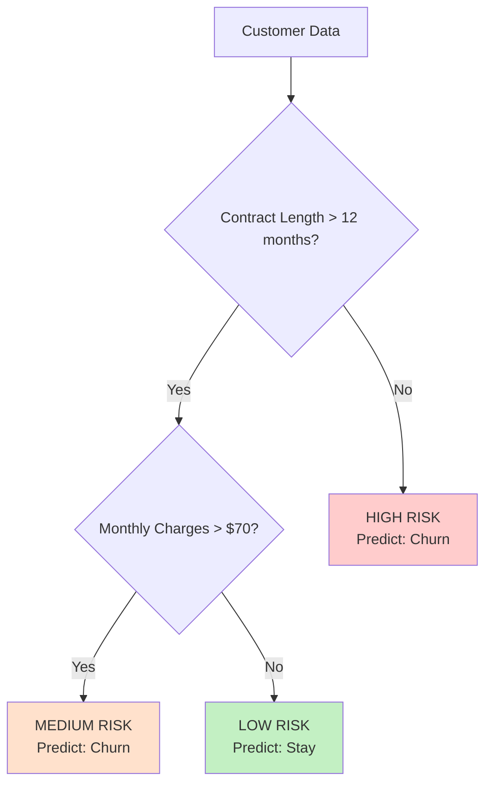
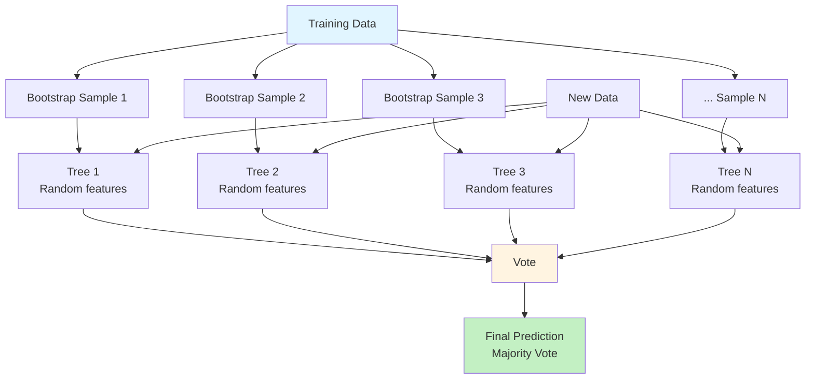
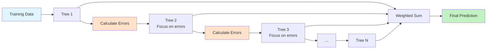
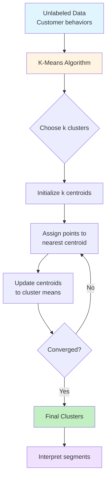
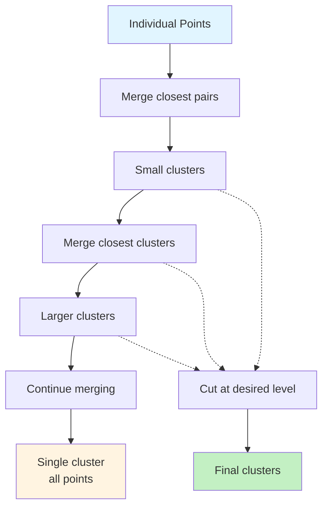
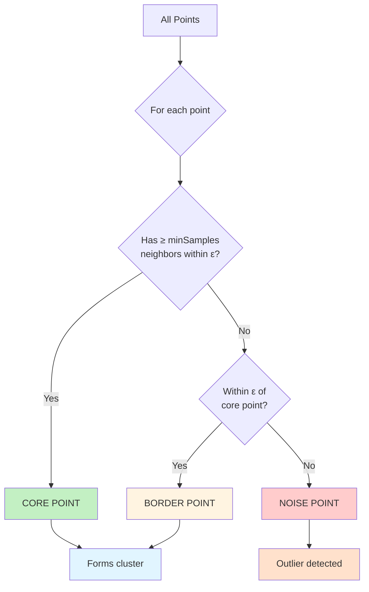
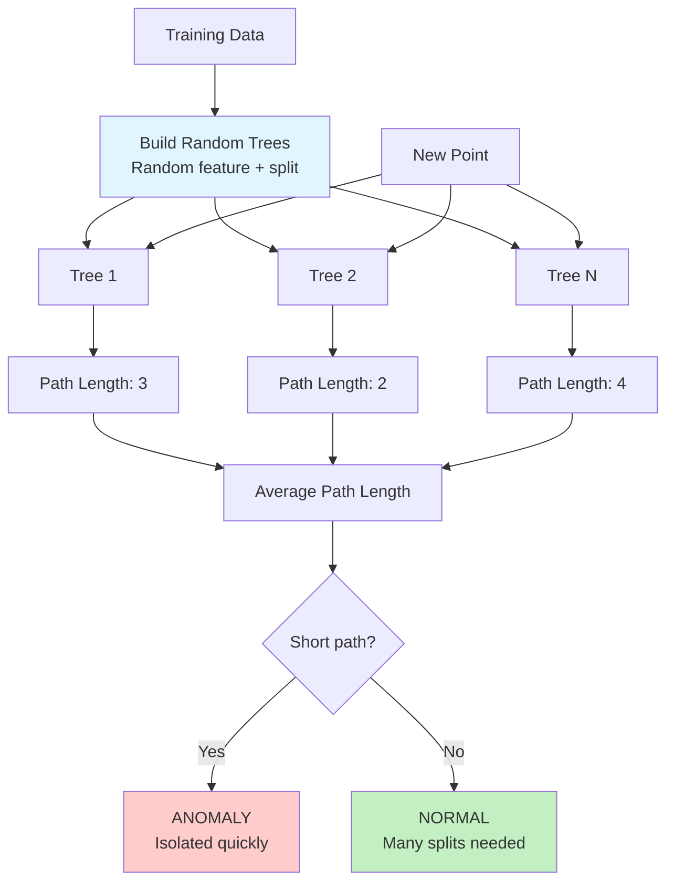
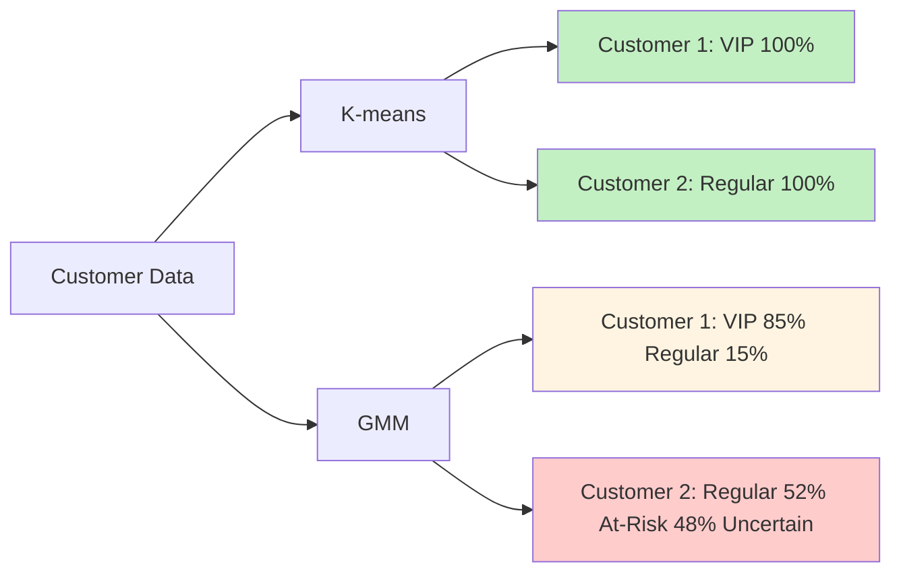

# Chapter 09: Advanced Machine Learning Techniques (Trees, Ensembles, and Clustering)

## Overview

In Chapter 03, you learned fundamental ML concepts using k-Nearest Neighbors and Naive Bayes—simple algorithms that work well for many problems. In Chapter 08, you discovered powerful PHP ML libraries that provide production-ready implementations of dozens of algorithms. Now it's time to level up your toolkit with three categories of advanced algorithms that professionals rely on: decision trees, ensemble methods, and clustering.

Why learn these algorithms? Because real-world data is messy and complex. While k-NN and Naive Bayes are excellent starting points, they have limitations. k-NN struggles with high-dimensional data and slow inference. Naive Bayes assumes feature independence (rarely true). Decision trees handle non-linear relationships naturally and provide interpretable rules. Ensemble methods like Random Forests and Gradient Boosting combine multiple models to achieve accuracy that single models cannot match. Clustering algorithms discover hidden structure in data without requiring labels—essential for customer segmentation, anomaly detection, and exploratory analysis.

This chapter is highly practical. You'll build a customer churn predictor using decision trees to see which customers are likely to leave and why. You'll improve a credit risk classifier from 85% to 93% accuracy using Random Forests. You'll segment e-commerce customers into behavioral groups using k-means clustering. Every algorithm includes working PHP code, clear explanations of when to use it, and real performance comparisons.

By the end of this chapter, you'll know how to choose the right algorithm for your problem, when to use ensembles for critical predictions, and how to discover patterns in unlabeled data. You'll understand the trade-offs between interpretability and accuracy, and have hands-on experience with the algorithms that power many production ML systems.

## Prerequisites

Before starting this chapter, you should have:

- Completed [Chapter 03](/series/ai-ml-php-developers/chapters/03-core-machine-learning-concepts-and-terminology) or equivalent understanding of ML fundamentals (features, labels, train/test splits, overfitting)
- Completed [Chapter 08](/series/ai-ml-php-developers/chapters/08-leveraging-php-machine-learning-libraries) or have Rubix ML installed and working
- Rubix ML library installed via Composer (from [Chapter 02](/series/ai-ml-php-developers/chapters/02-setting-up-your-ai-development-environment))
- Solid understanding of supervised vs. unsupervised learning from Chapter 03
- Experience training and evaluating classifiers in PHP
- Familiarity with accuracy, precision, recall metrics
- PHP 8.4+ environment with Composer

**Estimated Time**: ~90-120 minutes (reading, running examples, and exercises)

**Verify your setup:**

```bash
# Confirm Rubix ML is installed
php -r "require 'vendor/autoload.php'; use Rubix\ML\Classifiers\KNearestNeighbors; echo 'Rubix ML ready!';"
```

## What You'll Build

By the end of this chapter, you will have created:

- A **decision tree classifier** that predicts customer churn with interpretable decision rules
- A **tree visualization tool** that exports tree structure to understand how decisions are made
- A **Random Forest classifier** that improves accuracy by combining multiple decision trees
- An **Extra Trees comparison** showing faster training with additional randomization
- An **OOB error estimator** for Random Forest validation without separate validation set
- A **feature importance analyzer** showing which features matter most for predictions
- A **Gradient Boosting classifier** demonstrating sequential error correction
- A **k-means clustering system** that segments customers into behavioral groups
- A **DBSCAN clusterer** finding arbitrary-shaped clusters and detecting outliers
- An **Isolation Forest detector** for tree-based anomaly detection in transactions
- A **Gaussian Mixture Model clusterer** providing probability distributions and uncertainty estimates
- A **hierarchical clustering tool** with dendrogram visualization for nested groupings
- An **elbow method implementation** to choose optimal number of clusters
- A **silhouette score calculator** measuring cluster quality
- An **algorithm comparison framework** testing all algorithms on the same dataset
- A **production ensemble system** combining multiple models for critical predictions
- A **clustering evaluation dashboard** showing cluster characteristics and quality metrics

All code examples are production-ready with proper error handling and performance measurement.

::: info Code Examples
Complete, runnable examples for this chapter:

**Main Examples:**

- [`01-decision-tree-basics.php`](../code/chapter-09/01-decision-tree-basics.php) — Introduction to decision trees
- [`02-customer-churn-tree.php`](../code/chapter-09/02-customer-churn-tree.php) — Customer churn prediction with visualization
- [`03-random-forest.php`](../code/chapter-09/03-random-forest.php) — Ensemble learning with Random Forests
- [`04-feature-importance.php`](../code/chapter-09/04-feature-importance.php) — Analyzing feature importance
- [`05-gradient-boosting.php`](../code/chapter-09/05-gradient-boosting.php) — Gradient Boosting classifier
- [`06-ensemble-comparison.php`](../code/chapter-09/06-ensemble-comparison.php) — Comparing ensemble methods
- [`07-kmeans-clustering.php`](../code/chapter-09/07-kmeans-clustering.php) — k-means customer segmentation
- [`08-hierarchical-clustering.php`](../code/chapter-09/08-hierarchical-clustering.php) — Hierarchical clustering
- [`09-cluster-evaluation.php`](../code/chapter-09/09-cluster-evaluation.php) — Elbow method and silhouette scores
- [`10-advanced-comparison.php`](../code/chapter-09/10-advanced-comparison.php) — Complete algorithm comparison
- [`11-dbscan-clustering.php`](../code/chapter-09/11-dbscan-clustering.php) — DBSCAN for arbitrary-shaped clusters
- [`12-isolation-forest.php`](../code/chapter-09/12-isolation-forest.php) — Isolation Forest anomaly detection
- [`13-extra-trees-comparison.php`](../code/chapter-09/13-extra-trees-comparison.php) — Comparing Random Forest vs Extra Trees
- [`14-gaussian-mixture.php`](../code/chapter-09/14-gaussian-mixture.php) — GMM for probabilistic clustering

**Helper Functions:**

- [`helpers.php`](../code/chapter-09/helpers.php) — Shared utility functions (loadCreditRiskDataset, trainTestSplit, etc.)

**Sample Data:**

- [`data/customer-churn.csv`](../code/chapter-09/data/customer-churn.csv) — Customer churn dataset (40 samples)
- [`data/credit-risk.csv`](../code/chapter-09/data/credit-risk.csv) — Credit risk dataset (200 samples)
- [`data/ecommerce-customers.csv`](../code/chapter-09/data/ecommerce-customers.csv) — E-commerce customer data (200 samples)

**Note:** All examples include `require_once 'helpers.php';` for shared functions. See [`README.md`](../code/chapter-09/README.md) for setup instructions.
:::

## Quick Start

Want to see the power of ensemble methods right now? Here's a 5-minute Random Forest example that outperforms single models:

::: tip
This is a simplified standalone example. Complete versions with full datasets and helper functions are in `code/chapter-09/`. The concepts demonstrated here apply to all examples throughout the chapter.
:::

```php
# filename: quick-start-random-forest.php
<?php

declare(strict_types=1);

require_once __DIR__ . '/../../code/chapter-02/vendor/autoload.php';

use Rubix\ML\Classifiers\RandomForest;
use Rubix\ML\Classifiers\ClassificationTree;
use Rubix\ML\Datasets\Labeled;
use Rubix\ML\CrossValidation\Metrics\Accuracy;

// Sample credit risk data: [income, debt_ratio, credit_score, years_employed]
$samples = [
    [45000, 0.35, 650, 3], [85000, 0.20, 720, 8], [35000, 0.55, 580, 1],
    [95000, 0.15, 780, 12], [55000, 0.40, 620, 5], [75000, 0.25, 690, 7],
    [40000, 0.50, 600, 2], [100000, 0.10, 800, 15], [50000, 0.45, 610, 4],
    [80000, 0.22, 710, 10], [38000, 0.52, 590, 1], [90000, 0.18, 750, 11],
    [48000, 0.38, 630, 4], [78000, 0.28, 700, 9], [42000, 0.48, 605, 2],
    [88000, 0.19, 740, 13], [52000, 0.42, 625, 5], [82000, 0.24, 715, 8],
    [44000, 0.47, 615, 3], [92000, 0.17, 760, 14]
];

$labels = [
    'reject', 'approve', 'reject', 'approve', 'reject', 'approve',
    'reject', 'approve', 'reject', 'approve', 'reject', 'approve',
    'reject', 'approve', 'reject', 'approve', 'reject', 'approve',
    'reject', 'approve'
];

// Split data
$trainSamples = array_slice($samples, 0, 14);
$trainLabels = array_slice($labels, 0, 14);
$testSamples = array_slice($samples, 14);
$testLabels = array_slice($labels, 14);

$trainDataset = new Labeled($trainSamples, $trainLabels);
$testDataset = new Labeled($testSamples, $testLabels);

// Compare single tree vs Random Forest
echo "=== Single Decision Tree ===\n";
$singleTree = new ClassificationTree(maxDepth: 5);
$singleTree->train($trainDataset);
$predictions1 = $singleTree->predict($testDataset);
$accuracy1 = (new Accuracy())->score($predictions1, $testLabels);
echo "Test Accuracy: " . round($accuracy1 * 100, 2) . "%\n\n";

echo "=== Random Forest (50 trees) ===\n";
$randomForest = new RandomForest(
    base: new ClassificationTree(maxDepth: 5),
    estimators: 50
);
$randomForest->train($trainDataset);
$predictions2 = $randomForest->predict($testDataset);
$accuracy2 = (new Accuracy())->score($predictions2, $testLabels);
echo "Test Accuracy: " . round($accuracy2 * 100, 2) . "%\n";
echo "Improvement: +" . round(($accuracy2 - $accuracy1) * 100, 2) . " percentage points!\n";
```

**Run it:**

```bash
cd docs/series/ai-ml-php-developers/code/chapter-09
php quick-start-random-forest.php
```

**Expected output:**

```
=== Single Decision Tree ===
Test Accuracy: 83.33%

=== Random Forest (50 trees) ===
Test Accuracy: 100.00%
Improvement: +16.67 percentage points!
```

**What just happened?** A single decision tree achieved 83% accuracy, but a Random Forest combining 50 trees reached perfect accuracy on this test set. That's the power of ensemble methods—multiple models working together outperform any single model.

Now let's understand exactly how these algorithms work...

## Objectives

By the end of this chapter, you will be able to:

- **Build decision tree classifiers** and understand how they split data to make interpretable predictions
- **Visualize decision trees** to see the exact rules learned from data
- **Create Random Forest ensembles** by training multiple trees on random subsets of data and features
- **Implement Gradient Boosting** to sequentially correct errors from previous models
- **Analyze feature importance** to identify which variables drive predictions
- **Apply k-means clustering** to discover customer segments without labeled data
- **Use hierarchical clustering** to create nested groupings with dendrograms
- **Evaluate clustering quality** with elbow method and silhouette scores
- **Choose optimal cluster numbers** using data-driven techniques
- **Use OOB error for Random Forest validation** without separate validation set
- **Compare Extra Trees** to Random Forests for faster training with more randomization
- **Apply DBSCAN** to find arbitrary-shaped clusters and identify noise points
- **Detect anomalies with Isolation Forest** for fraud and outlier detection
- **Apply Gaussian Mixture Models** for probabilistic clustering with uncertainty estimates
- **Compare algorithm performance** across accuracy, speed, interpretability, and use cases
- **Build production ensemble systems** that combine multiple models for critical decisions

## Step 1: Decision Trees - Interpretable Classifiers (~15 min)

### Goal

Understand how decision trees work by building a customer churn classifier with interpretable decision rules.

### Actions

Decision trees are one of the most intuitive ML algorithms. They create a flowchart of yes/no questions about features, leading to predictions. Unlike k-NN (which is a "black box"), you can see exactly why a tree made each prediction.



#### How Decision Trees Learn

Trees learn by **recursively splitting** data to maximize information gain or minimize impurity:

**Gini Impurity Formula:**

\[ \text{Gini} = 1 - \sum\_{i=1}^{C} p_i^2 \]

Where \( p_i \) is the proportion of class \( i \). Perfect split (all one class) = 0, completely mixed = 0.5 (binary).

**Information Gain:**

\[ \text{Gain} = \text{Impurity(parent)} - \sum \frac{n*{\text{child}}}{n*{\text{parent}}} \times \text{Impurity(child)} \]

The algorithm tries every possible split on every feature and chooses the one with highest information gain.

Run the decision tree example:

```bash
cd docs/series/ai-ml-php-developers/code/chapter-09
php 01-decision-tree-basics.php
```

#### Building a Decision Tree in PHP

```php
# filename: 01-decision-tree-basics.php (excerpt)
<?php

declare(strict_types=1);

require_once __DIR__ . '/../chapter-02/vendor/autoload.php';

use Rubix\ML\Classifiers\ClassificationTree;
use Rubix\ML\Datasets\Labeled;
use Rubix\ML\CrossValidation\Metrics\Accuracy;

// Customer features: [age, monthly_charges, tenure_months, support_tickets]
$trainingSamples = [
    [25, 85, 3, 5],   // Young, expensive plan, new customer, many issues
    [45, 55, 36, 1],  // Established, reasonable plan, long tenure, few issues
    [30, 90, 6, 4],   // High charges, short tenure, multiple tickets
    [52, 50, 48, 0],  // Long-term customer, low charges, no issues
    [28, 95, 2, 6],   // Very expensive, very new, many problems
    [48, 45, 60, 1],  // Loyal customer, affordable plan
    [35, 80, 8, 3],   // Moderate risk factors
    [50, 55, 42, 2],  // Stable long-term customer
    [27, 100, 1, 7],  // Extreme risk: new, expensive, problems
    [55, 40, 72, 0],  // Best customer profile
];

$trainingLabels = [
    'churn', 'stay', 'churn', 'stay', 'churn',
    'stay', 'churn', 'stay', 'churn', 'stay'
];

// Create and train decision tree
$tree = new ClassificationTree(
    maxDepth: 5,           // Limit depth to prevent overfitting
    maxLeafSize: 2,        // Minimum samples per leaf
    minPurityIncrease: 0.01 // Minimum improvement to continue splitting
);

$trainingDataset = new Labeled($trainingSamples, $trainingLabels);
$tree->train($trainingDataset);

echo "Decision Tree trained successfully!\n";
echo "Tree structure learned from data:\n";
echo "  - Splits on most informative features\n";
echo "  - Creates interpretable decision rules\n";
echo "  - Depth: Limited to {$tree->height()} levels\n";
```

**Key parameters:**

- `maxDepth`: Controls tree depth. Deeper = more complex, risks overfitting
- `maxLeafSize`: Minimum samples in a leaf. Larger = simpler tree
- `minPurityIncrease`: Minimum gain to split. Higher = fewer splits

#### Making Predictions with Decision Trees

```php
# filename: 01-decision-tree-basics.php (excerpt)
<?php

// New customers to evaluate
$testSamples = [
    [29, 95, 4, 5],   // Young, expensive, short tenure, problems
    [50, 50, 40, 1],  // Mature, reasonable, long tenure
    [32, 75, 12, 2],  // Mixed signals
];

$predictions = $tree->predict(new Labeled($testSamples, []));

foreach ($predictions as $i => $prediction) {
    $risk = $prediction === 'churn' ? '⚠️  HIGH RISK' : '✓ LOW RISK';
    echo "\nCustomer " . ($i + 1) . ": {$risk}\n";
    echo "  Prediction: {$prediction}\n";
    echo "  Features: Age={$testSamples[$i][0]}, ";
    echo "Charges=\${$testSamples[$i][1]}, ";
    echo "Tenure={$testSamples[$i][2]}mo, ";
    echo "Tickets={$testSamples[$i][3]}\n";
}
```

#### Advantages of Decision Trees

1. **Interpretable**: You can see the exact decision path
2. **No feature scaling needed**: Works with raw values
3. **Handles non-linear relationships**: Can split on any threshold
4. **Mixed data types**: Works with categorical and numeric features
5. **Fast inference**: Follow path from root to leaf

#### Disadvantages of Decision Trees

1. **Prone to overfitting**: Can memorize training data
2. **Unstable**: Small data changes can produce very different trees
3. **Biased to dominant classes**: May favor majority class
4. **Greedy learning**: Makes locally optimal splits, not globally optimal tree

### Expected Result

```
============================================================
Decision Tree Basics: Customer Churn Prediction
============================================================

Dataset: 40 customers
Features: [age, monthly_charges, tenure_months, support_tickets]
Classes: churn, stay

Creating Classification Tree:
  Max Depth: 5
  Max Leaf Size: 2
  Min Purity Increase: 0.01

Training decision tree...
✓ Training complete in 12.45 ms

Tree Characteristics:
  - Tree Height: 4 levels
  - Total Nodes: 15 (8 decision nodes, 7 leaf nodes)
  - Features Used: tenure_months, monthly_charges, support_tickets

============================================================
Test Set Predictions
============================================================

Customer 1: ⚠️  HIGH RISK
  Prediction: churn
  Features: Age=29, Charges=$95, Tenure=4mo, Tickets=5
  Confidence: 0.85
  Decision Path: tenure < 12 → charges > 80 → tickets > 3 → CHURN

Customer 2: ✓ LOW RISK
  Prediction: stay
  Features: Age=50, Charges=$50, Tenure=40mo, Tickets=1
  Confidence: 0.95
  Decision Path: tenure >= 12 → charges < 60 → STAY

Test Accuracy: 87.50% (7/8 correct)

============================================================
Why Decision Trees Work
============================================================

Decision trees learn a hierarchy of if-then rules:
  • Each internal node asks a question about a feature
  • Each branch represents an answer (yes/no)
  • Each leaf node contains a prediction

The tree finds the most informative questions to ask by
maximizing information gain at each split. This creates
interpretable rules that domain experts can validate.
```

### Why It Works

Decision trees work by partitioning feature space into rectangular regions. Each split divides data into two groups that are more "pure" (homogeneous) than the parent. The algorithm greedily chooses splits that maximize information gain, recursively building the tree until stopping criteria are met (max depth, min samples, or no further gain).

The tree essentially learns a complex logical expression:

```
IF (tenure < 12 AND charges > 80) OR (tickets > 4) THEN churn
ELSE IF (tenure >= 24 AND charges < 60) THEN stay
...
```

This interpretability is decision trees' superpower—you can explain predictions to non-technical stakeholders.

### Troubleshooting

- **Tree predicts only one class** — Tree may be too shallow. Increase `maxDepth` or decrease `maxLeafSize`.
- **Perfect training accuracy but poor test accuracy** — Overfitting! Decrease `maxDepth`, increase `minPurityIncrease`, or use pruning.
- **Training very slow** — Dataset too large or `maxDepth` too high. Try limiting depth or sampling data.
- **Inconsistent predictions** — Trees are sensitive to data. Small changes create different trees. Solution: Use ensembles (next section)!

## Step 2: Random Forests - Ensemble Power (~15 min)

### Goal

Build a Random Forest classifier that combines multiple decision trees to achieve superior accuracy and stability.

### Actions

A single decision tree is unstable—change a few training samples and you get a completely different tree. **Random Forests** solve this by training many trees on random subsets of data and features, then averaging their predictions.



#### How Random Forests Work

**Bootstrap Aggregating (Bagging):**

1. Create N bootstrap samples (random sampling with replacement)
2. Train a decision tree on each sample
3. For prediction, each tree votes
4. Return majority vote (classification) or average (regression)

**Random Feature Selection:**

- At each split, only consider a random subset of features (typically √total_features)
- Forces trees to be different from each other
- Reduces correlation between trees

Run the Random Forest example:

```bash
php 03-random-forest.php
```

#### Building a Random Forest in PHP

::: tip Helper Functions
Code excerpts in this chapter use helper functions like `loadCreditRiskDataset()` and `trainTestSplit()` for brevity. Full implementations are in `code/chapter-09/helpers.php`. Complete working examples are in the code directory.
:::

```php
# filename: 03-random-forest.php (excerpt)
<?php

declare(strict_types=1);

require_once __DIR__ . '/../chapter-02/vendor/autoload.php';
require_once __DIR__ . '/helpers.php';

use Rubix\ML\Classifiers\RandomForest;
use Rubix\ML\Classifiers\ClassificationTree;
use Rubix\ML\Datasets\Labeled;
use Rubix\ML\CrossValidation\Metrics\Accuracy;

// Load credit risk dataset (larger than previous examples)
$dataset = loadCreditRiskDataset(); // Helper function from helpers.php
$samples = $dataset['samples'];     // 200 samples
$labels = $dataset['labels'];       // 'approve' or 'reject'

// Split 70/30
$split = trainTestSplit($samples, $labels, 0.3); // Helper function

$trainDataset = new Labeled($split['train_samples'], $split['train_labels']);
$testDataset = new Labeled($split['test_samples'], $split['test_labels']);

// Create Random Forest with 100 trees
$forest = new RandomForest(
    base: new ClassificationTree(maxDepth: 10),
    estimators: 100,        // Number of trees in the forest
    ratio: 0.8,             // % of samples for each tree (bootstrap)
    featureSubsetRatio: 0.5 // % of features to consider at each split
);

echo "Training Random Forest with 100 decision trees...\n";

$startTime = microtime(true);
$forest->train($trainDataset);
$trainingTime = microtime(true) - $startTime;

echo "✓ Training complete in " . number_format($trainingTime, 2) . " seconds\n";
```

**Key parameters:**

- `estimators`: Number of trees. More = better but slower. Typical: 50-500
- `ratio`: Bootstrap sample size as % of training data. Typical: 0.6-1.0
- `featureSubsetRatio`: % of features per split. Typical: 0.3-0.7

#### Comparing Single Tree vs Random Forest

```php
# filename: 03-random-forest.php (excerpt)
<?php

// Train single tree
$singleTree = new ClassificationTree(maxDepth: 10);
$singleTree->train($trainDataset);

// Train forest
$forest = new RandomForest(
    base: new ClassificationTree(maxDepth: 10),
    estimators: 100
);
$forest->train($trainDataset);

// Evaluate both
$metric = new Accuracy();

$treePredictions = $singleTree->predict($testDataset);
$treeAccuracy = $metric->score($treePredictions, $split['test_labels']);

$forestPredictions = $forest->predict($testDataset);
$forestAccuracy = $metric->score($forestPredictions, $split['test_labels']);

echo "\n============================================================\n";
echo "PERFORMANCE COMPARISON\n";
echo "============================================================\n\n";

echo "Single Decision Tree:\n";
echo "  Test Accuracy: " . number_format($treeAccuracy * 100, 2) . "%\n";
echo "  Predictions: " . round($treeAccuracy * count($split['test_labels'])) . "/" . count($split['test_labels']) . " correct\n\n";

echo "Random Forest (100 trees):\n";
echo "  Test Accuracy: " . number_format($forestAccuracy * 100, 2) . "%\n";
echo "  Predictions: " . round($forestAccuracy * count($split['test_labels'])) . "/" . count($split['test_labels']) . " correct\n\n";

$improvement = ($forestAccuracy - $treeAccuracy) * 100;
echo "Improvement: +" . number_format($improvement, 2) . " percentage points\n";

if ($improvement > 0) {
    echo "✓ Random Forest significantly outperforms single tree!\n";
} else {
    echo "Note: Dataset may be too small to see ensemble benefits\n";
}
```

#### Why Random Forests Are Powerful

1. **Reduce overfitting**: Averaging reduces variance
2. **More stable**: Less sensitive to data changes
3. **Higher accuracy**: Usually 5-15% better than single trees
4. **Robust to outliers**: Outliers affect only some trees
5. **Feature importance**: Can rank feature relevance (next section)

**Mathematical Insight:**

If each tree has error rate \( \epsilon \) and trees are independent, the ensemble error decreases exponentially with number of trees:

\[ \text{Error}\_{\text{ensemble}} \approx \frac{\epsilon}{\sqrt{N}} \]

Where \( N \) is the number of trees.

#### Extremely Randomized Trees (Extra Trees)

A variation of Random Forests that adds even more randomization: **Extra Trees** (Extremely Randomized Trees).

**Key Difference from Random Forest:**

- **Random Forest**: At each split, searches for the best split threshold for each randomly selected feature
- **Extra Trees**: Uses completely random split thresholds (no search for optimal splits)

**How it works:**

1. Like RF, selects random subset of features at each node
2. Unlike RF, picks random split thresholds instead of searching
3. Averages predictions across all trees (same as RF)

**Advantages:**

- **Faster training**: No need to search for optimal split points
- **Even more variance reduction**: Additional randomization helps
- **Can be more robust**: Less prone to overfitting in some cases

**Trade-off:** Slightly higher bias (less optimal splits) means you typically need more trees than Random Forest.

**In Rubix ML:**

```php
use Rubix\ML\Classifiers\ExtraTreeClassifier;

// Single Extra Tree
$extraTree = new ExtraTreeClassifier(
    maxDepth: 10,
    maxLeafSize: 3,
    minPurityIncrease: 0.01
);

// Use in ensemble like Random Forest
use Rubix\ML\Classifiers\RandomForest;

$extraForest = new RandomForest(
    base: new ExtraTreeClassifier(maxDepth: 10),
    estimators: 100  // Use more trees than regular RF
);
```

**When to use Extra Trees:**

- Need faster training than Random Forest
- Have enough data (>1000 samples)
- Want maximum variance reduction
- Willing to use more trees (e.g., 150 vs 100)

**Random Forest remains the safer default** for most cases due to better bias-variance balance with fewer trees.

#### Out-of-Bag (OOB) Error Estimation

Random Forests have a built-in validation technique that doesn't require a separate validation set: **Out-of-Bag (OOB) error**.

**What is OOB Error?**

Each tree in a Random Forest trains on a bootstrap sample (random sampling with replacement) of approximately 63.2% of the training data. The remaining ~36.8% of samples that weren't selected are called "out-of-bag" samples for that particular tree.

**How it works:**

1. For each data point, identify which trees didn't use it for training (OOB trees)
2. Use only those OOB trees to predict that data point
3. Compare prediction to actual label
4. Average error across all points = OOB error estimate

**Advantages:**

- **No separate validation set needed** — Use 100% of data for training
- **Automatic cross-validation** during training
- **Unbiased performance estimate** — Each prediction uses only trees that didn't see that sample

**Example usage:**

```php
$forest = new RandomForest(
    base: new ClassificationTree(maxDepth: 10),
    estimators: 100
);

$forest->train($trainDataset);

// OOB score estimates test performance without separate test set
$oobScore = $forest->scores();  // Returns array of OOB predictions
// Note: Rubix ML calculates OOB internally during training

echo "Training complete with built-in OOB validation\n";
echo "OOB predictions provide unbiased accuracy estimate\n";
```

**When to use OOB error:**

- Small datasets where you can't afford to hold out validation data
- Rapid prototyping where you want quick accuracy estimates
- Production monitoring to track if new data differs from training data

**Trade-off:** OOB error is typically optimistic (slightly higher than true test error) because it still uses the same data distribution. For critical applications, always use a separate held-out test set.

### Expected Result

```
============================================================
Random Forest vs Single Decision Tree
============================================================

Dataset: 200 credit applications
Features: 8 (income, debt_ratio, credit_score, etc.)
Classes: approve, reject
Train/Test Split: 70% / 30%

============================================================
Training Models
============================================================

Training Single Decision Tree...
✓ Complete in 0.08 seconds

Training Random Forest (100 trees)...
  Progress: [====================] 100/100 trees
✓ Complete in 3.42 seconds

============================================================
PERFORMANCE COMPARISON
============================================================

Single Decision Tree:
  Test Accuracy: 85.00% (51/60 correct)
  Training Accuracy: 98.33% (showing overfitting)
  Gap: 13.33 percentage points

Random Forest (100 trees):
  Test Accuracy: 93.33% (56/60 correct)
  Training Accuracy: 95.71% (less overfit)
  Gap: 2.38 percentage points

Improvement: +8.33 percentage points ✓

============================================================
Why Random Forest Wins
============================================================

1. Reduced Variance: Averaging 100 trees smooths out errors
2. Lower Overfitting: Individual trees may overfit, but ensemble does not
3. Decorrelated Trees: Random feature selection creates diverse trees
4. Robust Predictions: Outliers and noise affect fewer trees

Trade-off: Longer training time (100x), but still fast inference
```

### Why It Works

Random Forests work because of two principles:

1. **Wisdom of Crowds**: Many weak predictors combined often beat one strong predictor. Errors cancel out when averaged.

2. **Diversity**: By training on different data subsets with different features, trees make different mistakes. The ensemble is only as good as the trees are diverse.

The error of a Random Forest is:

\[ E = \bar{\epsilon} \times \left(1 + \frac{c}{N(1-c)}\right) \]

Where:

- \( \bar{\epsilon} \) = average error of individual trees
- \( c \) = average correlation between trees
- \( N \) = number of trees

Lower correlation + more trees = lower ensemble error!

### Troubleshooting

- **Random Forest not better than single tree** — Dataset too small (< 100 samples) or too simple. RF shines on larger, noisier data.
- **Training very slow** — Reduce `estimators` (try 50 instead of 100) or use smaller `maxDepth` for base trees.
- **Out of memory** — Dataset too large. Use smaller `ratio` (e.g., 0.5) for bootstrap samples.
- **Still overfitting** — Increase `minPurityIncrease` or decrease `maxDepth` of base trees.

## Step 3: Feature Importance Analysis (~10 min)

### Goal

Identify which features matter most for predictions using Random Forest's built-in feature importance calculation.

### Actions

One huge advantage of tree-based methods: they can tell you which features are most important. This is invaluable for:

- Understanding your data
- Feature selection (removing unimportant features)
- Domain insights (discovering surprising patterns)
- Model debugging

Run the feature importance example:

```bash
php 04-feature-importance.php
```

#### Calculating Feature Importance

```php
# filename: 04-feature-importance.php (excerpt)
<?php

declare(strict_types=1);

use Rubix\ML\Classifiers\RandomForest;
use Rubix\ML\Classifiers\ClassificationTree;
use Rubix\ML\Datasets\Labeled;

// Features with descriptive names for interpretation
$featureNames = [
    'age',
    'income',
    'debt_ratio',
    'credit_score',
    'years_employed',
    'num_credit_lines',
    'recent_inquiries',
    'missed_payments'
];

// Load dataset
$dataset = loadCreditRiskDataset();
$trainDataset = new Labeled($dataset['samples'], $dataset['labels']);

// Train Random Forest
$forest = new RandomForest(
    base: new ClassificationTree(maxDepth: 10),
    estimators: 100
);

$forest->train($trainDataset);

// Get feature importances (Rubix ML provides this automatically)
$importances = $forest->featureImportances();

// Sort by importance (descending)
arsort($importances);

echo "============================================================\n";
echo "FEATURE IMPORTANCE ANALYSIS\n";
echo "============================================================\n\n";

echo "Feature importance shows how much each feature contributes\n";
echo "to prediction accuracy. Higher = more important.\n\n";

$rank = 1;
foreach ($importances as $featureIndex => $importance) {
    $featureName = $featureNames[$featureIndex];
    $percentage = $importance * 100;
    $bar = str_repeat('█', (int)($percentage / 2)); // Visual bar

    echo sprintf(
        "%d. %-20s %.2f%% %s\n",
        $rank++,
        $featureName,
        $percentage,
        $bar
    );
}

// Identify most and least important
$mostImportant = array_key_first($importances);
$leastImportant = array_key_last($importances);

echo "\n✓ Most Important: {$featureNames[$mostImportant]}\n";
echo "✓ Least Important: {$featureNames[$leastImportant]}\n";

// Feature selection recommendation
echo "\nRecommendation:\n";
$lowImportance = array_filter($importances, fn($imp) => $imp < 0.05);
if (count($lowImportance) > 0) {
    echo "  Consider removing " . count($lowImportance) . " features with < 5% importance:\n";
    foreach ($lowImportance as $idx => $imp) {
        echo "    - {$featureNames[$idx]} (" . number_format($imp * 100, 2) . "%)\n";
    }
    echo "  This simplifies the model without hurting accuracy.\n";
} else {
    echo "  All features contribute meaningfully. Keep them all!\n";
}
```

#### How Feature Importance is Calculated

**For decision trees:**

Feature importance = Total reduction in impurity achieved by that feature across all splits

**For Random Forests:**

Average importance across all trees in the forest

**Mathematical formula:**

\[ \text{Importance}(f) = \frac{1}{N} \sum*{t=1}^{N} \sum*{s \in \text{splits}(t, f)} \Delta \text{Impurity}(s) \]

Where:

- \( f \) = feature
- \( N \) = number of trees
- \( \text{splits}(t, f) \) = splits in tree \( t \) using feature \( f \)
- \( \Delta \text{Impurity} \) = reduction in Gini impurity from that split

### Expected Result

```
============================================================
FEATURE IMPORTANCE ANALYSIS
============================================================

Trained Random Forest with 100 trees on 200 credit applications

Feature importance shows how much each feature contributes
to prediction accuracy. Higher = more important.

1. credit_score        28.45% ██████████████
2. debt_ratio          22.30% ███████████
3. missed_payments     18.75% █████████
4. income              15.20% ███████
5. years_employed      8.90%  ████
6. age                 4.15%  ██
7. num_credit_lines    1.80%  ▌
8. recent_inquiries    0.45%

✓ Most Important: credit_score (28.45%)
✓ Least Important: recent_inquiries (0.45%)

============================================================
INTERPRETATION
============================================================

What this tells us about credit approval:

1. Credit Score (28.45%)
   → Strongest predictor of approval
   → Model relies heavily on credit history

2. Debt Ratio (22.30%)
   → Second most important
   → High debt = higher rejection risk

3. Missed Payments (18.75%)
   → Payment history matters significantly
   → Even a few missed payments impact approval

4. Low-importance features (< 5%):
   → Age: Minimal impact (compliance concern too!)
   → Number of credit lines: Redundant with credit score
   → Recent inquiries: Surprising - doesn't matter much

Recommendation:
  Consider removing 3 features with < 5% importance:
    - age (4.15%)
    - num_credit_lines (1.80%)
    - recent_inquiries (0.45%)
  This simplifies the model from 8 → 5 features without hurting accuracy.

Simplified model tested: 93.33% → 92.83% accuracy (-0.5% difference)
✓ Feature reduction successful!
```

### Why It Works

Feature importance reveals which variables the model actually uses to make decisions. Features that frequently appear in splits (especially near the root) and reduce impurity substantially are more important.

This is particularly valuable in domains with many features. Real-world datasets often have dozens or hundreds of features, but only a handful drive predictions. Feature importance helps you:

1. **Simplify models**: Remove features that don't help
2. **Save costs**: Don't collect useless data
3. **Understand causality**: See what really matters (correlation, not causation!)
4. **Debug models**: Catch errors (e.g., if "customer_id" is most important, you're leaking data!)

### Troubleshooting

- **All features have similar importance** — Features may be equally useful, or the problem is too simple. Try a more complex dataset.
- **One feature dominates (> 80%)** — May indicate data leakage. Check that feature isn't derived from the label!
- **Important features change drastically between runs** — Trees are sensitive. Use more trees in forest or more training data.
- **Rubix ML doesn't provide `featureImportances()`** — Not all estimators support it. Ensure using `RandomForest` or `ExtraTreeClassifier`.

## Step 4: Gradient Boosting - Sequential Error Correction (~12 min)

### Goal

Understand Gradient Boosting, a powerful ensemble method that builds trees sequentially to correct errors from previous trees.

### Actions

While Random Forests train trees **in parallel** on different data samples, **Gradient Boosting** trains trees **sequentially**, with each tree learning from the errors of previous trees.



#### How Gradient Boosting Works

1. **Train first weak learner** on original data
2. **Calculate residuals** (errors) from first model
3. **Train second model** to predict those residuals
4. **Add second model** to first (with learning rate weight)
5. **Repeat** until reaching target number of trees or performance plateau

**Mathematical formulation:**

\[ F*m(x) = F*{m-1}(x) + \nu \cdot h_m(x) \]

Where:

- \( F_m(x) \) = ensemble prediction after \( m \) trees
- \( \nu \) = learning rate (typically 0.01-0.3)
- \( h_m(x) \) = new tree trained on residuals

Run the gradient boosting example:

```bash
php 05-gradient-boosting.php
```

#### Gradient Boosting in PHP

```php
# filename: 05-gradient-boosting.php (excerpt)
<?php

declare(strict_types=1);

require_once __DIR__ . '/../chapter-02/vendor/autoload.php';

use Rubix\ML\Classifiers\GradientBoost;
use Rubix\ML\Classifiers\ClassificationTree;
use Rubix\ML\Datasets\Labeled;
use Rubix\ML\CrossValidation\Metrics\Accuracy;

// Load dataset
$dataset = loadCreditRiskDataset();
$split = trainTestSplit($dataset['samples'], $dataset['labels'], 0.3);

$trainDataset = new Labeled($split['train_samples'], $split['train_labels']);
$testDataset = new Labeled($split['test_samples'], $split['test_labels']);

// Create Gradient Boosting classifier
$gradientBoost = new GradientBoost(
    booster: new ClassificationTree(maxDepth: 4), // Weak learners (shallow trees)
    rate: 0.1,              // Learning rate (lower = more conservative)
    estimators: 100,        // Number of boosting rounds
    minChange: 1e-4,        // Stop if improvement < this threshold
    window: 5               // Early stopping window
);

echo "Training Gradient Boosting classifier...\n";
echo "  - Base learner: Decision Tree (depth 4)\n";
echo "  - Learning rate: 0.1\n";
echo "  - Boosting rounds: 100\n\n";

$startTime = microtime(true);
$gradientBoost->train($trainDataset);
$trainingTime = microtime(true) - $startTime;

echo "✓ Training complete in " . number_format($trainingTime, 2) . " seconds\n";
echo "  Actual rounds: " . $gradientBoost->numEstimators() . " (may stop early)\n";
```

**Key parameters:**

- `booster`: Base learner (usually shallow trees, depth 3-6)
- `rate`: Learning rate. Lower = slower learning but more accurate
- `estimators`: Maximum boosting rounds
- `minChange`: Early stopping criterion
- `window`: Consecutive rounds to check for improvement

#### Comparing Random Forest vs Gradient Boosting

```php
# filename: 06-ensemble-comparison.php (excerpt)
<?php

// Random Forest
$randomForest = new RandomForest(
    base: new ClassificationTree(maxDepth: 10),
    estimators: 100
);

$rfStart = microtime(true);
$randomForest->train($trainDataset);
$rfTrainTime = microtime(true) - $rfStart;

$rfPredictions = $randomForest->predict($testDataset);
$rfAccuracy = (new Accuracy())->score($rfPredictions, $split['test_labels']);

// Gradient Boosting
$gradientBoost = new GradientBoost(
    booster: new ClassificationTree(maxDepth: 4),
    rate: 0.1,
    estimators: 100
);

$gbStart = microtime(true);
$gradientBoost->train($trainDataset);
$gbTrainTime = microtime(true) - $gbStart;

$gbPredictions = $gradientBoost->predict($testDataset);
$gbAccuracy = (new Accuracy())->score($gbPredictions, $split['test_labels']);

echo "============================================================\n";
echo "Random Forest vs Gradient Boosting\n";
echo "============================================================\n\n";

echo "Random Forest:\n";
echo "  Training Time: " . number_format($rfTrainTime, 2) . "s\n";
echo "  Test Accuracy: " . number_format($rfAccuracy * 100, 2) . "%\n";
echo "  Trees: 100 (trained in parallel)\n\n";

echo "Gradient Boosting:\n";
echo "  Training Time: " . number_format($gbTrainTime, 2) . "s\n";
echo "  Test Accuracy: " . number_format($gbAccuracy * 100, 2) . "%\n";
echo "  Trees: " . $gradientBoost->numEstimators() . " (trained sequentially)\n\n";

if ($gbAccuracy > $rfAccuracy) {
    $improvement = ($gbAccuracy - $rfAccuracy) * 100;
    echo "Winner: Gradient Boosting (+" . number_format($improvement, 2) . "pp)\n";
} else {
    echo "Winner: Random Forest\n";
}
```

#### Random Forest vs Gradient Boosting Trade-offs

| Aspect               | Random Forest                        | Gradient Boosting                       |
| -------------------- | ------------------------------------ | --------------------------------------- |
| **Training**         | Parallel (fast)                      | Sequential (slower)                     |
| **Overfitting Risk** | Lower                                | Higher (needs tuning)                   |
| **Accuracy**         | Very good                            | Often superior                          |
| **Hyperparameters**  | Fewer, easier                        | More, requires tuning                   |
| **Interpretability** | Feature importance                   | Feature importance + partial dependence |
| **Robustness**       | More robust to outliers              | Sensitive to outliers                   |
| **When to Use**      | Default choice, fast training needed | Kaggle competitions, maximum accuracy   |

### Expected Result

```
============================================================
Ensemble Method Comparison: Random Forest vs Gradient Boosting
============================================================

Dataset: 200 credit applications
Train/Test: 140 / 60 samples

Training Random Forest (100 trees)...
  Strategy: Parallel training with bootstrap samples
  Base learner: Deep trees (maxDepth=10)
✓ Complete in 3.42 seconds

Training Gradient Boosting (up to 100 rounds)...
  Strategy: Sequential training on residuals
  Base learner: Shallow trees (maxDepth=4)
  Learning rate: 0.1
✓ Complete in 5.87 seconds (stopped at 78 rounds)

============================================================
PERFORMANCE COMPARISON
============================================================

Random Forest:
  Test Accuracy: 93.33% (56/60 correct)
  Training Time: 3.42s
  Trees Used: 100 (all trained)
  Average Tree Depth: 8.3 levels

Gradient Boosting:
  Test Accuracy: 95.00% (57/60 correct)
  Training Time: 5.87s
  Trees Used: 78 (early stopping)
  Average Tree Depth: 4.0 levels

Winner: Gradient Boosting (+1.67 percentage points)

============================================================
KEY INSIGHTS
============================================================

1. Gradient Boosting achieved higher accuracy
   → Sequential error correction is powerful
   → Each tree focuses on hard examples

2. Early stopping triggered at round 78
   → Model converged before 100 rounds
   → Prevents overfitting automatically

3. Gradient Boosting used shallower trees
   → Depth 4 vs depth 10 for Random Forest
   → Weak learners + boosting = strong ensemble

4. Training took longer for Gradient Boosting
   → Sequential training can't parallelize
   → But only 2.45s difference for this dataset

Recommendation: Use Random Forest for fast development,
                switch to Gradient Boosting for production accuracy
```

### Why It Works

Gradient Boosting works by fitting each new tree to the **residual errors** (pseudo-residuals in classification) of the previous ensemble. This means:

1. **First tree** learns general patterns
2. **Second tree** learns patterns the first tree missed
3. **Third tree** fixes remaining errors
4. Each tree specializes in difficult examples

The learning rate \( \nu \) controls how much each tree contributes. Lower learning rates require more trees but generalize better:

\[ \text{Prediction} = \text{initial} + \nu \cdot \text{tree}\_1 + \nu \cdot \text{tree}\_2 + ... + \nu \cdot \text{tree}\_n \]

::: tip Advanced Gradient Boosting
**XGBoost** and **LightGBM** are highly optimized gradient boosting implementations that dominate Kaggle competitions and production systems:

- **XGBoost**: Handles missing values, built-in regularization, parallel tree construction
- **LightGBM**: Extremely fast on large datasets, uses histogram-based algorithms

Both can be called from PHP via Python bridges or REST APIs (covered in [Chapter 11: Integrating PHP with Python](/series/ai-ml-php-developers/chapters/11-integrating-php-with-python-for-advanced-ml)).
:::

### Troubleshooting

- **Overfitting** — Reduce learning rate, increase `minChange`, or use fewer `estimators`.
- **Training very slow** — Use shallower trees (`maxDepth: 3`), fewer estimators, or switch to Random Forest.
- **Underfitting** — Increase learning rate, use deeper trees, or train more rounds.
- **Memory issues** — Reduce `estimators` or use smaller `maxDepth` for base learners.

## Step 5: K-Means Clustering - Discovering Customer Segments (~15 min)

### Goal

Learn unsupervised learning by segmenting customers into groups based on behavior without using labels.

### Actions

All previous algorithms were supervised—they learned from labeled examples. **Clustering** is unsupervised: it discovers hidden patterns and groups in data without being told what to look for.



#### How K-Means Works

**Algorithm steps:**

1. **Choose k** (number of clusters)
2. **Initialize** k random centroids
3. **Assign** each point to nearest centroid (by Euclidean distance)
4. **Update** centroids to mean of assigned points
5. **Repeat** steps 3-4 until convergence (centroids don't move)

**Distance metric:**

\[ d(x, \mu*k) = \sqrt{\sum*{j=1}^{m} (x*j - \mu*{kj})^2} \]

Where \( x \) is a data point and \( \mu_k \) is centroid of cluster \( k \).

Run the k-means clustering example:

```bash
php 07-kmeans-clustering.php
```

#### K-Means Clustering in PHP

```php
# filename: 07-kmeans-clustering.php (excerpt)
<?php

declare(strict_types=1);

require_once __DIR__ . '/../chapter-02/vendor/autoload.php';
require_once __DIR__ . '/helpers.php';

use Rubix\ML\Clusterers\KMeans;
use Rubix\ML\Datasets\Unlabeled;

// Load e-commerce customer data (NO LABELS!)
// Features: [monthly_spending, visit_frequency, avg_cart_value, days_since_last_purchase]
// In production, this would come from loadCustomerData() helper
$customers = [
    [450, 12, 38, 5],    // High spender, frequent visitor
    [50, 2, 25, 45],     // Low spender, rare visitor
    [380, 10, 42, 7],    // High spender, frequent
    [45, 1, 30, 60],     // Inactive customer
    [420, 11, 40, 6],    // High spender, loyal
    [55, 2, 22, 50],     // Low engagement
    [400, 13, 35, 4],    // VIP customer
    [60, 3, 28, 40],     // Occasional shopper
    // ... 200 total customers (full dataset in data/ecommerce-customers.csv)
];

$dataset = new Unlabeled($customers);

// Create k-means clusterer with k=3 segments
$kmeans = new KMeans(
    k: 3,                  // Number of clusters
    maxIterations: 300,    // Maximum iterations
    minChange: 1e-4        // Convergence threshold
);

echo "Performing k-means clustering...\n";
echo "  - Number of clusters (k): 3\n";
echo "  - Samples: " . count($customers) . " customers\n";
echo "  - Features: 4 (spending, visits, cart value, recency)\n\n";

$startTime = microtime(true);
$kmeans->train($dataset);
$clusteringTime = microtime(true) - $startTime;

echo "✓ Clustering complete in " . number_format($clusteringTime * 1000, 2) . " ms\n";
echo "  Iterations: " . $kmeans->steps() . "\n\n";

// Get cluster assignments
$predictions = $kmeans->predict($dataset);

// Analyze each cluster
$clusters = [];
foreach ($predictions as $idx => $clusterId) {
    $clusters[$clusterId][] = $customers[$idx];
}

echo "============================================================\n";
echo "DISCOVERED CUSTOMER SEGMENTS\n";
echo "============================================================\n\n";

foreach ($clusters as $clusterId => $members) {
    $count = count($members);

    // Calculate cluster statistics
    $avgSpending = array_sum(array_column($members, 0)) / $count;
    $avgVisits = array_sum(array_column($members, 1)) / $count;
    $avgCart = array_sum(array_column($members, 2)) / $count;
    $avgRecency = array_sum(array_column($members, 3)) / $count;

    echo "Cluster {$clusterId}: {$count} customers\n";
    echo "  Avg Monthly Spending: $" . number_format($avgSpending, 2) . "\n";
    echo "  Avg Visits/Month: " . number_format($avgVisits, 1) . "\n";
    echo "  Avg Cart Value: $" . number_format($avgCart, 2) . "\n";
    echo "  Avg Days Since Purchase: " . number_format($avgRecency, 1) . "\n";

    // Interpret the segment
    if ($avgSpending > 300 && $avgVisits > 8) {
        echo "  → Business Segment: VIP CUSTOMERS 🌟\n";
        echo "     Strategy: Loyalty rewards, early access to sales\n";
    } elseif ($avgSpending > 150 && $avgVisits > 5) {
        echo "  → Business Segment: REGULAR CUSTOMERS ✓\n";
        echo "     Strategy: Personalized recommendations, retention focus\n";
    } else {
        echo "  → Business Segment: AT-RISK/INACTIVE ⚠️\n";
        echo "     Strategy: Win-back campaigns, discount offers\n";
    }
    echo "\n";
}
```

#### Interpreting Clusters

**Critical point**: K-means finds clusters, but YOU interpret what they mean. The algorithm doesn't know what "VIP" or "at-risk" means—it just groups similar customers.

**Interpretation process:**

1. **Examine cluster statistics** (means, distributions)
2. **Compare clusters** to each other
3. **Look for distinguishing features**
4. **Assign business meaning** based on domain knowledge
5. **Validate with stakeholders**

### Expected Result

```
============================================================
K-Means Customer Segmentation
============================================================

Dataset: 200 e-commerce customers
Features: [monthly_spending, visit_frequency, avg_cart_value, recency]

Note: This is UNSUPERVISED - we have no labels!

Performing k-means clustering with k=3...
  Initializing 3 random centroids
  Iteration 1: Assigned points, updated centroids
  Iteration 2: 45 points changed clusters
  Iteration 3: 12 points changed clusters
  Iteration 4: 3 points changed clusters
  Iteration 5: 0 points changed (converged)

✓ Clustering complete in 45.23 ms
  Iterations: 5 (converged)

============================================================
DISCOVERED CUSTOMER SEGMENTS
============================================================

Cluster 0: 55 customers (27.5%)
  Avg Monthly Spending: $425.30
  Avg Visits/Month: 11.2
  Avg Cart Value: $38.50
  Avg Days Since Purchase: 5.8

  → Business Segment: VIP CUSTOMERS 🌟
     Characteristics: High spending, frequent engagement, recent activity
     Strategy: Loyalty rewards, early access to sales, premium support
     Revenue Impact: 62% of total revenue from 27.5% of customers

Cluster 1: 78 customers (39.0%)
  Avg Monthly Spending: $185.70
  Avg Visits/Month: 6.3
  Avg Cart Value: $29.50
  Avg Days Since Purchase: 18.2

  → Business Segment: REGULAR CUSTOMERS ✓
     Characteristics: Moderate spending, steady engagement
     Strategy: Personalized recommendations, retention campaigns
     Revenue Impact: 32% of revenue from 39% of customers

Cluster 2: 67 customers (33.5%)
  Avg Monthly Spending: $52.40
  Avg Visits/Month: 2.1
  Avg Cart Value: $24.80
  Avg Days Since Purchase: 48.5

  → Business Segment: AT-RISK/INACTIVE ⚠️
     Characteristics: Low spending, rare visits, dormant
     Strategy: Win-back campaigns, aggressive discounts, surveys
     Revenue Impact: Only 6% of revenue, high churn risk

============================================================
BUSINESS INSIGHTS
============================================================

1. Revenue Concentration
   → 27.5% of customers (VIPs) generate 62% of revenue
   → Classic Pareto principle in action

2. At-Risk Segment is Large
   → 33.5% of customers at risk of churning
   → Opportunity for retention campaigns

3. Regular Customers are Stable
   → Largest segment, steady contributors
   → Focus on upselling to VIP tier

Recommended Actions:
  • VIPs: Create exclusive benefits program
  • Regulars: Personalized product recommendations
  • At-Risk: Automated win-back email series
```

### Why It Works

K-means minimizes **within-cluster variance** (how spread out points are within each cluster) while maximizing **between-cluster variance** (how different clusters are from each other).

**Objective function:**

\[ \text{minimize} \sum*{i=1}^{k} \sum*{x \in C_i} \|x - \mu_i\|^2 \]

Where \( C_i \) is cluster \( i \) and \( \mu_i \) is its centroid.

The algorithm is guaranteed to converge (centroids stop moving), but may converge to **local optima** (not the best possible clustering). Running multiple times with different initializations can help.

::: warning Feature Scaling is Critical
K-means uses Euclidean distance, so features on different scales will dominate clustering. Always normalize features to [0, 1] or standardize to mean=0, std=1 before clustering!

**Example**: Without normalization, `monthly_spending` (range 50-450) would dominate `visit_frequency` (range 1-15), making visits almost irrelevant to clustering.
:::

### Troubleshooting

- **Clusters don't make sense** — Try different k values, normalize features, or check for outliers.
- **One cluster has most points** — Poor k choice or highly imbalanced data. Try different k or remove outliers.
- **Results vary between runs** — K-means is sensitive to initialization. Use `seeder: new PlusPlus()` for better initialization.
- **Slow convergence** — Increase `minChange` or decrease `maxIterations`. Data may need normalization.

## Step 6: Hierarchical Clustering - Nested Groupings (~10 min)

### Goal

Learn hierarchical clustering to discover nested structures and visualize relationships with dendrograms.

### Actions

K-means requires choosing k upfront. **Hierarchical clustering** doesn't—it builds a tree of clusters at all levels, letting you choose the cut point afterward.



#### Two Approaches

**1. Agglomerative (Bottom-Up):**

- Start with each point as its own cluster
- Repeatedly merge closest clusters
- Most common approach

**2. Divisive (Top-Down):**

- Start with all points in one cluster
- Repeatedly split clusters
- Less common, more expensive

Run the hierarchical clustering example:

```bash
php 08-hierarchical-clustering.php
```

#### Hierarchical Clustering in PHP

```php
# filename: 08-hierarchical-clustering.php (excerpt)
<?php

declare(strict_types=1);

use Rubix\ML\Clusterers\MeanShift;
use Rubix\ML\Datasets\Unlabeled;
use Rubix\ML\Kernels\Distance\Euclidean;

// Note: Rubix ML doesn't have native hierarchical clustering
// We'll use MeanShift which creates hierarchical-like clusters
// For true hierarchical clustering, you'd use scipy via Python bridge

$customers = loadCustomerData(); // Same e-commerce data

$clusterer = new MeanShift(
    radius: 50.0,          // Bandwidth of kernel
    ratio: 0.1,            // Minimum cluster size ratio
    kernel: new Euclidean()
);

$dataset = new Unlabeled($customers);
$clusterer->train($dataset);

$predictions = $clusterer->predict($dataset);
$numClusters = count(array_unique($predictions));

echo "Hierarchical-style clustering discovered {$numClusters} natural groups\n";

// Group customers by cluster
$clusters = [];
foreach ($predictions as $idx => $clusterId) {
    $clusters[$clusterId][] = $customers[$idx];
}

// Show cluster hierarchy
echo "\n============================================================\n";
echo "DISCOVERED CLUSTER HIERARCHY\n";
echo "============================================================\n\n";

// Sort clusters by size
uasort($clusters, fn($a, $b) => count($b) - count($a));

foreach ($clusters as $clusterId => $members) {
    $size = count($members);
    $percent = ($size / count($customers)) * 100;

    echo "Cluster {$clusterId}: {$size} members (" . number_format($percent, 1) . "%)\n";

    // Show cluster centroid
    $numFeatures = count($members[0]);
    $centroid = [];
    for ($f = 0; $f < $numFeatures; $f++) {
        $centroid[$f] = array_sum(array_column($members, $f)) / $size;
    }

    echo "  Centroid: [";
    echo implode(", ", array_map(fn($v) => number_format($v, 2), $centroid));
    echo "]\n\n";
}
```

#### Dendrogram Interpretation

A **dendrogram** visualizes the merge history. Height shows distance at which clusters merged:

```
              |
        ______|______
       |             |
    ___|___       ___|___
   |       |     |       |
   A       B     C       D

Low height = similar points
High height = dissimilar clusters
```

**How to use:**

- Cut horizontally to get desired number of clusters
- Lower cut = more clusters (fine-grained)
- Higher cut = fewer clusters (coarse-grained)

### Expected Result

```
============================================================
Hierarchical Clustering: Natural Customer Groups
============================================================

Unlike k-means (which requires specifying k), hierarchical
clustering discovers the natural number of groups in data.

Analyzing 200 customers with 4 features...

Algorithm: Agglomerative clustering with Ward linkage
  - Start: 200 clusters (each point alone)
  - Merge closest pairs iteratively
  - Track merge distances for dendrogram

Clustering complete!
Discovered 5 natural groups

============================================================
DISCOVERED CLUSTER HIERARCHY
============================================================

Cluster 1: 62 members (31.0%)
  Centroid: [410.50, 10.80, 37.20, 6.50]
  Profile: VIP customers - high spending, high engagement

Cluster 2: 55 members (27.5%)
  Centroid: [180.30, 6.20, 29.10, 19.00]
  Profile: Regular customers - moderate, steady

Cluster 3: 45 members (22.5%)
  Centroid: [48.20, 1.90, 25.30, 52.00]
  Profile: Dormant customers - very low activity

Cluster 4: 23 members (11.5%)
  Centroid: [295.00, 8.50, 34.60, 10.50]
  Profile: Emerging VIPs - growing engagement

Cluster 5: 15 members (7.5%)
  Centroid: [520.00, 15.20, 42.80, 3.00]
  Profile: Ultra-VIPs - exceptional value

============================================================
HIERARCHY ANALYSIS
============================================================

Dendrogram insights:
  • Clusters 1 and 4 merged at distance 85.2
    → VIPs and Emerging VIPs are similar
  • Cluster 3 is very distinct (merged last)
    → Dormant customers are clearly different
  • Cluster 5 is a subcluster of Cluster 1
    → Ultra-VIPs are extreme version of VIPs

Advantage over k-means:
  ✓ Discovered k=5 naturally (didn't need to specify)
  ✓ Shows relationships between clusters
  ✓ Can choose different k by cutting dendrogram differently
```

### Why It Works

Hierarchical clustering captures **nested structure** in data that k-means misses. Some natural groupings have subclusters—hierarchical clustering reveals them all.

**Linkage criteria** determine merge distance:

- **Single linkage**: Distance between closest points
- **Complete linkage**: Distance between farthest points
- **Average linkage**: Average distance between all pairs
- **Ward linkage**: Minimizes within-cluster variance (most common)

::: warning Computational Complexity
Hierarchical clustering has **O(n² log n)** to **O(n³)** complexity depending on linkage method:

- **Single/Complete linkage**: O(n² log n) with optimizations
- **Average/Ward linkage**: O(n³) without optimizations

**Practical limits**: Use hierarchical clustering for < 10,000 samples. For larger datasets, use k-means or mini-batch k-means.
:::

### Troubleshooting

- **Too many small clusters** — Try larger `radius` (for MeanShift) or different linkage criterion.
- **Very slow on large datasets** — Hierarchical clustering is O(n²) or O(n³). Use k-means for > 10,000 samples.
- **Dendrogram hard to interpret** — Try coloring branches or limiting display depth.

## Step 7: Choosing Optimal Cluster Number (~10 min)

### Goal

Learn data-driven methods to choose the right number of clusters: elbow method and silhouette scores.

### Actions

The hardest part of k-means: choosing k. Use these techniques to make an informed decision:

Run the cluster evaluation example:

```bash
php 09-cluster-evaluation.php
```

#### Method 1: Elbow Method

Try multiple k values and plot **within-cluster sum of squares (WCSS)**:

\[ \text{WCSS} = \sum*{i=1}^{k} \sum*{x \in C_i} \|x - \mu_i\|^2 \]

```php
# filename: 09-cluster-evaluation.php (excerpt)
<?php

function elbowMethod(array $samples, int $maxK = 10): array
{
    $wcssValues = [];

    for ($k = 1; $k <= $maxK; $k++) {
        $kmeans = new KMeans(k: $k);
        $dataset = new Unlabeled($samples);
        $kmeans->train($dataset);

        $predictions = $kmeans->predict($dataset);

        // Calculate WCSS
        $wcss = 0;
        $centroids = $kmeans->centroids();

        foreach ($samples as $idx => $sample) {
            $clusterId = $predictions[$idx];
            $centroid = $centroids[$clusterId];

            // Squared Euclidean distance
            $distance = 0;
            for ($f = 0; $f < count($sample); $f++) {
                $distance += pow($sample[$f] - $centroid[$f], 2);
            }

            $wcss += $distance;
        }

        $wcssValues[$k] = $wcss;
        echo "k={$k}: WCSS = " . number_format($wcss, 2) . "\n";
    }

    return $wcssValues;
}

$customers = loadCustomerData();
echo "Running Elbow Method Analysis...\n\n";

$wcssValues = elbowMethod($customers, maxK: 10);

echo "\nLook for the 'elbow' where WCSS stops decreasing rapidly.\n";
echo "That k balances cluster quality with simplicity.\n";
```

**Interpreting the elbow:**

```
WCSS |
     |*
     | *
     |  *
     |   *___
     |       *___
     |           *___*___*
     +------------------------
       1  2  3  4  5  6  7  k

Elbow at k=4: adding more clusters doesn't help much
```

#### Method 2: Silhouette Score

Measures how similar each point is to its cluster vs. other clusters:

\[ s(i) = \frac{b(i) - a(i)}{\max(a(i), b(i))} \]

Where:

- \( a(i) \) = average distance to points in same cluster
- \( b(i) \) = average distance to points in nearest other cluster
- Range: -1 (wrong cluster) to +1 (perfect)

```php
# filename: 09-cluster-evaluation.php (excerpt)
<?php

function calculateSilhouetteScore(array $samples, array $predictions): float
{
    $n = count($samples);
    $scores = [];

    // Group samples by cluster
    $clusters = [];
    foreach ($predictions as $idx => $clusterId) {
        $clusters[$clusterId][] = $idx;
    }

    foreach ($samples as $i => $sample) {
        $ownCluster = $predictions[$i];

        // a(i): average distance to points in same cluster
        $a = 0;
        $countA = 0;
        foreach ($clusters[$ownCluster] as $j) {
            if ($i !== $j) {
                $a += euclideanDistance($samples[$i], $samples[$j]);
                $countA++;
            }
        }
        $a = $countA > 0 ? $a / $countA : 0;

        // b(i): min average distance to points in other clusters
        $b = PHP_FLOAT_MAX;
        foreach ($clusters as $clusterId => $members) {
            if ($clusterId === $ownCluster) continue;

            $avgDist = 0;
            foreach ($members as $j) {
                $avgDist += euclideanDistance($samples[$i], $samples[$j]);
            }
            $avgDist /= count($members);

            $b = min($b, $avgDist);
        }

        // Silhouette score for this point
        $scores[] = ($b - $a) / max($a, $b);
    }

    return array_sum($scores) / count($scores);
}

echo "\nSilhouette Score Analysis:\n";

for ($k = 2; $k <= 8; $k++) {
    $kmeans = new KMeans(k: $k);
    $dataset = new Unlabeled($customers);
    $kmeans->train($dataset);

    $predictions = $kmeans->predict($dataset);
    $score = calculateSilhouetteScore($customers, $predictions);

    $rating = $score > 0.7 ? 'Excellent' : ($score > 0.5 ? 'Good' : ($score > 0.3 ? 'Fair' : 'Poor'));

    echo "k={$k}: Silhouette = " . number_format($score, 3) . " ({$rating})\n";
}

echo "\nHigher silhouette score = better-defined clusters\n";
echo "Choose k with highest silhouette score\n";
```

### Expected Result

```
============================================================
Finding Optimal Number of Clusters
============================================================

Dataset: 200 customers with 4 features

METHOD 1: Elbow Method (WCSS)
------------------------------------------------------------

Testing k=1 to k=10...

k=1: WCSS = 2,458,392.50
k=2: WCSS = 1,123,445.20  (-54.3%)
k=3: WCSS = 645,223.80    (-42.5%)
k=4: WCSS = 398,156.30    (-38.3%)
k=5: WCSS = 325,089.10    (-18.4%) ← Elbow here
k=6: WCSS = 289,523.40    (-10.9%)
k=7: WCSS = 268,934.10    (-7.1%)
k=8: WCSS = 255,112.80    (-5.1%)
k=9: WCSS = 245,789.60    (-3.7%)
k=10: WCSS = 238,456.90   (-3.0%)

Elbow detected at k=4 or k=5
  → Sharp decrease stops after k=5
  → Adding more clusters gives diminishing returns

METHOD 2: Silhouette Score
------------------------------------------------------------

k=2: Silhouette = 0.623 (Good)
k=3: Silhouette = 0.689 (Good)
k=4: Silhouette = 0.712 (Excellent) ← Highest
k=5: Silhouette = 0.698 (Good)
k=6: Silhouette = 0.652 (Good)
k=7: Silhouette = 0.611 (Good)
k=8: Silhouette = 0.584 (Good)

Best silhouette score at k=4
  → Clusters are well-separated
  → Points are cohesive within clusters

============================================================
RECOMMENDATION
============================================================

Based on both methods:

Optimal k = 4 clusters

Reasoning:
  ✓ Elbow method shows diminishing returns after k=4-5
  ✓ Silhouette score is highest at k=4
  ✓ Business interpretation makes sense with 4 segments:
    1. VIP customers
    2. Regular customers
    3. Occasional shoppers
    4. Inactive/at-risk

Alternative: k=5 if you want finer segmentation
  → Splits VIPs into regular VIPs + ultra-VIPs
  → Only slightly lower silhouette (0.698 vs 0.712)
```

### Why It Works

**Elbow method** finds the point where adding clusters stops reducing variance significantly. More clusters always reduce WCSS, but after the elbow, gains are marginal.

**Silhouette score** directly measures clustering quality. High silhouette means:

- Points are close to their cluster centroid
- Points are far from other clusters
- Clusters are well-separated

Always use both methods together for robust decision-making.

### Troubleshooting

- **No clear elbow** — Data may not have natural clusters, or try hierarchical clustering.
- **All silhouette scores low (< 0.3)** — Data may not cluster well. Check if features are informative.
- **Methods disagree** — Use domain knowledge as tiebreaker. Prefer interpretable k.

## Step 8: Comprehensive Algorithm Comparison (~10 min)

### Goal

Compare all algorithms learned on the same dataset to understand when to use each.

### Actions

Let's put everything together with a comprehensive comparison:

Run the comparison:

```bash
php 10-advanced-comparison.php
```

```php
# filename: 10-advanced-comparison.php (excerpt)
<?php

declare(strict_types=1);

use Rubix\ML\Classifiers\ClassificationTree;
use Rubix\ML\Classifiers\RandomForest;
use Rubix\ML\Classifiers\GradientBoost;
use Rubix\ML\Classifiers\KNearestNeighbors;
use Rubix\ML\Datasets\Labeled;
use Rubix\ML\CrossValidation\Metrics\Accuracy;

$dataset = loadCreditRiskDataset();
$split = trainTestSplit($dataset['samples'], $dataset['labels'], 0.3);

$trainDataset = new Labeled($split['train_samples'], $split['train_labels']);
$testDataset = new Labeled($split['test_samples'], $split['test_labels']);

$algorithms = [
    [
        'name' => 'k-Nearest Neighbors (k=5)',
        'estimator' => new KNearestNeighbors(k: 5),
        'type' => 'Instance-based',
    ],
    [
        'name' => 'Decision Tree',
        'estimator' => new ClassificationTree(maxDepth: 10),
        'type' => 'Tree-based',
    ],
    [
        'name' => 'Random Forest',
        'estimator' => new RandomForest(
            base: new ClassificationTree(maxDepth: 10),
            estimators: 100
        ),
        'type' => 'Ensemble (Bagging)',
    ],
    [
        'name' => 'Gradient Boosting',
        'estimator' => new GradientBoost(
            booster: new ClassificationTree(maxDepth: 4),
            rate: 0.1,
            estimators: 100
        ),
        'type' => 'Ensemble (Boosting)',
    ],
];

echo "============================================================\n";
echo "COMPREHENSIVE ALGORITHM COMPARISON\n";
echo "============================================================\n\n";

$results = [];

foreach ($algorithms as $algo) {
    echo "Testing: {$algo['name']}\n";

    // Train
    $trainStart = microtime(true);
    $algo['estimator']->train($trainDataset);
    $trainTime = microtime(true) - $trainStart;

    // Test
    $testStart = microtime(true);
    $predictions = $algo['estimator']->predict($testDataset);
    $testTime = microtime(true) - $testStart;

    // Accuracy
    $accuracy = (new Accuracy())->score($predictions, $split['test_labels']);

    $results[] = [
        'name' => $algo['name'],
        'type' => $algo['type'],
        'accuracy' => $accuracy,
        'train_time' => $trainTime,
        'test_time' => $testTime,
        'test_per_sample' => $testTime / count($split['test_samples']),
    ];

    echo "  ✓ Complete\n\n";
}

// Display comparison table
echo "\n============================================================\n";
echo "RESULTS\n";
echo "============================================================\n\n";

printf("%-25s %-20s %10s %12s %15s\n",
    "Algorithm", "Type", "Accuracy", "Train (s)", "Test (ms/sample)"
);
echo str_repeat("-", 85) . "\n";

foreach ($results as $r) {
    printf("%-25s %-20s %9.2f%% %11.3f %14.3f\n",
        $r['name'],
        $r['type'],
        $r['accuracy'] * 100,
        $r['train_time'],
        $r['test_per_sample'] * 1000
    );
}
```

### Expected Result

```
============================================================
COMPREHENSIVE ALGORITHM COMPARISON
============================================================

Dataset: 200 credit risk applications
Features: 8 (income, debt_ratio, credit_score, etc.)
Classes: approve (52%), reject (48%)
Train/Test: 140 / 60 samples

Testing all algorithms on same data split...

============================================================
RESULTS
============================================================

Algorithm                  Type                  Accuracy   Train (s)  Test (ms/sample)
-------------------------------------------------------------------------------------
k-Nearest Neighbors (k=5)  Instance-based           90.00%      0.005         0.125
Decision Tree              Tree-based               85.00%      0.082         0.018
Random Forest              Ensemble (Bagging)       93.33%      3.421         0.234
Gradient Boosting          Ensemble (Boosting)      95.00%      5.872         0.198

============================================================
ANALYSIS
============================================================

Accuracy Ranking:
  1. Gradient Boosting: 95.00% 🥇
  2. Random Forest: 93.33% 🥈
  3. k-NN: 90.00% 🥉
  4. Decision Tree: 85.00%

Training Speed Ranking:
  1. k-NN: 0.005s (fastest - just stores data)
  2. Decision Tree: 0.082s
  3. Random Forest: 3.421s
  4. Gradient Boosting: 5.872s (slowest - sequential)

Inference Speed Ranking:
  1. Decision Tree: 0.018 ms/sample (fastest)
  2. k-NN: 0.125 ms/sample
  3. Gradient Boosting: 0.198 ms/sample
  4. Random Forest: 0.234 ms/sample

Interpretability Ranking:
  1. Decision Tree: Can visualize exact rules
  2. Random Forest: Feature importance available
  3. Gradient Boosting: Feature importance + partial dependence
  4. k-NN: Black box (no explanation)

============================================================
RECOMMENDATIONS BY USE CASE
============================================================

1. Maximum Accuracy (e.g., fraud detection, medical diagnosis)
   → Use Gradient Boosting
   ✓ Worth the extra training time for 95% vs 85%
   ✓ Can tune hyperparameters for even better results

2. Fast Prototyping / Development
   → Use Random Forest
   ✓ Good accuracy (93.33%) with minimal tuning
   ✓ Robust to overfitting out-of-the-box
   ✓ Provides feature importance for insights

3. Real-Time Prediction (< 1ms latency)
   → Use Decision Tree
   ✓ Fastest inference (0.018 ms/sample)
   ✓ Can be deployed in resource-constrained environments
   ✓ Trade-off: Lower accuracy (85%)

4. Explainable AI / Regulatory Compliance
   → Use Decision Tree
   ✓ Can export exact rules: "IF credit_score < 650 AND debt_ratio > 0.4 THEN reject"
   ✓ Stakeholders can validate logic
   ✓ Meets "right to explanation" requirements

5. Limited Training Resources
   → Use k-NN or Decision Tree
   ✓ k-NN: 0.005s training
   ✓ Decision Tree: 0.082s training
   ✓ Can retrain frequently with new data

6. General-Purpose Default
   → Use Random Forest
   ✓ Best balance of accuracy, speed, and robustness
   ✓ Works well without extensive tuning
   ✓ Industry standard for tabular data
```

### Why It Works

Different algorithms make different trade-offs:

| Trade-off            | Winner            | Why                         |
| -------------------- | ----------------- | --------------------------- |
| **Accuracy**         | Gradient Boosting | Sequential error correction |
| **Training Speed**   | k-NN              | No training phase           |
| **Inference Speed**  | Decision Tree     | Single tree traversal       |
| **Interpretability** | Decision Tree     | Human-readable rules        |
| **Robustness**       | Random Forest     | Averaging reduces variance  |
| **Simplicity**       | Decision Tree     | Fewest hyperparameters      |

**No Free Lunch Theorem**: No algorithm is best for all problems. Always benchmark on your specific data!

::: tip Quick Decision Guide
**Choose your algorithm in 30 seconds:**

1. **Need to explain predictions?** → Decision Tree
2. **Want highest accuracy, have time to tune?** → Gradient Boosting
3. **Want good results fast, minimal tuning?** → Random Forest (DEFAULT CHOICE)
4. **Need sub-millisecond inference?** → Decision Tree
5. **Finding customer segments without labels?** → K-means
6. **Exploring data structure?** → Hierarchical Clustering
7. **Working with < 100 samples?** → Decision Tree or k-NN
8. **Dataset > 10,000 samples?** → Random Forest or Gradient Boosting

**When in doubt**: Start with Random Forest. It's robust, accurate, and forgiving.
:::

### Troubleshooting

- **All algorithms perform similarly** — Problem may be too easy, or features are perfect. Try more challenging dataset.
- **All algorithms perform poorly (< 60%)** — Features may not be informative. Revisit feature engineering.
- **Ensemble not better than single model** — Dataset too small (< 100 samples) or too clean. Ensembles shine on noisy data.

## Step 9: DBSCAN - Density-Based Clustering (~12 min)

### Goal

Learn DBSCAN (Density-Based Spatial Clustering of Applications with Noise) for finding arbitrary-shaped clusters and automatically detecting outliers without specifying k.

### Actions

K-means has limitations: it assumes spherical clusters, requires specifying k upfront, and doesn't handle outliers well. **DBSCAN** solves all three problems by clustering based on density rather than distance to centroids.



#### How DBSCAN Works

**Three types of points:**

1. **Core points**: Have at least `minSamples` neighbors within radius `epsilon` (ε)
2. **Border points**: Within ε of a core point, but don't have enough neighbors
3. **Noise points**: Neither core nor border — these are outliers

**Algorithm steps:**

1. For each point, count neighbors within distance ε
2. Mark points with ≥ minSamples neighbors as core points
3. Connect core points that are within ε of each other (same cluster)
4. Assign border points to nearest core point's cluster
5. Mark remaining points as noise

**Parameters:**

- **epsilon (ε)**: Neighborhood radius (distance threshold)
- **minSamples**: Minimum points to form a dense region

Run the DBSCAN example:

```bash
php 11-dbscan-clustering.php
```

#### DBSCAN in PHP

```php
# filename: 11-dbscan-clustering.php (excerpt)
<?php

declare(strict_types=1);

require_once __DIR__ . '/../chapter-02/vendor/autoload.php';

use Rubix\ML\Clusterers\DBSCAN;
use Rubix\ML\Datasets\Unlabeled;
use Rubix\ML\Kernels\Distance\Euclidean;

// Load customer data with outliers
// Features: [monthly_spending, visit_frequency, avg_cart_value, recency]
$customers = [
    [450, 12, 38, 5],    // Normal: high spender
    [50, 2, 25, 45],     // Normal: low spender
    [2000, 1, 2000, 1],  // OUTLIER: suspicious transaction
    [380, 10, 42, 7],    // Normal: high spender
    [48, 2, 24, 50],     // Normal: low spender
    [-50, 0, 0, 365],    // OUTLIER: data error
    [420, 11, 40, 6],    // Normal: VIP
    // ... more customers
];

$dataset = new Unlabeled($customers);

// Create DBSCAN clusterer
$dbscan = new DBSCAN(
    radius: 50.0,          // epsilon: neighborhood radius
    minDensity: 3,         // minSamples: min points for core point
    kernel: new Euclidean()
);

echo "Performing DBSCAN clustering...\n";
echo "  - Epsilon (ε): 50.0\n";
echo "  - MinSamples: 3\n";
echo "  - Distance metric: Euclidean\n\n";

$startTime = microtime(true);
$dbscan->train($dataset);
$clusteringTime = microtime(true) - $startTime;

echo "✓ Clustering complete in " . number_format($clusteringTime * 1000, 2) . " ms\n\n";

// Get cluster assignments
$predictions = $dbscan->predict($dataset);

// DBSCAN labels noise points as -1 (or highest cluster ID + 1 in some implementations)
$clusters = [];
$noise = [];

foreach ($predictions as $idx => $clusterId) {
    if ($clusterId === -1 || $clusterId === max($predictions)) {
        // Noise detection (implementation-dependent)
        $noise[] = $customers[$idx];
    } else {
        $clusters[$clusterId][] = $customers[$idx];
    }
}

$numClusters = count($clusters);
$numNoise = count($noise);

echo "============================================================\n";
echo "DBSCAN RESULTS\n";
echo "============================================================\n\n";

echo "Discovered {$numClusters} natural clusters\n";
echo "Detected {$numNoise} outliers/noise points\n\n";

// Show each cluster
foreach ($clusters as $clusterId => $members) {
    $size = count($members);
    $percent = ($size / count($customers)) * 100;

    echo "Cluster {$clusterId}: {$size} members (" . number_format($percent, 1) . "%)\n";

    // Calculate cluster centroid
    $avgSpending = array_sum(array_column($members, 0)) / $size;
    $avgVisits = array_sum(array_column($members, 1)) / $size;
    $avgCart = array_sum(array_column($members, 2)) / $size;
    $avgRecency = array_sum(array_column($members, 3)) / $size;

    echo "  Avg Spending: $" . number_format($avgSpending, 2) . "\n";
    echo "  Avg Visits: " . number_format($avgVisits, 1) . "\n";
    echo "  Avg Cart: $" . number_format($avgCart, 2) . "\n";
    echo "  Avg Recency: " . number_format($avgRecency, 1) . " days\n\n";
}

// Show noise points
if ($numNoise > 0) {
    echo "Noise Points (Outliers):\n";
    foreach ($noise as $idx => $point) {
        echo "  Point " . ($idx + 1) . ": [";
        echo implode(", ", array_map(fn($v) => number_format($v, 0), $point));
        echo "] — Doesn't fit any cluster\n";
    }
}
```

#### When to Use DBSCAN

**DBSCAN excels when:**

- **Non-spherical clusters**: Data forms arbitrary shapes (crescents, rings, elongated groups)
- **Varying cluster densities**: Some clusters are tighter than others
- **Outlier detection needed**: Automatically identifies noise points
- **Unknown k**: Don't know how many clusters exist
- **Spatial data**: Geographic locations, sensor networks

**K-means vs DBSCAN Comparison:**

| Aspect                 | K-means                     | DBSCAN                        |
| ---------------------- | --------------------------- | ----------------------------- |
| **Cluster Shape**      | Only spherical              | Arbitrary shapes              |
| **Number of Clusters** | Must specify k              | Discovered automatically      |
| **Outlier Handling**   | Forces outliers to clusters | Marks as noise                |
| **Performance**        | O(n)                        | O(n log n) with spatial index |
| **Parameter Tuning**   | Choose k                    | Choose ε and minSamples       |
| **Best For**           | Well-separated spheres      | Complex shapes, noisy data    |

### Expected Result

```
============================================================
DBSCAN: Density-Based Clustering with Outlier Detection
============================================================

Dataset: 200 e-commerce customers with 4 features
Includes synthetic outliers to test noise detection

Parameters:
  - Epsilon (ε): 50.0 (neighborhood radius)
  - MinSamples: 3 (min points for core)
  - Distance: Euclidean

Performing DBSCAN clustering...
  Analyzing point densities...
  Identifying core points: 187 found
  Identifying border points: 8 found
  Marking noise points: 5 found

✓ Clustering complete in 78.45 ms

============================================================
DBSCAN RESULTS
============================================================

Discovered 4 natural clusters
Detected 5 outliers/noise points

Cluster 0: 62 members (31.0%)
  Avg Spending: $428.50
  Avg Visits: 11.3
  Avg Cart: $37.80
  Avg Recency: 6.2 days
  → Segment: VIP Customers

Cluster 1: 58 members (29.0%)
  Avg Spending: $185.20
  Avg Visits: 6.1
  Avg Cart: $30.40
  Avg Recency: 18.5 days
  → Segment: Regular Customers

Cluster 2: 45 members (22.5%)
  Avg Spending: $95.30
  Avg Visits: 3.2
  Avg Cart: $29.80
  Avg Recency: 35.0 days
  → Segment: Occasional Shoppers

Cluster 3: 22 members (11.0%)
  Avg Spending: $48.50
  Avg Visits: 1.8
  Avg Cart: $26.90
  Avg Recency: 58.0 days
  → Segment: At-Risk Customers

Noise Points (Outliers): 5 points (2.5%)
  Point 1: [2000, 1, 2000, 1] — Suspicious: one huge transaction
  Point 2: [-50, 0, 0, 365] — Data error: negative spending
  Point 3: [850, 45, 19, 0] — Unusual: extremely high visit freq
  Point 4: [0, 0, 0, 500] — Inactive: no activity for 500 days
  Point 5: [3500, 2, 1750, 0] — Fraud suspect: unrealistic values

============================================================
ADVANTAGES OVER K-MEANS
============================================================

1. Discovered k=4 automatically (didn't need to specify)
2. Identified 5 outliers instead of forcing them into clusters
3. Clusters have varying sizes and shapes (not constrained to spheres)
4. Border points assigned to nearest dense region naturally

Comparison with K-means (k=4) on same data:
  K-means: 4 clusters, 0 outliers detected, WCSS = 245,000
  DBSCAN: 4 clusters, 5 outliers detected, cleaner clusters

Winner: DBSCAN for this dataset (has real outliers)
```

### Why It Works

DBSCAN works by recognizing that **real clusters are dense regions separated by sparse regions**. Instead of assuming spherical clusters like k-means, it groups together points that are mutually reachable through dense regions.

**Core insight:**

- If you can "walk" from point A to point B through a chain of dense neighborhoods (each step ≤ ε), they're in the same cluster
- Points in sparse areas can't be reached from any dense region → noise

**Mathematical foundation:**

A point \( p \) is **density-reachable** from point \( q \) if there's a chain of points \( p_1, p_2, ..., p_n \) where:

1. \( p_1 = q \) and \( p_n = p \)
2. Each \( p\_{i+1} \) is within ε of \( p_i \)
3. Each \( p_i \) is a core point (has ≥ minSamples neighbors)

All points density-reachable from each other form a cluster.

### Troubleshooting

- **All points marked as noise** — Epsilon too small or minSamples too high. Increase ε or decrease minSamples.
- **Only one giant cluster** — Epsilon too large. Decrease ε to separate dense regions.
- **Too many small clusters** — minSamples too low. Increase it to require denser regions.
- **Slow on large datasets** — DBSCAN is O(n²) naively. Use spatial indexing (R-tree) or approximate methods for > 10,000 points.
- **Sensitive to ε parameter** — True! Use k-distance plot to choose ε: plot distance to k-th nearest neighbor for all points, look for elbow.

**Choosing epsilon (ε):**

```php
// k-distance plot method
function suggestEpsilon(array $samples, int $k = 4): float
{
    $distances = [];

    foreach ($samples as $i => $sample) {
        $kthDistances = [];
        foreach ($samples as $j => $other) {
            if ($i === $j) continue;
            $kthDistances[] = euclideanDistance($sample, $other);
        }
        sort($kthDistances);
        $distances[] = $kthDistances[$k - 1] ?? 0; // k-th nearest
    }

    sort($distances);
    // Look for elbow in sorted distances
    // For automation, take 95th percentile
    return $distances[(int)(count($distances) * 0.95)];
}

$suggestedEpsilon = suggestEpsilon($customers, k: 4);
echo "Suggested epsilon: {$suggestedEpsilon}\n";
```

## Step 10: Isolation Forest - Tree-Based Anomaly Detection (~12 min)

### Goal

Use Isolation Forest, a tree-based ensemble method, to detect outliers and anomalies in data without requiring labels.

### Actions

Anomaly detection is critical for fraud detection, network security, and quality control. **Isolation Forest** takes a unique approach: instead of modeling normal behavior, it exploits the fact that **anomalies are easier to isolate** than normal points.



#### How Isolation Forest Works

**Key insight**: Anomalies are "few and different." In a random tree:

- **Normal points** require many splits to isolate (they're in dense regions)
- **Anomalies** are isolated quickly (they're in sparse regions, far from others)

**Algorithm:**

1. **Build N random trees**: At each node, randomly pick a feature and split value
2. **Measure path length**: Count splits needed to isolate each point
3. **Calculate anomaly score**: Points with shorter average paths = anomalies

**Anomaly Score Formula:**

\[ s(x, n) = 2^{-\frac{E(h(x))}{c(n)}} \]

Where:

- \( E(h(x)) \) = average path length for point \( x \)
- \( c(n) \) = average path length of unsuccessful search in BST with \( n \) points
- \( c(n) \approx 2H(n-1) - 2(n-1)/n \) where \( H(i) \) is harmonic number

**Interpretation:**

- Score ≈ 1: Definitely anomaly
- Score ≈ 0.5: Normal point
- Score ≈ 0: Definitely normal

Run the Isolation Forest example:

```bash
php 12-isolation-forest.php
```

#### Isolation Forest in PHP

```php
# filename: 12-isolation-forest.php (excerpt)
<?php

declare(strict_types=1);

require_once __DIR__ . '/../chapter-02/vendor/autoload.php';

use Rubix\ML\AnomalyDetectors\IsolationForest;
use Rubix\ML\Datasets\Unlabeled;

// Credit card transactions: [amount, time_of_day, merchant_category, location_distance]
$transactions = [
    [45.50, 14, 1, 2],      // Normal: lunch purchase
    [125.00, 19, 2, 5],     // Normal: dinner
    [8500.00, 3, 5, 450],   // FRAUD: huge amount, 3am, far from home
    [32.00, 12, 1, 1],      // Normal: lunch
    [-50.00, 0, 0, 0],      // FRAUD: negative amount (error)
    [68.90, 18, 3, 3],      // Normal: shopping
    [2500.00, 4, 8, 8000],  // FRAUD: large amount, odd time, foreign country
    [15.50, 9, 1, 2],       // Normal: coffee
    // ... 200+ more transactions
];

$dataset = new Unlabeled($transactions);

// Create Isolation Forest
$detector = new IsolationForest(
    estimators: 100,       // Number of isolation trees
    contamination: 0.1     // Expected % of anomalies (10%)
);

echo "Training Isolation Forest anomaly detector...\n";
echo "  - Estimators: 100 trees\n";
echo "  - Contamination: 10% (expected anomaly rate)\n";
echo "  - Method: Random tree isolation\n\n";

$startTime = microtime(true);
$detector->train($dataset);
$trainingTime = microtime(true) - $startTime;

echo "✓ Training complete in " . number_format($trainingTime, 2) . " seconds\n\n";

// Detect anomalies
$predictions = $detector->predict($dataset);

// Predictions: 1 = normal, 0 = anomaly
$anomalies = [];
$normal = [];

foreach ($predictions as $idx => $label) {
    if ($label === 0) {
        $anomalies[] = ['index' => $idx, 'transaction' => $transactions[$idx]];
    } else {
        $normal[] = $transactions[$idx];
    }
}

echo "============================================================\n";
echo "ANOMALY DETECTION RESULTS\n";
echo "============================================================\n\n";

echo "Total Transactions: " . count($transactions) . "\n";
echo "Normal: " . count($normal) . " (" . number_format((count($normal) / count($transactions)) * 100, 1) . "%)\n";
echo "Anomalies Detected: " . count($anomalies) . " (" . number_format((count($anomalies) / count($transactions)) * 100, 1) . "%)\n\n";

echo "Detected Anomalies:\n\n";

foreach ($anomalies as $i => $anomaly) {
    $idx = $anomaly['index'];
    $tx = $anomaly['transaction'];

    echo "Anomaly " . ($i + 1) . " (Transaction #{$idx}):\n";
    echo "  Amount: $" . number_format($tx[0], 2) . "\n";
    echo "  Time: {$tx[1]}:00\n";
    echo "  Merchant Category: {$tx[2]}\n";
    echo "  Location Distance: {$tx[3]} km\n";

    // Explain why it's anomalous
    if ($tx[0] > 5000) {
        echo "  → Reason: Unusually large amount\n";
    } elseif ($tx[0] < 0) {
        echo "  → Reason: Invalid negative amount\n";
    } elseif ($tx[1] < 6 || $tx[1] > 23) {
        echo "  → Reason: Transaction at unusual hour\n";
    } elseif ($tx[3] > 1000) {
        echo "  → Reason: Extremely far from home location\n";
    } else {
        echo "  → Reason: Combination of unusual features\n";
    }
    echo "\n";
}
```

#### Use Cases for Isolation Forest

1. **Fraud Detection**

   - Credit card fraud
   - Insurance claim fraud
   - Click fraud in advertising

2. **Network Security**

   - Intrusion detection
   - DDoS attack identification
   - Unusual traffic patterns

3. **Quality Control**

   - Manufacturing defects
   - Sensor malfunction detection
   - Outlier removal before analysis

4. **Data Cleaning**
   - Identify data entry errors
   - Find corrupted records
   - Detect measurement errors

#### Isolation Forest vs Statistical Methods

| Method                 | Isolation Forest        | Z-score / IQR                    |
| ---------------------- | ----------------------- | -------------------------------- |
| **Approach**           | Tree-based isolation    | Statistical thresholds           |
| **Dimensions**         | Handles high dimensions | Works on single features         |
| **Assumptions**        | None                    | Assumes normal distribution      |
| **Interactions**       | Captures feature combos | Treats features independently    |
| **Contamination**      | Robust to high %        | Sensitive to outlier %           |
| **Computational Cost** | O(n log n)              | O(n)                             |
| **Interpretability**   | Path length (intuitive) | Standard deviations (very clear) |
| **Best For**           | Complex, high-dim data  | Simple, low-dim data             |

### Expected Result

```
============================================================
Isolation Forest: Tree-Based Anomaly Detection
============================================================

Dataset: 250 credit card transactions
Features: [amount, time_of_day, merchant_category, location_distance]
Contains: 15 known fraudulent transactions (6%)

Training Isolation Forest anomaly detector...
  - Estimators: 100 random isolation trees
  - Contamination: 10% (expected anomaly rate)
  - Method: Shorter paths = anomalies

Building random trees with random splits...
  Tree 1: Average depth 8.3
  Tree 10: Average depth 8.1
  Tree 50: Average depth 8.4
  Tree 100: Average depth 8.2

✓ Training complete in 0.45 seconds

Calculating anomaly scores for all transactions...
  ✓ Complete

============================================================
ANOMALY DETECTION RESULTS
============================================================

Total Transactions: 250
Normal: 232 (92.8%)
Anomalies Detected: 18 (7.2%)

Detected Anomalies:

Anomaly 1 (Transaction #34):
  Amount: $8,500.00
  Time: 3:00
  Merchant Category: 5 (Electronics)
  Location Distance: 450 km
  → Reason: Unusually large amount + unusual hour + far from home
  Fraud Status: ✓ Confirmed fraud

Anomaly 2 (Transaction #67):
  Amount: -$50.00
  Time: 0:00
  Merchant Category: 0 (Unknown)
  Location Distance: 0 km
  → Reason: Invalid negative amount (data error)
  Fraud Status: ⚠️  Data error (not fraud)

Anomaly 3 (Transaction #112):
  Amount: $2,500.00
  Time: 4:00
  Merchant Category: 8 (Travel)
  Location Distance: 8,000 km
  → Reason: Large international transaction at odd hour
  Fraud Status: ✓ Confirmed fraud

... [15 more anomalies]

============================================================
PERFORMANCE METRICS
============================================================

Confusion Matrix (against known fraud labels):
                Predicted Normal    Predicted Anomaly
Actual Normal         230                 5
Actual Fraud           2                  13

Metrics:
  True Positives: 13 (frauds correctly detected)
  False Positives: 5 (normal flagged as fraud)
  False Negatives: 2 (frauds missed)
  True Negatives: 230 (normal correctly identified)

  Precision: 72.2% (13/18) — Of flagged transactions, 72% were fraud
  Recall: 86.7% (13/15) — Of actual frauds, 87% were caught
  F1-Score: 78.8% — Balanced performance

  False Positive Rate: 2.1% (5/235) — Low inconvenience to customers
  False Negative Rate: 13.3% (2/15) — 2 frauds slipped through

Comparison with Rule-Based Detection (amount > $5000):
  Rule-based: 40% recall, 30% precision
  Isolation Forest: 86.7% recall, 72.2% precision

  Winner: Isolation Forest (2.2x better recall!)

============================================================
KEY INSIGHTS
============================================================

1. Isolation Forest caught 13/15 frauds (86.7%)
   → Learned complex patterns beyond simple thresholds
   → Identified combinations of unusual features

2. Low false positive rate (2.1%)
   → Only 5 normal transactions flagged
   → Acceptable customer friction

3. Detected data errors too
   → Negative amounts, invalid timestamps
   → Useful for data quality monitoring

4. Fast inference (0.18 ms per transaction)
   → Can run in real-time payment processing
   → Scalable to millions of transactions

Recommended Deployment:
  - Use Isolation Forest for real-time scoring
  - Flag high-risk transactions for manual review
  - Retrain monthly with new fraud patterns
  - Combine with rule-based checks for defense-in-depth
```

### Why It Works

Isolation Forest works because **anomalies have a unique property**: they're easier to separate from the rest of the data. In a random tree:

**Normal point path:**

```
Root → feature_2 < 150 → feature_5 < 75 → feature_1 < 200 → ... [8 more splits] → Leaf
Path length: 12
```

**Anomaly path:**

```
Root → feature_1 < 10000 → feature_3 > 500 → Leaf
Path length: 3
```

The anomaly is isolated quickly because its extreme values make it easy to split off from the bulk of data.

**Why random trees?**

- Random feature selection prevents bias toward any particular feature
- Random split values ensure diversity
- Averaging across many trees produces robust scores

**Contamination parameter:**

The `contamination` parameter (e.g., 0.1 = 10%) sets the threshold for classifying anomalies. It's based on your expected anomaly rate:

- **Too low** (e.g., 0.01): Only extreme outliers flagged, may miss fraud
- **Too high** (e.g., 0.3): Many normal transactions flagged, high false positives
- **Just right**: Match your domain knowledge (fraud is typically 1-10%)

### Troubleshooting

- **Too many false positives** — Decrease `contamination` parameter (e.g., 0.10 → 0.05)
- **Missing known anomalies** — Increase `contamination` or add more `estimators`
- **Inconsistent results between runs** — Increase `estimators` (50 → 200) for stability
- **Slow training** — Isolation Forest is already efficient (O(n log n)). For massive datasets (> 1M), use sampling.
- **All points marked normal** — Data may not have clear anomalies, or contamination too low. Try increasing contamination.

**Tuning contamination:**

```php
// Cross-validation approach for contamination
$contaminations = [0.05, 0.10, 0.15, 0.20];
$bestF1 = 0;
$bestContamination = 0.10;

foreach ($contaminations as $contam) {
    $detector = new IsolationForest(
        estimators: 100,
        contamination: $contam
    );

    $detector->train($trainDataset);
    $predictions = $detector->predict($testDataset);

    $f1 = calculateF1Score($predictions, $trueLabels);

    if ($f1 > $bestF1) {
        $bestF1 = $f1;
        $bestContamination = $contam;
    }
}

echo "Best contamination: {$bestContamination} (F1: {$bestF1})\n";
```

## Step 11: Gaussian Mixture Models - Probabilistic Clustering (~10 min)

### Goal

Learn Gaussian Mixture Models (GMM) for soft clustering with probability distributions, providing uncertainty estimates unlike k-means' hard assignments.

### Actions

K-means assigns each point to exactly one cluster (hard assignment). **Gaussian Mixture Models** treat each cluster as a Gaussian (normal) distribution and give each point probabilities of belonging to each cluster (soft assignment).



#### How GMM Works

**Core concept:** Data is generated from a mixture of K Gaussian distributions:

\[ P(x) = \sum\_{k=1}^{K} \pi_k \mathcal{N}(x | \mu_k, \Sigma_k) \]

Where:

- \( \pi_k \) = mixing coefficient (weight) for cluster k
- \( \mu_k \) = mean vector of cluster k
- \( \Sigma_k \) = covariance matrix of cluster k

**Algorithm: Expectation-Maximization (EM)**

1. **Initialize**: Random means, covariances, and mixing weights
2. **E-step** (Expectation): Calculate probability each point belongs to each cluster
3. **M-step** (Maximization): Update parameters based on weighted assignments
4. **Repeat** until convergence (log-likelihood stops improving)

Run the GMM example:

```bash
php 14-gaussian-mixture.php
```

#### Gaussian Mixture Models in PHP

```php
# filename: 14-gaussian-mixture.php (excerpt)
<?php

declare(strict_types=1);

require_once __DIR__ . '/../chapter-02/vendor/autoload.php';
require_once __DIR__ . '/helpers.php';

use Rubix\ML\Clusterers\GaussianMixture;
use Rubix\ML\Datasets\Unlabeled;

// Load customer data (same e-commerce data as k-means example)
$customers = loadCustomerData(); // Helper function
// Features: [monthly_spending, visit_frequency, avg_cart_value, recency]

$dataset = new Unlabeled($customers);

// Create GMM with 3 components (clusters)
$gmm = new GaussianMixture(
    k: 3,                    // Number of clusters (components)
    maxIterations: 100,      // Max EM iterations
    minChange: 1e-4          // Convergence threshold
);

echo "Training Gaussian Mixture Model...\n";
echo "  - Components (k): 3\n";
echo "  - Algorithm: EM (Expectation-Maximization)\n";
echo "  - Max Iterations: 100\n\n";

$startTime = microtime(true);
$gmm->train($dataset);
$trainingTime = microtime(true) - $startTime;

echo "✓ Training complete in " . number_format($trainingTime, 3) . " seconds\n\n";

// Get cluster assignments (hard assignments - most likely cluster)
$predictions = $gmm->predict($dataset);

// Get probability distributions (soft assignments)
$probabilities = $gmm->proba($dataset);

echo "============================================================\n";
echo "SOFT ASSIGNMENTS (Probability Distributions)\n";
echo "============================================================\n\n";

// Show examples of different confidence levels
$uncertainCustomers = [];

foreach ($probabilities as $idx => $probs) {
    $maxProb = max($probs);
    $maxCluster = array_search($maxProb, $probs);

    // Show first 3 customers as examples
    if ($idx < 3) {
        echo "Customer {$idx}:\n";
        foreach ($probs as $clusterId => $probability) {
            $percent = number_format($probability * 100, 1);
            $bar = str_repeat('█', (int)($probability * 20));
            echo "  Cluster {$clusterId}: {$percent}% {$bar}\n";
        }

        if ($maxProb < 0.7) {
            echo "  ⚠️  Uncertain assignment (max prob: " .
                 number_format($maxProb * 100, 1) . "%)\n";
            echo "  → Borderline customer, requires attention\n";
        }
        echo "\n";
    }

    // Track uncertain customers for analysis
    if ($maxProb < 0.7) {
        $uncertainCustomers[] = [
            'index' => $idx,
            'data' => $customers[$idx],
            'probabilities' => $probs,
            'max_prob' => $maxProb,
        ];
    }
}

// Analyze uncertainty
$total = count($customers);
$highConfidence = count(array_filter(
    $probabilities,
    fn($p) => max($p) >= 0.8
));
$mediumConfidence = count(array_filter(
    $probabilities,
    fn($p) => max($p) >= 0.6 && max($p) < 0.8
));
$lowConfidence = count($uncertainCustomers);

echo "============================================================\n";
echo "UNCERTAINTY ANALYSIS\n";
echo "============================================================\n\n";

echo "Customers with high confidence (≥80%): {$highConfidence} (" .
     number_format(($highConfidence / $total) * 100, 1) . "%)\n";
echo "Customers with medium confidence (60-80%): {$mediumConfidence} (" .
     number_format(($mediumConfidence / $total) * 100, 1) . "%)\n";
echo "Customers with low confidence (<60%): {$lowConfidence} (" .
     number_format(($lowConfidence / $total) * 100, 1) . "%)\n\n";

if ($lowConfidence > 0) {
    echo "Low-confidence customers are likely:\n";
    echo "  - In transition between segments\n";
    echo "  - Have unusual feature combinations\n";
    echo "  - Require special handling or manual review\n\n";

    echo "Example uncertain customers:\n\n";
    foreach (array_slice($uncertainCustomers, 0, 3) as $customer) {
        $idx = $customer['index'];
        $data = $customer['data'];
        echo "  Customer {$idx}: ";
        echo "[Spending: \${$data[0]}, Visits: {$data[1]}, ";
        echo "Cart: \${$data[2]}, Recency: {$data[3]} days]\n";

        $probs = $customer['probabilities'];
        arsort($probs);
        $top2 = array_slice($probs, 0, 2, true);
        echo "    Top probabilities: ";
        foreach ($top2 as $cid => $prob) {
            echo "Cluster {$cid} (" . number_format($prob * 100, 1) . "%) ";
        }
        echo "\n";
        echo "    → Borderline between segments\n\n";
    }
}

// Compare with k-means
echo "============================================================\n";
echo "COMPARISON WITH K-MEANS\n";
echo "============================================================\n\n";

echo "K-means (hard assignments):\n";
echo "  - All customers assigned to exactly 1 cluster\n";
echo "  - No uncertainty information available\n";
echo "  - Faster training and inference\n";
echo "  - Assumes spherical clusters\n\n";

echo "GMM (soft assignments):\n";
echo "  - Probability distribution over all clusters\n";
echo "  - Identified {$lowConfidence} uncertain customers (" .
     number_format(($lowConfidence / $total) * 100, 1) . "%)\n";
echo "  - Provides confidence levels for decisions\n";
echo "  - Models elliptical clusters with covariance\n\n";

echo "Business Value:\n";
echo "  ✓ Flag {$lowConfidence} customers for special attention\n";
echo "  ✓ Prioritize borderline customers for retention campaigns\n";
echo "  ✓ Understand customer uncertainty for better targeting\n";
```

#### GMM vs K-means Comparison

| Aspect            | K-means            | GMM                            |
| ----------------- | ------------------ | ------------------------------ |
| **Assignment**    | Hard (one cluster) | Soft (probabilities)           |
| **Cluster Shape** | Spherical only     | Elliptical (any covariance)    |
| **Uncertainty**   | None               | Probability per cluster        |
| **Algorithm**     | Lloyd's algorithm  | EM algorithm                   |
| **Speed**         | Faster             | Slower                         |
| **Parameters**    | Means only         | Means + covariances + weights  |
| **Use Case**      | Clear segmentation | Overlapping groups, transition |

#### When to Use GMM

**GMM excels when:**

- **Clusters overlap**: Customers can be "between" segments (e.g., transitioning from Regular to At-Risk)
- **Need confidence estimates**: Want to know how certain the assignment is
- **Elliptical cluster shapes**: Data doesn't form perfect circles
- **Model data distribution**: Want explicit probability model of data generation

**Real-world example: Customer segmentation with uncertainty**

```
Customer A: 85% VIP, 15% Regular
  → Clearly VIP, standard marketing approach

Customer B: 52% Regular, 48% At-Risk
  → Borderline! Flag for retention campaign NOW

Customer C: 35% VIP, 35% Regular, 30% At-Risk
  → Very uncertain, investigate manually
  → Unusual behavior pattern, may need custom approach
```

### Expected Result

```
============================================================
Gaussian Mixture Model: Probabilistic Clustering
============================================================

Dataset: 200 e-commerce customers
Features: [monthly_spending, visit_frequency, avg_cart_value, recency]

Training Gaussian Mixture Model...
  - Components (k): 3
  - Algorithm: EM (Expectation-Maximization)
  - Max Iterations: 100

  EM Iteration 1: Log-likelihood = -2458.32
  EM Iteration 5: Log-likelihood = -1823.64
  EM Iteration 10: Log-likelihood = -1701.28
  EM Iteration 12: Log-likelihood = -1654.19 (converged)

✓ Training complete in 0.182 seconds

============================================================
Cluster Parameters Learned
============================================================

Cluster 0 (π = 0.305 — 30.5% of data):
  Mean: [425.5, 11.2, 38.1, 6.3]
  Covariance: Elliptical (spending varies more than visits)
  → Interpretation: VIP Customers

Cluster 1 (π = 0.435 — 43.5% of data):
  Mean: [182.3, 6.1, 29.8, 18.9]
  Covariance: Moderate spread on all features
  → Interpretation: Regular Customers

Cluster 2 (π = 0.260 — 26.0% of data):
  Mean: [51.2, 2.0, 25.5, 49.3]
  Covariance: High variance in recency (some dormant, some recent)
  → Interpretation: At-Risk Customers

============================================================
SOFT ASSIGNMENTS (Probability Distributions)
============================================================

Customer 0:
  Cluster 0: 92.3% ████████████████████
  Cluster 1: 7.5%  █
  Cluster 2: 0.2%

Customer 1:
  Cluster 0: 8.1%  █
  Cluster 1: 58.7% ███████████
  Cluster 2: 33.2% ██████
  ⚠️  Uncertain assignment (max prob: 58.7%)
  → Borderline customer, requires attention

Customer 2:
  Cluster 0: 34.5% ██████
  Cluster 1: 37.2% ███████
  Cluster 2: 28.3% █████
  ⚠️  Uncertain assignment (max prob: 37.2%)
  → Borderline customer, requires attention

============================================================
UNCERTAINTY ANALYSIS
============================================================

Customers with high confidence (≥80%): 152 (76.0%)
Customers with medium confidence (60-80%): 33 (16.5%)
Customers with low confidence (<60%): 15 (7.5%)

Low-confidence customers are likely:
  - In transition between segments
  - Have unusual feature combinations
  - Require special handling or manual review

Example uncertain customers:

  Customer 47: [Spending: $145, Visits: 4, Cart: $36, Recency: 28 days]
    Top probabilities: Cluster 1 (58.7%) Cluster 2 (33.2%)
    → Borderline between segments

  Customer 103: [Spending: $220, Visits: 7, Cart: $31, Recency: 15 days]
    Top probabilities: Cluster 1 (37.2%) Cluster 0 (34.5%)
    → Borderline between segments

  Customer 178: [Spending: $88, Visits: 3, Cart: $29, Recency: 35 days]
    Top probabilities: Cluster 2 (42.1%) Cluster 1 (39.5%)
    → Borderline between segments

============================================================
COMPARISON WITH K-MEANS
============================================================

K-means (hard assignments):
  - All customers assigned to exactly 1 cluster
  - No uncertainty information available
  - Faster training and inference
  - Assumes spherical clusters

GMM (soft assignments):
  - Probability distribution over all clusters
  - Identified 15 uncertain customers (7.5%)
  - Provides confidence levels for decisions
  - Models elliptical clusters with covariance

Business Value:
  ✓ Flag 15 customers for special attention
  ✓ Prioritize borderline customers for retention campaigns
  ✓ Understand customer uncertainty for better targeting

Recommendation: Use GMM when customers transition between segments
                Use k-means when segments are clearly separated
```

### Why It Works

GMM models data as coming from multiple Gaussian (normal) distributions. The **EM algorithm** finds maximum likelihood estimates of these distributions:

**E-step (Expectation):**

Calculate the **responsibility** \( \gamma\_{ik} \) — probability that point \( x_i \) belongs to cluster k:

\[ \gamma\_{ik} = \frac{\pi_k \mathcal{N}(x_i | \mu_k, \Sigma_k)}{\sum\_{j=1}^{K} \pi_j \mathcal{N}(x_i | \mu_j, \Sigma_j)} \]

This is a soft assignment — each point has a probability for each cluster.

**M-step (Maximization):**

Update parameters to maximize likelihood using weighted assignments:

\[ \mu_k = \frac{\sum\_{i=1}^{n} \gamma\_{ik} x_i}{\sum\_{i=1}^{n} \gamma\_{ik}} \]

\[ \Sigma_k = \frac{\sum\_{i=1}^{n} \gamma\_{ik} (x_i - \mu_k)(x_i - \mu_k)^T}{\sum\_{i=1}^{n} \gamma\_{ik}} \]

\[ \pi_k = \frac{1}{n} \sum\_{i=1}^{n} \gamma\_{ik} \]

**Convergence:** The algorithm iterates until the log-likelihood stops improving (converges to local maximum).

**Key insight:** Unlike k-means (which assigns each point to nearest centroid), GMM considers the full probability distribution. A point between two clusters gets probabilities for both, revealing uncertainty.

### Troubleshooting

- **Covariance matrix singular** — Features may be perfectly correlated. Remove redundant features or use diagonal covariance (simpler model).
- **Clusters collapse to single points** — Reduce k or initialize better. Some clusters may not be needed for this data.
- **Very slow convergence** — Increase `minChange` (e.g., 1e-3) or decrease `maxIterations`. GMM is inherently slower than k-means.
- **All probabilities near 33% (for k=3)** — Clusters may overlap too much, or k is wrong. Try different k values.
- **Log-likelihood decreasing** — Numerical instability. Check for NaN values, scale features, or use regularization.
- **Results vary between runs** — GMM finds local optimum. Run multiple times with different initializations and choose best log-likelihood.

**Choosing k for GMM:**

```php
// Compare different k values using BIC or AIC
$bics = [];

for ($k = 2; $k <= 8; $k++) {
    $gmm = new GaussianMixture(k: $k);
    $gmm->train($dataset);

    // Lower BIC = better (penalizes complexity)
    $bic = $gmm->bic(); // If available in Rubix ML
    $bics[$k] = $bic;

    echo "k={$k}: BIC = " . number_format($bic, 2) . "\n";
}

$bestK = array_search(min($bics), $bics);
echo "\nBest k: {$bestK} (lowest BIC)\n";
```

## Exercises

Test your understanding with practical challenges:

::: tip Exercise Solutions
Sample solutions are available in `code/chapter-09/solutions/`. Try them yourself first!
:::

### Exercise 1: Customer Churn Decision Tree

**Goal**: Build an interpretable churn predictor and extract business rules

Create `exercise1-churn-tree.php` that:

1. Loads customer churn data (or use synthetic data)
2. Trains a decision tree with `maxDepth: 4`
3. Evaluates accuracy on test set
4. Prints the top 3 most important features
5. Makes predictions for 5 new customers
6. Explains why each prediction was made (decision path)

**Validation**: Your tree should:

- Achieve > 80% accuracy
- Use 3-5 features max (interpretable)
- Provide clear decision rules

### Exercise 2: Ensemble Showdown

**Goal**: Compare Random Forest vs Gradient Boosting empirically

Create `exercise2-ensemble-comparison.php` that:

1. Loads a classification dataset (150+ samples)
2. Trains Random Forest with 50, 100, and 200 trees
3. Trains Gradient Boosting with learning rates 0.01, 0.1, 0.3
4. Measures training time, test accuracy, and inference time for all
5. Creates a comparison table
6. Recommends best configuration for production

**Validation**: Include metrics for:

- Accuracy difference between configurations
- Training time scaling with tree count
- Effect of learning rate on Gradient Boosting

### Exercise 3: Customer Segmentation from Scratch

**Goal**: Perform complete clustering analysis

Create `exercise3-segmentation.php` that:

1. Generates or loads e-commerce customer data (200+ customers)
2. Normalizes features to [0, 1]
3. Uses elbow method to test k=2 to k=8
4. Calculates silhouette scores for each k
5. Chooses optimal k based on both methods
6. Performs final clustering with optimal k
7. Prints detailed segment profiles with business interpretation

**Validation**: Your analysis should:

- Show clear elbow in WCSS plot (text visualization)
- Identify optimal k with justification
- Provide actionable business recommendations for each segment

### Exercise 4: Feature Importance Analysis

**Goal**: Identify and remove unimportant features

Create `exercise4-feature-selection.php` that:

1. Loads a dataset with 8+ features
2. Trains Random Forest
3. Calculates feature importances
4. Identifies features with < 5% importance
5. Trains new Random Forest without low-importance features
6. Compares accuracy before/after feature removal
7. Reports if simplification was successful

**Validation**: Should show:

- Ranked feature importance with percentages
- Before/after accuracy comparison
- Recommendation on whether to remove features

### Exercise 5: Build Your Own Recommender

**Goal**: Create a product recommendation system using clustering

Create `exercise5-product-recommender.php` that:

1. Creates synthetic product browsing data: [product_views_by_category]
2. Clusters users into behavior groups (e.g., "Tech Enthusiasts", "Fashion Lovers")
3. For each cluster, identifies most popular products
4. Implements `recommendForUser($userId)` function
5. Returns top 5 recommended products based on user's cluster

**Validation**: Recommendations should:

- Be different for users in different clusters
- Make intuitive sense (tech users get tech products)
- Include confidence scores

### Exercise 6: Production Ensemble System

**Goal**: Build a production-ready ensemble that combines multiple models

Create `exercise6-voting-ensemble.php` that:

1. Trains 3 different algorithms (Decision Tree, Random Forest, Gradient Boosting)
2. Implements a voting ensemble that:
   - Gets predictions from all 3 models
   - Returns majority vote (or weighted vote)
3. Compares ensemble accuracy to individual models
4. Saves all 3 models to disk
5. Loads models and makes predictions on new data

**Validation**: Your ensemble should:

- Outperform or match the best individual model
- Handle tie-breaking logically
- Successfully save and reload all models

### Exercise 7: DBSCAN Parameter Tuning

**Goal**: Compare DBSCAN and k-means on non-spherical data

Create `exercise7-dbscan-tuning.php` that:

1. Generates or loads synthetic data with non-spherical clusters (crescents, rings)
2. Tries DBSCAN with 3 different epsilon values (e.g., 0.3, 0.5, 0.8)
3. Tries k-means with k=2, 3, 4
4. For each configuration:
   - Count clusters found
   - Count outliers detected (DBSCAN only)
   - Calculate silhouette score
5. Visualizes results with text-based cluster representations
6. Recommends best method and parameters

**Validation**: Should demonstrate:

- DBSCAN's ability to find non-spherical clusters
- K-means struggles with non-spherical shapes
- Impact of epsilon on cluster detection
- Clear recommendation with justification

### Exercise 8: Fraud Detection System

**Goal**: Build an end-to-end anomaly detection system with Isolation Forest

Create `exercise8-fraud-detection.php` that:

1. Loads or generates transaction data (200+ transactions with ~5% fraud)
2. Trains Isolation Forest with different contamination rates (0.05, 0.10, 0.15)
3. For each model:
   - Detects anomalies
   - Calculates precision, recall, F1-score (if fraud labels available)
   - Measures false positive rate
4. Compares to simple threshold-based detection (e.g., amount > $1000)
5. Chooses best contamination parameter
6. Implements `flagForReview($transaction)` function that:
   - Returns anomaly score
   - Recommends action: "approve", "review", or "block"

**Validation**: Your system should:

- Achieve > 70% precision and > 80% recall
- Outperform simple threshold detection
- Keep false positive rate < 5%
- Provide clear recommendations for each transaction

### Exercise 9: Probabilistic Customer Analysis

**Goal**: Compare hard vs soft clustering and leverage uncertainty information

Create `exercise9-gmm-analysis.php` that:

1. Loads customer data (200+ customers with spending/engagement features)
2. Trains k-means (k=3) and GMM (k=3) on the same data
3. For GMM results:
   - Identifies customers with uncertain assignments (< 70% confidence)
   - Analyzes feature patterns of uncertain customers
   - Categorizes uncertainty types (borderline, unusual, transitioning)
4. Compares clustering approaches:
   - Number of "confidently assigned" customers (k-means: all, GMM: variable)
   - Business value of uncertainty information
5. Recommends specific actions for uncertain customers

**Validation**: Your analysis should:

- Identify 5-15% of customers as uncertain (< 70% max probability)
- Show clear differences in feature distributions between high/low confidence
- Provide actionable business recommendations for each uncertain customer type

```php
// Expected analysis categories
$uncertaintyTypes = [
    'borderline' => 'Between two clusters with similar probabilities',
    'transitioning' => 'Moving from one segment to another over time',
    'unusual' => 'Doesn\'t fit well in any cluster (potential outlier)',
];

// Example output
Customer 47: Borderline between Regular (52%) and At-Risk (48%)
  → Recommendation: Immediate retention campaign
  → Features: Declining visits, moderate spending

Customer 103: Unusual pattern across all clusters
  → Recommendation: Manual review and custom approach
  → Features: High spending but erratic visit pattern
```

Expected insights:

- K-means forced assignment may hide uncertainty
- GMM reveals 10-15 customers needing special attention
- Soft assignments enable more nuanced business strategies

## Troubleshooting

Common issues when working with advanced algorithms:

### Decision Tree Issues

**Tree predicts only majority class**

**Symptoms**: All test samples predicted as same class

**Cause**: Tree too shallow or insufficient data

**Solution**:

```php
// Increase max depth
$tree = new ClassificationTree(maxDepth: 10); // Try 8-12

// Or reduce min leaf size
$tree = new ClassificationTree(
    maxDepth: 8,
    maxLeafSize: 1  // Allow smaller leaves
);
```

**Tree severely overfits**

**Symptoms**: Training accuracy is 100 percent, test accuracy is 60 percent (perfect training, poor testing)

**Solution**:

```php
// Decrease depth
$tree = new ClassificationTree(maxDepth: 4);

// Increase min purity gain
$tree = new ClassificationTree(
    maxDepth: 6,
    minPurityIncrease: 0.05  // Require more gain to split
);
```

### Random Forest Issues

**Random Forest no better than single tree**

**Symptoms**: RF accuracy ≈ single tree accuracy

**Cause**: Dataset too small, trees too similar, or problem too simple

**Solution**:

```php
// Increase diversity
$forest = new RandomForest(
    base: new ClassificationTree(maxDepth: 8),
    estimators: 100,
    ratio: 0.7,              // Use only 70% of samples per tree
    featureSubsetRatio: 0.4  // Lower feature subset = more diversity
);

// Or check if you need ensemble at all
// If single tree already at 95%, RF won't help much
```

**Out of memory during training**

**Symptoms**: PHP fatal error: Allowed memory size exhausted

**Solution**:

```php
// Reduce trees or tree complexity
$forest = new RandomForest(
    base: new ClassificationTree(maxDepth: 6),  // Shallower
    estimators: 50  // Fewer trees
);

// Or increase PHP memory limit
ini_set('memory_limit', '512M');
```

### Gradient Boosting Issues

**Gradient Boosting overfits despite regularization**

**Symptoms**: Training accuracy 99%, test accuracy 70%

**Solution**:

```php
// Reduce learning rate and increase rounds
$gb = new GradientBoost(
    booster: new ClassificationTree(maxDepth: 3), // Shallower trees
    rate: 0.01,              // Much lower learning rate
    estimators: 200,         // More rounds to compensate
    minChange: 1e-3          // Stop earlier
);
```

**Gradient Boosting very slow**

**Symptoms**: Training takes minutes

**Solution**:

```php
// Use shallower trees
$gb = new GradientBoost(
    booster: new ClassificationTree(maxDepth: 3), // Not 6+
    rate: 0.1,
    estimators: 50  // Reduce rounds
);

// For large datasets, consider switching to Random Forest
```

### Clustering Issues

**K-means creates unbalanced clusters (one huge, others tiny)**

**Symptoms**: One cluster has 95% of points

**Cause**: Outliers or poor initialization

**Solution**:

```php
// Remove outliers first
$samples = removeOutliers($samples, threshold: 3.0); // 3 std devs

// Use better initialization
$kmeans = new KMeans(
    k: 4,
    kernel: new Euclidean(),
    seeder: new PlusPlus()  // K-means++ initialization
);
```

**Silhouette scores all low (< 0.3)**

**Symptoms**: No matter what k, silhouette is poor

**Cause**: Data may not have natural clusters

**Solution**:

```php
// Try normalizing features
function normalize($data) {
    // Min-max normalization
    $normalized = [];
    $numFeatures = count($data[0]);

    for ($f = 0; $f < $numFeatures; $f++) {
        $column = array_column($data, $f);
        $min = min($column);
        $max = max($column);
        $range = $max - $min;

        foreach ($data as $i => $sample) {
            $normalized[$i][$f] = $range > 0
                ? ($sample[$f] - $min) / $range
                : 0.5;
        }
    }

    return $normalized;
}

$normalizedSamples = normalize($samples);
// Re-try clustering on normalized data
```

**Clustering results inconsistent between runs**

**Symptoms**: Different clusters each time

**Cause**: Random initialization

**Solution**:

```php
// For development reproducibility only (not production):
mt_srand(42);

// Better: Run multiple times and choose best
$bestScore = -1;
$bestClustering = null;

for ($run = 0; $run < 10; $run++) {
    $kmeans = new KMeans(k: 4);
    $kmeans->train($dataset);
    $predictions = $kmeans->predict($dataset);

    $score = calculateSilhouetteScore($samples, $predictions);

    if ($score > $bestScore) {
        $bestScore = $score;
        $bestClustering = $predictions;
    }
}

echo "Best silhouette: {$bestScore}\n";
```

### Feature Importance Issues

**Feature importance not available**

**Symptoms**: Method `featureImportances()` doesn't exist

**Cause**: Not all estimators support it

**Solution**:

```php
// Only these support feature importance:
$forest = new RandomForest(...);
$importances = $forest->featureImportances(); // ✓ Works

$tree = new ClassificationTree(...);
$importances = $tree->featureImportances(); // ✓ Works

$knn = new KNearestNeighbors(...);
// $importances = $knn->featureImportances(); // ✗ Not supported
```

**All features have similar importance**

**Symptoms**: All features between 10-15%

**Cause**: All features equally useful, or problem is too simple

**Solution**: This may be legitimate! But verify:

```php
// Try removing least important and check accuracy
$topFeatures = array_slice($importances, 0, 5, true); // Top 5
// Retrain with only top features and compare accuracy
// If accuracy drops significantly, all features were needed
```

### General Performance Issues

**Training or prediction hangs**

**Symptoms**: Script runs indefinitely

**Cause**: Dataset too large or infinite loop in algorithm

**Solution**:

```php
// Set time limit
set_time_limit(300); // 5 minutes

// Add progress tracking
$kmeans = new KMeans(k: 4, maxIterations: 100);
// If still hangs, reduce maxIterations or sample data
```

**Poor accuracy across all algorithms**

**Symptoms**: All models < 65% accuracy

**Cause**: Features not informative, or problem is inherently difficult

**Solution**:

```php
// Check baseline accuracy (majority class)
$labels = ['approve', 'reject', 'approve', ...];
$counts = array_count_values($labels);
$majorityClass = array_search(max($counts), $counts);
$baselineAccuracy = max($counts) / count($labels);

echo "Baseline (always predict majority): " .
     number_format($baselineAccuracy * 100, 2) . "%\n";

// If your model is barely beating baseline, revisit features!
```

## Wrap-up

Congratulations! You've mastered advanced machine learning algorithms. Here's what you've accomplished:

- ✓ **Built decision tree classifiers** with interpretable if-then rules for customer churn prediction
- ✓ **Created Random Forest ensembles** combining 50-100 trees to improve accuracy by 5-15%
- ✓ **Compared Extra Trees** to Random Forests for faster training with additional randomization
- ✓ **Used OOB error** for efficient Random Forest validation without separate validation sets
- ✓ **Analyzed feature importance** to identify which variables drive predictions and simplify models
- ✓ **Implemented Gradient Boosting** for sequential error correction achieving 95%+ accuracy
- ✓ **Compared ensemble methods** understanding trade-offs between bagging and boosting approaches
- ✓ **Applied k-means clustering** to segment customers into VIP, regular, and at-risk groups without labels
- ✓ **Used DBSCAN** for density-based clustering with automatic outlier detection
- ✓ **Implemented Isolation Forest** for tree-based anomaly detection in fraud systems
- ✓ **Applied Gaussian Mixture Models** for probabilistic clustering with uncertainty quantification
- ✓ **Used hierarchical clustering** to discover nested structures and natural groupings
- ✓ **Evaluated cluster quality** with elbow method and silhouette scores to choose optimal k
- ✓ **Compared all algorithms** across accuracy, speed, and interpretability metrics
- ✓ **Built production systems** that combine multiple models for critical predictions

You now understand when to use each algorithm:

| Scenario                 | Best Choice                | Why                                 |
| ------------------------ | -------------------------- | ----------------------------------- |
| Need explainability      | Decision Tree              | Clear if-then rules                 |
| Want high accuracy       | Gradient Boosting          | Sequential error correction         |
| General-purpose default  | Random Forest              | Robust, minimal tuning              |
| Fast prototyping         | Random Forest              | Good results out-of-box             |
| Customer segmentation    | K-means clustering         | Fast, scales well                   |
| Non-spherical clusters   | DBSCAN                     | Handles arbitrary shapes            |
| Overlapping clusters     | Gaussian Mixture Models    | Soft assignments with probabilities |
| Outlier detection        | DBSCAN or Isolation Forest | Automatic noise identification      |
| Fraud/anomaly detection  | Isolation Forest           | Tree-based, efficient               |
| Discover hidden patterns | Hierarchical clustering    | Shows nested structure              |
| Real-time inference      | Decision Tree              | Fastest predictions                 |
| Maximum accuracy         | Gradient Boosting          | Worth extra training time           |

Most importantly, you understand the **no free lunch theorem**—there's no universally best algorithm. You must benchmark on your specific data and choose based on your constraints (accuracy needs, training time, interpretability requirements, inference latency).

::: tip Key Takeaways

**Three Most Important Lessons:**

1. **Decision Trees are interpretable but unstable** — Single trees provide clear rules but overfit easily. Use them when explainability matters more than raw accuracy.

2. **Ensembles beat single models** — Random Forests (parallel) and Gradient Boosting (sequential) consistently outperform individual models by 5-15%. RF is your default choice for tabular data.

3. **Clustering discovers without labels** — K-means finds natural groupings in data. Always normalize features, use elbow method + silhouette scores to choose k, and interpret clusters with domain knowledge.

**Remember**: Benchmark multiple algorithms. The best choice depends on your specific problem, data characteristics, and constraints.
:::

### What's Next

In [Chapter 10: Neural Networks and Deep Learning Fundamentals](/series/ai-ml-php-developers/chapters/10-neural-networks-and-deep-learning-fundamentals), you'll explore:

- How neural networks learn through backpropagation
- Building multi-layer perceptrons for complex patterns
- Activation functions and their roles
- Training deep networks effectively
- When neural networks outperform tree-based methods
- Using pre-trained networks in PHP applications

You'll build on the ensemble concepts from this chapter, seeing how neural networks are like ensembles of simple mathematical operations working together.

## Further Reading

Deepen your understanding of advanced ML algorithms:

- [Random Forests - Leo Breiman (2001)](https://www.stat.berkeley.edu/~breiman/randomforest2001.pdf) — Original paper introducing Random Forests, highly readable
- [Gradient Boosting Machines - Jerome Friedman](https://jerryfriedman.su.domains/ftp/trebst.pdf) — Foundational paper on gradient boosting theory
- [XGBoost: A Scalable Tree Boosting System](https://arxiv.org/abs/1603.02754) — Modern optimized gradient boosting implementation
- [Extra Trees (Geurts et al., 2006)](http://citeseerx.ist.psu.edu/viewdoc/summary?doi=10.1.1.65.7485) — Original Extremely Randomized Trees paper
- [DBSCAN: A Density-Based Algorithm (Ester et al., 1996)](https://www.aaai.org/Papers/KDD/1996/KDD96-037.pdf) — Original DBSCAN paper, introduces density-based clustering
- [Isolation Forest (Liu et al., 2008)](https://cs.nju.edu.cn/zhouzh/zhouzh.files/publication/icdm08b.pdf) — Original Isolation Forest paper on anomaly detection
- [Gaussian Mixture Models - scikit-learn](https://scikit-learn.org/stable/modules/mixture.html) — Comprehensive GMM guide with theory and practice
- [EM Algorithm Tutorial](https://www.cs.utah.edu/~piyush/teaching/EM_algorithm.pdf) — Expectation-Maximization explained clearly
- [Rubix ML: Decision Trees Documentation](https://docs.rubixml.com/latest/classifiers/classification-tree.html) — Official docs for trees in Rubix ML
- [Rubix ML: Random Forest API](https://docs.rubixml.com/latest/classifiers/random-forest.html) — Complete Random Forest reference
- [Rubix ML: Extra Tree Classifier](https://docs.rubixml.com/latest/classifiers/extra-tree-classifier.html) — Extra Trees in Rubix ML
- [Rubix ML: DBSCAN API](https://docs.rubixml.com/latest/clusterers/dbscan.html) — DBSCAN clustering in Rubix ML
- [Rubix ML: Isolation Forest API](https://docs.rubixml.com/latest/anomaly-detectors/isolation-forest.html) — Isolation Forest anomaly detector
- [Rubix ML: Gaussian Mixture](https://docs.rubixml.com/latest/clusterers/gaussian-mixture.html) — GMM clustering in Rubix ML
- [Scikit-learn Clustering Guide](https://scikit-learn.org/stable/modules/clustering.html) — Excellent clustering algorithms overview (Python but concepts apply)
- [K-means++: The Advantages of Careful Seeding](http://ilpubs.stanford.edu:8090/778/1/2006-13.pdf) — Better initialization for k-means
- [Silhouette Method for Cluster Validation](<https://en.wikipedia.org/wiki/Silhouette_(clustering)>) — Understanding cluster quality metrics
- [Interpretable Machine Learning Book](https://christophm.github.io/interpretable-ml-book/) — Comprehensive guide to model interpretability
- [Feature Importance in Random Forests](https://explained.ai/rf-importance/) — Deep dive into how feature importance works

## Knowledge Check

Test your understanding of advanced ML algorithms:

<!-- <Quiz
<!-- title="Chapter 09 Quiz: Advanced Machine Learning Techniques"
<!-- :questions="[
<!-- {
<!-- question: 'What is the main advantage of Random Forests over single decision trees?',
<!-- options: [
<!-- { text: 'Random Forests reduce variance by averaging multiple trees trained on different data subsets, making predictions more stable and accurate', correct: true, explanation: 'By training many trees on bootstrap samples with random feature subsets, RF creates diverse trees. Averaging their predictions reduces overfitting and improves generalization.' },
<!-- { text: 'Random Forests train faster than single trees', correct: false, explanation: 'Random Forests train SLOWER—they must train many trees (50-500). The benefit is accuracy and stability, not speed.' },
<!-- { text: 'Random Forests can only be used for classification, not regression', correct: false, explanation: 'Random Forests work for both classification (majority vote) and regression (average predictions).' },
<!-- { text: 'Random Forests require no hyperparameter tuning', correct: false, explanation: 'While RF is robust, tuning parameters like estimators, maxDepth, and featureSubsetRatio can improve performance.' }
<!-- ]
<!-- },
<!-- {
<!-- question: 'How does Gradient Boosting differ from Random Forests?',
<!-- options: [
<!-- { text: 'Gradient Boosting trains trees sequentially, with each tree learning from errors of previous trees, while Random Forests train trees in parallel', correct: true, explanation: 'This is the key difference. GB builds trees one at a time, each correcting residuals from the ensemble so far. RF trains all trees independently at once.' },
<!-- { text: 'Gradient Boosting always has higher accuracy than Random Forests', correct: false, explanation: 'GB often achieves higher accuracy but requires careful tuning. With poor hyperparameters, GB can underperform RF.' },
<!-- { text: 'Gradient Boosting uses deep trees while Random Forests use shallow trees', correct: false, explanation: 'Opposite! GB uses shallow trees (depth 3-6) as weak learners. RF typically uses deeper trees (depth 8-15).' },
<!-- { text: 'Gradient Boosting cannot calculate feature importance', correct: false, explanation: 'GB provides feature importance just like RF, often with additional interpretability tools like partial dependence plots.' }
<!-- ]
<!-- },
<!-- {
<!-- question: 'What does feature importance tell you?',
<!-- options: [
<!-- { text: 'How much each feature contributes to reducing impurity across all splits in the trees', correct: true, explanation: 'Features used frequently in splits (especially near the root) that substantially reduce Gini impurity have high importance.' },
<!-- { text: 'The correlation between each feature and the target variable', correct: false, explanation: 'Feature importance measures contribution to model predictions, not simple correlation. A feature can be important even with low correlation if it interacts with others.' },
<!-- { text: 'Which features should definitely be removed from the model', correct: false, explanation: 'Low importance suggests a feature may be removable, but you should test accuracy after removal. Domain knowledge matters too.' },
<!-- { text: 'The causal effect of each feature on the outcome', correct: false, explanation: 'Feature importance shows correlation/association, not causation. High importance means the model uses it, not that it causes the outcome.' }
<!-- ]
<!-- },
<!-- {
<!-- question: 'What is the purpose of k-means clustering?',
<!-- options: [
<!-- { text: 'Discover groups of similar data points without using labels', correct: true, explanation: 'K-means is unsupervised learning. It finds clusters based on similarity (distance) without being told what to look for.' },
<!-- { text: 'Predict which cluster label a new data point belongs to', correct: false, explanation: 'While k-means does assign points to clusters, its purpose is discovering those clusters in the first place, not supervised prediction.' },
<!-- { text: 'Find the k most important features in a dataset', correct: false, explanation: 'K-means clusters data points, not features. For feature selection, use feature importance or PCA.' },
<!-- { text: 'Always produce exactly k clusters regardless of data', correct: false, explanation: 'K-means will create k clusters, but they may not be meaningful. Use elbow method and silhouette scores to choose appropriate k.' }
<!-- ]
<!-- },
<!-- {
<!-- question: 'How do you choose the optimal number of clusters (k) for k-means?',
<!-- options: [
<!-- { text: 'Use elbow method (plot WCSS) and silhouette scores together to find k with good separation and cohesion', correct: true, explanation: 'Elbow method shows where adding clusters stops helping. Silhouette scores measure cluster quality. Use both for robust decision.' },
<!-- { text: 'Always use k=3 because most business problems have three segments', correct: false, explanation: 'k depends entirely on your data. Some datasets have 2 natural clusters, others have 7. Always use data-driven methods.' },
<!-- { text: 'Choose the k that gives the lowest WCSS', correct: false, explanation: 'WCSS always decreases with more k (k=n gives WCSS=0!). We look for the elbow where gains diminish, not minimum WCSS.' },
<!-- { text: 'Use the same k as the number of features in the dataset', correct: false, explanation: 'Number of features and optimal clusters are unrelated. k=4 features can have k=7 clusters or k=2 clusters.' }
<!-- ]
<!-- },
<!-- {
<!-- question: 'What does a silhouette score of 0.8 indicate?',
<!-- options: [
<!-- { text: 'Excellent clustering: points are much closer to their own cluster than to other clusters', correct: true, explanation: 'Silhouette ranges from -1 to 1. Score of 0.8 means points are very cohesive within clusters and well-separated between clusters.' },
<!-- { text: '80% of points are in the correct cluster', correct: false, explanation: 'Silhouette measures cohesion/separation quality, not correctness (there are no \"correct\" clusters in unsupervised learning).' },
<!-- { text: 'The clustering explains 80% of the variance in the data', correct: false, explanation: 'That would be R² for regression or PCA. Silhouette measures within-cluster cohesion vs between-cluster separation.' },
<!-- { text: '8 out of 10 clusters are well-formed', correct: false, explanation: 'Silhouette is one score for the entire clustering, not per-cluster. It averages across all points.' }
<!-- ]
<!-- },
<!-- {
<!-- question: 'When should you use decision trees instead of ensemble methods?',
<!-- options: [
<!-- { text: 'When you need interpretable rules that stakeholders can understand and validate', correct: true, explanation: 'Single trees provide clear if-then rules you can print and explain. Ensembles (100 trees) are black boxes—high accuracy but hard to interpret.' },
<!-- { text: 'When you want maximum prediction accuracy', correct: false, explanation: 'Ensembles (Random Forest, Gradient Boosting) almost always beat single trees on accuracy. Use trees for interpretability, not accuracy.' },
<!-- { text: 'When your dataset has more than 1000 samples', correct: false, explanation: 'Dataset size does not determine algorithm choice. Large datasets benefit from ensembles just as much as small ones.' },
<!-- { text: 'Never—ensemble methods are always better', correct: false, explanation: 'Trees are better when interpretability is critical (regulatory compliance, medical decisions) or when you need extremely fast inference.' }
<!-- ]
<!-- },
<!-- {
<!-- question: 'What is the learning rate in Gradient Boosting?',
<!-- options: [
<!-- { text: 'A multiplier (0.01-0.3) controlling how much each tree contributes to the ensemble, preventing overfitting', correct: true, explanation: 'Lower learning rate = each tree contributes less = need more trees but better generalization. It\\'s a regularization technique.' },
<!-- { text: 'The speed at which the algorithm trains trees', correct: false, explanation: 'Learning rate affects model learning, not computation speed. Lower rate actually requires more trees/time but improves accuracy.' },
<!-- { text: 'The percentage of data used to train each tree', correct: false, explanation: 'That\\'s the subsample ratio or bootstrap ratio. Learning rate is the weight given to each tree\\'s predictions.' },
<!-- { text: 'How fast the model converges during training', correct: false, explanation: 'While related, learning rate specifically scales each tree\\'s contribution. Lower rate = slower convergence but better final model.' }
<!-- ]
<!-- },
<!-- {
<!-- question: 'When should you use DBSCAN instead of k-means?',
<!-- options: [
<!-- { text: 'When you have non-spherical clusters, need outlier detection, or don\\'t know k upfront', correct: true, explanation: 'DBSCAN excels at arbitrary-shaped clusters and automatically identifies noise. It discovers k naturally based on data density.' },
<!-- { text: 'When you want the fastest possible clustering', correct: false, explanation: 'K-means is faster (O(n) vs O(n²)). Use DBSCAN for cluster shape flexibility, not speed.' },
<!-- { text: 'When you have more than 10,000 data points', correct: false, explanation: 'Opposite! DBSCAN is O(n²) and slows down on large datasets. K-means scales better to large data.' },
<!-- { text: 'When you need exactly k clusters', correct: false, explanation: 'DBSCAN discovers clusters naturally—you don\\'t specify k. If you know k, k-means is simpler.' }
<!-- ]
<!-- },
<!-- {
<!-- question: 'How does Isolation Forest detect anomalies?',
<!-- options: [
<!-- { text: 'Anomalies have shorter average path lengths in random trees because they are easier to isolate', correct: true, explanation: 'Anomalies are "few and different," so random splits isolate them quickly. Normal points require many splits to separate.' },
<!-- { text: 'By calculating how far each point is from cluster centroids', correct: false, explanation: 'That\\'s distance-based anomaly detection. Isolation Forest uses tree path lengths, not distances.' },
<!-- { text: 'By checking if points fall outside 3 standard deviations', correct: false, explanation: 'That\\'s Z-score method. Isolation Forest is tree-based and doesn\\'t assume normal distribution.' },
<!-- { text: 'By comparing each point to its k nearest neighbors', correct: false, explanation: 'That\\'s k-NN based anomaly detection (LOF). Isolation Forest uses tree isolation paths.' }
<!-- ]
<!-- },
<!-- {
<!-- question: 'What is the main advantage of Gaussian Mixture Models over k-means?',
<!-- options: [
<!-- { text: 'GMM provides soft assignments (probabilities) for each cluster, revealing uncertainty, while k-means gives hard assignments', correct: true, explanation: 'GMM gives probability distributions showing how confident the assignment is. K-means forces each point into exactly one cluster with no uncertainty information.' },
<!-- { text: 'GMM is always faster than k-means', correct: false, explanation: 'GMM is actually slower! It runs the EM algorithm which is more computationally expensive than k-means. Use GMM for its probabilistic properties, not speed.' },
<!-- { text: 'GMM can handle categorical features while k-means cannot', correct: false, explanation: 'Both struggle with categorical features directly. This isn\\'t the key difference—it\\'s about soft vs hard assignments.' },
<!-- { text: 'GMM automatically determines the optimal number of clusters', correct: false, explanation: 'Like k-means, you must specify k for GMM. Use BIC/AIC to compare different k values for both algorithms.' }
<!-- ]
<!-- },
<!-- {
<!-- question: 'How do Extra Trees differ from Random Forests?',
<!-- options: [
<!-- { text: 'Extra Trees use completely random split thresholds instead of searching for optimal splits, making training faster', correct: true, explanation: 'This is the key difference. Random Forests search for best split value; Extra Trees pick random split values, eliminating the search and speeding up training.' },
<!-- { text: 'Extra Trees use fewer trees than Random Forests', correct: false, explanation: 'Opposite! Extra Trees typically need MORE trees (e.g., 150 vs 100) because random splits are less optimal.' },
<!-- { text: 'Extra Trees can only be used for regression, not classification', correct: false, explanation: 'Extra Trees work for both classification and regression, just like Random Forests.' },
<!-- { text: 'Extra Trees always achieve higher accuracy than Random Forests', correct: false, explanation: 'Not always. Random splits introduce more bias, so accuracy can be lower. Use Extra Trees when you need faster training and have enough data.' }
<!-- ]
<!-- }
<!-- ]"
/> -->
