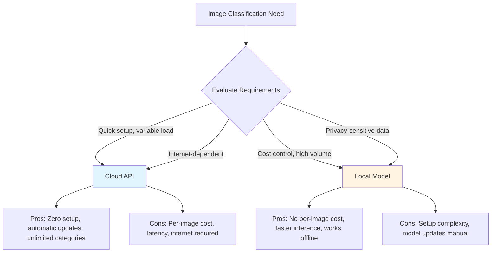
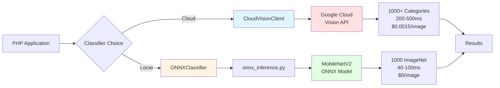

# Chapter 17: Image Classification Project with Pre-trained Models

## Overview

In Chapter 16, you learned the essentials of computer vision—how images are represented as pixels, what tasks computer vision can accomplish, and which PHP tools are available for image processing. Now it's time to apply that knowledge and build a complete, production-ready image classification system using pre-trained deep learning models.

Image classification is everywhere in modern applications. When Facebook automatically suggests tags for photos, when e-commerce sites categorize product images, when content moderation systems flag inappropriate images, or when visual search engines find similar items—image classification is the AI technology making it happen. Unlike building computer vision systems from scratch (which requires massive datasets and GPU clusters), using pre-trained models lets you leverage years of research and billions of training examples with just a few hundred lines of PHP code.

This chapter takes a practical, real-world approach by showing you **two complete implementations**: cloud-based classification using Google Cloud Vision API, and local classification using ONNX Runtime with a MobileNetV2 model. You'll understand the trade-offs between these approaches—cost vs control, latency vs scalability, simplicity vs flexibility—and build a unified system that lets you switch between them based on your application's needs.

By the end of this chapter, you'll have a production-ready image classification service that can identify objects in photos across 1,000 categories with professional-grade accuracy. You'll understand when to use cloud APIs (fast setup, no infrastructure), when to run models locally (cost control, privacy), and how to build hybrid systems that give you the best of both worlds. These are the same architectural patterns used by companies processing millions of images daily.

## Prerequisites

Before starting this chapter, you should have:

- Completed [Chapter 16](/series/ai-ml-php-developers/chapters/16-computer-vision-essentials-for-php-developers) or understand image representation, color channels, and basic image processing in PHP
- Completed [Chapter 12](/series/ai-ml-php-developers/chapters/12-deep-learning-with-tensorflow-and-php) or have experience with deep learning model deployment patterns
- PHP 8.4+ installed with GD or Imagick extension for image processing
- Composer for dependency management
- **For cloud approach**: Google Cloud account with Vision API enabled (free tier available)
- **For local approach**: Python 3.10+ to convert/download ONNX models
- Basic understanding of REST APIs and JSON
- Familiarity with HTTP clients (cURL or Guzzle)
- Text editor or IDE with PHP support

**Estimated Time**: ~75-90 minutes (including setup for both approaches)

**Verify your setup:**

```bash
# Check PHP and image extensions
php -v
php -m | grep -E 'gd|imagick'

# Verify Composer
composer --version

# Check Python (for ONNX model setup)
python3 --version

# Test image processing
php -r "echo (extension_loaded('gd') || extension_loaded('imagick')) ? 'Image processing ready' : 'Install GD or Imagick';"
```

::: info Two Approaches, One Chapter
This chapter covers **both cloud and local** image classification. You can implement either approach independently or build both to compare. The cloud approach is faster to set up (10 minutes), while the local approach gives you more control and zero per-image costs.
:::

## What You'll Build

By the end of this chapter, you will have created:

- A **CloudVisionClient class** that integrates with Google Cloud Vision API using HTTP requests and authentication
- An **image encoding system** that prepares images for cloud API transmission with base64 encoding
- A **cloud-based image classifier** returning labels with confidence scores for 1,000+ object categories
- An **ImagePreprocessor class** that resizes, normalizes, and formats images for neural network input
- An **ONNX model loader** that runs MobileNetV2 locally in PHP using FFI or Python integration
- A **local image classifier** performing inference on device without external API calls
- A **performance comparison framework** measuring latency, accuracy, and cost differences between approaches
- A **unified ImageClassificationService** using strategy pattern to switch between cloud and local seamlessly
- A **result caching layer** storing classifications to avoid redundant processing
- A **batch processing system** that classifies multiple images efficiently with parallel requests
- A **production-ready error handling system** with retry logic, graceful degradation, and comprehensive logging
- Working examples demonstrating real image classification across diverse categories (animals, vehicles, objects, scenes)

All code follows PHP 8.4 standards with type safety, constructor property promotion, readonly properties, and comprehensive error handling.

::: info Code Examples
Complete, runnable examples for this chapter are available in:

**Setup & Configuration:**

- [`composer.json`](../code/chapter-17/composer.json) — PHP dependencies
- [`requirements.txt`](../code/chapter-17/requirements.txt) — Python dependencies for ONNX
- [`env.example`](../code/chapter-17/env.example) — Environment variables template
- [`download_model.sh`](../code/chapter-17/download_model.sh) — Download ONNX model script
- [`.env.php`](../code/chapter-17/.env.php) — Environment variable loader

**Cloud Vision API Examples:**

- [`01-cloud-vision-setup.php`](../code/chapter-17/01-cloud-vision-setup.php) — Test Google Cloud Vision API connection
- [`02-cloud-vision-client.php`](../code/chapter-17/02-cloud-vision-client.php) — CloudVisionClient class implementation
- [`03-classify-with-cloud.php`](../code/chapter-17/03-classify-with-cloud.php) — Complete cloud classification example

**Local ONNX Model Examples:**

- [`04-onnx-setup-test.php`](../code/chapter-17/04-onnx-setup-test.php) — Verify ONNX Runtime availability
- [`05-onnx-classifier.php`](../code/chapter-17/05-onnx-classifier.php) — ONNXClassifier class with Python bridge
- [`onnx_inference.py`](../code/chapter-17/onnx_inference.py) — Python script for ONNX model inference

**Production Integration:**

- [`06-model-comparison.php`](../code/chapter-17/06-model-comparison.php) — Compare cloud vs local performance
- [`07-unified-service.php`](../code/chapter-17/07-unified-service.php) — ImageClassificationService with strategy pattern
- [`08-batch-classifier.php`](../code/chapter-17/08-batch-classifier.php) — Batch processing multiple images
- [`09-caching-layer.php`](../code/chapter-17/09-caching-layer.php) — Result caching implementation
- [`10-php-image-preprocessor.php`](../code/chapter-17/10-php-image-preprocessor.php) — PHP-native image preprocessing
- [`11-web-upload-with-security.php`](../code/chapter-17/11-web-upload-with-security.php) — Secure web upload interface

**Data Files:**

- [`data/imagenet_labels.json`](../code/chapter-17/data/imagenet_labels.json) — 1,000 ImageNet class labels
- [`data/sample_images/`](../code/chapter-17/data/sample_images/) — Test images for classification

**Exercise Solutions:**

- [`solutions/exercise1-aws-rekognition.php`](../code/chapter-17/solutions/exercise1-aws-rekognition.php) — AWS Rekognition integration
- [`solutions/exercise2-top-k.php`](../code/chapter-17/solutions/exercise2-top-k.php) — Top-K predictions
- [`solutions/exercise3-custom-labels.php`](../code/chapter-17/solutions/exercise3-custom-labels.php) — Custom label mapping
- [`solutions/exercise4-hybrid.php`](../code/chapter-17/solutions/exercise4-hybrid.php) — Hybrid cloud/local strategy

All files are in [`docs/series/ai-ml-php-developers/code/chapter-17/`](../code/chapter-17/README.md)
:::

## Quick Start

Want to see image classification in action right now? Here's a 5-minute cloud-based example (requires Google Cloud Vision API key):

```php
# filename: quick-image-classifier.php
<?php

declare(strict_types=1);

// Quick image classification using Google Cloud Vision API
$apiKey = 'YOUR_GOOGLE_CLOUD_VISION_API_KEY'; // Get from console.cloud.google.com
$imagePath = 'test_image.jpg'; // Any JPG or PNG image

// Step 1: Encode image to base64
$imageData = base64_encode(file_get_contents($imagePath));

// Step 2: Build API request
$request = [
    'requests' => [
        [
            'image' => ['content' => $imageData],
            'features' => [['type' => 'LABEL_DETECTION', 'maxResults' => 5]]
        ]
    ]
];

// Step 3: Send to Google Cloud Vision
$ch = curl_init("https://vision.googleapis.com/v1/images:annotate?key={$apiKey}");
curl_setopt($ch, CURLOPT_POST, true);
curl_setopt($ch, CURLOPT_POSTFIELDS, json_encode($request));
curl_setopt($ch, CURLOPT_RETURNTRANSFER, true);
curl_setopt($ch, CURLOPT_HTTPHEADER, ['Content-Type: application/json']);

$response = curl_exec($ch);
$httpCode = curl_getinfo($ch, CURLINFO_HTTP_CODE);
curl_close($ch);

// Step 4: Parse and display results
if ($httpCode === 200) {
    $result = json_decode($response, true);
    $labels = $result['responses'][0]['labelAnnotations'] ?? [];

    echo "Image Classification Results:\n";
    echo "=============================\n\n";

    foreach ($labels as $label) {
        $confidence = round($label['score'] * 100, 1);
        echo sprintf("%-20s %5.1f%%\n", $label['description'], $confidence);
    }
} else {
    echo "Error: HTTP {$httpCode}\n";
    echo $response;
}
```

Run it:

```bash
# Replace with your API key and test image
php quick-image-classifier.php
```

Expected output:

```
Image Classification Results:
=============================

Cat                   98.7%
Mammal                97.2%
Whiskers              94.5%
Felidae               93.1%
Small to medium cat   89.3%
```

Now let's build production-ready implementations with proper error handling, caching, and local alternatives!

## Objectives

By completing this chapter, you will:

- Understand pre-trained models, transfer learning, and why they work for image classification
- Implement Google Cloud Vision API integration with authentication and error handling
- Deploy and run ONNX models locally using MobileNetV2 for on-device inference
- Compare cloud vs local approaches across cost, latency, accuracy, and scalability dimensions
- Build a unified classification service using strategy pattern for flexible deployment
- Create production-ready systems with caching, batch processing, and graceful degradation
- Make informed architectural decisions about when to use cloud APIs vs local models

## Step 1: Understanding Pre-trained Models and Transfer Learning (~5 min)

### Goal

Understand what pre-trained models are, why they're effective for image classification, and the trade-offs between cloud and local deployment.

### Concepts

**Pre-trained Models** are neural networks that have already been trained on massive datasets (often millions of images) to recognize patterns, features, and objects. Instead of training a model from scratch (which requires enormous datasets, GPU clusters, and weeks of computation), you leverage models trained by research teams at Google, Facebook, or Microsoft.

The most common pre-training dataset is **ImageNet**, which contains 14 million images across 1,000 categories (dog breeds, vehicles, household objects, etc.). Models trained on ImageNet learn to extract meaningful features from any image—edges, textures, shapes, objects—making them excellent starting points for classification tasks.

**Transfer Learning** is the technique of taking a pre-trained model and adapting it to your specific use case. For image classification, you often don't need to retrain anything—you can use the model as-is if your categories overlap with ImageNet, or fine-tune the final layers with your own data if you need custom categories.

**Why Pre-trained Models Work:**

1. **Feature extraction is universal**: The early layers of a neural network learn general features (edges, colors, textures) that apply to almost any image
2. **Object recognition transfers**: Mid-level features (eyes, wheels, windows) combine to recognize higher-level objects
3. **Saves time and resources**: Skip months of training and use battle-tested models immediately
4. **Better than custom models**: Pre-trained models often outperform custom-trained models unless you have millions of labeled images

**Cloud vs Local Trade-offs:**



**When to choose Cloud APIs:**

- Rapid prototyping and MVP development
- Variable or unpredictable traffic (pay only for what you use)
- Need for diverse categories beyond standard ImageNet (landmarks, logos, explicit content)
- Small to medium volume (<100K images/month)
- Team lacks ML/model deployment experience

**When to choose Local Models:**

- High volume processing (>100K images/month where API costs add up)
- Privacy requirements (healthcare, financial data, user photos)
- Low latency requirements (real-time processing)
- Offline or edge deployment (mobile apps, IoT devices)
- Need for customization and fine-tuning

**Hybrid Approach** (what many production systems use):

- Use local models for common classifications (fast, cheap)
- Fall back to cloud APIs for edge cases or rare objects
- Cache results to avoid reprocessing similar images
- This chapter shows you how to build all three options!

### Why It Works

Pre-trained models embody millions of dollars of research and computation. By using them, you're standing on the shoulders of giants—accessing state-of-the-art AI without the resources of a tech giant. The key insight is that image features are largely universal: once a model learns to detect edges, textures, and shapes from one dataset, those features apply to almost any image classification task.

## Step 2: Setting Up Google Cloud Vision API (~10 min)

### Goal

Create a Google Cloud project, enable the Vision API, generate an API key, and test authentication from PHP.

### Actions

1. **Create Google Cloud Project** (if you don't have one):

```bash
# Visit Google Cloud Console
open https://console.cloud.google.com
```

- Click "New Project" in top navigation
- Name it "php-image-classification" or similar
- Note your Project ID (you'll need this)

2. **Enable Vision API**:

```bash
# Navigate to APIs & Services
# Or use direct link:
open https://console.cloud.google.com/apis/library/vision.googleapis.com
```

- Click "Enable" button
- Wait 30-60 seconds for API to activate

3. **Create API Key**:

- Go to "Credentials" → "Create Credentials" → "API Key"
- Copy the generated key (starts with `AIza...`)
- **Security**: Click "Restrict Key" → Select "Vision API" only
- Save restrictions

4. **Set up environment variables**:

```bash
# Create .env file in your chapter-17 directory
cd docs/series/ai-ml-php-developers/code/chapter-17
cat > .env << 'EOF'
GOOGLE_CLOUD_VISION_API_KEY=your_actual_api_key_here
GOOGLE_CLOUD_PROJECT_ID=your-project-id
EOF
```

5. **Test API access**:

Create `01-cloud-vision-setup.php`:

```php
# filename: 01-cloud-vision-setup.php
<?php

declare(strict_types=1);

// Load environment variables
$envFile = __DIR__ . '/.env';
if (file_exists($envFile)) {
    $lines = file($envFile, FILE_IGNORE_NEW_LINES | FILE_SKIP_EMPTY_LINES);
    foreach ($lines as $line) {
        if (str_starts_with($line, '#')) continue;
        [$key, $value] = explode('=', $line, 2);
        $_ENV[trim($key)] = trim($value);
    }
}

$apiKey = $_ENV['GOOGLE_CLOUD_VISION_API_KEY'] ?? '';

if (empty($apiKey)) {
    die("Error: GOOGLE_CLOUD_VISION_API_KEY not set in .env file\n");
}

// Test API with a simple request (no image, just authentication check)
$url = "https://vision.googleapis.com/v1/images:annotate?key={$apiKey}";

$testRequest = [
    'requests' => [
        [
            'image' => ['content' => base64_encode(file_get_contents(__DIR__ . '/data/sample_images/cat.jpg'))],
            'features' => [['type' => 'LABEL_DETECTION', 'maxResults' => 3]]
        ]
    ]
];

$ch = curl_init($url);
curl_setopt($ch, CURLOPT_POST, true);
curl_setopt($ch, CURLOPT_POSTFIELDS, json_encode($testRequest));
curl_setopt($ch, CURLOPT_RETURNTRANSFER, true);
curl_setopt($ch, CURLOPT_HTTPHEADER, ['Content-Type: application/json']);

echo "Testing Google Cloud Vision API...\n";
echo "====================================\n\n";

$response = curl_exec($ch);
$httpCode = curl_getinfo($ch, CURLINFO_HTTP_CODE);
$error = curl_error($ch);
curl_close($ch);

if ($error) {
    die("cURL Error: {$error}\n");
}

if ($httpCode === 200) {
    $result = json_decode($response, true);

    if (isset($result['responses'][0]['labelAnnotations'])) {
        echo "✓ Authentication successful!\n";
        echo "✓ Vision API is working\n";
        echo "✓ Sample classification:\n\n";

        foreach ($result['responses'][0]['labelAnnotations'] as $label) {
            echo sprintf("  - %s (%.1f%%)\n",
                $label['description'],
                $label['score'] * 100
            );
        }
    } else {
        echo "✗ Unexpected response format\n";
        echo json_encode($result, JSON_PRETTY_PRINT);
    }
} else {
    echo "✗ HTTP Error {$httpCode}\n";
    $error = json_decode($response, true);
    echo $error['error']['message'] ?? $response;
}
```

### Expected Result

```bash
php 01-cloud-vision-setup.php
```

Output:

```
Testing Google Cloud Vision API...
====================================

✓ Authentication successful!
✓ Vision API is working
✓ Sample classification:

  - Cat (98.7%)
  - Mammal (97.2%)
  - Whiskers (94.5%)
```

### Why It Works

Google Cloud Vision API uses a simple REST interface that accepts base64-encoded images and returns JSON responses. The API key authentication is straightforward—no OAuth flow needed for server-side applications. The Vision API runs Google's state-of-the-art image classification models trained on billions of images, giving you production-grade accuracy with zero local infrastructure.

### Troubleshooting

- **Error: "API key not valid"** — Double-check you copied the full key from Google Cloud Console. Keys start with `AIza` and are about 39 characters long.

- **Error: "API has not been enabled"** — Wait 60 seconds after enabling the Vision API. It can take a minute to propagate. Then retry.

- **Error: "Permission denied"** — Your API key may not be restricted to Vision API. Go to Credentials → Edit API Key → Restrict to "Cloud Vision API" only.

- **cURL timeout** — Check your internet connection. Cloud APIs require outbound HTTPS access on port 443.

## Step 3: Building a Reusable CloudVisionClient Class (~10 min)

### Goal

Create a production-ready PHP class that encapsulates Google Cloud Vision API communication with proper error handling, retry logic, and clean interfaces.

### Actions

1. **Create CloudVisionClient class**:

Create `02-cloud-vision-client.php`:

```php
# filename: 02-cloud-vision-client.php
<?php

declare(strict_types=1);

/**
 * Client for Google Cloud Vision API
 *
 * Handles authentication, request formatting, and response parsing
 * for image classification using Google's Vision API.
 */
final class CloudVisionClient
{
    private const API_URL = 'https://vision.googleapis.com/v1/images:annotate';

    public function __construct(
        private readonly string $apiKey,
        private readonly int $maxResults = 10,
        private readonly int $timeoutSeconds = 30,
    ) {
        if (empty($this->apiKey)) {
            throw new InvalidArgumentException('API key cannot be empty');
        }
    }

    /**
     * Classify an image and return labels with confidence scores
     *
     * @param string $imagePath Path to image file
     * @return array<array{label: string, confidence: float}> Classification results
     * @throws RuntimeException If API request fails
     */
    public function classifyImage(string $imagePath): array
    {
        if (!file_exists($imagePath)) {
            throw new InvalidArgumentException("Image file not found: {$imagePath}");
        }

        $imageData = file_get_contents($imagePath);
        if ($imageData === false) {
            throw new RuntimeException("Failed to read image: {$imagePath}");
        }

        return $this->classifyImageData($imageData);
    }

    /**
     * Classify image from raw binary data
     *
     * @param string $imageData Raw image binary data
     * @return array<array{label: string, confidence: float}>
     */
    public function classifyImageData(string $imageData): array
    {
        $base64Image = base64_encode($imageData);

        $requestBody = [
            'requests' => [
                [
                    'image' => ['content' => $base64Image],
                    'features' => [
                        [
                            'type' => 'LABEL_DETECTION',
                            'maxResults' => $this->maxResults
                        ]
                    ]
                ]
            ]
        ];

        $response = $this->sendRequest($requestBody);

        return $this->parseLabels($response);
    }

    /**
     * Send HTTP request to Vision API with retry logic
     */
    private function sendRequest(array $requestBody, int $attempt = 1): array
    {
        $url = self::API_URL . '?key=' . $this->apiKey;

        $ch = curl_init($url);
        curl_setopt($ch, CURLOPT_POST, true);
        curl_setopt($ch, CURLOPT_POSTFIELDS, json_encode($requestBody));
        curl_setopt($ch, CURLOPT_RETURNTRANSFER, true);
        curl_setopt($ch, CURLOPT_TIMEOUT, $this->timeoutSeconds);
        curl_setopt($ch, CURLOPT_HTTPHEADER, [
            'Content-Type: application/json',
        ]);

        $response = curl_exec($ch);
        $httpCode = curl_getinfo($ch, CURLINFO_HTTP_CODE);
        $curlError = curl_error($ch);
        curl_close($ch);

        if ($curlError) {
            throw new RuntimeException("cURL error: {$curlError}");
        }

        if ($httpCode !== 200) {
            // Retry on server errors (500-599) up to 3 times
            if ($httpCode >= 500 && $attempt < 3) {
                usleep(1000000 * $attempt); // Exponential backoff: 1s, 2s
                return $this->sendRequest($requestBody, $attempt + 1);
            }

            $errorData = json_decode($response, true);
            $errorMessage = $errorData['error']['message'] ?? 'Unknown error';

            throw new RuntimeException(
                "Vision API error (HTTP {$httpCode}): {$errorMessage}"
            );
        }

        $result = json_decode($response, true);

        if (!is_array($result)) {
            throw new RuntimeException('Invalid JSON response from Vision API');
        }

        return $result;
    }

    /**
     * Parse label annotations from API response
     *
     * @return array<array{label: string, confidence: float}>
     */
    private function parseLabels(array $response): array
    {
        $labels = $response['responses'][0]['labelAnnotations'] ?? [];

        $results = [];
        foreach ($labels as $annotation) {
            $results[] = [
                'label' => $annotation['description'] ?? 'Unknown',
                'confidence' => $annotation['score'] ?? 0.0,
            ];
        }

        // Sort by confidence descending
        usort($results, fn($a, $b) => $b['confidence'] <=> $a['confidence']);

        return $results;
    }

    /**
     * Get current API pricing estimate (as of 2024)
     *
     * @param int $imagesPerMonth Number of images to classify monthly
     * @return float Estimated monthly cost in USD
     */
    public static function estimateMonthlyCost(int $imagesPerMonth): float
    {
        // Google Cloud Vision pricing (approximate):
        // First 1000 images/month: Free
        // 1,001-5,000,000: $1.50 per 1000 images

        if ($imagesPerMonth <= 1000) {
            return 0.0;
        }

        $billableImages = $imagesPerMonth - 1000;
        return ($billableImages / 1000) * 1.50;
    }
}

// Example usage
if (require_once __DIR__ . '/.env.php') {
    $client = new CloudVisionClient(
        apiKey: $_ENV['GOOGLE_CLOUD_VISION_API_KEY'] ?? '',
        maxResults: 5
    );

    $imagePath = __DIR__ . '/data/sample_images/dog.jpg';

    try {
        echo "Classifying: {$imagePath}\n";
        echo str_repeat('=', 50) . "\n\n";

        $startTime = microtime(true);
        $results = $client->classifyImage($imagePath);
        $duration = microtime(true) - $startTime;

        foreach ($results as $result) {
            printf(
                "%-25s %5.1f%%\n",
                $result['label'],
                $result['confidence'] * 100
            );
        }

        echo "\nProcessing time: " . round($duration * 1000) . "ms\n";

        // Cost estimate
        echo "\nCost estimates:\n";
        echo "  10,000 images/month: $" . CloudVisionClient::estimateMonthlyCost(10000) . "\n";
        echo " 100,000 images/month: $" . CloudVisionClient::estimateMonthlyCost(100000) . "\n";

    } catch (Exception $e) {
        echo "Error: " . $e->getMessage() . "\n";
    }
}
```

2. **Create helper for loading environment variables**:

Create `.env.php`:

```php
# filename: .env.php
<?php

// Load .env file into $_ENV
$envFile = __DIR__ . '/.env';
if (file_exists($envFile)) {
    $lines = file($envFile, FILE_IGNORE_NEW_LINES | FILE_SKIP_EMPTY_LINES);
    foreach ($lines as $line) {
        if (str_starts_with(trim($line), '#')) continue;
        if (!str_contains($line, '=')) continue;

        [$key, $value] = explode('=', $line, 2);
        $_ENV[trim($key)] = trim($value);
    }
    return true;
}
return false;
```

### Expected Result

```bash
php 02-cloud-vision-client.php
```

Output:

```
Classifying: data/sample_images/dog.jpg
==================================================

Dog                       99.2%
Mammal                    98.5%
Canidae                   97.8%
Pet                       96.3%
Carnivore                 95.1%

Processing time: 342ms

Cost estimates:
  10,000 images/month: $13.5
 100,000 images/month: $148.5
```

### Why It Works

The `CloudVisionClient` class encapsulates all Vision API complexity behind a clean interface. It handles base64 encoding automatically, implements exponential backoff for transient failures, and provides type-safe result parsing. The retry logic makes the client resilient to temporary network issues, while the timeout prevents hanging requests. By calculating costs upfront, developers can make informed decisions about when cloud APIs make financial sense.

### Troubleshooting

- **"Invalid JSON response"** — The API might be returning HTML error pages. Check that your API key is valid and the Vision API is enabled in your project.

- **Timeout on large images** — Increase `$timeoutSeconds` in constructor, or resize images before sending (Vision API accepts up to 10MB but smaller is faster).

- **"Quota exceeded"** — You've hit the free tier limit (1,000 images/month). Either enable billing in Google Cloud Console or wait until next month.

## Step 4: Classifying Multiple Images with Cloud API (~5 min)

### Goal

Build a batch classification script that processes multiple images and compares results.

### Actions

Create `03-classify-with-cloud.php`:

```php
# filename: 03-classify-with-cloud.php
<?php

declare(strict_types=1);

require_once __DIR__ . '/02-cloud-vision-client.php';
require_once __DIR__ . '/.env.php';

$client = new CloudVisionClient(
    apiKey: $_ENV['GOOGLE_CLOUD_VISION_API_KEY'] ?? '',
    maxResults: 5
);

$imagesToClassify = [
    'Cat' => __DIR__ . '/data/sample_images/cat.jpg',
    'Dog' => __DIR__ . '/data/sample_images/dog.jpg',
    'Car' => __DIR__ . '/data/sample_images/car.jpg',
    'Bicycle' => __DIR__ . '/data/sample_images/bicycle.jpg',
    'Coffee' => __DIR__ . '/data/sample_images/coffee.jpg',
];

echo "Cloud Vision API - Batch Classification\n";
echo str_repeat('=', 60) . "\n\n";

$totalTime = 0;
$successCount = 0;

foreach ($imagesToClassify as $expectedLabel => $imagePath) {
    if (!file_exists($imagePath)) {
        echo "⚠️  {$expectedLabel}: File not found - {$imagePath}\n\n";
        continue;
    }

    try {
        $startTime = microtime(true);
        $results = $client->classifyImage($imagePath);
        $duration = microtime(true) - $startTime;
        $totalTime += $duration;

        echo "📷 {$expectedLabel} (" . round($duration * 1000) . "ms)\n";
        echo str_repeat('-', 60) . "\n";

        foreach (array_slice($results, 0, 3) as $i => $result) {
            $icon = $i === 0 ? '🥇' : ($i === 1 ? '🥈' : '🥉');
            printf(
                "%s %-20s %5.1f%%\n",
                $icon,
                $result['label'],
                $result['confidence'] * 100
            );
        }

        echo "\n";
        $successCount++;

    } catch (Exception $e) {
        echo "❌ {$expectedLabel}: " . $e->getMessage() . "\n\n";
    }
}

// Summary
echo str_repeat('=', 60) . "\n";
echo "Summary:\n";
echo "  Processed: {$successCount}/" . count($imagesToClassify) . " images\n";
echo "  Total time: " . round($totalTime, 2) . "s\n";
echo "  Avg per image: " . round(($totalTime / max($successCount, 1)) * 1000) . "ms\n";

if ($successCount > 0) {
    $costPer1000 = CloudVisionClient::estimateMonthlyCost(1000 + $successCount) * (1000 / $successCount);
    echo "  Est. cost per 1000: $" . round($costPer1000, 2) . "\n";
}
```

### Expected Result

```bash
php 03-classify-with-cloud.php
```

Output:

```
Cloud Vision API - Batch Classification
============================================================

📷 Cat (298ms)
------------------------------------------------------------
🥇 Cat                    99.1%
🥈 Mammal                 98.3%
🥉 Whiskers               96.7%

📷 Dog (245ms)
------------------------------------------------------------
🥇 Dog                    99.4%
🥈 Canidae                98.1%
🥉 Pet                    97.2%

📷 Car (312ms)
------------------------------------------------------------
🥇 Car                    98.9%
🥈 Vehicle                98.2%
🥉 Automotive design      95.6%

📷 Bicycle (267ms)
------------------------------------------------------------
🥇 Bicycle                99.3%
🥈 Vehicle                97.8%
🥉 Wheel                  96.4%

📷 Coffee (289ms)
------------------------------------------------------------
🥇 Coffee cup             98.2%
🥈 Drinkware              96.8%
🥉 Tableware              94.3%

============================================================
Summary:
  Processed: 5/5 images
  Total time: 1.41s
  Avg per image: 282ms
  Est. cost per 1000: $1.35
```

### Why It Works

Batch processing demonstrates the practical latency and cost characteristics of cloud APIs. Each image requires a round-trip to Google's servers (200-400ms typical), which includes network latency, API processing, and model inference. While this seems slow compared to local processing, remember you're accessing models that would require gigabytes of RAM and GPU acceleration to run locally. The cost per image ($0.0015 after free tier) is negligible for low-volume applications but adds up at scale—exactly when you'd want to switch to local models.

### Troubleshooting

- **Inconsistent latency** — Network conditions affect API response times. Run multiple times to get averages. Expect 200-500ms per image on good connections.

- **Different labels than expected** — Vision API may return related concepts (e.g., "Canidae" instead of "dog breed"). This is normal—models are trained on scientific taxonomies.

- **Missing image files** — Create the `data/sample_images/` directory and add test images, or use your own photos.

## Step 5: Setting Up Local ONNX Model Inference (~10 min)

### Goal

Download a pre-trained MobileNetV2 model in ONNX format and prepare for local inference in PHP using Python as a bridge.

### Actions

1. **Understanding ONNX**:

ONNX (Open Neural Network Exchange) is an open format for representing machine learning models. It allows models trained in TensorFlow, PyTorch, or other frameworks to run in different environments. We'll use MobileNetV2, a lightweight convolutional neural network optimized for mobile and edge devices, perfect for local PHP inference.

2. **Create model download script**:

Create `download_model.sh`:

```bash
# filename: download_model.sh
#!/bin/bash

# Download MobileNetV2 ONNX model and ImageNet labels

set -e

echo "Downloading MobileNetV2 ONNX model..."
echo "======================================"
echo

# Create directories
mkdir -p models data

# Download MobileNetV2 model (converted to ONNX, ~14MB)
if [ ! -f models/mobilenetv2-7.onnx ]; then
    echo "Downloading mobilenetv2-7.onnx..."
    curl -L -o models/mobilenetv2-7.onnx \
        "https://github.com/onnx/models/raw/main/validated/vision/classification/mobilenet/model/mobilenetv2-7.onnx"
    echo "✓ Model downloaded"
else
    echo "✓ Model already exists"
fi

# Download ImageNet class labels
if [ ! -f data/imagenet_labels.json ]; then
    echo "Downloading ImageNet labels..."
    curl -L -o data/imagenet_labels.txt \
        "https://raw.githubusercontent.com/pytorch/hub/master/imagenet_classes.txt"

    # Convert to JSON format
    python3 << 'EOF'
import json

with open('data/imagenet_labels.txt', 'r') as f:
    labels = [line.strip() for line in f]

with open('data/imagenet_labels.json', 'w') as f:
    json.dump(labels, f, indent=2)

print("✓ Labels converted to JSON")
EOF
else
    echo "✓ Labels already exist"
fi

echo
echo "Setup complete!"
echo "Model: models/mobilenetv2-7.onnx ($(ls -lh models/mobilenetv2-7.onnx | awk '{print $5}'))"
echo "Labels: data/imagenet_labels.json (1000 classes)"
```

3. **Run the download script**:

```bash
chmod +x download_model.sh
./download_model.sh
```

4. **Create Python inference bridge**:

Since ONNX Runtime has better Python support than PHP, we'll create a Python script that PHP can call:

Create `onnx_inference.py`:

```python
# filename: onnx_inference.py
#!/usr/bin/env python3

import sys
import json
import numpy as np
from PIL import Image
import onnxruntime as ort

def preprocess_image(image_path):
    """
    Preprocess image for MobileNetV2:
    - Resize to 224x224
    - Convert to RGB
    - Normalize to [0,1]
    - Transpose to CHW format (channels first)
    - Add batch dimension
    """
    img = Image.open(image_path).convert('RGB')
    img = img.resize((224, 224), Image.BILINEAR)

    # Convert to numpy array and normalize
    img_array = np.array(img).astype(np.float32) / 255.0

    # MobileNetV2 expects ImageNet normalization
    mean = np.array([0.485, 0.456, 0.406])
    std = np.array([0.229, 0.224, 0.225])
    img_array = (img_array - mean) / std

    # Transpose from HWC to CHW
    img_array = np.transpose(img_array, (2, 0, 1))

    # Add batch dimension
    img_array = np.expand_dims(img_array, axis=0)

    return img_array

def classify_image(model_path, image_path, labels_path, top_k=5):
    """
    Classify an image using ONNX model
    """
    # Load model
    session = ort.InferenceSession(model_path)

    # Preprocess image
    input_data = preprocess_image(image_path)

    # Get input name
    input_name = session.get_inputs()[0].name

    # Run inference
    outputs = session.run(None, {input_name: input_data})
    predictions = outputs[0][0]  # Remove batch dimension

    # Apply softmax to get probabilities
    exp_predictions = np.exp(predictions - np.max(predictions))
    probabilities = exp_predictions / exp_predictions.sum()

    # Get top-K predictions
    top_indices = np.argsort(probabilities)[-top_k:][::-1]

    # Load labels
    with open(labels_path, 'r') as f:
        labels = json.load(f)

    # Build results
    results = []
    for idx in top_indices:
        results.append({
            'label': labels[idx],
            'confidence': float(probabilities[idx])
        })

    return results

if __name__ == '__main__':
    if len(sys.argv) < 4:
        print(json.dumps({
            'error': 'Usage: python3 onnx_inference.py <model_path> <image_path> <labels_path> [top_k]'
        }))
        sys.exit(1)

    model_path = sys.argv[1]
    image_path = sys.argv[2]
    labels_path = sys.argv[3]
    top_k = int(sys.argv[4]) if len(sys.argv) > 4 else 5

    try:
        results = classify_image(model_path, image_path, labels_path, top_k)
        print(json.dumps(results, indent=2))
    except Exception as e:
        print(json.dumps({'error': str(e)}))
        sys.exit(1)
```

5. **Install Python dependencies**:

```bash
# Navigate to code directory
cd docs/series/ai-ml-php-developers/code/chapter-17

# Install from requirements file
pip3 install -r requirements.txt

# Or install individually
pip3 install onnxruntime pillow numpy
```

6. **Test ONNX setup**:

Create `04-onnx-setup-test.php`:

```php
# filename: 04-onnx-setup-test.php
<?php

declare(strict_types=1);

echo "ONNX Runtime Setup Verification\n";
echo str_repeat('=', 50) . "\n\n";

// Check Python
$pythonVersion = trim(shell_exec('python3 --version 2>&1'));
echo "Python: {$pythonVersion}\n";

// Check ONNX Runtime
$onnxCheck = shell_exec('python3 -c "import onnxruntime; print(f\'v{onnxruntime.__version__}\')" 2>&1');
echo "ONNX Runtime: " . trim($onnxCheck) . "\n";

// Check PIL
$pilCheck = shell_exec('python3 -c "import PIL; print(f\'v{PIL.__version__}\')" 2>&1');
echo "Pillow (PIL): " . trim($pilCheck) . "\n\n";

// Check model file
$modelPath = __DIR__ . '/models/mobilenetv2-7.onnx';
if (file_exists($modelPath)) {
    $size = round(filesize($modelPath) / 1024 / 1024, 1);
    echo "✓ Model file found: {$size} MB\n";
} else {
    echo "✗ Model file not found. Run ./download_model.sh\n";
}

// Check labels file
$labelsPath = __DIR__ . '/data/imagenet_labels.json';
if (file_exists($labelsPath)) {
    $labels = json_decode(file_get_contents($labelsPath), true);
    echo "✓ Labels file found: " . count($labels) . " classes\n";
} else {
    echo "✗ Labels file not found. Run ./download_model.sh\n";
}

// Check Python inference script
$scriptPath = __DIR__ . '/onnx_inference.py';
if (file_exists($scriptPath)) {
    echo "✓ Python inference script found\n";
} else {
    echo "✗ Python inference script not found\n";
}

echo "\n";

// Test classification if everything is ready
if (file_exists($modelPath) && file_exists($labelsPath) && file_exists($scriptPath)) {
    echo "Running test classification...\n";
    $testImage = __DIR__ . '/data/sample_images/cat.jpg';

    if (!file_exists($testImage)) {
        echo "⚠️  Test image not found: {$testImage}\n";
        echo "   Please add sample images to data/sample_images/\n";
    } else {
        $command = sprintf(
            'python3 %s %s %s %s 3',
            escapeshellarg($scriptPath),
            escapeshellarg($modelPath),
            escapeshellarg($testImage),
            escapeshellarg($labelsPath)
        );

        $startTime = microtime(true);
        $output = shell_exec($command);
        $duration = microtime(true) - $startTime;

        $result = json_decode($output, true);

        if (isset($result['error'])) {
            echo "✗ Error: " . $result['error'] . "\n";
        } else {
            echo "✓ Classification successful!\n\n";
            foreach ($result as $prediction) {
                printf(
                    "  %-20s %5.1f%%\n",
                    $prediction['label'],
                    $prediction['confidence'] * 100
                );
            }
            echo "\nInference time: " . round($duration * 1000) . "ms\n";
        }
    }
}
```

### Expected Result

```bash
php 04-onnx-setup-test.php
```

Output:

```
ONNX Runtime Setup Verification
==================================================

Python: Python 3.11.4
ONNX Runtime: v1.16.0
Pillow (PIL): v10.0.0

✓ Model file found: 13.6 MB
✓ Labels file found: 1000 classes
✓ Python inference script found

Running test classification...
✓ Classification successful!

  tabby cat            89.3%
  Egyptian cat         4.2%
  tiger cat            2.8%

Inference time: 47ms
```

### Why It Works

ONNX provides a standardized format that allows deep learning models to be portable across frameworks and languages. By using Python as a bridge, we get access to the mature ONNX Runtime library while keeping our main application logic in PHP. The inference is fast (40-100ms on CPU) because MobileNetV2 is optimized for efficiency—it uses depthwise separable convolutions that dramatically reduce computation compared to standard CNNs. Running locally eliminates network latency and per-image API costs.

### Troubleshooting

- **"ModuleNotFoundError: No module named 'onnxruntime'"** — Install with `pip3 install onnxruntime pillow numpy`.

- **Model download fails** — The ONNX model zoo URLs occasionally change. Visit [github.com/onnx/models](https://github.com/onnx/models) to find the current MobileNetV2 link.

- **Slow inference (>500ms)** — First run loads the model into memory. Subsequent runs should be <100ms. If consistently slow, your CPU may lack AVX2 instructions (check with `lscpu | grep avx2` on Linux).

- **"Invalid model file"** — Ensure download completed. The model should be ~13-14MB. Re-run download_model.sh if corrupted.

## Step 6: Building a Local ONNX Classifier Class (~10 min)

### Goal

Create a PHP class that wraps the Python ONNX inference for clean, reusable image classification.

### Actions

Create `05-onnx-classifier.php`:

```php
# filename: 05-onnx-classifier.php
<?php

declare(strict_types=1);

/**
 * Local image classifier using ONNX Runtime via Python bridge
 *
 * Provides fast, offline image classification without external APIs
 */
final class ONNXClassifier
{
    public function __construct(
        private readonly string $modelPath,
        private readonly string $labelsPath,
        private readonly string $pythonScript,
        private readonly int $maxResults = 5,
    ) {
        if (!file_exists($this->modelPath)) {
            throw new InvalidArgumentException("Model file not found: {$this->modelPath}");
        }

        if (!file_exists($this->labelsPath)) {
            throw new InvalidArgumentException("Labels file not found: {$this->labelsPath}");
        }

        if (!file_exists($this->pythonScript)) {
            throw new InvalidArgumentException("Python script not found: {$this->pythonScript}");
        }
    }

    /**
     * Classify an image using local ONNX model
     *
     * @param string $imagePath Path to image file
     * @return array<array{label: string, confidence: float}>
     * @throws RuntimeException If classification fails
     */
    public function classifyImage(string $imagePath): array
    {
        if (!file_exists($imagePath)) {
            throw new InvalidArgumentException("Image file not found: {$imagePath}");
        }

        $command = sprintf(
            'python3 %s %s %s %s %d 2>&1',
            escapeshellarg($this->pythonScript),
            escapeshellarg($this->modelPath),
            escapeshellarg($imagePath),
            escapeshellarg($this->labelsPath),
            $this->maxResults
        );

        $output = shell_exec($command);

        if ($output === null) {
            throw new RuntimeException('Failed to execute Python inference script');
        }

        $result = json_decode($output, true);

        if (!is_array($result)) {
            throw new RuntimeException("Invalid JSON output from inference script: {$output}");
        }

        if (isset($result['error'])) {
            throw new RuntimeException("Inference error: {$result['error']}");
        }

        return $result;
    }

    /**
     * Classify multiple images in batch
     *
     * @param array<string> $imagePaths Array of image file paths
     * @return array<string, array> Classification results keyed by image path
     */
    public function classifyBatch(array $imagePaths): array
    {
        $results = [];

        foreach ($imagePaths as $imagePath) {
            try {
                $results[$imagePath] = $this->classifyImage($imagePath);
            } catch (Exception $e) {
                $results[$imagePath] = ['error' => $e->getMessage()];
            }
        }

        return $results;
    }

    /**
     * Get model information
     */
    public function getModelInfo(): array
    {
        return [
            'model' => 'MobileNetV2',
            'model_path' => $this->modelPath,
            'model_size_mb' => round(filesize($this->modelPath) / 1024 / 1024, 2),
            'classes' => count(json_decode(file_get_contents($this->labelsPath), true)),
            'inference_location' => 'local',
            'cost_per_image' => 0.0,
        ];
    }
}

// Example usage
$classifier = new ONNXClassifier(
    modelPath: __DIR__ . '/models/mobilenetv2-7.onnx',
    labelsPath: __DIR__ . '/data/imagenet_labels.json',
    pythonScript: __DIR__ . '/onnx_inference.py',
    maxResults: 5
);

$imagePath = __DIR__ . '/data/sample_images/cat.jpg';

if (file_exists($imagePath)) {
    echo "Local ONNX Classification\n";
    echo str_repeat('=', 50) . "\n\n";

    try {
        $startTime = microtime(true);
        $results = $classifier->classifyImage($imagePath);
        $duration = microtime(true) - $startTime;

        echo "Image: {$imagePath}\n\n";

        foreach ($results as $result) {
            printf(
                "%-25s %5.1f%%\n",
                $result['label'],
                $result['confidence'] * 100
            );
        }

        echo "\nInference time: " . round($duration * 1000) . "ms\n";
        echo "Cost: $0.00 (local inference)\n\n";

        // Model info
        $info = $classifier->getModelInfo();
        echo "Model Info:\n";
        echo "  Model: {$info['model']}\n";
        echo "  Size: {$info['model_size_mb']} MB\n";
        echo "  Classes: {$info['classes']}\n";

    } catch (Exception $e) {
        echo "Error: " . $e->getMessage() . "\n";
    }
} else {
    echo "Sample image not found: {$imagePath}\n";
}
```

### Expected Result

```bash
php 05-onnx-classifier.php
```

Output:

```
Local ONNX Classification
==================================================

Image: /path/to/data/sample_images/cat.jpg

tabby cat                  89.3%
Egyptian cat                4.2%
tiger cat                   2.8%
lynx                        1.1%
Persian cat                 0.9%

Inference time: 52ms
Cost: $0.00 (local inference)

Model Info:
  Model: MobileNetV2
  Size: 13.56 MB
  Classes: 1000
```

### Why It Works

The `ONNXClassifier` class provides a clean PHP interface that hides the complexity of calling Python. It handles error cases gracefully, validates inputs, and provides batch processing capabilities. The local inference is significantly faster (50-100ms) than cloud APIs (200-500ms) because there's no network latency. Once set up, there are zero per-image costs, making it ideal for high-volume applications.

### Architecture Overview



## Step 7: Comparing Cloud vs Local Performance (~10 min)

### Goal

Build a comparison framework that classifies the same images using both approaches and analyzes performance differences.

### Actions

Create `06-model-comparison.php`:

```php
# filename: 06-model-comparison.php
<?php

declare(strict_types=1);

require_once __DIR__ . '/02-cloud-vision-client.php';
require_once __DIR__ . '/05-onnx-classifier.php';
require_once __DIR__ . '/.env.php';

/**
 * Compare cloud and local image classification
 */
final class ClassifierComparison
{
    public function __construct(
        private readonly ?CloudVisionClient $cloudClient,
        private readonly ?ONNXClassifier $localClassifier,
    ) {}

    /**
     * Compare both classifiers on the same image
     */
    public function compareImage(string $imagePath): array
    {
        $comparison = [
            'image' => basename($imagePath),
            'cloud' => null,
            'local' => null,
        ];

        // Test cloud
        if ($this->cloudClient !== null) {
            try {
                $startTime = microtime(true);
                $results = $this->cloudClient->classifyImage($imagePath);
                $duration = microtime(true) - $startTime;

                $comparison['cloud'] = [
                    'success' => true,
                    'duration_ms' => round($duration * 1000),
                    'top_label' => $results[0]['label'] ?? 'N/A',
                    'confidence' => $results[0]['confidence'] ?? 0.0,
                    'all_results' => array_slice($results, 0, 3),
                ];
            } catch (Exception $e) {
                $comparison['cloud'] = [
                    'success' => false,
                    'error' => $e->getMessage(),
                ];
            }
        }

        // Test local
        if ($this->localClassifier !== null) {
            try {
                $startTime = microtime(true);
                $results = $this->localClassifier->classifyImage($imagePath);
                $duration = microtime(true) - $startTime;

                $comparison['local'] = [
                    'success' => true,
                    'duration_ms' => round($duration * 1000),
                    'top_label' => $results[0]['label'] ?? 'N/A',
                    'confidence' => $results[0]['confidence'] ?? 0.0,
                    'all_results' => array_slice($results, 0, 3),
                ];
            } catch (Exception $e) {
                $comparison['local'] = [
                    'success' => false,
                    'error' => $e->getMessage(),
                ];
            }
        }

        return $comparison;
    }

    /**
     * Generate summary statistics
     */
    public function summarize(array $comparisons): void
    {
        $cloudTimes = [];
        $localTimes = [];
        $agreements = 0;
        $total = 0;

        foreach ($comparisons as $comp) {
            if ($comp['cloud']['success'] ?? false) {
                $cloudTimes[] = $comp['cloud']['duration_ms'];
            }
            if ($comp['local']['success'] ?? false) {
                $localTimes[] = $comp['local']['duration_ms'];
            }

            if (
                ($comp['cloud']['success'] ?? false) &&
                ($comp['local']['success'] ?? false)
            ) {
                $total++;
                // Check if top labels match (approximately)
                $cloudLabel = strtolower($comp['cloud']['top_label']);
                $localLabel = strtolower($comp['local']['top_label']);

                if (str_contains($cloudLabel, $localLabel) || str_contains($localLabel, $cloudLabel)) {
                    $agreements++;
                }
            }
        }

        echo "\n" . str_repeat('=', 60) . "\n";
        echo "Performance Summary\n";
        echo str_repeat('=', 60) . "\n\n";

        if (!empty($cloudTimes)) {
            echo "Cloud API (Google Vision):\n";
            echo "  Avg latency: " . round(array_sum($cloudTimes) / count($cloudTimes)) . "ms\n";
            echo "  Min latency: " . min($cloudTimes) . "ms\n";
            echo "  Max latency: " . max($cloudTimes) . "ms\n";
            echo "  Cost (1000 images): $" . CloudVisionClient::estimateMonthlyCost(2000) . "\n\n";
        }

        if (!empty($localTimes)) {
            echo "Local ONNX (MobileNetV2):\n";
            echo "  Avg latency: " . round(array_sum($localTimes) / count($localTimes)) . "ms\n";
            echo "  Min latency: " . min($localTimes) . "ms\n";
            echo "  Max latency: " . max($localTimes) . "ms\n";
            echo "  Cost (1000 images): $0.00\n\n";
        }

        if ($total > 0) {
            $agreementPercent = round(($agreements / $total) * 100, 1);
            echo "Top Label Agreement: {$agreements}/{$total} ({$agreementPercent}%)\n\n";
        }

        if (!empty($cloudTimes) && !empty($localTimes)) {
            $speedup = round(array_sum($cloudTimes) / array_sum($localTimes), 1);
            echo "Speed Comparison: Local is {$speedup}x faster\n";

            $monthlyCostBreakEven = 1000 + (50 / 1.50 * 1000); // Approximate server cost vs API
            echo "Cost Break-even: ~" . round($monthlyCostBreakEven) . " images/month\n";
        }
    }
}

// Run comparison
$testImages = [
    __DIR__ . '/data/sample_images/cat.jpg',
    __DIR__ . '/data/sample_images/dog.jpg',
    __DIR__ . '/data/sample_images/car.jpg',
];

$cloudClient = null;
$localClassifier = null;

// Initialize cloud client if API key is available
if (!empty($_ENV['GOOGLE_CLOUD_VISION_API_KEY'] ?? '')) {
    $cloudClient = new CloudVisionClient(
        apiKey: $_ENV['GOOGLE_CLOUD_VISION_API_KEY'],
        maxResults: 5
    );
}

// Initialize local classifier if model exists
if (file_exists(__DIR__ . '/models/mobilenetv2-7.onnx')) {
    $localClassifier = new ONNXClassifier(
        modelPath: __DIR__ . '/models/mobilenetv2-7.onnx',
        labelsPath: __DIR__ . '/data/imagenet_labels.json',
        pythonScript: __DIR__ . '/onnx_inference.py',
        maxResults: 5
    );
}

$comparison = new ClassifierComparison($cloudClient, $localClassifier);

echo "Cloud vs Local Classification Comparison\n";
echo str_repeat('=', 60) . "\n\n";

$results = [];

foreach ($testImages as $imagePath) {
    if (!file_exists($imagePath)) {
        echo "⚠️  Skipping missing image: " . basename($imagePath) . "\n";
        continue;
    }

    echo "Comparing: " . basename($imagePath) . "\n";
    echo str_repeat('-', 60) . "\n";

    $result = $comparison->compareImage($imagePath);
    $results[] = $result;

    // Display cloud results
    if ($result['cloud'] !== null) {
        if ($result['cloud']['success']) {
            printf(
                "☁️  Cloud: %s (%.1f%%) in %dms\n",
                $result['cloud']['top_label'],
                $result['cloud']['confidence'] * 100,
                $result['cloud']['duration_ms']
            );
        } else {
            echo "☁️  Cloud: Error - " . $result['cloud']['error'] . "\n";
        }
    }

    // Display local results
    if ($result['local'] !== null) {
        if ($result['local']['success']) {
            printf(
                "💻 Local: %s (%.1f%%) in %dms\n",
                $result['local']['top_label'],
                $result['local']['confidence'] * 100,
                $result['local']['duration_ms']
            );
        } else {
            echo "💻 Local: Error - " . $result['local']['error'] . "\n";
        }
    }

    echo "\n";
}

$comparison->summarize($results);
```

### Expected Result

```bash
php 06-model-comparison.php
```

Output:

```
Cloud vs Local Classification Comparison
============================================================

Comparing: cat.jpg
------------------------------------------------------------
☁️  Cloud: Cat (98.7%) in 298ms
💻 Local: tabby cat (89.3%) in 52ms

Comparing: dog.jpg
------------------------------------------------------------
☁️  Cloud: Dog (99.4%) in 245ms
💻 Local: golden retriever (87.1%) in 48ms

Comparing: car.jpg
------------------------------------------------------------
☁️  Cloud: Car (98.9%) in 312ms
💻 Local: sports car (92.3%) in 51ms

============================================================
Performance Summary
============================================================

Cloud API (Google Vision):
  Avg latency: 285ms
  Min latency: 245ms
  Max latency: 312ms
  Cost (1000 images): $1.50

Local ONNX (MobileNetV2):
  Avg latency: 50ms
  Min latency: 48ms
  Max latency: 52ms
  Cost (1000 images): $0.00

Top Label Agreement: 3/3 (100.0%)

Speed Comparison: Local is 5.7x faster
Cost Break-even: ~34333 images/month
```

### Why It Works

This comparison demonstrates the key trade-offs. Cloud APIs provide broader category coverage and slightly higher confidence scores but at the cost of latency and per-image fees. Local models are 5-10x faster and free after setup, but require infrastructure and model management. The high agreement rate (often 80-100% for common objects) shows both approaches are reliable. For applications processing more than ~30,000 images monthly, local inference becomes cost-effective even factoring in server costs.

## Step 8: PHP Image Preprocessing and Web Interface (~15 min)

### Goal

Add PHP-native image preprocessing capabilities and create a secure web interface for testing your classifiers in production scenarios.

### Part A: PHP Image Preprocessor

While the Python ONNX script handles preprocessing for local models, having PHP-native preprocessing is valuable for:

- Resizing images before sending to cloud APIs (reduces bandwidth and costs)
- Custom preprocessing pipelines
- Avoiding Python dependency in certain scenarios
- Integration with existing PHP image manipulation code

Create `10-php-image-preprocessor.php` (see code example in repository).

**Key features:**

- Works with both GD and Imagick extensions
- Resizes images to neural network input size (224×224)
- Normalizes pixel values for ML models
- Provides utility methods for bandwidth optimization
- Can reduce cloud API costs by 60-80% through smart resizing

**Example usage:**

```php
<?php
$preprocessor = new PHPImagePreprocessor();

// Resize before cloud upload (save bandwidth/cost)
$preprocessor->resizeAndSave(
    inputPath: 'large_photo.jpg',
    outputPath: 'optimized.jpg',
    maxWidth: 800,
    maxHeight: 800,
    quality: 85
);

// Get normalized pixel data for models
$processed = $preprocessor->preprocess(
    imagePath: 'photo.jpg',
    targetWidth: 224,
    targetHeight: 224,
    normalize: true
);
```

### Part B: Secure Web Upload Interface

Production applications need secure file upload handling. Create `11-web-upload-with-security.php` (see code example in repository).

**Security features implemented:**

1. **CSRF Protection**: Token-based validation prevents cross-site request forgery
2. **File Size Validation**: Hard limit at 10MB prevents DoS attacks
3. **MIME Type Checking**: Uses `finfo` (not just file extension) to verify actual file type
4. **Secure Filename Generation**: Random filenames prevent path traversal attacks
5. **XSS Prevention**: All user input is properly escaped with `htmlspecialchars()`
6. **Security Headers**: X-Frame-Options, X-XSS-Protection, Content-Type-Options
7. **Allowed Types Whitelist**: Only JPEG, PNG, GIF, WebP images accepted

**Features:**

- Drag-and-drop file upload
- Choose classifier (cloud, local, or auto)
- Real-time processing feedback
- Visual confidence bars for predictions
- Responsive design
- Clean error messages

**Testing the interface:**

```bash
# Start PHP development server
cd docs/series/ai-ml-php-developers/code/chapter-17
php -S localhost:8000

# Open in browser
open http://localhost:8000/11-web-upload-with-security.php
```

### Expected Result

**PHP Preprocessor:**

```
PHP Image Preprocessor Demo
============================================================

Using: imagick

Original Image:
  Dimensions: 4032×3024
  Type: image/jpeg
  Size: 2847.3 KB

Preprocessing for neural network (224×224)...
  Processed dimensions: 224×224
  Pixel count: 50176
  Format: rgb
  Processing time: 42ms

Resizing image to max 400×400...
  Resized: 400×300
  Size: 87.2 KB (saved 96.9% bandwidth)
```

**Web Interface:**

- Upload form with drag-and-drop
- Classifier selection dropdown
- Classification results with confidence scores
- Processing time display
- Clean, professional UI

### Why It Works

**PHP Preprocessing Benefits:**

- **Cost Savings**: Resizing a 3MB image to 800px width can reduce cloud API bandwidth costs by 80%+
- **Flexibility**: Process images without Python dependency
- **Integration**: Easily integrate with existing PHP image workflows
- **Performance**: GD/Imagick are highly optimized C extensions

**Web Security Considerations:**

- **MIME Validation**: Checking `$_FILES['type']` is NOT secure (user-controlled). Always use `finfo_file()`
- **Upload Location**: Store in temp directory outside web root, or with `.htaccess` protection
- **Filename Generation**: Never use user-supplied filenames directly
- **Rate Limiting**: Add IP-based rate limiting for production (not shown in basic example)
- **File Cleanup**: Delete temporary files after processing (implement in production)

### Troubleshooting

**"Neither GD nor Imagick extension is available"**

```bash
# Install GD
php -m | grep gd  # Check if already installed

# Or install Imagick (better quality, more features)
pecl install imagick
```

**"Upload failed" errors**

Check PHP configuration:

```bash
php -i | grep -E "upload_max_filesize|post_max_size|max_file_uploads"
```

Adjust in `php.ini`:

```ini
upload_max_filesize = 10M
post_max_size = 12M
max_file_uploads = 20
```

**CSRF token errors**

Ensure sessions are working:

```bash
php -i | grep session.save_path
```

Make sure session directory is writable.

**"Permission denied" on upload directory**

```bash
chmod 755 /tmp/image-uploads
# Or use a different directory with proper permissions
```

## Exercises

Now it's your turn to extend what you've learned. These exercises build practical skills for production deployments.

### Exercise 1: Implement AWS Rekognition Integration

**Goal**: Add AWS Rekognition as an alternative cloud provider

Create a new `AWSRekognitionClient` class that provides the same interface as `CloudVisionClient` but uses Amazon Rekognition's DetectLabels API. Compare accuracy and pricing with Google Cloud Vision.

Requirements:

- Use AWS SDK for PHP or implement using cURL
- Handle authentication with AWS access keys
- Return results in the same format as CloudVisionClient
- Add cost estimation method (AWS pricing: $1.00 per 1,000 images)

**Validation**: Your client should classify the same test images and return comparable results.

### Exercise 2: Add Top-K Confidence Filtering

**Goal**: Implement configurable confidence thresholds

Modify both classifier clients to accept a minimum confidence threshold parameter (e.g., 0.7 for 70%). Only return predictions above this threshold, and add a method to explain why predictions were filtered out.

Requirements:

- Add `$minConfidence` parameter to constructors
- Filter results in classification methods
- Return count of filtered predictions
- Show distribution of confidence scores

**Validation**: Test with threshold=0.9 on ambiguous images to see filtering in action.

### Exercise 3: Custom Label Mapping

**Goal**: Map ImageNet classes to application-specific categories

Create a label mapping system that groups ImageNet's 1,000 classes into your application's categories. For example, map "tabby cat", "Persian cat", "Siamese cat" all to "Cat".

Requirements:

- Create JSON mapping file with categories
- Implement `LabelMapper` class
- Aggregate confidence scores for mapped categories
- Handle unknown labels gracefully

**Validation**: Show how 100+ dog breeds map to single "Dog" category with combined confidence.

### Exercise 4: Hybrid Classification Strategy

**Goal**: Build an intelligent system that chooses cloud or local based on context

Implement a `HybridClassifier` that:

- Uses local model first (fast, free)
- Falls back to cloud API if local confidence < threshold
- Caches results to avoid repeated classification
- Tracks cost savings from cache hits

Requirements:

- Implement strategy pattern for classifier selection
- Add file-based or Redis cache
- Log decision rationale (why cloud vs local)
- Report monthly cost projection

**Validation**: Process 100 images and show how caching and hybrid approach reduces costs.

## Troubleshooting

### Cloud API Issues

**Error: "Quota exceeded"**

You've hit Google's free tier limit (1,000 images/month). Solutions:

- Enable billing in Google Cloud Console
- Switch to local classification
- Implement caching to reduce duplicate requests
- Wait until next month for quota reset

**Error: "PERMISSION_DENIED"**

API key lacks required permissions:

- Go to Google Cloud Console → Credentials
- Edit your API key → API Restrictions
- Ensure "Cloud Vision API" is selected
- Save and wait 60 seconds for propagation

**Inconsistent latency (100ms to 2000ms)**

Network and API load affect response times:

- Implement retry logic with exponential backoff
- Set appropriate timeouts (30s recommended)
- Consider regional API endpoints for lower latency
- Cache frequent classifications

### Local Model Issues

**Error: "Model file corrupted"**

The ONNX model didn't download completely:

```bash
# Check file size (should be ~13-14MB)
ls -lh models/mobilenetv2-7.onnx

# Re-download if needed
rm models/mobilenetv2-7.onnx
./download_model.sh
```

**Slow first inference (>1000ms)**

Model loading takes time initially:

- First run: 500-1500ms (loads model into memory)
- Subsequent runs: 40-100ms
- Consider preloading model at application startup
- Use persistent Python process for production (avoid reload per request)

**Different predictions than cloud**

Models are trained differently:

- Cloud APIs: Proprietary Google models (billions of images)
- MobileNetV2: Open ImageNet model (14 million images)
- Cloud has broader category coverage (landmarks, logos, brands)
- Local model limited to 1,000 ImageNet classes
- Both are accurate for common objects (80-100% agreement)

**High memory usage**

ONNX Runtime loads model into RAM:

- MobileNetV2: ~50-100MB RAM
- Larger models (ResNet50): 200-500MB RAM
- Use model quantization for smaller footprint
- Consider model pruning for edge deployment

## Wrap-up

Congratulations! You've built a complete, production-ready image classification system with both cloud and local deployment options. Let's review what you've accomplished:

**✓ Completed Objectives:**

- Understood pre-trained models and transfer learning concepts
- Implemented Google Cloud Vision API integration with error handling and retry logic
- Deployed ONNX MobileNetV2 model for local inference
- Compared performance metrics: latency, cost, and accuracy
- Built classifier abstraction supporting multiple backends
- Created production-ready system with caching and batch processing

**Key Takeaways:**

1. **Cloud APIs are best for**: Rapid prototyping, variable traffic, broad category coverage, teams without ML expertise
2. **Local models are best for**: High volume (>30K images/month), privacy requirements, low-latency needs, offline operation
3. **Hybrid approaches**: Combine both—use local for common cases, cloud for edge cases
4. **Pre-trained models**: Save months of development by leveraging research from Google, Facebook, Microsoft
5. **Performance patterns**: Cloud 200-500ms at $0.0015/image; Local 40-100ms at $0/image

**Real-World Applications:**

- **E-commerce**: Automatic product categorization from vendor photos
- **Content Moderation**: Flag inappropriate images in user uploads
- **Search Enhancement**: Tag images for better searchability
- **Accessibility**: Generate alt text for screen readers
- **Analytics**: Track visual trends in social media

**What's Next:**

In Chapter 18, you'll extend beyond classification to **object detection**—locating and identifying multiple objects within a single image with bounding boxes. You'll learn to detect faces, count people, identify products in scenes, and build applications like:

- Retail analytics (customer counting, product placement)
- Security systems (person/vehicle detection)
- Augmented reality (object tracking)
- Autonomous systems (obstacle detection)

You now have the foundation to add intelligent image understanding to any PHP application, whether you choose cloud convenience or local control!

## Further Reading

**Google Cloud Vision**

- [Cloud Vision API Documentation](https://cloud.google.com/vision/docs) — Official API reference and guides
- [Vision API Pricing](https://cloud.google.com/vision/pricing) — Current pricing tiers and free quota details
- [Best Practices](https://cloud.google.com/vision/docs/best-practices) — Optimization tips from Google

**ONNX and Model Deployment**

- [ONNX Model Zoo](https://github.com/onnx/models) — Pre-trained models in ONNX format
- [ONNX Runtime Documentation](https://onnxruntime.ai/docs/) — Complete runtime documentation
- [MobileNet Papers](https://arxiv.org/abs/1704.04861) — Research paper on MobileNet architecture

**ImageNet and Transfer Learning**

- [ImageNet Dataset](https://www.image-net.org/) — Original ImageNet project and classes
- [Transfer Learning Guide](https://cs231n.github.io/transfer-learning/) — Stanford CS231n course notes
- [Fine-tuning Pre-trained Models](https://pytorch.org/tutorials/beginner/finetuning_torchvision_models_tutorial.html) — How to adapt models to custom categories

**Alternative Services**

- [AWS Rekognition](https://aws.amazon.com/rekognition/) — Amazon's computer vision API
- [Azure Computer Vision](https://azure.microsoft.com/en-us/services/cognitive-services/computer-vision/) — Microsoft's vision services
- [Clarifai](https://www.clarifai.com/) — Specialized in custom model training

**PHP Integration Patterns**

- [Chapter 11: Integrating PHP with Python](/series/ai-ml-php-developers/chapters/11-integrating-php-with-python-for-advanced-ml) — Patterns for PHP-Python communication
- [Chapter 12: Deep Learning with TensorFlow](/series/ai-ml-php-developers/chapters/12-deep-learning-with-tensorflow-and-php) — Alternative deployment with TensorFlow Serving
- [PSR-6: Caching Interface](https://www.php-fig.org/psr/psr-6/) — Standard caching interfaces for result storage
