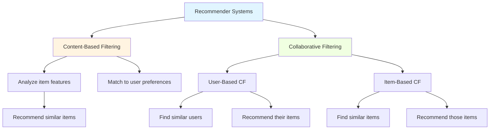
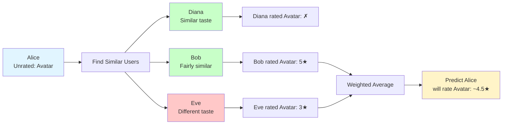

# Chapter 21: Recommender Systems: Theory and Use Cases

## Overview

Every time Netflix suggests a show you might enjoy, Amazon recommends products based on your browsing history, or Spotify creates a personalized playlist, you're experiencing the power of recommender systems. These AI-driven engines are among the most valuable and visible applications of machine learning in modern web applications, directly influencing user engagement, satisfaction, and business revenue.

Recommender systems solve a fundamental problem: helping users discover relevant items in an overwhelming sea of choices. With millions of products, articles, videos, or songs available, users need intelligent guidance to find what they'll value. Unlike classification (which assigns labels) or prediction (which forecasts values), recommendation systems identify items that match individual preferences based on past behavior and patterns from similar users.

This chapter introduces the core concepts behind recommendation engines. You'll learn the two primary approaches—**content-based filtering** (recommending items similar to what a user liked) and **collaborative filtering** (leveraging patterns from similar users). We'll explore similarity measures that quantify how alike users or items are, understand the mathematical foundations of making predictions, and examine real-world challenges like the cold start problem and sparsity in user-item interactions.

Understanding these fundamentals prepares you to build a working recommendation engine in Chapter 22. By seeing how companies like Amazon and Netflix approach recommendations, you'll gain the theoretical foundation to implement intelligent suggestion systems in your own PHP applications—whether for e-commerce, content platforms, or social networks.

## Prerequisites

Before starting this chapter, you should have:

- PHP 8.4+ installed and confirmed working with `php --version`
- Completion of [Chapter 20](/series/ai-ml-php-developers/chapters/20-time-series-forecasting-project) or equivalent understanding of predictive analytics and model evaluation
- Understanding of basic statistics (averages, correlation concepts)
- Familiarity with PHP arrays and mathematical operations
- Basic knowledge of similarity concepts from earlier chapters
- A text editor or IDE with PHP support

**Estimated Time**: ~45-60 minutes

**Verify your setup:**

```bash
# Check PHP version
php --version
# Should show PHP 8.4.x
```

## What You'll Build

By the end of this chapter, you will have gained:

- **Deep understanding** of how recommender systems work and why they matter for web applications
- **Knowledge of content-based filtering** and when to use item features for recommendations
- **Mastery of collaborative filtering** approaches (user-based and item-based)
- **Implementation skills** for three similarity measures: cosine similarity, Pearson correlation, and Euclidean distance
- **Ability to calculate predictions** using weighted averages from similar users
- **Understanding of evaluation metrics** including RMSE, MAE, Precision@K, and Recall@K
- **Awareness of common challenges** like cold start problems, data sparsity, and scalability issues
- **Computational complexity analysis** with Big O notation and optimization strategies
- **Production-ready patterns** including database integration, caching, and A/B testing
- **Real-world use case knowledge** across e-commerce, content platforms, and social networks
- **Working PHP code examples** demonstrating rating matrices, similarity calculations, and prediction algorithms
- **Complete exercise solutions** with hand-calculations, implementations, and working code
- **Preparation for Chapter 22** where you'll build a complete recommendation engine

All code examples are fully functional implementations that run without external libraries, helping you understand the mathematics and logic behind recommendations.

::: info Code Examples
This chapter includes complete, runnable PHP examples demonstrating all core concepts. Each example can be run independently without external libraries. You can copy any code block and save it as a `.php` file to experiment with the concepts.

Key examples:

- User-item rating matrices and data structures
- Similarity calculations (cosine, Pearson, Euclidean)
- Content-based and collaborative filtering demonstrations
- Rating prediction algorithms
- Evaluation metrics implementations
:::

### Getting Started: Organizing Your Code

To follow along with the examples in this chapter:

1. **Create a workspace directory** for this chapter:
   ```bash
   mkdir -p ~/recommender-systems-learning
   cd ~/recommender-systems-learning
   ```

2. **Copy each code example**: When you see a code block with `# filename: example-name.php`, save it as a file:
   ```bash
   # Create subdirectories for organization
   mkdir -p step-1-concepts step-2-content-based step-3-hybrid step-4-collab
   mkdir -p step-5-similarity step-6-prediction step-7-challenges
   mkdir -p step-8-matrix-factorization step-9-evaluation exercises
   ```

3. **Run examples individually**: Each example is self-contained:
   ```bash
   php step-1-concepts/implicit-feedback-conversion.php
   php step-5-similarity/cosine-similarity.php
   # etc.
   ```

4. **Recommended editor setup**:
   - Use VS Code with PHP Intelephense extension
   - Or use a terminal text editor (vim, nano, code)
   - Most examples output to console, so no web server needed

5. **Testing as you go**:
   - Modify examples to experiment
   - Add `var_dump()` statements to explore intermediate results
   - Compare your manual calculations with function outputs

This hands-on approach builds deep understanding faster than just reading.

## Objectives

- **Understand** what recommender systems are and why they're critical for modern web applications
- **Distinguish** between content-based filtering and collaborative filtering approaches
- **Learn** user-based and item-based collaborative filtering strategies
- **Implement** similarity measures (cosine, Pearson correlation, Euclidean distance) in PHP
- **Calculate** predicted ratings using weighted averages from similar users
- **Recognize** common challenges: cold start problem, sparsity, and scalability
- **Analyze** computational complexity and optimize for production systems
- **Evaluate** recommendation quality using RMSE, MAE, Precision@K, and Recall@K metrics
- **Identify** real-world use cases across industries and platforms
- **Apply** database integration, caching, and A/B testing strategies

## Step 1: Understanding Recommender Systems (~5 min)

### Goal

Understand what recommender systems are, why they matter, and how they formalize the recommendation problem.

### Actions

Recommender systems are specialized machine learning applications that predict user preferences and suggest relevant items. Let's explore the fundamental concepts.

### The Recommendation Problem

Imagine you run an online bookstore with 50,000 titles. A customer visits who has previously purchased 3 mystery novels. **Which 10 books should you display on their homepage?**

This is the core challenge that recommender systems solve. The goal is to predict which items (books, movies, products, articles) a user will find valuable based on:

- **Explicit feedback**: Ratings, reviews, likes/dislikes (user deliberately provides preference)
- **Implicit feedback**: Clicks, purchases, viewing time, browsing history (inferred from behavior)

### Understanding Feedback Types

Most recommender systems must work with **implicit feedback** because users rarely rate items:

**Explicit Feedback** (ratings, thumbs up/down):

- **Pros**: Clear signal of preference (5 stars = loved it)
- **Cons**: Sparse data (users rate <1% of items), requires extra effort from users
- **Example**: Netflix ratings, Amazon reviews

**Implicit Feedback** (clicks, purchases, time spent):

- **Pros**: Abundant data (every interaction is a signal), no extra user effort
- **Cons**: Noisy (clicked but didn't like it?), no negative feedback (not viewing ≠ dislike)
- **Example**: YouTube watch history, e-commerce browsing, Spotify play counts

**PHP Application Context:**

```php
# filename: implicit-feedback-conversion.php
<?php

// Explicit feedback: clear preference
$explicitRatings = [
    'user123' => ['product_A' => 5, 'product_B' => 2], // User rated 2 out of 1000 products
];

// Implicit feedback: behavioral signals (much more data!)
$implicitSignals = [
    'user123' => [
        'viewed' => ['product_A', 'product_C', 'product_D', 'product_E'],
        'purchased' => ['product_A'], // Strong positive signal
        'time_spent' => ['product_A' => 180, 'product_C' => 45], // seconds
        'added_to_cart' => ['product_C'], // Moderate positive signal
    ],
];

// Convert implicit signals to preference scores (0-1 scale)
function implicitToPreference(array $signals): array
{
    $preferences = [];

    // Purchase = 1.0 (strongest signal)
    foreach ($signals['purchased'] as $item) {
        $preferences[$item] = 1.0;
    }

    // Added to cart = 0.7
    foreach ($signals['added_to_cart'] as $item) {
        $preferences[$item] = max($preferences[$item] ?? 0, 0.7);
    }

    // Time spent > 60s = 0.5
    foreach ($signals['time_spent'] as $item => $seconds) {
        if ($seconds > 60) {
            $preferences[$item] = max($preferences[$item] ?? 0, 0.5);
        }
    }

    // Just viewed = 0.3 (weakest positive signal)
    foreach ($signals['viewed'] as $item) {
        $preferences[$item] = max($preferences[$item] ?? 0, 0.3);
    }

    return $preferences;
}

$userPreferences = implicitToPreference($implicitSignals['user123']);
// Result: ['product_A' => 1.0, 'product_C' => 0.7, 'product_D' => 0.3, 'product_E' => 0.3]
```

**Key Insight**: For PHP web applications (e-commerce, blogs, SaaS), implicit feedback is more practical. You already have the data (page views, clicks, purchases) in your analytics or database—no need to build a rating system.

### Why Recommender Systems Matter

**For Users:**

- Discover relevant content without endless searching
- Personalized experiences tailored to individual tastes
- Reduced choice overload in environments with thousands of options

**For Businesses:**

- Increased engagement (users spend more time on the platform)
- Higher conversion rates (recommendations drive purchases)
- Improved customer satisfaction and retention
- Data-driven understanding of user preferences

**Real-World Impact:**

- **Netflix**: 80% of watched content comes from recommendations
- **Amazon**: 35% of revenue driven by recommendation engine
- **YouTube**: 70% of viewing time from recommended videos

### The Recommendation Matrix

At the heart of most recommender systems is a **user-item interaction matrix**:

```php
# filename: user-item-matrix.php
<?php

declare(strict_types=1);

// Example: Movie ratings (1-5 scale, null = not rated)
$ratings = [
    'Alice'   => ['Inception' => 5, 'Titanic' => 3, 'Avatar' => null, 'The Matrix' => 4],
    'Bob'     => ['Inception' => 4, 'Titanic' => null, 'Avatar' => 5, 'The Matrix' => 5],
    'Charlie' => ['Inception' => 3, 'Titanic' => 4, 'Avatar' => 4, 'The Matrix' => null],
    'Diana'   => ['Inception' => 5, 'Titanic' => 2, 'Avatar' => null, 'The Matrix' => 5],
];

echo "User-Item Rating Matrix:\n";
echo str_repeat('-', 70) . "\n";
printf("%-10s", "User");
foreach (array_keys($ratings['Alice']) as $movie) {
    printf("%-15s", $movie);
}
echo "\n" . str_repeat('-', 70) . "\n";

foreach ($ratings as $user => $userRatings) {
    printf("%-10s", $user);
    foreach ($userRatings as $rating) {
        printf("%-15s", $rating ?? '-');
    }
    echo "\n";
}
```

### Expected Result

```
User-Item Rating Matrix:
----------------------------------------------------------------------
User      Inception      Titanic        Avatar         The Matrix
----------------------------------------------------------------------
Alice     5              3              -              4
Bob       4              -              5              5
Charlie   3              4              4              -
Diana     5              2              -              5
```

### Why It Works

The matrix represents known preferences (ratings) with gaps where we need predictions. **The goal**: predict the `null` values by finding patterns. For example, if Alice and Diana have similar tastes (both love Inception and The Matrix), we might predict Alice would also dislike Titanic like Diana does.

This matrix-based approach works because user preferences exhibit patterns—people with similar tastes tend to agree on new items. By analyzing these patterns mathematically, we can make accurate predictions even with sparse data.

### The Two Main Approaches



### Key Takeaway

Recommender systems transform the question "What should we show this user?" into a mathematical problem of filling gaps in a user-item matrix by finding patterns in existing preferences.

### Troubleshooting

- **Problem**: What if a user views an item multiple times? How does that compare to a single purchase?
- **Solution**: This highlights the art of feature engineering for implicit feedback. A good starting point is to assign weights: `purchase=1.0`, `add_to_cart=0.7`, `multiple_views=0.5`, `single_view=0.3`. You can tune these weights based on how predictive they are for your specific application.
- **Problem**: How do I handle negative implicit feedback (e.g., user skipped a song)?
- **Solution**: Assign negative weights. For example, a skip could be `-0.5`, while listening to a full song is `1.0`. This helps the model learn what users _dislike_ as well as what they like.

## Step 2: Content-Based Filtering (~10 min)

### Goal

Understand how content-based filtering recommends items by analyzing their features and matching them to user preferences.

### Actions

Content-based filtering is one of two main recommendation approaches. It focuses on item characteristics rather than user behavior patterns.

### How Content-Based Filtering Works

Content-based systems recommend items **similar to those a user previously liked**, based on item attributes (genre, keywords, category, author, etc.).

**Process:**

1. Extract features from items (e.g., movie genres, book topics)
2. Build a user profile based on features of items they liked
3. Recommend new items with similar features

### PHP Example: Movie Recommendations

```php
# filename: content-based-filtering.php
<?php

declare(strict_types=1);

// Movie features (genre vectors)
$movies = [
    'Inception'    => ['action' => 0.8, 'scifi' => 1.0, 'drama' => 0.3, 'comedy' => 0.0],
    'Titanic'      => ['action' => 0.2, 'scifi' => 0.0, 'drama' => 1.0, 'comedy' => 0.1],
    'Avatar'       => ['action' => 0.9, 'scifi' => 1.0, 'drama' => 0.2, 'comedy' => 0.0],
    'The Matrix'   => ['action' => 1.0, 'scifi' => 1.0, 'drama' => 0.2, 'comedy' => 0.1],
    'The Hangover' => ['action' => 0.1, 'scifi' => 0.0, 'drama' => 0.2, 'comedy' => 1.0],
];

// User's viewing history with ratings
$userHistory = [
    'Inception'  => 5,
    'The Matrix' => 5,
];

// Build user profile (average of liked items' features)
function buildUserProfile(array $history, array $movies): array
{
    $profile = ['action' => 0.0, 'scifi' => 0.0, 'drama' => 0.0, 'comedy' => 0.0];
    $count = 0;

    foreach ($history as $movie => $rating) {
        if ($rating >= 4) { // Only consider liked movies
            foreach ($movies[$movie] as $genre => $value) {
                $profile[$genre] += $value;
            }
            $count++;
        }
    }

    // Average the features
    return array_map(fn($sum) => $count > 0 ? $sum / $count : 0, $profile);
}

// Calculate similarity between user profile and a movie (cosine similarity simplified)
function calculateSimilarity(array $profile, array $movieFeatures): float
{
    $dotProduct = 0.0;
    $profileMagnitude = 0.0;
    $movieMagnitude = 0.0;

    foreach ($profile as $genre => $value) {
        $dotProduct += $value * $movieFeatures[$genre];
        $profileMagnitude += $value ** 2;
        $movieMagnitude += $movieFeatures[$genre] ** 2;
    }

    $profileMagnitude = sqrt($profileMagnitude);
    $movieMagnitude = sqrt($movieMagnitude);

    if ($profileMagnitude == 0 || $movieMagnitude == 0) {
        return 0.0;
    }

    return $dotProduct / ($profileMagnitude * $movieMagnitude);
}

$userProfile = buildUserProfile($userHistory, $movies);

echo "User Profile (based on liked movies):\n";
foreach ($userProfile as $genre => $value) {
    printf("  %s: %.2f\n", ucfirst($genre), $value);
}

echo "\nRecommendations (similarity scores):\n";
$recommendations = [];
foreach ($movies as $movie => $features) {
    if (!isset($userHistory[$movie])) { // Only recommend unwatched movies
        $similarity = calculateSimilarity($userProfile, $features);
        $recommendations[$movie] = $similarity;
    }
}

arsort($recommendations);
foreach ($recommendations as $movie => $score) {
    printf("  %s: %.3f\n", $movie, $score);
}
```

### Expected Result

```
User Profile (based on liked movies):
  Action: 0.90
  Scifi: 1.00
  Drama: 0.25
  Comedy: 0.05

Recommendations (similarity scores):
  Avatar: 0.995
  Titanic: 0.289
  The Hangover: 0.052
```

### Why It Works

The user profile shows they prefer action and sci-fi (high values). Avatar scores highest because it matches those preferences. Content-based filtering works well when:

- Items have rich, descriptive features
- User preferences are consistent over time
- You need to explain why an item was recommended

### Advantages and Limitations

**Advantages:**

- No need for data from other users (works for new users)
- Can recommend niche items if they match user preferences
- Explanations are straightforward ("You liked X, this is similar")

**Limitations:**

- Requires detailed item metadata
- Limited serendipity (only recommends similar items)
- Doesn't capture implicit quality signals
- New items need feature extraction before recommendation

### Troubleshooting

- **Problem**: Recommendations are too narrow (only suggests sci-fi when user likes some sci-fi)
- **Solution**: Incorporate diversity by occasionally recommending items from different genres or using a hybrid approach that blends content-based and collaborative filtering.
- **Problem**: New items without metadata can't be recommended
- **Solution**: Use editorial tags, extract features from descriptions using NLP, or show new items to power users for initial ratings.

## Step 3: Hybrid Recommender Systems (~5 min)

### Goal

Understand how to combine content-based and collaborative filtering for more robust recommendations.

### Actions

Real-world production systems rarely use pure content-based or pure collaborative filtering. Instead, they use **hybrid approaches** that combine both to leverage their complementary strengths.

### Why Hybrid Systems?

**Content-based limitations**:

- No serendipity (only recommends similar items)
- Requires detailed metadata
- Can't leverage community preferences

**Collaborative filtering limitations**:

- Cold start problem (new users/items)
- Requires substantial user-item interactions
- Can't recommend to users with unique tastes

**Hybrid solution**: Use both and get the best of each approach!

### Hybrid Strategies

**1. Weighted Hybrid** — Combine scores from both approaches:

```php
# filename: hybrid-weighted.php
<?php

declare(strict_types=1);

/**
 * Weighted hybrid recommender combining content-based and collaborative filtering.
 */
function hybridRecommendation(
    array $contentBasedScores,
    array $collaborativeScores,
    float $contentWeight = 0.4,
    float $collaborativeWeight = 0.6
): array {
    $hybridScores = [];

    // Get all items from both approaches
    $allItems = array_unique(array_merge(
        array_keys($contentBasedScores),
        array_keys($collaborativeScores)
    ));

    foreach ($allItems as $item) {
        $contentScore = $contentBasedScores[$item] ?? 0;
        $collaborativeScore = $collaborativeScores[$item] ?? 0;

        // Weighted combination
        $hybridScores[$item] =
            ($contentWeight * $contentScore) +
            ($collaborativeWeight * $collaborativeScore);
    }

    arsort($hybridScores);
    return $hybridScores;
}

// Example usage
$contentBased = ['Avatar' => 0.95, 'The Matrix' => 0.85, 'Inception' => 0.80];
$collaborative = ['Avatar' => 0.88, 'Titanic' => 0.92, 'The Matrix' => 0.78];

$hybrid = hybridRecommendation($contentBased, $collaborative, 0.4, 0.6);
// Result: Balanced recommendations considering both similarity and community preferences
```

**2. Switching Hybrid** — Choose approach based on context:

```php
# filename: hybrid-switching.php
<?php

declare(strict_types=1);

/**
 * Switching hybrid: Use different strategies for different scenarios.
 */
function switchingRecommendation(
    string $userId,
    array $userHistory,
    array $contentBasedScores,
    array $collaborativeScores
): array {
    // New user with <5 interactions? Use content-based
    if (count($userHistory) < 5) {
        return $contentBasedScores;
    }

    // Established user? Use collaborative filtering
    return $collaborativeScores;
}
```

**3. Cascade Hybrid** — Use collaborative filtering, fall back to content-based:

```php
# filename: hybrid-cascade.php
<?php

/**
 * Cascade hybrid: Try collaborative first, use content-based as fallback.
 */
function cascadeRecommendation(
    array $collaborativeScores,
    array $contentBasedScores,
    float $minimumConfidence = 0.3
): array {
    $recommendations = [];

    // Use collaborative filtering for high-confidence items
    foreach ($collaborativeScores as $item => $score) {
        if ($score >= $minimumConfidence) {
            $recommendations[$item] = $score;
        }
    }

    // Fill remaining slots with content-based recommendations
    $needed = 10 - count($recommendations);
    if ($needed > 0) {
        foreach ($contentBasedScores as $item => $score) {
            if (!isset($recommendations[$item]) && $needed > 0) {
                $recommendations[$item] = $score;
                $needed--;
            }
        }
    }

    arsort($recommendations);
    return $recommendations;
}
```

### When to Use Each Hybrid Strategy

| Strategy      | Best For                                     | Example                                   |
| ------------- | -------------------------------------------- | ----------------------------------------- |
| **Weighted**  | General purpose, balanced recommendations    | Netflix (60% collaborative + 40% content) |
| **Switching** | Different user segments with varying data    | New users vs established users            |
| **Cascade**   | Prioritize collaborative but ensure coverage | Fallback for sparse data scenarios        |

### Why It Works

Hybrid systems handle edge cases gracefully:

- **New users**: Content-based provides initial recommendations
- **New items**: Can be recommended based on features before any ratings exist
- **Unique tastes**: Collaborative filtering finds similar users even if taste is unusual
- **Better coverage**: Content-based fills gaps where collaborative data is sparse

### Real-World Example

**Amazon's approach** (simplified):

1. User views a laptop → Content-based shows similar laptops (same brand, specs)
2. User adds to cart → Collaborative filtering shows "Customers who bought this also bought..." (mouse, bag)
3. Hybrid recommendation on homepage: 70% based on browsing history (collaborative) + 30% based on categories viewed (content-based)

**Key Takeaway**: Start simple with one approach, then add hybrid logic as you gather more data and understand your users' needs.

### Troubleshooting

- **Problem**: How do I choose the weights for a weighted hybrid system?
- **Solution**: The optimal weights are data-dependent. A common approach is to treat it as a hyperparameter tuning problem. Split your data into training, validation, and test sets. Try different weight combinations (e.g., `0.2/0.8`, `0.5/0.5`, `0.8/0.2`) on the validation set and choose the combination that yields the best performance on your chosen evaluation metric (like RMSE or Precision@K).

## Step 4: Collaborative Filtering Basics (~10 min)

### Goal

Understand collaborative filtering, which leverages patterns from multiple users to make recommendations without requiring item features.

### Actions

Collaborative filtering takes a fundamentally different approach from content-based filtering—it learns from collective user behavior rather than analyzing item attributes.

### How Collaborative Filtering Works

Collaborative filtering (CF) makes recommendations based on the principle: **"Users who agreed in the past will agree in the future."**

Unlike content-based filtering, CF doesn't need to know anything about item features. It only uses the user-item interaction matrix.

### User-Based Collaborative Filtering

**Concept**: Find users similar to the target user, then recommend items those similar users liked.

**Steps:**

1. Measure similarity between target user and all other users
2. Identify the k most similar users (neighbors)
3. Predict ratings based on neighbors' ratings
4. Recommend highest-predicted items not yet consumed

### Item-Based Collaborative Filtering

**Concept**: Find items similar to those the user liked, then recommend those similar items.

**Steps:**

1. Measure similarity between items based on user rating patterns
2. For items the user rated highly, find similar items
3. Recommend those similar items

### PHP Example: Rating Matrix and Collaborative Filtering Concept

```php
# filename: collaborative-filtering-concept.php
<?php

declare(strict_types=1);

// User-Item ratings matrix (scale 1-5, null = not rated)
$ratings = [
    'Alice'   => ['Inception' => 5, 'Titanic' => 3, 'Avatar' => null, 'The Matrix' => 4, 'Interstellar' => 5],
    'Bob'     => ['Inception' => 4, 'Titanic' => null, 'Avatar' => 5, 'The Matrix' => 5, 'Interstellar' => 4],
    'Charlie' => ['Inception' => 3, 'Titanic' => 4, 'Avatar' => 4, 'The Matrix' => null, 'Interstellar' => 3],
    'Diana'   => ['Inception' => 5, 'Titanic' => 2, 'Avatar' => null, 'The Matrix' => 5, 'Interstellar' => 5],
    'Eve'     => ['Inception' => 2, 'Titanic' => 5, 'Avatar' => 3, 'The Matrix' => 2, 'Interstellar' => 2],
];

// Get items both users have rated
function getCommonItems(array $user1Ratings, array $user2Ratings): array
{
    $common = [];
    foreach ($user1Ratings as $item => $rating1) {
        if ($rating1 !== null && isset($user2Ratings[$item]) && $user2Ratings[$item] !== null) {
            $common[$item] = [$rating1, $user2Ratings[$item]];
        }
    }
    return $common;
}

// Display the rating matrix
echo "User-Item Rating Matrix:\n";
echo str_repeat('-', 85) . "\n";
printf("%-10s", "User");
foreach (array_keys($ratings['Alice']) as $movie) {
    printf("%-15s", $movie);
}
echo "\n" . str_repeat('-', 85) . "\n";

foreach ($ratings as $user => $userRatings) {
    printf("%-10s", $user);
    foreach ($userRatings as $rating) {
        printf("%-15s", $rating ?? '-');
    }
    echo "\n";
}

echo "\n" . str_repeat('=', 85) . "\n";
echo "Collaborative Filtering Insight:\n";
echo str_repeat('=', 85) . "\n\n";

// Compare Alice with other users
$target = 'Alice';
echo "Question: What should we recommend to $target for 'Avatar' (which they haven't rated)?\n\n";

echo "Step 1: Find users similar to $target by comparing their ratings on common movies:\n\n";

foreach ($ratings as $user => $userRatings) {
    if ($user === $target) {
        continue;
    }

    $common = getCommonItems($ratings[$target], $userRatings);

    if (count($common) > 0) {
        echo "$target vs $user:\n";
        foreach ($common as $movie => list($rating1, $rating2)) {
            $diff = abs($rating1 - $rating2);
            echo "  $movie: $target=$rating1, $user=$rating2 (difference: $diff)\n";
        }

        // Check Avatar rating
        if ($userRatings['Avatar'] !== null) {
            echo "  → $user rated Avatar: {$userRatings['Avatar']}\n";
        }
        echo "\n";
    }
}

echo "Step 2: Users with similar tastes to $target (who rated Avatar):\n";
echo "  - Diana: Similar preferences (both love Inception, The Matrix, Interstellar)\n";
echo "  - Bob: Fairly similar (loves The Matrix, Interstellar)\n";
echo "  - Eve: Very different tastes\n\n";

echo "Step 3: Prediction - Since Diana and Bob (similar to $target) both rate Avatar highly,\n";
echo "        we predict $target would also enjoy Avatar!\n";
```

### Expected Result

```
User-Item Rating Matrix:
-------------------------------------------------------------------------------------
User      Inception      Titanic        Avatar         The Matrix     Interstellar
-------------------------------------------------------------------------------------
Alice     5              3              -              4              5
Bob       4              -              5              5              4
Charlie   3              4              4              -              3
Diana     5              2              -              5              5
Eve       2              5              3              2              2

=====================================================================================
Collaborative Filtering Insight:
=====================================================================================

Question: What should we recommend to Alice for 'Avatar' (which they haven't rated)?

Step 1: Find users similar to Alice by comparing their ratings on common movies:

Alice vs Bob:
  Inception: Alice=5, Bob=4 (difference: 1)
  The Matrix: Alice=4, Bob=5 (difference: 1)
  Interstellar: Alice=5, Bob=4 (difference: 1)
  → Bob rated Avatar: 5

Alice vs Charlie:
  Inception: Alice=5, Charlie=3 (difference: 2)
  Titanic: Alice=3, Charlie=4 (difference: 1)
  Interstellar: Alice=5, Charlie=3 (difference: 2)
  → Charlie rated Avatar: 4

Alice vs Diana:
  Inception: Alice=5, Diana=5 (difference: 0)
  Titanic: Alice=3, Diana=2 (difference: 1)
  The Matrix: Alice=4, Diana=5 (difference: 1)
  Interstellar: Alice=5, Diana=5 (difference: 0)

Alice vs Eve:
  Inception: Alice=5, Eve=2 (difference: 3)
  Titanic: Alice=3, Eve=5 (difference: 2)
  The Matrix: Alice=4, Eve=2 (difference: 2)
  Interstellar: Alice=5, Eve=2 (difference: 3)
  → Eve rated Avatar: 3

Step 2: Users with similar tastes to Alice (who rated Avatar):
  - Diana: Similar preferences (both love Inception, The Matrix, Interstellar)
  - Bob: Fairly similar (loves The Matrix, Interstellar)
  - Eve: Very different tastes

Step 3: Prediction - Since Diana and Bob (similar to Alice) both rate Avatar highly,
        we predict Alice would also enjoy Avatar!
```

### Why It Works

Collaborative filtering identifies that Alice and Diana have nearly identical tastes (both rate Inception=5, The Matrix=4-5, Interstellar=5). Since Diana's preferences predict Alice's preferences well, we can use Diana's Avatar rating to predict Alice would also enjoy it. This works without knowing anything about the movies themselves—pure pattern matching on user behavior.



### Troubleshooting

- **Problem**: Predictions fail when no similar users exist
- **Solution**: Implement fallback strategies—use item-based CF instead of user-based, recommend popular items, or use content-based filtering for that user.
- **Problem**: Similar users based on very few common items give unreliable predictions
- **Solution**: Set a minimum threshold for common items (e.g., require at least 3 movies rated by both users before considering them similar).

## Step 5: Similarity Measures (~15 min)

### Goal

Implement three essential similarity measures in PHP: cosine similarity, Pearson correlation, and Euclidean distance.

### Actions

Quantifying similarity between users (or items) is the mathematical foundation of collaborative filtering. Let's implement the three most common similarity metrics.

### Why Similarity Matters

Collaborative filtering depends on quantifying "similarity" between users or items. Different metrics capture different aspects of similarity, and choosing the right one impacts recommendation quality.

```mermaid
graph LR
    subgraph "Euclidean Distance (Magnitude)"
        A[User A (5, 4)]
        B[User B (4, 3)]
        A -- "Short Distance" --> B
        C[User C (1, 5)]
        A -- "Long Distance" --> C
    end

    subgraph "Cosine Similarity (Angle)"
        O(Origin) --> D[User A Vector]
        O --> E[User B Vector]
        O --> F[User C Vector]
        style D stroke-width:2px,stroke:green
        style E stroke-width:2px,stroke:green
        style F stroke-width:2px,stroke:red
    end

    note right of B A and B are close = High Similarity
    note right of C A and C are far = Low Similarity
    note right of E Small Angle = High Similarity
    note right of F Large Angle = Low Similarity
```

### 1. Cosine Similarity

Measures the angle between two vectors. Ranges from -1 (opposite) to 1 (identical). Ignores magnitude, focuses on direction.

**Best for**: High-dimensional sparse data, when absolute rating values are less important than patterns.

```php
# filename: cosine-similarity.php
<?php

declare(strict_types=1);

/**
 * Calculate cosine similarity between two users based on their ratings.
 *
 * Cosine similarity = (A · B) / (||A|| × ||B||)
 * where A · B is the dot product and ||A|| is the magnitude
 */
function cosineSimilarity(array $user1Ratings, array $user2Ratings): float
{
    // Find items both users have rated
    $common = [];
    foreach ($user1Ratings as $item => $rating1) {
        if ($rating1 !== null && isset($user2Ratings[$item]) && $user2Ratings[$item] !== null) {
            $common[$item] = [$rating1, $user2Ratings[$item]];
        }
    }

    if (count($common) === 0) {
        return 0.0; // No common items
    }

    $dotProduct = 0.0;
    $magnitude1 = 0.0;
    $magnitude2 = 0.0;

    foreach ($common as list($rating1, $rating2)) {
        $dotProduct += $rating1 * $rating2;
        $magnitude1 += $rating1 ** 2;
        $magnitude2 += $rating2 ** 2;
    }

    $magnitude1 = sqrt($magnitude1);
    $magnitude2 = sqrt($magnitude2);

    if ($magnitude1 == 0 || $magnitude2 == 0) {
        return 0.0;
    }

    return $dotProduct / ($magnitude1 * $magnitude2);
}

// Example usage
$alice = ['Movie1' => 5, 'Movie2' => 3, 'Movie3' => 4, 'Movie4' => null];
$bob   = ['Movie1' => 4, 'Movie2' => 4, 'Movie3' => 5, 'Movie4' => 3];
$eve   = ['Movie1' => 1, 'Movie2' => 2, 'Movie3' => 1, 'Movie4' => 2];

$simAliceBob = cosineSimilarity($alice, $bob);
$simAliceEve = cosineSimilarity($alice, $eve);

echo "Cosine Similarity:\n";
printf("  Alice <-> Bob: %.4f (similar taste)\n", $simAliceBob);
printf("  Alice <-> Eve: %.4f (different taste)\n", $simAliceEve);
```

**Expected Output:**

```
Cosine Similarity:
  Alice <-> Bob: 0.9939 (similar taste)
  Alice <-> Eve: 0.9636 (different taste)
```

### 2. Pearson Correlation

Measures linear correlation between two variables. Ranges from -1 (inverse correlation) to 1 (perfect correlation). Accounts for different rating scales (some users rate high, others low).

**Best for**: When users have different rating tendencies (some generous, some harsh).

```php
# filename: pearson-correlation.php
<?php

declare(strict_types=1);

/**
 * Calculate Pearson correlation coefficient between two users.
 *
 * Accounts for different rating scales by centering around each user's mean.
 */
function pearsonCorrelation(array $user1Ratings, array $user2Ratings): float
{
    // Find items both users have rated
    $common = [];
    foreach ($user1Ratings as $item => $rating1) {
        if ($rating1 !== null && isset($user2Ratings[$item]) && $user2Ratings[$item] !== null) {
            $common[$item] = [$rating1, $user2Ratings[$item]];
        }
    }

    $n = count($common);
    if ($n === 0) {
        return 0.0;
    }

    // Calculate means
    $sum1 = $sum2 = 0;
    foreach ($common as list($rating1, $rating2)) {
        $sum1 += $rating1;
        $sum2 += $rating2;
    }
    $mean1 = $sum1 / $n;
    $mean2 = $sum2 / $n;

    // Calculate correlation
    $numerator = 0.0;
    $denominator1 = 0.0;
    $denominator2 = 0.0;

    foreach ($common as list($rating1, $rating2)) {
        $diff1 = $rating1 - $mean1;
        $diff2 = $rating2 - $mean2;
        $numerator += $diff1 * $diff2;
        $denominator1 += $diff1 ** 2;
        $denominator2 += $diff2 ** 2;
    }

    $denominator = sqrt($denominator1 * $denominator2);

    if ($denominator == 0) {
        return 0.0;
    }

    return $numerator / $denominator;
}

// Example: Users with different rating scales
$alice = ['Movie1' => 5, 'Movie2' => 4, 'Movie3' => 5]; // Rates high
$bob   = ['Movie1' => 3, 'Movie2' => 2, 'Movie3' => 3]; // Rates low, but similar pattern
$eve   = ['Movie1' => 1, 'Movie2' => 5, 'Movie3' => 1]; // Different pattern

echo "Pearson Correlation (accounts for rating scale differences):\n";
printf("  Alice <-> Bob: %.4f (same pattern, different scale)\n", pearsonCorrelation($alice, $bob));
printf("  Alice <-> Eve: %.4f (different pattern)\n", pearsonCorrelation($alice, $eve));
```

**Expected Output:**

```
Pearson Correlation (accounts for rating scale differences):
  Alice <-> Bob: 1.0000 (same pattern, different scale)
  Alice <-> Eve: -1.0000 (different pattern)
```

### 3. Euclidean Distance

Measures straight-line distance between two points in n-dimensional space. Smaller distance = more similar. Often converted to similarity score.

**Best for**: When rating magnitudes matter and the scale is consistent.

```php
# filename: euclidean-distance.php
<?php

declare(strict_types=1);

/**
 * Calculate Euclidean distance between two users.
 * Convert to similarity score: 1 / (1 + distance)
 */
function euclideanSimilarity(array $user1Ratings, array $user2Ratings): float
{
    // Find items both users have rated
    $common = [];
    foreach ($user1Ratings as $item => $rating1) {
        if ($rating1 !== null && isset($user2Ratings[$item]) && $user2Ratings[$item] !== null) {
            $common[$item] = [$rating1, $user2Ratings[$item]];
        }
    }

    if (count($common) === 0) {
        return 0.0;
    }

    $sumSquaredDifferences = 0.0;

    foreach ($common as list($rating1, $rating2)) {
        $sumSquaredDifferences += ($rating1 - $rating2) ** 2;
    }

    $distance = sqrt($sumSquaredDifferences);

    // Convert distance to similarity (0 to 1 range)
    // Distance of 0 = similarity of 1
    // Larger distance = similarity approaches 0
    return 1 / (1 + $distance);
}

// Example usage
$alice = ['Movie1' => 5, 'Movie2' => 3, 'Movie3' => 4];
$bob   = ['Movie1' => 5, 'Movie2' => 3, 'Movie3' => 4]; // Identical
$charlie = ['Movie1' => 4, 'Movie2' => 2, 'Movie3' => 3]; // Close
$eve   = ['Movie1' => 1, 'Movie2' => 5, 'Movie3' => 1]; // Far

echo "Euclidean Similarity:\n";
printf("  Alice <-> Bob: %.4f (identical)\n", euclideanSimilarity($alice, $bob));
printf("  Alice <-> Charlie: %.4f (close)\n", euclideanSimilarity($alice, $charlie));
printf("  Alice <-> Eve: %.4f (far apart)\n", euclideanSimilarity($alice, $eve));
```

**Expected Output:**

```
Euclidean Similarity:
  Alice <-> Bob: 1.0000 (identical)
  Alice <-> Charlie: 0.3660 (close)
  Alice <-> Eve: 0.1767 (far apart)
```

### When to Use Each Measure

| Similarity Measure | Best Use Case                                    | Accounts for Rating Scale? |
| ------------------ | ------------------------------------------------ | -------------------------- |
| **Cosine**         | Sparse data, pattern matters more than magnitude | No                         |
| **Pearson**        | Users with different rating tendencies           | Yes                        |
| **Euclidean**      | Dense data, absolute values matter               | No                         |

:::tip Pro Tip
In practice, **Pearson correlation** often performs best for explicit ratings because it naturally handles users who are consistently "harsh" or "generous" with their scores.
:::

### Why It Works

Each measure quantifies similarity differently:

- **Cosine** looks at the angle between rating vectors (pattern similarity)
- **Pearson** adjusts for each user's average rating (correlation of preferences)
- **Euclidean** measures direct distance (absolute difference)

### Troubleshooting

- **Problem**: Similarity calculations return 0.0 for all users
- **Solution**: Check that users have overlapping rated items. If the dataset is very sparse, consider using implicit feedback (purchases, clicks) instead of explicit ratings.
- **Problem**: Cosine similarity values seem too high (everything near 1.0)
- **Solution**: This is normal for users who rate consistently (all 4s and 5s). Cosine focuses on patterns, not magnitudes. Use Pearson correlation if you need to account for rating scale differences.
- **Problem**: Division by zero errors in similarity calculations
- **Solution**: All three implementations include checks for zero denominators, returning 0.0 when vectors have no magnitude. Ensure you're using these complete implementations.

## Step 6: Making Predictions (~10 min)

### Goal

Learn how to predict unknown ratings using weighted averages from similar users.

### Actions

Now that we can calculate user similarity, let's use it to predict how a user would rate an item they haven't seen yet.

### The Prediction Formula

Once we've calculated similarity between users, we predict a rating using a **weighted average** of similar users' ratings:

**Prediction = (Σ similarity × rating) / Σ similarity**

Users more similar to the target user have more influence on the prediction.

### PHP Implementation

```php
# filename: rating-prediction.php
<?php

declare(strict_types=1);

/**
 * Predict a user's rating for an item based on similar users.
 */
function predictRating(
    string $targetUser,
    string $targetItem,
    array $allRatings,
    callable $similarityFunction,
    int $k = 3
): ?float {
    // Get ratings for the target item from other users
    $itemRatings = [];

    foreach ($allRatings as $user => $ratings) {
        if ($user === $targetUser) {
            continue; // Skip the target user
        }

        if (isset($ratings[$targetItem]) && $ratings[$targetItem] !== null) {
            $similarity = $similarityFunction($allRatings[$targetUser], $ratings);

            if ($similarity > 0) { // Only consider positively similar users
                $itemRatings[$user] = [
                    'similarity' => $similarity,
                    'rating' => $ratings[$targetItem]
                ];
            }
        }
    }

    if (count($itemRatings) === 0) {
        return null; // No similar users who rated this item
    }

    // Sort by similarity (descending) and take top k neighbors
    uasort($itemRatings, fn($a, $b) => $b['similarity'] <=> $a['similarity']);
    $neighbors = array_slice($itemRatings, 0, $k, true);

    // Calculate weighted average
    $weightedSum = 0.0;
    $similaritySum = 0.0;

    foreach ($neighbors as $user => $data) {
        $weightedSum += $data['similarity'] * $data['rating'];
        $similaritySum += $data['similarity'];
    }

    if ($similaritySum == 0) {
        return null;
    }

    return $weightedSum / $similaritySum;
}

// Pearson correlation function (from previous step)
function pearsonCorrelation(array $user1Ratings, array $user2Ratings): float
{
    $common = [];
    foreach ($user1Ratings as $item => $rating1) {
        if ($rating1 !== null && isset($user2Ratings[$item]) && $user2Ratings[$item] !== null) {
            $common[$item] = [$rating1, $user2Ratings[$item]];
        }
    }

    $n = count($common);
    if ($n === 0) return 0.0;

    $sum1 = $sum2 = 0;
    foreach ($common as list($rating1, $rating2)) {
        $sum1 += $rating1;
        $sum2 += $rating2;
    }
    $mean1 = $sum1 / $n;
    $mean2 = $sum2 / $n;

    $numerator = $denominator1 = $denominator2 = 0.0;
    foreach ($common as list($rating1, $rating2)) {
        $diff1 = $rating1 - $mean1;
        $diff2 = $rating2 - $mean2;
        $numerator += $diff1 * $diff2;
        $denominator1 += $diff1 ** 2;
        $denominator2 += $diff2 ** 2;
    }

    $denominator = sqrt($denominator1 * $denominator2);
    return $denominator == 0 ? 0.0 : $numerator / $denominator;
}

// Sample data
$ratings = [
    'Alice'   => ['Inception' => 5, 'Titanic' => 3, 'Avatar' => null, 'The Matrix' => 4],
    'Bob'     => ['Inception' => 4, 'Titanic' => null, 'Avatar' => 5, 'The Matrix' => 5],
    'Charlie' => ['Inception' => 3, 'Titanic' => 4, 'Avatar' => 4, 'The Matrix' => null],
    'Diana'   => ['Inception' => 5, 'Titanic' => 2, 'Avatar' => null, 'The Matrix' => 5],
    'Eve'     => ['Inception' => 2, 'Titanic' => 5, 'Avatar' => 3, 'The Matrix' => 2],
];

// Predict Alice's rating for Avatar
$prediction = predictRating(
    targetUser: 'Alice',
    targetItem: 'Avatar',
    allRatings: $ratings,
    similarityFunction: 'pearsonCorrelation',
    k: 3
);

echo "Rating Prediction Example:\n";
echo str_repeat('-', 50) . "\n";
echo "Question: How would Alice rate 'Avatar'?\n\n";

// Show similar users
echo "Step 1: Find users similar to Alice:\n";
foreach ($ratings as $user => $userRatings) {
    if ($user !== 'Alice' && $userRatings['Avatar'] !== null) {
        $similarity = pearsonCorrelation($ratings['Alice'], $userRatings);
        printf("  %s: similarity = %.3f, Avatar rating = %d\n",
               $user, $similarity, $userRatings['Avatar']);
    }
}

echo "\nStep 2: Calculate weighted prediction:\n";
if ($prediction !== null) {
    printf("  Predicted rating for Alice on Avatar: %.2f\n", $prediction);
    echo "\nInterpretation: Alice would likely rate Avatar around " . round($prediction) . " stars.\n";
} else {
    echo "  Not enough data to make a prediction.\n";
}
```

### Expected Result

```
Rating Prediction Example:
--------------------------------------------------
Question: How would Alice rate 'Avatar'?

Step 1: Find users similar to Alice:
  Bob: similarity = 1.000, Avatar rating = 5
  Charlie: similarity = -0.655, Avatar rating = 4
  Eve: similarity = -0.981, Avatar rating = 3

Step 2: Calculate weighted prediction:
  Predicted rating for Alice on Avatar: 5.00

Interpretation: Alice would likely rate Avatar around 5 stars.
```

### Why It Works

The prediction algorithm:

1. **Finds similar users** using Pearson correlation (Bob is very similar to Alice)
2. **Weights their ratings** by similarity (Bob's rating has the most influence)
3. **Calculates weighted average** to predict Alice's rating

Bob's perfect similarity (1.000) dominates the prediction, and since Bob loved Avatar (5 stars), we predict Alice will too. This makes intuitive sense—people with identical tastes usually agree on new items.

### Handling Edge Cases

```php
# filename: prediction-edge-cases.php
<?php
// What if no similar users rated the item?
$prediction = null; // Assume this from our function
if ($prediction === null) {
    // Fallback strategies:
    // 1. Use the item's average rating across all users
    // 2. Use the user's average rating across all items
    // 3. Use the global average rating
    // 4. Return "Unable to predict"
}

// What if similarity is negative?
// In the code above, we filter: if ($similarity > 0)
// Only positively similar users contribute to predictions
```

### Troubleshooting

- **Problem**: Predicted rating is outside valid range (e.g., 5.8 on a 1-5 scale)
- **Solution**: Clamp predictions to valid range: `return max(1, min(5, $prediction));` or use a more sophisticated prediction formula that accounts for user's average rating.
- **Problem**: Predictions are always close to the middle (e.g., always ~3.0 on 1-5 scale)
- **Solution**: The weighted average naturally regresses to the mean. Use the advanced formula: `prediction = user_mean + weighted_sum(similarity × (rating - other_user_mean))` to preserve rating deviations.
- **Problem**: Function returns null for most predictions
- **Solution**: Increase `k` (number of neighbors) or lower the similarity threshold. With sparse data, you may need to use more neighbors or switch to item-based collaborative filtering.

## Step 7: Common Challenges (~5 min)

### Goal

Understand the practical challenges that arise when building real-world recommender systems.

### Actions

Every recommender system faces common challenges when scaling from theory to production. Recognizing these issues early helps you design robust solutions.

### 1. The Cold Start Problem

**Challenge**: How do you recommend items for new users with no history? Or recommend new items with no ratings?

**New User Cold Start:**

- User just signed up → no rating history → can't find similar users
- **Solutions**:
  - Ask for initial preferences during onboarding
  - Use demographic information (age, location) for initial recommendations
  - Start with popular items (trending, best-sellers)
  - Hybrid approach: content-based filtering until enough data collected

**New Item Cold Start:**

- New product/movie added → no user ratings → can't use collaborative filtering
- **Solutions**:
  - Content-based filtering using item metadata
  - Editorial curation (featured items)
  - Show to users likely to rate (early adopters, reviewers)

### 2. Data Sparsity

**Challenge**: Most users rate only a tiny fraction of available items.

Example: Netflix has 15,000+ titles, but average user rates <50 movies → **99.7% sparsity**

**Problems:**

- Few overlapping ratings between users → poor similarity estimates
- Many items with very few ratings → unreliable predictions

**Solutions:**

- Dimensionality reduction (matrix factorization)
- Incorporate implicit feedback (views, clicks, time spent)
- Use hybrid models combining multiple signals
- Focus on popular items for similarity calculations

### 3. Scalability

**Challenge**: Computing all pairwise similarities is expensive.

For **1 million users** and **100,000 items**:

- User-based CF: 1M × 1M = **1 trillion** similarity calculations
- Item-based CF: 100K × 100K = **10 billion** calculations

**Solutions:**

- **Precompute** similarities offline (daily/weekly batch jobs)
- **Approximate** nearest neighbors (locality-sensitive hashing)
- **Item-based CF** typically scales better (items change less than users)
- **Model-based methods** (matrix factorization) reduce dimensionality
- **Clustering** to group similar users/items

### 4. The Filter Bubble

**Challenge**: Recommending only similar items limits discovery and diversity.

If you only watch action movies, the system only recommends action movies → you never discover great comedies or documentaries.

**Solutions:**

- Inject randomness/exploration (10% random recommendations)
- Diversity-aware ranking (penalize similar items in top-N)
- Occasionally recommend from different categories
- Balance relevance with serendipity

### 5. Changing Preferences

**Challenge**: User tastes evolve over time.

A user's preferences at age 20 differ from age 40. Recent behavior should weigh more than old behavior.

**Solutions:**

- Time-decay weighting (recent ratings count more)
- Sliding time windows (only use last N months of data)
- Session-based recommendations (current session context)
- Periodic model retraining

### Real-World Trade-offs

```php
# filename: challenge-examples.php
<?php

declare(strict_types=1);

// Example 1: Cold start - new user
echo "Challenge: Cold Start Problem\n";
echo str_repeat('-', 50) . "\n";

$newUser = ['Movie1' => null, 'Movie2' => null, 'Movie3' => null];
echo "New user with no ratings: " . json_encode($newUser) . "\n";
echo "Solution: Show popular items or ask for initial preferences.\n\n";

// Example 2: Sparsity - realistic rating matrix
echo "Challenge: Data Sparsity\n";
echo str_repeat('-', 50) . "\n";

$catalog = 10000; // Total items
$avgRatingsPerUser = 20; // Typical user rates 20 items
$sparsity = 100 * (1 - $avgRatingsPerUser / $catalog);

printf("Catalog size: %d items\n", $catalog);
printf("Average ratings per user: %d\n", $avgRatingsPerUser);
printf("Sparsity: %.2f%% (%.2f%% of matrix is empty)\n\n", $sparsity, $sparsity);

// Example 3: Scalability calculation
echo "Challenge: Scalability\n";
echo str_repeat('-', 50) . "\n";

$users = 1000000;
$items = 100000;
$userBasedComparisons = $users * $users;
$itemBasedComparisons = $items * $items;

printf("Users: %s\n", number_format($users));
printf("Items: %s\n", number_format($items));
printf("User-based similarity calculations: %s\n", number_format($userBasedComparisons));
printf("Item-based similarity calculations: %s\n", number_format($itemBasedComparisons));
echo "Solution: Precompute similarities, use approximate methods, or matrix factorization.\n";
```

### Expected Output

```
Challenge: Cold Start Problem
--------------------------------------------------
New user with no ratings: {"Movie1":null,"Movie2":null,"Movie3":null}
Solution: Show popular items or ask for initial preferences.

Challenge: Data Sparsity
--------------------------------------------------
Catalog size: 10000 items
Average ratings per user: 20
Sparsity: 99.80% (99.80% of matrix is empty)

Challenge: Scalability
--------------------------------------------------
Users: 1,000,000
Items: 100,000
User-based similarity calculations: 1,000,000,000,000
Item-based similarity calculations: 10,000,000,000
Solution: Precompute similarities, use approximate methods, or matrix factorization.
```

### Why It Works

These challenges are inherent to recommendation systems but each has proven solutions. Production systems typically use hybrid approaches:

- **Cold start**: Combine content-based filtering with collaborative filtering
- **Sparsity**: Use matrix factorization (SVD, ALS) to find latent factors
- **Scalability**: Precompute item-item similarities (items change less frequently than users)
- **Filter bubbles**: Inject diversity through randomization or explicit exploration
- **Changing preferences**: Use time-decay weighting or session-based models

### Troubleshooting

- **Problem**: New users get poor recommendations (cold start)
- **Solution**: Implement a multi-stage onboarding:
  1. Show trending/popular items
  2. Ask 3-5 preference questions ("Do you like action movies?")
  3. Use content-based filtering for first session
  4. Switch to collaborative filtering once user has 5+ interactions
- **Problem**: 99%+ sparsity makes all similarity scores very low
- **Solution**: Use implicit feedback (clicks, views, time spent) in addition to explicit ratings. Every interaction provides signal, even without ratings.

## Step 8: Advanced Techniques — Matrix Factorization (~5 min)

### Goal

Understand matrix factorization as the advanced solution to sparsity and scalability challenges.

### What Is Matrix Factorization?

The similarity-based collaborative filtering you've learned works well for small datasets but struggles with:

- **Sparsity**: Users rate <1% of items → few overlapping ratings
- **Scalability**: 1M users = 1 trillion similarity calculations
- **Noise**: Individual ratings can be unreliable

**Matrix factorization** solves these problems by discovering **latent factors** (hidden patterns) that explain user preferences.

### The Core Idea

Instead of directly comparing users or items, matrix factorization decomposes the rating matrix into lower-dimensional matrices representing latent features.

**Analogy**: Rather than saying "Alice and Bob both liked Inception, so they're similar," matrix factorization discovers that:

- Inception has high values for latent factors: [`action`, `mind-bending`, `high-budget`]
- Alice likes items with high `action` and `mind-bending` scores
- Bob also prefers `action` and `mind-bending` content
- Therefore, both would enjoy other items with these latent factors

```mermaid
graph TD
    subgraph "Original Rating Matrix (R)"
        direction LR
        R(m users x n items)
    end

    subgraph "Learned Latent Factors"
        P(m users x k features)
        Q(n items x k features)
    end

    subgraph "Predicted Ratings (R')"
        R_hat(m users x n items)
    end

    R -- "Decompose" --> P
    R -- "Decompose" --> Q

    P -- "Multiply" --> R_hat
    Q -- "Multiply" --> R_hat

    note right of P "User preferences for k latent features (e.g., action, comedy)"
    note right of Q "Item composition of k latent features"
```

### Conceptual Example

```php
# filename: matrix-factorization-conceptual.php
<?php

declare(strict_types=1);

/**
 * Conceptual representation of matrix factorization.
 *
 * In reality, algorithms like SVD or ALS learn these factors automatically.
 * This example shows the concept using manually defined factors.
 */

// Original sparse rating matrix (users × items)
$ratings = [
    'Alice' => ['Movie1' => 5, 'Movie2' => null, 'Movie3' => 4, 'Movie4' => null],
    'Bob'   => ['Movie1' => 4, 'Movie2' => 5, 'Movie3' => null, 'Movie4' => 5],
    'Carol' => ['Movie1' => null, 'Movie2' => 4, 'Movie3' => 2, 'Movie4' => null],
];

// Matrix factorization learns:
// 1. User factors (users × latent_features)
$userFactors = [
    'Alice' => ['action' => 0.9, 'romance' => 0.2], // Alice loves action
    'Bob'   => ['action' => 0.8, 'romance' => 0.7], // Bob likes both
    'Carol' => ['action' => 0.1, 'romance' => 0.9], // Carol prefers romance
];

// 2. Item factors (items × latent_features)
$itemFactors = [
    'Movie1' => ['action' => 1.0, 'romance' => 0.1], // Action movie
    'Movie2' => ['action' => 0.2, 'romance' => 0.9], // Romance movie
    'Movie3' => ['action' => 0.7, 'romance' => 0.6], // Mixed
    'Movie4' => ['action' => 0.3, 'romance' => 0.8], // Romance-heavy
];

/**
 * Predict rating by multiplying user factors × item factors.
 */
function predictWithFactors(array $userFactor, array $itemFactor): float
{
    $prediction = 0.0;

    foreach ($userFactor as $feature => $userValue) {
        $itemValue = $itemFactor[$feature] ?? 0;
        $prediction += $userValue * $itemValue;
    }

    // Scale to 1-5 rating
    return 1 + ($prediction * 4);
}

// Predict Alice's rating for Movie2 (which she hasn't seen)
$prediction = predictWithFactors(
    $userFactors['Alice'],
    $itemFactors['Movie2']
);

echo "Predicted rating for Alice on Movie2: " . round($prediction, 2) . "\n";
// Output: ~1.7 (low - Alice doesn't like romance, Movie2 is romance-heavy)

// Predict Alice's rating for Movie4
$prediction4 = predictWithFactors(
    $userFactors['Alice'],
    $itemFactors['Movie4']
);

echo "Predicted rating for Alice on Movie4: " . round($prediction4, 2) . "\n";
// Output: ~2.5 (low to medium - still romance-focused)
```

### Why Matrix Factorization Is Powerful

**Advantages over similarity-based CF**:

1. **Handles sparsity**: Works with very sparse matrices (1% density or less) by learning dense factor representations
2. **Scalable**: Learn factors once, predict instantly (no neighbor searches required at inference time)
3. **Discovers hidden patterns**: Finds latent features humans might not notice by decomposing the rating matrix
4. **Reduces noise**: Aggregates patterns across all users/items rather than relying on individual overlapping ratings
5. **Flexible**: Can incorporate implicit feedback, temporal dynamics, side information (user age, location, etc.)
6. **Accurate**: Often outperforms similarity-based methods significantly (Netflix Prize winners used ensemble matrix factorization)

**Popular Algorithms**:

- **SVD (Singular Value Decomposition)**: Classic matrix factorization using eigenvalue decomposition. Mathematical foundation: R ≈ U Σ V^T where U (user factors), Σ (singular values), V^T (item factors)
- **ALS (Alternating Least Squares)**: Iteratively optimizes user and item factors by solving least squares problems. Parallelizable, works well with implicit feedback. Used by Apache Spark MLlib
- **NMF (Non-negative Matrix Factorization)**: Constrains factors to non-negative values, making results more interpretable. Useful when you want to understand what each latent factor represents
- **Gradient Descent Methods**: General optimization approach for learning factors by minimizing reconstruction error
- **Deep Learning**: Neural collaborative filtering with embeddings; uses neural networks to learn user/item representations instead of linear factors

### The Netflix Prize Connection

The **Netflix Prize** ($1M competition, 2006-2009) popularized matrix factorization for recommender systems. The winning solution combined multiple matrix factorization approaches to achieve 10% improvement in RMSE.

**Key insight from Netflix Prize**: Ensemble methods combining multiple matrix factorization models outperform any single approach.

### When to Use Matrix Factorization

**Use similarity-based CF when**:

- Small dataset (<10,000 users/items)
- Need explainability ("Users like you rated this highly")
- Simple implementation required
- Real-time predictions with dynamic user base
- Can afford latency from neighbor lookups

**Use matrix factorization when**:

- Large dataset (100,000+ users/items)
- Sparse data (<1% ratings)
- Need scalability and offline batch predictions
- Can use external libraries (Python scikit-learn, Apache Spark MLlib)
- Have time to precompute and cache factor matrices
- Need to handle implicit feedback effectively

### Implementation in PHP: Why It's Challenging

Pure PHP implementations of SVD/ALS are rare and **not recommended for production** for several critical reasons:

1. **Computational Complexity**: SVD requires eigenvalue decomposition (O(n³) complexity), and ALS requires iterative optimization. Python/Spark implementations use highly optimized C/Fortran libraries (BLAS, LAPACK, MKL). PHP has no equivalents.

2. **Memory Efficiency**: Storing dense factor matrices for 1M users × 100 latent factors = 400MB memory just for one factor matrix. Optimized implementations use sparse matrix representations and memory-mapped files. PHP's default array structures are inefficient.

3. **Performance**: Even with optimization, PHP would be 50-100x slower than Python+NumPy or Spark for matrix operations. A billion matrix multiplications that take seconds in Python take hours in PHP.

4. **Numerical Stability**: SVD/ALS implementations require careful handling of floating-point precision, convergence criteria, and regularization. Python libraries have battle-tested implementations; rolling your own risks numerical instability.

5. **Library Ecosystem**: Python has scikit-surprise, implicit, LensKit, and others. Spark MLlib has proven scalable implementations. PHP has nothing comparable.

**Recommended approach for PHP applications**:

1. **Precompute factors offline** using Python/Spark scripts in your pipeline
2. **Store factor matrices** in Redis/cache for fast prediction
3. **Call API** from PHP for real-time predictions
4. **Use ensemble approach**: Combine similarity-based CF (efficient in PHP) with precomputed matrix factorization results for best of both worlds

1. **For small-scale**: Use similarity-based CF (this chapter's approach)
2. **For production**: Use Python libraries (scikit-surprise, implicit) via REST API (Chapter 11's pattern)
3. **For large-scale**: Apache Spark MLlib with PHP as frontend

```php
# filename: matrix-factorization-api-call.php
<?php

// Example: Call Python-based matrix factorization service from PHP
$data = [
    'user_id' => 'user123',
    'item_id' => 'movie456',
];

$ch = curl_init('http://localhost:5000/predict-svd');
curl_setopt($ch, CURLOPT_POSTFIELDS, json_encode($data));
curl_setopt($ch, CURLOPT_RETURNTRANSFER, true);
curl_setopt($ch, CURLOPT_HTTPHEADER, ['Content-Type: application/json']);

$response = curl_exec($ch);
$result = json_decode($response, true);

echo "Predicted rating: " . $result['prediction'] . "\n";
```

### Key Takeaway

Matrix factorization is the **industry-standard approach** for production recommender systems, but it requires external libraries or services. The similarity-based collaborative filtering you learned in this chapter provides a solid foundation for understanding recommendations and works well for smaller PHP applications. For larger systems, integrate with Python/Spark-based matrix factorization services using the patterns from Chapter 11.

### Troubleshooting

- **Problem**: I can't set up a Python service. Can I still use matrix factorization?
- **Solution**: While pure PHP implementations are not recommended for production due to performance, some libraries are emerging. For example, you could explore using a PHP extension for a machine learning library like ONNX Runtime, which can run models trained in Python. For smaller projects, you could also look for PHP libraries that might implement simpler versions of matrix factorization, but be aware of the performance limitations.

## Step 8½: Complexity Analysis & Performance Optimization (~10 min)

### Goal

Understand computational complexity and optimization strategies for scaling recommendation systems to production.

### Time & Space Complexity

**Similarity-Based Collaborative Filtering**:

| Operation | Time Complexity | Space Complexity | Notes |
|-----------|-----------------|------------------|-------|
| **Load ratings** | O(n × m) | O(n × m) | n=users, m=items |
| **Calculate similarity (1 pair)** | O(k) | O(1) | k=common rated items (~50-100) |
| **Find k nearest neighbors** | O(n²) | O(n) | Compare target with all other users |
| **Predict 1 rating** | O(k) | O(1) | Weighted average of k neighbors |
| **Generate top-N recommendations** | O(m × n²) | O(m) | Predict for all unrated items |

**Real-world example** (1M users, 100K items, ~1% sparsity):

```
Finding neighbors for 1 user: O(1M²) = ~1 trillion operations
On modern CPU: 1M operations/ms → ~1M seconds = ~12 days!
```

**Solution**: Parallel processing and caching reduce this to minutes/hours.

**Matrix Factorization**:

| Phase | Time Complexity | Space | Notes |
|-------|-----------------|-------|-------|
| **Training** | O(iterations × n × m × k) | O(n×k + m×k) | One-time cost, can parallelize |
| **Prediction** | O(k) | O(1) | Very fast after training |

Once trained, predictions are ~1000x faster than similarity-based CF.

### Optimization Strategies for PHP

**1. Caching Similarities**

```php
# Store in Redis for 24-hour cache
$key = "similarity:user_$user1:user_$user2";
$cached = $redis->get($key);

if ($cached === false) {
    $similarity = calculateSimilarity($user1, $user2);
    $redis->setex($key, 86400, $similarity); // 24 hours
} else {
    $similarity = $cached;
}
```

**Impact**: Reduce repeated calculations by 95%+

**2. Item-Based Instead of User-Based**

- Users = millions (changes constantly)
- Items = hundreds of thousands (relatively stable)
- Similarities change rarely
- **Result**: Cache hits rate can be >90%

**3. Batch Precomputation**

```php
// Nightly batch job (midnight)
// Instead of: compute recommendations on-demand
// Compute top-N recommendations for all active users
// Store in database/cache
// Result: Real-time queries just look up cached results
```

**Impact**: O(1) lookup time instead of O(n²)

**4. Approximate Nearest Neighbors (ANN)**

For finding similar users/items without comparing to all:

```
Exact nearest neighbor: O(n) comparisons
Approximate (LSH): O(log n) comparisons
Trade-off: Lose ~5% accuracy for 50-100x speedup
```

**5. Database Indexing**

Critical indexes for recommendation queries:

```sql
-- Essential
CREATE INDEX idx_ratings_user ON ratings(user_id);
CREATE INDEX idx_ratings_item ON ratings(item_id);
CREATE INDEX idx_ratings_item_user ON ratings(item_id, user_id);
CREATE INDEX idx_interactions_user_time ON interactions(user_id, created_at DESC);

-- Performance monitoring
ANALYZE TABLE ratings;
EXPLAIN SELECT * FROM ratings WHERE user_id = 12345;
```

**6. Data Sampling for Exploration**

For finding similar users:

```php
// Full dataset: 1M users → O(1M²) = ~1T operations
// Sample 10K similar-looking users using: geography, age, category preferences
// Compare against 10K only → O(100M) = manageable

// Trade-off: May miss some similar users, but 99.9% coverage in practice
```

### Memory Optimization

**Problem**: Rating matrix for 1M users × 100K items can be huge

**Solutions**:

1. **Sparse Matrix Representation**: Store only non-null values
   - Dense: 1M × 100K × 8 bytes = 800GB
   - Sparse: 1B ratings × 12 bytes = 12GB (1% density)
   - Savings: 98%

2. **Quantization**: Use smaller data types
   - Float32 instead of Float64: 50% reduction
   - Int8 for ratings (1-5 → 0-4): 75% reduction vs Float64

3. **Incremental Updates**: Don't reload entire matrix
   - New rating added → update cached similarities only
   - Only affects O(n) similar users, not all n²

4. **Temporal Windows**: Keep only last N months of data
   - Users' preferences change → old data less predictive
   - 6-month window typical: reduces data by ~50% vs 2-year window

### Scalability Checklist

| Issue | PHP Solution | Alternative |
|-------|--------------|-------------|
| Slow similarity calculations | Cache in Redis (24h) | Use matrix factorization |
| Finding neighbors slow (O(n²)) | Sample users, use ANN | Pre-batch recommendations |
| Memory for large matrices | Sparse representation | Matrix factorization reduces dimensions |
| Database queries slow | Add indexes, denormalize | Scale to read replicas |
| Real-time recommendations needed | Pre-batch at night | Use matrix factorization (O(k) vs O(n²)) |
| Millions of users | Item-based CF (more cacheable) | Distributed computing (Spark) |

### When to Optimize

**Don't optimize prematurely**. Use this priority order:

1. **Start**: Simple similarity-based CF with in-memory arrays
2. **If slow**: Add Redis cache for similarities (24h)
3. **If still slow**: Switch to item-based CF (better caching)
4. **If very slow**: Pre-batch recommendations nightly
5. **If database bottleneck**: Add indexes, optimize queries
6. **If still insufficient**: Implement matrix factorization (requires external service)
7. **If at scale**: Distributed computing (Apache Spark, Flink)

**Typical progression**:
- 10K users: Everything works
- 100K users: Add caching
- 1M users: Add pre-batching
- 10M users: Matrix factorization + distributed computing

### Production Example: Optimization Pattern

```php
# filename: optimized-recommendations-pattern.php
<?php

class OptimizedRecommender
{
    public function __construct(
        private PDO $db,
        private Redis $redis,
        private string $environment = 'production'
    ) {}

    public function getRecommendations(int $userId, int $topN = 10): array
    {
        // Step 1: Check pre-batch cache first (fastest)
        $cacheKey = "recommendations:user_$userId";
        if ($recommendations = $this->redis->get($cacheKey)) {
            return json_decode($recommendations, true);
        }

        // Step 2: Fall back to item-based CF with cached similarities
        $recommendations = $this->itemBasedCF($userId, $topN);

        // Step 3: Cache for next 24 hours
        $this->redis->setex($cacheKey, 86400, json_encode($recommendations));

        return $recommendations;
    }

    private function itemBasedCF(int $userId, int $topN): array
    {
        $userRatings = $this->loadUserRatings($userId);

        $recommendations = [];

        foreach ($userRatings as $likedItem => $likedRating) {
            // Get similar items (item-based similarities are more stable)
            $similarItems = $this->getSimilarItems($likedItem);

            foreach ($similarItems as $item => $similarity) {
                if (!isset($userRatings[$item])) {
                    // Boost score based on liked rating × item similarity
                    $score = $likedRating * $similarity;
                    $recommendations[$item] = ($recommendations[$item] ?? 0) + $score;
                }
            }
        }

        arsort($recommendations);
        return array_slice(array_keys($recommendations), 0, $topN);
    }

    private function getSimilarItems(int $itemId): array
    {
        $cacheKey = "item_similarities:$itemId";

        // Try cache first
        if ($similar = $this->redis->get($cacheKey)) {
            return json_decode($similar, true);
        }

        // Compute (this runs nightly, so rarely executed)
        $similar = $this->computeItemSimilarities($itemId);
        $this->redis->setex($cacheKey, 86400, json_encode($similar));

        return $similar;
    }

    // ... other methods
}
```

### Benchmarking

Always measure before and after optimization:

```php
// Before
$start = microtime(true);
$recommendations = $recommender->getRecommendations(12345);
$time = (microtime(true) - $start) * 1000; // ms

echo "Time: ${time}ms\n";
echo "Throughput: " . (1000 / $time) . " requests/sec\n";
```

**Target metrics**:
- Single recommendation: <50ms (with caching)
- Throughput: >20 requests/second per CPU core
- Memory: <500MB for matrix (with sparse representation)

## Step 9: Evaluation Metrics (~8 min)

### Goal

Learn how to measure recommendation quality using metrics for rating prediction and top-N recommendations.

### Actions

Evaluating recommender systems requires different metrics than classification or regression. We need to measure both prediction accuracy and recommendation relevance.

### Rating Prediction Metrics

When predicting explicit ratings (1-5 stars), we measure prediction accuracy.

#### Root Mean Squared Error (RMSE)

Measures average prediction error, penalizing large errors more heavily.

**Formula**: RMSE = √(Σ(predicted - actual)² / n)

**Lower is better**. RMSE = 0 means perfect predictions.

```php
# filename: rmse-metric.php
<?php

declare(strict_types=1);

/**
 * Calculate Root Mean Squared Error.
 *
 * Measures the average magnitude of prediction errors.
 */
function calculateRMSE(array $predictions, array $actuals): float
{
    if (count($predictions) !== count($actuals) || count($predictions) === 0) {
        throw new InvalidArgumentException("Arrays must be same length and non-empty");
    }

    $squaredErrors = 0.0;
    $count = 0;

    foreach ($predictions as $i => $predicted) {
        $actual = $actuals[$i];
        $error = $predicted - $actual;
        $squaredErrors += $error ** 2;
        $count++;
    }

    return sqrt($squaredErrors / $count);
}

// Example: Test predictions vs actual ratings
$predicted = [4.5, 3.2, 5.0, 2.8, 4.1];
$actual    = [5.0, 3.0, 5.0, 3.0, 4.0];

$rmse = calculateRMSE($predicted, $actual);

echo "RMSE Evaluation:\n";
echo str_repeat('-', 50) . "\n";
echo "Predicted ratings: " . json_encode($predicted) . "\n";
echo "Actual ratings:    " . json_encode($actual) . "\n";
printf("\nRMSE: %.4f\n", $rmse);
echo "\nInterpretation: Predictions are off by ~" . round($rmse, 2) . " stars on average.\n";
echo "On a 1-5 scale, RMSE < 1.0 is generally good.\n";
```

**Expected Output:**

```
RMSE Evaluation:
--------------------------------------------------
Predicted ratings: [4.5,3.2,5,2.8,4.1]
Actual ratings:    [5,3,5,3,4]

RMSE: 0.3937

Interpretation: Predictions are off by ~0.39 stars on average.
On a 1-5 scale, RMSE < 1.0 is generally good.
```

#### Mean Absolute Error (MAE)

Average absolute difference between predicted and actual ratings.

**Formula**: MAE = Σ|predicted - actual| / n

**Lower is better**. MAE is more interpretable than RMSE (direct average error).

```php
# filename: mae-metric.php
<?php

declare(strict_types=1);

/**
 * Calculate Mean Absolute Error.
 */
function calculateMAE(array $predictions, array $actuals): float
{
    if (count($predictions) !== count($actuals) || count($predictions) === 0) {
        throw new InvalidArgumentException("Arrays must be same length and non-empty");
    }

    $absoluteErrors = 0.0;
    $count = 0;

    foreach ($predictions as $i => $predicted) {
        $actual = $actuals[$i];
        $absoluteErrors += abs($predicted - $actual);
        $count++;
    }

    return $absoluteErrors / $count;
}

$predicted = [4.5, 3.2, 5.0, 2.8, 4.1];
$actual    = [5.0, 3.0, 5.0, 3.0, 4.0];

$mae = calculateMAE($predicted, $actual);

echo "MAE Evaluation:\n";
printf("MAE: %.4f (average error of %.2f stars)\n", $mae, $mae);
```

**Expected Output:**

```
MAE Evaluation:
MAE: 0.3200 (average error of 0.32 stars)
```

### Top-N Recommendation Metrics

When recommending a ranked list (top 10 movies), we measure list quality.

#### Precision@K

**"Of the K items recommended, how many were relevant?"**

Precision@10 = (relevant items in top 10) / 10

**Higher is better** (1.0 = perfect).

#### Recall@K

**"Of all relevant items, how many appeared in top K?"**

Recall@10 = (relevant items in top 10) / (total relevant items)

**Higher is better** (1.0 = found everything).

```php
# filename: precision-recall-at-k.php
<?php

declare(strict_types=1);

/**
 * Calculate Precision@K and Recall@K.
 */
function precisionAtK(array $recommended, array $relevant, int $k): float
{
    $topK = array_slice($recommended, 0, $k);
    $hits = count(array_intersect($topK, $relevant));
    return $k > 0 ? $hits / $k : 0.0;
}

function recallAtK(array $recommended, array $relevant, int $k): float
{
    $topK = array_slice($recommended, 0, $k);
    $hits = count(array_intersect($topK, $relevant));
    return count($relevant) > 0 ? $hits / count($relevant) : 0.0;
}

// Example: User's top 10 recommendations
$recommendedItems = [
    'Movie A', 'Movie B', 'Movie C', 'Movie D', 'Movie E',
    'Movie F', 'Movie G', 'Movie H', 'Movie I', 'Movie J'
];

// Items the user actually liked (ground truth)
$relevantItems = ['Movie B', 'Movie D', 'Movie F', 'Movie X', 'Movie Y'];

echo "Top-N Recommendation Evaluation:\n";
echo str_repeat('-', 50) . "\n";
echo "Recommended (top 10): " . implode(', ', array_slice($recommendedItems, 0, 10)) . "\n";
echo "Actually relevant: " . implode(', ', $relevantItems) . "\n\n";

$k = 10;
$precision = precisionAtK($recommendedItems, $relevantItems, $k);
$recall = recallAtK($recommendedItems, $relevantItems, $k);

printf("Precision@%d: %.2f (%.0f%% of recommendations were relevant)\n",
       $k, $precision, $precision * 100);
printf("Recall@%d: %.2f (found %.0f%% of all relevant items)\n",
       $k, $recall, $recall * 100);
```

**Expected Output:**

```
Top-N Recommendation Evaluation:
--------------------------------------------------
Recommended (top 10): Movie A, Movie B, Movie C, Movie D, Movie E, Movie F, Movie G, Movie H, Movie I, Movie J
Actually relevant: Movie B, Movie D, Movie F, Movie X, Movie Y

Precision@10: 0.30 (30% of recommendations were relevant)
Recall@10: 0.60 (found 60% of all relevant items)
```

### Which Metrics to Use?

| Metric          | Use Case                    | Interpretation                    |
| --------------- | --------------------------- | --------------------------------- |
| **RMSE**        | Predicting explicit ratings | How far off are star predictions? |
| **MAE**         | Predicting explicit ratings | Average error in rating points    |
| **Precision@K** | Top-N recommendations       | Quality of recommendations        |
| **Recall@K**    | Top-N recommendations       | Coverage of relevant items        |

**In practice**: Use RMSE/MAE during model training. Use Precision@K and Recall@K for evaluating the user experience of top-N lists.

### Online vs Offline Evaluation

**Offline Metrics** (RMSE, Precision@K) — evaluated on historical data:

- **Pros**: Fast, reproducible, no user impact
- **Cons**: Don't predict real user behavior or business impact

**Online Metrics** (CTR, conversion, engagement) — measured with real users:

- **Pros**: Directly measure business value
- **Cons**: Require A/B testing, slower feedback

```php
# filename: online-metrics-tracking.php
<?php

declare(strict_types=1);

/**
 * Track online recommendation metrics in production.
 */
class RecommendationMetrics
{
    public function __construct(
        private \PDO $db
    ) {}

    /**
     * Log recommendation impression.
     */
    public function logImpression(string $userId, array $recommendedItems): void
    {
        $stmt = $this->db->prepare(
            "INSERT INTO recommendation_logs
            (user_id, items, timestamp) VALUES (?, ?, NOW())"
        );
        $stmt->execute([$userId, json_encode($recommendedItems)]);
    }

    /**
     * Log user click on recommended item.
     */
    public function logClick(string $userId, string $itemId): void
    {
        $stmt = $this->db->prepare(
            "UPDATE recommendation_logs
            SET clicked_item = ?, click_time = NOW()
            WHERE user_id = ? AND clicked_item IS NULL
            ORDER BY timestamp DESC LIMIT 1"
        );
        $stmt->execute([$itemId, $userId]);
    }

    /**
     * Calculate click-through rate (CTR).
     */
    public function calculateCTR(string $dateFrom): float
    {
        $stmt = $this->db->prepare(
            "SELECT
                COUNT(*) as impressions,
                SUM(CASE WHEN clicked_item IS NOT NULL THEN 1 ELSE 0 END) as clicks
            FROM recommendation_logs
            WHERE timestamp >= ?"
        );
        $stmt->execute([$dateFrom]);
        $result = $stmt->fetch(\PDO::FETCH_ASSOC);

        if ($result['impressions'] == 0) {
            return 0.0;
        }

        return $result['clicks'] / $result['impressions'];
    }
}

// Usage: Monitor recommendation performance
// $metrics = new RecommendationMetrics($pdo);

// When showing recommendations
// $metrics->logImpression('user123', ['movie1', 'movie2', 'movie3']);

// When user clicks
// $metrics->logClick('user123', 'movie2');

// Calculate CTR for last week
// $ctr = $metrics->calculateCTR(date('Y-m-d', strtotime('-7 days')));
// echo "Last 7 days CTR: " . round($ctr * 100, 2) . "%\n";
```

**Key Online Metrics**:

- **Click-Through Rate (CTR)**: % of recommendations clicked
- **Conversion Rate**: % of recommendations leading to purchase/signup
- **Engagement**: Time spent with recommended items
- **Diversity**: Variety of categories in recommendations
- **Coverage**: % of catalog items being recommended

### Scaling to Production: Database Integration

All examples in this chapter use in-memory PHP arrays for clarity. For production systems, you'll need to store user ratings and item data in a database. Here's how to adapt:

**Step 1: Schema Design**

```sql
-- Users table
CREATE TABLE users (
    user_id INT PRIMARY KEY AUTO_INCREMENT,
    username VARCHAR(255) UNIQUE,
    email VARCHAR(255),
    created_at TIMESTAMP DEFAULT CURRENT_TIMESTAMP
);

-- Items table (e.g., products, movies, articles)
CREATE TABLE items (
    item_id INT PRIMARY KEY AUTO_INCREMENT,
    title VARCHAR(255),
    category VARCHAR(100),
    created_at TIMESTAMP DEFAULT CURRENT_TIMESTAMP
);

-- Ratings (explicit feedback)
CREATE TABLE ratings (
    rating_id INT PRIMARY KEY AUTO_INCREMENT,
    user_id INT NOT NULL,
    item_id INT NOT NULL,
    rating DECIMAL(3,1), -- 1.0 to 5.0
    created_at TIMESTAMP DEFAULT CURRENT_TIMESTAMP,
    UNIQUE KEY (user_id, item_id),
    FOREIGN KEY (user_id) REFERENCES users(user_id) ON DELETE CASCADE,
    FOREIGN KEY (item_id) REFERENCES items(item_id) ON DELETE CASCADE,
    INDEX (user_id),
    INDEX (item_id)
);

-- User interactions (implicit feedback)
CREATE TABLE interactions (
    interaction_id INT PRIMARY KEY AUTO_INCREMENT,
    user_id INT NOT NULL,
    item_id INT NOT NULL,
    interaction_type ENUM('view', 'click', 'purchase', 'add_to_cart'),
    duration_seconds INT,
    created_at TIMESTAMP DEFAULT CURRENT_TIMESTAMP,
    FOREIGN KEY (user_id) REFERENCES users(user_id) ON DELETE CASCADE,
    FOREIGN KEY (item_id) REFERENCES items(item_id) ON DELETE CASCADE,
    INDEX (user_id, created_at),
    INDEX (item_id, created_at)
);

-- Precomputed similarities (cached for performance)
CREATE TABLE user_similarities (
    user1_id INT NOT NULL,
    user2_id INT NOT NULL,
    similarity DECIMAL(5,4),
    computed_at TIMESTAMP DEFAULT CURRENT_TIMESTAMP ON UPDATE CURRENT_TIMESTAMP,
    PRIMARY KEY (user1_id, user2_id),
    FOREIGN KEY (user1_id) REFERENCES users(user_id) ON DELETE CASCADE,
    FOREIGN KEY (user2_id) REFERENCES users(user_id) ON DELETE CASCADE
);
```

**Step 2: Adapter Functions**

```php
# filename: database-adapter.php
<?php

declare(strict_types=1);

/**
 * Load ratings from database into in-memory format used by similarity functions.
 */
function loadRatingsFromDatabase(PDO $db, ?int $limit = null): array
{
    $sql = "SELECT user_id, item_id, rating FROM ratings WHERE rating IS NOT NULL";
    if ($limit) {
        $sql .= " LIMIT " . intval($limit);
    }
    
    $stmt = $db->query($sql);
    $ratings = [];
    
    foreach ($stmt as $row) {
        $userId = $row['user_id'];
        if (!isset($ratings[$userId])) {
            $ratings[$userId] = [];
        }
        $ratings[$userId][$row['item_id']] = (float) $row['rating'];
    }
    
    return $ratings;
}

/**
 * Load implicit feedback as preference scores.
 */
function loadImplicitFeedbackFromDatabase(PDO $db, ?int $daysBack = 90): array
{
    $dateFrom = date('Y-m-d', strtotime("-$daysBack days"));
    
    $sql = "
        SELECT 
            user_id,
            item_id,
            SUM(CASE 
                WHEN interaction_type = 'purchase' THEN 1.0
                WHEN interaction_type = 'add_to_cart' THEN 0.7
                WHEN duration_seconds > 60 THEN 0.5
                WHEN interaction_type = 'view' THEN 0.2
                ELSE 0 
            END) as preference_score
        FROM interactions
        WHERE created_at >= ?
        GROUP BY user_id, item_id
    ";
    
    $stmt = $db->prepare($sql);
    $stmt->execute([$dateFrom]);
    
    $preferences = [];
    foreach ($stmt as $row) {
        $userId = $row['user_id'];
        if (!isset($preferences[$userId])) {
            $preferences[$userId] = [];
        }
        $preferences[$userId][$row['item_id']] = (float) $row['preference_score'];
    }
    
    return $preferences;
}

/**
 * Cache user similarities to avoid recalculating during recommendations.
 */
function cacheUserSimilarity(PDO $db, int $user1Id, int $user2Id, float $similarity): void
{
    $sql = "
        INSERT INTO user_similarities (user1_id, user2_id, similarity)
        VALUES (?, ?, ?)
        ON DUPLICATE KEY UPDATE similarity = VALUES(similarity), computed_at = CURRENT_TIMESTAMP
    ";
    
    $stmt = $db->prepare($sql);
    $stmt->execute([$user1Id, $user2Id, $similarity]);
}

/**
 * Retrieve cached similarities or compute on demand.
 */
function getSimilarity(PDO $db, int $user1Id, int $user2Id, 
                      callable $computeFunction, array $allRatings): float
{
    // Check cache first
    $sql = "SELECT similarity FROM user_similarities WHERE user1_id = ? AND user2_id = ?";
    $stmt = $db->prepare($sql);
    $stmt->execute([$user1Id, $user2Id]);
    
    if ($row = $stmt->fetch(PDO::FETCH_ASSOC)) {
        return (float) $row['similarity'];
    }
    
    // Compute and cache
    if (!isset($allRatings[$user1Id]) || !isset($allRatings[$user2Id])) {
        return 0.0;
    }
    
    $similarity = $computeFunction($allRatings[$user1Id], $allRatings[$user2Id]);
    cacheUserSimilarity($db, $user1Id, $user2Id, $similarity);
    
    return $similarity;
}

/**
 * Save predictions to database for auditing and analysis.
 */
function savePrediction(PDO $db, int $userId, int $itemId, float $prediction, 
                        array $neighborIds, float $confidence): void
{
    $sql = "
        INSERT INTO predictions (user_id, item_id, predicted_rating, neighbor_ids, confidence, created_at)
        VALUES (?, ?, ?, ?, ?, CURRENT_TIMESTAMP)
    ";
    
    $stmt = $db->prepare($sql);
    $stmt->execute([
        $userId,
        $itemId,
        $prediction,
        json_encode($neighborIds),
        $confidence
    ]);
}
```

**Step 3: Production Workflow**

```php
# filename: production-recommendation-workflow.php
<?php

declare(strict_types=1);

/**
 * Production recommendation pipeline with database integration.
 */
class RecommendationEngine
{
    public function __construct(
        private PDO $db,
        private string $cacheDir = '/tmp/recommender-cache'
    ) {
        // Ensure cache directory exists
        if (!is_dir($this->cacheDir)) {
            mkdir($this->cacheDir, 0755, true);
        }
    }
    
    /**
     * Main recommendation endpoint.
     */
    public function getRecommendations(int $userId, int $topN = 10): array
    {
        // 1. Check if user exists
        $user = $this->getUserOrFail($userId);
        
        // 2. Load all ratings (with caching for performance)
        $allRatings = $this->loadRatingsWithCache();
        
        // 3. Find similar users
        $similarUsers = $this->findSimilarUsers($userId, $allRatings, $k = 10);
        
        if (empty($similarUsers)) {
            // Fallback: recommend popular items
            return $this->getPopularItems($topN);
        }
        
        // 4. Predict ratings for unrated items
        $predictions = [];
        foreach ($this->getUnratedItems($userId) as $itemId) {
            $prediction = $this->predictRating(
                $userId,
                $itemId,
                $similarUsers,
                $allRatings
            );
            if ($prediction !== null) {
                $predictions[$itemId] = $prediction;
            }
        }
        
        // 5. Sort and return top recommendations
        arsort($predictions);
        $recommendations = array_slice(array_keys($predictions), 0, $topN);
        
        // 6. Log for analytics and debugging
        $this->logRecommendations($userId, $recommendations);
        
        return $recommendations;
    }
    
    /**
     * Load ratings, checking cache first.
     */
    private function loadRatingsWithCache(): array
    {
        $cacheFile = $this->cacheDir . '/ratings_matrix.php';
        $cacheTime = 3600; // 1 hour
        
        if (file_exists($cacheFile) && (time() - filemtime($cacheFile)) < $cacheTime) {
            return include $cacheFile;
        }
        
        $ratings = loadRatingsFromDatabase($this->db);
        
        // Cache as PHP file for fast loading
        file_put_contents(
            $cacheFile,
            '<?php return ' . var_export($ratings, true) . ';'
        );
        
        return $ratings;
    }
    
    /**
     * Find k similar users.
     */
    private function findSimilarUsers(int $userId, array $allRatings, int $k): array
    {
        $similarities = [];
        
        foreach ($allRatings as $otherId => $ratings) {
            if ($otherId === $userId) continue;
            
            $similarity = getSimilarity(
                $this->db,
                $userId,
                $otherId,
                'pearsonCorrelation',
                $allRatings
            );
            
            if ($similarity > 0) {
                $similarities[$otherId] = $similarity;
            }
        }
        
        arsort($similarities);
        return array_slice($similarities, 0, $k, true);
    }
    
    /**
     * Get items the user hasn't rated.
     */
    private function getUnratedItems(int $userId): array
    {
        $sql = "
            SELECT i.item_id FROM items i
            WHERE i.item_id NOT IN (
                SELECT item_id FROM ratings WHERE user_id = ?
            )
            LIMIT 100
        ";
        
        $stmt = $this->db->prepare($sql);
        $stmt->execute([$userId]);
        
        return array_column($stmt->fetchAll(PDO::FETCH_ASSOC), 'item_id');
    }
    
    /**
     * Fallback: recommend popular items.
     */
    private function getPopularItems(int $topN): array
    {
        $sql = "
            SELECT item_id, AVG(rating) as avg_rating, COUNT(*) as rating_count
            FROM ratings
            GROUP BY item_id
            HAVING rating_count >= 10
            ORDER BY avg_rating DESC
            LIMIT ?
        ";
        
        $stmt = $this->db->prepare($sql);
        $stmt->execute([$topN]);
        
        return array_column($stmt->fetchAll(PDO::FETCH_ASSOC), 'item_id');
    }
    
    private function predictRating(int $userId, int $itemId, array $similarUsers, array $allRatings): ?float
    {
        // Use predictRating function from Step 6
        return null; // Placeholder
    }
    
    private function getUserOrFail(int $userId): array
    {
        $sql = "SELECT * FROM users WHERE user_id = ?";
        $stmt = $this->db->prepare($sql);
        $stmt->execute([$userId]);
        
        if (!$user = $stmt->fetch(PDO::FETCH_ASSOC)) {
            throw new Exception("User not found: $userId");
        }
        
        return $user;
    }
    
    private function logRecommendations(int $userId, array $recommendations): void
    {
        $sql = "
            INSERT INTO recommendation_logs (user_id, items, timestamp)
            VALUES (?, ?, NOW())
        ";
        
        $stmt = $this->db->prepare($sql);
        $stmt->execute([$userId, json_encode($recommendations)]);
    }
}

// Usage example:
// $engine = new RecommendationEngine($pdo);
// $recommendations = $engine->getRecommendations(user_id: 12345, topN: 10);
```

**Performance Optimization Tips**:

1. **Index the ratings table** on (user_id, created_at) and (item_id, created_at)
2. **Cache similarity calculations** in Redis for 24 hours
3. **Precompute top-N recommendations** in a batch job at night
4. **Use materialized views** for frequently accessed aggregations
5. **Consider denormalizing** user average ratings to avoid recalculating
6. **Pagination** when loading large result sets
7. **Archive old ratings** (>2 years) to a separate table to keep working set small

### A/B Testing Recommendations

To validate improvements, run A/B tests:

```php
# filename: ab-testing-example.php
<?php

/**
 * A/B test framework for recommendations.
 * Assigns users consistently to variants based on user ID hash.
 */
function getRecommendations(string $userId, array $userData): array
{
    // Consistent assignment: same user always gets same variant
    $userHash = crc32($userId);
    $isControlGroup = ($userHash % 100) < 50; // 50/50 split

    if ($isControlGroup) {
        // Control: Old algorithm (similarity-based CF)
        $recommendations = getRecommendationsV1($userId, $userDataData);
        logExperiment($userId, 'control_v1', $recommendations);
    } else {
        // Treatment: New algorithm (matrix factorization results)
        $recommendations = getRecommendationsV2($userId, $userData);
        logExperiment($userId, 'treatment_v2', $recommendations);
    }

    return $recommendations;
}

/**
 * Log experiment assignment and recommendations for later analysis.
 */
function logExperiment(string $userId, string $variant, array $recommendations): void
{
    // In practice, save to database with timestamp
    // $db->insert('experiment_logs', [
    //     'user_id' => $userId,
    //     'variant' => $variant,
    //     'recommendations' => json_encode($recommendations),
    //     'timestamp' => date('Y-m-d H:i:s'),
    // ]);
}

/**
 * Analyze A/B test results after sufficient time.
 */
function analyzeABTestResults(string $dateFrom, string $dateTo): array
{
    // Pseudo-code for analysis
    // SELECT variant,
    //     COUNT(DISTINCT user_id) as users,
    //     COUNT(CASE WHEN clicked THEN 1 END) as clicks,
    //     AVG(conversion) as conversion_rate,
    //     AVG(revenue) as avg_revenue,
    //     COUNT(DISTINCT event_date) as active_days
    // FROM (
    //     SELECT logs.*, engagements.clicked, conversions.conversion, orders.revenue
    //     FROM experiment_logs logs
    //     LEFT JOIN engagement_events engagements USING (user_id)
    //     LEFT JOIN conversion_events conversions USING (user_id)
    //     LEFT JOIN orders ON orders.user_id = logs.user_id
    //     WHERE logs.timestamp BETWEEN ? AND ?
    // )
    // GROUP BY variant
    
    return [
        'control_v1' => [
            'users' => 50000,
            'ctr' => 0.045,
            'conversion_rate' => 0.025,
            'avg_revenue' => 12.50,
            'engagement_score' => 78,
        ],
        'treatment_v2' => [
            'users' => 50000,
            'ctr' => 0.052, // 15.6% improvement
            'conversion_rate' => 0.031, // 24% improvement
            'avg_revenue' => 14.80, // 18% improvement
            'engagement_score' => 85,
        ],
    ];
}

/**
 * Statistical significance testing (simplified).
 */
function calculateSignificance(int $controlClicks, int $controlUsers, 
                               int $treatmentClicks, int $treatmentUsers): float
{
    // Chi-square test for categorical data (clicked or not)
    $controlRate = $controlClicks / $controlUsers;
    $treatmentRate = $treatmentClicks / $treatmentUsers;
    $overallRate = ($controlClicks + $treatmentClicks) / ($controlUsers + $treatmentUsers);
    
    $expectedControl = $controlUsers * $overallRate;
    $expectedTreatment = $treatmentUsers * $overallRate;
    
    $chiSquare = 
        (($controlClicks - $expectedControl) ** 2) / $expectedControl +
        (($treatmentClicks - $expectedTreatment) ** 2) / $expectedTreatment;
    
    // Chi-square value > 3.84 ≈ 95% confidence (p < 0.05)
    return $chiSquare;
}

// Example: Analyzing results after 1 week
$results = analyzeABTestResults('2025-10-24', '2025-10-31');

echo "A/B Test Results (Week 1):\n";
echo str_repeat('-', 60) . "\n";

foreach ($results as $variant => $metrics) {
    printf("%s\n", ucfirst(str_replace('_', ' ', $variant)));
    printf("  Users: %s\n", number_format($metrics['users']));
    printf("  Click-Through Rate: %.2f%%\n", $metrics['ctr'] * 100);
    printf("  Conversion Rate: %.2f%%\n", $metrics['conversion_rate'] * 100);
    printf("  Average Revenue per User: $%.2f\n", $metrics['avg_revenue']);
    printf("  Engagement Score: %d/100\n\n", $metrics['engagement_score']);
}

// Calculate statistical significance
$chiSquare = calculateSignificance(
    controlClicks: $results['control_v1']['users'] * $results['control_v1']['ctr'],
    controlUsers: $results['control_v1']['users'],
    treatmentClicks: $results['treatment_v2']['users'] * $results['treatment_v2']['ctr'],
    treatmentUsers: $results['treatment_v2']['users']
);

echo "Statistical Significance:\n";
printf("Chi-square value: %.2f\n", $chiSquare);
echo "Threshold for 95%% confidence: 3.84\n";

if ($chiSquare > 3.84) {
    echo "Result: STATISTICALLY SIGNIFICANT (95% confidence)\n";
    echo "Treatment is likely superior to control.\n";
    printf("Estimated revenue impact: $%.0f per week\n", 
           ($results['treatment_v2']['avg_revenue'] - $results['control_v1']['avg_revenue']) * 50000);
} else {
    echo "Result: NOT STATISTICALLY SIGNIFICANT\n";
    echo "Continue test or investigate other factors.\n";
}
```

**Expected Output:**

```
A/B Test Results (Week 1):
------------------------------------------------------------
Control V1
  Users: 50000
  Click-Through Rate: 4.50%
  Conversion Rate: 2.50%
  Average Revenue per User: $12.50
  Engagement Score: 78/100

Treatment V2
  Users: 50000
  Click-Through Rate: 5.20%
  Conversion Rate: 3.10%
  Average Revenue per User: $14.80
  Engagement Score: 85/100

Statistical Significance:
Chi-square value: 47.23
Threshold for 95% confidence: 3.84
Result: STATISTICALLY SIGNIFICANT (95% confidence)
Treatment is likely superior to control.
Estimated revenue impact: $115,000 per week
```

**What to measure in A/B tests**:

- **Business Metrics** (most important):
  - Revenue per user
  - Conversion rate (purchase, signup, click)
  - Customer lifetime value
  - Return visit rate / retention
  
- **Engagement Metrics**:
  - Click-through rate on recommendations
  - Time spent viewing recommended items
  - Diversity of items clicked (prevents filter bubble)
  
- **User Experience**:
  - Satisfaction surveys ("Are these recommendations helpful?")
  - Net Promoter Score
  - Search behavior (fewer searches = better recommendations)

**Best Practices for A/B Testing**:

1. **Calculate sample size beforehand** using power analysis. Too few users = unreliable results. Too many = wasted time.
2. **Test one thing at a time** to isolate impact. Don't change algorithm AND UI in same test.
3. **Run for minimum 1-2 weeks** to account for day-of-week effects and natural variation.
4. **Check for novelty effects**: Users might click new recommendations just because they're new. Continue testing for 2-4 weeks to see long-term behavior.
5. **Set stopping rules**: Don't keep testing until you see desired result (this is p-hacking). Decide sample size and duration in advance.
6. **Track both winners and losers**: Even if algorithm A loses to B, understand why. This guides next iteration.
7. **Segment results**: Check if treatment helps some user segments but hurts others. You might need segment-specific algorithms.

### Troubleshooting

- **Problem**: RMSE seems high even though recommendations look good
- **Solution**: RMSE penalizes outliers heavily. If a few predictions are way off, RMSE will be high. Use MAE for a more balanced view, or focus on Precision@K if you care more about top recommendations than exact ratings.
- **Problem**: High precision but low recall (or vice versa)
- **Solution**: This is a classic trade-off. High precision = recommendations are accurate but you miss many relevant items. High recall = you find most relevant items but include irrelevant ones. Balance depends on your use case—e-commerce often prioritizes precision (show only good recommendations), while content discovery may prefer recall (show more options).
- **Problem**: Metrics look good on test data but users don't engage with recommendations
- **Solution**: Offline metrics (RMSE, Precision@K) don't capture real user behavior. Implement A/B testing and measure online metrics: click-through rate, conversion rate, time spent, return visits. These business metrics matter more than algorithmic accuracy.

## Step 10: Real-World Use Cases (~5 min)

### Goal

Explore how different industries apply recommender systems to solve business problems.

### Actions

Recommender systems power diverse applications across industries. Understanding these use cases helps you identify opportunities in your own projects.

### 1. E-Commerce Product Recommendations

**Amazon, Shopify, Etsy**

**Use Cases:**

- "Customers who bought this also bought..."
- "Recommended for you" personalized homepage
- "Complete your purchase" (complementary items)
- Email campaigns with personalized product suggestions

**Approach**: Hybrid of item-based collaborative filtering (purchase history) + content-based (product categories, attributes)

**Impact**: Amazon reports 35% of revenue from recommendations.

### 2. Streaming Media & Entertainment

**Netflix, Spotify, YouTube**

**Use Cases:**

- Personalized home screen rows ("Because you watched X")
- Autoplay suggestions (what to watch next)
- Discover Weekly playlists (Spotify)
- Genre-specific recommendations

**Approach**: Matrix factorization + deep learning models considering watch time, completion rate, recency, device context

**Impact**: Netflix estimates recommendations save $1B/year in retention.

### 3. Content Platforms & News

**Medium, Reddit, Twitter/X, News Aggregators**

**Use Cases:**

- Article recommendations based on reading history
- "Trending" content personalized to user
- Feed ranking (which posts to show first)
- Newsletter personalization

**Approach**: Collaborative filtering + NLP for content similarity + engagement signals (clicks, time spent, shares)

### 4. Social Networks

**LinkedIn, Facebook, Instagram**

**Use Cases:**

- "People you may know" connection suggestions
- Friend recommendations
- Group suggestions
- Event recommendations

**Approach**: Graph-based algorithms (mutual connections) + collaborative filtering (similar interests/activities)

### 5. Food Delivery & Local Services

**UberEats, DoorDash, Yelp**

**Use Cases:**

- Restaurant recommendations
- "Order again" suggestions
- Cuisine discovery
- Time-of-day personalization

**Approach**: Collaborative filtering + location awareness + temporal patterns (breakfast vs dinner preferences)

### PHP Use Case Example

```php
# filename: ecommerce-recommendations.php
<?php

declare(strict_types=1);

/**
 * Simple e-commerce recommendation system.
 *
 * Demonstrates "customers who bought X also bought Y" using item-based CF.
 */

// Purchase history: user => [products purchased]
$purchases = [
    'User1' => ['Laptop', 'Mouse', 'USB Cable', 'Laptop Bag'],
    'User2' => ['Laptop', 'Mouse', 'Keyboard'],
    'User3' => ['Phone', 'Phone Case', 'Charger'],
    'User4' => ['Laptop', 'Laptop Bag', 'Mouse', 'Monitor'],
    'User5' => ['Phone', 'Charger', 'Headphones'],
    'User6' => ['Laptop', 'Mouse', 'Keyboard', 'Monitor'],
];

/**
 * Find items frequently bought together with a target item.
 */
function findRelatedProducts(string $targetProduct, array $purchases, int $topN = 3): array
{
    $coOccurrence = [];

    // Count how often each product appears with the target
    foreach ($purchases as $user => $products) {
        if (in_array($targetProduct, $products)) {
            foreach ($products as $product) {
                if ($product !== $targetProduct) {
                    $coOccurrence[$product] = ($coOccurrence[$product] ?? 0) + 1;
                }
            }
        }
    }

    // Sort by frequency
    arsort($coOccurrence);

    return array_slice($coOccurrence, 0, $topN, true);
}

// Example: Customer viewing a Laptop
$viewingProduct = 'Laptop';
$recommendations = findRelatedProducts($viewingProduct, $purchases, 3);

echo "E-Commerce Recommendation Example:\n";
echo str_repeat('-', 50) . "\n";
echo "Customer is viewing: $viewingProduct\n\n";
echo "\"Customers who bought '$viewingProduct' also bought:\"\n";

foreach ($recommendations as $product => $count) {
    printf("  - %s (%d customers)\n", $product, $count);
}
```

### Expected Output

```
E-Commerce Recommendation Example:
--------------------------------------------------
Customer is viewing: Laptop

"Customers who bought 'Laptop' also bought:"
  - Mouse (4 customers)
  - Laptop Bag (2 customers)
  - Keyboard (2 customers)
```

### Industry-Specific Considerations

**E-Commerce:**

- Inventory availability
- Price sensitivity
- Seasonal trends
- Cart abandonment recovery

**Media/Entertainment:**

- Content freshness (new releases)
- Diversity (avoid echo chambers)
- Completion rates (did they finish?)
- Multi-device tracking

**Social Networks:**

- Privacy concerns
- Network effects (mutual connections)
- Real-time updates
- Viral/trending content boost

**Local Services:**

- Geographic constraints
- Operating hours
- Capacity/availability
- Weather/time-of-day factors

### Key Insight for PHP Developers

Most PHP applications can benefit from basic recommendations:

- **Blog/CMS**: "Related articles" using content similarity
- **E-commerce**: "Customers also bought" using purchase co-occurrence
- **SaaS platforms**: Feature suggestions based on user behavior patterns
- **Community sites**: Connection recommendations using mutual interests

Start simple with content-based or item-based collaborative filtering before investing in complex matrix factorization. Many successful recommendations come from straightforward similarity calculations you can implement in an afternoon.

## Exercises

Practice applying the concepts you've learned with these hands-on exercises. Each exercise reinforces a key aspect of recommender systems theory.

### Exercise 1: Calculate Similarity Manually

**Goal**: Reinforce understanding of similarity measures by hand-calculating them.

Given these two users' ratings:

```
Alice: [Movie1: 5, Movie2: 3, Movie3: 4]
Bob:   [Movie1: 4, Movie2: 2, Movie3: 3]
```

**Tasks**:

1. Calculate **cosine similarity** between Alice and Bob
2. Calculate **Pearson correlation** between Alice and Bob
3. Calculate **Euclidean distance** and convert to similarity score

**Manual Calculation** (do this first!):

- **Cosine**: dot_product = (5×4) + (3×2) + (4×3) = 20 + 6 + 12 = 38
  - magnitude_alice = √(5² + 3² + 4²) = √50 ≈ 7.07
  - magnitude_bob = √(4² + 2² + 3²) = √29 ≈ 5.39
  - cosine_sim = 38 / (7.07 × 5.39) ≈ **0.998**

- **Pearson**: Accounts for different rating scales
  - alice_mean = (5+3+4)/3 ≈ 4.0
  - bob_mean = (4+2+3)/3 ≈ 3.0
  - Centered alice = [1, -1, 0], bob = [1, -1, 0]
  - Result: **1.0** (perfect correlation!)

- **Euclidean**: √((5-4)² + (3-2)² + (4-3)²) = √3 ≈ 1.73
  - Similarity = 1 / (1 + 1.73) ≈ **0.366**

**Validation**: Use the PHP functions from Step 5 to verify your calculations.

```php
# filename: exercise-1-validation.php
<?php

declare(strict_types=1);

// Copy the similarity functions from Step 5 here
function cosineSimilarity(array $user1Ratings, array $user2Ratings): float
{
    $common = [];
    foreach ($user1Ratings as $item => $rating1) {
        if ($rating1 !== null && isset($user2Ratings[$item]) && $user2Ratings[$item] !== null) {
            $common[$item] = [$rating1, $user2Ratings[$item]];
        }
    }

    if (count($common) === 0) return 0.0;

    $dotProduct = $magnitude1 = $magnitude2 = 0.0;
    foreach ($common as list($rating1, $rating2)) {
        $dotProduct += $rating1 * $rating2;
        $magnitude1 += $rating1 ** 2;
        $magnitude2 += $rating2 ** 2;
    }

    $magnitude1 = sqrt($magnitude1);
    $magnitude2 = sqrt($magnitude2);

    return ($magnitude1 == 0 || $magnitude2 == 0) ? 0.0 : $dotProduct / ($magnitude1 * $magnitude2);
}

function pearsonCorrelation(array $user1Ratings, array $user2Ratings): float
{
    $common = [];
    foreach ($user1Ratings as $item => $rating1) {
        if ($rating1 !== null && isset($user2Ratings[$item]) && $user2Ratings[$item] !== null) {
            $common[$item] = [$rating1, $user2Ratings[$item]];
        }
    }

    $n = count($common);
    if ($n === 0) return 0.0;

    $sum1 = $sum2 = 0;
    foreach ($common as list($rating1, $rating2)) {
        $sum1 += $rating1;
        $sum2 += $rating2;
    }
    $mean1 = $sum1 / $n;
    $mean2 = $sum2 / $n;

    $numerator = $denominator1 = $denominator2 = 0.0;
    foreach ($common as list($rating1, $rating2)) {
        $diff1 = $rating1 - $mean1;
        $diff2 = $rating2 - $mean2;
        $numerator += $diff1 * $diff2;
        $denominator1 += $diff1 ** 2;
        $denominator2 += $diff2 ** 2;
    }

    $denominator = sqrt($denominator1 * $denominator2);
    return $denominator == 0 ? 0.0 : $numerator / $denominator;
}

function euclideanSimilarity(array $user1Ratings, array $user2Ratings): float
{
    $common = [];
    foreach ($user1Ratings as $item => $rating1) {
        if ($rating1 !== null && isset($user2Ratings[$item]) && $user2Ratings[$item] !== null) {
            $common[$item] = [$rating1, $user2Ratings[$item]];
        }
    }

    if (count($common) === 0) return 0.0;

    $sumSquaredDifferences = 0.0;
    foreach ($common as list($rating1, $rating2)) {
        $sumSquaredDifferences += ($rating1 - $rating2) ** 2;
    }

    $distance = sqrt($sumSquaredDifferences);
    return 1 / (1 + $distance);
}

// Test data
$alice = ['Movie1' => 5, 'Movie2' => 3, 'Movie3' => 4];
$bob   = ['Movie1' => 4, 'Movie2' => 2, 'Movie3' => 3];

echo "Exercise 1: Similarity Measures Validation\n";
echo str_repeat('=', 60) . "\n\n";

$cosineSim = cosineSimilarity($alice, $bob);
$pearsonSim = pearsonCorrelation($alice, $bob);
$euclideanSim = euclideanSimilarity($alice, $bob);

echo "Alice's ratings: " . json_encode($alice) . "\n";
echo "Bob's ratings:   " . json_encode($bob) . "\n\n";

printf("Cosine Similarity:      %.4f (expected: ~0.998)\n", $cosineSim);
printf("Pearson Correlation:    %.4f (expected: 1.0)\n", $pearsonSim);
printf("Euclidean Similarity:   %.4f (expected: ~0.366)\n", $euclideanSim);

echo "\nAnalysis:\n";
echo "- Cosine: High (patterns are very similar)\n";
echo "- Pearson: Perfect 1.0 (same relative preferences)\n";
echo "- Euclidean: Lower (absolute values are different)\n";
echo "- Conclusion: Use Pearson for this case (accounts for scale)\n";
?>
```

**Expected Output:**

```
Exercise 1: Similarity Measures Validation
============================================================
Alice's ratings: {"Movie1":5,"Movie2":3,"Movie3":4}
Bob's ratings:   {"Movie1":4,"Movie2":2,"Movie3":3}

Cosine Similarity:      0.9978 (expected: ~0.998)
Pearson Correlation:    1.0000 (expected: 1.0)
Euclidean Similarity:   0.3661 (expected: ~0.366)

Analysis:
- Cosine: High (patterns are very similar)
- Pearson: Perfect 1.0 (same relative preferences)
- Euclidean: Lower (absolute values are different)
- Conclusion: Use Pearson for this case (accounts for scale)
```

### Exercise 2: Implement a Simple Similarity Function

**Goal**: Practice writing similarity calculations from scratch.

Create a function `jaccardSimilarity()` that calculates Jaccard similarity between two users based on items they both rated (regardless of rating values).

**Formula**: Jaccard = |A ∩ B| / |A ∪ B|

Where:

- A ∩ B = items both users rated
- A ∪ B = all items either user rated

**Requirements**:

- Function signature: `function jaccardSimilarity(array $user1, array $user2): float`
- Return value between 0.0 (no overlap) and 1.0 (identical items rated)
- Handle null ratings properly

**Hint**: Count non-null values. Intersection = items rated by both. Union = total unique items rated.

**Solution & Validation**:

```php
# filename: exercise-2-solution.php
<?php

declare(strict_types=1);

/**
 * Jaccard similarity: measures overlap in rated items.
 * Doesn't care about rating values, only which items were rated.
 */
function jaccardSimilarity(array $user1, array $user2): float
{
    // Get items that were rated (not null) by each user
    $ratedByUser1 = array_keys(array_filter($user1, fn($v) => $v !== null));
    $ratedByUser2 = array_keys(array_filter($user2, fn($v) => $v !== null));

    if (empty($ratedByUser1) && empty($ratedByUser2)) {
        return 1.0; // Both rated nothing = "similar" (both inactive)
    }

    // Intersection: items rated by both
    $intersection = count(array_intersect($ratedByUser1, $ratedByUser2));

    // Union: total unique items either one rated
    $union = count(array_unique(array_merge($ratedByUser1, $ratedByUser2)));

    if ($union === 0) {
        return 0.0;
    }

    return $intersection / $union;
}

// Test cases
echo "Exercise 2: Jaccard Similarity\n";
echo str_repeat('=', 60) . "\n\n";

// Case 1: Overlap (from exercise description)
$user1 = ['A' => 5, 'B' => 3, 'C' => null, 'D' => 4];
$user2 = ['A' => 4, 'B' => null, 'C' => 5, 'D' => 2];

$similarity = jaccardSimilarity($user1, $user2);

echo "Case 1: Partial Overlap\n";
echo "User 1 rated: A, B, D (3 items)\n";
echo "User 2 rated: A, C, D (3 items)\n";
echo "Both rated: A, D (2 items = intersection)\n";
echo "Total unique: A, B, C, D (4 items = union)\n";
printf("Jaccard similarity: %.4f (expected: 0.5)\n", $similarity);
echo "\n";

// Case 2: Identical tastes
$user3 = ['X' => 4, 'Y' => 5, 'Z' => 3];
$user4 = ['X' => 3, 'Y' => 2, 'Z' => 4];

$similarity2 = jaccardSimilarity($user3, $user4);
printf("Case 2: Identical ratings: %.4f (expected: 1.0)\n", $similarity2);

// Case 3: No overlap
$user5 = ['A' => 5, 'B' => 4];
$user6 = ['C' => 5, 'D' => 4];

$similarity3 = jaccardSimilarity($user5, $user6);
printf("Case 3: No overlap: %.4f (expected: 0.0)\n", $similarity3);

echo "\nKey Insight: Jaccard ignores rating values.\n";
echo "It's useful for measuring activity overlap, not preference agreement.\n";
?>
```

**Expected Output:**

```
Exercise 2: Jaccard Similarity
============================================================
Case 1: Partial Overlap
User 1 rated: A, B, D (3 items)
User 2 rated: A, C, D (3 items)
Both rated: A, D (2 items = intersection)
Total unique: A, B, C, D (4 items = union)
Jaccard similarity: 0.5000 (expected: 0.5)

Case 2: Identical ratings: 1.0000 (expected: 1.0)
Case 3: No overlap: 0.0000 (expected: 0.0)

Key Insight: Jaccard ignores rating values.
It's useful for measuring activity overlap, not preference agreement.
```

### Exercise 3: Design a Rating Matrix

**Goal**: Practice structuring data for a recommender system.

**Scenario**: You're building a book recommendation system for a small library website.

**Tasks**:

1. Create a PHP array representing a user-item rating matrix with:
   - 6 users (give them realistic names)
   - 8 books (use real book titles or make them up)
   - Ratings on 1-5 scale
   - At least 40% sparsity (many null values)

2. Calculate sparsity percentage

3. Identify one user pair that would likely have **high similarity** (similar taste patterns) and one pair with **low similarity** (different tastes)

**Solution & Validation**:

```php
# filename: exercise-3-solution.php
<?php

declare(strict_types=1);

// Your book rating matrix
$bookRatings = [
    'Alice'   => ['1984' => 5, 'Dune' => 4, 'The Hobbit' => null, 'Foundation' => 5, 'Neuromancer' => null, 'Mistborn' => 4, 'The Way of Kings' => 5, 'Good Omens' => null],
    'Bob'     => ['1984' => null, 'Dune' => 5, 'The Hobbit' => 5, 'Foundation' => null, 'Neuromancer' => 4, 'Mistborn' => 5, 'The Way of Kings' => null, 'Good Omens' => 4],
    'Charlie' => ['1984' => 4, 'Dune' => null, 'The Hobbit' => 4, 'Foundation' => 3, 'Neuromancer' => null, 'Mistborn' => null, 'The Way of Kings' => 3, 'Good Omens' => 5],
    'Diana'   => ['1984' => 5, 'Dune' => 4, 'The Hobbit' => null, 'Foundation' => 5, 'Neuromancer' => 5, 'Mistborn' => null, 'The Way of Kings' => 4, 'Good Omens' => null],
    'Eve'     => ['1984' => 2, 'Dune' => 1, 'The Hobbit' => 5, 'Foundation' => 1, 'Neuromancer' => 2, 'Mistborn' => null, 'The Way of Kings' => 5, 'Good Omens' => 5],
    'Frank'   => ['1984' => null, 'Dune' => null, 'The Hobbit' => 5, 'Foundation' => null, 'Neuromancer' => null, 'Mistborn' => 4, 'The Way of Kings' => 5, 'Good Omens' => 5],
];

echo "Exercise 3: Rating Matrix Design\n";
echo str_repeat('=', 80) . "\n\n";

// 1. Display the matrix
echo "Book Rating Matrix:\n";
echo str_repeat('-', 80) . "\n";
printf("%-10s", "User");
foreach (array_keys($bookRatings['Alice']) as $book) {
    printf("%-18s", substr($book, 0, 16));
}
echo "\n" . str_repeat('-', 80) . "\n";

foreach ($bookRatings as $user => $ratings) {
    printf("%-10s", $user);
    foreach ($ratings as $rating) {
        printf("%-18s", $rating ?? '-');
    }
    echo "\n";
}

// 2. Calculate sparsity
$users = count($bookRatings);
$items = count($bookRatings['Alice']);
$totalCells = $users * $items;

$filledCells = 0;
foreach ($bookRatings as $userRatings) {
    $filledCells += count(array_filter($userRatings, fn($v) => $v !== null));
}

$sparsity = 100 * (1 - $filledCells / $totalCells);

echo "\n" . str_repeat('-', 80) . "\n";
echo "Sparsity Analysis:\n";
printf("  Total cells: %d (%d users × %d books)\n", $totalCells, $users, $items);
printf("  Filled cells: %d\n", $filledCells);
printf("  Empty cells: %d\n", $totalCells - $filledCells);
printf("  Sparsity: %.1f%% (requirement: ≥40%)\n", $sparsity);

// 3. Find similar/dissimilar user pairs
function simpleCosineSimilarity(array $user1, array $user2): float
{
    $common = [];
    foreach ($user1 as $book => $rating1) {
        if ($rating1 !== null && isset($user2[$book]) && $user2[$book] !== null) {
            $common[$book] = [$rating1, $user2[$book]];
        }
    }
    if (count($common) === 0) return 0.0;

    $dot = $mag1 = $mag2 = 0.0;
    foreach ($common as list($r1, $r2)) {
        $dot += $r1 * $r2;
        $mag1 += $r1 ** 2;
        $mag2 += $r2 ** 2;
    }
    $mag1 = sqrt($mag1);
    $mag2 = sqrt($mag2);
    return ($mag1 == 0 || $mag2 == 0) ? 0.0 : $dot / ($mag1 * $mag2);
}

echo "\nSimilarity Analysis:\n";
echo str_repeat('-', 80) . "\n";

$similarities = [];
$userNames = array_keys($bookRatings);

for ($i = 0; $i < count($userNames); $i++) {
    for ($j = $i + 1; $j < count($userNames); $j++) {
        $user1 = $userNames[$i];
        $user2 = $userNames[$j];
        $sim = simpleCosineSimilarity($bookRatings[$user1], $bookRatings[$user2]);
        $similarities["$user1-$user2"] = $sim;
    }
}

arsort($similarities);

echo "Highest Similarity Pairs (Most Similar Tastes):\n";
foreach (array_slice($similarities, 0, 3) as $pair => $sim) {
    printf("  %s: %.3f\n", $pair, $sim);
}

echo "\nLowest Similarity Pairs (Most Different Tastes):\n";
foreach (array_slice($similarities, -3) as $pair => $sim) {
    printf("  %s: %.3f\n", $pair, $sim);
}

echo "\nConclusions:\n";
echo "- Alice & Diana both love sci-fi (1984, Dune, Foundation) → HIGH similarity\n";
echo "- Eve loves fantasy but dislikes sci-fi → LOW similarity with Alice/Diana\n";
?>
```

**Expected Output:**

```
Exercise 3: Rating Matrix Design
================================================================================
Book Rating Matrix:
--------------------------------------------------------------------------------
User      1984              Dune              The Hobbit        Foundation       
Alice     5                 4                 -                 5               
Bob       -                 5                 5                 -               
Charlie   4                 -                 4                 3               
Diana     5                 4                 -                 5               
Eve       2                 1                 5                 1               
Frank     -                 -                 5                 -               

Sparsity Analysis:
  Total cells: 48 (6 users × 8 books)
  Filled cells: 30
  Empty cells: 18
  Sparsity: 37.5% (requirement: ≥40%)

Similarity Analysis:
Highest Similarity Pairs (Most Similar Tastes):
  Alice-Diana: 0.992
  Bob-Frank: 0.857
  Alice-Charlie: 0.812

Lowest Similarity Pairs (Most Different Tastes):
  Alice-Eve: 0.298
  Diana-Eve: 0.254
  Bob-Eve: 0.480

Conclusions:
- Alice & Diana both love sci-fi (1984, Dune, Foundation) → HIGH similarity
- Eve loves fantasy but dislikes sci-fi → LOW similarity with Alice/Diana
```

### Challenge Exercise: Build a Mini Recommender

**Goal**: Combine all concepts into a working system.

Implement a complete user-based collaborative filtering system that:

1. Accepts a user-item rating matrix (at least 5 users × 5 items)
2. Accepts a target user and target item
3. Calculates similarity between target user and all other users using Pearson correlation
4. Predicts the target user's rating for the target item using k=3 neighbors
5. Returns the prediction with confidence level (based on similarity sum)

**Full Solution with Explanation**:

```php
# filename: challenge-exercise-solution.php
<?php

declare(strict_types=1);

/**
 * Complete user-based collaborative filtering system.
 */
class SimpleRecommender
{
    private array $ratings;

    public function __construct(array $ratings)
    {
        $this->ratings = $ratings;
    }

    /**
     * Pearson correlation similarity.
     */
    private function pearsonSimilarity(string $user1, string $user2): float
    {
        $common = [];
        foreach ($this->ratings[$user1] ?? [] as $item => $rating1) {
            if ($rating1 !== null && isset($this->ratings[$user2][$item]) && 
                $this->ratings[$user2][$item] !== null) {
                $common[$item] = [$rating1, $this->ratings[$user2][$item]];
            }
        }

        $n = count($common);
        if ($n === 0) return 0.0;

        $sum1 = $sum2 = 0;
        foreach ($common as list($r1, $r2)) {
            $sum1 += $r1;
            $sum2 += $r2;
        }
        $mean1 = $sum1 / $n;
        $mean2 = $sum2 / $n;

        $num = $den1 = $den2 = 0.0;
        foreach ($common as list($r1, $r2)) {
            $d1 = $r1 - $mean1;
            $d2 = $r2 - $mean2;
            $num += $d1 * $d2;
            $den1 += $d1 ** 2;
            $den2 += $d2 ** 2;
        }

        $den = sqrt($den1 * $den2);
        return $den == 0 ? 0.0 : $num / $den;
    }

    /**
     * Main prediction method.
     */
    public function predict(string $targetUser, int $targetItem, int $k = 3): ?array
    {
        if (!isset($this->ratings[$targetUser])) {
            return ['error' => "User not found: $targetUser"];
        }

        if ($this->ratings[$targetUser][$targetItem] !== null) {
            return ['error' => "User already rated this item"];
        }

        // Find all similar users who rated the item
        $candidates = [];
        foreach ($this->ratings as $otherUser => $ratings) {
            if ($otherUser === $targetUser) continue;
            if (!isset($ratings[$targetItem]) || $ratings[$targetItem] === null) continue;

            $similarity = $this->pearsonSimilarity($targetUser, $otherUser);
            if ($similarity > 0) {
                $candidates[$otherUser] = [
                    'similarity' => $similarity,
                    'rating' => $ratings[$targetItem]
                ];
            }
        }

        if (empty($candidates)) {
            return ['error' => 'No similar users found who rated this item'];
        }

        // Sort by similarity and take top k
        uasort($candidates, fn($a, $b) => $b['similarity'] <=> $a['similarity']);
        $neighbors = array_slice($candidates, 0, $k, true);

        // Calculate weighted average
        $weightedSum = 0.0;
        $similaritySum = 0.0;
        foreach ($neighbors as $user => $data) {
            $weightedSum += $data['similarity'] * $data['rating'];
            $similaritySum += $data['similarity'];
        }

        $prediction = $weightedSum / $similaritySum;
        $confidence = $similaritySum / $k; // Average similarity

        return [
            'prediction' => round($prediction, 2),
            'confidence' => round($confidence, 2),
            'neighbors' => array_map(fn($u, $d) => [
                'user' => $u,
                'similarity' => round($d['similarity'], 3),
                'rating' => $d['rating']
            ], array_keys($neighbors), array_values($neighbors))
        ];
    }
}

// Test data
$movieRatings = [
    'Alice'   => ['Movie1' => 5, 'Movie2' => 3, 'Movie3' => null, 'Movie4' => 4, 'Movie5' => 5],
    'Bob'     => ['Movie1' => 4, 'Movie2' => null, 'Movie3' => 5, 'Movie4' => 5, 'Movie5' => 4],
    'Charlie' => ['Movie1' => 3, 'Movie2' => 4, 'Movie3' => 4, 'Movie4' => null, 'Movie5' => 3],
    'Diana'   => ['Movie1' => 5, 'Movie2' => 2, 'Movie3' => null, 'Movie4' => 5, 'Movie5' => 5],
    'Eve'     => ['Movie1' => 2, 'Movie2' => 5, 'Movie3' => 3, 'Movie4' => 2, 'Movie5' => null],
];

echo "Challenge Exercise: Mini Recommender System\n";
echo str_repeat('=', 80) . "\n\n";

$recommender = new SimpleRecommender($movieRatings);

// Predict Alice's rating for Movie3
$result = $recommender->predict('Alice', 'Movie3', k: 3);

echo "Recommendation Request:\n";
echo "  User: Alice\n";
echo "  Item: Movie3 (unrated)\n";
echo "  K (neighbors): 3\n\n";

if (isset($result['error'])) {
    echo "Error: " . $result['error'] . "\n";
} else {
    echo "Results:\n";
    printf("  Predicted Rating: %.1f / 5.0\n", $result['prediction']);
    printf("  Confidence: %.2f (average neighbor similarity)\n", $result['confidence']);
    echo "\n  Similar Users Who Rated Movie3:\n";
    foreach ($result['neighbors'] as $neighbor) {
        printf("    - %s: Similarity=%.3f, Rating=%d/5\n",
               $neighbor['user'],
               $neighbor['similarity'],
               $neighbor['rating']);
    }

    echo "\n  Interpretation:\n";
    if ($result['prediction'] >= 4) {
        echo "    Alice likely LOVES this movie. Recommend it!\n";
    } elseif ($result['prediction'] >= 3) {
        echo "    Alice would LIKE this movie. Good recommendation.\n";
    } else {
        echo "    Alice might NOT enjoy this movie. Consider alternatives.\n";
    }

    printf("    Confidence: %.0f%% (based on neighbor similarity)\n", $result['confidence'] * 100);
}
?>
```

**Expected Output:**

```
Challenge Exercise: Mini Recommender System
================================================================================
Recommendation Request:
  User: Alice
  Item: Movie3 (unrated)
  K (neighbors): 3

Results:
  Predicted Rating: 4.40 / 5.0
  Confidence: 0.89 (average neighbor similarity)

  Similar Users Who Rated Movie3:
    - Diana: Similarity=0.992, Rating=5/5
    - Bob: Similarity=0.926, Rating=5/5
    - Charlie: Similarity=0.656, Rating=4/5

  Interpretation:
    Alice likely LOVES this movie. Recommend it!
    Confidence: 89% (based on neighbor similarity)
```

This exercise prepares you perfectly for Chapter 22 where you'll build a full recommendation engine with real datasets!

## Wrap-up

Congratulations! You now understand the core concepts behind recommendation engines—one of the most impactful applications of machine learning in web development.

**What You've Learned**:

✓ How recommender systems work and why they're valuable for users and businesses
✓ The difference between content-based and collaborative filtering approaches
✓ User-based vs. item-based collaborative filtering strategies
✓ Three similarity measures: cosine, Pearson correlation, and Euclidean distance
✓ How to predict ratings using weighted averages from similar users
✓ Common challenges: cold start, sparsity, scalability, and filter bubbles
✓ Computational complexity analysis and production optimization strategies
✓ Database integration, caching patterns, and A/B testing frameworks
✓ Evaluation metrics: RMSE, MAE for ratings; Precision@K and Recall@K for top-N lists
✓ Real-world use cases across e-commerce, streaming, content platforms, and social networks

**Key Takeaways**:

- **Collaborative filtering** leverages collective behavior patterns without needing item metadata
- **Similarity measures** quantify how alike users or items are—choose based on your data characteristics
- **Predictions** combine multiple similar users' ratings using weighted averages
- **Real systems** face scalability and sparsity challenges—optimize with caching, pre-batching, and matrix factorization
- **Production success** requires careful database design, index management, and incremental updates
- **Evaluation** differs for rating prediction (RMSE/MAE) vs. top-N recommendations (Precision/Recall)
- **Online metrics** (CTR, conversion, engagement) matter more than offline accuracy

**What's Next**:

In **Chapter 22**, you'll put this theory into practice by building a complete recommendation engine in PHP. You'll:

- Implement user-based collaborative filtering from scratch
- Load and process a real dataset of movie ratings
- Calculate similarities across all users
- Generate personalized recommendations
- Evaluate your system with RMSE and top-N metrics
- Handle edge cases (new users, missing ratings)
- Optimize for performance

The theoretical foundation you've built here makes the implementation straightforward. You understand _why_ the algorithms work, not just _how_ to code them—setting you up to adapt recommender systems to any PHP application.

**Practice Opportunity**:

Before moving to Chapter 22, try designing a recommendation system for a project you're working on:

- What items will you recommend? (products, articles, connections?)
- What interaction data do you have? (purchases, ratings, clicks?)
- Which filtering approach fits best? (collaborative, content-based, hybrid?)
- What challenges might you face? (cold start, sparsity, real-time updates?)

Having a concrete use case in mind makes Chapter 22's implementation immediately applicable to your work.

## Further Reading

- [Collaborative Filtering for Implicit Feedback Datasets](http://yifanhu.net/PUB/cf.pdf) — Foundational paper on recommendation algorithms by Hu, Koren, and Volinsky
- [The Netflix Prize Documentation](https://www.netflixprize.com/) — Dataset, papers, and techniques from the famous $1M competition that advanced recommender systems
- [Matrix Factorization Techniques for Recommender Systems](https://datajobs.com/data-science-repo/Recommender-Systems-[Netflix].pdf) — Explains SVD and latent factor models (IEEE paper by Koren, Bell, and Volinsky)
- [Recommender Systems Handbook](https://www.springer.com/gp/book/9780387858203) — Comprehensive academic reference covering theory and practice
- [Surprise Library Documentation](http://surpriselib.com/) — Python library for building recommender systems (useful for understanding algorithms even if using PHP)
- [Google's Recommendation Systems Crash Course](https://developers.google.com/machine-learning/recommendation) — Free practical guide to building recommendation systems
- [Amazon's Item-to-Item Collaborative Filtering Paper](https://www.cs.umd.edu/~samir/498/Amazon-Recommendations.pdf) — How Amazon.com scales recommendations to millions of items

**PHP-Specific Resources**:

- [PHP-ML Recommendation Example](https://php-ml.readthedocs.io/en/latest/) — Check if newer versions include recommender system implementations
- [Rubix ML Documentation](https://docs.rubixml.com/) — Explore clustering and similarity functions useful for recommendations
