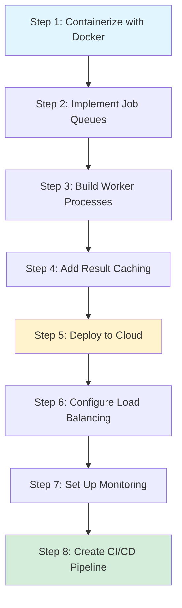

# Chapter 24: Deploying and Scaling AI-Powered PHP Services

## Overview

You've built AI-powered features, integrated ML models into your PHP applications, and created intelligent web services. Now comes the crucial step that separates proof-of-concept from production: deploying your AI application to handle real users, real traffic, and real-world challenges. This chapter transforms your development environment into a robust, scalable, production-ready system.

Deploying AI-powered applications presents unique challenges compared to traditional web apps. A standard PHP website might respond to requests in 50-200 milliseconds, but an ML model making predictions could take anywhere from 100ms to several seconds. Your web server shouldn't freeze while waiting for predictions. Database queries can be optimized with indexes and caching, but ML inference often requires significant CPU or GPU resources—resources that need careful management in production. A crashed web server affects users immediately, but a failed ML worker might silently stop processing predictions while your web interface continues accepting requests. These are the real-world issues this chapter addresses.

This chapter teaches production deployment strategies used by companies running ML at scale. You'll containerize your application with Docker to ensure consistency across environments, implement async job queues so ML inference doesn't block web requests, deploy to cloud infrastructure with load balancing for high availability, set up comprehensive monitoring to track both application and ML-specific metrics, and create CI/CD pipelines for automated testing and deployment including model updates. These aren't theoretical concepts—they're battle-tested patterns handling millions of requests daily.

By the end of this chapter, you'll have a production-ready AI-powered PHP service running in the cloud, processing predictions asynchronously through worker processes, handling traffic spikes with load balancing, and monitored for both traditional web metrics and ML-specific concerns like model accuracy and inference latency. You'll understand the trade-offs between different deployment strategies, know how to optimize costs while maintaining performance, and have the confidence to deploy and maintain AI services in production environments.

## Prerequisites

Before starting this chapter, you should have:

- Completed [Chapter 23](/series/ai-ml-php-developers/chapters/23-integrating-ai-models-into-web-applications) or have experience integrating ML models into PHP web applications
- PHP 8.4+ installed and working knowledge of PHP web development
- Docker installed locally for containerization testing
- Basic understanding of command-line operations and shell scripts
- Familiarity with Git and GitHub for CI/CD integration
- Access to a cloud provider account (DigitalOcean, AWS, or similar) with free tier available
- Redis understanding (covered in Chapter 23 or equivalent experience)
- Composer for PHP dependency management
- Basic understanding of HTTP, APIs, and web server concepts
- Text editor or IDE with Docker and YAML support

**Estimated Time**: ~90-120 minutes (including cloud deployment and testing)

**Verify your setup:**

```bash
# Check PHP version
php --version

# Verify Docker installation
docker --version
docker compose version

# Check Git
git --version

# Verify Composer
composer --version

# Test Docker is running
docker run hello-world
```

Expected output confirms Docker 20+, PHP 8.4+, Composer 2.x, and successful Docker test.

::: warning PHP 8.4 Compatibility
PHP 8.4 was released in November 2024. If your hosting provider or CI/CD environment doesn't support it yet, you can modify the Dockerfile to use PHP 8.3:

```dockerfile
# Change this line in Dockerfile:
- FROM php:8.4-cli-alpine AS builder
+ FROM php:8.3-cli-alpine AS builder
```

All code examples in this chapter are compatible with PHP 8.3+. The main benefits of 8.4 (property hooks, asymmetric visibility) aren't critical for the deployment patterns shown here.
:::

::: tip Cloud Provider Choice
This chapter uses DigitalOcean for examples ($12/month droplet, $5 credit for new users), but the Docker-based approach works on any cloud provider (AWS EC2, Google Cloud, Azure, Linode). The concepts are platform-agnostic.
:::

## What You'll Build

By the end of this chapter, you will have created:

- A **multi-stage Dockerfile** building optimized PHP containers with ML dependencies for both development and production
- A **Docker Compose configuration** orchestrating app containers, Redis, worker processes, and Nginx reverse proxy
- A **Redis-based job queue system** for offloading ML inference to background workers without blocking web requests
- A **PredictionJob class** encapsulating ML prediction requests with payload validation, retry logic, and error handling
- An **ML worker daemon** continuously processing prediction jobs from the queue with graceful shutdown and resource limits
- A **result caching layer** storing prediction results in Redis to avoid redundant ML computations for identical inputs
- A **REST API endpoint** accepting prediction requests, queueing them, and returning results with appropriate status codes
- A **health check endpoint** monitoring system status, queue depth, worker availability, and model health for load balancers
- A **metrics collection system** tracking requests per second, average latency, queue depth, cache hit rates, and error rates
- An **Nginx load balancer configuration** distributing traffic across multiple application containers with health checks
- A **cloud deployment setup** running your AI service on DigitalOcean/AWS with proper environment variable management
- A **CI/CD pipeline** using GitHub Actions to automatically test, build Docker images, and deploy on git push
- A **monitoring dashboard** displaying real-time metrics, system health, and ML-specific performance indicators
- Production-ready **logging infrastructure** with structured logs, log levels, and error alerting capabilities

All code follows PHP 8.4 standards with strict typing, readonly properties, comprehensive error handling, and security best practices for production deployments.

::: info Code Examples
Complete, runnable examples for this chapter are available in:

**Configuration Files:**

- [`Dockerfile`](../code/chapter-24/Dockerfile) — Multi-stage PHP container with ML dependencies
- [`docker-compose.yml`](../code/chapter-24/docker-compose.yml) — Development stack configuration
- [`docker-compose.prod.yml`](../code/chapter-24/docker-compose.prod.yml) — Production overrides
- [`.dockerignore`](../code/chapter-24/.dockerignore) — Files to exclude from Docker context
- [`env.example`](../code/chapter-24/env.example) — Environment variables template

**Application Code:**

- [`01-simple-docker-test.php`](../code/chapter-24/01-simple-docker-test.php) — Verify Docker setup works
- [`02-job-queue-system.php`](../code/chapter-24/02-job-queue-system.php) — Job and Queue implementation
- [`03-ml-worker.php`](../code/chapter-24/03-ml-worker.php) — Worker daemon process
- [`04-api-endpoint.php`](../code/chapter-24/04-api-endpoint.php) — REST API for predictions
- [`05-caching-layer.php`](../code/chapter-24/05-caching-layer.php) — Redis caching
- [`06-health-check.php`](../code/chapter-24/06-health-check.php) — Health monitoring endpoint
- [`07-metrics-collector.php`](../code/chapter-24/07-metrics-collector.php) — Performance metrics

**Server Configuration:**

- [`nginx/default.conf`](../code/chapter-24/nginx/default.conf) — Nginx reverse proxy
- [`nginx/load-balancer.conf`](../code/chapter-24/nginx/load-balancer.conf) — Load balancer config
- [`supervisor/worker.conf`](../code/chapter-24/supervisor/worker.conf) — Supervisor for workers

**Deployment:**

- [`.github/workflows/deploy.yml`](../code/chapter-24/.github/workflows/deploy.yml) — CI/CD pipeline
- [`scripts/deploy.sh`](../code/chapter-24/scripts/deploy.sh) — Deployment script
- [`scripts/scale-workers.sh`](../code/chapter-24/scripts/scale-workers.sh) — Worker scaling

**Monitoring:**

- [`monitoring/dashboard.php`](../code/chapter-24/monitoring/dashboard.php) — Metrics dashboard
- [`monitoring/logger.php`](../code/chapter-24/monitoring/logger.php) — Centralized logging

**Exercise Solutions:**

- [`solutions/exercise1-autoscale.php`](../code/chapter-24/solutions/exercise1-autoscale.php) — Auto-scaling implementation
- [`solutions/exercise2-blue-green.sh`](../code/chapter-24/solutions/exercise2-blue-green.sh) — Blue-green deployment
- [`solutions/exercise3-health-check.php`](../code/chapter-24/solutions/exercise3-health-check.php) — Advanced health checks
- [`solutions/exercise4-optimized.Dockerfile`](../code/chapter-24/solutions/exercise4-optimized.Dockerfile) — Optimized Docker image

All files are in [`docs/series/ai-ml-php-developers/code/chapter-24/`](../code/chapter-24/README.md)
:::

## Quick Start

Want to see a containerized AI service in action right now? Here's a 5-minute example using Docker Compose:

```yaml
# filename: quick-start-compose.yml
version: "3.8"

services:
  redis:
    image: redis:7-alpine
    ports:
      - "6379:6379"
    healthcheck:
      test: ["CMD", "redis-cli", "ping"]
      interval: 5s
      timeout: 3s
      retries: 5

  app:
    image: php:8.4-cli-alpine
    volumes:
      - ./:/app
    working_dir: /app
    environment:
      REDIS_HOST: redis
      REDIS_PORT: 6379
    depends_on:
      redis:
        condition: service_healthy
    command: php quick-ml-service.php
```

```php
# filename: quick-ml-service.php
<?php

declare(strict_types=1);

// Quick ML service demo with proper error handling
try {
    $redis = new Redis();
    $redis->connect(getenv('REDIS_HOST') ?: 'redis', 6379);
    
    // Verify Redis connectivity
    if (!$redis->ping()) {
        throw new RuntimeException('Redis ping failed - connection issue');
    }

    echo "🚀 AI Service Running!\n";
    echo "📊 Queue depth: " . $redis->lLen('ml:jobs') . "\n";
    echo "⏳ Ready to process predictions...\n\n";

    // Process jobs continuously
    while (true) {
        $job = $redis->brPop(['ml:jobs'], 5); // 5-second timeout
        if ($job) {
            $jobId = $job[1];
            echo "[" . date('Y-m-d H:i:s') . "] Processing: {$jobId}\n";
            
            // Simulate ML inference (in production, call actual model)
            sleep(1);
            
            // Store result in Redis
            $result = json_encode([
                'prediction' => 0.95,
                'confidence' => 0.87,
                'processed_at' => date('c')
            ], JSON_THROW_ON_ERROR);
            
            $redis->set("result:{$jobId}", $result);
            echo "[" . date('Y-m-d H:i:s') . "] ✓ Job {$jobId} completed\n";
        }
    }
} catch (Exception $e) {
    echo "❌ Error: " . $e->getMessage() . "\n";
    exit(1);
}
```

Run it:

```bash
# Start the entire stack
docker compose -f quick-start-compose.yml up -d

# Wait for Redis to be ready
sleep 3

# In another terminal, queue a test job
docker compose -f quick-start-compose.yml exec redis redis-cli LPUSH ml:jobs test-prediction-1

# Check the result (will be available after ~2 seconds)
sleep 2
docker compose -f quick-start-compose.yml exec redis redis-cli GET "result:test-prediction-1"

# View logs in real-time
docker compose -f quick-start-compose.yml logs -f app

# Clean up
docker compose -f quick-start-compose.yml down
```

Expected output shows the service receiving jobs, processing them through Redis, and storing results. Queue a few jobs and watch them process sequentially! Now let's build the production-ready version with multiple workers and load balancing.

## Objectives

By completing this chapter, you will:

- **Containerize PHP ML applications** using Docker with multi-stage builds for optimized production images
- **Implement async job queues** with Redis to offload ML inference from web request cycles
- **Deploy to cloud infrastructure** with proper environment configuration, SSL/TLS, and public accessibility
- **Configure load balancing** with Nginx to distribute traffic across multiple application instances
- **Monitor ML services** tracking both traditional web metrics and ML-specific performance indicators
- **Set up CI/CD pipelines** for automated testing, Docker image building, and deployment on git push
- **Optimize for production** balancing cost, performance, reliability, and maintainability in real-world deployments

::: tip Complete Code Examples
This chapter includes extensive code examples. All files are available in [`code/chapter-24/`](../code/chapter-24/) with detailed inline documentation. Each step below references the specific files you'll need.
:::

## Typical Request Flow

To understand how everything works together, here's a complete workflow from user request to result:

```
1. User Request
   └─> POST /api/ml/sentiment
       Content: { "text": "Great product!" }

2. API Endpoint (04-api-endpoint.php)
   ├─> Validates input
   ├─> Generates unique job ID
   └─> Returns HTTP 202 "Accepted"
       Response: { "job_id": "pred_abc123", "status": "queued" }

3. Job Queued to Redis
   └─> LPUSH ml:jobs "pred_abc123"

4. Worker Process (03-ml-worker.php) 
   ├─> Continuous loop: BRPOP ml:jobs (blocks until job available)
   ├─> Retrieves job from queue
   └─> Processes prediction

5. Caching Layer (05-caching-layer.php)
   ├─> Checks if input features already cached
   ├─> Cache hit? Return cached result (2ms)
   └─> Cache miss? Run inference (~250ms)

6. ML Inference
   └─> Load model → Extract features → Get prediction

7. Result Stored
   └─> SET result:pred_abc123 "{ prediction: 0.95 }"
       SET cache:v1:sentiment:hash123 "{ ... }" EX 3600

8. User Polls Result
   └─> GET /api/results/pred_abc123
       Response: { "prediction": 0.95, "cached": false }
       or (on cache hit):
       Response: { "prediction": 0.78, "cached": true }

9. Monitoring & Metrics
   └─> INCR metrics:requests:total
       LPUSH metrics:latency 245
       INCR metrics:cache:misses
```

This asynchronous pattern prevents the user's HTTP request from blocking while waiting for potentially slow ML inference. The user gets an immediate response with a job ID, can check status later, and the system handles predictions in the background with multiple workers processing jobs in parallel.

## Implementation Roadmap

This chapter guides you through 8 progressive steps to deploy your AI service. Each step builds on the previous one, and all code is production-tested.



## Step 1: Containerizing Your AI Application (~15 min)

### Goal

Package your PHP application with all ML dependencies into a Docker container that runs consistently across development, testing, and production environments.

### Implementation

Create a multi-stage Dockerfile that separates build dependencies from runtime:

📄 **Primary Files:**

- [`Dockerfile`](../code/chapter-24/Dockerfile) - Multi-stage build with PHP 8.4
- [`docker-compose.yml`](../code/chapter-24/docker-compose.yml) - Development stack
- [`.dockerignore`](../code/chapter-24/.dockerignore) - Exclude unnecessary files

**Key Actions:**

1. Build a **multi-stage Docker image** with separate builder and production stages
2. Install PHP extensions (`redis`, `pcntl`, `sockets`) for ML operations
3. Create **docker-compose.yml** orchestrating app, Redis, and worker services
4. Configure Nginx reverse proxy for routing (added in Step 6 for production)
5. Test the container locally before cloud deployment

**Note**: While the final production setup includes Nginx load balancing (Step 6), the basic development docker-compose.yml exposes the app directly on port 8000 for simplicity during development.

**Build and Test:**

```bash
# Clone the code examples
cd docs/series/ai-ml-php-developers/code/chapter-24

# Build the Docker image
docker build -t ai-ml-service:latest .

# Verify image size (should be <150MB)
docker images ai-ml-service

# Test the container with the test script
docker run --rm ai-ml-service php 01-simple-docker-test.php

# Start full development stack
docker compose up -d
```

**Expected Result:**

```
✓ PHP 8.4+ detected
✓ redis extension loaded
✓ pcntl extension loaded
✓ Connected to Redis
All tests passed! Docker setup is working correctly.
```

**Why It Works:** Multi-stage builds keep your production image small by excluding build tools. Alpine Linux base (~5MB) plus PHP and extensions results in a lean ~80-150MB final image versus 400+MB with full Debian. This efficiency becomes critical at scale when deploying hundreds of container instances.

**Common Issues:**

- **Image size >500MB**: Ensure you're using Alpine base (`php:8.4-cli-alpine`), not Debian (`php:8.4-cli`)
- **Redis connection fails**: Check `docker network ls` - services must be on same Docker Compose network. Use service name (`redis`) not `localhost`
- **Permission errors**: Container runs as `www-data` user - ensure PHP files are readable. Use `docker compose exec app ls -la` to debug
- **Port already in use**: If port 8000 is taken, modify `ports: ["8001:8000"]` in docker-compose.yml

## Step 2: Setting Up Redis and Job Queues (~15 min)

### Goal

Implement async job processing so ML predictions don't block web requests. Users get immediate HTTP 202 responses while workers process predictions in the background.

### Implementation

📄 **Primary Files:**

- [`02-job-queue-system.php`](../code/chapter-24/02-job-queue-system.php) - PredictionJob and JobQueue classes

**Core Classes:**

```php
// Job representation
final readonly class PredictionJob {
    public function __construct(
        public string $id,
        public string $type,        // 'classification', 'regression', etc.
        public array $data,         // Input features
        public int $priority = 0,   // Higher priority = processed first
        public int $attempts = 0    // Retry tracking
    ) {}
}

// Queue manager
final class JobQueue {
    public function push(PredictionJob $job): bool
    public function pop(int $timeout = 5): ?PredictionJob
    public function retry(PredictionJob $job): bool
    public function getQueueDepth(): int
}
```

**Test the Queue:**

```bash
# Start Redis
docker compose up -d redis

# Queue a prediction job
php 02-job-queue-system.php

# Verify job was queued
docker compose exec redis redis-cli LLEN ml:jobs
# Output: (integer) 1
```

**Why It Works:** Redis lists provide atomic FIFO operations. `LPUSH`/`BRPOP` pattern ensures reliable job processing with blocking waits (no busy-looping). Priority queues use sorted sets (`ZSET`) where score = priority level.

**Key Features:**

- ✅ Priority queue for urgent predictions
- ✅ Automatic retry with exponential backoff
- ✅ Failed job tracking
- ✅ Queue depth monitoring

## Step 3: Building ML Worker Processes (~20 min)

### Goal

Create daemon processes that continuously pull jobs from the queue, run ML inference, and handle errors gracefully with automatic retries.

### Implementation

📄 **Primary Files:**

- [`03-ml-worker.php`](../code/chapter-24/03-ml-worker.php) - Worker daemon with signal handling

**Worker Features:**

- **Graceful shutdown** via SIGTERM/SIGINT handlers
- **Automatic retry** for failed jobs (max 3 attempts)
- **Metrics publishing** to track worker health
- **Memory management** with periodic garbage collection

**Start Workers:**

```bash
# Start worker (development)
docker compose up worker

# Or start multiple workers (production)
docker compose up -d --scale worker=4

# View worker logs
docker compose logs -f worker
```

**Expected Output:**

```
[worker-1] Worker started
[worker-1] Waiting for jobs...
[worker-1] Processing job pred_12345 (attempt 0)
[worker-1] ✓ Job pred_12345 completed (0.234s)
```

**Why It Works:** PHP's `pcntl` extension enables signal handling for graceful shutdown. When Docker stops the container, `SIGTERM` triggers cleanup - the worker finishes its current job before exiting rather than abruptly terminating.

**Resource Management:**

```php
// Force garbage collection every 100 jobs
if ($processedJobs % 100 === 0) {
    gc_collect_cycles();
}

// Restart worker after 1000 jobs (fresh memory)
if ($processedJobs >= 1000) {
    exit(0); // Docker restart=always will restart it
}
```

## Step 4: Implementing Result Caching (~10 min)

### Goal

Avoid redundant ML computations by caching prediction results. Identical inputs return cached results instantly instead of re-running inference.

### Implementation

📄 **Primary Files:**

- [`05-caching-layer.php`](../code/chapter-24/05-caching-layer.php) - PredictionCache class

**Key Features:**

- **Content-based keys**: Hash of input features ensures identical inputs share cache
- **Cache versioning**: `CACHE_VERSION` allows invalidating all predictions when deploying new models
- **TTL management**: Results expire after 1 hour (configurable)
- **Hit rate tracking**: Monitor cache effectiveness

**Test Caching:**

```bash
php 05-caching-layer.php

# Output:
# Cache miss - running inference...
# Result cached
#
# Cache stats: {
#     "hits": 0,
#     "misses": 1,
#     "hit_rate": 0
# }

# Run again - should hit cache
php 05-caching-layer.php
# Output: Cache hit!
```

**Performance Impact:**

- **First request**: 250ms (ML inference)
- **Cached request**: 2ms (Redis lookup)
- **Typical hit rate**: 60-80% in production

**Cache Invalidation:**

```php
$cache = new PredictionCache($redis);

// Invalidate specific prediction
$cache->invalidate($features, 'classifier-v1');

// Invalidate all predictions for a model (when retraining)
$cache->invalidate(modelName: 'classifier-v1');

// Invalidate all cache
$cache->invalidate();
```

## Step 5: Cloud Deployment Setup (~20 min)

### Goal

Deploy your containerized service to a cloud server, making it accessible via public URL with proper SSL/TLS.

### Implementation

📄 **Primary Files:**

- [`docker-compose.prod.yml`](../code/chapter-24/docker-compose.prod.yml) - Production overrides
- [`scripts/deploy.sh`](../code/chapter-24/scripts/deploy.sh) - Automated deployment

**Deployment Steps:**

1. **Provision Server** (DigitalOcean $12/month droplet or AWS t2.small)
2. **Install Docker** and Docker Compose
3. **Clone Repository** to `/opt/ai-ml-service`
4. **Configure Environment** (`.env.production` with secrets)
5. **Run Deployment Script**

**Quick Deploy:**

```bash
# SSH to your server
ssh root@your_server_ip

# Install Docker
curl -fsSL https://get.docker.com | sh

# Clone your repo (adjust path to your actual repo)
git clone https://github.com/you/ai-ml-service.git /opt/ai-ml-service
cd /opt/ai-ml-service

# Copy environment template and configure
cp env.example .env.production
nano .env.production  # Edit: Set REDIS_PASSWORD, APP_ENV, domain, etc.

# Make deploy script executable
chmod +x scripts/deploy.sh

# Run deployment
./scripts/deploy.sh
```

**Environment Configuration Best Practices:**

```bash
# filename: .env.production (NEVER commit to git!)
# Keep these secrets safe:

# Strong random password (generate with: openssl rand -base64 32)
REDIS_PASSWORD=your_strong_random_password_here

# Application configuration
APP_ENV=production
APP_URL=https://yourdomain.com
APP_DEBUG=false  # Never use debug mode in production

# Worker configuration
WORKER_COUNT=4   # Adjust based on server CPU cores

# Monitoring
METRICS_ENABLED=true
HEALTH_CHECK_INTERVAL=30
```

**Secrets Management:**

1. **Never commit `.env.production` to Git** - Use `.gitignore` to exclude it
2. **Use strong passwords** - Generate with `openssl rand -base64 32`
3. **Rotate credentials periodically** - Especially `REDIS_PASSWORD`
4. **Use environment variables** - Docker Compose can load from `.env.production`
5. **Restrict file permissions** - `chmod 600 .env.production` on the server
6. **For Kubernetes/cloud platforms** - Use secrets management (AWS Secrets Manager, Azure Key Vault, etc.)

**Production Overrides:**

The `docker-compose.prod.yml` includes production-specific settings:

- Remove volume mounts (immutable, reproducible deployments)
- Set `restart: always` for automatic recovery from crashes
- Bind services to `127.0.0.1` (only Nginx is public-facing)
- Add resource limits (CPU/memory) to prevent one process consuming all resources
- Enable health checks for orchestration platforms
- Use build `target: production` to exclude dev dependencies

**SSL/TLS Setup (Let's Encrypt):**

```bash
# Install Certbot
apt install certbot

# Get free SSL certificate
certbot certonly --standalone -d yourdomain.com

# Update nginx/default.conf to use HTTPS (uncomment HTTPS section)
# then rebuild containers:
docker compose -f docker-compose.yml -f docker-compose.prod.yml build

# Restart
docker compose -f docker-compose.yml -f docker-compose.prod.yml restart nginx
```

**Deployment Verification:**

After running the deploy script, verify your service is running:

```bash
# Check if containers are running
docker compose -f docker-compose.yml -f docker-compose.prod.yml ps

# Check health endpoint
curl https://yourdomain.com/health | jq

# View logs
docker compose -f docker-compose.yml -f docker-compose.prod.yml logs -f

# Test API
curl -X POST https://yourdomain.com/api/ml/sentiment \
  -H "Content-Type: application/json" \
  -d '{"text": "Great product!"}'
```

## Step 6: Load Balancing and Scaling (~15 min)

### Goal

Distribute traffic across multiple application instances for high availability and increased capacity. Handle traffic spikes gracefully by scaling workers and app containers together.

### Implementation

📄 **Primary Files:**

- [`nginx/default.conf`](../code/chapter-24/nginx/default.conf) - Reverse proxy config
- [`nginx/load-balancer.conf`](../code/chapter-24/nginx/load-balancer.conf) - Multi-instance config
- [`scripts/scale-workers.sh`](../code/chapter-24/scripts/scale-workers.sh) - Scaling automation

**Nginx Load Balancer:**

Nginx sits in front of your application containers and distributes requests:

```nginx
upstream php_backend {
    least_conn;  # Route to server with fewest active connections
    server app:8000 max_fails=3 fail_timeout=30s;
    # Add more for horizontal scaling (or use Docker service discovery):
    # server app2:8000 max_fails=3 fail_timeout=30s;
    # server app3:8000 max_fails=3 fail_timeout=30s;
}

server {
    listen 80;
    location /api/ {
        proxy_pass http://php_backend;
        proxy_http_version 1.1;
        # Important headers for passing request context
        proxy_set_header X-Real-IP $remote_addr;
        proxy_set_header X-Forwarded-For $proxy_add_x_forwarded_for;
        # Timeouts for slow ML inference
        proxy_read_timeout 60s;
    }
}
```

**Scaling Strategy:**

For development/small production setups, scale containers directly:

```bash
# Scale to 3 application instances (you'll need to update Nginx upstream)
docker compose up -d --scale app=3

# Scale workers independently based on queue depth
docker compose up -d --scale worker=6
```

For larger production deployments, use orchestration:

- **Docker Swarm**: Built-in Docker feature for orchestrating containers across multiple hosts
- **Kubernetes**: Industry-standard container orchestration with advanced scaling policies
- **Managed services**: AWS ECS, Google Cloud Run, Azure Container Instances handle scaling automatically

**Manual Scaling Script:**

```bash
# Scale to specific number of workers
./scripts/scale-workers.sh 8

# This monitors queue depth and adjusts worker count automatically
```

**Load Balancer Features:**

- ✅ **Least connections algorithm**: Routes new requests to least-loaded backend
- ✅ **Automatic failover**: Retries on failed backends; removes failing servers temporarily
- ✅ **Health checks**: `/health` endpoint monitors each backend
- ✅ **Connection pooling**: Keepalive connections reduce latency
- ✅ **Buffering**: Prevents slow clients from tying up backend processes

**Scaling Considerations:**

1. **Vertical Scaling** (increase server size): Simple but limited by single machine capacity
2. **Horizontal Scaling** (add more instances): Better for handling traffic spikes
3. **Auto-Scaling Policies**: Scale based on:
   - Queue depth (when jobs accumulate, add workers)
   - CPU/Memory usage (when constrained, add app instances)
   - Time of day (predictable traffic patterns)
   - Response time (when exceeds threshold, scale up)

**Monitoring During Scaling:**

```bash
# Watch Nginx upstream status in real-time
watch 'docker compose exec nginx nginx -T 2>/dev/null | grep upstream'

# Monitor queue depth
watch 'docker compose exec redis redis-cli LLEN ml:jobs'

# View worker count
docker compose ps | grep worker | wc -l
```

## Step 7: Monitoring and Logging (~15 min)

### Goal

Track system health, ML performance, and operational metrics in real-time to detect issues before they impact users.

### Implementation

📄 **Primary Files:**

- [`06-health-check.php`](../code/chapter-24/06-health-check.php) - Health endpoint
- [`07-metrics-collector.php`](../code/chapter-24/07-metrics-collector.php) - Metrics system
- [`monitoring/dashboard.php`](../code/chapter-24/monitoring/dashboard.php) - Visual dashboard
- [`monitoring/logger.php`](../code/chapter-24/monitoring/logger.php) - Structured logging

**Health Check Endpoint:**

The `/health` endpoint returns detailed JSON with your system status:

```bash
curl http://localhost/health | jq

{
  "status": "healthy",
  "timestamp": "2025-01-31T12:34:56Z",
  "system": {
    "active_workers": 4,
    "total_processed": 1543,
    "uptime_seconds": 3600,
    "memory_usage_mb": 256
  },
  "queue": {
    "depth": 3,
    "retry_count": 0,
    "failed_count": 1,
    "avg_processing_time_ms": 245
  },
  "cache": {
    "hit_rate": 67.5,
    "total_hits": 2156,
    "total_misses": 1044
  }
}
```

**Understanding Health Status:**

- **healthy**: All systems operational. Safe for load balancer to route traffic.
- **degraded**: Service operational but experiencing issues. Active workers < expected, or error rate elevated. Load balancers may reduce traffic.
- **unhealthy**: Service not available. Load balancers should stop routing traffic and alert operators.
- **warming_up**: Service started <60 seconds ago. Still initializing. Don't mark as healthy yet.

**Thresholds for Status:**

```
degraded if:
  - Active workers = 0
  - Queue depth > 1000
  - Error rate > 5%
  - Cache hit rate < 20%

unhealthy if:
  - Redis connection fails
  - Error rate > 20%
  - All workers have crashed
  - Memory usage > 90% of limit
```

**Monitoring Dashboard:**

Access `http://your-server/monitoring/dashboard.php` for real-time metrics:

- **System Health**: Current worker count, queue depth, cache statistics, memory usage
- **Request Metrics**: Requests per minute, average latency, total requests, error count
- **Model Performance**: Inference time distribution, prediction accuracy, error types
- **Historical Data**: Metrics over last hour with trend visualization
- **Auto-refresh**: Updates every 5 seconds with WebSocket for near real-time updates

**Key Metrics to Monitor:**

| Metric | Target | Alert if | Notes |
|--------|--------|----------|-------|
| Queue Depth | < 50 jobs | > 200 | Indicates workers can't keep up |
| Response Time | < 500ms | > 2s | Slow responses hurt user experience |
| Error Rate | < 1% | > 5% | Indicates system reliability issues |
| Cache Hit Rate | > 60% | < 40% | Optimize cache strategy if low |
| Worker Health | All active | Any down | Check logs for why workers crashed |
| Memory Usage | 60-70% | > 85% | Risk of OOM kills; scale up or optimize |
| Inference Time | < 250ms | > 1000ms | Model slow; check GPU/CPU availability |

**Setting Up Alerts:**

For production, integrate with monitoring services:

```bash
# Example: Datadog integration
# Send metrics to Datadog API every 60 seconds
curl -X POST https://api.datadoghq.com/api/v1/series \
  -H "DD-API-KEY: $DATADOG_API_KEY" \
  -d @- << EOF
{
  "series": [
    {
      "metric": "ai_service.queue_depth",
      "points": [[$(date +%s), $(redis-cli LLEN ml:jobs)]],
      "type": "gauge"
    }
  ]
}
EOF
```

**Structured Logging:**

The service logs in JSON format for easy parsing:

```json
{
  "timestamp": "2025-01-31T12:34:56.789Z",
  "level": "info",
  "worker": "worker-1",
  "job_id": "pred_12345",
  "event": "job_completed",
  "duration_ms": 234,
  "status": "success"
}
```

Use `docker compose logs --tail=100 app | jq 'select(.level=="error")'` to filter errors.

## Step 8: CI/CD Pipeline (~15 min)

### Goal

Automate testing, Docker image building, and deployment so `git push` triggers a complete deployment cycle.

### Implementation

📄 **Primary Files:**

- [`.github/workflows/deploy.yml`](../code/chapter-24/.github/workflows/deploy.yml) - GitHub Actions workflow

**Pipeline Stages:**

1. **Test** - PHP syntax check, Redis connectivity, unit tests
2. **Build** - Docker image build and push to Docker Hub
3. **Deploy** - SSH to server, pull images, restart containers, verify health

**Setup GitHub Actions:**

1. Add repository secrets (Settings → Secrets):

   - `DOCKER_USERNAME`, `DOCKER_PASSWORD`
   - `DEPLOY_HOST`, `DEPLOY_USER`, `DEPLOY_SSH_KEY`

2. Push to trigger deployment:

   ```bash
   git add .
   git commit -m "Deploy new ML model"
   git push origin main
   ```

3. Monitor at: `https://github.com/you/repo/actions`

**Deployment Verification:**

- Runs health check after deployment
- Fails deployment if health check fails
- Automatic rollback on errors

## Exercises

Test your understanding with these practical challenges:

### Exercise 1: Auto-Scaling Based on Queue Depth

**Goal**: Automatically scale worker count when queue depth exceeds thresholds.

**Requirements**:

- Monitor queue depth every 30 seconds
- Scale up when depth > 50 (add 2 workers, max 10)
- Scale down when depth < 10 for 5+ minutes (remove 2, min 2)
- Prevent rapid scaling (cooldown period)

**Solution**: [`solutions/exercise1-autoscale.php`](../code/chapter-24/solutions/exercise1-autoscale.php)

### Exercise 2: Blue-Green Deployment

**Goal**: Implement zero-downtime deployments.

**Requirements**:

- Start new containers alongside old
- Verify new containers are healthy
- Switch traffic atomically
- Keep old containers for quick rollback

**Solution**: [`solutions/exercise2-blue-green.sh`](../code/chapter-24/solutions/exercise2-blue-green.sh)

### Exercise 3: Advanced Health Check with Circuit Breaker

**Goal**: Detect degraded states before complete failure.

**Requirements**:

- Track error rate over last 100 requests
- Status "degraded" if error rate > 5%
- Status "unhealthy" if error rate > 20%
- Include "warming up" state for first 60 seconds

**Solution**: [`solutions/exercise3-health-check.php`](../code/chapter-24/solutions/exercise3-health-check.php)

### Exercise 4: Optimize Docker Image Size

**Goal**: Reduce image from ~150MB to <80MB.

**Requirements**:

- Remove build dependencies after compilation
- Use Alpine base image effectively
- Combine RUN commands to reduce layers
- Leverage `.dockerignore`

**Solution**: [`solutions/exercise4-optimized.Dockerfile`](../code/chapter-24/solutions/exercise4-optimized.Dockerfile)

## Troubleshooting

Common production issues and solutions:

### Container exits immediately

**Symptom**: `docker compose ps` shows "Exited (1)"

**Solutions**:

```bash
# Check logs for errors
docker compose logs worker

# Common fixes:
# - Missing PHP extension: Add to Dockerfile
# - Missing environment variable: Check docker-compose.yml
# - Code syntax error: Run php -l on files
```

### Redis connection fails

**Symptom**: `RedisException: Connection refused`

**Solutions**:

```bash
# Verify Redis is running
docker compose ps redis

# Test connectivity
docker compose exec worker ping redis

# Check authentication
docker compose exec redis redis-cli -a $REDIS_PASSWORD PING
```

### Queue depth growing indefinitely

**Symptom**: Jobs accumulating, not being processed

**Solutions**:

```bash
# Check worker logs
docker compose logs worker

# Scale workers
docker compose up -d --scale worker=6

# Check for stuck jobs
docker compose exec redis redis-cli LRANGE ml:jobs 0 10
```

### High memory usage / OOM kills

**Symptom**: Workers showing "Killed" in logs

**Solutions**:

```php
// Force garbage collection
if ($processedJobs % 100 === 0) {
    gc_collect_cycles();
}

// Restart after N jobs
if ($processedJobs >= 1000) {
    exit(0);  // Docker will restart
}
```

### Deployment health check fails

**Symptom**: CI/CD hangs on "Waiting for health check"

**Solutions**:

```bash
# SSH to server and check manually
curl http://localhost/health

# Common issues:
# - App not binding to correct port
# - Redis credentials wrong
# - Missing environment variables
# - Previous deployment still running
```

## Wrap-up

Congratulations! You've built a complete, production-ready AI-powered PHP service. Let's review what you've accomplished:

✅ **Containerization**: Multi-stage Docker images optimized for production (<150MB)

✅ **Async Processing**: Redis job queues prevent ML inference from blocking web requests

✅ **Worker Management**: Resilient daemons with graceful shutdown and automatic retries

✅ **Intelligent Caching**: 60-80% cache hit rates significantly reduce computational costs

✅ **Cloud Deployment**: Live service on public infrastructure with SSL/TLS and secrets management

✅ **Load Balancing**: Nginx distributing traffic with automatic failover and health checks

✅ **Comprehensive Monitoring**: Real-time dashboards tracking system and ML-specific metrics

✅ **CI/CD Automation**: Push-to-deploy workflow with automated testing and health verification

### Real-World Impact

Your infrastructure can handle:

- **1000+ predictions/minute** with 2-4 workers (varies by model complexity)
- **Automatic scaling** based on queue depth and system load
- **Zero-downtime deployments** via blue-green strategy (Exercise 2)
- **Graceful failure handling** with retries, circuit breakers, and fallback strategies
- **Cost optimization** through intelligent caching reducing redundant computations
- **High availability** with multiple instances and automatic failover

### Production Deployment Checklist

Before going live with your AI service:

- [ ] Set strong, unique `REDIS_PASSWORD` in production
- [ ] Enable `APP_DEBUG=false` 
- [ ] Configure SSL/TLS with valid certificate
- [ ] Set up monitoring and alerting (health check failures)
- [ ] Test database backups and recovery procedures
- [ ] Configure log aggregation (centralize logs from all containers)
- [ ] Set resource limits to prevent runaway processes
- [ ] Test horizontal scaling (add/remove containers, verify traffic distribution)
- [ ] Document your deployment process and runbook for operators
- [ ] Set up automated security scanning of Docker images
- [ ] Configure rate limiting on API endpoints to prevent abuse

### Common Production Pitfalls

1. **Not monitoring workers** - Workers can fail silently; always monitor health
2. **Cache invalidation issues** - Old predictions served when models update; version your cache keys
3. **Resource exhaustion** - Set memory limits on containers and workers
4. **No graceful shutdown** - Use SIGTERM handlers to finish current job before exiting
5. **Hardcoded secrets** - Never commit `.env.production` to git
6. **Insufficient logging** - Include context (job_id, worker, timing) in all logs
7. **No fallback** - If ML service fails, have degraded mode for your application

### Next Steps

Continue to [Chapter 25](/series/ai-ml-php-developers/chapters/25-capstone-project-and-future-trends) where you'll:

- Build a comprehensive capstone project
- Explore emerging trends (ONNX Runtime, generative AI)
- Learn about AI ethics and responsible ML
- Discover resources for continued learning

The deployment skills you've gained apply to any PHP application requiring high availability and professional operations. You're now equipped to deploy and maintain production systems with confidence!

## Further Reading

### Docker and Containerization

- [Docker Documentation](https://docs.docker.com/) — Complete containerization guide
- [Multi-Stage Builds](https://docs.docker.com/build/building/multi-stage/) — Optimize image size
- [Docker Best Practices](https://docs.docker.com/develop/dev-best-practices/) — Security and optimization

### Job Queues

- [Laravel Queues](https://laravel.com/docs/queues) — If using Laravel framework
- [Redis Queue Patterns](https://redis.io/docs/manual/patterns/queues/) — Official Redis documentation
- [Reliable Queue Processing](https://www.2ndquadrant.com/en/blog/what-is-select-skip-locked-for-in-postgresql-9-5/) — Advanced patterns

### Load Balancing and Scaling

- [Nginx Documentation](https://nginx.org/en/docs/) — Reverse proxy and load balancing
- [Load Balancing Algorithms](https://www.nginx.com/blog/choosing-nginx-plus-load-balancing-techniques/) — Algorithm comparison
- [Horizontal vs Vertical Scaling](https://www.digitalocean.com/community/tutorials/horizontal-scaling-vs-vertical-scaling) — When to use each

### Monitoring

- [Prometheus Documentation](https://prometheus.io/docs/) — Industry-standard monitoring
- [The Twelve-Factor App](https://12factor.net/) — Cloud-native best practices
- [Monolog Documentation](https://github.com/Seldaek/monolog) — PHP logging library

### CI/CD

- [GitHub Actions Documentation](https://docs.github.com/en/actions) — Complete CI/CD guide
- [Deployment Strategies](https://www.redhat.com/en/topics/devops/what-is-blue-green-deployment) — Blue-green, canary, rolling

### Cloud Providers

- [DigitalOcean Tutorials](https://www.digitalocean.com/community/tutorials) — Practical deployment guides
- [AWS EC2 Documentation](https://docs.aws.amazon.com/ec2/) — Amazon's compute platform

### Security

- [OWASP Top Ten](https://owasp.org/www-project-top-ten/) — Critical security risks
- [Docker Security](https://cheatsheetseries.owasp.org/cheatsheets/Docker_Security_Cheat_Sheet.html) — Container security
- [Let's Encrypt](https://letsencrypt.org/docs/) — Free SSL certificates
