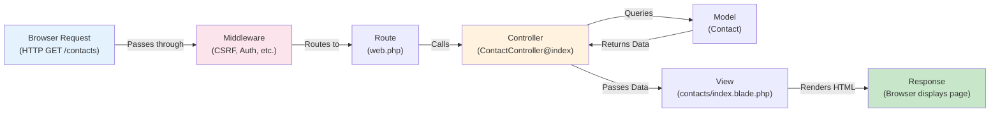

# Chapter 03: Laravel 12 Fundamentals & Project Structure

## Overview

Now that your Laravel development environment is running in Docker (from Chapter 02), it's time to explore what's actually inside your Laravel application. This chapter introduces Laravel's directory structure, explains the Model-View-Controller (MVC) architecture, and demonstrates how HTTP requests flow through the framework from browser to response.

In Chapter 02, you created the project structure and started the Docker containers. In Chapter 03, you'll examine every important directory and understand what each one does. You'll learn what each file contains, why files are organized this way, and crucially—where _your_ code goes when you build the CRM.

This chapter focuses on fundamentals: routing (how URLs map to code), controllers (where logic lives), views (what users see), and configuration (environment-specific settings). You'll create simple routes and a basic controller to see how Laravel handles web requests inside your running Docker environment. By understanding the request lifecycle, you'll know exactly what happens when a user visits a page in your CRM application.

**Key context from Chapter 02**: You have Sail containers running (`laravel.test`, `mysql`, `redis`, `mailhog`). When you run commands in this chapter with `sail artisan`, you're executing them _inside_ those containers. When you visit `http://localhost`, you're hitting your running Laravel app inside Docker. This foundation is crucial before building features.

These fundamentals form the foundation for everything that follows. Master them now, and the rest of the series will feel intuitive.

## Prerequisites

Before starting this chapter, you should have:

- ✓ **Completed [Chapter 02](/series/build-crm-laravel-12/chapters/02-setting-up-laravel-12-project-dev-environment)** — This chapter builds directly on Chapter 02. You created the project, installed Sail, and started Docker containers. All of that is required before proceeding.
- ✓ Laravel 12 project (`crm-app`) created with Sail configured
- ✓ **Sail containers currently running** — Run `sail up -d` if you stopped them after Chapter 02
- ✓ Laravel welcome page accessible at `http://localhost`
- ✓ Basic understanding of object-oriented PHP (classes, methods, namespaces)
- ✓ A text editor with your project open (VS Code, PhpStorm, etc.)
- ✓ Terminal access with `cd` into your `crm-app` project directory

**Estimated Time**: ~45 minutes (including hands-on steps and exercises)

**Critical Verification**: Run these commands _before_ starting:

```bash
# 1. Verify you're in the crm-app directory
pwd  # Should show: /path/to/crm-app (or C:\path\to\crm-app on Windows)

# 2. Verify Sail containers are running
sail ps

# You should see 4 containers with "Up" status: laravel.test, mysql, redis, mailhog
# If you see "command not found", you're not in the crm-app directory

# 3. Verify Laravel is accessible
curl http://localhost  # Should return HTML content
# Or visit http://localhost in your browser - should show the Laravel welcome page
```

If any verification fails, go back to [Chapter 02](/series/build-crm-laravel-12/chapters/02-setting-up-laravel-12-project-dev-environment) and review the troubleshooting sections.

## What You'll Build

By the end of this chapter, you will have:

- Deep understanding of Laravel's directory structure (`app/`, `routes/`, `resources/`, etc.) — the project Sail created for you in Chapter 02
- Knowledge of the MVC pattern and how Laravel implements it
- Created custom routes in `routes/web.php` (inside your running Docker environment)
- Generated a controller using Artisan commands (`sail artisan make:controller`)
- Created a Blade view that renders dynamic HTML
- Understanding of the full request lifecycle: browser request → route → controller → view → response
- Familiarity with essential Artisan commands for code generation
- A working "Hello CRM" page that demonstrates the complete flow from Chapter 02's Docker setup through request routing

## Objectives

- Navigate Laravel's project structure confidently
- Understand the purpose of each major directory (`app`, `routes`, `resources`, `config`, `database`)
- Create routes using Laravel's routing syntax
- Generate controllers with Artisan
- Return views from controllers using the `view()` helper
- Grasp the MVC pattern in Laravel's context
- Use Artisan commands to generate boilerplate code
- Understand where to place models, controllers, and views

## Quick Start

Want to see where this chapter takes you? Here's a 30-second overview of the end state:

```bash
# First, verify Docker is still running (from Chapter 02)
sail ps  # Shows 4 containers running

# By the end of this chapter, you'll have created:
sail artisan make:controller HelloController  # ✓ Generated (inside Docker)
# routes/web.php → /hello-crm route          # ✓ Created
# resources/views/hello.blade.php             # ✓ Created
# Visit http://localhost/hello-crm           # ✓ Working! (served by Docker)
```

You'll understand:

- How URLs map to routes
- How routes call controllers
- How controllers render views
- How Blade templates work

**Remember**: Every `sail artisan` command and every `http://localhost` request is executing inside your Docker containers from Chapter 02. This is exactly how Laravel applications work in production.

This foundation applies to every feature you'll build in the CRM. The MVC pattern you'll learn is used millions of times daily in Laravel applications worldwide.

## Laravel Directory Structure

When you created your Laravel project with Sail, the installer generated a specific directory structure. Understanding each directory's purpose is crucial - it tells you where to place models, controllers, views, and configuration files. Here's a comprehensive breakdown:

### Application Code: `app/` Directory

Your custom application logic lives here. This is where **you** write code.

| Directory           | Purpose                                                | Example Files                                 |
| ------------------- | ------------------------------------------------------ | --------------------------------------------- |
| `Http/Controllers/` | Handle HTTP requests and return responses              | `ContactController.php`, `DealController.php` |
| `Http/Middleware/`  | Filter and modify requests before reaching controllers | `Authenticate.php`, `VerifyTeamBelongsTo.php` |
| `Models/`           | Eloquent ORM classes representing database tables      | `Contact.php`, `Deal.php`, `Company.php`      |
| `Providers/`        | Bootstrap application services and bind dependencies   | `AppServiceProvider.php`                      |
| `Console/Commands/` | Custom Artisan CLI commands                            | `ProcessMonthlyReports.php`                   |
| `Events/`           | Define events that something important happened        | `ContactCreated.php`                          |
| `Listeners/`        | Handle events when they're fired                       | `SendContactNotification.php`                 |
| `Jobs/`             | Background jobs for async processing                   | `SendEmailReminder.php`                       |
| `Exceptions/`       | Custom exception classes                               | `TeamAccessDenied.php`                        |
| `Services/`         | Business logic organized by feature (optional)         | `ContactService.php`                          |
| `Traits/`           | Reusable code shared across multiple classes           | `HasTeamAccess.php`                           |

**Pro Tip**: The `Models/`, `Controllers/`, and `Services/` directories are where you'll spend most of your time building the CRM.

### Routing: `routes/` Directory

Define all URLs your application responds to:

| File           | Purpose                                      | Protection                            |
| -------------- | -------------------------------------------- | ------------------------------------- |
| `web.php`      | Browser-based routes (pages, forms)          | ✅ CSRF protection, sessions, cookies |
| `api.php`      | API routes for mobile apps, external clients | ❌ Stateless, token-based             |
| `console.php`  | Scheduled tasks and background jobs          | N/A (CLI only)                        |
| `channels.php` | WebSocket broadcast channels for real-time   | N/A (WebSockets only)                 |

**Example usage in this CRM**:

- `web.php` — `/dashboard`, `/contacts`, `/deals`
- `api.php` — `/api/contacts`, `/api/deals` (for mobile or external integrations)

### Frontend Assets: `resources/` Directory

UI code and static assets:

| Directory | Purpose                                      | Compilation                         |
| --------- | -------------------------------------------- | ----------------------------------- |
| `views/`  | Blade template files (HTML + PHP)            | Compiled server-side                |
| `js/`     | React components and JavaScript              | Compiled by Vite to `public/build/` |
| `css/`    | Tailwind CSS and custom styles               | Compiled by Vite to `public/build/` |
| `lang/`   | Translation files for multi-language support | Loaded at runtime                   |

**In your CRM**: You'll use `js/` for React components (ContactList.tsx, DealBoard.tsx) and `css/` for custom Tailwind styles.

### Configuration: `config/` Directory

Settings that change per environment (development, staging, production):

| File           | Configures                                     |
| -------------- | ---------------------------------------------- |
| `app.php`      | App name, timezone, debug mode                 |
| `database.php` | MySQL connection details (reads from `.env`)   |
| `cache.php`    | Cache driver (Redis, file, etc.)               |
| `queue.php`    | Background job queue configuration             |
| `mail.php`     | Email service (SMTP, Mailgun, etc.)            |
| `auth.php`     | Authentication settings                        |
| `session.php`  | Session storage (cookies, Redis, etc.)         |
| `services.php` | Third-party service credentials (Stripe, etc.) |

**Important**: Configuration values come from `.env` file. Never hardcode secrets like API keys—use `env('STRIPE_KEY')` instead.

### Database: `database/` Directory

Schema versioning and data management:

| Subdirectory  | Purpose                                  | Files                                     |
| ------------- | ---------------------------------------- | ----------------------------------------- |
| `migrations/` | SQL schema changes (version-controlled)  | `2024_01_15_create_contacts_table.php`    |
| `seeders/`    | Populate database with initial/test data | `ContactSeeder.php`, `DatabaseSeeder.php` |
| `factories/`  | Generate fake data for testing           | `ContactFactory.php`                      |

**In your CRM**: You created migrations in Chapter 05 (contacts, companies, deals tables). You'll create seeders and factories here later for testing.

### Runtime Files: `storage/` Directory

Temporary files generated during application operation:

| Subdirectory | Contains                            | Example               |
| ------------ | ----------------------------------- | --------------------- |
| `logs/`      | Application error and activity logs | `laravel.log`         |
| `app/`       | Generated files, uploads            | User avatars, reports |
| `framework/` | Cache, compiled views, sessions     | Temporary data        |

**Note**: This directory must be writable by your web server. In Docker, Sail handles this automatically.

### Tests: `tests/` Directory

Automated tests ensuring your code works correctly:

| Subdirectory | Type              | Purpose                                             |
| ------------ | ----------------- | --------------------------------------------------- |
| `Feature/`   | Integration tests | Test full features: "User can create contact"       |
| `Unit/`      | Unit tests        | Test individual functions: "calculateTotal() works" |

**You'll add tests here in Chapter 31.**

### Web Root: `public/` Directory

Everything accessible directly from the browser:

| File/Dir            | Purpose                                               |
| ------------------- | ----------------------------------------------------- |
| `index.php`         | Laravel's entry point—all requests route through here |
| `build/`            | Compiled React + CSS (generated by Vite)              |
| `images/`, `fonts/` | Static assets (optional)                              |

**Important**: This is the only directory users can directly access. Everything else is hidden for security.

### Bootstrap: `bootstrap/` Directory

Framework initialization (rarely modified):

| File      | Purpose                         |
| --------- | ------------------------------- |
| `app.php` | Initializes Laravel application |
| `cache/`  | Cached framework configuration  |

### Dependencies: `vendor/` Directory

Composer packages (auto-installed, never edit):

- Contains all third-party PHP libraries
- Installed via `composer install`
- Included in `.gitignore` (not committed)

### Summary: Where You'll Spend Your Time

**Most of your CRM development:**

- `app/Models/` — Define Contact, Deal, Company models
- `app/Http/Controllers/` — Handle /contacts, /deals URLs
- `resources/js/` — Build React components
- `routes/web.php` — Define which URL goes to which controller
- `database/migrations/` — Structure your database (done in Chapter 05)

**Occasional work:**

- `config/` — Add configuration when integrating services
- `resources/views/` — Blade layouts (if not using React)
- `tests/` — Write tests for features (Chapter 31)
- `database/seeders/` — Populate test data

**Rarely modified:**

- `vendor/`, `bootstrap/`, `public/index.php` — Framework internals

**Pro Development Tip**: When you don't know where code should go, ask: "Is this user-facing (routes → controllers)? Data-related (models)? Visual (components)? Business logic (services)?" The directory structure will guide you.

::: tip
**Convention Over Configuration**: Laravel uses naming conventions to eliminate boilerplate. If you follow these conventions, Laravel automatically finds and loads your files. A controller named `ContactController` is automatically found in `app/Http/Controllers/`. A model named `Contact` is found in `app/Models/`. This "magic" works through Laravel's class autoloading.
:::

**Key Convention**: Application code goes in `app/`, front-end views in `resources/views/`, routes in `routes/web.php`, and configuration in `config/`. Follow these patterns, and your code will feel like every other Laravel project.

## What's New in Laravel 12

Before diving into MVC, it's worth understanding what Laravel 12 brings to the table. If you're coming from an earlier Laravel version (or first time with Laravel), here are the key improvements:

### Laravel 12 Highlights

**Performance Improvements**:

- ⚡ Faster route caching and compilation
- ⚡ Optimized query execution
- ⚡ Better memory usage

**Developer Experience**:

- 🎯 Improved error messages with helpful suggestions
- 🎯 Better IDE support and type hints
- 🎯 Simplified configuration for common tasks

**Type Safety**:

- 📋 Better typed method signatures throughout
- 📋 Stricter validation out of the box
- 📋 Union types in more places

**Database & ORM**:

- 📊 Improved Eloquent query performance
- 📊 Better relationship loading strategies
- 📊 Enhanced query builder methods

**Async & Jobs**:

- 🔄 Better queue handling
- 🔄 Improved async processing
- 🔄 Enhanced background job monitoring

**Why This Matters for Your CRM**:

For your project, you'll benefit from:

- **Better Performance**: Your CRM will handle thousands of contacts smoothly
- **Type Safety**: Fewer bugs due to strict type checking
- **Developer Experience**: Faster development with better error messages
- **Scalability**: Built-in optimizations for growing data

**You don't need to know all the details right now.** The framework handles most complexity automatically. Just know that Laravel 12 is modern, fast, and designed for production applications like your CRM.

---

## The MVC Pattern in Laravel

Laravel implements the Model-View-Controller (MVC) architectural pattern. Understanding this pattern is essential because it dictates how to organize your code and how requests flow through your application.

**Model** — Represents your data and database interactions. In Laravel, models are Eloquent ORM classes that map to database tables:

```php
// Example: app/Models/Contact.php
class Contact extends Model {
    // Represents the 'contacts' table
    // Methods for querying: Contact::all(), Contact::find(1), etc.
}
```

**View** — Displays data to the user as HTML. In Laravel, views are Blade template files:

```blade
<!-- resources/views/contacts/index.blade.php -->
<h1>{{ $title }}</h1>
<ul>
    @foreach($contacts as $contact)
        <li>{{ $contact->name }}</li>
    @endforeach
</ul>
```

**Controller** — Contains business logic and orchestrates Model and View interactions:

```php
// app/Http/Controllers/ContactController.php
class ContactController {
    public function index() {
        $contacts = Contact::all(); // Model
        $title = 'My Contacts';
        return view('contacts.index', compact('contacts', 'title')); // View
    }
}
```

::: tip Controller Response Types
While controllers often return views, they can return many things:

```php
// Return a Blade view
return view('contacts.index', ['contacts' => $contacts]);

// Return JSON (for APIs)
return response()->json(['contacts' => $contacts]);

// Redirect to another route
return redirect('/contacts');

// Return raw text/HTML
return 'Hello, World!';

// Download a file
return response()->download(storage_path('file.pdf'));
```

The example above uses `view()`, but you'll use all these patterns throughout the series.
:::

**How they work together** — Here's the request lifecycle from browser to response:



**Laravel extends traditional MVC** with several supporting components:

- **Middleware** — Filters requests before they reach your controller (authentication, CORS, etc.)
- **Service Providers** — Bootstrap application services and bind dependencies
- **Form Requests** — Validate user input before controller methods receive data
- **Resources** — Transform models into API responses

This structure creates separation of concerns: Models handle data, Views handle presentation, Controllers handle logic. When you follow this pattern, your code becomes maintainable, testable, and organized.

::: info Dependency Injection (Laravel Magic)
When you write a controller method like `public function index(Request $request)`, Laravel automatically creates a `Request` object and passes it to your method. This is called **dependency injection**—the framework "injects" dependencies your code needs, rather than you creating them yourself.

This works through Laravel's **service container**, which acts like a factory for objects. Instead of doing:

```php
public function index() {
    $request = new Request(); // Manual creation
}
```

You let Laravel do it:

```php
public function index(Request $request) {
    // Laravel passes $request automatically
}
```

You'll see this pattern everywhere in Laravel: `Request`, `Illuminate\Auth\Middleware\Authenticate`, `UserRepository`, and more. The framework resolves these automatically based on type hints. We'll explore the service container in depth in Chapter 04.
:::

## Routing Basics

Routes are the entry points to your application. They map URLs to controller actions or closures. Every request starts with a route - it's the first thing Laravel checks when someone visits your site.

**Route Definition Syntax** — Routes are defined in `routes/web.php` using the `Route` facade:

```php
Route::get('/path', callback);
Route::post('/path', callback);
Route::put('/path', callback);
Route::patch('/path', callback);
Route::delete('/path', callback);
```

**HTTP Methods** — Each route responds to a specific HTTP method. `GET` requests retrieve data, `POST` creates data, `PUT`/`PATCH` updates data, `DELETE` removes data.

**Two Types of Routes**:

1. **Closure-based** — Route directly calls a function:

   ```php
   Route::get('/hello', function () {
       return 'Hello!';
   });
   ```

2. **Controller-based** — Route calls a controller method:
   ```php
   Route::get('/contacts', [ContactController::class, 'index']);
   ```

**Route Parameters** — Make routes dynamic by capturing URL segments:

```php
Route::get('/users/{id}', [UserController::class, 'show']);
// Matches /users/123 and passes 123 to the show() method
```

**Named Routes** — Give routes names for URL generation:

```php
Route::get('/contacts', [ContactController::class, 'index'])->name('contacts.index');

// In your view or controller:
<a href="{{ route('contacts.index') }}">View Contacts</a>
```

**Route Groups** — Group related routes with common middleware or prefixes:

```php
Route::prefix('admin')->group(function () {
    Route::get('/dashboard', [AdminController::class, 'dashboard']);
    Route::get('/users', [AdminController::class, 'users']);
});
// Creates routes: /admin/dashboard, /admin/users
```

**Web Routes Protection** — Routes in `routes/web.php` automatically have:

- **CSRF Protection** — Protection against cross-site request forgery
- **Session State** — User sessions available via `auth()` helper
- **Cookie Encryption** — Automatic cookie encryption/decryption

This is why `routes/web.php` is for traditional web applications and `routes/api.php` is for API endpoints (which need different protections).

::: info
**Routing in Chapter 04**: In this chapter, we're learning routing basics with simple examples. When we build the actual CRM in Chapter 04+, you'll use resource routing - a convention that automatically creates all CRUD routes with a single line: `Route::resource('contacts', ContactController)`. For now, master the fundamentals.
:::

## Step 1: Create Your First Route (~5 min)

### Goal

Add a simple route inside your running Laravel application and see how Docker is serving your requests.

### Actions

1. **Verify Sail is running** (from Chapter 02):

```bash
sail ps
# You should see all 4 containers running
```

2. **Open `routes/web.php`** in your editor. This file is part of the project Sail created in Chapter 02.

3. **Add a new route** after the existing welcome route:

```php
# filename: routes/web.php
Route::get('/hello', function () {
    return 'Hello from Laravel!';
});
```

3. **Save the file**. Laravel automatically detects route changes (no restart needed).

4. **Visit the route** by opening your browser and navigating to `http://localhost/hello`

### Expected Result

Your browser displays:

```
Hello from Laravel!
```

That's it! No HTML wrapper, just the raw string. This demonstrates the simplest possible route.

::: tip Verify Your Setup
If you don't see the message, check:

- Sail is running: `sail ps` should show 4 containers
- No typos in the route path: `/hello` (lowercase, no trailing slash)
- Browser shows `http://localhost/hello` in address bar
- No "404 Not Found" error (which means the route wasn't registered)
  :::

### Why It Works

When you visit `http://localhost/hello`:

1. Your browser makes an HTTP GET request to localhost
2. **Docker port forwarding** (configured in Chapter 02) routes this to your PHP container
3. Laravel's router inside the container checks `routes/web.php`
4. It finds the matching `GET /hello` route and calls the closure function
5. The closure returns the string `"Hello from Laravel!"`
6. Laravel converts that into an HTTP response
7. The response travels back through Docker to your browser
8. Your browser displays the text

This is the foundation of every web request: URL → Docker Port → Laravel Router → Route → Callback/Controller → Response → Browser.

This is exactly what will happen when you build the CRM. Users will visit routes like `/contacts` or `/deals`, and the same flow occurs inside your Docker containers.

### Troubleshooting

- **Error: "404 Not Found"** — The route doesn't exist or isn't registered. Verify:

  - Spelling matches exactly: `/hello` not `/Hello` or `/hello/`
  - Ensure Sail is running: `sail ps` should show containers
  - Check you edited the correct file: `routes/web.php` in your project root

- **Blank page or error** — Check your Sail logs for PHP errors:

  ```bash
  sail logs laravel.test
  ```

- **Route doesn't update** — Clear the route cache:
  ```bash
  sail artisan route:clear
  ```

## Step 2: Generate a Controller (~10 min)

### Goal

Use Artisan to generate a controller class and understand its structure.

### Actions

1. **Generate the controller** using Artisan inside the Sail container:

```bash
# Generate HelloController in app/Http/Controllers/
sail artisan make:controller HelloController
```

2. **Verify the file was created**. You should see:

```bash
   INFO  Controller [app/Http/Controllers/HelloController.php] created successfully.
```

3. **Open the generated file** at `app/Http/Controllers/HelloController.php` and examine its structure:

```php
# filename: app/Http/Controllers/HelloController.php
<?php

namespace App\Http\Controllers;

use Illuminate\Http\Request;

class HelloController extends Controller
{
    //
}
```

The important parts:

- **Namespace**: `App\Http\Controllers` - Tells Laravel where this class lives
- **Extends Controller**: Inherits Laravel's base controller functionality
- **Empty body**: Ready for you to add methods

4. **Add an index method** to the controller:

```php
public function index()
{
    return view('hello');
}
```

Your complete controller should look like:

```php
# filename: app/Http/Controllers/HelloController.php
<?php

namespace App\Http\Controllers;

use Illuminate\Http\Request;

class HelloController extends Controller
{
    public function index()
    {
        return view('hello');
    }
}
```

### Expected Result

A new controller file exists at `app/Http/Controllers/HelloController.php` with one `index()` method that returns a view.

### Why It Works

Artisan's `make:controller` command generates boilerplate code following Laravel conventions. The controller extends the base `Controller` class, which provides helper methods like `view()` for returning Blade templates.

The `view('hello')` helper tells Laravel to find and render the Blade template at `resources/views/hello.blade.php`. If that file doesn't exist yet (and it doesn't!), Laravel will throw an error - we'll create it in the next step.

The namespace and class name follow Laravel's PSR-4 autoloading standard. This allows Laravel to automatically find your controller when you reference it in your routes.

### Troubleshooting

- **Error: "Command not found"** — Ensure you're using `sail artisan`, not just `artisan`. Sail runs commands inside Docker containers.

- **"Target class [\App\Http\Controllers\HelloController] does not exist"** — This error appears when you try to use the controller in a route before the file exists. Make sure the `make:controller` command completed successfully.

- **Namespace errors in editor** — Your IDE might complain about the namespace. This is normal - you're inside a Laravel container. Trust that Laravel's autoloading handles it.

- **"Controller already exists"** — The file exists. Delete it or use `--force`:
  ```bash
  sail artisan make:controller HelloController --force
  ```

## Step 3: Create a Blade View (~10 min)

### Goal

Create a Blade template file and understand view file organization.

### Actions

1. **Create a new file** at `resources/views/hello.blade.php`

::: tip
The `.blade.php` extension is important! Without it, Laravel won't process Blade syntax.
:::

2. **Add the following HTML content** to the file:

```html
# filename: resources/views/hello.blade.php
<!DOCTYPE html>
<html lang="en">
  <head>
    <meta charset="UTF-8" />
    <meta name="viewport" content="width=device-width, initial-scale=1.0" />
    <title>Hello CRM</title>
    <style>
      body {
        font-family: system-ui;
        max-width: 600px;
        margin: 50px auto;
        text-align: center;
      }
      h1 {
        color: #2563eb;
      }
      p {
        color: #666;
        line-height: 1.6;
      }
    </style>
  </head>
  <body>
    <h1>Hello CRM!</h1>
    <p>This is your first Laravel view rendered from a controller.</p>
    <p><strong>Current Time:</strong> {{ now()->format('Y-m-d H:i:s') }}</p>
  </body>
</html>
```

3. **Key Blade syntax** to notice:

   - Blade echo syntax: `now()->format('Y-m-d H:i:s')`
   - It calls PHP's `now()` helper and formats the timestamp
   - Wrapped in curly braces to automatically escape content for security

4. **Save the file**

### Expected Result

A new file exists at `resources/views/hello.blade.php` with HTML and Blade syntax. When this view is rendered, it displays the current date and time.

### Why It Works

Blade is Laravel's templating engine. When you call `view('hello')` from a controller, Laravel:

1. Looks in `resources/views/` for a file named `hello.blade.php`
2. Compiles the Blade syntax to regular PHP
3. Executes the compiled PHP
4. Returns the HTML to the browser

Blade's echo syntax is specific - it outputs escaped HTML (protecting against XSS attacks). Blade provides many helpers:

- Output a variable: `$variable`
- `@foreach()` — Loop through arrays
- `@if()` — Conditional logic
- Call PHP functions: `now()`

We'll explore these in future chapters. For now, know that Blade makes templating easier and safer than raw PHP.

### Troubleshooting

- **Error: "View [hello] not found"** — The filename or location is wrong. Verify:

  - File is at exactly: `resources/views/hello.blade.php`
  - Filename matches the `view('hello')` call (no extension needed in the call)
  - You're in the correct project directory

- **Raw Blade syntax displayed on page** — The file is named `hello.php` instead of `hello.blade.php`. Rename it - the `.blade.php` extension is required for Blade compilation.

- **PHP error in template** — Check syntax in the Blade file. Common issues:

  - Unmatched braces in Blade syntax
  - Invalid PHP: use variables with `$` prefix

- **View displays but formatting looks wrong** — CSS not loading? That's OK for now - we'll add proper styling in later chapters. The important part is that the view loads.

## Step 4: Connect Route, Controller, and View (~10 min)

### Goal

Wire together all three components (route, controller, view) to demonstrate the complete MVC flow.

### Actions

1. **Update `routes/web.php`** to use the controller instead of a closure:

```php
# filename: routes/web.php
<?php

use Illuminate\Support\Facades\Route;
use App\Http\Controllers\HelloController;

Route::get('/', function () {
    return view('welcome');
});

Route::get('/hello-crm', [HelloController::class, 'index']);
```

Important points:

- Add the `use` statement at the top: `use App\Http\Controllers\HelloController;`
- The route syntax `[HelloController::class, 'index']` tells Laravel to call the `index()` method
- This replaces our closure-based route from Step 1

2. **Save the file**

3. **Open your browser** and navigate to `http://localhost/hello-crm`

4. **Observe the full MVC flow**:
   - Browser requests `/hello-crm`
   - Route matches and calls `HelloController@index`
   - Controller method returns `view('hello')`
   - Laravel finds `resources/views/hello.blade.php`
   - Blade compiles and renders HTML
   - Browser displays the "Hello CRM!" page with current timestamp

### Expected Result

Your browser displays:

```
Hello CRM!
This is your first Laravel view rendered from a controller.
Current Time: 2024-01-15 14:23:45
```

(The time will be your actual current time)

### Why It Works

This completes the MVC cycle you learned about earlier:

```
Browser Request
    ↓
Route (/hello-crm)
    ↓
Controller (HelloController::index)
    ↓
View (hello.blade.php)
    ↓
HTML Response
```

By using the controller-based route `[HelloController::class, 'index']`, you follow Laravel's conventions. The framework automatically:

1. Resolves the controller class from the namespace
2. Calls the specified method
3. Returns whatever the method returns (in this case, a view)

This pattern scales to complex applications. When you build the CRM dashboard, you'll follow the same flow - just with more logic in the controller and a more complex view.

### Troubleshooting

- **Error: "Target class [App\Http\Controllers\HelloController] does not exist"** — Add the `use` statement at the top of `routes/web.php`:

  ```php
  use App\Http\Controllers\HelloController;
  ```

- **Error: "View [hello] not found"** — Verify `resources/views/hello.blade.php` exists and has the `.blade.php` extension.

- **404 Not Found** — Check:

  - Route is registered: `sail artisan route:list | grep hello-crm`
  - Sail is running: `sail ps`
  - Route syntax is correct in `routes/web.php`

- **Blank page or different error** — Check Sail logs:

  ```bash
  sail logs laravel.test -f
  ```

- **Still seeing old route** — Clear the route cache:
  ```bash
  sail artisan route:clear
  ```

## Configuration & Environment

Laravel applications require different settings for different environments. Your local development machine, a staging server, and production all need different database credentials, API keys, and debug settings. This is where the environment configuration system comes in.

**The `.env` File** — This file stores environment-specific values:

```
APP_NAME="CRM App"
APP_DEBUG=true
APP_URL=http://localhost

DB_CONNECTION=mysql
DB_HOST=mysql
DB_PORT=3306
DB_DATABASE=crm_app
DB_USERNAME=sail
DB_PASSWORD=password

MAIL_MAILER=log
```

Key points:

- `.env` is **gitignored** (never committed to version control) because it contains secrets
- **Never hard-code credentials** in your code - use `.env` instead
- Each developer/environment has their own `.env` file with their own credentials

**Configuration Files** — The `config/` directory contains PHP files that read from `.env`:

```php
# config/app.php
return [
    'name' => env('APP_NAME', 'Laravel'),
    'debug' => env('APP_DEBUG', false),
    'url' => env('APP_URL', 'http://localhost'),
];
```

**Accessing Configuration** — Use the `config()` helper in your application:

```php
$appName = config('app.name');           // 'CRM App'
$debugMode = config('app.debug');        // true
$databaseHost = config('database.default'); // 'mysql'
```

**Best Practice**: Use `config()` in your code, never `env()` directly. Config files live in source code; `.env` lives only on each machine. This separation keeps code safe and portable.

**Environment-Specific Behavior** — With configuration, you can easily adjust application behavior:

```php
if (config('app.debug')) {
    // Show detailed error messages (development only!)
} else {
    // Show generic errors (production)
}
```

In Chapter 02, Sail automatically created your `.env` file from `.env.example`. This is the standard Laravel pattern - `.env.example` is committed with template values so new developers know what environment variables are needed.

::: warning
**Never commit `.env` to Git!** It contains database passwords and API keys. If you accidentally commit it, immediately rotate all credentials. Always use `.env.example` as your template instead.
:::

## Artisan Command Reference

Artisan is Laravel's command-line interface. You've already used it to generate a controller. Here's a quick reference of essential commands you'll use regularly:

**Code Generation Commands:**

| Command                                             | Purpose                           |
| --------------------------------------------------- | --------------------------------- |
| `sail artisan make:controller NameController`       | Generate a controller class       |
| `sail artisan make:model ContactModel`              | Generate an Eloquent model        |
| `sail artisan make:migration create_contacts_table` | Generate a database migration     |
| `sail artisan make:request StoreContactRequest`     | Generate a form request validator |
| `sail artisan make:middleware CheckPermission`      | Generate middleware class         |
| `sail artisan make:job ProcessContactImport`        | Generate a queued job             |

**Database Commands:**

| Command                                       | Purpose                               |
| --------------------------------------------- | ------------------------------------- |
| `sail artisan migrate`                        | Run all pending database migrations   |
| `sail artisan migrate:rollback`               | Rollback the last batch of migrations |
| `sail artisan seed`                           | Seed the database with test data      |
| `sail artisan db:seed --seeder=ContactSeeder` | Run a specific seeder                 |

**Development Commands:**

| Command                     | Purpose                                             |
| --------------------------- | --------------------------------------------------- |
| `sail artisan serve`        | Start the development server (not needed with Sail) |
| `sail artisan tinker`       | Interactive PHP REPL for testing code               |
| `sail artisan route:list`   | Display all registered routes                       |
| `sail artisan route:clear`  | Clear the route cache                               |
| `sail artisan config:clear` | Clear the configuration cache                       |
| `sail artisan cache:clear`  | Clear all application caches                        |

**Useful Flags:**

```bash
# Get help for any command
sail artisan make:controller --help

# Force overwrite if file exists
sail artisan make:controller HelloController --force

# Generate model with migration and factory
sail artisan make:model Contact -m -f
# -m = create migration, -f = create factory
```

**Pro Tip**: Run `sail artisan list` to see all available commands. Run `sail artisan help commandname` for detailed information about any command.

```bash
# View all available commands
sail artisan list

# Get detailed help
sail artisan help make:controller
```

In the next chapters, you'll use these commands frequently to scaffold your CRM application's models, controllers, and migrations.

## Exercises

### Exercise 1: Create an About Page

**Goal**: Practice the route → controller → view workflow independently

Create your own about page to reinforce what you've learned. You'll need:

1. A new route `/about` in `routes/web.php`
2. A new `AboutController` generated with Artisan
3. A new `about.blade.php` view

The controller should return the view, and the view should display:

- A heading "About This CRM Project"
- 2-3 paragraphs describing the project's purpose
- A link back to the home page

**Validation**: Visit `http://localhost/about` and see your custom page. The page displays, has the heading, paragraphs, and the link works.

**Hints**:

- Use `sail artisan make:controller AboutController` to generate
- Create route: `Route::get('/about', [AboutController::class, 'index'])`
- Create view at `resources/views/about.blade.php`
- Add import at top of routes file: `use App\Http\Controllers\AboutController;`

### Exercise 2: Explore Artisan Discovery

**Goal**: Get comfortable with Artisan's help system

Artisan can tell you about itself! Run these commands in your Sail terminal:

```bash
# See all available commands
sail artisan list

# View the output and find: make:*, route:*, config:*, cache:*

# Get help for a specific command
sail artisan make:controller --help

# Check what routes are currently registered
sail artisan route:list
```

**Validation**: After running these commands, you can explain what `make:controller --help` shows and identify all your registered routes (including `/hello-crm` and `/about`).

**Learning Point**: These commands are your documentation. Instead of memorizing syntax, learn how to explore Artisan's built-in help.

### Exercise 3: Create a Route with Parameters

**Goal**: Learn dynamic route parameters

Create a route that accepts a parameter and uses it in the response:

```php
Route::get('/greet/{name}', function ($name) {
    return view('greet', ['name' => $name]);
});
```

Then create `resources/views/greet.blade.php`:

```html
<!DOCTYPE html>
<html>
  <head>
    <title>Greeting</title>
  </head>
  <body>
    <h1>Hello, {{ $name }}!</h1>
    <p>Welcome to the CRM application.</p>
  </body>
</html>
```

**Validation**:

- Visit `/greet/Alice` and see "Hello, Alice!"
- Visit `/greet/Bob` and see "Hello, Bob!"
- Visit `/greet/Sarah` and see "Hello, Sarah!"

The route parameter `{name}` is passed to the view as a variable `$name`. This pattern is fundamental to building dynamic pages.

**Extension Challenge**: Create a route `/users/{id}` that displays user information. If the user ID is less than 10, show a special message. (Hint: Use `@if` in Blade or `if` in the closure)

## Wrap-up

Congratulations! You've mastered Laravel's fundamental architecture. Let's review what you've accomplished:

**What You've Built:**

- ✓ Explored Laravel's directory structure and understand where every type of file belongs
- ✓ Created routes that map URLs to application logic
- ✓ Generated controllers using Artisan that handle business logic
- ✓ Built Blade views that render dynamic HTML
- ✓ Connected all three MVC components in a working application
- ✓ Learned how configuration and environment variables work
- ✓ Mastered key Artisan commands for code generation

**Key Concepts You Now Understand:**

- **MVC Architecture**: Requests flow through routes to controllers, which interact with models and return views
- **Laravel Conventions**: The framework automatically finds your code when you follow naming conventions
- **Blade Templating**: You can safely output data with Blade's echo syntax and use logic like `@foreach` and `@if`
- **Configuration System**: Environment-specific settings keep your code safe and portable
- **Artisan CLI**: The command-line tool automates code generation and common tasks

**Why This Matters:**

These fundamentals aren't just theory - they're the patterns you'll use in every feature you build. Whether you're creating a contacts page, a company dashboard, or a deal pipeline, you'll always follow the route → controller → view flow. Master these patterns now, and the rest of the series will feel intuitive.

**What's Next:**

In **Chapter 04: Database Design & Eloquent Models**, we'll stop building temporary examples and start building the real CRM application. You'll:

- Design the database schema for contacts, companies, and deals
- Create Eloquent models that interact with the **MySQL database** running in Docker (from Chapter 02)
- Learn how models represent your application's core data
- Build queries that fetch and manipulate data
- Understand relationships (one-to-many, many-to-many, etc.)

**Key reminder**: You now understand the complete request flow:

- **Chapter 02** set up your Docker environment with PHP, MySQL, Redis, and Mailhog running
- **Chapter 03** showed you how to create routes and controllers that handle requests
- **Chapter 04** will teach you how to interact with the database layer inside those containers

The "Hello CRM" example you built in this chapter is your foundation. The controllers, views, and routes you created follow the same patterns you'll use for real CRM features. Combined with Docker containers from Chapter 02, you have everything needed to build a production-grade application.

You're ready to move forward. Your environment is running. Your project structure is understood. Now let's add data.

**Before Moving to Chapter 04:**

- [ ] Complete all three exercises above
- [ ] Visit `http://localhost/hello-crm` and verify it works
- [ ] Run `sail artisan route:list` and see all your routes
- [ ] Try modifying the Blade view - change the text, add more content
- [ ] Experiment: Create a new simple route and view on your own

You've proven you understand Laravel's fundamentals. You're ready for databases and models. Let's build the real CRM.

<ChapterCheckbox 
  seriesId="build-crm-laravel-12"
  chapterId="03"
  label="You've mastered Laravel 12 fundamentals!"
/>

## Further Reading

- [Laravel Directory Structure](https://laravel.com/docs/12.x/structure) - Official structure guide
- [Laravel Routing](https://laravel.com/docs/12.x/routing) - Complete routing documentation
- [Laravel Controllers](https://laravel.com/docs/12.x/controllers) - Controller patterns and best practices
- [Blade Templates](https://laravel.com/docs/12.x/blade) - Template engine reference
- [Artisan Console](https://laravel.com/docs/12.x/artisan) - Command-line tool documentation
