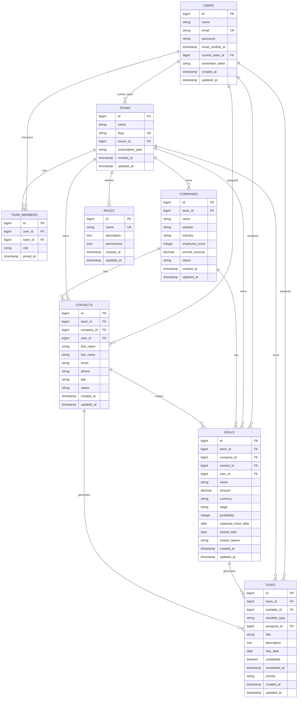

# Chapter 04: Planning Application Architecture & Data Modeling

## Overview

Before writing code, successful applications require careful planning. This chapter focuses on designing the CRM's database schema, defining entities (User, Team, Contact, Company, Deal, Task), and mapping their relationships. Good data modeling now prevents costly refactoring later.

We'll create an entity-relationship diagram (ERD) that serves as a blueprint for the entire application. You'll learn to think about data relationships (one-to-many, many-to-many), foreign keys, and indexes. We'll also discuss multi-tenancy-ensuring each team's data remains isolated from other teams.

By the end of this chapter, you'll have a complete plan for the CRM's database structure. This plan will guide the migrations you'll write in Chapter 05 and the Eloquent models you'll create in Chapter 06. Taking time to design properly ensures a solid foundation for all future features.

This chapter is primarily planning and diagramming-no database implementation yet.

## Prerequisites

Before starting this chapter, you should have:

- Completed [Chapter 03](/series/build-crm-laravel-12/chapters/03-laravel-12-fundamentals-project-structure)
- Understanding of database concepts (tables, columns, primary keys, foreign keys)
- Familiarity with one-to-many and many-to-many relationships
- Paper or digital tool for creating diagrams (draw.io, Lucidchart, or pen and paper)

**Estimated Time**: ~45 minutes

## What You'll Build

By the end of this chapter, you will have:

- Identified all entities needed for the CRM (User, Team, Contact, Company, Deal, Task)
- Defined fields/columns for each entity
- Mapped relationships between entities (one-to-many, belongs-to, many-to-many)
- Created an entity-relationship diagram (ERD)
- Planned for multi-tenancy (team-scoped data)
- Understanding of foreign key constraints and indexes
- A blueprint ready for migration implementation in Chapter 05

## Objectives

- Identify core entities and their attributes
- Define relationships between entities clearly
- Design for multi-tenancy from the start
- Create an ERD that guides implementation
- Understand cardinality (one-to-many, many-to-many)
- Plan foreign keys, indexes, and constraints
- Consider data integrity and cascading deletes

## Quick Start: The CRM Data Model in 5 Minutes

Before diving deep, here's the essence of what we're building:

```
Users belong to Teams
├─ Teams have multiple Users (Members)
├─ Teams own Contacts, Companies, Deals, Tasks
├─ Contacts belong to Companies
├─ Deals have multiple Tasks
└─ All data is scoped to the Team (multi-tenancy)
```

That's it. Everything else flows from these core relationships. Let's design it properly.

## Step 1: Identify Core Entities (~10 min)

### Goal

Understand which tables and entities the CRM needs to function.

### The Seven Core Entities

Every successful CRM needs to manage these core entities:

#### 1. **Users**
The people who use your CRM. Each user can belong to multiple teams (as a team member) and has authentication credentials.

**Key fields**: id, name, email, password_hash, role, created_at, updated_at

#### 2. **Teams**
The organizational container for multi-tenancy. Each team has its own isolated data. A user belongs to one "primary" team but can be invited to other teams in future expansions.

**Key fields**: id, name, slug (unique URL identifier), plan_type, created_at, updated_at

#### 3. **Contacts**
Individual people in your CRM. These are prospects, customers, or leads that belong to a company. A contact has name, email, phone, and company association.

**Key fields**: id, team_id (multi-tenancy), company_id (parent company), first_name, last_name, email, phone, created_at, updated_at

#### 4. **Companies**
Organizations in your CRM. A company can have multiple contacts. Companies are where deals happen.

**Key fields**: id, team_id (multi-tenancy), name, website, industry, employee_count, created_at, updated_at

#### 5. **Deals**
Sales opportunities tracked in your pipeline. A deal belongs to one company and progresses through stages (Prospecting, Qualified, Proposal, Negotiation, Closed Won/Lost).

**Key fields**: id, team_id (multi-tenancy), company_id, name, amount, stage, probability, expected_close_date, created_at, updated_at

#### 6. **Tasks**
Action items associated with deals or contacts. Tasks have owners, due dates, and completion status.

**Key fields**: id, team_id (multi-tenancy), deal_id or contact_id, assigned_to (user_id), title, description, due_date, completed, created_at, updated_at

#### 7. **Team Members** (Pivot/Junction Table)
Represents the many-to-many relationship between users and teams. A user can be a member of multiple teams with different roles. (Note: In Phase 1, we might simplify this to one user per team, but we'll design for expansion.)

**Key fields**: id, user_id, team_id, role (admin, member, viewer), joined_at

#### 8. **Roles** (Optional: Permissions & Authorization)
Defines permission levels within a team (Owner, Admin, Member, Viewer). This enables role-based access control (RBAC) for authorization. (Note: Phase 1 may use simple string roles; Phase 2 can implement full permission matrix.)

**Key fields**: id, name, permissions (JSON), created_at, updated_at

### Why These Core Entities?

These entities cover the complete CRM workflow:
1. **Authentication & Access** — Users, Teams, Team Members (and Roles for authorization)
2. **Relationship Management** — Contacts, Companies
3. **Sales Pipeline** — Deals, Tasks

Everything else (Notes, Email Templates, Activity Logs, File Attachments) can be added later without restructuring the core.

**Quick Mapping to CRM Features**:
- **Contact Management**: Contacts table + Company relationships
- **Sales Pipeline**: Deals table with stages + Tasks for follow-ups
- **Team Collaboration**: Team Members table + Role-based access
- **User Assignments**: Tasks and Deals assigned to Users

## Step 2: Define Entity Details & Relationships (~15 min)

### Goal

Map out the complete fields for each entity and understand how they relate.

### Complete Entity Specifications

#### Users Table

```
users
├─ id (PRIMARY KEY)
├─ name (string) — display name
├─ email (string, UNIQUE) — login identifier
├─ password (string) — hashed password
├─ email_verified_at (timestamp, nullable) — for email verification
├─ current_team_id (unsignedBigInteger, FK) — user's primary team
├─ remember_token (string, nullable) — for "remember me" login
├─ created_at (timestamp)
├─ updated_at (timestamp)
└─ Indexes:
   ├─ UNIQUE on email
   └─ INDEX on current_team_id
```

#### Teams Table

```
teams
├─ id (PRIMARY KEY)
├─ name (string) — team/organization name
├─ slug (string, UNIQUE) — URL-friendly identifier
├─ owner_id (unsignedBigInteger, FK → users.id) — team creator
├─ subscription_plan (string) — free, pro, enterprise
├─ created_at (timestamp)
├─ updated_at (timestamp)
└─ Indexes:
   ├─ UNIQUE on slug
   └─ INDEX on owner_id
```

#### Contacts Table

```
contacts
├─ id (PRIMARY KEY)
├─ team_id (unsignedBigInteger, FK → teams.id) — MULTI-TENANCY
├─ company_id (unsignedBigInteger, FK → companies.id, nullable) — parent company
├─ user_id (unsignedBigInteger, FK → users.id, nullable) — assigned team member
├─ first_name (string)
├─ last_name (string)
├─ email (string, nullable)
├─ phone (string, nullable)
├─ title (string, nullable) — job title
├─ status (string) — active, inactive, archived
├─ created_at (timestamp)
├─ updated_at (timestamp)
└─ Indexes:
   ├─ INDEX on team_id (crucial for queries)
   ├─ INDEX on company_id
   ├─ INDEX on user_id (for filtering by assigned user)
   ├─ UNIQUE on (team_id, email) — unique email per team
   └─ INDEX on status
```

#### Companies Table

```
companies
├─ id (PRIMARY KEY)
├─ team_id (unsignedBigInteger, FK → teams.id) — MULTI-TENANCY
├─ name (string)
├─ website (string, nullable)
├─ industry (string, nullable)
├─ employee_count (integer, nullable)
├─ annual_revenue (decimal, nullable)
├─ status (string) — prospect, customer, inactive
├─ created_at (timestamp)
├─ updated_at (timestamp)
└─ Indexes:
   ├─ INDEX on team_id (crucial for queries)
   ├─ UNIQUE on (team_id, name) — unique company name per team
   └─ INDEX on status
```

#### Deals Table

```
deals
├─ id (PRIMARY KEY)
├─ team_id (unsignedBigInteger, FK → teams.id) — MULTI-TENANCY
├─ company_id (unsignedBigInteger, FK → companies.id) — associated company
├─ contact_id (unsignedBigInteger, FK → contacts.id, nullable) — primary contact for deal
├─ user_id (unsignedBigInteger, FK → users.id, nullable) — assigned sales rep
├─ name (string) — deal name/title
├─ amount (decimal) — deal value
├─ currency (string) — USD, EUR, GBP, etc.
├─ stage (string) — Prospecting, Qualified, Proposal, Negotiation, Closed Won, Closed Lost
├─ probability (integer) — 0-100 percentage estimate
├─ expected_close_date (date, nullable)
├─ closed_date (date, nullable)
├─ closed_reason (string, nullable) — why deal closed
├─ created_at (timestamp)
├─ updated_at (timestamp)
└─ Indexes:
   ├─ INDEX on team_id (crucial for queries)
   ├─ INDEX on company_id
   ├─ INDEX on contact_id
   ├─ INDEX on user_id (for filtering by assigned rep)
   ├─ INDEX on stage (for dashboard filtering)
   └─ INDEX on expected_close_date
```

#### Tasks Table

```
tasks
├─ id (PRIMARY KEY)
├─ team_id (unsignedBigInteger, FK → teams.id) — MULTI-TENANCY
├─ taskable_id (unsignedBigInteger) — polymorphic: deal_id or contact_id
├─ taskable_type (string) — "App\\Models\\Deal" or "App\\Models\\Contact"
├─ assigned_to (unsignedBigInteger, FK → users.id) — task owner
├─ title (string)
├─ description (text, nullable)
├─ due_date (date)
├─ completed (boolean, default false)
├─ completed_at (timestamp, nullable) — when task was marked done
├─ priority (string) — low, medium, high, urgent
├─ created_at (timestamp)
├─ updated_at (timestamp)
└─ Indexes:
   ├─ INDEX on team_id
   ├─ INDEX on assigned_to
   ├─ INDEX on due_date
   └─ INDEX on (taskable_id, taskable_type)
```

#### Team Members (Pivot) Table

```
team_members
├─ id (PRIMARY KEY)
├─ user_id (unsignedBigInteger, FK → users.id)
├─ team_id (unsignedBigInteger, FK → teams.id)
├─ role (string) — owner, admin, member, viewer
├─ joined_at (timestamp)
└─ Indexes:
   ├─ UNIQUE on (user_id, team_id) — prevent duplicate memberships
   └─ INDEX on team_id
```

#### Roles Table (for RBAC in Phase 2)

```
roles
├─ id (PRIMARY KEY)
├─ name (string, UNIQUE) — owner, admin, member, viewer
├─ description (text, nullable) — human-readable description
├─ permissions (json, nullable) — structured permission array
├─ created_at (timestamp)
├─ updated_at (timestamp)
└─ Indexes:
   └─ UNIQUE on name
```

**Phase 1 Approach**: Use simple role strings in `team_members.role` column (owner, admin, member, viewer).

**Phase 2 Expansion**: Migrate to formal Roles table with JSON permission matrix for fine-grained access control.

### Entity Quick Reference

For quick lookup of all entities and their purposes:

| Entity | Purpose | Multi-Tenant? | Primary Role | Key Fields |
|--------|---------|---------------|--------------|------------|
| **Users** | Application users | No | Authentication | email, password, name |
| **Teams** | Organizations | Primary | Data container | name, slug, owner_id |
| **Team Members** | User-Team bridge | Yes (team_id) | Access control | user_id, team_id, role |
| **Roles** | Permission levels | No | Authorization | name, permissions (JSON) |
| **Contacts** | Individual people | Yes (team_id) | Relationships | first_name, email, title |
| **Companies** | Organizations | Yes (team_id) | Relationships | name, website, industry |
| **Deals** | Sales opportunities | Yes (team_id) | Pipeline | name, amount, stage |
| **Tasks** | Action items | Yes (team_id) | Activity | title, due_date, priority |

### Contact & Deal Assignment

A critical pattern in CRM applications is **assigning** contacts, deals, and tasks to specific team members. This is how salespeople take ownership and responsibility:

- **Contacts** have an optional `user_id` field to assign them to a team member for follow-up
- **Deals** have an optional `user_id` field to assign them to a sales representative
- **Tasks** have a `assigned_to` field pointing to the user responsible for completing the task

This allows dashboards, reports, and notifications like:
- "Show me all contacts assigned to me"
- "List all deals assigned to Bob with stage = Proposal"
- "Notify Alice about her overdue tasks"

### Relationships Summary

```
One User → Many Teams (via team_members)
One Team → Many Users (via team_members)
One Team → Many Contacts (team_id)
One Team → Many Companies (team_id)
One Team → Many Deals (team_id)
One Team → Many Tasks (team_id)

One Company → Many Contacts
One Company → Many Deals

One Contact → Many Deals (contact_id nullable in deals)
One Contact → Many Tasks (via polymorphic or direct FK)

One Deal → Many Tasks (via polymorphic or direct FK)

One User → Many Contacts (assigned_to)
One User → Many Deals (assigned_to)
One User → Many Tasks (assigned_to)
```

## Step 3: Design Decisions & Rationale (~8 min)

### Goal

Understand the "why" behind key architectural choices.

### Why Mandatory `team_id`?

You might wonder: "Why make `team_id` required instead of optional?"

**Reason**: Security and consistency. If a single table had both team-scoped and globally-scoped data, developers could accidentally create security bugs by forgetting the filter. **By making it mandatory, the error is impossible.**

```php
// If team_id is REQUIRED and NOT NULLABLE:
Contact::create(['email' => 'alice@example.com']); 
// ❌ ERROR: Missing required 'team_id' - caught immediately!

// If team_id is optional:
Contact::create(['email' => 'alice@example.com']); 
// ✅ Creates orphaned contact with no team - subtle bug!
```

**Design Decision**: `team_id` is `REQUIRED`, `NOT NULL`, with database constraint enforcing the rule.

### Why Polymorphic Tasks?

Tasks could belong to either Contacts or Deals, but not both. We have two design options:

**Option A: Separate Tables** (contacts_tasks, deals_tasks)
- Pros: Simpler queries, explicit relationships
- Cons: Duplicate code, two tables to manage, no shared task logic

**Option B: Polymorphic Relationship** (current choice)
- Pros: Single Tasks table, shared logic, flexibility for future
- Cons: Slightly more complex queries, requires care with joins

**Design Decision**: Polymorphic relationship chosen for flexibility. Tasks will store `taskable_id` (contact or deal) and `taskable_type` (class name).

### Why Soft Deletes?

When a user deletes a contact, three scenarios are possible:

1. **Hard Delete**: Permanently remove (can't recover, breaks audit trails)
2. **Soft Delete**: Mark as deleted, keep in database (recoverable, audit-friendly)
3. **Archive**: Move to archive table (for legal holds)

**Design Decision**: Soft deletes recommended for Phase 1. Deleted records stay in database with `deleted_at` timestamp, but hidden from normal queries. This allows:
- Recovery if accidentally deleted
- Audit trails for compliance
- Historical reporting
- Easy restoration

```php
// Soft delete in action (Chapter 08+):
$contact->delete(); // Sets deleted_at timestamp

// Query excludes soft-deleted by default:
Contact::where('status', 'active')->get(); 
// ← Doesn't include soft-deleted contacts

// Include soft-deleted when needed:
Contact::withTrashed()->get(); 
Contact::onlyTrashed()->get();
```

### Why These Specific Indexes?

Indexes speed up queries but slow down writes. We index strategically:

**Always Index**:
- Primary Keys (automatic)
- Foreign Keys (`team_id`, `company_id`, `user_id`)
- Columns in WHERE clauses (status, stage, date range)

**Don't Index**:
- Low-cardinality columns (e.g., boolean fields with 2 values)
- Columns rarely used in queries
- Columns in unselective filters

**Example**: Indexing `team_id` vs. `timezone`:
- `team_id` index: "Find all contacts for Team 5" → narrows from 1M rows to 1K rows ✅
- `timezone` index: "Find all contacts in UTC+5" → still 500K rows (not selective) ❌

## Step 4: Understanding Multi-Tenancy Design (~8 min)

### Goal

Understand how multi-tenancy keeps each team's data isolated and secure.

### What is Multi-Tenancy?

Multi-tenancy means one application serving multiple independent teams/organizations, each with completely isolated data. Think of it like an apartment building where each unit has its own furniture, decorations, and privacy. Your CRM database is that building.

### The `team_id` Column: The Foundation

The single most important design decision for multi-tenancy is adding `team_id` as a **required foreign key** to every data table that contains team-specific information.

**Why `team_id` everywhere?**

1. **Security**: When querying contacts for Team A, you always filter by `team_id = 1`. Even if a bug exists in your code, a Team B user cannot accidentally see Team A's contacts.

2. **Data Isolation**: Every query includes the team scope:
   ```sql
   SELECT * FROM contacts WHERE team_id = 1 AND status = 'active';
   ```

3. **Performance**: Filtering by `team_id` (indexed column) is extremely fast even with millions of rows.

4. **Simplicity**: It's explicit. You always know whose data you're querying.

### Multi-Tenancy Queries Pattern

**Without Multi-Tenancy (Wrong)**:
```sql
SELECT * FROM contacts WHERE email = 'alice@example.com';
-- Could return Alice's contact from ANY team. Insecure!
```

**With Multi-Tenancy (Correct)**:
```sql
SELECT * FROM contacts WHERE team_id = 1 AND email = 'alice@example.com';
-- Returns only Team 1's contact named Alice. Secure!
```

In Laravel, you'll use a "default scope" to automatically add the `team_id` filter to every query:

```php
// In the Contact model:
protected static function boot()
{
    parent::boot();
    
    static::addGlobalScope('team', function ($query) {
        $query->where('team_id', auth()->user()->current_team_id);
    });
}

// Then queries automatically scope to the current team:
Contact::where('status', 'active')->get();
// Becomes: SELECT * FROM contacts WHERE team_id = 1 AND status = 'active'
```

### Multi-Tenancy Design Rules

✅ **DO**:
- Add `team_id` FK to every team-specific table
- Index `team_id` on all tables for query performance
- Always include team_id in WHERE clauses (automatically via global scopes)
- Store team context in the authenticated user
- Test queries with multiple teams to ensure isolation

❌ **DON'T**:
- Query team data without filtering by `team_id`
- Assume URL parameters identify the correct team (always verify against `current_team_id`)
- Forget to index `team_id`
- Use client-side filtering instead of database WHERE clauses

## Step 5: Creating the Entity-Relationship Diagram (~12 min)

### Goal

Visualize the complete data model with all relationships and cardinalities.

### The CRM Entity-Relationship Diagram

Here's the complete ERD for the CRM in Mermaid syntax:



### Understanding the Diagram

- **Primary Keys (PK)**: Unique identifier for each row (id)
- **Foreign Keys (FK)**: Links to another table (team_id, company_id, etc.)
- **Unique Keys (UK)**: Ensures no duplicates (email must be unique)
- **Cardinality** (lines between tables):
  - `||--o{` means "one to many" (1:N) — One team has many contacts
  - `||--||` means "one to one" (1:1) — One user has one current team

### Interpreting Key Relationships

**User → Team** (current_team_id):
- A user logs in and sees their "current" team
- This is the default team shown in the UI
- A user belongs to one primary team

**Team → Members** (team_members table):
- A team has multiple members
- A member has a role (owner, admin, member, viewer)
- Multiple users can be members of one team
- One user can join multiple teams

**Team → Contacts, Companies, Deals, Tasks**:
- Everything belongs to exactly one team
- The `team_id` ensures data isolation
- Queries always filter by team_id

**Company → Contacts & Deals**:
- A company has many contacts (related prospects/customers)
- A company has many deals (sales opportunities)
- A contact belongs to one company

**Deal → Tasks & Contacts → Tasks**:
- Tasks are polymorphic: a task can belong to a Deal or Contact
- This flexibility allows task management across your CRM

## Step 6: Database Constraints & Indexes (~8 min)

### Goal

Understand the performance and integrity considerations beyond basic relationships.

### Cascading Deletes Strategy

When you delete a team, what happens to its contacts, companies, deals?

```
ON DELETE CASCADE — automatically delete related records
├─ Delete Team → Delete all related Contacts, Companies, Deals, Tasks
├─ Useful for: Cleaning up after deletion
└─ DANGER: Can accidentally wipe lots of data

ON DELETE SOFT DELETE — mark as deleted, don't remove
├─ Mark records as deleted without removing them
├─ Useful for: Audit trails, recovery, legal requirements
└─ Requires careful WHERE clauses in queries

ON DELETE RESTRICT — prevent deletion if children exist
├─ Can't delete Team if it has Contacts
├─ Useful for: Forcing explicit cleanup
└─ Can frustrate users (must delete children first)
```

**CRM Recommendation**: Use SOFT DELETES
- Keep audit trail of what existed
- Prevent accidental data loss
- Allow "undelete" in future features

### Index Strategy

Indexes are **critical** for CRM performance. Without them, queries on millions of records become slow.

**Essential Indexes**:

```sql
-- Team filtering (every query needs this)
CREATE INDEX idx_contacts_team_id ON contacts(team_id);
CREATE INDEX idx_companies_team_id ON companies(team_id);
CREATE INDEX idx_deals_team_id ON deals(team_id);
CREATE INDEX idx_tasks_team_id ON tasks(team_id);

-- Foreign key relationships
CREATE INDEX idx_contacts_company_id ON contacts(company_id);
CREATE INDEX idx_contacts_user_id ON contacts(user_id);
CREATE INDEX idx_deals_company_id ON deals(company_id);
CREATE INDEX idx_deals_contact_id ON deals(contact_id);
CREATE INDEX idx_deals_user_id ON deals(user_id);
CREATE INDEX idx_tasks_assigned_to ON tasks(assigned_to);

-- Filtering by status/stage
CREATE INDEX idx_contacts_status ON contacts(status);
CREATE INDEX idx_deals_stage ON deals(stage);
CREATE INDEX idx_companies_status ON companies(status);

-- Date filtering
CREATE INDEX idx_deals_expected_close ON deals(expected_close_date);
CREATE INDEX idx_tasks_due_date ON tasks(due_date);

-- Unique constraints (prevent duplicates, double as indexes)
CREATE UNIQUE INDEX idx_users_email ON users(email);
CREATE UNIQUE INDEX idx_teams_slug ON teams(slug);
CREATE UNIQUE INDEX idx_roles_name ON roles(name);
CREATE UNIQUE INDEX idx_contacts_team_email ON contacts(team_id, email);
CREATE UNIQUE INDEX idx_companies_team_name ON companies(team_id, name);
CREATE UNIQUE INDEX idx_team_members_unique ON team_members(user_id, team_id);
```

### Why These Indexes Matter

Dashboard Query Example:
```sql
-- Without indexes: Scans 100,000 rows, takes 2 seconds
-- With indexes: Uses index on (team_id, stage), takes 50ms
SELECT COUNT(*) as count, stage 
FROM deals 
WHERE team_id = 1 
GROUP BY stage;
```

Multi-tenant queries ALWAYS filter by team_id first:
```sql
-- team_id index makes this fast for 100,000 rows across all teams
SELECT * FROM contacts WHERE team_id = 1 LIMIT 10;
```

## Step 7: Design Review Checklist (~2 min)

### Goal

Verify your data model is complete and correct.

Before moving to implementation, check:

✅ **Entities**: All seven core entities identified
✅ **Fields**: Each entity has required fields (timestamps, status fields, etc.)
✅ **Relationships**: All 1:N, N:N relationships clearly defined
✅ **Multi-Tenancy**: Every team-specific table has `team_id` FK
✅ **Indexing**: team_id indexed on all team-scoped tables
✅ **Unique Constraints**: Email, team slug, etc. have uniqueness rules
✅ **Foreign Keys**: All references point to correct tables
✅ **Cascading**: Deletion strategy decided (soft deletes recommended)
✅ **Performance**: Most-queried columns identified for indexing
✅ **Scalability**: Design supports millions of records per team

## Step 8: Common Pitfalls & Solutions (~5 min)

### Goal

Learn from common mistakes so you avoid them in implementation.

### Pitfall 1: Forgetting to Index `team_id`

**Symptom**: "When we scaled to thousands of teams, queries suddenly got slow."

**Root Cause**: Queries like `SELECT * FROM contacts WHERE team_id = 1` had no index, requiring full table scans on millions of rows.

**Solution**: 
```sql
-- REQUIRED: Index team_id on all multi-tenant tables
CREATE INDEX idx_contacts_team_id ON contacts(team_id);
CREATE INDEX idx_companies_team_id ON companies(team_id);
CREATE INDEX idx_deals_team_id ON deals(team_id);
CREATE INDEX idx_tasks_team_id ON tasks(team_id);
```

**Prevention**: Add `team_id` indexes as part of your migration template for every table. Never skip this step.

### Pitfall 2: Querying Without Team Filter

**Symptom**: "Team B users can see Team A's contacts somehow."

**Root Cause**: 
```php
// ❌ WRONG: Forgot team_id filter
$contacts = Contact::where('status', 'active')->get();
// Returns all active contacts, including other teams!
```

**Solution**: Use Laravel's global scopes to enforce filtering:
```php
// ✅ In Contact model
protected static function boot() {
    parent::boot();
    static::addGlobalScope('team', function ($query) {
        $query->where('team_id', auth()->user()->current_team_id);
    });
}

// Now this is automatically scoped:
$contacts = Contact::where('status', 'active')->get();
// Only returns Team 1's active contacts
```

**Prevention**: Test multi-tenant data isolation in your unit tests. Create test users for multiple teams and verify isolation.

### Pitfall 3: Not Planning for Soft Deletes

**Symptom**: "A user deleted a contact by accident. We can't recover it. No audit trail."

**Root Cause**: Hard deletes remove data permanently without recovery option.

**Solution**: From Day 1, add `deleted_at` to tables:
```php
// In migration:
$table->softDeletes(); // Adds deleted_at column

// Now deletes are soft:
$contact->delete(); // Sets deleted_at, doesn't remove record
$contact->restore(); // Restore deleted contact
```

**Prevention**: Include soft deletes in your schema from the beginning. It's easier than adding later.

### Pitfall 4: Circular or Ambiguous Relationships

**Symptom**: "Contact → Company → Deal → Contact. Which path should we follow?"

**Root Cause**: Over-normalizing relationships or unclear domain model.

**Solution**: Our design sidesteps this:
- Contact → Company (many contacts per company)
- Company → Deal (many deals per company)
- Contact → Deal (optional: primary contact for deal)
- Deal → Task or Contact → Task (polymorphic, not both)

**Prevention**: Keep relationships one-directional when possible. If you find yourself asking "how do I query back?", reconsider the design.

### Pitfall 5: Overindexing (Performance Anti-Pattern)

**Symptom**: "Inserts and updates are super slow, but selects aren't much faster."

**Root Cause**: Indexes help reads but hurt writes. Indexing every column wastes storage and slows mutation operations.

**Solution**: Index strategically, as shown in our design:
- ✅ Index `team_id` (used in every query)
- ✅ Index foreign keys (`company_id`, `user_id`)
- ✅ Index status/stage (filtered often)
- ✅ Index date ranges (expected_close_date)
- ❌ Don't index boolean fields, timestamps (except deletes)
- ❌ Don't index computed fields

**Prevention**: Measure with EXPLAIN before and after indexing. Only add indexes that reduce query time by 50%+ or are fundamental (team_id).

---

## Exercises

### Exercise 1: Draft Your Own ERD

**Goal**: Practice database design

On paper or in a diagramming tool, draw the entities and relationships described in this chapter.

**Validation**: Your diagram shows all entities, their fields, and arrows indicating relationships.

### Exercise 2: Identify Additional Entities

**Goal**: Think about future features

What other entities might a CRM need? Consider:
- Notes/Comments on contacts or deals
- Email templates
- Activity log/audit trail
- File attachments

**Validation**: You understand how to extend the data model for new features.

### Exercise 3: Plan Indexes

**Goal**: Consider database performance

Which columns should be indexed? Think about:
- Foreign keys (always indexed)
- Columns frequently used in WHERE clauses
- Unique constraints (email addresses, slugs)

**Validation**: You can identify columns that benefit from indexing.

## Wrap-up

Congratulations! You've designed a production-ready database architecture for a multi-tenant CRM application. This planning phase is crucial—you've created the blueprint that will guide all database implementation.

### What You've Accomplished

✅ **Identified Seven Core Entities**: Users, Teams, Contacts, Companies, Deals, Tasks, and Team Members

✅ **Defined Complete Entity Specifications**: Every table has fields, data types, foreign keys, and indexes

✅ **Mastered Multi-Tenancy Design**: You understand how `team_id` isolation keeps data secure and performant

✅ **Created an Entity-Relationship Diagram (ERD)**: A visual blueprint showing all relationships and cardinality

✅ **Planned for Performance**: Indexes on team_id, foreign keys, status fields, and frequently-queried columns

✅ **Decided on Constraints & Deletions**: Understanding cascade strategies and data integrity rules

### Key Design Principles You've Learned

1. **Every Query Filters by team_id** — Multi-tenancy security depends on this discipline
2. **Indexes Make Performance** — Indexed team_id queries remain fast at any scale
3. **Good Design Prevents Refactoring** — Taking time to plan now saves weeks of rework later
4. **Relationships Are Explicit** — Foreign keys and constraints prevent data corruption
5. **Unique Constraints Prevent Bugs** — Email uniqueness per team avoids duplicate contact issues

### How This Blueprint Guides Future Chapters

**Chapter 05: Database Migrations** — You'll implement this design with Laravel migrations:
```php
Schema::create('contacts', function (Blueprint $table) {
    $table->id();
    $table->foreignId('team_id')->constrained();
    $table->foreignId('company_id')->nullable()->constrained();
    // ... and all other fields you designed
});
```

**Chapter 06: Eloquent Models & Relationships** — You'll define the relationships you planned:
```php
class Contact extends Model {
    public function company() { return $this->belongsTo(Company::class); }
    public function team() { return $this->belongsTo(Team::class); }
    public function tasks() { return $this->morphMany(Task::class, 'taskable'); }
}
```

**Chapters 07-15: CRUD Operations** — You'll query this data structure using Laravel:
```php
// The design ensures this query is fast and secure
$contacts = Contact::where('status', 'active')->get();
```

### This Design Pattern Is Production-Ready

The architecture you've planned:
- ✅ Supports thousands of teams and millions of records
- ✅ Enforces data isolation automatically
- ✅ Performs efficiently with proper indexing
- ✅ Maintains data integrity with foreign keys and constraints
- ✅ Scales horizontally as teams grow

### Next Steps

You're ready for [Chapter 05: Database Migrations](/series/build-crm-laravel-12/chapters/05-database-migrations-create-tables-schemas), where you'll implement this design in actual MySQL migrations. Bring this ERD with you—you'll reference it constantly as you create each table.

**For Visual Learners**: Print out or save the ERD from this chapter. Many developers keep it nearby while coding to stay oriented in the data model.

**For Implementation**: Download or bookmark the field specifications and index requirements. You'll copy them directly into your migration files.

<ChapterCheckbox 
  seriesId="build-crm-laravel-12"
  chapterId="04"
  label="Completed: 04: Planning Application Architecture & Data Modeling"
/>

## Further Reading

- [Database Design Best Practices](https://www.postgresql.org/docs/current/ddl.html) - General database design principles
- [Laravel Eloquent Relationships](https://laravel.com/docs/12.x/eloquent-relationships) - How Laravel handles relationships
- [Multi-Tenancy in Laravel](https://tenancy.dev/) - Strategies for multi-tenant applications

