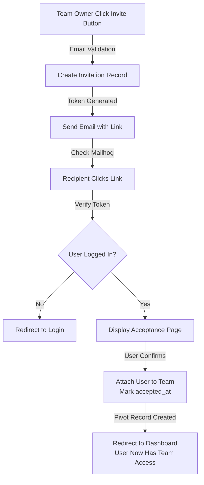
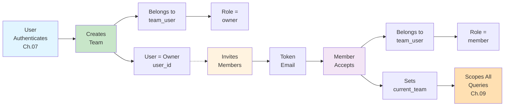

# Chapter 08: Team Management & User Roles

## Overview

CRM systems are inherently multi-tenant: different organizations need isolated data. This chapter implements team functionality, allowing users to create teams, invite members, assign roles (owner, admin, member), and switch between teams.

Unlike Jetstream (which provides team management out of the box), the React starter kit requires manual team implementation. This gives you complete control and deeper understanding of multi-tenancy patterns. You'll build team creation, member invitations, role assignment, and team switching from scratch.

By the end of this chapter, your CRM will support multiple teams with role-based permissions. Users can belong to multiple teams, and each team's data will be completely isolated. This prepares you for the authorization chapter, where you'll ensure users can only access their team's data.

This chapter focuses on team CRUD operations and relationships-authorization comes in Chapter 09.

## Prerequisites

Before starting this chapter, you should have:

- Completed [Chapter 07](/series/build-crm-laravel-12/chapters/07-user-authentication-react-starter-kit)
- Understanding of many-to-many relationships
- Teams table migrated (from Chapter 05)
- Team model created (from Chapter 06)

**Estimated Time**: ~90 minutes

## What You'll Build

By the end of this chapter, you will have:

- Team creation interface (React component)
- Team invitation system with email invites
- Role assignment (owner, admin, member) stored in pivot table
- Team switching interface in navigation
- Current team stored in session
- Team settings page for managing members
- Member removal functionality
- Understanding of pivot table customization
- Foundation for team-scoped data in next chapter

## Team Roles Explained: Ownership vs Membership

Before coding, let's clarify the core team concepts that often confuse developers:

### Three Key Relationships

```
USER ←→ TEAM relationships:

1. TEAM OWNERSHIP
   A User can OWN multiple Teams (one-to-many)
   Example: John owns "ACME Corp" team and "Tech Startup" team
   ┌──────────────┐
   │ users table  │
   │ id: 1        │───→ team_id: 1  (John's personal/default team)
   │ name: John   │
   └──────────────┘
   
   But John also OWNS other teams (these are in teams.user_id):
   ┌──────────────┐
   │ teams table  │
   │ id: 2        │───→ user_id: 1 (John OWNS this team)
   │ name: ACME   │
   └──────────────┘

2. TEAM MEMBERSHIP  
   A User can BELONG TO multiple Teams (many-to-many via pivot)
   Example: Jane belongs to "ACME Corp", "Tech Startup", and "Marketing Team"
   
   ┌──────────────────┐
   │ team_user pivot  │
   │ team_id: 2       │───→ Jane is a MEMBER of ACME Corp
   │ user_id: 3       │
   └──────────────────┘

3. TEAM ROLES (within membership)
   Each membership has a ROLE that defines permissions
   Roles: owner, admin, member, viewer
   
   ┌──────────────────────────┐
   │ team_user pivot          │
   │ team_id: 2               │
   │ user_id: 1               │
   │ role: "admin"            │───→ John is an ADMIN in ACME Corp
   │ joined_at: timestamp     │
   └──────────────────────────┘
```

### Real-World Example

**Scenario**: John works at ACME Corp, Jane is an intern, Bob is a contractor

```
TEAMS:
┌─────────────────────┐
│ id | name | user_id │
├─────────────────────┤
│ 1  │ John's Personal │ 1 (John owns/created this)
│ 2  │ ACME Corp       │ 1 (John owns this team too)
└─────────────────────┘

USER MEMBERSHIPS (team_user pivot table):
┌──────────────────────────────────────────┐
│ team_id | user_id | role       │ role meaning
├──────────────────────────────────────────┤
│ 1       │ 1       │ owner      │ John owns his personal team
│ 2       │ 1       │ owner      │ John owns ACME Corp team
│ 2       │ 2       │ admin      │ Jane is an admin (can manage team members)
│ 2       │ 3       │ member     │ Bob is a regular member (can view/edit data)
└──────────────────────────────────────────┘

DATABASE STATE:
- Team 1 (Personal): John only, role = owner
- Team 2 (ACME): John (owner), Jane (admin), Bob (member)

WHAT EACH PERSON CAN DO:
- John: Switch to either team, full access to both
- Jane: Switch to ACME only (she only belongs to 1 team), invite/remove members
- Bob: Switch to ACME only, view/edit contacts but can't change team settings
```

### Role Permissions Matrix

| Action | Owner | Admin | Member | Viewer |
|--------|-------|-------|--------|--------|
| **View team data** | ✅ | ✅ | ✅ | ✅ |
| **Edit team data** | ✅ | ✅ | ✅ | ❌ |
| **Create records** | ✅ | ✅ | ✅ | ❌ |
| **Delete records** | ✅ | ✅ | ❌ | ❌ |
| **Invite members** | ✅ | ✅ | ❌ | ❌ |
| **Remove members** | ✅ | ✅ | ❌ | ❌ |
| **Change roles** | ✅ | ❌ | ❌ | ❌ |
| **Delete team** | ✅ | ❌ | ❌ | ❌ |
| **Change team settings** | ✅ | ❌ | ❌ | ❌ |

**Pro Tip**: Roles are defined in Chapter 09 (Authorization) using Policies. This chapter focuses on storing roles in the pivot table.

### Key Distinction: Ownership vs Membership

**OWNERSHIP** (users.team_id OR teams.user_id):
- A user "owns" a team they created
- Only 1 user can own a team (initially)
- Ownership might be transferable in future features

**MEMBERSHIP** (team_user pivot table):
- A user "belongs to" a team
- A user can belong to many teams
- Membership includes a role (owner, admin, member, viewer)
- Every team owner is also a member (with owner role in pivot)

### Database Schema Reminder

From Chapter 05, your tables look like:

```sql
-- users table
CREATE TABLE users (
    id BIGINT PRIMARY KEY,
    name VARCHAR,
    email VARCHAR UNIQUE,
    team_id BIGINT NULLABLE,  ← User's "current" team
    password VARCHAR,
    created_at TIMESTAMP
);

-- teams table
CREATE TABLE teams (
    id BIGINT PRIMARY KEY,
    user_id BIGINT NOT NULL,  ← Team owner (must be NOT NULL)
    name VARCHAR,
    slug VARCHAR UNIQUE,
    created_at TIMESTAMP,
    FOREIGN KEY (user_id) REFERENCES users(id) ON DELETE CASCADE
);

-- team_user pivot table (many-to-many)
CREATE TABLE team_user (
    id BIGINT PRIMARY KEY,
    team_id BIGINT NOT NULL,
    user_id BIGINT NOT NULL,
    role ENUM('owner','admin','member','viewer') DEFAULT 'member',
    joined_at TIMESTAMP DEFAULT CURRENT_TIMESTAMP,
    UNIQUE(team_id, user_id),
    FOREIGN KEY (team_id) REFERENCES teams(id) ON DELETE CASCADE,
    FOREIGN KEY (user_id) REFERENCES users(id) ON DELETE CASCADE
);
```

### Common Questions Answered

**Q: Why does the user have a team_id?**
A: This stores the user's "current active team" for the session. When Jane logs in, she might be viewing ACME Corp, so team_id=2. If she switches teams, this value updates.

**Q: Can a user belong to the same team twice?**
A: No! The pivot table has `UNIQUE(team_id, user_id)` which prevents duplicates.

**Q: What if a user is invited to a team with multiple roles?**
A: Not possible with current design. Each user→team pair has exactly one role in the pivot.

**Q: Can I change a user's role?**
A: Yes! In Chapter 09, team owners/admins will be able to update the `role` column in the pivot table.

**Q: What if I delete a user?**
A: `ON DELETE CASCADE` means all their team memberships (pivot rows) are deleted automatically. Teams they own are also deleted (owners typically leave teams before deletion).

---

## Objectives

- Create teams via React interface
- Implement user-team many-to-many relationship with roles
- Send invitation emails to new team members
- Handle invitation acceptance flow
- Allow users to switch between their teams
- Display current team in navigation
- Manage team members (view, remove)
- Store role information in pivot table
- Understand session management for current team
- Understand the distinction between team ownership and membership

## Quick Start (Optional)

Want to see where this chapter takes you? Here's a 5-minute overview of the end state:

```bash
# After completing all steps, you'll be able to:

# 1. Create a team from the UI
curl -X POST http://localhost/teams \
  -d '{"name":"My Team"}' \
  -H "Content-Type: application/json"

# 2. Invite a user by email
curl -X POST http://localhost/teams/1/invite \
  -d '{"email":"user@example.com","role":"member"}' \
  -H "Content-Type: application/json"

# 3. Check email in Mailhog (localhost:8025)
# Accept invitation via link

# 4. Switch between teams in UI dropdown

# 5. Manage team members in settings page
```

Key endpoint structure:
- `POST /teams` — Create team
- `POST /teams/{team}/invite` — Send invitation
- `GET /invitations/{token}` — Show invitation acceptance page
- `POST /invitations/{token}/accept` — Accept invitation
- `POST /teams/{team}/switch` — Switch active team
- `GET /teams/{team}/settings` — View team settings
- `DELETE /teams/{team}/members/{user}` — Remove member

## Step 1: Create Team Model Relationships (~10 min)

### Goal

Define comprehensive relationships on the Team model connecting teams to users, and users to teams through the many-to-many pivot table with role tracking.

### Actions

1. **Open the Team model**:

```bash
code app/Models/Team.php
```

2. **Update the Team model with relationships**:

```php
# filename: app/Models/Team.php
<?php

namespace App\Models;

use Illuminate\Database\Eloquent\Factories\HasFactory;
use Illuminate\Database\Eloquent\Model;
use Illuminate\Database\Eloquent\Relations\BelongsTo;
use Illuminate\Database\Eloquent\Relations\BelongsToMany;

class Team extends Model
{
    use HasFactory;

    protected $fillable = [
        'name',
        'slug',
        'plan_type',
    ];

    /**
     * The team owner (creator)
     */
    public function owner(): BelongsTo
    {
        return $this->belongsTo(User::class, 'user_id');
    }

    /**
     * All members of this team
     */
    public function members(): BelongsToMany
    {
        return $this->belongsToMany(User::class)
            ->withPivot('role')
            ->withTimestamps();
    }

    /**
     * Check if user is team owner
     */
    public function isOwner(User $user): bool
    {
        return $this->user_id === $user->id;
    }

    /**
     * Check if user has specific role
     */
    public function userHasRole(User $user, string $role): bool
    {
        return $this->members()
            ->where('user_id', $user->id)
            ->wherePivot('role', $role)
            ->exists();
    }

    /**
     * Get user's role on this team
     */
    public function getUserRole(User $user): ?string
    {
        return $this->members()
            ->where('user_id', $user->id)
            ->first()
            ?->pivot
            ?->role;
    }
}
```

3. **Update the User model to include teams**:

```bash
code app/Models/User.php
```

4. **Add the teams relationship to User model**:

```php
# filename: app/Models/User.php (add to class)
/**
 * All teams this user is a member of
 */
public function teams(): BelongsToMany
{
    return $this->belongsToMany(Team::class)
        ->withPivot('role')
        ->withTimestamps();
}

/**
 * Teams this user owns
 */
public function ownedTeams(): HasMany
{
    return $this->hasMany(Team::class);
}

/**
 * Current active team
 */
public function currentTeam(): BelongsTo
{
    return $this->belongsTo(Team::class, 'current_team_id');
}

/**
 * Get the user's role on a specific team
 */
public function getRoleOnTeam(Team $team): ?string
{
    return $this->teams()
        ->where('team_id', $team->id)
        ->first()
        ?->pivot
        ?->role;
}

/**
 * Check if user is owner of team
 */
public function isTeamOwner(Team $team): bool
{
    return $this->id === $team->user_id;
}

/**
 * Check if user has role on team
 */
public function hasTeamRole(Team $team, string $role): bool
{
    return $this->getRoleOnTeam($team) === $role;
}
```

5. **Verify imports in User model**:

```php
# Add these imports at the top if missing
use Illuminate\Database\Eloquent\Relations\HasMany;
use Illuminate\Database\Eloquent\Relations\BelongsToMany;
use Illuminate\Database\Eloquent\Relations\BelongsTo;
```

### Expected Result

```
✓ Team model has owner(), members() relationships
✓ User model has teams(), ownedTeams(), currentTeam() relationships
✓ Role is stored in pivot table and accessible via ->pivot->role
✓ Helper methods (isOwner, userHasRole, getRoleOnTeam) are available
✓ No errors when running: sail tinker
```

### Why It Works

The pivot table `team_user` stores the many-to-many relationship with the role column:

**Relationship Design**:
- `withPivot('role')` — Exposes pivot column so we can access role data via `$user->pivot->role`
- `withTimestamps()` — Tracks when users joined teams (created_at/updated_at)
- Helper methods — Encapsulate business logic for easy testing and reuse

**Multi-Team Support**:

This pattern allows a user to belong to multiple teams with different roles:
- Owner of "Acme Corp" (via pivot role='owner')
- Admin of "Consulting Inc" (via pivot role='admin')  
- Member of "Project X" (via pivot role='member')

Each relationship is independent—removing a user from one team doesn't affect their membership in others.

**Why Separate Ownership from Membership?**

We track TWO relationships:
- `ownedTeams()` via `user_id` on `teams` table — Permanent owner relationship
- `teams()` via `team_user` pivot table — Flexible membership with roles

This allows:
- Team owner never loses ownership (immutable `user_id`)
- Members can have different roles (flexible via pivot)
- Admins can remove members without affecting ownership
- Authorization can check: "Is user the owner?" vs "Does user have role?"

### Troubleshooting

- **Error: "Column 'role' doesn't exist in pivot table"** — The `team_user` migration hasn't run yet. Run `sail artisan migrate` to create the pivot table with the role column.
- **Relationship not found** — Ensure you imported the Team model in User model: `use App\Models\Team;`
- **Pivot data not loading** — Remember to call `->pivot->role` not just `->role`. The `withPivot()` method explicitly exposes pivot columns.

## Step 2: Build Team Creation Interface (~20 min)

### Goal

Create a React component for team creation and a Laravel controller to handle team creation, linking the owner and storing the initial membership.

### Actions

1. **Create the Team Creation React component**:

```bash
code resources/js/Pages/Teams/CreateTeamModal.tsx
```

2. **Implement the component**:

```typescript
# filename: resources/js/Pages/Teams/CreateTeamModal.tsx
import { FormEventHandler, useState } from 'react'
import { Button } from '@/components/ui/button'
import { Input } from '@/components/ui/input'
import {
  Dialog,
  DialogContent,
  DialogDescription,
  DialogHeader,
  DialogTitle,
  DialogTrigger,
} from '@/components/ui/dialog'
import { useToast } from '@/hooks/use-toast'
import { router } from '@inertiajs/react'

export default function CreateTeamModal() {
  const [open, setOpen] = useState(false)
  const [isLoading, setIsLoading] = useState(false)
  const [teamName, setTeamName] = useState('')
  const { toast } = useToast()

  const handleSubmit: FormEventHandler = async (e) => {
    e.preventDefault()
    setIsLoading(true)

    try {
      router.post('/teams', { name: teamName }, {
        onSuccess: () => {
          toast({
            title: 'Success',
            description: `Team "${teamName}" created successfully!`,
          })
          setTeamName('')
          setOpen(false)
        },
        onError: (errors) => {
          toast({
            title: 'Error',
            description: errors.name || 'Failed to create team',
            variant: 'destructive',
          })
        },
      })
    } finally {
      setIsLoading(false)
    }
  }

  return (
    <Dialog open={open} onOpenChange={setOpen}>
      <DialogTrigger asChild>
        <Button variant="outline">+ New Team</Button>
      </DialogTrigger>
      <DialogContent>
        <DialogHeader>
          <DialogTitle>Create New Team</DialogTitle>
          <DialogDescription>
            Create a team to organize your CRM data and invite team members.
          </DialogDescription>
        </DialogHeader>
        <form onSubmit={handleSubmit} className="space-y-4">
          <div>
            <label htmlFor="team-name" className="text-sm font-medium">
              Team Name
            </label>
            <Input
              id="team-name"
              placeholder="My Company"
              value={teamName}
              onChange={(e) => setTeamName(e.target.value)}
              disabled={isLoading}
              required
            />
          </div>
          <div className="flex justify-end gap-2">
            <Button
              type="button"
              variant="outline"
              onClick={() => setOpen(false)}
              disabled={isLoading}
            >
              Cancel
            </Button>
            <Button type="submit" disabled={isLoading}>
              {isLoading ? 'Creating...' : 'Create Team'}
            </Button>
          </div>
        </form>
      </DialogContent>
    </Dialog>
  )
}
```

3. **Create the Team Controller**:

```bash
sail artisan make:controller TeamController --model=Team
```

4. **Implement the store method**:

```php
# filename: app/Http/Controllers/TeamController.php
<?php

namespace App\Http\Controllers;

use App\Models\Team;
use Illuminate\Http\Request;
use Illuminate\Support\Str;

class TeamController extends Controller
{
    /**
     * Display teams for authenticated user
     */
    public function index()
    {
        $teams = auth()->user()->teams()->get();
        return inertia('Teams/Index', ['teams' => $teams]);
    }

    /**
     * Create new team
     */
    public function store(Request $request)
    {
        $validated = $request->validate([
            'name' => 'required|string|max:255|unique:teams',
        ]);

        // Create team with authenticated user as owner
        $team = auth()->user()->ownedTeams()->create([
            'name' => $validated['name'],
            'slug' => Str::slug($validated['name']) . '-' . Str::random(8),
        ]);

        // Add owner as member with owner role
        $team->members()->attach(auth()->id(), ['role' => 'owner']);

        // Set as current team
        auth()->user()->update(['current_team_id' => $team->id]);

        return redirect('/dashboard')->with('status', 'Team created successfully!');
    }

    /**
     * Switch current team
     */
    public function switchTeam(Team $team)
    {
        // Verify user belongs to team
        $this->authorize('switch', $team);

        auth()->user()->update(['current_team_id' => $team->id]);

        return redirect('/dashboard')->with('status', 'Team switched successfully!');
    }
}
```

5. **Add routes**:

```php
# filename: routes/web.php (add to authenticated routes group)
Route::middleware(['auth', 'verified'])->group(function () {
    Route::post('/teams', [TeamController::class, 'store']);
    Route::post('/teams/{team}/switch', [TeamController::class, 'switchTeam']);
    Route::get('/teams', [TeamController::class, 'index']);
    // ... existing routes
});
```

6. **Test team creation**:

```bash
# In tinker:
sail tinker
> $user = User::first()
> $team = $user->ownedTeams()->create(['name' => 'Test Team', 'slug' => 'test-team'])
> $team->members()->attach($user->id, ['role' => 'owner'])
> $user->update(['current_team_id' => $team->id])
> exit
```

### Expected Result

```
✓ Team creation form appears in UI
✓ Submitting form creates team in database
✓ User is automatically added as owner
✓ current_team_id is set on user
✓ Team appears in team switcher
✓ Redirect to dashboard after creation
```

### Why It Works

1. **Slug generation** — Uses Laravel's `Str::slug()` + random string for unique, URL-friendly identifiers
2. **Owner relationship** — `auth()->user()->ownedTeams()->create()` sets user_id automatically
3. **Pivot entry** — `->members()->attach()` creates the team_user pivot record with role
4. **Current team** — Stored in `current_team_id` on users table for quick access in session

### Troubleshooting

- **Error: "unique constraint violation"** — Team name is duplicated. Validation should prevent this; check validation is running.
- **User not added to members** — Forgot to call `->members()->attach()`. This must be done after team creation.
- **current_team_id not updating** — Verify the users table migration includes the column from Chapter 07.

## Step 3: Implement Team Invitations (~25 min)

### Goal

Create an invitation system that sends emails to new team members, allows them to accept invitations, and adds them to the team with appropriate roles.

### Invitation Flow

Understanding the invitation lifecycle helps clarify the implementation:



This ensures:
1. Invalid emails are rejected immediately
2. Tokens are secure (32-char random strings)
3. Invitations can be tracked (pending/accepted/rejected)
4. Users are protected (must be logged in to accept)

### Actions

1. **Create Invitation model and migration**:

```bash
sail artisan make:model Invitation -m
```

2. **Update the Invitation migration**:

```php
# filename: database/migrations/XXXX_XX_XX_XXXXXX_create_invitations_table.php
<?php

declare(strict_types=1);

use Illuminate\Database\Migrations\Migration;
use Illuminate\Database\Schema\Blueprint;
use Illuminate\Support\Facades\Schema;

return new class extends Migration
{
    public function up(): void
    {
        Schema::create('invitations', function (Blueprint $table) {
            $table->id();
            $table->foreignId('team_id')->constrained()->cascadeOnDelete();
            $table->string('email');
            $table->string('token')->unique();
            $table->string('role')->default('member');
            $table->timestamp('accepted_at')->nullable();
            $table->timestamp('rejected_at')->nullable();
            $table->timestamps();
        });
    }

    public function down(): void
    {
        Schema::dropIfExists('invitations');
    }
};
```

3. **Implement the Invitation model**:

```php
# filename: app/Models/Invitation.php
<?php

namespace App\Models;

use Illuminate\Database\Eloquent\Factories\HasFactory;
use Illuminate\Database\Eloquent\Model;
use Illuminate\Database\Eloquent\Relations\BelongsTo;

class Invitation extends Model
{
    use HasFactory;

    protected $fillable = ['email', 'token', 'role', 'team_id'];
    protected $casts = [
        'accepted_at' => 'datetime',
        'rejected_at' => 'datetime',
    ];

    public function team(): BelongsTo
    {
        return $this->belongsTo(Team::class);
    }

    public function isAccepted(): bool
    {
        return !is_null($this->accepted_at);
    }

    public function isRejected(): bool
    {
        return !is_null($this->rejected_at);
    }

    public function isPending(): bool
    {
        return is_null($this->accepted_at) && is_null($this->rejected_at);
    }
}
```

4. **Create TeamInvitation mailable**:

```bash
sail artisan make:mail TeamInvitation
```

5. **Implement the mailable**:

```php
# filename: app/Mail/TeamInvitation.php
<?php

namespace App\Mail;

use App\Models\Invitation;
use Illuminate\Bus\Queueable;
use Illuminate\Mail\Mailable;
use Illuminate\Queue\SerializesModels;

class TeamInvitation extends Mailable
{
    use Queueable, SerializesModels;

    public function __construct(
        public Invitation $invitation
    ) {}

    public function envelope()
    {
        return new Envelope(
            subject: "You're invited to {$this->invitation->team->name}",
        );
    }

    public function content()
    {
        return new Content(
            view: 'emails.team-invitation',
        );
    }

    public function attachments()
    {
        return [];
    }
}
```

6. **Create invitation email view**:

```bash
mkdir -p resources/views/emails
code resources/views/emails/team-invitation.blade.php
```

7. **Implement email template**:

```blade
# filename: resources/views/emails/team-invitation.blade.php
<x-mail::message>
# You're Invited!

You've been invited to join **{{ $invitation->team->name }}** on our CRM.

<x-mail::button :url="route('invitations.accept', $invitation->token)">
Accept Invitation
</x-mail::button>

Or copy and paste this link in your browser:
{{ route('invitations.accept', $invitation->token) }}

**Role:** {{ ucfirst($invitation->role) }}

Thanks,<br>
{{ config('app.name') }}
</x-mail::message>
```

8. **Add invitation routes and controller methods**:

```php
# filename: routes/web.php
// Invitation routes (public - no auth needed yet)
Route::get('/invitations/{token}', [InvitationController::class, 'show'])->name('invitations.show');
Route::post('/invitations/{token}/accept', [InvitationController::class, 'accept'])->name('invitations.accept');

Route::middleware(['auth', 'verified'])->group(function () {
    Route::post('/teams/{team}/invite', [TeamController::class, 'invite'])->name('teams.invite');
    // ... rest of routes
});
```

9. **Add invite method to TeamController**:

> **🚨 Authorization Note**: The `$this->authorize('invite', $team)` call will require a policy method in Chapter 09. For now, this will throw an exception until you create a `TeamPolicy` with an `invite` method.

```php
# filename: app/Http/Controllers/TeamController.php
use App\Mail\TeamInvitation;
use App\Models\Invitation;
use Mail;

public function invite(Request $request, Team $team)
{
    // 🚨 Chapter 09: This will use a policy method called invite($user, $team)
    $this->authorize('invite', $team);

    $validated = $request->validate([
        'email' => 'required|email',
        'role' => 'required|in:member,admin',
    ]);

    // Create invitation record
    $invitation = Invitation::create([
        'team_id' => $team->id,
        'email' => $validated['email'],
        'role' => $validated['role'],
        'token' => \Illuminate\Support\Str::random(32),
    ]);

    // Send invitation email
    Mail::to($validated['email'])->send(new TeamInvitation($invitation));

    return back()->with('status', 'Invitation sent!');
}
```

10. **Create InvitationController**:

```bash
sail artisan make:controller InvitationController
```

11. **Implement accept invitation**:

```php
# filename: app/Http/Controllers/InvitationController.php
<?php

namespace App\Http\Controllers;

use App\Models\Invitation;
use App\Models\User;

class InvitationController extends Controller
{
    public function show($token)
    {
        $invitation = Invitation::where('token', $token)->firstOrFail();

        if (!$invitation->isPending()) {
            return redirect('/login')->with('error', 'Invitation already processed.');
        }

        return inertia('Invitations/Accept', ['invitation' => $invitation]);
    }

    public function accept($token)
    {
        $invitation = Invitation::where('token', $token)->firstOrFail();

        if (!$invitation->isPending()) {
            return back()->with('error', 'Invitation already processed.');
        }

        $user = auth()->user();

        // Add user to team
        if (!$user->teams()->where('team_id', $invitation->team_id)->exists()) {
            $user->teams()->attach(
                $invitation->team_id,
                ['role' => $invitation->role]
            );
        }

        // Mark invitation as accepted
        $invitation->update(['accepted_at' => now()]);

        return redirect('/dashboard')->with('status', 'You joined the team!');
    }
}
```

### Expected Result

```
✓ Invitations are created with unique tokens
✓ Email is sent when inviting users
✓ Users can accept invitations via link
✓ Accepting adds user to team with specified role
✓ Pending/Accepted/Rejected states tracked
✓ No errors in mail logs (check Mailhog at localhost:8025)
```

### Why It Works

1. **Token generation** — Random 32-character string provides security without database queries
2. **Stateful tracking** — accepted_at/rejected_at fields track invitation lifecycle
3. **Role preservation** — Role is stored in invitation so it's captured at send time, not acceptance time
4. **Email delivery** — Laravel Mail handles queue/delivery with Mailhog for testing

### Troubleshooting

- **Email not sending** — Verify Mailhog is running: `sail ps`. Check `config/mail.php` has `MAIL_DRIVER=log` for testing.
- **Token not found** — Invitations might have expired. Generate new one.
- **User already in team** — Acceptance prevents duplicate entries by checking before attaching.

## Step 4: Add Team Switching (~15 min)

### Goal

Allow users to switch between their teams, storing the current team in the session and updating the navigation to show the active team.

### Actions

1. **Update Team Switcher component**:

```typescript
# filename: resources/js/Components/TeamSwitcher.tsx
import { useEffect, useState } from 'react'
import { User } from '@/types'
import { Team } from '@/types'
import {
  DropdownMenu,
  DropdownMenuContent,
  DropdownMenuItem,
  DropdownMenuTrigger,
} from '@/components/ui/dropdown-menu'
import { Button } from '@/components/ui/button'
import { router } from '@inertiajs/react'

interface Props {
  user: User
  teams: Team[]
}

export default function TeamSwitcher({ user, teams }: Props) {
  const [currentTeam, setCurrentTeam] = useState<Team | null>(null)

  useEffect(() => {
    if (user.current_team_id) {
      setCurrentTeam(
        teams.find((t) => t.id === user.current_team_id) || null
      )
    }
  }, [user.current_team_id, teams])

  const switchTeam = (team: Team) => {
    router.post(`/teams/${team.id}/switch`, {}, {
      onSuccess: () => {
        setCurrentTeam(team)
      },
    })
  }

  if (!currentTeam) return null

  return (
    <DropdownMenu>
      <DropdownMenuTrigger asChild>
        <Button variant="ghost" className="w-full justify-start">
          <span className="truncate">{currentTeam.name}</span>
        </Button>
      </DropdownMenuTrigger>
      <DropdownMenuContent align="start" className="w-56">
        <div className="px-2 py-1.5 text-sm font-medium text-muted-foreground">
          Switch Team
        </div>
        {teams.map((team) => (
          <DropdownMenuItem
            key={team.id}
            onClick={() => switchTeam(team)}
            className={currentTeam.id === team.id ? 'bg-accent' : ''}
          >
            {team.name}
            {currentTeam.id === team.id && <span className="ml-auto">✓</span>}
          </DropdownMenuItem>
        ))}
      </DropdownMenuContent>
    </DropdownMenu>
  )
}
```

2. **Create TeamSwitcher middleware** (optional, for automatic team scoping):

```bash
sail artisan make:middleware EnsureTeamIsSelected
```

3. **Implement middleware**:

```php
# filename: app/Http/Middleware/EnsureTeamIsSelected.php
<?php

namespace App\Http\Middleware;

use Closure;
use Illuminate\Http\Request;

class EnsureTeamIsSelected extends Closure
{
    public function handle(Request $request, Closure $next)
    {
        if (!auth()->check()) {
            return $next($request);
        }

        $user = auth()->user();

        // If user has no current team, set to first team
        if (!$user->current_team_id) {
            $firstTeam = $user->teams()->first();
            if ($firstTeam) {
                $user->update(['current_team_id' => $firstTeam->id]);
            }
        }

        return $next($request);
    }
}
```

4. **Register middleware in `app/Http/Kernel.php`**:

Open `app/Http/Kernel.php` and add the middleware to the global middleware stack:

```php
# filename: app/Http/Kernel.php

class Kernel extends HttpKernel
{
    /**
     * The application's global HTTP middleware stack.
     */
    protected $middleware = [
        // ... existing middleware (EncryptCookies, etc.) ...
        \App\Http\Middleware\EnsureTeamIsSelected::class,
    ];

    // ... rest of Kernel class ...
}
```

This middleware runs on EVERY request (authenticated or not), ensuring users always have a team context when needed.

5. **Update Dashboard to show team and teams list**:

```bash
code resources/js/Pages/Dashboard.tsx
```

6. **Display teams in dashboard**:

```typescript
# filename: resources/js/Pages/Dashboard.tsx
import { Team, User } from '@/types'
import TeamSwitcher from '@/Components/TeamSwitcher'
import CreateTeamModal from '@/Pages/Teams/CreateTeamModal'

interface Props {
  user: User
  teams: Team[]
}

export default function Dashboard({ user, teams }: Props) {
  return (
    <div className="space-y-4">
      <div className="flex items-center justify-between">
        <h1>Dashboard</h1>
        <CreateTeamModal />
      </div>

      <div className="rounded-lg border p-4">
        <h2 className="mb-4 text-lg font-semibold">Your Teams</h2>
        <TeamSwitcher user={user} teams={teams} />
      </div>

      {/* Rest of dashboard content */}
    </div>
  )
}
```

### Expected Result

```
✓ Team switcher appears in navigation
✓ Dropdown shows all user's teams
✓ Clicking team updates current_team_id
✓ Navigation persists selected team
✓ Subsequent requests are team-scoped
✓ New users default to first team
```

### Why It Works

- **Middleware** — Ensures every authenticated user has a current_team_id
- **Session storage** — User's current_team_id is persisted in database, not volatile session
- **Dropdown UI** — Shows all teams with checkmark on active team
- **Route parameter** — Controllers can access team via route parameter or user's current team

### Troubleshooting

- **Middleware not running** — Verify it's registered in Kernel and applied to routes
- **Current team not persisting** — Check that POST to `/teams/{team}/switch` updates the database
- **Teams not showing** — Ensure user is attached to teams via members pivot table

## Step 5: Create Team Settings Page (~20 min)

### Goal

Build a team management interface where team owners can invite members, view current members, change their roles, and remove them from the team.

### Actions

1. **Create Team Settings React page**:

```bash
mkdir -p resources/js/Pages/Teams
code resources/js/Pages/Teams/Settings.tsx
```

2. **Implement Team Settings page**:

```typescript
# filename: resources/js/Pages/Teams/Settings.tsx
import { FormEventHandler, useState } from 'react'
import { Team, User } from '@/types'
import { Button } from '@/components/ui/button'
import { Input } from '@/components/ui/input'
import {
  Select,
  SelectContent,
  SelectItem,
  SelectTrigger,
  SelectValue,
} from '@/components/ui/select'
import {
  Table,
  TableBody,
  TableCell,
  TableHead,
  TableHeader,
  TableRow,
} from '@/components/ui/table'
import { useToast } from '@/hooks/use-toast'
import { router } from '@inertiajs/react'

interface TeamMember {
  id: number
  name: string
  email: string
  pivot: {
    role: string
  }
}

interface Props {
  auth: { user: User }
  team: Team & { members: TeamMember[] }
}

export default function TeamSettings({ auth, team }: Props) {
  const [inviteEmail, setInviteEmail] = useState('')
  const [inviteRole, setInviteRole] = useState('member')
  const [isInviting, setIsInviting] = useState(false)
  const { toast } = useToast()

  const handleInvite: FormEventHandler = async (e) => {
    e.preventDefault()
    setIsInviting(true)

    router.post(
      `/teams/${team.id}/invite`,
      { email: inviteEmail, role: inviteRole },
      {
        onSuccess: () => {
          toast({
            title: 'Success',
            description: `Invitation sent to ${inviteEmail}`,
          })
          setInviteEmail('')
          setInviteRole('member')
        },
        onError: (errors) => {
          toast({
            title: 'Error',
            description: errors.email || 'Failed to send invitation',
            variant: 'destructive',
          })
        },
        onFinish: () => setIsInviting(false),
      }
    )
  }

  const handleRemoveMember = (userId: number) => {
    if (confirm('Remove this member from the team?')) {
      router.delete(`/teams/${team.id}/members/${userId}`, {
        onSuccess: () => {
          toast({
            title: 'Success',
            description: 'Member removed from team',
          })
        },
        onError: () => {
          toast({
            title: 'Error',
            description: 'Failed to remove member',
            variant: 'destructive',
          })
        },
      })
    }
  }

  const isOwner = auth.user.id === team.user_id

  return (
    <div className="space-y-6">
      <h1 className="text-3xl font-bold">{team.name} Settings</h1>

      {/* Invite Section */}
      {isOwner && (
        <div className="rounded-lg border p-6">
          <h2 className="mb-4 text-xl font-semibold">Invite Team Member</h2>
          <form onSubmit={handleInvite} className="space-y-4">
            <div className="grid gap-4 md:grid-cols-3">
              <Input
                type="email"
                placeholder="person@example.com"
                value={inviteEmail}
                onChange={(e) => setInviteEmail(e.target.value)}
                disabled={isInviting}
                required
              />
              <Select value={inviteRole} onValueChange={setInviteRole}>
                <SelectTrigger>
                  <SelectValue />
                </SelectTrigger>
                <SelectContent>
                  <SelectItem value="member">Member</SelectItem>
                  <SelectItem value="admin">Admin</SelectItem>
                </SelectContent>
              </Select>
              <Button type="submit" disabled={isInviting}>
                {isInviting ? 'Sending...' : 'Send Invite'}
              </Button>
            </div>
          </form>
        </div>
      )}

      {/* Members List */}
      <div className="rounded-lg border">
        <div className="border-b p-6">
          <h2 className="text-xl font-semibold">Team Members</h2>
        </div>
        <Table>
          <TableHeader>
            <TableRow>
              <TableHead>Name</TableHead>
              <TableHead>Email</TableHead>
              <TableHead>Role</TableHead>
              {isOwner && <TableHead>Actions</TableHead>}
            </TableRow>
          </TableHeader>
          <TableBody>
            {team.members.map((member) => (
              <TableRow key={member.id}>
                <TableCell>{member.name}</TableCell>
                <TableCell>{member.email}</TableCell>
                <TableCell className="capitalize">{member.pivot.role}</TableCell>
                {isOwner && member.id !== team.user_id && (
                  <TableCell>
                    <Button
                      variant="destructive"
                      size="sm"
                      onClick={() => handleRemoveMember(member.id)}
                    >
                      Remove
                    </Button>
                  </TableCell>
                )}
              </TableRow>
            ))}
          </TableBody>
        </Table>
      </div>
    </div>
  )
}
```

3. **Add team settings route to TeamController**:

> **🚨 Authorization Note**: The `authorize()` calls reference policy methods that will be implemented in Chapter 09.

```php
# filename: app/Http/Controllers/TeamController.php
public function settings(Team $team)
{
    // 🚨 Chapter 09: This uses policy method update($user, $team)
    $this->authorize('update', $team);

    return inertia('Teams/Settings', [
        'team' => $team->load('members'),
    ]);
}

public function removeMember(Team $team, User $member)
{
    $this->authorize('manageMember', $team);

    $team->members()->detach($member->id);

    return back()->with('status', 'Member removed from team!');
}
```

4. **Add routes**:

```php
# filename: routes/web.php
Route::middleware(['auth', 'verified'])->group(function () {
    Route::get('/teams/{team}/settings', [TeamController::class, 'settings'])->name('teams.settings');
    Route::delete('/teams/{team}/members/{member}', [TeamController::class, 'removeMember'])->name('teams.members.remove');
});
```

5. **Test the settings page**:

```bash
# Navigate to http://localhost/teams/1/settings
# Try inviting a team member, viewing members, and removing them
```

### Expected Result

```
✓ Settings page loads with team name
✓ Invite form accepts email and role
✓ Members table shows all team members
✓ Owner can see Remove buttons
✓ Non-owners cannot see Invite form
✓ Removing member deletes from team_user pivot
✓ Removed members can no longer access team
```

### Why It Works

- **Authorization** — `authorize()` ensures only owners can manage teams
- **Eager loading** — `->load('members')` fetches members in one query
- **Pivot access** — `member.pivot.role` accesses role data through relationship
- **Cascading operations** — Detaching from pivot table removes all access

### Troubleshooting

- **Invite form not visible** — User might not be team owner. Check `isOwner` calculation.
- **Member list empty** — Run `sail tinker` to verify members are attached to team.
- **Remove button not working** — Check route is registered and authorization passes.

## Exercises

### Exercise 1: Create Your First Team

**Goal**: Test team creation flow end-to-end

Create a team named "My Company" and verify it's set up correctly.

**Requirements**:
- [ ] Navigate to dashboard
- [ ] Click "+ New Team" button  
- [ ] Enter team name "My Company"
- [ ] Submit form
- [ ] See success message

**Validation**:

```bash
# In Tinker, verify the team was created correctly:
sail tinker
> $team = Team::where('name', 'My Company')->first()
> $team->user_id === auth()->id()  # Should be true (you're owner)
> $team->members()->where('user_id', auth()->id())->exists()  # Should be true
> auth()->user()->current_team_id === $team->id  # Should be true
> exit
```

Expected output: All three checks return `true`

### Exercise 2: Invite a Team Member

**Goal**: Test complete invitation flow with email acceptance

Invite another user and verify the entire system works.

**Requirements**:
- [ ] Go to team settings page
- [ ] Enter email "test@example.com" in invite form
- [ ] Select role: "member"
- [ ] Click "Send Invite"
- [ ] Check Mailhog at `localhost:8025`
- [ ] Open email from noreply@localhost
- [ ] Click "Accept Invitation" button
- [ ] Confirm you've joined the team

**Validation**:

```bash
# Verify invitation was accepted:
sail tinker
> $invitation = Invitation::where('email', 'test@example.com')->first()
> $invitation->isPending()  # Should be false (already accepted)
> $invitation->accepted_at  # Should show timestamp
> exit
```

Expected output: `false` for isPending, and a timestamp for accepted_at

### Exercise 3: Test Helper Methods

**Goal**: Verify all model helper methods work correctly

Test the helper methods you've added to User and Team models.

**Requirements**:
- [ ] Open Tinker
- [ ] Retrieve a user and team
- [ ] Test each helper method
- [ ] Verify correct return types

**Validation**:

```bash
sail tinker

# Get a user and team
> $user = User::first()
> $team = Team::first()

# Test User model helpers
> $user->isTeamOwner($team)       # Returns: true or false
> $user->getRoleOnTeam($team)     # Returns: 'owner', 'admin', 'member', or null
> $user->hasTeamRole($team, 'owner') # Returns: true or false

# Test Team model helpers  
> $team->isOwner($user)            # Returns: true or false
> $team->userHasRole($user, 'owner') # Returns: true or false
> $team->getUserRole($user)         # Returns: role string or null

> exit
```

Expected output: All helpers return appropriate values (booleans or strings) without errors

---

## Multi-Tenancy Data Isolation: How It Works

After implementing teams, you might wonder: **How does the CRM ensure Team A can't see Team B's data?** This is multi-tenancy in action. Let's visualize it:

### Data Isolation Pattern

```
┌─────────────────────────────────────────────────────────────────────────┐
│                  MULTI-TENANT DATA ISOLATION                            │
└─────────────────────────────────────────────────────────────────────────┘

DATABASE (Single instance, multiple tenants):
┌──────────────────────────────────────────────────────────────────────┐
│ teams table                                                          │
├────┬──────────────┬─────────┐                                        │
│ id │ name         │ user_id │                                        │
├────┼──────────────┼─────────┤                                        │
│ 1  │ ACME Corp    │ 1       │ ← John's team                          │
│ 2  │ Tech Startup │ 3       │ ← Bob's team                          │
│ 3  │ Marketing Co │ 5       │ ← Alice's team                        │
└──────────────────────────────────────────────────────────────────────┘

┌──────────────────────────────────────────────────────────────────────┐
│ contacts table (SCOPED BY team_id)                                  │
├────┬──────┬─────────┬──────────┐                                     │
│ id │ name │ team_id │ company_id │                                   │
├────┼──────┼─────────┼──────────┤                                     │
│ 1  │ John │ 1       │ 10       │ ← ACME's contacts                   │
│ 2  │ Jane │ 1       │ 10       │                                     │
│ 3  │ Bob  │ 2       │ 20       │ ← Tech Startup's contacts          │
│ 4  │ Mary │ 2       │ 20       │                                     │
│ 5  │ Carl │ 3       │ 30       │ ← Marketing Co's contacts          │
└──────────────────────────────────────────────────────────────────────┘

SAME PATTERN FOR:
- companies, deals, tasks, etc.
- EVERY row has team_id to identify its tenant


DATABASE CONSTRAINTS:
┌──────────────────────────────────────────────────────────────────────┐
│ All tables with team_id have:                                        │
│ - Foreign key: REFERENCES teams(id) ON DELETE CASCADE               │
│ - Index: CREATE INDEX idx_team_id ON contacts(team_id)              │
│ - Every query filters by team_id automatically                      │
└──────────────────────────────────────────────────────────────────────┘
```

### How Queries Are Scoped

Without multi-tenancy protection:
```php
// ❌ BAD: Returns contacts from ALL teams!
$contacts = Contact::all();  // Could see confidential data from other teams
```

With multi-tenancy (Laravel's global scope):
```php
// ✅ GOOD: Automatically scopes to current team
$contacts = Contact::all();  // Only ACME Corp's contacts (team_id = 1)

// Behind the scenes:
// SELECT * FROM contacts WHERE team_id = 1  ← Global scope applied!
```

### Relationship Hierarchy

```
┌────────────────────────────────────────────────────────────┐
│                    TENANT ISOLATION                        │
└────────────────────────────────────────────────────────────┘

JOHN's data (Team 1):
┌─────────────────────┐
│ Team 1: ACME Corp   │
│ user_id: 1 (John)   │
├─────────────────────┤
│ Contacts (5)        │
│ - All have team_id=1│
│ Companies (3)       │
│ - All have team_id=1│
│ Deals (12)          │
│ - All have team_id=1│
└─────────────────────┘
↑ Only John can access (and Jane/Bob if added as members)

BOB's data (Team 2):
┌─────────────────────┐
│ Team 2: Tech Start  │
│ user_id: 3 (Bob)    │
├─────────────────────┤
│ Contacts (8)        │
│ - All have team_id=2│
│ Companies (4)       │
│ - All have team_id=2│
│ Deals (20)          │
│ - All have team_id=2│
└─────────────────────┘
↑ Only Bob can access (isolated from Team 1)

CRITICAL GUARANTEE:
- There is NO WAY for Bob to query Team 1's data
- Even if Bob tries: Contact::whereTeamId(1)->get()
- Laravel's global scope prevents this AUTOMATICALLY
```

### Query Execution Flow

```
User: John (Team 1)
Request: GET /api/contacts

↓

app/Http/Controllers/ContactController.php:
public function index() {
    return Contact::all();
}

↓

Laravel's Global Scope (auto-applied):
→ Adds WHERE clause: team_id = 1
→ Query becomes: SELECT * FROM contacts WHERE team_id = 1

↓

Database returns:
- John's contacts only
- Bob cannot see this query or results
- Data is ISOLATED at database level
```

### Why This Matters for Security

| Scenario | Without Multi-Tenancy | With Multi-Tenancy |
|---|---|---|
| Bob tries to access Team 1 data | ❌ Possible - data leak! | ✅ Blocked - global scope filters |
| Query doesn't specify team_id | ❌ Returns all teams' data | ✅ Only current team data |
| Database compromised | ❌ All data exposed | ⚠️ Still exposed (separate backups help) |
| Accidental query | ❌ Can leak between teams | ✅ Automatic filtering prevents |
| URL manipulation (/contacts/1) | ❌ Might access other teams' contacts | ✅ Policy checks team ownership (Chapter 09) |

### Implementation Requirements

For multi-tenancy to work:

```php
// 1. Model must have global scope
class Contact extends Model {
    protected static function boot() {
        parent::boot();
        static::addGlobalScope('team', function (Builder $builder) {
            $builder->where('team_id', auth()->user()->team_id);
        });
    }
}

// 2. Create queries must include team_id
Contact::create([
    'name' => 'Jane Doe',
    'team_id' => auth()->user()->team_id,  // NEVER trust user input
    'email' => 'jane@example.com',
]);

// 3. Modify queries must verify ownership
$contact = Contact::findOrFail($id);  // Already scoped to current team
$contact->update(['name' => 'New Name']);  // Safe!

// 4. Delete queries must verify authorization
$contact->delete();  // Only current team's contacts accessible
```

### Testing Multi-Tenancy

How to verify data is truly isolated:

```bash
sail artisan tinker

# Create two teams
>>> $team1 = Team::create(['name' => 'Team A', 'user_id' => 1]);
>>> $team2 = Team::create(['name' => 'Team B', 'user_id' => 2]);

# Add users to teams
>>> $team1->users()->attach(1, ['role' => 'owner']);
>>> $team2->users()->attach(2, ['role' => 'owner']);

# Create contacts in each team
>>> Contact::create(['name' => 'Alice', 'team_id' => 1]);
>>> Contact::create(['name' => 'Bob', 'team_id' => 2]);

# Simulate User 1 accessing contacts
>>> auth()->loginUsingId(1);  # Simulate logging in as user 1
>>> auth()->user()->team_id = 1;
>>> Contact::all();  # Should show only Alice
# Result: Collection with 1 item (Alice)

# Simulate User 2 accessing contacts
>>> auth()->loginUsingId(2);  # Simulate logging in as user 2
>>> auth()->user()->team_id = 2;
>>> Contact::all();  # Should show only Bob
# Result: Collection with 1 item (Bob)

# ✅ Isolation confirmed!
```

---

## Troubleshooting

### Common Team-Related Errors

**Error: "Team relationship not found"**

**Symptom**: `Call to undefined method team() on Invitation` or similar relationship error

**Cause**: Relationship method not defined on model or typo in method name

**Solution**:
1. Check Invitation model has `public function team()` defined
2. Verify it returns `BelongsTo(Team::class)`
3. Check spelling: `team` not `teams`

```php
// ✓ Correct
public function team(): BelongsTo
{
    return $this->belongsTo(Team::class);
}

// ❌ Wrong
public function team()
{
    return $this->Team(); // Wrong - class name as method
}
```

**Error: "User already belongs to team"**

**Symptom**: `SQLSTATE[23000]: Integrity constraint violation` when accepting invitation

**Cause**: User being attached to team they're already a member of

**Solution**: The InvitationController already checks this:

```php
// Check user isn't already a member
if (!$user->teams()->where('team_id', $invitation->team_id)->exists()) {
    $user->teams()->attach(
        $invitation->team_id,
        ['role' => $invitation->role]
    );
}
```

If you still get this error, verify the check is in place and matches your exact column names.

**Error: "Role column doesn't exist in pivot"**

**Symptom**: `SQLSTATE[42S22]: Column not found: 1054 Unknown column 'team_user.role'`

**Cause**: Migration hasn't been run or role column isn't in team_user table

**Solution**:
```bash
# Run migrations
sail artisan migrate

# Verify table structure
sail artisan tinker
> Schema::getColumns('team_user')
> exit
```

If role column is missing, create a new migration:

```bash
sail artisan make:migration add_role_to_team_user_table
```

Then add:

```php
public function up(): void
{
    Schema::table('team_user', function (Blueprint $table) {
        $table->string('role')->default('member')->after('user_id');
    });
}
```

**Error: "Email not sending (Mailhog)"**

**Symptom**: Invitation sent but email doesn't appear in Mailhog at localhost:8025

**Cause**: Mail configuration or Mailhog container not running

**Solution**:
```bash
# Check containers are running
sail ps

# Should show mailhog service running

# Verify mail config
cat config/mail.php
# Should have MAIL_DRIVER=log or MAIL_HOST=mailhog

# Check Mailhog is accessible
curl http://localhost:8025/api/v1/messages

# If Mailhog is down, restart it
sail restart mailhog
```

**Error: "Authorization policy not found"**

**Symptom**: `PolicyNotFound` when trying to authorize actions

**Cause**: Policy class hasn't been created or isn't registered

**Solution**:
1. Create policy files (we'll do this in Chapter 09, but note it here for preparation):

```bash
sail artisan make:policy TeamPolicy --model=Team
```

2. Register in `app/Providers/AuthServiceProvider.php`:

```php
protected $policies = [
    Team::class => TeamPolicy::class,
];
```

### Team Scoping Issues

**Problem: User can see other teams' data**

**Symptom**: In queries, seeing data from teams the user doesn't belong to

**Cause**: Missing team_id check in queries or authorization

**Solution**: Always scope queries to current team:

```php
// ❌ Wrong - shows all companies
$companies = Company::all();

// ✓ Correct - only current team's companies
$companies = auth()->user()
    ->currentTeam()
    ->companies()
    ->get();

// Or use query scope (see Chapter 09)
$companies = Company::forTeam(auth()->user()->currentTeam())->get();
```

### Team Switching Problems

**Problem: Team switcher doesn't work**

**Symptom**: Selecting a team in dropdown does nothing

**Cause**: Route not registered or authorization fails

**Solution**:
1. Check route exists:

```bash
sail artisan route:list | grep switch
# Should show: POST /teams/{team}/switch
```

2. Check authorization allows switching:

```php
// In TeamController::switchTeam()
$this->authorize('switch', $team); // Needs policy method

// Or temporarily remove for testing
// (we'll add proper authorization in Chapter 09)
```

3. Check browser console for JavaScript errors

## Wrap-up

Congratulations! You've successfully implemented comprehensive team management for your CRM. Here's what you've accomplished:

### ✓ What You've Built

- **Team Model Relationships** — Complete many-to-many relationship between users and teams with role tracking
- **Team Creation Interface** — React component and controller for creating teams
- **User Invitations** — Email-based invitation system with token-based acceptance
- **Team Switching** — Users can manage multiple teams and switch between them
- **Team Settings Page** — Members list and management interface
- **Helper Methods** — Convenient methods for checking ownership and roles

### ✓ Key Concepts You've Learned

1. **Many-to-Many Relationships** — Using pivot tables to store additional data (role)
2. **Email Notifications** — Sending emails via Laravel Mail with invitations
3. **Token-Based Links** — Secure, stateless invitation acceptance
4. **Session Management** — Tracking current team in `current_team_id`
5. **Middleware** — Ensuring users have a selected team before accessing protected routes
6. **Role-Based Data** — Storing and accessing role information via pivot tables

### ✓ Architecture Patterns

The team system you've built follows these enterprise patterns:

**Team Lifecycle & Data Flow**:



**Pattern Summary**:
```
User creates Team
    ↓
Team owner = User (1:1 via user_id)
    ↓
Owner adds Members via Invitations
    ↓
Users attached to Team (M:M via team_user pivot)
    ↓
Role stored in pivot table (owner, admin, member)
    ↓
Current team tracked per user session (current_team_id)
    ↓
All CRM data scoped by team_id (coming Chapter 09)
```

### 🔐 Global Scopes Preview (Chapter 09+)

The `current_team_id` you've implemented will enable automatic query filtering via Global Scopes in Chapter 09:

```php
// Without Global Scope (❌ can see other teams' data):
$companies = Company::all();

// With Global Scope (✓ only sees current team's data):
$companies = Company::all(); // Automatically filtered by team_id!

// This is implemented in the model via addGlobalScope():
class Company extends Model
{
    protected static function booted(): void
    {
        static::addGlobalScope(new TeamScope);
    }
}

// The TeamScope automatically adds WHERE team_id = current_team_id to all queries
```

This automatic filtering is why tracking `current_team_id` on the user is so important—it becomes the filter for all queries across the CRM.

### 🎯 Next Steps

You're now ready for **Chapter 09: Authorization & Access Control**, where you'll:

1. Create policies for Contact, Company, Deal, and Task models
2. Implement team-scoped authorization so users can only access their team's data
3. Enforce role-based permissions (only owners can delete, admins can manage members, etc.)
4. Add policy checks to all controllers and views
5. Ensure complete data isolation between teams

Your CRM will evolve from "supporting multiple teams" to "completely isolating each team's data with role-based permissions"—the foundation of a production-ready multi-tenant SaaS application.

### 📋 Validation Checklist

Before moving to Chapter 09, verify:

- [ ] Teams can be created via UI
- [ ] Current user is automatically added as team owner
- [ ] Team switcher appears in navigation
- [ ] Users can switch between teams they belong to
- [ ] Invitations are sent and received via Mailhog
- [ ] Invited users can accept invitations
- [ ] Members list shows all team members with roles
- [ ] Team owners can remove members
- [ ] New users default to their first team
- [ ] All helper methods work (isTeamOwner, getRoleOnTeam, etc.)
- [ ] Running `sail artisan tinker` shows no errors

If all checks pass, you're ready for authorization in the next chapter!

<ChapterCheckbox 
  seriesId="build-crm-laravel-12"
  chapterId="08"
  label="Completed: 08: Team Management & User Roles"
/>

## Further Reading

- [Eloquent Many-to-Many](https://laravel.com/docs/12.x/eloquent-relationships#many-to-many) — Pivot tables and role tracking
- [Laravel Mail](https://laravel.com/docs/12.x/mail) — Sending emails and mailables
- [Mailhog](https://github.com/mailhog/MailHog) — Email testing in development
- [Session Management](https://laravel.com/docs/12.x/session) — Storing user state
- [Middleware](https://laravel.com/docs/12.x/middleware) — Creating custom HTTP middleware
- [Inertia.js](https://inertiajs.com/forms) — Handling forms in React with Inertia
- [shadcn/ui](https://ui.shadcn.com/) — Pre-built React components used in forms

