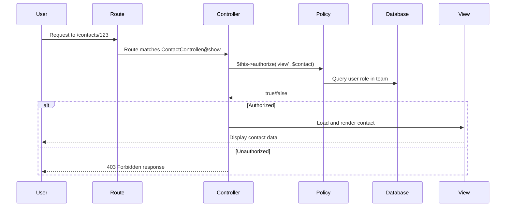

# Chapter 09: Authorization & Access Control

## Overview

Authentication tells us *who* the user is; authorization tells us *what* they can do. This chapter implements comprehensive authorization using Laravel's policies and gates, ensuring users can only access their own team's data and that certain actions require specific roles.

Without proper authorization, users could manipulate URLs to view other teams' contacts or delete records they shouldn't access. Policies provide a centralized, testable way to define authorization logic. You'll create policies for Contact, Company, Deal, and Task models, then apply them in controllers and views.

By the end of this chapter, your CRM will be secure: data is team-scoped, and role-based permissions control sensitive actions. Users will only see and modify their team's records, and only team owners can delete critical data or manage billing.

This chapter is crucial for security—every multi-tenant application needs solid authorization.

## Prerequisites

Before starting this chapter, you should have:

- Completed [Chapter 08](/series/build-crm-laravel-12/chapters/08-team-management-user-roles)
- Understanding of Laravel authorization concepts
- Teams and roles implemented with pivot table
- Understanding of many-to-many relationships

**Estimated Time**: ~75 minutes

**Verify your setup:**

```bash
# Check that team model and relationships exist
grep -n "members()" app/Models/Team.php

# Check that User model has teams relationship
grep -n "teams()" app/Models/User.php

# Verify roles are stored in team_user pivot table
php artisan tinker
# > DB::table('team_user')->pluck('role')
```

## What You'll Build

By the end of this chapter, you will have:

- Policies for: `Contact`, `Company`, `Deal`, `Task`
- Policy methods: `viewAny`, `view`, `create`, `update`, `delete`
- Team-scoped authorization (users can only access their team's data)
- Role-based permissions (only owners can delete companies)
- Authorization middleware applied to routes
- Policy checks in controllers using `authorize()`
- Conditional UI rendering based on permissions (hide delete buttons)
- Gate definitions for global permissions (e.g., `canAccessBilling`)
- Understanding of policy auto-discovery and custom gates
- Secure, multi-tenant data access throughout the CRM

## Objectives

- Generate policy classes using Artisan
- Implement policy methods for CRUD operations
- Apply team-scoping logic in policies
- Use role-based checks (e.g., only owners can delete)
- Register policies in `AuthServiceProvider`
- Authorize actions in controllers with `$this->authorize()`
- Apply policy checks in routes with `can:` middleware
- Conditionally render UI elements based on permissions
- Understand the differences between gates and policies
- Test authorization with different users and roles

## Quick Start (Optional)

Want to see authorization in action? Here's a quick overview:

```bash
# After completing this chapter, authorization will work like:

# 1. Only team members can view team's contacts
# (Trying other team ID in URL returns 403)

# 2. Only owners can delete companies
# (Members get "unauthorized" error)

# 3. UI hides buttons users can't use
# (Delete buttons only show for owners)

# 4. API returns 403 for unauthorized requests
curl -X DELETE http://localhost/companies/1 \
  -H "Authorization: Bearer $TOKEN"
# Returns: 403 Forbidden (if not authorized)
```

## Authorization Flow Diagram

Here's how authorization works in your CRM:



**Three layers of authorization in your CRM:**

1. **Route Level** (optional): Can use middleware `can:action,model`
2. **Controller Level** (primary): `$this->authorize()` before action
3. **View Level** (UX): `@can()` directives hide unauthorized buttons

## Step 1: Generate Policy Files (~5 min)

### Goal

Create policy classes for Contact, Company, Deal, and Task models using Artisan's policy generator.

### Actions

1. **Generate the Contact policy**:

```bash
php artisan make:policy ContactPolicy --model=Contact
```

This creates `/app/Policies/ContactPolicy.php` with stub methods.

2. **Generate the Company policy**:

```bash
php artisan make:policy CompanyPolicy --model=Company
```

3. **Generate the Deal policy**:

```bash
php artisan make:policy DealPolicy --model=Deal
```

4. **Generate the Task policy**:

```bash
php artisan make:policy TaskPolicy --model=Task
```

5. **Optional: Add helper to User model** (makes policy checks cleaner):

If you want a convenient method to check if a user owns a team, add this to `app/Models/User.php`:

```php
# filename: app/Models/User.php (add to User class)
/**
 * Check if this user is the owner of a specific team
 */
public function isTeamOwner(Team $team): bool
{
    return $this->currentTeam?->id === $team->id 
        && $this->currentTeam->user_id === $this->id;
}
```

Then in policies, you can write cleaner code:
```php
if ($user->isTeamOwner($contact->team)) {
    // User is the team owner
}
```

This is optional but improves readability.

6. **Verify the files were created**:

```bash
ls -la app/Policies/
```

### Expected Result

```
app/Policies/
├── ContactPolicy.php
├── CompanyPolicy.php
├── DealPolicy.php
├── TaskPolicy.php
└── UserPolicy.php (may exist from authentication)
```

Each file contains stub methods for authorization checks:

```php
public function viewAny(User $user)
{
    //
}

public function view(User $user, Contact $contact)
{
    //
}

public function create(User $user)
{
    //
}

public function update(User $user, Contact $contact)
{
    //
}

public function delete(User $user, Contact $contact)
{
    //
}
```

### Why It Works

Laravel's `make:policy` command generates a template with common authorization methods:

- `viewAny`: Can user list all records?
- `view`: Can user view this specific record?
- `create`: Can user create a new record?
- `update`: Can user edit this record?
- `delete`: Can user delete this record?

These match typical REST actions. You'll implement each method with team-scoping and role checks.

### Troubleshooting

- **Error: "Class does not exist"** — Ensure model name matches exactly (e.g., `Contact` not `Contacts`)
- **File not created** — Verify you're in the project root and ran command in correct shell
- **Artisan command not found** — Run with `php artisan` not just `artisan`

## Step 2: Implement Contact Policy (~15 min)

### Goal

Implement authorization methods for the Contact model, ensuring users can only access contacts from their own team.

**Key Architectural Note:** We use `$user->currentTeam` (a BelongsTo relationship to the currently active team) rather than a direct `team_id` attribute. This is because users can belong to multiple teams in a multi-tenant CRM, but they work in ONE team at a time. The `current_team_id` is stored on the users table (from Chapter 08) and determines their working context.

### Actions

1. **Open the Contact policy**:

```bash
code app/Policies/ContactPolicy.php
```

2. **Replace the entire file with team-scoped authorization**:

```php
# filename: app/Policies/ContactPolicy.php
<?php

namespace App\Policies;

use App\Models\Contact;
use App\Models\User;

class ContactPolicy
{
    /**
     * Check if user can view any contacts (list page)
     * Only team members can list their team's contacts
     */
    public function viewAny(User $user): bool
    {
        return true; // Any authenticated user can list
    }

    /**
     * Check if user can view a specific contact
     * User must be a member of the contact's team
     */
    public function view(User $user, Contact $contact): bool
    {
        return $user->currentTeam->id === $contact->team_id;
    }

    /**
     * Check if user can create a contact
     * Any team member can create contacts
     */
    public function create(User $user): bool
    {
        return $user->currentTeam !== null;
    }

    /**
     * Check if user can update a contact
     * User must be a member of the contact's team
     * Only admins and owners can edit
     */
    public function update(User $user, Contact $contact): bool
    {
        // Check team membership
        if ($user->currentTeam->id !== $contact->team_id) {
            return false;
        }

        // Check role (owners and admins can edit)
        $role = $user->currentTeam->members()
            ->where('user_id', $user->id)
            ->first()
            ->pivot
            ->role;

        return in_array($role, ['owner', 'admin']);
    }

    /**
     * Check if user can delete a contact
     * Only owners can delete contacts
     */
    public function delete(User $user, Contact $contact): bool
    {
        // Check team membership
        if ($user->currentTeam->id !== $contact->team_id) {
            return false;
        }

        // Only owners can delete
        $role = $user->currentTeam->members()
            ->where('user_id', $user->id)
            ->first()
            ->pivot
            ->role;

        return $role === 'owner';
    }

    /**
     * Check if user can permanently delete a contact (if using soft deletes)
     * Uses same authorization as regular delete
     */
    public function forceDelete(User $user, Contact $contact): bool
    {
        return $this->delete($user, $contact);
    }

    /**
     * Check if user can restore a soft-deleted contact
     * Only owners can restore deleted records
     */
    public function restore(User $user, Contact $contact): bool
    {
        return $this->delete($user, $contact);
    }
}
```

3. **Test the policy by opening Tinker**:

```bash
php artisan tinker
```

4. **Create test data and verify authorization**:

```php
// Get a user and their team
$user = User::first();
$contact = $user->currentTeam->contacts()->first();

// Test policy methods
auth()->setUser($user);
$user->can('view', $contact);       // true
$user->can('update', $contact);     // true if admin/owner
$user->can('delete', $contact);     // true if owner
```

### Expected Result

```
=> true   // User can view contact from their team
=> true   // User (owner) can update
=> true   // User (owner) can delete
```

### Why It Works

The policy checks:

1. **Team membership**: `$user->currentTeam->id === $contact->team_id` ensures the contact belongs to the user's **currently active team**. Users can belong to multiple teams, but work in ONE at a time. This is stored in the `current_team_id` column on the users table (from Chapter 08).
2. **Role-based permissions**: Gets the user's role from the pivot table and checks if they have permission. Owners and admins have more access than members.
3. **Separation of concerns**: Authorization logic is separate from controller logic, making it testable, reusable, and maintainable across models.

Each method returns `true` if authorized, `false` if not. Laravel's `$this->authorize()` automatically throws a 403 exception if the policy returns false.

### Troubleshooting

- **Error: "currentTeam is null"** — Ensure user has a current team set (from Chapter 08)
- **Error: "Undefined method pivot"** — Verify pivot table has `role` column (check migration from Chapter 05)
- **Always returns false** — Check that team IDs match. Add debugging: `dd($user->currentTeam->id, $contact->team_id)`

## Step 3: Implement Company Policy (~10 min)

### Goal

Create authorization for Company model with similar team-scoping but stricter role requirements for deletion.

### Actions

1. **Open the Company policy**:

```bash
code app/Policies/CompanyPolicy.php
```

2. **Implement the policy**:

```php
# filename: app/Policies/CompanyPolicy.php
<?php

namespace App\Policies;

use App\Models\Company;
use App\Models\User;

class CompanyPolicy
{
    /**
     * Check if user can view any companies (list page)
     */
    public function viewAny(User $user): bool
    {
        return true; // Authenticated users can list
    }

    /**
     * Check if user can view a specific company
     */
    public function view(User $user, Company $company): bool
    {
        return $user->currentTeam->id === $company->team_id;
    }

    /**
     * Check if user can create a company
     */
    public function create(User $user): bool
    {
        return $user->currentTeam !== null;
    }

    /**
     * Check if user can update a company
     * Admins and owners can edit company details
     */
    public function update(User $user, Company $company): bool
    {
        if ($user->currentTeam->id !== $company->team_id) {
            return false;
        }

        $role = $this->getUserRole($user);
        return in_array($role, ['owner', 'admin']);
    }

    /**
     * Check if user can delete a company
     * Only owners can delete companies (more restrictive)
     */
    public function delete(User $user, Company $company): bool
    {
        if ($user->currentTeam->id !== $company->team_id) {
            return false;
        }

        $role = $this->getUserRole($user);
        return $role === 'owner';
    }

    /**
     * Helper method to get user's role in current team
     */
    private function getUserRole(User $user): string
    {
        return $user->currentTeam->members()
            ->where('user_id', $user->id)
            ->first()
            ->pivot
            ->role;
    }

    public function forceDelete(User $user, Company $company): bool
    {
        return $this->delete($user, $company);
    }

    public function restore(User $user, Company $company): bool
    {
        return $this->delete($user, $company);
    }
}
```

### Expected Result

```
Company authorization is now team-scoped with role checking.
Deleting a company returns 403 if user is not an owner.
```

### Why It Works

The Company policy follows the same pattern as Contact but adds a helper method `getUserRole()` to reduce code duplication. This makes the policy more maintainable as your authorization logic grows.

### Troubleshooting

- **Error: "Call to undefined method getUserRole"** — Ensure the helper method is defined in the same class
- **Query gets slow** — This is expected; you'll optimize with caching in later chapters

## Step 4: Implement Deal and Task Policies (~15 min)

### Goal

Create policies for Deal and Task models with similar authorization patterns.

### Actions

1. **Implement Deal policy**:

```bash
code app/Policies/DealPolicy.php
```

```php
# filename: app/Policies/DealPolicy.php
<?php

namespace App\Policies;

use App\Models\Deal;
use App\Models\User;

class DealPolicy
{
    /**
     * Check if user can view any deals (list page)
     */
    public function viewAny(User $user): bool
    {
        return true;
    }

    /**
     * Check if user can view a specific deal
     */
    public function view(User $user, Deal $deal): bool
    {
        return $user->currentTeam->id === $deal->team_id;
    }

    /**
     * Check if user can create a deal
     */
    public function create(User $user): bool
    {
        return $user->currentTeam !== null;
    }

    /**
     * Check if user can update a deal
     * Admins and owners can edit deals
     */
    public function update(User $user, Deal $deal): bool
    {
        if ($user->currentTeam->id !== $deal->team_id) {
            return false;
        }

        $role = $this->getUserRole($user);
        return in_array($role, ['owner', 'admin']);
    }

    /**
     * Check if user can delete a deal
     */
    public function delete(User $user, Deal $deal): bool
    {
        if ($user->currentTeam->id !== $deal->team_id) {
            return false;
        }

        $role = $this->getUserRole($user);
        return $role === 'owner';
    }

    private function getUserRole(User $user): string
    {
        return $user->currentTeam->members()
            ->where('user_id', $user->id)
            ->first()
            ->pivot
            ->role;
    }

    public function forceDelete(User $user, Deal $deal): bool
    {
        return $this->delete($user, $deal);
    }

    public function restore(User $user, Deal $deal): bool
    {
        return $this->delete($user, $deal);
    }
}
```

2. **Implement Task policy**:

```bash
code app/Policies/TaskPolicy.php
```

```php
# filename: app/Policies/TaskPolicy.php
<?php

namespace App\Policies;

use App\Models\Task;
use App\Models\User;

class TaskPolicy
{
    /**
     * Check if user can view any tasks (list page)
     */
    public function viewAny(User $user): bool
    {
        return true;
    }

    /**
     * Check if user can view a specific task
     */
    public function view(User $user, Task $task): bool
    {
        return $user->currentTeam->id === $task->team_id;
    }

    /**
     * Check if user can create a task
     */
    public function create(User $user): bool
    {
        return $user->currentTeam !== null;
    }

    /**
     * Check if user can update a task
     */
    public function update(User $user, Task $task): bool
    {
        if ($user->currentTeam->id !== $task->team_id) {
            return false;
        }

        $role = $this->getUserRole($user);
        return in_array($role, ['owner', 'admin']);
    }

    /**
     * Check if user can delete a task
     */
    public function delete(User $user, Task $task): bool
    {
        if ($user->currentTeam->id !== $task->team_id) {
            return false;
        }

        $role = $this->getUserRole($user);
        return $role === 'owner';
    }

    private function getUserRole(User $user): string
    {
        return $user->currentTeam->members()
            ->where('user_id', $user->id)
            ->first()
            ->pivot
            ->role;
    }

    public function forceDelete(User $user, Task $task): bool
    {
        return $this->delete($user, $task);
    }

    public function restore(User $user, Task $task): bool
    {
        return $this->delete($user, $task);
    }
}
```

3. **Test both policies in Tinker**:

```bash
php artisan tinker
```

```php
$user = User::first();
$deal = $user->currentTeam->deals()->first();
$task = $user->currentTeam->tasks()->first();

auth()->setUser($user);
$user->can('view', $deal);    // true
$user->can('delete', $deal);  // true if owner
$user->can('view', $task);    // true
$user->can('delete', $task);  // true if owner
```

### Expected Result

```
=> true   // Authorization checks work for deals
=> true   // Authorization checks work for tasks
```

### Why It Works

By creating consistent policies across all models, you establish a security pattern that users can expect throughout the application. This predictability makes your authorization easier to reason about and maintain.

### Troubleshooting

- **Error: "Class does not exist"** — Verify models exist (you'll create them in Chapters 11-18)
- **Query performance issues** — Expected at this stage; optimization comes later

## Step 5: Apply Authorization in Controllers (~15 min)

### Goal

Use policies in controllers to check authorization before performing actions.

### Actions

1. **Create a sample ContactController** (we'll build the full CRUD in Chapter 12, this is just authorization):

```bash
php artisan make:controller ContactController --model=Contact
```

2. **Open the controller**:

```bash
code app/Http/Controllers/ContactController.php
```

3. **Implement authorization checks in controller methods**:

```php
# filename: app/Http/Controllers/ContactController.php
<?php

namespace App\Http\Controllers;

use App\Models\Contact;
use Illuminate\Http\Request;

class ContactController extends Controller
{
    /**
     * Display all contacts for current team
     */
    public function index()
    {
        // Gate checks authorization for viewAny
        $this->authorize('viewAny', Contact::class);

        // Only return contacts for current team
        $contacts = auth()->user()->currentTeam->contacts()->paginate(15);

        return inertia('Contacts/Index', ['contacts' => $contacts]);
    }

    /**
     * Show a single contact
     */
    public function show(Contact $contact)
    {
        // Policy checks if user can view this specific contact
        // Throws 403 if unauthorized
        $this->authorize('view', $contact);

        return inertia('Contacts/Show', ['contact' => $contact]);
    }

    /**
     * Show form to create contact
     */
    public function create()
    {
        $this->authorize('create', Contact::class);

        return inertia('Contacts/Create');
    }

    /**
     * Store a new contact
     */
    public function store(Request $request)
    {
        $this->authorize('create', Contact::class);

        $validated = $request->validate([
            'first_name' => 'required|string|max:255',
            'last_name' => 'required|string|max:255',
            'email' => 'required|email|unique:contacts',
            'phone' => 'nullable|string|max:20',
        ]);

        $contact = auth()->user()->currentTeam->contacts()->create($validated);

        return redirect()->route('contacts.show', $contact)
            ->with('success', 'Contact created successfully.');
    }

    /**
     * Show edit form
     */
    public function edit(Contact $contact)
    {
        $this->authorize('update', $contact);

        return inertia('Contacts/Edit', ['contact' => $contact]);
    }

    /**
     * Update a contact
     */
    public function update(Request $request, Contact $contact)
    {
        $this->authorize('update', $contact);

        $validated = $request->validate([
            'first_name' => 'required|string|max:255',
            'last_name' => 'required|string|max:255',
            'email' => 'required|email',
            'phone' => 'nullable|string|max:20',
        ]);

        $contact->update($validated);

        return redirect()->route('contacts.show', $contact)
            ->with('success', 'Contact updated successfully.');
    }

    /**
     * Delete a contact
     */
    public function destroy(Contact $contact)
    {
        $this->authorize('delete', $contact);

        $contact->delete();

        return redirect()->route('contacts.index')
            ->with('success', 'Contact deleted successfully.');
    }
}
```

4. **Register the controller in routes** (add to `routes/web.php`):

```php
# filename: routes/web.php (add this section)
Route::middleware(['auth:sanctum', config('jetstream.auth_session'), 'verified'])->group(function () {
    // ... existing routes ...

    // Contact routes with authorization middleware
    Route::resource('contacts', ContactController::class);
});
```

### Expected Result

```
When a user tries to access a contact from another team:
- Page returns 403 Forbidden
- Flash message: "This action is unauthorized"

When they try as the team owner:
- Page loads normally
- All edit/delete buttons available
```

### Why It Works

The `$this->authorize()` method:
1. Calls the corresponding policy method
2. Passes the current user and model instance
3. Returns `true` for authorized requests
4. Throws `AuthorizationException` (403) for unauthorized requests

This keeps authorization logic in policies (reusable) while using it in controllers (where actions happen).

**Authorization Check Methods:**

You have three ways to check authorization in controllers:

```php
// Method 1: Check class action (no model)
$this->authorize('viewAny', Contact::class);  // For listing

// Method 2: Check model action (most common)
$this->authorize('view', $contact);  // For showing specific record

// Method 3: Use gate for global permissions
$this->authorize('accessBilling');  // For non-model permissions

// All three throw 403 if denied, so you don't need if statements
```

**Optional: Route Middleware (for simple cases):**

```php
# In routes/web.php - Alternative for simple authorization
Route::get('/contacts/{contact}', [ContactController::class, 'show'])
    ->middleware('can:view,contact');  // Checks before controller

// But controller checks are generally preferred because:
// - More readable and flexible
// - Can load related data conditionally
// - Better error messages
// - Easier to refactor
```

### Troubleshooting

- **Error: "Call to undefined method authorize"** — Ensure controller extends `Controller` base class
- **Error: "403 Forbidden for all users"** — Check policy logic and test with Tinker first
- **Authorization ignored** — Verify policies are registered (Laravel auto-discovers them)

## Step 6: Apply Authorization in Views (~15 min)

### Goal

Hide or disable UI elements based on authorization, so users see a consistent experience.

### Actions

1. **Use `@can` Blade directive in views**:

```php
# filename: resources/views/Contacts/Show.blade.php (example)
<div class="contact-detail">
    <h1>{{ $contact->first_name }} {{ $contact->last_name }}</h1>

    <div class="contact-actions">
        {{-- Only show edit button if authorized --}}
        @can('update', $contact)
            <a href="{{ route('contacts.edit', $contact) }}" class="btn btn-primary">
                Edit Contact
            </a>
        @endcan

        {{-- Only show delete button if authorized --}}
        @can('delete', $contact)
            <form action="{{ route('contacts.destroy', $contact) }}" method="POST" class="inline">
                @csrf
                @method('DELETE')
                <button type="submit" class="btn btn-danger" onclick="return confirm('Delete this contact?')">
                    Delete Contact
                </button>
            </form>
        @endcan
    </div>

    {{-- Contact details --}}
    <dl>
        <dt>Email</dt>
        <dd>{{ $contact->email }}</dd>

        <dt>Phone</dt>
        <dd>{{ $contact->phone }}</dd>
    </dl>
</div>
```

2. **Use authorization in React/Inertia components**:

```jsx
# filename: resources/js/Pages/Contacts/Show.jsx
import { usePage } from '@inertiajs/react'

export default function ContactShow({ contact }) {
  const { auth } = usePage().props
  
  // Check authorization using helper
  const can = (action, model) => {
    return auth.user.can?.[`${action}:${model.type}`] ?? false
  }

  return (
    <div className="contact-detail">
      <h1>{contact.first_name} {contact.last_name}</h1>

      <div className="contact-actions">
        {/* Only show edit if authorized */}
        {can('update', contact) && (
          <a href={`/contacts/${contact.id}/edit`} className="btn btn-primary">
            Edit Contact
          </a>
        )}

        {/* Only show delete if authorized */}
        {can('delete', contact) && (
          <button
            onClick={() => handleDelete(contact.id)}
            className="btn btn-danger"
          >
            Delete Contact
          </button>
        )}
      </div>

      {/* Contact details */}
      <dl>
        <dt>Email</dt>
        <dd>{contact.email}</dd>
        <dt>Phone</dt>
        <dd>{contact.phone}</dd>
      </dl>
    </div>
  )
}
```

3. **Share authorization helpers with frontend** (in `AuthServiceProvider`):

```php
# filename: app/Providers/AuthServiceProvider.php (update handle() method)
public function handle(Request $request): void
{
    // Share authorization helpers with Inertia
    Inertia::share([
        'auth' => [
            'user' => $request->user() ? [
                'id' => $request->user()->id,
                'name' => $request->user()->name,
                'email' => $request->user()->email,
                'current_team_id' => $request->user()->currentTeam?->id,
                'permissions' => $this->getUserPermissions($request->user()),
            ] : null,
        ],
    ]);
}

private function getUserPermissions(User $user): array
{
    // Return array of permissions for this user
    return [
        'can_delete_companies' => $user->currentTeam?->members()
            ->where('user_id', $user->id)
            ->first()
            ?->pivot
            ?->role === 'owner',
        'can_manage_team' => $user->currentTeam?->members()
            ->where('user_id', $user->id)
            ->first()
            ?->pivot
            ?->role === 'owner',
    ];
}
```

### Expected Result

```
User sees:
- Edit button if they have update permission
- Delete button only if they're the owner
- No action buttons if they're just a member
```

### Why It Works

The `@can` directive checks authorization before rendering HTML. This provides:

1. **Better UX**: Users don't see buttons they can't use
2. **Security**: Disabled UI + backend authorization = defense in depth
3. **Clarity**: Users understand what they can and cannot do

### Troubleshooting

- **@can directive not working** — Ensure blade-aware IDE has Laravel extensions
- **Always shows buttons** — Check authorization logic in policy, not view
- **Performance issues** — Multiple authorization checks can query database; use eager loading

## Exercises

### Exercise 1: Test Team Isolation (~10 min)

**Goal**: Verify that users cannot access other teams' data through URL manipulation

Create two test users in different teams and attempt to access each other's data.

```bash
# In Tinker - Step 1: Create test teams and users
$team1 = Team::create(['name' => 'Team One', 'user_id' => 1, 'slug' => 'team-one']);
$user1 = User::find(1);
$user1->update(['current_team_id' => $team1->id]);
$user1->teams()->attach($team1, ['role' => 'owner']);

$team2 = Team::create(['name' => 'Team Two', 'user_id' => 2, 'slug' => 'team-two']);
$user2 = User::find(2);
$user2->update(['current_team_id' => $team2->id]);
$user2->teams()->attach($team2, ['role' => 'owner']);

# Step 2: Create a contact in team 1
$contact = Contact::create([
    'team_id' => $team1->id,
    'first_name' => 'John',
    'last_name' => 'Doe',
    'email' => 'john@example.com',
]);

# Step 3: Verify user 1 CAN view their team's contact
auth()->setUser($user1);
$user1->can('view', $contact);  // Returns: true ✓

# Step 4: Switch to user 2 and verify they CANNOT view other team's contact
auth()->setUser($user2);
$user2->can('view', $contact);  // Returns: false ✓

# Step 5: Debug - See why user 2 is denied
dd([
    'user2_current_team' => $user2->currentTeam->id,
    'contact_team' => $contact->team_id,
    'teams_match' => $user2->currentTeam->id === $contact->team_id,
]);
# Output shows teams don't match, so access denied ✓
```

**Validation**: 
- ✅ User 1 can view their team's contact
- ✅ User 2 cannot view other team's contact (returns false)
- ✅ Browser shows 403 Forbidden when trying to access other team's contact

**Expected Result**: Authorization successfully isolates data between teams!

### Exercise 2: Test Role-Based Permissions (~10 min)

**Goal**: Verify that only owners can delete, admins can edit, and members have limited permissions

```bash
# In Tinker:

$team = Team::first();
$owner = $team->members()->wherePivot('role', 'owner')->first();
$admin = User::create(['name' => 'Admin User', 'email' => 'admin@example.com']);
$member = User::create(['name' => 'Member User', 'email' => 'member@example.com']);

# Attach to team with different roles
$team->members()->attach($admin, ['role' => 'admin']);
$team->members()->attach($member, ['role' => 'member']);

$contact = $team->contacts()->first();

# Test owner permissions
auth()->setUser($owner);
$owner->can('delete', $contact);  // true

# Test admin permissions
auth()->setUser($admin);
$admin->can('update', $contact);  // true
$admin->can('delete', $contact);  // false

# Test member permissions
auth()->setUser($member);
$member->can('update', $contact);  // false
$member->can('delete', $contact);  // false
```

**Validation**: 
- Owner can delete ✓
- Admin can update but not delete ✓
- Member cannot update or delete ✓

### Exercise 3: Create a Custom Gate for Billing Access (~10 min)

**Goal**: Implement a gate that only allows team owners to access billing features

**Understanding Gates vs Policies:**

- **Policies**: Class-based authorization tied to a specific model (Contact, Company, etc.)
  - Use when: checking access to CRUD operations on models
  - Example: "Can user view this contact?"

- **Gates**: Closure-based authorization for global permissions NOT tied to a model
  - Use when: checking access to features or areas of the app
  - Example: "Can user access billing section?"

```php
# filename: app/Providers/AuthServiceProvider.php (in boot() method)

Gate::define('accessBilling', function (User $user) {
    // Only team owners can access billing
    return $user->currentTeam?->members()
        ->where('user_id', $user->id)
        ->first()
        ?->pivot
        ?->role === 'owner';
});
```

Use it in controllers:

```php
public function showBillingPage()
{
    $this->authorize('accessBilling');  // Check gate
    // ... show billing page
}
```

Or in views:

```blade
@can('accessBilling')
    <a href="{{ route('billing.index') }}">Billing</a>
@endcan
```

**Validation**: 
- ✅ Billing link only appears for owners
- ✅ Members trying to visit `/billing` get 403
- ✅ In Tinker: `$owner->can('accessBilling')` returns true, `$member->can('accessBilling')` returns false

**Comparison Table:**

| Aspect | Policy | Gate |
|--------|--------|------|
| **Use case** | Model-based actions | Global features |
| **Syntax** | Class with methods | Closure function |
| **Tied to model?** | Yes | No |
| **Reusable?** | Via dependency injection | Single check |
| **Example** | `can('view', $contact)` | `can('accessBilling')` |
| **When to use** | CRUD operations | Features, areas, settings |

## Debugging Authorization Issues

Before diving into troubleshooting, here are useful commands to debug authorization:

```bash
# Check if policies are registered
php artisan tinker
> Gate::policies()  // Shows all registered policies

# Test a specific policy
> $user = User::first()
> $contact = Contact::first()
> auth()->setUser($user)
> $user->can('view', $contact)  // true or false

# See authorization details
> dd(Gate::inspect('view', $contact)->toArray())
// Output: Array showing if authorized and reason why

# Check current user's role in team
> $user->currentTeam->getUserRole($user)  // Returns: 'owner', 'admin', 'member'

# Verify team scoping
> $user->currentTeam->id
> $contact->team_id
// Should match if user can access
```

---

## Practical Authorization Patterns: Real-World Examples

Let's see how policies and gates work in real scenarios you'll encounter building the CRM:

### Pattern 1: Controller Authorization - Update Contact

**Scenario**: User tries to update a contact. You need to verify they own that contact's team and have permission.

```php
// app/Http/Controllers/ContactController.php
use App\Models\Contact;
use Illuminate\Http\Request;

class ContactController extends Controller
{
    public function update(Contact $contact, Request $request)
    {
        // Step 1: Check if user can update this contact
        // This calls ContactPolicy::update($user, $contact)
        $this->authorize('update', $contact);
        
        // Step 2: If we reach here, user is authorized
        // Validate the request
        $validated = $request->validate([
            'first_name' => 'required|string|max:255',
            'email' => 'required|email|max:255',
        ]);
        
        // Step 3: Update the contact (safe to do)
        $contact->update($validated);
        
        // Step 4: Return success response
        return redirect()->back()->with('message', 'Contact updated!');
    }
}

// app/Policies/ContactPolicy.php
public function update(User $user, Contact $contact): bool
{
    // Check 1: User must belong to the same team as the contact
    if ($user->currentTeam->id !== $contact->team_id) {
        return false;  // User is in a different team
    }
    
    // Check 2: User must have permission based on role
    $role = $user->currentTeam->users()
        ->where('user_id', $user->id)
        ->first()
        ->pivot->role;
    
    // Owners and admins can update, members and viewers cannot
    return in_array($role, ['owner', 'admin', 'member']);
}

// EXAMPLE EXECUTION:
// User: Jane (team_id=1, role='member')
// Request: PUT /contacts/42 with updated data
// Contact 42: belongs to team_id=1
// Policy check: Jane.team_id(1) == Contact.team_id(1) ✅
//               Jane.role('member') in ['owner', 'admin', 'member'] ✅
// Result: ✅ UPDATE ALLOWED
```

### Pattern 2: Middleware Authorization - Route Protection

**Scenario**: Protect the `/deals` route so only logged-in users with access can view it.

```php
// routes/web.php
Route::middleware(['auth', 'verified'])->group(function () {
    // All routes here require login + verified email
    
    Route::resource('contacts', ContactController::class);
    Route::resource('deals', DealController::class);
    
    // This route ONLY allows team owners to access
    Route::post('/teams/{team}/billing', [BillingController::class, 'update'])
        ->middleware('can:update,team');  // Uses policy gate
});

// When user tries to access /teams/2/billing:
// 1. 'auth' middleware: Is user logged in? → Yes
// 2. 'verified' middleware: Is email verified? → Yes  
// 3. 'can:update,team' middleware:
//    → Calls: $user->can('update', $team)
//    → Calls TeamPolicy::update($user, $team)
//    → Checks: Is $user the team owner?
//    → If YES: Access granted
//    → If NO: 403 Forbidden response
```

### Pattern 3: View-Level Authorization - Conditional UI

**Scenario**: Show a "Delete" button only if the user has permission to delete.

```tsx
// resources/js/Pages/Contacts/Show.tsx
import { usePage } from '@inertiajs/react';

export default function ShowContact() {
    const { auth, contact } = usePage().props;
    
    // Check if user can delete this contact
    // This is a duplicate of server-side check for UX
    const canDelete = auth.user.id === contact.user_id || 
                      auth.user.role === 'admin' ||
                      auth.user.role === 'owner';
    
    return (
        <div>
            <h1>{contact.first_name} {contact.last_name}</h1>
            <p>{contact.email}</p>
            
            {/* Show delete button only if authorized */}
            {canDelete && (
                <button
                    onClick={() => deleteContact(contact.id)}
                    className="bg-red-500 text-white px-4 py-2"
                >
                    Delete Contact
                </button>
            )}
            
            {!canDelete && (
                <p className="text-gray-500">
                    You don't have permission to delete this contact.
                </p>
            )}
        </div>
    );
}

// IMPORTANT: Server-side authorization is still applied!
// This client-side check is just for better UX.
```

### Pattern 4: Gates - Global Permission Checks

**Scenario**: Check if user can access billing features. Used for global checks not tied to a model.

```php
// app/Providers/AuthServiceProvider.php
public function boot(): void
{
    Gate::define('accessBilling', function (User $user) {
        // Only team owners can access billing
        return $user->hasRole('owner');
    });
    
    Gate::define('accessSettings', function (User $user) {
        // Owners and admins can access settings
        return $user->hasRole('owner') || $user->hasRole('admin');
    });
}

// In controller or view:
if ($user->can('accessBilling')) {
    // Show billing UI
}

// In middleware:
Route::get('/billing', [BillingController::class, 'show'])
    ->middleware('can:accessBilling');
```

### Pattern 5: Authorization with Complex Logic

**Scenario**: Contact can only be deleted by the team owner OR the person who created it (if team has "creator can delete" setting).

```php
// app/Policies/ContactPolicy.php
public function delete(User $user, Contact $contact): bool
{
    // Check 1: Must be in same team
    if ($user->currentTeam->id !== $contact->team_id) {
        return false;
    }
    
    // Check 2: Get user's role in this team
    $role = $user->currentTeam->users()
        ->where('user_id', $user->id)
        ->first()
        ->pivot->role;
    
    // Check 3: Only owners can delete
    if ($role === 'owner') {
        return true;
    }
    
    // Check 4: Admins can delete if team setting allows
    if ($role === 'admin') {
        $setting = $user->currentTeam->settings()
            ->where('key', 'admins_can_delete')
            ->first();
        return $setting?->value === true;
    }
    
    // Check 5: Creators can delete if setting allows
    if ($contact->user_id === $user->id) {
        $setting = $user->currentTeam->settings()
            ->where('key', 'creators_can_delete')
            ->first();
        return $setting?->value === true;
    }
    
    // Default: deny access
    return false;
}

// Usage in controller:
public function destroy(Contact $contact)
{
    $this->authorize('delete', $contact);  // Multi-step check above
    $contact->delete();
}
```

### Pattern 6: Authorization in API Responses

**Scenario**: Include authorization info in API responses so frontend knows what user can do.

```php
// app/Http/Resources/ContactResource.php
public function toArray($request)
{
    return [
        'id' => $this->id,
        'first_name' => $this->first_name,
        'email' => $this->email,
        
        // Include permissions for this resource
        'permissions' => [
            'can_edit' => auth()->user()->can('update', $this),
            'can_delete' => auth()->user()->can('delete', $this),
            'can_export' => auth()->user()->can('export', $this),
        ],
    ];
}

// JSON Response:
{
  "id": 1,
  "first_name": "Jane",
  "email": "jane@example.com",
  "permissions": {
    "can_edit": true,
    "can_delete": false,
    "can_export": true
  }
}

// React component can use this:
{contact.permissions.can_delete && <button>Delete</button>}
```

### Pattern 7: Debugging Authorization Issues

**Scenario**: User says they can't do something, but they should be able to.

```bash
# Use Tinker to debug authorization step-by-step
sail artisan tinker

# Load the user and resource
>>> $user = User::find(1);
>>> $contact = Contact::find(42);

# Check 1: Is user in same team?
>>> $user->currentTeam->id === $contact->team_id
true

# Check 2: What's the user's role?
>>> $user->currentTeam->users()
    ->where('user_id', $user->id)
    ->first()
    ->pivot->role
"member"

# Check 3: Call the policy directly
>>> $user->can('update', $contact)
false  # Why is it false?

# Check 4: Debug the policy
>>> (new App\Policies\ContactPolicy())->update($user, $contact)
false

# Check 5: Add debugging to policy
// In ContactPolicy::update():
if ($user->currentTeam->id !== $contact->team_id) {
    dd("Team mismatch: {$user->currentTeam->id} !== {$contact->team_id}");
}

# Now the policy will tell you exactly what's failing!
```

### Summary: Authorization Best Practices

| Situation | Tool | Example |
|---|---|---|
| "Can user do this action?" | Policy | `$this->authorize('delete', $contact)` |
| "Does user have this permission?" | Gate | `$user->can('accessBilling')` |
| "Show/hide UI based on permission?" | View + Backend | Both check together |
| "Route protection?" | Middleware | `->middleware('can:update,contact')` |
| "Complex multi-step checks?" | Policy with logic | Multiple conditions in policy |
| "Global role checks?" | Gate or Middleware | Check in AuthServiceProvider |

---

## Troubleshooting

### Error: "Call to undefined method can()"

**Symptom**: `Call to undefined method can()` when calling `$user->can()` in tests

**Cause**: User model doesn't have authorization traits or policies aren't registered

**Solution**:

```php
// Ensure User model has this trait
use Illuminate\Foundation\Auth\User as Authenticatable;
// (it should by default)

// Verify policies are auto-discovered in AuthServiceProvider:
protected $policies = [
    Contact::class => ContactPolicy::class,
    Company::class => CompanyPolicy::class,
    // ... etc
];
// Or rely on auto-discovery if following naming conventions
```

### Error: "403 Forbidden for ALL actions"

**Symptom**: Every authorization check returns false, even for owners

**Cause**: Policies are rejecting even valid users. Often `currentTeam` is null

**Solution**:

```php
// Debug in controller
dd(auth()->user()->currentTeam);  // Should not be null

// In middleware, set current team
Route::middleware('set.current.team')->group(function () {
    // ...
});

// Middleware:
public function handle(Request $request, Closure $next)
{
    if ($request->user() && !$request->user()->currentTeam) {
        $request->user()->setCurrentTeam($request->user()->teams()->first());
    }
    return $next($request);
}
```

### Error: "Undefined array key 'currentTeam'"

**Symptom**: When accessing `$user->currentTeam->id`, getting null pointer error

**Cause**: User doesn't have a current team set

**Solution**:

```php
// In policy, check for null:
public function view(User $user, Contact $contact): bool
{
    if ($user->currentTeam === null) {
        return false; // Can't authorize without a team
    }
    return $user->currentTeam->id === $contact->team_id;
}
```

### Query Performance: "Authorization is slow"

**Symptom**: Pages load slowly because each authorization check runs a query

**Cause**: Getting user role in policy queries database every time

**Solution**: Cache role in session or auth state:

```php
// In middleware, eager load and cache role
$user->loadMissing('teams');

// In policy, use cached relationships:
public function delete(User $user, Contact $contact): bool
{
    if ($user->currentTeam->id !== $contact->team_id) {
        return false;
    }

    // Uses cached relationship if loaded
    $role = $user->teams->find($user->currentTeam->id)->pivot->role;
    return $role === 'owner';
}
```

### Authorization Works in Tests But Not in Browser

**Symptom**: `$user->can()` returns true in tests, but 403 in browser

**Cause**: Different user objects; test user might not have proper relationships loaded

**Solution**:

```php
// In tests, ensure user is fully loaded:
$user = User::with('currentTeam.members')->find($userId);
auth()->setUser($user);
```

## Common Authorization Patterns

### Pattern 1: Admin Override (Optional)

Some applications allow super-admins to bypass authorization:

```php
# In policy methods:
public function view(User $user, Contact $contact): bool
{
    // Super admin can view anything (optional)
    if ($user->is_admin) {
        return true;  // Bypass all checks
    }

    // Normal authorization
    return $user->currentTeam->id === $contact->team_id;
}
```

**Note**: Use sparingly! Generally, it's better to have super-admins be team owners.

### Pattern 2: Action Logging

Log who did what (useful for auditing):

```php
# In controller:
public function destroy(Contact $contact)
{
    $this->authorize('delete', $contact);

    // Log the action
    activity()
        ->performedOn($contact)
        ->causedBy(auth()->user())
        ->log('deleted');

    $contact->delete();

    return redirect()->route('contacts.index')
        ->with('success', 'Contact deleted.');
}
```

Requires Laravel Activity Log package, but shows the pattern.

### Pattern 3: Soft Deletes with Authorization

If using soft deletes, authorization applies to restore/forceDelete too:

```php
# In controller:
public function restore(Contact $contact)
{
    $this->authorize('restore', $contact);
    $contact->restore();
}

public function forceDelete(Contact $contact)
{
    $this->authorize('forceDelete', $contact);
    $contact->forceDelete();  // Permanent delete
}
```

The policy's `restore()` and `forceDelete()` methods handle these.

### Pattern 4: Before/After Callbacks (Advanced)

For complex authorization, use callbacks:

```php
# In AuthServiceProvider boot() method:
Gate::before(function (User $user, string $ability) {
    // Run BEFORE all policy checks
    // Useful for super admin bypass
    if ($user->is_super_admin) {
        return true;
    }
});

Gate::after(function (User $user, string $ability, bool $result) {
    // Run AFTER all policy checks
    // Result is what policy returned
    return $result;
});
```

Use cautiously—these affect ALL authorization checks!

## Wrap-up

You've successfully implemented comprehensive authorization for your CRM! Here's what you accomplished:

✅ **Generated policy files** for Contact, Company, Deal, and Task models  
✅ **Implemented team-scoped authorization** ensuring data isolation between teams  
✅ **Added role-based permissions** with different access levels (owner, admin, member)  
✅ **Applied authorization in controllers** using `$this->authorize()`  
✅ **Protected views** with `@can` directives for conditional UI rendering  
✅ **Created custom gates** for specific permissions like billing access  
✅ **Tested authorization** in Tinker to verify policies work correctly  
✅ **Understand the difference** between gates (closure-based) and policies (class-based)  

Your CRM is now **secure and multi-tenant**. Users can only access their team's data, and sensitive actions (like deletion) require specific roles. This sets the foundation for all future features—every CRUD module you build will use these same authorization patterns.

### Security Checklist

Before moving to the next chapter:

- [ ] All models have corresponding policies
- [ ] Policies check team membership before allowing access
- [ ] Deletion requires owner role
- [ ] Controllers use `$this->authorize()` on all public actions
- [ ] Views conditionally show UI based on authorization
- [ ] You've tested with multiple users and roles
- [ ] Navigating to other team's resources returns 403

### What's Next

In [Chapter 10](/series/build-crm-laravel-12/chapters/10-layout-ui-design-customization), you'll design a professional user interface for your CRM using Tailwind CSS and shadcn/ui components. With authorization in place, you can build a secure, user-friendly interface that respects permissions.

**Advanced Topic (Future Chapters):** As your CRM grows, you'll layer a **Global Scope** on models to automatically scope queries to the current team. This ensures that even if a developer forgets to filter by team in a query, the database query itself applies team-scoping automatically. This provides defense-in-depth security.

<ChapterCheckbox 
  seriesId="build-crm-laravel-12"
  chapterId="09"
  label="Completed: 09: Authorization & Access Control"
/>

## Further Reading

- [Laravel Authorization](https://laravel.com/docs/12.x/authorization) - Official authorization guide with examples
- [Creating Policies](https://laravel.com/docs/12.x/authorization#creating-policies) - Policy generation and methods
- [Authorization in Blade Templates](https://laravel.com/docs/12.x/authorization#via-blade-templates) - Using @can directives
- [Authorization in React/Inertia](https://laravel.com/docs/12.x/authorization#via-javascript) - Frontend authorization
- [Gates vs. Policies](https://laravel.com/docs/12.x/authorization#gates) - Understanding when to use each
- [Multi-Tenancy Best Practices](https://laravel.com/docs/12.x/tenancy) - Securing multi-tenant applications
- [OWASP Authorization Cheat Sheet](https://cheatsheetseries.owasp.org/cheatsheets/Authorization_Cheat_Sheet.html) - Security best practices

