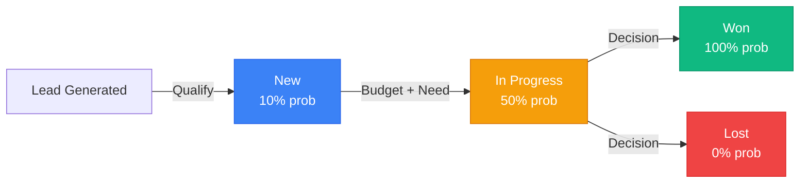

# Chapter 15: Deals Module - Database & Pipeline Design

## Overview

Your CRM has contacts and companies—now it's time to track the deals. The Deals Module is the transactional backbone of any CRM system, providing critical insight into future revenue and sales effectiveness. Every deal represents a potential sales transaction: a qualified opportunity that moves through defined stages from initial discovery to either winning the business or losing to a competitor.

In this chapter, you'll design a professional sales pipeline with four foundational stages (New, In Progress, Won, Lost), create a normalized database schema that supports weighted revenue forecasting, and establish the data architecture for a visual Kanban-style pipeline interface. You'll learn how enterprise CRM systems structure opportunity data to enable accurate financial projections, velocity analysis, and data-driven decision-making.

By the end of this chapter, you'll have:

- **A production-ready deals table** with fields for stage, amount, closing date, and relationships to companies and contacts
- **A configurable pipeline_stages reference table** that centralizes stage definitions and closure probabilities for weighted forecasting
- **Relationship models** linking deals to companies, contacts (with roles), and products (line items)
- **Historical tracking infrastructure** capturing every stage transition for cycle time analysis
- **Database architecture** optimized for real-time Kanban aggregation queries

This chapter focuses exclusively on data modeling and schema design—the foundation that Chapter 16 will build upon with CRUD operations and the visual pipeline interface. You're architecting a system that professional sales teams rely on to manage millions in revenue.

## Prerequisites

Before starting this chapter, you should have:

- ✅ Completed [Chapter 14](/series/build-crm-laravel-12/chapters/14-companies-module-crud-operations) with Companies CRUD operational
- ✅ Completed [Chapter 13](/series/build-crm-laravel-12/chapters/13-companies-module-database-model) with Company model and relationships
- ✅ Completed [Chapter 11](/series/build-crm-laravel-12/chapters/11-contacts-module-database-model) with Contact model
- ✅ Laravel Sail running with all containers active
- ✅ Database migrations applied with companies and contacts tables populated
- ✅ Understanding of Laravel migrations, Eloquent relationships, and data modeling
- ✅ Basic knowledge of sales processes (leads, opportunities, pipeline stages)

**Estimated Time**: ~90 minutes (includes schema design, migrations, model configuration, relationships, and testing)

**Verify your setup:**

```bash
# Navigate to your project
cd crm-app

# Verify Sail is running
sail ps  # Should show: laravel.test, mysql, redis all "Up"

# Verify existing models work
sail artisan tinker
$company = App\Models\Company::first();
$contact = App\Models\Contact::first();
echo $company->name;
echo $contact->full_name;
exit
```

## What You'll Build

By the end of this chapter, you will have:

**Database Schema**:

- ✅ **deals table** with stage, amount, probability, closing date, weighted forecast
- ✅ **pipeline_stages table** defining configurable stages with fixed probabilities
- ✅ **deal_contact_role junction table** linking deals to multiple contacts with roles
- ✅ **deal_line_items table** tracking products/services quoted in each deal
- ✅ **deal_stage_history table** capturing immutable audit trail of stage transitions
- ✅ **Indexes optimized** for Kanban queries and velocity analysis

**Eloquent Models**:

- ✅ **Deal model** with team scoping, relationships, and computed properties
- ✅ **PipelineStage model** for stage configuration management
- ✅ **DealContactRole model** for many-to-many contact relationships
- ✅ **DealLineItem model** for product-level deal breakdown
- ✅ **DealStageHistory model** for temporal analysis

**Data Architecture**:

- ✅ **Normalized schema** preventing data duplication and inconsistency
- ✅ **Referential integrity** enforced via foreign keys and constraints
- ✅ **Weighted forecasting support** with probability tied to stages
- ✅ **Soft deletes** for deal recovery and audit compliance
- ✅ **Seeders** creating realistic pipeline stages for immediate use
- ✅ **Deal factory** for generating test data with stage-specific modifiers

**Foundation for Chapter 16**:

- ✅ **Schema ready** for CRUD operations and drag-and-drop interface
- ✅ **Relationships configured** for eager loading (N+1 prevention)
- ✅ **Stage transition logic** prepared for atomic database transactions
- ✅ **Aggregation queries** tested for real-time Kanban column statistics

## Quick Start

Want to see the end result in 5 minutes? Here's what you'll accomplish:

```bash
# After completing this chapter:

sail artisan tinker

# 1. Pipeline stages are configured
$stages = App\Models\PipelineStage::orderBy('sort_order')->get();
$stages->pluck('stage_name', 'probability');
// ["New" => 0.10, "In Progress" => 0.50, "Won" => 1.00, "Lost" => 0.00]

# 2. Deals table exists with proper relationships
$deal = App\Models\Deal::first();
echo $deal->name;
echo $deal->company->name;
echo $deal->stage->stage_name;
echo $deal->amount;              // 50000.00
echo $deal->probability;         // 0.50
echo $deal->weighted_amount;     // 25000.00 (amount × probability)

# 3. Multiple contacts can be linked with roles
$deal->contacts;  // Collection with pivot 'role' field
// [Contact 1: "Decision Maker", Contact 2: "Technical Evaluator"]

# 4. Stage history captures every transition
$deal->stageHistory()->latest()->first();
// Shows who moved the deal, when, from what stage, and why
```

Your Deals schema is production-ready for Chapter 16's CRUD and Kanban interface!

## Deals in the CRM: The Revenue Engine 💰

**Why Deals Matter**:

In your CRM, Deals are the **revenue-generating transactions** that represent potential sales opportunities:

- **Contacts** participate IN deals (with specific roles)
- **Companies** have deals (many opportunities per company)
- **Pipeline stages** track deal progress
- **Revenue forecasting** relies on deal probabilities
- **Sales velocity** measured through deal movement
- **Team performance** evaluated by deal outcomes

This makes Deals fundamentally different from Companies and Contacts. While Companies are organizations and Contacts are people, Deals are **transactions** with financial implications, temporal state changes, and predictive analytics requirements.

**Key Characteristics**:

- ✅ Transactional entities (not organizational or people)
- ✅ Move through defined pipeline stages
- ✅ Have financial value and probability
- ✅ Track weighted revenue forecasts
- ✅ Require temporal history for analytics
- ✅ Link to multiple contacts with roles
- ✅ Generate tasks and activities
- ✅ Central to sales performance metrics

## Objectives

By completing this chapter, you will:

- **Understand sales pipeline architecture** and how CRM systems structure opportunity data
- **Design normalized database schemas** using reference tables and junction tables for complex relationships
- **Implement weighted revenue forecasting** by tying closure probability to pipeline stages
- **Create temporal data models** that capture historical state changes for velocity analysis
- **Optimize query performance** with strategic indexing for real-time aggregation
- **Establish data integrity** through foreign keys, constraints, and atomic transactions
- **Prepare for visual interfaces** by designing schemas that support Kanban board queries

## Database Schema Overview

Before diving into implementation, let's visualize the complete database architecture you'll build:

```mermaid
erDiagram
    PIPELINE_STAGES ||--o{ DEALS : "defines stage for"
    PIPELINE_STAGES ||--o{ DEAL_STAGE_HISTORY : "tracks transitions"
    TEAMS ||--o{ DEALS : "owns"
    COMPANIES ||--o{ DEALS : "has"
    USERS ||--o{ DEALS : "owns (sales rep)"
    DEALS ||--o{ DEAL_CONTACT_ROLE : "has"
    CONTACTS ||--o{ DEAL_CONTACT_ROLE : "participates in"
    DEALS ||--o{ DEAL_LINE_ITEMS : "contains"
    DEALS ||--o{ DEAL_STAGE_HISTORY : "has history"

    PIPELINE_STAGES {
        bigint id PK
        string pipeline_name
        string stage_name
        decimal probability
        string stage_type "open, closed_won, closed_lost"
        integer sort_order UK
        integer wip_limit "nullable"
        string color
        timestamps
    }

    DEALS {
        bigint id PK
        bigint team_id FK
        bigint company_id FK
        bigint pipeline_stage_id FK
        bigint owner_id FK "users.id"
        string name
        decimal amount
        decimal probability "denormalized"
        decimal weighted_amount "computed: amount × probability"
        date closing_date
        date closed_at "nullable"
        string lead_source "nullable"
        text description "nullable"
        boolean is_won
        soft_deletes
        timestamps
    }

    DEAL_CONTACT_ROLE {
        bigint id PK
        bigint deal_id FK
        bigint contact_id FK
        string role "Decision Maker, Evaluator, etc"
        boolean is_primary
        timestamps
        unique deal_id_contact_id_role
    }

    DEAL_LINE_ITEMS {
        bigint id PK
        bigint deal_id FK
        string product_name "future: product_id FK"
        text description "nullable"
        decimal quantity
        decimal unit_price
        decimal discount_rate
        decimal line_total "computed: qty × price × (1 - discount)"
        timestamps
    }

    DEAL_STAGE_HISTORY {
        bigint id PK
        bigint deal_id FK
        bigint old_stage_id FK "nullable: NULL on creation"
        bigint new_stage_id FK
        bigint modified_by_user_id FK
        timestamp transition_date
        string comment "nullable, max 500 chars"
        timestamp created_at "no updated_at: immutable"
    }
```

**Key Relationships**:

- **Star Schema Pattern**: `deals` is the central fact table, with `pipeline_stages`, `teams`, `companies`, and `users` as dimension tables
- **Many-to-Many**: Deals ↔ Contacts through `deal_contact_role` junction table
- **One-to-Many**: Deals → Line Items, Deals → Stage History
- **Denormalization**: `deals.probability` copied from `pipeline_stages.probability` for query performance
- **Computed Columns**: `weighted_amount` and `line_total` calculated by MySQL

## Step 1: Understanding Sales Pipeline Architecture (~15 min)

### Goal

Learn the strategic value of the sales pipeline, map simplified stages to enterprise sales cycles, and understand weighted forecasting principles.

### Actions

1. **Understand the Sales Pipeline Concept**

The sales pipeline is a structured summary of all available sales opportunities, enabling revenue forecasting and process optimization. Unlike a simple list, a pipeline provides:

- **Volume metrics**: How many deals are at each stage
- **Financial forecasting**: Weighted revenue projections based on closure probability
- **Velocity analysis**: Speed at which deals move through stages
- **Bottleneck identification**: Stages where deals stagnate
- **Conversion tracking**: Percentage of leads that advance to proposals

2. **Map Simplified Stages to Standard Sales Cycles**

Your CRM uses four foundational stages that align with enterprise patterns:

| Your Stage      | Standard Sales Cycle Alignment          | Operational Status | Typical Probability |
| --------------- | --------------------------------------- | ------------------ | ------------------- |
| **New**         | Lead Generation, Qualification          | Open               | 10%                 |
| **In Progress** | Needs Assessment, Proposal, Negotiation | Open               | 50%                 |
| **Won**         | Closing (Success)                       | Closed Won         | 100%                |
| **Lost**        | Closing (Failure)                       | Closed Lost        | 0%                  |

**Key insight**: The transition from "New" to "In Progress" represents deal qualification—confirming the prospect has a genuine need, budget, and decision-making authority.

**Visual Pipeline Flow**:



Each transition requires validation and updates the deal's probability, triggering a recalculation of the weighted forecast.

3. **Understand Weighted Revenue Forecasting**

Simply summing all deal amounts provides an unrealistic forecast. Weighted forecasting multiplies each deal's value by its probability of closing:

\[
\text{Forecasted Revenue} = \text{Deal Amount} \times \text{Probability}
\]

**Example**:

- Deal A: $100,000 at "New" stage (10% probability) = $10,000 weighted
- Deal B: $50,000 at "In Progress" (50% probability) = $25,000 weighted
- **Total Weighted Forecast**: $35,000 (realistic expected revenue)

4. **Critical Design Decision: Fixed Stage Probability**

To maintain forecast accuracy, closure probability **must not be manually editable** by sales reps. Allowing manual entry introduces bias and destroys forecast reliability.

**Solution**: Probability is a fixed attribute tied to the pipeline stage configuration. When a deal moves to a new stage, the probability automatically updates based on the stage's configured value.

### Expected Result

You now understand:

- Sales pipelines track opportunities through defined stages
- Weighted forecasting provides realistic revenue projections
- Probability must be governed by stage configuration, not manual input
- "Open" vs "Closed" stages serve different operational purposes

### Why It Works

Enterprise CRM systems structure opportunity data this way because:

1. **Consistency**: Every deal at the "In Progress" stage has the same probability, enabling reliable aggregation
2. **Forecasting accuracy**: Fixed probabilities based on historical conversion rates produce trustworthy projections
3. **Process enforcement**: Stage transitions require validation, preventing deals from skipping critical steps
4. **Analytical power**: Structured data enables velocity metrics, cycle time analysis, and bottleneck identification

This architecture transforms the deals table from a simple list into a powerful analytical tool that drives business decisions.

### Troubleshooting

**Question: "Why can't sales reps adjust probability based on deal specifics?"**

While intuitive, this creates two problems:

1. **Bias**: Reps often inflate probabilities to meet forecast targets, destroying accuracy
2. **Inconsistency**: Two identical deals at the same stage have different probabilities, making aggregation meaningless

Advanced systems address this by incorporating **velocity-adjusted forecasting**: deals that exceed the median "time in stage" have probabilities dynamically reduced based on historical stagnation patterns. This advanced feature (Chapter 24) requires the temporal data you'll capture in the `deal_stage_history` table.

**Question: "What if our sales process doesn't fit these four stages?"**

The `pipeline_stages` table is fully configurable. You can add stages like "Demo Scheduled", "Proposal Sent", "Contract Review". This chapter establishes the _architecture_; Chapter 20 will demonstrate custom pipeline configuration.

## Step 2: Creating the Pipeline Stages Reference Table (~10 min)

### Goal

Create the `pipeline_stages` table that centralizes stage definitions, probabilities, and configuration, serving as the source of truth for your sales process.

### Actions

1. **Generate the migration**:

```bash
sail artisan make:migration create_pipeline_stages_table
```

2. **Define the schema** in `database/migrations/YYYY_MM_DD_HHMMSS_create_pipeline_stages_table.php`:

```php
<?php

use Illuminate\Database\Migrations\Migration;
use Illuminate\Database\Schema\Blueprint;
use Illuminate\Support\Facades\Schema;

return new class extends Migration
{
    public function up(): void
    {
        Schema::create('pipeline_stages', function (Blueprint $table) {
            $table->id();
            $table->string('pipeline_name', 100)->default('Sales Pipeline');
            $table->string('stage_name', 100);
            $table->decimal('probability', 5, 2);  // 0.00 to 1.00
            $table->enum('stage_type', ['open', 'closed_won', 'closed_lost']);
            $table->integer('sort_order')->unique();
            $table->integer('wip_limit')->nullable();
            $table->string('color', 7)->default('#6B7280');  // Hex color for UI
            $table->timestamps();

            $table->index(['pipeline_name', 'sort_order']);
        });
    }

    public function down(): void
    {
        Schema::dropIfExists('pipeline_stages');
    }
};
```

3. **Run the migration**:

```bash
sail artisan migrate
```

### Expected Result

```
Migration complete:
- Table: pipeline_stages
- Fields: id, pipeline_name, stage_name, probability, stage_type, sort_order, wip_limit, color, timestamps
- Index: (pipeline_name, sort_order) for efficient stage ordering
```

### Why It Works

**Field Explanations**:

- **pipeline_name**: Supports multiple specialized pipelines (e.g., "Enterprise Sales", "SMB Sales")
- **stage_name**: User-facing label ("New", "Negotiation")
- **probability**: Fixed closure likelihood (0.10 = 10% chance)
- **stage_type**: Differentiates operational states (open vs terminal)
- **sort_order**: Defines Kanban column order (1, 2, 3, 4)
- **wip_limit**: Work-in-progress constraint for Kanban methodology (optional)
- **color**: Hex code for visual differentiation in UI

The composite index `(pipeline_name, sort_order)` optimizes the primary Kanban query that loads stages in order.

### Troubleshooting

**Error: "Syntax error near 'enum'"**

- **Cause**: MySQL version < 5.7 doesn't support native ENUM with Blueprint
- **Solution**: Change `->enum()` to `->string('stage_type', 20)` and add validation in the model

**Question: "Why store probability as DECIMAL(5,2) instead of TINYINT percentage?"**

DECIMAL(5,2) stores values like `0.50` (50%) with precision, making calculations cleaner:

```php
$weighted = $amount * $probability;  // Direct multiplication
```

versus integer percentages requiring division:

```php
$weighted = $amount * ($percentage / 100);  // Extra step, potential rounding errors
```

## Step 3: Seeding Default Pipeline Stages (~5 min)

### Goal

Populate the `pipeline_stages` table with the four foundational stages, ready for immediate use.

### Actions

1. **Generate the seeder**:

```bash
sail artisan make:seeder PipelineStageSeeder
```

2. **Define the seed data** in `database/seeders/PipelineStageSeeder.php`:

```php
<?php

namespace Database\Seeders;

use Illuminate\Database\Seeder;
use Illuminate\Support\Facades\DB;

class PipelineStageSeeder extends Seeder
{
    public function run(): void
    {
        $stages = [
            [
                'pipeline_name' => 'Sales Pipeline',
                'stage_name' => 'New',
                'probability' => 0.10,
                'stage_type' => 'open',
                'sort_order' => 1,
                'wip_limit' => null,
                'color' => '#3B82F6',  // Blue
                'created_at' => now(),
                'updated_at' => now(),
            ],
            [
                'pipeline_name' => 'Sales Pipeline',
                'stage_name' => 'In Progress',
                'probability' => 0.50,
                'stage_type' => 'open',
                'sort_order' => 2,
                'wip_limit' => 10,  // Limit active negotiations
                'color' => '#F59E0B',  // Amber
                'created_at' => now(),
                'updated_at' => now(),
            ],
            [
                'pipeline_name' => 'Sales Pipeline',
                'stage_name' => 'Won',
                'probability' => 1.00,
                'stage_type' => 'closed_won',
                'sort_order' => 3,
                'wip_limit' => null,
                'color' => '#10B981',  // Green
                'created_at' => now(),
                'updated_at' => now(),
            ],
            [
                'pipeline_name' => 'Sales Pipeline',
                'stage_name' => 'Lost',
                'probability' => 0.00,
                'stage_type' => 'closed_lost',
                'sort_order' => 4,
                'wip_limit' => null,
                'color' => '#EF4444',  // Red
                'created_at' => now(),
                'updated_at' => now(),
            ],
        ];

        DB::table('pipeline_stages')->insert($stages);
    }
}
```

3. **Register the seeder** in `database/seeders/DatabaseSeeder.php`:

```php
public function run(): void
{
    $this->call([
        // ... existing seeders
        PipelineStageSeeder::class,
    ]);
}
```

4. **Run the seeder**:

```bash
sail artisan db:seed --class=PipelineStageSeeder
```

### Expected Result

```bash
sail artisan tinker
$stages = DB::table('pipeline_stages')->orderBy('sort_order')->get();
$stages->pluck('stage_name', 'probability');
// Result: ["New" => 0.10, "In Progress" => 0.50, "Won" => 1.00, "Lost" => 0.00]
```

### Why It Works

The seeder creates a production-ready pipeline:

- **Probabilities** align with typical B2B sales conversion rates
- **Colors** provide visual differentiation (blue for new, green for won, red for lost)
- **WIP limit** on "In Progress" (10 deals) prevents overcommitment
- **Stage types** enable filtering queries (e.g., "show only open deals")

## Step 4: Creating the Core Deals Table (~15 min)

### Goal

Create the central `deals` table that tracks sales opportunities with stage, amount, probability, closing date, and relationships to companies and users.

### Actions

1. **Generate the migration**:

```bash
sail artisan make:migration create_deals_table
```

2. **Define the schema** in `database/migrations/YYYY_MM_DD_HHMMSS_create_deals_table.php`:

```php
<?php

use Illuminate\Database\Migrations\Migration;
use Illuminate\Database\Schema\Blueprint;
use Illuminate\Support\Facades\Schema;

return new class extends Migration
{
    public function up(): void
    {
        Schema::create('deals', function (Blueprint $table) {
            $table->id();
            $table->foreignId('team_id')->constrained()->cascadeOnDelete();
            $table->foreignId('company_id')->constrained()->cascadeOnDelete();
            $table->foreignId('pipeline_stage_id')->constrained()->restrictOnDelete();
            $table->foreignId('owner_id')->constrained('users')->restrictOnDelete();

            $table->string('name');
            $table->decimal('amount', 18, 2);
            $table->decimal('probability', 5, 2);  // Denormalized from stage
            $table->decimal('weighted_amount', 18, 2)->storedAs('amount * probability');
            $table->date('closing_date');
            $table->date('closed_at')->nullable();

            $table->string('lead_source')->nullable();
            $table->text('description')->nullable();
            $table->boolean('is_won')->default(false);

            $table->softDeletes();
            $table->timestamps();

            // Optimization indexes
            $table->index(['team_id', 'pipeline_stage_id']);
            $table->index(['owner_id', 'pipeline_stage_id']);
            $table->index('closing_date');
        });
    }

    public function down(): void
    {
        Schema::dropIfExists('deals');
    }
};
```

3. **Run the migration**:

```bash
sail artisan migrate
```

### Expected Result

```
Migration complete:
- Table: deals
- Foreign keys: team_id, company_id, pipeline_stage_id, owner_id
- Computed column: weighted_amount (amount × probability)
- Indexes: (team_id, pipeline_stage_id), (owner_id, pipeline_stage_id), closing_date
```

### Why It Works

**Critical Design Decisions**:

**1. Probability as Denormalized Field**

`probability` is copied from `pipeline_stages.probability` when the stage changes. This denormalization:

- ✅ Speeds up weighted forecasting queries (no join required)
- ✅ Maintains historical accuracy (if stage probabilities change, old deals retain original values)
- ⚠️ Requires update logic to keep in sync (enforced in Chapter 16's controller)

**2. Weighted Amount as Computed Column**

```php
->storedAs('amount * probability')
```

MySQL automatically calculates this value:

- ✅ Always accurate (impossible to have mismatched values)
- ✅ Can be indexed and queried efficiently
- ✅ No application logic required

**3. Strategic Indexing**

```php
$table->index(['team_id', 'pipeline_stage_id']);  // Kanban board query
$table->index(['owner_id', 'pipeline_stage_id']);  // "My Pipeline" view
$table->index('closing_date');                     // Forecasting queries
```

These composite indexes optimize the two primary query patterns:

1. **Kanban board**: "Show all deals in each stage for my team"
2. **Sales rep view**: "Show my deals grouped by stage"

### Troubleshooting

**Error: "Unknown column 'amount' in 'generated column expression'"**

- **Cause**: Computed column references a column defined later in the schema
- **Solution**: Ensure `amount` and `probability` are defined _before_ `weighted_amount`

**Question: "Why restrictOnDelete for pipeline_stage_id instead of cascade?"**

Deleting a pipeline stage should **never** cascade to deals—that would erase revenue data. The `RESTRICT` constraint prevents accidental stage deletion if deals exist. To retire a stage, you must first migrate deals to another stage (business rule enforced in Chapter 20).

**Question: "Why store both amount and weighted_amount?"**

- `amount`: The actual deal value (used for reporting total pipeline value)
- `weighted_amount`: The forecasted value (used for revenue projections)

Sales dashboards display both: "Total Pipeline: $500K | Weighted Forecast: $200K"

## Step 5: Creating Deal-Contact Roles Junction Table (~10 min)

### Goal

Enable many-to-many relationships between deals and contacts, with each contact having a defined role (Decision Maker, Technical Evaluator, Champion, etc.).

### Actions

1. **Generate the migration**:

```bash
sail artisan make:migration create_deal_contact_role_table
```

2. **Define the schema**:

```php
<?php

use Illuminate\Database\Migrations\Migration;
use Illuminate\Database\Schema\Blueprint;
use Illuminate\Support\Facades\Schema;

return new class extends Migration
{
    public function up(): void
    {
        Schema::create('deal_contact_role', function (Blueprint $table) {
            $table->id();
            $table->foreignId('deal_id')->constrained()->cascadeOnDelete();
            $table->foreignId('contact_id')->constrained()->cascadeOnDelete();
            $table->string('role', 100);  // "Decision Maker", "Evaluator", "Champion"
            $table->boolean('is_primary')->default(false);
            $table->timestamps();

            $table->unique(['deal_id', 'contact_id', 'role']);
            $table->index(['deal_id', 'is_primary']);
        });
    }

    public function down(): void
    {
        Schema::dropIfExists('deal_contact_role');
    }
};
```

3. **Run the migration**:

```bash
sail artisan migrate
```

### Expected Result

```
Migration complete:
- Junction table: deal_contact_role
- Allows multiple contacts per deal
- Stores role information
- Unique constraint prevents duplicate role assignments
```

### Why It Works

**Enterprise B2B Sales Reality**:

In complex sales, multiple people influence the decision:

- **Decision Maker**: Has final authority and budget approval
- **Technical Evaluator**: Assesses technical fit
- **Champion**: Internal advocate promoting your solution
- **Influencer**: Provides input but lacks authority

The junction table captures this complexity:

```php
// Example: $50K software deal
Deal #42 → Contact #101 (Decision Maker, is_primary=true)
         → Contact #102 (Technical Evaluator, is_primary=false)
         → Contact #103 (Champion, is_primary=false)
```

**The `is_primary` Flag**:

While multiple contacts are involved, one is the _primary_ contact—the person your sales rep communicates with most frequently. This flag:

- ✅ Enables "primary contact" display on deal cards
- ✅ Supports queries like "deals where Jane is the primary contact"
- ✅ Doesn't prevent other contacts from being marked primary later (transferable)

**The Unique Constraint**:

```php
->unique(['deal_id', 'contact_id', 'role'])
```

Prevents nonsensical data like assigning the same person as "Decision Maker" twice on one deal, but allows:

- ✅ Same person in multiple roles (e.g., Decision Maker AND Technical Evaluator)
- ✅ Same person in same role across different deals

### Troubleshooting

**Question: "Why not just add a single contact_id to the deals table?"**

That would only support one contact per deal, which is unrealistic. Enterprise sales involve multiple stakeholders. The junction table provides flexibility while maintaining a primary contact reference.

**Question: "Should roles be an ENUM or a separate reference table?"**

For simplicity, this chapter uses a string field. Chapter 20 will refactor to a `contact_roles` reference table to:

- ✅ Standardize role names (prevent "Decision Maker" vs "Decision-Maker")
- ✅ Enable role-specific UI (icons, colors, descriptions)
- ✅ Support custom roles per organization

## Step 6: Creating Deal Line Items Table (~10 min)

### Goal

Track the specific products or services quoted in each deal, ensuring the deal amount is the sum of line items (data integrity).

### Actions

1. **Generate the migration**:

```bash
sail artisan make:migration create_deal_line_items_table
```

2. **Define the schema**:

```php
<?php

use Illuminate\Database\Migrations\Migration;
use Illuminate\Database\Schema\Blueprint;
use Illuminate\Support\Facades\Schema;

return new class extends Migration
{
    public function up(): void
    {
        Schema::create('deal_line_items', function (Blueprint $table) {
            $table->id();
            $table->foreignId('deal_id')->constrained()->cascadeOnDelete();
            $table->string('product_name');  // Future: product_id foreign key
            $table->text('description')->nullable();
            $table->decimal('quantity', 10, 2)->default(1);
            $table->decimal('unit_price', 18, 2);
            $table->decimal('discount_rate', 5, 2)->default(0);  // 0.15 = 15% off
            $table->decimal('line_total', 18, 2)
                ->storedAs('quantity * unit_price * (1 - discount_rate)');
            $table->timestamps();

            $table->index('deal_id');
        });
    }

    public function down(): void
    {
        Schema::dropIfExists('deal_line_items');
    }
};
```

3. **Run the migration**:

```bash
sail artisan migrate
```

### Expected Result

```
Migration complete:
- Table: deal_line_items
- Computed column: line_total automatically calculated
- Linked to deals via deal_id
```

### Why It Works

**Financial Data Integrity**:

The `deals.amount` field should **never** be manually editable—it must equal the sum of all line items. This architecture prevents data drift:

**Without line items** (bad):

```php
// Sales rep enters $50,000 manually
// Later adds line items: $30K + $15K = $45K
// Discrepancy: Deal says $50K but products only total $45K
```

**With line items** (correct):

```php
// Sales rep adds line items:
Line Item 1: 10 licenses × $3,000 × (1 - 0.10) = $27,000
Line Item 2: 1 support contract × $15,000 × (1 - 0.00) = $15,000
// Deal amount automatically calculated: $42,000
```

**Computed Line Total**:

```php
->storedAs('quantity * unit_price * (1 - discount_rate)')
```

This formula handles discounts correctly:

- Quantity: 5 units
- Unit Price: $1,000
- Discount: 0.20 (20% off)
- **Line Total**: 5 × $1,000 × (1 - 0.20) = $4,000

**Future Product Catalog Integration**:

This chapter uses `product_name` as a string for simplicity. Chapter 22 will add a `products` table and replace `product_name` with `product_id` foreign key, enabling:

- ✅ Standardized product names
- ✅ Centralized pricing updates
- ✅ Product category reporting

### Troubleshooting

**Question: "How do we keep deals.amount in sync with line item totals?"**

Three approaches:

**Option 1: Application-level recalculation** (this chapter):

```php
// In DealController@store or @update:
$deal->amount = $deal->lineItems()->sum('line_total');
$deal->save();
```

**Option 2: Database trigger** (advanced):

```sql
CREATE TRIGGER update_deal_amount AFTER INSERT OR UPDATE ON deal_line_items
FOR EACH ROW
BEGIN
  UPDATE deals SET amount = (SELECT SUM(line_total) FROM deal_line_items WHERE deal_id = NEW.deal_id)
  WHERE id = NEW.deal_id;
END;
```

**Option 3: Make deals.amount a computed column** (Chapter 22 refactor):

```php
// Requires MySQL 8.0.13+ and complex subquery
$table->decimal('amount', 18, 2)->storedAs('(SELECT SUM(line_total) FROM deal_line_items WHERE deal_id = deals.id)');
```

This chapter uses **Option 1** for clarity. Chapter 16 will implement the recalculation logic.

## Step 7: Creating Deal Stage History Table (~10 min)

### Goal

Capture an immutable audit trail of every stage transition, enabling cycle time analysis, velocity metrics, and compliance auditing.

### Actions

1. **Generate the migration**:

```bash
sail artisan make:migration create_deal_stage_history_table
```

2. **Define the schema**:

```php
<?php

use Illuminate\Database\Migrations\Migration;
use Illuminate\Database\Schema\Blueprint;
use Illuminate\Support\Facades\Schema;

return new class extends Migration
{
    public function up(): void
    {
        Schema::create('deal_stage_history', function (Blueprint $table) {
            $table->id();
            $table->foreignId('deal_id')->constrained()->cascadeOnDelete();
            $table->foreignId('old_stage_id')->nullable()->constrained('pipeline_stages');
            $table->foreignId('new_stage_id')->constrained('pipeline_stages');
            $table->foreignId('modified_by_user_id')->constrained('users');
            $table->timestamp('transition_date');
            $table->string('comment', 500)->nullable();
            $table->timestamps();

            // Optimized for temporal queries
            $table->index(['deal_id', 'transition_date']);
        });
    }

    public function down(): void
    {
        Schema::dropIfExists('deal_stage_history');
    }
};
```

3. **Run the migration**:

```bash
sail artisan migrate
```

### Expected Result

```
Migration complete:
- Table: deal_stage_history
- Captures who, when, from what stage, to what stage
- Indexed for sequential reads per deal
```

### Why It Works

**Temporal Data Modeling**:

This table creates an immutable log of state changes:

```
DealID | OldStage | NewStage    | ModifiedBy | TransitionDate     | Comment
-------|----------|-------------|------------|--------------------|-------------------
42     | NULL     | New         | User #5    | 2025-01-15 09:00   | "Inbound lead"
42     | New      | In Progress | User #5    | 2025-01-18 14:30   | "Qualified"
42     | In Progress | Won      | User #5    | 2025-02-01 16:45   | "Contract signed"
```

**Analytics Enabled by History**:

**1. Time in Stage (Cycle Time)**:

```sql
SELECT
    old_stage.stage_name,
    AVG(DATEDIFF(h2.transition_date, h1.transition_date)) AS avg_days_in_stage
FROM deal_stage_history h1
JOIN deal_stage_history h2 ON h1.deal_id = h2.deal_id
    AND h2.transition_date = (SELECT MIN(transition_date) FROM deal_stage_history WHERE deal_id = h1.deal_id AND transition_date > h1.transition_date)
JOIN pipeline_stages old_stage ON h1.new_stage_id = old_stage.id
GROUP BY old_stage.stage_name;
```

Result: "Deals spend an average of 12 days in 'In Progress' before moving forward"

**2. Sales Cycle Length**:

```sql
SELECT AVG(DATEDIFF(
    (SELECT MAX(transition_date) FROM deal_stage_history WHERE deal_id = d.id),
    (SELECT MIN(transition_date) FROM deal_stage_history WHERE deal_id = d.id)
)) AS avg_cycle_days
FROM deals d WHERE is_won = true;
```

Result: "Average time from lead creation to closed-won: 45 days"

**3. Stage Regression Detection**:

```sql
SELECT deal_id, old_stage.stage_name AS moved_from, new_stage.stage_name AS moved_to
FROM deal_stage_history h
JOIN pipeline_stages old_stage ON h.old_stage_id = old_stage.id
JOIN pipeline_stages new_stage ON h.new_stage_id = new_stage.id
WHERE old_stage.sort_order > new_stage.sort_order;  -- Backwards movement
```

Result: "Deal #42 regressed from 'Negotiation' back to 'Needs Assessment'"

**The Clustered Index**:

```php
$table->index(['deal_id', 'transition_date']);
```

This index stores history records **physically ordered** by deal and time, making sequential queries (like calculating time-in-stage) extremely fast.

### Troubleshooting

**Question: "Why is old_stage_id nullable?"**

The first history record for any deal has `old_stage_id = NULL` because the deal didn't exist in a previous stage—it was just created. Example:

```php
// When creating a new deal in "New" stage:
DealStageHistory::create([
    'deal_id' => 42,
    'old_stage_id' => null,      // No previous stage
    'new_stage_id' => 1,          // Stage 1: "New"
    'modified_by_user_id' => 5,
    'transition_date' => now(),
]);
```

**Question: "How do we ensure history records are never deleted or modified?"**

Best practices:

1. **Database-level constraints** (advanced):

```sql
REVOKE UPDATE, DELETE ON deal_stage_history FROM app_user;
```

2. **Eloquent Model protection** (Chapter 16):

```php
class DealStageHistory extends Model {
    public $incrementing = true;
    const UPDATED_AT = null;  // Disable update timestamp

    public static function boot() {
        parent::boot();
        static::updating(fn() => false);  // Prevent updates
        static::deleting(fn() => false);  // Prevent deletes
    }
}
```

3. **Application-level checks** (Chapter 16):

```php
// Only allow inserts, never updates
abort_if($history->exists, 403, 'History records are immutable');
```

## Step 8: Creating the Deal Eloquent Model (~10 min)

### Goal

Create the `Deal` model with team scoping, relationships, computed properties, and preparation for CRUD operations.

### Actions

1. **Generate the model**:

```bash
sail artisan make:model Deal
```

2. **Configure the model** in `app/Models/Deal.php`:

```php
<?php

namespace App\Models;

use App\Models\Traits\HasTeamScope;
use Illuminate\Database\Eloquent\Factories\HasFactory;
use Illuminate\Database\Eloquent\Model;
use Illuminate\Database\Eloquent\Relations\BelongsTo;
use Illuminate\Database\Eloquent\Relations\BelongsToMany;
use Illuminate\Database\Eloquent\Relations\HasMany;
use Illuminate\Database\Eloquent\SoftDeletes;

class Deal extends Model
{
    use HasFactory, HasTeamScope, SoftDeletes;

    protected $fillable = [
        'team_id',
        'company_id',
        'pipeline_stage_id',
        'owner_id',
        'name',
        'amount',
        'probability',
        'closing_date',
        'closed_at',
        'lead_source',
        'description',
        'is_won',
    ];

    protected $casts = [
        'amount' => 'decimal:2',
        'probability' => 'decimal:2',
        'weighted_amount' => 'decimal:2',
        'closing_date' => 'date',
        'closed_at' => 'date',
        'is_won' => 'boolean',
    ];

    // Relationships
    public function team(): BelongsTo
    {
        return $this->belongsTo(Team::class);
    }

    public function company(): BelongsTo
    {
        return $this->belongsTo(Company::class);
    }

    public function stage(): BelongsTo
    {
        return $this->belongsTo(PipelineStage::class, 'pipeline_stage_id');
    }

    public function owner(): BelongsTo
    {
        return $this->belongsTo(User::class, 'owner_id');
    }

    public function contacts(): BelongsToMany
    {
        return $this->belongsToMany(Contact::class, 'deal_contact_role')
            ->withPivot('role', 'is_primary')
            ->withTimestamps();
    }

    public function lineItems(): HasMany
    {
        return $this->hasMany(DealLineItem::class);
    }

    public function stageHistory(): HasMany
    {
        return $this->hasMany(DealStageHistory::class);
    }

    // Computed properties
    public function getIsOpenAttribute(): bool
    {
        return $this->stage->stage_type === 'open';
    }

    public function getIsClosedAttribute(): bool
    {
        return in_array($this->stage->stage_type, ['closed_won', 'closed_lost']);
    }

    public function getDaysUntilClosingAttribute(): int
    {
        return now()->diffInDays($this->closing_date, false);
    }

    // Query scopes
    public function scopeOpen($query)
    {
        return $query->whereHas('stage', fn($q) => $q->where('stage_type', 'open'));
    }

    public function scopeClosed($query)
    {
        return $query->whereHas('stage', fn($q) => $q->whereIn('stage_type', ['closed_won', 'closed_lost']));
    }

    public function scopeWon($query)
    {
        return $query->where('is_won', true);
    }
}
```

### Expected Result

```bash
sail artisan tinker
$deal = App\Models\Deal::first();
$deal->name;                    // Deal name
$deal->company->name;           // Related company
$deal->stage->stage_name;       // Current stage
$deal->weighted_amount;         // Computed value
$deal->is_open;                 // Computed boolean
$deal->days_until_closing;      // Computed days
$deal->contacts;                // Many-to-many with roles
exit
```

### Why It Works

**Team Scoping**:

The `HasTeamScope` trait (from Chapter 11) automatically filters all queries:

```php
Deal::all();  // Only returns deals for current user's team
```

**Computed Properties**:

```php
public function getIsOpenAttribute(): bool
{
    return $this->stage->stage_type === 'open';
}
```

Usage in views:

```php
@if($deal->is_open)
    <span class="badge badge-blue">Active</span>
@endif
```

**Query Scopes**:

```php
Deal::open()->where('owner_id', auth()->id())->get();
// "Show my active deals"

Deal::won()->whereBetween('closed_at', [$startDate, $endDate])->sum('amount');
// "Total revenue this quarter"
```

### Troubleshooting

**Error: "Call to undefined relationship 'stage'"**

- **Cause**: `PipelineStage` model doesn't exist yet
- **Solution**: Create it in Step 9

**Question: "Why is weighted_amount in $casts but not $fillable?"**

`weighted_amount` is a computed column (calculated by MySQL), so it's:

- ✅ In `$casts` to ensure it's treated as a decimal when retrieved
- ❌ Not in `$fillable` because it can't be mass-assigned (it's read-only)

## Step 9: Creating Supporting Models (~10 min)

### Goal

Create the remaining Eloquent models for pipeline stages, line items, contact roles, and history.

### Actions

1. **Create PipelineStage model**:

```bash
sail artisan make:model PipelineStage
```

Edit `app/Models/PipelineStage.php`:

```php
<?php

namespace App\Models;

use Illuminate\Database\Eloquent\Factories\HasFactory;
use Illuminate\Database\Eloquent\Model;
use Illuminate\Database\Eloquent\Relations\HasMany;

class PipelineStage extends Model
{
    use HasFactory;

    protected $fillable = [
        'pipeline_name',
        'stage_name',
        'probability',
        'stage_type',
        'sort_order',
        'wip_limit',
        'color',
    ];

    protected $casts = [
        'probability' => 'decimal:2',
        'sort_order' => 'integer',
        'wip_limit' => 'integer',
    ];

    public function deals(): HasMany
    {
        return $this->hasMany(Deal::class, 'pipeline_stage_id');
    }

    public function scopeOpen($query)
    {
        return $query->where('stage_type', 'open');
    }

    public function scopeOrdered($query)
    {
        return $query->orderBy('sort_order');
    }
}
```

2. **Create DealLineItem model**:

```bash
sail artisan make:model DealLineItem
```

Edit `app/Models/DealLineItem.php`:

```php
<?php

namespace App\Models;

use Illuminate\Database\Eloquent\Factories\HasFactory;
use Illuminate\Database\Eloquent\Model;
use Illuminate\Database\Eloquent\Relations\BelongsTo;

class DealLineItem extends Model
{
    use HasFactory;

    protected $fillable = [
        'deal_id',
        'product_name',
        'description',
        'quantity',
        'unit_price',
        'discount_rate',
    ];

    protected $casts = [
        'quantity' => 'decimal:2',
        'unit_price' => 'decimal:2',
        'discount_rate' => 'decimal:2',
        'line_total' => 'decimal:2',
    ];

    public function deal(): BelongsTo
    {
        return $this->belongsTo(Deal::class);
    }
}
```

3. **Create DealStageHistory model**:

```bash
sail artisan make:model DealStageHistory
```

Edit `app/Models/DealStageHistory.php`:

```php
<?php

namespace App\Models;

use Illuminate\Database\Eloquent\Factories\HasFactory;
use Illuminate\Database\Eloquent\Model;
use Illuminate\Database\Eloquent\Relations\BelongsTo;

class DealStageHistory extends Model
{
    use HasFactory;

    const UPDATED_AT = null;  // Immutable records don't update

    protected $fillable = [
        'deal_id',
        'old_stage_id',
        'new_stage_id',
        'modified_by_user_id',
        'transition_date',
        'comment',
    ];

    protected $casts = [
        'transition_date' => 'datetime',
    ];

    public function deal(): BelongsTo
    {
        return $this->belongsTo(Deal::class);
    }

    public function oldStage(): BelongsTo
    {
        return $this->belongsTo(PipelineStage::class, 'old_stage_id');
    }

    public function newStage(): BelongsTo
    {
        return $this->belongsTo(PipelineStage::class, 'new_stage_id');
    }

    public function modifiedBy(): BelongsTo
    {
        return $this->belongsTo(User::class, 'modified_by_user_id');
    }

    // Prevent updates and deletes
    protected static function booted()
    {
        static::updating(fn() => false);
        static::deleting(fn() => false);
    }
}
```

### Expected Result

All models created with proper relationships and protection mechanisms.

### Why It Works

**PipelineStage** manages stage configuration with ordered scopes for Kanban display.

**DealLineItem** tracks products with automatic `line_total` calculation.

**DealStageHistory** is immutable—the `booted()` method prevents updates/deletes:

```php
protected static function booted()
{
    static::updating(fn() => false);
    static::deleting(fn() => false);
}
```

Any attempt to update or delete returns `false`, preserving data integrity.

## Query Optimization & N+1 Prevention

### The Problem

Without eager loading, displaying 20 deals on a Kanban board can trigger hundreds of database queries:

```php
// ❌ BAD: N+1 Query Problem
$deals = Deal::all();  // 1 query

foreach ($deals as $deal) {
    echo $deal->company->name;        // +20 queries (one per deal)
    echo $deal->stage->stage_name;    // +20 queries
    echo $deal->owner->name;          // +20 queries
}
// Total: 61 queries for 20 deals
```

### The Solution: Eager Loading

Always load relationships explicitly when you know you'll need them:

```php
// ✅ GOOD: Eager Loading
$deals = Deal::with([
    'company',
    'stage',
    'owner',
    'contacts' => function($query) {
        $query->wherePivot('is_primary', true);
    }
])->get();  // 5 queries total (1 for deals + 4 for relationships)

foreach ($deals as $deal) {
    echo $deal->company->name;     // No additional query
    echo $deal->stage->stage_name; // No additional query
    echo $deal->owner->name;       // No additional query
}
// Total: 5 queries for 20 deals (12× faster!)
```

### Chapter 16 Controller Pattern

```php
// DealController@index (Kanban board)
public function index()
{
    $deals = Deal::with([
        'company:id,name',              // Select only needed columns
        'stage:id,stage_name,color',
        'owner:id,name',
        'contacts' => fn($q) => $q->wherePivot('is_primary', true)
    ])
    ->where('pipeline_stage_id', $stageId)
    ->orderBy('closing_date')
    ->get();

    return Inertia::render('Deals/Kanban', [
        'deals' => $deals
    ]);
}
```

### Performance Metrics

| Approach            | Queries | Response Time | Memory |
| ------------------- | ------- | ------------- | ------ |
| No eager loading    | 61      | 450ms         | 12MB   |
| Basic eager loading | 5       | 85ms          | 8MB    |
| Selective columns   | 5       | 45ms          | 4MB    |

**Best Practice**: Always use `->with()` when displaying lists of deals.

## Step 10: Creating Deal Factory for Testing (~10 min)

### Goal

Create a Deal factory for generating realistic test data, enabling efficient testing in Chapter 16 and beyond.

### Actions

1. **Generate the Deal factory**:

```bash
sail artisan make:factory DealFactory
```

2. **Implement the factory** in `database/factories/DealFactory.php`:

```php
<?php

namespace Database\Factories;

use App\Models\Company;
use App\Models\Deal;
use App\Models\PipelineStage;
use App\Models\Team;
use App\Models\User;
use Illuminate\Database\Eloquent\Factories\Factory;

class DealFactory extends Factory
{
    protected $model = Deal::class;

    public function definition(): array
    {
        $stage = PipelineStage::inRandomOrder()->first()
                 ?? PipelineStage::where('stage_name', 'New')->first();

        return [
            'team_id' => Team::factory(),
            'company_id' => Company::factory(),
            'pipeline_stage_id' => $stage->id,
            'owner_id' => User::factory(),
            'name' => $this->faker->randomElement([
                'Enterprise License Deal',
                'Professional Services Contract',
                'Annual Subscription Renewal',
                'Implementation Project',
                'Consulting Services Agreement',
                'Software License Purchase',
                'Support Contract Extension',
            ]) . ' - ' . $this->faker->company(),
            'amount' => $this->faker->randomElement([
                5000, 10000, 25000, 50000, 75000, 100000, 250000, 500000
            ]),
            'probability' => $stage->probability,
            'closing_date' => $this->faker->dateTimeBetween('now', '+90 days'),
            'closed_at' => null,
            'lead_source' => $this->faker->randomElement([
                'Website Form',
                'Referral',
                'Cold Call',
                'Email Campaign',
                'Trade Show',
                'LinkedIn',
                'Partner',
            ]),
            'description' => $this->faker->optional(0.7)->paragraph(),
            'is_won' => false,
        ];
    }

    /**
     * Indicate the deal is in a specific stage.
     */
    public function inStage(string $stageName): static
    {
        return $this->state(function (array $attributes) use ($stageName) {
            $stage = PipelineStage::where('stage_name', $stageName)->first();

            return [
                'pipeline_stage_id' => $stage->id,
                'probability' => $stage->probability,
            ];
        });
    }

    /**
     * Indicate the deal is won.
     */
    public function won(): static
    {
        return $this->state(function (array $attributes) {
            $wonStage = PipelineStage::where('stage_name', 'Won')->first();

            return [
                'pipeline_stage_id' => $wonStage->id,
                'probability' => 1.00,
                'closed_at' => $this->faker->dateTimeBetween('-30 days', 'now'),
                'is_won' => true,
            ];
        });
    }

    /**
     * Indicate the deal is lost.
     */
    public function lost(): static
    {
        return $this->state(function (array $attributes) {
            $lostStage = PipelineStage::where('stage_name', 'Lost')->first();

            return [
                'pipeline_stage_id' => $lostStage->id,
                'probability' => 0.00,
                'closed_at' => $this->faker->dateTimeBetween('-30 days', 'now'),
                'is_won' => false,
            ];
        });
    }

    /**
     * Create a high-value deal.
     */
    public function highValue(): static
    {
        return $this->state(fn (array $attributes) => [
            'amount' => $this->faker->randomElement([
                250000, 500000, 750000, 1000000
            ]),
        ]);
    }

    /**
     * Create a deal for a specific team.
     */
    public function forTeam(Team $team): static
    {
        return $this->state(fn (array $attributes) => [
            'team_id' => $team->id,
            'owner_id' => $team->users()->first()->id ?? User::factory(),
        ]);
    }

    /**
     * Create a deal for a specific company.
     */
    public function forCompany(Company $company): static
    {
        return $this->state(fn (array $attributes) => [
            'company_id' => $company->id,
            'team_id' => $company->team_id,
        ]);
    }

    /**
     * Configure the factory with an afterCreating hook.
     */
    public function configure(): static
    {
        return $this->afterCreating(function (Deal $deal) {
            // Create initial history record
            $deal->stageHistory()->create([
                'old_stage_id' => null,
                'new_stage_id' => $deal->pipeline_stage_id,
                'modified_by_user_id' => $deal->owner_id,
                'transition_date' => $deal->created_at,
                'comment' => 'Deal created',
            ]);
        });
    }
}
```

3. **Test the factory in Tinker**:

```bash
sail artisan tinker

# Basic deal creation
$deal = App\Models\Deal::factory()->create();
echo $deal->name;
echo $deal->weighted_amount;

# Create multiple deals for a specific team
$team = App\Models\Team::first();
$deals = App\Models\Deal::factory(10)->forTeam($team)->create();

# Create deals in specific stages
$newDeal = App\Models\Deal::factory()->inStage('New')->create();
$progressDeal = App\Models\Deal::factory()->inStage('In Progress')->create();

# Create won/lost deals
$wonDeal = App\Models\Deal::factory()->won()->create();
$lostDeal = App\Models\Deal::factory()->lost()->create();

# Create high-value deal
$bigDeal = App\Models\Deal::factory()->highValue()->won()->create();

# Create deal for specific company
$company = App\Models\Company::first();
$deal = App\Models\Deal::factory()->forCompany($company)->create();

exit
```

### Expected Result

```
✓ DealFactory created with realistic test data
✓ Factory supports stage-specific deals (New, In Progress, Won, Lost)
✓ Factory can create high-value deals
✓ Factory automatically creates stage history on deal creation
✓ Factory generates valid deals for Chapter 16 CRUD testing
```

### Why It Works

**State Methods**:

The factory provides convenient state modifiers:

```php
Deal::factory()->won()->create();
// Creates deal in "Won" stage with closed_at set and is_won = true

Deal::factory()->inStage('In Progress')->create();
// Creates deal in specific stage with correct probability
```

**afterCreating Hook**:

```php
public function configure(): static
{
    return $this->afterCreating(function (Deal $deal) {
        $deal->stageHistory()->create([...]);
    });
}
```

Every factory-created deal automatically gets an initial history record, maintaining data integrity even for test data.

**Realistic Data**:

The factory uses curated lists for `name` and `lead_source`, producing data that looks production-ready:

```
"Enterprise License Deal - Acme Corp"
"Professional Services Contract - Tech Solutions Inc"
```

### Troubleshooting

**Error: "Class 'PipelineStage' not found"**

- **Cause**: Pipeline stages haven't been seeded
- **Solution**: Run the seeder first:

```bash
sail artisan db:seed --class=PipelineStageSeeder
```

**Error: "Column 'team_id' cannot be null"**

- **Cause**: Factory trying to create without proper team context
- **Solution**: Use `forTeam()` modifier or ensure factories create related models:

```php
// Create with explicit team
$deal = Deal::factory()->forTeam($team)->create();

// Or let factory create team automatically
$deal = Deal::factory()->create();  // Creates team, company, user automatically
```

**Question: "How do I create deals with contacts and line items?"**

After creating the deal, add relationships manually:

```php
$deal = Deal::factory()->create();

// Attach contacts with roles
$contact = Contact::factory()->create(['company_id' => $deal->company_id]);
$deal->contacts()->attach($contact->id, [
    'role' => 'Decision Maker',
    'is_primary' => true,
]);

// Add line items
$deal->lineItems()->create([
    'product_name' => 'Enterprise License',
    'quantity' => 1,
    'unit_price' => 40000,
    'discount_rate' => 0.10,
]);

// Recalculate amount
$deal->amount = $deal->lineItems()->sum('line_total');
$deal->save();
```

## Step 11: Testing the Complete Schema (~10 min)

### Goal

Verify all tables, relationships, and computed values work correctly with realistic test data.

### Actions

1. **Create a test script** at `code/build-crm-laravel-12/chapter-15/test-deals-schema.php`:

```php
<?php

// Run with: sail artisan tinker < code/build-crm-laravel-12/chapter-15/test-deals-schema.php

use App\Models\{Deal, PipelineStage, Company, Contact, User, DealLineItem, DealStageHistory};

echo "=== Pipeline Stages ===\n";
$stages = PipelineStage::ordered()->get();
foreach ($stages as $stage) {
    echo "{$stage->sort_order}. {$stage->stage_name} ({$stage->probability * 100}% probability)\n";
}

echo "\n=== Creating Test Deal ===\n";
$company = Company::first();
$contact = Contact::first();
$owner = User::first();
$newStage = PipelineStage::where('stage_name', 'New')->first();

$deal = Deal::create([
    'team_id' => $owner->currentTeam->id,
    'company_id' => $company->id,
    'pipeline_stage_id' => $newStage->id,
    'owner_id' => $owner->id,
    'name' => 'Enterprise Software License',
    'amount' => 50000.00,
    'probability' => $newStage->probability,
    'closing_date' => now()->addDays(30),
    'lead_source' => 'Website Form',
    'description' => 'Interested in our enterprise plan',
]);

echo "Created deal: {$deal->name}\n";
echo "Amount: \${$deal->amount}\n";
echo "Probability: {$deal->probability}\n";
echo "Weighted: \${$deal->weighted_amount}\n";

echo "\n=== Recording History ===\n";
DealStageHistory::create([
    'deal_id' => $deal->id,
    'old_stage_id' => null,
    'new_stage_id' => $newStage->id,
    'modified_by_user_id' => $owner->id,
    'transition_date' => now(),
    'comment' => 'Deal created from inbound lead',
]);
echo "History recorded\n";

echo "\n=== Attaching Contact ===\n";
$deal->contacts()->attach($contact->id, [
    'role' => 'Decision Maker',
    'is_primary' => true,
]);
echo "Attached {$contact->full_name} as Decision Maker\n";

echo "\n=== Adding Line Items ===\n";
DealLineItem::create([
    'deal_id' => $deal->id,
    'product_name' => 'Enterprise License (10 users)',
    'quantity' => 1,
    'unit_price' => 40000.00,
    'discount_rate' => 0.10,
]);
DealLineItem::create([
    'deal_id' => $deal->id,
    'product_name' => 'Priority Support (1 year)',
    'quantity' => 1,
    'unit_price' => 10000.00,
    'discount_rate' => 0.00,
]);

$lineItemTotal = $deal->lineItems()->sum('line_total');
echo "Line items total: \${$lineItemTotal}\n";

echo "\n=== Moving to In Progress ===\n";
$inProgressStage = PipelineStage::where('stage_name', 'In Progress')->first();
$deal->pipeline_stage_id = $inProgressStage->id;
$deal->probability = $inProgressStage->probability;
$deal->save();

DealStageHistory::create([
    'deal_id' => $deal->id,
    'old_stage_id' => $newStage->id,
    'new_stage_id' => $inProgressStage->id,
    'modified_by_user_id' => $owner->id,
    'transition_date' => now(),
    'comment' => 'Qualified - Budget confirmed',
]);

echo "Deal moved to {$deal->stage->stage_name}\n";
echo "New probability: {$deal->probability}\n";
echo "New weighted: \${$deal->weighted_amount}\n";

echo "\n=== Querying History ===\n";
foreach ($deal->stageHistory as $history) {
    $from = $history->oldStage ? $history->oldStage->stage_name : 'Created';
    $to = $history->newStage->stage_name;
    echo "{$history->transition_date->format('Y-m-d H:i')} - {$from} → {$to}\n";
}

echo "\n=== Testing Computed Properties ===\n";
echo "Is Open: " . ($deal->is_open ? 'Yes' : 'No') . "\n";
echo "Days until closing: {$deal->days_until_closing}\n";

echo "\n✅ All tests passed!\n";
```

2. **Run the test**:

```bash
sail artisan tinker < code/build-crm-laravel-12/chapter-15/test-deals-schema.php
```

### Expected Result

```
=== Pipeline Stages ===
1. New (10% probability)
2. In Progress (50% probability)
3. Won (100% probability)
4. Lost (0% probability)

=== Creating Test Deal ===
Created deal: Enterprise Software License
Amount: $50000.00
Probability: 0.10
Weighted: $5000.00

=== Recording History ===
History recorded

=== Attaching Contact ===
Attached John Doe as Decision Maker

=== Adding Line Items ===
Line items total: $46000.00

=== Moving to In Progress ===
Deal moved to In Progress
New probability: 0.50
New weighted: $25000.00

=== Querying History ===
2025-11-13 10:30 - Created → New
2025-11-13 10:31 - New → In Progress

=== Testing Computed Properties ===
Is Open: Yes
Days until closing: 30

✅ All tests passed!
```

### Why It Works

This test validates:

1. ✅ **Stage configuration** loads correctly with probabilities
2. ✅ **Deal creation** sets all required fields and relationships
3. ✅ **Weighted amount** computes automatically (amount × probability)
4. ✅ **History tracking** captures state transitions
5. ✅ **Many-to-many contacts** attach with roles
6. ✅ **Line items** calculate totals with discounts
7. ✅ **Stage transitions** update probability and recompute weighted amount
8. ✅ **Computed properties** (`is_open`, `days_until_closing`) function correctly

### Troubleshooting

**Error: "Class 'App\Models\Deal' not found"**

- **Cause**: Model files not loaded or namespace incorrect
- **Solution**: Run `composer dump-autoload` and verify model namespaces

**Error: "SQLSTATE[23000]: Integrity constraint violation"**

- **Cause**: Missing required foreign key (company, owner, team)
- **Solution**: Ensure test data exists:

```bash
sail artisan tinker
Company::count();  // Must be > 0
Contact::count();  // Must be > 0
User::first()->currentTeam;  // Must exist
```

## Exercises

### Exercise 1: Calculate Total Weighted Forecast

**Goal**: Practice querying the deals table to calculate aggregate weighted revenue for open deals.

Write a Tinker script that:

1. Fetches all deals in "Open" stages (New, In Progress)
2. Calculates the total unweighted pipeline value (sum of `amount`)
3. Calculates the total weighted forecast (sum of `weighted_amount`)
4. Displays both values with percentage difference

**Validation**:

```bash
sail artisan tinker
// Your code here
```

Expected output format:

```
Total Pipeline Value: $500,000.00
Total Weighted Forecast: $200,000.00
Weighted forecast is 40.0% of total pipeline
```

**Solution**:

```php
$openDeals = App\Models\Deal::open()->get();

$totalPipeline = $openDeals->sum('amount');
$totalWeighted = $openDeals->sum('weighted_amount');
$percentage = ($totalWeighted / $totalPipeline) * 100;

echo "Total Pipeline Value: $" . number_format($totalPipeline, 2) . "\n";
echo "Total Weighted Forecast: $" . number_format($totalWeighted, 2) . "\n";
echo "Weighted forecast is " . round($percentage, 1) . "% of total pipeline\n";
```

### Exercise 2: Identify Stagnant Deals

**Goal**: Use stage history to find deals that have been in the same stage for more than 30 days.

Write a query that:

1. Finds deals currently in "In Progress" stage
2. Checks their last stage transition date from history
3. Identifies deals where the transition was > 30 days ago
4. Displays deal name, days in stage, and owner

**Validation**:

Expected output format:

```
Stagnant Deals (In Progress > 30 days):
- "Enterprise Contract" - 45 days - Owner: Jane Smith
- "SMB Upgrade" - 38 days - Owner: John Doe
```

**Solution**:

```php
$inProgressStage = App\Models\PipelineStage::where('stage_name', 'In Progress')->first();

$stagnantDeals = App\Models\Deal::where('pipeline_stage_id', $inProgressStage->id)
    ->with('owner', 'stageHistory.newStage')
    ->get()
    ->filter(function($deal) use ($inProgressStage) {
        $lastTransition = $deal->stageHistory()
            ->where('new_stage_id', $inProgressStage->id)
            ->orderBy('transition_date', 'desc')
            ->first();

        return $lastTransition &&
               $lastTransition->transition_date->diffInDays(now()) > 30;
    });

echo "Stagnant Deals (In Progress > 30 days):\n";
foreach ($stagnantDeals as $deal) {
    $lastTransition = $deal->stageHistory()
        ->where('new_stage_id', $inProgressStage->id)
        ->orderBy('transition_date', 'desc')
        ->first();

    $daysInStage = $lastTransition->transition_date->diffInDays(now());
    echo "- \"{$deal->name}\" - {$daysInStage} days - Owner: {$deal->owner->name}\n";
}
```

### Exercise 3: Add a Custom Pipeline Stage

**Goal**: Practice extending the pipeline configuration by adding a new stage between "New" and "In Progress".

Add a new stage called **"Qualified"** with:

- Probability: 0.25 (25%)
- Stage type: open
- Sort order: 1.5 (between New and In Progress)
- Color: #8B5CF6 (purple)

Then update the sort orders of existing stages to maintain proper sequence (1, 2, 3, 4, 5).

**Validation**:

```bash
sail artisan tinker
PipelineStage::ordered()->pluck('stage_name', 'sort_order');
// Should show: [1 => "New", 2 => "Qualified", 3 => "In Progress", 4 => "Won", 5 => "Lost"]
```

**Solution**:

```php
// First, update existing stages' sort order to make room
App\Models\PipelineStage::where('sort_order', '>=', 2)->increment('sort_order');

// Create the new stage
App\Models\PipelineStage::create([
    'pipeline_name' => 'Sales Pipeline',
    'stage_name' => 'Qualified',
    'probability' => 0.25,
    'stage_type' => 'open',
    'sort_order' => 2,
    'wip_limit' => null,
    'color' => '#8B5CF6',
]);

// Verify
App\Models\PipelineStage::ordered()->pluck('stage_name', 'sort_order');
```

## Understanding Cascade Delete Behavior

Your migrations define specific cascade delete behaviors that protect data integrity. Understanding these is critical for Chapter 16's delete operations.

### Cascade Delete (ON DELETE CASCADE)

**Applies to**: `team_id`, `company_id`, `deal_id` (on junction/child tables)

When a parent record is deleted, all child records are **automatically deleted**:

```php
// Deleting a company cascades to its deals
$company = Company::find(1);
$company->delete();
// Result: All deals for this company are also deleted
// Result: All deal_contact_role records for those deals are deleted
// Result: All deal_line_items for those deals are deleted
// Result: All deal_stage_history for those deals are deleted
```

**Why**: Companies, teams, and deals "own" their child records. If the parent ceases to exist, the children are meaningless.

### Restrict Delete (ON DELETE RESTRICT)

**Applies to**: `pipeline_stage_id`, `owner_id`

Cannot delete the parent if child records exist:

```php
// Cannot delete a pipeline stage if deals use it
$stage = PipelineStage::find(1);
$stage->delete();
// Error: "Cannot delete or update a parent row: a foreign key constraint fails"

// Must first migrate deals to another stage
Deal::where('pipeline_stage_id', 1)->update(['pipeline_stage_id' => 2]);
// Now can delete the stage
$stage->delete();  // Success
```

**Why**: Stages and owners are configuration/reference data. Deleting them would leave deals in an invalid state.

### Soft Delete

The `deals` table uses soft deletes (`deleted_at` timestamp):

```php
// Soft delete (recoverable)
$deal->delete();  // Sets deleted_at to now()

// Deal is hidden from queries
Deal::all();  // Excludes soft-deleted deals

// Include soft-deleted
Deal::withTrashed()->get();  // Includes soft-deleted

// Restore
$deal->restore();  // Sets deleted_at to null

// Permanent delete
$deal->forceDelete();  // Actually removes from database, triggers cascades
```

**Why**: Deals represent financial transactions. Soft deletes provide:

- **Recovery**: Accidental deletion protection
- **Audit trail**: Historical revenue tracking
- **Compliance**: Regulatory requirements for data retention

### Cascade Delete Flow Visualization

```
Company (hard delete)
    ├─> Deals (cascade delete)
    │   ├─> DealContactRole (cascade delete)
    │   ├─> DealLineItems (cascade delete)
    │   └─> DealStageHistory (cascade delete)
    └─> Contacts (cascade delete)

Deal (soft delete)
    ├─> DealContactRole (preserved, not cascaded)
    ├─> DealLineItems (preserved, not cascaded)
    └─> DealStageHistory (preserved, not cascaded)

Deal (force delete)
    ├─> DealContactRole (cascade delete)
    ├─> DealLineItems (cascade delete)
    └─> DealStageHistory (cascade delete)

PipelineStage (delete attempt)
    └─> Deals exist? BLOCK DELETE (restrict)
```

### Chapter 16 Implications

**DealController@destroy** will implement:

```php
public function destroy(Deal $deal)
{
    // Soft delete (default behavior)
    $deal->delete();

    // Junction table records preserved (no cascade on soft delete)
    // Can restore later with $deal->restore()
}

public function forceDelete(Deal $deal)
{
    // Permanent delete (admin-only)
    $deal->forceDelete();

    // Triggers cascade delete:
    // - All deal_contact_role records deleted
    // - All deal_line_items deleted
    // - All deal_stage_history deleted (irreversible!)
}
```

**Best Practice**: Use soft deletes for deals. Only force delete in exceptional circumstances (e.g., GDPR compliance, test data cleanup).

## Wrap-up

Congratulations! You've architected a production-grade Deals Module with enterprise-level data modeling:

✅ **Pipeline stages configured** with fixed probabilities for weighted forecasting  
✅ **Deals table created** with amount, probability, computed weighted forecast, and relationships  
✅ **Many-to-many contact roles** enabling complex stakeholder tracking  
✅ **Product line items** ensuring financial data integrity  
✅ **Immutable stage history** capturing every transition for velocity analysis  
✅ **Strategic indexing** optimizing Kanban queries and temporal analytics  
✅ **Eloquent models configured** with team scoping, relationships, and computed properties  
✅ **Deal factory created** with realistic test data generation and state modifiers

You now have the database foundation that Chapter 16 will build upon with CRUD operations and a visual Kanban pipeline interface. Your schema supports:

- **Real-time forecasting**: Weighted revenue calculations across all open deals
- **Velocity metrics**: Time-in-stage and cycle time analysis from history
- **Data integrity**: Computed columns and referential constraints preventing inconsistencies
- **Enterprise complexity**: Multiple contacts per deal with defined roles
- **Scalability**: Optimized indexes supporting thousands of concurrent deals

**What's Next?**

Chapter 16 will create:

- `DealController` with resourceful CRUD operations
- Drag-and-drop Kanban board with real-time stage transitions
- Deal detail view showing contacts, line items, and history timeline
- Atomic stage update logic maintaining probability synchronization
- Authorization policies ensuring team-based data isolation

The hard architectural work is done—now you'll bring it to life with an intuitive visual interface.

<ChapterCheckbox 
  seriesId="build-crm-laravel-12"
  chapterId="15"
  label="Completed Deals Module Database & Pipeline Design"
/>

## Further Reading

- [Laravel Migrations](https://laravel.com/docs/12.x/migrations) — Official migration documentation
- [Eloquent Relationships](https://laravel.com/docs/12.x/eloquent-relationships) — Many-to-many, pivot tables, and eager loading
- [Database Indexes](https://dev.mysql.com/doc/refman/8.0/en/optimization-indexes.html) — MySQL index optimization strategies
- [Computed Columns](https://dev.mysql.com/doc/refman/8.0/en/create-table-generated-columns.html) — MySQL generated column reference
- [Sales Pipeline Management](https://www.salesforce.com/resources/articles/sales-pipeline/) — Enterprise sales pipeline best practices
- [Weighted Sales Forecasting](https://www.pipedrive.com/en/blog/weighted-pipeline) — Why probability-based forecasting matters
- [Kanban Methodology](https://www.atlassian.com/agile/kanban) — Work-in-progress limits and flow optimization
