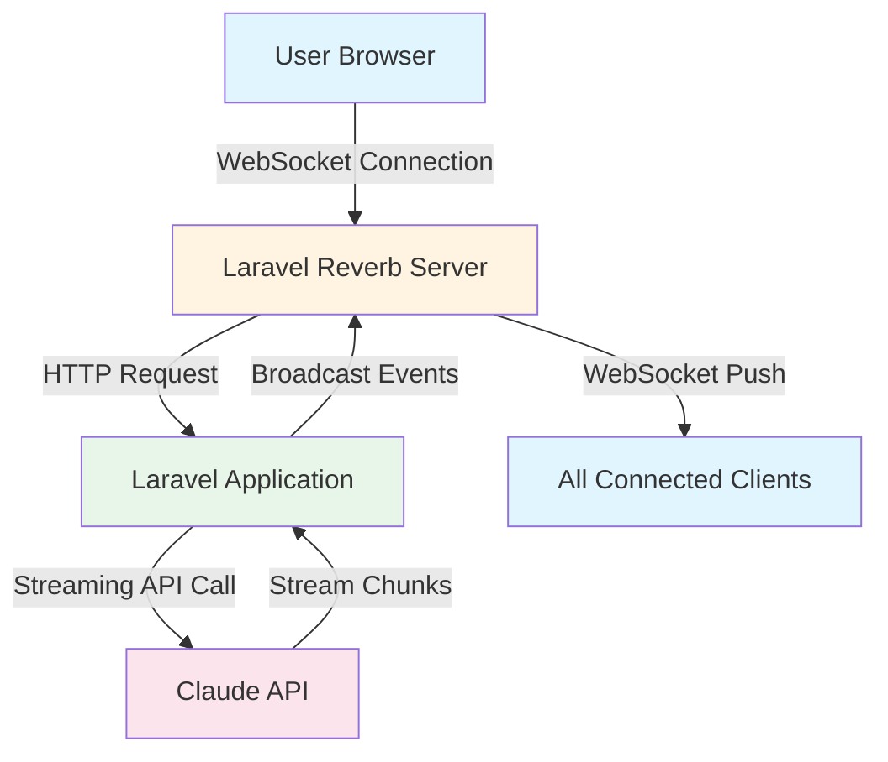

<div class="breadcrumbs">
  <a href="/">Home</a>
  <span class="breadcrumbs-separator">›</span>
  <a href="/series">Series</a>
  <span class="breadcrumbs-separator">›</span>
  <a href="/series/claude-php-developers">Claude for PHP Developers</a>
  <span class="breadcrumbs-separator">›</span>
  <span>Chapter 20</span>
</div>

# Chapter 20: Real-time Chat with WebSockets

## Overview

Building a real-time chat application with Claude requires streaming responses over WebSockets, managing conversation state, handling typing indicators, and broadcasting updates to multiple clients. Laravel Reverb provides a first-party WebSocket server that makes this seamless.

This chapter teaches you to build production-ready chat applications with streaming Claude responses, real-time typing indicators, presence tracking, and multi-user chat rooms—all powered by WebSockets.

## Prerequisites

Before diving in, ensure you have:

- **Laravel 11+** with Reverb installed
- **Laravel Broadcasting** configured
- **Claude-PHP-SDK** installed via Composer: `composer require claude-php/claude-php-sdk`
- **Chapter 06** completed (Streaming knowledge) — [Streaming Responses in PHP](/series/claude-php-developers/chapters/06-streaming-responses)
- **WebSockets** basic understanding
- **ANTHROPIC_API_KEY** environment variable set

**Estimated Time**: 75-90 minutes

## What You'll Build

By the end of this chapter, you will have created:

- A complete real-time chat application with WebSocket support
- Database models for conversations and messages with streaming state tracking
- Three broadcasting events: `MessageChunkReceived`, `MessageCompleted`, and `UserTyping`
- A `ChatService` that streams Claude responses over WebSockets
- A `ChatController` with full CRUD operations and typing indicator endpoints
- A Vue.js frontend component with real-time message updates
- Broadcasting channel authorization for secure multi-user conversations
- Presence channels for tracking active users in chat rooms

## Objectives

- Understand Laravel Reverb and WebSocket architecture for real-time applications
- Implement streaming Claude responses over WebSockets using Laravel Broadcasting
- Create broadcasting events for message chunks, completion, and typing indicators
- Build a production-ready chat service with proper error handling
- Develop a Vue.js frontend that connects to WebSocket channels
- Configure secure broadcasting channels with authorization
- Implement presence channels for multi-user chat rooms
- Handle WebSocket connection failures and implement reconnection logic

## Real-Time Chat Architecture



## Step 1: Setup Laravel Reverb (~10 min)

### Goal

Install and configure Laravel Reverb to enable WebSocket support for real-time communication.

### Actions

1. **Install Reverb**:

```bash
# Install Reverb package
composer require laravel/reverb

# Publish configuration
php artisan reverb:install
```

2. **Configure environment variables** in `.env`:

```bash
BROADCAST_CONNECTION=reverb
REVERB_APP_ID=your-app-id
REVERB_APP_KEY=your-app-key
REVERB_APP_SECRET=your-app-secret
REVERB_HOST=localhost
REVERB_PORT=8080
REVERB_SCHEME=http
```

3. **Start the Reverb server**:

```bash
# Start Reverb (keep this running)
php artisan reverb:start

# In another terminal, start queue worker
php artisan queue:work
```

### Expected Result

You should see Reverb starting up:

```
Starting Reverb server on localhost:8080...
Reverb server started successfully.
```

### Why It Works

Laravel Reverb is a first-party WebSocket server built specifically for Laravel. It handles WebSocket connections, manages channels, and integrates seamlessly with Laravel's broadcasting system. The `BROADCAST_CONNECTION=reverb` setting tells Laravel to use Reverb instead of other broadcasting drivers like Pusher or Redis.

### Troubleshooting

- **Error: "Port already in use"** — Change `REVERB_PORT` to a different port (e.g., 8081)
- **Connection refused** — Ensure Reverb is running with `php artisan reverb:start`
- **Authentication fails** — Verify `REVERB_APP_KEY` and `REVERB_APP_SECRET` match in both `.env` and frontend configuration

## Step 2: Create Database Schema (~5 min)

### Goal

Set up database tables to store conversations and messages with streaming state tracking.

### Actions

1. **Create migration**:

```php
<?php
# filename: database/migrations/2025_01_01_000001_create_chat_tables.php
declare(strict_types=1);

use Illuminate\Database\Migrations\Migration;
use Illuminate\Database\Schema\Blueprint;
use Illuminate\Support\Facades\Schema;

return new class extends Migration
{
    public function up(): void
    {
        Schema::create('chat_conversations', function (Blueprint $table) {
            $table->id();
            $table->foreignId('user_id')->constrained()->cascadeOnDelete();
            $table->string('title')->nullable();
            $table->string('model')->default('claude-sonnet-4-5');
            $table->text('system_prompt')->nullable();
            $table->json('metadata')->nullable();
            $table->timestamps();
        });

        Schema::create('chat_messages', function (Blueprint $table) {
            $table->id();
            $table->foreignId('conversation_id')->constrained('chat_conversations')->cascadeOnDelete();
            $table->enum('role', ['user', 'assistant', 'system']);
            $table->longText('content');
            $table->json('metadata')->nullable();
            $table->boolean('is_streaming')->default(false);
            $table->timestamp('completed_at')->nullable();
            $table->timestamps();

            $table->index(['conversation_id', 'created_at']);
        });
    }

    public function down(): void
    {
        Schema::dropIfExists('chat_messages');
        Schema::dropIfExists('chat_conversations');
    }
};
```

2. **Run migration**:

```bash
php artisan migrate
```

### Expected Result

Two tables are created: `chat_conversations` and `chat_messages` with proper relationships and indexes.

### Why It Works

The `chat_conversations` table stores conversation metadata including the Claude model and system prompt. The `chat_messages` table stores individual messages with an `is_streaming` flag to track when Claude is generating a response. The `completed_at` timestamp marks when streaming finishes, enabling proper UI state management.

### Troubleshooting

- **Foreign key constraint fails** — Ensure the `users` table exists before running the migration
- **Enum type not supported** — Some databases require explicit enum type definition; use `string` instead if needed

## Step 3: Create Models (~5 min)

### Goal

Create Eloquent models with relationships and helper methods for formatting messages.

```php
<?php
# filename: app/Models/ChatConversation.php
declare(strict_types=1);

namespace App\Models;

use Illuminate\Database\Eloquent\Model;
use Illuminate\Database\Eloquent\Relations\BelongsTo;
use Illuminate\Database\Eloquent\Relations\HasMany;

class ChatConversation extends Model
{
    protected $fillable = [
        'user_id',
        'title',
        'model',
        'system_prompt',
        'metadata',
    ];

    protected $casts = [
        'metadata' => 'array',
    ];

    public function user(): BelongsTo
    {
        return $this->belongsTo(User::class);
    }

    public function messages(): HasMany
    {
        return $this->hasMany(ChatMessage::class, 'conversation_id');
    }

    public function getFormattedMessages(): array
    {
        return $this->messages()
            ->where('role', '!=', 'system')
            ->orderBy('created_at')
            ->get()
            ->map(fn($msg) => [
                'role' => $msg->role,
                'content' => $msg->content,
            ])
            ->toArray();
    }
}
```

2. **Create ChatMessage model**:

```php
<?php
# filename: app/Models/ChatMessage.php
declare(strict_types=1);

namespace App\Models;

use Illuminate\Database\Eloquent\Model;
use Illuminate\Database\Eloquent\Relations\BelongsTo;

class ChatMessage extends Model
{
    protected $fillable = [
        'conversation_id',
        'role',
        'content',
        'metadata',
        'is_streaming',
        'completed_at',
    ];

    protected $casts = [
        'metadata' => 'array',
        'is_streaming' => 'boolean',
        'completed_at' => 'datetime',
    ];

    public function conversation(): BelongsTo
    {
        return $this->belongsTo(ChatConversation::class, 'conversation_id');
    }
}
```

### Expected Result

Two model classes with proper relationships: `ChatConversation` has many `ChatMessage`, and `ChatMessage` belongs to `ChatConversation`. The `getFormattedMessages()` method prepares messages for Claude API format.

### Why It Works

Eloquent relationships enable easy data access (`$conversation->messages`), and the `getFormattedMessages()` method transforms database records into the array format Claude API expects. The `is_streaming` flag allows the frontend to show a loading indicator while Claude generates responses.

## Step 4: Create Broadcasting Events (~10 min)

### Goal

Create three events that broadcast real-time updates: message chunks, completion, and typing indicators.

```php
<?php
# filename: app/Events/MessageChunkReceived.php
declare(strict_types=1);

namespace App\Events;

use App\Models\ChatMessage;
use Illuminate\Broadcasting\Channel;
use Illuminate\Broadcasting\InteractsWithSockets;
use Illuminate\Broadcasting\PrivateChannel;
use Illuminate\Contracts\Broadcasting\ShouldBroadcast;
use Illuminate\Foundation\Events\Dispatchable;
use Illuminate\Queue\SerializesModels;

class MessageChunkReceived implements ShouldBroadcast
{
    use Dispatchable, InteractsWithSockets, SerializesModels;

    public function __construct(
        public int $conversationId,
        public int $messageId,
        public string $chunk
    ) {}

    public function broadcastOn(): Channel
    {
        return new PrivateChannel('conversation.' . $this->conversationId);
    }

    public function broadcastAs(): string
    {
        return 'message.chunk';
    }

    public function broadcastWith(): array
    {
        return [
            'message_id' => $this->messageId,
            'chunk' => $this->chunk,
        ];
    }
}
```

2. **Create MessageCompleted event**:

```php
<?php
# filename: app/Events/MessageCompleted.php
declare(strict_types=1);

namespace App\Events;

use App\Models\ChatMessage;
use Illuminate\Broadcasting\Channel;
use Illuminate\Broadcasting\InteractsWithSockets;
use Illuminate\Broadcasting\PrivateChannel;
use Illuminate\Contracts\Broadcasting\ShouldBroadcast;
use Illuminate\Foundation\Events\Dispatchable;
use Illuminate\Queue\SerializesModels;

class MessageCompleted implements ShouldBroadcast
{
    use Dispatchable, InteractsWithSockets, SerializesModels;

    public function __construct(
        public ChatMessage $message
    ) {}

    public function broadcastOn(): Channel
    {
        return new PrivateChannel('conversation.' . $this->message->conversation_id);
    }

    public function broadcastAs(): string
    {
        return 'message.completed';
    }

    public function broadcastWith(): array
    {
        return [
            'message' => [
                'id' => $this->message->id,
                'role' => $this->message->role,
                'content' => $this->message->content,
                'completed_at' => $this->message->completed_at,
            ],
        ];
    }
}
```

3. **Create UserTyping event**:

```php
<?php
# filename: app/Events/UserTyping.php
declare(strict_types=1);

namespace App\Events;

use Illuminate\Broadcasting\Channel;
use Illuminate\Broadcasting\InteractsWithSockets;
use Illuminate\Broadcasting\PresenceChannel;
use Illuminate\Contracts\Broadcasting\ShouldBroadcast;
use Illuminate\Foundation\Events\Dispatchable;
use Illuminate\Queue\SerializesModels;

class UserTyping implements ShouldBroadcast
{
    use Dispatchable, InteractsWithSockets, SerializesModels;

    public function __construct(
        public int $conversationId,
        public int $userId,
        public string $userName,
        public bool $isTyping
    ) {}

    public function broadcastOn(): Channel
    {
        return new PresenceChannel('conversation.' . $this->conversationId);
    }

    public function broadcastAs(): string
    {
        return 'user.typing';
    }

    public function broadcastWith(): array
    {
        return [
            'user_id' => $this->userId,
            'user_name' => $this->userName,
            'is_typing' => $this->isTyping,
        ];
    }
}
```

### Expected Result

Three event classes that implement `ShouldBroadcast` and define their broadcast channels, event names, and payload data.

### Why It Works

Laravel's broadcasting system automatically serializes these events and sends them to the configured WebSocket server (Reverb). The `broadcastOn()` method defines which channel receives the event, `broadcastAs()` sets the event name, and `broadcastWith()` controls the payload. Private channels require authentication, while presence channels track who's subscribed.

### Troubleshooting

- **Events not broadcasting** — Verify `BROADCAST_CONNECTION=reverb` in `.env`
- **Channel authorization fails** — Check `routes/channels.php` has proper authorization logic
- **Events broadcast but frontend doesn't receive** — Verify Echo is configured correctly on the frontend

## Step 5: Build Chat Service (~15 min)

### Goal

Create a service class that handles streaming Claude responses and broadcasts chunks in real-time.

```php
<?php
# filename: app/Services/ChatService.php
declare(strict_types=1);

namespace App\Services;

use App\Events\MessageChunkReceived;
use App\Events\MessageCompleted;
use App\Models\ChatConversation;
use App\Models\ChatMessage;
use ClaudePhp\ClaudePhp;
use Illuminate\Support\Facades\Log;

class ChatService
{
    private ClaudePhp $client;

    public function __construct()
    {
        $this->client = new ClaudePhp(
            apiKey: config('services.anthropic.api_key') ?? env('ANTHROPIC_API_KEY')
        );
    }

    public function sendMessage(
        ChatConversation $conversation,
        string $userMessage
    ): ChatMessage {
        // Store user message
        $userMsg = ChatMessage::create([
            'conversation_id' => $conversation->id,
            'role' => 'user',
            'content' => $userMessage,
            'completed_at' => now(),
        ]);

        // Create assistant message placeholder
        $assistantMsg = ChatMessage::create([
            'conversation_id' => $conversation->id,
            'role' => 'assistant',
            'content' => '',
            'is_streaming' => true,
        ]);

        // Get conversation history
        $messages = $conversation->getFormattedMessages();

        // Stream Claude response
        $this->streamResponse($conversation, $assistantMsg, $messages);

        return $assistantMsg;
    }

    private function streamResponse(
        ChatConversation $conversation,
        ChatMessage $assistantMsg,
        array $messages
    ): void {
        try {
            $fullContent = '';

            $params = [
                'model' => $conversation->model,
                'max_tokens' => 4096,
                'messages' => $messages,
            ];

            if ($conversation->system_prompt) {
                $params['system'] = $conversation->system_prompt;
            }

            $stream = $this->client->messages()->stream($params);

            foreach ($stream as $event) {
                if ($event['type'] === 'content_block_delta' && isset($event['delta']['text'])) {
                    $chunk = $event['delta']['text'];

                    if ($chunk) {
                        $fullContent .= $chunk;

                        // Broadcast chunk to WebSocket clients
                        broadcast(new MessageChunkReceived(
                            conversationId: $conversation->id,
                            messageId: $assistantMsg->id,
                            chunk: $chunk
                        ))->toOthers();
                    }
                }
            }

            // Update message with full content
            $assistantMsg->update([
                'content' => $fullContent,
                'is_streaming' => false,
                'completed_at' => now(),
            ]);

            // Broadcast completion
            broadcast(new MessageCompleted($assistantMsg));

        } catch (\Exception $e) {
            Log::error('Chat streaming error', [
                'conversation_id' => $conversation->id,
                'message_id' => $assistantMsg->id,
                'error' => $e->getMessage(),
            ]);

            $assistantMsg->update([
                'content' => 'Error: ' . $e->getMessage(),
                'is_streaming' => false,
                'completed_at' => now(),
            ]);

            throw $e;
        }
    }
}
```

### Expected Result

A `ChatService` class that creates messages, streams Claude responses, broadcasts chunks as they arrive, and handles errors gracefully.

### Why It Works

The service creates a placeholder assistant message with `is_streaming=true` before starting the stream. As Claude generates tokens, each chunk is broadcast via `MessageChunkReceived` events. When streaming completes, the message is updated with the full content and `MessageCompleted` is broadcast. The `->toOthers()` method prevents broadcasting to the sender, useful for multi-user scenarios.

### Troubleshooting

- **Streaming stops mid-response** — Check Claude API rate limits and connection stability
- **Chunks arrive out of order** — WebSocket guarantees order, but verify network stability
- **Memory issues with long responses** — Consider processing chunks in batches or using queues

## Step 6: Create Controller (~10 min)

### Goal

Build a RESTful controller with endpoints for conversations, messages, and typing indicators.

```php
<?php
# filename: app/Http/Controllers/ChatController.php
declare(strict_types=1);

namespace App\Http\Controllers;

use App\Events\UserTyping;
use App\Models\ChatConversation;
use App\Services\ChatService;
use Illuminate\Http\JsonResponse;
use Illuminate\Http\Request;

class ChatController extends Controller
{
    public function __construct(
        private ChatService $chatService
    ) {}

    /**
     * Create a new conversation
     */
    public function createConversation(Request $request): JsonResponse
    {
        $validated = $request->validate([
            'title' => 'nullable|string|max:255',
            'model' => 'nullable|string|in:claude-opus-4-1,claude-sonnet-4-5,claude-haiku-4-5',
            'system_prompt' => 'nullable|string|max:10000',
        ]);

        $conversation = ChatConversation::create([
            'user_id' => $request->user()->id,
            'title' => $validated['title'] ?? 'New Conversation',
            'model' => $validated['model'] ?? 'claude-sonnet-4-5',
            'system_prompt' => $validated['system_prompt'] ?? null,
        ]);

        return response()->json([
            'success' => true,
            'conversation' => $conversation,
        ], 201);
    }

    /**
     * Send a message (triggers streaming)
     */
    public function sendMessage(Request $request, ChatConversation $conversation): JsonResponse
    {
        $this->authorize('update', $conversation);

        $validated = $request->validate([
            'message' => 'required|string|max:50000',
        ]);

        try {
            $message = $this->chatService->sendMessage(
                $conversation,
                $validated['message']
            );

            return response()->json([
                'success' => true,
                'message' => [
                    'id' => $message->id,
                    'role' => $message->role,
                    'is_streaming' => $message->is_streaming,
                ],
            ], 202);

        } catch (\Exception $e) {
            return response()->json([
                'success' => false,
                'error' => $e->getMessage(),
            ], 500);
        }
    }

    /**
     * Get conversation with messages
     */
    public function show(ChatConversation $conversation): JsonResponse
    {
        $this->authorize('view', $conversation);

        $conversation->load('messages');

        return response()->json([
            'conversation' => $conversation,
            'messages' => $conversation->messages->map(fn($msg) => [
                'id' => $msg->id,
                'role' => $msg->role,
                'content' => $msg->content,
                'is_streaming' => $msg->is_streaming,
                'created_at' => $msg->created_at,
                'completed_at' => $msg->completed_at,
            ]),
        ]);
    }

    /**
     * List user conversations
     */
    public function index(Request $request): JsonResponse
    {
        $conversations = ChatConversation::where('user_id', $request->user()->id)
            ->withCount('messages')
            ->orderByDesc('updated_at')
            ->paginate(20);

        return response()->json($conversations);
    }

    /**
     * Broadcast typing indicator
     */
    public function typing(Request $request, ChatConversation $conversation): JsonResponse
    {
        $this->authorize('update', $conversation);

        $validated = $request->validate([
            'is_typing' => 'required|boolean',
        ]);

        broadcast(new UserTyping(
            conversationId: $conversation->id,
            userId: $request->user()->id,
            userName: $request->user()->name,
            isTyping: $validated['is_typing']
        ));

        return response()->json(['success' => true]);
    }
}
```

2. **Create Policy for authorization** (optional but recommended):

```php
<?php
# filename: app/Policies/ChatConversationPolicy.php
declare(strict_types=1);

namespace App\Policies;

use App\Models\ChatConversation;
use App\Models\User;

class ChatConversationPolicy
{
    public function view(User $user, ChatConversation $conversation): bool
    {
        return $user->id === $conversation->user_id;
    }

    public function update(User $user, ChatConversation $conversation): bool
    {
        return $user->id === $conversation->user_id;
    }

    public function delete(User $user, ChatConversation $conversation): bool
    {
        return $user->id === $conversation->user_id;
    }
}
```

### Expected Result

A controller with five endpoints: create conversation, send message, show conversation, list conversations, and broadcast typing. The controller uses authorization policies to ensure users can only access their own conversations.

### Why It Works

The `sendMessage` method returns a `202 Accepted` status immediately after creating the message, allowing the frontend to show the streaming response via WebSocket. The `authorize()` calls use Laravel's policy system to verify ownership. Typing indicators use debouncing (handled in the frontend) to avoid excessive broadcasts.

### Troubleshooting

- **403 Forbidden on authorization** — Register the policy in `app/Providers/AuthServiceProvider.php`
- **Message not streaming** — Verify the ChatService is called and Reverb is running
- **Typing indicator spam** — Implement debouncing in the frontend (shown in Step 7)

## Step 7: Build Frontend Component (~20 min)

### Goal

Create a Vue.js component that connects to WebSocket channels and displays real-time messages.

### Actions

1. **Initialize Laravel Echo** (in your main JavaScript file):

```javascript
// filename: resources/js/bootstrap.js or resources/js/app.js
import Echo from "laravel-echo";
import Pusher from "pusher-js";

window.Pusher = Pusher;

// Get auth token from meta tag or localStorage
const authToken =
  document.querySelector('meta[name="api-token"]')?.getAttribute("content") ||
  localStorage.getItem("auth_token");

window.Echo = new Echo({
  broadcaster: "reverb",
  key: import.meta.env.VITE_REVERB_APP_KEY,
  wsHost: import.meta.env.VITE_REVERB_HOST,
  wsPort: import.meta.env.VITE_REVERB_PORT ?? 80,
  wssPort: import.meta.env.VITE_REVERB_PORT ?? 443,
  forceTLS: (import.meta.env.VITE_REVERB_SCHEME ?? "https") === "https",
  enabledTransports: ["ws", "wss"],
  authEndpoint: "/broadcasting/auth",
  auth: authToken
    ? {
        headers: {
          Authorization: `Bearer ${authToken}`,
        },
      }
    : undefined,
});
```

2. **Create ChatWindow component**:

```vue
<!-- filename: resources/js/components/ChatWindow.vue -->
<template>
  <div class="chat-window">
    <div class="chat-header">
      <h2>{{ conversation.title }}</h2>
      <span v-if="typingUsers.length" class="typing-indicator">
        {{ typingUsers.join(", ") }}
        {{ typingUsers.length === 1 ? "is" : "are" }} typing...
      </span>
    </div>

    <div class="chat-messages" ref="messagesContainer">
      <div
        v-for="message in messages"
        :key="message.id"
        :class="['message', message.role]"
      >
        <div class="message-content">
          {{ message.content }}
          <span v-if="message.is_streaming" class="streaming-cursor">▊</span>
        </div>
        <div class="message-time">
          {{ formatTime(message.created_at) }}
        </div>
      </div>
    </div>

    <div class="chat-input">
      <textarea
        v-model="newMessage"
        @keydown.enter.prevent="sendMessage"
        @input="handleTyping"
        placeholder="Type your message..."
        :disabled="isSending"
      ></textarea>
      <button @click="sendMessage" :disabled="!newMessage.trim() || isSending">
        Send
      </button>
    </div>
  </div>
</template>

<script setup>
import { ref, onMounted, onUnmounted, nextTick, watch } from "vue";
import Echo from "laravel-echo";
import axios from "axios";

const props = defineProps({
  conversationId: {
    type: Number,
    required: true,
  },
});

const conversation = ref({});
const messages = ref([]);
const newMessage = ref("");
const isSending = ref(false);
const typingUsers = ref([]);
const messagesContainer = ref(null);
let typingTimeout = null;
let channel = null;

onMounted(async () => {
  await loadConversation();
  setupWebSocket();
});

onUnmounted(() => {
  if (channel) {
    window.Echo.leave(`conversation.${props.conversationId}`);
  }
});

watch(
  messages,
  () => {
    nextTick(() => scrollToBottom());
  },
  { deep: true }
);

async function loadConversation() {
  const response = await axios.get(
    `/api/conversations/${props.conversationId}`
  );
  conversation.value = response.data.conversation;
  messages.value = response.data.messages;
}

function setupWebSocket() {
  channel = window.Echo.private(`conversation.${props.conversationId}`);

  // Listen for message chunks
  channel.listen(".message.chunk", (event) => {
    const message = messages.value.find((m) => m.id === event.message_id);
    if (message && message.is_streaming) {
      message.content += event.chunk;
    }
  });

  // Listen for message completion
  channel.listen(".message.completed", (event) => {
    const message = messages.value.find((m) => m.id === event.message.id);
    if (message) {
      message.is_streaming = false;
      message.content = event.message.content;
      message.completed_at = event.message.completed_at;
    }
  });

  // Listen for typing indicators
  channel.listen(".user.typing", (event) => {
    if (event.is_typing) {
      if (!typingUsers.value.includes(event.user_name)) {
        typingUsers.value.push(event.user_name);
      }
    } else {
      typingUsers.value = typingUsers.value.filter(
        (u) => u !== event.user_name
      );
    }
  });
}

async function sendMessage() {
  if (!newMessage.value.trim() || isSending.value) return;

  const messageText = newMessage.value;
  newMessage.value = "";
  isSending.value = true;

  // Stop typing indicator
  broadcastTyping(false);

  try {
    // Add user message immediately
    const userMsg = {
      id: Date.now(),
      'role' => "user",
      'content' => messageText,
      created_at: new Date().toISOString(),
      is_streaming: false,
    };
    messages.value.push(userMsg);

    // Send to backend
    const response = await axios.post(
      `/api/conversations/${props.conversationId}/messages`,
      { message: messageText }
    );

    // Add streaming assistant message placeholder
    if (response.data.success) {
      messages.value.push({
        id: response.data.message.id,
        'role' => "assistant",
        'content' => "",
        created_at: new Date().toISOString(),
        is_streaming: true,
      });
    }
  } catch (error) {
    console.error("Failed to send message:", error);
    alert("Failed to send message. Please try again.");
  } finally {
    isSending.value = false;
  }
}

function handleTyping() {
  broadcastTyping(true);

  clearTimeout(typingTimeout);
  typingTimeout = setTimeout(() => {
    broadcastTyping(false);
  }, 1000);
}

async function broadcastTyping(isTyping) {
  try {
    await axios.post(`/api/conversations/${props.conversationId}/typing`, {
      is_typing: isTyping,
    });
  } catch (error) {
    console.error("Failed to broadcast typing:", error);
  }
}

function scrollToBottom() {
  if (messagesContainer.value) {
    messagesContainer.value.scrollTop = messagesContainer.value.scrollHeight;
  }
}

function formatTime(dateString) {
  const date = new Date(dateString);
  return date.toLocaleTimeString([], { hour: "2-digit", minute: "2-digit" });
}
</script>

<style scoped>
.chat-window {
  display: flex;
  flex-direction: column;
  height: 100vh;
  max-width: 800px;
  margin: 0 auto;
}

.chat-header {
  padding: 1rem;
  background: #f5f5f5;
  border-bottom: 1px solid #ddd;
}

.typing-indicator {
  font-size: 0.875rem;
  color: #666;
  font-style: italic;
}

.chat-messages {
  flex: 1;
  overflow-y: auto;
  padding: 1rem;
  background: #fff;
}

.message {
  margin-bottom: 1rem;
  max-width: 70%;
}

.message.user {
  margin-left: auto;
  text-align: right;
}

.message.user .message-content {
  background: #007bff;
  color: white;
  border-radius: 1rem 1rem 0 1rem;
}

.message.assistant .message-content {
  background: #f0f0f0;
  color: #333;
  border-radius: 1rem 1rem 1rem 0;
}

.message-content {
  padding: 0.75rem 1rem;
  display: inline-block;
  word-wrap: break-word;
}

.streaming-cursor {
  animation: blink 1s infinite;
  margin-left: 0.25rem;
}

@keyframes blink {
  0%,
  49% {
    opacity: 1;
  }
  50%,
  100% {
    opacity: 0;
  }
}

.message-time {
  font-size: 0.75rem;
  color: #999;
  margin-top: 0.25rem;
}

.chat-input {
  padding: 1rem;
  background: #f5f5f5;
  border-top: 1px solid #ddd;
  display: flex;
  gap: 0.5rem;
}

.chat-input textarea {
  flex: 1;
  padding: 0.75rem;
  border: 1px solid #ddd;
  border-radius: 0.5rem;
  resize: none;
  min-height: 60px;
}

.chat-input button {
  padding: 0.75rem 1.5rem;
  background: #007bff;
  color: white;
  border: none;
  border-radius: 0.5rem;
  cursor: pointer;
}

.chat-input button:disabled {
  background: #ccc;
  cursor: not-allowed;
}
</style>
```

### Expected Result

A fully functional chat interface that connects to WebSocket channels, displays streaming messages in real-time, shows typing indicators, and handles user input.

### Why It Works

Laravel Echo simplifies WebSocket connections by handling authentication, channel subscriptions, and event listeners. The component subscribes to a private channel (`conversation.{id}`) which requires authentication. When chunks arrive, the message content is appended incrementally. The typing indicator uses debouncing (1 second timeout) to avoid excessive API calls. The `watch` on `messages` automatically scrolls to show new content.

### Troubleshooting

- **Echo connection fails** — Verify `VITE_REVERB_*` environment variables match backend configuration
- **Authentication fails** — Ensure the auth endpoint returns proper tokens and headers
- **Messages not updating** — Check browser console for WebSocket errors and verify channel names match
- **Typing indicator not working** — Verify PresenceChannel is used and presence callbacks are configured

## Step 8: Configure Broadcasting Channels (~5 min)

### Goal

Set up channel authorization to ensure users can only access their own conversations.

```php
<?php
# filename: routes/channels.php
declare(strict_types=1);

use App\Models\ChatConversation;
use Illuminate\Support\Facades\Broadcast;

Broadcast::channel('conversation.{conversationId}', function ($user, $conversationId) {
    $conversation = ChatConversation::find($conversationId);

    return $conversation && $user->id === $conversation->user_id;
});
```

2. **Configure presence channel callbacks** (for typing indicators):

```php
<?php
# filename: routes/channels.php
declare(strict_types=1);

use App\Models\ChatConversation;
use Illuminate\Support\Facades\Broadcast;

Broadcast::channel('conversation.{conversationId}', function ($user, $conversationId) {
    $conversation = ChatConversation::find($conversationId);

    if ($conversation && $user->id === $conversation->user_id) {
        return ['id' => $user->id, 'name' => $user->name];
    }

    return false;
});
```

### Expected Result

Channel authorization that verifies conversation ownership before allowing WebSocket subscriptions.

### Why It Works

Laravel's channel authorization runs before allowing WebSocket connections. Returning `false` denies access, while returning user data allows subscription and makes it available to presence channel callbacks. This prevents users from accessing conversations they don't own.

### Troubleshooting

- **403 Forbidden on channel subscription** — Verify the user ID matches the conversation owner
- **Presence data not available** — Ensure the channel callback returns user data, not just `true`

## Step 9: Define API Routes (~3 min)

### Goal

Create RESTful API routes for the chat endpoints.

```php
<?php
# filename: routes/api.php
declare(strict_types=1);

use App\Http\Controllers\ChatController;
use Illuminate\Support\Facades\Route;

Route::middleware('auth:sanctum')->group(function () {
    // Conversations
    Route::get('/conversations', [ChatController::class, 'index']);
    Route::post('/conversations', [ChatController::class, 'createConversation']);
    Route::get('/conversations/{conversation}', [ChatController::class, 'show']);

    // Messages
    Route::post('/conversations/{conversation}/messages', [ChatController::class, 'sendMessage']);
    Route::post('/conversations/{conversation}/typing', [ChatController::class, 'typing']);
});
```

### Expected Result

Five API endpoints protected by authentication middleware, accessible at `/api/conversations/*`.

### Why It Works

The `auth:sanctum` middleware ensures only authenticated users can access these endpoints. Laravel's route model binding automatically resolves `{conversation}` to a `ChatConversation` instance, making controller methods cleaner.

## Step 10: Test the Application (~5 min)

### Goal

Verify the complete chat application works end-to-end.

### Actions

1. **Start all required services**:

```bash
# Terminal 1: Start Reverb
php artisan reverb:start

# Terminal 2: Start queue worker
php artisan queue:work

# Terminal 3: Start Laravel dev server
php artisan serve

# Terminal 4: Start frontend build
npm run dev
```

2. **Test WebSocket connection**:

Open browser console and verify Echo connects:

```javascript
// Should see connection established
window.Echo.connector.socket.connected; // true
```

3. **Create a conversation**:

```bash
curl -X POST http://localhost:8000/api/conversations \
  -H "Authorization: Bearer YOUR_TOKEN" \
  -H "Content-Type: application/json" \
  -d '{"title": "Test Chat"}'
```

4. **Send a message**:

```bash
curl -X POST http://localhost:8000/api/conversations/1/messages \
  -H "Authorization: Bearer YOUR_TOKEN" \
  -H "Content-Type: application/json" \
  -d '{"message": "Hello Claude!"}'
```

### Expected Result

Messages stream in real-time through the WebSocket connection, appearing word-by-word in the chat interface.

### Why It Works

All components work together: the API creates messages, ChatService streams from Claude, events broadcast chunks, Reverb delivers to WebSocket clients, and the Vue component renders updates. The queue worker processes any queued broadcasts if needed.

### Troubleshooting

See the comprehensive troubleshooting section below.

### Error: "WebSocket connection fails"

**Symptom**: Browser console shows connection errors, Echo fails to connect

**Cause**: Reverb server not running, incorrect configuration, or authentication issues

**Solution**:

1. Verify Reverb is running:

```bash
php artisan reverb:start
# Should see: "Starting Reverb server on localhost:8080..."
```

2. Check environment variables match:

```bash
# Backend .env
REVERB_APP_KEY=your-key
REVERB_HOST=localhost
REVERB_PORT=8080

# Frontend .env (VITE_ prefix)
VITE_REVERB_APP_KEY=your-key
VITE_REVERB_HOST=localhost
VITE_REVERB_PORT=8080
```

3. Verify authentication endpoint:

```bash
curl http://localhost:8000/broadcasting/auth \
  -H "Authorization: Bearer YOUR_TOKEN"
# Should return JSON, not 401/403
```

### Error: "Messages not streaming"

**Symptom**: Messages are created but chunks don't appear in real-time

**Cause**: Broadcasting not configured, channel authorization fails, or events not firing

**Solution**:

1. Verify broadcasting driver:

```bash
# .env
BROADCAST_CONNECTION=reverb
```

2. Check channel authorization:

```php
// routes/channels.php - ensure this returns true for authorized users
Broadcast::channel('conversation.{conversationId}', function ($user, $conversationId) {
    // Your authorization logic
});
```

3. Check Laravel logs:

```bash
tail -f storage/logs/laravel.log
# Look for broadcasting errors
```

4. Test event broadcasting manually:

```php
// In tinker: php artisan tinker
broadcast(new \App\Events\MessageChunkReceived(
    conversationId: 1,
    messageId: 1,
    chunk: 'test'
));
```

### Error: "Typing indicators not working"

**Symptom**: Typing status doesn't appear for other users

**Cause**: Using PrivateChannel instead of PresenceChannel, or presence callbacks not configured

**Solution**:

1. Use PresenceChannel for typing events:

```php
// app/Events/UserTyping.php
public function broadcastOn(): Channel
{
    return new PresenceChannel('conversation.' . $this->conversationId);
}
```

2. Configure presence callbacks in channels.php (see Step 8)

3. Verify Echo presence methods:

```javascript
channel.here((users) => {
  console.log("Users present:", users);
});
```

### Error: "Performance issues with many concurrent users"

**Symptom**: Slow responses, dropped connections, high server load

**Cause**: Single Reverb instance, no horizontal scaling, inefficient broadcasting

**Solution**:

1. Scale Reverb horizontally:

```bash
# Run multiple Reverb instances on different ports
php artisan reverb:start --port=8080
php artisan reverb:start --port=8081
# Use load balancer to distribute connections
```

2. Use Redis for horizontal scaling:

```bash
# .env
BROADCAST_CONNECTION=redis
REDIS_CLIENT=phpredis
```

3. Implement message pagination:

```php
// Load only recent messages
$messages = $conversation->messages()
    ->orderByDesc('created_at')
    ->limit(50)
    ->get();
```

4. Rate limit typing broadcasts:

```php
// In controller
RateLimiter::attempt(
    "typing:{$conversation->id}:{$user->id}",
    perMinute(10),
    function () {
        broadcast(new UserTyping(...));
    }
);
```

## Advanced Topics

### Testing WebSocket Connections

Testing real-time WebSocket functionality requires special approaches. Use Laravel's Event facade to test broadcasting:

```php
<?php
# filename: tests/Feature/ChatWebSocketTest.php
declare(strict_types=1);

namespace Tests\Feature;

use App\Events\MessageChunkReceived;
use App\Models\ChatConversation;
use App\Models\User;
use Illuminate\Support\Facades\Event;
use Tests\TestCase;

class ChatWebSocketTest extends TestCase
{
    public function test_message_events_are_broadcast(): void
    {
        Event::fake();
        $user = User::factory()->create();
        $conversation = ChatConversation::factory()->for($user)->create();

        $this->actingAs($user)
            ->postJson("/api/conversations/{$conversation->id}/messages", [
                'message' => 'Hello Claude!',
            ]);

        Event::assertDispatched(MessageChunkReceived::class);
    }

    public function test_unauthorized_user_cannot_access(): void
    {
        $user1 = User::factory()->create();
        $user2 = User::factory()->create();
        $conversation = ChatConversation::factory()->for($user1)->create();

        $this->actingAs($user2)
            ->postJson("/api/conversations/{$conversation->id}/messages", [
                'message' => 'Unauthorized access',
            ])
            ->assertForbidden();
    }
}
```

**Why It Works**: Event::fake() intercepts broadcasts. Use assertDispatched() to verify events were fired with correct data.

### Graceful Degradation

When WebSockets fail, fall back to polling:

```javascript
// filename: resources/js/composables/useRobustConnection.js
export function useRobustConnection(conversationId) {
  const connectionStatus = ref("disconnected");
  const pollInterval = ref(null);

  function setupWebSocket() {
    try {
      const channel = window.Echo.private(`conversation.${conversationId}`);
      channel.listen(".message.chunk", (event) => {
        // Handle message chunk
      });
      connectionStatus.value = "connected";
      return true;
    } catch (error) {
      console.warn("WebSocket failed, falling back to polling");
      fallbackToPolling();
      return false;
    }
  }

  function fallbackToPolling() {
    connectionStatus.value = "polling";
    pollInterval.value = setInterval(async () => {
      const response = await axios.get(`/api/conversations/${conversationId}`);
      // Handle polling response
    }, 2000);
  }

  onMounted(() => setupWebSocket());
  onUnmounted(() => {
    if (pollInterval.value) clearInterval(pollInterval.value);
  });

  return { connectionStatus };
}
```

**Why It Works**: Users get uninterrupted service whether WebSockets work or not. Polling is slower but maintains functionality.

### Authentication Security

Use multiple guards for flexible authentication:

```php
<?php
// routes/channels.php

Broadcast::channel('conversation.{conversationId}', function ($user, $conversationId) {
    $conversation = ChatConversation::find($conversationId);

    if (!$conversation || $user->id !== $conversation->user_id) {
        return false;
    }

    // Verify token hasn't expired (optional)
    if ($user->token && now()->isAfter($user->token->expires_at)) {
        return false;
    }

    return ['id' => $user->id, 'name' => $user->name];
}, ['guards' => ['web', 'sanctum']]);
```

**Why It Works**: Multiple guards support both session (web) and token (sanctum) authentication. Returns false to deny, user data to allow.

### Message Ordering and Consistency

Handle out-of-order and duplicate messages:

```php
<?php
# filename: app/Services/MessageConsistencyService.php

class MessageConsistencyService
{
    public function getMissedMessages(int $conversationId, \DateTime $sinceTime): array
    {
        return ChatMessage::where('conversation_id', $conversationId)
            ->where('created_at', '>', $sinceTime)
            ->orderBy('created_at')
            ->get()
            ->toArray();
    }

    public function createIdempotent(
        int $conversationId,
        string $role,
        string $content,
        string $idempotencyKey
    ): ChatMessage {
        return DB::transaction(function () use ($conversationId, $role, $content, $idempotencyKey) {
            // Prevent duplicate messages from retries
            $existing = ChatMessage::where([
                'conversation_id' => $conversationId,
                'content' => $content,
            ])
            ->where('created_at', '>', now()->subMinutes(5))
            ->first();

            if ($existing) {
                return $existing;
            }

            return ChatMessage::create([
                'conversation_id' => $conversationId,
                'role' => $role,
                'content' => $content,
                'metadata' => ['idempotency_key' => $idempotencyKey],
            ]);
        });
    }
}
```

**Why It Works**: Missed message recovery after reconnection fetches new messages. Idempotency prevents duplicate creation from retries.

### Connection State Management

Implement heartbeat and exponential backoff for resilience:

```javascript
// filename: resources/js/composables/useWebSocketConnection.js

export function useWebSocketConnection(conversationId) {
  const connectionState = ref("disconnected");
  const reconnectAttempts = ref(0);
  const maxAttempts = 10;
  let heartbeatInterval = null;

  function getReconnectDelay() {
    // Exponential backoff with jitter
    const delay = 1000 * Math.pow(2, reconnectAttempts.value);
    const jitter = Math.random() * 1000;
    return Math.min(delay + jitter, 30000); // Cap at 30 seconds
  }

  function connectWebSocket() {
    try {
      const channel = window.Echo.private(`conversation.${conversationId}`);

      // Setup heartbeat to detect stale connections
      heartbeatInterval = setInterval(() => {
        // Check for stale connection (no activity for 30 seconds)
        if (new Date() - lastActivity > 30000) {
          attemptReconnect();
        }
      }, 5000);

      connectionState.value = "connected";
      reconnectAttempts.value = 0;
    } catch (error) {
      attemptReconnect();
    }
  }

  function attemptReconnect() {
    if (reconnectAttempts.value >= maxAttempts) {
      connectionState.value = "failed";
      return;
    }

    reconnectAttempts.value++;
    connectionState.value = "reconnecting";
    const delay = getReconnectDelay();

    setTimeout(() => {
      connectWebSocket();
    }, delay);
  }

  onMounted(() => connectWebSocket());
  onUnmounted(() => {
    if (heartbeatInterval) clearInterval(heartbeatInterval);
  });

  return { connectionState, reconnectAttempts };
}
```

**Why It Works**: Exponential backoff with jitter prevents thundering herd. Heartbeat detects stale connections. Max attempts prevent infinite retries.

## Key Takeaways

- ✓ Laravel Reverb provides first-party WebSocket support
- ✓ Streaming Claude responses create engaging chat experiences
- ✓ Broadcasting enables real-time updates to all clients
- ✓ Typing indicators improve user experience
- ✓ Presence channels track who's online
- ✓ Proper error handling ensures reliability
- ✓ Authentication and authorization protect conversations

<ChapterCheckbox
  seriesId="claude-php-developers"
  chapterId="20"
  label="You've built a real-time chat application with Claude!"
/>

## Further Reading

- **[Claude-PHP-SDK on GitHub](https://github.com/claude-php/Claude-PHP-SDK)** — Comprehensive PHP SDK for Claude with streaming support
- **[Claude-PHP-SDK Documentation](https://github.com/claude-php/Claude-PHP-SDK#readme)** — Complete guide and examples
- **[Anthropic API Documentation](https://docs.anthropic.com)** — Official Claude API reference and guides
- **[Laravel Integration Guide](https://github.com/claude-php/Claude-PHP-SDK#laravel-integration)** — Laravel-specific setup and examples

## Wrap-up

Congratulations on completing Chapter 20! You've built a production-ready real-time chat application with Claude. Here's what you accomplished:

- ✓ Set up Laravel Reverb for WebSocket support
- ✓ Created database models for conversations and messages
- ✓ Implemented streaming events for real-time message chunks
- ✓ Built a ChatService that streams Claude responses over WebSockets
- ✓ Created a complete Vue.js frontend with typing indicators
- ✓ Configured broadcasting channels with proper authorization
- ✓ Implemented presence channels for multi-user chat rooms

You now have the skills to build interactive, real-time AI chat applications that provide engaging user experiences similar to ChatGPT, with proper error handling, authentication, and scalability considerations.

## Further Reading

- [Laravel Reverb Documentation](https://laravel.com/docs/reverb) — Official Laravel Reverb documentation
- [Laravel Broadcasting](https://laravel.com/docs/broadcasting) — Complete broadcasting guide
- [WebSockets Protocol](https://datatracker.ietf.org/doc/html/rfc6455) — RFC 6455 WebSocket specification
- [Laravel Echo Documentation](https://laravel.com/docs/broadcasting#client-side-installation) — Frontend WebSocket client setup

## 💻 Code Samples

All code examples from this chapter are available in the GitHub repository:

**[View Chapter 20 Code Samples](https://github.com/dalehurley/codewithphp/tree/main/code/claude-php/chapter-20)**

Clone and run locally:

```bash
git clone https://github.com/dalehurley/codewithphp.git
cd codewithphp/code/claude-php/chapter-20
composer install
npm install
# Set up environment variables
cp .env.example .env
php artisan key:generate
php artisan migrate
# Start services
php artisan reverb:start  # Terminal 1
php artisan queue:work    # Terminal 2
php artisan serve         # Terminal 3
npm run dev               # Terminal 4
```
