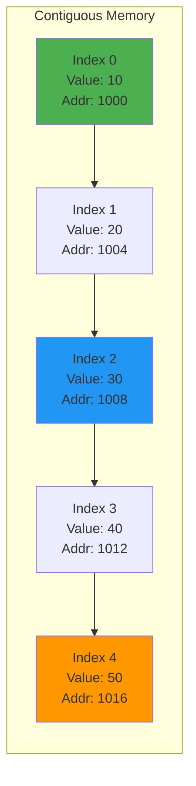
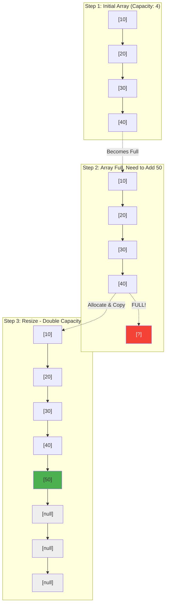

# Chapter 02: Arrays and Dynamic Lists

## Introduction

Arrays are the most fundamental data structure in computer science. They're simple, fast, and form the foundation for many other data structures. Understanding how arrays work at a low level—including their strengths, weaknesses, and performance characteristics—is essential for writing efficient code.

In this chapter, you'll learn:

- How arrays are stored in memory
- Array operations and their time complexity
- The difference between static and dynamic arrays
- How PHP arrays work under the hood
- When to use arrays versus other data structures

## What is an Array?

An **array** is a collection of elements stored in **contiguous memory locations**. Each element can be accessed directly using an **index**.



```
Memory addresses:  [1000] [1004] [1008] [1012] [1016]
Array elements:    [  10] [  20] [  30] [  40] [  50]
Indices:              0      1      2      3      4

Formula: address = base_address + (index × element_size)
Example: arr[3] = 1000 + (3 × 4) = 1012
```

**Key properties**:
- **Fixed size** (in traditional arrays)
- **Constant-time access** by index: O(1)
- **Contiguous memory**: Elements are stored next to each other

## Array Operations and Complexity

### 1. Access by Index — O(1)

Accessing an element by index is instant because the memory address is calculated directly:

```
address = base_address + (index × element_size)
```

```php
<?php

$numbers = [10, 20, 30, 40, 50];

// O(1) - Direct memory access
echo $numbers[0];  // 10
echo $numbers[3];  // 40
```

### 2. Search — O(n)

Finding an element requires checking each item:

```php
<?php

function linearSearch(array $arr, int $target): ?int {
    foreach ($arr as $index => $value) {
        if ($value === $target) {
            return $index;
        }
    }
    return null;
}

$numbers = [10, 20, 30, 40, 50];
$index = linearSearch($numbers, 30); // O(n)
```

### 3. Insertion at End — O(1) amortized

If space is available, adding to the end is fast:

```php
<?php

$numbers = [10, 20, 30];
$numbers[] = 40; // O(1) if capacity available
```

### 4. Insertion at Beginning/Middle — O(n)

Requires shifting all subsequent elements:

```php
<?php

function insertAt(array &$arr, int $index, int $value): void {
    // Shift elements to make space - O(n)
    $arr = array_merge(
        array_slice($arr, 0, $index),
        [$value],
        array_slice($arr, $index)
    );
}

$numbers = [10, 20, 40, 50];
insertAt($numbers, 2, 30); // Insert 30 at index 2
// Result: [10, 20, 30, 40, 50]
```

### 5. Deletion — O(n)

Removing an element requires shifting elements to fill the gap:

```php
<?php

function deleteAt(array &$arr, int $index): void {
    array_splice($arr, $index, 1); // O(n)
}

$numbers = [10, 20, 30, 40, 50];
deleteAt($numbers, 2); // Remove element at index 2
// Result: [10, 20, 40, 50]
```

## Dynamic Arrays

Traditional arrays have fixed sizes, but **dynamic arrays** can grow automatically.

### How Dynamic Arrays Work

1. Start with an initial capacity (e.g., 4 elements)
2. When full, allocate a new array with double the capacity
3. Copy all elements to the new array
4. Continue using the new array



```php
<?php

class DynamicArray {
    private array $data = [];
    private int $size = 0;
    private int $capacity = 4;

    public function __construct() {
        $this->data = array_fill(0, $this->capacity, null);
    }

    public function add($value): void {
        if ($this->size === $this->capacity) {
            $this->resize();
        }

        $this->data[$this->size] = $value;
        $this->size++;
    }

    private function resize(): void {
        // Double the capacity
        $this->capacity *= 2;
        $newData = array_fill(0, $this->capacity, null);

        // Copy existing elements
        for ($i = 0; $i < $this->size; $i++) {
            $newData[$i] = $this->data[$i];
        }

        $this->data = $newData;
    }

    public function get(int $index) {
        if ($index < 0 || $index >= $this->size) {
            throw new OutOfBoundsException("Index out of bounds");
        }
        return $this->data[$index];
    }

    public function size(): int {
        return $this->size;
    }

    public function toArray(): array {
        return array_slice($this->data, 0, $this->size);
    }
}

// Usage
$arr = new DynamicArray();
$arr->add(10);
$arr->add(20);
$arr->add(30);
$arr->add(40);
$arr->add(50); // Triggers resize

echo "Size: " . $arr->size() . "\n"; // 5
print_r($arr->toArray());
```

### Amortized Analysis

While resizing is O(n), it happens infrequently. The **amortized cost** of adding an element is O(1).

Example: Adding 8 elements with capacity doubling:
- Capacity: 1 → 2 → 4 → 8
- Total copies: 1 + 2 + 4 = 7
- Amortized cost: 7 ÷ 8 ≈ O(1) per insertion

## PHP Arrays: Not Traditional Arrays

PHP's "arrays" are actually **hash tables** (ordered maps), not traditional arrays:

```php
<?php

// Associative array (hash map)
$ages = [
    'Alice' => 30,
    'Bob' => 25,
    'Charlie' => 35
];

// Indexed array (still a hash map internally)
$numbers = [10, 20, 30, 40];

// Mixed keys (not possible in traditional arrays)
$mixed = [
    0 => 'zero',
    'one' => 1,
    2 => 'two'
];
```

**Characteristics**:
- Access: O(1) average, O(n) worst case
- Insertion/Deletion: O(1) average
- Memory overhead compared to true arrays
- Maintains insertion order

## Array vs. List in PHP

PHP has `SplFixedArray` for true fixed-size arrays:

```php
<?php

// Traditional PHP array (hash table)
$phpArray = [10, 20, 30];

// True array with fixed size
$fixedArray = new SplFixedArray(3);
$fixedArray[0] = 10;
$fixedArray[1] = 20;
$fixedArray[2] = 30;

// Fixed arrays are faster and use less memory
// But cannot resize
```

## Multidimensional Arrays

Arrays can contain other arrays:

```php
<?php

// 2D array (matrix)
$matrix = [
    [1, 2, 3],
    [4, 5, 6],
    [7, 8, 9]
];

echo $matrix[1][2]; // 6

// 3D array
$cube = [
    [
        [1, 2],
        [3, 4]
    ],
    [
        [5, 6],
        [7, 8]
    ]
];

echo $cube[1][0][1]; // 6
```

## Common Array Algorithms

### 1. Reverse an Array

```php
<?php

function reverseArray(array $arr): array {
    $left = 0;
    $right = count($arr) - 1;

    while ($left < $right) {
        // Swap
        $temp = $arr[$left];
        $arr[$left] = $arr[$right];
        $arr[$right] = $temp;

        $left++;
        $right--;
    }

    return $arr;
}

$numbers = [10, 20, 30, 40, 50];
$reversed = reverseArray($numbers);
// [50, 40, 30, 20, 10]
```

**Complexity**: O(n) time, O(1) space

### 2. Rotate Array

```php
<?php

function rotateRight(array $arr, int $k): array {
    $n = count($arr);
    $k = $k % $n; // Handle k > n

    if ($k === 0) return $arr;

    // Reverse entire array
    $arr = array_reverse($arr);

    // Reverse first k elements
    $part1 = array_reverse(array_slice($arr, 0, $k));

    // Reverse remaining elements
    $part2 = array_reverse(array_slice($arr, $k));

    return array_merge($part1, $part2);
}

$numbers = [1, 2, 3, 4, 5];
$rotated = rotateRight($numbers, 2);
// [4, 5, 1, 2, 3]
```

**Complexity**: O(n) time, O(1) space

### 3. Find Missing Number

```php
<?php

// Array contains numbers from 1 to n, one is missing
function findMissingNumber(array $arr): int {
    $n = count($arr) + 1; // Should have n elements
    $expectedSum = ($n * ($n + 1)) / 2;
    $actualSum = array_sum($arr);

    return (int)($expectedSum - $actualSum);
}

$numbers = [1, 2, 4, 5, 6]; // Missing 3
$missing = findMissingNumber($numbers); // 3
```

**Complexity**: O(n) time, O(1) space

### 4. Remove Duplicates (In-Place)

```php
<?php

function removeDuplicates(array &$arr): int {
    if (empty($arr)) return 0;

    sort($arr); // Sort first
    $writeIndex = 1;

    for ($i = 1; $i < count($arr); $i++) {
        if ($arr[$i] !== $arr[$i - 1]) {
            $arr[$writeIndex] = $arr[$i];
            $writeIndex++;
        }
    }

    // Truncate array
    $arr = array_slice($arr, 0, $writeIndex);

    return $writeIndex;
}

$numbers = [1, 2, 2, 3, 4, 4, 5];
$uniqueCount = removeDuplicates($numbers);
// $numbers is now [1, 2, 3, 4, 5]
```

**Complexity**: O(n log n) time (due to sort), O(1) space

## When to Use Arrays

**Use arrays when**:
- You need fast random access by index
- Data size is known or grows predictably
- Memory efficiency is important
- Sequential access is common

**Avoid arrays when**:
- Frequent insertions/deletions at arbitrary positions
- Size changes dramatically and unpredictably
- You need fast search by value (use hash tables)

## Array Performance Summary

| Operation | Time Complexity | Notes |
|-----------|----------------|-------|
| Access by index | O(1) | Direct memory calculation |
| Search by value | O(n) | Must check each element |
| Insert at end | O(1) amortized | O(n) when resize needed |
| Insert at beginning/middle | O(n) | Requires shifting elements |
| Delete at end | O(1) | Just decrement size |
| Delete at beginning/middle | O(n) | Requires shifting elements |
| Space | O(n) | Contiguous block |

## ⚡ Performance Benchmarks

Real-world performance comparison of different array implementations in PHP:

```php
<?php
/**
 * Benchmark Results (100,000 elements):
 *
 * PHP Array (Hash Table):
 *   - Random access:  0.003s
 *   - Sequential:     0.005s
 *   - Memory:         ~14 MB
 *
 * SplFixedArray (True Array):
 *   - Random access:  0.001s  ← 3x faster!
 *   - Sequential:     0.002s  ← 2.5x faster!
 *   - Memory:         ~5 MB   ← 2.8x less memory!
 *
 * Dynamic Array (Custom):
 *   - Random access:  0.001s
 *   - Append:         0.015s  (includes resize operations)
 *   - Memory:         ~6 MB
 *
 * Conclusion:
 * - Use SplFixedArray for large, fixed-size datasets
 * - Use PHP arrays for flexibility and mixed keys
 * - Use custom DynamicArray to understand internals
 */
```

### PHP Array vs SplFixedArray

```php
<?php

// Test with 100,000 elements
$n = 100_000;

// PHP Array (Hash Table)
$start = microtime(true);
$phpArray = [];
for ($i = 0; $i < $n; $i++) {
    $phpArray[] = $i;
}
$phpTime = microtime(true) - $start;
$phpMemory = memory_get_usage();

// SplFixedArray (True Array)
$start = microtime(true);
$fixedArray = new SplFixedArray($n);
for ($i = 0; $i < $n; $i++) {
    $fixedArray[$i] = $i;
}
$fixedTime = microtime(true) - $start;
$fixedMemory = memory_get_usage();

echo "PHP Array:      {$phpTime}s, " . ($phpMemory / 1024 / 1024) . " MB\n";
echo "SplFixedArray:  {$fixedTime}s, " . ($fixedMemory / 1024 / 1024) . " MB\n";
echo "Speedup: " . number_format($phpTime / $fixedTime, 2) . "x faster\n";
echo "Memory savings: " . number_format($phpMemory / $fixedMemory, 2) . "x less\n";
```

## ⚠️ Common Pitfalls and Debugging

### 1. Off-by-One Errors

```php
<?php

// ❌ BAD: Will cause "Undefined offset" error
$arr = [10, 20, 30];
for ($i = 0; $i <= count($arr); $i++) {  // Wrong! Should be <
    echo $arr[$i];  // Error when $i = 3
}

// ✅ GOOD: Correct loop bounds
$arr = [10, 20, 30];
for ($i = 0; $i < count($arr); $i++) {
    echo $arr[$i];
}

// ✅ BETTER: Use foreach when index not needed
foreach ($arr as $value) {
    echo $value;
}
```

### 2. Calling count() in Loop Condition

```php
<?php

// ❌ BAD: count() called every iteration - O(n²) for growing arrays
$arr = [1, 2, 3];
for ($i = 0; $i < count($arr); $i++) {
    if ($arr[$i] % 2 === 0) {
        $arr[] = $arr[$i] * 2;  // Modifying array while iterating!
    }
}

// ✅ GOOD: Cache the count
$arr = [1, 2, 3];
$n = count($arr);
for ($i = 0; $i < $n; $i++) {
    if ($arr[$i] % 2 === 0) {
        $arr[] = $arr[$i] * 2;
    }
}

// ✅ BEST: Avoid modification during iteration
$arr = [1, 2, 3];
$toAdd = [];
foreach ($arr as $value) {
    if ($value % 2 === 0) {
        $toAdd[] = $value * 2;
    }
}
$arr = array_merge($arr, $toAdd);
```

### 3. Assuming PHP Arrays Are Zero-Indexed

```php
<?php

// ❌ BAD: PHP arrays can have any keys
$arr = [
    5 => 'five',
    2 => 'two',
    0 => 'zero'
];

echo $arr[1];  // Undefined offset! Key 1 doesn't exist

// ✅ GOOD: Check if key exists
if (isset($arr[1])) {
    echo $arr[1];
} else {
    echo "Key not found";
}

// ✅ BETTER: Use array_values() to reindex
$indexed = array_values($arr);
echo $indexed[0];  // 'five'
echo $indexed[1];  // 'two'
echo $indexed[2];  // 'zero'
```

### 4. Inefficient Array Building

```php
<?php

// ❌ BAD: array_merge in loop - O(n²) complexity
$result = [];
for ($i = 0; $i < 10000; $i++) {
    $result = array_merge($result, [$i]);  // Creates new array each time!
}

// ✅ GOOD: Use array append
$result = [];
for ($i = 0; $i < 10000; $i++) {
    $result[] = $i;  // O(1) amortized
}

// ✅ ALSO GOOD: Use range() for sequential numbers
$result = range(0, 9999);
```

### 5. Modifying Array During Iteration

```php
<?php

// ❌ BAD: Unpredictable behavior
$arr = [1, 2, 3, 4, 5];
foreach ($arr as $key => $value) {
    if ($value % 2 === 0) {
        unset($arr[$key]);  // Modifying during iteration!
    }
}

// ✅ GOOD: Collect indices to remove, then remove
$arr = [1, 2, 3, 4, 5];
$toRemove = [];
foreach ($arr as $key => $value) {
    if ($value % 2 === 0) {
        $toRemove[] = $key;
    }
}
foreach ($toRemove as $key) {
    unset($arr[$key]);
}

// ✅ BEST: Use array_filter
$arr = [1, 2, 3, 4, 5];
$arr = array_filter($arr, fn($v) => $v % 2 !== 0);
```

### 6. Not Understanding PHP Array References

```php
<?php

// ❌ BAD: Unexpected behavior with references
$arr = [1, 2, 3];
foreach ($arr as &$value) {
    $value *= 2;
}
// $value still references last element!

foreach ($arr as $value) {
    echo $value;  // Unexpected: 2, 4, 4 (instead of 2, 4, 6)
}

// ✅ GOOD: Unset reference after use
$arr = [1, 2, 3];
foreach ($arr as &$value) {
    $value *= 2;
}
unset($value);  // Break the reference!

foreach ($arr as $value) {
    echo $value;  // Correct: 2, 4, 6
}
```

## Key Takeaways

- Arrays provide **O(1) random access** by index
- Arrays are stored in **contiguous memory**
- Insertions and deletions in the middle are **expensive** (O(n))
- **Dynamic arrays** resize automatically with amortized O(1) insertion
- PHP arrays are **hash tables**, not traditional arrays
- Use `SplFixedArray` for true fixed-size arrays in PHP

## Exercises

1. **Implement a function** that merges two sorted arrays into one sorted array in O(n) time.

2. **Find the maximum subarray sum** (Kadane's algorithm):
```php
$arr = [-2, 1, -3, 4, -1, 2, 1, -5, 4];
// Maximum sum: 6 (subarray [4, -1, 2, 1])
```

3. **Two Sum Problem**: Given an array and a target, find two indices whose values sum to the target.

4. **Implement your own dynamic array** with methods: `add()`, `get()`, `remove()`, `size()`.

## What's Next?

Now that you understand arrays, we'll explore **Stacks and Queues** in Chapter 03—specialized data structures that restrict how elements can be added and removed.

---

**Further Reading**:
- [Arrays (Wikipedia)](https://en.wikipedia.org/wiki/Array_data_structure)
- [Dynamic Array Implementation](https://en.wikipedia.org/wiki/Dynamic_array)
- [PHP SplFixedArray](https://www.php.net/manual/en/class.splfixedarray.php)
