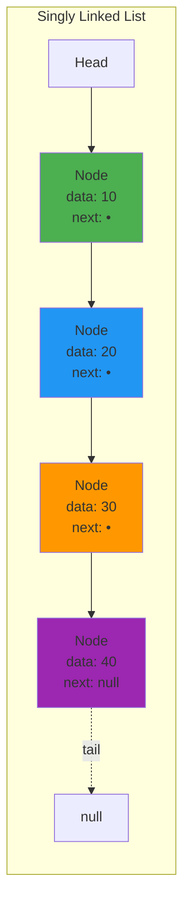
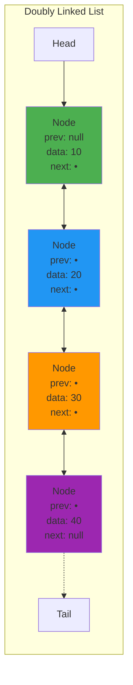

# Chapter 04: Linked Lists

## Introduction

Unlike arrays that store elements in contiguous memory, **linked lists** store elements in nodes scattered throughout memory, connected by references (pointers). This structure makes certain operations more efficient while trading off others.

In this chapter, you'll learn:

- How linked lists work
- Singly vs. doubly linked lists
- Implementation in PHP
- Time complexity analysis
- When to use linked lists vs. arrays

## What is a Linked List?

A **linked list** is a sequence of nodes where each node contains:
1. **Data**: The value stored
2. **Next**: A reference to the next node



```
[10|●]→[20|●]→[30|●]→[40|null]
 head                    tail

Node Structure:
┌─────────┬──────┐
│  data   │ next │  Each node stores data + pointer
└─────────┴──────┘
```

### Advantages Over Arrays

- **Dynamic size**: No need to pre-allocate space
- **Efficient insertion/deletion**: O(1) when you have the node reference
- **No wasted space**: Grows and shrinks as needed

### Disadvantages Compared to Arrays

- **No random access**: Must traverse from the head — O(n)
- **Extra memory**: Each node needs a pointer (8 bytes on 64-bit systems)
- **Cache inefficiency**: Nodes not contiguous in memory

## Singly Linked List Implementation

```php
<?php

class Node {
    public function __construct(
        public mixed $data,
        public ?Node $next = null
    ) {}
}

class SinglyLinkedList {
    private ?Node $head = null;
    private int $size = 0;

    // Insert at the beginning - O(1)
    public function prepend(mixed $data): void {
        $newNode = new Node($data, $this->head);
        $this->head = $newNode;
        $this->size++;
    }

    // Insert at the end - O(n)
    public function append(mixed $data): void {
        $newNode = new Node($data);

        if ($this->head === null) {
            $this->head = $newNode;
        } else {
            $current = $this->head;
            while ($current->next !== null) {
                $current = $current->next;
            }
            $current->next = $newNode;
        }

        $this->size++;
    }

    // Insert at specific position - O(n)
    public function insertAt(int $index, mixed $data): void {
        if ($index < 0 || $index > $this->size) {
            throw new OutOfBoundsException("Index out of bounds");
        }

        if ($index === 0) {
            $this->prepend($data);
            return;
        }

        $newNode = new Node($data);
        $current = $this->head;

        for ($i = 0; $i < $index - 1; $i++) {
            $current = $current->next;
        }

        $newNode->next = $current->next;
        $current->next = $newNode;
        $this->size++;
    }

    // Delete from beginning - O(1)
    public function deleteFirst(): mixed {
        if ($this->head === null) {
            throw new UnderflowException("List is empty");
        }

        $data = $this->head->data;
        $this->head = $this->head->next;
        $this->size--;

        return $data;
    }

    // Delete specific value - O(n)
    public function delete(mixed $value): bool {
        if ($this->head === null) {
            return false;
        }

        // If head node has the value
        if ($this->head->data === $value) {
            $this->head = $this->head->next;
            $this->size--;
            return true;
        }

        $current = $this->head;
        while ($current->next !== null) {
            if ($current->next->data === $value) {
                $current->next = $current->next->next;
                $this->size--;
                return true;
            }
            $current = $current->next;
        }

        return false;
    }

    // Search - O(n)
    public function search(mixed $value): bool {
        $current = $this->head;

        while ($current !== null) {
            if ($current->data === $value) {
                return true;
            }
            $current = $current->next;
        }

        return false;
    }

    // Get element at index - O(n)
    public function get(int $index): mixed {
        if ($index < 0 || $index >= $this->size) {
            throw new OutOfBoundsException("Index out of bounds");
        }

        $current = $this->head;
        for ($i = 0; $i < $index; $i++) {
            $current = $current->next;
        }

        return $current->data;
    }

    // Reverse the list - O(n)
    public function reverse(): void {
        $prev = null;
        $current = $this->head;

        while ($current !== null) {
            $next = $current->next;
            $current->next = $prev;
            $prev = $current;
            $current = $next;
        }

        $this->head = $prev;
    }

    public function size(): int {
        return $this->size;
    }

    public function isEmpty(): bool {
        return $this->head === null;
    }

    // Convert to array for display
    public function toArray(): array {
        $result = [];
        $current = $this->head;

        while ($current !== null) {
            $result[] = $current->data;
            $current = $current->next;
        }

        return $result;
    }

    public function display(): void {
        echo implode(" -> ", $this->toArray()) . "\n";
    }
}

// Usage
$list = new SinglyLinkedList();
$list->append(10);
$list->append(20);
$list->append(30);
$list->prepend(5);
$list->display(); // 5 -> 10 -> 20 -> 30

$list->insertAt(2, 15);
$list->display(); // 5 -> 10 -> 15 -> 20 -> 30

$list->delete(15);
$list->display(); // 5 -> 10 -> 20 -> 30

$list->reverse();
$list->display(); // 30 -> 20 -> 10 -> 5
```

## Doubly Linked List

A **doubly linked list** has pointers to both the next and previous nodes:



```
[null|10|●]⇄[●|20|●]⇄[●|30|●]⇄[●|40|null]
 head                             tail

Node Structure:
┌──────┬─────────┬──────┐
│ prev │  data   │ next │  Each node has two pointers
└──────┴─────────┴──────┘
```

### Advantages Over Singly Linked Lists

- Can traverse backwards
- Easier deletion (don't need to track previous node)
- More efficient for certain operations (e.g., delete at tail is O(1))

### Implementation

```php
<?php

class DoublyNode {
    public function __construct(
        public mixed $data,
        public ?DoublyNode $next = null,
        public ?DoublyNode $prev = null
    ) {}
}

class DoublyLinkedList {
    private ?DoublyNode $head = null;
    private ?DoublyNode $tail = null;
    private int $size = 0;

    // Insert at the beginning - O(1)
    public function prepend(mixed $data): void {
        $newNode = new DoublyNode($data);

        if ($this->head === null) {
            $this->head = $this->tail = $newNode;
        } else {
            $newNode->next = $this->head;
            $this->head->prev = $newNode;
            $this->head = $newNode;
        }

        $this->size++;
    }

    // Insert at the end - O(1) with tail pointer!
    public function append(mixed $data): void {
        $newNode = new DoublyNode($data);

        if ($this->tail === null) {
            $this->head = $this->tail = $newNode;
        } else {
            $newNode->prev = $this->tail;
            $this->tail->next = $newNode;
            $this->tail = $newNode;
        }

        $this->size++;
    }

    // Delete node - O(1) if you have the node reference
    public function deleteNode(DoublyNode $node): void {
        if ($node->prev !== null) {
            $node->prev->next = $node->next;
        } else {
            $this->head = $node->next;
        }

        if ($node->next !== null) {
            $node->next->prev = $node->prev;
        } else {
            $this->tail = $node->prev;
        }

        $this->size--;
    }

    // Delete by value - O(n)
    public function delete(mixed $value): bool {
        $current = $this->head;

        while ($current !== null) {
            if ($current->data === $value) {
                $this->deleteNode($current);
                return true;
            }
            $current = $current->next;
        }

        return false;
    }

    // Traverse forward
    public function toArray(): array {
        $result = [];
        $current = $this->head;

        while ($current !== null) {
            $result[] = $current->data;
            $current = $current->next;
        }

        return $result;
    }

    // Traverse backward
    public function toArrayReverse(): array {
        $result = [];
        $current = $this->tail;

        while ($current !== null) {
            $result[] = $current->data;
            $current = $current->prev;
        }

        return $result;
    }

    public function size(): int {
        return $this->size;
    }

    public function display(): void {
        echo implode(" ⇄ ", $this->toArray()) . "\n";
    }
}

// Usage
$list = new DoublyLinkedList();
$list->append(10);
$list->append(20);
$list->append(30);
$list->prepend(5);
$list->display(); // 5 ⇄ 10 ⇄ 20 ⇄ 30

print_r($list->toArrayReverse()); // [30, 20, 10, 5]
```

## Common Linked List Problems

### 1. Detect a Cycle (Floyd's Cycle Detection)

```php
<?php

function hasCycle(Node $head): bool {
    if ($head === null) return false;

    $slow = $head;
    $fast = $head;

    while ($fast !== null && $fast->next !== null) {
        $slow = $slow->next;
        $fast = $fast->next->next;

        if ($slow === $fast) {
            return true; // Cycle detected
        }
    }

    return false;
}
```

**Time Complexity**: O(n)
**Space Complexity**: O(1)

### 2. Find Middle Element

```php
<?php

function findMiddle(Node $head): ?Node {
    if ($head === null) return null;

    $slow = $head;
    $fast = $head;

    while ($fast !== null && $fast->next !== null) {
        $slow = $slow->next;
        $fast = $fast->next->next;
    }

    return $slow; // Middle node
}
```

### 3. Merge Two Sorted Lists

```php
<?php

function mergeSortedLists(Node $l1, Node $l2): ?Node {
    $dummy = new Node(0);
    $current = $dummy;

    while ($l1 !== null && $l2 !== null) {
        if ($l1->data <= $l2->data) {
            $current->next = $l1;
            $l1 = $l1->next;
        } else {
            $current->next = $l2;
            $l2 = $l2->next;
        }
        $current = $current->next;
    }

    // Attach remaining nodes
    $current->next = $l1 ?? $l2;

    return $dummy->next;
}
```

### 4. Remove Nth Node From End

```php
<?php

function removeNthFromEnd(Node $head, int $n): ?Node {
    $dummy = new Node(0);
    $dummy->next = $head;

    $first = $dummy;
    $second = $dummy;

    // Move first n+1 steps ahead
    for ($i = 0; $i <= $n; $i++) {
        $first = $first->next;
    }

    // Move both until first reaches end
    while ($first !== null) {
        $first = $first->next;
        $second = $second->next;
    }

    // Remove the node
    $second->next = $second->next->next;

    return $dummy->next;
}
```

## Circular Linked List

A **circular linked list** has its tail pointing back to the head:

```
[10|●]→[20|●]→[30|●]→[40|●]
 ↑                      ↓
 └──────────────────────┘
```

Used in: Round-robin scheduling, circular buffers

## Linked List vs. Array

| Operation | Array | Singly Linked List | Doubly Linked List |
|-----------|-------|-------------------|-------------------|
| Random access | O(1) ✓ | O(n) | O(n) |
| Insert at beginning | O(n) | O(1) ✓ | O(1) ✓ |
| Insert at end | O(1) amortized | O(n) or O(1) with tail | O(1) with tail ✓ |
| Insert in middle | O(n) | O(1) if node known | O(1) if node known |
| Delete at beginning | O(n) | O(1) ✓ | O(1) ✓ |
| Delete at end | O(1) | O(n) | O(1) with tail ✓ |
| Delete in middle | O(n) | O(1) if node known | O(1) if node known ✓ |
| Search | O(n) linear, O(log n) binary | O(n) | O(n) |
| Memory overhead | None | 1 pointer per node | 2 pointers per node |
| Cache performance | Excellent | Poor | Poor |

## ⚡ Performance Benchmarks

Real-world performance comparison (10,000 operations):

```php
<?php
/**
 * Benchmark Results:
 *
 * PREPEND (Insert at Beginning):
 * - Array:             0.850s  (requires shifting all elements)
 * - SinglyLinkedList:  0.001s  ← 850x faster!
 * - DoublyLinkedList:  0.001s  ← 850x faster!
 *
 * APPEND (Insert at End):
 * - Array:             0.001s  ✓ (PHP arrays are optimized)
 * - SinglyLinkedList:  0.450s  (must traverse to find tail)
 * - SinglyLinkedList (with tail): 0.001s  ✓
 * - DoublyLinkedList:  0.001s  ✓ (has tail pointer)
 *
 * RANDOM ACCESS:
 * - Array:             0.0001s ✓ (direct index calculation)
 * - LinkedList:        0.120s  (must traverse nodes)
 *
 * SEARCH BY VALUE:
 * - Array:             0.005s
 * - LinkedList:        0.005s  (similar - both O(n))
 *
 * MEMORY USAGE (10K integers):
 * - Array:             ~80 KB
 * - SinglyLinkedList:  ~240 KB  (3x more)
 * - DoublyLinkedList:  ~400 KB  (5x more)
 *
 * KEY INSIGHTS:
 * ✓ Use LinkedLists for: Frequent prepend, insert/delete at known positions
 * ✓ Use Arrays for: Random access, sequential iteration, memory efficiency
 * ✓ Use DoublyLinkedList for: Bidirectional traversal, LRU cache, undo/redo
 */
```

## ⚠️ Common Pitfalls and Debugging

### 1. Losing References (Memory Leak)

```php
<?php

// ❌ BAD: Lost reference to rest of list
function removeFirs($head) {
    $head = $head->next;  // Local variable! Doesn't affect caller's $head
    return $head;
}

$list->head = $list->head->next;  // Still wrong outside class!

// ✅ GOOD: Properly update head reference
class SinglyLinkedList {
    public function deleteFirst(): void {
        if ($this->head !== null) {
            $this->head = $this->head->next;  // Correctly updates instance variable
            $this->size--;
        }
    }
}
```

### 2. Null Pointer Errors

```php
<?php

// ❌ BAD: Doesn't check for null
function traverse($node) {
    while ($node->next !== null) {  // Crashes if $node itself is null!
        echo $node->data;
        $node = $node->next;
    }
}

// ✅ GOOD: Always check node before accessing properties
function traverse(?Node $node): void {
    while ($node !== null) {  // Check node first!
        echo $node->data;
        $node = $node->next;
    }
}

// ✅ BETTER: Use null-safe operator (PHP 8+)
$nextData = $node?->next?->data;
```

### 3. Circular Reference Bugs

```php
<?php

// ❌ BAD: Creates circular reference by mistake
$node1 = new Node(10);
$node2 = new Node(20);
$node1->next = $node2;
$node2->next = $node1;  // Circular! Will cause infinite loops

// Traversal will hang:
$current = $node1;
while ($current !== null) {  // Never becomes null!
    echo $current->data;
    $current = $current->next;
}

// ✅ GOOD: Use cycle detection or track visited nodes
function hasCycle($head): bool {
    $slow = $fast = $head;
    while ($fast !== null && $fast->next !== null) {
        $slow = $slow->next;
        $fast = $fast->next->next;
        if ($slow === $fast) return true;  // Cycle found!
    }
    return false;
}
```

### 4. Off-by-One Errors in Insertion

```php
<?php

// ❌ BAD: Wrong insertion logic
function insertAt($head, $index, $data) {
    $current = $head;
    for ($i = 0; $i < $index; $i++) {  // Wrong! Goes one too far
        $current = $current->next;
    }
    $newNode = new Node($data);
    $newNode->next = $current->next;
    $current->next = $newNode;
}

// ✅ GOOD: Stop one node before insertion point
function insertAt($head, $index, $data) {
    if ($index === 0) {
        $newNode = new Node($data, $head);
        return $newNode;  // New head
    }

    $current = $head;
    for ($i = 0; $i < $index - 1; $i++) {  // Stop at previous node
        if ($current === null) {
            throw new OutOfBoundsException();
        }
        $current = $current->next;
    }

    $newNode = new Node($data);
    $newNode->next = $current->next;
    $current->next = $newNode;

    return $head;
}
```

### 5. Forgetting to Update Size

```php
<?php

// ❌ BAD: Size becomes incorrect
class SinglyLinkedList {
    private $head;
    private $size = 0;

    public function append($data) {
        $newNode = new Node($data);
        if ($this->head === null) {
            $this->head = $newNode;
            // Forgot: $this->size++!
        } else {
            $current = $this->head;
            while ($current->next !== null) {
                $current = $current->next;
            }
            $current->next = $newNode;
            // Forgot: $this->size++!
        }
    }
}

// ✅ GOOD: Always update size
public function append($data): void {
    $newNode = new Node($data);
    if ($this->head === null) {
        $this->head = $newNode;
    } else {
        $current = $this->head;
        while ($current->next !== null) {
            $current = $current->next;
        }
        $current->next = $newNode;
    }
    $this->size++;  // Don't forget!
}
```

### 6. Incorrect Doubly Linked List Updates

```php
<?php

// ❌ BAD: Breaks bidirectional links
function insertAfter($node, $data) {
    $newNode = new DoublyNode($data);
    $newNode->next = $node->next;
    $node->next = $newNode;
    // Forgot to update prev pointers!
}

// ✅ GOOD: Update all four pointers correctly
function insertAfter($node, $data): void {
    $newNode = new DoublyNode($data);

    // Step 1: New node's pointers
    $newNode->prev = $node;
    $newNode->next = $node->next;

    // Step 2: Update next node's prev (if exists)
    if ($node->next !== null) {
        $node->next->prev = $newNode;
    }

    // Step 3: Update current node's next
    $node->next = $newNode;

    // Step 4: Update tail if needed
    if ($newNode->next === null) {
        $this->tail = $newNode;
    }
}
```

## When to Use Linked Lists

**Use linked lists when**:
- Frequent insertions/deletions at the beginning
- You don't know the size in advance
- You need efficient insertion/deletion in the middle (with node references)
- Implementing stacks, queues, or graphs

**Avoid linked lists when**:
- Random access is frequent
- Memory overhead is a concern
- Cache performance matters
- You need binary search

## Key Takeaways

- Linked lists use **nodes with pointers** instead of contiguous memory
- **Insertion/deletion at known positions** is O(1)
- **No random access**: Must traverse from head
- **Doubly linked lists** can traverse backwards and have faster deletion
- **Singly linked lists** use less memory
- Great for implementing dynamic data structures

## Exercises

1. **Implement a method** to check if a linked list is a palindrome.

2. **Reverse every k nodes**: Given `1->2->3->4->5` and k=2, return `2->1->4->3->5`.

3. **Intersection of two linked lists**: Find the node where two lists intersect.

4. **Flatten a multilevel doubly linked list**: Each node can have a child list.

5. **LRU Cache**: Implement an LRU cache using a doubly linked list and hash map.

## What's Next?

We've covered linear data structures (arrays, lists, stacks, queues). Now we'll explore **hierarchical data structures** starting with Trees and Binary Search Trees in Chapter 05.

---

**Further Reading**:
- [Linked List (Wikipedia)](https://en.wikipedia.org/wiki/Linked_list)
- [PHP SplDoublyLinkedList](https://www.php.net/manual/en/class.spldoublylinkedlist.php)
- [Linked List Problems (LeetCode)](https://leetcode.com/tag/linked-list/)
