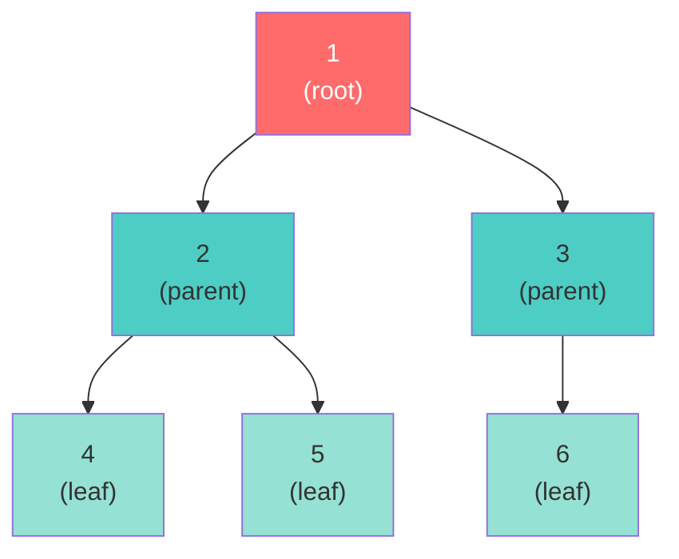
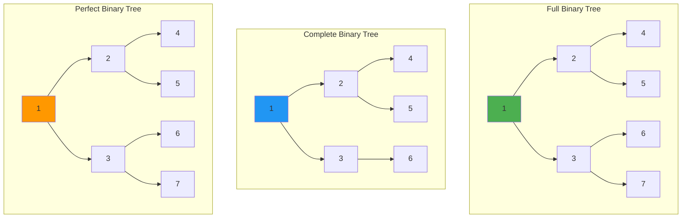
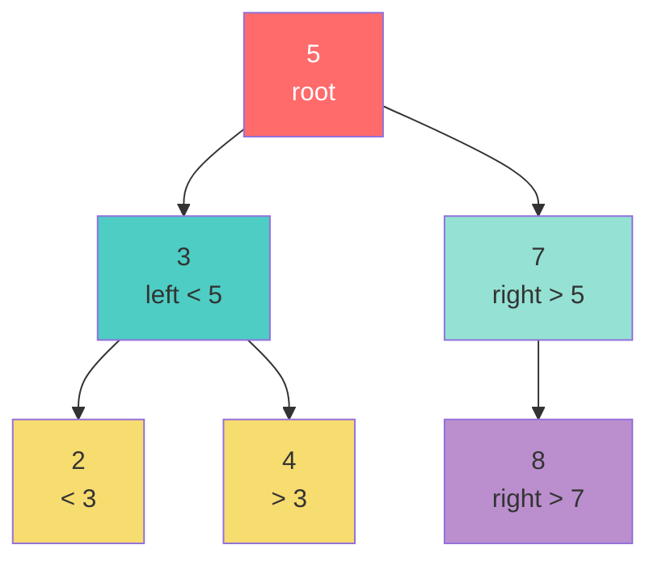

# Chapter 05: Trees and Binary Search Trees

## Introduction

Trees are **hierarchical data structures** that branch out from a root node. Unlike linear structures (arrays, lists), trees represent relationships with parent-child connections. They're fundamental to computer science, powering file systems, databases, compilers, and more.

In this chapter, you'll learn:

- Tree terminology and concepts
- Binary trees and their properties
- Binary search trees (BST)
- Tree traversal algorithms
- BST operations and complexity

## Tree Terminology



```
        1         ← root (depth: 0, height: 2)
       / \
      2   3       ← level 1 (depth: 1, height: 1)
     / \   \
    4   5   6     ← level 2 (depth: 2, height: 0) - leaves
```

**Key Terms:**
- **Root**: The topmost node (1)
- **Parent**: Node with children (1, 2, 3)
- **Child**: Node connected below a parent (2 and 3 are children of 1)
- **Leaf**: Node with no children (4, 5, 6)
- **Sibling**: Nodes with the same parent (2 and 3 are siblings)
- **Depth**: Distance from root to a node (node 4 has depth 2)
- **Height**: Distance from a node to its deepest leaf (root has height 2)
- **Subtree**: A tree formed by a node and its descendants

## Binary Trees

A **binary tree** is a tree where each node has **at most two children** (left and right).

### Binary Tree Node Implementation

```php
<?php

class TreeNode {
    public function __construct(
        public mixed $value,
        public ?TreeNode $left = null,
        public ?TreeNode $right = null
    ) {}
}

// Build a tree:    5
//                 / \
//                3   7
//               / \   \
//              2   4   8

$root = new TreeNode(5);
$root->left = new TreeNode(3);
$root->right = new TreeNode(7);
$root->left->left = new TreeNode(2);
$root->left->right = new TreeNode(4);
$root->right->right = new TreeNode(8);
```

### Types of Binary Trees



1. **Full Binary Tree**: Every node has 0 or 2 children (no node has only 1 child)
2. **Complete Binary Tree**: All levels filled except possibly the last, filled left to right
3. **Perfect Binary Tree**: All internal nodes have 2 children, all leaves at same level (height h has 2^h - 1 nodes)
4. **Balanced Binary Tree**: Height difference between left and right subtrees ≤ 1 for every node

## Tree Traversal Algorithms

### 1. Inorder Traversal (Left → Root → Right)

```php
<?php

function inorderTraversal(?TreeNode $node): array {
    if ($node === null) {
        return [];
    }

    return array_merge(
        inorderTraversal($node->left),
        [$node->value],
        inorderTraversal($node->right)
    );
}

// For BST, produces sorted output
$result = inorderTraversal($root);
// [2, 3, 4, 5, 7, 8]
```

**Complexity**: O(n) time, O(h) space (h = height for recursion stack)

### 2. Preorder Traversal (Root → Left → Right)

```php
<?php

function preorderTraversal(?TreeNode $node): array {
    if ($node === null) {
        return [];
    }

    return array_merge(
        [$node->value],
        preorderTraversal($node->left),
        preorderTraversal($node->right)
    );
}

$result = preorderTraversal($root);
// [5, 3, 2, 4, 7, 8]
```

**Use case**: Create a copy of the tree, expression tree evaluation

### 3. Postorder Traversal (Left → Right → Root)

```php
<?php

function postorderTraversal(?TreeNode $node): array {
    if ($node === null) {
        return [];
    }

    return array_merge(
        postorderTraversal($node->left),
        postorderTraversal($node->right),
        [$node->value]
    );
}

$result = postorderTraversal($root);
// [2, 4, 3, 8, 7, 5]
```

**Use case**: Delete a tree, postfix expression evaluation

### 4. Level Order Traversal (Breadth-First)

```php
<?php

function levelOrderTraversal(?TreeNode $root): array {
    if ($root === null) {
        return [];
    }

    $result = [];
    $queue = [$root];

    while (!empty($queue)) {
        $node = array_shift($queue);
        $result[] = $node->value;

        if ($node->left !== null) {
            $queue[] = $node->left;
        }
        if ($node->right !== null) {
            $queue[] = $node->right;
        }
    }

    return $result;
}

$result = levelOrderTraversal($root);
// [5, 3, 7, 2, 4, 8]
```

**Complexity**: O(n) time, O(w) space (w = maximum width)

## Binary Search Tree (BST)

A **Binary Search Tree** is a binary tree with the **BST property**:
- All nodes in the **left subtree** are **less than** the root
- All nodes in the **right subtree** are **greater than** the root
- This property applies recursively to all subtrees



```
        5           ← root
       / \
      3   7         ← 3 < 5 < 7  ✓
     / \   \
    2   4   8       ← 2 < 3 < 4 < 5 < 7 < 8  ✓

Inorder traversal gives sorted sequence: [2, 3, 4, 5, 7, 8]
```

**Why BST is useful:**
- **Efficient search**: O(log n) average case (balanced tree)
- **Sorted iteration**: Inorder traversal gives elements in sorted order
- **Dynamic**: Easy insertion and deletion compared to sorted arrays

### BST Implementation

```php
<?php

class BinarySearchTree {
    private ?TreeNode $root = null;

    // Insert - O(h) where h is height
    public function insert(mixed $value): void {
        $this->root = $this->insertNode($this->root, $value);
    }

    private function insertNode(?TreeNode $node, mixed $value): TreeNode {
        if ($node === null) {
            return new TreeNode($value);
        }

        if ($value < $node->value) {
            $node->left = $this->insertNode($node->left, $value);
        } elseif ($value > $node->value) {
            $node->right = $this->insertNode($node->right, $value);
        }
        // If equal, don't insert (no duplicates)

        return $node;
    }

    // Search - O(h)
    public function search(mixed $value): bool {
        return $this->searchNode($this->root, $value);
    }

    private function searchNode(?TreeNode $node, mixed $value): bool {
        if ($node === null) {
            return false;
        }

        if ($value === $node->value) {
            return true;
        }

        if ($value < $node->value) {
            return $this->searchNode($node->left, $value);
        }

        return $this->searchNode($node->right, $value);
    }

    // Delete - O(h)
    public function delete(mixed $value): void {
        $this->root = $this->deleteNode($this->root, $value);
    }

    private function deleteNode(?TreeNode $node, mixed $value): ?TreeNode {
        if ($node === null) {
            return null;
        }

        if ($value < $node->value) {
            $node->left = $this->deleteNode($node->left, $value);
        } elseif ($value > $node->value) {
            $node->right = $this->deleteNode($node->right, $value);
        } else {
            // Node found - delete it

            // Case 1: No children (leaf)
            if ($node->left === null && $node->right === null) {
                return null;
            }

            // Case 2: One child
            if ($node->left === null) {
                return $node->right;
            }
            if ($node->right === null) {
                return $node->left;
            }

            // Case 3: Two children
            // Find inorder successor (smallest in right subtree)
            $successor = $this->findMin($node->right);
            $node->value = $successor->value;
            $node->right = $this->deleteNode($node->right, $successor->value);
        }

        return $node;
    }

    // Find minimum value node
    private function findMin(TreeNode $node): TreeNode {
        while ($node->left !== null) {
            $node = $node->left;
        }
        return $node;
    }

    // Find maximum value node
    private function findMax(TreeNode $node): TreeNode {
        while ($node->right !== null) {
            $node = $node->right;
        }
        return $node;
    }

    // Get height
    public function height(): int {
        return $this->getHeight($this->root);
    }

    private function getHeight(?TreeNode $node): int {
        if ($node === null) {
            return -1;
        }

        return 1 + max(
            $this->getHeight($node->left),
            $this->getHeight($node->right)
        );
    }

    // Check if tree is valid BST
    public function isValidBST(): bool {
        return $this->isValidBSTNode($this->root, null, null);
    }

    private function isValidBSTNode(?TreeNode $node, $min, $max): bool {
        if ($node === null) {
            return true;
        }

        if (($min !== null && $node->value <= $min) ||
            ($max !== null && $node->value >= $max)) {
            return false;
        }

        return $this->isValidBSTNode($node->left, $min, $node->value) &&
               $this->isValidBSTNode($node->right, $node->value, $max);
    }

    // Get all values in sorted order
    public function inorder(): array {
        return inorderTraversal($this->root);
    }
}

// Usage
$bst = new BinarySearchTree();
$bst->insert(5);
$bst->insert(3);
$bst->insert(7);
$bst->insert(2);
$bst->insert(4);
$bst->insert(8);

echo $bst->search(4) ? "Found" : "Not found";  // Found
echo $bst->search(10) ? "Found" : "Not found"; // Not found

print_r($bst->inorder()); // [2, 3, 4, 5, 7, 8] - sorted!

$bst->delete(3);
print_r($bst->inorder()); // [2, 4, 5, 7, 8]
```

## BST Complexity Analysis

| Operation | Average | Worst Case |
|-----------|---------|------------|
| Search | O(log n) | O(n) |
| Insert | O(log n) | O(n) |
| Delete | O(log n) | O(n) |
| Space | O(n) | O(n) |

**Note**: Worst case occurs when tree becomes skewed (like a linked list):

```
1
 \
  2
   \
    3
     \
      4  ← Degrades to O(n)
```

## Balanced BSTs (Self-Balancing Trees)

To maintain O(log n) operations, use self-balancing trees:
- **AVL Trees**: Strict balancing (height difference ≤ 1)
- **Red-Black Trees**: Relaxed balancing, faster insertions
- **B-Trees**: Used in databases

## Common Tree Problems

### 1. Maximum Depth

```php
<?php

function maxDepth(?TreeNode $node): int {
    if ($node === null) {
        return 0;
    }

    return 1 + max(
        maxDepth($node->left),
        maxDepth($node->right)
    );
}
```

### 2. Check if Balanced

```php
<?php

function isBalanced(?TreeNode $node): bool {
    return checkBalance($node) !== -1;
}

function checkBalance(?TreeNode $node): int {
    if ($node === null) {
        return 0;
    }

    $leftHeight = checkBalance($node->left);
    if ($leftHeight === -1) return -1;

    $rightHeight = checkBalance($node->right);
    if ($rightHeight === -1) return -1;

    if (abs($leftHeight - $rightHeight) > 1) {
        return -1;
    }

    return 1 + max($leftHeight, $rightHeight);
}
```

### 3. Lowest Common Ancestor (BST)

```php
<?php

function lowestCommonAncestor(
    TreeNode $root,
    TreeNode $p,
    TreeNode $q
): TreeNode {
    if ($p->value < $root->value && $q->value < $root->value) {
        return lowestCommonAncestor($root->left, $p, $q);
    }

    if ($p->value > $root->value && $q->value > $root->value) {
        return lowestCommonAncestor($root->right, $p, $q);
    }

    return $root; // Split point
}
```

## BST vs. Hash Table vs. Array

| Operation | BST (balanced) | Hash Table | Sorted Array |
|-----------|----------------|------------|--------------|
| Search | O(log n) | O(1) average | O(log n) |
| Insert | O(log n) | O(1) average | O(n) |
| Delete | O(log n) | O(1) average | O(n) |
| Ordered traversal | O(n) | N/A | O(n) |
| Range query | O(log n + k) | O(n) | O(log n + k) |

## When to Use BSTs

**Use BSTs when**:
- You need sorted data
- Range queries are common
- You need both fast search and sorted order
- Space is limited (no hash table overhead)

**Avoid BSTs when**:
- Only simple lookups needed (use hash tables)
- Tree might become unbalanced
- Memory overhead is a concern

## Key Takeaways

- Trees are **hierarchical data structures** with parent-child relationships
- **Binary trees** have at most 2 children per node
- **BSTs** maintain sorted order with O(log n) operations when balanced
- **Traversals**: Inorder (sorted), Preorder (copy), Postorder (delete), Level-order (BFS)
- Unbalanced trees degrade to O(n) - use self-balancing trees in production

## Exercises

1. **Invert a binary tree**: Swap left and right children recursively.

2. **Path sum**: Find if there's a root-to-leaf path with a given sum.

3. **Serialize and deserialize**: Convert a tree to/from a string.

4. **Kth smallest element**: Find the kth smallest value in a BST.

5. **Build BST from sorted array**: Create a balanced BST from a sorted array.

## What's Next?

Trees are powerful, but sometimes we need even faster lookups. In Chapter 06, we'll explore **Hash Tables**—a data structure that provides O(1) average-case operations.

---

**Further Reading**:
- [Binary Search Tree (Wikipedia)](https://en.wikipedia.org/wiki/Binary_search_tree)
- [Tree Traversal Algorithms](https://en.wikipedia.org/wiki/Tree_traversal)
- [AVL Trees and Red-Black Trees](https://www.geeksforgeeks.org/avl-tree-set-1-insertion/)
