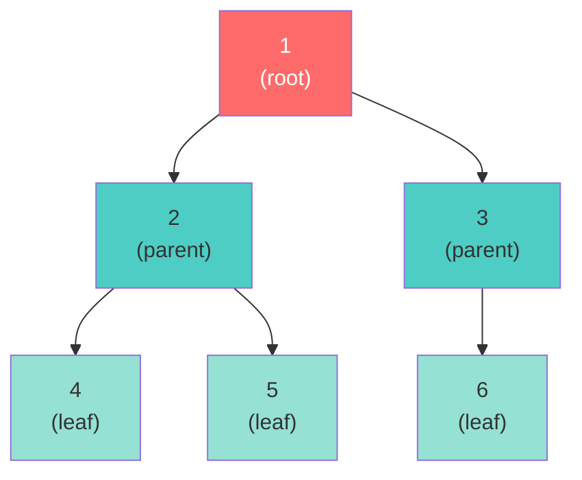
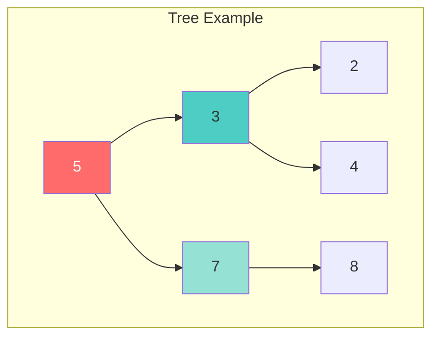
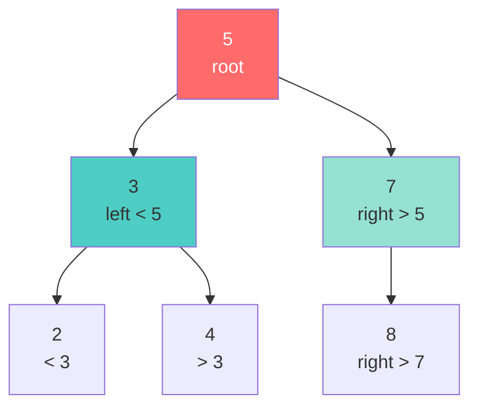

# Chapter 05: Trees and Binary Search Trees

## Overview

Trees are hierarchical data structures that branch out from a root node, representing parent-child relationships fundamentally different from linear structures like arrays and linked lists. They power file systems, databases, compilers, DOM manipulation, and decision-making algorithms across computer science.

In this chapter, you'll move beyond linear thinking to master hierarchical structures. You'll implement binary trees from scratch using PHP classes, understand why Binary Search Trees (BSTs) provide O(log n) operations when balanced, and build a complete BST with insert, search, and delete operations. Unlike hash tables that sacrifice ordering for speed, BSTs give you both fast lookups AND sorted traversal—making them ideal for range queries and ordered data.

You'll write all four tree traversal algorithms (inorder, preorder, postorder, level-order), understand when each is useful, and see how inorder traversal magically produces sorted output for BSTs. You'll validate tree properties, solve classic problems like finding the lowest common ancestor, and compare BST performance against arrays and hash tables with real benchmarks.

By the end of this chapter, you'll understand why balanced trees are critical for production systems, how database indexes use B-trees (a variant of BSTs), and when to choose trees over other data structures.

## Prerequisites

Before starting this chapter, you should have:

- ✅ Completed [Chapter 04: Linked Lists](/series/computer-science/chapters/04-linked-lists) or understand pointer-based data structures
- ✅ Basic understanding of recursion (covered in [Chapter 09](/series/computer-science/chapters/09-recursion) but simple recursion introduced here)
- ✅ Familiarity with Big O notation from [Chapter 01](/series/computer-science/chapters/01-algorithm-analysis-big-o)
- ✅ PHP 8.2+ installed with object-oriented programming knowledge
- ✅ Understanding of classes, objects, and constructor property promotion

**Estimated Time**: ~90 minutes (reading, coding, and running examples)

## What You'll Build

By the end of this chapter, you will have created:

- **TreeNode class** with left/right pointers for building binary trees
- **4 tree traversal algorithms**: inorder (sorted), preorder (copy), postorder (delete), level-order (BFS)
- **Complete BinarySearchTree class** with insert, search, delete, findMin/Max, height, and validation
- **Tree validation functions**: Check if valid BST, balanced, symmetric, or complete
- **Common tree problem solvers**: Maximum depth, path sum, lowest common ancestor, invert tree, diameter
- **Balanced BST builder** that converts sorted arrays to height-balanced trees in O(n)
- **Range query operations**: Find values in range, kth smallest/largest element, closest value
- **Serialization system** to convert trees to/from strings for storage
- **Tree visualizer** with 4 different console output formats
- **Performance benchmarking tool** comparing BST vs Array vs Hash Table at scale

All examples include complete, runnable code with clear output demonstrating tree concepts.

::: info Code Examples
Complete, runnable examples for this chapter:

- [`01-tree-node-basics.php`](https://github.com/dalehurley/codewithphp/blob/main/code/computer-science/chapter-05/01-tree-node-basics.php) — TreeNode class and basic tree operations
- [`02-tree-traversals.php`](https://github.com/dalehurley/codewithphp/blob/main/code/computer-science/chapter-05/02-tree-traversals.php) — All 4 traversal algorithms with examples
- [`03-bst-implementation.php`](https://github.com/dalehurley/codewithphp/blob/main/code/computer-science/chapter-05/03-bst-implementation.php) — Full BST with insert/search/delete
- [`04-tree-validation.php`](https://github.com/dalehurley/codewithphp/blob/main/code/computer-science/chapter-05/04-tree-validation.php) — Validate BST, balanced, symmetric, complete
- [`05-common-tree-problems.php`](https://github.com/dalehurley/codewithphp/blob/main/code/computer-science/chapter-05/05-common-tree-problems.php) — Classic tree algorithms
- [`06-build-bst-from-array.php`](https://github.com/dalehurley/codewithphp/blob/main/code/computer-science/chapter-05/06-build-bst-from-array.php) — Sorted array to balanced BST
- [`07-bst-range-queries.php`](https://github.com/dalehurley/codewithphp/blob/main/code/computer-science/chapter-05/07-bst-range-queries.php) — Range searches and kth element
- [`08-serialize-deserialize.php`](https://github.com/dalehurley/codewithphp/blob/main/code/computer-science/chapter-05/08-serialize-deserialize.php) — Tree serialization formats
- [`09-tree-visualization.php`](https://github.com/dalehurley/codewithphp/blob/main/code/computer-science/chapter-05/09-tree-visualization.php) — Console tree visualization
- [`10-performance-comparison.php`](https://github.com/dalehurley/codewithphp/blob/main/code/computer-science/chapter-05/10-performance-comparison.php) — BST vs Array vs Hash Table benchmarks

All files are in [`code/computer-science/chapter-05/`](https://github.com/dalehurley/codewithphp/tree/main/code/computer-science/chapter-05)
:::

## Quick Start

Want to see trees in action right now? Here's a 5-minute Binary Search Tree:

```php
<?php

class TreeNode {
    public function __construct(
        public mixed $value,
        public ?TreeNode $left = null,
        public ?TreeNode $right = null
    ) {}
}

class BinarySearchTree {
    private ?TreeNode $root = null;

    public function insert(mixed $value): void {
        $this->root = $this->insertNode($this->root, $value);
    }

    private function insertNode(?TreeNode $node, mixed $value): TreeNode {
        if ($node === null) {
            return new TreeNode($value);
        }

        if ($value < $node->value) {
            $node->left = $this->insertNode($node->left, $value);
        } elseif ($value > $node->value) {
            $node->right = $this->insertNode($node->right, $value);
        }

        return $node;
    }

    public function search(mixed $value): bool {
        return $this->searchNode($this->root, $value);
    }

    private function searchNode(?TreeNode $node, mixed $value): bool {
        if ($node === null) return false;
        if ($value === $node->value) return true;

        return $value < $node->value
            ? $this->searchNode($node->left, $value)
            : $this->searchNode($node->right, $value);
    }

    public function inorder(): array {
        return $this->inorderTraversal($this->root);
    }

    private function inorderTraversal(?TreeNode $node): array {
        if ($node === null) return [];

        return array_merge(
            $this->inorderTraversal($node->left),
            [$node->value],
            $this->inorderTraversal($node->right)
        );
    }
}

// Demo
$bst = new BinarySearchTree();
foreach ([5, 3, 7, 2, 4, 8, 6] as $value) {
    $bst->insert($value);
}

echo "Sorted output: " . json_encode($bst->inorder()) . "\n";
// [2, 3, 4, 5, 6, 7, 8] - automatically sorted!

echo "Search for 4: " . ($bst->search(4) ? "Found!" : "Not found") . "\n";
echo "Search for 10: " . ($bst->search(10) ? "Found!" : "Not found") . "\n";
```

Save as `quick-bst.php` and run:
```bash
php quick-bst.php
```

Now let's dive deeper into how trees work.

## Objectives

By completing this chapter, you will be able to:

**Foundational**:
- Explain tree terminology: root, parent, child, leaf, depth, height
- Implement a TreeNode class with left/right child pointers
- Build binary trees manually and understand their structure
- Distinguish between binary trees and binary search trees
- Calculate tree height and count nodes recursively

**Core Skills**:
- Implement all 4 tree traversal algorithms (inorder, preorder, postorder, level-order)
- Understand when to use each traversal method
- Create a complete BST class with insert, search, and delete operations
- Handle all 3 delete cases: leaf nodes, one child, two children
- Find minimum and maximum values in BST in O(h) time

**Advanced Techniques**:
- Validate if a tree maintains the BST property
- Check if a tree is height-balanced
- Build balanced BSTs from sorted arrays
- Perform range queries and find kth smallest element
- Serialize and deserialize trees for storage
- Compare BST performance vs arrays and hash tables

## Step 1: Understanding Tree Terminology (~10 min)

### Goal

Learn the vocabulary used to describe tree structures and understand tree properties.

### Concepts



**Key Terms:**
- **Root**: The topmost node (1)
- **Parent**: Node with children (1, 2, 3)
- **Child**: Node connected below a parent (2 and 3 are children of 1)
- **Leaf**: Node with no children (4, 5, 6)
- **Sibling**: Nodes with the same parent (2 and 3 are siblings)
- **Depth**: Distance from root to a node (node 4 has depth 2)
- **Height**: Distance from a node to its deepest leaf (root has height 2)
- **Subtree**: A tree formed by a node and its descendants

### Why This Matters

Understanding tree terminology is essential for:
- Communicating about tree algorithms
- Analyzing time complexity (often expressed as O(h) where h = height)
- Recognizing tree properties that affect performance

## Step 2: Implementing Binary Tree Nodes (~15 min)

### Goal

Create a TreeNode class and build a simple binary tree manually.

### Actions

1. **Create file** `tree-basics.php` or use the example code:

::: tip Try It Yourself
Run [`01-tree-node-basics.php`](https://github.com/dalehurley/codewithphp/blob/main/code/computer-science/chapter-05/01-tree-node-basics.php) to see TreeNode in action.
:::

```php
<?php

declare(strict_types=1);

class TreeNode {
    public function __construct(
        public mixed $value,
        public ?TreeNode $left = null,
        public ?TreeNode $right = null
    ) {}
}

// Build a tree:    5
//                 / \
//                3   7
//               / \   \
//              2   4   8

$root = new TreeNode(5);
$root->left = new TreeNode(3);
$root->right = new TreeNode(7);
$root->left->left = new TreeNode(2);
$root->left->right = new TreeNode(4);
$root->right->right = new TreeNode(8);

// Calculate height
function getHeight(?TreeNode $node): int {
    if ($node === null) {
        return -1;
    }

    return 1 + max(
        getHeight($node->left),
        getHeight($node->right)
    );
}

echo "Tree height: " . getHeight($root) . "\n"; // 2
```

2. **Run the code**:
```bash
php tree-basics.php
```

### Key Insights

✅ **TreeNode uses constructor property promotion** (PHP 8.0+) for concise syntax
✅ **Recursive structure**: Each node can have left/right children of type TreeNode
✅ **Null represents absence**: Missing children are null, not empty objects
✅ **Height calculation is recursive**: Base case (null = -1) + recursive case (1 + max of children)

## Step 3: Mastering Tree Traversals (~20 min)

### Goal

Implement all 4 tree traversal algorithms and understand their use cases.

### The 4 Traversal Methods



**Tree:** 5 → (3, 7) → (2, 4, null, 8)

| Traversal | Order | Result | Use Case |
|-----------|-------|--------|----------|
| **Inorder** | Left → Root → Right | [2, 3, 4, 5, 7, 8] | Get sorted sequence (BST) |
| **Preorder** | Root → Left → Right | [5, 3, 2, 4, 7, 8] | Copy tree structure |
| **Postorder** | Left → Right → Root | [2, 4, 3, 8, 7, 5] | Delete tree (children first) |
| **Level Order** | Top to bottom, left to right | [5, 3, 7, 2, 4, 8] | BFS, level-by-level processing |

### Implementation

::: tip Complete Examples
Run [`02-tree-traversals.php`](https://github.com/dalehurley/codewithphp/blob/main/code/computer-science/chapter-05/02-tree-traversals.php) to see all 4 traversals with output.
:::

**1. Inorder Traversal** (produces sorted output for BST):

```php
function inorderTraversal(?TreeNode $node): array {
    if ($node === null) {
        return [];
    }

    return array_merge(
        inorderTraversal($node->left),
        [$node->value],
        inorderTraversal($node->right)
    );
}

$result = inorderTraversal($root);
// [2, 3, 4, 5, 7, 8] - sorted!
```

**2. Level Order Traversal** (BFS using queue):

```php
function levelOrderTraversal(?TreeNode $root): array {
    if ($root === null) {
        return [];
    }

    $result = [];
    $queue = [$root];

    while (!empty($queue)) {
        $node = array_shift($queue);
        $result[] = $node->value;

        if ($node->left !== null) {
            $queue[] = $node->left;
        }
        if ($node->right !== null) {
            $queue[] = $node->right;
        }
    }

    return $result;
}

$result = levelOrderTraversal($root);
// [5, 3, 7, 2, 4, 8] - level by level
```

### Complexity

| Traversal | Time | Space |
|-----------|------|-------|
| Inorder | O(n) | O(h) for recursion stack |
| Preorder | O(n) | O(h) for recursion stack |
| Postorder | O(n) | O(h) for recursion stack |
| Level Order | O(n) | O(w) where w = max width |

## Step 4: Building a Binary Search Tree (~25 min)

### Goal

Implement a complete BST class with insert, search, and delete operations.

### The BST Property

A **Binary Search Tree** maintains this property at every node:
- All nodes in **left subtree** are **less than** the root
- All nodes in **right subtree** are **greater than** the root



This property enables **O(log n) search** in balanced trees!

### Complete Implementation

::: tip Full Working Code
Run [`03-bst-implementation.php`](https://github.com/dalehurley/codewithphp/blob/main/code/computer-science/chapter-05/03-bst-implementation.php) for the complete BST with all operations.
:::

**Key Operations:**

```php
class BinarySearchTree {
    private ?TreeNode $root = null;

    // Insert - O(h) where h is height
    public function insert(mixed $value): void {
        $this->root = $this->insertNode($this->root, $value);
    }

    private function insertNode(?TreeNode $node, mixed $value): TreeNode {
        if ($node === null) {
            return new TreeNode($value);
        }

        if ($value < $node->value) {
            $node->left = $this->insertNode($node->left, $value);
        } elseif ($value > $node->value) {
            $node->right = $this->insertNode($node->right, $value);
        }
        // If equal, don't insert (no duplicates)

        return $node;
    }

    // Search - O(h)
    public function search(mixed $value): bool {
        return $this->searchNode($this->root, $value);
    }

    private function searchNode(?TreeNode $node, mixed $value): bool {
        if ($node === null) return false;
        if ($value === $node->value) return true;

        if ($value < $node->value) {
            return $this->searchNode($node->left, $value);
        }

        return $this->searchNode($node->right, $value);
    }

    // Delete - O(h) - handles 3 cases
    public function delete(mixed $value): void {
        $this->root = $this->deleteNode($this->root, $value);
    }

    private function deleteNode(?TreeNode $node, mixed $value): ?TreeNode {
        if ($node === null) {
            return null;
        }

        if ($value < $node->value) {
            $node->left = $this->deleteNode($node->left, $value);
        } elseif ($value > $node->value) {
            $node->right = $this->deleteNode($node->right, $value);
        } else {
            // Node found - delete it

            // Case 1: No children (leaf)
            if ($node->left === null && $node->right === null) {
                return null;
            }

            // Case 2: One child
            if ($node->left === null) {
                return $node->right;
            }
            if ($node->right === null) {
                return $node->left;
            }

            // Case 3: Two children
            // Find inorder successor (smallest in right subtree)
            $successor = $this->findMin($node->right);
            $node->value = $successor->value;
            $node->right = $this->deleteNode($node->right, $successor->value);
        }

        return $node;
    }
}

// Usage
$bst = new BinarySearchTree();
foreach ([5, 3, 7, 2, 4, 8] as $value) {
    $bst->insert($value);
}

echo $bst->search(4) ? "Found" : "Not found";  // Found
echo $bst->search(10) ? "Found" : "Not found"; // Not found

print_r($bst->inorder()); // [2, 3, 4, 5, 7, 8] - sorted!
```

### Delete Operation - 3 Cases

**Case 1: Leaf node** (no children) → Simply remove
**Case 2: One child** → Replace node with its child
**Case 3: Two children** → Replace with inorder successor (smallest value in right subtree)

### Complexity Analysis

| Operation | Average | Worst Case (Skewed) |
|-----------|---------|---------------------|
| Search | O(log n) | O(n) |
| Insert | O(log n) | O(n) |
| Delete | O(log n) | O(n) |

**Worst case** occurs when tree becomes skewed (like a linked list):
```
1
 \
  2
   \
    3
     \
      4  ← O(n) search!
```

**Solution**: Use self-balancing trees (AVL, Red-Black) for guaranteed O(log n).

## Step 5: Validating Tree Properties (~10 min)

### Goal

Implement functions to check if a tree is valid, balanced, or symmetric.

::: tip Complete Validation Suite
Run [`04-tree-validation.php`](https://github.com/dalehurley/codewithphp/blob/main/code/computer-science/chapter-05/04-tree-validation.php) for all validation checks with examples.
:::

**Check if Valid BST:**

```php
function isValidBST(?TreeNode $node, $min = null, $max = null): bool {
    if ($node === null) {
        return true;
    }

    if (($min !== null && $node->value <= $min) ||
        ($max !== null && $node->value >= $max)) {
        return false;
    }

    return isValidBST($node->left, $min, $node->value) &&
           isValidBST($node->right, $node->value, $max);
}
```

**Check if Balanced:**

```php
function isBalanced(?TreeNode $node): bool {
    return checkBalance($node) !== -1;
}

function checkBalance(?TreeNode $node): int {
    if ($node === null) {
        return 0;
    }

    $leftHeight = checkBalance($node->left);
    if ($leftHeight === -1) return -1;

    $rightHeight = checkBalance($node->right);
    if ($rightHeight === -1) return -1;

    if (abs($leftHeight - $rightHeight) > 1) {
        return -1; // Unbalanced
    }

    return 1 + max($leftHeight, $rightHeight);
}
```

## Step 6: Common Tree Problems (~15 min)

### Goal

Solve classic tree algorithm problems that appear in interviews.

::: tip Problem Solutions
Run [`05-common-tree-problems.php`](https://github.com/dalehurley/codewithphp/blob/main/code/computer-science/chapter-05/05-common-tree-problems.php) for 7 common problems solved.
:::

**1. Maximum Depth:**

```php
function maxDepth(?TreeNode $node): int {
    if ($node === null) {
        return 0;
    }

    return 1 + max(
        maxDepth($node->left),
        maxDepth($node->right)
    );
}
```

**2. Path Sum** (does root-to-leaf path with target sum exist?):

```php
function hasPathSum(?TreeNode $node, int $targetSum): bool {
    if ($node === null) {
        return false;
    }

    // Leaf node check
    if ($node->left === null && $node->right === null) {
        return $targetSum === $node->value;
    }

    $remainingSum = $targetSum - $node->value;
    return hasPathSum($node->left, $remainingSum) ||
           hasPathSum($node->right, $remainingSum);
}
```

**3. Lowest Common Ancestor (BST version):**

```php
function lowestCommonAncestorBST(
    TreeNode $root,
    int $p,
    int $q
): TreeNode {
    if ($p < $root->value && $q < $root->value) {
        return lowestCommonAncestorBST($root->left, $p, $q);
    }

    if ($p > $root->value && $q > $root->value) {
        return lowestCommonAncestorBST($root->right, $p, $q);
    }

    return $root; // Split point
}
```

## Step 7: Advanced Operations (~15 min)

### Goal

Perform advanced BST operations like range queries and serialization.

::: tip Advanced Techniques
- [`06-build-bst-from-array.php`](https://github.com/dalehurley/codewithphp/blob/main/code/computer-science/chapter-05/06-build-bst-from-array.php) — Build balanced BST from sorted array
- [`07-bst-range-queries.php`](https://github.com/dalehurley/codewithphp/blob/main/code/computer-science/chapter-05/07-bst-range-queries.php) — Range searches and kth element
- [`08-serialize-deserialize.php`](https://github.com/dalehurley/codewithphp/blob/main/code/computer-science/chapter-05/08-serialize-deserialize.php) — Save/load trees
:::

**Build Balanced BST from Sorted Array:**

```php
function sortedArrayToBST(array $nums): ?TreeNode {
    if (empty($nums)) {
        return null;
    }

    return buildBST($nums, 0, count($nums) - 1);
}

function buildBST(array $nums, int $left, int $right): ?TreeNode {
    if ($left > $right) {
        return null;
    }

    // Use middle element as root to ensure balance
    $mid = intval(($left + $right) / 2);
    $root = new TreeNode($nums[$mid]);

    $root->left = buildBST($nums, $left, $mid - 1);
    $root->right = buildBST($nums, $mid + 1, $right);

    return $root;
}

$sortedArray = [1, 2, 3, 4, 5, 6, 7];
$balancedBST = sortedArrayToBST($sortedArray);
// Creates perfectly balanced tree with height = log(7) = 2
```

**Find Kth Smallest Element:**

```php
function kthSmallest(?TreeNode $root, int $k): ?int {
    $count = 0;
    $result = null;

    function inorderWithCounter(?TreeNode $node, int $k, int &$count, &$result): void {
        if ($node === null || $result !== null) {
            return;
        }

        inorderWithCounter($node->left, $k, $count, $result);

        $count++;
        if ($count === $k) {
            $result = $node->value;
            return;
        }

        inorderWithCounter($node->right, $k, $count, $result);
    }

    inorderWithCounter($root, $k, $count, $result);
    return $result;
}
```

## BST vs Hash Table vs Array

Understanding when to use each data structure:

| Operation | BST (balanced) | Hash Table | Sorted Array |
|-----------|----------------|------------|--------------|
| Search | O(log n) | O(1) average | O(log n) |
| Insert | O(log n) | O(1) average | O(n) |
| Delete | O(log n) | O(1) average | O(n) |
| Ordered traversal | O(n) | N/A | O(n) |
| Range query | O(log n + k) | O(n) | O(log n + k) |
| Space | O(n) | O(n) | O(n) |

::: tip Performance Comparison
Run [`10-performance-comparison.php`](https://github.com/dalehurley/codewithphp/blob/main/code/computer-science/chapter-05/10-performance-comparison.php) to see real benchmarks at 100, 1000, and 10000 elements.
:::

**Use BST when:**
- ✅ Need sorted data
- ✅ Range queries are common
- ✅ Need both fast search AND sorted order
- ✅ Space is limited (no hash table overhead)

**Use Hash Table when:**
- ✅ Only simple lookups needed
- ✅ No need for ordering
- ✅ Fastest possible search required

**Use Sorted Array when:**
- ✅ Data is mostly static (few inserts/deletes)
- ✅ Memory efficiency critical

## Balanced Trees in Production

**Problem**: Unbalanced BSTs degrade to O(n) operations.

**Solution**: Self-balancing trees maintain height = O(log n):

- **AVL Trees**: Strict balancing (height difference ≤ 1), more rotations
- **Red-Black Trees**: Relaxed balancing, faster insertions (used in Linux, Java TreeMap)
- **B-Trees**: Disk-optimized, used in databases (MySQL, PostgreSQL indexes)

## Real-World Applications

**File Systems**: Directory structure is a tree
```
/
├── home
│   ├── user
│   │   ├── documents
│   │   └── downloads
└── etc
```

**Database Indexes**: B-tree indexes for O(log n) queries
**DOM (Document Object Model)**: HTML structure is a tree
**Compilers**: Abstract Syntax Trees (AST) for parsing code
**Decision Trees**: Machine learning classification

## Key Takeaways

- **Trees are hierarchical**: Parent-child relationships, not linear
- **Binary trees**: At most 2 children per node
- **BST property**: Left < Root < Right enables O(log n) search
- **4 traversals**: Inorder (sorted), Preorder (copy), Postorder (delete), Level-order (BFS)
- **Balance matters**: Unbalanced trees → O(n), Balanced trees → O(log n)
- **Delete is tricky**: 3 cases (leaf, one child, two children)
- **Self-balancing trees**: Production systems use AVL or Red-Black trees
- **Use cases**: BSTs excel at ordered data with range queries

## Exercises

Test your understanding:

1. **Invert a binary tree**: Swap left and right children recursively ([Solution](https://github.com/dalehurley/codewithphp/blob/main/code/computer-science/chapter-05/05-common-tree-problems.php))

2. **Check if two trees are identical**: Compare structure and values

3. **Serialize and deserialize**: Convert tree to string and back ([Solution](https://github.com/dalehurley/codewithphp/blob/main/code/computer-science/chapter-05/08-serialize-deserialize.php))

4. **Kth smallest element**: Find kth smallest value in BST ([Solution](https://github.com/dalehurley/codewithphp/blob/main/code/computer-science/chapter-05/07-bst-range-queries.php))

5. **Build BST from sorted array**: Create balanced BST ([Solution](https://github.com/dalehurley/codewithphp/blob/main/code/computer-science/chapter-05/06-build-bst-from-array.php))

## What's Next?

Trees are powerful for hierarchical data, but what if you need O(1) lookups? In [Chapter 06: Hash Tables](/series/computer-science/chapters/06-hash-tables), you'll explore the data structure behind PHP's associative arrays that provides constant-time operations.

---

**Further Reading**:
- [Binary Search Tree - Wikipedia](https://en.wikipedia.org/wiki/Binary_search_tree)
- [Tree Traversal Algorithms](https://en.wikipedia.org/wiki/Tree_traversal)
- [AVL Trees and Red-Black Trees](https://www.geeksforgeeks.org/avl-tree-set-1-insertion/)
- [LeetCode Tree Problems](https://leetcode.com/tag/tree/)
