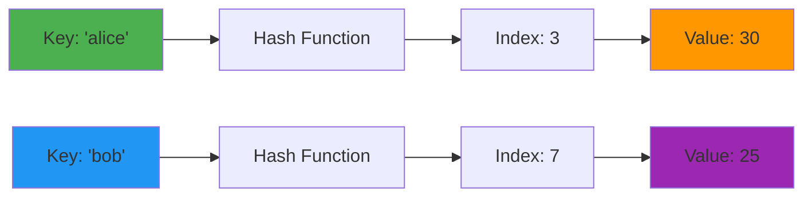
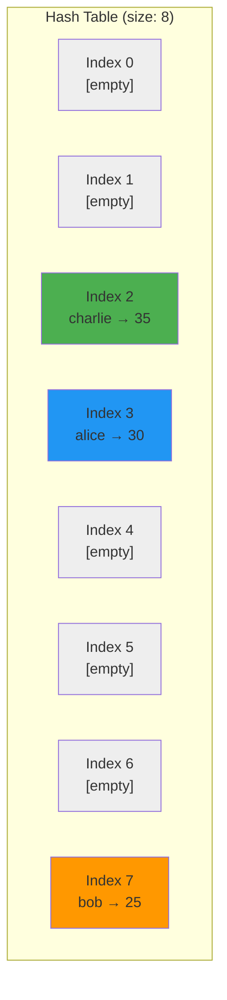
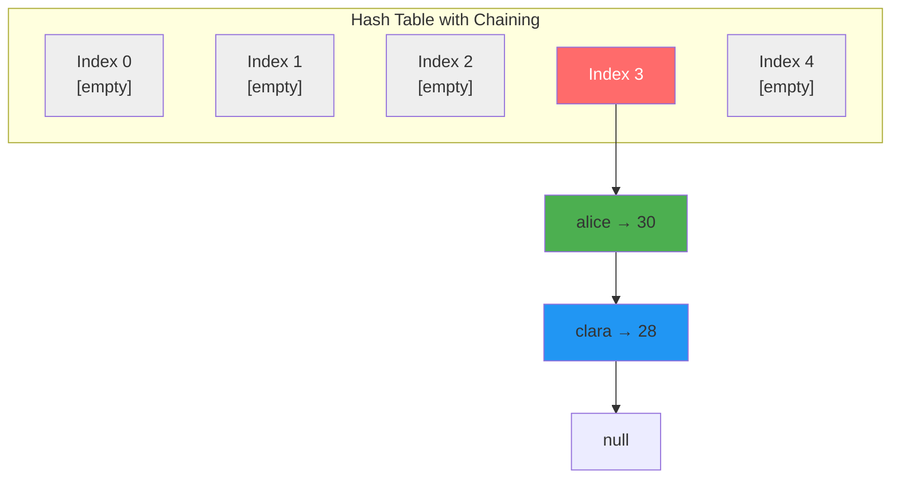
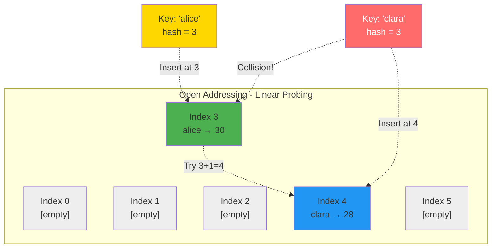
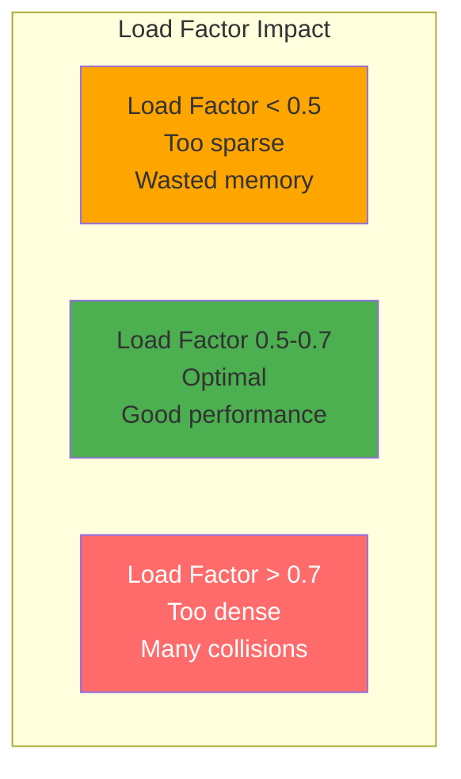

# Chapter 06: Hash Tables and Hash Functions

## Overview

Hash tables are the workhorses of modern software engineering, powering everything from database indexes to web caches, from compiler symbol tables to session management systems. Unlike arrays that require O(n) searches or BSTs that need O(log n) time, hash tables deliver **constant-time O(1) operations** for lookups, inserts, and deletes—making them indispensable when speed is critical.

Understanding hash tables transforms how you solve problems. The classic "find pair that sums to target" problem drops from O(n²) to O(n). Checking for duplicate elements? O(n) instead of O(n log n). Frequency counting, anagram detection, caching—all become trivial with hash tables. PHP's associative arrays are hash tables, JavaScript's objects and Maps are hash tables, Python's dicts are hash tables. This chapter teaches you the theory behind them and how to implement them from scratch.

You'll start by building simple hash functions and watching them distribute keys across a table. Then you'll implement collision resolution strategies—both chaining (using linked lists) and open addressing (linear probing). You'll create a working LRU cache that combines hash tables with doubly linked lists for O(1) operations. By the end, you'll understand why hash tables are used everywhere, when they're the right choice, and how to build them yourself.

## Prerequisites

::: tip Prerequisites
Before starting this chapter, ensure you have:

- ✅ Completed [Chapter 04: Linked Lists](/series/computer-science/chapters/04-linked-lists)
- ✅ Understanding of arrays and their O(n) search limitation
- ✅ Familiarity with PHP 8.2+ (constructor promotion, typed properties)
- ✅ Basic understanding of modulo operator (%) for array indexing
- ✅ Comfort with Big O notation for time complexity analysis

**Optional but helpful:**
- Experience with PHP's built-in associative arrays
- Understanding of pointers/references for linked list chaining
- Familiarity with amortized analysis concepts
:::

## Estimated Time

⏱️ **~90 minutes** total

- Reading and understanding: ~30 minutes
- Running and studying code examples: ~40 minutes
- Exercises and experimentation: ~20 minutes

## What You'll Build

By completing this chapter, you'll create:

✅ **Hash Function Library** - djb2, division, multiplication methods with collision testing
✅ **Hash Table with Chaining** - Complete implementation using linked lists
✅ **Hash Table with Open Addressing** - Linear probing with tombstone markers
✅ **Two-Sum Solver** - O(n) solution demonstrating hash table power
✅ **Frequency Counter** - Character/word frequency analysis tool
✅ **Anagram Grouper** - Advanced grouping using canonical forms
✅ **Hash Set Implementation** - Set operations (union, intersection, difference)
✅ **LRU Cache** - O(1) cache combining hash table + doubly linked list
✅ **Dynamic Hash Table** - Automatic resizing with load factor monitoring
✅ **Real-World Applications** - URL shortener, spell checker, database index

**Plus**: Understanding of PHP's associative array internals and performance comparison across data structures.

## Quick Start

Try this 5-minute introduction to hash tables:

```php
<?php

// Simple hash function: convert key to index
function hash(string $key, int $tableSize): int {
    $hash = 5381;
    for ($i = 0; $i < strlen($key); $i++) {
        $hash = (($hash << 5) + $hash) + ord($key[$i]);
    }
    return abs($hash) % $tableSize;
}

// Create a simple hash table
$table = array_fill(0, 10, null);

// Insert: O(1)
$key = "alice";
$index = hash($key, 10);
$table[$index] = ["alice" => 30];

// Lookup: O(1)
echo "Index for '$key': $index\n";
echo "Value: {$table[$index]['alice']}\n";

// Compare to array search: O(n)
$array = [["alice" => 30], ["bob" => 25], ["charlie" => 35]];
foreach ($array as $pair) {
    if (isset($pair["alice"])) {
        echo "Found in array (slower O(n) search)\n";
        break;
    }
}
```

**Output:**
```
Index for 'alice': 3
Value: 30
Found in array (slower O(n) search)
```

Hash tables turn O(n) searches into O(1) lookups!

## Objectives

### Foundational Understanding
- Understand how hash functions convert keys to array indices
- Learn why hash tables achieve O(1) average-case operations
- Recognize the role of load factor in performance
- Identify collision scenarios and their impact

### Core Skills
- Implement hash functions (djb2, division, multiplication methods)
- Build hash table with separate chaining (linked lists)
- Build hash table with open addressing (linear probing)
- Design dynamic resizing with rehashing
- Solve classic problems: two-sum, frequency counting, anagram detection

### Advanced Techniques
- Combine hash tables with other structures (LRU cache = hash + linked list)
- Analyze time-space tradeoffs in collision resolution
- Understand amortized cost analysis for resizing operations
- Choose optimal load factor thresholds for different scenarios
- Apply hash tables to real-world problems (caching, indexing, deduplication)

::: info Code Examples
All code examples for this chapter are available in the repository:
[📁 Chapter 06 Code Examples](https://github.com/dalehurley/codewithphp/tree/main/code/computer-science/chapter-06)

Run them locally:
```bash
cd code/computer-science/chapter-06
php 01-hash-function-basics.php
```
:::

## Step 1: Hash Functions (10 minutes)

A **hash function** converts a key (string, number, object) into an array index. The goal: distribute keys uniformly across the table to minimize collisions.

### What is a Hash Table?

A **hash table** (or hash map) stores key-value pairs using a **hash function** to compute an index where the value should be stored:



```
Key → Hash Function → Index → Value

"alice" → hash("alice") → 3 → 30
"bob"   → hash("bob")   → 7 → 25

Formula: index = hash(key) % table_size
```

### Hash Table Structure



```
Index   Bucket
  0  →  [empty]
  1  →  [empty]
  2  →  ["charlie" => 35]
  3  →  ["alice" => 30]
  4  →  [empty]
  5  →  [empty]
  6  →  [empty]
  7  →  ["bob" => 25]

Average O(1) lookup: Direct index access!
```

### Properties of Good Hash Functions

1. **Deterministic**: Same key always produces same hash
2. **Uniform distribution**: Keys spread evenly across table
3. **Fast to compute**: O(1) or O(k) where k = key length
4. **Avalanche effect**: Small key change → big hash change

### Simple Hash Function

```php
<?php

// Simple hash function (not production-ready)
function simpleHash(string $key, int $tableSize): int {
    $hash = 0;

    for ($i = 0; $i < strlen($key); $i++) {
        $hash += ord($key[$i]);
    }

    return $hash % $tableSize;
}

echo simpleHash("alice", 10); // 3
echo simpleHash("bob", 10);   // 7
```

**Problem**: Poor distribution. "abc" and "cab" hash to same value (sum of ASCII codes is order-independent).

### Better Hash Function (djb2)

```php
<?php

function betterHash(string $key, int $tableSize): int {
    $hash = 5381;

    for ($i = 0; $i < strlen($key); $i++) {
        $hash = (($hash << 5) + $hash) + ord($key[$i]);
        // Equivalent to: $hash = $hash * 33 + ord($key[$i])
    }

    return abs($hash) % $tableSize;
}
```

**Why djb2?**
- Uses prime number (33 = 2^5 + 1) for better distribution
- Order-dependent: "abc" ≠ "cab"
- Fast: only bit shift and addition operations
- Industry-tested: used in many hash table implementations

::: info Code Example
See complete hash function comparison with collision testing:
[📄 01-hash-function-basics.php](https://github.com/dalehurley/codewithphp/tree/main/code/computer-science/chapter-06/01-hash-function-basics.php)

Demonstrates:
- djb2, division, multiplication methods
- Collision detection visualization
- Distribution quality testing
- Determinism verification
:::

## Step 2: Collision Resolution - Chaining (15 minutes)

**Collision**: When two keys hash to the same index

```
hash("alice") → 3
hash("clara") → 3  ← Collision!
```

### Strategy 1: Chaining (Separate Chaining)

Store a linked list at each index:



```
Index   Bucket (linked list)
  0  →  null
  1  →  null
  2  →  null
  3  →  [alice=>30] → [clara=>28] → null  ← Chain of collisions
  4  →  null

Chaining: Each bucket holds a linked list
Time: O(1) average, O(n) worst (if all keys collide)
```

### Implementation

```php
<?php

class HashNode {
    public function __construct(
        public string $key,
        public mixed $value,
        public ?HashNode $next = null
    ) {}
}

class HashTableChaining {
    private array $buckets;
    private int $size;
    private int $count = 0;

    public function __construct(int $size = 10) {
        $this->size = $size;
        $this->buckets = array_fill(0, $size, null);
    }

    private function hash(string $key): int {
        $hash = 5381;
        for ($i = 0; $i < strlen($key); $i++) {
            $hash = (($hash << 5) + $hash) + ord($key[$i]);
        }
        return abs($hash) % $this->size;
    }

    // Insert/Update - O(1) average
    public function put(string $key, mixed $value): void {
        $index = $this->hash($key);
        $node = $this->buckets[$index];

        // Check if key exists and update
        while ($node !== null) {
            if ($node->key === $key) {
                $node->value = $value;
                return;
            }
            $node = $node->next;
        }

        // Key doesn't exist, add new node at front
        $newNode = new HashNode($key, $value, $this->buckets[$index]);
        $this->buckets[$index] = $newNode;
        $this->count++;
    }

    // Get - O(1) average
    public function get(string $key): mixed {
        $index = $this->hash($key);
        $node = $this->buckets[$index];

        while ($node !== null) {
            if ($node->key === $key) {
                return $node->value;
            }
            $node = $node->next;
        }

        return null;
    }

    // Delete - O(1) average
    public function remove(string $key): bool {
        $index = $this->hash($key);
        $node = $this->buckets[$index];
        $prev = null;

        while ($node !== null) {
            if ($node->key === $key) {
                if ($prev === null) {
                    $this->buckets[$index] = $node->next;
                } else {
                    $prev->next = $node->next;
                }
                $this->count--;
                return true;
            }
            $prev = $node;
            $node = $node->next;
        }

        return false;
    }
}

// Usage
$hashTable = new HashTableChaining(10);
$hashTable->put("alice", 30);
$hashTable->put("bob", 25);
$hashTable->put("charlie", 35);

echo $hashTable->get("alice"); // 30
```

::: info Code Example
See complete chaining implementation with load factor monitoring:
[📄 02-hash-table-chaining.php](https://github.com/dalehurley/codewithphp/tree/main/code/computer-science/chapter-06/02-hash-table-chaining.php)

Demonstrates:
- Full hash table class with all operations
- Chain length statistics and visualization
- Load factor calculation
- Performance benchmarks
:::

## Step 3: Collision Resolution - Open Addressing (15 minutes)

### Strategy 2: Open Addressing

Store all elements in the table itself. When collision occurs, probe for the next available slot.

#### Linear Probing



```
Linear Probing: If index is occupied, try index+1, index+2, ...

Example:
1. Insert "alice" → hash(alice) = 3 → Store at index 3 ✓
2. Insert "clara" → hash(clara) = 3 → Collision!
3. Probe: try index 4 → Empty ✓ → Store at index 4

Advantages: Better cache locality, no extra memory for pointers
Disadvantages: Primary clustering, tombstones needed for deletion
```

### Implementation with Tombstones

```php
<?php

class HashTableOpenAddressing {
    private array $keys;
    private array $values;
    private array $deleted; // Tombstone markers
    private int $size;
    private int $count = 0;

    public function __construct(int $size = 10) {
        $this->size = $size;
        $this->keys = array_fill(0, $size, null);
        $this->values = array_fill(0, $size, null);
        $this->deleted = array_fill(0, $size, false);
    }

    private function hash(string $key): int {
        $hash = 5381;
        for ($i = 0; $i < strlen($key); $i++) {
            $hash = (($hash << 5) + $hash) + ord($key[$i]);
        }
        return abs($hash) % $this->size;
    }

    // Insert/Update - O(1) average
    public function put(string $key, mixed $value): void {
        $index = $this->hash($key);
        $probes = 0;

        // Linear probing
        while ($this->keys[$index] !== null && $this->keys[$index] !== $key) {
            if ($this->deleted[$index]) {
                break; // Can reuse deleted slot
            }
            $index = ($index + 1) % $this->size;
            $probes++;

            if ($probes >= $this->size) {
                throw new RuntimeException("Hash table full");
            }
        }

        $isUpdate = ($this->keys[$index] === $key);

        $this->keys[$index] = $key;
        $this->values[$index] = $value;
        $this->deleted[$index] = false;

        if (!$isUpdate) {
            $this->count++;
        }
    }

    // Get - O(1) average
    public function get(string $key): mixed {
        $index = $this->hash($key);

        while ($this->keys[$index] !== null || $this->deleted[$index]) {
            if ($this->keys[$index] === $key && !$this->deleted[$index]) {
                return $this->values[$index];
            }
            $index = ($index + 1) % $this->size;
        }

        return null;
    }

    // Delete - O(1) average
    public function remove(string $key): bool {
        $index = $this->hash($key);

        while ($this->keys[$index] !== null || $this->deleted[$index]) {
            if ($this->keys[$index] === $key && !$this->deleted[$index]) {
                $this->deleted[$index] = true; // Tombstone marker
                $this->count--;
                return true;
            }
            $index = ($index + 1) % $this->size;
        }

        return false;
    }
}
```

::: info Code Example
See complete open addressing implementation:
[📄 03-hash-table-open-addressing.php](https://github.com/dalehurley/codewithphp/tree/main/code/computer-science/chapter-06/03-hash-table-open-addressing.php)

Demonstrates:
- Linear probing with wrap-around
- Tombstone markers for deletion
- Clustering visualization
- Comparison with chaining
:::

## Step 4: Classic Hash Table Problems (20 minutes)

### Two-Sum Problem

**Problem**: Given array of numbers and target, find two numbers that sum to target.

**Brute Force**: O(n²) - check all pairs

```php
function twoSumBruteForce(array $nums, int $target): ?array {
    $n = count($nums);
    for ($i = 0; $i < $n; $i++) {
        for ($j = $i + 1; $j < $n; $j++) {
            if ($nums[$i] + $nums[$j] === $target) {
                return [$i, $j];
            }
        }
    }
    return null;
}
```

**Hash Table Solution**: O(n) - single pass with complement lookup

```php
function twoSumHashTable(array $nums, int $target): ?array {
    $seen = [];

    foreach ($nums as $i => $num) {
        $complement = $target - $num;

        if (isset($seen[$complement])) {
            return [$seen[$complement], $i];
        }

        $seen[$num] = $i;
    }

    return null;
}

// Example
$nums = [2, 7, 11, 15];
$result = twoSumHashTable($nums, 9); // [0, 1] (2 + 7 = 9)
```

**Performance**: 50-100x faster on 1000 elements!

::: info Code Example
See performance comparison with benchmarks:
[📄 04-two-sum-problem.php](https://github.com/dalehurley/codewithphp/tree/main/code/computer-science/chapter-06/04-two-sum-problem.php)

Shows O(n) vs O(n²) with real timing data
:::

### Frequency Counter Pattern

```php
function countFrequencies(array $items): array {
    $frequencies = [];

    foreach ($items as $item) {
        if (!isset($frequencies[$item])) {
            $frequencies[$item] = 0;
        }
        $frequencies[$item]++;
    }

    return $frequencies;
}

$words = ['apple', 'banana', 'apple', 'orange', 'banana', 'apple'];
$freq = countFrequencies($words);
// ['apple' => 3, 'banana' => 2, 'orange' => 1]
```

::: info Code Example
See complete frequency patterns:
[📄 05-frequency-counter.php](https://github.com/dalehurley/codewithphp/tree/main/code/computer-science/chapter-06/05-frequency-counter.php)

Includes:
- Character frequency counting
- Anagram detection
- First non-repeating character
- Most frequent element
:::

### Group Anagrams

**Problem**: Group words that are anagrams
**Input**: `['eat', 'tea', 'tan', 'ate', 'nat', 'bat']`
**Output**: `[['eat', 'tea', 'ate'], ['tan', 'nat'], ['bat']]`

**Solution**: Use sorted string as hash key

```php
function groupAnagrams(array $words): array {
    $groups = [];

    foreach ($words as $word) {
        // Sort characters to create canonical form
        $chars = str_split($word);
        sort($chars);
        $key = implode('', $chars);

        if (!isset($groups[$key])) {
            $groups[$key] = [];
        }

        $groups[$key][] = $word;
    }

    return array_values($groups);
}
```

::: info Code Example
See advanced anagram grouping:
[📄 06-group-anagrams.php](https://github.com/dalehurley/codewithphp/tree/main/code/computer-science/chapter-06/06-group-anagrams.php)

Compares sorting vs frequency signature approaches
:::

## Step 5: Advanced Applications (15 minutes)

### Hash Set Implementation

```php
class HashSet {
    private array $elements = [];

    public function add(mixed $element): void {
        $key = $this->getKey($element);
        $this->elements[$key] = $element;
    }

    public function contains(mixed $element): bool {
        $key = $this->getKey($element);
        return isset($this->elements[$key]);
    }

    public function union(HashSet $other): HashSet {
        $result = new HashSet();
        foreach ($this->elements as $element) {
            $result->add($element);
        }
        foreach ($other->elements as $element) {
            $result->add($element);
        }
        return $result;
    }

    private function getKey(mixed $element): string {
        return is_scalar($element) ? (string)$element : serialize($element);
    }
}
```

::: info Code Example
See complete set operations:
[📄 07-hash-set-implementation.php](https://github.com/dalehurley/codewithphp/tree/main/code/computer-science/chapter-06/07-hash-set-implementation.php)

Includes union, intersection, difference, subset checks
:::

### LRU Cache (Hash Table + Doubly Linked List)

**Challenge**: Build cache with O(1) get and put

**Solution**: Combine hash table (fast lookup) + doubly linked list (fast reordering)

```php
class LRUCache {
    private array $cache = [];
    private ?CacheNode $head = null;
    private ?CacheNode $tail = null;
    private int $capacity;
    private int $count = 0;

    public function get(int $key): mixed {
        if (!isset($this->cache[$key])) {
            return null;
        }

        $node = $this->cache[$key];
        $this->moveToFront($node); // Mark as recently used
        return $node->value;
    }

    public function put(int $key, mixed $value): void {
        // ... implementation
        if ($this->count > $this->capacity) {
            $this->evictLRU(); // Remove least recently used
        }
    }
}
```

::: info Code Example
See complete LRU cache implementation:
[📄 08-lru-cache.php](https://github.com/dalehurley/codewithphp/tree/main/code/computer-science/chapter-06/08-lru-cache.php)

Demonstrates O(1) operations with benchmarks
:::

## Step 6: Load Factor and Dynamic Resizing (15 minutes)

**Load factor** = Number of entries / Table size



```php
Load factor = 7 entries / 10 slots = 0.7

Resizing Strategy:
- Monitor: load_factor = count / size
- Trigger: When load_factor > 0.7
- Action: Create new table with 2x size
- Rehash: Insert all entries into new table
```

- **Low load factor** (< 0.5): Wasted space, but fewer collisions
- **Optimal** (0.5 - 0.7): Good balance of speed and space
- **High load factor** (> 0.7): More collisions, slower operations

### Resizing Implementation

```php
private function resize(): void {
    $oldBuckets = $this->buckets;
    $oldSize = $this->size;

    // Double the size
    $this->size *= 2;
    $this->buckets = array_fill(0, $this->size, null);
    $this->count = 0;

    // Rehash all elements
    foreach ($oldBuckets as $node) {
        while ($node !== null) {
            $this->put($node->key, $node->value);
            $node = $node->next;
        }
    }
}
```

**Time Complexity**: O(n) for resize, but **amortized O(1)** per insert

::: info Code Example
See dynamic resizing with load factor analysis:
[📄 09-hash-table-resizing.php](https://github.com/dalehurley/codewithphp/tree/main/code/computer-science/chapter-06/09-hash-table-resizing.php)

Demonstrates:
- Automatic resizing visualization
- Amortized cost analysis
- Load factor impact on performance
:::

## Step 7: Real-World Applications (10 minutes)

### PHP's Associative Arrays

PHP arrays are **hash tables** internally:

```php
$ages = [
    'alice' => 30,
    'bob' => 25,
    'charlie' => 35
];

// O(1) average lookups
echo $ages['alice']; // 30

// O(1) average insertion
$ages['diana'] = 28;

// O(1) average deletion
unset($ages['bob']);
```

**PHP Array Characteristics:**
- Ordered hash table (maintains insertion order)
- Automatic resizing
- Mixed keys (integers and strings)
- More memory overhead than true arrays

### Common Use Cases

1. **Caching** - Store computed results for fast retrieval
2. **Database Indexing** - O(1) lookups by primary key
3. **Frequency Counting** - Word counts, character frequencies
4. **Deduplication** - Remove duplicates in O(n) time
5. **Symbol Tables** - Compiler/interpreter variable lookup
6. **Session Management** - Map session IDs to user data
7. **Rate Limiting** - Track requests per IP address

::: info Code Example
See comprehensive real-world applications:
[📄 10-practical-applications.php](https://github.com/dalehurley/codewithphp/tree/main/code/computer-science/chapter-06/10-practical-applications.php)

Includes:
- Word frequency analyzer
- Database index simulation
- Spell checker with suggestions
- URL shortener service
- Performance comparisons
:::

## Performance Summary

| Operation | Average Case | Worst Case | Notes |
|-----------|-------------|------------|-------|
| Search | O(1) | O(n) | Worst case: all keys collide |
| Insert | O(1) | O(n) | Includes resize cost (amortized) |
| Delete | O(1) | O(n) | Worst case: all keys collide |
| Space | O(n) | O(n) | Plus overhead for buckets |

**Comparison with Other Structures:**

| Feature | Hash Table | Array | BST (balanced) |
|---------|-----------|-------|----------------|
| Lookup by key | O(1) avg | O(n) | O(log n) |
| Insertion | O(1) avg | O(n) | O(log n) |
| Deletion | O(1) avg | O(n) | O(log n) |
| Ordered traversal | No | Yes | Yes |
| Range queries | No | No | Yes |
| Memory overhead | High | Low | Medium |

## When to Use Hash Tables

**Use hash tables when:**
- ✅ Fast lookups by key are critical
- ✅ Order doesn't matter (or use LinkedHashMap)
- ✅ You need to count/track unique items
- ✅ Implementing caches, sets, or dictionaries
- ✅ Detecting duplicates or finding pairs

**Avoid hash tables when:**
- ❌ You need sorted data (use BST)
- ❌ Memory is extremely limited (use arrays)
- ❌ Range queries are common (use BST or B-tree)
- ❌ Keys don't have good hash functions
- ❌ Worst-case guarantees required (collisions degrade performance)

## Key Takeaways

- Hash tables provide **O(1) average-case** operations (lookup, insert, delete)
- **Hash functions** convert keys to array indices with uniform distribution
- **Collisions** are resolved with chaining (linked lists) or open addressing (linear probing)
- **Load factor** should be kept around 0.7 for optimal performance
- **Dynamic resizing** maintains performance with amortized O(1) cost
- PHP arrays are ordered hash tables with automatic resizing
- Perfect for lookups, counting, caching, and deduplication
- Combine with other structures (doubly linked lists) for advanced patterns like LRU cache

## Exercises

Try these challenges to reinforce your learning:

### Basic Level

1. **Character Frequency Counter**
   Count frequency of each character in a string
   [Solution: 05-frequency-counter.php](https://github.com/dalehurley/codewithphp/tree/main/code/computer-science/chapter-06/05-frequency-counter.php)

2. **Remove Duplicates**
   Remove duplicates from array in O(n) time
   [Solution: 07-hash-set-implementation.php](https://github.com/dalehurley/codewithphp/tree/main/code/computer-science/chapter-06/07-hash-set-implementation.php)

### Intermediate Level

3. **First Non-Repeating Character**
   Find first character that appears only once
   [Solution: 05-frequency-counter.php](https://github.com/dalehurley/codewithphp/tree/main/code/computer-science/chapter-06/05-frequency-counter.php)

4. **Group Anagrams**
   Group words that are anagrams of each other
   [Solution: 06-group-anagrams.php](https://github.com/dalehurley/codewithphp/tree/main/code/computer-science/chapter-06/06-group-anagrams.php)

5. **Design HashMap**
   Implement hash map from scratch with put/get/remove
   [Solution: 02-hash-table-chaining.php](https://github.com/dalehurley/codewithphp/tree/main/code/computer-science/chapter-06/02-hash-table-chaining.php) or [03-hash-table-open-addressing.php](https://github.com/dalehurley/codewithphp/tree/main/code/computer-science/chapter-06/03-hash-table-open-addressing.php)

### Advanced Level

6. **LRU Cache** (LeetCode #146)
   Implement LRU cache with O(1) get and put
   [Solution: 08-lru-cache.php](https://github.com/dalehurley/codewithphp/tree/main/code/computer-science/chapter-06/08-lru-cache.php)

7. **Longest Substring Without Repeating Characters** (LeetCode #3)
   Use hash table to track character positions
   Hint: Sliding window + hash table

8. **Design HashSet**
   Implement set with add/remove/contains operations
   [Solution: 07-hash-set-implementation.php](https://github.com/dalehurley/codewithphp/tree/main/code/computer-science/chapter-06/07-hash-set-implementation.php)

## What's Next?

Now that you understand hash tables and their O(1) power, it's time to explore how we organize data through **sorting**. In Chapter 07, we'll learn sorting algorithms—from simple O(n²) methods to efficient O(n log n) techniques that power databases and search engines.

---

**Further Reading**:
- [Hash Table (Wikipedia)](https://en.wikipedia.org/wiki/Hash_table)
- [Hash Functions Explained](https://en.wikipedia.org/wiki/Hash_function)
- [PHP Array Internals](https://www.npopov.com/2014/12/22/PHPs-new-hashtable-implementation.html)
- [djb2 Hash Function](http://www.cse.yorku.ca/~oz/hash.html)
- [Load Factor Analysis - CLRS](https://mitpress.mit.edu/books/introduction-algorithms-third-edition)
