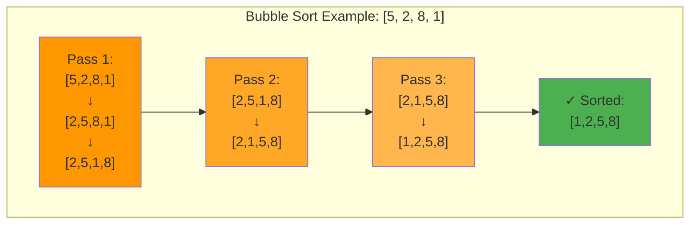
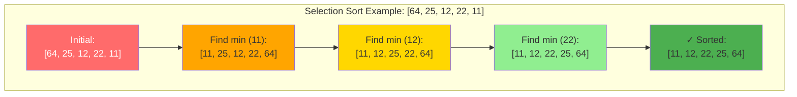
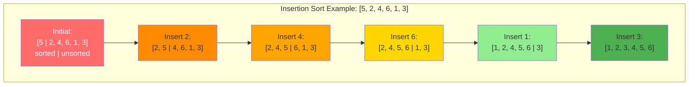
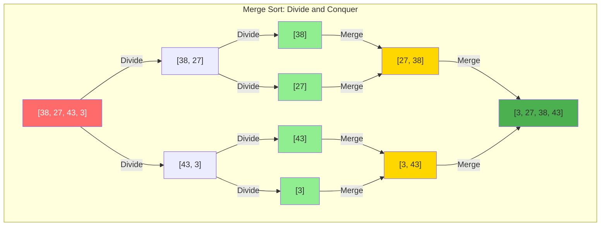
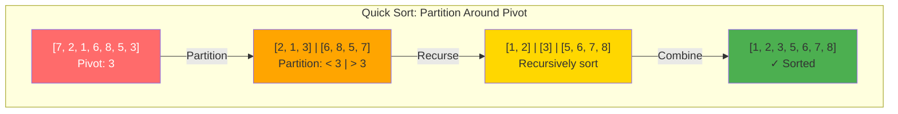
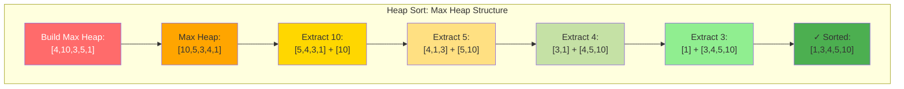
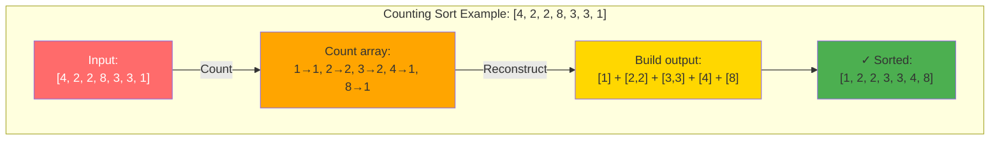
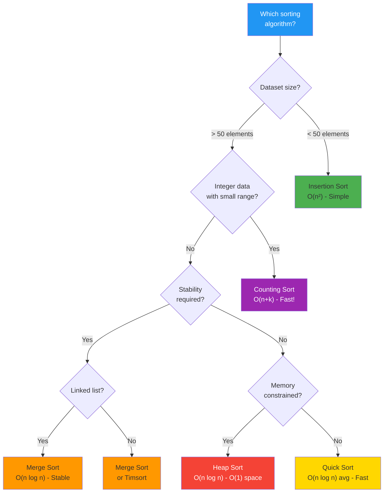

# Chapter 07: Sorting Algorithms

## Introduction

Sorting is one of the most fundamental operations in computer science. Understanding different sorting algorithms—their strengths, weaknesses, and appropriate use cases—is essential for every developer.

In this chapter, you'll learn:

- Common sorting algorithms and their implementations
- Time and space complexity analysis
- When to use each algorithm
- Stability and in-place sorting

## Why Sorting Matters

Sorted data enables:
- Binary search (O(log n) instead of O(n))
- Efficient duplicate detection
- Database query optimization
- Better data visualization

## Comparison-Based Sorting

### 1. Bubble Sort — O(n²)

Repeatedly swap adjacent elements if they're in the wrong order.



**How it works**: Largest elements "bubble up" to the end in each pass.

```php
<?php

function bubbleSort(array $arr): array {
    $n = count($arr);

    for ($i = 0; $i < $n - 1; $i++) {
        $swapped = false;

        for ($j = 0; $j < $n - $i - 1; $j++) {
            if ($arr[$j] > $arr[$j + 1]) {
                // Swap
                [$arr[$j], $arr[$j + 1]] = [$arr[$j + 1], $arr[$j]];
                $swapped = true;
            }
        }

        // Optimization: If no swaps, already sorted
        if (!$swapped) break;
    }

    return $arr;
}

$numbers = [64, 34, 25, 12, 22, 11, 90];
print_r(bubbleSort($numbers));
// [11, 12, 22, 25, 34, 64, 90]
```

**Complexity**: O(n²) time, O(1) space
**Stable**: Yes
**Use**: Educational purposes only

### 2. Selection Sort — O(n²)

Find the minimum element and place it at the beginning.



**How it works**: Select minimum from unsorted portion, swap with first unsorted element.

```php
<?php

function selectionSort(array $arr): array {
    $n = count($arr);

    for ($i = 0; $i < $n - 1; $i++) {
        $minIndex = $i;

        // Find minimum in remaining array
        for ($j = $i + 1; $j < $n; $j++) {
            if ($arr[$j] < $arr[$minIndex]) {
                $minIndex = $j;
            }
        }

        // Swap with current position
        if ($minIndex !== $i) {
            [$arr[$i], $arr[$minIndex]] = [$arr[$minIndex], $arr[$i]];
        }
    }

    return $arr;
}
```

**Complexity**: O(n²) time, O(1) space
**Stable**: No (can be made stable)
**Use**: Small datasets with expensive swaps

### 3. Insertion Sort — O(n²)

Build sorted array one element at a time.



**How it works**: Pick each element and insert it into its correct position in the sorted portion.

```php
<?php

function insertionSort(array $arr): array {
    $n = count($arr);

    for ($i = 1; $i < $n; $i++) {
        $key = $arr[$i];
        $j = $i - 1;

        // Move elements greater than key one position ahead
        while ($j >= 0 && $arr[$j] > $key) {
            $arr[$j + 1] = $arr[$j];
            $j--;
        }

        $arr[$j + 1] = $key;
    }

    return $arr;
}
```

**Complexity**: O(n²) time, O(1) space, O(n) best case
**Stable**: Yes
**Use**: Small datasets, nearly sorted data, online sorting

### 4. Merge Sort — O(n log n)

Divide array in half, sort each half, merge them.



**How it works**: Recursively divide, then merge sorted halves. O(n log n) guaranteed!

```php
<?php

function mergeSort(array $arr): array {
    if (count($arr) <= 1) {
        return $arr;
    }

    $mid = (int)(count($arr) / 2);
    $left = array_slice($arr, 0, $mid);
    $right = array_slice($arr, $mid);

    return merge(mergeSort($left), mergeSort($right));
}

function merge(array $left, array $right): array {
    $result = [];
    $i = $j = 0;

    while ($i < count($left) && $j < count($right)) {
        if ($left[$i] <= $right[$j]) {
            $result[] = $left[$i++];
        } else {
            $result[] = $right[$j++];
        }
    }

    // Append remaining elements
    while ($i < count($left)) {
        $result[] = $left[$i++];
    }
    while ($j < count($right)) {
        $result[] = $right[$j++];
    }

    return $result;
}

$numbers = [64, 34, 25, 12, 22, 11, 90];
print_r(mergeSort($numbers));
```

**Complexity**: O(n log n) time, O(n) space
**Stable**: Yes
**Use**: Large datasets, linked lists, external sorting

### 5. Quick Sort — O(n log n) average

Choose a pivot, partition array around it, recursively sort partitions.



**How it works**: Pick pivot, partition into smaller/larger, recursively sort both sides.

```php
<?php

function quickSort(array $arr): array {
    if (count($arr) <= 1) {
        return $arr;
    }

    $pivot = $arr[0];
    $left = [];
    $right = [];

    for ($i = 1; $i < count($arr); $i++) {
        if ($arr[$i] < $pivot) {
            $left[] = $arr[$i];
        } else {
            $right[] = $arr[$i];
        }
    }

    return array_merge(
        quickSort($left),
        [$pivot],
        quickSort($right)
    );
}

// In-place version (more efficient)
function quickSortInPlace(array &$arr, int $low, int $high): void {
    if ($low < $high) {
        $pi = partition($arr, $low, $high);

        quickSortInPlace($arr, $low, $pi - 1);
        quickSortInPlace($arr, $pi + 1, $high);
    }
}

function partition(array &$arr, int $low, int $high): int {
    $pivot = $arr[$high];
    $i = $low - 1;

    for ($j = $low; $j < $high; $j++) {
        if ($arr[$j] < $pivot) {
            $i++;
            [$arr[$i], $arr[$j]] = [$arr[$j], $arr[$i]];
        }
    }

    [$arr[$i + 1], $arr[$high]] = [$arr[$high], $arr[$i + 1]];
    return $i + 1;
}

$numbers = [64, 34, 25, 12, 22, 11, 90];
print_r(quickSort($numbers));
```

**Complexity**: O(n log n) average, O(n²) worst, O(log n) space
**Stable**: No (can be made stable)
**Use**: General purpose, when average case matters

### 6. Heap Sort — O(n log n)

Build a max heap, repeatedly extract maximum.



**How it works**: Build max heap, repeatedly extract max (root) and heapify. O(1) space!

```php
<?php

function heapSort(array $arr): array {
    $n = count($arr);

    // Build max heap
    for ($i = (int)($n / 2) - 1; $i >= 0; $i--) {
        heapify($arr, $n, $i);
    }

    // Extract elements from heap one by one
    for ($i = $n - 1; $i > 0; $i--) {
        // Move current root to end
        [$arr[0], $arr[$i]] = [$arr[$i], $arr[0]];

        // Heapify reduced heap
        heapify($arr, $i, 0);
    }

    return $arr;
}

function heapify(array &$arr, int $n, int $i): void {
    $largest = $i;
    $left = 2 * $i + 1;
    $right = 2 * $i + 2;

    if ($left < $n && $arr[$left] > $arr[$largest]) {
        $largest = $left;
    }

    if ($right < $n && $arr[$right] > $arr[$largest]) {
        $largest = $right;
    }

    if ($largest !== $i) {
        [$arr[$i], $arr[$largest]] = [$arr[$largest], $arr[$i]];
        heapify($arr, $n, $largest);
    }
}
```

**Complexity**: O(n log n) time, O(1) space
**Stable**: No
**Use**: Memory-constrained environments

## Non-Comparison Sorts

### Counting Sort — O(n + k)

Count occurrences of each value.



**How it works**: Count frequency of each value, reconstruct sorted array. O(n+k) where k is range!

```php
<?php

function countingSort(array $arr): array {
    if (empty($arr)) return $arr;

    $max = max($arr);
    $min = min($arr);
    $range = $max - $min + 1;

    $count = array_fill(0, $range, 0);
    $output = [];

    // Count occurrences
    foreach ($arr as $num) {
        $count[$num - $min]++;
    }

    // Build output array
    for ($i = 0; $i < $range; $i++) {
        for ($j = 0; $j < $count[$i]; $j++) {
            $output[] = $i + $min;
        }
    }

    return $output;
}

$numbers = [4, 2, 2, 8, 3, 3, 1];
print_r(countingSort($numbers));
```

**Complexity**: O(n + k) time, O(k) space (k = range)
**Use**: Small range of integers

## Sorting Algorithm Comparison

| Algorithm | Best | Average | Worst | Space | Stable |
|-----------|------|---------|-------|-------|--------|
| Bubble | O(n) | O(n²) | O(n²) | O(1) | Yes |
| Selection | O(n²) | O(n²) | O(n²) | O(1) | No |
| Insertion | O(n) | O(n²) | O(n²) | O(1) | Yes |
| Merge | O(n log n) | O(n log n) | O(n log n) | O(n) | Yes |
| Quick | O(n log n) | O(n log n) | O(n²) | O(log n) | No |
| Heap | O(n log n) | O(n log n) | O(n log n) | O(1) | No |
| Counting | O(n+k) | O(n+k) | O(n+k) | O(k) | Yes |

## PHP's Built-in Sorting

```php
<?php

$arr = [3, 1, 4, 1, 5, 9, 2, 6];

// Sort values (maintains keys)
sort($arr);        // [1, 1, 2, 3, 4, 5, 6, 9]

// Sort associative array by value
asort($arr);

// Sort associative array by key
ksort($arr);

// Custom comparison
usort($arr, function($a, $b) {
    return $a <=> $b; // Spaceship operator
});
```

PHP uses **Timsort** (hybrid of merge sort and insertion sort) for its sorting functions.

## When to Use Each Algorithm



**Quick Selection Guide**:
- **Bubble/Selection/Insertion**: Small datasets (< 50 elements), educational
- **Merge Sort**: Stable sort needed, linked lists, external sorting
- **Quick Sort**: General purpose, average case important
- **Heap Sort**: Memory constrained, predictable performance
- **Counting/Radix**: Integer data with limited range

## Key Takeaways

- **O(n²)** algorithms are simple but slow for large datasets
- **O(n log n)** algorithms are efficient for general use
- **Merge sort** is stable and consistent
- **Quick sort** is fast on average but has worst-case O(n²)
- **Heap sort** uses O(1) space
- **Counting sort** beats O(n log n) for specific data types

## Exercises

1. **Implement selection sort** that finds both min and max in each pass.

2. **Kth largest element**: Find the kth largest element using quickselect.

3. **Sort colors**: Sort an array of 0s, 1s, and 2s in one pass (Dutch National Flag problem).

4. **Merge k sorted arrays**: Merge multiple sorted arrays efficiently.

5. **Custom sort**: Sort strings by length, then alphabetically.

## What's Next?

Now that data is sorted, searching becomes much faster. In Chapter 08, we'll explore **Searching Algorithms**, including binary search and its variations.

---

**Further Reading**:
- [Sorting Algorithm Animations](https://www.toptal.com/developers/sorting-algorithms)
- [Timsort Explained](https://en.wikipedia.org/wiki/Timsort)
- [Comparison of Sorting Algorithms](https://en.wikipedia.org/wiki/Sorting_algorithm)
