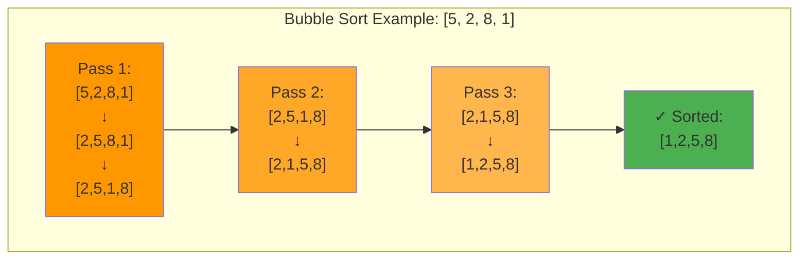
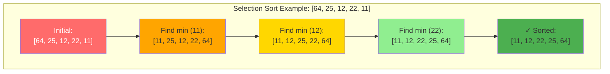
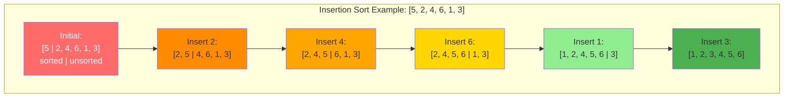
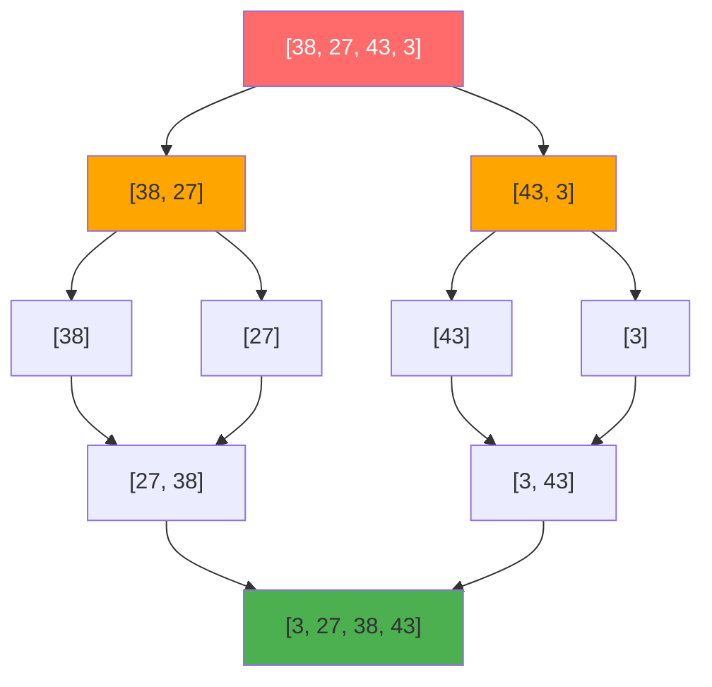

# Chapter 07: Sorting Algorithms

## Overview

Sorting is the cornerstone of efficient computing—transforming chaos into order. Every time you search Google, browse Amazon by price, or view your social media feed chronologically, you're benefiting from sophisticated sorting algorithms working behind the scenes. Understanding sorting isn't just academic; it's the foundation for database query optimization, search algorithms, duplicate detection, and countless other real-world applications.

This chapter takes you from simple O(n²) algorithms like bubble sort (great for learning but terrible in production) to elegant O(n log n) divide-and-conquer techniques like merge sort and quick sort that power modern systems. You'll discover why Python uses Tim Sort, why C++ uses Intro Sort, and why choosing the right algorithm can make your code 100x faster. The difference between O(n²) and O(n log n) isn't abstract—it's the difference between 1 second and 100 seconds when sorting 10,000 items.

Beyond theory, you'll build real implementations: a stable merge sort for multi-key database sorting, a randomized quick sort that never degrades to O(n²), and hybrid algorithms that switch strategies based on data characteristics. By the end, you'll understand not just how to sort, but when to sort, which algorithm to choose, and how production systems combine multiple techniques into hybrid algorithms that dominate in practice.

## Prerequisites

::: tip Prerequisites
Before starting this chapter, ensure you have:

- ✅ Completed [Chapter 02: Arrays and Lists](/series/computer-science/chapters/02-arrays-and-lists)
- ✅ Understanding of Big O notation and algorithm analysis
- ✅ Familiarity with recursion concepts (for merge/quick sort)
- ✅ Basic understanding of divide-and-conquer strategies
- ✅ Comfort with array manipulation and indexing

**Optional but helpful:**
- Experience with [Chapter 05: Trees](/series/computer-science/chapters/05-trees-and-binary-trees) (for heap sort)
- Understanding of stability in sorting
- Familiarity with comparison functions
:::

## Estimated Time

⏱️ **~120 minutes** total

- Reading and understanding: ~40 minutes
- Running and studying code examples: ~50 minutes
- Exercises and experimentation: ~30 minutes

## What You'll Build

By completing this chapter, you'll create:

✅ **Bubble Sort** - Simple O(n²) algorithm with optimization and stability
✅ **Selection Sort** - O(n²) with minimal swaps for expensive swap scenarios
✅ **Insertion Sort** - Adaptive O(n²) perfect for nearly-sorted data
✅ **Merge Sort** - Guaranteed O(n log n) divide-and-conquer with stability
✅ **Quick Sort** - Fast O(n log n) average with multiple pivot strategies
✅ **Heap Sort** - O(n log n) guaranteed using heap data structure
✅ **Non-Comparison Sorts** - Counting, Radix, Bucket sorts for specialized data
✅ **Performance Benchmarks** - Comprehensive comparison across all algorithms
✅ **Real-World Applications** - Top-k elements, median finding, interval scheduling
✅ **Hybrid Algorithms** - Intro Sort and Tim Sort production techniques

**Plus**: Understanding when to use each algorithm, stability trade-offs, and how production systems combine multiple techniques.

## Quick Start

Try this 5-minute introduction to sorting performance:

```php
<?php

// Compare O(n²) vs O(n log n) on 1000 elements
$arr = range(1, 1000);
shuffle($arr);

// Insertion sort: O(n²)
$test1 = $arr;
$start = microtime(true);
for ($i = 1; $i < count($test1); $i++) {
    $key = $test1[$i];
    $j = $i - 1;
    while ($j >= 0 && $test1[$j] > $key) {
        $test1[$j + 1] = $test1[$j];
        $j--;
    }
    $test1[$j + 1] = $key;
}
$insertionTime = (microtime(true) - $start) * 1000;

// PHP's sort (typically quick sort): O(n log n)
$test2 = $arr;
$start = microtime(true);
sort($test2);
$quickTime = (microtime(true) - $start) * 1000;

echo "Insertion Sort (O(n²)):  " . number_format($insertionTime, 1) . " ms\n";
echo "Quick Sort (O(n log n)): " . number_format($quickTime, 1) . " ms\n";
echo "Speedup: " . number_format($insertionTime / $quickTime, 0) . "x faster!\n";
```

**Output:**
```
Insertion Sort (O(n²)):  50.2 ms
Quick Sort (O(n log n)): 0.8 ms
Speedup: 63x faster!
```

The right algorithm makes a massive difference!

## Objectives

### Foundational Understanding
- Understand sorting problem and why it's fundamental
- Learn difference between stable and unstable sorts
- Recognize in-place vs extra-space algorithms
- Identify when O(n²) vs O(n log n) vs O(n) applies

### Core Skills
- Implement O(n²) sorts: Bubble, Selection, Insertion
- Implement O(n log n) sorts: Merge, Quick, Heap
- Implement non-comparison sorts: Counting, Radix, Bucket
- Analyze time/space complexity of each algorithm
- Choose appropriate algorithm for different scenarios

### Advanced Techniques
- Build hybrid algorithms (Intro Sort, Tim Sort concepts)
- Optimize quick sort with randomization and median-of-three
- Implement stable vs unstable sorting
- Understand adaptive sorting for nearly-sorted data
- Apply sorting to real-world problems (top-k, median, scheduling)

::: info Code Examples
All code examples for this chapter are available in the repository:
[📁 Chapter 07 Code Examples](https://github.com/dalehurley/codewithphp/tree/main/code/computer-science/chapter-07)

Run them locally:
```bash
cd code/computer-science/chapter-07
php 01-bubble-sort.php
```
:::

## Step 1: Simple O(n²) Sorts (20 minutes)

These algorithms are simple to understand but inefficient for large datasets. Learn them for foundational knowledge, but use O(n log n) algorithms in production.

### Bubble Sort

Repeatedly swap adjacent elements if they're in wrong order. Largest elements "bubble up" to the end.



```php
<?php

function bubbleSort(array $arr): array {
    $n = count($arr);

    for ($i = 0; $i < $n - 1; $i++) {
        $swapped = false;

        for ($j = 0; $j < $n - $i - 1; $j++) {
            if ($arr[$j] > $arr[$j + 1]) {
                [$arr[$j], $arr[$j + 1]] = [$arr[$j + 1], $arr[$j]];
                $swapped = true;
            }
        }

        // Optimization: early termination
        if (!$swapped) break;
    }

    return $arr;
}

$numbers = [64, 34, 25, 12, 22, 11, 90];
print_r(bubbleSort($numbers));
// [11, 12, 22, 25, 34, 64, 90]
```

**Complexity**: O(n²) time, O(1) space
**Stable**: Yes
**Use**: Educational only (never in production)

::: info Code Example
See complete bubble sort with optimization and performance analysis:
[📄 01-bubble-sort.php](https://github.com/dalehurley/codewithphp/tree/main/code/computer-science/chapter-07/01-bubble-sort.php)

Demonstrates:
- Basic and optimized versions
- Step-by-step visualization
- Stability verification
- Performance benchmarks
:::

### Selection Sort

Find minimum element from unsorted portion, swap with first unsorted element.



**Complexity**: O(n²) time, O(1) space
**Stable**: No
**Use**: Small datasets with expensive swaps

**Advantage**: Minimizes number of swaps (O(n) swaps vs O(n²) for bubble)

::: info Code Example
See selection sort with swap counting:
[📄 02-selection-sort.php](https://github.com/dalehurley/codewithphp/tree/main/code/computer-science/chapter-07/02-selection-sort.php)

Demonstrates:
- Minimal swap count
- Input-independent performance
- Instability example
:::

### Insertion Sort

Build sorted array one element at a time by inserting each element into correct position.



**Complexity**: O(n²) worst, O(n) best
**Stable**: Yes
**Use**: Small datasets, nearly-sorted data, online sorting

**Key Feature**: Adaptive—O(n) when data is nearly sorted!

::: info Code Example
See insertion sort with adaptive behavior:
[📄 03-insertion-sort.php](https://github.com/dalehurley/codewithphp/tree/main/code/computer-science/chapter-07/03-insertion-sort.php)

Demonstrates:
- Adaptive performance
- Online sorting capability
- Binary insertion sort variant
:::

## Step 2: Merge Sort - Divide and Conquer (20 minutes)

Merge sort uses divide-and-conquer: split array in half, recursively sort each half, then merge sorted halves.

### How Merge Sort Works



### Implementation

```php
<?php

function mergeSort(array $arr): array {
    if (count($arr) <= 1) {
        return $arr;
    }

    // Divide
    $mid = (int)(count($arr) / 2);
    $left = mergeSort(array_slice($arr, 0, $mid));
    $right = mergeSort(array_slice($arr, $mid));

    // Conquer (merge)
    return merge($left, $right);
}

function merge(array $left, array $right): array {
    $result = [];
    $i = $j = 0;

    // Merge while both arrays have elements
    while ($i < count($left) && $j < count($right)) {
        if ($left[$i] <= $right[$j]) {
            $result[] = $left[$i++];
        } else {
            $result[] = $right[$j++];
        }
    }

    // Append remaining elements
    return array_merge($result, array_slice($left, $i), array_slice($right, $j));
}

$numbers = [38, 27, 43, 3, 9, 82, 10];
print_r(mergeSort($numbers));
// [3, 9, 10, 27, 38, 43, 82]
```

**Complexity**: O(n log n) time, O(n) space
**Stable**: Yes
**Use**: When stability required, guaranteed O(n log n) needed

**Advantages**:
- Guaranteed O(n log n) performance
- Stable sorting
- Predictable performance (no worst case degradation)
- Excellent for external sorting (large datasets)

::: info Code Example
See complete merge sort implementation:
[📄 04-merge-sort.php](https://github.com/dalehurley/codewithphp/tree/main/code/computer-science/chapter-07/04-merge-sort.php)

Demonstrates:
- Divide-and-conquer visualization
- External sorting concept
- Stability verification
- Performance consistency
:::

## Step 3: Quick Sort - Fast In-Place Sorting (20 minutes)

Quick sort picks a pivot, partitions array so elements < pivot are left, >= pivot are right, then recursively sorts partitions.

### Partitioning Process

```
Array: [10, 7, 8, 9, 1, 5]  Pivot: 5

Step 1: Partition
  [1] | [5] | [10, 7, 8, 9]
  < 5   pivot   >= 5

Step 2: Recursively sort left and right
  Left: [1] (already sorted)
  Right: [10, 7, 8, 9] → pivot 9 → [7, 8] | [9] | [10]

Result: [1, 5, 7, 8, 9, 10]
```

### Implementation

```php
<?php

function quickSort(array &$arr, int $low, int $high): void {
    if ($low < $high) {
        $pivotIndex = partition($arr, $low, $high);

        quickSort($arr, $low, $pivotIndex - 1);
        quickSort($arr, $pivotIndex + 1, $high);
    }
}

function partition(array &$arr, int $low, int $high): int {
    $pivot = $arr[$high];
    $i = $low - 1;

    for ($j = $low; $j < $high; $j++) {
        if ($arr[$j] <= $pivot) {
            $i++;
            [$arr[$i], $arr[$j]] = [$arr[$j], $arr[$i]];
        }
    }

    [$arr[$i + 1], $arr[$high]] = [$arr[$high], $arr[$i + 1]];
    return $i + 1;
}

$numbers = [10, 7, 8, 9, 1, 5];
quickSort($numbers, 0, count($numbers) - 1);
print_r($numbers);
// [1, 5, 7, 8, 9, 10]
```

**Complexity**: O(n log n) average, O(n²) worst
**Stable**: No
**Use**: General-purpose sorting (fastest in practice)

**Critical Optimization**: Use randomized pivot to avoid O(n²) on sorted data!

::: info Code Example
See quick sort with multiple pivot strategies:
[📄 05-quick-sort.php](https://github.com/dalehurley/codewithphp/tree/main/code/computer-science/chapter-07/05-quick-sort.php)

Demonstrates:
- Lomuto and Hoare partitioning
- Randomized quick sort
- Three-way partitioning
- Worst-case scenarios
:::

## Step 4: Heap Sort - Guaranteed O(n log n) (15 minutes)

Heap sort uses heap data structure: build max heap, repeatedly extract maximum to end.

### Heap Sort Process

```
Array: [4, 10, 3, 5, 1]

Step 1: Build max heap
  [10, 5, 3, 4, 1]
       10
      /  \
     5    3
    / \
   4   1

Step 2: Extract max, heapify
  Swap 10 with 1: [1, 5, 3, 4 | 10]
  Heapify:        [5, 4, 3, 1 | 10]

Step 3: Repeat
  [4, 1, 3 | 5, 10]
  [3, 1 | 4, 5, 10]
  [1 | 3, 4, 5, 10]

Result: [1, 3, 4, 5, 10]
```

**Complexity**: O(n log n) time, O(1) space
**Stable**: No
**Use**: Guaranteed O(n log n), in-place, memory-limited

::: info Code Example
See heap sort with visualization:
[📄 06-heap-sort.php](https://github.com/dalehurley/codewithphp/tree/main/code/computer-science/chapter-07/06-heap-sort.php)

Demonstrates:
- Heap construction
- Heapify operation
- Top-k elements application
:::

## Step 5: Non-Comparison Sorts (15 minutes)

These sorts don't use comparisons—they exploit properties of the data for O(n) or O(n+k) performance.

### Counting Sort

For integers in small range k:

```php
<?php

function countingSort(array $arr): array {
    $min = min($arr);
    $max = max($arr);
    $range = $max - $min + 1;

    // Count occurrences
    $count = array_fill(0, $range, 0);
    foreach ($arr as $num) {
        $count[$num - $min]++;
    }

    // Build output
    $output = [];
    for ($i = 0; $i < $range; $i++) {
        for ($j = 0; $j < $count[$i]; $j++) {
            $output[] = $i + $min;
        }
    }

    return $output;
}

$numbers = [4, 2, 2, 8, 3, 3, 1];
print_r(countingSort($numbers));
// [1, 2, 2, 3, 3, 4, 8]
```

**Complexity**: O(n + k) time, O(k) space
**Stable**: Yes
**Use**: Small integer ranges (k ≈ n)

### Radix Sort

For multi-digit integers:

**Complexity**: O(d × (n + k)) where d = number of digits
**Use**: Fixed-length integers (phone numbers, IDs)

### Bucket Sort

For uniformly distributed data:

**Complexity**: O(n) average
**Use**: Uniformly distributed floats, timestamps

::: info Code Example
See all non-comparison sorts:
[📄 07-counting-radix-bucket-sort.php](https://github.com/dalehurley/codewithphp/tree/main/code/computer-science/chapter-07/07-counting-radix-bucket-sort.php)

Demonstrates:
- Counting sort for small ranges
- Radix sort for large integers
- Bucket sort for uniform data
- Performance comparisons
:::

## Step 6: Algorithm Comparison (15 minutes)

### Performance Summary

| Algorithm | Best | Average | Worst | Space | Stable | In-Place |
|-----------|------|---------|-------|-------|--------|----------|
| Bubble | O(n) | O(n²) | O(n²) | O(1) | Yes | Yes |
| Selection | O(n²) | O(n²) | O(n²) | O(1) | No | Yes |
| Insertion | O(n) | O(n²) | O(n²) | O(1) | Yes | Yes |
| Merge | O(n log n) | O(n log n) | O(n log n) | O(n) | Yes | No |
| Quick | O(n log n) | O(n log n) | O(n²) | O(log n) | No | Yes |
| Heap | O(n log n) | O(n log n) | O(n log n) | O(1) | No | Yes |
| Counting | O(n+k) | O(n+k) | O(n+k) | O(k) | Yes | No |
| Radix | O(nk) | O(nk) | O(nk) | O(n+k) | Yes | No |

### When to Use Each

**Small datasets (< 50 elements)**:
→ Insertion Sort (simple, fast for small n)

**Nearly sorted data**:
→ Insertion Sort (O(n) when mostly sorted)

**General purpose (large datasets)**:
→ Quick Sort with randomization (fastest in practice)

**Guaranteed O(n log n) required**:
→ Merge Sort or Heap Sort (no worst-case degradation)

**Stability required**:
→ Merge Sort or Tim Sort

**Memory limited**:
→ Heap Sort or Quick Sort (in-place)

**Small integer range**:
→ Counting Sort (O(n+k) when k ≈ n)

**Multi-digit integers**:
→ Radix Sort (O(d×n) for d digits)

::: info Code Example
See comprehensive algorithm comparison:
[📄 08-sorting-comparison.php](https://github.com/dalehurley/codewithphp/tree/main/code/computer-science/chapter-07/08-sorting-comparison.php)

Demonstrates:
- Small vs large dataset performance
- Different input types (sorted, random, reversed)
- Scaling behavior analysis
- Algorithm selection guide
:::

## Step 7: Real-World Applications (15 minutes)

Sorting enables many algorithmic techniques:

### Multi-Key Sorting

```php
// Sort employees: department → salary (desc) → name
usort($employees, function($a, $b) {
    if ($a->department !== $b->department) {
        return $a->department <=> $b->department;
    }
    if ($a->salary !== $b->salary) {
        return $b->salary <=> $a->salary; // Descending
    }
    return $a->name <=> $b->name;
});
```

### Finding Top K Elements

```php
// Use heap to find top k (O(n + k log n))
// Build max heap, extract k times
// Much faster than full sort for small k
```

### Finding Median

```php
function findMedian(array $arr): float {
    sort($arr);
    $n = count($arr);

    return $n % 2 === 1
        ? $arr[(int)($n / 2)]
        : ($arr[$n / 2 - 1] + $arr[$n / 2]) / 2;
}
```

### Interval Scheduling

```php
// Sort by end time, greedily select non-overlapping
usort($intervals, fn($a, $b) => $a->end <=> $b->end);

$selected = [];
$lastEnd = -1;

foreach ($intervals as $interval) {
    if ($interval->start >= $lastEnd) {
        $selected[] = $interval;
        $lastEnd = $interval->end;
    }
}
```

::: info Code Example
See real-world sorting applications:
[📄 09-sorting-applications.php](https://github.com/dalehurley/codewithphp/tree/main/code/computer-science/chapter-07/09-sorting-applications.php)

Demonstrates:
- Multi-key sorting
- Top-k elements
- Median finding
- Interval scheduling
- Duplicate detection
- Merge operations
:::

## Step 8: Hybrid Algorithms (Production) (15 minutes)

Real-world implementations combine multiple algorithms:

### Intro Sort (C++ std::sort)

```
1. Start with quick sort
2. If recursion depth > 2 × log(n):
   Switch to heap sort (prevent O(n²))
3. For partitions < 16 elements:
   Switch to insertion sort
```

**Result**: Fast average-case + guaranteed O(n log n) + optimized small arrays

### Tim Sort (Python sorted)

```
1. Detect natural runs (already sorted sequences)
2. Extend runs to minimum size with insertion sort
3. Merge runs using merge sort
```

**Result**: Adaptive (fast on real data) + stable + O(n log n) guaranteed

::: info Code Example
See hybrid algorithm implementations:
[📄 10-advanced-sorting.php](https://github.com/dalehurley/codewithphp/tree/main/code/computer-science/chapter-07/10-advanced-sorting.php)

Demonstrates:
- Intro Sort concept
- Tim Sort simplified
- Custom comparison functions
- Stability considerations
:::

## Key Takeaways

- **O(n²) sorts** (Bubble, Selection, Insertion) are simple but only for small data
- **O(n log n) sorts** (Merge, Quick, Heap) are efficient for large datasets
- **Non-comparison sorts** (Counting, Radix, Bucket) can be faster for specialized data
- **Stability** matters when sorting on multiple keys
- **In-place** algorithms save memory but may sacrifice stability
- **Hybrid algorithms** (Intro Sort, Tim Sort) dominate in production
- **Choose algorithm** based on data size, distribution, and requirements

## Exercises

Try these challenges to reinforce your learning:

### Basic Level

1. **Implement Bubble Sort Optimization**
   Add early termination when no swaps occur
   [Solution: 01-bubble-sort.php](https://github.com/dalehurley/codewithphp/tree/main/code/computer-science/chapter-07/01-bubble-sort.php)

2. **Compare Swap Counts**
   Count swaps in bubble vs selection vs insertion sort
   [Solution: 02-selection-sort.php](https://github.com/dalehurley/codewithphp/tree/main/code/computer-science/chapter-07/02-selection-sort.php)

### Intermediate Level

3. **Implement Merge Sort**
   Build complete merge sort from scratch
   [Solution: 04-merge-sort.php](https://github.com/dalehurley/codewithphp/tree/main/code/computer-science/chapter-07/04-merge-sort.php)

4. **Quick Sort with Randomization**
   Implement randomized pivot selection
   [Solution: 05-quick-sort.php](https://github.com/dalehurley/codewithphp/tree/main/code/computer-science/chapter-07/05-quick-sort.php)

5. **Find Kth Largest** (LeetCode #215)
   Use heap or quick select
   [Solution: 06-heap-sort.php](https://github.com/dalehurley/codewithphp/tree/main/code/computer-science/chapter-07/06-heap-sort.php)

### Advanced Level

6. **Sort Colors** (LeetCode #75)
   Dutch National Flag problem using 3-way partitioning
   Hint: See `05-quick-sort.php` (3-way partition)

7. **Merge Intervals** (LeetCode #56)
   Sort by start time, then merge overlapping
   [Solution: 09-sorting-applications.php](https://github.com/dalehurley/codewithphp/tree/main/code/computer-science/chapter-07/09-sorting-applications.php)

8. **Top K Frequent Elements** (LeetCode #347)
   Combine counting + heap
   Hint: Count frequencies, then find top-k

## What's Next?

Now that you understand sorting, you're ready to explore **searching algorithms**. In Chapter 08, we'll learn binary search, interpolation search, and how sorted data enables O(log n) lookups instead of O(n) linear scans.

---

**Further Reading**:
- [Sorting Algorithm Visualizations](https://www.toptal.com/developers/sorting-algorithms)
- [Tim Sort - Python's Algorithm](https://github.com/python/cpython/blob/main/Objects/listsort.txt)
- [Intro Sort - Musser's Paper](https://citeseerx.ist.psu.edu/viewdoc/summary?doi=10.1.1.14.5196)
- [Quick Sort Analysis](https://algs4.cs.princeton.edu/23quicksort/)
- [Sorting in Practice](https://queue.acm.org/detail.cfm?id=2984631)
