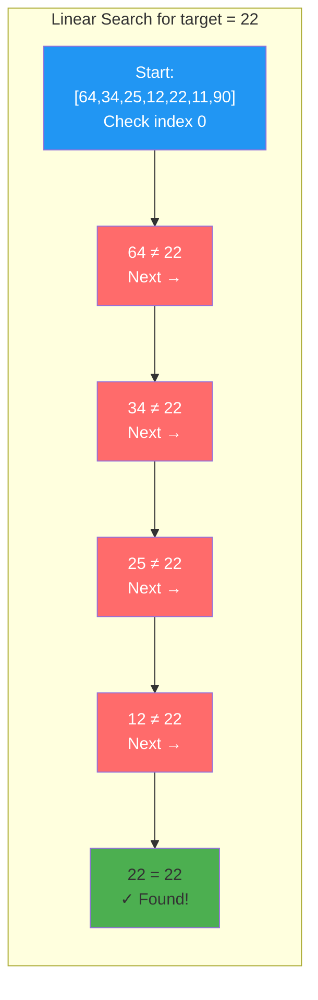
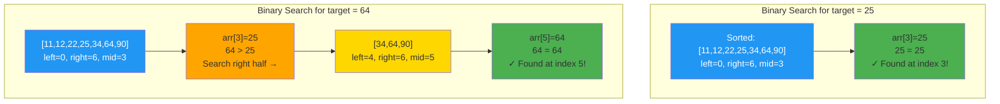
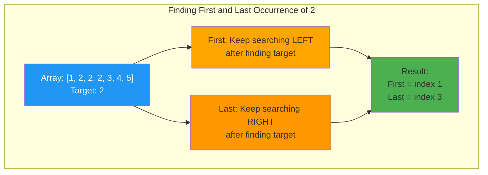
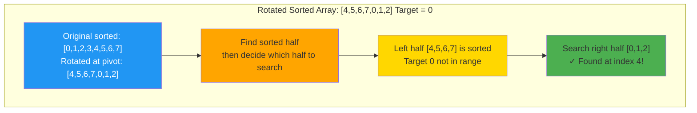
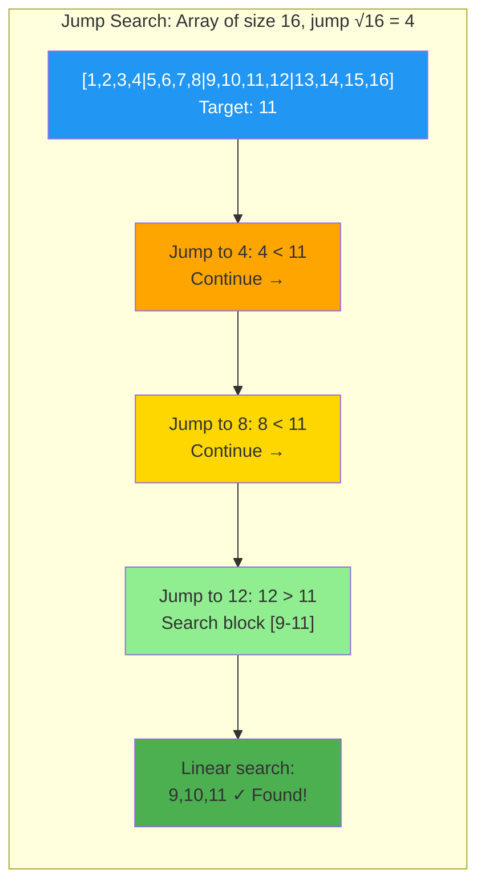
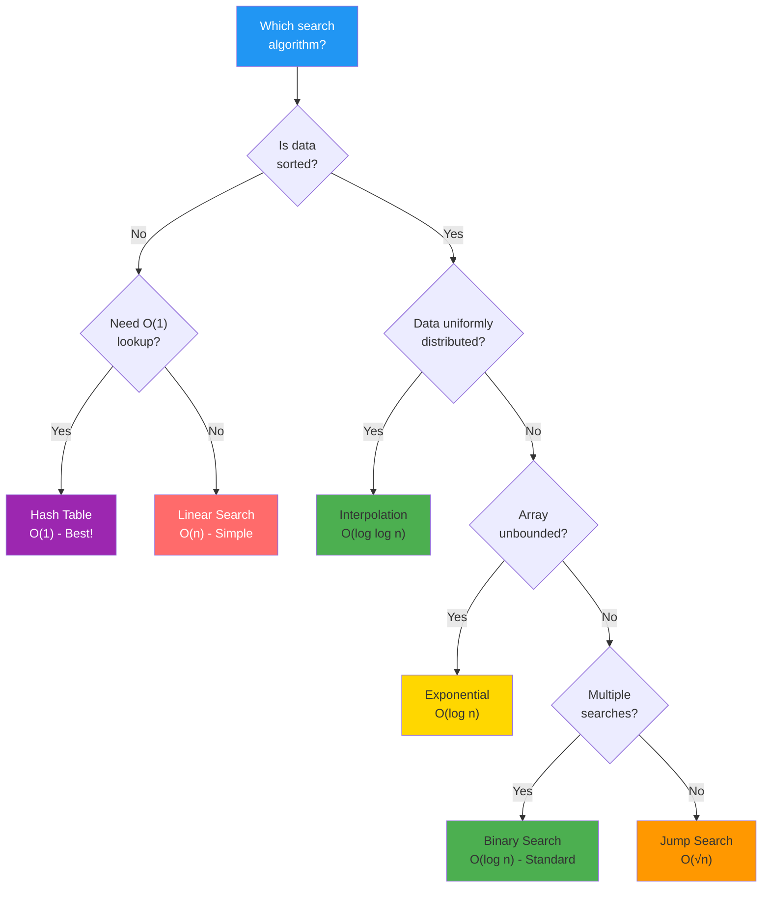

# Chapter 08: Searching Algorithms

## Overview

Searching is one of the most fundamental operations in computer science. Every time you use Google, look up a contact on your phone, or query a database, you're using a search algorithm. The efficiency of these algorithms directly impacts user experience—a slow search can make even the most powerful application feel sluggish.

In this chapter, you'll master the art of searching. You'll start with linear search—the simplest approach that checks every element—and progress to binary search, one of the most elegant algorithms in computer science that achieves logarithmic time by repeatedly dividing the problem in half. You'll also explore advanced techniques like interpolation search for uniformly distributed data, jump search for sequential access, and searching in rotated arrays.

By the end of this chapter, you'll understand when to use each search algorithm, how to modify binary search for specific problems, and how different data structures (arrays, BSTs, hash tables) enable different search strategies. You'll be equipped to choose the right search algorithm for any situation and implement it correctly.

## Prerequisites

Before starting this chapter, you should be familiar with:

- [ ] **Arrays and Array Indexing** - Understanding how to access elements by index
- [ ] **Basic Sorting** - Knowledge of sorted vs unsorted data from Chapter 7
- [ ] **Big O Notation** - Ability to analyze time and space complexity from Chapter 4
- [ ] **Recursion Basics** - Understanding recursive function calls (helpful but not required)
- [ ] **Loop Structures** - Comfort with `while` and `for` loops in PHP

If you need to review any of these topics, refer to the earlier chapters in this series.

## Estimated Time

⏱️ **90-120 minutes** including:
- Reading and understanding concepts: 30-40 minutes
- Running and analyzing code examples: 40-50 minutes
- Exercises and experimentation: 20-30 minutes

## What You'll Build

By completing this chapter, you'll create:

1. ✅ **Linear Search Implementation** - O(n) sequential search with statistics
2. ✅ **Binary Search (Iterative & Recursive)** - O(log n) divide-and-conquer
3. ✅ **Binary Search Variations** - Find first/last occurrence, insertion position, peak element
4. ✅ **Rotated Array Search** - Modified binary search for rotated sorted arrays
5. ✅ **Interpolation Search** - O(log log n) for uniform data
6. ✅ **Jump & Exponential Search** - O(√n) and O(log n) alternatives
7. ✅ **2D Matrix Search** - Staircase search and matrix binary search
8. ✅ **Data Structure Search** - BST, hash table, trie implementations
9. ✅ **Search Comparison Suite** - Performance benchmarks across all algorithms
10. ✅ **Real-World Applications** - Database queries, auto-complete, spell checking

::: info 💻 Code Examples
All code examples for this chapter are available in [`code/computer-science/chapter-08/`](https://github.com/dalebrubaker/codewithphp/tree/main/code/computer-science/chapter-08)

Run them with: `php code/computer-science/chapter-08/01-linear-search.php`
:::

## Learning Objectives

### Foundational
- Understand the difference between searching sorted vs unsorted data
- Implement linear search and analyze its O(n) time complexity
- Recognize when binary search is applicable (sorted data requirement)

### Core
- Master binary search implementation (iterative and recursive)
- Implement binary search variations (first/last occurrence, insertion position)
- Search in rotated sorted arrays with O(log n) time
- Compare linear, binary, interpolation, and jump search algorithms
- Understand space-time tradeoffs in search algorithms

### Advanced
- Apply binary search to non-array domains (answer space, functions)
- Implement interpolation search for uniformly distributed data
- Use two pointers and sliding window techniques
- Search efficiently in 2D matrices
- Choose optimal search strategy based on data characteristics

## Step 1: Linear Search — The Foundation (15 minutes)

Linear search is the simplest search algorithm: check each element sequentially until you find the target or reach the end. While it's O(n) time complexity makes it slow for large datasets, it works on **any data**—sorted or unsorted.



### Basic Implementation

```php
<?php

function linearSearch(array $arr, mixed $target): ?int {
    foreach ($arr as $index => $value) {
        if ($value === $target) {
            return $index;
        }
    }
    return null;
}

$numbers = [64, 34, 25, 12, 22, 11, 90];
$index = linearSearch($numbers, 22); // Returns 4

if ($index !== null) {
    echo "Found at index $index\n";
} else {
    echo "Not found\n";
}
```

**Complexity Analysis**:
- **Time**: O(n) - must check up to n elements
- **Space**: O(1) - only uses loop variable
- **Best case**: O(1) - target is first element
- **Worst case**: O(n) - target is last or not present

::: info 💻 Complete Example
See [`01-linear-search.php`](https://github.com/dalebrubaker/codewithphp/blob/main/code/computer-science/chapter-08/01-linear-search.php) for:
- Linear search with comparison counting
- Finding all occurrences
- Sentinel optimization
- Performance scaling tests
- Real-world applications
:::

### When to Use Linear Search

✅ **Use linear search when:**
- Data is unsorted (binary search won't work)
- Dataset is small (< 100 elements)
- Performing a single search operation
- Need to find **all** occurrences
- Searching in a linked list (no random access)

❌ **Avoid linear search when:**
- Data is sorted (use binary search instead—50x to 1000x faster!)
- Need to search repeatedly (consider hash table)
- Dataset is large (> 1000 elements)

## Step 2: Binary Search — Logarithmic Power (20 minutes)

Binary search is one of the most elegant algorithms in computer science. By repeatedly dividing the search space in half, it achieves **O(log n)** time complexity. For a million elements, binary search needs only ~20 comparisons vs ~500,000 for linear search!



### Iterative Implementation

```php
<?php

function binarySearch(array $arr, mixed $target): ?int {
    $left = 0;
    $right = count($arr) - 1;

    while ($left <= $right) {
        // Avoid overflow: use left + (right-left)/2 instead of (left+right)/2
        $mid = $left + (int)(($right - $left) / 2);

        if ($arr[$mid] === $target) {
            return $mid; // Found!
        }

        if ($arr[$mid] < $target) {
            $left = $mid + 1; // Search right half
        } else {
            $right = $mid - 1; // Search left half
        }
    }

    return null; // Not found
}

$numbers = [11, 12, 22, 25, 34, 64, 90]; // Must be sorted!
$index = binarySearch($numbers, 25); // Returns 3
```

**Key Insight**: Each iteration eliminates half the remaining elements. This is why binary search is O(log n)!

### Recursive Implementation

```php
<?php

function binarySearchRecursive(
    array $arr,
    mixed $target,
    int $left,
    int $right
): ?int {
    if ($left > $right) {
        return null; // Base case: not found
    }

    $mid = $left + (int)(($right - $left) / 2);

    if ($arr[$mid] === $target) {
        return $mid; // Found!
    }

    if ($arr[$mid] < $target) {
        return binarySearchRecursive($arr, $target, $mid + 1, $right);
    }

    return binarySearchRecursive($arr, $target, $left, $mid - 1);
}

// Usage
$index = binarySearchRecursive($numbers, 25, 0, count($numbers) - 1);
```

::: info 💻 Complete Example
See [`02-binary-search.php`](https://github.com/dalebrubaker/codewithphp/blob/main/code/computer-science/chapter-08/02-binary-search.php) for:
- Both iterative and recursive implementations
- Comparison counting
- Performance benchmarks vs linear search
- Step-by-step visualization
- Edge case handling
:::

### Binary Search Complexity

- **Time**: O(log n) - halves search space each iteration
- **Space**: O(1) iterative, O(log n) recursive (call stack)
- **Requirement**: Array **must** be sorted

**Performance Example**:
- 100 elements: ~7 comparisons
- 10,000 elements: ~13 comparisons
- 1,000,000 elements: ~20 comparisons
- 1,000,000,000 elements: ~30 comparisons!

## Step 3: Binary Search Variations (15 minutes)

The beauty of binary search is its adaptability. By modifying the algorithm slightly, we can solve many related problems—all in O(log n) time!



### 1. Find First Occurrence

**Problem**: In `[1, 2, 2, 2, 3, 4, 5]`, find the **first** occurrence of `2` (index 1, not 2 or 3).

```php
<?php

function findFirst(array $arr, mixed $target): ?int {
    $left = 0;
    $right = count($arr) - 1;
    $result = null;

    while ($left <= $right) {
        $mid = $left + (int)(($right - $left) / 2);

        if ($arr[$mid] === $target) {
            $result = $mid;
            $right = $mid - 1; // Keep searching left!
        } elseif ($arr[$mid] < $target) {
            $left = $mid + 1;
        } else {
            $right = $mid - 1;
        }
    }

    return $result;
}
```

**Key Difference**: Even after finding the target, continue searching **left** (`$right = $mid - 1`) to find earlier occurrences.

### 2. Find Last Occurrence

```php
<?php

function findLast(array $arr, mixed $target): ?int {
    $left = 0;
    $right = count($arr) - 1;
    $result = null;

    while ($left <= $right) {
        $mid = $left + (int)(($right - $left) / 2);

        if ($arr[$mid] === $target) {
            $result = $mid;
            $left = $mid + 1; // Keep searching right!
        } elseif ($arr[$mid] < $target) {
            $left = $mid + 1;
        } else {
            $right = $mid - 1;
        }
    }

    return $result;
}
```

### 3. Count Occurrences in O(log n)

```php
<?php

function countOccurrences(array $arr, mixed $target): int {
    $first = findFirst($arr, $target);

    if ($first === null) {
        return 0;
    }

    $last = findLast($arr, $target);

    return $last - $first + 1; // Count = last - first + 1
}

$numbers = [1, 2, 2, 2, 3, 4, 5];
echo countOccurrences($numbers, 2); // 3 occurrences
```

**Why This Is Powerful**: Instead of O(n) linear scan, we count in O(log n) using two binary searches!

::: info 💻 Complete Example
See [`03-binary-search-variations.php`](https://github.com/dalebrubaker/codewithphp/blob/main/code/computer-science/chapter-08/03-binary-search-variations.php) for:
- Find first/last occurrence
- Find insertion position
- Find closest element
- Find peak element
- Floor and ceiling operations
- Real-world version bisect example
:::

## Step 4: Search in Rotated Sorted Arrays (15 minutes)

**Problem**: Array was sorted, then rotated at unknown pivot: `[4,5,6,7,0,1,2]` (originally `[0,1,2,3,4,5,6,7]`).

Can we still search in O(log n)? **Yes!** At any midpoint, at least one half is guaranteed to be sorted.



### Implementation

```php
<?php

function searchRotated(array $arr, mixed $target): ?int {
    $left = 0;
    $right = count($arr) - 1;

    while ($left <= $right) {
        $mid = $left + (int)(($right - $left) / 2);

        if ($arr[$mid] === $target) {
            return $mid;
        }

        // Determine which half is sorted
        if ($arr[$left] <= $arr[$mid]) {
            // Left half is sorted
            if ($target >= $arr[$left] && $target < $arr[$mid]) {
                $right = $mid - 1; // Target in sorted left half
            } else {
                $left = $mid + 1; // Target in right half
            }
        } else {
            // Right half is sorted
            if ($target > $arr[$mid] && $target <= $arr[$right]) {
                $left = $mid + 1; // Target in sorted right half
            } else {
                $right = $mid - 1; // Target in left half
            }
        }
    }

    return null;
}

$numbers = [4, 5, 6, 7, 0, 1, 2];
echo searchRotated($numbers, 0); // 4
```

**Key Insight**: Compare `arr[left]` with `arr[mid]` to determine which half is sorted. Then check if target is in the sorted range.

::: info 💻 Complete Example
See [`04-search-rotated-array.php`](https://github.com/dalebrubaker/codewithphp/blob/main/code/computer-science/chapter-08/04-search-rotated-array.php) for:
- Search in rotated array
- Find minimum in rotated array
- Find rotation count/pivot
- Handle duplicates
- Circular buffer applications
:::

## Step 5: Alternative Search Algorithms (20 minutes)

While binary search is the go-to for sorted data, other algorithms can be better in specific scenarios.

### Interpolation Search — O(log log n)

For **uniformly distributed** data (like sequential IDs: 1, 2, 3, ..., 1000), interpolation search estimates the target's position based on value, achieving O(log log n) time!

```php
<?php

function interpolationSearch(array $arr, int $target): ?int {
    $left = 0;
    $right = count($arr) - 1;

    while ($left <= $right && $target >= $arr[$left] && $target <= $arr[$right]) {
        if ($left === $right) {
            return $arr[$left] === $target ? $left : null;
        }

        // Estimate position based on value
        $pos = $left + (int)(
            (($target - $arr[$left]) / ($arr[$right] - $arr[$left])) *
            ($right - $left)
        );

        if ($arr[$pos] === $target) {
            return $pos;
        }

        if ($arr[$pos] < $target) {
            $left = $pos + 1;
        } else {
            $right = $pos - 1;
        }
    }

    return null;
}

$numbers = [10, 20, 30, 40, 50, 60, 70, 80, 90, 100];
echo interpolationSearch($numbers, 70); // 6
```

**When to Use**:
- ✅ Large, uniformly distributed numeric data
- ✅ Sequential IDs, timestamps
- ❌ Non-uniform data (can degrade to O(n))

### Jump Search — O(√n)

Jump ahead by √n steps, then linear search within the block.



```php
<?php

function jumpSearch(array $arr, mixed $target): ?int {
    $n = count($arr);
    $step = (int)sqrt($n);
    $prev = 0;

    // Jump to find block
    while ($arr[min($step, $n) - 1] < $target) {
        $prev = $step;
        $step += (int)sqrt($n);

        if ($prev >= $n) {
            return null;
        }
    }

    // Linear search in block
    while ($arr[$prev] < $target) {
        $prev++;

        if ($prev === min($step, $n)) {
            return null;
        }
    }

    return $arr[$prev] === $target ? $prev : null;
}
```

**When to Use**:
- ✅ Sequential access systems (linked lists, tape storage)
- ✅ When backward jumps are expensive
- ❌ Random access arrays (use binary search)

::: info 💻 Complete Example
See [`05-interpolation-jump-search.php`](https://github.com/dalebrubaker/codewithphp/blob/main/code/computer-science/chapter-08/05-interpolation-jump-search.php) for:
- Interpolation search implementation
- Jump search with optimal step size
- Exponential search
- Performance comparison
- When each algorithm is best
:::

## Step 6: Search in 2D Matrices (10 minutes)

Searching in 2D matrices requires different strategies depending on how the matrix is sorted.

### Staircase Search (Row & Column Sorted)

For a matrix where each row and column is sorted:

```php
<?php

function searchMatrix2D(array $matrix, int $target): ?array {
    if (empty($matrix) || empty($matrix[0])) {
        return null;
    }

    $rows = count($matrix);
    $cols = count($matrix[0]);

    // Start from top-right corner
    $row = 0;
    $col = $cols - 1;

    while ($row < $rows && $col >= 0) {
        if ($matrix[$row][$col] === $target) {
            return [$row, $col]; // Found!
        }

        if ($matrix[$row][$col] > $target) {
            $col--; // Move left
        } else {
            $row++; // Move down
        }
    }

    return null; // Not found
}

$matrix = [
    [10, 20, 30, 40],
    [15, 25, 35, 45],
    [27, 29, 37, 48],
    [32, 33, 39, 50],
];

$result = searchMatrix2D($matrix, 29); // [2, 1]
```

**Complexity**: O(m + n) where m = rows, n = columns

::: info 💻 Complete Example
See [`06-search-2d-matrix.php`](https://github.com/dalebrubaker/codewithphp/blob/main/code/computer-science/chapter-08/06-search-2d-matrix.php) for:
- Staircase search (O(m+n))
- Binary search on fully sorted matrix
- Find kth smallest element
- Different matrix patterns
- Real-world spreadsheet applications
:::

## Step 7: Search in Data Structures (15 minutes)

Different data structures enable different search strategies:

### Binary Search Tree — O(log n)

```php
<?php

function searchBST(?TreeNode $node, mixed $target): ?TreeNode {
    if ($node === null || $node->value === $target) {
        return $node;
    }

    if ($target < $node->value) {
        return searchBST($node->left, $target);
    }

    return searchBST($node->right, $target);
}
```

**Complexity**: O(h) where h is height (O(log n) if balanced, O(n) if skewed)

### Hash Table — O(1)

```php
<?php

$hashtable = ['alice' => 30, 'bob' => 25, 'charlie' => 35];
$age = $hashtable['bob'] ?? null; // O(1) average
```

**Complexity**: O(1) average, O(n) worst case (all keys hash to same bucket)

::: info 💻 Complete Example
See [`07-search-in-data-structures.php`](https://github.com/dalebrubaker/codewithphp/blob/main/code/computer-science/chapter-08/07-search-in-data-structures.php) for:
- BST search implementation
- Hash table O(1) lookup
- Trie for prefix search and auto-complete
- Performance comparison
- When to use each structure
:::

## Step 8: Algorithm Comparison and Selection (10 minutes)

### Performance Comparison

| Algorithm | Time (Best) | Time (Avg) | Time (Worst) | Space | Requirement |
|-----------|-------------|------------|--------------|-------|-------------|
| Linear | O(1) | O(n) | O(n) | O(1) | None |
| Binary | O(1) | O(log n) | O(log n) | O(1) | Sorted array |
| Interpolation | O(1) | O(log log n) | O(n) | O(1) | Sorted + uniform |
| Jump | O(1) | O(√n) | O(√n) | O(1) | Sorted array |
| Exponential | O(1) | O(log n) | O(log n) | O(1) | Sorted, unbounded |
| Hash Table | O(1) | O(1) | O(n) | O(n) | Hash function |
| BST | O(log n) | O(log n) | O(n) | O(n) | Balanced tree |

### Decision Tree



::: info 💻 Complete Example
See [`08-search-comparison.php`](https://github.com/dalebrubaker/codewithphp/blob/main/code/computer-science/chapter-08/08-search-comparison.php) for:
- Comprehensive performance benchmarks
- Small vs large dataset tests
- Scaling behavior analysis
- Algorithm selection guide
:::

## Exercises

### Exercise 1: Find Square Root
**Difficulty**: Medium

Implement `findSquareRoot(int $n): int` that returns the integer square root using binary search.

```php
<?php

function findSquareRoot(int $n): int {
    // Your code here
    // Hint: Search space is 0 to n
    // For each mid, check if mid * mid <= n
}

echo findSquareRoot(16); // 4
echo findSquareRoot(27); // 5 (floor of √27)
```

<details>
<summary>Solution</summary>

```php
<?php

function findSquareRoot(int $n): int {
    if ($n < 2) return $n;

    $left = 1;
    $right = (int)($n / 2);
    $result = 0;

    while ($left <= $right) {
        $mid = $left + (int)(($right - $left) / 2);
        $square = $mid * $mid;

        if ($square === $n) {
            return $mid;
        }

        if ($square < $n) {
            $result = $mid; // Store potential answer
            $left = $mid + 1;
        } else {
            $right = $mid - 1;
        }
    }

    return $result;
}
```

**Key Insight**: Binary search on **answer space** (1 to n/2), not array indices!
</details>

### Exercise 2: Search in 2D Matrix
**Difficulty**: Medium

Implement search in a matrix where each row is sorted and first element of each row is greater than last element of previous row.

```php
<?php

$matrix = [
    [1, 3, 5, 7],
    [10, 11, 16, 20],
    [23, 30, 34, 60],
];

// Your function here
function searchMatrix(array $matrix, int $target): bool {
    // Hint: Treat as 1D sorted array
    // Convert 1D index to 2D: row = index / cols, col = index % cols
}

echo searchMatrix($matrix, 3); // true
echo searchMatrix($matrix, 13); // false
```

<details>
<summary>Solution</summary>

```php
<?php

function searchMatrix(array $matrix, int $target): bool {
    if (empty($matrix) || empty($matrix[0])) {
        return false;
    }

    $rows = count($matrix);
    $cols = count($matrix[0]);

    $left = 0;
    $right = $rows * $cols - 1;

    while ($left <= $right) {
        $mid = $left + (int)(($right - $left) / 2);

        // Convert 1D index to 2D coordinates
        $row = (int)($mid / $cols);
        $col = $mid % $cols;

        if ($matrix[$row][$col] === $target) {
            return true;
        }

        if ($matrix[$row][$col] < $target) {
            $left = $mid + 1;
        } else {
            $right = $mid - 1;
        }
    }

    return false;
}
```

**Complexity**: O(log(m*n)) - treat 2D matrix as 1D sorted array!
</details>

### Exercise 3: First Bad Version
**Difficulty**: Easy

You're testing software versions. Use binary search to find the first bad version with minimum API calls.

```php
<?php

// Given: isBad($version) API (you don't implement this)
// Returns true if version is bad, false otherwise

function firstBadVersion(callable $isBad, int $n): int {
    // Your code here
    // Goal: Minimize calls to isBad()
}
```

<details>
<summary>Solution</summary>

```php
<?php

function firstBadVersion(callable $isBad, int $n): int {
    $left = 1;
    $right = $n;

    while ($left < $right) {
        $mid = $left + (int)(($right - $left) / 2);

        if ($isBad($mid)) {
            $right = $mid; // Could be first bad, keep searching left
        } else {
            $left = $mid + 1; // Not bad, search right
        }
    }

    return $left;
}
```

**Real-World Application**: Finding first failing commit in version control (git bisect)!
</details>

## Key Takeaways

✅ **Linear search** works on any data but is O(n) — only use for small datasets or unsorted data

✅ **Binary search** is O(log n) but **requires sorted data** — incredibly fast (20 comparisons for 1 million elements!)

✅ **Binary search variations** (first/last occurrence, insertion position, peak element) solve many problems in O(log n)

✅ **Rotated array search** maintains O(log n) by determining which half is sorted

✅ **Interpolation search** achieves O(log log n) on uniformly distributed data but can degrade to O(n)

✅ **Hash tables** provide O(1) search but require extra space and don't maintain ordering

✅ **Choose algorithm based on data characteristics**: sorted? uniform? size? access pattern?

## What's Next?

You've mastered searching algorithms! These techniques rely heavily on a powerful concept: **recursion**. In Chapter 09, you'll explore recursive thinking and how to solve problems by breaking them into smaller versions of themselves. You'll see how recursion powers binary search, tree traversals, and many divide-and-conquer algorithms.

---

**Further Reading**:
- [Binary Search (Wikipedia)](https://en.wikipedia.org/wiki/Binary_search_algorithm)
- [Search Algorithms Comparison](https://www.geeksforgeeks.org/searching-algorithms/)
- [Master Theorem for Divide and Conquer](https://en.wikipedia.org/wiki/Master_theorem_(analysis_of_algorithms))
- [LeetCode Binary Search Problems](https://leetcode.com/tag/binary-search/)
