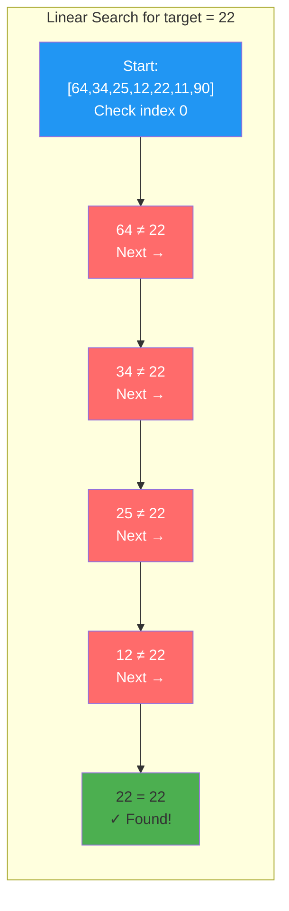
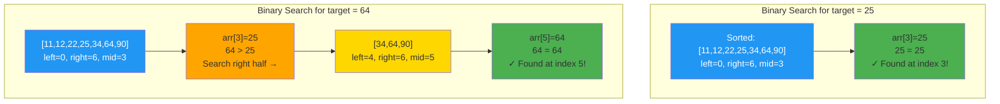
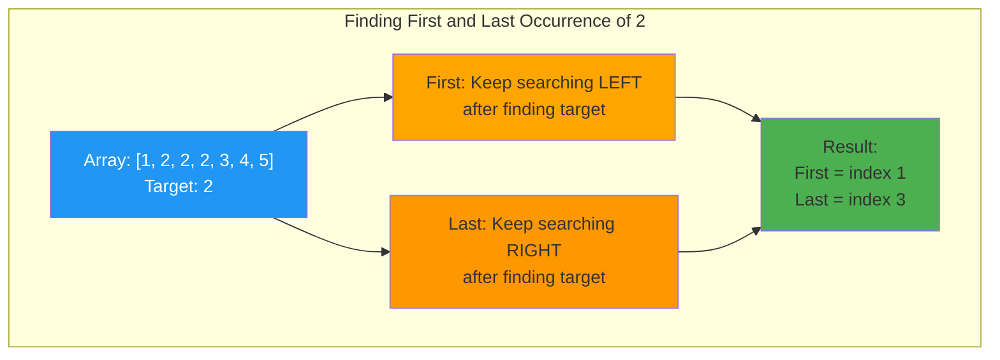
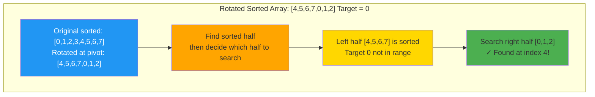
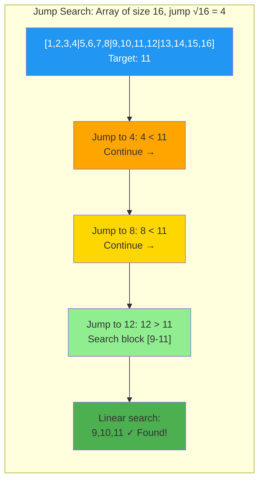
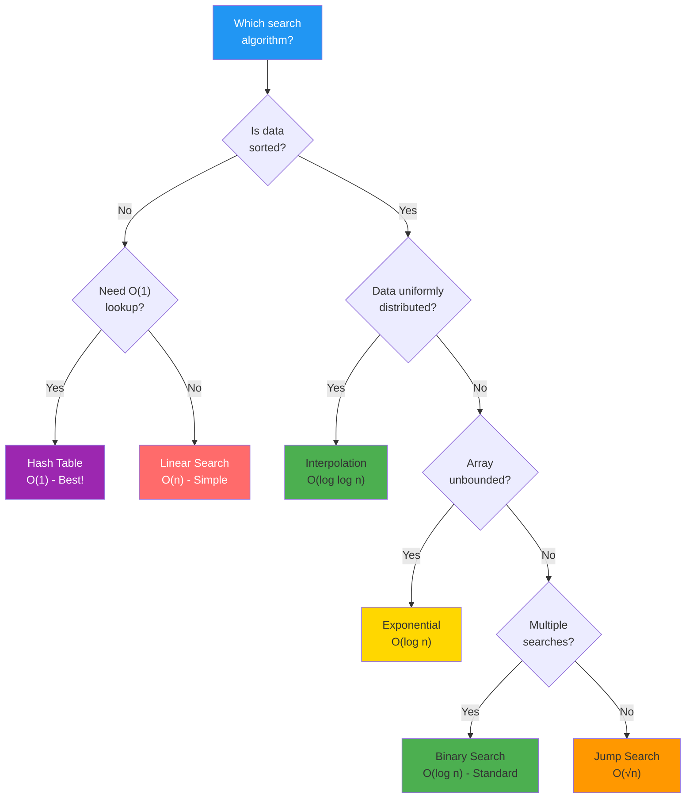

# Chapter 08: Searching Algorithms

## Introduction

Searching is the process of finding a specific element in a collection. The efficiency of search algorithms directly impacts application performance, from database queries to autocomplete features.

In this chapter, you'll learn:

- Linear and binary search algorithms
- When to use each search method
- Variations of binary search
- Search in different data structures

## Linear Search — O(n)

Check each element sequentially until found.



**How it works**: Check every element one by one. Simple but slow for large datasets.

```php
<?php

function linearSearch(array $arr, $target): ?int {
    foreach ($arr as $index => $value) {
        if ($value === $target) {
            return $index;
        }
    }
    return null;
}

$numbers = [64, 34, 25, 12, 22, 11, 90];
$index = linearSearch($numbers, 22); // 4
```

**Complexity**: O(n) time, O(1) space
**Use**: Unsorted data, small datasets, single search

## Binary Search — O(log n)

Repeatedly divide sorted array in half.



**How it works**: Eliminate half the elements in each step. O(log n) — incredibly fast!

```php
<?php

function binarySearch(array $arr, $target): ?int {
    $left = 0;
    $right = count($arr) - 1;

    while ($left <= $right) {
        $mid = $left + (int)(($right - $left) / 2);

        if ($arr[$mid] === $target) {
            return $mid;
        }

        if ($arr[$mid] < $target) {
            $left = $mid + 1;
        } else {
            $right = $mid - 1;
        }
    }

    return null;
}

$numbers = [11, 12, 22, 25, 34, 64, 90]; // Must be sorted!
$index = binarySearch($numbers, 25); // 3
```

**Complexity**: O(log n) time, O(1) space
**Requirement**: Array must be sorted

### Recursive Binary Search

```php
<?php

function binarySearchRecursive(
    array $arr,
    $target,
    int $left,
    int $right
): ?int {
    if ($left > $right) {
        return null;
    }

    $mid = $left + (int)(($right - $left) / 2);

    if ($arr[$mid] === $target) {
        return $mid;
    }

    if ($arr[$mid] < $target) {
        return binarySearchRecursive($arr, $target, $mid + 1, $right);
    }

    return binarySearchRecursive($arr, $target, $left, $mid - 1);
}
```

## Binary Search Variations



### 1. Find First Occurrence

```php
<?php

function findFirst(array $arr, $target): ?int {
    $left = 0;
    $right = count($arr) - 1;
    $result = null;

    while ($left <= $right) {
        $mid = $left + (int)(($right - $left) / 2);

        if ($arr[$mid] === $target) {
            $result = $mid;
            $right = $mid - 1; // Continue searching left
        } elseif ($arr[$mid] < $target) {
            $left = $mid + 1;
        } else {
            $right = $mid - 1;
        }
    }

    return $result;
}

$numbers = [1, 2, 2, 2, 3, 4, 5];
echo findFirst($numbers, 2); // 1
```

### 2. Find Last Occurrence

```php
<?php

function findLast(array $arr, $target): ?int {
    $left = 0;
    $right = count($arr) - 1;
    $result = null;

    while ($left <= $right) {
        $mid = $left + (int)(($right - $left) / 2);

        if ($arr[$mid] === $target) {
            $result = $mid;
            $left = $mid + 1; // Continue searching right
        } elseif ($arr[$mid] < $target) {
            $left = $mid + 1;
        } else {
            $right = $mid - 1;
        }
    }

    return $result;
}

$numbers = [1, 2, 2, 2, 3, 4, 5];
echo findLast($numbers, 2); // 3
```

### 3. Find Insertion Position

```php
<?php

function searchInsert(array $arr, $target): int {
    $left = 0;
    $right = count($arr) - 1;

    while ($left <= $right) {
        $mid = $left + (int)(($right - $left) / 2);

        if ($arr[$mid] === $target) {
            return $mid;
        }

        if ($arr[$mid] < $target) {
            $left = $mid + 1;
        } else {
            $right = $mid - 1;
        }
    }

    return $left; // Insertion position
}

$numbers = [1, 3, 5, 6];
echo searchInsert($numbers, 5); // 2
echo searchInsert($numbers, 2); // 1 (would insert here)
echo searchInsert($numbers, 7); // 4 (would insert at end)
```

### 4. Find Peak Element

```php
<?php

function findPeakElement(array $arr): int {
    $left = 0;
    $right = count($arr) - 1;

    while ($left < $right) {
        $mid = $left + (int)(($right - $left) / 2);

        if ($arr[$mid] > $arr[$mid + 1]) {
            $right = $mid; // Peak is on the left or at mid
        } else {
            $left = $mid + 1; // Peak is on the right
        }
    }

    return $left;
}

$numbers = [1, 2, 3, 1];
echo findPeakElement($numbers); // 2 (value 3 is peak)
```

## Search in Rotated Sorted Array



**How it works**: Determine which half is sorted, then decide where target could be.

```php
<?php

function searchRotated(array $arr, $target): ?int {
    $left = 0;
    $right = count($arr) - 1;

    while ($left <= $right) {
        $mid = $left + (int)(($right - $left) / 2);

        if ($arr[$mid] === $target) {
            return $mid;
        }

        // Determine which half is sorted
        if ($arr[$left] <= $arr[$mid]) {
            // Left half is sorted
            if ($target >= $arr[$left] && $target < $arr[$mid]) {
                $right = $mid - 1;
            } else {
                $left = $mid + 1;
            }
        } else {
            // Right half is sorted
            if ($target > $arr[$mid] && $target <= $arr[$right]) {
                $left = $mid + 1;
            } else {
                $right = $mid - 1;
            }
        }
    }

    return null;
}

$numbers = [4, 5, 6, 7, 0, 1, 2]; // Rotated sorted array
echo searchRotated($numbers, 0); // 4
```

## Interpolation Search — O(log log n)

Better than binary search for uniformly distributed data.

```php
<?php

function interpolationSearch(array $arr, $target): ?int {
    $low = 0;
    $high = count($arr) - 1;

    while ($low <= $high && $target >= $arr[$low] && $target <= $arr[$high]) {
        if ($low === $high) {
            return $arr[$low] === $target ? $low : null;
        }

        // Estimate position
        $pos = $low + (int)(
            (($high - $low) / ($arr[$high] - $arr[$low])) *
            ($target - $arr[$low])
        );

        if ($arr[$pos] === $target) {
            return $pos;
        }

        if ($arr[$pos] < $target) {
            $low = $pos + 1;
        } else {
            $high = $pos - 1;
        }
    }

    return null;
}

$numbers = [10, 20, 30, 40, 50, 60, 70, 80, 90, 100];
echo interpolationSearch($numbers, 70); // 6
```

**Complexity**: O(log log n) average, O(n) worst
**Use**: Large, uniformly distributed sorted data

## Exponential Search — O(log n)

Find range with exponential jumps, then binary search.

```php
<?php

function exponentialSearch(array $arr, $target): ?int {
    $n = count($arr);

    if ($arr[0] === $target) {
        return 0;
    }

    // Find range for binary search
    $i = 1;
    while ($i < $n && $arr[$i] <= $target) {
        $i *= 2;
    }

    // Binary search in found range
    return binarySearch(
        $arr,
        $target,
        (int)($i / 2),
        min($i, $n - 1)
    );
}
```

**Use**: Unbounded/infinite arrays

## Jump Search — O(√n)

Jump ahead by fixed steps, then linear search.



**How it works**: Jump √n steps, find block, then linear search within block. O(√n) complexity!

```php
<?php

function jumpSearch(array $arr, $target): ?int {
    $n = count($arr);
    $step = (int)sqrt($n);
    $prev = 0;

    // Find block where element may be present
    while ($arr[min($step, $n) - 1] < $target) {
        $prev = $step;
        $step += (int)sqrt($n);

        if ($prev >= $n) {
            return null;
        }
    }

    // Linear search in block
    while ($arr[$prev] < $target) {
        $prev++;

        if ($prev === min($step, $n)) {
            return null;
        }
    }

    return $arr[$prev] === $target ? $prev : null;
}
```

**Complexity**: O(√n) time
**Use**: When jumping is cheaper than comparison

## Searching in Different Data Structures

### Binary Search Tree

```php
<?php

function searchBST(?TreeNode $node, $target): ?TreeNode {
    if ($node === null || $node->value === $target) {
        return $node;
    }

    if ($target < $node->value) {
        return searchBST($node->left, $target);
    }

    return searchBST($node->right, $target);
}
```

**Complexity**: O(h) where h is height (O(log n) if balanced)

### Hash Table

```php
<?php

$hashtable = ['alice' => 30, 'bob' => 25, 'charlie' => 35];
$age = $hashtable['bob'] ?? null; // O(1) average
```

**Complexity**: O(1) average

## Search Algorithm Comparison

| Algorithm | Time | Space | Requirement |
|-----------|------|-------|-------------|
| Linear | O(n) | O(1) | None |
| Binary | O(log n) | O(1) | Sorted array |
| Interpolation | O(log log n) avg | O(1) | Sorted, uniform data |
| Jump | O(√n) | O(1) | Sorted array |
| Exponential | O(log n) | O(1) | Sorted, unbounded |
| Hash table | O(1) avg | O(n) | Hash function |
| BST | O(log n) | O(n) | Balanced tree |

## When to Use Each Search



**Quick Selection Guide**:
- **Linear**: Unsorted data, small datasets
- **Binary**: Sorted data, repeated searches
- **Interpolation**: Uniformly distributed sorted data
- **Jump**: Sorted data with expensive comparisons
- **Exponential**: Unbounded sorted data
- **Hash table**: Exact match lookups
- **BST**: Dynamic data with range queries

## Key Takeaways

- **Binary search** requires sorted data but is O(log n)
- **Linear search** works on any data but is O(n)
- Binary search has many useful variations
- Choose search algorithm based on data characteristics
- Hash tables provide O(1) search but require extra space

## Exercises

1. **Find square root**: Use binary search to find integer square root.

2. **First bad version**: Find first failing test case using binary search.

3. **Search 2D matrix**: Search in a row-wise and column-wise sorted matrix.

4. **Find minimum in rotated sorted array**: Use modified binary search.

5. **Ternary search**: Implement ternary search (divides into 3 parts instead of 2).

## What's Next?

Searching and sorting often rely on a powerful technique: **Recursion**. In Chapter 09, we'll explore recursive thinking and how to solve problems by breaking them into smaller versions of themselves.

---

**Further Reading**:
- [Binary Search (Wikipedia)](https://en.wikipedia.org/wiki/Binary_search_algorithm)
- [Search Algorithms Comparison](https://www.geeksforgeeks.org/searching-algorithms/)
- [Master Theorem for Divide and Conquer](https://en.wikipedia.org/wiki/Master_theorem_(analysis_of_algorithms))
