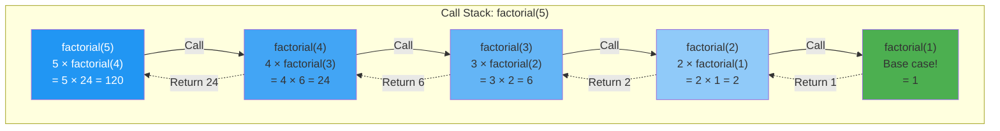
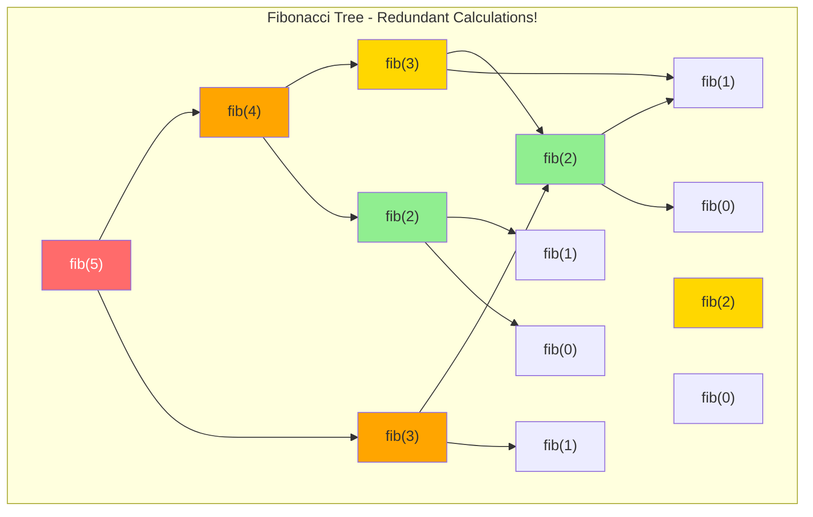
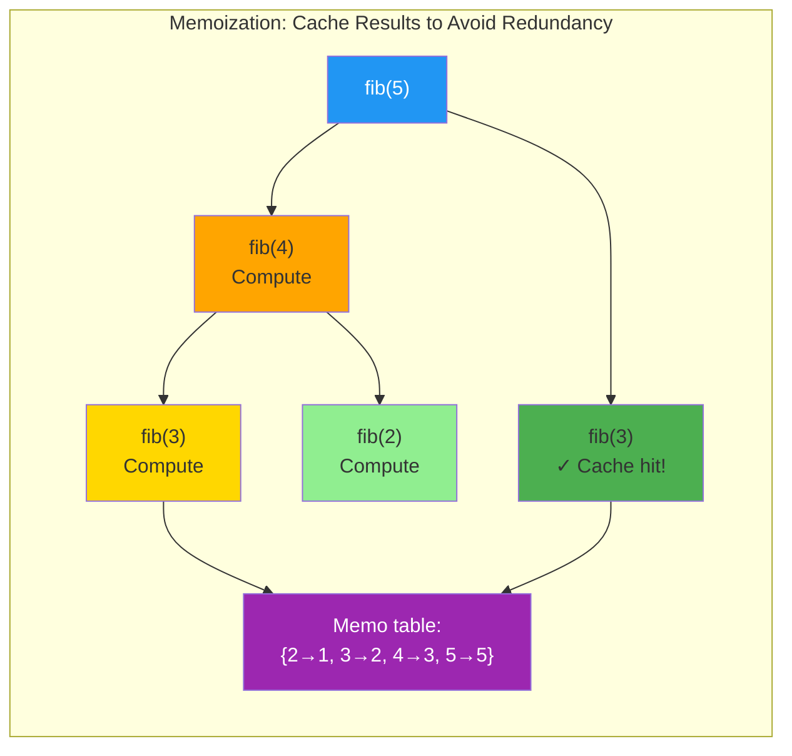
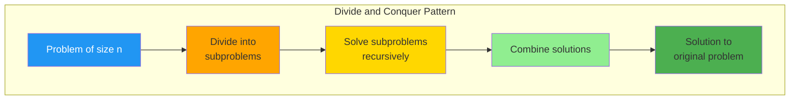
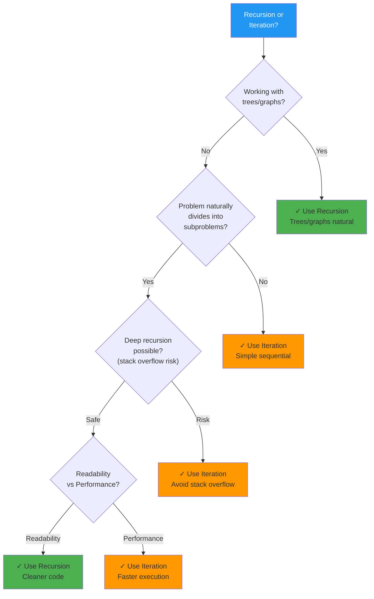
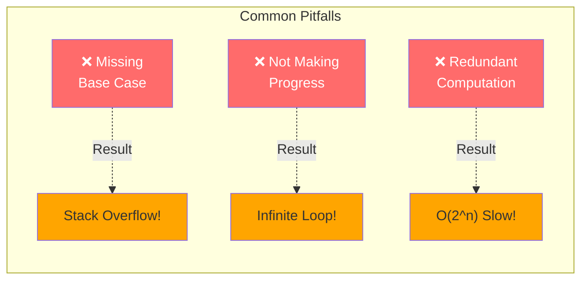

# Chapter 09: Recursion and Recursive Thinking

## Introduction

Recursion is a problem-solving technique where a function calls itself to solve smaller instances of the same problem. It's elegant, powerful, and essential for many algorithms and data structures.

In this chapter, you'll learn:

- How recursion works
- Base cases and recursive cases
- Call stack visualization
- Common recursive patterns
- When to use recursion vs. iteration

## What is Recursion?

A **recursive function** calls itself with a modified input until reaching a **base case**.

### Simple Example: Factorial

```php
<?php

// n! = n × (n-1) × (n-2) × ... × 1
function factorial(int $n): int {
    // Base case
    if ($n === 0 || $n === 1) {
        return 1;
    }

    // Recursive case
    return $n * factorial($n - 1);
}

echo factorial(5); // 120 (5 × 4 × 3 × 2 × 1)
```

**Call Stack Visualization**:



**How it works**: Stack builds up with calls (blue), then unwinds with returns (green arrows).

## Anatomy of Recursion

Every recursive function needs:

1. **Base case**: Condition to stop recursion
2. **Recursive case**: Function calls itself with modified input
3. **Progress toward base case**: Each call gets closer to termination

```php
<?php

function recursiveTemplate($input) {
    // 1. Base case
    if (/* stopping condition */) {
        return /* simple answer */;
    }

    // 2. Recursive case
    // - Do some work
    // - Call function with simpler input
    // - Combine results

    return recursiveTemplate(/* simpler input */);
}
```

## Classic Recursive Problems

### 1. Fibonacci Sequence

```php
<?php

// Naive recursive approach - O(2^n)
function fibonacci(int $n): int {
    if ($n <= 1) {
        return $n;
    }

    return fibonacci($n - 1) + fibonacci($n - 2);
}

echo fibonacci(6); // 8 (0, 1, 1, 2, 3, 5, 8)
```

**Problem**: Exponential time! fibonacci(5) calls fibonacci(3) twice.



**Notice**: fib(3) computed twice, fib(2) computed three times! Exponential waste!

**Solution**: Memoization

```php
<?php

function fibonacciMemo(int $n, array &$memo = []): int {
    if ($n <= 1) {
        return $n;
    }

    if (isset($memo[$n])) {
        return $memo[$n];
    }

    $memo[$n] = fibonacciMemo($n - 1, $memo) + fibonacciMemo($n - 2, $memo);
    return $memo[$n];
}

echo fibonacciMemo(50); // Fast! O(n) time
```



**Result**: O(2^n) → O(n)! From exponential to linear by caching results.

### 2. Sum of Array

```php
<?php

function sumArray(array $arr): int {
    // Base case: empty array
    if (empty($arr)) {
        return 0;
    }

    // Recursive case: first element + sum of rest
    return $arr[0] + sumArray(array_slice($arr, 1));
}

echo sumArray([1, 2, 3, 4, 5]); // 15
```

### 3. Reverse a String

```php
<?php

function reverseString(string $str): string {
    // Base case
    if (strlen($str) <= 1) {
        return $str;
    }

    // Recursive case: last char + reverse of rest
    return $str[strlen($str) - 1] . reverseString(substr($str, 0, -1));
}

echo reverseString("hello"); // olleh
```

### 4. Power Function

```php
<?php

function power(int $base, int $exp): int {
    // Base case
    if ($exp === 0) {
        return 1;
    }

    // Recursive case
    return $base * power($base, $exp - 1);
}

// Optimized version - O(log n)
function powerFast(int $base, int $exp): int {
    if ($exp === 0) {
        return 1;
    }

    $half = powerFast($base, (int)($exp / 2));

    if ($exp % 2 === 0) {
        return $half * $half;
    } else {
        return $base * $half * $half;
    }
}

echo powerFast(2, 10); // 1024
```

## Recursion with Data Structures

### Tree Traversal

```php
<?php

class TreeNode {
    public function __construct(
        public mixed $value,
        public ?TreeNode $left = null,
        public ?TreeNode $right = null
    ) {}
}

function sumTree(?TreeNode $node): int {
    // Base case: null node
    if ($node === null) {
        return 0;
    }

    // Recursive case: node value + sum of subtrees
    return $node->value + sumTree($node->left) + sumTree($node->right);
}

function treeHeight(?TreeNode $node): int {
    if ($node === null) {
        return -1;
    }

    return 1 + max(
        treeHeight($node->left),
        treeHeight($node->right)
    );
}
```

### Linked List Reversal

```php
<?php

class ListNode {
    public function __construct(
        public mixed $value,
        public ?ListNode $next = null
    ) {}
}

function reverseList(?ListNode $head): ?ListNode {
    // Base case
    if ($head === null || $head->next === null) {
        return $head;
    }

    // Reverse rest of list
    $newHead = reverseList($head->next);

    // Fix pointers
    $head->next->next = $head;
    $head->next = null;

    return $newHead;
}
```

## Divide and Conquer

Recursion enables divide-and-conquer algorithms:



**Pattern**: Divide → Conquer (recurse) → Combine

### Merge Sort

```php
<?php

function mergeSort(array $arr): array {
    // Base case
    if (count($arr) <= 1) {
        return $arr;
    }

    // Divide
    $mid = (int)(count($arr) / 2);
    $left = array_slice($arr, 0, $mid);
    $right = array_slice($arr, $mid);

    // Conquer
    return merge(mergeSort($left), mergeSort($right));
}

function merge(array $left, array $right): array {
    $result = [];
    $i = $j = 0;

    while ($i < count($left) && $j < count($right)) {
        if ($left[$i] <= $right[$j]) {
            $result[] = $left[$i++];
        } else {
            $result[] = $right[$j++];
        }
    }

    return array_merge($result, array_slice($left, $i), array_slice($right, $j));
}
```

## Tail Recursion

**Tail recursion**: Recursive call is the last operation

```php
<?php

// Not tail recursive
function factorial($n) {
    if ($n === 0) return 1;
    return $n * factorial($n - 1); // Multiplication after recursive call
}

// Tail recursive
function factorialTail($n, $accumulator = 1) {
    if ($n === 0) {
        return $accumulator;
    }
    return factorialTail($n - 1, $n * $accumulator); // No work after call
}
```

**Benefit**: Some compilers optimize tail recursion to avoid stack overflow (PHP doesn't do this automatically).

## Common Recursive Patterns

### 1. Linear Recursion

Process list/array one element at a time:

```php
<?php

function contains(array $arr, $value): bool {
    if (empty($arr)) {
        return false;
    }

    if ($arr[0] === $value) {
        return true;
    }

    return contains(array_slice($arr, 1), $value);
}
```

### 2. Binary Recursion

Two recursive calls (like binary tree):

```php
<?php

function fibonacci($n) {
    if ($n <= 1) return $n;
    return fibonacci($n - 1) + fibonacci($n - 2); // Two calls
}
```

### 3. Multiple Recursion

More than two recursive calls:

```php
<?php

function countPaths(int $x, int $y): int {
    // Base case: reached destination
    if ($x === 0 && $y === 0) {
        return 1;
    }

    $paths = 0;

    // Try all possible moves
    if ($x > 0) $paths += countPaths($x - 1, $y);
    if ($y > 0) $paths += countPaths($x, $y - 1);

    return $paths;
}
```

## Recursion vs. Iteration



### When to Use Recursion

**Use recursion when**:
- Problem naturally divides into subproblems
- Working with recursive data structures (trees, graphs)
- Code readability matters
- Problem involves backtracking

**Example**: Tree traversal is much cleaner with recursion

```php
<?php

// Recursive - elegant
function inorder($node) {
    if ($node === null) return [];
    return array_merge(
        inorder($node->left),
        [$node->value],
        inorder($node->right)
    );
}

// Iterative - complex
function inorderIterative($root) {
    $result = [];
    $stack = [];
    $current = $root;

    while ($current !== null || !empty($stack)) {
        while ($current !== null) {
            $stack[] = $current;
            $current = $current->left;
        }
        $current = array_pop($stack);
        $result[] = $current->value;
        $current = $current->right;
    }

    return $result;
}
```

### When to Use Iteration

**Use iteration when**:
- Simple sequential processing
- Stack overflow is a concern
- Performance is critical
- Tail recursion can't be optimized

```php
<?php

// Recursive factorial - risk of stack overflow
function factorialRecursive($n) {
    if ($n === 0) return 1;
    return $n * factorialRecursive($n - 1);
}

// Iterative factorial - safer
function factorialIterative($n) {
    $result = 1;
    for ($i = 2; $i <= $n; $i++) {
        $result *= $i;
    }
    return $result;
}
```

## Debugging Recursive Functions

### 1. Add Tracing

```php
<?php

function factorialTrace($n, $depth = 0) {
    $indent = str_repeat("  ", $depth);
    echo "{$indent}factorial($n) called\n";

    if ($n === 0) {
        echo "{$indent}→ returning 1\n";
        return 1;
    }

    $result = $n * factorialTrace($n - 1, $depth + 1);
    echo "{$indent}→ returning $result\n";
    return $result;
}
```

### 2. Verify Base Case

Always check:
- Is base case reached?
- Does it return correct value?
- Do all paths lead to base case?

## Common Recursion Pitfalls



### 1. Missing Base Case

```php
<?php

// WRONG - infinite recursion!
function badRecursion($n) {
    return $n + badRecursion($n - 1);
}

// CORRECT
function goodRecursion($n) {
    if ($n === 0) return 0; // Base case!
    return $n + goodRecursion($n - 1);
}
```

### 2. Not Making Progress

```php
<?php

// WRONG - doesn't get closer to base case
function badCountdown($n) {
    if ($n === 0) return;
    badCountdown($n); // Should be $n - 1!
}
```

### 3. Redundant Computation

```php
<?php

// WRONG - recalculates same values
function slowFib($n) {
    if ($n <= 1) return $n;
    return slowFib($n - 1) + slowFib($n - 2);
}

// CORRECT - use memoization
function fastFib($n, &$memo = []) {
    if ($n <= 1) return $n;
    if (isset($memo[$n])) return $memo[$n];
    $memo[$n] = fastFib($n - 1, $memo) + fastFib($n - 2, $memo);
    return $memo[$n];
}
```

## Key Takeaways

- **Recursion** solves problems by breaking them into smaller identical problems
- Every recursive function needs a **base case** and **recursive case**
- **Call stack** stores function calls - deep recursion can overflow
- **Memoization** caches results to avoid redundant computation
- **Tail recursion** can be optimized by compilers
- Use recursion for **tree/graph** problems, backtracking, divide-and-conquer
- Use iteration for **simple loops** and when performance is critical

## Exercises

1. **Greatest Common Divisor (GCD)**: Implement Euclidean algorithm recursively.

2. **Palindrome checker**: Check if string is palindrome using recursion.

3. **Tower of Hanoi**: Solve the classic puzzle recursively.

4. **Generate all permutations**: Generate all permutations of a string.

5. **Count ways to climb stairs**: Each step, you can climb 1 or 2 stairs. Count total ways.

## What's Next?

Recursion is foundational for many advanced algorithms. In Chapter 10, we'll explore **Graph Algorithms**, where recursion powers depth-first search and pathfinding.

---

**Further Reading**:
- [Recursion (Wikipedia)](https://en.wikipedia.org/wiki/Recursion_(computer_science))
- [Master Theorem](https://en.wikipedia.org/wiki/Master_theorem_(analysis_of_algorithms))
- [Dynamic Programming and Memoization](https://en.wikipedia.org/wiki/Dynamic_programming)
