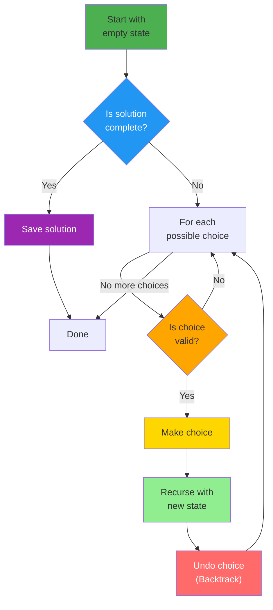
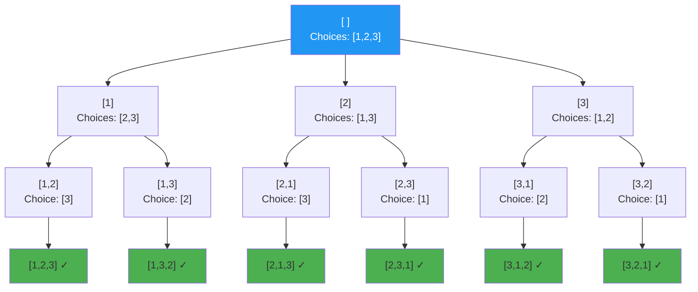

# Chapter 12: Backtracking and Constraint Satisfaction

## Introduction

Backtracking is a systematic way to try all possibilities by building solutions incrementally and abandoning paths that don't work. It's the algorithmic equivalent of trial and error with intelligence.

In this chapter, you'll learn:

- The backtracking pattern
- Classic backtracking problems
- Pruning techniques
- When to use backtracking

## The Backtracking Pattern



**Key insight**: Try → Recurse → Undo (if fails) → Try next option

```php
<?php

function backtrack($state, $choices) {
    // Base case: solution found
    if (is_solution($state)) {
        process_solution($state);
        return;
    }

    // Try each choice
    foreach ($choices as $choice) {
        // Make choice
        make_choice($state, $choice);

        // Recurse
        if (is_valid($state)) {
            backtrack($state, get_next_choices($state));
        }

        // Undo choice (backtrack)
        undo_choice($state, $choice);
    }
}
```

## Classic Problems

### 1. N-Queens Problem

Place N queens on N×N chessboard so none attack each other.

```php
<?php

function solveNQueens(int $n): array {
    $solutions = [];
    $board = array_fill(0, $n, array_fill(0, $n, '.'));

    placeQueens($board, 0, $n, $solutions);

    return $solutions;
}

function placeQueens(array &$board, int $row, int $n, array &$solutions): void {
    if ($row === $n) {
        // Found valid solution
        $solutions[] = boardToStrings($board);
        return;
    }

    for ($col = 0; $col < $n; $col++) {
        if (isSafe($board, $row, $col, $n)) {
            // Place queen
            $board[$row][$col] = 'Q';

            // Recurse
            placeQueens($board, $row + 1, $n, $solutions);

            // Backtrack
            $board[$row][$col] = '.';
        }
    }
}

function isSafe(array $board, int $row, int $col, int $n): bool {
    // Check column
    for ($i = 0; $i < $row; $i++) {
        if ($board[$i][$col] === 'Q') {
            return false;
        }
    }

    // Check diagonal (top-left)
    for ($i = $row - 1, $j = $col - 1; $i >= 0 && $j >= 0; $i--, $j--) {
        if ($board[$i][$j] === 'Q') {
            return false;
        }
    }

    // Check diagonal (top-right)
    for ($i = $row - 1, $j = $col + 1; $i >= 0 && $j < $n; $i--, $j++) {
        if ($board[$i][$j] === 'Q') {
            return false;
        }
    }

    return true;
}

function boardToStrings(array $board): array {
    return array_map(fn($row) => implode('', $row), $board);
}

$solutions = solveNQueens(4);
echo "Found " . count($solutions) . " solutions\n";
```

**Time**: O(N!) worst case
**Space**: O(N) for recursion stack

### 2. Sudoku Solver

```php
<?php

function solveSudoku(array &$board): bool {
    for ($row = 0; $row < 9; $row++) {
        for ($col = 0; $col < 9; $col++) {
            if ($board[$row][$col] === '.') {
                for ($num = '1'; $num <= '9'; $num++) {
                    if (isValidSudoku($board, $row, $col, $num)) {
                        $board[$row][$col] = $num;

                        if (solveSudoku($board)) {
                            return true;
                        }

                        $board[$row][$col] = '.'; // Backtrack
                    }
                }
                return false; // No valid number found
            }
        }
    }
    return true; // All cells filled
}

function isValidSudoku(array $board, int $row, int $col, string $num): bool {
    // Check row
    for ($i = 0; $i < 9; $i++) {
        if ($board[$row][$i] === $num) return false;
    }

    // Check column
    for ($i = 0; $i < 9; $i++) {
        if ($board[$i][$col] === $num) return false;
    }

    // Check 3x3 box
    $boxRow = 3 * (int)($row / 3);
    $boxCol = 3 * (int)($col / 3);

    for ($i = 0; $i < 3; $i++) {
        for ($j = 0; $j < 3; $j++) {
            if ($board[$boxRow + $i][$boxCol + $j] === $num) {
                return false;
            }
        }
    }

    return true;
}
```

### 3. Generate Permutations



**Decision tree**: Explore all paths, backtrack after each leaf. 3! = 6 permutations.

```php
<?php

function permute(array $nums): array {
    $result = [];
    permuteHelper($nums, 0, $result);
    return $result;
}

function permuteHelper(array &$nums, int $start, array &$result): void {
    if ($start === count($nums)) {
        $result[] = $nums;
        return;
    }

    for ($i = $start; $i < count($nums); $i++) {
        // Swap
        [$nums[$start], $nums[$i]] = [$nums[$i], $nums[$start]];

        // Recurse
        permuteHelper($nums, $start + 1, $result);

        // Backtrack
        [$nums[$start], $nums[$i]] = [$nums[$i], $nums[$start]];
    }
}

$result = permute([1, 2, 3]);
// [[1,2,3], [1,3,2], [2,1,3], [2,3,1], [3,2,1], [3,1,2]]
```

### 4. Subset Sum

Find all subsets that sum to target.

```php
<?php

function subsetSum(array $nums, int $target): array {
    $result = [];
    $current = [];
    subsetSumHelper($nums, $target, 0, $current, $result);
    return $result;
}

function subsetSumHelper(
    array $nums,
    int $target,
    int $start,
    array &$current,
    array &$result
): void {
    if ($target === 0) {
        $result[] = $current;
        return;
    }

    if ($target < 0 || $start === count($nums)) {
        return;
    }

    // Include current number
    $current[] = $nums[$start];
    subsetSumHelper($nums, $target - $nums[$start], $start + 1, $current, $result);
    array_pop($current);

    // Exclude current number
    subsetSumHelper($nums, $target, $start + 1, $current, $result);
}

$result = subsetSum([1, 2, 3, 4], 5);
// [[1, 4], [2, 3]]
```

## Pruning Techniques

**Pruning**: Stop exploring a path early if it can't lead to a solution.

```php
<?php

// Without pruning
function combinationSumSlow($nums, $target, $start, $current, &$result) {
    if ($target === 0) {
        $result[] = $current;
        return;
    }

    for ($i = $start; $i < count($nums); $i++) {
        $current[] = $nums[$i];
        combinationSumSlow($nums, $target - $nums[$i], $i, $current, $result);
        array_pop($current);
    }
}

// With pruning
function combinationSumFast($nums, $target, $start, $current, &$result) {
    if ($target === 0) {
        $result[] = $current;
        return;
    }

    if ($target < 0) {
        return; // Prune: exceeded target
    }

    for ($i = $start; $i < count($nums); $i++) {
        if ($nums[$i] > $target) {
            break; // Prune: remaining numbers too large
        }

        $current[] = $nums[$i];
        combinationSumFast($nums, $target - $nums[$i], $i, $current, $result);
        array_pop($current);
    }
}
```

## When to Use Backtracking

**Use backtracking when**:
- All solutions needed, not just one
- Problem involves choices/decisions at each step
- Constraints make some paths invalid
- Problem is NP-complete or NP-hard

**Examples**:
- Puzzles (Sudoku, N-Queens, Crossword)
- Combinations and permutations
- Path finding with constraints
- Scheduling with conflicts

## Key Takeaways

- **Backtracking**: Try possibilities, undo if they don't work
- Pattern: Choose → Explore → Un-choose
- **Pruning** dramatically improves performance
- Used for **constraint satisfaction problems**
- Often exponential time complexity

## Exercises

1. **Word Search**: Find if word exists in 2D grid.

2. **Palindrome Partitioning**: Partition string into palindromic substrings.

3. **Combination Sum**: Find all unique combinations that sum to target.

4. **Letter Combinations**: Generate phone number letter combinations.

## What's Next?

Backtracking explores all options. **Dynamic Programming** (Chapter 13) optimizes overlapping subproblems by caching results.

---

**Further Reading**:
- [Backtracking (Wikipedia)](https://en.wikipedia.org/wiki/Backtracking)
- [Constraint Satisfaction Problems](https://en.wikipedia.org/wiki/Constraint_satisfaction_problem)
