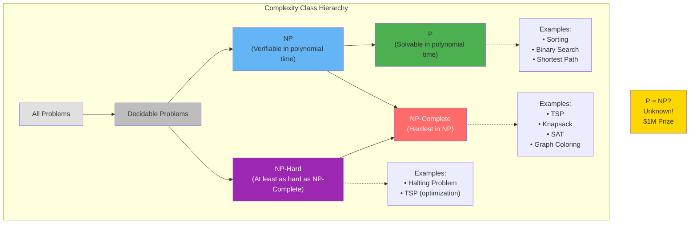
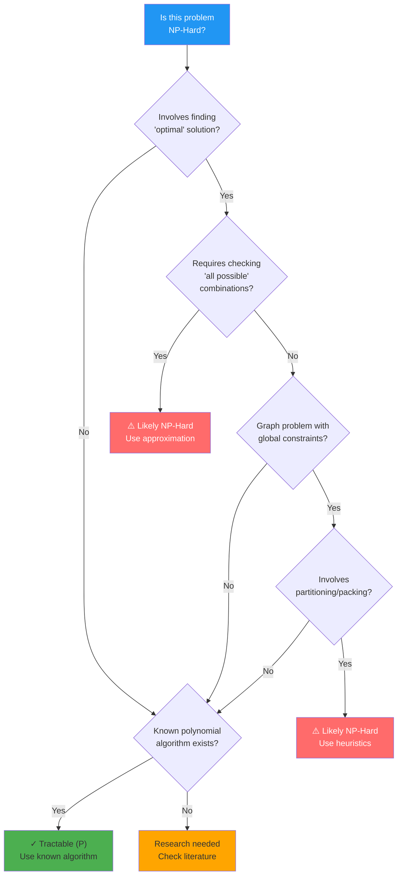

# Chapter 15: Computational Complexity and P vs NP

## Introduction

Computational complexity theory studies how efficiently problems can be solved. Some problems are easy, others are hard, and some might be impossible to solve efficiently.

In this chapter, you'll learn:

- Complexity classes (P, NP, NP-Complete, NP-Hard)
- The P vs NP question
- Practical implications
- How to recognize hard problems

## Complexity Classes



### Class P: Polynomial Time

**P**: Problems solvable in polynomial time O(n^k).

**Examples**:
- Sorting: O(n log n)
- Binary search: O(log n)
- Shortest path (Dijkstra): O(E log V)
- Matrix multiplication: O(n³)

**Characteristic**: Efficient, tractable

### Class NP: Nondeterministic Polynomial

**NP**: Problems where solutions can be **verified** in polynomial time.

**Example**: Sudoku
- **Solving**: Hard (potentially exponential)
- **Verifying**: Easy (O(1) - check 9×9 grid)

```php
<?php

// Verifying Sudoku solution - O(1)
function isValidSudoku(array $board): bool {
    // Check rows, columns, boxes
    for ($i = 0; $i < 9; $i++) {
        // Check row
        $seen = [];
        for ($j = 0; $j < 9; $j++) {
            if (isset($seen[$board[$i][$j]])) {
                return false;
            }
            $seen[$board[$i][$j]] = true;
        }
    }
    // ... check columns and boxes
    return true;
}

// Solving Sudoku - Exponential time (backtracking)
```

**All P problems are in NP** (if you can solve it, you can verify it)

**Question**: Is P = NP? (Can every verifiable problem be solved efficiently?)

## NP-Complete Problems

**NP-Complete**: Hardest problems in NP. If you solve one efficiently, you solve all NP problems.

**Examples**:
1. **Boolean Satisfiability (SAT)**: Can boolean formula be satisfied?
2. **Traveling Salesman**: Find shortest tour visiting all cities
3. **Knapsack (0/1)**: Maximize value within weight limit
4. **Graph Coloring**: Color graph with k colors, no adjacent same color
5. **Hamiltonian Path**: Visit all vertices exactly once
6. **Subset Sum**: Does subset sum to target?

```php
<?php

// Subset Sum - NP-Complete
function hasSubsetSum(array $nums, int $target): bool {
    $n = count($nums);

    // Try all 2^n subsets - exponential!
    for ($mask = 0; $mask < (1 << $n); $mask++) {
        $sum = 0;
        for ($i = 0; $i < $n; $i++) {
            if ($mask & (1 << $i)) {
                $sum += $nums[$i];
            }
        }
        if ($sum === $target) {
            return true;
        }
    }

    return false;
}

// Verification is easy - O(n)
function verifySubsetSum(array $subset, int $target): bool {
    return array_sum($subset) === $target;
}
```

## NP-Hard Problems

**NP-Hard**: At least as hard as NP-Complete, but don't need to be in NP.

**Examples**:
- Halting Problem (undecidable)
- Optimization versions of NP-Complete problems
- Some scheduling problems

## The P vs NP Problem

**The million-dollar question**: Does P = NP?

```
P = NP?
       Yes → Easy to verify = Easy to solve
       No  → Some problems easy to verify but hard to solve
```

**Current belief**: P ≠ NP

**Implications if P = NP**:
- Cryptography breaks
- Many "hard" problems become easy
- Revolutionary for science, engineering, economics

**Implications if P ≠ NP**:
- Some problems inherently hard
- No efficient general solution exists
- Approximations and heuristics are best we can do

## Recognizing Hard Problems



**Red flags** for NP-Hard problems:
- "All possible..." (combinations, permutations)
- "Optimal..." with constraints
- Graph problems with global properties
- Scheduling with complex constraints

**Examples**:

```php
<?php

// EASY (P): Find any path from A to B
function findPath($graph, $start, $end) {
    // BFS/DFS - O(V + E)
}

// HARD (NP-Complete): Find shortest path visiting all nodes
function travelingSalesman($graph) {
    // No known polynomial solution
}

// EASY (P): Check if graph has cycle
function hasCycle($graph) {
    // DFS - O(V + E)
}

// HARD (NP-Complete): Find longest simple path
function longestPath($graph) {
    // NP-Complete
}

// EASY (P): Sort array
function sort($arr) {
    // O(n log n)
}

// HARD (NP-Complete): Partition array into equal sums
function partitionEqualSubsetSum($arr) {
    // NP-Complete (reduction from subset sum)
}
```

## Dealing with NP-Hard Problems

### 1. Exact Solutions (Small Inputs)

```php
<?php

// Brute force TSP for small n
function tspBruteForce(array $graph): float {
    $n = count($graph);
    $vertices = range(1, $n - 1);

    // Generate all permutations - O(n!)
    $permutations = generatePermutations($vertices);
    $minCost = PHP_FLOAT_MAX;

    foreach ($permutations as $perm) {
        $cost = calculateTourCost($graph, $perm);
        $minCost = min($minCost, $cost);
    }

    return $minCost;
}
```

**Use**: n < 15

### 2. Approximation Algorithms

```php
<?php

// 2-approximation for TSP (using MST)
function tspApproximation(array $graph): float {
    // 1. Find MST
    $mst = primMST($graph);

    // 2. Do DFS traversal
    $tour = dfsTour($mst, 0);

    // 3. Calculate cost
    return calculateTourCost($graph, $tour);
}
```

**Guarantee**: Within 2× optimal

### 3. Heuristics

```php
<?php

// Greedy nearest neighbor for TSP
function tspNearestNeighbor(array $graph): array {
    $n = count($graph);
    $visited = [0];
    $current = 0;

    while (count($visited) < $n) {
        $nearest = -1;
        $minDist = PHP_FLOAT_MAX;

        for ($i = 0; $i < $n; $i++) {
            if (!in_array($i, $visited) && $graph[$current][$i] < $minDist) {
                $nearest = $i;
                $minDist = $graph[$current][$i];
            }
        }

        $visited[] = $nearest;
        $current = $nearest;
    }

    return $visited;
}
```

**No guarantee**, but often good in practice

### 4. Dynamic Programming (Pseudo-Polynomial)

```php
<?php

// 0/1 Knapsack DP - O(n × W)
function knapsackDP(array $weights, array $values, int $W): int {
    // Pseudo-polynomial: polynomial in numeric value of input, not input size
}
```

## Practical Implications

**For developers**:

1. **Recognize** when problem is NP-Hard
2. **Don't** search for perfect polynomial solution
3. **Use** approximations, heuristics, or exact algorithms for small inputs
4. **Consider** if constraints can be relaxed

**Real-world strategies**:
- Use heuristics (greedy, genetic algorithms)
- Restrict problem size
- Use approximation algorithms
- Parallel/distributed computing
- Special-case optimizations

## Key Takeaways

- **P**: Efficiently solvable
- **NP**: Efficiently verifiable
- **NP-Complete**: Hardest problems in NP
- **P = NP?**: Unsolved, $1M prize
- **NP-Hard problems**: Use approximations/heuristics
- **Recognize** hard problems early

## Exercises

1. **Classify**: Determine if these are in P or NP-Complete:
   - Finding minimum spanning tree
   - Finding Hamiltonian cycle
   - Checking if number is prime
   - Finding largest clique in graph

2. **Research**: Learn about one NP-Complete problem and its applications.

3. **Implement**: Write a backtracking solution for graph coloring.

## What's Next?

Understanding computational limits helps us optimize wisely. Chapter 16 covers **Optimization Techniques**—practical strategies for improving algorithm performance.

---

**Further Reading**:
- [P vs NP Problem](https://en.wikipedia.org/wiki/P_versus_NP_problem)
- [NP-Complete Problems](https://en.wikipedia.org/wiki/NP-completeness)
- [Millennium Prize Problems](https://www.claymath.org/millennium-problems)
