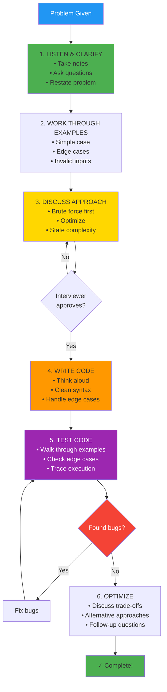

# Chapter 19: Technical Interview Preparation

## Introduction

Technical interviews test your ability to solve problems under pressure, communicate your thinking, and write clean code. Success comes from preparation, practice, and strategy.

In this chapter, you'll learn:

- Interview formats and expectations
- How to communicate during interviews
- Common interview questions in PHP
- Tips for success

## Interview Formats

### 1. Phone/Video Screen (30-45 min)

- Basic CS questions
- Simple coding problem
- Behavioral questions

### 2. Technical Interview (45-60 min)

- 1-2 coding problems
- Algorithm design
- Complexity analysis

### 3. System Design (45-60 min)

- Design scalable systems
- Trade-off discussions
- High-level architecture

### 4. Behavioral Interview

- Past experience
- Team collaboration
- Problem-solving approach

## The STAR Method for Interviews

### Structure Your Responses

**S**ituation → **T**ask → **A**ction → **R**esult

```
Question: "Tell me about a time you faced a difficult bug."

Situation: "In my last project, users reported data corruption..."
Task: "I needed to find the root cause and fix it urgently..."
Action: "I added logging, reproduced the issue, traced it to a race condition..."
Result: "Fixed the bug, added tests, no recurrence in 6 months..."
```

## The Interview Process



**Remember**: Communication > Code quality. Talk through your thinking!

### Step 1: Listen Carefully

- Take notes
- Ask clarifying questions
- Restate the problem

```php
<?php

// Interviewer: "Find if array contains duplicates"

// Good response:
"Just to clarify:
- Can the array be empty?
- Should I consider only exact duplicates?
- Any constraints on time/space complexity?
- Should I modify the input array or create a new one?"
```

### Step 2: Discuss Approach

Think aloud before coding.

```
"I see a few approaches:

1. Brute force: Compare every pair - O(n²) time, O(1) space
2. Sort first: Then check adjacent elements - O(n log n) time, O(1) space
3. Hash set: Track seen elements - O(n) time, O(n) space

I'll go with the hash set approach for optimal time complexity.
Is that okay?"
```

### Step 3: Write Code

Start coding only after approach is approved.

```php
<?php

function containsDuplicate(array $nums): bool {
    $seen = [];

    foreach ($nums as $num) {
        if (isset($seen[$num])) {
            return true; // Found duplicate
        }
        $seen[$num] = true;
    }

    return false; // No duplicates
}
```

### Step 4: Test Your Code

Walk through test cases.

```php
<?php

// Test cases:
// [1, 2, 3, 1] → true (1 appears twice)
// [1, 2, 3, 4] → false (no duplicates)
// [] → false (empty array)
// [1] → false (single element)

$result1 = containsDuplicate([1, 2, 3, 1]);
// Trace: Check 1 (not in seen), check 2, check 3, check 1 (in seen!) → true ✓

$result2 = containsDuplicate([1, 2, 3, 4]);
// Trace: Check all, none in seen → false ✓
```

### Step 5: Optimize

Discuss improvements.

```php
<?php

// If array can be modified:
function containsDuplicateInPlace(array &$nums): bool {
    sort($nums); // O(n log n)

    for ($i = 1; $i < count($nums); $i++) {
        if ($nums[$i] === $nums[$i - 1]) {
            return true;
        }
    }

    return false;
}

// Trade-off: Better space O(1), worse time O(n log n)
```

## Common Interview Questions

### Easy

#### 1. Reverse a String

```php
<?php

function reverseString(string $s): string {
    return strrev($s); // Built-in

    // Manual implementation:
    $chars = str_split($s);
    $left = 0;
    $right = strlen($s) - 1;

    while ($left < $right) {
        [$chars[$left], $chars[$right]] = [$chars[$right], $chars[$left]];
        $left++;
        $right--;
    }

    return implode('', $chars);
}
```

#### 2. Valid Palindrome

```php
<?php

function isPalindrome(string $s): bool {
    $s = strtolower(preg_replace('/[^a-z0-9]/', '', $s));
    return $s === strrev($s);
}
```

#### 3. Two Sum

```php
<?php

function twoSum(array $nums, int $target): ?array {
    $seen = [];

    foreach ($nums as $i => $num) {
        $complement = $target - $num;

        if (isset($seen[$complement])) {
            return [$seen[$complement], $i];
        }

        $seen[$num] = $i;
    }

    return null;
}
```

### Medium

#### 4. Longest Substring Without Repeating Characters

```php
<?php

function lengthOfLongestSubstring(string $s): int {
    $seen = [];
    $maxLen = $left = 0;

    for ($right = 0; $right < strlen($s); $right++) {
        $char = $s[$right];

        if (isset($seen[$char]) && $seen[$char] >= $left) {
            $left = $seen[$char] + 1;
        }

        $seen[$char] = $right;
        $maxLen = max($maxLen, $right - $left + 1);
    }

    return $maxLen;
}
```

#### 5. Group Anagrams

```php
<?php

function groupAnagrams(array $strs): array {
    $groups = [];

    foreach ($strs as $str) {
        $chars = str_split($str);
        sort($chars);
        $key = implode('', $chars);

        $groups[$key][] = $str;
    }

    return array_values($groups);
}

// ["eat", "tea", "tan", "ate", "nat", "bat"]
// → [["eat", "tea", "ate"], ["tan", "nat"], ["bat"]]
```

#### 6. Validate Binary Search Tree

```php
<?php

function isValidBST(?TreeNode $root): bool {
    return validate($root, null, null);
}

function validate(?TreeNode $node, $min, $max): bool {
    if ($node === null) {
        return true;
    }

    if (($min !== null && $node->value <= $min) ||
        ($max !== null && $node->value >= $max)) {
        return false;
    }

    return validate($node->left, $min, $node->value) &&
           validate($node->right, $node->value, $max);
}
```

### Hard

#### 7. Serialize and Deserialize Binary Tree

```php
<?php

function serialize(?TreeNode $root): string {
    if ($root === null) {
        return "null";
    }

    return $root->value . "," .
           serialize($root->left) . "," .
           serialize($root->right);
}

function deserialize(string $data): ?TreeNode {
    $values = explode(",", $data);
    $index = 0;

    return deserializeHelper($values, $index);
}

function deserializeHelper(array $values, int &$index): ?TreeNode {
    if ($values[$index] === "null") {
        $index++;
        return null;
    }

    $node = new TreeNode((int)$values[$index++]);
    $node->left = deserializeHelper($values, $index);
    $node->right = deserializeHelper($values, $index);

    return $node;
}
```

## Interview Tips

### Do's

✓ **Clarify requirements** before coding
✓ **Think aloud** - explain your reasoning
✓ **Start with brute force**, then optimize
✓ **Write clean, readable code**
✓ **Test your solution** with examples
✓ **Discuss trade-offs** (time vs. space)
✓ **Ask questions** when stuck
✓ **Stay calm** and positive

### Don'ts

✗ **Don't jump to code** immediately
✗ **Don't go silent** - communicate constantly
✗ **Don't give up** if stuck
✗ **Don't ignore edge cases**
✗ **Don't write messy code**
✗ **Don't argue** with interviewer
✗ **Don't memorize solutions** without understanding

## What to Study

### High-Priority Topics

1. **Arrays & Strings** (30% of questions)
2. **Hash Tables** (20%)
3. **Trees & Graphs** (20%)
4. **Dynamic Programming** (15%)
5. **Sorting & Searching** (10%)
6. **Linked Lists** (5%)

### Practice Resources

- **LeetCode**: 150 most common interview questions
- **HackerRank**: Skills verification
- **InterviewBit**: Topic-wise practice
- **Pramp**: Mock interviews with peers

## Mock Interview Example

**Problem**: "Implement an LRU Cache"

**Your Response**:

```
Me: "Let me clarify - LRU Cache should support:
- get(key): Return value if exists, -1 otherwise
- put(key, value): Insert/update, evict LRU if at capacity
- Both operations should be O(1)
Is that correct?"

Interviewer: "Yes"

Me: "I'll use:
- Hash map for O(1) lookups
- Doubly linked list to track LRU order
- Head = most recent, Tail = least recent
Sound good?"

Interviewer: "Go ahead"
```

```php
<?php

class LRUCache {
    private array $cache = [];
    private int $capacity;
    private ?Node $head = null;
    private ?Node $tail = null;

    public function __construct(int $capacity) {
        $this->capacity = $capacity;
    }

    public function get(int $key): int {
        if (!isset($this->cache[$key])) {
            return -1;
        }

        $node = $this->cache[$key];
        $this->moveToHead($node);

        return $node->value;
    }

    public function put(int $key, int $value): void {
        if (isset($this->cache[$key])) {
            $node = $this->cache[$key];
            $node->value = $value;
            $this->moveToHead($node);
        } else {
            $node = new Node($key, $value);
            $this->cache[$key] = $node;
            $this->addToHead($node);

            if (count($this->cache) > $this->capacity) {
                $removed = $this->removeTail();
                unset($this->cache[$removed->key]);
            }
        }
    }

    // Helper methods omitted for brevity
}
```

## Key Takeaways

- **Prepare** common questions
- **Practice** coding without IDE
- **Communicate** your thought process
- **Test** your solutions
- **Stay calm** under pressure
- **Learn from failures** - each interview makes you better

## Final Checklist

Before your interview:
- [ ] Review data structures
- [ ] Practice 50+ problems
- [ ] Do mock interviews
- [ ] Prepare questions for interviewer
- [ ] Review company's tech stack
- [ ] Get good sleep

## What's Next?

You've mastered the theory. Chapter 20 shows how to apply Computer Science in **Modern Web Development**—bringing CS concepts into real-world PHP applications.

---

**Further Reading**:
- [Cracking the Coding Interview](http://www.crackingthecodinginterview.com/)
- [LeetCode Top Interview Questions](https://leetcode.com/problem-list/top-interview-questions/)
- [System Design Interview](https://github.com/donnemartin/system-design-primer)
