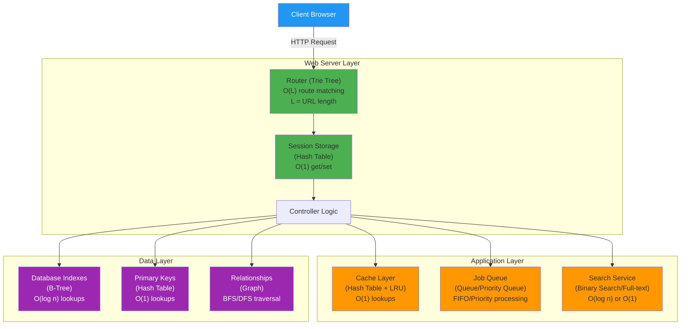
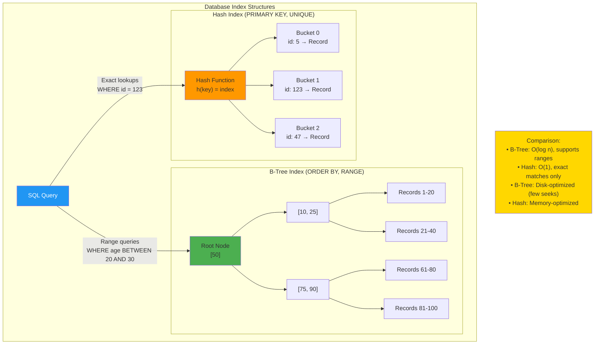
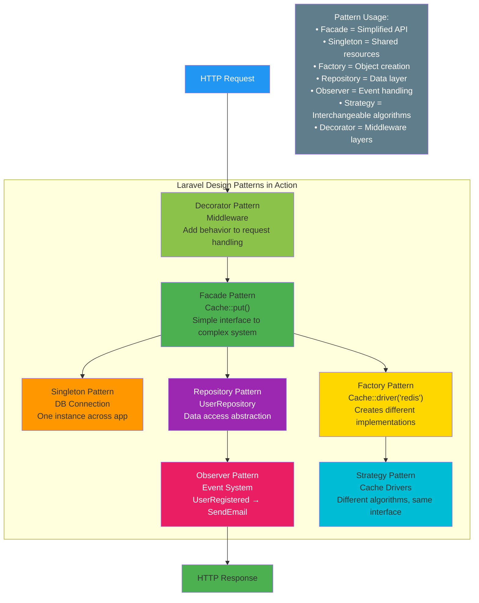
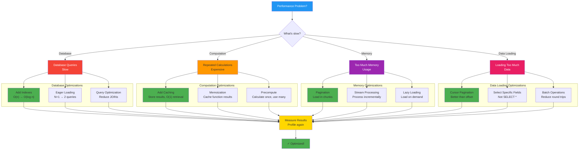
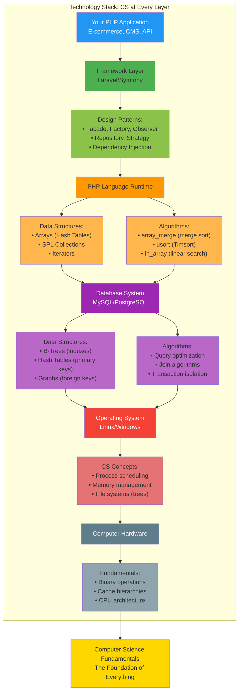

# Chapter 20: Computer Science in Modern Web Development

## Introduction

Computer Science isn't just theory—it powers every aspect of web development. This chapter connects CS concepts to real-world PHP applications, showing how everything you've learned applies to building websites and APIs.

In this chapter, you'll learn:

- How CS concepts appear in web development
- Data structures in frameworks and databases
- Algorithms in real applications
- Design patterns in Laravel/Symfony

## CS in the Request-Response Cycle



**Every layer uses CS concepts**: Routing uses tries, sessions use hash tables, queues process jobs, databases use B-trees and graphs!

### Hash Tables → Session Storage

```php
<?php

// Sessions use hash tables internally
session_start();

// O(1) lookup
$_SESSION['user_id'] = 123;
$userId = $_SESSION['user_id'] ?? null;

// Implementation concept:
class SessionStore {
    private array $data = []; // Hash table

    public function set(string $key, mixed $value): void {
        $this->data[$key] = $value; // O(1)
    }

    public function get(string $key): mixed {
        return $this->data[$key] ?? null; // O(1)
    }
}
```

### Queues → Background Jobs

```php
<?php

// Laravel queue - uses queue data structure
dispatch(new SendEmailJob($user));

// Background worker processes jobs FIFO
while ($job = Queue::pop()) {
    $job->handle();
}
```

### Trees → URL Routing

```php
<?php

// Routes stored in tree (trie) for fast matching
$router = new Router();
$router->get('/users/:id', 'UserController@show');
$router->get('/users/:id/posts', 'PostController@index');

// Trie structure:
//     /
//     └─ users
//         └─ :id
//             ├─ [GET]
//             └─ posts
//                 └─ [GET]
```

## Data Structures in Databases



**Index Selection**: B-trees for ranges and sorting, hash tables for exact lookups!

### B-Trees → Database Indexes

```sql
-- Without index: O(n) full table scan
SELECT * FROM users WHERE email = 'john@example.com';

-- With B-tree index: O(log n) lookup
CREATE INDEX idx_email ON users(email);
```

**B-trees**:
- Balanced tree optimized for disk access
- Each node has many children (not just 2)
- Logarithmic search, insertion, deletion

### Hash Tables → Database Primary Keys

```sql
-- Primary key uses hash for O(1) lookup
SELECT * FROM users WHERE id = 123; -- Very fast

-- vs. non-indexed column: O(n)
SELECT * FROM users WHERE bio LIKE '%developer%'; -- Slow
```

### Linked Lists → Query Result Sets

```php
<?php

// PDO internally uses linked list for results
$stmt = $pdo->query("SELECT * FROM users");

// Iterate like linked list - forward only
while ($row = $stmt->fetch()) {
    echo $row['name'];
}
```

## Algorithms in Web Apps

### Sorting → Data Display

```php
<?php

// Display posts by date (merge sort internally)
$posts = Post::orderBy('created_at', 'desc')->get();

// Custom sorting
usort($posts, function($a, $b) {
    return $b->views <=> $a->views; // PHP's Timsort (O(n log n))
});
```

### Binary Search → Autocomplete

```php
<?php

// Autocomplete suggestions
function autocomplete(array $words, string $prefix): array {
    sort($words); // O(n log n)

    // Binary search for first word starting with prefix
    $left = 0;
    $right = count($words) - 1;
    $result = -1;

    while ($left <= $right) {
        $mid = (int)(($left + $right) / 2);

        if (strpos($words[$mid], $prefix) === 0) {
            $result = $mid;
            $right = $mid - 1; // Find first occurrence
        } elseif ($words[$mid] < $prefix) {
            $left = $mid + 1;
        } else {
            $right = $mid - 1;
        }
    }

    // Collect all matching words
    $matches = [];
    for ($i = $result; $i < count($words) && strpos($words[$i], $prefix) === 0; $i++) {
        $matches[] = $words[$i];
    }

    return $matches;
}
```

### Graph Algorithms → Social Networks

```php
<?php

// Find mutual friends (graph intersection)
function mutualFriends(int $userId1, int $userId2): array {
    $friends1 = getFriends($userId1); // Get adjacency list
    $friends2 = getFriends($userId2);

    return array_intersect($friends1, $friends2);
}

// Friend suggestions (BFS to find friends-of-friends)
function suggestFriends(int $userId): array {
    $visited = [$userId => true];
    $queue = getFriends($userId);
    $suggestions = [];

    while (!empty($queue)) {
        $friendId = array_shift($queue);

        if (isset($visited[$friendId])) continue;
        $visited[$friendId] = true;

        foreach (getFriends($friendId) as $friendOfFriend) {
            if (!isset($visited[$friendOfFriend])) {
                $suggestions[] = $friendOfFriend;
            }
        }
    }

    return array_unique($suggestions);
}
```

## Design Patterns in Frameworks



**Framework Architecture**: Laravel combines multiple design patterns to create clean, maintainable code!

### Laravel Uses Many Patterns

#### 1. Facade Pattern

```php
<?php

// Facade provides simple interface to complex subsystem
Cache::put('key', 'value', 600);

// Behind the scenes:
class Cache {
    public static function put($key, $value, $ttl) {
        return app('cache')->put($key, $value, $ttl);
    }
}
```

#### 2. Repository Pattern

```php
<?php

interface UserRepositoryInterface {
    public function find(int $id): ?User;
    public function all(): array;
}

class EloquentUserRepository implements UserRepositoryInterface {
    public function find(int $id): ?User {
        return User::find($id);
    }

    public function all(): array {
        return User::all()->toArray();
    }
}
```

#### 3. Observer Pattern

```php
<?php

// Laravel Events
Event::listen(UserRegistered::class, function ($event) {
    Mail::to($event->user)->send(new WelcomeEmail());
});

// Trigger event
Event::dispatch(new UserRegistered($user));
```

#### 4. Strategy Pattern

```php
<?php

// Laravel Cache drivers (different strategies)
Cache::driver('redis')->put('key', 'value');
Cache::driver('database')->put('key', 'value');
Cache::driver('file')->put('key', 'value');
```

## Performance Optimization with CS



**Optimization Strategy**: Identify bottleneck → Apply CS technique → Measure improvement!

### Caching (Memoization)

```php
<?php

class PostService {
    private array $cache = [];

    public function getPopularPosts(): array {
        if (isset($this->cache['popular'])) {
            return $this->cache['popular']; // O(1)
        }

        // Expensive query
        $posts = DB::table('posts')
            ->orderBy('views', 'desc')
            ->limit(10)
            ->get();

        $this->cache['popular'] = $posts;
        return $posts;
    }
}
```

### Pagination (Avoiding O(n) Scans)

```php
<?php

// Bad: Load everything - O(n) memory
$allPosts = Post::all(); // 1 million records!

// Good: Paginate - O(1) per page
$posts = Post::paginate(20); // Only 20 records loaded

// Cursor-based pagination for better performance
$posts = Post::orderBy('id')->cursorPaginate(20);
```

### Eager Loading (Avoiding N+1 Problem)

```php
<?php

// Bad: N+1 queries
$posts = Post::all(); // 1 query
foreach ($posts as $post) {
    echo $post->author->name; // N additional queries!
}

// Good: Eager loading with JOIN
$posts = Post::with('author')->get(); // 2 queries total
foreach ($posts as $post) {
    echo $post->author->name; // No additional queries
}
```

## Complexity in Real Code

### Example: Search Feature

```php
<?php

class SearchService {
    // O(n) - Linear search through all posts
    public function searchBasic(string $query): array {
        $posts = Post::all();
        return array_filter($posts, function($post) use ($query) {
            return stripos($post->title, $query) !== false;
        });
    }

    // O(log n) - Binary search on indexed column
    public function searchIndexed(string $query): array {
        return Post::where('title', 'LIKE', "%$query%")->get();
        // Uses database index (B-tree) for fast lookup
    }

    // O(1) average - Full-text search engine
    public function searchFullText(string $query): array {
        return Post::search($query)->get();
        // Uses Elasticsearch/Algolia with inverted index
    }
}
```

## Real-World Application: Building an E-Commerce Cart

```php
<?php

class ShoppingCart {
    private array $items = []; // Hash table: O(1) operations

    // Add item - O(1)
    public function add(int $productId, int $quantity): void {
        if (isset($this->items[$productId])) {
            $this->items[$productId] += $quantity;
        } else {
            $this->items[$productId] = $quantity;
        }
    }

    // Remove item - O(1)
    public function remove(int $productId): void {
        unset($this->items[$productId]);
    }

    // Get total - O(n) where n = unique items
    public function getTotal(): float {
        $total = 0;

        foreach ($this->items as $productId => $quantity) {
            $product = Product::find($productId); // Cached in production
            $total += $product->price * $quantity;
        }

        return $total;
    }

    // Apply discount (greedy algorithm)
    public function applyBestDiscount(array $coupons): ?Coupon {
        $maxDiscount = 0;
        $bestCoupon = null;

        foreach ($coupons as $coupon) {
            $discount = $this->calculateDiscount($coupon);

            if ($discount > $maxDiscount) {
                $maxDiscount = $discount;
                $bestCoupon = $coupon;
            }
        }

        return $bestCoupon;
    }
}
```

## CS Concepts Checklist for Web Developers

**Data Structures**:
- ✓ Hash tables → Sessions, caches, lookups
- ✓ Arrays → Collections, lists
- ✓ Queues → Job queues, message brokers
- ✓ Stacks → Undo/redo, parsing
- ✓ Trees → Routing, database indexes
- ✓ Graphs → Social networks, recommendations

**Algorithms**:
- ✓ Sorting → Display ordered data
- ✓ Searching → Find records, autocomplete
- ✓ Graph traversal → Friend suggestions
- ✓ Dynamic programming → Optimization problems
- ✓ Greedy algorithms → Resource allocation

**Design Patterns**:
- ✓ Singleton → Database connections
- ✓ Factory → Object creation
- ✓ Observer → Event systems
- ✓ Strategy → Polymorphic behavior
- ✓ Repository → Data access abstraction

## The Big Picture



**Every layer relies on CS**: Understanding these fundamentals makes you a better developer at every level!

Understanding these layers makes you a better developer.

## Key Takeaways

- **CS isn't abstract**—it's in every web app
- **Data structures** power sessions, databases, caches
- **Algorithms** optimize searches, sorts, recommendations
- **Design patterns** structure frameworks
- **Big O** matters for scalability
- **Understanding CS** makes you a better engineer

## Continue Learning

- Practice algorithms on LeetCode
- Read framework source code
- Profile your applications
- Optimize bottlenecks
- Study system design
- Never stop learning

## Congratulations!

You've completed the Computer Science Fundamentals series! You now have the foundation to:

- **Analyze** algorithm complexity
- **Choose** the right data structures
- **Implement** classic algorithms
- **Apply** design patterns
- **Optimize** code systematically
- **Design** scalable systems
- **Ace** technical interviews

Keep building, keep learning, and apply these concepts in your daily work. Computer science is a journey, not a destination.

---

**Next Steps**:

→ **[PHP Basics](/series/php-basics/)** — If you haven't already, master PHP fundamentals
→ **[AI/ML for PHP Developers](/series/ai-ml-php-developers/)** — Apply CS to machine learning
→ **[Practice Problems](https://leetcode.com/)** — Sharpen your skills
→ **[System Design](https://github.com/donnemartin/system-design-primer)** — Go deeper into architecture

**Thank you for completing this series!** 🎉

---

**Further Reading**:
- [Introduction to Algorithms (CLRS)](https://mitpress.mit.edu/books/introduction-algorithms-third-edition)
- [Clean Code by Robert Martin](https://www.amazon.com/Clean-Code-Handbook-Software-Craftsmanship/dp/0132350882)
- [Design Patterns: Elements of Reusable Object-Oriented Software](https://en.wikipedia.org/wiki/Design_Patterns)
- [Laravel Source Code](https://github.com/laravel/framework)
- [PHP The Right Way](https://phptherightway.com/)
