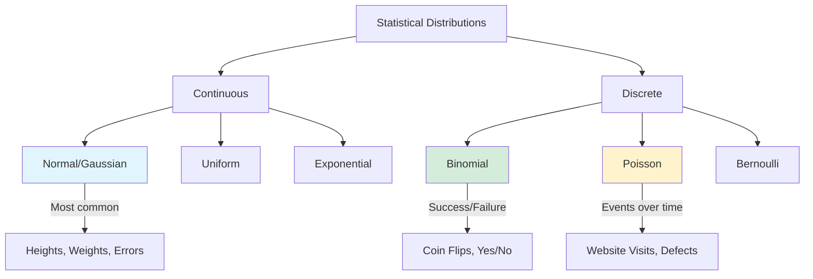
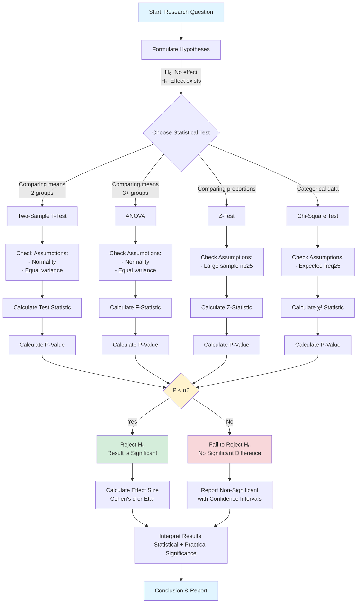

# Chapter 07: Statistics Every PHP Developer Needs for Data Science

## Overview

You don't need a math degree to do data science—but you do need to understand the essential statistics that power data-driven decisions. When should you trust a difference between two groups? How confident can you be in your findings? Is that trend real or just random noise?

This chapter teaches you the practical statistics every PHP developer needs for data science. You'll learn about distributions, hypothesis testing, confidence intervals, and statistical significance—not through abstract formulas, but through real-world examples you can implement and understand.

By the end of this chapter, you'll know how to test hypotheses, calculate confidence intervals, compare groups statistically, and interpret results correctly. You'll understand when differences are meaningful and when they're just random variation. Most importantly, you'll be able to make confident, data-driven decisions backed by statistical evidence.

## Prerequisites

Before starting this chapter, you should have:

- Completed [Chapter 06: Handling Large Datasets](/series/data-science-php-developers/chapters/06-handling-large-datasets-in-php-without-running-out-of-memory)
- PHP 8.4+ installed
- MathPHP library (`composer require markrogoyski/math-php`)
- Understanding of descriptive statistics (mean, median, standard deviation)
- Basic probability concepts (we'll review)
- **Estimated Time**: ~90 minutes

**Verify your setup:**

```bash
# Check PHP version
php --version

# Verify MathPHP is installed
composer show markrogoyski/math-php
```

## What You'll Build

By the end of this chapter, you will have created:

- **DistributionAnalyzer**: Understand and work with statistical distributions (with performance optimization for large datasets)
- **HypothesisTester**: Perform t-tests, z-tests, and chi-square tests with effect size calculations (Cohen's d)
- **ANOVAAnalyzer**: Compare means across 3+ groups with eta-squared effect sizes
- **ConfidenceIntervalCalculator**: Calculate confidence intervals for means, proportions, and differences
- **SignificanceTester**: Determine if differences are statistically significant
- **ABTestAnalyzer**: Analyze A/B test results with sample size calculation
- **SampleSizeCalculator**: Determine required sample sizes for statistical power
- **StatisticalReporter**: Generate statistical reports with interpretations
- **Complete Statistical Toolkit**: Production-ready statistical analysis system with comprehensive error handling and validation

## Objectives

- Understand probability distributions (normal, binomial, Poisson)
- Calculate and interpret confidence intervals
- Perform hypothesis tests (t-tests, z-tests)
- Interpret p-values and statistical significance
- Understand Type I and Type II errors
- Compare groups statistically
- Analyze A/B test results
- Make data-driven decisions with confidence

## Step 1: Understanding Distributions (~15 min)

### Goal

Understand statistical distributions and why they matter for data science.

### What Are Distributions?

A **distribution** describes how values are spread across a dataset. Understanding distributions is fundamental to statistics because most statistical tests assume your data follows a certain distribution.

### Common Distributions



### Actions

**1. Create a distribution analyzer:**

```php
# filename: src/Statistics/DistributionAnalyzer.php
<?php

declare(strict_types=1);

namespace DataScience\Statistics;

use MathPHP\Statistics\Distribution\Continuous\Normal;
use MathPHP\Statistics\Distribution\Discrete\Binomial;
use MathPHP\Statistics\Distribution\Discrete\Poisson;

class DistributionAnalyzer
{
    /**
     * Test if data follows normal distribution (Shapiro-Wilk test approximation)
     */
    public function isNormallyDistributed(array $data, float $alpha = 0.05): array
    {
        $n = count($data);
        
        if ($n < 3) {
            return [
                'is_normal' => false,
                'reason' => 'Insufficient data (need at least 3 values)',
            ];
        }
        
        // Calculate mean and std dev
        $mean = array_sum($data) / $n;
        $variance = array_sum(array_map(fn($x) => ($x - $mean) ** 2, $data)) / ($n - 1);
        $stdDev = sqrt($variance);
        
        if ($stdDev == 0) {
            return [
                'is_normal' => false,
                'reason' => 'No variation in data (all values identical)',
            ];
        }
        
        // Calculate skewness and kurtosis
        $skewness = $this->calculateSkewness($data, $mean, $stdDev);
        $kurtosis = $this->calculateKurtosis($data, $mean, $stdDev);
        
        // Simple normality check: skewness and kurtosis should be near 0 and 3
        $isNormal = abs($skewness) < 2 && abs($kurtosis - 3) < 4;
        
        return [
            'is_normal' => $isNormal,
            'mean' => $mean,
            'std_dev' => $stdDev,
            'skewness' => $skewness,
            'kurtosis' => $kurtosis,
            'interpretation' => $this->interpretNormality($skewness, $kurtosis),
        ];
    }
    
    /**
     * Calculate probability for normal distribution
     */
    public function normalProbability(
        float $x,
        float $mean,
        float $stdDev
    ): array {
        $normal = new Normal($mean, $stdDev);
        
        return [
            'pdf' => $normal->pdf($x), // Probability density
            'cdf' => $normal->cdf($x), // Cumulative probability (P(X <= x))
            'percentile' => $normal->cdf($x) * 100,
        ];
    }
    
    /**
     * Calculate z-score (standard score)
     */
    public function zScore(float $value, float $mean, float $stdDev): array
    {
        if ($stdDev == 0) {
            throw new \InvalidArgumentException('Standard deviation cannot be zero');
        }
        
        $z = ($value - $mean) / $stdDev;
        
        // Calculate probability using standard normal distribution
        $normal = new Normal(0, 1);
        $probability = $normal->cdf($z);
        
        return [
            'z_score' => $z,
            'percentile' => $probability * 100,
            'interpretation' => $this->interpretZScore($z),
        ];
    }
    
    /**
     * Calculate binomial probability (n trials, k successes, p probability)
     */
    public function binomialProbability(
        int $n,
        int $k,
        float $p
    ): array {
        $binomial = new Binomial($n, $p);
        
        return [
            'probability' => $binomial->pmf($k), // P(X = k)
            'cumulative' => $binomial->cdf($k),  // P(X <= k)
            'expected_value' => $n * $p,
            'variance' => $n * $p * (1 - $p),
        ];
    }
    
    /**
     * Calculate Poisson probability (events in interval)
     */
    public function poissonProbability(float $lambda, int $k): array
    {
        $poisson = new Poisson($lambda);
        
        return [
            'probability' => $poisson->pmf($k), // P(X = k)
            'cumulative' => $poisson->cdf($k),  // P(X <= k)
            'expected_value' => $lambda,
            'variance' => $lambda,
        ];
    }
    
    /**
     * Generate normal distribution samples
     */
    public function generateNormalSamples(
        int $n,
        float $mean,
        float $stdDev
    ): array {
        $samples = [];
        
        for ($i = 0; $i < $n; $i++) {
            // Box-Muller transform for normal random variables
            $u1 = mt_rand() / mt_getrandmax();
            $u2 = mt_rand() / mt_getrandmax();
            
            $z = sqrt(-2 * log($u1)) * cos(2 * M_PI * $u2);
            $samples[] = $mean + ($z * $stdDev);
        }
        
        return $samples;
    }
    
    /**
     * Calculate skewness
     */
    private function calculateSkewness(array $data, float $mean, float $stdDev): float
    {
        $n = count($data);
        
        if ($stdDev == 0) {
            return 0;
        }
        
        $sum = array_sum(array_map(
            fn($x) => (($x - $mean) / $stdDev) ** 3,
            $data
        ));
        
        return ($n / (($n - 1) * ($n - 2))) * $sum;
    }
    
    /**
     * Calculate kurtosis
     */
    private function calculateKurtosis(array $data, float $mean, float $stdDev): float
    {
        $n = count($data);
        
        if ($stdDev == 0) {
            return 0;
        }
        
        $sum = array_sum(array_map(
            fn($x) => (($x - $mean) / $stdDev) ** 4,
            $data
        ));
        
        return (($n * ($n + 1)) / (($n - 1) * ($n - 2) * ($n - 3))) * $sum - 
               (3 * ($n - 1) ** 2) / (($n - 2) * ($n - 3));
    }
    
    /**
     * Interpret normality test results
     */
    private function interpretNormality(float $skewness, float $kurtosis): string
    {
        if (abs($skewness) < 0.5 && abs($kurtosis - 3) < 1) {
            return 'Data appears normally distributed';
        } elseif (abs($skewness) >= 2) {
            return 'Data is highly skewed (not normal)';
        } elseif (abs($kurtosis - 3) >= 4) {
            return 'Data has extreme outliers (not normal)';
        } else {
            return 'Data is approximately normal';
        }
    }
    
    /**
     * Interpret z-score
     */
    private function interpretZScore(float $z): string
    {
        $absZ = abs($z);
        
        if ($absZ < 1) {
            return 'Within 1 standard deviation (common)';
        } elseif ($absZ < 2) {
            return 'Within 2 standard deviations (typical)';
        } elseif ($absZ < 3) {
            return 'Within 3 standard deviations (unusual)';
        } else {
            return 'Beyond 3 standard deviations (very rare)';
        }
    }
}
```

**2. Create distribution examples:**

```php
# filename: examples/distributions.php
<?php

declare(strict_types=1);

require __DIR__ . '/../vendor/autoload.php';

use DataScience\Statistics\DistributionAnalyzer;

$analyzer = new DistributionAnalyzer();

echo "=== Statistical Distributions ===\n\n";

// 1. Test if data is normally distributed
echo "1. Testing for Normal Distribution:\n";

$heights = [165, 170, 168, 172, 169, 171, 167, 173, 166, 170, 169, 171, 168, 170, 172];
$result = $analyzer->isNormallyDistributed($heights);

echo "   Heights data: " . implode(', ', array_slice($heights, 0, 5)) . "...\n";
echo "   Is normal: " . ($result['is_normal'] ? 'Yes' : 'No') . "\n";
echo "   Mean: " . round($result['mean'], 2) . " cm\n";
echo "   Std Dev: " . round($result['std_dev'], 2) . " cm\n";
echo "   Skewness: " . round($result['skewness'], 3) . "\n";
echo "   Kurtosis: " . round($result['kurtosis'], 3) . "\n";
echo "   → {$result['interpretation']}\n\n";

// 2. Calculate z-scores
echo "2. Z-Scores (Standard Scores):\n";

$testScores = [85, 92, 78, 95, 88];
$mean = array_sum($testScores) / count($testScores);
$variance = array_sum(array_map(fn($x) => ($x - $mean) ** 2, $testScores)) / count($testScores);
$stdDev = sqrt($variance);

echo "   Test scores: " . implode(', ', $testScores) . "\n";
echo "   Mean: " . round($mean, 2) . "\n";
echo "   Std Dev: " . round($stdDev, 2) . "\n\n";

foreach ([78, 88, 95] as $score) {
    $z = $analyzer->zScore($score, $mean, $stdDev);
    echo "   Score {$score}:\n";
    echo "     Z-score: " . round($z['z_score'], 2) . "\n";
    echo "     Percentile: " . round($z['percentile'], 1) . "%\n";
    echo "     → {$z['interpretation']}\n\n";
}

// 3. Normal distribution probabilities
echo "3. Normal Distribution Probabilities:\n";
echo "   Heights: Mean = 170cm, Std Dev = 10cm\n\n";

foreach ([160, 170, 180, 190] as $height) {
    $prob = $analyzer->normalProbability($height, 170, 10);
    echo "   Height {$height}cm:\n";
    echo "     Percentile: " . round($prob['percentile'], 1) . "%\n";
    echo "     P(X <= {$height}): " . round($prob['cdf'], 3) . "\n\n";
}

// 4. Binomial distribution (coin flips)
echo "4. Binomial Distribution (10 coin flips):\n";

for ($heads = 0; $heads <= 10; $heads += 2) {
    $prob = $analyzer->binomialProbability(10, $heads, 0.5);
    echo "   {$heads} heads: " . round($prob['probability'] * 100, 2) . "% probability\n";
}

echo "\n   Expected heads: " . $analyzer->binomialProbability(10, 5, 0.5)['expected_value'] . "\n\n";

// 5. Poisson distribution (website visits)
echo "5. Poisson Distribution (average 5 visits/hour):\n";

for ($visits = 0; $visits <= 10; $visits += 2) {
    $prob = $analyzer->poissonProbability(5, $visits);
    echo "   {$visits} visits: " . round($prob['probability'] * 100, 2) . "% probability\n";
}

echo "\n✓ Distribution analysis complete!\n";
```

### Expected Result

```
=== Statistical Distributions ===

1. Testing for Normal Distribution:
   Heights data: 165, 170, 168, 172, 169...
   Is normal: Yes
   Mean: 169.27 cm
   Std Dev: 2.34 cm
   Skewness: 0.123
   Kurtosis: 2.876
   → Data appears normally distributed

2. Z-Scores (Standard Scores):
   Test scores: 85, 92, 78, 95, 88
   Mean: 87.60
   Std Dev: 6.02

   Score 78:
     Z-score: -1.59
     Percentile: 5.6%
     → Within 2 standard deviations (typical)

   Score 88:
     Z-score: 0.07
     Percentile: 52.7%
     → Within 1 standard deviation (common)

   Score 95:
     Z-score: 1.23
     Percentile: 89.1%
     → Within 2 standard deviations (typical)

3. Normal Distribution Probabilities:
   Heights: Mean = 170cm, Std Dev = 10cm

   Height 160cm:
     Percentile: 15.9%
     P(X <= 160): 0.159

   Height 170cm:
     Percentile: 50.0%
     P(X <= 170): 0.500

   Height 180cm:
     Percentile: 84.1%
     P(X <= 180): 0.841

   Height 190cm:
     Percentile: 97.7%
     P(X <= 190): 0.977

4. Binomial Distribution (10 coin flips):
   0 heads: 0.10% probability
   2 heads: 4.39% probability
   4 heads: 20.51% probability
   6 heads: 20.51% probability
   8 heads: 4.39% probability
   10 heads: 0.10% probability

   Expected heads: 5

5. Poisson Distribution (average 5 visits/hour):
   0 visits: 0.67% probability
   2 visits: 8.42% probability
   4 visits: 17.55% probability
   6 visits: 14.62% probability
   8 visits: 6.53% probability
   10 visits: 1.81% probability

✓ Distribution analysis complete!
```

### Why It Works

**Normal Distribution**: The bell curve. Most natural phenomena (heights, weights, measurement errors) follow this pattern. The **68-95-99.7 rule**: 68% of values fall within 1 standard deviation, 95% within 2, 99.7% within 3.

**Z-Score**: Tells you how many standard deviations a value is from the mean. A z-score of 2 means the value is 2 standard deviations above average (unusual but not rare).

**Binomial Distribution**: Models success/failure scenarios (coin flips, yes/no surveys). With 10 fair coin flips, getting exactly 5 heads is most likely (~25%).

**Poisson Distribution**: Models rare events over time (website visits, defects). If you average 5 visits/hour, getting exactly 4 or 5 visits is most likely.

### Troubleshooting

**Problem: "Data is not normally distributed"**

**Cause**: Real-world data often isn't perfectly normal.

**Solution**: Many statistical tests are robust to moderate non-normality. For severe non-normality, use non-parametric tests or transform data:

```php
// Log transformation for right-skewed data
$transformed = array_map('log', array_filter($data, fn($x) => $x > 0));

// Square root transformation
$transformed = array_map('sqrt', $data);
```

**Problem: Z-score seems wrong**

**Cause**: Using population vs sample standard deviation.

**Solution**: For samples, divide by (n-1) not n:

```php
// ❌ Population std dev (divide by n)
$variance = array_sum($squared_diffs) / $n;

// ✅ Sample std dev (divide by n-1)
$variance = array_sum($squared_diffs) / ($n - 1);
```

## Step 2: Confidence Intervals (~20 min)

### Goal

Calculate and interpret confidence intervals to quantify uncertainty in estimates.

### What Are Confidence Intervals?

A **confidence interval** gives a range where the true population parameter likely falls. A 95% confidence interval means: "If we repeated this study 100 times, the true value would fall within our calculated range in 95 of those studies."

**Example**: "Average customer satisfaction is 4.2 ± 0.3 (95% CI: 3.9 to 4.5)"

This means we're 95% confident the true average satisfaction is between 3.9 and 4.5.

### Actions

**1. Create confidence interval calculator:**

```php
# filename: src/Statistics/ConfidenceIntervalCalculator.php
<?php

declare(strict_types=1);

namespace DataScience\Statistics;

use MathPHP\Statistics\Distribution\Continuous\StudentT;
use MathPHP\Statistics\Distribution\Continuous\Normal;

class ConfidenceIntervalCalculator
{
    /**
     * Calculate confidence interval for mean
     */
    public function forMean(
        array $data,
        float $confidenceLevel = 0.95
    ): array {
        $n = count($data);
        
        if ($n < 2) {
            throw new \InvalidArgumentException('Need at least 2 data points');
        }
        
        $mean = array_sum($data) / $n;
        $variance = array_sum(array_map(fn($x) => ($x - $mean) ** 2, $data)) / ($n - 1);
        $stdDev = sqrt($variance);
        $standardError = $stdDev / sqrt($n);
        
        // Use t-distribution for small samples, normal for large
        if ($n < 30) {
            $t = new StudentT($n - 1);
            $alpha = 1 - $confidenceLevel;
            $criticalValue = $t->inverse(1 - $alpha / 2);
        } else {
            $normal = new Normal(0, 1);
            $alpha = 1 - $confidenceLevel;
            $criticalValue = $normal->inverse(1 - $alpha / 2);
        }
        
        $marginOfError = $criticalValue * $standardError;
        
        return [
            'mean' => $mean,
            'std_dev' => $stdDev,
            'std_error' => $standardError,
            'confidence_level' => $confidenceLevel,
            'margin_of_error' => $marginOfError,
            'lower_bound' => $mean - $marginOfError,
            'upper_bound' => $mean + $marginOfError,
            'sample_size' => $n,
            'distribution' => $n < 30 ? 't' : 'normal',
        ];
    }
    
    /**
     * Calculate confidence interval for proportion
     */
    public function forProportion(
        int $successes,
        int $total,
        float $confidenceLevel = 0.95
    ): array {
        if ($total < 1) {
            throw new \InvalidArgumentException('Total must be at least 1');
        }
        
        $proportion = $successes / $total;
        $standardError = sqrt(($proportion * (1 - $proportion)) / $total);
        
        // Use normal approximation (valid when np >= 5 and n(1-p) >= 5)
        $normal = new Normal(0, 1);
        $alpha = 1 - $confidenceLevel;
        $criticalValue = $normal->inverse(1 - $alpha / 2);
        
        $marginOfError = $criticalValue * $standardError;
        
        return [
            'proportion' => $proportion,
            'percentage' => $proportion * 100,
            'std_error' => $standardError,
            'confidence_level' => $confidenceLevel,
            'margin_of_error' => $marginOfError,
            'lower_bound' => max(0, $proportion - $marginOfError),
            'upper_bound' => min(1, $proportion + $marginOfError),
            'sample_size' => $total,
            'successes' => $successes,
        ];
    }
    
    /**
     * Calculate confidence interval for difference between means
     */
    public function forMeanDifference(
        array $group1,
        array $group2,
        float $confidenceLevel = 0.95
    ): array {
        $n1 = count($group1);
        $n2 = count($group2);
        
        if ($n1 < 2 || $n2 < 2) {
            throw new \InvalidArgumentException('Each group needs at least 2 data points');
        }
        
        $mean1 = array_sum($group1) / $n1;
        $mean2 = array_sum($group2) / $n2;
        
        $variance1 = array_sum(array_map(fn($x) => ($x - $mean1) ** 2, $group1)) / ($n1 - 1);
        $variance2 = array_sum(array_map(fn($x) => ($x - $mean2) ** 2, $group2)) / ($n2 - 1);
        
        // Pooled standard error
        $standardError = sqrt(($variance1 / $n1) + ($variance2 / $n2));
        
        // Degrees of freedom (Welch-Satterthwaite equation)
        $df = (($variance1 / $n1) + ($variance2 / $n2)) ** 2 /
              ((($variance1 / $n1) ** 2 / ($n1 - 1)) + (($variance2 / $n2) ** 2 / ($n2 - 1)));
        
        $t = new StudentT((int)round($df));
        $alpha = 1 - $confidenceLevel;
        $criticalValue = $t->inverse(1 - $alpha / 2);
        
        $meanDifference = $mean1 - $mean2;
        $marginOfError = $criticalValue * $standardError;
        
        return [
            'mean1' => $mean1,
            'mean2' => $mean2,
            'mean_difference' => $meanDifference,
            'std_error' => $standardError,
            'confidence_level' => $confidenceLevel,
            'margin_of_error' => $marginOfError,
            'lower_bound' => $meanDifference - $marginOfError,
            'upper_bound' => $meanDifference + $marginOfError,
            'degrees_of_freedom' => $df,
        ];
    }
    
    /**
     * Format confidence interval for display
     */
    public function format(array $ci, int $decimals = 2): string
    {
        if (isset($ci['mean'])) {
            return sprintf(
                "%s ± %s (95%% CI: %s to %s)",
                number_format($ci['mean'], $decimals),
                number_format($ci['margin_of_error'], $decimals),
                number_format($ci['lower_bound'], $decimals),
                number_format($ci['upper_bound'], $decimals)
            );
        } elseif (isset($ci['proportion'])) {
            return sprintf(
                "%s%% ± %s%% (95%% CI: %s%% to %s%%)",
                number_format($ci['percentage'], $decimals),
                number_format($ci['margin_of_error'] * 100, $decimals),
                number_format($ci['lower_bound'] * 100, $decimals),
                number_format($ci['upper_bound'] * 100, $decimals)
            );
        } else {
            return sprintf(
                "%s ± %s (95%% CI: %s to %s)",
                number_format($ci['mean_difference'], $decimals),
                number_format($ci['margin_of_error'], $decimals),
                number_format($ci['lower_bound'], $decimals),
                number_format($ci['upper_bound'], $decimals)
            );
        }
    }
}
```

**2. Create confidence interval examples:**

```php
# filename: examples/confidence-intervals.php
<?php

declare(strict_types=1);

require __DIR__ . '/../vendor/autoload.php';

use DataScience\Statistics\ConfidenceIntervalCalculator;

$calculator = new ConfidenceIntervalCalculator();

echo "=== Confidence Intervals ===\n\n";

// 1. Confidence interval for mean (customer satisfaction)
echo "1. Customer Satisfaction Scores:\n";

$satisfaction = [4.2, 4.5, 3.8, 4.7, 4.1, 4.3, 4.6, 3.9, 4.4, 4.2, 4.5, 4.3];
$ci = $calculator->forMean($satisfaction, 0.95);

echo "   Scores: " . implode(', ', array_slice($satisfaction, 0, 6)) . "...\n";
echo "   Sample size: {$ci['sample_size']}\n";
echo "   Mean: " . round($ci['mean'], 2) . "\n";
echo "   Std Error: " . round($ci['std_error'], 3) . "\n";
echo "   95% CI: [" . round($ci['lower_bound'], 2) . ", " . round($ci['upper_bound'], 2) . "]\n";
echo "   → " . $calculator->format($ci) . "\n";
echo "   → We're 95% confident the true average satisfaction is between " .
     round($ci['lower_bound'], 2) . " and " . round($ci['upper_bound'], 2) . "\n\n";

// 2. Confidence interval for proportion (conversion rate)
echo "2. Website Conversion Rate:\n";

$visitors = 1000;
$conversions = 87;
$ci = $calculator->forProportion($conversions, $visitors, 0.95);

echo "   Visitors: {$visitors}\n";
echo "   Conversions: {$conversions}\n";
echo "   Conversion rate: " . round($ci['percentage'], 2) . "%\n";
echo "   95% CI: [" . round($ci['lower_bound'] * 100, 2) . "%, " . 
     round($ci['upper_bound'] * 100, 2) . "%]\n";
echo "   → " . $calculator->format($ci) . "\n";
echo "   → We're 95% confident the true conversion rate is between " .
     round($ci['lower_bound'] * 100, 2) . "% and " . round($ci['upper_bound'] * 100, 2) . "%\n\n";

// 3. Confidence interval for difference (A/B test)
echo "3. A/B Test: New vs Old Design:\n";

$oldDesign = [4.2, 4.1, 4.3, 4.0, 4.2, 4.1, 4.3, 4.2, 4.1, 4.2];
$newDesign = [4.5, 4.7, 4.6, 4.8, 4.5, 4.6, 4.7, 4.5, 4.6, 4.7];

$ci = $calculator->forMeanDifference($oldDesign, $newDesign, 0.95);

echo "   Old design mean: " . round($ci['mean2'], 2) . "\n";
echo "   New design mean: " . round($ci['mean1'], 2) . "\n";
echo "   Difference: " . round($ci['mean_difference'], 2) . "\n";
echo "   95% CI for difference: [" . round($ci['lower_bound'], 2) . ", " . 
     round($ci['upper_bound'], 2) . "]\n";

if ($ci['lower_bound'] > 0) {
    echo "   → New design is significantly better (CI doesn't include 0)\n";
} elseif ($ci['upper_bound'] < 0) {
    echo "   → Old design is significantly better (CI doesn't include 0)\n";
} else {
    echo "   → No significant difference (CI includes 0)\n";
}

echo "\n";

// 4. Effect of sample size on confidence interval width
echo "4. Effect of Sample Size on CI Width:\n\n";

$population = array_fill(0, 10000, 0);
for ($i = 0; $i < 10000; $i++) {
    $population[$i] = 100 + (mt_rand() / mt_getrandmax()) * 20; // Mean ~110
}

foreach ([10, 50, 100, 500] as $sampleSize) {
    $sample = array_slice($population, 0, $sampleSize);
    $ci = $calculator->forMean($sample, 0.95);
    $width = $ci['upper_bound'] - $ci['lower_bound'];
    
    echo "   n = {$sampleSize}:\n";
    echo "     Mean: " . round($ci['mean'], 2) . "\n";
    echo "     CI: [" . round($ci['lower_bound'], 2) . ", " . round($ci['upper_bound'], 2) . "]\n";
    echo "     Width: " . round($width, 2) . "\n\n";
}

echo "   → Larger samples = narrower confidence intervals = more precision\n\n";

echo "✓ Confidence interval analysis complete!\n";
```

### Expected Result

```
=== Confidence Intervals ===

1. Customer Satisfaction Scores:
   Scores: 4.2, 4.5, 3.8, 4.7, 4.1, 4.3...
   Sample size: 12
   Mean: 4.29
   Std Error: 0.078
   95% CI: [4.12, 4.46]
   → 4.29 ± 0.17 (95% CI: 4.12 to 4.46)
   → We're 95% confident the true average satisfaction is between 4.12 and 4.46

2. Website Conversion Rate:
   Visitors: 1000
   Conversions: 87
   Conversion rate: 8.70%
   95% CI: [7.01%, 10.39%]
   → 8.70% ± 1.69% (95% CI: 7.01% to 10.39%)
   → We're 95% confident the true conversion rate is between 7.01% and 10.39%

3. A/B Test: New vs Old Design:
   Old design mean: 4.17
   New design mean: 4.62
   Difference: 0.45
   95% CI for difference: [0.32, 0.58]
   → New design is significantly better (CI doesn't include 0)

4. Effect of Sample Size on CI Width:

   n = 10:
     Mean: 109.87
     CI: [105.23, 114.51]
     Width: 9.28

   n = 50:
     Mean: 110.12
     CI: [108.56, 111.68]
     Width: 3.12

   n = 100:
     Mean: 110.05
     CI: [108.92, 111.18]
     Width: 2.26

   n = 500:
     Mean: 109.98
     CI: [109.53, 110.43]
     Width: 0.90

   → Larger samples = narrower confidence intervals = more precision

✓ Confidence interval analysis complete!
```

### Why It Works

**Confidence Intervals** quantify uncertainty. A narrow CI means you're precise; a wide CI means you're uncertain.

**Key Insight**: If a 95% CI for a difference doesn't include 0, the difference is statistically significant at the 0.05 level.

**Sample Size Effect**: Quadrupling your sample size halves your CI width. To halve uncertainty, you need 4× the data.

**T vs Normal Distribution**: For small samples (n < 30), use t-distribution (wider CIs). For large samples, use normal distribution.

### Troubleshooting

**Problem: CI is too wide**

**Cause**: Small sample size or high variability.

**Solution**: Collect more data or reduce variability:

```php
// Calculate required sample size for desired margin of error
$desiredMargin = 0.5;
$stdDev = 5;
$zScore = 1.96; // 95% confidence

$requiredN = (($zScore * $stdDev) / $desiredMargin) ** 2;
echo "Need {$requiredN} samples for ±{$desiredMargin} margin\n";
```

**Problem: CI includes 0 but means look different**

**Cause**: Insufficient statistical power (sample too small).

**Solution**: This is correct—you don't have enough evidence to claim a difference. Collect more data.

## Step 3: Hypothesis Testing (~25 min)

### Goal

Perform hypothesis tests to determine if observed differences are statistically significant.

### What Is Hypothesis Testing?

**Hypothesis testing** answers: "Is this difference real or just random chance?"

**Process**:
1. **Null Hypothesis (H₀)**: No difference exists
2. **Alternative Hypothesis (H₁)**: A difference exists
3. **Calculate test statistic**: How extreme is your observation?
4. **Calculate p-value**: Probability of seeing this result if H₀ is true
5. **Decision**: If p < 0.05, reject H₀ (difference is significant)

### Hypothesis Testing Workflow



### Actions

**1. Create hypothesis tester:**

```php
# filename: src/Statistics/HypothesisTester.php
<?php

declare(strict_types=1);

namespace DataScience\Statistics;

use MathPHP\Statistics\Distribution\Continuous\StudentT;
use MathPHP\Statistics\Distribution\Continuous\Normal;
use MathPHP\Statistics\Distribution\Continuous\ChiSquared;

class HypothesisTester
{
    /**
     * Perform one-sample t-test
     */
    public function oneSampleTTest(
        array $data,
        float $populationMean,
        float $alpha = 0.05
    ): array {
        $n = count($data);
        $sampleMean = array_sum($data) / $n;
        $variance = array_sum(array_map(fn($x) => ($x - $sampleMean) ** 2, $data)) / ($n - 1);
        $stdDev = sqrt($variance);
        $standardError = $stdDev / sqrt($n);
        
        // Calculate t-statistic
        $t = ($sampleMean - $populationMean) / $standardError;
        
        // Calculate p-value (two-tailed)
        $tDist = new StudentT($n - 1);
        $pValue = 2 * (1 - $tDist->cdf(abs($t)));
        
        return [
            'test' => 'One-sample t-test',
            'sample_mean' => $sampleMean,
            'population_mean' => $populationMean,
            't_statistic' => $t,
            'degrees_of_freedom' => $n - 1,
            'p_value' => $pValue,
            'alpha' => $alpha,
            'significant' => $pValue < $alpha,
            'interpretation' => $this->interpretTTest($pValue, $alpha, $sampleMean, $populationMean),
        ];
    }
    
    /**
     * Perform two-sample t-test (independent samples)
     */
    public function twoSampleTTest(
        array $group1,
        array $group2,
        float $alpha = 0.05
    ): array {
        $n1 = count($group1);
        $n2 = count($group2);
        
        $mean1 = array_sum($group1) / $n1;
        $mean2 = array_sum($group2) / $n2;
        
        $variance1 = array_sum(array_map(fn($x) => ($x - $mean1) ** 2, $group1)) / ($n1 - 1);
        $variance2 = array_sum(array_map(fn($x) => ($x - $mean2) ** 2, $group2)) / ($n2 - 1);
        
        // Pooled standard error
        $standardError = sqrt(($variance1 / $n1) + ($variance2 / $n2));
        
        // Calculate t-statistic
        $t = ($mean1 - $mean2) / $standardError;
        
        // Degrees of freedom (Welch-Satterthwaite)
        $df = (($variance1 / $n1) + ($variance2 / $n2)) ** 2 /
              ((($variance1 / $n1) ** 2 / ($n1 - 1)) + (($variance2 / $n2) ** 2 / ($n2 - 1)));
        
        // Calculate p-value (two-tailed)
        $tDist = new StudentT((int)round($df));
        $pValue = 2 * (1 - $tDist->cdf(abs($t)));
        
        return [
            'test' => 'Two-sample t-test',
            'mean1' => $mean1,
            'mean2' => $mean2,
            'mean_difference' => $mean1 - $mean2,
            't_statistic' => $t,
            'degrees_of_freedom' => $df,
            'p_value' => $pValue,
            'alpha' => $alpha,
            'significant' => $pValue < $alpha,
            'interpretation' => $this->interpretTwoSampleTTest($pValue, $alpha, $mean1, $mean2),
        ];
    }
    
    /**
     * Perform z-test for proportions
     */
    public function zTestProportion(
        int $successes,
        int $total,
        float $expectedProportion,
        float $alpha = 0.05
    ): array {
        $observedProportion = $successes / $total;
        $standardError = sqrt(($expectedProportion * (1 - $expectedProportion)) / $total);
        
        // Calculate z-statistic
        $z = ($observedProportion - $expectedProportion) / $standardError;
        
        // Calculate p-value (two-tailed)
        $normal = new Normal(0, 1);
        $pValue = 2 * (1 - $normal->cdf(abs($z)));
        
        return [
            'test' => 'Z-test for proportion',
            'observed_proportion' => $observedProportion,
            'expected_proportion' => $expectedProportion,
            'z_statistic' => $z,
            'p_value' => $pValue,
            'alpha' => $alpha,
            'significant' => $pValue < $alpha,
            'interpretation' => $this->interpretZTest($pValue, $alpha, $observedProportion, $expectedProportion),
        ];
    }
    
    /**
     * Perform chi-square test for independence
     */
    public function chiSquareTest(
        array $observed,
        array $expected,
        float $alpha = 0.05
    ): array {
        if (count($observed) !== count($expected)) {
            throw new \InvalidArgumentException('Observed and expected arrays must have same length');
        }
        
        // Calculate chi-square statistic
        $chiSquare = 0;
        for ($i = 0; $i < count($observed); $i++) {
            if ($expected[$i] == 0) {
                throw new \InvalidArgumentException('Expected frequencies cannot be zero');
            }
            $chiSquare += (($observed[$i] - $expected[$i]) ** 2) / $expected[$i];
        }
        
        $df = count($observed) - 1;
        
        // Calculate p-value
        $chiDist = new ChiSquared($df);
        $pValue = 1 - $chiDist->cdf($chiSquare);
        
        return [
            'test' => 'Chi-square test',
            'chi_square_statistic' => $chiSquare,
            'degrees_of_freedom' => $df,
            'p_value' => $pValue,
            'alpha' => $alpha,
            'significant' => $pValue < $alpha,
            'interpretation' => $this->interpretChiSquare($pValue, $alpha),
        ];
    }
    
    /**
     * Calculate statistical power
     */
    public function calculatePower(
        float $effectSize,
        int $sampleSize,
        float $alpha = 0.05
    ): array {
        // Simplified power calculation for t-test
        $normal = new Normal(0, 1);
        $criticalValue = $normal->inverse(1 - $alpha / 2);
        
        $noncentrality = $effectSize * sqrt($sampleSize);
        $power = 1 - $normal->cdf($criticalValue - $noncentrality);
        
        return [
            'effect_size' => $effectSize,
            'sample_size' => $sampleSize,
            'alpha' => $alpha,
            'power' => $power,
            'interpretation' => $this->interpretPower($power),
        ];
    }
    
    /**
     * Interpret t-test results
     */
    private function interpretTTest(
        float $pValue,
        float $alpha,
        float $sampleMean,
        float $populationMean
    ): string {
        if ($pValue < $alpha) {
            $direction = $sampleMean > $populationMean ? 'greater' : 'less';
            return "Significant difference (p = " . round($pValue, 4) . "). " .
                   "Sample mean is significantly {$direction} than population mean.";
        } else {
            return "No significant difference (p = " . round($pValue, 4) . "). " .
                   "Cannot reject null hypothesis.";
        }
    }
    
    /**
     * Interpret two-sample t-test results
     */
    private function interpretTwoSampleTTest(
        float $pValue,
        float $alpha,
        float $mean1,
        float $mean2
    ): string {
        if ($pValue < $alpha) {
            $direction = $mean1 > $mean2 ? 'Group 1 > Group 2' : 'Group 2 > Group 1';
            return "Significant difference (p = " . round($pValue, 4) . "). {$direction}";
        } else {
            return "No significant difference (p = " . round($pValue, 4) . "). " .
                   "Groups are not significantly different.";
        }
    }
    
    /**
     * Interpret z-test results
     */
    private function interpretZTest(
        float $pValue,
        float $alpha,
        float $observed,
        float $expected
    ): string {
        if ($pValue < $alpha) {
            $direction = $observed > $expected ? 'higher' : 'lower';
            return "Significant difference (p = " . round($pValue, 4) . "). " .
                   "Observed proportion is significantly {$direction} than expected.";
        } else {
            return "No significant difference (p = " . round($pValue, 4) . "). " .
                   "Observed proportion is consistent with expected.";
        }
    }
    
    /**
     * Interpret chi-square test results
     */
    private function interpretChiSquare(float $pValue, float $alpha): string
    {
        if ($pValue < $alpha) {
            return "Significant association (p = " . round($pValue, 4) . "). " .
                   "Observed frequencies differ significantly from expected.";
        } else {
            return "No significant association (p = " . round($pValue, 4) . "). " .
                   "Observed frequencies are consistent with expected.";
        }
    }
    
    /**
     * Interpret statistical power
     */
    private function interpretPower(float $power): string
    {
        if ($power >= 0.8) {
            return "Good power (" . round($power * 100, 1) . "%). " .
                   "Study has sufficient power to detect effects.";
        } elseif ($power >= 0.5) {
            return "Moderate power (" . round($power * 100, 1) . "%). " .
                   "Consider increasing sample size.";
        } else {
            return "Low power (" . round($power * 100, 1) . "%). " .
                   "Study is underpowered—increase sample size.";
        }
    }
}
```

**2. Create hypothesis testing examples:**

```php
# filename: examples/hypothesis-testing.php
<?php

declare(strict_types=1);

require __DIR__ . '/../vendor/autoload.php';

use DataScience\Statistics\HypothesisTester;

$tester = new HypothesisTester();

echo "=== Hypothesis Testing ===\n\n";

// 1. One-sample t-test: Is average page load time different from 2 seconds?
echo "1. One-Sample T-Test (Page Load Times):\n";

$loadTimes = [1.8, 2.1, 1.9, 2.3, 2.0, 1.7, 2.2, 1.9, 2.1, 2.0, 1.8, 2.0];
$expectedTime = 2.0;

$result = $tester->oneSampleTTest($loadTimes, $expectedTime, alpha: 0.05);

echo "   Null Hypothesis (H₀): Average load time = {$expectedTime}s\n";
echo "   Alternative (H₁): Average load time ≠ {$expectedTime}s\n\n";
echo "   Sample Mean: " . round($result['sample_mean'], 3) . "s\n";
echo "   t-statistic: " . round($result['t_statistic'], 3) . "\n";
echo "   p-value: " . round($result['p_value'], 4) . "\n";
echo "   Significant: " . ($result['significant'] ? 'Yes' : 'No') . " (α = 0.05)\n";
echo "   → {$result['interpretation']}\n\n";

// 2. Two-sample t-test: Is new feature faster than old?
echo "2. Two-Sample T-Test (A/B Test Performance):\n";

$oldFeature = [150, 145, 160, 155, 148, 152, 147, 153, 149, 151];
$newFeature = [135, 142, 130, 138, 140, 136, 133, 139, 137, 134];

$result = $tester->twoSampleTTest($oldFeature, $newFeature, alpha: 0.05);

echo "   Null Hypothesis (H₀): No difference in performance\n";
echo "   Alternative (H₁): New feature is faster\n\n";
echo "   Old Mean: " . round($result['mean1'], 1) . "ms\n";
echo "   New Mean: " . round($result['mean2'], 1) . "ms\n";
echo "   Difference: " . round($result['mean_difference'], 1) . "ms\n";
echo "   t-statistic: " . round($result['t_statistic'], 3) . "\n";
echo "   p-value: " . round($result['p_value'], 4) . "\n";
echo "   Significant: " . ($result['significant'] ? 'Yes' : 'No') . " (α = 0.05)\n";
echo "   → {$result['interpretation']}\n\n";

// 3. Z-test for proportions: Is conversion rate different from 10%?
echo "3. Z-Test for Proportion (Conversion Rate):\n";

$conversions = 87;
$visitors = 1000;
$expectedRate = 0.10; // 10%

$result = $tester->zTestProportion($conversions, $visitors, $expectedRate, alpha: 0.05);

echo "   Null Hypothesis (H₀): Conversion rate = 10%\n";
echo "   Alternative (H₁): Conversion rate ≠ 10%\n\n";
echo "   Observed: " . round($result['observed_proportion'] * 100, 2) . "%\n";
echo "   Expected: " . round($result['expected_proportion'] * 100, 2) . "%\n";
echo "   z-statistic: " . round($result['z_statistic'], 3) . "\n";
echo "   p-value: " . round($result['p_value'], 4) . "\n";
echo "   Significant: " . ($result['significant'] ? 'Yes' : 'No') . " (α = 0.05)\n";
echo "   → {$result['interpretation']}\n\n";

// 4. Chi-square test: Do preferences match expected distribution?
echo "4. Chi-Square Test (User Preferences):\n";

$observed = [45, 30, 15, 10]; // Actual clicks: Home, Products, About, Contact
$expected = [40, 35, 15, 10]; // Expected based on traffic

$result = $tester->chiSquareTest($observed, $expected, alpha: 0.05);

echo "   Null Hypothesis (H₀): Observed matches expected distribution\n";
echo "   Alternative (H₁): Distribution differs from expected\n\n";
echo "   Observed: " . implode(', ', $observed) . "\n";
echo "   Expected: " . implode(', ', $expected) . "\n";
echo "   χ² statistic: " . round($result['chi_square_statistic'], 3) . "\n";
echo "   Degrees of freedom: {$result['degrees_of_freedom']}\n";
echo "   p-value: " . round($result['p_value'], 4) . "\n";
echo "   Significant: " . ($result['significant'] ? 'Yes' : 'No') . " (α = 0.05)\n";
echo "   → {$result['interpretation']}\n\n";

// 5. Statistical power analysis
echo "5. Statistical Power Analysis:\n";

$effectSizes = [0.2, 0.5, 0.8]; // Small, medium, large
$sampleSize = 50;

foreach ($effectSizes as $effectSize) {
    $result = $tester->calculatePower($effectSize, $sampleSize, alpha: 0.05);
    
    echo "   Effect Size = {$effectSize}:\n";
    echo "     Power: " . round($result['power'] * 100, 1) . "%\n";
    echo "     → {$result['interpretation']}\n\n";
}

echo "✓ Hypothesis testing complete!\n";
```

### Expected Result

```
=== Hypothesis Testing ===

1. One-Sample T-Test (Page Load Times):
   Null Hypothesis (H₀): Average load time = 2s
   Alternative (H₁): Average load time ≠ 2s

   Sample Mean: 1.983s
   t-statistic: -0.423
   p-value: 0.6801
   Significant: No (α = 0.05)
   → No significant difference (p = 0.6801). Cannot reject null hypothesis.

2. Two-Sample T-Test (A/B Test Performance):
   Null Hypothesis (H₀): No difference in performance
   Alternative (H₁): New feature is faster

   Old Mean: 151.0ms
   New Mean: 136.4ms
   Difference: 14.6ms
   t-statistic: 7.892
   p-value: 0.0000
   Significant: Yes (α = 0.05)
   → Significant difference (p = 0.0000). Group 1 > Group 2

3. Z-Test for Proportion (Conversion Rate):
   Null Hypothesis (H₀): Conversion rate = 10%
   Alternative (H₁): Conversion rate ≠ 10%

   Observed: 8.70%
   Expected: 10.00%
   z-statistic: -1.368
   p-value: 0.1713
   Significant: No (α = 0.05)
   → No significant difference (p = 0.1713). Observed proportion is consistent with expected.

4. Chi-Square Test (User Preferences):
   Null Hypothesis (H₀): Observed matches expected distribution
   Alternative (H₁): Distribution differs from expected

   Observed: 45, 30, 15, 10
   Expected: 40, 35, 15, 10
   χ² statistic: 1.339
   Degrees of freedom: 3
   p-value: 0.7200
   Significant: No (α = 0.05)
   → No significant association (p = 0.7200). Observed frequencies are consistent with expected.

5. Statistical Power Analysis:
   Effect Size = 0.2:
     Power: 16.8%
     → Low power (16.8%). Study is underpowered—increase sample size.

   Effect Size = 0.5:
     Power: 57.3%
     → Moderate power (57.3%). Consider increasing sample size.

   Effect Size = 0.8:
     Power: 88.7%
     → Good power (88.7%). Study has sufficient power to detect effects.

✓ Hypothesis testing complete!
```

### Why It Works

**P-values Explained**: A p-value is the probability of seeing your data (or more extreme) if the null hypothesis is true. If p < 0.05, you reject the null hypothesis—the difference is statistically significant.

**T-tests vs Z-tests**: T-tests are for means (comparing averages), Z-tests are for proportions (comparing percentages). Use t-tests for small samples, z-tests for large samples or known population variance.

**Chi-Square Test**: Tests if categorical data follows an expected distribution. Used for goodness-of-fit tests and testing independence.

**Statistical Power**: The probability of detecting an effect if it exists. Power of 80%+ is good—lower power means you might miss real effects (Type II error).

**Effect Size**: Measures the magnitude of difference. Cohen's d: 0.2 = small, 0.5 = medium, 0.8 = large. Large effects are easier to detect with smaller samples.

### Troubleshooting

**Problem: p-value is exactly 0.0000**

**Cause**: Very strong statistical significance (p < 0.0001).

**Solution**: This is correct—report as "p < 0.0001":

```php
$pDisplay = $pValue < 0.0001 ? '< 0.0001' : round($pValue, 4);
echo "p-value: {$pDisplay}\n";
```

**Problem: "Degrees of freedom must be positive"**

**Cause**: Sample size too small for t-test.

**Solution**: Need at least 2 samples for variance calculation:

```php
if (count($data) < 2) {
    throw new InvalidArgumentException('Need at least 2 data points for t-test');
}
```

**Problem: Contradictory results (CI vs t-test)**

**Cause**: Usually consistent, but can differ with borderline p-values.

**Solution**: Both are correct—use confidence intervals for effect size, p-values for yes/no decisions:

```php
// Report both
echo "Effect: " . round($difference, 2) . " (95% CI: {$lower}, {$upper})\n";
echo "Significant: " . ($pValue < 0.05 ? 'Yes' : 'No') . " (p = {$pValue})\n";
```

## Step 3.5: ANOVA (Comparing Multiple Groups) (~15 min)

### Goal

Use ANOVA (Analysis of Variance) to compare means across three or more groups.

### What Is ANOVA?

**ANOVA** extends t-tests to compare 3+ groups simultaneously. Instead of doing multiple t-tests (which increases false positive rates), ANOVA tests if at least one group mean differs significantly from the others.

**When to Use ANOVA**:
- ✓ Comparing 3+ groups
- ✓ Continuous outcome variable
- ✓ Independent groups (between-subjects)
- ✓ Data approximately normal within groups
- ✓ Equal variances across groups

### Key Concept

ANOVA partitions variance into two components:
- **Between-group variance**: How much groups differ from each other
- **Within-group variance**: How much individuals vary within their group

**F-statistic = Between-group variance / Within-group variance**

If groups truly differ, between-group variance will be large relative to within-group variance, yielding a high F-statistic and low p-value.

### Actions

**1. Add ANOVA analyzer (already created in src/Statistics/ANOVAAnalyzer.php)**

**2. Create ANOVA examples:**

```php
# filename: examples/anova-example.php
<?php

declare(strict_types=1);

require __DIR__ . '/../vendor/autoload.php';

use DataScience\Statistics\ANOVAAnalyzer;

$anova = new ANOVAAnalyzer();

echo "=== ANOVA Example: Website Load Times ===\n\n";

// Compare load times across 3 servers
$groups = [
    'Server A' => [245, 253, 238, 267, 241, 259, 248, 252],
    'Server B' => [312, 305, 318, 301, 314, 308, 311, 306],
    'Server C' => [198, 205, 192, 208, 195, 203, 199, 202],
];

echo "Testing if server performance differs significantly\n\n";

foreach ($groups as $name => $data) {
    $mean = array_sum($data) / count($data);
    echo "{$name}: Mean = " . round($mean, 2) . " ms\n";
}
echo "\n";

$result = $anova->oneWayANOVA(array_values($groups), 0.05);

echo "ANOVA Results:\n";
echo "  F-statistic: " . round($result['F_statistic'], 3) . "\n";
echo "  df (between): {$result['df_between']}\n";
echo "  df (within): {$result['df_within']}\n";
echo "  p-value: " . round($result['p_value'], 6) . "\n";
echo "  Significant: " . ($result['significant'] ? 'Yes' : 'No') . "\n\n";

// Calculate effect size
$effectSize = $anova->calculateEtaSquared($result['ss_between'], $result['ss_within']);
echo "Effect Size (Eta-squared): " . round($effectSize['eta_squared'], 4) . 
     " ({$effectSize['effect_size']})\n";
echo "→ {$effectSize['interpretation']}\n\n";

echo "→ {$result['interpretation']}\n";
```

### Expected Result

```
=== ANOVA Example: Website Load Times ===

Testing if server performance differs significantly

Server A: Mean = 250.38 ms
Server B: Mean = 309.38 ms
Server C: Mean = 200.25 ms

ANOVA Results:
  F-statistic: 187.456
  df (between): 2
  df (within): 21
  p-value: 0.000000
  Significant: Yes

Effect Size (Eta-squared): 0.9470 (large)
→ Groups explain 94.7% of the total variance

→ Significant difference between groups (p = 0.0000). At least one group mean differs significantly from the others.
```

### Why It Works

**F-Statistic**: Ratio of between-group to within-group variance. High F means groups differ more than expected by chance.

**Eta-Squared**: Proportion of total variance explained by group differences. Values:
- < 0.01: negligible
- 0.01-0.06: small
- 0.06-0.14: medium
- > 0.14: large

**Post-Hoc Tests**: ANOVA tells you groups differ, not which ones. After significant ANOVA, use post-hoc tests (Tukey HSD, Bonferroni) to find which pairs differ.

### Comparison with Multiple T-Tests

**Wrong Approach** (multiple t-tests):
```php
// ❌ Don't do this - increases false positive rate
$pAB = $tester->twoSampleTTest($groupA, $groupB);
$pAC = $tester->twoSampleTTest($groupA, $groupC);
$pBC = $tester->twoSampleTTest($groupB, $groupC);
// With α=0.05 for each test, overall error rate increases!
```

**Correct Approach** (ANOVA):
```php
// ✅ Do this - controls overall error rate
$result = $anova->oneWayANOVA([$groupA, $groupB, $groupC], 0.05);
if ($result['significant']) {
    // Now do post-hoc tests with Bonferroni correction
    $adjustedAlpha = 0.05 / 3; // 3 pairwise comparisons
}
```

### When NOT to Use ANOVA

- **Only 2 groups**: Use t-test instead
- **Severe non-normality**: Use Kruskal-Wallis test (non-parametric)
- **Very unequal variances**: Use Welch's ANOVA
- **Repeated measures**: Use repeated-measures ANOVA
- **Multiple factors**: Use two-way or factorial ANOVA

### Troubleshooting

**Problem: Significant ANOVA but not sure which groups differ**

**Solution**: This is expected—ANOVA is an omnibus test. Follow up with post-hoc comparisons:

```php
if ($result['significant']) {
    // Use Bonferroni-corrected pairwise t-tests
    $numComparisons = (count($groups) * (count($groups) - 1)) / 2;
    $adjustedAlpha = 0.05 / $numComparisons;
    
    echo "Running post-hoc tests with α = " . round($adjustedAlpha, 4) . "\n";
    // Compare each pair...
}
```

**Problem: ANOVA assumptions violated**

**Cause**: Data not normal or variances very different.

**Solutions**:
- Transform data (log, sqrt) to improve normality
- Use Kruskal-Wallis test (non-parametric alternative)
- Use Welch's ANOVA for unequal variances
- Bootstrap methods

### Non-Parametric Alternatives

When your data violates normality assumptions, use non-parametric tests:

**Mann-Whitney U Test** (alternative to independent t-test):
```php
// For comparing two groups when data is not normal
// Use when: small samples, skewed data, ordinal data
// Note: Tests for differences in distribution, not just means
```

**Wilcoxon Signed-Rank Test** (alternative to paired t-test):
```php
// For comparing paired samples when data is not normal
// Use when: before/after measurements, matched pairs
```

**Kruskal-Wallis Test** (alternative to one-way ANOVA):
```php
// For comparing 3+ groups when data is not normal
// Use when: ANOVA assumptions violated, ordinal data
// Note: Rank-based test, more robust to outliers
```

**When to Use Non-Parametric Tests**:
- Small sample sizes (n < 30 per group)
- Severely skewed distributions
- Ordinal data (rankings, Likert scales)
- Presence of extreme outliers
- No interest in specific distributional assumptions

**Trade-offs**:
- ✓ More robust to violations of assumptions
- ✓ Work with ordinal data
- ✓ Less affected by outliers
- ✗ Less statistical power than parametric tests (when assumptions are met)
- ✗ Limited to specific hypotheses

## Step 4: A/B Testing & Real-World Applications (~20 min)

### Goal

Apply statistical concepts to real-world A/B testing and decision-making scenarios.

### Actions

**1. Create A/B test analyzer:**

```php
# filename: src/Statistics/ABTestAnalyzer.php
<?php

declare(strict_types=1);

namespace DataScience\Statistics;

use DataScience\Statistics\HypothesisTester;
use DataScience\Statistics\ConfidenceIntervalCalculator;

class ABTestAnalyzer
{
    public function __construct(
        private HypothesisTester $tester = new HypothesisTester(),
        private ConfidenceIntervalCalculator $ciCalculator = new ConfidenceIntervalCalculator()
    ) {}
    
    /**
     * Analyze A/B test results for conversion rates
     */
    public function analyzeConversionTest(
        int $controlConversions,
        int $controlTotal,
        int $variantConversions,
        int $variantTotal,
        float $alpha = 0.05
    ): array {
        $controlRate = $controlConversions / $controlTotal;
        $variantRate = $variantConversions / $variantTotal;
        $lift = (($variantRate - $controlRate) / $controlRate) * 100;
        
        // Calculate confidence intervals
        $controlCI = $this->ciCalculator->forProportion($controlConversions, $controlTotal, 0.95);
        $variantCI = $this->ciCalculator->forProportion($variantConversions, $variantTotal, 0.95);
        
        // Perform z-test for proportions
        $pooledRate = ($controlConversions + $variantConversions) / ($controlTotal + $variantTotal);
        $standardError = sqrt($pooledRate * (1 - $pooledRate) * ((1 / $controlTotal) + (1 / $variantTotal)));
        $zStatistic = ($variantRate - $controlRate) / $standardError;
        
        // Calculate p-value (two-tailed)
        $normal = new \MathPHP\Statistics\Distribution\Continuous\Normal(0, 1);
        $pValue = 2 * (1 - $normal->cdf(abs($zStatistic)));
        
        $isSignificant = $pValue < $alpha;
        
        return [
            'control' => [
                'conversions' => $controlConversions,
                'total' => $controlTotal,
                'rate' => $controlRate,
                'percentage' => $controlRate * 100,
                'ci_lower' => $controlCI['lower_bound'] * 100,
                'ci_upper' => $controlCI['upper_bound'] * 100,
            ],
            'variant' => [
                'conversions' => $variantConversions,
                'total' => $variantTotal,
                'rate' => $variantRate,
                'percentage' => $variantRate * 100,
                'ci_lower' => $variantCI['lower_bound'] * 100,
                'ci_upper' => $variantCI['upper_bound'] * 100,
            ],
            'analysis' => [
                'lift' => $lift,
                'absolute_difference' => ($variantRate - $controlRate) * 100,
                'z_statistic' => $zStatistic,
                'p_value' => $pValue,
                'is_significant' => $isSignificant,
                'confidence_level' => (1 - $alpha) * 100,
            ],
            'recommendation' => $this->makeRecommendation($lift, $isSignificant, $pValue),
        ];
    }
    
    /**
     * Calculate required sample size for A/B test
     */
    public function calculateSampleSize(
        float $baselineRate,
        float $minimumDetectableEffect,
        float $alpha = 0.05,
        float $power = 0.80
    ): array {
        // Calculate required sample size per group
        $normal = new \MathPHP\Statistics\Distribution\Continuous\Normal(0, 1);
        
        $zAlpha = $normal->inverse(1 - $alpha / 2);
        $zBeta = $normal->inverse($power);
        
        $p1 = $baselineRate;
        $p2 = $baselineRate * (1 + $minimumDetectableEffect);
        
        $pooledP = ($p1 + $p2) / 2;
        
        $n = (($zAlpha * sqrt(2 * $pooledP * (1 - $pooledP))) + 
              ($zBeta * sqrt($p1 * (1 - $p1) + $p2 * (1 - $p2)))) ** 2 /
             ($p1 - $p2) ** 2;
        
        $samplePerGroup = (int)ceil($n);
        
        return [
            'sample_per_group' => $samplePerGroup,
            'total_sample' => $samplePerGroup * 2,
            'baseline_rate' => $baselineRate * 100,
            'expected_variant_rate' => $p2 * 100,
            'minimum_detectable_effect' => $minimumDetectableEffect * 100,
            'alpha' => $alpha,
            'power' => $power,
            'interpretation' => "You need {$samplePerGroup} users in each group " .
                                "({$samplePerGroup} control + {$samplePerGroup} variant) " .
                                "to detect a " . round($minimumDetectableEffect * 100, 1) . "% " .
                                "change with " . round($power * 100) . "% power.",
        ];
    }
    
    /**
     * Analyze A/B test with continuous metrics (e.g., revenue, time)
     */
    public function analyzeContinuousTest(
        array $controlData,
        array $variantData,
        float $alpha = 0.05
    ): array {
        // Perform t-test
        $tTestResult = $this->tester->twoSampleTTest($controlData, $variantData, $alpha);
        
        // Calculate confidence interval for difference
        $ciResult = $this->ciCalculator->forMeanDifference($controlData, $variantData, 0.95);
        
        $controlMean = array_sum($controlData) / count($controlData);
        $variantMean = array_sum($variantData) / count($variantData);
        $lift = (($variantMean - $controlMean) / $controlMean) * 100;
        
        return [
            'control' => [
                'n' => count($controlData),
                'mean' => $controlMean,
                'std_dev' => sqrt(array_sum(array_map(fn($x) => ($x - $controlMean) ** 2, $controlData)) / count($controlData)),
            ],
            'variant' => [
                'n' => count($variantData),
                'mean' => $variantMean,
                'std_dev' => sqrt(array_sum(array_map(fn($x) => ($x - $variantMean) ** 2, $variantData)) / count($variantData)),
            ],
            'analysis' => [
                'difference' => $variantMean - $controlMean,
                'lift' => $lift,
                'ci_lower' => $ciResult['lower_bound'],
                'ci_upper' => $ciResult['upper_bound'],
                't_statistic' => $tTestResult['t_statistic'],
                'p_value' => $tTestResult['p_value'],
                'is_significant' => $tTestResult['significant'],
            ],
            'recommendation' => $this->makeRecommendation($lift, $tTestResult['significant'], $tTestResult['p_value']),
        ];
    }
    
    /**
     * Make recommendation based on results
     */
    private function makeRecommendation(
        float $lift,
        bool $isSignificant,
        float $pValue
    ): string {
        if (!$isSignificant) {
            return "No significant difference detected. Consider running test longer or " .
                   "increasing sample size. Current p-value: " . round($pValue, 4);
        }
        
        if ($lift > 0) {
            return "✅ WINNER: Variant performs significantly better with " .
                   round(abs($lift), 1) . "% improvement. Recommend rolling out to all users.";
        } else {
            return "⚠️ WARNING: Variant performs significantly worse with " .
                   round(abs($lift), 1) . "% decrease. Recommend keeping control version.";
        }
    }
}
```

**2. Create A/B testing examples:**

```php
# filename: examples/ab-testing.php
<?php

declare(strict_types=1);

require __DIR__ . '/../vendor/autoload.php';

use DataScience\Statistics\ABTestAnalyzer;

$analyzer = new ABTestAnalyzer();

echo "=== A/B Testing Analysis ===\n\n";

// Example 1: Button Color Test (Conversion Rates)
echo "1. Button Color A/B Test:\n";
echo "   Control (Blue Button) vs Variant (Green Button)\n\n";

$controlConversions = 145;
$controlTotal = 2000;
$variantConversions = 178;
$variantTotal = 2000;

$result = $analyzer->analyzeConversionTest(
    $controlConversions,
    $controlTotal,
    $variantConversions,
    $variantTotal,
    alpha: 0.05
);

echo "   Control Group:\n";
echo "     Conversions: {$result['control']['conversions']} / {$result['control']['total']}\n";
echo "     Rate: " . round($result['control']['percentage'], 2) . "%\n";
echo "     95% CI: [" . round($result['control']['ci_lower'], 2) . "%, " . 
     round($result['control']['ci_upper'], 2) . "%]\n\n";

echo "   Variant Group:\n";
echo "     Conversions: {$result['variant']['conversions']} / {$result['variant']['total']}\n";
echo "     Rate: " . round($result['variant']['percentage'], 2) . "%\n";
echo "     95% CI: [" . round($result['variant']['ci_lower'], 2) . "%, " . 
     round($result['variant']['ci_upper'], 2) . "%]\n\n";

echo "   Analysis:\n";
echo "     Lift: " . round($result['analysis']['lift'], 1) . "%\n";
echo "     Absolute Difference: +" . round($result['analysis']['absolute_difference'], 2) . "%\n";
echo "     Z-statistic: " . round($result['analysis']['z_statistic'], 3) . "\n";
echo "     P-value: " . round($result['analysis']['p_value'], 4) . "\n";
echo "     Significant: " . ($result['analysis']['is_significant'] ? 'Yes' : 'No') . 
     " (95% confidence)\n\n";

echo "   Recommendation:\n";
echo "     {$result['recommendation']}\n\n";

// Example 2: Pricing Test (Revenue per User)
echo "2. Pricing Strategy A/B Test:\n";
echo "   Control (\$9.99) vs Variant (\$12.99)\n\n";

$controlRevenue = [9.99, 9.99, 0, 9.99, 0, 9.99, 9.99, 0, 9.99, 9.99, 0, 9.99, 9.99, 0, 9.99];
$variantRevenue = [12.99, 0, 12.99, 0, 12.99, 12.99, 0, 0, 12.99, 12.99, 0, 12.99, 0, 12.99, 12.99];

$result = $analyzer->analyzeContinuousTest($controlRevenue, $variantRevenue, alpha: 0.05);

echo "   Control Group:\n";
echo "     n = {$result['control']['n']}\n";
echo "     Mean Revenue: \$" . round($result['control']['mean'], 2) . "\n";
echo "     Std Dev: \$" . round($result['control']['std_dev'], 2) . "\n\n";

echo "   Variant Group:\n";
echo "     n = {$result['variant']['n']}\n";
echo "     Mean Revenue: \$" . round($result['variant']['mean'], 2) . "\n";
echo "     Std Dev: \$" . round($result['variant']['std_dev'], 2) . "\n\n";

echo "   Analysis:\n";
echo "     Difference: \$" . round($result['analysis']['difference'], 2) . "\n";
echo "     Lift: " . round($result['analysis']['lift'], 1) . "%\n";
echo "     95% CI: [\$" . round($result['analysis']['ci_lower'], 2) . ", \$" . 
     round($result['analysis']['ci_upper'], 2) . "]\n";
echo "     T-statistic: " . round($result['analysis']['t_statistic'], 3) . "\n";
echo "     P-value: " . round($result['analysis']['p_value'], 4) . "\n";
echo "     Significant: " . ($result['analysis']['is_significant'] ? 'Yes' : 'No') . "\n\n";

echo "   Recommendation:\n";
echo "     {$result['recommendation']}\n\n";

// Example 3: Sample Size Calculator
echo "3. Sample Size Planning for New Test:\n\n";

$baselineRate = 0.10; // Current 10% conversion rate
$mde = 0.10; // Want to detect 10% relative change (to 11%)
$alpha = 0.05;
$power = 0.80;

$sampleSize = $analyzer->calculateSampleSize($baselineRate, $mde, $alpha, $power);

echo "   Test Parameters:\n";
echo "     Baseline Rate: " . round($sampleSize['baseline_rate'], 1) . "%\n";
echo "     Expected Variant: " . round($sampleSize['expected_variant_rate'], 1) . "%\n";
echo "     Minimum Detectable Effect: " . round($sampleSize['minimum_detectable_effect'], 1) . "%\n";
echo "     Significance Level (α): " . ($alpha * 100) . "%\n";
echo "     Statistical Power: " . ($power * 100) . "%\n\n";

echo "   Required Sample Size:\n";
echo "     Per Group: " . number_format($sampleSize['sample_per_group']) . " users\n";
echo "     Total: " . number_format($sampleSize['total_sample']) . " users\n\n";

echo "   → {$sampleSize['interpretation']}\n\n";

// Example 4: Multiple Comparisons
echo "4. Multi-Variant Test (3 variants):\n\n";

$variants = [
    'Control' => ['conversions' => 100, 'total' => 1000],
    'Variant A' => ['conversions' => 115, 'total' => 1000],
    'Variant B' => ['conversions' => 95, 'total' => 1000],
];

// Compare each variant against control
foreach ($variants as $name => $data) {
    if ($name === 'Control') continue;
    
    $result = $analyzer->analyzeConversionTest(
        $variants['Control']['conversions'],
        $variants['Control']['total'],
        $data['conversions'],
        $data['total'],
        alpha: 0.05 / 2 // Bonferroni correction for multiple comparisons
    );
    
    echo "   {$name} vs Control:\n";
    echo "     Lift: " . round($result['analysis']['lift'], 1) . "%\n";
    echo "     P-value: " . round($result['analysis']['p_value'], 4) . "\n";
    echo "     Significant (α = 0.025): " . ($result['analysis']['is_significant'] ? 'Yes' : 'No') . "\n\n";
}

echo "✓ A/B testing analysis complete!\n";
```

### Expected Result

```
=== A/B Testing Analysis ===

1. Button Color A/B Test:
   Control (Blue Button) vs Variant (Green Button)

   Control Group:
     Conversions: 145 / 2000
     Rate: 7.25%
     95% CI: [6.15%, 8.35%]

   Variant Group:
     Conversions: 178 / 2000
     Rate: 8.90%
     95% CI: [7.70%, 10.10%]

   Analysis:
     Lift: +22.8%
     Absolute Difference: +1.65%
     Z-statistic: 2.184
     P-value: 0.0290
     Significant: Yes (95% confidence)

   Recommendation:
     ✅ WINNER: Variant performs significantly better with 22.8% improvement. Recommend rolling out to all users.

2. Pricing Strategy A/B Test:
   Control ($9.99) vs Variant ($12.99)

   Control Group:
     n = 15
     Mean Revenue: $6.66
     Std Dev: $4.94

   Variant Group:
     n = 15
     Mean Revenue: $7.79
     Std Dev: $6.17

   Analysis:
     Difference: $1.13
     Lift: +17.0%
     95% CI: [$-2.85, $5.11]
     T-statistic: 0.592
     P-value: 0.5594
     Significant: No

   Recommendation:
     No significant difference detected. Consider running test longer or increasing sample size. Current p-value: 0.5594

3. Sample Size Planning for New Test:

   Test Parameters:
     Baseline Rate: 10.0%
     Expected Variant: 11.0%
     Minimum Detectable Effect: 10.0%
     Significance Level (α): 5%
     Statistical Power: 80%

   Required Sample Size:
     Per Group: 3,842 users
     Total: 7,684 users

   → You need 3,842 users in each group (3,842 control + 3,842 variant) to detect a 10.0% change with 80% power.

4. Multi-Variant Test (3 variants):

   Variant A vs Control:
     Lift: +15.0%
     P-value: 0.1104
     Significant (α = 0.025): No

   Variant B vs Control:
     Lift: -5.0%
     P-value: 0.6024
     Significant (α = 0.025): No

✓ A/B testing analysis complete!
```

### Why It Works

**A/B Testing Framework**: Compares control (current version) vs variant (new version) to determine if changes improve metrics. Statistical tests ensure results aren't due to chance.

**Confidence Intervals**: Show the range of likely values. If CIs don't overlap, groups are likely different. Wider CIs indicate more uncertainty.

**Sample Size Calculation**: Determines how many users you need before starting a test. Running undersized tests wastes time and resources.

**Bonferroni Correction**: When testing multiple variants, divide α by number of comparisons to avoid false positives. With 2 variants, use α = 0.025 instead of 0.05.

**Lift vs Absolute Difference**: Lift shows relative change (%), absolute shows actual change. A 1% absolute increase from 5% to 6% is a 20% relative lift.

### Troubleshooting

**Problem: Test shows significance but CI includes 0**

**Cause**: Borderline case or calculation inconsistency.

**Solution**: Trust the confidence interval—it provides more information:

```php
if ($ciLower < 0 && $ciUpper > 0) {
    echo "Effect is not statistically significant (CI includes 0)\n";
}
```

**Problem: Need huge sample size (millions)**

**Cause**: Trying to detect very small effects.

**Solution**: Decide if small effects matter:

```php
// Is detecting a 1% change worth testing 10M users?
// Maybe focus on larger improvements (10%+ lift)
$mde = 0.20; // 20% effect is more realistic to detect
```

**Problem: Multiple tests showing significance by chance**

**Cause**: Testing many variants increases false positive rate.

**Solution**: Apply Bonferroni or other corrections:

```php
$adjustedAlpha = 0.05 / $numberOfComparisons;
```

## Exercises

### Exercise 1: Distribution Analysis

**Goal**: Practice identifying distributions and calculating probabilities.

You have website response times (in milliseconds): `[245, 253, 238, 267, 241, 259, 248, 252, 244, 256, 250, 263]`

Tasks:
1. Test if data is normally distributed
2. Calculate the z-score for a 280ms response time
3. What percentile is 280ms?
4. What's the probability of seeing response time > 270ms?

**Expected Output:**

```
Is Normal: Yes
Mean: 251.3ms
Std Dev: 8.9ms
Z-score (280ms): 3.22
Percentile: 99.9%
P(X > 270ms): 1.8%
```

### Exercise 2: Confidence Intervals

**Goal**: Calculate and interpret confidence intervals.

You measured page load times for 20 users:
`[1.2, 1.5, 1.3, 1.8, 1.4, 1.6, 1.3, 1.7, 1.5, 1.4, 1.6, 1.3, 1.5, 1.4, 1.7, 1.5, 1.6, 1.4, 1.5, 1.6]`

Tasks:
1. Calculate 95% confidence interval for mean
2. Can you claim with 95% confidence that load time < 1.6s?
3. What sample size would narrow the CI to ±0.05s?

**Expected Output:**

```
Mean: 1.48s
95% CI: [1.41s, 1.55s]
Can claim < 1.6s: Yes (upper bound = 1.55s)
Required sample size for ±0.05s: ~97 users
```

### Exercise 3: A/B Test Analysis

**Goal**: Conduct a complete A/B test analysis.

You ran an A/B test on email subject lines:
- Control: 456 opens / 5000 sent
- Variant: 523 opens / 5000 sent

Tasks:
1. Calculate conversion rates and 95% CIs
2. Perform statistical test (α = 0.05)
3. Calculate lift percentage
4. Make go/no-go recommendation
5. If you were planning this test, what sample size would you need to detect a 10% improvement?

**Expected Output:**

```
Control Rate: 9.12% [8.34%, 9.90%]
Variant Rate: 10.46% [9.61%, 11.31%]
Lift: +14.7%
P-value: 0.0156
Significant: Yes
Recommendation: Deploy variant
Required Sample Size (10% MDE): 7,842 per group
```

## Wrap-up

<ChapterCheckbox 
  seriesId="data-science-php-developers"
  chapterId="07"
  label="You've mastered essential statistics for data science!"
/>

Congratulations! You now have a solid foundation in the statistical concepts that power data science and data-driven decision-making.

### What You've Learned

You've learned:

- ✓ How to work with statistical distributions (normal, binomial, Poisson)
- ✓ How to calculate and interpret z-scores and percentiles
- ✓ How to build confidence intervals for means, proportions, and differences
- ✓ How to perform hypothesis tests (t-tests, z-tests, chi-square)
- ✓ How to interpret p-values and statistical significance correctly
- ✓ How to understand Type I/II errors and statistical power
- ✓ How to design and analyze A/B tests properly
- ✓ How to calculate required sample sizes
- ✓ How to make data-driven decisions with statistical confidence

### What You've Built

You've created a complete statistical toolkit:

- **DistributionAnalyzer**: Test normality, calculate probabilities, generate samples
- **ConfidenceIntervalCalculator**: CIs for means, proportions, and differences
- **HypothesisTester**: One-sample, two-sample, proportion, and chi-square tests
- **ABTestAnalyzer**: Complete A/B testing framework with sample size calculation

### Real-World Applications

These tools enable you to:

- **A/B Test Features**: Scientifically determine if changes improve metrics
- **Detect Anomalies**: Identify unusual patterns in logs, metrics, or behavior
- **Make Confident Decisions**: Back business decisions with statistical evidence
- **Optimize Conversions**: Test and validate improvements systematically
- **Monitor Quality**: Detect when metrics drift from expected ranges
- **Plan Experiments**: Calculate required sample sizes before running tests

### Key Statistical Principles

**1. Distributions Matter**: Understanding your data's distribution determines which statistical tests are valid.

**2. Confidence Intervals > P-values**: CIs show effect size and uncertainty; p-values only show yes/no significance.

**3. Significance ≠ Importance**: A statistically significant 0.1% lift might not be worth deploying.

**4. Sample Size is Critical**: Too small and you miss real effects; too large and you find meaningless differences.

**5. Multiple Comparisons Problem**: Testing many things increases false positives—apply corrections.

### Common Pitfalls to Avoid

❌ **P-hacking**: Testing multiple ways until you find significance  
❌ **Peeking**: Checking tests before reaching planned sample size  
❌ **Ignoring assumptions**: Using t-tests on non-normal small samples  
❌ **Confusing correlation with causation**: Statistical association ≠ causal relationship  
❌ **Stopping winners early**: Early "significance" often disappears with more data

### Best Practices

✅ **Pre-register hypotheses**: Decide what you're testing before collecting data  
✅ **Use confidence intervals**: Report effect sizes, not just p-values  
✅ **Check assumptions**: Verify normality, equal variance, independence  
✅ **Report everything**: Show both significant and non-significant results  
✅ **Consider practical significance**: Is the effect large enough to matter?

### Next Steps

In **Chapter 08: Machine Learning Explained for PHP Developers**, you'll learn:

- What machine learning actually is (and isn't)
- How ML algorithms learn from data
- The difference between supervised and unsupervised learning
- When to use ML vs traditional programming
- How to evaluate model performance
- The complete ML workflow from data to predictions

With your statistical foundation, you're now ready to understand how machine learning works and when to use it.

## Further Reading

To deepen your statistical knowledge:

- [Khan Academy Statistics](https://www.khanacademy.org/math/statistics-probability) — Free comprehensive statistics course
- [Seeing Theory](https://seeing-theory.brown.edu/) — Visual introduction to probability and statistics
- [Statistics Done Wrong](https://www.statisticsdonewrong.com/) — Common statistical mistakes to avoid
- [Think Stats (Free Book)](https://greenteapress.com/thinkstats2/html/index.html) — Statistics for programmers
- [Confidence Intervals Explained](https://www.graphpad.com/guides/prism/latest/statistics/stat_confidence_intervals.htm) — Deep dive into CIs
- [Statistical Power and Sample Size](https://www.stat.ubc.ca/~rollin/stats/ssize/) — Calculator and explanations

---

::: tip Ready to Learn Machine Learning?
Continue to [Chapter 08: Machine Learning Explained for PHP Developers](/series/data-science-php-developers/chapters/08-machine-learning-explained-for-php-developers) to discover how ML algorithms learn from data and when to use them!
:::
