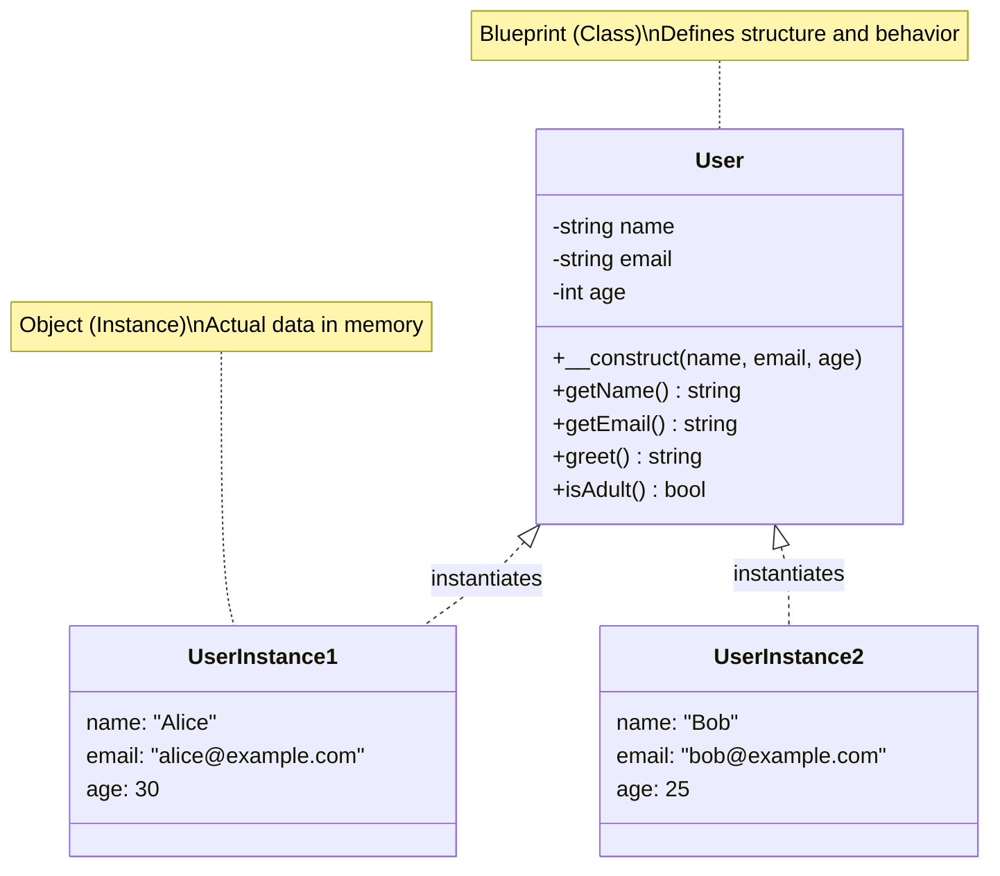

# Chapter 08: Introduction to Object-Oriented Programming

## Overview

Until now, we've been writing code in a **procedural** way: a series of steps and functions that operate on data. This is great for simple scripts, but as applications grow, it can become disorganized. Data and the functions that operate on that data are separate, and it can be hard to manage the relationships between them.

**Object-Oriented Programming (OOP)** is a powerful paradigm that solves this problem. It allows us to bundle data and the functions that work on that data together into a single unit called an **object**. This helps us model real-world things (like a User, a Product, or a BlogPost) in a clean, reusable, and intuitive way.

This chapter is your first step into this new world. You'll build working examples and see the immediate benefits of OOP. By the end, you'll have created multiple classes with proper encapsulation, and you'll understand why virtually all modern PHP frameworks are built around these principles.

## Prerequisites

- PHP 8.4 installed and accessible from your command line
- Completion of Chapter 07 (String Manipulation) or equivalent understanding of functions
- A text editor
- Familiarity with arrays and functions
- Estimated time: **25-30 minutes**

## What You'll Build

By the end of this chapter, you will have created:

- A `User` class that models user data and behavior
- Multiple user objects with independent state
- A constructor method for clean initialization
- Private properties with getter/setter methods (encapsulation)
- Modern PHP 8.4 code using constructor property promotion and type declarations
- A `Database` class demonstrating static properties, methods, and constants
- Practical examples of factory methods and configuration classes
- Working exercises: `Car`, `BankAccount`, `Product`, and `Logger` classes

All examples will be working PHP scripts you can run immediately.

## Quick Start

Want to see OOP in action right away? Create this file and run it:

```php
<?php
// filename: quick-user.php

class User
{
    public function __construct(
        private string $name,
        private string $email
    ) {}

    public function greet(): string
    {
        return "Hello, " . $this->name;
    }

    public function getName(): string
    {
        return $this->name;
    }
}

$user = new User('Dale', 'dale@example.com');
echo $user->greet() . PHP_EOL;
echo "Name: " . $user->getName() . PHP_EOL;
```

```bash
# Run it
php quick-user.php
```

**Expected output:**

```
Hello, Dale
Name: Dale
```

This compact example uses PHP 8.4's constructor property promotion, which we'll explain below. Now let's build this understanding step by step.

## Objectives

- Understand the core concept of OOP: bundling data and behavior together.
- Know the difference between a **class** (a blueprint) and an **object** (an instance).
- Define a class with **properties** (data) and **methods** (behavior).
- Instantiate objects from a class using the `new` keyword.
- Use the special `__construct` method to initialize an object's state.
- Control access to properties and methods with visibility keywords (`public`, `private`).
- Use modern PHP 8.4 features like constructor property promotion and type declarations.
- Understand **static** properties, methods, and class constants.

## OOP Concepts: Visual Overview

Here's how classes, objects, and visibility work together:



**Key Concepts:**

- `-` (minus) = `private` properties (only accessible within the class)
- `+` (plus) = `public` methods (accessible from anywhere)
- The class is a template; objects are specific instances with actual data

## Step 1: From Associative Array to Object (~5 min)

**Goal**: Transform procedural array-based code into an object-oriented class structure.

In the past, we've used associative arrays to represent structured data, like a user:

```php
<?php
// filename: old-way.php
// The old procedural approach

$user = [
    'name' => 'Dale',
    'email' => 'dale@example.com'
];

function greet_user($user) {
    return "Hello, " . $user['name'];
}

echo greet_user($user);
```

This works, but the user's data (`$user` array) and the behavior related to it (`greet_user` function) are separate. OOP brings them together.

### Actions

1.  **Create a new file** called `oop-step1.php`.

2.  **Define your first class** using this structure:

```php
<?php
// filename: oop-step1.php

class User
{
    // Properties are the data associated with the class.
    // They are like variables that belong to the class.
    public $name;
    public $email;

    // Methods are the behavior.
    // They are like functions that belong to the class.
    public function greet()
    {
        // Inside a method, we use the special variable `$this`
        // to refer to the current object.
        return "Hello, " . $this->name;
    }
}

// Create and use a user object
$user = new User();
$user->name = 'Dale';
$user->email = 'dale@example.com';

echo $user->greet() . PHP_EOL;
```

3.  **Run the script**:

```bash
php oop-step1.php
```

### Expected Result

```
Hello, Dale
```

### Why This Works

A **class** is a blueprint that defines structure and behavior. Class names use `PascalCase` by convention. The `$this` pseudo-variable always refers to the current object instance, allowing methods to access the object's own properties using the `->` operator.

## Step 2: Creating Objects (Instantiation) (~3 min)

**Goal**: Create multiple independent object instances from a single class blueprint.

Now that we have the `User` blueprint, we can create individual **objects** from it. This process is called **instantiation**. Each object is an independent instance of the class with its own set of property values.

### Actions

1.  **Create a new file** called `oop-step2.php`.

2.  **Create multiple objects** from the same class:

```php
<?php
// filename: oop-step2.php

class User
{
    public $name;
    public $email;

    public function greet()
    {
        return "Hello, " . $this->name;
    }
}

// Create a new object (an instance of the User class)
$user1 = new User();
$user1->name = 'Dale';
$user1->email = 'dale@example.com';

// Create a second, independent object
$user2 = new User();
$user2->name = 'Alice';
$user2->email = 'alice@example.com';

// Each object maintains its own state
echo $user1->greet() . PHP_EOL;
echo $user2->greet() . PHP_EOL;

// Prove they are independent
$user1->name = 'Dale Hurley';
echo $user1->greet() . PHP_EOL;
echo $user2->greet() . PHP_EOL; // Alice hasn't changed
```

3.  **Run the script**:

```bash
php oop-step2.php
```

### Expected Result

```
Hello, Dale
Hello, Alice
Hello, Dale Hurley
Hello, Alice
```

### Why This Works

The `new` keyword creates a brand-new instance of the class in memory. Each object has its own copy of the properties, so changing `$user1->name` doesn't affect `$user2->name`. The object operator `->` accesses properties and calls methods on a specific object instance.

## Step 3: Initializing Objects with a Constructor (~4 min)

**Goal**: Use a constructor to initialize object properties automatically upon instantiation.

Setting each property manually after creating an object is tedious. A **constructor** is a special method that is called automatically when you create a new object, allowing you to initialize its state right away.

In PHP, the constructor method is always named `__construct`.

### Actions

1.  **Create a new file** called `oop-step3.php`.

2.  **Add a constructor** to your class:

```php
<?php
// filename: oop-step3.php

class User
{
    public $name;
    public $email;

    // This method is called automatically when we use `new User()`
    public function __construct($name, $email)
    {
        $this->name = $name;
        $this->email = $email;
        echo "A new user named '$name' has been created." . PHP_EOL;
    }

    public function greet()
    {
        return "Hello, " . $this->name;
    }
}

// Now we can pass the initial values directly when creating the object
$user1 = new User('Dale', 'dale@example.com');
echo $user1->greet() . PHP_EOL;

$user2 = new User('Alice', 'alice@example.com');
echo $user2->greet() . PHP_EOL;
```

3.  **Run the script**:

```bash
php oop-step3.php
```

### Expected Result

```
A new user named 'Dale' has been created.
Hello, Dale
A new user named 'Alice' has been created.
Hello, Alice
```

### Why This Works

The `__construct` method is a "magic method" (indicated by the double underscore prefix) that PHP calls automatically during instantiation. When you write `new User('Dale', 'dale@example.com')`, PHP creates the object and immediately calls `__construct` with those arguments, eliminating manual property assignment.

## Step 4: Controlling Access with Visibility (~5 min)

**Goal**: Protect object properties using visibility keywords and encapsulation principles.

Right now, we can read and change the `$name` of a user from anywhere (`$user1->name = 'Bob';`). This isn't always desirable. You might want to protect certain properties from being changed accidentally or enforce validation rules.

**Visibility** keywords control where properties and methods can be accessed from:

- `public`: Can be accessed from anywhere (outside the class and inside it).
- `private`: Can **only** be accessed from within the class itself.
- `protected`: Can be accessed from within the class and its subclasses (we'll cover this in the next chapter on inheritance).

Let's protect our properties by making them `private` and provide `public` methods to access them. This is a core OOP concept called **encapsulation**.

### Actions

1.  **Create a new file** called `oop-step4.php`.

2.  **Add private properties and getter/setter methods**:

```php
<?php
// filename: oop-step4.php

class User
{
    private $name;
    private $email;

    public function __construct($name, $email)
    {
        // We can still access private properties from within the class
        $this->name = $name;
        $this->email = $email;
    }

    // A public "getter" method to allow controlled read-only access
    public function getName()
    {
        return $this->name;
    }

    public function getEmail()
    {
        return $this->email;
    }

    // A public "setter" that allows changes with validation
    public function setName($name)
    {
        // Add validation logic before setting
        if (empty(trim($name))) {
            echo "Error: Name cannot be empty." . PHP_EOL;
            return;
        }
        $this->name = $name;
        echo "Name updated successfully." . PHP_EOL;
    }
}

$user1 = new User('Dale', 'dale@example.com');

// This is the correct way to access private properties
echo $user1->getName() . PHP_EOL;
echo $user1->getEmail() . PHP_EOL;

// Update the name through the setter
$user1->setName('Dale Hurley');
echo $user1->getName() . PHP_EOL;

// Try to set an empty name (validation will prevent it)
$user1->setName('   ');
echo $user1->getName() . PHP_EOL; // Still "Dale Hurley"
```

3.  **Run the script**:

```bash
php oop-step4.php
```

### Expected Result

```
Dale
dale@example.com
Name updated successfully.
Dale Hurley
Error: Name cannot be empty.
Dale Hurley
```

### Why This Works

The `private` keyword hides properties from external access, forcing interactions through public methods. This lets you add validation, logging, or other business logic whenever a property is read or written. If you tried to access `$user1->name` directly, PHP would throw a fatal error.

### Validation Check

Try adding this line to your script to see the error:

```php
<?php
// Add this to the bottom of oop-step4.php
echo $user1->name; // Fatal error: Cannot access private property
```

You'll see:

```
Fatal error: Uncaught Error: Cannot access private property User::$name
```

## Step 5: Modern PHP 8.4 Features (~4 min)

**Goal**: Learn PHP 8.4's constructor property promotion and typed properties for cleaner, more robust code.

PHP 8.4 offers powerful features that make OOP code more concise and type-safe. Let's modernize our `User` class.

### Constructor Property Promotion

Instead of declaring properties separately and then assigning them in the constructor, you can do both at once:

### Actions

1.  **Create a new file** called `oop-modern.php`.

2.  **Use constructor property promotion and type declarations**:

```php
<?php
// filename: oop-modern.php

class User
{
    // Constructor property promotion: declare and initialize in one step
    // Add type declarations for better safety
    public function __construct(
        private string $name,
        private string $email,
        private int $age = 18  // Default value
    ) {
        // The properties are automatically created and assigned!
        // We can still add validation or other logic here if needed
        if ($age < 0 || $age > 150) {
            throw new InvalidArgumentException("Age must be between 0 and 150.");
        }
    }

    public function getName(): string
    {
        return $this->name;
    }

    public function getEmail(): string
    {
        return $this->email;
    }

    public function getAge(): int
    {
        return $this->age;
    }

    public function greet(): string
    {
        return "Hello, I'm {$this->name}, {$this->age} years old.";
    }

    // Method to demonstrate business logic
    public function isAdult(): bool
    {
        return $this->age >= 18;
    }
}

// Create users with the modern syntax
$user1 = new User('Dale', 'dale@example.com', 35);
echo $user1->greet() . PHP_EOL;
echo "Adult? " . ($user1->isAdult() ? 'Yes' : 'No') . PHP_EOL;

// Using default age
$user2 = new User('Alice', 'alice@example.com');
echo $user2->greet() . PHP_EOL;
echo "Adult? " . ($user2->isAdult() ? 'Yes' : 'No') . PHP_EOL;

// Try to create an invalid user (uncomment to see the error)
// $user3 = new User('Bob', 'bob@example.com', 200);
```

3.  **Run the script**:

```bash
php oop-modern.php
```

### Expected Result

```
Hello, I'm Dale, 35 years old.
Adult? Yes
Hello, I'm Alice, 18 years old.
Adult? Yes
```

### Why This Works

**Constructor property promotion** (PHP 8.0+) eliminates boilerplate by combining property declaration, visibility, and assignment in the constructor signature. **Type declarations** ensure that properties can only hold values of the specified type, catching bugs early. PHP 8.4 fully supports these features with additional refinements.

### Benefits of This Approach

- **Less code**: No separate property declarations needed
- **Type safety**: PHP enforces types at runtime
- **Clearer intent**: The constructor signature shows exactly what data the object needs
- **Better IDE support**: Editors can provide better autocomplete and error detection

::: tip
Modern PHP frameworks like Laravel and Symfony use this pattern extensively. Learning it now will make framework code much easier to read.
:::

## Step 6: Static Properties, Methods, and Constants (~5 min)

**Goal**: Understand class-level members that don't require object instantiation.

So far, every property and method we've worked with belongs to an **object instance**. But sometimes you want data or behavior that belongs to the **class itself**, not to any particular instance. This is where **static** members and **class constants** come in.

### Class Constants

Constants are values that never change and belong to the class, not instances. They're perfect for fixed configuration values or status codes.

### Static Properties and Methods

Static members belong to the class itself. They're shared across all instances and can be accessed without creating an object.

### Actions

1.  **Create a new file** called `oop-static.php`.

2.  **Use static members and constants**:

```php
<?php
// filename: oop-static.php

class Database
{
    // Class constant - always accessible, never changes
    public const HOST = 'localhost';
    public const PORT = 3306;

    // Static property - shared across all instances
    private static int $connectionCount = 0;

    // Instance property - unique per object
    private string $name;

    public function __construct(string $name)
    {
        $this->name = $name;
        // Increment the shared counter
        self::$connectionCount++;
    }

    // Static method - can be called without an object
    public static function getConnectionCount(): int
    {
        return self::$connectionCount;
    }

    // Static method using constants
    public static function getDefaultDSN(): string
    {
        // Use self:: to access class constants and static members
        return self::HOST . ':' . self::PORT;
    }

    public function getName(): string
    {
        return $this->name;
    }
}

// Access constants without creating an object
echo "Database host: " . Database::HOST . PHP_EOL;
echo "Default DSN: " . Database::getDefaultDSN() . PHP_EOL;

// Create instances - each increments the static counter
$db1 = new Database('users_db');
$db2 = new Database('products_db');
$db3 = new Database('orders_db');

// Static method shows the shared count
echo "Total connections: " . Database::getConnectionCount() . PHP_EOL;

// Each instance has its own name
echo "DB1 name: " . $db1->getName() . PHP_EOL;
echo "DB2 name: " . $db2->getName() . PHP_EOL;
```

3.  **Run the script**:

```bash
php oop-static.php
```

### Expected Result

```
Database host: localhost
Default DSN: localhost:3306
Total connections: 3
DB1 name: users_db
DB2 name: products_db
```

### Why This Works

- **Class constants** (`const`) are accessed with `ClassName::CONSTANT_NAME` and never change
- **Static properties** belong to the class, not instances—there's only one `$connectionCount` shared by all `Database` objects
- **Static methods** can be called without creating an object: `Database::getConnectionCount()`
- Inside a class, use `self::` to access static members and constants
- Static members can't access instance properties (like `$this->name`) because they don't belong to any specific object

### Real-World Use Cases

**1. Configuration Values:**

```php
class Config
{
    public const APP_NAME = 'My Application';
    public const VERSION = '1.0.0';
    public const DEBUG_MODE = true;
}

echo Config::APP_NAME; // No object needed
```

**2. Factory Methods:**

```php
class User
{
    public function __construct(
        private string $name,
        private string $email
    ) {}

    // Static factory method
    public static function createFromArray(array $data): self
    {
        return new self($data['name'], $data['email']);
    }
}

$user = User::createFromArray(['name' => 'Dale', 'email' => 'dale@example.com']);
```

**3. Counters and Shared State:**

```php
class RequestLogger
{
    private static int $requestCount = 0;

    public static function logRequest(): void
    {
        self::$requestCount++;
        echo "Request #" . self::$requestCount . PHP_EOL;
    }
}

RequestLogger::logRequest(); // Request #1
RequestLogger::logRequest(); // Request #2
RequestLogger::logRequest(); // Request #3
```

**4. Status Enumerations:**

```php
class OrderStatus
{
    public const PENDING = 'pending';
    public const PROCESSING = 'processing';
    public const SHIPPED = 'shipped';
    public const DELIVERED = 'delivered';
    public const CANCELLED = 'cancelled';
}

$order->setStatus(OrderStatus::SHIPPED); // Type-safe, autocomplete-friendly
```

### The Difference: `$this->` vs `self::`

- `$this->property` - Access instance property (unique per object)
- `$this->method()` - Call instance method (requires an object)
- `self::$staticProperty` - Access static property (shared by all)
- `self::method()` - Call static method (no object needed)
- `self::CONSTANT` - Access class constant (never changes)

::: tip
In modern PHP, you'll often see static methods used as "named constructors" (factory methods) that provide convenient ways to create objects, like `DateTime::createFromFormat()` or `Carbon::parse()`.
:::

::: warning
Be careful with static properties! Because they're shared across all instances, they can introduce unexpected behavior if you're not mindful. Prefer instance properties unless you specifically need class-level state.
:::

## Step 7: PHP 8.4 Modern Features (~6 min)

**Goal**: Learn cutting-edge PHP 8.4 features for cleaner, more maintainable code.

PHP 8.4 introduces powerful new features that make OOP code even more elegant. Let's explore property hooks and asymmetric visibility—two features that eliminate boilerplate and make your intent crystal clear.

### Property Hooks

Property hooks provide a clean alternative to traditional getter and setter methods. Instead of writing separate `getX()` and `setX()` methods, you can add behavior directly to property access.

1.  **Create a new file** called `oop-property-hooks.php`.

2.  **Basic Property Hooks Example**:

```php
<?php

declare(strict_types=1);

class User
{
    // Set hook: automatically normalize email to lowercase
    public string $email {
        set => strtolower($value);
    }

    // Set hook: capitalize first name
    public string $firstName {
        set => ucfirst($value);
    }

    public function __construct(string $email, string $firstName)
    {
        $this->email = $email;         // Triggers set hook
        $this->firstName = $firstName; // Triggers set hook
    }
}

$user = new User('JOHN.DOE@EXAMPLE.COM', 'john');
echo "Email: " . $user->email . PHP_EOL;          // john.doe@example.com
echo "First Name: " . $user->firstName . PHP_EOL; // John
```

3.  **Computed Properties with Get Hooks**:

```php
<?php

declare(strict_types=1);

class Product
{
    public string $name;
    public float $price;
    public float $taxRate = 0.08;

    // Computed property - calculated on each access
    public float $priceWithTax {
        get => $this->price * (1 + $this->taxRate);
    }

    public function __construct(string $name, float $price)
    {
        $this->name = $name;
        $this->price = $price;
    }
}

$product = new Product('Laptop', 999.99);
echo "Base Price: $" . $product->price . PHP_EOL;
echo "Price with Tax: $" . number_format($product->priceWithTax, 2) . PHP_EOL;
// No setter needed - priceWithTax is automatically calculated!
```

4.  **Combined Get and Set Hooks**:

```php
<?php

declare(strict_types=1);

class Temperature
{
    private float $celsius = 0;

    // Expose as Fahrenheit, store as Celsius
    public float $fahrenheit {
        get => ($this->celsius * 9/5) + 32;
        set => $this->celsius = ($value - 32) * 5/9;
    }

    public function getCelsius(): float
    {
        return $this->celsius;
    }
}

$temp = new Temperature();
$temp->fahrenheit = 68; // Set in Fahrenheit
echo "Stored as: " . $temp->getCelsius() . "°C" . PHP_EOL;  // 20°C
echo "Read as: " . $temp->fahrenheit . "°F" . PHP_EOL;       // 68°F
```

**Why it works**: Property hooks intercept property access (`get`) and modification (`set`). The `$value` variable in a set hook contains the value being assigned. Get hooks compute values on-the-fly without needing separate storage.

**Benefits**:

- Cleaner syntax than traditional `getX()` / `setX()` methods
- Automatic validation and transformation
- Computed properties without manual calculation methods
- Reduces boilerplate code significantly

### Asymmetric Visibility

Asymmetric visibility allows you to specify different access levels for reading and writing a property. The most common pattern is `public private(set)`, which means "anyone can read, only the class can write."

1.  **Create a new file** called `oop-asymmetric-visibility.php`.

2.  **Immutable Properties Example**:

```php
<?php

declare(strict_types=1);

class Order
{
    // Public for reading, private for writing
    public private(set) string $id;
    public private(set) DateTime $createdAt;

    public string $customerName; // Fully public
    public float $total;         // Fully public

    public function __construct(string $customerName, float $total)
    {
        // Can set within the class
        $this->id = uniqid('ORD_');
        $this->createdAt = new DateTime();

        $this->customerName = $customerName;
        $this->total = $total;
    }
}

$order = new Order('Alice Johnson', 99.99);

// ✓ Can read
echo "Order ID: " . $order->id . PHP_EOL;
echo "Created: " . $order->createdAt->format('Y-m-d H:i:s') . PHP_EOL;

// ✗ Cannot write from outside
// $order->id = 'ORD_123';              // Error!
// $order->createdAt = new DateTime();  // Error!

// ✓ Can still modify public properties
$order->customerName = 'Bob Smith';
```

3.  **Controlled State Example**:

```php
<?php

declare(strict_types=1);

class ShoppingCart
{
    private array $items = [];

    // Total is publicly readable but only the class can update it
    public private(set) float $total = 0.0;

    public function addItem(string $name, float $price): void
    {
        $this->items[] = ['name' => $name, 'price' => $price];
        $this->total += $price; // Only the class can modify total
    }

    public function removeLastItem(): void
    {
        if (!empty($this->items)) {
            $item = array_pop($this->items);
            $this->total -= $item['price'];
        }
    }
}

$cart = new ShoppingCart();
$cart->addItem('Book', 29.99);
$cart->addItem('Pen', 5.99);

echo "Total: $" . $cart->total . PHP_EOL; // ✓ Can read

// $cart->total = 1000000; // ✗ Error! Can't manipulate total directly
```

**Why it works**: The `public private(set)` syntax means:

- Reading the property is `public` (accessible everywhere)
- Writing the property is `private` (only accessible within the class)

This enforces immutability without requiring private properties plus public getter methods.

**Common Use Cases**:

- **IDs and unique identifiers**: Set once in constructor, never changed
- **Timestamps**: createdAt, updatedAt automatically managed by the class
- **Computed values**: totals, counts that should only be updated through business logic
- **State flags**: isPublished, isActive controlled by class methods
- **Version numbers**: tracked internally, displayed publicly

**Benefits**:

- Enforces immutability without getter boilerplate
- Clear intent: "readable everywhere, writable only here"
- Prevents accidental property modification
- Reduces API surface area (fewer public methods)

### Comparison: Traditional vs Modern PHP 8.4

**Traditional Approach (Still Valid)**:

```php
class User
{
    private string $email;

    public function __construct(string $email)
    {
        $this->setEmail($email);
    }

    public function getEmail(): string
    {
        return $this->email;
    }

    public function setEmail(string $email): void
    {
        $this->email = strtolower($email);
    }
}
```

**Modern PHP 8.4 with Property Hooks**:

```php
class User
{
    public string $email {
        set => strtolower($value);
    }

    public function __construct(string $email)
    {
        $this->email = $email;
    }
}
```

**Traditional Immutable ID**:

```php
class Order
{
    private string $id;

    public function __construct()
    {
        $this->id = uniqid('ORD_');
    }

    public function getId(): string
    {
        return $this->id;
    }
}
```

**Modern with Asymmetric Visibility**:

```php
class Order
{
    public private(set) string $id;

    public function __construct()
    {
        $this->id = uniqid('ORD_');
    }
    // No getId() needed - access $order->id directly!
}
```

::: tip When to Use Each Feature
**Property Hooks**: Use when you need to transform, validate, or compute values on read/write.

**Asymmetric Visibility**: Use when a value should be set internally but read publicly (IDs, timestamps, computed values).

**Traditional Methods**: Still useful for complex logic, multiple operations, or compatibility with older PHP versions.
:::

::: info Code Examples
Complete, runnable examples of these features are available in:

- [`code/08-oop/property-hooks-basic.php`](/series/php-basics/code/08-oop/property-hooks-basic.php)
- [`code/08-oop/asymmetric-visibility.php`](/series/php-basics/code/08-oop/asymmetric-visibility.php)
  :::

## Troubleshooting

### Error: "Cannot access private property"

**Symptom**: `Fatal error: Uncaught Error: Cannot access private property User::$name`

**Cause**: You tried to access a private property directly from outside the class.

**Solution**: Use public getter/setter methods instead:

```php
// Wrong
echo $user->name;

// Correct
echo $user->getName();
```

### Error: "Too few arguments to function \_\_construct()"

**Symptom**: `ArgumentCountError: Too few arguments to function User::__construct()`

**Cause**: You didn't provide all required constructor parameters.

**Solution**: Check the constructor signature and provide all required arguments:

```php
// Wrong
$user = new User('Dale'); // Missing email parameter

// Correct
$user = new User('Dale', 'dale@example.com');
```

### Error: "Call to undefined method"

**Symptom**: `Fatal error: Uncaught Error: Call to undefined method User::greet()`

**Cause**: You're calling a method that doesn't exist, or you have a typo.

**Solution**: Check your method name spelling and ensure it exists in the class:

```php
// Wrong
$user->greet(); // If method is named "greeting()"

// Correct
$user->greeting(); // Match the actual method name
```

### Type Declaration Error

**Symptom**: `TypeError: User::__construct(): Argument #3 ($age) must be of type int, string given`

**Cause**: You passed the wrong type to a typed parameter.

**Solution**: Ensure you pass the correct type:

```php
// Wrong
$user = new User('Dale', 'dale@example.com', '35'); // String instead of int

// Correct
$user = new User('Dale', 'dale@example.com', 35); // Integer
```

### Notice: "Undefined property"

**Symptom**: `Warning: Undefined property: User::$name`

**Cause**: You're trying to use a property that wasn't initialized.

**Solution**: Always initialize all properties in the constructor:

```php
public function __construct($name) {
    $this->name = $name;  // Don't forget this!
}
```

### Error: "Using $this when not in object context"

**Symptom**: `Fatal error: Uncaught Error: Using $this when not in object context`

**Cause**: You tried to use `$this` inside a static method. Static methods don't belong to any object instance.

**Solution**: Use `self::` instead of `$this->` for static members:

```php
// Wrong
public static function getCount() {
    return $this->count; // Error!
}

// Correct
public static function getCount() {
    return self::$count;
}
```

### Error: "Cannot access non-static property"

**Symptom**: `Fatal error: Uncaught Error: Cannot access non-static property User::$name in static context`

**Cause**: You tried to access an instance property from a static method.

**Solution**: Static methods can only access static members. Either:

- Make the property static: `private static string $name;`
- Or don't call it from a static method

```php
class Example {
    private string $name;
    private static int $count = 0;

    // This works - static method accessing static property
    public static function getCount(): int {
        return self::$count;
    }

    // This won't work - static method can't access instance property
    public static function getName(): string {
        return $this->name; // ERROR!
    }
}
```

## Exercises

### Exercise 1: Create a `Car` Class

**Goal**: Model a real-world object with proper encapsulation.

Create a file called `car-exercise.php` and implement:

- A `Car` class with `private` properties for `make`, `model`, and `year`
- Use constructor property promotion with type declarations (modern PHP 8.4 style)
- Add a `public` method called `displayInfo()` that returns a string like "This car is a 2023 Ford Mustang."
- Add a `public` method called `getAge()` that calculates how old the car is based on the current year
- Instantiate two different `Car` objects and display their information

**Validation**: Your output should look like:

```
This car is a 2023 Ford Mustang.
Car age: 2 years old

This car is a 2010 Toyota Camry.
Car age: 15 years old
```

### Exercise 2: Create a `BankAccount` Class

**Goal**: Implement business logic protection using encapsulation.

Create a file called `bank-exercise.php` and implement:

- A `BankAccount` class with a `private` property for `balance` (use `float` type)
- A `private` property for `accountNumber` (use `string` type)
- Use constructor property promotion to initialize both properties
- Add a `public` method `getBalance()` that returns the current balance formatted as currency
- Add a `public` method `deposit(float $amount)` that adds to the balance (validate that amount is positive)
- Add a `public` method `withdraw(float $amount)` that subtracts from the balance, but only if there are sufficient funds
- If withdrawal fails, display an error message

**Validation**: Test your class with this code:

```php
$account = new BankAccount('ACC-12345', 1000.00);
echo "Initial balance: " . $account->getBalance() . PHP_EOL;

$account->deposit(500.00);
echo "After deposit: " . $account->getBalance() . PHP_EOL;

$account->withdraw(200.00);
echo "After withdrawal: " . $account->getBalance() . PHP_EOL;

$account->withdraw(2000.00); // Should fail
echo "Final balance: " . $account->getBalance() . PHP_EOL;
```

Expected output:

```
Initial balance: $1000.00
After deposit: $1500.00
After withdrawal: $1300.00
Error: Insufficient funds. Available: $1300.00
Final balance: $1300.00
```

### Exercise 3: Create a `Product` Class (Challenge)

**Goal**: Combine multiple OOP concepts in a practical scenario.

Create a `Product` class with:

- Private properties: `name`, `price`, `quantity`
- Constructor property promotion with type declarations
- A method `applyDiscount(int $percentage)` that reduces the price
- A method `restock(int $amount)` that increases quantity
- A method `sell(int $amount)` that decreases quantity (with stock validation)
- A method `getTotalValue()` that returns `price * quantity`
- Proper input validation on all methods

### Exercise 4: Create a `Logger` Class with Static Methods

**Goal**: Practice using static properties, methods, and class constants.

Create a file called `logger-exercise.php` and implement:

- A `Logger` class with class constants for log levels:
  - `const DEBUG = 'debug'`
  - `const INFO = 'info'`
  - `const WARNING = 'warning'`
  - `const ERROR = 'error'`
- A private static property `$logs` (array) to store all log messages
- A private static property `$logCount` (int) to track total number of logs
- A static method `log(string $level, string $message)` that:
  - Adds the message to `$logs` array with timestamp
  - Increments `$logCount`
  - Echoes the formatted log message
- A static method `getLogCount()` that returns the total count
- A static method `getLogs()` that returns all logs
- A static method `clearLogs()` that empties the logs array

**Validation**: Test your class with this code:

```php
Logger::log(Logger::INFO, 'Application started');
Logger::log(Logger::DEBUG, 'Loading configuration');
Logger::log(Logger::WARNING, 'Deprecated function used');
Logger::log(Logger::ERROR, 'Database connection failed');

echo "\nTotal logs: " . Logger::getLogCount() . PHP_EOL;
echo "\nAll logs:\n";
print_r(Logger::getLogs());
```

Expected output (timestamps will vary):

```
[INFO] Application started
[DEBUG] Loading configuration
[WARNING] Deprecated function used
[ERROR] Database connection failed

Total logs: 4

All logs:
Array
(
    [0] => [2024-01-15 14:30:22] [INFO] Application started
    [1] => [2024-01-15 14:30:22] [DEBUG] Loading configuration
    [2] => [2024-01-15 14:30:22] [WARNING] Deprecated function used
    [3] => [2024-01-15 14:30:22] [ERROR] Database connection failed
)
```

## Wrap-up

Congratulations! You've just learned the foundational concepts of Object-Oriented Programming, one of the most important paradigms in modern software development. You now understand:

- How to create **classes** (blueprints) with **properties** (data) and **methods** (behavior)
- How to **instantiate objects** (actual instances) from those blueprints
- How **constructors** initialize object state automatically
- How **visibility keywords** protect data and enforce encapsulation
- Modern PHP 8.4 features like **constructor property promotion** and **type declarations**
- How **static** properties and methods belong to the class itself, not instances
- How **class constants** provide unchanging configuration values

These concepts are the foundation of virtually all modern PHP frameworks (Laravel, Symfony, WordPress plugins) and professional PHP development. Every time you use `$request->get()` or `$user->save()` in a framework, you're working with objects and methods. When you see `Config::get('app.name')` or `Carbon::now()`, you're using static methods.

### What You've Achieved

You can now model real-world concepts in code, bundle data with behavior, and protect object state from unwanted modifications. This is a massive leap from procedural programming.

### Next Steps

In **Chapter 09**, we'll build on this foundation by learning about:

- **Inheritance**: How classes can extend other classes to share behavior
- **Abstract classes**: Templates that enforce structure in child classes
- **Interfaces**: Contracts that guarantee specific methods exist
- **Polymorphism**: How different objects can be used interchangeably

These advanced OOP concepts will enable you to build flexible, maintainable applications.

### Knowledge Check

Test your understanding of Object-Oriented Programming concepts:

<Quiz 
  title="Chapter 08 Quiz: OOP Fundamentals"
  :questions="[
    {
      question: 'What is the difference between a class and an object?',
      options: [
        { text: 'A class is a blueprint, an object is an instance', correct: true, explanation: 'Classes define structure and behavior; objects are specific instances with actual data.' },
        { text: 'Classes are faster than objects', correct: false, explanation: 'Classes and objects serve different purposes; speed isn\'t the distinction.' },
        { text: 'Objects can\'t have methods', correct: false, explanation: 'Objects inherit all methods from their class.' },
        { text: 'There is no difference', correct: false, explanation: 'Classes and objects are fundamentally different concepts.' }
      ]
    },
    {
      question: 'What does the `private` visibility modifier do?',
      options: [
        { text: 'Makes properties/methods accessible only within the class', correct: true, explanation: 'Private members cannot be accessed from outside the class or by child classes.' },
        { text: 'Makes properties invisible in var_dump()', correct: false, explanation: 'var_dump() shows all properties regardless of visibility.' },
        { text: 'Improves performance', correct: false, explanation: 'Visibility is about encapsulation, not performance.' },
        { text: 'Prevents the property from being serialized', correct: false, explanation: 'Private properties are still serialized by default.' }
      ]
    },
    {
      question: 'What is the purpose of the `__construct()` method?',
      options: [
        { text: 'To initialize object state when created', correct: true, explanation: 'Constructors run automatically when you use `new ClassName()`.' },
        { text: 'To destroy objects when done', correct: false, explanation: 'That\'s __destruct(), not __construct().' },
        { text: 'To create static methods', correct: false, explanation: 'Constructors are instance methods, not static methods.' },
        { text: 'To define class constants', correct: false, explanation: 'Constants are defined separately, not in constructors.' }
      ]
    },
    {
      question: 'What is property hooks in PHP 8.4?',
      options: [
        { text: 'A way to add behavior to property access and modification', correct: true, explanation: 'Property hooks let you add get/set logic directly on properties.' },
        { text: 'A debugging feature', correct: false, explanation: 'Property hooks are for adding business logic, not debugging.' },
        { text: 'A way to make properties faster', correct: false, explanation: 'They add logic, which makes them slightly slower, but more maintainable.' },
        { text: 'Required for all properties in PHP 8.4', correct: false, explanation: 'Property hooks are optional and used when you need custom behavior.' }
      ]
    },
    {
      question: 'What does `$this` refer to inside a class method?',
      options: [
        { text: 'The current object instance', correct: true, explanation: '$this is a reference to the object the method was called on.' },
        { text: 'The class itself', correct: false, explanation: 'Use self:: or ClassName:: to reference the class.' },
        { text: 'The parent class', correct: false, explanation: 'Use parent:: to reference the parent class.' },
        { text: 'All instances of the class', correct: false, explanation: '$this only refers to the specific object instance.' }
      ]
    }
  ]"
/>

## Further Reading

- [PHP Manual: Classes and Objects](https://www.php.net/manual/en/language.oop5.php)
- [PHP 8.4 Release Notes](https://www.php.net/releases/8.4/) — See all the latest OOP features
- [Constructor Property Promotion](https://www.php.net/manual/en/language.oop5.decon.php#language.oop5.decon.constructor.promotion)
- [SOLID Principles](https://en.wikipedia.org/wiki/SOLID) — Design principles for OOP (we'll cover these concepts gradually)
