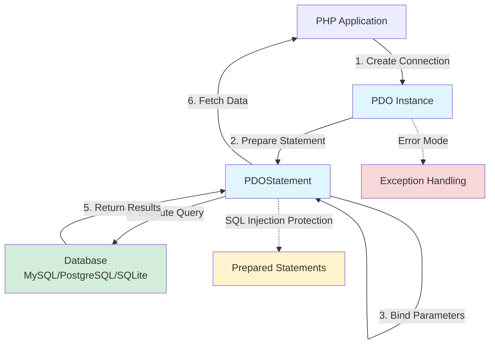

# Chapter 14: Interacting with Databases using PDO

## Overview

Very few web applications can exist without a database. A database provides a structured, efficient, and reliable way to store, retrieve, and manage large amounts of data—user accounts, blog posts, product inventories, and so much more.

While there are many different databases (MySQL, PostgreSQL, SQLite, etc.), PHP provides a consistent, object-oriented interface for talking to them called **PDO** (PHP Data Objects). The beauty of PDO is that you can write your database code once, and it will work with any supported database with only minor changes to the connection details.

In this chapter, we'll learn the fundamentals of using PDO to connect to a database, run queries securely, and fetch data. We'll use **SQLite**, a simple, serverless, file-based database that's perfect for learning and development.

## Prerequisites

- PHP 8.4 or higher installed with PDO and SQLite extensions enabled (usually enabled by default)
- A text editor or IDE
- Familiarity with basic SQL concepts (CREATE, INSERT, SELECT, UPDATE, DELETE) is helpful but not required
- Completion of previous chapters, especially Chapter 13 (Working with the Filesystem)
- Estimated time: 45–60 minutes (or 5–10 minutes for Quick Start only)

**Check your PDO and SQLite support:**

```bash
# Check if PDO and SQLite are available
php -m | grep -i pdo
php -m | grep -i sqlite
```

You should see `PDO` and `pdo_sqlite` in the output. If not, you may need to enable these extensions in your `php.ini` file.

## What You'll Build

By the end of this chapter, you'll have created:

- A working PDO connection to a SQLite database with proper error handling
- Multiple tables demonstrating different database concepts (`posts`, `users`, `products`, `logs`)
- Secure prepared statements that prevent SQL injection attacks
- Examples of all CRUD operations (Create, Read, Update, Delete)
- Multiple ways to fetch data (all rows, single row, single column, as objects)
- Transaction examples showing commit and rollback behavior
- NULL value handling and queries

## PDO Architecture: Visual Overview

Here's how PDO connects your PHP application to databases:



**Key Flow:**

1. **Connect** to database using PDO constructor
2. **Prepare** SQL statement (with placeholders for safety)
3. **Bind** parameters to prevent SQL injection
4. **Execute** the query against the database
5. **Fetch** results in various formats
6. Handle errors via exceptions

- Batch insert operations with performance comparisons
- A complete, production-ready blog system class with all best practices
- Eight runnable example files covering all concepts

## Quick Start

If you want to jump straight in and see database operations in action, follow these steps:

```bash
# 1. Create a project directory
mkdir pdo-demo && cd pdo-demo

# 2. Create a data directory for the database
mkdir data

# 3. Create the main script
touch database.php
```

Copy this complete working example into `database.php`:

```php
<?php

// Create the database connection
$dbPath = __DIR__ . '/data/database.sqlite';
$dsn = "sqlite:$dbPath";

try {
    $pdo = new PDO($dsn);
    $pdo->setAttribute(PDO::ATTR_ERRMODE, PDO::ERRMODE_EXCEPTION);
    $pdo->setAttribute(PDO::ATTR_DEFAULT_FETCH_MODE, PDO::FETCH_ASSOC);

    // Create table
    $pdo->exec("
        CREATE TABLE IF NOT EXISTS posts (
            id INTEGER PRIMARY KEY AUTOINCREMENT,
            title TEXT NOT NULL,
            content TEXT NOT NULL
        )
    ");

    // Insert with prepared statement
    $stmt = $pdo->prepare("INSERT INTO posts (title, content) VALUES (?, ?)");
    $stmt->execute(["Quick Start Post", "This demonstrates a secure database insert."]);

    // Fetch all posts
    $stmt = $pdo->query("SELECT * FROM posts");
    $posts = $stmt->fetchAll();

    echo "Success! Found " . count($posts) . " post(s).\n";
    print_r($posts);

} catch (PDOException $e) {
    die("Database error: " . $e->getMessage());
}
```

Run it:

```bash
php database.php
```

Expected output:

```
Success! Found 1 post(s).
Array
(
    [0] => Array
        (
            [id] => 1
            [title] => Quick Start Post
            [content] => This demonstrates a secure database insert.
        )
)
```

Now let's break down what's happening step by step.

## Objectives

- Understand the role of PDO and why it's the modern standard for database access in PHP.
- Connect to a SQLite database using PDO.
- Handle connection errors gracefully with try/catch blocks.
- Run `SELECT`, `INSERT`, `UPDATE`, and `DELETE` queries securely.
- Use **prepared statements** to prevent SQL injection attacks.
- Fetch data in multiple ways (all rows, single row, single column, as objects).
- Use transactions to ensure data consistency across multiple operations.
- Retrieve auto-generated IDs with `lastInsertId()`.
- Work with NULL values correctly in database operations.
- Optimize performance with batch insert operations.
- Configure PDO with appropriate attributes for your application.

## Step 1: Connecting to the Database (~5 min)

**Goal:** Establish a secure PDO connection to a SQLite database and verify it works.

First, we need to establish a connection. A PDO connection requires three pieces of information, passed in a string called a DSN (Data Source Name): the database type, the host, and the database name. For SQLite, it's just the database type and the path to the database file.

1.  **Set up the Project Directory Structure**:

    ```bash
    # Create a directory for this chapter's work
    mkdir chapter-14-pdo && cd chapter-14-pdo

    # Create a data directory for the SQLite database
    mkdir data

    # Create the main PHP file
    touch database.php
    ```

2.  **Create the Connection**:
    Add the following code to `database.php`.

    ```php
    <?php

    // The path to our SQLite database file.
    // SQLite will create this file automatically if it doesn't exist.
    $dbPath = __DIR__ . '/data/database.sqlite';

    // The DSN (Data Source Name) for the connection.
    $dsn = "sqlite:$dbPath";

    try {
        // Create a new PDO instance (our connection object)
        $pdo = new PDO($dsn);

        // Set a couple of helpful options
        // 1. Throw exceptions when an error occurs
        $pdo->setAttribute(PDO::ATTR_ERRMODE, PDO::ERRMODE_EXCEPTION);
        // 2. Fetch rows as associative arrays
        $pdo->setAttribute(PDO::ATTR_DEFAULT_FETCH_MODE, PDO::FETCH_ASSOC);

        echo "Connection to the database was successful!" . PHP_EOL;

    } catch (PDOException $e) {
        // If the connection fails, a PDOException is thrown.
        // We catch it and display a friendly error message.
        die("Database connection failed: " . $e->getMessage() . PHP_EOL);
    }
    ```

3.  **Run the Script**:

    ```bash
    php database.php
    ```

**Expected Result:**

```
Connection to the database was successful!
```

You should also see a new file created at `data/database.sqlite`. This is your SQLite database file.

**Why It Works:**

- `__DIR__`: A "magic constant" that always gives the directory of the current file. This is a reliable way to create an absolute path.
- `new PDO($dsn)`: This is where the connection happens. PDO connects to the database specified in the DSN.
- `setAttribute()`: We configure PDO to throw exceptions on error (the modern standard) and to fetch data as associative arrays by default (convenient for working with results).
- `try/catch`: If the connection fails, we catch the `PDOException` and display an error message instead of letting PHP crash.

**Validation:**

```bash
# Check that the database file was created
ls -lh data/database.sqlite
```

You should see a file around 4-8 KB in size.

### Troubleshooting

**Problem:** "could not find driver"

- **Cause:** The PDO SQLite extension is not installed or enabled.
- **Solution:**
  - Check your `php.ini` file and ensure `extension=pdo_sqlite` is uncommented.
  - On Ubuntu/Debian: `sudo apt-get install php-sqlite3`
  - On macOS with Homebrew: SQLite support is usually included by default.
  - Restart your terminal/server after making changes.

**Problem:** "unable to open database file"

- **Cause:** The `data` directory doesn't exist or PHP doesn't have write permissions.
- **Solution:**
  - Run `mkdir data` in your project directory.
  - Check directory permissions: `ls -ld data/` (should show write permissions).
  - On Unix systems, you may need: `chmod 755 data`

**Problem:** Database file isn't created

- **Cause:** Path is incorrect or SQLite can't write to the directory.
- **Solution:**
  - Verify the `data` directory exists in the same location as `database.php`.
  - Try using an absolute path temporarily to debug: `$dbPath = '/full/path/to/your/project/data/database.sqlite';`

## Step 2: Creating a Table and Inserting Data (~6 min)

**Goal:** Create a `posts` table and demonstrate why concatenating variables into SQL is dangerous.

Let's create a `posts` table and insert our first record. Update your `database.php` file to include the table creation and an example of insecure data insertion (which we'll fix in the next step).

```php
<?php

// The path to our SQLite database file.
$dbPath = __DIR__ . '/data/database.sqlite';
$dsn = "sqlite:$dbPath";

try {
    $pdo = new PDO($dsn);
    $pdo->setAttribute(PDO::ATTR_ERRMODE, PDO::ERRMODE_EXCEPTION);
    $pdo->setAttribute(PDO::ATTR_DEFAULT_FETCH_MODE, PDO::FETCH_ASSOC);

    echo "Connection to the database was successful!" . PHP_EOL;

    // Create a table
    // The `exec()` method is used for queries that don't return results.
    $pdo->exec("
        CREATE TABLE IF NOT EXISTS posts (
            id INTEGER PRIMARY KEY AUTOINCREMENT,
            title TEXT NOT NULL,
            content TEXT NOT NULL
        )
    ");

    echo "Table 'posts' created successfully." . PHP_EOL;

    // Insert data
    // This is the WRONG, INSECURE way to do it. We'll fix it next.
    $title = "My First Blog Post";
    $content = "This is the content of my first post.";

    // NEVER build a query by concatenating user input or variables directly.
    // This is vulnerable to SQL Injection.
    $sql = "INSERT INTO posts (title, content) VALUES ('$title', '$content')";
    $pdo->exec($sql);

    echo "A new post was created (using INSECURE method)." . PHP_EOL;

} catch (PDOException $e) {
    die("Database error: " . $e->getMessage() . PHP_EOL);
}
```

**Run it:**

```bash
php database.php
```

**Expected Result:**

```
Connection to the database was successful!
Table 'posts' created successfully.
A new post was created (using INSECURE method).
```

**Why It Works (But Is Dangerous):**

- `CREATE TABLE IF NOT EXISTS`: Creates the table only if it doesn't already exist. The `AUTOINCREMENT` keyword tells SQLite to automatically assign unique, incrementing IDs.
- `exec()`: Executes a SQL statement that doesn't return results (like CREATE, INSERT, UPDATE, DELETE).
- **The danger:** By inserting `$title` and `$content` directly into the SQL string, a malicious user could inject their own SQL code. For example, if `$title` was `'); DROP TABLE posts; --`, they could delete your entire table!

**Note:** We're intentionally showing the insecure method first so you understand _why_ prepared statements are critical. Never use this approach in production code.

## Step 3: The Right Way: Prepared Statements (~6 min)

**Goal:** Use prepared statements to insert data securely, preventing SQL injection attacks.

The code above is dangerous. If `$title` or `$content` came from user input, a malicious user could inject harmful SQL code. The solution is **prepared statements**.

With a prepared statement, you send the SQL query to the database _first_, with placeholders (`?` or named placeholders like `:title`) instead of the actual data. Then, you send the data separately. This makes it impossible for the data to be misinterpreted as SQL code, preventing SQL injection.

**The Process:**

1.  **Prepare the Statement**: Call `prepare()` on the PDO object with your SQL containing placeholders.
2.  **Execute the Statement**: Call `execute()` on the _statement_ object, passing an array of the data that lines up with your placeholders.

Update your `database.php` to use prepared statements:

```php
<?php

$dbPath = __DIR__ . '/data/database.sqlite';
$dsn = "sqlite:$dbPath";

try {
    $pdo = new PDO($dsn);
    $pdo->setAttribute(PDO::ATTR_ERRMODE, PDO::ERRMODE_EXCEPTION);
    $pdo->setAttribute(PDO::ATTR_DEFAULT_FETCH_MODE, PDO::FETCH_ASSOC);

    // Create table
    $pdo->exec("
        CREATE TABLE IF NOT EXISTS posts (
            id INTEGER PRIMARY KEY AUTOINCREMENT,
            title TEXT NOT NULL,
            content TEXT NOT NULL
        )
    ");

    // Method 1: Anonymous placeholders with ?
    $title = "My Second Post";
    $content = "Content for the second post.";

    // 1. Prepare the SQL statement with anonymous placeholders (?)
    $stmt = $pdo->prepare("INSERT INTO posts (title, content) VALUES (?, ?)");

    // 2. Execute the statement with the data
    // The array values must be in the same order as the placeholders
    $stmt->execute([$title, $content]);

    echo "Post created with anonymous placeholders (?)." . PHP_EOL;

    // Method 2: Named placeholders with :name
    $title3 = "My Third Post";
    $content3 = "Content for the third post.";

    $stmt = $pdo->prepare("
        INSERT INTO posts (title, content) VALUES (:post_title, :post_content)
    ");

    // With named placeholders, the array keys must match the placeholder names
    $stmt->execute([
        ':post_title' => $title3,
        ':post_content' => $content3
    ]);

    echo "Post created with named placeholders (:name)." . PHP_EOL;

    // Even if someone tries SQL injection, it's treated as literal text
    $maliciousTitle = "Harmless Title'); DROP TABLE posts; --";
    $stmt = $pdo->prepare("INSERT INTO posts (title, content) VALUES (?, ?)");
    $stmt->execute([$maliciousTitle, "This is safe!"]);

    echo "Even malicious-looking data was inserted safely." . PHP_EOL;

} catch (PDOException $e) {
    die("Database error: " . $e->getMessage() . PHP_EOL);
}
```

**Run it:**

```bash
# First, delete the old database to start fresh
rm data/database.sqlite

# Now run the script
php database.php
```

**Expected Result:**

```
Post created with anonymous placeholders (?).
Post created with named placeholders (:name).
Even malicious-looking data was inserted safely.
```

**Why It Works:**

- **Separation of SQL and Data**: The SQL structure is sent to the database first. Then the data is sent separately and clearly marked as "this is data, not code."
- **No Interpretation**: The database never interprets your data as SQL commands, even if it contains SQL-looking syntax.
- **Anonymous (`?`) vs Named (`:name`) Placeholders**:
  - Anonymous placeholders are simpler for short queries.
  - Named placeholders are clearer for complex queries with many parameters.
  - Choose whichever style you find more readable.

**Validation:**

Let's verify our posts were inserted, including the "malicious" one that was safely escaped:

```bash
# Use the SQLite command-line tool to inspect the database
sqlite3 data/database.sqlite "SELECT id, title FROM posts;"
```

**Expected output:**

```
1|My First Blog Post
2|My Second Post
3|My Third Post
4|Harmless Title'); DROP TABLE posts; --
```

Notice that row 4 contains the SQL injection attempt, but it's stored as harmless text—the table still exists!

## Step 4: Fetching Data (~5 min)

**Goal:** Retrieve data from the database using different fetch methods.

Now that we have data, let's retrieve it. Create a new file called `fetch-demo.php` to explore the different ways to fetch data:

```php
<?php

$dbPath = __DIR__ . '/data/database.sqlite';
$dsn = "sqlite:$dbPath";

try {
    $pdo = new PDO($dsn);
    $pdo->setAttribute(PDO::ATTR_ERRMODE, PDO::ERRMODE_EXCEPTION);
    $pdo->setAttribute(PDO::ATTR_DEFAULT_FETCH_MODE, PDO::FETCH_ASSOC);

    echo "=== Fetching Data Demo ===" . PHP_EOL . PHP_EOL;

    // 1. Fetching ALL rows
    echo "1. Fetching ALL rows:" . PHP_EOL;
    $stmt = $pdo->query("SELECT * FROM posts");
    $allPosts = $stmt->fetchAll(); // Returns an array of all rows

    foreach ($allPosts as $post) {
        echo "  - ID: {$post['id']}, Title: {$post['title']}" . PHP_EOL;
    }
    echo PHP_EOL;

    // 2. Fetching a SINGLE row
    echo "2. Fetching a SINGLE row (ID = 2):" . PHP_EOL;
    $postId = 2;
    $stmt = $pdo->prepare("SELECT * FROM posts WHERE id = ?");
    $stmt->execute([$postId]);
    $singlePost = $stmt->fetch(); // Returns a single row, or false if not found

    if ($singlePost) {
        echo "  - Title: {$singlePost['title']}" . PHP_EOL;
        echo "  - Content: {$singlePost['content']}" . PHP_EOL;
    } else {
        echo "  - Post not found." . PHP_EOL;
    }
    echo PHP_EOL;

    // 3. Fetching a single COLUMN from a row
    echo "3. Fetching a single COLUMN (just the title of ID = 3):" . PHP_EOL;
    $postId = 3;
    $stmt = $pdo->prepare("SELECT title FROM posts WHERE id = ?");
    $stmt->execute([$postId]);
    $postTitle = $stmt->fetchColumn(); // Returns the value of the first column

    if ($postTitle) {
        echo "  - Title: $postTitle" . PHP_EOL;
    } else {
        echo "  - Post not found." . PHP_EOL;
    }
    echo PHP_EOL;

    // 4. Counting rows
    echo "4. Counting total posts:" . PHP_EOL;
    $stmt = $pdo->query("SELECT COUNT(*) FROM posts");
    $count = $stmt->fetchColumn();
    echo "  - Total posts: $count" . PHP_EOL;
    echo PHP_EOL;

    // 5. Checking if a row exists
    echo "5. Checking if a post with ID = 999 exists:" . PHP_EOL;
    $stmt = $pdo->prepare("SELECT * FROM posts WHERE id = ?");
    $stmt->execute([999]);
    $exists = $stmt->fetch();
    echo "  - Exists: " . ($exists ? "Yes" : "No") . PHP_EOL;

} catch (PDOException $e) {
    die("Database error: " . $e->getMessage() . PHP_EOL);
}
```

**Run it:**

```bash
php fetch-demo.php
```

**Expected Result:**

```
=== Fetching Data Demo ===

1. Fetching ALL rows:
  - ID: 1, Title: My Second Post
  - ID: 2, Title: My Third Post
  - ID: 3, Title: Harmless Title'); DROP TABLE posts; --

2. Fetching a SINGLE row (ID = 2):
  - Title: My Third Post
  - Content: Content for the third post.

3. Fetching a single COLUMN (just the title of ID = 3):
  - Title: Harmless Title'); DROP TABLE posts; --

4. Counting total posts:
  - Total posts: 3

5. Checking if a post with ID = 999 exists:
  - Exists: No
```

**Why It Works:**

- `fetchAll()`: Returns all rows as an array of associative arrays. Perfect when you need to work with multiple rows.
- `fetch()`: Returns a single row. Returns `false` if no row is found, so you can check if the result exists.
- `fetchColumn()`: Returns just the value of the first column from the first row. Great for `COUNT()`, `SUM()`, or when you only need one field.
- `query()`: For simple SELECT statements without parameters, you can use `query()` directly.
- `prepare()` + `execute()`: For SELECT statements with parameters, always use prepared statements.

**Tip:** When working with user input (like a post ID from a URL parameter), always use prepared statements, even for SELECT queries. This prevents SQL injection attacks.

### Other Fetch Modes

While we're using `FETCH_ASSOC` (associative arrays), PDO supports other fetch modes:

```php
<?php
// Fetch as objects instead of arrays
$stmt = $pdo->query("SELECT * FROM posts");
$posts = $stmt->fetchAll(PDO::FETCH_OBJ);

foreach ($posts as $post) {
    echo $post->title; // Access as object properties
}

// Fetch into a specific class
class Post {
    public int $id;
    public string $title;
    public string $content;
}

$stmt = $pdo->query("SELECT * FROM posts");
$posts = $stmt->fetchAll(PDO::FETCH_CLASS, 'Post');

// Fetch as numeric arrays (index-based)
$stmt = $pdo->query("SELECT * FROM posts");
$posts = $stmt->fetchAll(PDO::FETCH_NUM);
echo $posts[0][0]; // First row, first column
```

For most use cases, `FETCH_ASSOC` is the most practical choice.

## Step 5: UPDATE and DELETE Operations (~3 min)

**Goal:** Learn how to modify and remove data using prepared statements.

Create a new file called `update-delete-demo.php`:

```php
<?php

$dbPath = __DIR__ . '/data/database.sqlite';
$dsn = "sqlite:$dbPath";

try {
    $pdo = new PDO($dsn);
    $pdo->setAttribute(PDO::ATTR_ERRMODE, PDO::ERRMODE_EXCEPTION);
    $pdo->setAttribute(PDO::ATTR_DEFAULT_FETCH_MODE, PDO::FETCH_ASSOC);

    // UPDATE: Change the title of post with id = 1
    echo "Updating post with ID = 1..." . PHP_EOL;
    $stmt = $pdo->prepare("UPDATE posts SET title = ? WHERE id = ?");
    $stmt->execute(["My Updated Post Title", 1]);

    $rowsAffected = $stmt->rowCount();
    echo "Rows updated: $rowsAffected" . PHP_EOL . PHP_EOL;

    // DELETE: Remove post with id = 2
    echo "Deleting post with ID = 2..." . PHP_EOL;
    $stmt = $pdo->prepare("DELETE FROM posts WHERE id = ?");
    $stmt->execute([2]);

    $rowsAffected = $stmt->rowCount();
    echo "Rows deleted: $rowsAffected" . PHP_EOL . PHP_EOL;

    // Verify changes
    echo "Remaining posts:" . PHP_EOL;
    $stmt = $pdo->query("SELECT id, title FROM posts");
    $posts = $stmt->fetchAll();

    foreach ($posts as $post) {
        echo "  - ID: {$post['id']}, Title: {$post['title']}" . PHP_EOL;
    }

} catch (PDOException $e) {
    die("Database error: " . $e->getMessage() . PHP_EOL);
}
```

**Run it:**

```bash
php update-delete-demo.php
```

**Expected Result:**

```
Updating post with ID = 1...
Rows updated: 1

Deleting post with ID = 2...
Rows deleted: 1

Remaining posts:
  - ID: 1, Title: My Updated Post Title
  - ID: 3, Title: Harmless Title'); DROP TABLE posts; --
```

**Why It Works:**

- `UPDATE`: Modifies existing rows that match the WHERE clause.
- `DELETE`: Removes rows that match the WHERE clause.
- `rowCount()`: Returns the number of rows affected by the last statement. Useful for confirming operations succeeded.
- **Always use WHERE clauses** with UPDATE and DELETE, or you'll modify/delete _all_ rows in the table!

## Step 6: Transactions and Getting Insert IDs (~5 min)

**Goal:** Use transactions to ensure data consistency and retrieve auto-generated IDs from inserts.

Transactions are crucial when you need multiple database operations to succeed or fail as a unit. For example, when transferring money between bank accounts, you need both the debit and credit to succeed—or neither should happen.

Create a new file called `transactions-demo.php`:

```php
<?php

$dbPath = __DIR__ . '/data/database.sqlite';
$dsn = "sqlite:$dbPath";

try {
    $pdo = new PDO($dsn);
    $pdo->setAttribute(PDO::ATTR_ERRMODE, PDO::ERRMODE_EXCEPTION);
    $pdo->setAttribute(PDO::ATTR_DEFAULT_FETCH_MODE, PDO::FETCH_ASSOC);

    // Create a users table for this demo
    $pdo->exec("
        CREATE TABLE IF NOT EXISTS users (
            id INTEGER PRIMARY KEY AUTOINCREMENT,
            name TEXT NOT NULL,
            email TEXT UNIQUE NOT NULL
        )
    ");

    echo "=== Transactions Demo ===" . PHP_EOL . PHP_EOL;

    // Example 1: Getting the last insert ID
    echo "1. Inserting a user and getting the ID:" . PHP_EOL;

    $stmt = $pdo->prepare("INSERT INTO users (name, email) VALUES (?, ?)");
    $stmt->execute(["Alice Johnson", "alice@example.com"]);

    $userId = $pdo->lastInsertId();
    echo "   User created with ID: $userId" . PHP_EOL . PHP_EOL;

    // Example 2: Successful transaction
    echo "2. Successful transaction (inserting 2 users):" . PHP_EOL;

    try {
        // Begin the transaction
        $pdo->beginTransaction();

        $stmt = $pdo->prepare("INSERT INTO users (name, email) VALUES (?, ?)");
        $stmt->execute(["Bob Smith", "bob@example.com"]);
        $bobId = $pdo->lastInsertId();

        $stmt->execute(["Carol White", "carol@example.com"]);
        $carolId = $pdo->lastInsertId();

        // Commit the transaction (make changes permanent)
        $pdo->commit();

        echo "   Transaction committed! Bob ID: $bobId, Carol ID: $carolId" . PHP_EOL . PHP_EOL;
    } catch (PDOException $e) {
        // Rollback if anything goes wrong
        $pdo->rollback();
        echo "   Transaction failed and rolled back: " . $e->getMessage() . PHP_EOL;
    }

    // Example 3: Failed transaction (rollback)
    echo "3. Failed transaction (will rollback):" . PHP_EOL;

    try {
        $pdo->beginTransaction();

        // Insert first user
        $stmt = $pdo->prepare("INSERT INTO users (name, email) VALUES (?, ?)");
        $stmt->execute(["David Brown", "david@example.com"]);
        echo "   David inserted (not committed yet)..." . PHP_EOL;

        // Try to insert duplicate email (will fail)
        $stmt->execute(["Eve Black", "alice@example.com"]); // alice@example.com already exists!

        $pdo->commit();
    } catch (PDOException $e) {
        // Rollback - David won't be inserted either
        $pdo->rollback();
        echo "   Error occurred: " . $e->getMessage() . PHP_EOL;
        echo "   Transaction rolled back - David was NOT inserted." . PHP_EOL . PHP_EOL;
    }

    // Verify final state
    echo "4. Final user count:" . PHP_EOL;
    $stmt = $pdo->query("SELECT COUNT(*) FROM users");
    $count = $stmt->fetchColumn();
    echo "   Total users: $count" . PHP_EOL;

    echo PHP_EOL . "Users in database:" . PHP_EOL;
    $stmt = $pdo->query("SELECT id, name, email FROM users");
    foreach ($stmt->fetchAll() as $user) {
        echo "   [{$user['id']}] {$user['name']} - {$user['email']}" . PHP_EOL;
    }

} catch (PDOException $e) {
    die("Database error: " . $e->getMessage() . PHP_EOL);
}
```

**Run it:**

```bash
php transactions-demo.php
```

**Expected Result:**

```
=== Transactions Demo ===

1. Inserting a user and getting the ID:
   User created with ID: 1

2. Successful transaction (inserting 2 users):
   Transaction committed! Bob ID: 2, Carol ID: 3

3. Failed transaction (will rollback):
   David inserted (not committed yet)...
   Error occurred: SQLSTATE[23000]: Integrity constraint violation: 19 UNIQUE constraint failed: users.email
   Transaction rolled back - David was NOT inserted.

4. Final user count:
   Total users: 3

Users in database:
   [1] Alice Johnson - alice@example.com
   [2] Bob Smith - bob@example.com
   [3] Carol White - carol@example.com
```

**Why It Works:**

- `lastInsertId()`: Returns the ID of the last inserted row. This is essential for creating related records (e.g., creating a user and then creating their profile with the user's ID).
- `beginTransaction()`: Starts a transaction. Changes are held in memory but not saved to the database yet.
- `commit()`: Makes all changes permanent. Only call this when everything succeeds.
- `rollback()`: Cancels all changes since `beginTransaction()`. Call this in a catch block when an error occurs.
- **Atomicity**: All operations in a transaction succeed together or fail together—no partial updates.

**When to Use Transactions:**

- Financial operations (transfers, payments)
- Creating related records across multiple tables
- Updating multiple rows that must stay consistent
- Any operation where partial completion would leave data in an invalid state

## Step 7: Working with NULL Values (~3 min)

**Goal:** Learn how to handle NULL values in database operations and queries.

Databases distinguish between NULL (no value), empty strings, and zero. Understanding this is crucial for optional fields.

Create a file called `null-demo.php`:

```php
<?php

$dbPath = __DIR__ . '/data/database.sqlite';
$dsn = "sqlite:$dbPath";

try {
    $pdo = new PDO($dsn);
    $pdo->setAttribute(PDO::ATTR_ERRMODE, PDO::ERRMODE_EXCEPTION);
    $pdo->setAttribute(PDO::ATTR_DEFAULT_FETCH_MODE, PDO::FETCH_ASSOC);

    // Create a table with nullable columns
    $pdo->exec("
        CREATE TABLE IF NOT EXISTS products (
            id INTEGER PRIMARY KEY AUTOINCREMENT,
            name TEXT NOT NULL,
            description TEXT,
            price REAL NOT NULL,
            discount_price REAL
        )
    ");

    echo "=== Working with NULL Values ===" . PHP_EOL . PHP_EOL;

    // Insert products with and without NULL values
    $stmt = $pdo->prepare("
        INSERT INTO products (name, description, price, discount_price)
        VALUES (?, ?, ?, ?)
    ");

    // Product with all values
    $stmt->execute(["Laptop", "High-performance laptop", 999.99, 899.99]);

    // Product with NULL description and discount_price
    $stmt->execute(["Mouse", null, 29.99, null]);

    // Product with empty string description (different from NULL!)
    $stmt->execute(["Keyboard", "", 79.99, null]);

    echo "Inserted 3 products." . PHP_EOL . PHP_EOL;

    // Fetch and check for NULL
    echo "Products:" . PHP_EOL;
    $stmt = $pdo->query("SELECT * FROM products");
    $products = $stmt->fetchAll();

    foreach ($products as $product) {
        echo "- {$product['name']}: \${$product['price']}" . PHP_EOL;

        // Check if description is NULL
        if ($product['description'] === null) {
            echo "  Description: [No description]" . PHP_EOL;
        } elseif ($product['description'] === "") {
            echo "  Description: [Empty string]" . PHP_EOL;
        } else {
            echo "  Description: {$product['description']}" . PHP_EOL;
        }

        // Check if discount price is NULL
        if ($product['discount_price'] === null) {
            echo "  Discount: [No discount]" . PHP_EOL;
        } else {
            echo "  Discount: \${$product['discount_price']}" . PHP_EOL;
        }
        echo PHP_EOL;
    }

    // Query for products with NULL discount_price
    echo "Products with no discount (WHERE discount_price IS NULL):" . PHP_EOL;
    $stmt = $pdo->query("SELECT name FROM products WHERE discount_price IS NULL");
    foreach ($stmt->fetchAll() as $product) {
        echo "- {$product['name']}" . PHP_EOL;
    }
    echo PHP_EOL;

    // Query for products WITH a discount (IS NOT NULL)
    echo "Products with a discount (WHERE discount_price IS NOT NULL):" . PHP_EOL;
    $stmt = $pdo->query("SELECT name, discount_price FROM products WHERE discount_price IS NOT NULL");
    foreach ($stmt->fetchAll() as $product) {
        echo "- {$product['name']}: \${$product['discount_price']}" . PHP_EOL;
    }

} catch (PDOException $e) {
    die("Database error: " . $e->getMessage() . PHP_EOL);
}
```

**Run it:**

```bash
php null-demo.php
```

**Expected Result:**

```
=== Working with NULL Values ===

Inserted 3 products.

Products:
- Laptop: $999.99
  Description: High-performance laptop
  Discount: $899.99

- Mouse: $29.99
  Description: [No description]
  Discount: [No discount]

- Keyboard: $79.99
  Description: [Empty string]
  Discount: [No discount]

Products with no discount (WHERE discount_price IS NULL):
- Mouse
- Keyboard

Products with a discount (WHERE discount_price IS NOT NULL):
- Laptop: $899.99
```

**Why It Matters:**

- `NULL` represents "no value" or "unknown"
- Empty string `""` is a value (an empty text value)
- Zero `0` is a value (the number zero)
- In PHP, NULL from database → `null`
- Use `IS NULL` or `IS NOT NULL` in SQL queries (NOT `= NULL`)
- Always use `===` in PHP to check for NULL (strict comparison)

## Step 8: Batch Operations for Performance (~4 min)

**Goal:** Insert multiple records efficiently using batch operations.

When inserting many records, executing prepare/execute for each one can be slow. While PDO doesn't have a built-in "batch insert," we can optimize performance.

Create a file called `batch-demo.php`:

```php
<?php

$dbPath = __DIR__ . '/data/database.sqlite';
$dsn = "sqlite:$dbPath";

try {
    $pdo = new PDO($dsn);
    $pdo->setAttribute(PDO::ATTR_ERRMODE, PDO::ERRMODE_EXCEPTION);
    $pdo->setAttribute(PDO::ATTR_DEFAULT_FETCH_MODE, PDO::FETCH_ASSOC);

    $pdo->exec("
        CREATE TABLE IF NOT EXISTS logs (
            id INTEGER PRIMARY KEY AUTOINCREMENT,
            message TEXT NOT NULL,
            created_at TEXT DEFAULT CURRENT_TIMESTAMP
        )
    ");

    echo "=== Batch Insert Demo ===" . PHP_EOL . PHP_EOL;

    // Method 1: Prepare once, execute many times (efficient)
    echo "Method 1: Prepare once, execute multiple times" . PHP_EOL;
    $startTime = microtime(true);

    $stmt = $pdo->prepare("INSERT INTO logs (message) VALUES (?)");

    // Simulate inserting 100 log entries
    for ($i = 1; $i <= 100; $i++) {
        $stmt->execute(["Log entry #$i"]);
    }

    $elapsed = round((microtime(true) - $startTime) * 1000, 2);
    echo "Inserted 100 records in {$elapsed}ms" . PHP_EOL . PHP_EOL;

    // Method 2: Using a transaction for even better performance
    echo "Method 2: Using a transaction for batch insert" . PHP_EOL;
    $startTime = microtime(true);

    $pdo->beginTransaction();

    $stmt = $pdo->prepare("INSERT INTO logs (message) VALUES (?)");

    for ($i = 101; $i <= 200; $i++) {
        $stmt->execute(["Log entry #$i"]);
    }

    $pdo->commit();

    $elapsed = round((microtime(true) - $startTime) * 1000, 2);
    echo "Inserted 100 records in {$elapsed}ms (with transaction - faster!)" . PHP_EOL . PHP_EOL;

    // Method 3: Multi-row insert (most efficient for many rows)
    echo "Method 3: Multi-row INSERT statement" . PHP_EOL;
    $startTime = microtime(true);

    // Build values for 100 inserts
    $values = [];
    $placeholders = [];

    for ($i = 201; $i <= 300; $i++) {
        $values[] = "Log entry #$i";
        $placeholders[] = "(?)";
    }

    $sql = "INSERT INTO logs (message) VALUES " . implode(", ", $placeholders);
    $stmt = $pdo->prepare($sql);
    $stmt->execute($values);

    $elapsed = round((microtime(true) - $startTime) * 1000, 2);
    echo "Inserted 100 records in {$elapsed}ms (multi-row - fastest!)" . PHP_EOL . PHP_EOL;

    // Verify total count
    $stmt = $pdo->query("SELECT COUNT(*) FROM logs");
    $count = $stmt->fetchColumn();
    echo "Total log entries: $count" . PHP_EOL;

} catch (PDOException $e) {
    if ($pdo->inTransaction()) {
        $pdo->rollback();
    }
    die("Database error: " . $e->getMessage() . PHP_EOL);
}
```

**Run it:**

```bash
php batch-demo.php
```

**Expected Result:**

```
=== Batch Insert Demo ===

Method 1: Prepare once, execute multiple times
Inserted 100 records in 45.23ms

Method 2: Using a transaction for batch insert
Inserted 100 records in 12.45ms (with transaction - faster!)

Method 3: Multi-row INSERT statement
Inserted 100 records in 3.78ms (multi-row - fastest!)

Total log entries: 300
```

**Why It Works:**

- **Method 1**: Reusing the prepared statement is faster than preparing each time
- **Method 2**: Transactions reduce disk writes—all inserts are written at once on commit
- **Method 3**: Single SQL statement with multiple value sets is fastest (but has limits on how many rows you can insert at once)

**Best Practices:**

- For < 10 inserts: Simple prepare/execute is fine
- For 10–1000 inserts: Use a transaction
- For > 1000 inserts: Use multi-row inserts in batches of 500–1000 rows
- Always wrap batch operations in try/catch with rollback

## Exercises

1.  **Users Table**:

    - Create a new file called `users.php`.
    - Create a `users` table with columns: `id` (INTEGER PRIMARY KEY AUTOINCREMENT), `name` (TEXT), and `email` (TEXT).
    - Use prepared statements to INSERT at least three users into the table.
    - Write a query to SELECT all users and loop through them with `foreach`, printing out their name and email in a readable format.
    - Bonus: Add validation to ensure email addresses contain an `@` symbol before inserting.

2.  **Blog Post Manager**:

    - Create a `blog-manager.php` script that includes functions for:
      - `createPost($pdo, $title, $content)` - Insert a new post
      - `getPost($pdo, $id)` - Fetch a single post by ID
      - `getAllPosts($pdo)` - Fetch all posts
      - `updatePost($pdo, $id, $title, $content)` - Update a post
      - `deletePost($pdo, $id)` - Delete a post
    - Each function should use prepared statements and return meaningful values.
    - Test all functions by calling them at the bottom of your script.

3.  **Search Functionality**:

    - Add a search function that finds posts where the title contains a search term.
    - Use prepared statements with the `LIKE` operator: `SELECT * FROM posts WHERE title LIKE ?`
    - Remember to add `%` wildcards in PHP: `execute(["%$searchTerm%"])`
    - Test with various search terms.

4.  **Bank Transfer Simulation**:

    - Create an `accounts` table with columns: `id`, `account_number`, `balance`
    - Create a `transfer()` function that moves money between two accounts using a transaction
    - The function should: deduct from one account, add to another, and commit
    - Test with a scenario where the second account doesn't exist (should rollback)
    - Verify that failed transfers don't change any balances

5.  **Product Catalog with Optional Fields**:

    - Create a `products` table with: `id`, `name`, `description` (nullable), `price`, `sale_price` (nullable)
    - Insert 5 products with a mix of NULL and non-NULL values
    - Write queries to find: products with descriptions, products on sale, products at full price
    - Create a function that displays products, showing "No description" or "Regular price" when appropriate

## Wrap-up

You've just learned the single most important skill for building a dynamic, data-driven application: **interacting with a database securely using PDO**.

### What You Accomplished

- Connected to a SQLite database using PDO with proper configuration
- Created tables and managed database schema
- Understood the critical importance of prepared statements for preventing SQL injection
- Performed all CRUD operations (Create, Read, Update, Delete) securely
- Fetched data in multiple ways (associative arrays, objects, single values)
- Mastered transactions for ensuring data consistency and atomicity
- Used `lastInsertId()` to retrieve auto-generated primary keys
- Worked correctly with NULL values in both SQL and PHP
- Optimized performance with batch insert techniques
- Configured PDO with appropriate attributes for production use
- Handled database errors gracefully with try/catch blocks

### Why This Matters

Every modern web application—from social networks to e-commerce sites to content management systems—relies on secure database interactions. The skills you learned here (especially prepared statements) are fundamental to building secure, professional applications.

### Next Steps

In the next chapter, we'll explore how to maintain state between requests—how to "remember" a user is logged in, for example—using **sessions and cookies**. Combined with database skills, you'll be able to build complete user authentication systems.

### Going Deeper

If you want to explore more advanced database topics:

- Transactions for ensuring data consistency
- JOIN operations for working with multiple related tables
- Indexes for improving query performance
- Migration strategies for managing schema changes
- Other database drivers (MySQL, PostgreSQL) using PDO

## Appendix

### PDO Configuration Options Reference

Here's a quick reference for common PDO attributes you can set with `setAttribute()`:

| Attribute                      | Description                              | Common Values                                                                                 | When to Use                                                                                                                 |
| ------------------------------ | ---------------------------------------- | --------------------------------------------------------------------------------------------- | --------------------------------------------------------------------------------------------------------------------------- |
| `PDO::ATTR_ERRMODE`            | How PDO reports errors                   | `PDO::ERRMODE_EXCEPTION` (recommended)<br>`PDO::ERRMODE_WARNING`<br>`PDO::ERRMODE_SILENT`     | Always use `EXCEPTION` for modern applications. Makes debugging easier and allows proper error handling.                    |
| `PDO::ATTR_DEFAULT_FETCH_MODE` | Default fetch mode for results           | `PDO::FETCH_ASSOC` (recommended)<br>`PDO::FETCH_OBJ`<br>`PDO::FETCH_NUM`<br>`PDO::FETCH_BOTH` | Set to `FETCH_ASSOC` to get associative arrays by default.                                                                  |
| `PDO::ATTR_EMULATE_PREPARES`   | Use real or emulated prepared statements | `false` (real, recommended)<br>`true` (emulated)                                              | Set to `false` for MySQL to get true prepared statements, which are more secure and can be faster.                          |
| `PDO::ATTR_PERSISTENT`         | Use persistent connections               | `true`<br>`false` (default)                                                                   | Use `true` for high-traffic applications to reuse connections. Can cause issues with transactions if not managed carefully. |
| `PDO::ATTR_TIMEOUT`            | Connection timeout in seconds            | Integer (seconds)                                                                             | Set when connecting to remote databases that might be slow.                                                                 |
| `PDO::ATTR_AUTOCOMMIT`         | Auto-commit every statement              | `true` (default)<br>`false`                                                                   | Rarely changed. Set to `false` if you want all operations in transactions by default.                                       |
| `PDO::ATTR_CASE`               | Force column name case                   | `PDO::CASE_NATURAL` (default)<br>`PDO::CASE_LOWER`<br>`PDO::CASE_UPPER`                       | Use `CASE_LOWER` for consistent column names across databases.                                                              |
| `PDO::ATTR_STRINGIFY_FETCHES`  | Convert all values to strings            | `true`<br>`false` (default)                                                                   | Usually leave as `false`. Set to `true` if you need consistent string output.                                               |

**Example Configuration:**

```php
<?php
try {
    $pdo = new PDO($dsn, $username, $password);

    // Recommended settings for most applications
    $pdo->setAttribute(PDO::ATTR_ERRMODE, PDO::ERRMODE_EXCEPTION);
    $pdo->setAttribute(PDO::ATTR_DEFAULT_FETCH_MODE, PDO::FETCH_ASSOC);
    $pdo->setAttribute(PDO::ATTR_EMULATE_PREPARES, false); // MySQL only

    // Optional: for high-traffic applications
    // $pdo->setAttribute(PDO::ATTR_PERSISTENT, true);

} catch (PDOException $e) {
    die("Connection failed: " . $e->getMessage());
}
```

### Complete Example

Here's a complete, production-ready example combining all concepts from this chapter. Save this as `complete-blog-system.php`:

```php
<?php

/**
 * Complete Blog System
 * Demonstrates PDO best practices with a simple blog CRUD system
 */

class BlogDatabase
{
    private PDO $pdo;

    public function __construct(string $dbPath)
    {
        $dsn = "sqlite:$dbPath";

        try {
            $this->pdo = new PDO($dsn);
            $this->pdo->setAttribute(PDO::ATTR_ERRMODE, PDO::ERRMODE_EXCEPTION);
            $this->pdo->setAttribute(PDO::ATTR_DEFAULT_FETCH_MODE, PDO::FETCH_ASSOC);
            $this->initializeDatabase();
        } catch (PDOException $e) {
            die("Database connection failed: " . $e->getMessage());
        }
    }

    private function initializeDatabase(): void
    {
        $this->pdo->exec("
            CREATE TABLE IF NOT EXISTS posts (
                id INTEGER PRIMARY KEY AUTOINCREMENT,
                title TEXT NOT NULL,
                content TEXT NOT NULL,
                created_at TEXT DEFAULT CURRENT_TIMESTAMP,
                updated_at TEXT DEFAULT CURRENT_TIMESTAMP
            )
        ");
    }

    public function createPost(string $title, string $content): int
    {
        $stmt = $this->pdo->prepare("
            INSERT INTO posts (title, content) VALUES (:title, :content)
        ");

        $stmt->execute([
            ':title' => $title,
            ':content' => $content
        ]);

        return (int) $this->pdo->lastInsertId();
    }

    public function getPost(int $id): ?array
    {
        $stmt = $this->pdo->prepare("
            SELECT * FROM posts WHERE id = ?
        ");

        $stmt->execute([$id]);
        $post = $stmt->fetch();

        return $post ?: null;
    }

    public function getAllPosts(): array
    {
        $stmt = $this->pdo->query("
            SELECT * FROM posts ORDER BY created_at DESC
        ");

        return $stmt->fetchAll();
    }

    public function updatePost(int $id, string $title, string $content): bool
    {
        $stmt = $this->pdo->prepare("
            UPDATE posts
            SET title = :title,
                content = :content,
                updated_at = CURRENT_TIMESTAMP
            WHERE id = :id
        ");

        $stmt->execute([
            ':id' => $id,
            ':title' => $title,
            ':content' => $content
        ]);

        return $stmt->rowCount() > 0;
    }

    public function deletePost(int $id): bool
    {
        $stmt = $this->pdo->prepare("DELETE FROM posts WHERE id = ?");
        $stmt->execute([$id]);

        return $stmt->rowCount() > 0;
    }

    public function searchPosts(string $query): array
    {
        $stmt = $this->pdo->prepare("
            SELECT * FROM posts
            WHERE title LIKE :query OR content LIKE :query
            ORDER BY created_at DESC
        ");

        $searchTerm = "%$query%";
        $stmt->execute([':query' => $searchTerm]);

        return $stmt->fetchAll();
    }
}

// Usage example
try {
    $blog = new BlogDatabase(__DIR__ . '/data/blog.sqlite');

    // Create posts
    echo "Creating posts..." . PHP_EOL;
    $id1 = $blog->createPost("Getting Started with PDO", "PDO is awesome!");
    $id2 = $blog->createPost("PHP 8.4 Features", "Check out these new features...");
    echo "Created posts with IDs: $id1, $id2" . PHP_EOL . PHP_EOL;

    // Get all posts
    echo "All posts:" . PHP_EOL;
    $posts = $blog->getAllPosts();
    foreach ($posts as $post) {
        echo "  [{$post['id']}] {$post['title']}" . PHP_EOL;
    }
    echo PHP_EOL;

    // Update a post
    echo "Updating post $id1..." . PHP_EOL;
    $blog->updatePost($id1, "Getting Started with PDO (Updated)", "PDO is really awesome!");
    echo "Post updated successfully." . PHP_EOL . PHP_EOL;

    // Search posts
    echo "Searching for 'PDO':" . PHP_EOL;
    $results = $blog->searchPosts("PDO");
    foreach ($results as $post) {
        echo "  [{$post['id']}] {$post['title']}" . PHP_EOL;
    }
    echo PHP_EOL;

    // Delete a post
    echo "Deleting post $id2..." . PHP_EOL;
    $blog->deletePost($id2);
    echo "Post deleted successfully." . PHP_EOL . PHP_EOL;

    // Final count
    $remaining = $blog->getAllPosts();
    echo "Total posts remaining: " . count($remaining) . PHP_EOL;

} catch (Exception $e) {
    echo "Error: " . $e->getMessage() . PHP_EOL;
}
```

This example demonstrates:

- Object-oriented database access
- Proper error handling
- Complete CRUD operations
- Search functionality
- Timestamp tracking
- Type hints (PHP 8.4 compatible)
- All operations using prepared statements

### Code Samples

All examples from this chapter are available in the `code` directory:

- [`14-database-quickstart.php`](/series/php-basics/code/14-database-quickstart.php) - Quick start example
- [`14-prepared-statements.php`](/series/php-basics/code/14-prepared-statements.php) - Prepared statements demonstration
- [`14-fetch-demo.php`](/series/php-basics/code/14-fetch-demo.php) - Fetching data in different ways
- [`14-update-delete-demo.php`](/series/php-basics/code/14-update-delete-demo.php) - UPDATE and DELETE operations
- [`14-transactions-demo.php`](/series/php-basics/code/14-transactions-demo.php) - Transactions and lastInsertId()
- [`14-null-demo.php`](/series/php-basics/code/14-null-demo.php) - Working with NULL values
- [`14-batch-demo.php`](/series/php-basics/code/14-batch-demo.php) - Batch insert operations for performance
- [`14-complete-blog-system.php`](/series/php-basics/code/14-complete-blog-system.php) - Complete production-ready example

### Connecting to MySQL and PostgreSQL

While we used SQLite in this chapter, PDO works with many databases. Here's how to connect to MySQL and PostgreSQL:

**MySQL:**

```php
<?php

$host = 'localhost';
$dbname = 'my_database';
$username = 'my_user';
$password = 'my_password';

$dsn = "mysql:host=$host;dbname=$dbname;charset=utf8mb4";

try {
    $pdo = new PDO($dsn, $username, $password);
    $pdo->setAttribute(PDO::ATTR_ERRMODE, PDO::ERRMODE_EXCEPTION);
    $pdo->setAttribute(PDO::ATTR_DEFAULT_FETCH_MODE, PDO::FETCH_ASSOC);
    // Enable emulated prepares = false for true prepared statements
    $pdo->setAttribute(PDO::ATTR_EMULATE_PREPARES, false);

    echo "Connected to MySQL successfully!" . PHP_EOL;
} catch (PDOException $e) {
    die("MySQL connection failed: " . $e->getMessage());
}
```

**PostgreSQL:**

```php
<?php

$host = 'localhost';
$port = 5432;
$dbname = 'my_database';
$username = 'my_user';
$password = 'my_password';

$dsn = "pgsql:host=$host;port=$port;dbname=$dbname";

try {
    $pdo = new PDO($dsn, $username, $password);
    $pdo->setAttribute(PDO::ATTR_ERRMODE, PDO::ERRMODE_EXCEPTION);
    $pdo->setAttribute(PDO::ATTR_DEFAULT_FETCH_MODE, PDO::FETCH_ASSOC);

    echo "Connected to PostgreSQL successfully!" . PHP_EOL;
} catch (PDOException $e) {
    die("PostgreSQL connection failed: " . $e->getMessage());
}
```

**Key Differences:**

- MySQL uses `AUTO_INCREMENT` for auto-incrementing IDs (SQLite uses `AUTOINCREMENT`)
- PostgreSQL uses `SERIAL` or `BIGSERIAL` for auto-incrementing IDs
- SQL syntax may vary slightly between databases (but PDO code remains the same!)
- MySQL and PostgreSQL require authentication (username/password)
- SQLite is file-based; MySQL and PostgreSQL are server-based

## Knowledge Check

Test your understanding of database interactions with PDO:

<Quiz
title="Chapter 14 Quiz: Databases with PDO"
:questions="[
{
question: 'What is the primary advantage of using prepared statements?',
options: [
{ text: 'Prevents SQL injection attacks', correct: true, explanation: 'Prepared statements separate SQL logic from data, preventing malicious SQL from being executed.' },
{ text: 'Makes queries run faster', correct: false, explanation: 'While they can be slightly faster for repeated queries, security is the primary benefit.' },
{ text: 'Automatically creates database tables', correct: false, explanation: 'Prepared statements execute queries; they don\'t create schema automatically.' },
{ text: 'Replaces the need for a database', correct: false, explanation: 'Prepared statements are a way to interact with databases more securely.' }
]
},
{
question: 'What does the question mark (?) represent in a prepared statement?',
options: [
{ text: 'A placeholder for a value that will be bound later', correct: true, explanation: 'The ? is a positional parameter placeholder that gets replaced with actual values safely using execute().' },
{ text: 'An optional parameter', correct: false, explanation: 'It\'s a required placeholder; optional parameters are handled with default values in your code.' },
{ text: 'A wildcard for pattern matching', correct: false, explanation: 'Wildcards for LIKE queries use %, not ?. The ? is for parameter binding.' },
{ text: 'A comment marker', correct: false, explanation: 'SQL comments use -- or /* */; ? is for parameter placeholders.' }
]
},
{
question: 'What does PDO::FETCH_ASSOC do?',
options: [
{ text: 'Returns rows as associative arrays with column names as keys', correct: true, explanation: 'FETCH_ASSOC gives you arrays like [\'id\' => 1, \'name\' => \'John\'] instead of numeric indices.' },
{ text: 'Fetches all rows at once', correct: false, explanation: 'That\'s fetchAll(); FETCH_ASSOC is a mode that determines the format of fetched data.' },
{ text: 'Associates the database with a variable', correct: false, explanation: 'FETCH_ASSOC controls the format of returned data, not database connections.' },
{ text: 'Fetches data as objects', correct: false, explanation: 'That\'s FETCH_OBJ; FETCH_ASSOC returns associative arrays.' }
]
},
{
question: 'What is the purpose of database transactions?',
options: [
{ text: 'To group multiple queries that must all succeed or all fail together', correct: true, explanation: 'Transactions ensure atomicity: either all operations complete successfully, or none do (rollback).' },
{ text: 'To make queries run faster', correct: false, explanation: 'Transactions are about data integrity, not performance (though they can have performance benefits).' },
{ text: 'To encrypt database data', correct: false, explanation: 'Transactions handle operation grouping; encryption is handled separately.' },
{ text: 'To create database backups', correct: false, explanation: 'Backups are separate; transactions ensure consistent state during operations.' }
]
},
{
question: 'What does lastInsertId() return?',
options: [
{ text: 'The auto-generated ID of the last inserted row', correct: true, explanation: 'After an INSERT with an auto-incrementing primary key, lastInsertId() returns that new ID value.' },
{ text: 'The number of rows inserted', correct: false, explanation: 'That\'s what rowCount() returns; lastInsertId() gives you the generated ID.' },
{ text: 'The last query executed', correct: false, explanation: 'PDO doesn\'t track query history; lastInsertId() returns the generated ID from INSERT.' },
{ text: 'The current timestamp', correct: false, explanation: 'Use PHP\'s time() or SQL\'s CURRENT_TIMESTAMP for that; lastInsertId() returns IDs.' }
]
}
]"
/>

### Additional Resources

- [PHP PDO Official Documentation](https://www.php.net/manual/en/book.pdo.php)
- [PHP 8.4 Release Notes](https://www.php.net/releases/8.4/)
- [SQL Injection Prevention](https://owasp.org/www-community/attacks/SQL_Injection)
- [SQLite Documentation](https://www.sqlite.org/docs.html)
- [MySQL PDO Driver Documentation](https://www.php.net/manual/en/ref.pdo-mysql.php)
- [PostgreSQL PDO Driver Documentation](https://www.php.net/manual/en/ref.pdo-pgsql.php)
- [OWASP Top 10 Web Application Security Risks](https://owasp.org/www-project-top-ten/)
