# Chapter 15b: CSRF Protection & Form Security

## Overview

You've learned how to handle forms and manage sessions, but there's a critical security vulnerability we need to address: **Cross-Site Request Forgery (CSRF)**. CSRF is an attack where a malicious website tricks a user's browser into making unwanted requests to your application while the user is authenticated.

Imagine a user is logged into your banking app in one tab. They visit a malicious site in another tab that contains hidden JavaScript or a form that submits to your app's "transfer money" endpoint. Since the user is already authenticated (their session cookie is sent automatically), the malicious request succeeds!

In this chapter, you'll learn how to prevent CSRF attacks using tokens, implement secure form handling, and protect against other common vulnerabilities like XSS and timing attacks.

## Prerequisites

- PHP 8.4 installed and configured ([Chapter 00](/series/php-basics/chapters/00-setting-up-your-development-environment))
- Understanding of sessions ([Chapter 15](/series/php-basics/chapters/15-managing-state-with-sessions-and-cookies))
- Familiarity with form handling ([Chapter 05](/series/php-basics/chapters/05-handling-html-forms-and-user-input))
- Basic HTML and HTTP knowledge
- Estimated time: **30 minutes**

## What You'll Build

By the end of this chapter, you will have created:

- A secure CSRF token generation and validation system
- A reusable `CsrfProtection` class
- Protected forms with automatic token embedding
- Token refresh mechanisms for long-lived sessions
- Defense against timing attacks
- XSS protection for form outputs
- Rate limiting for form submissions
- Working examples of all security patterns

## Quick Start

Want to see CSRF protection in action? Create this file and run it:

```php
<?php
// filename: quick-csrf.php
session_start();

// Generate CSRF token
if (empty($_SESSION['csrf_token'])) {
    $_SESSION['csrf_token'] = bin2hex(random_bytes(32));
}

// Handle form submission
if ($_SERVER['REQUEST_METHOD'] === 'POST') {
    $submittedToken = $_POST['csrf_token'] ?? '';

    if (!hash_equals($_SESSION['csrf_token'], $submittedToken)) {
        die('❌ CSRF token validation failed!');
    }

    echo "✓ Form submitted securely!<br>";
    echo "Email: " . htmlspecialchars($_POST['email']) . "<br>";
}
?>

<!DOCTYPE html>
<html>
<body>
    <h2>Secure Form with CSRF Protection</h2>
    <form method="POST">
        <input type="email" name="email" required>
        <input type="hidden" name="csrf_token" value="<?= $_SESSION['csrf_token'] ?>">
        <button type="submit">Submit</button>
    </form>
</body>
</html>
```

```bash
# Run it with PHP's built-in server
php -S localhost:8000 quick-csrf.php
```

Visit `http://localhost:8000` and submit the form. Try tampering with the token in browser DevTools to see it fail!

## Objectives

- Understand what CSRF attacks are and how they work
- Generate cryptographically secure CSRF tokens
- Validate tokens using timing-attack-safe comparison
- Implement token-per-session and token-per-request strategies
- Protect against XSS when rendering form data
- Add rate limiting to prevent abuse
- Create a reusable CSRF protection class

## Understanding CSRF Attacks

```mermaid
sequenceDiagram
    participant User
    participant YourApp
    participant MaliciousSite

    User->>YourApp: 1. Login (gets session cookie)
    YourApp-->>User: Session established

    User->>MaliciousSite: 2. Visits malicious site
    MaliciousSite->>User: 3. Hidden form/JS submits to YourApp
    User->>YourApp: 4. Request sent (cookie included!)

    alt Without CSRF Protection
        YourApp-->>User: ❌ Action performed!
    else With CSRF Protection
        YourApp-->>User: ✓ Token missing/invalid - request rejected
    end
```



**Key Points:**

- Browsers automatically send cookies with requests
- CSRF exploits this automatic cookie sending
- Tokens prove the request came from your actual form
- Tokens must be unpredictable and unique

## Step 1: Token Generation (~5 min)

**Goal**: Create cryptographically secure CSRF tokens using PHP 8.4's secure random functions.

### Actions

1.  **Create a File**:
    Create `csrf-basics.php`.

2.  **Generate Secure Tokens**:

```php
# filename: csrf-basics.php
<?php

declare(strict_types=1);

session_start();

/**
 * Generate a cryptographically secure CSRF token
 *
 * @return string 64-character hexadecimal token
 */
function generateCsrfToken(): string
{
    // Generate 32 random bytes (256 bits of entropy)
    // Convert to hexadecimal (64 characters)
    return bin2hex(random_bytes(32));
}

/**
 * Get or create CSRF token for current session
 *
 * @return string The session's CSRF token
 */
function getCsrfToken(): string
{
    if (empty($_SESSION['csrf_token'])) {
        $_SESSION['csrf_token'] = generateCsrfToken();
    }

    return $_SESSION['csrf_token'];
}

/**
 * Validate CSRF token (timing-attack safe)
 *
 * @param string $token Token from form submission
 * @return bool True if valid
 */
function validateCsrfToken(string $token): bool
{
    if (empty($_SESSION['csrf_token'])) {
        return false;
    }

    // Use hash_equals to prevent timing attacks
    return hash_equals($_SESSION['csrf_token'], $token);
}

// Demo: Generate and display token
$token = getCsrfToken();
echo "Generated CSRF Token: " . $token . PHP_EOL;
echo "Token Length: " . strlen($token) . " characters" . PHP_EOL;
echo "Entropy: 256 bits" . PHP_EOL;

// Demo: Validation
$validToken = $token;
$invalidToken = 'fake-token-12345';

echo "\nValidating correct token: " . (validateCsrfToken($validToken) ? '✓ Valid' : '❌ Invalid') . PHP_EOL;
echo "Validating incorrect token: " . (validateCsrfToken($invalidToken) ? '✓ Valid' : '❌ Invalid') . PHP_EOL;
```

3.  **Run the Script**:

```bash
php csrf-basics.php
```

### Expected Output

```text
Generated CSRF Token: a7f3c9e2d1b8f5a4c3e7d9f2a1b5c8e3f7a2c9d5e1f8b3a7c2e9f1d5a8b3c7e2
Token Length: 64 characters
Entropy: 256 bits

Validating correct token: ✓ Valid
Validating incorrect token: ❌ Invalid
```

### Why It Works

- [`random_bytes(32)`](https://www.php.net/manual/en/function.random-bytes.php) generates 32 cryptographically secure random bytes (256 bits)
- [`bin2hex()`](https://www.php.net/manual/en/function.bin2hex.php) converts to readable hexadecimal format
- [`hash_equals()`](https://www.php.net/manual/en/function.hash-equals.php) performs timing-attack-safe comparison (prevents attackers from guessing tokens by measuring response time)
- Token is stored in session, making it user-specific and server-side verified

::: tip Why 32 Bytes?
256 bits of entropy makes tokens computationally infeasible to guess. Even at 1 trillion guesses per second, it would take longer than the age of the universe to brute force!
:::

## Step 2: Building a CSRF Protection Class (~8 min)

**Goal**: Create a reusable class for managing CSRF protection across your application.

### Actions

1.  **Create a File**:
    Create `CsrfProtection.php`.

2.  **Implement the Class**:

```php
# filename: CsrfProtection.php
<?php

declare(strict_types=1);

/**
 * CSRF Protection Class
 *
 * Provides token generation, validation, and form field embedding.
 */
class CsrfProtection
{
    private const TOKEN_NAME = 'csrf_token';
    private const TOKEN_LENGTH = 32; // bytes

    /**
     * Initialize CSRF protection (must be called after session_start())
     */
    public static function init(): void
    {
        if (session_status() !== PHP_SESSION_ACTIVE) {
            throw new RuntimeException('Session must be started before initializing CSRF protection');
        }

        if (empty($_SESSION[self::TOKEN_NAME])) {
            $_SESSION[self::TOKEN_NAME] = self::generateToken();
        }
    }

    /**
     * Generate a new CSRF token
     */
    public static function generateToken(): string
    {
        return bin2hex(random_bytes(self::TOKEN_LENGTH));
    }

    /**
     * Get the current CSRF token
     */
    public static function getToken(): string
    {
        if (empty($_SESSION[self::TOKEN_NAME])) {
            self::init();
        }

        return $_SESSION[self::TOKEN_NAME];
    }

    /**
     * Validate a CSRF token from request
     *
     * @param string|null $token Token to validate (null to auto-detect from POST)
     * @return bool True if valid
     */
    public static function validate(?string $token = null): bool
    {
        if ($token === null) {
            $token = $_POST[self::TOKEN_NAME] ?? '';
        }

        if (empty($_SESSION[self::TOKEN_NAME]) || empty($token)) {
            return false;
        }

        return hash_equals($_SESSION[self::TOKEN_NAME], $token);
    }

    /**
     * Get HTML for hidden CSRF token field
     *
     * @return string HTML input field
     */
    public static function getTokenField(): string
    {
        $token = htmlspecialchars(self::getToken(), ENT_QUOTES, 'UTF-8');
        return sprintf(
            '<input type="hidden" name="%s" value="%s">',
            self::TOKEN_NAME,
            $token
        );
    }

    /**
     * Validate token and throw exception on failure
     *
     * @throws RuntimeException If token is invalid
     */
    public static function validateOrFail(?string $token = null): void
    {
        if (!self::validate($token)) {
            http_response_code(403);
            throw new RuntimeException('CSRF token validation failed');
        }
    }

    /**
     * Regenerate token (useful after sensitive actions)
     */
    public static function regenerateToken(): void
    {
        $_SESSION[self::TOKEN_NAME] = self::generateToken();
    }
}
```

3.  **Use the Class**:

```php
# filename: protected-form.php
<?php

declare(strict_types=1);

require_once 'CsrfProtection.php';

session_start();
CsrfProtection::init();

$message = '';
$error = '';

if ($_SERVER['REQUEST_METHOD'] === 'POST') {
    try {
        // Validate CSRF token
        CsrfProtection::validateOrFail();

        // Process form (example: save email)
        $email = filter_input(INPUT_POST, 'email', FILTER_VALIDATE_EMAIL);

        if ($email === false || $email === null) {
            $error = 'Invalid email address';
        } else {
            $message = "✓ Email saved securely: " . htmlspecialchars($email);

            // Regenerate token after successful submission
            CsrfProtection::regenerateToken();
        }

    } catch (RuntimeException $e) {
        $error = '❌ Security error: ' . $e->getMessage();
    }
}
?>
<!DOCTYPE html>
<html lang="en">
<head>
    <meta charset="UTF-8">
    <meta name="viewport" content="width=device-width, initial-scale=1.0">
    <title>CSRF Protected Form</title>
    <style>
        body { font-family: system-ui; max-width: 600px; margin: 50px auto; padding: 20px; }
        .success { padding: 10px; background: #d4edda; border: 1px solid #c3e6cb; border-radius: 4px; margin-bottom: 20px; }
        .error { padding: 10px; background: #f8d7da; border: 1px solid #f5c6cb; border-radius: 4px; margin-bottom: 20px; }
        form { background: #f8f9fa; padding: 20px; border-radius: 8px; }
        input[type="email"] { width: 100%; padding: 8px; margin: 10px 0; }
        button { background: #007bff; color: white; border: none; padding: 10px 20px; border-radius: 4px; cursor: pointer; }
        button:hover { background: #0056b3; }
    </style>
</head>
<body>
    <h1>🔒 CSRF Protected Form</h1>

    <?php if ($message): ?>
        <div class="success"><?= $message ?></div>
    <?php endif; ?>

    <?php if ($error): ?>
        <div class="error"><?= $error ?></div>
    <?php endif; ?>

    <form method="POST">
        <label for="email">Email Address:</label>
        <input type="email" id="email" name="email" required>

        <?= CsrfProtection::getTokenField() ?>

        <button type="submit">Submit Securely</button>
    </form>

    <p><small>Token is validated on every submission. Try tampering with it in DevTools!</small></p>
</body>
</html>
```

4.  **Test It**:

```bash
php -S localhost:8000 protected-form.php
```

Visit `http://localhost:8000` and try:

- ✓ Normal submission works
- ❌ Removing the token field fails
- ❌ Changing the token value fails
- ✓ Token regenerates after successful submission

### Why It Works

- **Encapsulation**: All CSRF logic in one reusable class
- **Automatic Token Management**: Token created automatically on first use
- **Secure Comparison**: Uses `hash_equals()` to prevent timing attacks
- **Token Regeneration**: Fresh token after sensitive actions prevents replay attacks
- **XSS Protection**: `htmlspecialchars()` prevents token theft via XSS

## Step 3: Advanced Protection Patterns (~7 min)

**Goal**: Implement additional security layers including rate limiting and double-submit cookies.

### Per-Request Tokens

For extra security on sensitive actions, use one-time tokens:

```php
<?php

declare(strict_types=1);

class CsrfProtectionAdvanced extends CsrfProtection
{
    /**
     * Generate a one-time token for sensitive actions
     */
    public static function generateOneTimeToken(string $action): string
    {
        $token = parent::generateToken();
        $_SESSION['csrf_one_time'][$action] = $token;

        return $token;
    }

    /**
     * Validate and consume one-time token
     */
    public static function validateOneTimeToken(string $action, string $token): bool
    {
        if (empty($_SESSION['csrf_one_time'][$action])) {
            return false;
        }

        $storedToken = $_SESSION['csrf_one_time'][$action];
        unset($_SESSION['csrf_one_time'][$action]); // Consume token

        return hash_equals($storedToken, $token);
    }
}

// Usage in delete confirmation
session_start();
$deleteToken = CsrfProtectionAdvanced::generateOneTimeToken('delete_account');
?>

<form method="POST" action="/account/delete">
    <p>Are you sure you want to delete your account?</p>
    <input type="hidden" name="csrf_token" value="<?= $deleteToken ?>">
    <button type="submit" onclick="return confirm('Really delete?')">Delete Account</button>
</form>

<?php
// Validation
if ($_POST) {
    $isValid = CsrfProtectionAdvanced::validateOneTimeToken(
        'delete_account',
        $_POST['csrf_token'] ?? ''
    );

    if ($isValid) {
        // Delete account
    } else {
        // Token already used or invalid
    }
}
?>
```

### Rate Limiting

Prevent brute-force token guessing:

```php
<?php

declare(strict_types=1);

class RateLimiter
{
    private const MAX_ATTEMPTS = 5;
    private const LOCKOUT_TIME = 300; // 5 minutes

    /**
     * Check if too many failed attempts
     */
    public static function checkFailedAttempts(string $identifier): bool
    {
        $key = 'rate_limit_' . $identifier;

        if (empty($_SESSION[$key])) {
            $_SESSION[$key] = ['count' => 0, 'first_attempt' => time()];
        }

        $data = $_SESSION[$key];

        // Reset if lockout period expired
        if (time() - $data['first_attempt'] > self::LOCKOUT_TIME) {
            $_SESSION[$key] = ['count' => 0, 'first_attempt' => time()];
            return true;
        }

        return $data['count'] < self::MAX_ATTEMPTS;
    }

    /**
     * Record a failed attempt
     */
    public static function recordFailedAttempt(string $identifier): void
    {
        $key = 'rate_limit_' . $identifier;

        if (empty($_SESSION[$key])) {
            $_SESSION[$key] = ['count' => 0, 'first_attempt' => time()];
        }

        $_SESSION[$key]['count']++;
    }

    /**
     * Reset attempts counter
     */
    public static function resetAttempts(string $identifier): void
    {
        $key = 'rate_limit_' . $identifier;
        unset($_SESSION[$key]);
    }
}

// Usage
session_start();

if (!RateLimiter::checkFailedAttempts('csrf_validation')) {
    http_response_code(429);
    die('Too many failed attempts. Please try again in 5 minutes.');
}

if (!CsrfProtection::validate()) {
    RateLimiter::recordFailedAttempt('csrf_validation');
    die('Invalid CSRF token');
}

// Success - reset counter
RateLimiter::resetAttempts('csrf_validation');
```

### Double-Submit Cookie Pattern

Alternative to session-based tokens (useful for stateless APIs):

```php
<?php

declare(strict_types=1);

/**
 * Double-Submit Cookie CSRF Protection
 *
 * Token stored in both cookie and form field.
 * Server validates they match (doesn't need session storage).
 */
class DoubleSu bmitCsrf
{
    private const COOKIE_NAME = 'csrf_token';

    /**
     * Set CSRF token cookie
     */
    public static function setToken(): string
    {
        $token = bin2hex(random_bytes(32));

        setcookie(
            self::COOKIE_NAME,
            $token,
            [
                'expires' => time() + 3600,
                'path' => '/',
                'secure' => true,
                'httponly' => true,
                'samesite' => 'Strict'
            ]
        );

        return $token;
    }

    /**
     * Validate token matches cookie
     */
    public static function validate(string $token): bool
    {
        if (empty($_COOKIE[self::COOKIE_NAME])) {
            return false;
        }

        return hash_equals($_COOKIE[self::COOKIE_NAME], $token);
    }
}
```

## Step 4: Complete Security Checklist (~5 min)

**Goal**: Understand all the security measures needed for production forms.

### Security Checklist

```markdown
## Form Security Checklist

- [ ] **CSRF Protection**

  - [x] CSRF tokens on all state-changing forms (POST, PUT, DELETE)
  - [x] Timing-safe token comparison (hash_equals)
  - [x] Token regeneration after sensitive actions
  - [x] One-time tokens for critical actions (delete, payment)

- [ ] **XSS Protection**

  - [x] htmlspecialchars() on all user output
  - [x] Content-Security-Policy headers
  - [x] ENT_QUOTES flag to escape quotes
  - [x] Proper character encoding (UTF-8)

- [ ] **Input Validation**

  - [x] Server-side validation (never trust client)
  - [x] Whitelist approach (define what's allowed)
  - [x] Type checking with filter_input()
  - [x] Length limits on all fields

- [ ] **Rate Limiting**

  - [x] Limit form submissions per time period
  - [x] Temporary lockout after failed attempts
  - [x] CAPTCHA for public forms

- [ ] **Session Security**

  - [x] HTTPOnly cookies (prevent JS access)
  - [x] Secure cookies (HTTPS only)
  - [x] SameSite attribute (prevent CSRF)
  - [x] Session regeneration after login

- [ ] **HTTPS**
  - [x] All forms submitted over HTTPS
  - [x] Redirect HTTP to HTTPS
  - [x] HSTS header enabled
```

### Complete Example

```php
# filename: secure-form-complete.php
<?php

declare(strict_types=1);

require_once 'CsrfProtection.php';

// Secure session configuration
ini_set('session.cookie_httponly', '1');
ini_set('session.cookie_secure', '1');
ini_set('session.cookie_samesite', 'Strict');
ini_set('session.use_strict_mode', '1');

session_start();
CsrfProtection::init();

$errors = [];
$success = false;

if ($_SERVER['REQUEST_METHOD'] === 'POST') {
    // 1. CSRF Protection
    if (!CsrfProtection::validate()) {
        http_response_code(403);
        die('CSRF validation failed');
    }

    // 2. Input Validation
    $name = filter_input(INPUT_POST, 'name', FILTER_SANITIZE_FULL_SPECIAL_CHARS);
    $email = filter_input(INPUT_POST, 'email', FILTER_VALIDATE_EMAIL);
    $message = filter_input(INPUT_POST, 'message', FILTER_SANITIZE_FULL_SPECIAL_CHARS);

    if (empty($name) || strlen($name) < 2) {
        $errors[] = 'Name must be at least 2 characters';
    }

    if ($email === false || $email === null) {
        $errors[] = 'Valid email is required';
    }

    if (empty($message) || strlen($message) < 10) {
        $errors[] = 'Message must be at least 10 characters';
    }

    if (strlen($message) > 1000) {
        $errors[] = 'Message too long (max 1000 characters)';
    }

    // 3. Process if valid
    if (empty($errors)) {
        // Here you would save to database, send email, etc.
        $success = true;

        // Regenerate token
        CsrfProtection::regenerateToken();
    }
}

// 4. Set security headers
header('X-Content-Type-Options: nosniff');
header('X-Frame-Options: DENY');
header('X-XSS-Protection: 1; mode=block');
header("Content-Security-Policy: default-src 'self'");
?>
<!DOCTYPE html>
<html lang="en">
<head>
    <meta charset="UTF-8">
    <meta name="viewport" content="width=device-width, initial-scale=1.0">
    <title>Secure Contact Form</title>
</head>
<body>
    <h1>🔒 Secure Contact Form</h1>

    <?php if ($success): ?>
        <div class="success">✓ Message sent successfully!</div>
    <?php endif; ?>

    <?php if (!empty($errors)): ?>
        <div class="errors">
            <?php foreach ($errors as $error): ?>
                <p>❌ <?= htmlspecialchars($error, ENT_QUOTES, 'UTF-8') ?></p>
            <?php endforeach; ?>
        </div>
    <?php endif; ?>

    <form method="POST">
        <input type="text" name="name" required maxlength="100"
               placeholder="Your Name" value="<?= htmlspecialchars($_POST['name'] ?? '', ENT_QUOTES, 'UTF-8') ?>">

        <input type="email" name="email" required
               placeholder="your@email.com" value="<?= htmlspecialchars($_POST['email'] ?? '', ENT_QUOTES, 'UTF-8') ?>">

        <textarea name="message" required maxlength="1000"
                  placeholder="Your message..."><?= htmlspecialchars($_POST['message'] ?? '', ENT_QUOTES, 'UTF-8') ?></textarea>

        <?= CsrfProtection::getTokenField() ?>

        <button type="submit">Send Message</button>
    </form>
</body>
</html>
```

## Code Files

Explore comprehensive CSRF protection examples:

- [`code/15b-csrf/csrf-basics.php`](/series/php-basics/code/15b-csrf/csrf-basics.php) - Token generation and validation
- [`code/15b-csrf/CsrfProtection.php`](/series/php-basics/code/15b-csrf/CsrfProtection.php) - Reusable protection class
- [`code/15b-csrf/protected-form.php`](/series/php-basics/code/15b-csrf/protected-form.php) - Complete form example

## Troubleshooting

### "Session must be started before initializing CSRF protection"

Call `session_start()` before `CsrfProtection::init()`:

```php
session_start();  // Must be first
CsrfProtection::init();
```

### Token Validation Always Fails

Check that:

1. Session is started before token generation
2. Form method is POST (not GET)
3. Token field name matches (`csrf_token` by default)
4. Session cookies are enabled in browser

### Tokens Don't Persist

Ensure session is properly configured:

- Check `session.save_path` is writable
- Verify cookies are enabled
- Check browser isn't blocking cookies

## Wrap-up

You've learned how to protect your applications from CSRF attacks and implement comprehensive form security. You can now:

- ✓ Generate cryptographically secure CSRF tokens
- ✓ Validate tokens using timing-attack-safe comparison
- ✓ Implement both session-based and cookie-based CSRF protection
- ✓ Use one-time tokens for sensitive actions
- ✓ Add rate limiting to prevent abuse
- ✓ Combine CSRF protection with XSS prevention
- ✓ Configure secure session settings
- ✓ Implement security best practices

### What's Next?

- [Chapter 16: Writing Better Code with PSR-1 and PSR-12](/series/php-basics/chapters/16-writing-better-code-with-psr-1-and-psr-12) - Code standards for professional development
- [Chapter 19b: Testing Your Blog Application](/series/php-basics/chapters/19b-testing-your-blog-application) - Automated testing including security tests
- Explore [OWASP Top 10](https://owasp.org/www-project-top-ten/) for comprehensive security guidance
- Learn about [Content Security Policy (CSP)](https://developer.mozilla.org/en-US/docs/Web/HTTP/CSP)

## Knowledge Check

Test your understanding of CSRF protection and form security:

<Quiz 
  title="Chapter 15b Quiz: CSRF Protection"
  :questions="[
    {
      question: 'What does CSRF stand for?',
      options: [
        { text: 'Cross-Site Request Forgery', correct: true, explanation: 'CSRF is an attack that tricks users into executing unwanted actions.' },
        { text: 'Cross-Site Resource Fraud', correct: false, explanation: 'This is not the correct acronym.' },
        { text: 'Client-Side Request Filtering', correct: false, explanation: 'CSRF protection happens server-side, not client-side.' },
        { text: 'Cryptographic Security Request Framework', correct: false, explanation: 'This is not what CSRF stands for.' }
      ]
    },
    {
      question: 'Why should you use hash_equals() instead of === for token comparison?',
      options: [
        { text: 'To prevent timing attacks', correct: true, explanation: 'hash_equals() takes constant time, preventing attackers from guessing tokens by measuring response time.' },
        { text: 'It\'s faster than ===', correct: false, explanation: 'hash_equals() is actually slightly slower, but more secure.' },
        { text: 'It works with any data type', correct: false, explanation: 'Both work with strings; security is the key difference.' },
        { text: 'It automatically hashes the values', correct: false, explanation: 'hash_equals() compares values, it doesn\'t hash them.' }
      ]
    },
    {
      question: 'Where should CSRF tokens be stored?',
      options: [
        { text: 'In the server-side session', correct: true, explanation: 'Tokens must be stored server-side where attackers cannot access them.' },
        { text: 'In JavaScript variables', correct: false, explanation: 'JavaScript storage is vulnerable to XSS attacks.' },
        { text: 'In regular cookies only', correct: false, explanation: 'Attackers can read cookies; tokens need server-side verification.' },
        { text: 'In the URL query string', correct: false, explanation: 'URLs are logged and visible in browser history - very insecure!' }
      ]
    },
    {
      question: 'When should you regenerate CSRF tokens?',
      options: [
        { text: 'After successful form submission', correct: true, explanation: 'Regenerating tokens prevents replay attacks.' },
        { text: 'After login or privilege change', correct: true, explanation: 'Sensitive actions should always get fresh tokens.' },
        { text: 'On every page load', correct: false, explanation: 'This would break multi-tab usage and isn\'t necessary.' },
        { text: 'Never, once per session is enough', correct: false, explanation: 'Token rotation adds an extra security layer.' }
      ]
    },
    {
      question: 'What is the minimum recommended entropy for CSRF tokens?',
      options: [
        { text: '256 bits (32 bytes)', correct: true, explanation: 'This provides enough entropy to be computationally infeasible to guess.' },
        { text: '64 bits (8 bytes)', correct: false, explanation: 'This is too small and could be brute-forced.' },
        { text: '1024 bits (128 bytes)', correct: false, explanation: 'While more secure, this is unnecessarily large.' },
        { text: '128 bits (16 bytes)', correct: false, explanation: 'While better than 64, 256 bits is the recommended minimum.' }
      ]
    }
  ]"
/>

## Further Reading

- [OWASP: Cross-Site Request Forgery](https://owasp.org/www-community/attacks/csrf)
- [PHP: CSRF Prevention](https://www.php.net/manual/en/features.http-auth.php)
- [hash_equals() Documentation](https://www.php.net/manual/en/function.hash-equals.php)
- [Secure Session Configuration](https://www.php.net/manual/en/session.security.php)
- [Content Security Policy Guide](https://content-security-policy.com/)
