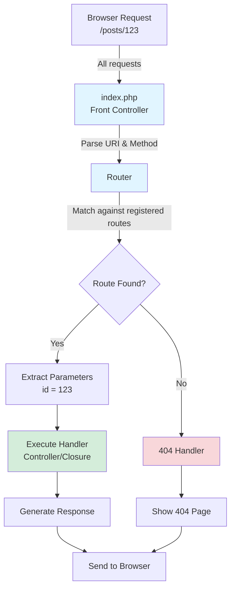

# Chapter 17: Building a Basic HTTP Router

## Overview

If you look at the URL of any modern web application, you'll see clean, human-readable paths like `/users/123` or `/posts/my-first-post`. You won't see file names like `view-user.php?id=123`. How does this work?

Modern applications use a design pattern called a **Front Controller**. This means that _every_ request to the application is actually handled by a single PHP file (usually `index.php`). This file doesn't contain the page logic itself. Instead, it contains a **Router**.

A router is a piece of code that inspects the incoming request URL (the URI) and the HTTP method (`GET`, `POST`, etc.) and decides which part of your application's code should be executed. It maps a URL to a specific function or a method on a controller class.

In this chapter, you'll build a simple but effective router from scratch. This is a crucial step towards building our blog application with a clean, modern architecture.

## Prerequisites

Before starting this chapter, you should have:

- Completed [Chapter 16: Writing Better Code with PSR-1 and PSR-12](/series/php-basics/chapters/16-writing-better-code-with-psr-1-and-psr-12)
- PHP 8.4 installed and working
- Composer installed
- Basic understanding of classes, namespaces, and autoloading
- A `simple-blog` project directory with Composer initialized
- **Time required**: ~35 minutes

## What You'll Build

By the end of this chapter, you'll have:

- A `Router` class that registers routes (URL patterns → handlers)
- Support for different HTTP methods (GET, POST)
- Dynamic route parameters (e.g., `/posts/{id}`, `/users/{username}`)
- Automatic parameter extraction and passing to handlers
- A front controller (`public/index.php`) that handles all requests
- Clean URL routing (e.g., `/about`, `/contact`) without file extensions
- A 404 handler for undefined routes
- A project structure that follows modern PHP application conventions

## Objectives

- Understand the Front Controller pattern
- Get the request URI and method from the `$_SERVER` superglobal
- Create a `Router` class that can register routes
- Dispatch a request to the correct route's handler
- Handle 404 Not Found errors for undefined routes

## Router Architecture: Visual Overview

Here's how the Front Controller pattern and routing work:



**Key Concepts:**

- **Single Entry Point**: All requests go through `index.php`
- **URL Matching**: Router compares request URI to registered patterns
- **Dynamic Parameters**: Extract values like `{id}` from URLs
- **Handler Execution**: Call the appropriate function/method
- **404 Fallback**: Handle unmatched routes gracefully

## Step 1: Setting Up the Project Structure (~5 min)

**Goal**: Create a modern project structure with a public entry point and separate directories for application code.

Our router needs a single entry point. By configuring our web server to redirect all requests to `index.php`, we can ensure our router handles everything.

### Actions

1.  **Navigate to your project directory**:

    ```bash
    # If you don't have a simple-blog directory yet, create it
    mkdir -p simple-blog
    cd simple-blog
    ```

2.  **Create the directory structure**:

    ```bash
    # Create public directory (web-accessible root)
    mkdir -p public

    # Create src/Core directory (application code)
    mkdir -p src/Core
    ```

3.  **Create initial empty files**:

    ```bash
    # Create the front controller
    touch public/index.php

    # Create the Router class file
    touch src/Core/Router.php
    ```

4.  **Initialize Composer** (if not already done):

    ```bash
    composer init --name="yourname/simple-blog" --type=project --no-interaction
    ```

5.  **Configure autoloading in `composer.json`**:

    Open `composer.json` and add the autoload section:

```json
{
  "name": "yourname/simple-blog",
  "type": "project",
  "require": {
    "php": "^8.4"
  },
  "autoload": {
    "psr-4": {
      "App\\": "src/"
    }
  }
}
```

6.  **Generate the autoloader**:

    ```bash
    composer dump-autoload
    ```

### Expected Result

Your structure should now look like this:

```
simple-blog/
├── public/
│   └── index.php
├── src/
│   └── Core/
│       └── Router.php
├── vendor/
├── composer.json
└── composer.lock
```

### Validation

Check your structure with:

```bash
# Verify directories exist
ls -la

# Should output something like:
# drwxr-xr-x  public
# drwxr-xr-x  src
# drwxr-xr-x  vendor
# -rw-r--r--  composer.json
# -rw-r--r--  composer.lock
```

### Why It Works

This structure follows the **separation of concerns** principle:

- `public/` is the only directory exposed to the web server (security benefit)
- `src/` contains your application logic (inaccessible directly from the browser)
- `vendor/` holds third-party dependencies (also protected from direct access)

Now, when you visit `http://localhost:8000/`, the server will execute `public/index.php`. When you visit `http://localhost:8000/some/other/path`, it will _also_ execute `public/index.php`. Our router can then inspect that path and decide what to do.

## Step 2: The Router Class - Registering Routes (~6 min)

**Goal**: Create a `Router` class that can store route definitions (URL patterns mapped to handlers).

Let's build our `Router` class. Its first job is to provide a way to register, or "define," the routes our application will respond to.

### Actions

Open `src/Core/Router.php` and add the following code:

**File: `src/Core/Router.php`**

```php
<?php

declare(strict_types=1);

namespace App\Core;

class Router
{
    // A private property to hold all our registered routes
    private array $routes = [];

    /**
     * Add a route to the routing table.
     *
     * @param string $method The HTTP method (GET, POST, etc.)
     * @param string $uri The URI pattern to match (e.g., '/about')
     * @param callable $handler The function or controller to execute
     */
    public function add(string $method, string $uri, callable $handler): void
    {
        $this->routes[] = [
            'method' => $method,
            'uri' => $uri,
            'handler' => $handler,
        ];
    }

    /**
     * Register a GET route.
     */
    public function get(string $uri, callable $handler): void
    {
        $this->add('GET', $uri, $handler);
    }

    /**
     * Register a POST route.
     */
    public function post(string $uri, callable $handler): void
    {
        $this->add('POST', $uri, $handler);
    }
}
```

### Expected Result

You should now have a Router class with three public methods: `add()`, `get()`, and `post()`.

### Why It Works

- **`private array $routes = []`**: Stores all registered routes as an array of associative arrays. Each route has three keys: method, uri, and handler.
- **`callable` type hint**: In PHP, `callable` ensures the parameter is something that can be called (a function, closure, or method).
- **Convenience methods**: `get()` and `post()` are shortcuts that internally call `add()` with the appropriate HTTP method. This makes our routing code more readable: `$router->get('/about', ...)` is clearer than `$router->add('GET', '/about', ...)`.

::: tip
The `callable` type was chosen over `mixed` or `Closure` because it's more specific while still allowing flexibility for future enhancements (like array-based controller references).
:::

## Step 3: The Router Class - Dispatching the Request (~7 min)

**Goal**: Add logic to match incoming requests against registered routes and execute the appropriate handler.

The router's second job is to look at the current request and find a matching route in its table. This is called **dispatching**.

### Actions

Add the `dispatch()` method to your `Router` class. Here's the complete file with the new method:

**File: `src/Core/Router.php`** (complete)

```php
<?php

declare(strict_types=1);

namespace App\Core;

class Router
{
    // A private property to hold all our registered routes
    private array $routes = [];

    /**
     * Add a route to the routing table.
     *
     * @param string $method The HTTP method (GET, POST, etc.)
     * @param string $uri The URI pattern to match (e.g., '/about')
     * @param callable $handler The function or controller to execute
     */
    public function add(string $method, string $uri, callable $handler): void
    {
        $this->routes[] = [
            'method' => $method,
            'uri' => $uri,
            'handler' => $handler,
        ];
    }

    /**
     * Register a GET route.
     */
    public function get(string $uri, callable $handler): void
    {
        $this->add('GET', $uri, $handler);
    }

    /**
     * Register a POST route.
     */
    public function post(string $uri, callable $handler): void
    {
        $this->add('POST', $uri, $handler);
    }

    /**
     * Dispatch the current request to the matching route handler.
     *
     * @return mixed The result of the handler execution
     */
    public function dispatch(): mixed
    {
        // 1. Get the current request URI and method
        $uri = parse_url($_SERVER['REQUEST_URI'], PHP_URL_PATH);
        $method = $_SERVER['REQUEST_METHOD'];

        // 2. Loop through registered routes to find a match
        foreach ($this->routes as $route) {
            // 3. Check if both URI and method match
            if ($route['uri'] === $uri && $route['method'] === $method) {
                // 4. Execute the matched handler and return its result
                return call_user_func($route['handler']);
            }
        }

        // 5. No route matched - send 404 response
        $this->handleNotFound();
    }

    /**
     * Handle 404 Not Found errors.
     */
    private function handleNotFound(): void
    {
        http_response_code(404);
        echo "404 Not Found";
    }
}
```

### Expected Result

Your `Router` class now has the ability to match incoming requests against registered routes and execute the correct handler.

### Why It Works

- **`$_SERVER['REQUEST_URI']`**: A superglobal containing the requested URI, including query strings (e.g., `/about?foo=bar`).
- **`parse_url($uri, PHP_URL_PATH)`**: Extracts just the path portion of the URI, ignoring query strings. Using the constant `PHP_URL_PATH` is more explicit and safer than array access.
- **`$_SERVER['REQUEST_METHOD']`**: Contains the HTTP method used (GET, POST, PUT, DELETE, etc.).
- **Route matching**: The foreach loop compares the incoming URI and method against each registered route.
- **`call_user_func()`**: A built-in PHP function that executes a callable (function, closure, method). It's flexible and works with various callable types.
- **Separation of concerns**: The `handleNotFound()` private method isolates 404 handling, making it easier to customize later.

::: warning
This simple router uses exact string matching. It doesn't support dynamic segments like `/users/{id}` yet. You'll learn about that in advanced routing chapters.
:::

## Step 4: Creating the Front Controller (~5 min)

**Goal**: Wire up the router in `public/index.php` to handle all incoming requests.

Now that we have a working router, let's use it in our front controller—the single entry point for all requests.

### Actions

Open `public/index.php` and add the following code:

**File: `public/index.php`**

```php
<?php

declare(strict_types=1);

// Load Composer's autoloader
require_once __DIR__ . '/../vendor/autoload.php';

use App\Core\Router;

// 1. Create a new router instance
$router = new Router();

// 2. Define application routes
$router->get('/', function () {
    echo "<h1>Welcome to Simple Blog</h1>";
    echo "<p>This is the Home page.</p>";
});

$router->get('/about', function () {
    echo "<h1>About Us</h1>";
    echo "<p>This is the About page.</p>";
});

$router->get('/contact', function () {
    echo "<h1>Contact</h1>";
    echo "<p>This is the Contact page.</p>";
});

// 3. Dispatch the current request
$router->dispatch();
```

### Expected Result

Your application now has three working routes. The router will inspect each incoming request and execute the matching handler.

### Validation

1. **Start the PHP built-in server**:

```bash
# Run from the simple-blog root directory
php -S localhost:8000 -t public
```

You should see output like:

```
[Sat Oct 25 10:30:00 2025] PHP 8.4.0 Development Server (http://localhost:8000) started
```

2. **Test each route**:

```bash
# In a new terminal, test with curl
curl http://localhost:8000/

# Expected output:
# <h1>Welcome to Simple Blog</h1>
# <p>This is the Home page.</p>
```

3. **Test in your browser**:
   - Visit `http://localhost:8000/` → You should see "Welcome to Simple Blog"
   - Visit `http://localhost:8000/about` → You should see "About Us"
   - Visit `http://localhost:8000/contact` → You should see "Contact"
   - Visit `http://localhost:8000/fake-page` → You should see "404 Not Found"

### Why It Works

- **`__DIR__`**: A magic constant containing the directory of the current file. Using it makes the autoload path work regardless of where PHP is executed from.
- **Front Controller Pattern**: Every request—no matter the URL—hits `public/index.php` first. The router then decides what code to run based on the URI.
- **Closures as Handlers**: The anonymous functions (`function() { ... }`) are called "closures." They're perfect for simple route handlers.
- **The `-t public` flag**: Tells PHP's built-in server that `public/` is the document root, so requests go to `public/index.php`.

### Troubleshooting

| Problem                              | Possible Cause                   | Solution                                                      |
| ------------------------------------ | -------------------------------- | ------------------------------------------------------------- |
| "Class 'App\Core\Router' not found"  | Autoloader not generated         | Run `composer dump-autoload`                                  |
| Server starts but shows blank page   | PHP error occurred               | Check terminal for error messages; ensure `display_errors=On` |
| 404 for all pages including `/`      | Server not using public/ as root | Verify you used `-t public` flag when starting server         |
| "Failed to listen on localhost:8000" | Port already in use              | Use a different port: `php -S localhost:8080 -t public`       |

## Step 5: Adding Dynamic Route Parameters (~8 min)

**Goal**: Enable the router to handle dynamic URL segments like `/posts/{id}` or `/users/{username}`.

Right now, our router only supports exact string matching. But what if you want to build a route like `/posts/123` where `123` is a blog post ID? You need **dynamic route parameters**.

### The Problem

With our current router, you'd need to register every possible route manually:

```php
$router->get('/posts/1', function() { /* ... */ });
$router->get('/posts/2', function() { /* ... */ });
$router->get('/posts/3', function() { /* ... */ });
// This is clearly unsustainable!
```

### The Solution

We'll use **placeholder syntax** like `/posts/{id}` that matches any value in that position and passes it to the handler.

### Actions

Replace the entire `Router` class with this enhanced version:

**File: `src/Core/Router.php`** (complete with parameters support)

```php
<?php

declare(strict_types=1);

namespace App\Core;

class Router
{
    // A private property to hold all our registered routes
    private array $routes = [];

    /**
     * Add a route to the routing table.
     *
     * @param string $method The HTTP method (GET, POST, etc.)
     * @param string $uri The URI pattern to match (e.g., '/about' or '/posts/{id}')
     * @param callable $handler The function or controller to execute
     */
    public function add(string $method, string $uri, callable $handler): void
    {
        $this->routes[] = [
            'method' => $method,
            'uri' => $uri,
            'handler' => $handler,
        ];
    }

    /**
     * Register a GET route.
     */
    public function get(string $uri, callable $handler): void
    {
        $this->add('GET', $uri, $handler);
    }

    /**
     * Register a POST route.
     */
    public function post(string $uri, callable $handler): void
    {
        $this->add('POST', $uri, $handler);
    }

    /**
     * Dispatch the current request to the matching route handler.
     *
     * @return mixed The result of the handler execution
     */
    public function dispatch(): mixed
    {
        // 1. Get the current request URI and method
        $uri = parse_url($_SERVER['REQUEST_URI'], PHP_URL_PATH);
        $method = $_SERVER['REQUEST_METHOD'];

        // 2. Loop through registered routes to find a match
        foreach ($this->routes as $route) {
            // 3. Check if the method matches first
            if ($route['method'] !== $method) {
                continue;
            }

            // 4. Check if the URI matches (either exact or with parameters)
            $params = $this->matchRoute($route['uri'], $uri);

            if ($params !== false) {
                // 5. We have a match! Execute the handler with parameters
                $handler = $route['handler'];

                // If params is empty array, call without arguments
                if (empty($params)) {
                    return call_user_func($handler);
                }

                // Otherwise, pass the extracted parameters
                return call_user_func_array($handler, $params);
            }
        }

        // 6. No route matched - send 404 response
        $this->handleNotFound();
    }

    /**
     * Check if a route pattern matches the request URI and extract parameters.
     *
     * @param string $routeUri The route pattern (e.g., '/posts/{id}')
     * @param string $requestUri The actual request URI (e.g., '/posts/123')
     * @return array|false Array of parameters if matched, false otherwise
     */
    private function matchRoute(string $routeUri, string $requestUri): array|false
    {
        // Exact match - no parameters
        if ($routeUri === $requestUri) {
            return [];
        }

        // Convert route pattern to regex
        // Example: '/posts/{id}' becomes '/posts/([^/]+)'
        $pattern = preg_replace('/\{[a-zA-Z0-9_]+\}/', '([^/]+)', $routeUri);

        // Escape forward slashes for regex
        $pattern = '#^' . $pattern . '$#';

        // Try to match the pattern against the request URI
        if (preg_match($pattern, $requestUri, $matches)) {
            // Remove the full match (first element), keep only captured groups
            array_shift($matches);
            return $matches;
        }

        return false;
    }

    /**
     * Handle 404 Not Found errors.
     */
    private function handleNotFound(): void
    {
        http_response_code(404);
        echo "404 Not Found";
    }
}
```

### Expected Result

Your router can now handle both static routes and dynamic routes with parameters.

### Validation

Let's test the new functionality. Update `public/index.php` to include a dynamic route:

```php
<?php

declare(strict_types=1);

// Load Composer's autoloader
require_once __DIR__ . '/../vendor/autoload.php';

use App\Core\Router;

// 1. Create a new router instance
$router = new Router();

// 2. Define static routes
$router->get('/', function () {
    echo "<h1>Welcome to Simple Blog</h1>";
    echo "<p>This is the Home page.</p>";
});

$router->get('/about', function () {
    echo "<h1>About Us</h1>";
    echo "<p>This is the About page.</p>";
});

// 3. Define dynamic routes with parameters
$router->get('/posts/{id}', function ($id) {
    echo "<h1>Viewing Post #{$id}</h1>";
    echo "<p>This is where post {$id} content would be displayed.</p>";
});

$router->get('/users/{username}', function ($username) {
    echo "<h1>User Profile: {$username}</h1>";
    echo "<p>Welcome to {$username}'s profile page!</p>";
});

// Multiple parameters
$router->get('/blog/{year}/{month}', function ($year, $month) {
    echo "<h1>Blog Archive</h1>";
    echo "<p>Showing posts from {$month}/{$year}</p>";
});

// 4. Dispatch the current request
$router->dispatch();
```

Now test these URLs:

```bash
# Static routes still work
curl http://localhost:8000/
curl http://localhost:8000/about

# Dynamic routes with single parameter
curl http://localhost:8000/posts/123
curl http://localhost:8000/posts/456
curl http://localhost:8000/users/john
curl http://localhost:8000/users/jane

# Multiple parameters
curl http://localhost:8000/blog/2025/10
```

You should see output like:

- `/posts/123` → "Viewing Post #123"
- `/users/john` → "User Profile: john"
- `/blog/2025/10` → "Showing posts from 10/2025"

### Why It Works

Let's break down the key components:

1. **`matchRoute()` Method**:

   - Converts route patterns like `/posts/{id}` into regex patterns like `/posts/([^/]+)`
   - The `{id}` placeholder becomes `([^/]+)` which means "capture one or more characters that aren't a forward slash"
   - Uses `preg_match()` to test if the request URI matches the pattern

2. **Parameter Extraction**:

   - `preg_match()` stores captured groups (the parameter values) in the `$matches` array
   - We remove the first element (full match) and return only the captured parameters
   - Example: For pattern `/posts/{id}` matching `/posts/123`, we get `['123']`

3. **`call_user_func_array()`**:

   - Similar to `call_user_func()`, but accepts an array of arguments
   - Passes the extracted parameters to the handler function
   - If route is `/posts/{id}` and URL is `/posts/123`, the handler receives `$id = '123'`

4. **Placeholder Naming**:
   - Placeholder names like `{id}`, `{username}`, `{slug}` are for readability
   - The actual name doesn't matter for matching—only the position
   - Parameters are passed to handlers in the order they appear in the URL

::: tip Type Safety
Notice parameters come in as strings. If you need an integer, cast it: `(int)$id`. In production applications, you'd validate and sanitize these values.
:::

::: warning
This implementation doesn't support optional parameters or regex constraints (e.g., `{id:\d+}`). For more complex routing needs, consider using a dedicated routing library like [FastRoute](https://github.com/nikic/FastRoute).
:::

### Troubleshooting

| Problem                             | Possible Cause                  | Solution                                                       |
| ----------------------------------- | ------------------------------- | -------------------------------------------------------------- |
| Parameters are `null` or empty      | Handler signature doesn't match | Ensure handler has parameter: `function($id)` not `function()` |
| Route not matching expected pattern | Typo in placeholder syntax      | Use `{paramName}` not `[paramName]` or `<paramName>`           |
| Wrong parameter values              | Route order matters             | More specific routes should be registered before generic ones  |
| "Too few arguments" error           | Missing handler parameter       | Add parameter to handler: `function($id, $slug)`               |

## Exercises

Test your understanding by extending the router with these challenges.

### Exercise 1: Product Catalog with Dynamic Routes (Intermediate)

Build a simple product catalog using dynamic routing:

1. Create a `/products` route that displays a list of products (use an array with id, name, price)
2. Create a `/products/{id}` route that displays details for a specific product
3. In the handler, look up the product by ID from your array
4. Display the product's name, price, and description

**Hint**:

```php
$products = [
    1 => ['name' => 'Laptop', 'price' => 999.99, 'description' => 'Powerful laptop'],
    2 => ['name' => 'Mouse', 'price' => 29.99, 'description' => 'Wireless mouse'],
    3 => ['name' => 'Keyboard', 'price' => 79.99, 'description' => 'Mechanical keyboard'],
];

$router->get('/products/{id}', function($id) use ($products) {
    $id = (int)$id;
    if (!isset($products[$id])) {
        echo "Product not found";
        return;
    }
    $product = $products[$id];
    echo "<h1>{$product['name']}</h1>";
    echo "<p>Price: \${$product['price']}</p>";
    echo "<p>{$product['description']}</p>";
});
```

**Expected outcome**: Visiting `/products/1` shows laptop details, `/products/2` shows mouse details, etc.

### Exercise 2: Handle POST Requests (Intermediate)

Create a simple contact form:

1. Create a `public/form.html` file:

```html
<!DOCTYPE html>
<html>
  <head>
    <title>Contact Form</title>
  </head>
  <body>
    <h1>Contact Us</h1>
    <form action="/submit-form" method="POST">
      <label>Name: <input type="text" name="name" required /></label><br />
      <label>Email: <input type="email" name="email" required /></label><br />
      <label>Message: <textarea name="message" required></textarea></label
      ><br />
      <button type="submit">Submit</button>
    </form>
  </body>
</html>
```

2. Add a GET route in `public/index.php` to serve the form:

```php
$router->get('/form', function () {
    echo file_get_contents(__DIR__ . '/form.html');
});
```

3. Add a POST route to handle the form submission:

```php
$router->post('/submit-form', function () {
    $name = $_POST['name'] ?? 'Unknown';
    $email = $_POST['email'] ?? 'Unknown';
    $message = $_POST['message'] ?? 'No message';

    echo "<h1>Thank You!</h1>";
    echo "<p>We received your message, $name.</p>";
    echo "<p>We'll reply to: $email</p>";
});
```

**Test it**: Visit `http://localhost:8000/form`, fill out the form, and submit it.

### Exercise 3: Add HTTP Method Handlers (Advanced)

Add support for PUT and DELETE methods to your router:

1. Add these methods to `Router.php`:

```php
public function put(string $uri, callable $handler): void
{
    $this->add('PUT', $uri, $handler);
}

public function delete(string $uri, callable $handler): void
{
    $this->add('DELETE', $uri, $handler);
}
```

2. Test with curl:

```bash
# Test DELETE
curl -X DELETE http://localhost:8000/users/123

# Test PUT
curl -X PUT http://localhost:8000/users/123 -d "name=John"
```

### Exercise 4: Improve 404 Handling (Intermediate)

Modify the `handleNotFound()` method to display a custom HTML 404 page:

```php
private function handleNotFound(): void
{
    http_response_code(404);
    echo <<<HTML
    <!DOCTYPE html>
    <html>
    <head>
        <title>404 Not Found</title>
        <style>
            body { font-family: sans-serif; text-align: center; padding: 50px; }
            h1 { color: #e74c3c; }
        </style>
    </head>
    <body>
        <h1>404 - Page Not Found</h1>
        <p>The page you're looking for doesn't exist.</p>
        <a href="/">Go Home</a>
    </body>
    </html>
    HTML;
}
```

## Wrap-up

Congratulations! You've just built the foundation of a modern PHP web application. Let's recap what you've accomplished:

### What You've Learned

1. **Front Controller Pattern**: All requests funnel through a single entry point (`public/index.php`), giving you centralized control over routing and request handling.

2. **Router Implementation**: You built a flexible `Router` class that:

   - Registers routes with HTTP methods and URI patterns
   - Matches incoming requests against registered routes
   - Supports dynamic route parameters like `/posts/{id}`
   - Extracts parameters and passes them to handlers automatically
   - Executes the appropriate handler
   - Handles 404 errors gracefully

3. **Clean URLs**: Your application now uses human-readable URLs like `/about`, `/contact`, and `/posts/123` instead of file-based URLs like `about.php` or `view-post.php?id=123`.

4. **Modern Project Structure**: You organized code into:

   - `public/` for web-accessible files (entry point only)
   - `src/Core/` for framework-level code
   - Composer autoloading for clean class imports

5. **Type Safety**: You used PHP 8.4's type system with `string`, `callable`, `void`, and `mixed` types to make code more robust.

### Key Concepts

- **Routing**: Mapping URLs to code that should execute
- **Dispatching**: Finding and executing the correct handler for a request
- **Dynamic Parameters**: Extracting variable segments from URLs (e.g., `/posts/{id}`)
- **Regular Expressions**: Using regex patterns to match flexible URL structures
- **Superglobals**: `$_SERVER` provides request information
- **Closures**: Anonymous functions used as route handlers
- **Separation of Concerns**: Keeping routing logic separate from business logic

### Real-World Context

Every major PHP framework (Laravel, Symfony, Slim) uses this same pattern. The routing concepts you've learned here translate directly:

```php
// Your router
$router->get('/users', function() { /* ... */ });

// Laravel
Route::get('/users', function() { /* ... */ });

// Symfony
$routes->add('users', new Route('/users', /* ... */));
```

### Limitations & Next Steps

Your router now supports the fundamentals, but there are still advanced features used in production frameworks:

- **Named routes**: Giving routes names for easier URL generation
- **Route constraints**: Restricting parameters with regex (e.g., `{id:\d+}` for digits only)
- **Optional parameters**: Routes like `/blog/{year?}/{month?}`
- **Middleware**: Running code before/after handlers (authentication, logging, etc.)
- **Route groups**: Organizing related routes with shared prefixes or middleware
- **HTTP method spoofing**: Supporting PUT/DELETE from HTML forms
- **Controller classes**: Separating routing from business logic

The next chapters will cover controller classes and MVC architecture as we continue building our blog application.

### What's Next

In [Chapter 18: Project - Structuring a Simple Application](/series/php-basics/chapters/18-project-structuring-a-simple-application), you'll:

- Create a proper MVC (Model-View-Controller) structure
- Build reusable controller classes
- Implement a simple templating system
- Connect your router to controllers instead of closures
- Add view rendering for cleaner separation of logic and presentation

## Knowledge Check

Test your understanding of HTTP routing:

<Quiz
title="Chapter 17 Quiz: Building an HTTP Router"
:questions="[
{
question: 'What is the purpose of a router in a web application?',
options: [
{ text: 'To map URLs to specific code handlers', correct: true, explanation: 'A router matches incoming request URLs and HTTP methods to the appropriate handlers that should process them.' },
{ text: 'To store routing tables in the database', correct: false, explanation: 'Routes are typically defined in code, not stored in databases.' },
{ text: 'To encrypt URLs', correct: false, explanation: 'Routers handle request mapping; encryption is handled by HTTPS.' },
{ text: 'To create database connections', correct: false, explanation: 'Database connections are separate; routers handle URL mapping.' }
]
},
{
question: 'What does the front controller pattern mean?',
options: [
{ text: 'All requests go through a single entry point (e.g., index.php)', correct: true, explanation: 'Front controller pattern routes all requests through one file, giving centralized control over routing.' },
{ text: 'The first controller created handles all requests', correct: false, explanation: 'Front controller refers to a single entry point file, not which controller was created first.' },
{ text: 'Only GET requests are handled', correct: false, explanation: 'Front controllers handle all HTTP methods, not just GET.' },
{ text: 'Controllers must be in the front-end', correct: false, explanation: 'This is about request routing architecture, not front-end vs back-end.' }
]
},
{
question: 'What are dynamic route parameters like /posts/{id}?',
options: [
{ text: 'Placeholders that capture variable URL segments', correct: true, explanation: 'Dynamic parameters like {id} match any value in that position and pass it to the handler.' },
{ text: 'Fixed routes that never change', correct: false, explanation: 'Dynamic parameters are specifically for variable segments, not fixed ones.' },
{ text: 'Database query parameters', correct: false, explanation: 'Route parameters are URL segments; database queries are separate.' },
{ text: 'HTTP headers', correct: false, explanation: 'Route parameters are part of the URL path, not HTTP headers.' }
]
},
{
question: 'What HTTP method should be used for retrieving/displaying data?',
options: [
{ text: 'GET', correct: true, explanation: 'GET is for reading/retrieving data. It should be idempotent (no side effects).' },
{ text: 'POST', correct: false, explanation: 'POST is for creating data or operations with side effects.' },
{ text: 'PATCH', correct: false, explanation: 'PATCH is for partially updating existing resources.' },
{ text: 'DELETE', correct: false, explanation: 'DELETE is for removing resources.' }
]
},
{
question: 'What is the purpose of $\_SERVER[\'REQUEST\_URI\'] in routing?',
options: [
{ text: 'It contains the URL path requested by the client', correct: true, explanation: '$\_SERVER[\'REQUEST_URI\'] holds the full request URI, which the router parses to match against registered routes.' },
{ text: 'It stores the server\'s IP address', correct: false, explanation: 'That would be SERVER_ADDR; REQUEST_URI contains the requested URL path.' },
{ text: 'It creates new routes', correct: false, explanation: 'REQUEST_URI is read-only data from the request; routes are defined in code.' },
{ text: 'It returns HTML content', correct: false, explanation: 'REQUEST_URI contains the URL; content is generated by handlers.' }
]
}
]"
/>

## Further Reading

- [PSR-7: HTTP Message Interfaces](https://www.php-fig.org/psr/psr-7/) - Standard for HTTP requests/responses
- [PSR-15: HTTP Server Request Handlers](https://www.php-fig.org/psr/psr-15/) - Middleware standard
- [FastRoute](https://github.com/nikic/FastRoute) - High-performance router library
- [PHP-FIG](https://www.php-fig.org/) - PHP Framework Interoperability Group standards
