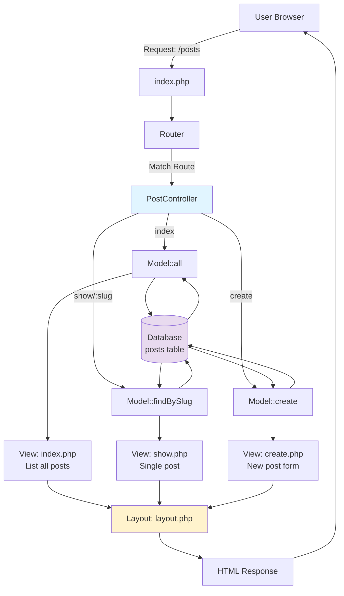

# Chapter 19: Project: Building a Simple Blog

## Overview

This is it. It's time to bring together everything you have learned throughout this series—from variables and control structures to OOP, Composer, PDO, and MVC—to build a complete, working web application. We're going to build a simple, database-driven blog.

This chapter will be less about introducing new concepts and more about applying the ones you already know to a real-world project. We'll set up the database, create a `Post` model to interact with it, build a `PostController` to handle the logic, and create the views to display our blog posts and a form for creating new ones.

## Prerequisites

Before starting this chapter, ensure you have:

- **Completed Chapter 18**: You should have a working MVC structure with router, controllers, and views
- **PHP 8.4** installed and running
- **Composer** installed and configured
- **A working `simple-blog` project** with the MVC structure from Chapter 18
- **SQLite enabled** (usually enabled by default in PHP)
- **Estimated Time**: ~35-40 minutes (or 5 minutes for Quick Start only)

**Verify your setup:**

```bash
# Check PHP version
php --version

# Check SQLite support
php -m | grep -i sqlite

# Verify your project structure
ls -la simple-blog/
```

## What You'll Build

By the end of this chapter, you'll have created:

- A complete database-driven blog application with CRUD functionality
- A `Database` singleton class for PDO connection management
- A `Post` model with methods for all database operations (create, read, update, delete)
- A `PostController` with methods: `index`, `show`, `create`, `store`
- Three view files: `posts/index.php`, `posts/show.php`, `posts/create.php`, and `404.php`
- An initialization script (`init-db.php`) to set up the database schema
- Proper error handling and validation
- A working blog where you can list, view, and create posts
- Dynamic routing support for individual post URLs like `/posts/123`
- Security features: prepared statements, XSS prevention, input validation

## Blog Application Architecture

Here's the complete architecture of your blog application:



**Directory Structure:**

```
simple-blog/
├── public/
│   └── index.php           # Front controller
├── Controllers/
│   └── PostController.php  # Blog logic
├── Models/
│   └── Post.php            # Database operations
└── Views/
    ├── layout.php          # Master template
    └── posts/
        ├── index.php       # List posts
        ├── show.php        # Display single post
        └── create.php      # Create new post
```

## Quick Start

If you want to see the complete blog in action immediately, follow these steps:

```bash
# 1. Navigate to your simple-blog project
cd simple-blog

# 2. Create the data directory for the database
mkdir -p data

# 3. Download the complete example files
# (Or manually create them following the chapter)

# 4. Initialize the database
php init-db.php

# 5. Start the server
php -S localhost:8000 -t public

# 6. Visit http://localhost:8000/posts
```

Expected result: You should see a blog post listing page with a "Create New Post" button. The application should be fully functional with list, create, and view capabilities.

## Objectives

- Solidify your understanding of the MVC application flow.
- Implement full CRUD (Create, Read, Update, Delete) functionality.
- Build a `Post` model that connects to the database.
- Create a `PostController` with methods for `index`, `show`, `create`, and `store`.
- Build the corresponding views to display posts and a creation form.
- Handle dynamic route parameters for individual post pages.
- Implement proper error handling and validation.

## Step 1: Setting Up the Database and Model (~8 min)

**Goal**: Create a reusable database connection class and a Post model for all blog operations.

First, let's set up our database connection in a more reusable way and create our `Post` model.

### Actions

1.  **Create the Data Directory**:
    The database file needs a place to live. Create a `data/` directory in your project root:

    ```bash
    # From your simple-blog directory
    mkdir -p data
    ```

2.  **Create a Database Connection Class**:
    Instead of connecting in a random script, let's create a singleton `Database` class that gives us a PDO connection.

    **File: `src/Core/Database.php`**

    ```php
    <?php
    namespace App\Core;

    use PDO;
    use PDOException;

    class Database
    {
        private static ?PDO $instance = null;

        public static function getInstance(): PDO
        {
            if (self::$instance === null) {
                $dbPath = __DIR__ . '/../../data/database.sqlite';
                $dsn = "sqlite:$dbPath";

                try {
                    self::$instance = new PDO($dsn);
                    self::$instance->setAttribute(PDO::ATTR_ERRMODE, PDO::ERRMODE_EXCEPTION);
                    self::$instance->setAttribute(PDO::ATTR_DEFAULT_FETCH_MODE, PDO::FETCH_ASSOC);
                } catch (PDOException $e) {
                    die("Database connection failed: " . $e->getMessage());
                }
            }
            return self::$instance;
        }
    }
    ```

3.  **Create the `Post` Model**:
    This model will handle all our database queries for blog posts.

    **File: `src/Models/Post.php`**

    ```php
    <?php

    declare(strict_types=1);

    namespace App\Models;

    use App\Core\Database;
    use PDO;

    class Post
    {
        public static function all(): array
        {
            $pdo = Database::getInstance();
            $stmt = $pdo->query("SELECT * FROM posts ORDER BY id DESC");
            return $stmt->fetchAll();
        }

        public static function find(int $id): array|false
        {
            $pdo = Database::getInstance();
            $stmt = $pdo->prepare("SELECT * FROM posts WHERE id = ?");
            $stmt->execute([$id]);
            return $stmt->fetch();
        }

        public static function create(string $title, string $content): bool
        {
            $pdo = Database::getInstance();
            $stmt = $pdo->prepare("INSERT INTO posts (title, content) VALUES (?, ?)");
            return $stmt->execute([$title, $content]);
        }
    }
    ```

4.  **Initialize the Database Table**:
    Create a simple script to set up our table. Create `init-db.php` in the root of your project.

    **File: `init-db.php`**

    ```php
    <?php

    declare(strict_types=1);

    require 'vendor/autoload.php';

    use App\Core\Database;

    try {
        $pdo = Database::getInstance();

        $pdo->exec("CREATE TABLE IF NOT EXISTS posts (
            id INTEGER PRIMARY KEY AUTOINCREMENT,
            title TEXT NOT NULL,
            content TEXT NOT NULL,
            created_at DATETIME DEFAULT CURRENT_TIMESTAMP
        )");

        echo "✓ Database table 'posts' is ready." . PHP_EOL;
        echo "✓ Database file: data/database.sqlite" . PHP_EOL;

    } catch (Exception $e) {
        die("✗ Database initialization failed: " . $e->getMessage() . PHP_EOL);
    }
    ```

5.  **Run the Initialization Script**:

    ```bash
    php init-db.php
    ```

### Expected Result

You should see output like:

```
✓ Database table 'posts' is ready.
✓ Database file: data/database.sqlite
```

And a new file should exist at `data/database.sqlite`.

### Validation

Verify the database was created:

```bash
# Check the file exists
ls -lh data/database.sqlite

# Optional: Inspect the database structure using sqlite3
sqlite3 data/database.sqlite ".schema posts"
```

Expected schema output:

```sql
CREATE TABLE posts (
    id INTEGER PRIMARY KEY AUTOINCREMENT,
    title TEXT NOT NULL,
    content TEXT NOT NULL,
    created_at DATETIME DEFAULT CURRENT_TIMESTAMP
);
```

### Why It Works

- **Singleton Pattern**: The `Database` class ensures only one PDO connection exists throughout the application lifetime, improving performance.
- **Static Methods**: The `Post` model uses static methods since we're not working with individual post instances yet—we're just performing database operations.
- **Type Declarations**: PHP 8.4's `array|false` union type accurately represents that `find()` returns either an array or `false` when no post exists.
- **Prepared Statements**: All queries use prepared statements to prevent SQL injection attacks.

### Troubleshooting

**Problem**: "Failed to open database file"

- **Cause**: The `data/` directory doesn't exist or lacks write permissions
- **Solution**:
  ```bash
  mkdir -p data
  chmod 755 data
  ```

**Problem**: "Class 'App\Core\Database' not found"

- **Cause**: Autoloader not updated
- **Solution**: Run `composer dump-autoload`

**Problem**: "Database connection failed"

- **Cause**: SQLite extension not enabled
- **Solution**: Check `php -m | grep sqlite` and enable `pdo_sqlite` in `php.ini`

## Step 2: Listing and Showing Posts (The "R" in CRUD) (~10 min)

**Goal**: Build controller methods and views to list all posts and show individual posts with dynamic routing.

Let's build the public-facing part of the blog: the list of all posts and the page for a single post.

### Actions

1.  **Create the `PostController`**:

    **File: `src/Controllers/PostController.php`**

    ```php
    <?php

    declare(strict_types=1);

    namespace App\Controllers;

    use App\Models\Post;

    class PostController
    {
        public function index(): void
        {
            $posts = Post::all();

            view('posts/index', [
                'posts' => $posts,
                'pageTitle' => 'All Posts'
            ]);
        }

        public function show(string $id): void
        {
            $post = Post::find((int)$id);

            if (!$post) {
                http_response_code(404);
                view('404');
                return;
            }

            view('posts/show', [
                'post' => $post,
                'pageTitle' => htmlspecialchars($post['title'])
            ]);
        }

        public function create(): void
        {
            view('posts/create', [
                'pageTitle' => 'Create New Post'
            ]);
        }

        public function store(): void
        {
            $title = $_POST['title'] ?? '';
            $content = $_POST['content'] ?? '';

            // Basic validation
            $errors = [];

            if (empty(trim($title))) {
                $errors[] = 'Title is required.';
            }

            if (empty(trim($content))) {
                $errors[] = 'Content is required.';
            }

            if (!empty($errors)) {
                view('posts/create', [
                    'pageTitle' => 'Create New Post',
                    'errors' => $errors,
                    'title' => $title,
                    'content' => $content
                ]);
                return;
            }

            // Create the post
            Post::create($title, $content);

            // Redirect to the posts index
            header('Location: /posts');
            exit;
        }
    }
    ```

2.  **Create the Views Directory**:

    ```bash
    mkdir -p src/Views/posts
    ```

3.  **Create the Post Index View**:

    **File: `src/Views/posts/index.php`**

    ```php
    <h1><?php echo htmlspecialchars($pageTitle); ?></h1>

    <a href="/posts/create" style="display: inline-block; padding: 10px 15px; background: #0066cc; color: white; text-decoration: none; border-radius: 4px; margin-bottom: 20px;">
        Create New Post
    </a>

    <?php if (empty($posts)): ?>
        <p>No posts yet. <a href="/posts/create">Create the first one!</a></p>
    <?php else: ?>
        <?php foreach ($posts as $post): ?>
            <article style="margin-bottom: 30px; padding-bottom: 20px; border-bottom: 1px solid #ddd;">
                <h2>
                    <a href="/posts/<?php echo $post['id']; ?>" style="color: #333; text-decoration: none;">
                        <?php echo htmlspecialchars($post['title']); ?>
                    </a>
                </h2>
                <p style="color: #666; margin-top: 10px;">
                    <?php
                    $excerpt = substr($post['content'], 0, 200);
                    echo nl2br(htmlspecialchars($excerpt));
                    if (strlen($post['content']) > 200) echo '...';
                    ?>
                </p>
                <small style="color: #999;">
                    Posted on <?php echo date('F j, Y', strtotime($post['created_at'])); ?>
                </small>
            </article>
        <?php endforeach; ?>
    <?php endif; ?>
    ```

4.  **Create the Single Post View**:

    **File: `src/Views/posts/show.php`**

    ```php
    <article>
        <h1><?php echo htmlspecialchars($post['title']); ?></h1>

        <p style="color: #999; margin-bottom: 20px;">
            <small>Posted on <?php echo date('F j, Y \a\t g:i a', strtotime($post['created_at'])); ?></small>
        </p>

        <div style="line-height: 1.6;">
            <?php echo nl2br(htmlspecialchars($post['content'])); ?>
        </div>

        <hr style="margin: 30px 0;">

        <a href="/posts" style="color: #0066cc; text-decoration: none;">&larr; Back to all posts</a>
    </article>
    ```

5.  **Create the 404 View**:

    **File: `src/Views/404.php`**

    ```php
    <h1 style="color: #e74c3c;">404 - Page Not Found</h1>
    <p>Sorry, the page you're looking for doesn't exist.</p>
    <p><a href="/" style="color: #0066cc;">Go to homepage</a> or <a href="/posts" style="color: #0066cc;">view all posts</a></p>
    ```

6.  **Register the Routes**:

    Great news! If you completed Chapter 17, your router already supports dynamic parameters like `/posts/{id}`. If not, make sure your `Router` class has the parameter matching functionality from that chapter.

    Your router should have a `matchRoute()` method that handles patterns like `/posts/{id}`. If you need a refresher, see [Chapter 17: Building a Basic HTTP Router](/series/php-basics/chapters/17-building-a-basic-http-router).

    Update your `public/index.php` file to add the blog routes:

    **File: `public/index.php`** (add these routes)

    ```php
    <?php

    declare(strict_types=1);

    require_once __DIR__ . '/../vendor/autoload.php';

    use App\Controllers\PageController;
    use App\Controllers\PostController;
    use App\Routing\Router;

    $router = new Router();

    // Existing routes
    $router->get('/', [PageController::class, 'home']);
    $router->get('/about', [PageController::class, 'about']);

    // Blog routes
    $router->get('/posts', [PostController::class, 'index']);
    $router->get('/posts/create', [PostController::class, 'create']);
    $router->post('/posts/store', [PostController::class, 'store']);
    $router->get('/posts/{id}', [PostController::class, 'show']);

    $router->dispatch();
    ```

    **Important**: The order matters! Register `/posts/create` before `/posts/{id}`, otherwise `create` will be matched as an ID.

### Expected Result

Your routes are now registered and ready to handle all blog operations.

### Validation

Test the routes manually:

```bash
# Start the dev server if not running
php -S localhost:8000 -t public

# In another terminal, test the routes
curl http://localhost:8000/posts              # Should show posts list
curl http://localhost:8000/posts/create       # Should show create form
curl http://localhost:8000/posts/1            # Should show 404 (no posts yet)
```

### Why It Works

- **Dynamic routing**: The `/posts/{id}` route uses the router's parameter matching from Chapter 17
- **Array syntax**: `[PostController::class, 'index']` tells the router to instantiate `PostController` and call its `index()` method
- **Route order**: Specific routes like `/posts/create` must come before wildcard routes like `/posts/{id}`

### Troubleshooting

**Problem**: "Class 'App\Controllers\PostController' not found"

- **Cause**: Autoloader not updated or typo in namespace
- **Solution**: Run `composer dump-autoload` and verify the namespace

**Problem**: All routes show 404

- **Cause**: Router not supporting dynamic parameters
- **Solution**: Review Chapter 17 and ensure your `Router` class has the `matchRoute()` method with regex support

**Problem**: `/posts/create` shows a specific post

- **Cause**: Route order is wrong
- **Solution**: Move `/posts/create` route above `/posts/{id}` route

## Step 3: Creating Posts (The "C" in CRUD) (~6 min)

**Goal**: Build a form view for creating new posts with validation and error handling.

The `PostController` already has `create()` and `store()` methods from Step 2. Now let's create the view.

### Actions

1.  **Create the View for the Form**:

    **File: `src/Views/posts/create.php`**

    ```php
    <h1><?php echo htmlspecialchars($pageTitle); ?></h1>

    <?php if (isset($errors) && !empty($errors)): ?>
        <div style="background: #fee; border: 1px solid #fcc; padding: 15px; margin-bottom: 20px; border-radius: 4px;">
            <strong>Please fix the following errors:</strong>
            <ul style="margin: 10px 0 0 20px;">
                <?php foreach ($errors as $error): ?>
                    <li><?php echo htmlspecialchars($error); ?></li>
                <?php endforeach; ?>
            </ul>
        </div>
    <?php endif; ?>

    <form action="/posts/store" method="post" style="max-width: 600px;">
        <div style="margin-bottom: 20px;">
            <label for="title" style="display: block; margin-bottom: 5px; font-weight: bold;">
                Title <span style="color: red;">*</span>
            </label>
            <input
                type="text"
                name="title"
                id="title"
                value="<?php echo htmlspecialchars($title ?? ''); ?>"
                required
                style="width: 100%; padding: 10px; border: 1px solid #ddd; border-radius: 4px; font-size: 16px;"
            >
        </div>

        <div style="margin-bottom: 20px;">
            <label for="content" style="display: block; margin-bottom: 5px; font-weight: bold;">
                Content <span style="color: red;">*</span>
            </label>
            <textarea
                name="content"
                id="content"
                rows="12"
                required
                style="width: 100%; padding: 10px; border: 1px solid #ddd; border-radius: 4px; font-size: 16px; font-family: inherit; resize: vertical;"
            ><?php echo htmlspecialchars($content ?? ''); ?></textarea>
        </div>

        <div style="display: flex; gap: 10px;">
            <button
                type="submit"
                style="padding: 12px 24px; background: #0066cc; color: white; border: none; border-radius: 4px; font-size: 16px; cursor: pointer;"
            >
                Create Post
            </button>
            <a
                href="/posts"
                style="padding: 12px 24px; background: #f0f0f0; color: #333; border: none; border-radius: 4px; font-size: 16px; text-decoration: none; display: inline-block;"
            >
                Cancel
            </a>
        </div>
    </form>

    <p style="margin-top: 30px; color: #666;">
        <small><span style="color: red;">*</span> Required field</small>
    </p>
    ```

### Expected Result

When you visit `/posts/create`, you should see a well-styled form with:

- Title input field
- Content textarea
- Create and Cancel buttons
- Error messages display area (hidden by default)

When you submit the form:

- If valid: Redirects to `/posts` with the new post at the top
- If invalid: Shows error messages and preserves your input

### Validation

Test the form:

```bash
# Visit the create form
open http://localhost:8000/posts/create

# Test validation by submitting empty form
# Should show error messages

# Fill in the form and submit
# Should redirect to /posts with new post visible
```

### Why It Works

- **Server-side validation**: The `store()` method validates before saving
- **Error preservation**: Validation errors are passed back to the view
- **Input preservation**: On error, the form remembers what you typed using `$title ?? ''`
- **XSS protection**: All user input is escaped with `htmlspecialchars()`
- **User-friendly**: Clear labels, required indicators, and helpful error messages

### Troubleshooting

**Problem**: Form submits but no post is created

- **Cause**: Database not initialized or model method failing
- **Solution**: Run `php init-db.php` and check for errors

**Problem**: Validation errors not showing

- **Cause**: The `$errors` variable isn't being passed to the view
- **Solution**: Verify the `store()` method passes `errors` array to view on validation failure

**Problem**: Content has extra slashes (e.g., `it\'s`)

- **Cause**: Magic quotes or double escaping
- **Solution**: This shouldn't happen in PHP 8.4. Check you're not manually escaping before saving

::: tip Security Note
This form doesn't include CSRF (Cross-Site Request Forgery) protection. For production applications, you should implement CSRF tokens. This is covered in advanced security topics but is beyond the scope of this foundational chapter. For now, remember: never deploy a form handler without CSRF protection in a production environment.
:::

Now you can visit `/posts`, click "Create New Post," fill out the form, and you will see your new post at the top of the list!

## Understanding Key Patterns and Concepts

Before moving to the exercises, let's explicitly discuss some important patterns and concepts that our blog application uses. Understanding these will help you recognize them in professional frameworks and codebases.

### The Post-Redirect-Get (PRG) Pattern

You may have noticed this code in the `store()` method:

```php
Post::create($title, $content);

// Redirect to the posts index
header('Location: /posts');
exit;
```

This is called the **Post-Redirect-Get (PRG) pattern**, and it's a crucial web development technique.

**The Problem It Solves:**

Without the redirect, after submitting a form:

1. User submits form → Browser sends POST request
2. Server creates post → Returns success page
3. User refreshes page (F5) → Browser re-sends POST request
4. Server creates **duplicate post** → Uh oh!

**How PRG Fixes It:**

1. User submits form → Browser sends POST request
2. Server creates post → Returns **redirect** (Location header)
3. Browser automatically sends GET request to `/posts`
4. User refreshes → Browser re-sends **GET** request (safe, no duplicate)

**Key Points:**

- Always redirect after POST/PUT/DELETE operations that modify data
- The redirect should use a GET request to view the result
- Use the `exit` statement after `header()` to prevent further code execution
- This pattern prevents duplicate submissions and bookmark issues

**HTTP Status Codes:**

While our simple `header('Location: /posts')` works, you could be more explicit:

```php
// 303 See Other - Explicitly tells browser to use GET for redirect
http_response_code(303);
header('Location: /posts');
exit;
```

### Security: Input Validation vs Output Escaping

Our blog uses two different security techniques that serve different purposes:

#### 1. Input Validation (Server-Side)

**Purpose:** Ensure data meets your business rules before storing it.

**Where:** In the controller, before calling the model:

```php
if (empty(trim($title))) {
    $errors[] = 'Title is required.';
}
```

**What it does:**

- Checks if data is present
- Checks data format (length, type, pattern)
- Rejects invalid submissions
- Prevents storing garbage in your database

**What it doesn't do:**

- Doesn't prevent SQL injection (that's prepared statements)
- Doesn't prevent XSS attacks (that's output escaping)

#### 2. Output Escaping (XSS Prevention)

**Purpose:** Prevent Cross-Site Scripting (XSS) attacks by escaping HTML in user data.

**Where:** In views, when displaying user-generated content:

```php
<h1><?php echo htmlspecialchars($post['title']); ?></h1>
```

**Why it matters:**

Without `htmlspecialchars()`, if a post title was:

```
My Post <script>alert('Hacked!')</script>
```

The browser would execute the script! With escaping, it displays as harmless text:

```
My Post &lt;script&gt;alert('Hacked!')&lt;/script&gt;
```

**Golden Rule:**

- **Validate on input** (what goes into the database)
- **Escape on output** (what comes out to the browser)
- Never try to "sanitize" input by removing characters—validate and reject instead

### SQL Injection Prevention

While we're using prepared statements throughout the code, let's explicitly understand why:

**Vulnerable Code (NEVER do this):**

```php
$id = $_GET['id'];
$stmt = $pdo->query("SELECT * FROM posts WHERE id = $id");
```

**Why it's dangerous:**

If `$id` is `1 OR 1=1`, the query becomes:

```sql
SELECT * FROM posts WHERE id = 1 OR 1=1
```

This returns **all posts**, bypassing security. Worse, with `; DROP TABLE posts; --`, an attacker could delete your entire database.

**Safe Code (our approach):**

```php
$stmt = $pdo->prepare("SELECT * FROM posts WHERE id = ?");
$stmt->execute([$id]);
```

**Why it's safe:**

The `?` placeholder tells PDO: "This is a **value**, not SQL code." Even if `$id` contains SQL syntax, PDO treats it as literal text. The database never interprets user input as commands.

**Rule:** Never concatenate user input into SQL. Always use prepared statements with placeholders.

### Environment Configuration Basics

Our `Database` class hardcodes the database path:

```php
$dbPath = __DIR__ . '/../../data/database.sqlite';
```

This works for learning, but in professional applications, you'd use environment variables:

```php
$dbPath = $_ENV['DATABASE_PATH'] ?? __DIR__ . '/../../data/database.sqlite';
```

With a `.env` file:

```env
DATABASE_PATH=/var/www/production/data/database.sqlite
APP_ENV=production
APP_DEBUG=false
```

**Why it matters:**

- Different paths for development, staging, and production
- Keep sensitive data (passwords, API keys) out of source control
- Configure without changing code

**For this tutorial:** Hardcoding is fine. Just remember to use environment configuration in real projects.

### Flash Messages (What's Missing)

Notice what happens when you create a post:

1. Submit form
2. Redirect to `/posts`
3. See the new post in the list

What's missing? **Feedback!** The user has no confirmation that the action succeeded.

**Flash messages** are temporary session data that survive one redirect:

```php
// In store() method, after creating post
$_SESSION['flash_message'] = 'Post created successfully!';
header('Location: /posts');
```

```php
// In layout or view
if (isset($_SESSION['flash_message'])) {
    echo '<div class="success">' . htmlspecialchars($_SESSION['flash_message']) . '</div>';
    unset($_SESSION['flash_message']); // Clear after display
}
```

**Note:** Chapter 15 covers sessions, but doesn't cover this flash message pattern. Consider implementing it as an additional enhancement!

### HTTP Status Codes Reference

Our blog uses `http_response_code(404)` for missing posts. Here are other useful codes:

| Code | Name                  | When to Use                                  |
| ---- | --------------------- | -------------------------------------------- |
| 200  | OK                    | Successful GET request                       |
| 201  | Created               | Successfully created a resource (after POST) |
| 303  | See Other             | Redirect after POST (PRG pattern)            |
| 400  | Bad Request           | Invalid input format                         |
| 404  | Not Found             | Resource doesn't exist                       |
| 422  | Unprocessable Entity  | Validation failed                            |
| 500  | Internal Server Error | Unexpected error                             |

**In practice:**

```php
// After creating a post
http_response_code(201);  // Created
header('Location: /posts/' . $postId);
exit;

// After validation fails
http_response_code(422);  // Unprocessable
view('posts/create', ['errors' => $errors]);
```

### Key Takeaways

1. **PRG Pattern**: Always redirect after POST to prevent duplicate submissions
2. **Validate Input**: Check business rules before storing data
3. **Escape Output**: Use `htmlspecialchars()` when displaying user data
4. **Prepared Statements**: Never concatenate user input into SQL
5. **Environment Config**: Use `.env` files for sensitive/environment-specific data
6. **Flash Messages**: Provide user feedback across redirects
7. **HTTP Status Codes**: Use appropriate codes for different scenarios

These patterns are fundamental to web development and are used consistently across all major PHP frameworks. Understanding them now will make learning Laravel, Symfony, or any other framework much easier.

## Exercises

Now that you have a working blog with create and read operations, challenge yourself to add the remaining CRUD functionality:

### Exercise 1: Implement Update (⭐⭐⭐)

Add the ability to edit existing posts.

**Tasks**:

1. Add an `update()` method to the `Post` model:

   ```php
   public static function update(int $id, string $title, string $content): bool
   {
       $pdo = Database::getInstance();
       $stmt = $pdo->prepare("UPDATE posts SET title = ?, content = ? WHERE id = ?");
       return $stmt->execute([$title, $content, $id]);
   }
   ```

2. Add `edit()` and `updatePost()` methods to `PostController`:

   - `edit($id)` should fetch the post and render an edit form
   - `updatePost($id)` should validate and update the post

3. Create `src/Views/posts/edit.php` (copy and modify `create.php`)

4. Add routes:

   ```php
   $router->get('/posts/{id}/edit', [PostController::class, 'edit']);
   $router->post('/posts/{id}/update', [PostController::class, 'updatePost']);
   ```

5. Add an "Edit" link to `posts/show.php`

**Expected Outcome**: You can click "Edit" on any post, modify it, and see the changes reflected immediately.

### Exercise 2: Implement Delete (⭐⭐)

Add the ability to delete posts.

**Tasks**:

1. Add a `delete()` method to the `Post` model:

   ```php
   public static function delete(int $id): bool
   {
       $pdo = Database::getInstance();
       $stmt = $pdo->prepare("DELETE FROM posts WHERE id = ?");
       return $stmt->execute([$id]);
   }
   ```

2. Add a `destroy()` method to `PostController`:

   ```php
   public function destroy(string $id): void
   {
       Post::delete((int)$id);
       header('Location: /posts');
       exit;
   }
   ```

3. Add a delete form to `posts/show.php`:

   ```php
   <form action="/posts/<?php echo $post['id']; ?>/delete" method="post" style="display: inline;">
       <button type="submit" onclick="return confirm('Are you sure you want to delete this post?');"
               style="background: #e74c3c; color: white; border: none; padding: 8px 16px; border-radius: 4px; cursor: pointer;">
           Delete Post
       </button>
   </form>
   ```

4. Add route:
   ```php
   $router->post('/posts/{id}/delete', [PostController::class, 'destroy']);
   ```

**Expected Outcome**: You can delete posts with a confirmation dialog, and they disappear from the list.

### Exercise 3: Add Timestamps to Edit (⭐)

Update the schema and views to track when posts were last edited.

**Tasks**:

1. Update the `posts` table schema in `init-db.php` to add `updated_at`:

   ```sql
   CREATE TABLE IF NOT EXISTS posts (
       id INTEGER PRIMARY KEY AUTOINCREMENT,
       title TEXT NOT NULL,
       content TEXT NOT NULL,
       created_at DATETIME DEFAULT CURRENT_TIMESTAMP,
       updated_at DATETIME DEFAULT CURRENT_TIMESTAMP
   )
   ```

2. Modify the `update()` method to set `updated_at = CURRENT_TIMESTAMP`

3. Display "Last updated" on post pages when `updated_at` differs from `created_at`

### Exercise 4: Add Post Search (⭐⭐⭐)

Implement a search feature to find posts by title or content.

**Tasks**:

1. Add a `search()` method to the `Post` model using LIKE queries
2. Add a search form to the posts index page
3. Modify the `index()` method to handle search queries
4. Display search results with a "Clear search" link

### Exercise 5: Add Pagination (⭐⭐⭐⭐)

Limit the posts shown per page and add navigation links.

**Tasks**:

1. Modify `Post::all()` to accept `$limit` and `$offset` parameters
2. Add a `Post::count()` method to get total posts
3. Calculate total pages in the controller
4. Add "Previous" and "Next" links to the view
5. Handle the `?page=N` query parameter

### Exercise 6: Implement Flash Messages (⭐⭐)

Add user feedback for create/update/delete actions.

**Tasks**:

1. Start a session at the beginning of `public/index.php`:

   ```php
   session_start();
   ```

2. Create a helper function in `src/helpers.php`:

   ```php
   function flash(string $key, ?string $value = null): ?string
   {
       if ($value !== null) {
           $_SESSION["flash_{$key}"] = $value;
           return null;
       }

       $message = $_SESSION["flash_{$key}"] ?? null;
       unset($_SESSION["flash_{$key}"]);
       return $message;
   }
   ```

3. Update controller methods to set flash messages:

   ```php
   // In store()
   Post::create($title, $content);
   flash('success', 'Post created successfully!');
   header('Location: /posts');

   // In updatePost()
   Post::update($postId, $title, $content);
   flash('success', 'Post updated successfully!');
   header("Location: /posts/{$postId}");

   // In destroy()
   Post::delete((int)$id);
   flash('success', 'Post deleted successfully!');
   header('Location: /posts');
   ```

4. Display flash messages in `layout.php`:
   ```php
   <?php if ($successMessage = flash('success')): ?>
       <div style="background: #d4edda; border: 1px solid #c3e6cb; color: #155724; padding: 12px 20px; margin-bottom: 20px; border-radius: 4px;">
           <?php echo htmlspecialchars($successMessage); ?>
       </div>
   <?php endif; ?>
   ```

**Expected Outcome**: Users see confirmation messages after every action, improving the user experience significantly.

## Wrap-up

🎉 **Congratulations!** This is a huge milestone! You have successfully built a complete, database-driven web application from scratch.

### What You've Accomplished

In this chapter, you've brought together everything you've learned throughout this series:

- ✅ **Object-Oriented Programming**: Classes, namespaces, static methods
- ✅ **Composer & Autoloading**: PSR-4 autoloading for clean project structure
- ✅ **Database Operations**: PDO with prepared statements for security
- ✅ **MVC Architecture**: Separation of concerns with Models, Views, and Controllers
- ✅ **Routing**: Dynamic URL parameters and route dispatch
- ✅ **Form Handling**: POST requests, validation, error messages
- ✅ **Security**: XSS prevention with `htmlspecialchars()`, SQL injection prevention with prepared statements
- ✅ **User Experience**: Error handling, input preservation, friendly messages

### Real-World Skills

The application you just built demonstrates the core architecture that powers millions of websites:

- **E-commerce sites**: Product listings, shopping carts
- **Social networks**: User profiles, posts, comments
- **Content management systems**: Articles, pages, media
- **Business applications**: Dashboards, reports, data management

### Understanding the Bigger Picture

The foundation you've built is a simplified version of what every major PHP framework does:

| What You Built       | Laravel Equivalent          | Symfony Equivalent                 |
| -------------------- | --------------------------- | ---------------------------------- |
| `Router` class       | `Illuminate\Routing\Router` | `Symfony\Component\Routing\Router` |
| `Post` model         | Eloquent models             | Doctrine entities                  |
| `PostController`     | Controller classes          | Controller classes                 |
| `view()` function    | Blade templating            | Twig templating                    |
| `Database` singleton | Database facades            | Doctrine DBAL                      |

**The concepts are identical**—frameworks just add:

- More features (authentication, caching, queuing)
- Better tooling (CLI commands, testing)
- Community packages (payment processing, image manipulation)
- Performance optimizations
- Advanced patterns (middleware, service containers, events)

### Key Takeaways

1. **MVC keeps code organized**: Models handle data, Views handle presentation, Controllers connect them
2. **Prepared statements are non-negotiable**: Never concatenate user input into SQL
3. **Validation happens on the server**: Never trust client-side validation alone
4. **Always escape output**: `htmlspecialchars()` prevents XSS attacks
5. **URL structure matters**: Clean URLs improve UX and SEO
6. **Single entry point is powerful**: The front controller pattern enables routing and middleware
7. **Type declarations catch bugs early**: PHP 8.4's type system makes code safer

### What's Next

You're now ready to explore professional PHP frameworks:

**[Chapter 20: A Gentle Introduction to Laravel](/series/php-basics/chapters/20-a-gentle-introduction-to-laravel)** - See how Laravel builds on these concepts with elegant syntax, powerful tools, and a vibrant ecosystem.

**[Chapter 21: A Gentle Introduction to Symfony](/series/php-basics/chapters/21-a-gentle-introduction-to-symfony)** - Discover Symfony's component-based approach and enterprise-grade features.

**[Chapter 22: What to Learn Next](/series/php-basics/chapters/22-what-to-learn-next)** - Chart your path forward in PHP development.

### Going Further

Before moving on, consider enhancing your blog:

- **Add user authentication** (login/logout)
- **Implement post categories** or tags
- **Add comments** to posts
- **Upload and display images**
- **Add a rich text editor** (TinyMCE, CKEditor)
- **Implement post drafts** (published vs draft status)
- **Add RSS feed** generation
- **Create an admin dashboard**

Each of these features will deepen your understanding and give you more to showcase in a portfolio.

### Deployment Considerations

When you're ready to deploy your blog to a live server:

1. **Use environment variables** for database credentials (not hardcoded paths)
2. **Enable HTTPS** (Let's Encrypt is free)
3. **Implement CSRF protection** for forms
4. **Add rate limiting** to prevent abuse
5. **Set up error logging** (don't show errors to users)
6. **Use a real database** (PostgreSQL or MySQL) instead of SQLite
7. **Add caching** for better performance
8. **Implement backups** for your database

### Final Thought

You've gone from understanding PHP basics to building a complete web application. That's no small feat! The skills you've developed here form the foundation for any web development work you'll do in PHP.

Remember: every expert developer started exactly where you are now. Keep building, keep learning, and don't be afraid to break things—that's how you'll truly master these concepts.

Happy coding! 🚀

## Code Samples

All code from this chapter is available in the code directory for easy reference:

- [`19-blog-database.php`](/series/php-basics/code/19-blog-project/19-blog-database.php) - Complete Database singleton class
- [`19-blog-post-model.php`](/series/php-basics/code/19-blog-project/19-blog-post-model.php) - Post model with all CRUD operations including search
- [`19-blog-post-controller.php`](/series/php-basics/code/19-blog-project/19-blog-post-controller.php) - Complete PostController with all methods including update and delete
- [`19-blog-init-db.php`](/series/php-basics/code/19-blog-project/19-blog-init-db.php) - Database initialization script with optional sample data

These files include the complete implementations from the chapter plus the exercise solutions. Use them as a reference while building your blog application.

## Quick Reference

### Project Structure

```
simple-blog/
├── data/
│   └── database.sqlite          # SQLite database file
├── public/
│   └── index.php                # Front controller (entry point)
├── src/
│   ├── Controllers/
│   │   ├── PageController.php   # Static pages
│   │   └── PostController.php   # Blog post operations
│   ├── Core/
│   │   └── Database.php         # Database connection singleton
│   ├── Models/
│   │   └── Post.php             # Post model
│   ├── Routing/
│   │   └── Router.php           # HTTP router (from Chapter 17)
│   ├── Views/
│   │   ├── layout.php           # Master layout template
│   │   ├── 404.php              # Not found page
│   │   ├── posts/
│   │   │   ├── index.php        # List all posts
│   │   │   ├── show.php         # Single post view
│   │   │   ├── create.php       # Create post form
│   │   │   └── edit.php         # Edit post form (exercise)
│   │   └── ...                  # Other views
│   └── helpers.php              # Global helper functions
├── vendor/                      # Composer dependencies
├── composer.json                # Composer configuration
└── init-db.php                  # Database setup script
```

### Key Routes

```php
// Static pages
$router->get('/', [PageController::class, 'home']);
$router->get('/about', [PageController::class, 'about']);

// Blog posts
$router->get('/posts', [PostController::class, 'index']);
$router->get('/posts/create', [PostController::class, 'create']);
$router->post('/posts/store', [PostController::class, 'store']);
$router->get('/posts/{id}', [PostController::class, 'show']);

// Exercise routes (update/delete)
$router->get('/posts/{id}/edit', [PostController::class, 'edit']);
$router->post('/posts/{id}/update', [PostController::class, 'updatePost']);
$router->post('/posts/{id}/delete', [PostController::class, 'destroy']);
```

### Database Schema

```sql
CREATE TABLE posts (
    id INTEGER PRIMARY KEY AUTOINCREMENT,
    title TEXT NOT NULL,
    content TEXT NOT NULL,
    created_at DATETIME DEFAULT CURRENT_TIMESTAMP,
    updated_at DATETIME DEFAULT CURRENT_TIMESTAMP
);
```

### Common Commands

```bash
# Initialize database
php init-db.php

# Start development server
php -S localhost:8000 -t public

# Regenerate autoloader (after adding new classes)
composer dump-autoload

# Inspect database with SQLite CLI
sqlite3 data/database.sqlite
> SELECT * FROM posts;
> .schema posts
> .quit
```

## Knowledge Check

Test your understanding of building a complete application:

<Quiz
title="Chapter 19 Quiz: Building a Blog Application"
:questions="[
{
question: 'What is the purpose of a Model class like Post?',
options: [
{ text: 'To encapsulate database operations for a specific entity', correct: true, explanation: 'Models represent entities and handle all database interactions for that entity, keeping data logic organized.' },
{ text: 'To display HTML to users', correct: false, explanation: 'That\'s what Views do; Models handle data and business logic.' },
{ text: 'To route URLs to handlers', correct: false, explanation: 'That\'s the Router\'s job; Models handle data operations.' },
{ text: 'To validate HTML forms', correct: false, explanation: 'Form validation can be in Controllers or Models; the Model\'s main job is data management.' }
]
},
{
question: 'What does CRUD stand for?',
options: [
{ text: 'Create, Read, Update, Delete', correct: true, explanation: 'CRUD represents the four basic operations for persistent storage: creating, reading, updating, and deleting records.' },
{ text: 'Connect, Retrieve, Upload, Download', correct: false, explanation: 'CRUD is Create, Read, Update, Delete—the fundamental data operations.' },
{ text: 'Class, Route, URL, Database', correct: false, explanation: 'CRUD stands for Create, Read, Update, Delete.' },
{ text: 'Controller, Request, URL, Data', correct: false, explanation: 'CRUD is Create, Read, Update, Delete.' }
]
},
{
question: 'Why use prepared statements in database operations?',
options: [
{ text: 'To prevent SQL injection attacks', correct: true, explanation: 'Prepared statements separate SQL structure from data, preventing malicious SQL from being executed.' },
{ text: 'To make queries run faster', correct: false, explanation: 'While they can help performance, the primary reason is security against SQL injection.' },
{ text: 'To store queries in the database', correct: false, explanation: 'Prepared statements are about safe query execution, not storage.' },
{ text: 'To avoid writing SQL', correct: false, explanation: 'You still write SQL; prepared statements make it safer by separating logic from data.' }
]
},
{
question: 'What is the benefit of using a singleton pattern for database connections?',
options: [
{ text: 'Reuses one connection instead of creating many', correct: true, explanation: 'Singleton ensures only one database connection exists, avoiding the overhead of multiple connections.' },
{ text: 'Allows multiple simultaneous connections', correct: false, explanation: 'Singleton specifically limits to one instance; that\'s its purpose.' },
{ text: 'Encrypts database queries', correct: false, explanation: 'Singleton is about instance management; encryption is separate.' },
{ text: 'Automatically creates database tables', correct: false, explanation: 'Singleton manages connection instances; table creation is separate.' }
]
},
{
question: 'What is validation and why is it important?',
options: [
{ text: 'Checking user input meets requirements before processing', correct: true, explanation: 'Validation ensures data is correct, complete, and safe before saving or processing it.' },
{ text: 'Converting data to HTML', correct: false, explanation: 'That\'s output escaping or templating; validation checks input correctness.' },
{ text: 'Creating database connections', correct: false, explanation: 'Validation checks data quality; connections are separate infrastructure.' },
{ text: 'Routing URLs to handlers', correct: false, explanation: 'Routing maps URLs; validation checks data correctness.' }
]
}
]"
/>

## Further Reading

- [PHP 8.4 Release Notes](https://www.php.net/releases/8.4/) - New features and improvements
- [PDO Documentation](https://www.php.net/manual/en/book.pdo.php) - Complete PDO reference
- [OWASP SQL Injection](https://owasp.org/www-community/attacks/SQL_Injection) - Understanding SQL injection attacks
- [OWASP XSS Prevention](https://cheatsheetseries.owasp.org/cheatsheets/Cross_Site_Scripting_Prevention_Cheat_Sheet.html) - XSS attack prevention
- [PSR-4 Autoloading](https://www.php-fig.org/psr/psr-4/) - PHP autoloading standard
- [Composer Documentation](https://getcomposer.org/doc/) - Dependency management
- [Laravel Documentation](https://laravel.com/docs) - Popular PHP framework
- [Symfony Documentation](https://symfony.com/doc/current/index.html) - Enterprise PHP framework
