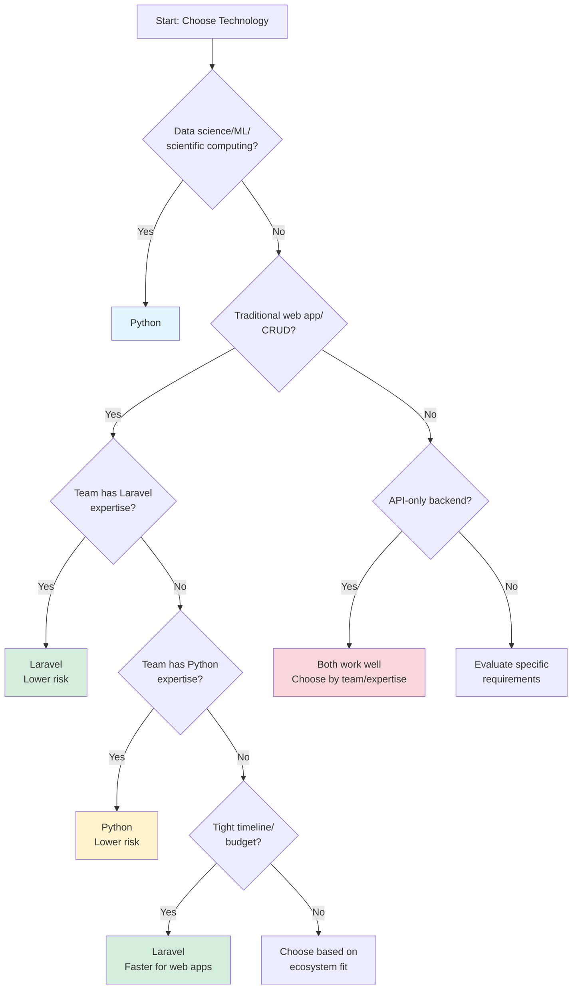

# Chapter 09: When to Use Laravel (and When Python Still Makes Sense)

## Overview

In Chapter 08, you explored Laravel's ecosystem—Composer vs pip, popular packages like Spatie and Livewire, community dynamics, and where Laravel excels. You now understand Laravel's strengths and how its ecosystem compares to Python's. But understanding a technology isn't enough. You need to know **when to use it**—and when your existing Python stack is still the better choice.

This chapter is an **honest, practical guide to technology decision-making**. We're not here to convince you that Laravel is always better, or that Python is always better. Instead, we'll give you a clear framework for evaluating your specific situation: project type, team expertise, budget, performance requirements, and long-term maintenance. You'll learn when Laravel's rapid development, exceptional developer experience, and deployment simplicity make it the right choice—and when Python's data science ecosystem, machine learning libraries, or team expertise make Python the better fit.

Throughout this series, we've shown you how Python concepts translate to Laravel. Now it's time to step back and make informed decisions. This chapter provides real-world scenarios, cost comparisons, performance considerations, and a practical decision-making framework. By the end, you'll be able to confidently choose the right technology for your next project—whether that's Laravel, Python, or a hybrid approach using both.

## Prerequisites

Before starting this chapter, you should have:

- Completion of [Chapter 08](/series/python-developers-love-php-laravel/chapters/08-ecosystem-community-packages-where-laravel-excels) or equivalent understanding of Laravel's ecosystem and community
- Understanding of both Python and Laravel ecosystems (you've worked through the series)
- Experience with Python web development (Django, Flask, or similar)
- Basic understanding of project planning and technology selection
- Familiarity with hosting options and deployment considerations
- **Estimated Time**: ~130 minutes

**Verify your understanding:**

```bash
# You should be comfortable with both ecosystems
# Python
python --version
pip list | head -5

# PHP/Laravel
php --version
composer --version
php artisan --version
```

This chapter is conceptual—no code to run, but plenty of real-world scenarios to consider.

## Quick Start

Want to see how the decision-making framework works? Here's a quick example:

**Scenario:** You're building a web application for managing customer data with basic reporting.

**Quick Decision Framework:**

1. **Project Type:** Traditional web app/CRUD → Laravel favored ✅
2. **Team Expertise:** Mixed (can learn either) → Flexible
3. **Timeline:** 3 months → Laravel faster for web apps ✅
4. **Requirements:** Basic reporting (not heavy data science) → Laravel sufficient ✅

**Decision:** Laravel

**Reasoning:** Traditional web application with CRUD operations fits Laravel's strengths. Rapid development helps meet the timeline. Basic reporting doesn't require Python's data science ecosystem.

**Alternative Scenario:** If this required advanced analytics, ML predictions, or heavy data processing → Python would be the better choice.

This chapter will teach you to evaluate all factors systematically and make informed decisions for any project.

## What You'll Build

By the end of this chapter, you will have:

- Clear understanding of when Laravel excels (rapid web development, traditional CRUD apps, full-stack applications)
- Recognition of when Python is still the better choice (data science, ML, scientific computing, Python-specific libraries)
- Cost comparison framework covering hosting, development time, talent pool, and total cost of ownership
- Performance evaluation criteria (when performance matters vs doesn't matter)
- Security considerations and compliance requirements evaluation
- Learning curve and documentation quality assessment
- Long-term sustainability evaluation (framework support, community health)
- Practical decision-making framework with checklist and decision tree
- Real-world scenario analysis skills including industry-specific considerations
- Confidence in making informed technology decisions for your projects

## Objectives

- Understand when Laravel makes sense: rapid web development, traditional CRUD applications, content management, e-commerce, full-stack apps
- Recognize when Python is still better: data science, machine learning, scientific computing, Python-specific library requirements
- Compare costs comprehensively: hosting, development time, talent pool, maintenance, and scaling
- Evaluate performance considerations: web app performance, concurrency, memory usage, startup time, when performance matters
- Apply decision-making framework to real scenarios: project type, team expertise, budget, scalability, integrations
- Evaluate security considerations: security features, compliance requirements, industry-specific needs
- Assess learning curve and documentation quality: onboarding time, resource availability, community support
- Consider regulatory and compliance requirements: GDPR, HIPAA, PCI-DSS, industry-specific regulations
- Evaluate long-term sustainability: framework support, community health, future outlook
- Recognize hybrid approaches: using both technologies together, microservices architecture, API integrations

## Step 1: When Laravel Makes Sense (~20 min)

### Goal

Identify specific scenarios where Laravel's strengths make it the optimal choice over Python frameworks.

### Actions

1. **Rapid Web Application Development**

Laravel excels when you need to build web applications quickly. Its "convention over configuration" philosophy, built-in authentication, migrations, and Artisan CLI mean you can go from idea to working prototype faster than with most Python frameworks.

**Laravel (Rapid Development):**

```php
# filename: Create a blog post system
# Laravel: One command creates model, migration, controller, and routes
php artisan make:model Post -mcr

# Migration, model, controller, and routes scaffolded automatically
# Add a few lines of code, and you have a working CRUD system
```

**Python/Django (More Setup Required):**

```python
# Django: More manual setup required
python manage.py startapp blog
# Create models.py, views.py, urls.py, forms.py manually
# Configure settings.py
# Create templates directory structure
# More boilerplate code needed
```

**When This Matters:**

- MVP development and prototyping
- Startups with tight deadlines
- Client projects with fixed timelines
- Internal tools and admin panels

::: tip Rapid Prototyping Tip
Laravel's scaffolding can turn a 2-week Django project into a 3-day Laravel prototype. If you're exploring ideas or need to show stakeholders something quickly, Laravel's speed can be a game-changer.
:::

2. **Traditional CRUD Applications**

Laravel's Eloquent ORM, resource controllers, and form validation make building CRUD (Create, Read, Update, Delete) applications exceptionally fast. While Django also excels here, Laravel's developer experience often feels more streamlined.

**Laravel Advantages:**

- Resource controllers handle all CRUD operations automatically
- Form requests provide validation and authorization in one place
- Eloquent relationships are intuitive and powerful
- Blade templates are simple and don't require learning a separate templating language

**When This Matters:**

- Admin panels and dashboards
- Content management systems
- Customer portals
- Internal business applications

3. **Content Management Systems**

Laravel is excellent for building CMSs. Packages like Filament, Nova, or custom Blade-based admin panels integrate seamlessly. While Django has a powerful admin panel, Laravel offers more flexibility in customization.

**Laravel CMS Strengths:**

- Flexible admin panel options (Filament, Nova, custom Blade)
- Easy content versioning and publishing workflows
- Media library management (Spatie Media Library)
- Multi-site and multi-tenant support

**When This Matters:**

- Custom CMS development
- Multi-tenant SaaS applications
- Content-heavy websites
- Publishing platforms

4. **E-commerce Platforms**

Laravel's ecosystem includes excellent e-commerce packages (Laravel Cashier for Stripe, shopping cart packages, payment integrations). While Python has options (Saleor, Oscar), Laravel's rapid development often wins for custom e-commerce needs.

**Laravel E-commerce Advantages:**

- Laravel Cashier for subscription billing (Stripe, Paddle)
- Easy payment gateway integrations
- Shopping cart packages (Laravel Cart, Gloudemans Shoppingcart)
- Inventory management and order processing workflows

**When This Matters:**

- Custom e-commerce solutions
- Subscription-based businesses
- Marketplaces and multi-vendor platforms
- Digital product sales

5. **Full-Stack Applications with Server-Rendered Views**

Laravel's Blade templating engine makes building full-stack applications with server-rendered views straightforward. While Django templates are similar, Laravel's component system and Livewire integration offer modern full-stack capabilities without JavaScript complexity.

**Laravel Full-Stack Advantages:**

- Blade components for reusable UI elements
- Livewire for interactive components without writing JavaScript
- Inertia.js for SPA-like experience with minimal frontend code
- Server-side rendering with modern developer experience

**When This Matters:**

- Applications where SEO matters
- Traditional web applications (not SPAs)
- Rapid prototyping with minimal frontend complexity
- Applications requiring server-side rendering

6. **Exceptional Developer Experience**

Laravel prioritizes developer happiness. Artisan CLI, excellent documentation, helpful error messages, and conventions that "just work" make development enjoyable and productive.

**Laravel DX Highlights:**

- Artisan CLI: `php artisan make:*` commands for everything
- Tinker: Interactive REPL for testing and debugging
- Excellent error pages with stack traces and suggestions
- Comprehensive documentation with examples

**When This Matters:**

- Teams prioritizing developer productivity
- Projects where developer happiness affects retention
- Rapid iteration and experimentation
- Learning and onboarding new developers

7. **Deployment Simplicity**

Laravel Forge and Vapor make deployment incredibly simple. While Python has Heroku, Railway, and similar platforms, Laravel's first-party deployment tools are exceptional.

**Laravel Deployment Advantages:**

- Laravel Forge: One-click server provisioning and deployment
- Laravel Vapor: Serverless deployment on AWS
- Zero-downtime deployments
- Built-in queue workers and scheduler management

**When This Matters:**

- Small teams without dedicated DevOps
- Projects requiring quick deployment cycles
- Applications needing reliable, managed hosting
- Startups and agencies

### Expected Result

You understand Laravel's core strengths: rapid development, excellent CRUD capabilities, CMS flexibility, e-commerce support, full-stack simplicity, developer experience, and deployment ease. You can identify when these strengths align with your project needs.

### Why It Works

Laravel's philosophy prioritizes developer productivity and rapid development. Its conventions reduce decision fatigue, its tooling automates common tasks, and its ecosystem provides solutions for typical web application needs. When your project fits Laravel's sweet spot—traditional web applications, CRUD operations, content management, or rapid prototyping—Laravel delivers exceptional value.

### Troubleshooting

- **"But Django also does this"** — True! Django is excellent. The difference is often in developer experience and ecosystem. Laravel's tooling and packages often feel more streamlined for rapid development.
- **"What about FastAPI for APIs?"** — FastAPI is excellent for API-only projects. Laravel excels when you need full-stack capabilities or rapid CRUD development. For pure APIs, both are valid choices.
- **"Python has better libraries"** — For data science and ML, absolutely. For web development libraries, Laravel's ecosystem is very strong. It depends on your specific needs.

## Step 2: When Python Still Makes Sense (~20 min)

### Goal

Recognize scenarios where Python's strengths make it the better choice over Laravel, particularly in data science, machine learning, and scientific computing.

### Actions

1. **Data Science and Analytics**

Python's data science ecosystem (pandas, NumPy, Matplotlib, Jupyter) is unmatched. If your application requires data analysis, statistical computing, or data visualization, Python is the clear choice.

**Python Data Science Advantages:**

- pandas: Powerful data manipulation and analysis
- NumPy: Numerical computing and array operations
- Matplotlib/Seaborn: Data visualization
- Jupyter Notebooks: Interactive data exploration
- SciPy: Scientific computing library

**When This Matters:**

- Data analysis dashboards
- Business intelligence applications
- Reporting and analytics platforms
- Data processing pipelines

**Laravel Alternative:**
Laravel can integrate with Python services via APIs, but you'd be fighting the ecosystem. If data science is core to your application, use Python.

::: warning Don't Fight the Ecosystem
If your application's core functionality requires pandas, NumPy, or scikit-learn, don't try to build it in Laravel and call Python services. You'll spend more time on integration than development. Use Python for Python's strengths.
:::

2. **Machine Learning and AI Applications**

Python dominates machine learning with libraries like scikit-learn, TensorFlow, PyTorch, and Keras. If your application requires ML models, training, or inference, Python is essential.

**Python ML Advantages:**

- scikit-learn: Comprehensive ML library
- TensorFlow/PyTorch: Deep learning frameworks
- Natural Language Processing (NLTK, spaCy)
- Computer Vision (OpenCV)
- Model training and deployment tools

**When This Matters:**

- Recommendation systems
- Natural language processing applications
- Image recognition systems
- Predictive analytics
- Chatbots and AI assistants

**Laravel Alternative:**
Laravel can call Python ML services via APIs or queue jobs, but the ML development itself happens in Python. Use Python for ML, Laravel for the web interface if needed.

3. **Scientific Computing**

Python is the standard for scientific computing. Libraries like SciPy, SymPy, and domain-specific tools make Python essential for scientific applications.

**Python Scientific Computing Advantages:**

- SciPy: Scientific algorithms and functions
- SymPy: Symbolic mathematics
- Domain-specific libraries (astropy, biopython, etc.)
- Integration with C/Fortran libraries

**When This Matters:**

- Research applications
- Engineering simulations
- Scientific data processing
- Academic projects

**Laravel Alternative:**
Not applicable. Scientific computing requires Python's ecosystem.

4. **Data Processing Pipelines**

Python excels at ETL (Extract, Transform, Load) pipelines, data processing, and workflow automation. Libraries like Apache Airflow, Luigi, and pandas make Python ideal for data engineering.

**Python Data Pipeline Advantages:**

- Apache Airflow: Workflow orchestration
- pandas: Data transformation
- Dask: Parallel computing
- Integration with big data tools (Spark, Hadoop)

**When This Matters:**

- ETL pipelines
- Data warehousing
- Batch processing systems
- Data integration platforms

**Laravel Alternative:**
Laravel Queues can handle some data processing, but Python's data engineering ecosystem is far superior for complex pipelines.

5. **Microservices Requiring Python Libraries**

If your microservice needs pandas, NumPy, scikit-learn, or other Python-specific libraries, use Python. Don't force Laravel when Python libraries are essential.

**Python Microservice Advantages:**

- Access to entire Python ecosystem
- Specialized libraries for specific domains
- Integration with Python-based tools
- Team expertise in Python

**When This Matters:**

- Microservices architecture
- Service-oriented architecture (SOA)
- Domain-specific services (ML, data processing)
- Integration with Python-based systems

**Laravel Alternative:**
Use Laravel for web-facing services, Python for specialized microservices. Both can coexist in the same architecture.

6. **When Python Ecosystem Libraries Are Essential**

Some projects require Python libraries that have no PHP equivalent. If your project depends on these libraries, Python is the right choice.

**Examples of Python-Only Libraries:**

- Data science: pandas, NumPy, SciPy
- Machine learning: TensorFlow, PyTorch, scikit-learn
- Scientific computing: SymPy, astropy
- Bioinformatics: Biopython
- Network analysis: NetworkX

**When This Matters:**

- Projects requiring specific Python libraries
- Integration with Python-based tools
- Academic or research applications
- Domain-specific requirements

7. **When Team Expertise Is Primarily Python**

Team expertise matters. If your team is primarily Python developers with deep Python knowledge, using Python reduces risk and accelerates development.

**Python Team Advantages:**

- Existing expertise and knowledge
- Faster development with familiar tools
- Lower learning curve
- Established codebase and patterns

**When This Matters:**

- Existing Python codebases
- Teams with strong Python expertise
- Projects requiring Python knowledge
- Maintaining legacy Python systems

### Expected Result

You recognize Python's core strengths: data science, machine learning, scientific computing, data processing, Python-specific libraries, and team expertise. You understand when these strengths make Python the better choice.

### Why It Works

Python's ecosystem dominates data science, machine learning, and scientific computing. These domains have mature, powerful libraries that PHP doesn't match. When your project's core requirements involve these domains, Python is the right choice. Laravel excels at web applications, but Python excels at data and science.

### Troubleshooting

- **"Can't I use Laravel with Python APIs?"** — Yes! You can use Laravel for the web interface and call Python services. But if the core functionality is Python-based, consider using Python for the entire application.
- **"What about PHP-ML?"** — PHP-ML exists but is limited compared to Python's ML ecosystem. For serious ML work, Python is essential.
- **"Can I learn Python later?"** — Yes, but if your project requires Python libraries now, start with Python. Don't delay to learn Laravel if Python is what you need.

## Step 3: Cost Comparison (~25 min)

### Goal

Compare total cost of ownership between Laravel and Python projects, including hosting, development time, talent pool, and maintenance.

### Actions

1. **Hosting Costs**

Hosting costs vary significantly based on your needs. Let's compare common hosting scenarios:

**Shared Hosting (Budget Option):**

| Provider        | Laravel     | Python/Django   | Notes                                                         |
| --------------- | ----------- | --------------- | ------------------------------------------------------------- |
| Shared hosting  | $5-15/month | Limited options | Laravel works on most shared hosts; Python often requires VPS |
| Entry-level VPS | $5-10/month | $5-10/month     | Both work well on VPS                                         |

**Laravel Advantages:**

- Works on traditional shared hosting (cPanel, etc.)
- Lower entry-level hosting costs
- Laravel Forge: $12/month for server management

**Python Advantages:**

- VPS options are straightforward
- Platform-as-a-Service (Heroku, Railway) options available

**Cloud Platforms (Production):**

| Platform         | Laravel            | Python/Django | Notes                       |
| ---------------- | ------------------ | ------------- | --------------------------- |
| AWS/DigitalOcean | Similar costs      | Similar costs | Both work well on cloud VPS |
| Laravel Forge    | $12/month + server | N/A           | Laravel-specific management |
| Laravel Vapor    | Pay-per-use        | N/A           | Serverless for Laravel      |
| Heroku           | N/A                | $7-25/month   | Python-friendly PaaS        |
| Railway          | N/A                | $5-20/month   | Python-friendly PaaS        |

**Cost Considerations:**

- Laravel: Lower entry costs, Forge simplifies management
- Python: More PaaS options, but similar VPS costs
- Both: Scale similarly on cloud platforms

2. **Development Time and Cost**

Development time directly impacts cost. Laravel's rapid development can reduce initial development costs.

**Laravel Development Speed:**

- Faster initial setup (Artisan scaffolding)
- Less boilerplate code
- Built-in authentication, validation, queues
- Faster feature development for CRUD applications

**Python Development Speed:**

- Django: More setup, but powerful admin panel
- Flask: Minimal setup, but more manual work
- FastAPI: Fast for APIs, but less full-stack support

**Time Comparison (Example: Blog CMS):**

| Task             | Laravel       | Django      | Flask     |
| ---------------- | ------------- | ----------- | --------- |
| Project setup    | 5 min         | 10 min      | 15 min    |
| Authentication   | Built-in      | Built-in    | Manual    |
| CRUD scaffolding | 1 command     | Admin panel | Manual    |
| Admin panel      | Filament/Nova | Built-in    | Manual    |
| Total time (MVP) | 2-4 hours     | 4-6 hours   | 6-8 hours |

**Cost Impact:**

- Laravel: Faster MVP = lower initial cost
- Django: More setup, but powerful admin saves time later
- Flask: More manual work = higher development cost

3. **Talent Pool and Hiring Costs**

The availability and cost of developers varies by technology and location.

**Laravel Talent Pool:**

- Large PHP developer pool (PHP is widely used)
- Laravel-specific expertise: growing, but smaller than Python
- Hiring cost: Moderate (depends on location)
- Learning curve: Lower for PHP developers

**Python Talent Pool:**

- Very large Python developer pool
- Web framework expertise: Django and Flask are common
- Data science expertise: Python dominates
- Hiring cost: Can be higher for specialized roles (data science, ML)

**Hiring Considerations:**

| Factor                     | Laravel               | Python            |
| -------------------------- | --------------------- | ----------------- |
| General web developers     | Large pool            | Large pool        |
| Framework-specific experts | Growing               | Very large        |
| Data science/ML experts    | Limited               | Very large        |
| Entry-level developers     | Many                  | Many              |
| Senior developers          | Moderate availability | High availability |

**Cost Impact:**

- Laravel: Good availability, moderate cost
- Python: Excellent availability, but data science roles can be expensive
- Both: Similar costs for general web development roles

4. **Maintenance and Scaling Costs**

Long-term maintenance and scaling costs matter for production applications.

**Laravel Maintenance:**

- Framework updates: Regular, well-documented
- Package updates: Composer handles dependencies
- Server maintenance: Forge simplifies this
- Scaling: Horizontal scaling is straightforward

**Python Maintenance:**

- Framework updates: Regular, well-documented
- Package updates: pip handles dependencies
- Server maintenance: Similar to Laravel
- Scaling: Horizontal scaling is straightforward

**Scaling Considerations:**

| Aspect             | Laravel         | Python/Django   |
| ------------------ | --------------- | --------------- |
| Horizontal scaling | Excellent       | Excellent       |
| Database scaling   | Similar         | Similar         |
| Caching            | Redis/Memcached | Redis/Memcached |
| Queue workers      | Built-in        | Celery          |
| Load balancing     | Standard        | Standard        |

**Cost Impact:**

- Both scale similarly
- Laravel: Forge simplifies scaling management
- Python: More PaaS options for managed scaling

5. **Total Cost of Ownership (TCO) Comparison**

Let's compare TCO for a typical web application over 3 years:

**Scenario: Medium-sized SaaS Application**

| Cost Category        | Laravel     | Python/Django | Notes                      |
| -------------------- | ----------- | ------------- | -------------------------- |
| Initial development  | $40,000     | $50,000       | Laravel faster for CRUD    |
| Hosting (Year 1)     | $1,200      | $1,200        | Similar costs              |
| Hosting (Year 2-3)   | $2,400      | $2,400        | Scaling similar            |
| Maintenance (annual) | $10,000     | $10,000       | Similar effort             |
| Developer hiring     | Moderate    | Moderate      | Similar for web dev        |
| **Total (3 years)**  | **$53,600** | **$63,600**   | Laravel ~19% lower initial |

**Important Notes:**

- These are estimates; actual costs vary significantly
- Laravel's faster development can reduce initial cost
- Python's ecosystem advantages may justify higher cost for data-heavy apps
- Team expertise significantly impacts costs

::: info Cost Reality Check
These cost estimates are rough guidelines. Your actual costs will vary based on location, team rates, project complexity, and specific requirements. Use these as a starting point for your own estimates, not definitive numbers.
:::

### Expected Result

You understand cost factors: hosting (Laravel has lower entry costs), development time (Laravel faster for CRUD), talent pool (both have large pools, Python larger for data science), and maintenance (similar). You can evaluate costs for your specific situation.

### Why It Works

Cost comparison depends on your specific situation. Laravel's rapid development and lower entry-level hosting can reduce initial costs. Python's ecosystem advantages may justify higher costs for data-heavy applications. Team expertise and project requirements are the biggest cost factors.

### Troubleshooting

- **"These costs seem low"** — These are rough estimates. Actual costs vary by location, team, and project complexity. Use these as a starting point for your own estimates.
- **"What about hidden costs?"** — Consider learning curve, tooling, third-party services, and long-term maintenance. These can significantly impact TCO.
- **"Which is cheaper overall?"** — It depends. Laravel often has lower initial costs for web apps. Python may be cheaper if you need data science capabilities and avoid reinventing the wheel.

## Step 4: Performance Considerations (~20 min)

### Goal

Evaluate performance characteristics of Laravel vs Python frameworks and understand when performance matters.

### Actions

1. **Web Application Performance**

Modern PHP 8+ with JIT compilation performs excellently for web applications. Python frameworks also perform well, but PHP's request-response model has advantages.

**PHP 8+ Performance:**

- JIT compilation improves performance significantly
- Request-response model: each request is isolated
- No persistent process overhead
- Fast startup time

**Python Performance:**

- WSGI/ASGI servers handle requests
- Persistent processes: GIL can limit concurrency
- Startup time: can be slower than PHP
- Async frameworks (FastAPI, Quart) improve concurrency

**Benchmark Comparison (Requests per Second):**

| Framework  | Simple Route | CRUD Operation | Notes                  |
| ---------- | ------------ | -------------- | ---------------------- |
| Laravel 11 | ~2,000-3,000 | ~1,000-1,500   | PHP 8.4, optimized     |
| Django 5   | ~1,500-2,500 | ~800-1,200     | Python 3.12, optimized |
| Flask      | ~2,500-3,500 | ~1,200-1,800   | Lightweight, minimal   |
| FastAPI    | ~3,000-4,000 | ~1,500-2,000   | Async, very fast       |

**Important Notes:**

- Benchmarks vary significantly based on setup
- Real-world performance depends on database, caching, and optimization
- Most applications don't hit these limits
- Premature optimization is often unnecessary

2. **Request Handling and Concurrency**

How frameworks handle concurrent requests affects performance under load.

**Laravel (PHP-FPM):**

- Process-based: each request handled by separate process
- No shared state between requests
- Horizontal scaling: add more PHP-FPM workers
- Memory: each process uses memory independently

**Python (WSGI/ASGI):**

- Process/thread-based: GIL can limit true concurrency
- Async frameworks (FastAPI, Quart) improve concurrency
- Horizontal scaling: add more workers/processes
- Memory: shared processes can be more memory-efficient

**Concurrency Comparison:**

| Aspect              | Laravel       | Django               | FastAPI            |
| ------------------- | ------------- | -------------------- | ------------------ |
| Concurrent requests | Process-based | Process/thread-based | Async              |
| Memory per request  | Isolated      | Shared               | Efficient          |
| Scaling approach    | Horizontal    | Horizontal           | Horizontal + async |
| GIL impact          | N/A           | Can limit threads    | Avoided with async |

**When This Matters:**

- High-traffic applications
- Real-time features
- Long-running requests
- WebSocket connections

3. **Memory Usage**

Memory usage affects hosting costs and scalability.

**Laravel Memory Usage:**

- Each PHP-FPM process: ~20-50MB typical
- Isolated processes: memory cleared after request
- Can scale by adding processes

**Python Memory Usage:**

- Each worker process: ~50-100MB typical
- Shared processes: more memory-efficient for many requests
- GIL can limit effective concurrency

**Memory Comparison:**

| Scenario       | Laravel         | Python/Django       |
| -------------- | --------------- | ------------------- |
| Low traffic    | ~100MB          | ~150MB              |
| Medium traffic | ~500MB          | ~400MB              |
| High traffic   | Scales linearly | Scales with workers |

**When This Matters:**

- Memory-constrained environments
- High-traffic applications
- Cost optimization
- Server resource planning

4. **Startup Time and Cold Starts**

Startup time affects response time, especially in serverless environments.

**Laravel Startup:**

- Fast startup: ~50-100ms typical
- Autoloading optimized
- Opcache improves subsequent requests
- Cold starts: minimal impact

**Python Startup:**

- Slower startup: ~200-500ms typical
- Import overhead
- Cold starts: more noticeable
- Serverless: can have cold start delays

**Startup Time Comparison:**

| Environment             | Laravel | Python/Django |
| ----------------------- | ------- | ------------- |
| Traditional hosting     | Fast    | Moderate      |
| Serverless (cold start) | Fast    | Slower        |
| Serverless (warm)       | Fast    | Fast          |

**When This Matters:**

- Serverless deployments
- Cold start sensitivity
- Response time requirements
- Cost optimization (serverless pricing)

5. **When Performance Matters vs Doesn't Matter**

Most applications don't hit performance limits. Understanding when performance matters helps you make informed decisions.

**Performance Matters When:**

- High-traffic applications (millions of requests/day)
- Real-time features (chat, notifications)
- Low-latency requirements (API responses <100ms)
- Cost-sensitive scaling (serverless, high traffic)
- CPU-intensive operations (though both can offload)

**Performance Doesn't Matter When:**

- Low to medium traffic (<100k requests/day)
- Internal tools and admin panels
- MVP and prototypes
- Content-heavy sites (database is bottleneck)
- Most CRUD applications

**Reality Check:**

- Most applications are database-bound, not framework-bound
- Caching (Redis, Memcached) often matters more than framework choice
- Database optimization usually has bigger impact than framework performance
- Premature optimization wastes time

::: tip Performance Reality
For 99% of web applications, framework performance differences are negligible. Your database queries, caching strategy, and architecture matter far more than whether you chose Laravel or Django. Optimize after you have real metrics, not before.
:::

### Expected Result

You understand performance characteristics: Laravel (fast, process-based), Python (good, async helps), memory usage (similar), startup time (Laravel faster), and when performance actually matters (rarely the deciding factor for most apps).

### Why It Works

Performance differences exist but are rarely the deciding factor. Both Laravel and Python frameworks perform well for typical web applications. Database performance, caching, and optimization usually matter more than framework choice. Choose based on developer experience, ecosystem, and project requirements—not micro-benchmarks.

### Troubleshooting

- **"But benchmarks show X is faster"** — Benchmarks measure specific scenarios. Real-world performance depends on your application, database, caching, and optimization. Don't optimize prematurely.
- **"What about high-traffic sites?"** — Both Laravel and Python handle high traffic well with proper architecture. Horizontal scaling, caching, and database optimization matter more than framework choice.
- **"Should I choose based on performance?"** — Usually no. Choose based on developer experience, ecosystem fit, and project requirements. Optimize performance after you have real metrics.

## Step 5: Decision-Making Framework (~25 min)

### Goal

Apply a practical decision-making framework to evaluate technology choices for real projects.

### Actions

1. **Project Type Assessment**

Start by categorizing your project type. Different project types favor different technologies.

**Project Type Categories:**

| Project Type          | Laravel Favored | Python Favored | Notes              |
| --------------------- | --------------- | -------------- | ------------------ |
| Traditional web app   | ✅              | ⚠️             | Laravel excels     |
| CRUD application      | ✅              | ⚠️             | Laravel faster     |
| Content management    | ✅              | ⚠️             | Laravel flexible   |
| E-commerce            | ✅              | ⚠️             | Laravel ecosystem  |
| Data science platform | ❌              | ✅             | Python essential   |
| ML/AI application     | ❌              | ✅             | Python essential   |
| Scientific computing  | ❌              | ✅             | Python essential   |
| API-only backend      | ⚠️              | ⚠️             | Both work well     |
| Microservices         | ⚠️              | ⚠️             | Depends on service |

**Decision Rule:**

- If project is data science/ML/scientific → Python
- If project is traditional web app/CRUD → Laravel often faster
- If project is API-only → Both work; choose based on team/expertise

2. **Team Expertise Evaluation**

Your team's expertise significantly impacts development speed, quality, and risk.

**Team Expertise Questions:**

- What languages/frameworks does your team know best?
- How quickly can the team learn a new framework?
- What's the cost of training vs using existing expertise?
- Are there critical deadlines that favor familiar tools?

**Decision Framework:**

```
Team Expertise → Technology Choice

Strong Laravel/PHP expertise → Laravel (lower risk, faster)
Strong Python expertise → Python (lower risk, faster)
Mixed expertise → Choose based on project type
No strong preference → Laravel for web apps, Python for data/ML
```

**When Team Expertise Matters Most:**

- Tight deadlines
- Small teams
- Critical projects
- Limited training budget

3. **Budget and Timeline Considerations**

Budget and timeline constraints influence technology choice.

**Budget Considerations:**

| Factor                | Laravel        | Python                             |
| --------------------- | -------------- | ---------------------------------- |
| Initial development   | Lower (faster) | Higher (more setup)                |
| Hosting (entry)       | Lower          | Similar                            |
| Talent cost           | Moderate       | Moderate (higher for data science) |
| Long-term maintenance | Similar        | Similar                            |

**Timeline Considerations:**

| Factor             | Laravel            | Python                |
| ------------------ | ------------------ | --------------------- |
| MVP speed          | Faster             | Slower                |
| Learning curve     | Lower for PHP devs | Lower for Python devs |
| Time to production | Faster             | Moderate              |

**Decision Rule:**

- Tight budget/timeline + web app → Laravel often faster
- Data/ML requirements → Python (even if slower initially)
- Long-term project → Choose based on ecosystem fit

4. **Scalability Requirements**

Consider your scalability needs. Both frameworks scale well, but requirements influence choice.

**Scalability Considerations:**

| Requirement        | Laravel              | Python              | Notes                              |
| ------------------ | -------------------- | ------------------- | ---------------------------------- |
| Horizontal scaling | ✅ Excellent         | ✅ Excellent        | Both scale well                    |
| High traffic       | ✅ Handles well      | ✅ Handles well     | Architecture matters more          |
| Real-time features | ✅ Queues/WebSockets | ✅ Async frameworks | Both support                       |
| Data processing    | ⚠️ Limited           | ✅ Excellent        | Python better for heavy processing |

**Decision Rule:**

- Web app scaling → Both work; choose based on other factors
- Data processing scaling → Python if heavy processing needed
- Real-time scaling → Both work; async Python can help

5. **Integration Needs**

Consider what systems you need to integrate with.

**Integration Considerations:**

| Integration Type     | Laravel      | Python       | Notes                   |
| -------------------- | ------------ | ------------ | ----------------------- |
| REST APIs            | ✅ Excellent | ✅ Excellent | Both work well          |
| Python ML services   | ✅ Via API   | ✅ Direct    | Python better if direct |
| Data science tools   | ⚠️ Via API   | ✅ Direct    | Python better if direct |
| Payment gateways     | ✅ Excellent | ✅ Excellent | Both work well          |
| Third-party services | ✅ Excellent | ✅ Excellent | Both work well          |

**Decision Rule:**

- Need direct Python library access → Python
- API integrations only → Both work; choose based on other factors
- Python ecosystem tools required → Python

6. **Security Considerations**

Security is critical for any application. Both Laravel and Python frameworks have strong security features, but understanding the differences helps you make informed decisions.

**Laravel Security Features:**

- Built-in CSRF protection (automatic)
- SQL injection protection (Eloquent ORM uses prepared statements)
- XSS protection (Blade templates escape by default)
- Authentication scaffolding (Laravel Breeze, Jetstream)
- Authorization (Gates, Policies)
- Password hashing (bcrypt, argon2)
- Rate limiting (built-in throttling)
- Security updates: Regular, well-documented

**Python/Django Security Features:**

- CSRF protection (built-in middleware)
- SQL injection protection (ORM uses parameterized queries)
- XSS protection (template auto-escaping)
- Authentication system (Django's auth framework)
- Authorization (permissions, groups)
- Password hashing (PBKDF2, bcrypt, argon2)
- Security updates: Regular, with security advisories

**Security Comparison:**

| Security Aspect        | Laravel           | Django               | Notes                |
| ---------------------- | ----------------- | -------------------- | -------------------- |
| CSRF protection        | ✅ Built-in       | ✅ Built-in          | Both excellent       |
| SQL injection          | ✅ ORM protection | ✅ ORM protection    | Both excellent       |
| XSS protection         | ✅ Blade escaping | ✅ Template escaping | Both excellent       |
| Authentication         | ✅ Scaffolding    | ✅ Built-in system   | Both excellent       |
| Security updates       | ✅ Regular        | ✅ Regular           | Both well-maintained |
| Security documentation | ✅ Excellent      | ✅ Excellent         | Both comprehensive   |

**When Security Matters Most:**

- Financial applications (PCI-DSS compliance)
- Healthcare applications (HIPAA compliance)
- Government applications (security standards)
- Applications handling sensitive data
- High-profile applications (target for attacks)

**Decision Considerations:**

- Both frameworks have excellent security track records
- Laravel's scaffolding can accelerate secure development
- Django's security model is well-established and battle-tested
- Security is rarely a deciding factor—both are secure when used correctly
- Choose based on other factors; security best practices apply to both

::: info Security Best Practices
Regardless of framework choice, security depends on developer practices: input validation, proper authentication, secure password storage, regular updates, and following framework security guidelines. Both Laravel and Django provide the tools—you must use them correctly.
:::

7. **Learning Curve & Documentation Quality**

The learning curve and documentation quality significantly impact development speed and team productivity.

**Laravel Learning Curve:**

- **For PHP developers:** Very low—Laravel follows PHP conventions
- **For Python developers:** Moderate—syntax differences, but concepts translate well
- **Time to productivity:** 1-2 weeks for experienced developers
- **Documentation:** Excellent, comprehensive, with examples
- **Learning resources:** Laracasts, official docs, extensive tutorials
- **Community support:** Strong, active forums and Discord

**Python/Django Learning Curve:**

- **For Python developers:** Very low—Django follows Python conventions
- **For PHP developers:** Moderate—syntax differences, but concepts translate well
- **Time to productivity:** 1-2 weeks for experienced developers
- **Documentation:** Excellent, comprehensive, with examples
- **Learning resources:** Django docs, Real Python, extensive tutorials
- **Community support:** Strong, active forums and Stack Overflow

**Learning Curve Comparison:**

| Factor                  | Laravel   | Django    | Notes                                |
| ----------------------- | --------- | --------- | ------------------------------------ |
| For native developers   | Low       | Low       | Both intuitive for their languages   |
| For cross-language devs | Moderate  | Moderate  | Concepts translate, syntax differs   |
| Documentation quality   | Excellent | Excellent | Both have comprehensive docs         |
| Learning resources      | Abundant  | Abundant  | Both have strong learning ecosystems |
| Community support       | Strong    | Strong    | Both have active communities         |

**Documentation Quality:**

- **Laravel:** Excellent official documentation, clear examples, comprehensive API reference
- **Django:** Excellent official documentation, detailed tutorials, comprehensive reference
- **Both:** Well-maintained, regularly updated, community-contributed content

**When Learning Curve Matters:**

- Teams with mixed expertise
- Tight deadlines requiring quick onboarding
- Junior developers joining the team
- Projects requiring frequent team changes

**Decision Considerations:**

- Learning curve is rarely a deciding factor—both are learnable
- Documentation quality is excellent for both
- Choose based on team expertise and project requirements
- Both frameworks have strong learning resources

8. **Regulatory & Compliance Requirements**

Some industries have specific regulatory and compliance requirements that influence technology choice.

**Common Compliance Requirements:**

- **GDPR (EU):** Data privacy, right to be forgotten, data portability
- **HIPAA (Healthcare):** Protected health information (PHI) security
- **PCI-DSS (Payment):** Payment card data security
- **SOC 2:** Security, availability, confidentiality
- **ISO 27001:** Information security management

**Laravel Compliance Support:**

- Data encryption (built-in encryption helpers)
- Audit trails (packages available: Spatie Activity Log)
- Access controls (Gates, Policies)
- Data export (GDPR compliance packages)
- Secure storage (encrypted file storage)
- Compliance packages available in ecosystem

**Python/Django Compliance Support:**

- Data encryption (cryptography libraries)
- Audit trails (django-auditlog, django-simple-history)
- Access controls (permissions, groups)
- Data export (GDPR compliance packages)
- Secure storage (encrypted fields)
- Compliance packages available in ecosystem

**Compliance Comparison:**

| Requirement        | Laravel                       | Django                        | Notes                      |
| ------------------ | ----------------------------- | ----------------------------- | -------------------------- |
| GDPR compliance    | ✅ Packages available         | ✅ Packages available         | Both support well          |
| HIPAA compliance   | ✅ Possible with proper setup | ✅ Possible with proper setup | Both can meet requirements |
| PCI-DSS compliance | ✅ Possible with proper setup | ✅ Possible with proper setup | Both can meet requirements |
| Audit trails       | ✅ Packages available         | ✅ Built-in options           | Both support well          |
| Data encryption    | ✅ Built-in                   | ✅ Libraries available        | Both support well          |

**Industry-Specific Considerations:**

- **Healthcare:** HIPAA compliance—both frameworks can meet requirements with proper configuration
- **Finance:** PCI-DSS, SOX compliance—both frameworks support with proper security practices
- **Government:** Security standards—both frameworks meet requirements
- **E-commerce:** PCI-DSS—both frameworks support with proper payment handling

**Decision Considerations:**

- Compliance is rarely framework-specific—both can meet requirements
- Proper configuration and security practices matter more than framework choice
- Choose based on other factors; compliance can be achieved with either
- Consider compliance packages and tools available in each ecosystem

::: warning Compliance Requirements
Compliance depends on proper implementation, not framework choice. Both Laravel and Django can meet regulatory requirements, but you must configure them correctly, follow security best practices, and potentially use compliance-specific packages. Consult compliance experts for your specific industry requirements.
:::

9. **Long-term Sustainability**

Consider the long-term viability and sustainability of your technology choice.

**Laravel Sustainability:**

- **Framework support:** Regular releases, LTS versions (3 years support)
- **Community health:** Very active, growing community
- **GitHub activity:** High activity, regular contributions
- **Breaking changes:** Managed through versioning, migration guides
- **Ecosystem stability:** Mature ecosystem, stable packages
- **Future outlook:** Strong, actively developed

**Python/Django Sustainability:**

- **Framework support:** Regular releases, LTS versions (3+ years support)
- **Community health:** Very active, large community
- **GitHub activity:** High activity, regular contributions
- **Breaking changes:** Managed through versioning, deprecation warnings
- **Ecosystem stability:** Mature ecosystem, stable packages
- **Future outlook:** Strong, actively developed

**Sustainability Comparison:**

| Factor            | Laravel          | Django            | Notes                   |
| ----------------- | ---------------- | ----------------- | ----------------------- |
| Framework support | ✅ Strong        | ✅ Strong         | Both well-supported     |
| LTS availability  | ✅ Yes (3 years) | ✅ Yes (3+ years) | Both offer LTS          |
| Community health  | ✅ Very active   | ✅ Very active    | Both thriving           |
| Breaking changes  | ✅ Managed well  | ✅ Managed well   | Both handle gracefully  |
| Future outlook    | ✅ Strong        | ✅ Strong         | Both actively developed |

**Risk Assessment:**

- **Framework deprecation risk:** Low for both (very unlikely)
- **Community decline risk:** Low for both (both thriving)
- **Breaking changes risk:** Low for both (managed through versioning)
- **Package availability risk:** Low for both (mature ecosystems)

**When Sustainability Matters:**

- Long-term projects (5+ years)
- Enterprise applications
- Critical business systems
- Applications requiring long-term support

**Decision Considerations:**

- Both frameworks have strong long-term sustainability
- LTS versions provide extended support
- Community health is excellent for both
- Sustainability is rarely a deciding factor—both are sustainable choices

10. **Practical Decision Checklist**

Use this checklist to evaluate your project:

**Project Requirements:**

- [ ] Is this a traditional web application? → Laravel favored
- [ ] Does this require data science/ML? → Python favored
- [ ] Is this primarily CRUD operations? → Laravel favored
- [ ] Does this need Python-specific libraries? → Python favored

**Team Factors:**

- [ ] Does team have Laravel/PHP expertise? → Reduces risk
- [ ] Does team have Python expertise? → Reduces risk
- [ ] Can team learn new framework quickly? → More flexibility
- [ ] Are there tight deadlines? → Favor team expertise

**Budget and Timeline:**

- [ ] Is budget/timeline tight? → Laravel faster for web apps
- [ ] Is this a long-term project? → Choose ecosystem fit
- [ ] Is rapid MVP needed? → Laravel faster for web apps

**Technical Requirements:**

- [ ] Does this need horizontal scaling? → Both work
- [ ] Does this need heavy data processing? → Python favored
- [ ] Does this need real-time features? → Both work
- [ ] Does this need Python ecosystem tools? → Python favored

**Security & Compliance:**

- [ ] Does this require specific compliance (HIPAA, PCI-DSS, GDPR)? → Both can meet requirements
- [ ] Does this handle sensitive data? → Both secure; follow best practices
- [ ] Does this require audit trails? → Both support well
- [ ] Are there industry-specific security requirements? → Evaluate specific needs

**Long-term Considerations:**

- [ ] Is this a long-term project (5+ years)? → Both sustainable
- [ ] Does this require LTS support? → Both offer LTS versions
- [ ] Is team expertise a concern? → Consider learning curve
- [ ] Are there regulatory requirements? → Both can meet requirements

**Decision Tree:**



**Text Version:**

```
Start
│
├─ Data science/ML/scientific computing?
│  └─ Yes → Python
│  └─ No → Continue
│
├─ Traditional web app/CRUD?
│  └─ Yes → Laravel (unless team strongly prefers Python)
│  └─ No → Continue
│
├─ Team has strong Laravel expertise?
│  └─ Yes → Laravel (lower risk)
│  └─ No → Continue
│
├─ Team has strong Python expertise?
│  └─ Yes → Python (lower risk)
│  └─ No → Continue
│
├─ Tight timeline/budget?
│  └─ Yes → Laravel (faster for web apps)
│  └─ No → Choose based on ecosystem fit
│
└─ Default: Laravel for web apps, Python for data/ML
```

### Expected Result

You have a practical decision-making framework: project type assessment, team expertise evaluation, budget/timeline considerations, scalability requirements, integration needs, and a decision checklist. You can apply this framework to evaluate technology choices for real projects.

### Why It Works

Technology choice depends on multiple factors: project type, team expertise, budget, timeline, scalability, and integrations. No single factor determines the choice. This framework helps you evaluate all factors systematically and make informed decisions based on your specific situation.

### Troubleshooting

- **"What if factors conflict?"** — Prioritize based on your situation. Team expertise often matters most for tight deadlines. Project type matters most for long-term projects. Use the decision tree as a guide, not a rule.
- **"Can I use both?"** — Yes! Many successful projects use Laravel for web interfaces and Python for data/ML services. Microservices architecture allows using both.
- **"What if I'm still unsure?"** — Prototype in both if time allows. A small proof-of-concept can reveal which feels better for your specific needs.

## Step 6: Real-World Scenarios (~20 min)

### Goal

Analyze real-world scenarios to see how the decision-making framework applies in practice.

### Actions

1. **Scenario 1: E-commerce Startup**

**Project:** Build an e-commerce platform for selling digital products with subscription billing.

**Requirements:**

- Traditional web application
- Payment processing (Stripe)
- Subscription management
- Admin panel for product management
- Customer portal

**Analysis:**

- Project type: Traditional web app → Laravel favored
- Team: Mixed expertise, can learn either
- Timeline: 3 months to MVP
- Integrations: Stripe (both support well)

**Decision: Laravel**

**Reasoning:**

- Laravel Cashier provides excellent Stripe integration
- Rapid development fits tight timeline
- Traditional web app fits Laravel's strengths
- Admin panel options (Filament, Nova) accelerate development

**Python Alternative:**

- Django with django-stripe-payments would work
- More setup required
- Timeline might be tighter

2. **Scenario 2: Data Analytics Dashboard**

**Project:** Build a dashboard for analyzing sales data with charts, reports, and predictive analytics.

**Requirements:**

- Data analysis and visualization
- Statistical computing
- Machine learning predictions
- Web interface for dashboards

**Analysis:**

- Project type: Data science platform → Python favored
- Team: Strong Python/data science expertise
- Integrations: pandas, NumPy, scikit-learn required

**Decision: Python (Django or Flask)**

**Reasoning:**

- Core functionality requires Python data science libraries
- Team expertise in Python reduces risk
- Data processing is central to the application
- Python ecosystem provides necessary tools

**Laravel Alternative:**

- Could use Laravel for web interface, Python for data processing
- More complex architecture
- Direct Python access is simpler

3. **Scenario 3: Content Management System**

**Project:** Build a custom CMS for a publishing company with multi-site support.

**Requirements:**

- Content management
- Multi-site/multi-tenant
- Media library
- Custom workflows
- Admin panel

**Analysis:**

- Project type: CMS → Laravel favored
- Team: Web development expertise
- Timeline: 6 months
- Flexibility needed for custom workflows

**Decision: Laravel**

**Reasoning:**

- Laravel's flexibility suits custom CMS needs
- Multi-tenant packages available
- Media library management (Spatie packages)
- Rapid development for custom features

**Python Alternative:**

- Django's admin panel is powerful
- But Laravel offers more customization flexibility
- Faster development for custom workflows

4. **Scenario 4: Machine Learning API**

**Project:** Build an API that serves ML model predictions for image classification.

**Requirements:**

- REST API
- ML model inference (TensorFlow)
- High request volume
- Low latency requirements

**Analysis:**

- Project type: API with ML → Python favored
- Core requirement: TensorFlow (Python)
- Performance: Important but both handle well

**Decision: Python (FastAPI)**

**Reasoning:**

- TensorFlow requires Python
- FastAPI provides excellent API performance
- Direct model access without API overhead
- Async support for high concurrency

**Laravel Alternative:**

- Could use Laravel API calling Python service
- Adds complexity and latency
- Direct Python access is better

5. **Scenario 5: Healthcare Application (HIPAA Compliance)**

**Project:** Build a patient portal for a healthcare provider with HIPAA compliance requirements.

**Requirements:**

- Patient data management
- Secure authentication and authorization
- Audit trails for all data access
- HIPAA compliance
- Data encryption at rest and in transit
- Web interface for patients and providers

**Analysis:**

- Project type: Healthcare application → Both can meet requirements
- Compliance: HIPAA → Requires proper configuration
- Security: Critical → Both frameworks support well
- Team: Web development expertise

**Decision: Either Laravel or Django (choose based on team expertise)**

**Reasoning:**

- Both frameworks can meet HIPAA requirements with proper configuration
- Security features are excellent in both
- Audit trail packages available in both ecosystems
- Encryption support available in both
- Choose based on team expertise and other factors

**Key Considerations:**

- Proper configuration is more important than framework choice
- Use compliance-specific packages (audit logs, encryption)
- Follow security best practices rigorously
- Regular security audits and compliance reviews

6. **Scenario 6: Financial Application (PCI-DSS Compliance)**

**Project:** Build a payment processing application with PCI-DSS compliance.

**Requirements:**

- Payment processing integration
- PCI-DSS compliance
- Secure payment data handling
- Audit trails
- Strong authentication
- Financial reporting

**Analysis:**

- Project type: Financial application → Both can meet requirements
- Compliance: PCI-DSS → Requires proper security practices
- Security: Critical → Both frameworks support well
- Payment processing: Both integrate well with payment gateways

**Decision: Either Laravel or Django (choose based on team expertise)**

**Reasoning:**

- Both frameworks can meet PCI-DSS requirements
- Payment gateway integrations available for both
- Security features are excellent in both
- Audit trail and logging support available
- Choose based on team expertise and development speed

**Key Considerations:**

- Never store sensitive payment data directly
- Use payment gateway APIs (Stripe, PayPal, etc.)
- Follow PCI-DSS guidelines strictly
- Regular security audits required

7. **Scenario 7: Hybrid Approach**

**Project:** Build a SaaS platform with web interface, data analytics, and ML recommendations.

**Requirements:**

- Web application (customer portal, admin)
- Data analytics dashboard
- ML recommendation engine
- REST APIs

**Analysis:**

- Multiple components with different needs
- Web app + data science + ML

**Decision: Hybrid (Laravel + Python)**

**Architecture:**

- Laravel: Web application, customer portal, admin panel
- Python: Data analytics service, ML recommendation service
- Communication: REST APIs between services

**Reasoning:**

- Use each technology for its strengths
- Laravel for rapid web development
- Python for data science and ML
- Microservices architecture allows both

**Benefits:**

- Best of both worlds
- Each service uses optimal technology
- Teams can work independently
- Scalable architecture

::: tip Hybrid Architecture Best Practice
Start simple with a single technology. Add services as needed. Don't over-engineer with microservices from day one. Many successful applications start monolithic and evolve into microservices when requirements demand it.
:::

8. **Migration Considerations**

If you're considering migrating from one technology to another:

**Migrating to Laravel:**

- **When it makes sense:** Web app needs rapid development, team wants better DX
- **Challenges:** Learning curve, rewriting code, data migration
- **Benefits:** Faster development, better tooling, simpler deployment

**Migrating to Python:**

- **When it makes sense:** Need data science/ML capabilities, Python ecosystem required
- **Challenges:** Learning curve, rewriting code, data migration
- **Benefits:** Access to Python ecosystem, data science capabilities

**Migration Best Practices:**

- Prototype first: Build a small proof-of-concept
- Gradual migration: Move services incrementally
- API-first: Use APIs to decouple services
- Team training: Invest in team education
- Consider hybrid: Use both technologies where appropriate

### Expected Result

You've analyzed real-world scenarios: e-commerce (Laravel), data analytics (Python), CMS (Laravel), ML API (Python), and hybrid approaches. You understand how the decision-making framework applies in practice and recognize that hybrid architectures are often the best solution.

### Why It Works

Real-world scenarios show that technology choice depends on specific requirements. Sometimes Laravel is clearly better, sometimes Python is clearly better, and sometimes using both makes sense. The decision-making framework helps you evaluate scenarios systematically, but real projects often have nuances that require judgment.

### Troubleshooting

- **"What if my scenario doesn't fit these examples?"** — Use the decision-making framework from Step 5. Evaluate project type, team expertise, budget, timeline, scalability, and integrations. The framework applies to any scenario.
- **"Is hybrid architecture too complex?"** — It adds complexity but often provides the best solution. Start simple (single technology) and add services as needed. Many successful companies use hybrid architectures.
- **"What about vendor lock-in?"** — Both Laravel and Python are open-source with large communities. Lock-in risk is low. Choose based on technical fit, not fear of lock-in.

## Exercises

### Exercise 1: Evaluate a Project Scenario

**Goal**: Apply the decision-making framework to a real project scenario.

**Scenario**: You're building a task management application with the following requirements:

- Web interface for teams to manage tasks
- Real-time notifications
- Reporting and analytics (charts, time tracking)
- REST API for mobile app
- Team of 3 developers (2 Python, 1 PHP)
- 4-month timeline
- Budget: $60,000

**Requirements:**

1. **Evaluate the scenario** using the decision-making framework:

   - Project type assessment
   - Team expertise evaluation
   - Budget and timeline considerations
   - Technical requirements

2. **Make a recommendation**: Laravel, Python, or hybrid? Explain your reasoning.

3. **Consider alternatives**: What would you choose if the team was all Python developers? What if the timeline was 2 months?

**Validation**: Your recommendation should:

- Consider all factors from the framework
- Provide clear reasoning
- Acknowledge trade-offs
- Consider alternatives

**Example Analysis:**

```
Project Type: Traditional web app (task management) → Laravel favored
Team Expertise: 2 Python, 1 PHP → Mixed, but Python majority
Timeline: 4 months → Moderate, allows learning curve
Technical: Real-time, analytics, API → Both handle well

Recommendation: Python (Django or Flask)
Reasoning: Team majority is Python, reducing risk. Timeline allows learning.
Analytics can use Python libraries. Real-time works with async Python.

Alternative (all Python team): Python (same reasoning)
Alternative (2-month timeline): Laravel (faster development, team can learn)
```

### Exercise 2: Create a Decision Matrix

**Goal**: Build a decision matrix for evaluating technology choices.

**Requirements:**

Create a decision matrix comparing Laravel and Python for a project with these characteristics:

- Internal tool for sales team
- Data visualization (charts, reports)
- Integration with Salesforce API
- Team of 5 developers (3 PHP, 2 Python)
- 6-month timeline

**Matrix should include:**

| Factor                | Weight   | Laravel Score | Python Score | Weighted Laravel | Weighted Python |
| --------------------- | -------- | ------------- | ------------ | ---------------- | --------------- |
| Team expertise        | 30%      | ?             | ?            | ?                | ?               |
| Project fit           | 25%      | ?             | ?            | ?                | ?               |
| Development speed     | 20%      | ?             | ?            | ?                | ?               |
| Ecosystem fit         | 15%      | ?             | ?            | ?                | ?               |
| Long-term maintenance | 10%      | ?             | ?            | ?                | ?               |
| **Total**             | **100%** |               |              | **?**            | **?**           |

**Scoring Guide:**

- 1 = Poor fit
- 2 = Adequate fit
- 3 = Good fit
- 4 = Excellent fit
- 5 = Perfect fit

**Validation**: Your matrix should:

- Include all relevant factors
- Use appropriate weights
- Provide scores with reasoning
- Calculate weighted totals
- Make a recommendation based on totals

### Exercise 3: Cost Comparison Analysis

**Goal**: Compare costs for a hypothetical project in both Laravel and Python.

**Scenario**: Building a customer portal with these requirements:

- User authentication and profiles
- Document upload and management
- Basic reporting (user activity)
- REST API
- Expected traffic: 10,000 users, 100,000 requests/month
- 3-year project lifespan

**Requirements:**

1. **Estimate costs** for both Laravel and Python (Django) implementations:

| Cost Category        | Laravel | Python/Django | Notes                  |
| -------------------- | ------- | ------------- | ---------------------- |
| Initial development  | ?       | ?             | Estimate hours × rate  |
| Hosting (Year 1)     | ?       | ?             | Based on traffic       |
| Hosting (Year 2-3)   | ?       | ?             | Scaling considerations |
| Maintenance (annual) | ?       | ?             | Bug fixes, updates     |
| **Total (3 years)**  | **?**   | **?**         |                        |

2. **Identify cost drivers**: What factors most impact cost differences?

3. **Make recommendations**: Which is more cost-effective? Are there ways to reduce costs?

**Validation**: Your cost comparison should:

- Include realistic estimates
- Consider all cost categories
- Identify key cost drivers
- Provide actionable recommendations

## Wrap-up

Congratulations! You've completed Chapter 09 and now have a comprehensive framework for making technology decisions. Let's recap what you've accomplished:

### What You've Learned

✓ **When Laravel makes sense**: Rapid web development, traditional CRUD apps, CMS, e-commerce, full-stack applications, exceptional developer experience, deployment simplicity

✓ **When Python still makes sense**: Data science, machine learning, scientific computing, data processing pipelines, Python-specific libraries, team expertise

✓ **Cost comparison framework**: Hosting costs, development time, talent pool, maintenance, and total cost of ownership evaluation

✓ **Performance considerations**: Web app performance, concurrency, memory usage, startup time, and when performance actually matters

✓ **Security considerations**: Security features comparison, compliance requirements (GDPR, HIPAA, PCI-DSS), industry-specific security needs

✓ **Learning curve and documentation**: Onboarding time, documentation quality, learning resources, and community support evaluation

✓ **Regulatory and compliance**: GDPR, HIPAA, PCI-DSS requirements, audit trails, data encryption, and industry-specific compliance needs

✓ **Long-term sustainability**: Framework support lifecycle, LTS availability, community health, future outlook, and risk assessment

✓ **Decision-making framework**: Project type assessment, team expertise evaluation, budget/timeline considerations, scalability requirements, integration needs, security, compliance, and practical checklist

✓ **Real-world scenario analysis**: E-commerce, data analytics, CMS, ML APIs, healthcare (HIPAA), financial (PCI-DSS), and hybrid architectures

### Key Takeaways

**Technology choice depends on multiple factors:**

- Project type (web app vs data science)
- Team expertise (familiar tools reduce risk)
- Budget and timeline (Laravel often faster for web apps)
- Technical requirements (Python for data/ML, Laravel for web)
- Security and compliance requirements (both can meet requirements)
- Learning curve and documentation quality (both excellent)
- Long-term sustainability (both well-supported)
- Long-term maintenance (both similar)

**There's no universal "best" choice:**

- Laravel excels at web applications and rapid development
- Python excels at data science, ML, and scientific computing
- Both are excellent choices for their respective domains
- Hybrid approaches often provide the best solution

**Make informed decisions:**

- Use the decision-making framework systematically
- Consider all factors, not just one
- Prototype when uncertain
- Choose based on your specific situation

### When to Choose Laravel

Choose Laravel when:

- Building traditional web applications
- Rapid development is important
- Team has PHP/Laravel expertise
- Need exceptional developer experience
- Deployment simplicity matters
- Building CRUD applications, CMS, or e-commerce

### When to Choose Python

Choose Python when:

- Data science or ML is core to the application
- Need Python-specific libraries (pandas, NumPy, TensorFlow)
- Team has strong Python expertise
- Scientific computing requirements
- Data processing pipelines
- ML model training or inference

### Hybrid Approaches

Consider using both when:

- Application has multiple components with different needs
- Web interface + data science/ML services
- Microservices architecture
- Best of both worlds needed

### Next Steps

You've completed the decision-making chapter! In [Chapter 10: Bonus Hands-On Mini Project](/series/python-developers-love-php-laravel/chapters/10-bonus-hands-on-mini-project), you'll build a complete application using everything you've learned. This final chapter brings together all the concepts from the series in a practical, hands-on project.

If you're ready to start building, head to Chapter 10. If you want to review specific concepts, revisit the relevant chapters. Remember: the goal isn't to choose one technology forever—it's to make informed decisions based on your specific needs.

<ChapterCheckbox seriesId="python-developers-love-php-laravel" chapterId="09-when-to-use-laravel-when-python-still-makes-sense" />

## Further Reading

Want to dive deeper into technology decision-making? These resources provide additional perspectives:

- **[Laravel vs Django: Which Framework Should You Choose?](https://www.google.com/search?q=laravel+vs+django+comparison)** — Detailed framework comparisons and use cases
- **[Python vs PHP: Performance Benchmarks](https://www.google.com/search?q=python+vs+php+performance+benchmarks)** — Performance analysis and benchmarks (remember: benchmarks are guides, not gospel)
- **[When to Use Microservices Architecture](https://martinfowler.com/articles/microservices.html)** — Martin Fowler's guide to microservices (relevant for hybrid approaches)
- **[Technology Decision Framework](https://www.google.com/search?q=technology+decision+framework)** — General frameworks for technology selection
- **[Laravel Forge Documentation](https://forge.laravel.com/docs)** — Learn more about Laravel's deployment platform
- **[Django Deployment Guide](https://docs.djangoproject.com/en/stable/howto/deployment/)** — Django deployment options and considerations

For Python developers specifically:

- **[Django vs Flask: Which Should You Choose?](https://www.google.com/search?q=django+vs+flask)** — Comparison of Python web frameworks
- **[FastAPI Documentation](https://fastapi.tiangolo.com/)** — Modern Python API framework (excellent for APIs)
- **[Python Data Science Ecosystem](https://www.google.com/search?q=python+data+science+ecosystem)** — Overview of Python's data science tools

---

::: tip Ready for the Final Project?
Head to [Chapter 10: Bonus Hands-On Mini Project](/series/python-developers-love-php-laravel/chapters/10-bonus-hands-on-mini-project) to build a complete application using everything you've learned!
:::
