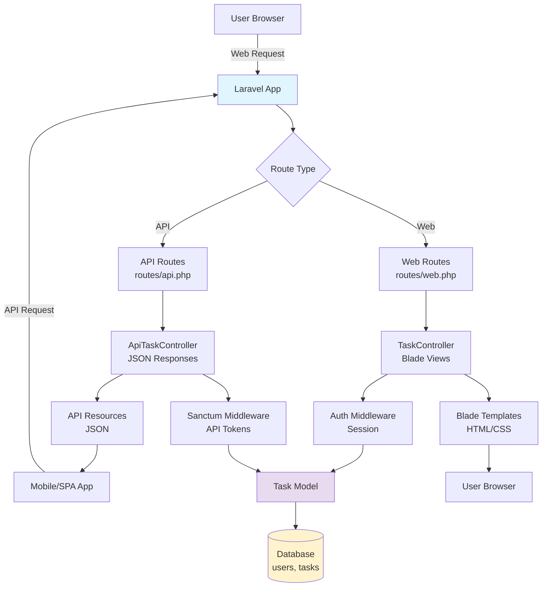

# Chapter 10: Bonus: Hands-On Mini Project

## Overview

Congratulations! You've made it through the entire series, learning how Python concepts translate to PHP and Laravel. You've explored modern PHP syntax, Laravel's developer experience, Eloquent ORM, REST APIs, testing, deployment, and the ecosystem. Now it's time to bring everything together by building a **complete, production-ready Task Manager application**.

This chapter is different from the previous ones. Instead of comparing Python to Laravel, we'll build a full application that demonstrates everything you've learned. We'll create **both a traditional full-stack Laravel application with Blade views AND an API-only backend**, showing how Laravel excels at both approaches. You'll implement authentication with Sanctum, Eloquent relationships, comprehensive testing, and deploy to production using Laravel Forge's latest features—including the new Laravel VPS and zero-downtime deployments.

This project will showcase how easy Laravel makes common development tasks. You'll see authentication implemented in minutes (not hours), relationships that "just work," testing that's actually enjoyable, and deployment that's nearly automatic. By the end, you'll have a working application you can extend, deploy, and use as a portfolio piece—demonstrating your ability to build production-ready Laravel applications.

## Prerequisites

Before starting this chapter, you should have:

- Completion of [Chapter 05](/series/python-developers-love-php-laravel/chapters/05-working-with-data-eloquent-orm-database-workflow) or equivalent understanding of Eloquent ORM and relationships
- Completion of [Chapter 06](/series/python-developers-love-php-laravel/chapters/06-building-rest-apis-integrations-python-to-laravel) or equivalent understanding of REST APIs and Sanctum basics
- Completion of [Chapter 07](/series/python-developers-love-php-laravel/chapters/07-testing-deployment-devops-best-practices) or equivalent understanding of testing and deployment concepts
- PHP 8.4+ installed and working
- Composer installed and configured
- Laravel 11.x installed (we'll create a new project)
- SQLite, MySQL, or PostgreSQL available (we'll use SQLite for simplicity)
- Basic familiarity with terminal/command line
- **Estimated Time**: ~3-4 hours (or ~15 minutes for Quick Start)

**Verify your setup:**

```bash
# Check PHP version (should show PHP 8.4+)
php --version

# Check Composer is installed
composer --version

# Check Laravel installer (or we'll install it)
composer global require laravel/installer
laravel --version

# Expected output: Laravel Installer 5.x.x (or similar)
```

## What You'll Build

By the end of this chapter, you will have created:

- A complete Task Manager application with full CRUD operations
- User authentication system (both web and API)
- Task model with relationships to users
- Full-stack application with Blade views (index, create, edit, show)
- REST API with Sanctum authentication and rate limiting
- Form Request classes for clean validation separation
- Advanced features: task status, priorities, due dates, search, pagination
- Comprehensive test suite (feature tests for web and API)
- Production deployment on Laravel Forge with Laravel VPS
- Understanding of how Laravel makes complex features simple

## Task Manager Application Architecture

Here's the complete architecture of your Task Manager application:



**Key Features:**

- **Dual Interface**: Same codebase, two interfaces (web + API)
- **User Authentication**: Laravel's built-in auth + Sanctum for APIs
- **User-Scoped Tasks**: Users only see and manage their own tasks
- **Relationships**: Tasks belong to users (belongsTo relationship)
- **CRUD Operations**: Create, read, update, delete tasks
- **Advanced Features**: Status, priorities, due dates, search, pagination
- **Testing**: Comprehensive test coverage for both web and API
- **Deployment**: Production-ready deployment with Forge

## Quick Start

Want to see the Task Manager in action immediately? Here's how to get it running in ~15 minutes:

```bash
# 1. Create new Laravel project
laravel new task-manager
cd task-manager

# 2. Install Sanctum for API authentication
php artisan install:api

# 3. Create Task migration
php artisan make:migration create_tasks_table

# 4. Create Task model
php artisan make:model Task -m

# 5. Run migrations
php artisan migrate

# 6. Create controllers
php artisan make:controller TaskController --resource
php artisan make:controller Api/TaskController --api

# 7. Start development server
php artisan serve

# 8. Visit http://localhost:8000
```

Expected result: You'll have a basic Laravel application running. We'll build out the complete Task Manager step by step in this chapter.

::: info Complete Code Samples
All code samples for this chapter are available in [`chapter-10/`](../code/chapter-10/). The directory includes models, controllers, views, routes, tests, and deployment guides. Each file is complete and ready to use.
:::

## Objectives

- Build a complete Laravel application from scratch using all concepts from the series
- Implement both full-stack (Blade) and API-only approaches in the same application
- Master Sanctum authentication for API token management
- Create and test Eloquent relationships (users and tasks)
- Write comprehensive feature tests for web routes and API endpoints
- Deploy to production using Laravel Forge with Laravel VPS and zero-downtime deployments
- Understand production deployment considerations and best practices
- Recognize how Laravel makes complex features simple and enjoyable

## Step 1: Project Setup & Database (~15 min)

### Goal

Create a new Laravel project, configure the database, and set up the initial migrations for users and tasks.

### Actions

1. **Create a new Laravel project**:

```bash
# Create new Laravel project called 'task-manager'
laravel new task-manager

# Navigate into the project directory
cd task-manager

# Verify Laravel is working
php artisan --version
```

Expected output: `Laravel Framework 11.x.x` (or similar version)

2. **Configure database** (we'll use SQLite for simplicity):

```bash
# Create SQLite database file
touch database/database.sqlite
```

Update `.env` file:

```env
DB_CONNECTION=sqlite
DB_DATABASE=/absolute/path/to/task-manager/database/database.sqlite
```

Or use relative path:

```env
DB_CONNECTION=sqlite
DB_DATABASE=database/database.sqlite
```

::: tip Database Choice
We're using SQLite for development simplicity—no database server needed! For production, you'd use MySQL or PostgreSQL. Laravel makes switching databases trivial—just change the `.env` file.
:::

3. **Create tasks migration**:

```bash
# Create migration for tasks table
php artisan make:migration create_tasks_table
```

This creates a file in `database/migrations/` with a timestamp prefix. Edit it:

```php
<?php

declare(strict_types=1);

use Illuminate\Database\Migrations\Migration;
use Illuminate\Database\Schema\Blueprint;
use Illuminate\Support\Facades\Schema;

return new class extends Migration
{
    /**
     * Run the migrations.
     */
    public function up(): void
    {
        Schema::create('tasks', function (Blueprint $table) {
            $table->id();
            $table->foreignId('user_id')->constrained()->onDelete('cascade');
            $table->string('title');
            $table->text('description')->nullable();
            $table->enum('status', ['pending', 'in_progress', 'completed'])->default('pending');
            $table->enum('priority', ['low', 'medium', 'high'])->default('medium');
            $table->date('due_date')->nullable();
            $table->timestamps();
        });
    }

    /**
     * Reverse the migrations.
     */
    public function down(): void
    {
        Schema::dropIfExists('tasks');
    }
};
```

4. **Run migrations**:

```bash
# Run all pending migrations
php artisan migrate
```

Expected output: Migration table and tasks table created successfully.

### Expected Result

You should have:

- A new Laravel project called `task-manager`
- SQLite database configured and created
- `tasks` table migration created with columns: id, user_id, title, description, status, priority, due_date, timestamps
- Foreign key relationship to users table (which Laravel creates automatically)

### Why It Works

Laravel's migration system is similar to Django's migrations—you define schema changes in code, and Laravel applies them to your database. The `foreignId('user_id')->constrained()` creates a foreign key relationship to the `users` table, ensuring data integrity. SQLite is perfect for development because it requires no database server setup.

### Troubleshooting

- **"Database connection failed"** — Check your `.env` file has `DB_CONNECTION=sqlite` and `DB_DATABASE` points to the correct path. Use absolute paths if relative paths don't work.
- **"Migration table not found"** — Run `php artisan migrate` first to create the migrations table, then run migrations again.
- **"Foreign key constraint fails"** — Make sure the `users` table exists (Laravel creates it automatically with `php artisan migrate`).

## Step 2: Models & Relationships (~20 min)

### Goal

Create User and Task models with Eloquent relationships, factories, and seeders for testing and development.

### Actions

1. **Update User model** (add Sanctum trait for API authentication):

The User model already exists. Update `app/Models/User.php`:

```php
<?php

declare(strict_types=1);

namespace App\Models;

use Illuminate\Database\Eloquent\Factories\HasFactory;
use Illuminate\Foundation\Auth\User as Authenticatable;
use Illuminate\Notifications\Notifiable;
use Laravel\Sanctum\HasApiTokens;

class User extends Authenticatable
{
    use HasApiTokens, HasFactory, Notifiable;

    /**
     * The attributes that are mass assignable.
     *
     * @var array<int, string>
     */
    protected $fillable = [
        'name',
        'email',
        'password',
    ];

    /**
     * The attributes that should be hidden for serialization.
     *
     * @var array<int, string>
     */
    protected $hidden = [
        'password',
        'remember_token',
    ];

    /**
     * Get the attributes that should be cast.
     *
     * @return array<string, string>
     */
    protected function casts(): array
    {
        return [
            'email_verified_at' => 'datetime',
            'password' => 'hashed',
        ];
    }

    /**
     * Get the tasks for the user.
     */
    public function tasks()
    {
        return $this->hasMany(Task::class);
    }
}
```

2. **Create Task model**:

```bash
# Create Task model
php artisan make:model Task
```

Edit `app/Models/Task.php`:

```php
<?php

declare(strict_types=1);

namespace App\Models;

use Illuminate\Database\Eloquent\Factories\HasFactory;
use Illuminate\Database\Eloquent\Model;
use Illuminate\Database\Eloquent\Relations\BelongsTo;

class Task extends Model
{
    use HasFactory;

    /**
     * The attributes that are mass assignable.
     *
     * @var array<int, string>
     */
    protected $fillable = [
        'user_id',
        'title',
        'description',
        'status',
        'priority',
        'due_date',
    ];

    /**
     * Get the attributes that should be cast.
     *
     * @return array<string, string>
     */
    protected function casts(): array
    {
        return [
            'due_date' => 'date',
        ];
    }

    /**
     * Get the user that owns the task.
     */
    public function user(): BelongsTo
    {
        return $this->belongsTo(User::class);
    }

    /**
     * Scope a query to only include pending tasks.
     */
    public function scopePending($query)
    {
        return $query->where('status', 'pending');
    }

    /**
     * Scope a query to only include completed tasks.
     */
    public function scopeCompleted($query)
    {
        return $query->where('status', 'completed');
    }

    /**
     * Scope a query to filter by priority.
     */
    public function scopePriority($query, string $priority)
    {
        return $query->where('priority', $priority);
    }
}
```

3. **Create Task factory**:

```bash
# Create factory for Task model
php artisan make:factory TaskFactory
```

Edit `database/factories/TaskFactory.php`:

```php
<?php

declare(strict_types=1);

namespace Database\Factories;

use App\Models\Task;
use App\Models\User;
use Illuminate\Database\Eloquent\Factories\Factory;

/**
 * @extends \Illuminate\Database\Eloquent\Factories\Factory<\App\Models\Task>
 */
class TaskFactory extends Factory
{
    /**
     * Define the model's default state.
     *
     * @return array<string, mixed>
     */
    public function definition(): array
    {
        return [
            'user_id' => User::factory(),
            'title' => fake()->sentence(),
            'description' => fake()->paragraph(),
            'status' => fake()->randomElement(['pending', 'in_progress', 'completed']),
            'priority' => fake()->randomElement(['low', 'medium', 'high']),
            'due_date' => fake()->optional()->dateTimeBetween('now', '+30 days'),
        ];
    }
}
```

4. **Create Task seeder**:

```bash
# Create seeder for tasks
php artisan make:seeder TaskSeeder
```

Edit `database/seeders/TaskSeeder.php`:

```php
<?php

declare(strict_types=1);

namespace Database\Seeders;

use App\Models\Task;
use App\Models\User;
use Illuminate\Database\Seeder;

class TaskSeeder extends Seeder
{
    /**
     * Run the database seeds.
     */
    public function run(): void
    {
        // Create a test user
        $user = User::factory()->create([
            'name' => 'Test User',
            'email' => 'test@example.com',
            'password' => bcrypt('password'),
        ]);

        // Create tasks for the test user
        Task::factory()->count(10)->create([
            'user_id' => $user->id,
        ]);

        // Create additional users with tasks
        User::factory()->count(5)->create()->each(function ($user) {
            Task::factory()->count(5)->create([
                'user_id' => $user->id,
            ]);
        });
    }
}
```

5. **Run seeders**:

```bash
# Run database seeders
php artisan db:seed --class=TaskSeeder
```

Or update `database/seeders/DatabaseSeeder.php`:

```php
public function run(): void
{
    $this->call([
        TaskSeeder::class,
    ]);
}
```

Then run:

```bash
php artisan db:seed
```

### Expected Result

You should have:

- User model with `HasApiTokens` trait and `tasks()` relationship
- Task model with `user()` relationship and query scopes
- TaskFactory for generating test data
- TaskSeeder that creates test users and tasks
- Database populated with sample data

### Why It Works

Eloquent relationships work just like Django ORM relationships. The `hasMany()` method on User creates a one-to-many relationship (one user has many tasks), and `belongsTo()` on Task creates the inverse relationship (each task belongs to one user). Factories and seeders make it easy to generate test data—similar to Django's fixtures but more flexible.

### Troubleshooting

- **"Class 'HasApiTokens' not found"** — Install Sanctum: `php artisan install:api` (we'll do this in Step 4, but you can do it now).
- **"Relationship method not found"** — Make sure both models have the relationship methods defined and the foreign key column exists in the database.
- **"Factory not found"** — Run `composer dump-autoload` to refresh autoloader, or make sure the factory is in the correct namespace.

## Step 3: Full-Stack Application (Blade) (~40 min)

### Goal

Create a traditional full-stack Laravel application with Blade views, authentication, and CRUD operations for tasks.

### Actions

1. **Install Laravel Breeze** (for authentication scaffolding):

```bash
# Install Laravel Breeze
composer require laravel/breeze --dev

# Install Breeze with Blade stack
php artisan breeze:install blade

# Install npm dependencies
npm install

# Build assets
npm run build

# Run migrations (Breeze creates additional tables)
php artisan migrate
```

This creates authentication views (login, register, password reset) and routes automatically.

2. **Create TaskController**:

```bash
# Create resource controller for tasks
php artisan make:controller TaskController --resource
```

Edit `app/Http/Controllers/TaskController.php`:

```php
<?php

declare(strict_types=1);

namespace App\Http\Controllers;

use App\Http\Requests\StoreTaskRequest;
use App\Http\Requests\UpdateTaskRequest;
use App\Models\Task;
use Illuminate\Http\RedirectResponse;
use Illuminate\Http\Request;
use Illuminate\View\View;

class TaskController extends Controller
{
    /**
     * Display a listing of the user's tasks.
     */
    public function index(Request $request): View
    {
        $query = auth()->user()->tasks()->latest();

        // Filter by status
        if ($request->has('status') && $request->status !== '') {
            $query->where('status', $request->status);
        }

        // Filter by priority
        if ($request->has('priority') && $request->priority !== '') {
            $query->where('priority', $request->priority);
        }

        // Search
        if ($request->has('search') && $request->search !== '') {
            $query->where(function ($q) use ($request) {
                $q->where('title', 'like', '%' . $request->search . '%')
                  ->orWhere('description', 'like', '%' . $request->search . '%');
            });
        }

        $tasks = $query->paginate(10);

        return view('tasks.index', compact('tasks'));
    }

    /**
     * Show the form for creating a new task.
     */
    public function create(): View
    {
        return view('tasks.create');
    }

    /**
     * Store a newly created task.
     */
    public function store(StoreTaskRequest $request): RedirectResponse
    {
        auth()->user()->tasks()->create($request->validated());

        return redirect()->route('tasks.index')
            ->with('success', 'Task created successfully.');
    }

    /**
     * Display the specified task.
     */
    public function show(Task $task): View
    {
        // Ensure user can only view their own tasks
        $this->authorize('view', $task);

        return view('tasks.show', compact('task'));
    }

    /**
     * Show the form for editing the specified task.
     */
    public function edit(Task $task): View
    {
        $this->authorize('update', $task);

        return view('tasks.edit', compact('task'));
    }

    /**
     * Update the specified task.
     */
    public function update(UpdateTaskRequest $request, Task $task): RedirectResponse
    {
        $this->authorize('update', $task);

        $task->update($request->validated());

        return redirect()->route('tasks.index')
            ->with('success', 'Task updated successfully.');
    }

    /**
     * Remove the specified task.
     */
    public function destroy(Task $task): RedirectResponse
    {
        $this->authorize('delete', $task);

        $task->delete();

        return redirect()->route('tasks.index')
            ->with('success', 'Task deleted successfully.');
    }
}
```

3. **Create Task Policy** (for authorization):

```bash
# Create policy for Task model
php artisan make:policy TaskPolicy --model=Task
```

Edit `app/Policies/TaskPolicy.php`:

```php
<?php

declare(strict_types=1);

namespace App\Policies;

use App\Models\Task;
use App\Models\User;

class TaskPolicy
{
    /**
     * Determine if the user can view the task.
     */
    public function view(User $user, Task $task): bool
    {
        return $user->id === $task->user_id;
    }

    /**
     * Determine if the user can update the task.
     */
    public function update(User $user, Task $task): bool
    {
        return $user->id === $task->user_id;
    }

    /**
     * Determine if the user can delete the task.
     */
    public function delete(User $user, Task $task): bool
    {
        return $user->id === $task->user_id;
    }
}
```

4. **Create Form Request classes** (for better validation organization):

Instead of inline validation in controllers, Laravel's Form Requests provide a cleaner, reusable approach. Create Form Request classes:

```bash
# Create Form Request for storing tasks
php artisan make:request StoreTaskRequest

# Create Form Request for updating tasks
php artisan make:request UpdateTaskRequest
```

Edit `app/Http/Requests/StoreTaskRequest.php`:

```php
<?php

declare(strict_types=1);

namespace App\Http\Requests;

use Illuminate\Foundation\Http\FormRequest;

class StoreTaskRequest extends FormRequest
{
    /**
     * Determine if the user is authorized to make this request.
     */
    public function authorize(): bool
    {
        return true; // Authorization handled by middleware
    }

    /**
     * Get the validation rules that apply to the request.
     *
     * @return array<string, \Illuminate\Contracts\Validation\ValidationRule|array<mixed>|string>
     */
    public function rules(): array
    {
        return [
            'title' => ['required', 'string', 'max:255'],
            'description' => ['nullable', 'string'],
            'status' => ['required', 'in:pending,in_progress,completed'],
            'priority' => ['required', 'in:low,medium,high'],
            'due_date' => ['nullable', 'date', 'after_or_equal:today'],
        ];
    }

    /**
     * Get custom messages for validator errors.
     *
     * @return array<string, string>
     */
    public function messages(): array
    {
        return [
            'title.required' => 'The task title is required.',
            'status.in' => 'Status must be pending, in_progress, or completed.',
            'priority.in' => 'Priority must be low, medium, or high.',
            'due_date.after_or_equal' => 'Due date must be today or in the future.',
        ];
    }
}
```

Edit `app/Http/Requests/UpdateTaskRequest.php`:

```php
<?php

declare(strict_types=1);

namespace App\Http\Requests;

use Illuminate\Foundation\Http\FormRequest;

class UpdateTaskRequest extends FormRequest
{
    /**
     * Determine if the user is authorized to make this request.
     */
    public function authorize(): bool
    {
        return true; // Authorization handled by policy
    }

    /**
     * Get the validation rules that apply to the request.
     *
     * @return array<string, \Illuminate\Contracts\Validation\ValidationRule|array<mixed>|string>
     */
    public function rules(): array
    {
        return [
            'title' => ['sometimes', 'required', 'string', 'max:255'],
            'description' => ['nullable', 'string'],
            'status' => ['sometimes', 'required', 'in:pending,in_progress,completed'],
            'priority' => ['sometimes', 'required', 'in:low,medium,high'],
            'due_date' => ['nullable', 'date', 'after_or_equal:today'],
        ];
    }
}
```

Now update `TaskController` to use Form Requests. Replace the `store` and `update` methods:

```php
use App\Http\Requests\StoreTaskRequest;
use App\Http\Requests\UpdateTaskRequest;

// ... in TaskController class ...

/**
 * Store a newly created task.
 */
public function store(StoreTaskRequest $request): RedirectResponse
{
    auth()->user()->tasks()->create($request->validated());

    return redirect()->route('tasks.index')
        ->with('success', 'Task created successfully.');
}

/**
 * Update the specified task.
 */
public function update(UpdateTaskRequest $request, Task $task): RedirectResponse
{
    $this->authorize('update', $task);

    $task->update($request->validated());

    return redirect()->route('tasks.index')
        ->with('success', 'Task updated successfully.');
}
```

::: tip Form Requests Benefits
Form Requests provide several advantages over inline validation:

- **Separation of concerns**: Validation logic is separate from controller logic
- **Reusability**: Same validation rules can be used in multiple controllers
- **Custom messages**: Easy to customize error messages
- **Authorization**: Can handle authorization logic alongside validation
- **Automatic JSON responses**: For API requests, validation errors automatically return JSON
  :::

5. **Add routes** to `routes/web.php`:

```php
<?php

use App\Http\Controllers\TaskController;
use Illuminate\Support\Facades\Route;

Route::get('/', function () {
    return view('welcome');
});

Route::middleware('auth')->group(function () {
    Route::resource('tasks', TaskController::class);
});

require __DIR__.'/auth.php';
```

6. **Create Blade views**:

Create `resources/views/tasks/index.blade.php`:

```blade
<x-app-layout>
    <x-slot name="header">
        <h2 class="font-semibold text-xl text-gray-800 leading-tight">
            {{ __('Tasks') }}
        </h2>
    </x-slot>

    <div class="py-12">
        <div class="max-w-7xl mx-auto sm:px-6 lg:px-8">
            <div class="bg-white overflow-hidden shadow-sm sm:rounded-lg">
                <div class="p-6 text-gray-900">
                    @if (session('success'))
                        <div class="mb-4 bg-green-100 border border-green-400 text-green-700 px-4 py-3 rounded">
                            {{ session('success') }}
                        </div>
                    @endif

                    <div class="mb-4 flex justify-between items-center">
                        <a href="{{ route('tasks.create') }}" class="bg-blue-500 hover:bg-blue-700 text-white font-bold py-2 px-4 rounded">
                            Create New Task
                        </a>
                    </div>

                    <!-- Filters -->
                    <form method="GET" action="{{ route('tasks.index') }}" class="mb-4">
                        <div class="grid grid-cols-1 md:grid-cols-4 gap-4">
                            <div>
                                <input type="text" name="search" placeholder="Search tasks..." value="{{ request('search') }}" class="w-full rounded-md border-gray-300">
                            </div>
                            <div>
                                <select name="status" class="w-full rounded-md border-gray-300">
                                    <option value="">All Statuses</option>
                                    <option value="pending" {{ request('status') === 'pending' ? 'selected' : '' }}>Pending</option>
                                    <option value="in_progress" {{ request('status') === 'in_progress' ? 'selected' : '' }}>In Progress</option>
                                    <option value="completed" {{ request('status') === 'completed' ? 'selected' : '' }}>Completed</option>
                                </select>
                            </div>
                            <div>
                                <select name="priority" class="w-full rounded-md border-gray-300">
                                    <option value="">All Priorities</option>
                                    <option value="low" {{ request('priority') === 'low' ? 'selected' : '' }}>Low</option>
                                    <option value="medium" {{ request('priority') === 'medium' ? 'selected' : '' }}>Medium</option>
                                    <option value="high" {{ request('priority') === 'high' ? 'selected' : '' }}>High</option>
                                </select>
                            </div>
                            <div>
                                <button type="submit" class="bg-gray-500 hover:bg-gray-700 text-white font-bold py-2 px-4 rounded w-full">
                                    Filter
                                </button>
                            </div>
                        </div>
                    </form>

                    <!-- Tasks List -->
                    <div class="overflow-x-auto">
                        <table class="min-w-full divide-y divide-gray-200">
                            <thead class="bg-gray-50">
                                <tr>
                                    <th class="px-6 py-3 text-left text-xs font-medium text-gray-500 uppercase tracking-wider">Title</th>
                                    <th class="px-6 py-3 text-left text-xs font-medium text-gray-500 uppercase tracking-wider">Status</th>
                                    <th class="px-6 py-3 text-left text-xs font-medium text-gray-500 uppercase tracking-wider">Priority</th>
                                    <th class="px-6 py-3 text-left text-xs font-medium text-gray-500 uppercase tracking-wider">Due Date</th>
                                    <th class="px-6 py-3 text-left text-xs font-medium text-gray-500 uppercase tracking-wider">Actions</th>
                                </tr>
                            </thead>
                            <tbody class="bg-white divide-y divide-gray-200">
                                @forelse ($tasks as $task)
                                    <tr>
                                        <td class="px-6 py-4 whitespace-nowrap">
                                            <a href="{{ route('tasks.show', $task) }}" class="text-blue-600 hover:text-blue-800">
                                                {{ $task->title }}
                                            </a>
                                        </td>
                                        <td class="px-6 py-4 whitespace-nowrap">
                                            <span class="px-2 inline-flex text-xs leading-5 font-semibold rounded-full
                                                @if($task->status === 'completed') bg-green-100 text-green-800
                                                @elseif($task->status === 'in_progress') bg-yellow-100 text-yellow-800
                                                @else bg-gray-100 text-gray-800
                                                @endif">
                                                {{ ucfirst(str_replace('_', ' ', $task->status)) }}
                                            </span>
                                        </td>
                                        <td class="px-6 py-4 whitespace-nowrap">
                                            <span class="px-2 inline-flex text-xs leading-5 font-semibold rounded-full
                                                @if($task->priority === 'high') bg-red-100 text-red-800
                                                @elseif($task->priority === 'medium') bg-yellow-100 text-yellow-800
                                                @else bg-gray-100 text-gray-800
                                                @endif">
                                                {{ ucfirst($task->priority) }}
                                            </span>
                                        </td>
                                        <td class="px-6 py-4 whitespace-nowrap text-sm text-gray-500">
                                            {{ $task->due_date ? $task->due_date->format('M d, Y') : '-' }}
                                        </td>
                                        <td class="px-6 py-4 whitespace-nowrap text-sm font-medium">
                                            <a href="{{ route('tasks.edit', $task) }}" class="text-indigo-600 hover:text-indigo-900 mr-3">Edit</a>
                                            <form action="{{ route('tasks.destroy', $task) }}" method="POST" class="inline">
                                                @csrf
                                                @method('DELETE')
                                                <button type="submit" class="text-red-600 hover:text-red-900" onclick="return confirm('Are you sure?')">Delete</button>
                                            </form>
                                        </td>
                                    </tr>
                                @empty
                                    <tr>
                                        <td colspan="5" class="px-6 py-4 text-center text-gray-500">
                                            No tasks found. <a href="{{ route('tasks.create') }}" class="text-blue-600">Create one?</a>
                                        </td>
                                    </tr>
                                @endforelse
                            </tbody>
                        </table>
                    </div>

                    <!-- Pagination -->
                    <div class="mt-4">
                        {{ $tasks->links() }}
                    </div>
                </div>
            </div>
        </div>
    </div>
</x-app-layout>
```

Create `resources/views/tasks/create.blade.php`:

```blade
<x-app-layout>
    <x-slot name="header">
        <h2 class="font-semibold text-xl text-gray-800 leading-tight">
            {{ __('Create Task') }}
        </h2>
    </x-slot>

    <div class="py-12">
        <div class="max-w-2xl mx-auto sm:px-6 lg:px-8">
            <div class="bg-white overflow-hidden shadow-sm sm:rounded-lg">
                <div class="p-6 text-gray-900">
                    <form method="POST" action="{{ route('tasks.store') }}">
                        @csrf

                        <div class="mb-4">
                            <label for="title" class="block text-sm font-medium text-gray-700">Title</label>
                            <input type="text" name="title" id="title" value="{{ old('title') }}" required
                                class="mt-1 block w-full rounded-md border-gray-300 shadow-sm @error('title') border-red-500 @enderror">
                            @error('title')
                                <p class="mt-1 text-sm text-red-600">{{ $message }}</p>
                            @enderror
                        </div>

                        <div class="mb-4">
                            <label for="description" class="block text-sm font-medium text-gray-700">Description</label>
                            <textarea name="description" id="description" rows="4"
                                class="mt-1 block w-full rounded-md border-gray-300 shadow-sm">{{ old('description') }}</textarea>
                            @error('description')
                                <p class="mt-1 text-sm text-red-600">{{ $message }}</p>
                            @enderror
                        </div>

                        <div class="grid grid-cols-2 gap-4 mb-4">
                            <div>
                                <label for="status" class="block text-sm font-medium text-gray-700">Status</label>
                                <select name="status" id="status" required
                                    class="mt-1 block w-full rounded-md border-gray-300 shadow-sm">
                                    <option value="pending" {{ old('status') === 'pending' ? 'selected' : '' }}>Pending</option>
                                    <option value="in_progress" {{ old('status') === 'in_progress' ? 'selected' : '' }}>In Progress</option>
                                    <option value="completed" {{ old('status') === 'completed' ? 'selected' : '' }}>Completed</option>
                                </select>
                                @error('status')
                                    <p class="mt-1 text-sm text-red-600">{{ $message }}</p>
                                @enderror
                            </div>

                            <div>
                                <label for="priority" class="block text-sm font-medium text-gray-700">Priority</label>
                                <select name="priority" id="priority" required
                                    class="mt-1 block w-full rounded-md border-gray-300 shadow-sm">
                                    <option value="low" {{ old('priority') === 'low' ? 'selected' : '' }}>Low</option>
                                    <option value="medium" {{ old('priority') === 'medium' ? 'selected' : '' }}>Medium</option>
                                    <option value="high" {{ old('priority') === 'high' ? 'selected' : '' }}>High</option>
                                </select>
                                @error('priority')
                                    <p class="mt-1 text-sm text-red-600">{{ $message }}</p>
                                @enderror
                            </div>
                        </div>

                        <div class="mb-4">
                            <label for="due_date" class="block text-sm font-medium text-gray-700">Due Date</label>
                            <input type="date" name="due_date" id="due_date" value="{{ old('due_date') }}"
                                class="mt-1 block w-full rounded-md border-gray-300 shadow-sm">
                            @error('due_date')
                                <p class="mt-1 text-sm text-red-600">{{ $message }}</p>
                            @enderror
                        </div>

                        <div class="flex items-center justify-end">
                            <a href="{{ route('tasks.index') }}" class="text-gray-600 hover:text-gray-800 mr-4">Cancel</a>
                            <button type="submit" class="bg-blue-500 hover:bg-blue-700 text-white font-bold py-2 px-4 rounded">
                                Create Task
                            </button>
                        </div>
                    </form>
                </div>
            </div>
        </div>
    </div>
</x-app-layout>
```

Create `resources/views/tasks/edit.blade.php` (similar to create, but with update action):

```blade
<x-app-layout>
    <x-slot name="header">
        <h2 class="font-semibold text-xl text-gray-800 leading-tight">
            {{ __('Edit Task') }}
        </h2>
    </x-slot>

    <div class="py-12">
        <div class="max-w-2xl mx-auto sm:px-6 lg:px-8">
            <div class="bg-white overflow-hidden shadow-sm sm:rounded-lg">
                <div class="p-6 text-gray-900">
                    <form method="POST" action="{{ route('tasks.update', $task) }}">
                        @csrf
                        @method('PUT')

                        <!-- Same form fields as create.blade.php, but with $task values -->
                        <div class="mb-4">
                            <label for="title" class="block text-sm font-medium text-gray-700">Title</label>
                            <input type="text" name="title" id="title" value="{{ old('title', $task->title) }}" required
                                class="mt-1 block w-full rounded-md border-gray-300 shadow-sm @error('title') border-red-500 @enderror">
                            @error('title')
                                <p class="mt-1 text-sm text-red-600">{{ $message }}</p>
                            @enderror
                        </div>

                        <div class="mb-4">
                            <label for="description" class="block text-sm font-medium text-gray-700">Description</label>
                            <textarea name="description" id="description" rows="4"
                                class="mt-1 block w-full rounded-md border-gray-300 shadow-sm">{{ old('description', $task->description) }}</textarea>
                        </div>

                        <div class="grid grid-cols-2 gap-4 mb-4">
                            <div>
                                <label for="status" class="block text-sm font-medium text-gray-700">Status</label>
                                <select name="status" id="status" required class="mt-1 block w-full rounded-md border-gray-300 shadow-sm">
                                    <option value="pending" {{ old('status', $task->status) === 'pending' ? 'selected' : '' }}>Pending</option>
                                    <option value="in_progress" {{ old('status', $task->status) === 'in_progress' ? 'selected' : '' }}>In Progress</option>
                                    <option value="completed" {{ old('status', $task->status) === 'completed' ? 'selected' : '' }}>Completed</option>
                                </select>
                            </div>

                            <div>
                                <label for="priority" class="block text-sm font-medium text-gray-700">Priority</label>
                                <select name="priority" id="priority" required class="mt-1 block w-full rounded-md border-gray-300 shadow-sm">
                                    <option value="low" {{ old('priority', $task->priority) === 'low' ? 'selected' : '' }}>Low</option>
                                    <option value="medium" {{ old('priority', $task->priority) === 'medium' ? 'selected' : '' }}>Medium</option>
                                    <option value="high" {{ old('priority', $task->priority) === 'high' ? 'selected' : '' }}>High</option>
                                </select>
                            </div>
                        </div>

                        <div class="mb-4">
                            <label for="due_date" class="block text-sm font-medium text-gray-700">Due Date</label>
                            <input type="date" name="due_date" id="due_date" value="{{ old('due_date', $task->due_date?->format('Y-m-d')) }}"
                                class="mt-1 block w-full rounded-md border-gray-300 shadow-sm">
                        </div>

                        <div class="flex items-center justify-end">
                            <a href="{{ route('tasks.index') }}" class="text-gray-600 hover:text-gray-800 mr-4">Cancel</a>
                            <button type="submit" class="bg-blue-500 hover:bg-blue-700 text-white font-bold py-2 px-4 rounded">
                                Update Task
                            </button>
                        </div>
                    </form>
                </div>
            </div>
        </div>
    </div>
</x-app-layout>
```

Create `resources/views/tasks/show.blade.php`:

```blade
<x-app-layout>
    <x-slot name="header">
        <h2 class="font-semibold text-xl text-gray-800 leading-tight">
            {{ __('Task Details') }}
        </h2>
    </x-slot>

    <div class="py-12">
        <div class="max-w-2xl mx-auto sm:px-6 lg:px-8">
            <div class="bg-white overflow-hidden shadow-sm sm:rounded-lg">
                <div class="p-6 text-gray-900">
                    <div class="mb-4">
                        <h3 class="text-2xl font-bold">{{ $task->title }}</h3>
                    </div>

                    <div class="mb-4">
                        <p class="text-gray-700">{{ $task->description ?? 'No description provided.' }}</p>
                    </div>

                    <div class="grid grid-cols-2 gap-4 mb-4">
                        <div>
                            <span class="text-sm font-medium text-gray-500">Status:</span>
                            <span class="ml-2 px-2 inline-flex text-xs leading-5 font-semibold rounded-full
                                @if($task->status === 'completed') bg-green-100 text-green-800
                                @elseif($task->status === 'in_progress') bg-yellow-100 text-yellow-800
                                @else bg-gray-100 text-gray-800
                                @endif">
                                {{ ucfirst(str_replace('_', ' ', $task->status)) }}
                            </span>
                        </div>

                        <div>
                            <span class="text-sm font-medium text-gray-500">Priority:</span>
                            <span class="ml-2 px-2 inline-flex text-xs leading-5 font-semibold rounded-full
                                @if($task->priority === 'high') bg-red-100 text-red-800
                                @elseif($task->priority === 'medium') bg-yellow-100 text-yellow-800
                                @else bg-gray-100 text-gray-800
                                @endif">
                                {{ ucfirst($task->priority) }}
                            </span>
                        </div>
                    </div>

                    @if($task->due_date)
                        <div class="mb-4">
                            <span class="text-sm font-medium text-gray-500">Due Date:</span>
                            <span class="ml-2">{{ $task->due_date->format('F d, Y') }}</span>
                        </div>
                    @endif

                    <div class="mb-4">
                        <span class="text-sm font-medium text-gray-500">Created:</span>
                        <span class="ml-2">{{ $task->created_at->format('F d, Y g:i A') }}</span>
                    </div>

                    <div class="flex items-center justify-end space-x-4">
                        <a href="{{ route('tasks.index') }}" class="text-gray-600 hover:text-gray-800">Back to List</a>
                        <a href="{{ route('tasks.edit', $task) }}" class="bg-blue-500 hover:bg-blue-700 text-white font-bold py-2 px-4 rounded">
                            Edit Task
                        </a>
                    </div>
                </div>
            </div>
        </div>
    </div>
</x-app-layout>
```

6. **Test the application**:

```bash
# Start development server
php artisan serve

# Visit http://localhost:8000
# Register a new user or login
# Navigate to /tasks
```

### Expected Result

You should have:

- A fully functional web application with authentication
- Task listing page with filtering and search
- Create, edit, show, and delete task functionality
- User-scoped tasks (users only see their own tasks)
- Beautiful Blade views with Tailwind CSS styling
- Form validation and error handling

### Why It Works

Laravel Breeze provides authentication scaffolding similar to Django's `django-allauth` but simpler. The `TaskController` uses resource routing (like Django's class-based views), and Blade templates work similarly to Django templates. The authorization policy ensures users can only access their own tasks—Laravel makes this easy with policies.

### Troubleshooting

- **"Route [tasks.index] not defined"** — Make sure you've added the resource route in `routes/web.php` and run `php artisan route:list` to verify.
- **"View [tasks.index] not found"** — Ensure Blade views are in `resources/views/tasks/` directory.
- **"Policy not found"** — Register the policy in `app/Providers/AuthServiceProvider.php` or Laravel will auto-discover it (Laravel 11+).
- **"CSS not loading"** — Run `npm run build` or `npm run dev` to compile Tailwind CSS.

## Step 4: API-Only Application (Sanctum) (~35 min)

### Goal

Build an API-only backend using Sanctum for authentication, with API Resources for response formatting and protected routes.

### Actions

1. **Install and configure Sanctum**:

```bash
# Install Sanctum (if not already installed)
php artisan install:api

# This command:
# - Installs laravel/sanctum package
# - Publishes Sanctum configuration
# - Creates personal_access_tokens migration
# - Adds HasApiTokens trait to User model (we already did this)

# Run migrations
php artisan migrate
```

2. **Create API authentication controller**:

```bash
# Create API auth controller
php artisan make:controller Api/AuthController
```

Edit `app/Http/Controllers/Api/AuthController.php`:

```php
<?php

declare(strict_types=1);

namespace App\Http\Controllers\Api;

use App\Http\Controllers\Controller;
use App\Models\User;
use Illuminate\Http\JsonResponse;
use Illuminate\Http\Request;
use Illuminate\Support\Facades\Hash;
use Illuminate\Validation\ValidationException;

class AuthController extends Controller
{
    /**
     * Register a new user and return an API token.
     */
    public function register(Request $request): JsonResponse
    {
        $validated = $request->validate([
            'name' => ['required', 'string', 'max:255'],
            'email' => ['required', 'string', 'email', 'max:255', 'unique:users'],
            'password' => ['required', 'string', 'min:8', 'confirmed'],
        ]);

        $user = User::create([
            'name' => $validated['name'],
            'email' => $validated['email'],
            'password' => Hash::make($validated['password']),
        ]);

        $token = $user->createToken('api-token')->plainTextToken;

        return response()->json([
            'user' => $user,
            'token' => $token,
            'message' => 'User registered successfully',
        ], 201);
    }

    /**
     * Login user and return an API token.
     */
    public function login(Request $request): JsonResponse
    {
        $request->validate([
            'email' => ['required', 'email'],
            'password' => ['required'],
        ]);

        $user = User::where('email', $request->email)->first();

        if (! $user || ! Hash::check($request->password, $user->password)) {
            throw ValidationException::withMessages([
                'email' => ['The provided credentials are incorrect.'],
            ]);
        }

        $token = $user->createToken('api-token')->plainTextToken;

        return response()->json([
            'user' => $user,
            'token' => $token,
            'message' => 'Login successful',
        ]);
    }

    /**
     * Logout user and revoke current token.
     */
    public function logout(Request $request): JsonResponse
    {
        $request->user()->currentAccessToken()->delete();

        return response()->json([
            'message' => 'Logged out successfully',
        ]);
    }

    /**
     * Get authenticated user.
     */
    public function user(Request $request): JsonResponse
    {
        return response()->json([
            'user' => $request->user(),
        ]);
    }
}
```

3. **Create Form Request classes for API** (same as web, but can customize for API):

The Form Requests we created earlier work for both web and API. For API-specific customization, you can override the `failedValidation` method:

```php
<?php

declare(strict_types=1);

namespace App\Http\Requests;

use Illuminate\Contracts\Validation\Validator;
use Illuminate\Foundation\Http\FormRequest;
use Illuminate\Http\Exceptions\HttpResponseException;

class StoreTaskRequest extends FormRequest
{
    // ... rules and authorize methods ...

    /**
     * Handle a failed validation attempt (for API).
     */
    protected function failedValidation(Validator $validator): void
    {
        throw new HttpResponseException(
            response()->json([
                'message' => 'Validation failed',
                'errors' => $validator->errors()
            ], 422)
        );
    }
}
```

4. **Create API Task controller**:

```bash
# Create API task controller
php artisan make:controller Api/TaskController --api
```

Edit `app/Http/Controllers/Api/TaskController.php`:

```php
<?php

declare(strict_types=1);

namespace App\Http\Controllers\Api;

use App\Http\Controllers\Controller;
use App\Http\Requests\StoreTaskRequest;
use App\Http\Requests\UpdateTaskRequest;
use App\Http\Resources\TaskResource;
use App\Models\Task;
use Illuminate\Http\JsonResponse;
use Illuminate\Http\Request;
use Illuminate\Http\Resources\Json\AnonymousResourceCollection;

class TaskController extends Controller
{
    /**
     * Display a listing of the user's tasks.
     */
    public function index(Request $request): AnonymousResourceCollection
    {
        $query = $request->user()->tasks()->latest();

        // Filter by status
        if ($request->has('status') && $request->status !== '') {
            $query->where('status', $request->status);
        }

        // Filter by priority
        if ($request->has('priority') && $request->priority !== '') {
            $query->where('priority', $request->priority);
        }

        // Search
        if ($request->has('search') && $request->search !== '') {
            $query->where(function ($q) use ($request) {
                $q->where('title', 'like', '%' . $request->search . '%')
                  ->orWhere('description', 'like', '%' . $request->search . '%');
            });
        }

        $tasks = $query->paginate(10);

        return TaskResource::collection($tasks);
    }

    /**
     * Store a newly created task.
     */
    public function store(StoreTaskRequest $request): TaskResource
    {
        $task = $request->user()->tasks()->create($request->validated());

        return new TaskResource($task);
    }

    /**
     * Display the specified task.
     */
    public function show(Task $task): TaskResource
    {
        // Ensure user can only view their own tasks
        if ($task->user_id !== auth()->id()) {
            abort(403, 'Unauthorized');
        }

        return new TaskResource($task);
    }

    /**
     * Update the specified task.
     */
    public function update(UpdateTaskRequest $request, Task $task): TaskResource
    {
        // Ensure user can only update their own tasks
        if ($task->user_id !== auth()->id()) {
            abort(403, 'Unauthorized');
        }

        $task->update($request->validated());

        return new TaskResource($task);
    }

    /**
     * Remove the specified task.
     */
    public function destroy(Task $task): JsonResponse
    {
        // Ensure user can only delete their own tasks
        if ($task->user_id !== auth()->id()) {
            abort(403, 'Unauthorized');
        }

        $task->delete();

        return response()->json([
            'message' => 'Task deleted successfully',
        ], 204);
    }
}
```

4. **Create Task API Resource**:

```bash
# Create API resource for Task
php artisan make:resource TaskResource
```

Edit `app/Http/Resources/TaskResource.php`:

```php
<?php

declare(strict_types=1);

namespace App\Http\Resources;

use Illuminate\Http\Request;
use Illuminate\Http\Resources\Json\JsonResource;

class TaskResource extends JsonResource
{
    /**
     * Transform the resource into an array.
     *
     * @return array<string, mixed>
     */
    public function toArray(Request $request): array
    {
        return [
            'id' => $this->id,
            'title' => $this->title,
            'description' => $this->description,
            'status' => $this->status,
            'priority' => $this->priority,
            'due_date' => $this->due_date?->format('Y-m-d'),
            'created_at' => $this->created_at->format('Y-m-d H:i:s'),
            'updated_at' => $this->updated_at->format('Y-m-d H:i:s'),
            'user' => [
                'id' => $this->user->id,
                'name' => $this->user->name,
                'email' => $this->user->email,
            ],
        ];
    }
}
```

5. **Add API routes** to `routes/api.php` with rate limiting:

```php
<?php

use App\Http\Controllers\Api\AuthController;
use App\Http\Controllers\Api\TaskController;
use Illuminate\Support\Facades\Route;

// Public routes (with rate limiting)
Route::middleware('throttle:10,1')->group(function () {
    Route::post('/register', [AuthController::class, 'register']);
    Route::post('/login', [AuthController::class, 'login']);
});

// Protected routes (require authentication + rate limiting)
Route::middleware(['auth:sanctum', 'throttle:60,1'])->group(function () {
    Route::get('/user', [AuthController::class, 'user']);
    Route::post('/logout', [AuthController::class, 'logout']);

    Route::apiResource('tasks', TaskController::class);
});
```

::: tip Rate Limiting
Laravel's `throttle` middleware limits the number of requests a user can make:

- `throttle:60,1` means 60 requests per minute
- `throttle:10,1` means 10 requests per minute (stricter for auth endpoints)
- Rate limits are per IP address (or per authenticated user if using `throttle:60,1,user`)
- Exceeded limits return HTTP 429 (Too Many Requests) with retry information in headers

For production APIs, rate limiting prevents abuse and ensures fair usage. Public endpoints (register/login) typically have stricter limits than authenticated endpoints.
:::

6. **Configure CORS** (if needed for frontend apps):

Laravel includes CORS middleware. Update `config/cors.php`:

```php
'paths' => ['api/*', 'sanctum/csrf-cookie'],
'allowed_origins' => ['http://localhost:3000'], // Your frontend URL
'supports_credentials' => true,
```

7. **Test the API** with curl or Postman:

```bash
# Register a new user
curl -X POST http://localhost:8000/api/register \
  -H "Content-Type: application/json" \
  -d '{
    "name": "API User",
    "email": "api@example.com",
    "password": "password123",
    "password_confirmation": "password123"
  }'

# Login
curl -X POST http://localhost:8000/api/login \
  -H "Content-Type: application/json" \
  -d '{
    "email": "api@example.com",
    "password": "password123"
  }'

# Get tasks (replace TOKEN with token from login response)
curl -X GET http://localhost:8000/api/tasks \
  -H "Authorization: Bearer TOKEN"

# Create a task
curl -X POST http://localhost:8000/api/tasks \
  -H "Authorization: Bearer TOKEN" \
  -H "Content-Type: application/json" \
  -d '{
    "title": "API Task",
    "description": "Created via API",
    "status": "pending",
    "priority": "high"
  }'
```

### Expected Result

You should have:

- API authentication endpoints (register, login, logout, user)
- Protected API routes for tasks (CRUD operations)
- API Resources for consistent JSON responses
- Sanctum token authentication working
- Ability to test API endpoints with curl/Postman

### Why It Works

Sanctum provides simple API token authentication—much easier than implementing JWT manually. The `auth:sanctum` middleware automatically validates tokens from the `Authorization: Bearer {token}` header. API Resources format responses consistently (like Django REST serializers). Form Requests provide clean validation separation—validation logic is reusable and automatically returns JSON errors for API requests. Rate limiting protects your API from abuse and ensures fair usage. The same Task model works for both web and API—Laravel's flexibility shines here.

### Troubleshooting

- **"Unauthenticated" error** — Make sure you're sending the token in the `Authorization: Bearer {token}` header. Check token format: `Bearer` prefix is required.
- **"Token not found"** — Tokens are stored in `personal_access_tokens` table. Verify the table exists and migrations ran.
- **"CORS error"** — Update `config/cors.php` with your frontend origin, or use `'allowed_origins' => ['*']` for development.
- **"Route not found"** — API routes are prefixed with `/api`. Use `/api/tasks`, not `/tasks`.
- **"429 Too Many Requests"** — Rate limit exceeded. Check `X-RateLimit-Limit` and `X-RateLimit-Remaining` headers. Wait for the rate limit window to reset or adjust throttle limits.
- **"Form Request validation failing"** — Ensure Form Request classes are in `app/Http/Requests/` and properly namespaced. Check that validation rules match your data structure.

## Step 5: Advanced Features (~25 min)

### Goal

Add advanced features: task status management, due dates, priorities, search functionality, and pagination for both web and API.

### Actions

Most of these features are already implemented in Steps 3 and 4! Let's add a few enhancements:

1. **Add task completion toggle** (quick action):

Add to `TaskController` (web):

```php
/**
 * Toggle task completion status.
 */
public function toggleComplete(Task $task): RedirectResponse
{
    $this->authorize('update', $task);

    $task->update([
        'status' => $task->status === 'completed' ? 'pending' : 'completed',
    ]);

    return redirect()->route('tasks.index')
        ->with('success', 'Task status updated.');
}
```

Add route:

```php
Route::patch('/tasks/{task}/toggle-complete', [TaskController::class, 'toggleComplete'])
    ->name('tasks.toggle-complete');
```

Add to API controller:

```php
/**
 * Toggle task completion status.
 */
public function toggleComplete(Task $task): TaskResource
{
    if ($task->user_id !== auth()->id()) {
        abort(403, 'Unauthorized');
    }

    $task->update([
        'status' => $task->status === 'completed' ? 'pending' : 'completed',
    ]);

    return new TaskResource($task);
}
```

Add API route:

```php
Route::patch('/tasks/{task}/toggle-complete', [TaskController::class, 'toggleComplete']);
```

2. **Add task statistics endpoint** (API):

Add to `Api/TaskController`:

```php
/**
 * Get task statistics for authenticated user.
 */
public function statistics(Request $request): JsonResponse
{
    $user = $request->user();

    return response()->json([
        'total' => $user->tasks()->count(),
        'pending' => $user->tasks()->where('status', 'pending')->count(),
        'in_progress' => $user->tasks()->where('status', 'in_progress')->count(),
        'completed' => $user->tasks()->where('status', 'completed')->count(),
        'high_priority' => $user->tasks()->where('priority', 'high')->count(),
        'overdue' => $user->tasks()
            ->where('due_date', '<', now())
            ->where('status', '!=', 'completed')
            ->count(),
    ]);
}
```

Add route:

```php
Route::get('/tasks/statistics', [TaskController::class, 'statistics']);
```

3. **Add due date reminders** (using model accessors):

Add to `Task` model:

```php
/**
 * Get the days until due date.
 */
public function getDaysUntilDueAttribute(): ?int
{
    if (! $this->due_date) {
        return null;
    }

    return now()->diffInDays($this->due_date, false);
}

/**
 * Check if task is overdue.
 */
public function getIsOverdueAttribute(): bool
{
    if (! $this->due_date || $this->status === 'completed') {
        return false;
    }

    return $this->due_date->isPast();
}
```

Use in views:

```blade
@if($task->is_overdue)
    <span class="text-red-600 font-bold">Overdue!</span>
@elseif($task->days_until_due !== null)
    <span>Due in {{ $task->days_until_due }} days</span>
@endif
```

### Expected Result

You should have:

- Quick toggle for task completion
- Task statistics endpoint
- Overdue task detection
- Days until due date calculation
- All filtering, search, and pagination working

### Why It Works

Laravel's accessors (like Django's `@property` decorators) let you add computed attributes to models. The statistics endpoint demonstrates how easy it is to create custom API endpoints. The toggle functionality shows how Laravel's resource controllers can be extended with additional actions.

### Troubleshooting

- **"Accessor not working"** — Accessors use camelCase: `getDaysUntilDueAttribute()` becomes `$task->days_until_due`. Make sure you're using the correct attribute name.
- **"Route not found"** — Custom routes need to be defined before resource routes, or use `Route::prefix()`.

## Step 6: Testing (~20 min)

### Goal

Write comprehensive tests for both web routes and API endpoints using PHPUnit and Sanctum's testing helpers.

### Actions

1. **Create feature test for web routes**:

```bash
# Create test for TaskController
php artisan make:test TaskTest
```

Edit `tests/Feature/TaskTest.php`:

```php
<?php

declare(strict_types=1);

namespace Tests\Feature;

use App\Models\Task;
use App\Models\User;
use Illuminate\Foundation\Testing\RefreshDatabase;
use Tests\TestCase;

class TaskTest extends TestCase
{
    use RefreshDatabase;

    /**
     * Test user can view their tasks.
     */
    public function test_user_can_view_tasks_index(): void
    {
        $user = User::factory()->create();
        $tasks = Task::factory()->count(5)->create(['user_id' => $user->id]);

        $response = $this->actingAs($user)->get('/tasks');

        $response->assertStatus(200);
        $response->assertViewIs('tasks.index');
        $response->assertViewHas('tasks');
    }

    /**
     * Test user can create a task.
     */
    public function test_user_can_create_task(): void
    {
        $user = User::factory()->create();

        $response = $this->actingAs($user)->post('/tasks', [
            'title' => 'Test Task',
            'description' => 'Test Description',
            'status' => 'pending',
            'priority' => 'medium',
        ]);

        $response->assertRedirect('/tasks');
        $this->assertDatabaseHas('tasks', [
            'title' => 'Test Task',
            'user_id' => $user->id,
        ]);
    }

    /**
     * Test user can update their task.
     */
    public function test_user_can_update_task(): void
    {
        $user = User::factory()->create();
        $task = Task::factory()->create(['user_id' => $user->id]);

        $response = $this->actingAs($user)->put("/tasks/{$task->id}", [
            'title' => 'Updated Task',
            'status' => 'completed',
            'priority' => 'high',
        ]);

        $response->assertRedirect('/tasks');
        $this->assertDatabaseHas('tasks', [
            'id' => $task->id,
            'title' => 'Updated Task',
            'status' => 'completed',
        ]);
    }

    /**
     * Test user can delete their task.
     */
    public function test_user_can_delete_task(): void
    {
        $user = User::factory()->create();
        $task = Task::factory()->create(['user_id' => $user->id]);

        $response = $this->actingAs($user)->delete("/tasks/{$task->id}");

        $response->assertRedirect('/tasks');
        $this->assertDatabaseMissing('tasks', ['id' => $task->id]);
    }

    /**
     * Test user cannot view other users' tasks.
     */
    public function test_user_cannot_view_other_users_tasks(): void
    {
        $user1 = User::factory()->create();
        $user2 = User::factory()->create();
        $task = Task::factory()->create(['user_id' => $user2->id]);

        $response = $this->actingAs($user1)->get("/tasks/{$task->id}");

        $response->assertStatus(403);
    }
}
```

2. **Create API tests**:

```bash
# Create API test
php artisan make:test Api/TaskApiTest
```

Edit `tests/Feature/Api/TaskApiTest.php`:

```php
<?php

declare(strict_types=1);

namespace Tests\Feature\Api;

use App\Models\Task;
use App\Models\User;
use Illuminate\Foundation\Testing\RefreshDatabase;
use Laravel\Sanctum\Sanctum;
use Tests\TestCase;

class TaskApiTest extends TestCase
{
    use RefreshDatabase;

    /**
     * Test user can register via API.
     */
    public function test_user_can_register_via_api(): void
    {
        $response = $this->postJson('/api/register', [
            'name' => 'API User',
            'email' => 'api@example.com',
            'password' => 'password123',
            'password_confirmation' => 'password123',
        ]);

        $response->assertStatus(201);
        $response->assertJsonStructure([
            'user',
            'token',
            'message',
        ]);
        $this->assertDatabaseHas('users', ['email' => 'api@example.com']);
    }

    /**
     * Test user can login via API.
     */
    public function test_user_can_login_via_api(): void
    {
        $user = User::factory()->create([
            'email' => 'api@example.com',
            'password' => bcrypt('password123'),
        ]);

        $response = $this->postJson('/api/login', [
            'email' => 'api@example.com',
            'password' => 'password123',
        ]);

        $response->assertStatus(200);
        $response->assertJsonStructure([
            'user',
            'token',
            'message',
        ]);
    }

    /**
     * Test authenticated user can get their tasks.
     */
    public function test_authenticated_user_can_get_tasks(): void
    {
        $user = User::factory()->create();
        Task::factory()->count(5)->create(['user_id' => $user->id]);

        Sanctum::actingAs($user);

        $response = $this->getJson('/api/tasks');

        $response->assertStatus(200);
        $response->assertJsonStructure([
            'data' => [
                '*' => ['id', 'title', 'status', 'priority'],
            ],
        ]);
    }

    /**
     * Test authenticated user can create task via API.
     */
    public function test_authenticated_user_can_create_task(): void
    {
        $user = User::factory()->create();

        Sanctum::actingAs($user);

        $response = $this->postJson('/api/tasks', [
            'title' => 'API Task',
            'description' => 'Created via API',
            'status' => 'pending',
            'priority' => 'high',
        ]);

        $response->assertStatus(201);
        $response->assertJsonStructure([
            'data' => ['id', 'title', 'status', 'priority'],
        ]);
        $this->assertDatabaseHas('tasks', [
            'title' => 'API Task',
            'user_id' => $user->id,
        ]);
    }

    /**
     * Test unauthenticated user cannot access tasks.
     */
    public function test_unauthenticated_user_cannot_access_tasks(): void
    {
        $response = $this->getJson('/api/tasks');

        $response->assertStatus(401);
    }

    /**
     * Test user can get task statistics.
     */
    public function test_user_can_get_task_statistics(): void
    {
        $user = User::factory()->create();
        Task::factory()->count(3)->create(['user_id' => $user->id, 'status' => 'pending']);
        Task::factory()->count(2)->create(['user_id' => $user->id, 'status' => 'completed']);

        Sanctum::actingAs($user);

        $response = $this->getJson('/api/tasks/statistics');

        $response->assertStatus(200);
        $response->assertJson([
            'total' => 5,
            'pending' => 3,
            'completed' => 2,
        ]);
    }
}
```

3. **Run tests**:

```bash
# Run all tests
php artisan test

# Run specific test file
php artisan test --filter TaskTest

# Run with coverage (if configured)
php artisan test --coverage
```

### Expected Result

You should have:

- Feature tests for all web routes (CRUD operations)
- API tests for authentication and task endpoints
- Tests for authorization (users can't access other users' tasks)
- All tests passing

### Why It Works

Laravel's testing tools are similar to pytest—you write test methods, use assertions, and can mock/fake data. `RefreshDatabase` trait resets the database between tests (like Django's `TransactionTestCase`). `Sanctum::actingAs()` makes API testing easy—no need to manually create tokens. The test structure is clean and readable.

### Troubleshooting

- **"Database connection failed in tests"** — Tests use a separate database (usually SQLite in memory). Check `phpunit.xml` configuration.
- **"Factory not found"** — Run `composer dump-autoload` or ensure factories are in the correct namespace.
- **"Sanctum::actingAs() not working"** — Make sure you're using `Sanctum::actingAs()` for API tests, not `$this->actingAs()` (which is for web tests).

## Step 7: Deployment with Laravel Forge (~30 min)

### Goal

Deploy the Task Manager application to production using Laravel Forge's latest features: Laravel VPS provisioning and zero-downtime deployments.

### Actions

1. **Sign up for Laravel Forge**:

Visit [forge.laravel.com](https://forge.laravel.com) and sign up. Forge offers a free trial, so you can test deployment without cost.

2. **Provision a Laravel VPS** (new Forge feature):

Laravel VPS is Forge's integrated VPS service that provisions servers instantly:

- Click "Create Server" in Forge dashboard
- Select "Laravel VPS" (new option)
- Choose server size (start with smallest for testing)
- Select region closest to your users
- Click "Create Server"

Forge automatically:

- Provisions the VPS
- Installs PHP, Nginx, MySQL, Redis
- Configures firewall and security
- Sets up SSH keys

::: tip Laravel VPS Benefits
Laravel VPS eliminates the need to manually provision servers from providers like DigitalOcean or Linode. Forge handles everything—server setup, software installation, and initial configuration—in minutes instead of hours.
:::

3. **Connect your Git repository**:

- In Forge, go to your server
- Click "Sites" → "New Site"
- Enter your domain (or use Forge's provided domain for testing)
- Connect your Git repository:
  - GitHub: Authorize Forge to access your repos
  - GitLab/Bitbucket: Add repository URL and credentials
- Select branch (usually `main` or `master`)

4. **Configure environment variables**:

In Forge site settings, go to "Environment" and add:

```env
APP_NAME="Task Manager"
APP_ENV=production
APP_KEY=base64:... (generate with: php artisan key:generate)
APP_DEBUG=false
APP_URL=https://your-domain.com

DB_CONNECTION=mysql
DB_HOST=127.0.0.1
DB_PORT=3306
DB_DATABASE=forge
DB_USERNAME=forge
DB_PASSWORD=... (provided by Forge)

# Sanctum configuration
SANCTUM_STATEFUL_DOMAINS=your-domain.com
SESSION_DOMAIN=.your-domain.com
```

5. **Configure deployment script**:

Forge provides a default deployment script. Update it in "Deployment Script" section:

```bash
cd /home/forge/your-domain.com
git pull origin main

# Install/update dependencies
$FORGE_COMPOSER install --no-interaction --prefer-dist --optimize-autoloader --no-dev

# Run migrations
php artisan migrate --force

# Clear and cache configuration
php artisan config:cache
php artisan route:cache
php artisan view:cache

# Restart PHP-FPM
sudo -S service php8.4-fpm reload
```

6. **Enable zero-downtime deployments** (default in new Forge):

Zero-downtime deployments are now enabled by default for new sites. This means:

- Forge creates a new release directory
- Runs deployment script
- Symlinks to new release when ready
- Old release stays available for rollback

To verify:

- Go to "Deployment" tab
- Check "Zero-Downtime Deployments" is enabled
- Deployments will show "Deploying..." then "Deployed" without downtime

7. **Set up SSL certificate**:

- Go to "SSL" tab in site settings
- Click "Let's Encrypt"
- Enter your domain
- Click "Obtain Certificate"

Forge automatically:

- Configures SSL certificate
- Sets up auto-renewal
- Configures Nginx for HTTPS

8. **Deploy your application**:

- Click "Deploy Now" button
- Watch deployment logs in real-time
- Verify deployment succeeded

9. **Configure queue workers** (if using queues):

If you add queues later:

- Go to "Daemons" tab
- Click "New Daemon"
- Command: `php /home/forge/your-domain.com/current/artisan queue:work --sleep=3 --tries=3`
- Click "Start"

10. **Set up scheduled tasks** (if using task scheduling):

- Go to "Scheduled Jobs" tab
- Click "New Scheduled Job"
- Command: `php /home/forge/your-domain.com/current/artisan schedule:run`
- Frequency: `* * * * *` (every minute)
- Click "Create"

### Expected Result

You should have:

- Application deployed to production
- SSL certificate configured
- Zero-downtime deployments enabled
- Environment variables configured
- Database migrations run
- Application accessible via HTTPS

### Why It Works

Laravel Forge automates server provisioning, deployment, and maintenance. The new Laravel VPS feature eliminates the need to manually provision servers. Zero-downtime deployments ensure your application stays available during updates. Forge handles SSL certificates, database backups, and server monitoring—tasks that would take hours manually.

### Troubleshooting

- **"Deployment failed"** — Check deployment logs in Forge. Common issues: missing environment variables, database connection errors, or composer install failures.
- **"SSL certificate failed"** — Ensure your domain DNS points to the Forge server IP. Wait for DNS propagation (can take up to 48 hours).
- **"Database connection error"** — Verify database credentials in environment variables match Forge's database settings.
- **"500 error after deployment"** — Check Laravel logs: `tail -f storage/logs/laravel.log` on server, or view in Forge's "Logs" tab.

## Step 8: Production Considerations (~15 min)

### Goal

Understand production deployment considerations: environment variables, queue workers, scheduled tasks, error logging, and monitoring.

### Actions

1. **Environment configuration**:

Production `.env` should have:

```env
APP_ENV=production
APP_DEBUG=false
APP_URL=https://your-domain.com

# Use strong, unique APP_KEY
APP_KEY=base64:... (generated with php artisan key:generate)

# Database credentials (provided by Forge)
DB_CONNECTION=mysql
DB_HOST=127.0.0.1
DB_DATABASE=forge
DB_USERNAME=forge
DB_PASSWORD=... (secure password)

# Cache and session drivers (use Redis in production)
CACHE_DRIVER=redis
SESSION_DRIVER=redis
QUEUE_CONNECTION=redis

# Mail configuration (use real SMTP)
MAIL_MAILER=smtp
MAIL_HOST=...
MAIL_PORT=587
MAIL_USERNAME=...
MAIL_PASSWORD=...
```

2. **Queue workers** (for background jobs):

If you add queues (email sending, task processing):

```bash
# In Forge, create daemon:
php /home/forge/your-domain.com/current/artisan queue:work \
  --sleep=3 \
  --tries=3 \
  --max-time=3600
```

Or use Laravel Horizon (better for production):

```bash
composer require laravel/horizon
php artisan horizon:install
```

Configure in Forge daemon:

```bash
php /home/forge/your-domain.com/current/artisan horizon
```

3. **Scheduled tasks** (for cron jobs):

Laravel's task scheduler replaces cron. In Forge:

- Command: `php /home/forge/your-domain.com/current/artisan schedule:run`
- Frequency: `* * * * *` (every minute)

Define tasks in `app/Console/Kernel.php`:

```php
protected function schedule(Schedule $schedule): void
{
    // Example: Send task reminders daily
    $schedule->command('tasks:send-reminders')
        ->daily();
}
```

4. **Error logging and monitoring**:

Laravel logs to `storage/logs/laravel.log`. In Forge:

- View logs in "Logs" tab
- Set up error tracking (Sentry, Bugsnag, etc.)
- Monitor server resources in Forge dashboard

5. **Database backups**:

Forge automatically backs up databases:

- Go to "Backups" tab
- Configure backup frequency (daily recommended)
- Backups stored securely, can be restored with one click

6. **Performance optimization**:

Enable Laravel optimizations:

```bash
# Cache configuration
php artisan config:cache

# Cache routes
php artisan route:cache

# Cache views
php artisan view:cache

# Optimize autoloader
composer install --optimize-autoloader --no-dev
```

### Expected Result

You should understand:

- Production environment configuration
- How to set up queue workers
- How to configure scheduled tasks
- Error logging and monitoring options
- Database backup strategies
- Performance optimization techniques

### Why It Works

Laravel's production optimizations (config caching, route caching, view caching) significantly improve performance. Forge handles server management, backups, and monitoring—letting you focus on application development. Queue workers and scheduled tasks run reliably in the background, similar to Celery in Python.

### Troubleshooting

- **"Slow performance"** — Enable caching: `php artisan config:cache`, `php artisan route:cache`, `php artisan view:cache`. Use Redis for cache/sessions.
- **"Queue jobs not processing"** — Ensure queue worker daemon is running in Forge. Check logs for errors.
- **"Scheduled tasks not running"** — Verify cron job is set up in Forge "Scheduled Jobs" tab. Check `schedule:run` command runs every minute.

## Exercises

### Exercise 1: Add Task Categories

**Goal**: Extend the Task Manager with categories, demonstrating many-to-many relationships.

**Requirements:**

1. Create a `Category` model with `name` and `color` fields
2. Create a migration for `categories` table and `category_task` pivot table
3. Set up many-to-many relationship between Task and Category
4. Update TaskController to allow assigning categories when creating/editing tasks
5. Display categories in task listing and detail views
6. Add API endpoint to get all categories: `GET /api/categories`

**Validation**: Test your implementation:

```php
// Create categories
$work = Category::create(['name' => 'Work', 'color' => 'blue']);
$personal = Category::create(['name' => 'Personal', 'color' => 'green']);

// Assign categories to task
$task = Task::first();
$task->categories()->attach([$work->id, $personal->id]);

// Verify relationship
assert($task->categories->count() === 2);
assert($task->categories->contains($work));
```

Expected output: Tasks can have multiple categories, categories display in views, API endpoint returns all categories.

### Exercise 2: Add Task Comments

**Goal**: Implement a commenting system for tasks, demonstrating one-to-many relationships and nested resources.

**Requirements:**

1. Create a `Comment` model with `content`, `task_id`, and `user_id` fields
2. Set up relationships: Comment belongsTo Task and User, Task hasMany Comments
3. Create CommentController with `store` and `destroy` methods
4. Add comment form to task show page
5. Display comments in chronological order
6. Add API endpoints: `POST /api/tasks/{task}/comments` and `DELETE /api/comments/{comment}`
7. Ensure users can only delete their own comments

**Validation**: Test your implementation:

```php
// Create comment
$task = Task::first();
$comment = $task->comments()->create([
    'content' => 'This is a comment',
    'user_id' => auth()->id(),
]);

// Verify relationship
assert($task->comments->count() === 1);
assert($task->comments->first()->user->id === auth()->id());
```

Expected output: Users can add comments to tasks, comments display correctly, API endpoints work, authorization prevents deleting others' comments.

### Exercise 3: Add Email Notifications

**Goal**: Send email notifications when tasks are created or due dates approach, demonstrating Laravel's mail system.

**Requirements:**

1. Create a `TaskCreated` notification class
2. Create a `TaskDueSoon` notification class (for tasks due in 24 hours)
3. Send notification when task is created (use Laravel events/listeners or call directly)
4. Create a scheduled command to check for tasks due soon and send notifications
5. Configure mail driver (use Mailtrap or similar for testing)
6. Add notification preferences to User model (allow users to opt out)

**Validation**: Test your implementation:

```php
// Create task and verify notification sent
$task = Task::create([...]);
// Check mail logs or Mailtrap inbox for notification

// Schedule command runs daily
php artisan schedule:run
// Verify notifications sent for tasks due tomorrow
```

Expected output: Email notifications sent when tasks created, scheduled command sends reminders for due tasks, users can manage notification preferences.

### Exercise 4: Add Task Attachments

**Goal**: Allow users to attach files to tasks, demonstrating file uploads and storage.

**Requirements:**

1. Create a `TaskAttachment` model with `task_id`, `filename`, `path`, and `size` fields
2. Update task create/edit forms to allow file uploads
3. Store files in `storage/app/task-attachments/`
4. Display attachments in task show page with download links
5. Add API endpoints: `POST /api/tasks/{task}/attachments` and `DELETE /api/attachments/{attachment}`
6. Validate file types (only images and PDFs) and size (max 5MB)
7. Generate thumbnails for images

**Validation**: Test your implementation:

```bash
# Upload file via API
curl -X POST http://localhost:8000/api/tasks/1/attachments \
  -H "Authorization: Bearer {token}" \
  -F "file=@document.pdf"

# Verify file stored
ls storage/app/task-attachments/
```

Expected output: Files upload successfully, attachments display in views, API endpoints work, file validation prevents invalid uploads.

### Exercise 5: Add Task Sharing and Collaboration

**Goal**: Allow users to share tasks with other users, demonstrating many-to-many relationships and permissions.

**Requirements:**

1. Create a `task_user` pivot table for shared tasks
2. Add `sharedWith()` relationship to Task model
3. Update TaskPolicy to allow shared users to view tasks
4. Add UI to share tasks with other users (search/select users)
5. Add API endpoint: `POST /api/tasks/{task}/share` with `user_ids` array
6. Display shared tasks in user's task list
7. Add indicator showing task is shared

**Validation**: Test your implementation:

```php
// Share task with another user
$task = Task::first();
$otherUser = User::where('email', 'other@example.com')->first();
$task->sharedWith()->attach($otherUser->id);

// Verify sharing
assert($task->sharedWith->contains($otherUser));
assert($otherUser->sharedTasks->contains($task));
```

Expected output: Users can share tasks, shared users can view tasks, API endpoint works, shared tasks appear in task lists.

## Wrap-up

Congratulations! You've built a complete, production-ready Task Manager application. Let's review what you accomplished:

- **Complete CRUD application** with both web and API interfaces
- **User authentication** using Laravel's built-in auth and Sanctum
- **Form Request classes** for clean validation separation and reusable validation logic
- **Rate limiting** on API routes to protect against abuse and ensure fair usage
- **Eloquent relationships** between users and tasks
- **Advanced features** including filtering, search, pagination, and task statistics
- **Comprehensive testing** with PHPUnit for both web and API
- **Production deployment** using Laravel Forge with Laravel VPS and zero-downtime deployments
- **Understanding of production considerations** including queues, scheduled tasks, and monitoring

### Key Takeaways

1. **Laravel makes complex features simple**: Authentication, relationships, testing, and deployment are all straightforward with Laravel.

2. **Dual approach flexibility**: The same codebase can serve both traditional web applications and modern API backends with minimal duplication.

3. **Form Requests improve code quality**: Separating validation logic into Form Request classes makes code more maintainable, reusable, and testable—similar to Django forms but with automatic JSON error handling for APIs.

4. **Rate limiting is essential**: Protecting API endpoints with rate limiting prevents abuse and ensures fair usage. Laravel's throttle middleware makes this trivial to implement.

5. **Developer experience matters**: Laravel's tooling (Artisan, migrations, factories, testing) makes development enjoyable and efficient.

6. **Production-ready from the start**: Laravel's conventions and Forge's automation mean you can deploy to production quickly and confidently.

7. **Your Python skills translate**: The concepts you know from Django/Flask (MVC, ORM, migrations, testing) work the same way in Laravel—just different syntax.

### What's Next?

You now have a solid foundation in Laravel. Consider exploring:

- **Laravel Livewire** — Build dynamic interfaces without writing JavaScript
- **Laravel Inertia.js** — Build SPAs using your existing Laravel backend
- **Laravel Horizon** — Beautiful dashboard for Redis queues
- **Laravel Nova** — Admin panel for your applications
- **Laravel Vapor** — Serverless deployment platform

<ChapterCheckbox seriesId="python-developers-love-php-laravel" chapterId="10-bonus-hands-on-mini-project" />

## Further Reading

- [Laravel Documentation](https://laravel.com/docs) — Comprehensive Laravel reference
- [Laravel Sanctum Documentation](https://laravel.com/docs/sanctum) — API authentication guide
- [Laravel Forge Documentation](https://forge.laravel.com/docs) — Server management guide
- [Laravel Testing Documentation](https://laravel.com/docs/testing) — Testing best practices
- [Laravel Best Practices](https://laravelbestpractices.com/) — Community-driven best practices

---

You've completed the entire series! You now understand how Python concepts translate to PHP and Laravel, and you've built a real application. Whether you continue with Laravel or stick with Python, you have the knowledge to make informed decisions and work effectively in both ecosystems.
