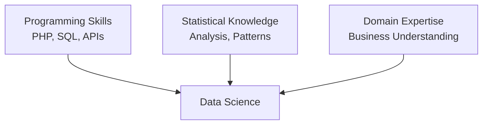
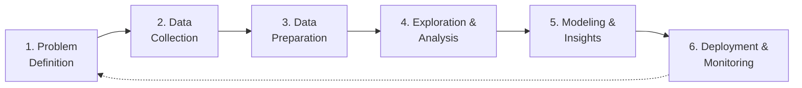
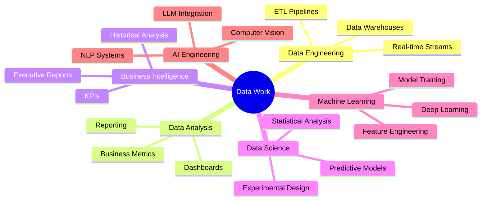

# Chapter 01: Data Science for PHP Developers: What It Is and Why It Matters

## Overview

Data science has become one of the most talked-about fields in technology, but for many PHP developers, it feels like an exclusive club reserved for Python developers with advanced mathematics degrees. This couldn't be further from the truth. Data science is fundamentally about extracting insights and value from data—and PHP developers already have many of the essential skills needed to do this work effectively.

In this chapter, we'll demystify data science by explaining what it actually means, how it differs from (and overlaps with) related fields like machine learning and analytics, and most importantly, why PHP is a legitimate and powerful tool for data science work. You'll learn about the data science lifecycle, discover where PHP fits naturally into data workflows, and see real-world examples of data science applications that PHP developers build every day.

By the end of this chapter, you'll understand that data science isn't about the programming language you use—it's about asking the right questions, understanding your data, and building systems that turn data into actionable insights. And as a PHP developer, you're already equipped with many of the skills you need to succeed in this field.

**About This Series**: Chapters 1-12 focus on building data science skills using pure PHP, covering everything from data collection and analysis to machine learning basics. Optional bonus chapters 13-20 teach you Python integration for advanced scenarios where specialized libraries provide significant advantages. You can succeed with PHP alone—Python is taught as an optional enhancement, not a requirement.

## Prerequisites

Before starting this chapter, you should have:

- PHP 8.4+ installed (verify with `php --version`)
- Basic understanding of PHP programming
- Familiarity with web development concepts (databases, APIs, HTTP)
- Curiosity about working with data and analytics
- **Estimated Time**: ~45 minutes

## What You'll Learn

By the end of this chapter, you will understand:

- What data science actually means (beyond the buzzwords)
- How data science differs from data analysis, business intelligence, and machine learning
- The complete data science lifecycle from problem to production
- Where PHP fits naturally in data science workflows
- Why this series takes a PHP-first approach
- What tools you'll use throughout the series
- Common data science use cases that PHP developers encounter
- Why your existing PHP skills are valuable for data science work
- When to use PHP vs when to integrate with Python or other tools

## Objectives

- Understand the core definition and scope of data science
- Recognize the phases of the data science lifecycle
- Identify where PHP excels in data science workflows
- Distinguish between related fields (analytics, BI, ML, AI)
- Appreciate why this series is different from Python-first resources
- Learn what tools you'll use throughout the series
- See real-world use cases for data science in PHP applications
- Recognize how your PHP skills transfer to data science work

## Step 1: Defining Data Science (~5 min)

### Goal

Understand what data science is and dispel common misconceptions.

### What Is Data Science?

At its core, **data science is the practice of extracting knowledge and insights from data using scientific methods, processes, algorithms, and systems**. It combines elements from:

- **Statistics**: Understanding patterns, distributions, and uncertainty
- **Programming**: Collecting, cleaning, and processing data
- **Domain expertise**: Knowing what questions to ask and what answers matter
- **Communication**: Presenting insights to stakeholders who make decisions

Here's what data science is **NOT**:

- ❌ It's not just machine learning or AI
- ❌ It doesn't require a PhD in mathematics
- ❌ It's not exclusive to Python (though Python is popular)
- ❌ It's not always about big data or complex algorithms
- ❌ It's not magic—it's systematic problem-solving with data

### The Data Science Venn Diagram

Think of data science as sitting at the intersection of three skills:



As a PHP developer, you already have strong programming skills. This series will help you build statistical knowledge while applying it to domains you understand (web applications, e-commerce, content management, etc.).

### Why It Works

Data science is fundamentally about answering questions with data:

- "Which customers are most likely to churn?" → **Prediction (ML)**
- "What factors influence our conversion rate?" → **Analysis**
- "How is our traffic distributed across regions?" → **Reporting**
- "Are there unusual patterns in our logs?" → **Anomaly detection**

Every one of these questions can be answered using PHP, combined with appropriate libraries, databases, and tools.

### Why PHP for Data Science?

You might wonder: "Isn't Python the language for data science?" Yes, Python dominates research and academia—but PHP dominates the web. If you're building data-driven features into existing PHP applications (recommendation engines, fraud detection, A/B testing), you have three options:

1. **Rewrite everything in Python** (expensive, risky)
2. **Use PHP for everything** (chapters 1-12 show you how)
3. **Use PHP + Python integration** (chapters 13-20 show you how)

This series teaches both approaches. You'll learn to build data science systems in pure PHP (chapters 1-12), then optionally level up with Python integration (chapters 13-20) when you need heavy statistical computing or deep learning.

**PHP's Advantages:**

- Zero context switching for PHP developers
- Direct access to your application's database and business logic
- Easy deployment to existing PHP infrastructure
- Perfect for real-time data processing in web requests

**When to Add Python:**

- Advanced machine learning (deep learning, NLP)
- Statistical analysis requiring specialized libraries
- Data science research and experimentation
- Processing massive datasets (100GB+)

### A Simple PHP Data Science Example

Let's see data science in action with pure PHP—no external libraries needed:

```php
<?php

declare(strict_types=1);

// Sample sales data for the week
$sales = [100, 150, 200, 175, 300];

// Calculate average
$average = array_sum($sales) / count($sales);

// Calculate growth trend (first day to last day)
$firstDay = $sales[0];
$lastDay = $sales[count($sales) - 1];
$trend = (($lastDay - $firstDay) / $firstDay) * 100;

// Find best and worst days
$bestDay = max($sales);
$worstDay = min($sales);

// Output insights
echo "Sales Analysis:\n";
echo "Average daily sales: $" . number_format($average, 2) . "\n";
echo "Growth trend: " . number_format($trend, 2) . "%\n";
echo "Best day: $" . number_format($bestDay, 2) . "\n";
echo "Worst day: $" . number_format($worstDay, 2) . "\n";
```

**Output:**

```
Sales Analysis:
Average daily sales: $185.00
Growth trend: 200.00%
Best day: $300.00
Worst day: $100.00
```

This simple example demonstrates core data science concepts: collecting data, calculating statistics, identifying patterns, and presenting insights. Throughout this series, you'll build on these fundamentals to create sophisticated data-driven applications.

## Step 2: The Data Science Lifecycle (~8 min)

### Goal

Understand the complete workflow from problem definition to production deployment.

### The Six Phases

Data science projects follow a predictable lifecycle:



::: info Learning Path
We'll explore each phase in detail throughout chapters 3-12, with hands-on PHP implementations and real-world examples.
:::

#### Phase 1: Problem Definition

Before touching any data, you must define:

- What question are you trying to answer?
- What would a successful outcome look like?
- What data do you have access to?
- What constraints exist (time, resources, privacy)?

**Example**: "We want to reduce customer support costs by predicting which help articles users need based on their current page."

#### Phase 2: Data Collection

Gathering data from various sources:

- **Databases**: SQL queries, ORM models
- **APIs**: REST, GraphQL, third-party services
- **Files**: CSV, JSON, XML, logs
- **Web scraping**: Ethical extraction from websites
- **Streams**: Real-time data, message queues

**PHP excels here**: You already know how to query databases, consume APIs, read files, and process HTTP requests.

#### Phase 3: Data Preparation

Cleaning and transforming messy real-world data:

- Handling missing values
- Removing duplicates
- Normalizing formats (dates, currencies, text)
- Encoding categorical data
- Splitting datasets for training/testing

**PHP excels here too**: Array manipulation, string processing, validation, and transformation are PHP's bread and butter.

#### Phase 4: Exploration & Analysis

Understanding your data through:

- Summary statistics (mean, median, distribution)
- Visualizations (charts, graphs, distributions)
- Correlations (which variables relate to each other)
- Anomaly detection (finding outliers)

**PHP can handle this**: Using PHP libraries for statistics and generating data for visualization libraries.

#### Phase 5: Modeling & Insights

Applying techniques to extract insights:

- **Statistical analysis**: Hypothesis testing, confidence intervals
- **Machine learning**: Training predictive models
- **Segmentation**: Clustering similar data points
- **Forecasting**: Predicting future trends

**PHP's role**: Either using PHP ML libraries or integrating with Python/R models via APIs.

#### Phase 6: Deployment & Monitoring

Putting insights into production:

- Creating APIs for predictions
- Building dashboards and reports
- Scheduling automated analysis
- Monitoring data quality and model performance
- Iterating based on feedback

**PHP shines here**: Web servers, APIs, cron jobs, logging, monitoring—this is PHP's home turf.

### Example: Complete Lifecycle in PHP Context

Let's see how a PHP developer might work through all six phases:

**Scenario**: E-commerce site wants to recommend products to users.

1. **Problem**: "Increase average order value by recommending complementary products"
2. **Data Collection**: Query order history from MySQL, pull product catalog via API
3. **Data Preparation**: Clean product names, handle missing categories, create user-item matrix
4. **Exploration**: Analyze which products are frequently bought together
5. **Modeling**: Build collaborative filtering recommendation engine (PHP-ML or Python API)
6. **Deployment**: Create PHP API endpoint that Laravel app calls on product pages

**Result**: Pure PHP pipeline from data to production feature.

### Why It Works

PHP developers already understand 4 of the 6 phases deeply (collection, preparation, deployment, monitoring). The new skills are exploration/analysis and modeling—which this series teaches you.

## Step 3: Data Science vs Related Fields (~5 min)

### Goal

Distinguish data science from similar but distinct disciplines.

### The Landscape



#### Data Engineering

**Focus**: Building infrastructure for data collection, storage, and processing.

**Skills**: Databases, pipelines, ETL, data warehouses, streaming.

**PHP's role**: Very strong—PHP is excellent for ETL scripts, API integration, and data pipelines.

#### Data Analysis

**Focus**: Examining data to answer specific business questions.

**Skills**: SQL, Excel, visualization, descriptive statistics.

**PHP's role**: Strong—generating reports, querying databases, creating dashboards.

#### Business Intelligence (BI)

**Focus**: Historical analysis and reporting for business decision-making.

**Skills**: SQL, BI tools (Tableau, Power BI), dashboards.

**PHP's role**: Moderate—PHP often feeds data to BI tools or builds custom dashboards.

#### Data Science

**Focus**: Extracting insights using statistics, modeling, and experimentation.

**Skills**: Statistics, programming, ML, domain knowledge.

**PHP's role**: Strong—especially for web-integrated data science applications.

#### Machine Learning

**Focus**: Building systems that learn from data and make predictions.

**Skills**: Algorithms, model training, evaluation, feature engineering.

**PHP's role**: Moderate—PHP can train simple models or integrate with Python ML services.

#### AI Engineering

**Focus**: Implementing AI capabilities like language models, vision, speech.

**Skills**: API integration, model serving, prompt engineering.

**PHP's role**: Strong—integrating OpenAI, Claude, vision APIs into PHP applications.

### Where the Lines Blur

In practice, data science roles often overlap:

- A "data scientist" at a startup might do everything (engineering + analysis + modeling)
- A "data analyst" at a large company might build ML models
- A "PHP developer" might be the de facto data engineer building ETL pipelines

**The key point**: PHP developers already do data work—you're just learning to do it more systematically and scientifically.

## Step 4: Why PHP for Data Science? (~6 min)

### Goal

Understand PHP's strengths and limitations for data science work.

### PHP's Strengths in Data Science

#### 1. Web-Native Data Collection

PHP excels at:

- Consuming REST APIs and web services
- Web scraping with libraries like Guzzle, Symfony HTTP Client
- Authenticating with OAuth, JWT, API keys
- Handling rate limiting and retries
- Processing webhooks and callbacks

**Example**: Collecting data from Stripe API, Shopify, Twitter, or any web service.

#### 2. Database Integration

PHP has mature, battle-tested database tooling:

- PDO for multiple database types
- Eloquent ORM (Laravel)
- Doctrine ORM (Symfony)
- Query builders for complex analytical queries
- Connection pooling and optimization

**Example**: Extracting analytics data from MySQL, PostgreSQL, or MongoDB.

#### 3. Data Processing & ETL

PHP's array manipulation is perfect for data transformations:

- `array_map()`, `array_filter()`, `array_reduce()`
- Generator functions for memory-efficient streaming
- JSON and CSV processing built-in
- Strong string manipulation for cleaning text data

**Example**: Cleaning and transforming CSV exports before loading into a database.

#### 4. Production Deployment

PHP is designed for production web applications:

- Battle-tested frameworks (Laravel, Symfony)
- Mature deployment ecosystems (Docker, Kubernetes, serverless)
- Excellent caching (Redis, Memcached)
- Queue systems for background processing
- Logging and monitoring tools

**Example**: Deploying a recommendation API endpoint in Laravel.

#### 5. Cost-Effectiveness

Most PHP developers already have:

- Existing infrastructure (web servers, databases)
- Familiar deployment pipelines
- Team knowledge and expertise
- Mature library ecosystems

**Result**: You can add data science capabilities without rewriting everything in Python.

### PHP's Limitations

Be honest about where PHP struggles:

#### 1. Scientific Computing Libraries

Python has NumPy, pandas, SciPy—mature, optimized libraries with decades of development. PHP has alternatives (PHP-ML, MathPHP) but they're less mature and have smaller communities.

#### 2. Machine Learning Ecosystem

Python dominates ML with scikit-learn, TensorFlow, PyTorch. PHP has PHP-ML and Rubix ML, which are good for simple models but can't match Python's depth.

#### 3. Notebook Environments

Jupyter Notebooks are the standard for exploratory data work. PHP has alternatives (PsySH, Jupyter PHP kernel) but they're not as polished.

#### 4. Academic/Research Focus

Most data science research and courses use Python/R, so finding PHP-specific resources is harder.

### The Practical Solution: Hybrid Approach

**Use PHP where it's strong, integrate Python where needed:**


**PHP handles**:

- Data collection from web sources
- Cleaning and validation
- Serving predictions via API
- Building user interfaces

**Python handles**:

- Complex model training
- Deep learning tasks
- Advanced statistical analysis

**Result**: Best of both worlds—use PHP where it excels, delegate specialized ML tasks to Python when needed.

## Step 5: Real-World Use Cases (~8 min)

### Goal

See concrete examples of data science applications PHP developers build.

### Use Case 1: Customer Analytics Dashboard

**Problem**: E-commerce site needs to understand customer behavior.

**Solution**:

```php
<?php

declare(strict_types=1);

// Collect data from database
$customers = DB::table('orders')
    ->select(
        'customer_id',
        DB::raw('COUNT(*) as order_count'),
        DB::raw('SUM(total) as lifetime_value'),
        DB::raw('AVG(total) as avg_order_value'),
        DB::raw('MAX(created_at) as last_order_date')
    )
    ->groupBy('customer_id')
    ->get();

// Segment customers
$segments = [
    'high_value' => $customers->where('lifetime_value', '>', 1000)->count(),
    'at_risk' => $customers->where('last_order_date', '<', now()->subMonths(6))->count(),
    'new' => $customers->where('order_count', '=', 1)->count(),
];

// Generate insights
echo "Customer Segments:\n";
echo "High Value: {$segments['high_value']} customers\n";
echo "At Risk: {$segments['at_risk']} customers\n";
echo "New: {$segments['new']} customers\n";
```

**PHP's role**: Data collection, segmentation logic, dashboard API.

::: info Code Example
The complete implementation is available in [`customer-analytics.php`](https://github.com/dalehurley/codewithphp/blob/main/code/data-science-php-developers/chapter-01/customer-analytics.php).
:::

### Use Case 2: A/B Test Analysis

**Problem**: Marketing team wants to know if a new button color increases conversions.

**Solution**:

```php
<?php

declare(strict_types=1);

// Collect experiment data
$controlGroup = DB::table('events')
    ->where('variant', 'control')
    ->where('event_type', 'conversion')
    ->count();

$testGroup = DB::table('events')
    ->where('variant', 'test')
    ->where('event_type', 'conversion')
    ->count();

$controlViews = DB::table('events')
    ->where('variant', 'control')
    ->where('event_type', 'view')
    ->count();

$testViews = DB::table('events')
    ->where('variant', 'test')
    ->where('event_type', 'view')
    ->count();

// Calculate conversion rates
$controlRate = $controlGroup / $controlViews;
$testRate = $testGroup / $testViews;
$lift = (($testRate - $controlRate) / $controlRate) * 100;

echo "A/B Test Results:\n";
echo "Control: " . number_format($controlRate * 100, 2) . "%\n";
echo "Test: " . number_format($testRate * 100, 2) . "%\n";
echo "Lift: " . number_format($lift, 2) . "%\n";

// Statistical significance (simplified)
// In production, use proper statistical tests
if ($testGroup > 100 && $lift > 10) {
    echo "✅ Test variant shows significant improvement\n";
} else {
    echo "⚠️ Not enough data or lift to declare winner\n";
}
```

**PHP's role**: Event tracking, statistical calculations, automated reporting.

::: info Code Example
The complete implementation is available in [`ab-test-analysis.php`](https://github.com/dalehurley/codewithphp/blob/main/code/data-science-php-developers/chapter-01/ab-test-analysis.php).
:::

### Use Case 3: Recommendation Engine

**Problem**: Blog site wants to suggest related articles.

**Solution**:

```php
<?php

declare(strict_types=1);

final class ArticleRecommender
{
    public function __construct(
        private Connection $db
    ) {}

    /**
     * Find similar articles based on tag overlap.
     */
    public function getSimilarArticles(int $articleId, int $limit = 5): array
    {
        // Get tags for current article
        $currentTags = DB::table('article_tags')
            ->where('article_id', $articleId)
            ->pluck('tag_id')
            ->toArray();

        // Find articles with overlapping tags
        $similar = DB::table('articles')
            ->select('articles.*', DB::raw('COUNT(article_tags.tag_id) as tag_overlap'))
            ->join('article_tags', 'articles.id', '=', 'article_tags.article_id')
            ->whereIn('article_tags.tag_id', $currentTags)
            ->where('articles.id', '!=', $articleId)
            ->groupBy('articles.id')
            ->orderByDesc('tag_overlap')
            ->orderByDesc('articles.views')
            ->limit($limit)
            ->get();

        return $similar->toArray();
    }
}
```

**PHP's role**: Building the recommendation logic, serving via API, caching results.

::: info Code Example
The complete implementation is available in [`article-recommender.php`](https://github.com/dalehurley/codewithphp/blob/main/code/data-science-php-developers/chapter-01/article-recommender.php).
:::

### Use Case 4: Anomaly Detection in Logs

**Problem**: DevOps team needs to detect unusual error patterns.

**Solution**:

```php
<?php

declare(strict_types=1);

final class LogAnomalyDetector
{
    public function detectSpikes(string $logType, int $thresholdMultiplier = 3): array
    {
        // Get error counts per hour for last 7 days
        $counts = DB::table('logs')
            ->select(
                DB::raw('DATE_FORMAT(created_at, "%Y-%m-%d %H:00:00") as hour'),
                DB::raw('COUNT(*) as error_count')
            )
            ->where('log_type', $logType)
            ->where('created_at', '>=', now()->subDays(7))
            ->groupBy('hour')
            ->get();

        // Calculate mean and standard deviation
        $values = $counts->pluck('error_count')->toArray();
        $mean = array_sum($values) / count($values);
        $variance = array_sum(array_map(fn($x) => pow($x - $mean, 2), $values)) / count($values);
        $stdDev = sqrt($variance);

        // Detect anomalies
        $threshold = $mean + ($thresholdMultiplier * $stdDev);

        $anomalies = $counts->filter(function ($count) use ($threshold) {
            return $count->error_count > $threshold;
        });

        return $anomalies->toArray();
    }
}
```

**PHP's role**: Real-time log processing, statistical analysis, alerting.

::: info Code Example
The complete implementation is available in [`log-anomaly-detector.php`](https://github.com/dalehurley/codewithphp/blob/main/code/data-science-php-developers/chapter-01/log-anomaly-detector.php).
:::

### Use Case 5: Predictive Maintenance

**Problem**: SaaS platform wants to predict which customers might churn.

**Solution** (simplified):

```php
<?php

declare(strict_types=1);

final class ChurnPredictor
{
    public function calculateChurnRisk(int $customerId): array
    {
        $customer = DB::table('customers')->find($customerId);

        // Feature engineering
        $daysSinceLastLogin = now()->diffInDays($customer->last_login_at);
        $daysSinceSignup = now()->diffInDays($customer->created_at);
        $supportTickets = DB::table('tickets')
            ->where('customer_id', $customerId)
            ->where('created_at', '>=', now()->subMonths(3))
            ->count();

        // Simple rule-based risk scoring (would be ML model in production)
        $risk = 0;

        if ($daysSinceLastLogin > 30) $risk += 40;
        if ($daysSinceLastLogin > 60) $risk += 30;
        if ($supportTickets > 5) $risk += 20;
        if ($customer->payment_failed) $risk += 10;

        return [
            'customer_id' => $customerId,
            'risk_score' => min($risk, 100),
            'risk_level' => match (true) {
                $risk >= 70 => 'high',
                $risk >= 40 => 'medium',
                default => 'low',
            },
            'factors' => [
                'days_since_login' => $daysSinceLastLogin,
                'support_tickets' => $supportTickets,
                'payment_issues' => $customer->payment_failed,
            ],
        ];
    }
}
```

**PHP's role**: Feature extraction, risk scoring (or calling ML API), triggering interventions.

::: info Code Example
The complete implementation is available in [`churn-predictor.php`](https://github.com/dalehurley/codewithphp/blob/main/code/data-science-php-developers/chapter-01/churn-predictor.php).
:::

### Common Patterns

All these use cases share patterns:

1. **Data collection** from databases/APIs (PHP's strength)
2. **Data transformation** using PHP's array functions
3. **Analysis or modeling** (PHP or integrated Python)
4. **Action or visualization** (PHP serving results)

**Key insight**: You're already building data-driven features—this series teaches you to do it more systematically and powerfully.

## Step 6: Why This Series Is Different (~3 min)

### Goal

Understand what makes this tutorial series unique and practical for PHP developers.

### The Problem with Most Data Science Resources

Most data science tutorials and courses:

- **Assume Python-first**: Written for Python developers, by Python developers
- **Ignore production realities**: Focus on Jupyter notebooks, not production systems
- **Skip integration concerns**: Don't address polyglot architectures
- **Academic focus**: Theory-heavy with toy datasets

If you're a PHP developer, these resources leave you in a tough spot:

- Rewrite your entire stack in Python?
- Learn data science in a language you'll never deploy?
- Figure out integration on your own?

### This Series Takes a Different Approach

**PHP-First Methodology (Chapters 1-12)**:

- PHP is the primary language throughout the core series
- Build complete data science systems using pure PHP
- No Python required—everything works with PHP alone
- Integration patterns are first-class concerns, not afterthoughts
- Code examples run in PHP environments you already understand

**Optional Python Integration (Chapters 13-20)**:

- Bonus chapters for advanced scenarios only
- Not required to complete the series
- Learn when Python provides significant advantages
- Build hybrid PHP + Python architectures

**Production-Oriented**:

- Real deployment scenarios and architecture
- Error handling and edge cases covered
- Performance considerations for production loads
- Monitoring and maintenance built in from the start

**Practical, Not Academic**:

- Working code examples from real applications
- Business-driven use cases (not iris datasets)
- When to use (and not use) complex techniques
- Cost-benefit analysis for tool choices

### What You'll Learn

**Core Series (Chapters 1-12)—Pure PHP**:

By the end of the core series, you'll know:

✅ **When to use PHP**: Data collection, ETL, serving predictions, dashboards

✅ **How to build in PHP**: Complete data science projects using only PHP

✅ **When to consider alternatives**: Understanding PHP's limitations honestly

✅ **How to think like a data scientist**: Without abandoning your PHP expertise

**Key Philosophy**: You're not becoming a Python developer—you're becoming a PHP developer with data science skills.

### Optional Bonus: Python Data Science Mastery (Chapters 13-20)

After mastering PHP-first data science (Chapters 1-12), **optional bonus chapters 13-20** provide deep expertise in Python's data science ecosystem for advanced ML, deep learning, and big data scenarios where Python excels.

**These chapters are entirely optional**—you can build production data science systems with the first 12 chapters alone.

**What the bonus chapters cover:**

- **Chapter 13**: Python fundamentals through a PHP lens
- **Chapter 14**: Advanced pandas and NumPy data wrangling
- **Chapter 15**: Statistical analysis with SciPy and statsmodels
- **Chapter 16**: Complete ML workflow with scikit-learn
- **Chapter 17**: Deep learning with TensorFlow and Keras
- **Chapter 18**: Data visualization mastery
- **Chapter 19**: Big data processing with Dask and Polars
- **Chapter 20**: Production MLOps and model deployment

These chapters maintain the PHP-developer perspective while teaching you to leverage Python's specialized libraries when appropriate. You'll learn to build systems where **PHP orchestrates** and **Python computes**—the best of both worlds.

## Step 7: Tools You'll Use in This Series (~3 min)

### Goal

Preview the tools and technologies without overwhelming yourself.

### You Don't Need to Learn Everything at Once

This series introduces tools gradually as they become relevant. You'll naturally build your toolkit chapter by chapter—no need to master everything upfront.

### The Core Stack

**PHP Ecosystem**:

- **PHP 8.4**: Modern language features (property hooks, type system improvements)
- **Composer**: Dependency management for data science libraries
- **Laravel/Symfony**: (Optional) Framework integration for web applications
- **PHP-ML**: (Later chapters) Simple machine learning models in pure PHP
- **MathPHP**: Statistical functions and mathematical operations

**Data Storage**:

- **SQL**: MySQL, PostgreSQL, SQLite for structured data
- **Redis**: Caching computed features and predictions
- **CSV/JSON**: File-based data exchange and exports

**When Needed: Python Integration**:

- **Python 3.x**: (Optional) For advanced ML only when PHP isn't sufficient
- **Flask/FastAPI**: (Optional) Serving Python models via REST API
- **scikit-learn**: (Optional) Training complex machine learning models

**Visualization & Reporting**:

- **Chart.js**: Interactive charts in web applications
- **Export libraries**: PDF and Excel reporting
- **Dashboard frameworks**: Custom PHP dashboards with Livewire or Inertia

### The Philosophy: Leverage, Not Reinvention

You'll learn to:

- Use PHP where it excels (collection, processing, serving, integration)
- Integrate specialized tools only when they provide clear value
- Build maintainable systems, not complex pipelines for their own sake
- Make pragmatic technology choices based on your context

**No requirement to master everything**—just the right tool for each job. Most chapters focus on pure PHP, introducing Python only in Chapter 8-9 when discussing machine learning model training.

## Step 8: Your Existing Skills Are Valuable (~3 min)

### Goal

Recognize how your PHP knowledge transfers to data science work.

### Skills Transfer Matrix

| PHP Skill         | Data Science Application                    |
| ----------------- | ------------------------------------------- |
| SQL Queries       | Data extraction and aggregation             |
| Array Functions   | Data transformation and feature engineering |
| API Integration   | Collecting external data sources            |
| Form Validation   | Data quality checks and constraints         |
| Caching (Redis)   | Storing computed features and predictions   |
| Queue Jobs        | Background data processing pipelines        |
| Testing (PHPUnit) | Validating data pipelines and models        |
| Logging           | Tracking model performance and data quality |
| Deployment        | Serving ML models via APIs                  |

### What You Need to Learn

The **new** skills for data science:

1. **Statistical thinking**: Understanding distributions, correlations, hypothesis testing
2. **Exploratory analysis**: Techniques for understanding datasets before modeling
3. **Feature engineering**: Transforming raw data into ML-ready inputs
4. **Model evaluation**: Measuring and improving model performance
5. **Domain-specific knowledge**: When to use which techniques

**Good news**: These are concepts, not languages. Once you understand them, you can apply them in PHP (or any language).

## Wrap-up


Congratulations! You now have a clear understanding of what data science is and why PHP developers are well-positioned to succeed in this field.

### What You Can Build After This Series

By completing all 12 chapters, you'll be able to:

- **Design data pipelines in PHP**: From ingestion to storage to processing
- **Prepare datasets for analysis**: Cleaning, validation, transformation, feature engineering
- **Understand statistical results**: Interpret confidence intervals, p-values, correlations
- **Integrate ML models into PHP apps**: Serve predictions, recommendations, classifications
- **Build data-driven features confidently**: A/B testing, personalization, forecasting
- **Communicate insights to stakeholders**: Dashboards, reports, visualizations that drive decisions

Most importantly, you'll know **how to think in data, not just code**—seeing patterns, asking the right questions, and building systems that learn and adapt.

### What You've Learned in This Chapter

You've learned:

- ✓ Data science is about extracting insights from data using systematic methods
- ✓ The data science lifecycle has six phases, most of which leverage existing PHP skills
- ✓ Data science is related to but distinct from data analysis, BI, and ML
- ✓ PHP excels at data collection, processing, deployment, and integration
- ✓ A hybrid PHP-Python approach often provides the best results
- ✓ Real-world data science use cases are already part of modern PHP applications
- ✓ Your existing PHP skills transfer directly to data science work

### What You've Achieved

You've gained the foundational understanding needed to approach data science as a PHP developer. You now know that data science isn't a mysterious field requiring years of study—it's a systematic approach to working with data that builds on skills you already have.

### Next Steps

In **Chapter 02**, we'll set up your data science development environment:

- Installing PHP libraries for data analysis and statistics
- Configuring Composer packages
- Setting up optional Python integration
- Verifying your environment with working examples
- Creating your first data analysis script

With your environment ready, you'll be able to run all the code examples in this series and start building real data science projects.

## Further Reading

To deepen your understanding of data science concepts:

- [What is Data Science? - IBM](https://www.ibm.com/topics/data-science) — Comprehensive overview from industry perspective
- [The Data Science Lifecycle](https://www.datascience-pm.com/crisp-dm-2/) — CRISP-DM methodology explained
- [PHP for Data Science - GitHub Topic](https://github.com/topics/data-science?l=php) — Community projects and libraries
- [Is PHP Good for Data Science?](https://www.quora.com/Is-PHP-a-good-language-for-data-science) — Community discussions and perspectives

---

::: tip Ready to Build?
Head to [Chapter 02: Setting Up a Data Science Environment as a PHP Developer](/series/data-science-php-developers/chapters/02-setting-up-data-science-environment) to configure your development environment and start writing data science code!
:::
