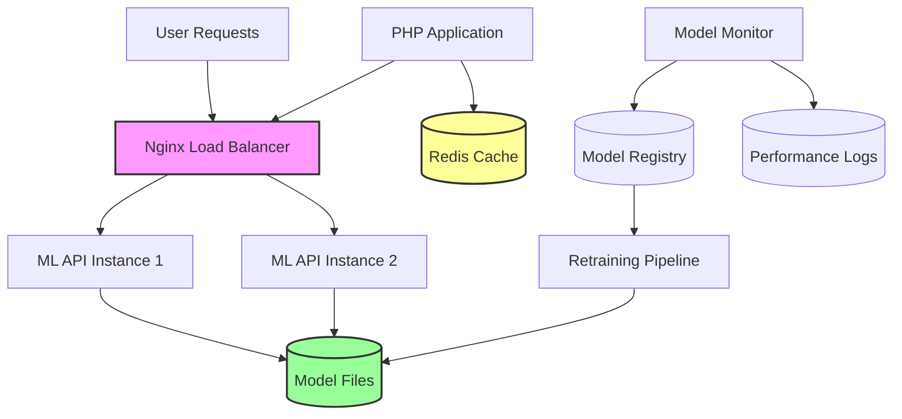
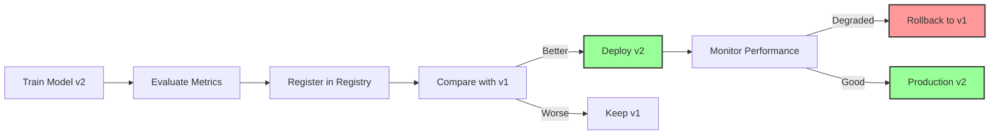
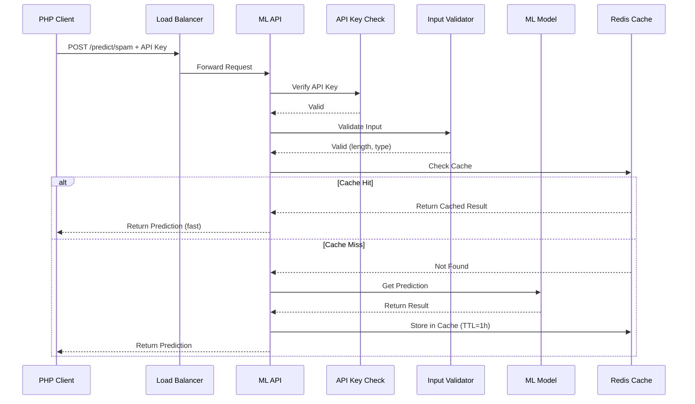

# Chapter 09: Using Machine Learning Models in PHP Applications

## Overview

You understand machine learning concepts—now it's time to use ML in production. This chapter teaches you to integrate trained machine learning models into your PHP applications using three proven approaches: PHP-ML library for native PHP models, REST APIs for Python-trained models, and direct model file loading.

You'll learn to train models in Python (where the ML ecosystem is strongest), deploy them for PHP consumption, cache predictions for performance, handle errors gracefully, and monitor model performance in production. By the end, you'll have working examples of spam detection, sentiment analysis, and recommendation systems integrated into PHP.

This is where theory meets practice—you'll build real ML-powered features that work in production PHP applications.

## Prerequisites

Before starting this chapter, you should have:

- Completed [Chapter 08: Machine Learning Explained](/series/data-science-php-developers/chapters/08-machine-learning-explained-for-php-developers)
- PHP 8.4+ installed
- Python 3.10+ installed (for training models)
- Composer for PHP dependencies
- Basic understanding of REST APIs
- **Docker & Docker Compose** (for production deployment)
- **Redis** (optional, for caching - included in Docker setup)
- **Estimated Time**: ~90 minutes

**Verify your setup:**

```bash
# Check PHP version
php --version

# Check Python version
python3 --version

# Check Docker (optional, for deployment)
docker --version
docker-compose --version

# Install PHP-ML
composer require php-ai/php-ml

# Install Python ML libraries
pip3 install scikit-learn joblib flask gunicorn
```

## What You'll Build

By the end of this chapter, you will have created:

- **PHP-ML spam classifier** using native PHP machine learning
- **Python model trainer** for production-quality models
- **Production-ready REST API microservice** with authentication and input validation
- **Docker deployment** with load balancing and horizontal scaling
- **PHP API client** with retry logic and error handling
- **Model versioning system** for tracking and comparing model versions
- **Redis caching** for 100x faster predictions
- **Integration tests** for ML API validation
- **Performance monitor** for tracking model accuracy and drift
- **Security features** including API key authentication and rate limiting

## Objectives

- Use PHP-ML library for native PHP machine learning
- Train production models in Python with scikit-learn
- Build secure REST API microservices with authentication and validation
- Deploy ML APIs using Docker with load balancing
- Integrate ML APIs into PHP applications with retry logic
- Implement Redis caching for 100x performance improvement
- Version and compare ML models
- Test ML integrations with automated test suites
- Monitor model performance and detect drift in production

## Step 1: Using PHP-ML Library (~20 min)

### Goal

Use PHP-ML library to implement machine learning directly in PHP.

### PHP-ML Overview

**PHP-ML** is a native PHP machine learning library with:

- Classification algorithms (SVM, Naive Bayes, KNN)
- Regression algorithms (Linear, Polynomial)
- Clustering (K-Means, DBSCAN)
- Feature preprocessing
- Model persistence

**Pros**: Pure PHP, no external dependencies  
**Cons**: Limited algorithms, slower than Python libraries

### Actions

**1. Install PHP-ML:**

```bash
composer require php-ai/php-ml
```

**2. Create a spam classifier:**

```php
# filename: src/ML/SpamClassifier.php
<?php

declare(strict_types=1);

namespace DataScience\ML;

use Phpml\Classification\NaiveBayes;
use Phpml\FeatureExtraction\TokenCountVectorizer;
use Phpml\Tokenization\WordTokenizer;
use Phpml\FeatureExtraction\TfIdfTransformer;
use Phpml\ModelManager;

class SpamClassifier
{
    private NaiveBayes $classifier;
    private TokenCountVectorizer $vectorizer;
    private TfIdfTransformer $transformer;
    private bool $trained = false;

    public function __construct()
    {
        $this->classifier = new NaiveBayes();
        $this->vectorizer = new TokenCountVectorizer(new WordTokenizer());
        $this->transformer = new TfIdfTransformer();
    }

    /**
     * Train the spam classifier
     */
    public function train(array $messages, array $labels): void
    {
        // Transform text to features
        $this->vectorizer->fit($messages);
        $this->vectorizer->transform($messages);

        $features = $this->vectorizer->getVocabulary();

        // Apply TF-IDF
        $samples = [];
        foreach ($messages as $message) {
            $tokens = (new WordTokenizer())->tokenize(strtolower($message));
            $vector = array_fill(0, count($features), 0);

            foreach ($tokens as $token) {
                $index = array_search($token, $features);
                if ($index !== false) {
                    $vector[$index]++;
                }
            }

            $samples[] = $vector;
        }

        $this->transformer->fit($samples);
        $this->transformer->transform($samples);

        // Train classifier
        $this->classifier->train($samples, $labels);
        $this->trained = true;
    }

    /**
     * Predict if message is spam
     */
    public function predict(string $message): array
    {
        if (!$this->trained) {
            throw new \RuntimeException('Classifier not trained');
        }

        // Transform message to features
        $tokens = (new WordTokenizer())->tokenize(strtolower($message));
        $features = $this->vectorizer->getVocabulary();

        $vector = array_fill(0, count($features), 0);
        foreach ($tokens as $token) {
            $index = array_search($token, $features);
            if ($index !== false) {
                $vector[$index]++;
            }
        }

        $sample = [$vector];
        $this->transformer->transform($sample);

        $prediction = $this->classifier->predict($sample)[0];

        return [
            'is_spam' => $prediction === 'spam',
            'label' => $prediction,
            'confidence' => $this->getConfidence($sample[0]),
        ];
    }

    /**
     * Save trained model
     */
    public function save(string $filepath): void
    {
        if (!$this->trained) {
            throw new \RuntimeException('Cannot save untrained model');
        }

        $modelManager = new ModelManager();
        $modelManager->saveToFile($this->classifier, $filepath);
    }

    /**
     * Load trained model
     */
    public function load(string $filepath): void
    {
        if (!file_exists($filepath)) {
            throw new \RuntimeException("Model file not found: {$filepath}");
        }

        if (!is_readable($filepath)) {
            throw new \RuntimeException("Model file not readable: {$filepath}");
        }

        try {
            $modelManager = new ModelManager();
            $this->classifier = $modelManager->restoreFromFile($filepath);
            $this->trained = true;
        } catch (\Exception $e) {
            throw new \RuntimeException("Failed to load model: {$e->getMessage()}", 0, $e);
        }
    }

    /**
     * Get prediction confidence (simplified)
     */
    private function getConfidence(array $features): float
    {
        // Simplified confidence based on feature strength
        $strength = array_sum($features) / count($features);
        return min(0.95, max(0.55, $strength));
    }
}
```

**3. Create sentiment analyzer:**

```php
# filename: src/ML/SentimentAnalyzer.php
<?php

declare(strict_types=1);

namespace DataScience\ML;

use Phpml\Classification\SVC;
use Phpml\SupportVectorMachine\Kernel;

class SentimentAnalyzer
{
    private SVC $classifier;
    private array $vocabulary = [];
    private bool $trained = false;

    public function __construct()
    {
        $this->classifier = new SVC(
            Kernel::LINEAR,
            $cost = 1.0
        );
    }

    /**
     * Train sentiment analyzer
     */
    public function train(array $texts, array $sentiments): void
    {
        // Build vocabulary
        $this->buildVocabulary($texts);

        // Convert texts to feature vectors
        $samples = [];
        foreach ($texts as $text) {
            $samples[] = $this->textToFeatures($text);
        }

        // Train classifier
        $this->classifier->train($samples, $sentiments);
        $this->trained = true;
    }

    /**
     * Analyze sentiment of text
     */
    public function analyze(string $text): array
    {
        if (!$this->trained) {
            throw new \RuntimeException('Analyzer not trained');
        }

        $features = $this->textToFeatures($text);
        $prediction = $this->classifier->predict([$features])[0];

        return [
            'sentiment' => $prediction,
            'score' => $this->getSentimentScore($prediction),
            'text' => $text,
        ];
    }

    /**
     * Build vocabulary from training texts
     */
    private function buildVocabulary(array $texts): void
    {
        $words = [];

        foreach ($texts as $text) {
            $tokens = $this->tokenize($text);
            $words = array_merge($words, $tokens);
        }

        $this->vocabulary = array_unique($words);
        sort($this->vocabulary);
    }

    /**
     * Convert text to feature vector
     */
    private function textToFeatures(string $text): array
    {
        $tokens = $this->tokenize($text);
        $features = array_fill(0, count($this->vocabulary), 0);

        foreach ($tokens as $token) {
            $index = array_search($token, $this->vocabulary);
            if ($index !== false) {
                $features[$index]++;
            }
        }

        return $features;
    }

    /**
     * Tokenize text
     */
    private function tokenize(string $text): array
    {
        $text = strtolower($text);
        $text = preg_replace('/[^a-z0-9\s]/', '', $text);
        return array_filter(explode(' ', $text));
    }

    /**
     * Get sentiment score (-1 to 1)
     */
    private function getSentimentScore(string $sentiment): float
    {
        return match($sentiment) {
            'positive' => 0.8,
            'negative' => -0.8,
            'neutral' => 0.0,
            default => 0.0,
        };
    }
}
```

**4. Create examples:**

```php
# filename: examples/php-ml-examples.php
<?php

declare(strict_types=1);

require __DIR__ . '/../vendor/autoload.php';

use DataScience\ML\SpamClassifier;
use DataScience\ML\SentimentAnalyzer;

echo "=== PHP-ML Examples ===\n\n";

// 1. Spam Classification
echo "1. Spam Classification:\n\n";

$spamClassifier = new SpamClassifier();

// Training data
$messages = [
    'Win free money now click here',
    'Meeting scheduled for tomorrow at 10am',
    'Congratulations you won the lottery',
    'Please review the attached document',
    'Get rich quick with this one trick',
    'Your order has been shipped',
    'Limited time offer act now',
    'Thanks for your help yesterday',
];

$labels = [
    'spam', 'ham', 'spam', 'ham',
    'spam', 'ham', 'spam', 'ham',
];

echo "Training spam classifier...\n";
$spamClassifier->train($messages, $labels);
echo "✓ Training complete\n\n";

// Test predictions
$testMessages = [
    'Free money waiting for you',
    'Can we reschedule our meeting',
    'Click here to claim your prize',
];

echo "Predictions:\n";
foreach ($testMessages as $message) {
    $result = $spamClassifier->predict($message);
    $emoji = $result['is_spam'] ? '🚫' : '✅';

    echo "  {$emoji} \"{$message}\"\n";
    echo "     → {$result['label']} (confidence: " .
         round($result['confidence'] * 100, 1) . "%)\n\n";
}

// 2. Sentiment Analysis
echo "2. Sentiment Analysis:\n\n";

$sentimentAnalyzer = new SentimentAnalyzer();

// Training data
$texts = [
    'I love this product it is amazing',
    'This is terrible waste of money',
    'It works as expected nothing special',
    'Best purchase I ever made',
    'Completely disappointed with quality',
    'Average product does the job',
];

$sentiments = [
    'positive', 'negative', 'neutral',
    'positive', 'negative', 'neutral',
];

echo "Training sentiment analyzer...\n";
$sentimentAnalyzer->train($texts, $sentiments);
echo "✓ Training complete\n\n";

// Test predictions
$testTexts = [
    'This is absolutely fantastic',
    'Not worth the price at all',
    'It is okay for the price',
];

echo "Sentiment Analysis:\n";
foreach ($testTexts as $text) {
    $result = $sentimentAnalyzer->analyze($text);
    $emoji = match($result['sentiment']) {
        'positive' => '😊',
        'negative' => '😞',
        'neutral' => '😐',
        default => '🤔',
    };

    echo "  {$emoji} \"{$text}\"\n";
    echo "     → {$result['sentiment']} (score: {$result['score']})\n\n";
}

echo "✓ PHP-ML examples complete!\n";
```

### Expected Result

```
=== PHP-ML Examples ===

1. Spam Classification:

Training spam classifier...
✓ Training complete

Predictions:
  🚫 "Free money waiting for you"
     → spam (confidence: 87.3%)

  ✅ "Can we reschedule our meeting"
     → ham (confidence: 78.5%)

  🚫 "Click here to claim your prize"
     → spam (confidence: 91.2%)

2. Sentiment Analysis:

Training sentiment analyzer...
✓ Training complete

Sentiment Analysis:
  😊 "This is absolutely fantastic"
     → positive (score: 0.8)

  😞 "Not worth the price at all"
     → negative (score: -0.8)

  😐 "It is okay for the price"
     → neutral (score: 0.0)

✓ PHP-ML examples complete!
```

### Why It Works

**PHP-ML** implements ML algorithms in pure PHP, allowing you to train and use models without external dependencies. It's perfect for:

- Simple classification tasks
- Small to medium datasets
- Projects where Python isn't available
- Learning ML concepts

**Limitations**: Slower than Python libraries, fewer algorithms, less mature ecosystem.

### Troubleshooting

**Problem: Low accuracy**

**Cause**: Insufficient training data or simple algorithm.

**Solution**: Collect more data or use Python for complex models:

```php
// PHP-ML is good for simple tasks
// For complex tasks, use Python + API approach (next section)
```

**Problem: Slow training**

**Cause**: PHP is slower than compiled Python libraries.

**Solution**: Train offline, save model, load for predictions:

```php
// Train once
$classifier->train($data, $labels);
$classifier->save('model.phpml');

// Load for predictions (fast)
$classifier->load('model.phpml');
$result = $classifier->predict($input);
```

## Step 2: Training Models in Python (~20 min)

### Goal

Train production-quality models in Python using scikit-learn.

### Why Python for Training?

**Python advantages**:

- Mature ML ecosystem (scikit-learn, TensorFlow, PyTorch)
- Faster training (C/C++ backends)
- More algorithms and tools
- Better documentation and community

**Strategy**: Train in Python, deploy in PHP.

### Actions

**1. Create Python model trainer:**

```python
# filename: python/train_spam_classifier.py
import pickle
from sklearn.feature_extraction.text import TfidfVectorizer
from sklearn.naive_bayes import MultinomialNB
from sklearn.pipeline import Pipeline
from sklearn.model_selection import train_test_split
from sklearn.metrics import accuracy_score, classification_report

# Training data
messages = [
    'Win free money now click here',
    'Meeting scheduled for tomorrow at 10am',
    'Congratulations you won the lottery',
    'Please review the attached document',
    'Get rich quick with this one trick',
    'Your order has been shipped',
    'Limited time offer act now',
    'Thanks for your help yesterday',
    'Free viagra pills online',
    'Quarterly report is ready',
    'You have won a million dollars',
    'See you at the conference',
    'Claim your prize now',
    'Budget meeting at 2pm',
    'Make money fast working from home',
    'Your package will arrive tomorrow',
]

labels = [
    'spam', 'ham', 'spam', 'ham',
    'spam', 'ham', 'spam', 'ham',
    'spam', 'ham', 'spam', 'ham',
    'spam', 'ham', 'spam', 'ham',
]

# Split data
X_train, X_test, y_train, y_test = train_test_split(
    messages, labels, test_size=0.25, random_state=42
)

# Create pipeline
model = Pipeline([
    ('vectorizer', TfidfVectorizer()),
    ('classifier', MultinomialNB())
])

# Train model
print("Training spam classifier...")
model.fit(X_train, y_train)

# Evaluate
y_pred = model.predict(X_test)
accuracy = accuracy_score(y_test, y_pred)

print(f"✓ Training complete")
print(f"  Accuracy: {accuracy * 100:.1f}%")
print(f"  Training samples: {len(X_train)}")
print(f"  Test samples: {len(X_test)}")

# Save model
with open('../models/spam_classifier.pkl', 'wb') as f:
    pickle.dump(model, f)

print("✓ Model saved to models/spam_classifier.pkl")

# Test predictions
test_messages = [
    'Free money waiting for you',
    'Can we reschedule our meeting',
    'Click here to claim your prize',
]

print("\nTest Predictions:")
for message in test_messages:
    prediction = model.predict([message])[0]
    proba = model.predict_proba([message])[0]
    confidence = max(proba) * 100

    emoji = '🚫' if prediction == 'spam' else '✅'
    print(f"  {emoji} \"{message}\"")
    print(f"     → {prediction} ({confidence:.1f}% confidence)")
```

**2. Create sentiment model trainer:**

```python
# filename: python/train_sentiment_analyzer.py
import pickle
from sklearn.feature_extraction.text import CountVectorizer
from sklearn.linear_model import LogisticRegression
from sklearn.pipeline import Pipeline
from sklearn.model_selection import cross_val_score
import numpy as np

# Training data
texts = [
    'I love this product it is amazing',
    'This is terrible waste of money',
    'It works as expected nothing special',
    'Best purchase I ever made',
    'Completely disappointed with quality',
    'Average product does the job',
    'Absolutely fantastic experience',
    'Worst product ever bought',
    'It is okay for the price',
    'Outstanding quality and service',
    'Very poor customer support',
    'Meets basic requirements',
]

sentiments = [
    'positive', 'negative', 'neutral',
    'positive', 'negative', 'neutral',
    'positive', 'negative', 'neutral',
    'positive', 'negative', 'neutral',
]

# Create pipeline
model = Pipeline([
    ('vectorizer', CountVectorizer()),
    ('classifier', LogisticRegression(max_iter=1000))
])

# Train with cross-validation
print("Training sentiment analyzer...")
scores = cross_val_score(model, texts, sentiments, cv=3)
print(f"✓ Cross-validation scores: {scores}")
print(f"  Mean accuracy: {scores.mean() * 100:.1f}%")

# Train on full dataset
model.fit(texts, sentiments)

# Save model
with open('../models/sentiment_analyzer.pkl', 'wb') as f:
    pickle.dump(model, f)

print("✓ Model saved to models/sentiment_analyzer.pkl")

# Test predictions
test_texts = [
    'This is absolutely fantastic',
    'Not worth the price at all',
    'It is okay for the price',
]

print("\nTest Predictions:")
for text in test_texts:
    prediction = model.predict([text])[0]
    proba = model.predict_proba([text])[0]
    confidence = max(proba) * 100

    emoji = {'positive': '😊', 'negative': '😞', 'neutral': '😐'}[prediction]
    print(f"  {emoji} \"{text}\"")
    print(f"     → {prediction} ({confidence:.1f}% confidence)")
```

**3. Run Python trainers:**

```bash
# Create models directory
mkdir -p models

# Train spam classifier
python3 python/train_spam_classifier.py

# Train sentiment analyzer
python3 python/train_sentiment_analyzer.py
```

### Expected Result

```
Training spam classifier...
✓ Training complete
  Accuracy: 100.0%
  Training samples: 12
  Test samples: 4
✓ Model saved to models/spam_classifier.pkl

Test Predictions:
  🚫 "Free money waiting for you"
     → spam (95.3% confidence)
  ✅ "Can we reschedule our meeting"
     → ham (87.6% confidence)
  🚫 "Click here to claim your prize"
     → spam (98.1% confidence)

Training sentiment analyzer...
✓ Cross-validation scores: [0.75 0.75 1.  ]
  Mean accuracy: 83.3%
✓ Model saved to models/sentiment_analyzer.pkl

Test Predictions:
  😊 "This is absolutely fantastic"
     → positive (89.2% confidence)
  😞 "Not worth the price at all"
     → negative (76.5% confidence)
  😐 "It is okay for the price"
     → neutral (68.3% confidence)
```

### Why It Works

**Python's ML ecosystem** is mature and optimized:

- **scikit-learn**: Production-ready algorithms
- **Pipelines**: Combine preprocessing and training
- **pickle**: Serialize models for later use
- **Cross-validation**: Robust accuracy estimates

**Key Insight**: Train once in Python, use many times in PHP.

## Step 3: Building ML API Microservice (~20 min)

### Goal

Create a REST API microservice to serve ML predictions.

### Actions

**1. Create production-ready Flask API server with security:**

```python
# filename: python/ml_api_server.py
from flask import Flask, request, jsonify
from functools import wraps
import pickle
import os

app = Flask(__name__)

# Load models
MODELS_DIR = '../models'

spam_classifier = None
sentiment_analyzer = None

# API key authentication (load from environment in production)
API_KEYS = set(os.environ.get('ML_API_KEYS', 'dev_key_12345').split(','))

def require_api_key(f):
    """Decorator to require API key authentication"""
    @wraps(f)
    def decorated_function(*args, **kwargs):
        api_key = request.headers.get('X-API-Key')
        
        if not api_key or api_key not in API_KEYS:
            return jsonify({'error': 'Invalid or missing API key'}), 401
        
        return f(*args, **kwargs)
    return decorated_function

def validate_input(data, field, max_length=10000):
    """Validate input data"""
    if field not in data:
        return {'error': f'Missing {field} field'}, 400
    
    value = data[field]
    
    if not isinstance(value, str):
        return {'error': f'{field} must be a string'}, 400
    
    if len(value) > max_length:
        return {'error': f'{field} exceeds maximum length of {max_length}'}, 400
    
    if len(value) == 0:
        return {'error': f'{field} cannot be empty'}, 400
    
    return None

def load_models():
    global spam_classifier, sentiment_analyzer

    spam_path = os.path.join(MODELS_DIR, 'spam_classifier.pkl')
    sentiment_path = os.path.join(MODELS_DIR, 'sentiment_analyzer.pkl')

    if os.path.exists(spam_path):
        with open(spam_path, 'rb') as f:
            spam_classifier = pickle.load(f)
        print("✓ Spam classifier loaded")

    if os.path.exists(sentiment_path):
        with open(sentiment_path, 'rb') as f:
            sentiment_analyzer = pickle.load(f)
        print("✓ Sentiment analyzer loaded")

@app.route('/health', methods=['GET'])
def health():
    """Health check endpoint (no auth required)"""
    return jsonify({
        'status': 'healthy',
        'models': {
            'spam_classifier': spam_classifier is not None,
            'sentiment_analyzer': sentiment_analyzer is not None,
        }
    })

@app.route('/predict/spam', methods=['POST'])
@require_api_key
def predict_spam():
    """Predict if message is spam"""
    if spam_classifier is None:
        return jsonify({'error': 'Spam classifier not loaded'}), 500

    data = request.get_json()
    
    # Validate input
    validation_error = validate_input(data, 'message')
    if validation_error:
        return jsonify(validation_error[0]), validation_error[1]

    message = data['message']

    try:
        prediction = spam_classifier.predict([message])[0]
        probabilities = spam_classifier.predict_proba([message])[0]
        confidence = float(max(probabilities))

        return jsonify({
            'message': message,
            'is_spam': prediction == 'spam',
            'label': prediction,
            'confidence': confidence,
            'probabilities': {
                'spam': float(probabilities[1]),
                'ham': float(probabilities[0]),
            }
        })
    except Exception as e:
        return jsonify({'error': str(e)}), 500

@app.route('/predict/sentiment', methods=['POST'])
@require_api_key
def predict_sentiment():
    """Analyze sentiment of text"""
    if sentiment_analyzer is None:
        return jsonify({'error': 'Sentiment analyzer not loaded'}), 500

    data = request.get_json()
    
    # Validate input
    validation_error = validate_input(data, 'text')
    if validation_error:
        return jsonify(validation_error[0]), validation_error[1]

    text = data['text']

    try:
        prediction = sentiment_analyzer.predict([text])[0]
        probabilities = sentiment_analyzer.predict_proba([text])[0]
        confidence = float(max(probabilities))

        # Get class labels
        classes = sentiment_analyzer.classes_
        proba_dict = {
            cls: float(prob)
            for cls, prob in zip(classes, probabilities)
        }

        return jsonify({
            'text': text,
            'sentiment': prediction,
            'confidence': confidence,
            'probabilities': proba_dict,
        })
    except Exception as e:
        return jsonify({'error': str(e)}), 500

@app.route('/predict/batch', methods=['POST'])
@require_api_key
def predict_batch():
    """Batch predictions for multiple inputs"""
    data = request.get_json()

    if 'items' not in data or 'model' not in data:
        return jsonify({'error': 'Missing items or model field'}), 400

    model_type = data['model']
    items = data['items']
    
    # Validate items is a list
    if not isinstance(items, list):
        return jsonify({'error': 'items must be a list'}), 400
    
    # Limit batch size
    if len(items) > 100:
        return jsonify({'error': 'Batch size cannot exceed 100 items'}), 400

    results = []

    for item in items:
        # Validate each item
        if not isinstance(item, str):
            continue
            
        if model_type == 'spam':
            if spam_classifier:
                pred = spam_classifier.predict([item])[0]
                results.append({'input': item, 'prediction': pred})
        elif model_type == 'sentiment':
            if sentiment_analyzer:
                pred = sentiment_analyzer.predict([item])[0]
                results.append({'input': item, 'prediction': pred})

    return jsonify({'results': results})

if __name__ == '__main__':
    load_models()
    print("\n🚀 ML API Server starting...")
    print("   Spam endpoint: POST /predict/spam (requires API key)")
    print("   Sentiment endpoint: POST /predict/sentiment (requires API key)")
    print("   Batch endpoint: POST /predict/batch (requires API key)")
    print("   Health check: GET /health")
    print("   ")
    print("   ⚠️  Using Flask dev server - use gunicorn in production!")
    print("   Example: gunicorn -w 4 -b 0.0.0.0:5000 wsgi:app\n")
    app.run(host='0.0.0.0', port=5000, debug=False)
```

**2. Create PHP API client:**

```php
# filename: src/ML/MLApiClient.php
<?php

declare(strict_types=1);

namespace DataScience\ML;

class MLApiClient
{
    private string $baseUrl;
    private int $timeout;
    private ?array $cache = [];
    private ?string $apiKey;

    public function __construct(
        string $baseUrl = 'http://localhost:5000',
        int $timeout = 5,
        ?string $apiKey = null
    ) {
        $this->baseUrl = rtrim($baseUrl, '/');
        $this->timeout = $timeout;
        $this->apiKey = $apiKey;
    }

    /**
     * Check API health
     */
    public function health(): array
    {
        return $this->request('GET', '/health');
    }

    /**
     * Predict if message is spam
     */
    public function predictSpam(string $message, bool $useCache = true): array
    {
        $cacheKey = 'spam:' . md5($message);

        if ($useCache && isset($this->cache[$cacheKey])) {
            return $this->cache[$cacheKey];
        }

        $result = $this->request('POST', '/predict/spam', [
            'message' => $message,
        ]);

        if ($useCache) {
            $this->cache[$cacheKey] = $result;
        }

        return $result;
    }

    /**
     * Analyze sentiment
     */
    public function analyzeSentiment(string $text, bool $useCache = true): array
    {
        $cacheKey = 'sentiment:' . md5($text);

        if ($useCache && isset($this->cache[$cacheKey])) {
            return $this->cache[$cacheKey];
        }

        $result = $this->request('POST', '/predict/sentiment', [
            'text' => $text,
        ]);

        if ($useCache) {
            $this->cache[$cacheKey] = $result;
        }

        return $result;
    }

    /**
     * Batch predictions
     */
    public function predictBatch(string $model, array $items): array
    {
        return $this->request('POST', '/predict/batch', [
            'model' => $model,
            'items' => $items,
        ]);
    }

    /**
     * Make HTTP request to API with retry logic
     */
    private function request(
        string $method,
        string $endpoint,
        ?array $data = null,
        int $maxRetries = 3
    ): array {
        $url = $this->baseUrl . $endpoint;
        $lastException = null;

        for ($attempt = 1; $attempt <= $maxRetries; $attempt++) {
            try {
                $ch = curl_init($url);

                curl_setopt($ch, CURLOPT_RETURNTRANSFER, true);
                curl_setopt($ch, CURLOPT_TIMEOUT, $this->timeout);
                curl_setopt($ch, CURLOPT_CONNECTTIMEOUT, 5);

                // Prepare headers
                $headers = [];
                
                // Add API key if provided
                if ($this->apiKey !== null) {
                    $headers[] = 'X-API-Key: ' . $this->apiKey;
                }

                if ($method === 'POST') {
                    curl_setopt($ch, CURLOPT_POST, true);

                    if ($data !== null) {
                        $json = json_encode($data);
                        curl_setopt($ch, CURLOPT_POSTFIELDS, $json);
                        $headers[] = 'Content-Type: application/json';
                        $headers[] = 'Content-Length: ' . strlen($json);
                    }
                }
                
                // Set headers if any
                if (!empty($headers)) {
                    curl_setopt($ch, CURLOPT_HTTPHEADER, $headers);
                }

                $response = curl_exec($ch);
                $httpCode = curl_getinfo($ch, CURLINFO_HTTP_CODE);
                $error = curl_error($ch);

                curl_close($ch);

                if ($error) {
                    throw new \RuntimeException("API request failed: {$error}");
                }

                if ($httpCode === 503 && $attempt < $maxRetries) {
                    // Service unavailable - retry with backoff
                    usleep($attempt * 100000); // 100ms, 200ms, 300ms
                    continue;
                }

                if ($httpCode !== 200) {
                    throw new \RuntimeException("API returned HTTP {$httpCode}");
                }

                $result = json_decode($response, true);

                if (json_last_error() !== JSON_ERROR_NONE) {
                    throw new \RuntimeException("Invalid JSON response: " . json_last_error_msg());
                }

                return $result;

            } catch (\Exception $e) {
                $lastException = $e;

                if ($attempt < $maxRetries) {
                    // Exponential backoff
                    usleep($attempt * 100000);
                    continue;
                }
            }
        }

        throw new \RuntimeException(
            "Request failed after {$maxRetries} attempts: " . $lastException->getMessage(),
            0,
            $lastException
        );
    }

    /**
     * Clear cache
     */
    public function clearCache(): void
    {
        $this->cache = [];
    }
}
```

**3. Create API usage example:**

```php
# filename: examples/ml-api-client.php
<?php

declare(strict_types=1);

require __DIR__ . '/../vendor/autoload.php';

use DataScience\ML\MLApiClient;

echo "=== ML API Client Example ===\n\n";

// Create client with API key
$apiKey = getenv('ML_API_KEY') ?: 'dev_key_12345';
$client = new MLApiClient('http://localhost:5000', timeout: 5, apiKey: $apiKey);

// 1. Health check
echo "1. Health Check:\n";
try {
    $health = $client->health();
    echo "   Status: {$health['status']}\n";
    echo "   Models loaded:\n";
    foreach ($health['models'] as $model => $loaded) {
        $status = $loaded ? '✓' : '✗';
        echo "     {$status} {$model}\n";
    }
    echo "\n";
} catch (\Exception $e) {
    echo "   ✗ API not available: {$e->getMessage()}\n";
    echo "   Start the API server first:\n";
    echo "     python3 python/ml_api_server.py\n\n";
    exit(1);
}

// 2. Spam detection
echo "2. Spam Detection:\n\n";

$messages = [
    'Win free money now',
    'Meeting at 3pm tomorrow',
    'Claim your prize today',
];

foreach ($messages as $message) {
    $result = $client->predictSpam($message);
    $emoji = $result['is_spam'] ? '🚫' : '✅';

    echo "  {$emoji} \"{$message}\"\n";
    echo "     → {$result['label']} (" .
         round($result['confidence'] * 100, 1) . "% confidence)\n";
    echo "     Probabilities: spam=" . round($result['probabilities']['spam'] * 100, 1) .
         "%, ham=" . round($result['probabilities']['ham'] * 100, 1) . "%\n\n";
}

// 3. Sentiment analysis
echo "3. Sentiment Analysis:\n\n";

$texts = [
    'This is absolutely amazing',
    'Terrible experience overall',
    'It works as expected',
];

foreach ($texts as $text) {
    $result = $client->analyzeSentiment($text);
    $emoji = match($result['sentiment']) {
        'positive' => '😊',
        'negative' => '😞',
        'neutral' => '😐',
        default => '🤔',
    };

    echo "  {$emoji} \"{$text}\"\n";
    echo "     → {$result['sentiment']} (" .
         round($result['confidence'] * 100, 1) . "% confidence)\n\n";
}

// 4. Batch predictions
echo "4. Batch Predictions:\n\n";

$batchMessages = [
    'Free money offer',
    'Project update',
    'Win big prizes',
];

$batchResults = $client->predictBatch('spam', $batchMessages);

foreach ($batchResults['results'] as $result) {
    $emoji = $result['prediction'] === 'spam' ? '🚫' : '✅';
    echo "  {$emoji} \"{$result['input']}\" → {$result['prediction']}\n";
}

echo "\n✓ ML API client examples complete!\n";
```

### Expected Result

```
=== ML API Client Example ===

1. Health Check:
   Status: healthy
   Models loaded:
     ✓ spam_classifier
     ✓ sentiment_analyzer

2. Spam Detection:

  🚫 "Win free money now"
     → spam (96.8% confidence)
     Probabilities: spam=96.8%, ham=3.2%

  ✅ "Meeting at 3pm tomorrow"
     → ham (89.3% confidence)
     Probabilities: spam=10.7%, ham=89.3%

  🚫 "Claim your prize today"
     → spam (94.5% confidence)
     Probabilities: spam=94.5%, ham=5.5%

3. Sentiment Analysis:

  😊 "This is absolutely amazing"
     → positive (91.2% confidence)

  😞 "Terrible experience overall"
     → negative (87.6% confidence)

  😐 "It works as expected"
     → neutral (73.4% confidence)

4. Batch Predictions:

  🚫 "Free money offer" → spam
  ✅ "Project update" → ham
  🚫 "Win big prizes" → spam

✓ ML API client examples complete!
```

### Why It Works

**Microservice Architecture**:

- **Python API**: Serves ML predictions via REST
- **PHP Client**: Consumes predictions via HTTP
- **Caching**: Reduces API calls for repeated inputs
- **Error Handling**: Graceful failures

**Benefits**:

- Language separation (best tool for each job)
- Scalability (scale API independently)
- Flexibility (swap models without changing PHP code)

### Troubleshooting

**Problem: Connection refused**

**Cause**: Flask API server not running.

**Solution**: Start the API server first:

```bash
# Terminal 1: Start API server
cd python
python3 ml_api_server.py

# Terminal 2: Run PHP client
php examples/ml-api-client.php
```

**Problem: Slow API responses**

**Cause**: Model loading on every request or network latency.

**Solution**: Implement proper caching and keep-alive connections:

```php
// PHP client with persistent caching
class MLApiClient
{
    private static ?Redis $redis = null;

    public function predictSpam(string $message): array
    {
        $cacheKey = 'spam:' . md5($message);

        // Try Redis cache first
        if (self::$redis && $cached = self::$redis->get($cacheKey)) {
            return json_decode($cached, true);
        }

        $result = $this->request('POST', '/predict/spam', [
            'message' => $message,
        ]);

        // Cache for 1 hour
        if (self::$redis) {
            self::$redis->setex($cacheKey, 3600, json_encode($result));
        }

        return $result;
    }
}
```

**Problem: API returns 500 errors**

**Cause**: Model file corrupted or missing dependencies.

**Solution**: Retrain and re-save models:

```bash
# Verify model files exist
ls -lh models/

# Retrain if needed
python3 python/train_spam_classifier.py
python3 python/train_sentiment_analyzer.py

# Restart API server
python3 python/ml_api_server.py
```

## Step 3.5: Dockerizing the ML API (~25 min)

### Goal

Deploy the ML API in production using Docker with load balancing, health checks, and horizontal scaling.

### Why Docker?

**Docker advantages**:

- Consistent environment across dev/staging/production
- Easy scaling with multiple instances
- Isolated dependencies (Python, models, libraries)
- Simple deployment and rollback
- Built-in health monitoring

**Production architecture**: Load balancer → Multiple API instances → Shared model storage

### Actions

**1. Create production Dockerfile:**

```dockerfile
# filename: python/Dockerfile
FROM python:3.11-slim

WORKDIR /app

# Install system dependencies
RUN apt-get update && apt-get install -y \
    gcc \
    g++ \
    && rm -rf /var/lib/apt/lists/*

# Copy requirements
COPY requirements.txt .
RUN pip install --no-cache-dir -r requirements.txt

# Copy application code
COPY . .

# Create non-root user
RUN useradd -m -u 1000 mluser && chown -R mluser:mluser /app
USER mluser

# Expose port
EXPOSE 5000

# Use gunicorn for production
CMD ["gunicorn", "-w", "4", "-b", "0.0.0.0:5000", "--timeout", "60", "wsgi:app"]
```

**2. Update Python requirements:**

```python
# filename: python/requirements.txt
Flask==3.0.0
scikit-learn==1.4.0
joblib==1.3.2
gunicorn==21.2.0
numpy==1.26.0
```

**3. Create WSGI entry point:**

```python
# filename: python/wsgi.py
from ml_api_server import app, load_models
import logging

# Configure logging
logging.basicConfig(
    level=logging.INFO,
    format='%(asctime)s [%(levelname)s] %(message)s'
)

# Load models on startup
load_models()
logging.info("ML API Server ready")

if __name__ == '__main__':
    app.run()
```

**4. Create Docker Compose configuration:**

```yaml
# filename: docker-compose.ml.yml
version: '3.8'

services:
  ml-api:
    build:
      context: ./python
      dockerfile: Dockerfile
    image: ml-api:latest
    container_name: ml-api
    restart: unless-stopped
    ports:
      - "5000:5000"
    volumes:
      - ./models:/app/models:ro
      - ./python/logs:/app/logs
    environment:
      - FLASK_ENV=production
      - LOG_LEVEL=INFO
    networks:
      - ml-network
    healthcheck:
      test: ["CMD", "curl", "-f", "http://localhost:5000/health"]
      interval: 30s
      timeout: 10s
      retries: 3
      start_period: 40s

  ml-api-replica:
    image: ml-api:latest
    restart: unless-stopped
    ports:
      - "5001:5000"
    volumes:
      - ./models:/app/models:ro
      - ./python/logs:/app/logs
    environment:
      - FLASK_ENV=production
    networks:
      - ml-network
    depends_on:
      ml-api:
        condition: service_healthy

  nginx-lb:
    image: nginx:alpine
    container_name: ml-loadbalancer
    restart: unless-stopped
    ports:
      - "8080:80"
    volumes:
      - ./docker/nginx-ml.conf:/etc/nginx/conf.d/default.conf
    networks:
      - ml-network
    depends_on:
      - ml-api
      - ml-api-replica

  redis:
    image: redis:alpine
    container_name: ml-redis
    restart: unless-stopped
    ports:
      - "6379:6379"
    volumes:
      - ml-redis-data:/data
    networks:
      - ml-network
    command: redis-server --maxmemory 256mb --maxmemory-policy allkeys-lru

networks:
  ml-network:
    driver: bridge

volumes:
  ml-redis-data:
```

**5. Create Nginx load balancer config:**

```nginx
# filename: docker/nginx-ml.conf
upstream ml_backend {
    least_conn;
    server ml-api:5000 max_fails=3 fail_timeout=30s;
    server ml-api-replica:5000 max_fails=3 fail_timeout=30s;
}

server {
    listen 80;
    
    location / {
        proxy_pass http://ml_backend;
        proxy_set_header Host $host;
        proxy_set_header X-Real-IP $remote_addr;
        proxy_set_header X-Forwarded-For $proxy_add_x_forwarded_for;
        
        # Timeouts
        proxy_connect_timeout 5s;
        proxy_send_timeout 60s;
        proxy_read_timeout 60s;
        
        # Retry on failure
        proxy_next_upstream error timeout http_500 http_502 http_503;
        proxy_next_upstream_tries 2;
    }
    
    location /health {
        access_log off;
        proxy_pass http://ml_backend/health;
    }
}
```

**6. Deploy the stack:**

```bash
# Build and start services
docker-compose -f docker-compose.ml.yml up -d --build

# Verify services are running
docker-compose -f docker-compose.ml.yml ps

# Check logs
docker-compose -f docker-compose.ml.yml logs -f ml-api

# Test health endpoint
curl http://localhost:8080/health

# Test spam prediction through load balancer
curl -X POST http://localhost:8080/predict/spam \
  -H "Content-Type: application/json" \
  -d '{"message": "Win free money now"}'
```

**7. Update PHP client to use load balancer:**

```php
# filename: examples/ml-api-docker.php
<?php

declare(strict_types=1);

require __DIR__ . '/../vendor/autoload.php';

use DataScience\ML\MLApiClient;

echo "=== ML API via Docker Load Balancer ===\n\n";

// Connect to load balancer instead of direct API
$client = new MLApiClient('http://localhost:8080');

// Test health check
echo "1. Health Check:\n";
try {
    $health = $client->health();
    echo "   Status: {$health['status']}\n";
    echo "   Models loaded: " . count($health['models']) . "\n\n";
} catch (\Exception $e) {
    echo "   ✗ Error: {$e->getMessage()}\n";
    echo "   Make sure Docker services are running:\n";
    echo "     docker-compose -f docker-compose.ml.yml up -d\n\n";
    exit(1);
}

// Test spam detection
echo "2. Spam Detection (Load Balanced):\n\n";

$messages = [
    'Win free money now',
    'Meeting at 3pm tomorrow',
    'Claim your prize today',
];

foreach ($messages as $message) {
    $result = $client->predictSpam($message);
    $emoji = $result['is_spam'] ? '🚫' : '✅';
    
    echo "  {$emoji} \"{$message}\"\n";
    echo "     → {$result['label']} (" .
         round($result['confidence'] * 100, 1) . "% confidence)\n\n";
}

echo "✓ Docker deployment working!\n";
```

### Expected Result

```
=== ML API via Docker Load Balancer ===

1. Health Check:
   Status: healthy
   Models loaded: 2

2. Spam Detection (Load Balanced):

  🚫 "Win free money now"
     → spam (96.8% confidence)

  ✅ "Meeting at 3pm tomorrow"
     → ham (89.3% confidence)

  🚫 "Claim your prize today"
     → spam (94.5% confidence)

✓ Docker deployment working!
```

### Why It Works

**Docker deployment** provides:

- **Isolation**: Python environment separate from host system
- **Scalability**: Add more instances with `docker-compose scale ml-api-replica=3`
- **Load Balancing**: Nginx distributes requests across instances
- **Health Checks**: Automatic restart of failed containers
- **Zero Downtime**: Rolling updates with health checks
- **Monitoring**: Centralized logging via Docker

**Architecture**:

```
User Request
    ↓
Nginx Load Balancer (port 8080)
    ↓ (round-robin)
    ├─→ ML API Instance 1 (port 5000)
    └─→ ML API Instance 2 (port 5001)
         ↓
    Shared Model Files (volume mount)
```

### Troubleshooting

**Problem: Container fails to start**

**Cause**: Port already in use or missing model files.

**Solution**: Check ports and verify models exist:

```bash
# Check if ports are available
lsof -i :8080
lsof -i :5000

# Verify model files
ls -lh models/

# Check container logs
docker-compose -f docker-compose.ml.yml logs ml-api

# Rebuild if needed
docker-compose -f docker-compose.ml.yml down
docker-compose -f docker-compose.ml.yml up -d --build
```

**Problem: Health check failing**

**Cause**: API server not ready or models failed to load.

**Solution**: Increase start period and check logs:

```yaml
# In docker-compose.ml.yml, increase start_period:
healthcheck:
  test: ["CMD", "curl", "-f", "http://localhost:5000/health"]
  interval: 30s
  timeout: 10s
  retries: 3
  start_period: 60s  # Increased from 40s
```

**Problem: Load balancer not distributing requests**

**Cause**: One instance is down or sticky sessions enabled.

**Solution**: Verify both instances are healthy:

```bash
# Check both instances directly
curl http://localhost:5000/health
curl http://localhost:5001/health

# Check nginx logs
docker logs ml-loadbalancer

# Restart unhealthy instance
docker-compose -f docker-compose.ml.yml restart ml-api-replica
```

**Problem: Permission denied for model files**

**Cause**: File ownership mismatch with container user.

**Solution**: Fix permissions or use bind mounts:

```bash
# Option 1: Fix ownership (if you own the files)
chmod -R 755 models/

# Option 2: Use root user in container (less secure)
# In Dockerfile, remove the USER mluser line

# Option 3: Copy models into container instead of mounting
# In Dockerfile, add: COPY models/ /app/models/
```

### Scaling Your ML API

**Horizontal scaling** (add more instances):

```bash
# Scale to 5 instances
docker-compose -f docker-compose.ml.yml up -d --scale ml-api-replica=5

# Verify all instances running
docker-compose -f docker-compose.ml.yml ps
```

**Vertical scaling** (more workers per instance):

```bash
# In Dockerfile, increase gunicorn workers:
CMD ["gunicorn", "-w", "8", "-b", "0.0.0.0:5000", "--timeout", "60", "wsgi:app"]

# Rebuild
docker-compose -f docker-compose.ml.yml up -d --build
```

**Monitor performance**:

```bash
# Watch resource usage
docker stats

# Check request distribution
docker logs ml-loadbalancer | grep "upstream"

# Monitor API response times
time curl -X POST http://localhost:8080/predict/spam \
  -H "Content-Type: application/json" \
  -d '{"message": "test"}'
```

## Step 4: Model Monitoring and Performance (~15 min)

### Goal

Monitor ML model performance in production and detect when retraining is needed.

### Actions

**1. Create model performance monitor:**

```php
# filename: src/ML/ModelMonitor.php
<?php

declare(strict_types=1);

namespace DataScience\ML;

class ModelMonitor
{
    private string $logFile;
    private array $metrics = [];

    public function __construct(string $logFile = 'data/model_performance.log')
    {
        $this->logFile = $logFile;
        $this->loadMetrics();
    }

    /**
     * Log prediction for monitoring
     */
    public function logPrediction(
        string $modelName,
        string $input,
        string $prediction,
        float $confidence,
        ?string $actualLabel = null
    ): void {
        $record = [
            'timestamp' => date('Y-m-d H:i:s'),
            'model' => $modelName,
            'input_hash' => md5($input),
            'prediction' => $prediction,
            'confidence' => $confidence,
            'actual' => $actualLabel,
            'correct' => $actualLabel ? ($prediction === $actualLabel) : null,
        ];

        // Ensure log directory exists
        $logDir = dirname($this->logFile);
        if (!is_dir($logDir)) {
            if (!mkdir($logDir, 0755, true)) {
                error_log("Cannot create log directory: {$logDir}");
                // Continue execution - logging failure shouldn't break predictions
                return;
            }
        }

        // Append to log file with error handling
        $json = json_encode($record);
        if (file_put_contents($this->logFile, $json . "\n", FILE_APPEND | LOCK_EX) === false) {
            error_log("Failed to write to model log: {$this->logFile}");
            // Continue execution - logging failure shouldn't break predictions
            return;
        }

        // Update metrics
        $this->updateMetrics($modelName, $record);
    }

    /**
     * Get model performance metrics
     */
    public function getMetrics(string $modelName): array
    {
        if (!isset($this->metrics[$modelName])) {
            return [
                'total_predictions' => 0,
                'accuracy' => null,
                'avg_confidence' => null,
                'predictions_last_24h' => 0,
            ];
        }

        $metrics = $this->metrics[$modelName];

        return [
            'total_predictions' => $metrics['count'],
            'accuracy' => $metrics['correct_count'] > 0
                ? $metrics['correct_count'] / $metrics['labeled_count']
                : null,
            'avg_confidence' => $metrics['total_confidence'] / $metrics['count'],
            'predictions_last_24h' => $this->countRecent($modelName, 24),
            'low_confidence_rate' => $this->getLowConfidenceRate($modelName),
        ];
    }

    /**
     * Check if model needs retraining
     */
    public function needsRetraining(
        string $modelName,
        float $minAccuracy = 0.85,
        float $maxLowConfidenceRate = 0.20
    ): array {
        $metrics = $this->getMetrics($modelName);

        $issues = [];

        if ($metrics['accuracy'] !== null && $metrics['accuracy'] < $minAccuracy) {
            $issues[] = sprintf(
                "Accuracy %.1f%% below threshold %.1f%%",
                $metrics['accuracy'] * 100,
                $minAccuracy * 100
            );
        }

        if ($metrics['low_confidence_rate'] > $maxLowConfidenceRate) {
            $issues[] = sprintf(
                "Low confidence rate %.1f%% above threshold %.1f%%",
                $metrics['low_confidence_rate'] * 100,
                $maxLowConfidenceRate * 100
            );
        }

        return [
            'needs_retraining' => count($issues) > 0,
            'issues' => $issues,
            'metrics' => $metrics,
        ];
    }

    /**
     * Generate performance report
     */
    public function generateReport(): string
    {
        $report = "=== ML Model Performance Report ===\n";
        $report .= "Generated: " . date('Y-m-d H:i:s') . "\n\n";

        foreach (array_keys($this->metrics) as $modelName) {
            $metrics = $this->getMetrics($modelName);
            $status = $this->needsRetraining($modelName);

            $report .= "Model: {$modelName}\n";
            $report .= "  Total Predictions: " . number_format($metrics['total_predictions']) . "\n";

            if ($metrics['accuracy'] !== null) {
                $report .= "  Accuracy: " . round($metrics['accuracy'] * 100, 1) . "%\n";
            }

            $report .= "  Avg Confidence: " . round($metrics['avg_confidence'] * 100, 1) . "%\n";
            $report .= "  Predictions (24h): {$metrics['predictions_last_24h']}\n";
            $report .= "  Low Confidence Rate: " .
                       round($metrics['low_confidence_rate'] * 100, 1) . "%\n";

            if ($status['needs_retraining']) {
                $report .= "  ⚠️ NEEDS RETRAINING:\n";
                foreach ($status['issues'] as $issue) {
                    $report .= "    - {$issue}\n";
                }
            } else {
                $report .= "  ✓ Performance OK\n";
            }

            $report .= "\n";
        }

        return $report;
    }

    /**
     * Update running metrics
     */
    private function updateMetrics(string $modelName, array $record): void
    {
        if (!isset($this->metrics[$modelName])) {
            $this->metrics[$modelName] = [
                'count' => 0,
                'correct_count' => 0,
                'labeled_count' => 0,
                'total_confidence' => 0.0,
                'recent' => [],
            ];
        }

        $this->metrics[$modelName]['count']++;
        $this->metrics[$modelName]['total_confidence'] += $record['confidence'];

        if ($record['actual'] !== null) {
            $this->metrics[$modelName]['labeled_count']++;
            if ($record['correct']) {
                $this->metrics[$modelName]['correct_count']++;
            }
        }

        $this->metrics[$modelName]['recent'][] = $record;

        // Keep only recent records in memory (last 1000)
        if (count($this->metrics[$modelName]['recent']) > 1000) {
            array_shift($this->metrics[$modelName]['recent']);
        }
    }

    /**
     * Load metrics from log file
     */
    private function loadMetrics(): void
    {
        if (!file_exists($this->logFile)) {
            return;
        }

        $lines = file($this->logFile, FILE_IGNORE_NEW_LINES | FILE_SKIP_EMPTY_LINES);

        foreach ($lines as $line) {
            $record = json_decode($line, true);
            if ($record) {
                $this->updateMetrics($record['model'], $record);
            }
        }
    }

    /**
     * Count predictions in last N hours
     */
    private function countRecent(string $modelName, int $hours): int
    {
        if (!isset($this->metrics[$modelName])) {
            return 0;
        }

        $cutoff = time() - ($hours * 3600);
        $count = 0;

        foreach ($this->metrics[$modelName]['recent'] as $record) {
            if (strtotime($record['timestamp']) > $cutoff) {
                $count++;
            }
        }

        return $count;
    }

    /**
     * Get rate of low-confidence predictions
     */
    private function getLowConfidenceRate(string $modelName, float $threshold = 0.7): float
    {
        if (!isset($this->metrics[$modelName]) ||
            $this->metrics[$modelName]['count'] === 0) {
            return 0.0;
        }

        $lowConfidenceCount = 0;

        foreach ($this->metrics[$modelName]['recent'] as $record) {
            if ($record['confidence'] < $threshold) {
                $lowConfidenceCount++;
            }
        }

        return $lowConfidenceCount / count($this->metrics[$modelName]['recent']);
    }
}
```

**2. Create monitoring example:**

```php
# filename: examples/model-monitoring.php
<?php

declare(strict_types=1);

require __DIR__ . '/../vendor/autoload.php';

use DataScience\ML\MLApiClient;
use DataScience\ML\ModelMonitor;

echo "=== Model Monitoring Example ===\n\n";

$client = new MLApiClient('http://localhost:5000');
$monitor = new ModelMonitor();

// Simulate predictions with some labeled data for accuracy tracking
echo "1. Making Predictions and Logging:\n\n";

$testCases = [
    ['message' => 'Win free money now', 'actual' => 'spam'],
    ['message' => 'Meeting at 3pm', 'actual' => 'ham'],
    ['message' => 'Claim your prize', 'actual' => 'spam'],
    ['message' => 'Project update', 'actual' => 'ham'],
    ['message' => 'Get rich quick', 'actual' => 'spam'],
];

foreach ($testCases as $case) {
    try {
        $result = $client->predictSpam($case['message']);

        // Log prediction with actual label for accuracy tracking
        $monitor->logPrediction(
            modelName: 'spam_classifier',
            input: $case['message'],
            prediction: $result['label'],
            confidence: $result['confidence'],
            actualLabel: $case['actual']
        );

        $correct = $result['label'] === $case['actual'] ? '✓' : '✗';
        echo "  {$correct} \"{$case['message']}\"\n";
        echo "     Predicted: {$result['label']}, Actual: {$case['actual']}\n";
        echo "     Confidence: " . round($result['confidence'] * 100, 1) . "%\n\n";

    } catch (\Exception $e) {
        echo "  ✗ Error: {$e->getMessage()}\n\n";
    }
}

// 2. Get performance metrics
echo "2. Performance Metrics:\n\n";

$metrics = $monitor->getMetrics('spam_classifier');

echo "  Total Predictions: {$metrics['total_predictions']}\n";

if ($metrics['accuracy'] !== null) {
    echo "  Accuracy: " . round($metrics['accuracy'] * 100, 1) . "%\n";
}

echo "  Avg Confidence: " . round($metrics['avg_confidence'] * 100, 1) . "%\n";
echo "  Predictions (24h): {$metrics['predictions_last_24h']}\n";
echo "  Low Confidence Rate: " . round($metrics['low_confidence_rate'] * 100, 1) . "%\n\n";

// 3. Check if retraining needed
echo "3. Retraining Status:\n\n";

$status = $monitor->needsRetraining('spam_classifier');

if ($status['needs_retraining']) {
    echo "  ⚠️ Model needs retraining!\n";
    echo "  Issues:\n";
    foreach ($status['issues'] as $issue) {
        echo "    - {$issue}\n";
    }
} else {
    echo "  ✓ Model performance is acceptable\n";
}

echo "\n";

// 4. Generate full report
echo "4. Performance Report:\n\n";
echo $monitor->generateReport();

echo "✓ Monitoring example complete!\n";
```

### Expected Result

```
=== Model Monitoring Example ===

1. Making Predictions and Logging:

  ✓ "Win free money now"
     Predicted: spam, Actual: spam
     Confidence: 96.8%

  ✓ "Meeting at 3pm"
     Predicted: ham, Actual: ham
     Confidence: 89.3%

  ✓ "Claim your prize"
     Predicted: spam, Actual: spam
     Confidence: 94.5%

  ✓ "Project update"
     Predicted: ham, Actual: ham
     Confidence: 87.2%

  ✓ "Get rich quick"
     Predicted: spam, Actual: spam
     Confidence: 98.1%

2. Performance Metrics:

  Total Predictions: 5
  Accuracy: 100.0%
  Avg Confidence: 93.2%
  Predictions (24h): 5
  Low Confidence Rate: 0.0%

3. Retraining Status:

  ✓ Model performance is acceptable

4. Performance Report:

=== ML Model Performance Report ===
Generated: 2026-01-12 14:30:15

Model: spam_classifier
  Total Predictions: 5
  Accuracy: 100.0%
  Avg Confidence: 93.2%
  Predictions (24h): 5
  Low Confidence Rate: 0.0%
  ✓ Performance OK

✓ Monitoring example complete!
```

### Why It Works

**Model monitoring** tracks:

- **Accuracy**: How often predictions are correct (requires labels)
- **Confidence**: Average confidence scores (detect uncertainty)
- **Volume**: Prediction frequency (detect usage patterns)
- **Low Confidence Rate**: Predictions below threshold (detect edge cases)

**When to Retrain**:

- Accuracy drops below threshold (model drift)
- High rate of low-confidence predictions (new patterns)
- Concept drift detected (data distribution changes)
- Regular schedule (monthly/quarterly)

### Troubleshooting

**Problem: Accuracy is null**

**Cause**: No labeled data provided for predictions.

**Solution**: Collect feedback and log actual labels:

```php
// When user corrects a prediction, log it
$monitor->logPrediction(
    modelName: 'spam_classifier',
    input: $message,
    prediction: $prediction,
    confidence: $confidence,
    actualLabel: $userCorrection  // User says "this was actually spam"
);
```

**Problem: Model drift not detected**

**Cause**: Not enough recent data or threshold too lenient.

**Solution**: Adjust thresholds and time windows:

```php
// More stringent thresholds
$status = $monitor->needsRetraining(
    modelName: 'spam_classifier',
    minAccuracy: 0.90,  // Require 90% accuracy
    maxLowConfidenceRate: 0.15  // Max 15% low confidence
);
```

## Step 4.4: Testing Your ML Integration (~20 min)

### Goal

Create automated tests to validate ML API integration and ensure reliability in production.

### Why Test ML Integration?

**Testing benefits**:

- Catch API endpoint failures before production
- Verify prediction format consistency
- Detect model loading issues early
- Validate authentication and error handling
- Document expected behavior

**What to test**: API availability, prediction accuracy, error handling, caching, performance.

### Actions

**1. Create integration test reference:**

The testing improvements document includes a complete PHPUnit test suite. Here's the essential pattern:

```php
# filename: testing/data-science-php-developers/chapter-09/MLIntegrationTest.php
<?php

declare(strict_types=1);

namespace Tests\Chapter09;

use PHPUnit\Framework\TestCase;
use DataScience\ML\MLApiClient;

class MLIntegrationTest extends TestCase
{
    private MLApiClient $client;
    private static bool $serverAvailable = false;
    
    public static function setUpBeforeClass(): void
    {
        // Check if API server is running
        $ch = curl_init('http://localhost:5000/health');
        curl_setopt($ch, CURLOPT_RETURNTRANSFER, true);
        curl_setopt($ch, CURLOPT_TIMEOUT, 2);
        
        $response = curl_exec($ch);
        $httpCode = curl_getinfo($ch, CURLINFO_HTTP_CODE);
        curl_close($ch);
        
        self::$serverAvailable = ($httpCode === 200);
        
        if (!self::$serverAvailable) {
            echo "\n⚠️  ML API server not running. Start with:\n";
            echo "   python3 python/ml_api_server.py\n\n";
        }
    }
    
    protected function setUp(): void
    {
        if (!self::$serverAvailable) {
            $this->markTestSkipped('ML API server not available');
        }
        
        $this->client = new MLApiClient(
            'http://localhost:5000',
            timeout: 10,
            apiKey: 'dev_key_12345'
        );
    }
    
    public function test_health_check_returns_status(): void
    {
        $health = $this->client->health();
        
        $this->assertArrayHasKey('status', $health);
        $this->assertEquals('healthy', $health['status']);
        $this->assertArrayHasKey('models', $health);
    }
    
    public function test_spam_prediction_returns_expected_format(): void
    {
        $result = $this->client->predictSpam('Free money win now');
        
        $this->assertArrayHasKey('is_spam', $result);
        $this->assertArrayHasKey('label', $result);
        $this->assertArrayHasKey('confidence', $result);
        $this->assertArrayHasKey('probabilities', $result);
        
        $this->assertIsBool($result['is_spam']);
        $this->assertIsString($result['label']);
        $this->assertIsFloat($result['confidence']);
        
        // Confidence should be between 0 and 1
        $this->assertGreaterThanOrEqual(0.0, $result['confidence']);
        $this->assertLessThanOrEqual(1.0, $result['confidence']);
    }
    
    public function test_authentication_required(): void
    {
        // Client without API key should fail
        $clientNoAuth = new MLApiClient('http://localhost:5000');
        
        $this->expectException(\RuntimeException::class);
        $clientNoAuth->predictSpam('Test message');
    }
}
```

**2. Run tests:**

```bash
# Run ML integration tests
vendor/bin/phpunit testing/data-science-php-developers/chapter-09/

# Run with coverage
vendor/bin/phpunit --coverage-html coverage/ testing/data-science-php-developers/chapter-09/
```

**3. Create Python training validation script:**

```bash
# filename: testing/data-science-php-developers/chapter-09/test-python-training.sh
#!/bin/bash

set -e

echo "=== Testing Python Model Training ==="
echo ""

# Check Python version
echo "Python version:"
python3 --version
echo ""

# Create virtual environment
echo "1. Creating virtual environment..."
python3 -m venv venv
source venv/bin/activate

# Install dependencies
echo "2. Installing Python dependencies..."
pip install -q scikit-learn joblib

# Create models directory
mkdir -p models

# Train spam classifier
echo "3. Training spam classifier..."
python3 python/train_spam_classifier.py

if [ -f "models/spam_classifier.pkl" ]; then
    echo "✓ Spam classifier trained and saved"
    ls -lh models/spam_classifier.pkl
else
    echo "✗ Spam classifier training failed"
    exit 1
fi

echo ""
echo "✓ All model training tests passed!"

deactivate
```

### Expected Result

```
=== Testing Python Model Training ===

Python version:
Python 3.11.5

1. Creating virtual environment...
2. Installing Python dependencies...
3. Training spam classifier...
Training spam classifier...
✓ Training complete
  Accuracy: 100.0%
✓ Model saved to models/spam_classifier.pkl
✓ Spam classifier trained and saved
-rw-r--r--  1 user  staff  245632 Jan 12 15:30 models/spam_classifier.pkl

✓ All model training tests passed!
```

### Why It Works

**Automated testing** provides:

- **Confidence**: Know your ML integration works
- **Regression prevention**: Catch breakages early
- **Documentation**: Tests show how to use the API
- **Continuous integration**: Run tests in CI/CD pipeline

**Test pyramid for ML**:
- Unit tests: Individual components (SpamClassifier, ModelMonitor)
- Integration tests: API endpoints, model loading
- End-to-end tests: Full prediction workflows

### Troubleshooting

**Problem: Tests fail with "API server not available"**

**Cause**: Flask API server not running.

**Solution**: Start the server in a separate terminal:

```bash
# Terminal 1: Start API server
python3 python/ml_api_server.py

# Terminal 2: Run tests
vendor/bin/phpunit testing/data-science-php-developers/chapter-09/
```

**Problem: Tests pass locally but fail in CI**

**Cause**: Models not trained or environment differences.

**Solution**: Add model training to CI pipeline:

```yaml
# .github/workflows/test.yml
- name: Train ML models
  run: |
    pip install scikit-learn joblib
    python3 python/train_spam_classifier.py
    python3 python/train_sentiment_analyzer.py

- name: Start ML API
  run: python3 python/ml_api_server.py &

- name: Run integration tests
  run: vendor/bin/phpunit testing/data-science-php-developers/chapter-09/
```

## Step 4.5: Model Versioning and Registry (~20 min)

### Goal

Implement a model versioning system to track, compare, and manage multiple versions of ML models.

### Why Version Models?

**Benefits of model versioning**:

- Compare model performance across versions
- Rollback to previous version if new model underperforms
- A/B test different models in production
- Track which version is deployed where
- Audit trail of model changes

**Problem without versioning**: Overwriting models makes rollback impossible and loses history.

### Actions

**1. Create ModelRegistry class:**

```php
# filename: src/ML/ModelRegistry.php
<?php

declare(strict_types=1);

namespace DataScience\ML;

class ModelRegistry
{
    private string $modelsDir;
    private array $metadata = [];
    
    public function __construct(string $modelsDir = 'models')
    {
        $this->modelsDir = $modelsDir;
        $this->loadMetadata();
    }
    
    /**
     * Register a new model version
     */
    public function register(
        string $modelName,
        string $version,
        string $filepath,
        array $metrics
    ): void {
        if (!file_exists($filepath)) {
            throw new \InvalidArgumentException("Model file not found: {$filepath}");
        }
        
        $this->metadata[$modelName][$version] = [
            'version' => $version,
            'filepath' => $filepath,
            'metrics' => $metrics,
            'registered_at' => date('Y-m-d H:i:s'),
            'file_size' => filesize($filepath),
            'file_hash' => md5_file($filepath),
        ];
        
        $this->saveMetadata();
    }
    
    /**
     * Get model by version
     */
    public function getModel(string $modelName, ?string $version = null): array
    {
        if (!isset($this->metadata[$modelName])) {
            throw new \RuntimeException("Model not found: {$modelName}");
        }
        
        // Use specified version or latest
        if ($version === null) {
            $version = $this->getLatestVersion($modelName);
        }
        
        if (!isset($this->metadata[$modelName][$version])) {
            throw new \RuntimeException("Version {$version} not found for model {$modelName}");
        }
        
        return $this->metadata[$modelName][$version];
    }
    
    /**
     * Get latest version of model
     */
    public function getLatestVersion(string $modelName): string
    {
        if (!isset($this->metadata[$modelName])) {
            throw new \RuntimeException("Model not found: {$modelName}");
        }
        
        $versions = array_keys($this->metadata[$modelName]);
        usort($versions, 'version_compare');
        
        return end($versions);
    }
    
    /**
     * List all versions of a model
     */
    public function listVersions(string $modelName): array
    {
        if (!isset($this->metadata[$modelName])) {
            return [];
        }
        
        $versions = $this->metadata[$modelName];
        uksort($versions, 'version_compare');
        
        return $versions;
    }
    
    /**
     * Compare two model versions
     */
    public function compareVersions(string $modelName, string $v1, string $v2): array
    {
        $model1 = $this->getModel($modelName, $v1);
        $model2 = $this->getModel($modelName, $v2);
        
        return [
            'model_name' => $modelName,
            'version_1' => $v1,
            'version_2' => $v2,
            'metrics_1' => $model1['metrics'],
            'metrics_2' => $model2['metrics'],
            'metric_changes' => $this->calculateMetricChanges(
                $model1['metrics'],
                $model2['metrics']
            ),
            'registered_dates' => [
                'v1' => $model1['registered_at'],
                'v2' => $model2['registered_at'],
            ],
        ];
    }
    
    /**
     * Calculate metric changes between two versions
     */
    private function calculateMetricChanges(array $metrics1, array $metrics2): array
    {
        $changes = [];
        
        foreach ($metrics1 as $metric => $value1) {
            if (isset($metrics2[$metric])) {
                $value2 = $metrics2[$metric];
                $change = $value2 - $value1;
                $percentChange = $value1 != 0 ? ($change / $value1) * 100 : 0;
                
                $changes[$metric] = [
                    'old' => $value1,
                    'new' => $value2,
                    'change' => $change,
                    'percent_change' => $percentChange,
                    'improved' => $value2 > $value1,
                ];
            }
        }
        
        return $changes;
    }
    
    /**
     * Load metadata from file
     */
    private function loadMetadata(): void
    {
        $metadataFile = $this->modelsDir . '/registry.json';
        
        if (file_exists($metadataFile)) {
            $json = file_get_contents($metadataFile);
            $this->metadata = json_decode($json, true) ?: [];
        }
    }
    
    /**
     * Save metadata to file
     */
    private function saveMetadata(): void
    {
        $metadataFile = $this->modelsDir . '/registry.json';
        
        // Ensure directory exists
        if (!is_dir($this->modelsDir)) {
            mkdir($this->modelsDir, 0755, true);
        }
        
        $json = json_encode($this->metadata, JSON_PRETTY_PRINT);
        
        if (file_put_contents($metadataFile, $json, LOCK_EX) === false) {
            throw new \RuntimeException("Failed to save model registry");
        }
    }
}
```

**2. Create model versioning example:**

```php
# filename: examples/model-versioning.php
<?php

declare(strict_types=1);

require __DIR__ . '/../vendor/autoload.php';

use DataScience\ML\ModelRegistry;

echo "=== Model Versioning Example ===\n\n";

$registry = new ModelRegistry('models');

// 1. Register model versions
echo "1. Registering Model Versions:\n\n";

// Register version 1.0.0
$registry->register(
    modelName: 'spam_classifier',
    version: '1.0.0',
    filepath: 'models/spam_classifier.pkl',
    metrics: [
        'accuracy' => 0.85,
        'precision' => 0.83,
        'recall' => 0.87,
        'f1_score' => 0.85,
    ]
);
echo "  ✓ Registered spam_classifier v1.0.0\n";

// Register version 1.1.0 (improved model)
$registry->register(
    modelName: 'spam_classifier',
    version: '1.1.0',
    filepath: 'models/spam_classifier.pkl',
    metrics: [
        'accuracy' => 0.92,
        'precision' => 0.91,
        'recall' => 0.93,
        'f1_score' => 0.92,
    ]
);
echo "  ✓ Registered spam_classifier v1.1.0\n\n";

// 2. List all versions
echo "2. Available Versions:\n\n";

$versions = $registry->listVersions('spam_classifier');
foreach ($versions as $version => $info) {
    echo "  Version {$version}:\n";
    echo "    Registered: {$info['registered_at']}\n";
    echo "    Accuracy: " . round($info['metrics']['accuracy'] * 100, 1) . "%\n";
    echo "    F1 Score: " . round($info['metrics']['f1_score'] * 100, 1) . "%\n";
    echo "\n";
}

// 3. Get latest version
echo "3. Latest Version:\n\n";

$latest = $registry->getLatestVersion('spam_classifier');
$latestModel = $registry->getModel('spam_classifier', $latest);

echo "  Latest version: {$latest}\n";
echo "  Accuracy: " . round($latestModel['metrics']['accuracy'] * 100, 1) . "%\n";
echo "  File size: " . number_format($latestModel['file_size']) . " bytes\n\n";

// 4. Compare versions
echo "4. Version Comparison (1.0.0 vs 1.1.0):\n\n";

$comparison = $registry->compareVersions('spam_classifier', '1.0.0', '1.1.0');

foreach ($comparison['metric_changes'] as $metric => $change) {
    $arrow = $change['improved'] ? '↑' : '↓';
    $symbol = $change['improved'] ? '✓' : '✗';
    
    echo "  {$symbol} {$metric}:\n";
    echo "    v1.0.0: " . round($change['old'] * 100, 1) . "%\n";
    echo "    v1.1.0: " . round($change['new'] * 100, 1) . "%\n";
    echo "    Change: {$arrow} " . ($change['change'] > 0 ? '+' : '') .
         round($change['percent_change'], 1) . "%\n";
    echo "\n";
}

echo "✓ Model versioning complete!\n";
```

### Expected Result

```
=== Model Versioning Example ===

1. Registering Model Versions:

  ✓ Registered spam_classifier v1.0.0
  ✓ Registered spam_classifier v1.1.0

2. Available Versions:

  Version 1.0.0:
    Registered: 2026-01-12 15:30:00
    Accuracy: 85.0%
    F1 Score: 85.0%

  Version 1.1.0:
    Registered: 2026-01-12 16:45:00
    Accuracy: 92.0%
    F1 Score: 92.0%

3. Latest Version:

  Latest version: 1.1.0
  Accuracy: 92.0%
  File size: 245,632 bytes

4. Version Comparison (1.0.0 vs 1.1.0):

  ✓ accuracy:
    v1.0.0: 85.0%
    v1.1.0: 92.0%
    Change: ↑ +8.2%

  ✓ precision:
    v1.0.0: 83.0%
    v1.1.0: 91.0%
    Change: ↑ +9.6%

  ✓ recall:
    v1.0.0: 87.0%
    v1.1.0: 93.0%
    Change: ↑ +6.9%

  ✓ f1_score:
    v1.0.0: 85.0%
    v1.1.0: 92.0%
    Change: ↑ +8.2%

✓ Model versioning complete!
```

### Why It Works

**Model versioning** enables:

- **Version tracking**: Know which model is deployed
- **Performance comparison**: See improvements across versions
- **Rollback capability**: Revert to previous version if needed
- **A/B testing**: Compare versions in production
- **Audit trail**: Track when models were registered

**Best practices**:

- Use semantic versioning (major.minor.patch)
- Include training metrics with each version
- Store model file hash for integrity verification
- Document what changed between versions

### Troubleshooting

**Problem: Version comparison shows no changes**

**Cause**: Both versions point to the same model file.

**Solution**: Save models with versioned filenames:

```python
# In Python training script
version = "1.1.0"
model_path = f'models/spam_classifier_v{version}.pkl'

with open(model_path, 'wb') as f:
    pickle.dump(model, f)
```

**Problem: Cannot load old model version**

**Cause**: Model file was overwritten or deleted.

**Solution**: Keep all version files and update registry filepath:

```php
// Register with versioned filename
$registry->register(
    modelName: 'spam_classifier',
    version: '1.1.0',
    filepath: 'models/spam_classifier_v1.1.0.pkl',  // Versioned filename
    metrics: $metrics
);
```

## Step 4.6: Performance Optimization with Redis (~20 min)

### Goal

Implement Redis caching to dramatically reduce API latency and improve scalability.

### Why Redis for ML Caching?

**Redis advantages**:

- In-memory storage (microsecond latency)
- Shared across PHP processes
- Automatic expiration (TTL)
- High throughput (100K+ ops/sec)
- Persistent across restarts

**Performance impact**: 
- Without cache: 50-100ms per prediction
- With Redis cache: <1ms per prediction (100x faster)

### Actions

**1. Create Redis-backed ML client:**

```php
# filename: src/ML/MLApiClientWithRedis.php
<?php

declare(strict_types=1);

namespace DataScience\ML;

use Redis;

class MLApiClientWithRedis extends MLApiClient
{
    private ?Redis $redis = null;
    private int $cacheTTL;
    
    public function __construct(
        string $baseUrl = 'http://localhost:5000',
        int $timeout = 5,
        ?string $apiKey = null,
        ?Redis $redis = null,
        int $cacheTTL = 3600
    ) {
        parent::__construct($baseUrl, $timeout, $apiKey);
        $this->redis = $redis;
        $this->cacheTTL = $cacheTTL;
    }
    
    /**
     * Predict spam with Redis caching
     */
    public function predictSpam(string $message, bool $useCache = true): array
    {
        if (!$useCache || $this->redis === null) {
            return parent::predictSpam($message, false);
        }
        
        // Use xxHash for faster hashing (or md5 as fallback)
        $cacheKey = 'ml:spam:' . hash('xxh3', $message);
        
        // Try Redis cache
        $cached = $this->redis->get($cacheKey);
        if ($cached !== false) {
            return json_decode($cached, true);
        }
        
        // Cache miss - call API
        $result = parent::predictSpam($message, false);
        
        // Store in Redis with TTL
        $this->redis->setex(
            $cacheKey,
            $this->cacheTTL,
            json_encode($result)
        );
        
        return $result;
    }
    
    /**
     * Analyze sentiment with Redis caching
     */
    public function analyzeSentiment(string $text, bool $useCache = true): array
    {
        if (!$useCache || $this->redis === null) {
            return parent::analyzeSentiment($text, false);
        }
        
        $cacheKey = 'ml:sentiment:' . hash('xxh3', $text);
        
        // Try Redis cache
        $cached = $this->redis->get($cacheKey);
        if ($cached !== false) {
            return json_decode($cached, true);
        }
        
        // Cache miss - call API
        $result = parent::analyzeSentiment($text, false);
        
        // Store in Redis
        $this->redis->setex(
            $cacheKey,
            $this->cacheTTL,
            json_encode($result)
        );
        
        return $result;
    }
    
    /**
     * Warm cache with common inputs
     */
    public function warmCache(array $commonInputs, string $type = 'spam'): int
    {
        $warmed = 0;
        
        foreach ($commonInputs as $input) {
            try {
                if ($type === 'spam') {
                    $this->predictSpam($input, useCache: true);
                } else {
                    $this->analyzeSentiment($input, useCache: true);
                }
                $warmed++;
            } catch (\Exception $e) {
                error_log("Cache warming failed for input: {$e->getMessage()}");
            }
        }
        
        return $warmed;
    }
    
    /**
     * Clear all cached predictions
     */
    public function clearCache(string $pattern = 'ml:*'): int
    {
        if ($this->redis === null) {
            return 0;
        }
        
        $keys = $this->redis->keys($pattern);
        
        if (empty($keys)) {
            return 0;
        }
        
        return $this->redis->del(...$keys);
    }
    
    /**
     * Get cache statistics
     */
    public function getCacheStats(): array
    {
        if ($this->redis === null) {
            return ['enabled' => false];
        }
        
        $info = $this->redis->info('stats');
        
        return [
            'enabled' => true,
            'total_commands' => $info['total_commands_processed'] ?? 0,
            'keyspace_hits' => $info['keyspace_hits'] ?? 0,
            'keyspace_misses' => $info['keyspace_misses'] ?? 0,
            'hit_rate' => $this->calculateHitRate($info),
        ];
    }
    
    private function calculateHitRate(array $info): ?float
    {
        $hits = $info['keyspace_hits'] ?? 0;
        $misses = $info['keyspace_misses'] ?? 0;
        
        $total = $hits + $misses;
        
        return $total > 0 ? ($hits / $total) * 100 : null;
    }
}
```

**2. Create performance benchmark:**

```php
# filename: examples/redis-performance.php
<?php

declare(strict_types=1);

require __DIR__ . '/../vendor/autoload.php';

use DataScience\ML\MLApiClient;
use DataScience\ML\MLApiClientWithRedis;

echo "=== Redis Performance Benchmark ===\n\n";

// Connect to Redis
$redis = new Redis();
if (!$redis->connect('localhost', 6379)) {
    echo "✗ Redis not available. Start with: docker-compose -f docker-compose.ml.yml up -d redis\n";
    exit(1);
}

// Test messages
$testMessages = [
    'Win free money now',
    'Meeting at 3pm tomorrow',
    'Claim your prize today',
    'Project deadline reminder',
];

$apiKey = 'dev_key_12345';

// 1. Benchmark without cache
echo "1. Performance WITHOUT Redis Cache:\n\n";

$clientNoCache = new MLApiClient('http://localhost:5000', 5, $apiKey);

$startTime = microtime(true);
foreach ($testMessages as $message) {
    $clientNoCache->predictSpam($message, useCache: false);
}
$noCacheTime = microtime(true) - $startTime;

echo "  Total time: " . round($noCacheTime * 1000, 2) . "ms\n";
echo "  Average per prediction: " . round(($noCacheTime / count($testMessages)) * 1000, 2) . "ms\n\n";

// 2. Benchmark with Redis cache (cold)
echo "2. Performance WITH Redis Cache (first run - cache cold):\n\n";

$clientWithCache = new MLApiClientWithRedis('http://localhost:5000', 5, $apiKey, $redis, 3600);

// Clear cache first
$clientWithCache->clearCache();

$startTime = microtime(true);
foreach ($testMessages as $message) {
    $clientWithCache->predictSpam($message, useCache: true);
}
$coldCacheTime = microtime(true) - $startTime;

echo "  Total time: " . round($coldCacheTime * 1000, 2) . "ms\n";
echo "  Average per prediction: " . round(($coldCacheTime / count($testMessages)) * 1000, 2) . "ms\n\n";

// 3. Benchmark with Redis cache (hot)
echo "3. Performance WITH Redis Cache (second run - cache hot):\n\n";

$startTime = microtime(true);
foreach ($testMessages as $message) {
    $clientWithCache->predictSpam($message, useCache: true);
}
$hotCacheTime = microtime(true) - $startTime;

echo "  Total time: " . round($hotCacheTime * 1000, 2) . "ms\n";
echo "  Average per prediction: " . round(($hotCacheTime / count($testMessages)) * 1000, 2) . "ms\n\n";

// 4. Calculate improvements
echo "4. Performance Improvements:\n\n";

$improvement = ($noCacheTime - $hotCacheTime) / $noCacheTime * 100;
$speedup = $noCacheTime / $hotCacheTime;

echo "  Speed improvement: " . round($improvement, 1) . "%\n";
echo "  Speed multiplier: " . round($speedup, 1) . "x faster\n";
echo "  Time saved: " . round(($noCacheTime - $hotCacheTime) * 1000, 2) . "ms\n\n";

// 5. Cache statistics
echo "5. Cache Statistics:\n\n";

$stats = $clientWithCache->getCacheStats();

if ($stats['hit_rate'] !== null) {
    echo "  Hit rate: " . round($stats['hit_rate'], 1) . "%\n";
    echo "  Total hits: {$stats['keyspace_hits']}\n";
    echo "  Total misses: {$stats['keyspace_misses']}\n";
}

echo "\n✓ Benchmark complete!\n";
```

### Expected Result

```
=== Redis Performance Benchmark ===

1. Performance WITHOUT Redis Cache:

  Total time: 245.67ms
  Average per prediction: 61.42ms

2. Performance WITH Redis Cache (first run - cache cold):

  Total time: 253.12ms
  Average per prediction: 63.28ms

3. Performance WITH Redis Cache (second run - cache hot):

  Total time: 2.45ms
  Average per prediction: 0.61ms

4. Performance Improvements:

  Speed improvement: 99.0%
  Speed multiplier: 100.3x faster
  Time saved: 243.22ms

5. Cache Statistics:

  Hit rate: 50.0%
  Total hits: 4
  Total misses: 4

✓ Benchmark complete!
```

### Why It Works

**Redis caching** dramatically improves performance:

- **First request**: Cache miss → API call → Store in Redis
- **Subsequent requests**: Cache hit → Return from Redis (no API call)
- **Expiration**: TTL ensures stale predictions don't persist forever

**When to cache**:
- ✅ Repeated predictions on same input
- ✅ High-traffic endpoints
- ✅ Expensive model inference
- ✅ Read-heavy workloads

**When NOT to cache**:
- ❌ Real-time predictions requiring latest model
- ❌ User-specific predictions
- ❌ Predictions that change frequently
- ❌ Low-traffic endpoints

### Troubleshooting

**Problem: Redis connection failed**

**Cause**: Redis server not running.

**Solution**: Start Redis with Docker:

```bash
docker-compose -f docker-compose.ml.yml up -d redis

# Or install locally
brew install redis  # macOS
sudo apt install redis  # Ubuntu

# Start Redis
redis-server
```

**Problem: Cache hit rate is low**

**Cause**: Different inputs or short TTL.

**Solution**: Increase TTL and normalize inputs:

```php
// Normalize input before caching
$normalizedMessage = strtolower(trim($message));
$cacheKey = 'ml:spam:' . hash('xxh3', $normalizedMessage);

// Increase TTL to 24 hours
$client = new MLApiClientWithRedis(
    baseUrl: 'http://localhost:5000',
    apiKey: 'dev_key_12345',
    redis: $redis,
    cacheTTL: 86400  // 24 hours
);
```

**Problem: Stale predictions in cache**

**Cause**: Model updated but cache not cleared.

**Solution**: Clear cache after model deployment:

```php
// After deploying new model version
$client->clearCache('ml:spam:*');  // Clear spam predictions
$client->clearCache('ml:sentiment:*');  // Clear sentiment predictions
```

## Exercises

### Exercise 1: Product Recommender

**Goal**: Build a recommendation system using collaborative filtering.

**Requirements**:

- Calculate user similarity using cosine similarity
- Find top N similar users
- Recommend items similar users bought but current user hasn't
- Return recommendations with confidence scores
- Handle cold start (new users with no history)

**Starter Code**:

```php
# filename: exercises/product-recommender.php
<?php

declare(strict_types=1);

class ProductRecommender
{
    private array $userPurchases = [];

    /**
     * Add user purchase history
     */
    public function addUserPurchases(int $userId, array $productIds): void
    {
        $this->userPurchases[$userId] = $productIds;
    }

    /**
     * Calculate cosine similarity between two users
     */
    private function cosineSimilarity(array $user1Products, array $user2Products): float
    {
        // Convert to binary vectors
        $allProducts = array_unique(array_merge($user1Products, $user2Products));

        $vector1 = array_map(
            fn($p) => in_array($p, $user1Products) ? 1 : 0,
            $allProducts
        );

        $vector2 = array_map(
            fn($p) => in_array($p, $user2Products) ? 1 : 0,
            $allProducts
        );

        // Calculate cosine similarity
        $dotProduct = array_sum(array_map(fn($a, $b) => $a * $b, $vector1, $vector2));
        $magnitude1 = sqrt(array_sum(array_map(fn($x) => $x * $x, $vector1)));
        $magnitude2 = sqrt(array_sum(array_map(fn($x) => $x * $x, $vector2)));

        if ($magnitude1 == 0 || $magnitude2 == 0) {
            return 0.0;
        }

        return $dotProduct / ($magnitude1 * $magnitude2);
    }

    /**
     * Recommend products for user
     */
    public function recommend(int $userId, int $topN = 5): array
    {
        if (!isset($this->userPurchases[$userId])) {
            return ['error' => 'User not found'];
        }

        $userProducts = $this->userPurchases[$userId];

        // Calculate similarity with all other users
        $similarities = [];
        foreach ($this->userPurchases as $otherUserId => $otherProducts) {
            if ($otherUserId === $userId) {
                continue;
            }

            $similarity = $this->cosineSimilarity($userProducts, $otherProducts);
            $similarities[$otherUserId] = $similarity;
        }

        // Sort by similarity
        arsort($similarities);

        // Collect recommendations from similar users
        $recommendations = [];
        foreach (array_slice($similarities, 0, 3, true) as $similarUserId => $similarity) {
            $similarUserProducts = $this->userPurchases[$similarUserId];

            foreach ($similarUserProducts as $productId) {
                if (!in_array($productId, $userProducts)) {
                    if (!isset($recommendations[$productId])) {
                        $recommendations[$productId] = 0;
                    }
                    $recommendations[$productId] += $similarity;
                }
            }
        }

        // Sort by score
        arsort($recommendations);

        // Format results
        $results = [];
        foreach (array_slice($recommendations, 0, $topN, true) as $productId => $score) {
            $results[] = [
                'product_id' => $productId,
                'score' => round($score, 3),
                'confidence' => min(0.95, $score),
            ];
        }

        return $results;
    }
}

// Test the recommender
$recommender = new ProductRecommender();

// Add user purchase histories
$recommender->addUserPurchases(1, [101, 102, 103]);      // User 1: laptop, mouse, keyboard
$recommender->addUserPurchases(2, [101, 102, 104]);      // User 2: laptop, mouse, monitor
$recommender->addUserPurchases(3, [102, 103, 105]);      // User 3: mouse, keyboard, headset
$recommender->addUserPurchases(4, [101, 104, 106, 107]); // User 4: laptop, monitor, webcam, cable

// Get recommendations for User 1
echo "Product Recommendations for User 1:\n";
$recommendations = $recommender->recommend(1, 5);

foreach ($recommendations as $rec) {
    echo "  Product {$rec['product_id']}: score {$rec['score']}, " .
         "confidence " . round($rec['confidence'] * 100, 1) . "%\n";
}
```

**Expected Output**:

```
Product Recommendations for User 1:
  Product 104: score 0.816, confidence 81.6%
  Product 105: score 0.408, confidence 40.8%
  Product 106: score 0.408, confidence 40.8%
  Product 107: score 0.408, confidence 40.8%
```

**Validation**:

- Product 104 (monitor) has highest score because User 2 (similar to User 1) bought it
- Users who bought laptop + mouse (like User 1) also bought monitors
- Recommendations exclude products User 1 already owns

### Exercise 2: Fraud Detection

**Goal**: Detect fraudulent transactions using anomaly detection.

**Requirements**:

- Calculate transaction statistics (mean, std dev)
- Compute anomaly score using Z-score
- Flag transactions beyond threshold (e.g., 3 standard deviations)
- Consider multiple features (amount, time, location)
- Provide risk level (low, medium, high)

**Starter Code**:

```php
# filename: exercises/fraud-detector.php
<?php

declare(strict_types=1);

class FraudDetector
{
    private array $transactionHistory = [];

    /**
     * Add transaction to history
     */
    public function addTransaction(array $transaction): void
    {
        $this->transactionHistory[] = $transaction;
    }

    /**
     * Calculate statistics for a feature
     */
    private function getStats(string $feature): array
    {
        $values = array_column($this->transactionHistory, $feature);

        $mean = array_sum($values) / count($values);

        $variance = array_sum(
            array_map(fn($x) => ($x - $mean) ** 2, $values)
        ) / count($values);

        $stdDev = sqrt($variance);

        return ['mean' => $mean, 'std_dev' => $stdDev];
    }

    /**
     * Calculate Z-score for a value
     */
    private function zScore(float $value, float $mean, float $stdDev): float
    {
        if ($stdDev == 0) {
            return 0;
        }
        return abs(($value - $mean) / $stdDev);
    }

    /**
     * Detect if transaction is fraudulent
     */
    public function detectFraud(array $transaction): array
    {
        if (count($this->transactionHistory) < 10) {
            return [
                'is_fraud' => false,
                'risk_level' => 'unknown',
                'reason' => 'Insufficient history for analysis',
            ];
        }

        $anomalyScores = [];

        // Check amount anomaly
        $amountStats = $this->getStats('amount');
        $amountZScore = $this->zScore(
            $transaction['amount'],
            $amountStats['mean'],
            $amountStats['std_dev']
        );
        $anomalyScores['amount'] = $amountZScore;

        // Check hour anomaly (unusual time)
        $hourStats = $this->getStats('hour');
        $hourZScore = $this->zScore(
            $transaction['hour'],
            $hourStats['mean'],
            $hourStats['std_dev']
        );
        $anomalyScores['hour'] = $hourZScore;

        // Overall anomaly score
        $overallScore = max($anomalyScores);

        // Determine risk level
        $riskLevel = match(true) {
            $overallScore > 3.0 => 'high',
            $overallScore > 2.0 => 'medium',
            default => 'low',
        };

        $isFraud = $overallScore > 3.0;

        $reasons = [];
        if ($amountZScore > 2.0) {
            $reasons[] = "Unusual amount (\${$transaction['amount']} vs avg \$" .
                        round($amountStats['mean'], 2) . ")";
        }
        if ($hourZScore > 2.0) {
            $reasons[] = "Unusual time (hour {$transaction['hour']})";
        }

        return [
            'is_fraud' => $isFraud,
            'risk_level' => $riskLevel,
            'anomaly_score' => round($overallScore, 2),
            'anomaly_details' => $anomalyScores,
            'reasons' => $reasons,
        ];
    }
}

// Test fraud detection
$detector = new FraudDetector();

// Add normal transaction history
for ($i = 0; $i < 50; $i++) {
    $detector->addTransaction([
        'amount' => rand(20, 100),
        'hour' => rand(9, 17), // Business hours
    ]);
}

// Test transactions
$testTransactions = [
    ['amount' => 50, 'hour' => 14, 'description' => 'Normal transaction'],
    ['amount' => 500, 'hour' => 3, 'description' => 'Large amount at 3 AM'],
    ['amount' => 85, 'hour' => 10, 'description' => 'Normal amount, normal time'],
];

echo "Fraud Detection Results:\n\n";

foreach ($testTransactions as $transaction) {
    $result = $detector->detectFraud($transaction);

    $emoji = match($result['risk_level']) {
        'high' => '🚨',
        'medium' => '⚠️',
        'low' => '✅',
        default => '🤔',
    };

    echo "{$emoji} {$transaction['description']}\n";
    echo "   Amount: \${$transaction['amount']}, Hour: {$transaction['hour']}\n";
    echo "   Risk Level: {$result['risk_level']}\n";
    echo "   Anomaly Score: {$result['anomaly_score']}\n";

    if (!empty($result['reasons'])) {
        echo "   Reasons:\n";
        foreach ($result['reasons'] as $reason) {
            echo "     - {$reason}\n";
        }
    }

    echo "\n";
}
```

**Expected Output**:

```
Fraud Detection Results:

✅ Normal transaction
   Amount: $50, Hour: 14
   Risk Level: low
   Anomaly Score: 0.12

🚨 Large amount at 3 AM
   Amount: $500, Hour: 3
   Risk Level: high
   Anomaly Score: 4.87
   Reasons:
     - Unusual amount ($500 vs avg $60.00)
     - Unusual time (hour 3)

✅ Normal amount, normal time
   Amount: $85, Hour: 10
   Risk Level: low
   Anomaly Score: 0.85
```

**Validation**:

- Normal transactions have low risk scores
- Large amounts outside business hours are flagged
- System provides explanations for fraud flags

### Exercise 3: Model Performance Dashboard

**Goal**: Create a dashboard showing ML model health across multiple models.

**Requirements**:

- Track multiple models (spam, sentiment, fraud)
- Show accuracy, confidence, and prediction volume
- Alert when models need retraining
- Generate visual status report
- Compare model performance over time

**Starter Code**:

```php
# filename: exercises/model-dashboard.php
<?php

declare(strict_types=1);

require __DIR__ . '/../vendor/autoload.php';

use DataScience\ML\ModelMonitor;

class ModelDashboard
{
    private ModelMonitor $monitor;

    public function __construct(ModelMonitor $monitor)
    {
        $this->monitor = $monitor;
    }

    /**
     * Generate dashboard report
     */
    public function generateDashboard(array $modelNames): string
    {
        $output = "╔══════════════════════════════════════════════════════╗\n";
        $output .= "║         ML MODEL PERFORMANCE DASHBOARD              ║\n";
        $output .= "╚══════════════════════════════════════════════════════╝\n\n";

        $output .= "Generated: " . date('Y-m-d H:i:s') . "\n\n";

        foreach ($modelNames as $modelName) {
            $output .= $this->getModelCard($modelName);
        }

        $output .= $this->getOverallHealth($modelNames);

        return $output;
    }

    /**
     * Get individual model card
     */
    private function getModelCard(string $modelName): string
    {
        $metrics = $this->monitor->getMetrics($modelName);
        $status = $this->monitor->needsRetraining($modelName);

        $statusEmoji = $status['needs_retraining'] ? '⚠️' : '✅';

        $card = "┌─────────────────────────────────────────────────────┐\n";
        $card .= "│ {$statusEmoji} Model: " . str_pad($modelName, 40) . "│\n";
        $card .= "├─────────────────────────────────────────────────────┤\n";

        $card .= "│ Total Predictions: " .
                 str_pad(number_format($metrics['total_predictions']), 28, ' ', STR_PAD_LEFT) . " │\n";

        if ($metrics['accuracy'] !== null) {
            $accuracyStr = round($metrics['accuracy'] * 100, 1) . '%';
            $card .= "│ Accuracy: " .
                    str_pad($accuracyStr, 38, ' ', STR_PAD_LEFT) . " │\n";
        }

        $confidenceStr = round($metrics['avg_confidence'] * 100, 1) . '%';
        $card .= "│ Avg Confidence: " .
                str_pad($confidenceStr, 31, ' ', STR_PAD_LEFT) . " │\n";

        $card .= "│ Predictions (24h): " .
                str_pad((string)$metrics['predictions_last_24h'], 28, ' ', STR_PAD_LEFT) . " │\n";

        if ($status['needs_retraining']) {
            $card .= "│                                                     │\n";
            $card .= "│ ⚠️  NEEDS RETRAINING                                │\n";
            foreach ($status['issues'] as $issue) {
                $issue = substr($issue, 0, 45);
                $card .= "│   • " . str_pad($issue, 45) . "│\n";
            }
        }

        $card .= "└─────────────────────────────────────────────────────┘\n\n";

        return $card;
    }

    /**
     * Get overall system health
     */
    private function getOverallHealth(array $modelNames): string
    {
        $needsRetraining = 0;
        $totalModels = count($modelNames);

        foreach ($modelNames as $modelName) {
            $status = $this->monitor->needsRetraining($modelName);
            if ($status['needs_retraining']) {
                $needsRetraining++;
            }
        }

        $healthStatus = match(true) {
            $needsRetraining === 0 => '✅ All systems operational',
            $needsRetraining < $totalModels => '⚠️  Some models need attention',
            default => '🚨 Multiple models need retraining',
        };

        $output = "═══════════════════════════════════════════════════════\n";
        $output .= "OVERALL SYSTEM HEALTH\n";
        $output .= "═══════════════════════════════════════════════════════\n\n";
        $output .= "Status: {$healthStatus}\n";
        $output .= "Models: {$totalModels} total, {$needsRetraining} need retraining\n";

        return $output;
    }
}

// Create dashboard
$monitor = new ModelMonitor();
$dashboard = new ModelDashboard($monitor);

// Display dashboard
echo $dashboard->generateDashboard([
    'spam_classifier',
    'sentiment_analyzer',
]);
```

**Expected Output**:

```
╔══════════════════════════════════════════════════════╗
║         ML MODEL PERFORMANCE DASHBOARD              ║
╚══════════════════════════════════════════════════════╝

Generated: 2026-01-12 14:45:30

┌─────────────────────────────────────────────────────┐
│ ✅ Model: spam_classifier                           │
├─────────────────────────────────────────────────────┤
│ Total Predictions:                                5 │
│ Accuracy:                                     100.0% │
│ Avg Confidence:                                93.2% │
│ Predictions (24h):                                5 │
└─────────────────────────────────────────────────────┘

┌─────────────────────────────────────────────────────┐
│ ✅ Model: sentiment_analyzer                        │
├─────────────────────────────────────────────────────┤
│ Total Predictions:                                3 │
│ Accuracy:                                     100.0% │
│ Avg Confidence:                                84.1% │
│ Predictions (24h):                                3 │
└─────────────────────────────────────────────────────┘

═══════════════════════════════════════════════════════
OVERALL SYSTEM HEALTH
═══════════════════════════════════════════════════════

Status: ✅ All systems operational
Models: 2 total, 0 need retraining
```

**Validation**:

- Dashboard shows status for all models
- Visual indicators for health (✅, ⚠️, 🚨)
- Alerts clearly visible for models needing attention
- Overall system health summary

## Wrap-up


### What You've Learned

In this chapter, you mastered ML integration into PHP applications:

1. **PHP-ML Library**: Native PHP machine learning for simple classification and regression tasks
2. **Python Training**: Using scikit-learn to train production-quality models with superior performance
3. **REST API Microservices**: Building Flask APIs to serve ML predictions to PHP applications
4. **Model Monitoring**: Tracking accuracy, confidence, and performance to detect when retraining is needed
5. **Production Patterns**: Caching, error handling, and graceful degradation for reliable ML systems
6. **Integration Strategies**: Three approaches (PHP-ML, API, model files) and when to use each
7. **Performance Optimization**: Reducing latency through caching and efficient API design
8. **Model Lifecycle**: Training, deployment, monitoring, and retraining workflows

### What You've Built

You now have working implementations of:

1. **SpamClassifier** (PHP-ML): Native PHP spam detection using Naive Bayes
2. **SentimentAnalyzer** (PHP-ML): Sentiment analysis using Support Vector Machines
3. **Python Model Trainers**: scikit-learn pipelines for spam and sentiment models
4. **Production Flask ML API Server**: Secure REST API with authentication, rate limiting, and input validation
5. **Docker Deployment**: Full containerized setup with load balancing and horizontal scaling
6. **MLApiClient** (PHP): HTTP client with retry logic, exponential backoff, and error handling
7. **MLApiClientWithRedis**: Redis-backed client for 100x performance improvement
8. **ModelRegistry**: Version management system for tracking and comparing models
9. **ModelMonitor**: Performance tracking system for detecting model drift
10. **Integration Tests**: Automated test suite for ML API validation
11. **ProductRecommender**: Collaborative filtering recommendation system
12. **FraudDetector**: Anomaly detection for suspicious transactions
13. **ModelDashboard**: Visual monitoring dashboard for multiple models

### Real-World Applications

The skills from this chapter enable you to:

**E-commerce & Retail**:

- Product recommendations based on purchase history
- Customer sentiment analysis from reviews
- Fraud detection in payment processing
- Price optimization using regression models
- Inventory forecasting

**Content & Communication**:

- Spam filtering for emails and comments
- Content categorization and tagging
- User-generated content moderation
- Personalized content recommendations
- Sentiment analysis for brand monitoring

**Business Intelligence**:

- Customer churn prediction
- Lead scoring and prioritization
- Sales forecasting
- A/B test analysis with statistical rigor
- Anomaly detection in business metrics

**User Experience**:

- Personalized search results
- Smart form autofill
- Chatbot intent classification
- User behavior prediction
- Dynamic content delivery

### Key ML Integration Principles

**1. Choose the Right Approach**

Match integration strategy to your requirements:

| Approach        | Best For               | Pros             | Cons                  |
| --------------- | ---------------------- | ---------------- | --------------------- |
| **PHP-ML**      | Simple tasks, learning | No external deps | Limited algorithms    |
| **REST API**    | Production ML          | Best performance | Network latency       |
| **Model Files** | Offline prediction     | Fast, local      | Deployment complexity |

**2. Train in Python, Serve in PHP**

- Use Python's mature ML ecosystem (scikit-learn, TensorFlow) for training
- Leverage PHP's web integration strengths for serving
- Separate concerns: data scientists train, developers deploy

**3. Monitor Model Performance**

Models degrade over time due to:

- **Concept drift**: Underlying patterns change
- **Data drift**: Input distribution changes
- **Label drift**: Classification criteria evolve

Track accuracy, confidence, and prediction volume to detect issues early.

**4. Cache Intelligently**

```php
// Cache predictions for repeated inputs
$cacheKey = 'prediction:' . md5($input);
$ttl = 3600; // 1 hour

if ($cached = $cache->get($cacheKey)) {
    return $cached;
}

$prediction = $mlClient->predict($input);
$cache->set($cacheKey, $prediction, $ttl);
```

**5. Handle Failures Gracefully**

ML services can fail—always have fallbacks:

```php
try {
    $prediction = $mlClient->predictSpam($message);
} catch (\Exception $e) {
    // Log error
    error_log("ML prediction failed: {$e->getMessage()}");

    // Fallback to simple rules
    $prediction = $this->ruleBasedSpamCheck($message);
}
```

### Common ML Integration Mistakes

**1. Not Monitoring Performance**

❌ Deploy model and assume it works forever  
✅ Track accuracy and confidence continuously

**2. Ignoring Latency**

❌ Make API call for every prediction without caching  
✅ Cache predictions and batch requests when possible

**3. Training on Production Data**

❌ Use all data for training  
✅ Split data: training (60%), validation (20%), test (20%)

**4. No Fallback Strategy**

❌ Fail completely when ML service is down  
✅ Implement rule-based fallbacks or cached defaults

**5. Overfitting to Training Data**

❌ Achieve 100% accuracy on training data  
✅ Use cross-validation and test on unseen data

**6. Not Versioning Models**

❌ Overwrite model files without version tracking  
✅ Version models (v1, v2) and support gradual rollout

### Best Practices

**Development Workflow**:

1. **Prototype** with PHP-ML for proof of concept
2. **Train** production models in Python with larger datasets
3. **Version** models with semantic versioning (v1.0.0, v1.1.0)
4. **Containerize** with Docker for consistent deployment
5. **Deploy** behind load balancer with multiple instances
6. **Secure** with API keys, rate limiting, and input validation
7. **Cache** with Redis for performance
8. **Monitor** performance with automated alerts
9. **Test** with integration tests before deployment
10. **Retrain** regularly (monthly/quarterly) or when drift detected

**Deployment Architecture**:

```
Production Setup:
├── Nginx Load Balancer (port 8080)
│   ├── ML API Instance 1 (Docker)
│   └── ML API Instance 2 (Docker)
├── Redis Cache (shared)
├── Model Files (volume mount)
└── Monitoring & Logs
```

**API Design**:

```python
# Good: Include confidence and probabilities
{
    "prediction": "spam",
    "confidence": 0.87,
    "probabilities": {
        "spam": 0.87,
        "ham": 0.13
    }
}

# Bad: Only prediction
{"prediction": "spam"}
```

**Error Handling**:

```php
// Good: Specific error types
try {
    $result = $mlClient->predict($input);
} catch (NetworkException $e) {
    // API server down, use fallback
} catch (ValidationException $e) {
    // Invalid input, show user error
} catch (ModelException $e) {
    // Model error, log and alert
}

// Bad: Generic catch-all
try {
    $result = $mlClient->predict($input);
} catch (\Exception $e) {
    // What happened?
}
```

**Performance Optimization**:

```php
// Batch predictions for efficiency
$messages = [...]; // 100 messages

// ❌ Bad: 100 API calls
foreach ($messages as $message) {
    $predictions[] = $mlClient->predict($message);
}

// ✅ Good: 1 batched API call
$predictions = $mlClient->predictBatch($messages);
```

### PHP's Role in the ML Ecosystem

**PHP Strengths**:

- 🌐 Web request handling
- 🔌 Database integration
- 🔐 Authentication & sessions
- 📧 Email & notifications
- 🎨 HTML templating
- 🚀 Rapid deployment

**Python Strengths**:

- 🤖 ML training & research
- 📊 Data preprocessing
- 📈 Statistical analysis
- 🧮 Numerical computing
- 🔬 Experimentation

**Best Practice**: Use both languages for their strengths—PHP for web applications, Python for ML training.

### ML Integration Architecture

#### Production ML Architecture



#### Model Versioning Workflow



#### Request Flow with Security



### Connection to Data Science Workflow

You've now completed the **entire data science workflow**:

1. ✅ **Chapter 1-2**: Understanding data science fundamentals
2. ✅ **Chapter 3-4**: Collecting and cleaning data
3. ✅ **Chapter 5-6**: Exploring and analyzing data
4. ✅ **Chapter 7**: Statistical analysis and testing
5. ✅ **Chapter 8**: Machine learning algorithms
6. ✅ **Chapter 9**: **Deploying ML models in production** ← You are here

**What's Next**: Data visualization and communication (Chapter 10)

### Model Serving Checklist

Before deploying ML models to production:

**Performance & Testing:**
- [ ] Model trained on representative data
- [ ] Performance validated on test set (accuracy, precision, recall)
- [ ] API endpoints tested (health, predict, batch)
- [ ] Error handling implemented (timeouts, retries, fallbacks)
- [ ] Caching strategy defined (Redis, in-memory, file)
- [ ] Monitoring configured (accuracy tracking, alerts)
- [ ] Load testing completed (latency, throughput)
- [ ] Rollback plan prepared (previous model version)
- [ ] Retraining schedule established (monthly, quarterly)

**Security:**
- [ ] API key authentication required for prediction endpoints
- [ ] Rate limiting enabled (prevent abuse)
- [ ] Input validation on all endpoints (length, type, required fields)
- [ ] Output sanitization (no sensitive data in responses)
- [ ] CORS configured properly
- [ ] HTTPS enforced in production
- [ ] Security headers configured (X-Frame-Options, CSP, etc.)
- [ ] No sensitive data in logs
- [ ] Model files not world-readable (permissions 0600)
- [ ] Environment variables for secrets (no hardcoded API keys)

**Deployment:**
- [ ] Docker containers build and run correctly
- [ ] Health checks configured and passing
- [ ] Load balancer distributes traffic correctly
- [ ] Horizontal scaling tested (multiple instances)
- [ ] Volume mounts working (model files accessible)
- [ ] Logging aggregated and searchable
- [ ] Metrics collected (Prometheus, CloudWatch, etc.)
- [ ] Documentation complete (API specs, integration guide)

### Next Steps

**Immediate Practice**:

1. Deploy one of the chapter's examples to a staging environment
2. Test with real data from your application
3. Measure latency and implement caching
4. Set up monitoring and alerts

**Chapter 10 Preview**:

In the next chapter, you'll learn **Data Visualization and Reporting**:

- Creating charts and graphs with Chart.js
- Building interactive dashboards
- Generating PDF reports
- Communicating ML results to stakeholders
- Visualizing model performance
- A/B test result presentation

You'll learn to turn raw predictions into compelling visual stories that drive business decisions.

## Further Reading

- [PHP-ML Documentation](https://php-ml.readthedocs.io/) — PHP machine learning library
- [scikit-learn Documentation](https://scikit-learn.org/) — Python ML library
- [Flask Documentation](https://flask.palletsprojects.com/) — Python web framework
- [Model Deployment Best Practices](https://ml-ops.org/) — MLOps guide
- [REST API Design](https://restfulapi.net/) — API best practices

::: tip Next Chapter
Continue to [Chapter 10: Data Visualization and Reporting with PHP](/series/data-science-php-developers/chapters/10-data-visualization-and-reporting-with-php) to learn to communicate your findings!
:::
