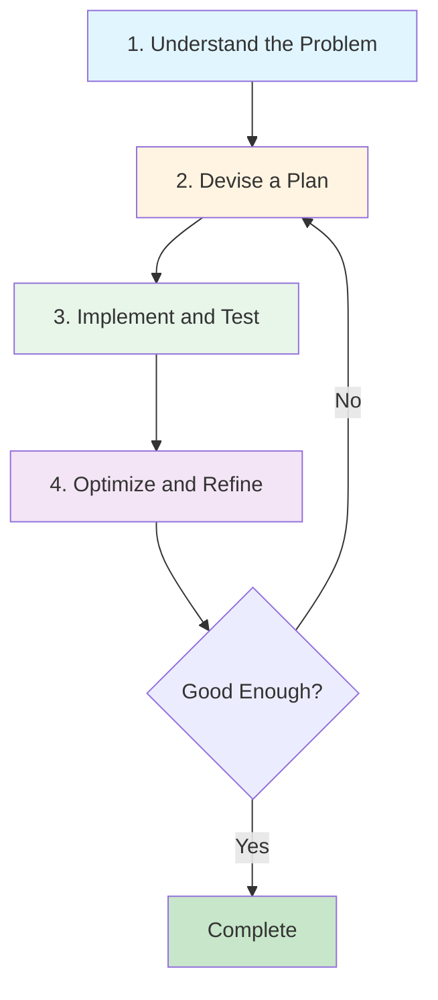

# Problem-Solving Strategies <span class="difficulty-badge difficulty-intermediate">Intermediate</span>

## Overview

Now that you understand algorithms, complexity analysis, benchmarking, and recursion, it's time to develop systematic problem-solving strategies. This chapter teaches you how to approach any algorithmic problem with confidence—whether you're optimizing production code, tackling technical interview questions, or designing efficient solutions for real-world challenges.

The difference between a struggling developer and an expert problem-solver isn't innate talent—it's having a systematic framework and recognizing patterns. In this chapter, you'll learn both. You'll master a four-step problem-solving framework (Understand → Plan → Implement → Optimize) and explore seven powerful algorithmic patterns that appear repeatedly across thousands of problems.

Rather than memorizing solutions, you'll learn to recognize when a problem calls for two pointers vs. a sliding window, when to use divide-and-conquer vs. greedy approaches, and how to combine multiple patterns to solve complex challenges. You'll work through complete problem walkthroughs, see visual representations of how algorithms work, and practice with real problems from coding interviews and production systems.

By the end of this chapter, you'll have a mental toolkit that transforms intimidating algorithmic challenges into structured, solvable puzzles. These strategies apply far beyond algorithms—they'll improve how you approach any complex programming problem.

## What You'll Learn

**Estimated time:** 65 minutes

By the end of this chapter, you will:

- Master a systematic problem-solving framework for any algorithmic challenge
- Learn common patterns: two pointers, sliding window, divide-and-conquer, and greedy algorithms
- Understand when to apply brute force vs optimized solutions based on constraints
- Develop strategies for breaking down complex problems into manageable sub-problems
- Apply problem-solving techniques to real-world scenarios with practical PHP examples

## Prerequisites

Before starting this chapter, ensure you have:

- ✓ Understanding of Big O notation *(60 mins from Chapter 1 if not done)*
- ✓ Familiarity with recursion *(70 mins from Chapter 3 if not done)*
- ✓ Completion of Chapters 0-3 *(250 mins if not done)*

## The Problem-Solving Framework

When faced with an algorithm challenge, follow this systematic approach:



### 1. Understand the Problem

Before writing any code, make sure you fully understand what's being asked:

**Ask these questions:**
- What are the inputs? (Types, ranges, constraints)
- What is the expected output?
- Are there edge cases?
- What are the performance requirements?
- Can I solve this by hand with a small example?

**Example Problem:** "Find all pairs in an array that sum to a target value."

**Understanding phase:**
- Input: Array of integers, target sum (integer)
- Output: Array of pairs (arrays with 2 elements)
- Edge cases: Empty array, no pairs found, duplicate numbers
- Should pairs be unique? Can we use the same element twice?

#### Constraint Analysis: Choosing Algorithms by Size

**Critical**: The size of your input determines which algorithm is acceptable.

```php
// Problem constraint analysis

// n ≤ 10: Any algorithm works, even O(n!)
// Example: Generate all permutations (10! = 3.6 million operations)

// n ≤ 20: O(2ⁿ) algorithms acceptable
// Example: Subset generation (2²⁰ = ~1 million subsets)

// n ≤ 100: O(n³) or O(n² log n) acceptable
// Example: Triple nested loops (100³ = 1 million operations)

// n ≤ 1,000: O(n²) acceptable
// Example: Compare all pairs (1000² = 1 million operations)

// n ≤ 10,000: O(n log n) required
// Example: Sorting, binary search (10,000 × 14 = 140k operations)

// n ≤ 1,000,000: O(n) or O(n log n) required
// Example: Hash maps, efficient sorting

// n ≤ 100,000,000: O(n) or O(log n) required
// Example: Single pass algorithms, binary search on sorted data
```

**Rule of thumb**: Modern computers handle ~10⁸ to 10⁹ operations per second.

```php
// Example: Should I use nested loops?
function analyzeConstraints(int $n): string
{
    $operations = $n * $n;
    
    if ($operations > 100_000_000) {
        return "Too slow! Need O(n log n) or O(n) algorithm";
    }
    
    if ($operations > 10_000_000) {
        return "Acceptable but slow. Consider optimization.";
    }
    
    return "Fine! O(n²) is fast enough for this input size.";
}

echo analyzeConstraints(100);    // Fine
echo analyzeConstraints(1000);   // Fine  
echo analyzeConstraints(10000);  // Too slow!
```

### 2. Devise a Plan

Choose an appropriate problem-solving strategy:

```php
// Problem: Find pairs that sum to target

// Plan A: Brute force - check all pairs O(n²)
// Plan B: Use hash map for O(n) lookup
// Plan C: Sort array and use two pointers O(n log n)

// Choose Plan B for best time complexity
```

### 3. Implement and Test

Start with a working solution, even if inefficient:

```php
// Step 1: Brute force solution (works but slow)
function findPairsBrute(array $nums, int $target): array
{
    $pairs = [];
    $n = count($nums);

    for ($i = 0; $i < $n; $i++) {
        for ($j = $i + 1; $j < $n; $j++) {
            if ($nums[$i] + $nums[$j] === $target) {
                $pairs[] = [$nums[$i], $nums[$j]];
            }
        }
    }

    return $pairs;
}

// Step 2: Optimize with hash map
function findPairsOptimized(array $nums, int $target): array
{
    $pairs = [];
    $seen = [];

    foreach ($nums as $num) {
        $complement = $target - $num;

        if (isset($seen[$complement])) {
            $pairs[] = [$complement, $num];
        }

        $seen[$num] = true;
    }

    return $pairs;
}
```

### 4. Optimize and Refine

Analyze complexity and look for improvements:

```php
// Complexity analysis:
// Brute force: O(n²) time, O(1) space
// Optimized: O(n) time, O(n) space

// Trade-off: Better time complexity for more space
```

## Common Problem-Solving Patterns

### Pattern 1: Two Pointers

Use two pointers to traverse data from different positions.

**When to use:** Sorted arrays, palindromes, pairs/triplets

```php
// Problem: Check if string is palindrome
function isPalindrome(string $s): bool
{
    $left = 0;
    $right = strlen($s) - 1;

    while ($left < $right) {
        if ($s[$left] !== $s[$right]) {
            return false;
        }
        $left++;
        $right--;
    }

    return true;
}

// Problem: Find pair in sorted array that sums to target
function findPairSorted(array $nums, int $target): ?array
{
    $left = 0;
    $right = count($nums) - 1;

    while ($left < $right) {
        $sum = $nums[$left] + $nums[$right];

        if ($sum === $target) {
            return [$nums[$left], $nums[$right]];
        } elseif ($sum < $target) {
            $left++; // Need larger sum
        } else {
            $right--; // Need smaller sum
        }
    }

    return null;
}
```

### Pattern 2: Sliding Window

Maintain a "window" of elements and slide it through the array.

**When to use:** Subarrays, substrings, consecutive elements

```php
// Problem: Maximum sum of k consecutive elements
function maxSumSubarray(array $nums, int $k): int
{
    if (count($nums) < $k) return 0;

    // Calculate first window sum
    $windowSum = array_sum(array_slice($nums, 0, $k));
    $maxSum = $windowSum;

    // Slide the window
    for ($i = $k; $i < count($nums); $i++) {
        $windowSum = $windowSum - $nums[$i - $k] + $nums[$i];
        $maxSum = max($maxSum, $windowSum);
    }

    return $maxSum;
}

echo maxSumSubarray([2, 1, 5, 1, 3, 2], 3); // 9 (5+1+3)
```

**Visual representation:**
```
[2, 1, 5, 1, 3, 2]  k=3
 └──┴──┘            sum=8
    └──┴──┘         sum=7
       └──┴──┘      sum=9  ← maximum
          └──┴──┘   sum=6
```

### Pattern 3: Hash Map Lookups

Use hash maps for O(1) lookups.

**When to use:** Counting, frequency, finding complements

```php
// Problem: Find first non-repeating character
function firstUnique(string $s): ?string
{
    // Count frequency
    $freq = [];
    for ($i = 0; $i < strlen($s); $i++) {
        $char = $s[$i];
        $freq[$char] = ($freq[$char] ?? 0) + 1;
    }

    // Find first with frequency 1
    for ($i = 0; $i < strlen($s); $i++) {
        if ($freq[$s[$i]] === 1) {
            return $s[$i];
        }
    }

    return null;
}

echo firstUnique('leetcode'); // 'l'
```

### Pattern 4: Fast & Slow Pointers

Use two pointers moving at different speeds.

**When to use:** Cycle detection, finding middle element

```php
// Problem: Detect cycle in array (values are indices)
function hasCycle(array $nums): bool
{
    if (empty($nums)) return false;

    $slow = 0;
    $fast = 0;

    do {
        // Move slow by 1 step
        $slow = $nums[$slow];

        // Move fast by 2 steps
        $fast = $nums[$nums[$fast]];

        // If they meet, there's a cycle
        if ($slow === $fast) {
            return true;
        }

    } while ($fast !== 0 && $nums[$fast] !== 0);

    return false;
}
```

### Pattern 5: Divide and Conquer

Break problem into smaller subproblems, solve recursively, combine results.

**When to use:** Sorting, searching, tree problems

```php
// Problem: Find maximum element using divide and conquer
function findMaxDivideConquer(array $nums, int $left, int $right): int
{
    // Base case: single element
    if ($left === $right) {
        return $nums[$left];
    }

    // Divide: split array in half
    $mid = (int)(($left + $right) / 2);

    // Conquer: find max in each half
    $leftMax = findMaxDivideConquer($nums, $left, $mid);
    $rightMax = findMaxDivideConquer($nums, $mid + 1, $right);

    // Combine: return larger of the two
    return max($leftMax, $rightMax);
}

$nums = [3, 7, 2, 9, 1, 5];
echo findMaxDivideConquer($nums, 0, count($nums) - 1); // 9
```

### Pattern 6: Greedy Algorithms

Make locally optimal choices at each step.

**When to use:** Optimization problems where local optimum leads to global optimum

```php
// Problem: Coin change (fewest coins)
function minCoins(array $coins, int $amount): int
{
    rsort($coins); // Sort descending
    $count = 0;

    foreach ($coins as $coin) {
        while ($amount >= $coin) {
            $amount -= $coin;
            $count++;
        }
    }

    return $amount === 0 ? $count : -1; // -1 if not possible
}

echo minCoins([1, 5, 10, 25], 63); // 6 (25+25+10+1+1+1)
```

**Warning:** Greedy doesn't always work! For coin change with arbitrary denominations, use dynamic programming.

### Pattern 7: Backtracking

Try all possibilities, backtrack when you hit a dead end.

**When to use:** Permutations, combinations, puzzles, constraint satisfaction

```php
// Problem: Generate all permutations
function permute(array $nums): array
{
    $result = [];
    permuteHelper($nums, [], $result);
    return $result;
}

function permuteHelper(array $nums, array $current, array &$result): void
{
    // Base case: no more numbers to add
    if (empty($nums)) {
        $result[] = $current;
        return;
    }

    // Try each remaining number
    for ($i = 0; $i < count($nums); $i++) {
        // Choose
        $chosen = $nums[$i];
        $remaining = array_merge(
            array_slice($nums, 0, $i),
            array_slice($nums, $i + 1)
        );

        // Explore
        permuteHelper($remaining, array_merge($current, [$chosen]), $result);

        // Backtrack (implicit - function returns)
    }
}

print_r(permute([1, 2, 3]));
// Output: [[1,2,3], [1,3,2], [2,1,3], [2,3,1], [3,1,2], [3,2,1]]
```

## Pattern 8: Bit Manipulation

Use bitwise operations for efficient computation on binary representations.

**When to use:** Flags, sets, optimization, number properties

```php
// Problem: Count number of 1 bits in binary representation
function countOnes(int $n): int
{
    $count = 0;
    
    while ($n > 0) {
        $n = $n & ($n - 1); // Remove rightmost 1 bit
        $count++;
    }
    
    return $count;
}

echo countOnes(13); // 3 (binary: 1101)

// Problem: Check if number is power of 2
function isPowerOfTwo(int $n): bool
{
    return $n > 0 && ($n & ($n - 1)) === 0;
}

echo isPowerOfTwo(16) ? 'true' : 'false'; // true
echo isPowerOfTwo(18) ? 'true' : 'false'; // false

// Problem: Find single number in array where all others appear twice
function singleNumber(array $nums): int
{
    $result = 0;
    
    foreach ($nums as $num) {
        $result ^= $num; // XOR cancels out duplicates
    }
    
    return $result;
}

echo singleNumber([4, 1, 2, 1, 2]); // 4

// Common bit manipulation operations
function bitOperations(int $num): void
{
    echo "Set bit 2: " . ($num | (1 << 2)) . "\n";      // Set bit at position
    echo "Clear bit 2: " . ($num & ~(1 << 2)) . "\n";   // Clear bit at position
    echo "Toggle bit 2: " . ($num ^ (1 << 2)) . "\n";   // Toggle bit at position
    echo "Check bit 2: " . (($num & (1 << 2)) !== 0 ? 'set' : 'clear') . "\n";
}
```

**Key bitwise operations:**
- `&` (AND): Check if bits are set
- `|` (OR): Set bits
- `^` (XOR): Toggle bits, find unique elements
- `~` (NOT): Flip bits
- `<<` (Left shift): Multiply by 2
- `>>` (Right shift): Divide by 2

## Problem Classification

Learn to recognize problem types:

### Searching & Sorting
- Binary search variants
- Custom sorting criteria
- Finding kth element

### Array Manipulation
- Subarrays, subsequences
- Rotation, reversal
- In-place modifications

### String Processing
- Pattern matching
- Anagrams, palindromes
- Parsing and validation

### Graph & Tree Problems
- Traversal (DFS, BFS)
- Shortest path
- Cycle detection

### Dynamic Programming
- Overlapping subproblems
- Optimal substructure
- Memoization opportunities

### Mathematical
- Number theory (GCD, primes)
- Combinatorics
- Bit manipulation

## Step-by-Step Example

Let's solve a complete problem using our framework:

**Problem:** Given an array of integers, find the longest consecutive sequence.

**Example:** `[100, 4, 200, 1, 3, 2]` → `4` (sequence: 1, 2, 3, 4)

### Step 1: Understand

```php
// Input: array of integers (can be unsorted, may have duplicates)
// Output: length of longest consecutive sequence
// Edge cases: empty array (return 0), single element (return 1)
// Consecutive means n, n+1, n+2, etc.
```

### Step 2: Plan

```php
// Approach 1: Sort array, count consecutive - O(n log n)
// Approach 2: Use hash set for O(1) lookups - O(n)
// Choose Approach 2 for better complexity
```

### Step 3: Implement

```php
function longestConsecutive(array $nums): int
{
    if (empty($nums)) return 0;

    // Build hash set for O(1) lookups
    $numSet = array_flip($nums);
    $longest = 0;

    foreach ($numSet as $num => $_) {
        // Only start counting from sequence start
        if (!isset($numSet[$num - 1])) {
            $currentNum = $num;
            $currentStreak = 1;

            // Count consecutive numbers
            while (isset($numSet[$currentNum + 1])) {
                $currentNum++;
                $currentStreak++;
            }

            $longest = max($longest, $currentStreak);
        }
    }

    return $longest;
}

// Test
echo longestConsecutive([100, 4, 200, 1, 3, 2]); // 4
echo longestConsecutive([0, 3, 7, 2, 5, 8, 4, 6, 0, 1]); // 9
```

### Step 4: Analyze

```php
// Time: O(n) - each number visited at most twice
// Space: O(n) - hash set storage
// This is optimal - can't do better than O(n) time
```

## Converting Recursion to Iteration

Many recursive solutions can be converted to iterative ones using a stack. This is useful when you hit recursion limits or need better performance.

```php
// Recursive tree traversal (in-order)
function inOrderRecursive(?TreeNode $node, array &$result): void
{
    if ($node === null) return;
    
    inOrderRecursive($node->left, $result);
    $result[] = $node->val;
    inOrderRecursive($node->right, $result);
}

// Iterative equivalent using explicit stack
function inOrderIterative(TreeNode $root): array
{
    $result = [];
    $stack = [];
    $current = $root;
    
    while ($current !== null || !empty($stack)) {
        // Go to leftmost node
        while ($current !== null) {
            $stack[] = $current;
            $current = $current->left;
        }
        
        // Process node
        $current = array_pop($stack);
        $result[] = $current->val;
        
        // Move to right subtree
        $current = $current->right;
    }
    
    return $result;
}

// Example: Factorial (recursive vs iterative)
function factorialRecursive(int $n): int
{
    if ($n <= 1) return 1;
    return $n * factorialRecursive($n - 1);
}

function factorialIterative(int $n): int
{
    $result = 1;
    for ($i = 2; $i <= $n; $i++) {
        $result *= $i;
    }
    return $result;
}
```

**When to convert:**
- Deep recursion causing stack overflow
- Tail recursion that can be optimized
- Performance-critical code
- When you need explicit control over the call stack

## Time vs Space Complexity Trade-offs

Understanding trade-offs is crucial for problem-solving:

### Common Trade-offs

```php
// Example: Two Sum problem

// Approach 1: Brute Force
// Time: O(n²), Space: O(1)
function twoSumBruteForce(array $nums, int $target): ?array
{
    for ($i = 0; $i < count($nums); $i++) {
        for ($j = $i + 1; $j < count($nums); $j++) {
            if ($nums[$i] + $nums[$j] === $target) {
                return [$i, $j];
            }
        }
    }
    return null;
}

// Approach 2: Hash Map
// Time: O(n), Space: O(n)
function twoSumHashMap(array $nums, int $target): ?array
{
    $map = [];
    foreach ($nums as $i => $num) {
        $complement = $target - $num;
        if (isset($map[$complement])) {
            return [$map[$complement], $i];
        }
        $map[$num] = $i;
    }
    return null;
}

// Trade-off decision:
// - Small arrays (< 100 elements): Brute force is fine
// - Large arrays: Hash map is much faster
// - Memory constrained: Brute force uses no extra space
```

### Trade-off Matrix

| Optimization Goal | What to Prioritize | What to Sacrifice |
|------------------|-------------------|-------------------|
| **Speed** | Time complexity (O(n) vs O(n²)) | Space (use hash maps, caching) |
| **Memory** | Space complexity (O(1) vs O(n)) | Time (iterate multiple times) |
| **Readability** | Simple, clear code | Optimal performance |
| **Flexibility** | General solutions | Specialized optimizations |

```php
// Example: Finding duplicates

// Fast but memory-intensive: O(n) time, O(n) space
function hasDuplicatesFast(array $nums): bool
{
    $seen = [];
    foreach ($nums as $num) {
        if (isset($seen[$num])) return true;
        $seen[$num] = true;
    }
    return false;
}

// Slow but memory-efficient: O(n²) time, O(1) space
function hasDuplicatesSlow(array $nums): bool
{
    $n = count($nums);
    for ($i = 0; $i < $n; $i++) {
        for ($j = $i + 1; $j < $n; $j++) {
            if ($nums[$i] === $nums[$j]) return true;
        }
    }
    return false;
}

// Balanced approach: O(n log n) time, O(1) space (if allowed to modify)
function hasDuplicatesBalanced(array $nums): bool
{
    sort($nums);
    for ($i = 1; $i < count($nums); $i++) {
        if ($nums[$i] === $nums[$i - 1]) return true;
    }
    return false;
}
```

## Debugging Strategies

When your solution doesn't work:

### 1. Test with Simple Cases

```php
function buggyFunction(array $nums): int
{
    // Test with small inputs first
    // [] - edge case
    // [1] - single element
    // [1, 2] - two elements
    // [1, 1, 1] - duplicates
}
```

### 2. Add Debug Output

```php
function debugSum(array $nums): int
{
    $sum = 0;
    foreach ($nums as $i => $num) {
        $sum += $num;
        echo "Step $i: sum=$sum, added=$num\n"; // Debug
    }
    return $sum;
}
```

### 3. Check Edge Cases

```php
function safeFunction($input)
{
    // Handle null/empty
    if ($input === null || empty($input)) {
        return defaultValue();
    }

    // Handle single element
    if (count($input) === 1) {
        return $input[0];
    }

    // Main logic
    // ...
}
```

## Practice Problems

Apply the strategies you've learned to solve these problems independently. Each problem reinforces specific patterns from this chapter.

::: tip Practice Strategy
1. **Understand**: Read the problem carefully, identify inputs/outputs
2. **Plan**: Choose which pattern(s) to apply before coding
3. **Implement**: Write a working solution, test with examples
4. **Optimize**: Analyze complexity, look for improvements
:::

### Problem 1: Product of Array Except Self

**Difficulty**: Medium | **Pattern**: Array Manipulation

Given an array, return an array where each element is the product of all other elements (without using division).

```php
function productExceptSelf(array $nums): array
{
    // Your solution here
}

// Test: [1, 2, 3, 4] → [24, 12, 8, 6]
// Explanation: [2*3*4, 1*3*4, 1*2*4, 1*2*3]
```

<details>
<summary>💡 Hint 1</summary>

Use two passes: one for products to the left of each element, one for products to the right.
</details>

<details>
<summary>💡 Hint 2</summary>

You can compute left products in one array, then multiply by right products in a second pass to get O(n) time with O(n) space.
</details>

<details>
<summary>✅ Solution</summary>

```php
function productExceptSelf(array $nums): array
{
    $n = count($nums);
    $result = array_fill(0, $n, 1);
    
    // Left products
    $leftProduct = 1;
    for ($i = 0; $i < $n; $i++) {
        $result[$i] = $leftProduct;
        $leftProduct *= $nums[$i];
    }
    
    // Right products (multiply into result)
    $rightProduct = 1;
    for ($i = $n - 1; $i >= 0; $i--) {
        $result[$i] *= $rightProduct;
        $rightProduct *= $nums[$i];
    }
    
    return $result;
}
```

**Time**: O(n), **Space**: O(1) excluding output array
</details>

### Problem 2: Valid Parentheses

**Difficulty**: Easy | **Pattern**: Stack

Check if a string of parentheses is valid: `"()[]{ }"` → true, `"([)]"` → false

```php
function isValidParentheses(string $s): bool
{
    // Your solution here
}

// Test cases:
// "()[]{}" → true
// "([)]" → false (improper nesting)
// "{[]}" → true
```

<details>
<summary>💡 Hint</summary>

Use a stack to track opening brackets. When you see a closing bracket, check if it matches the most recent opening bracket.
</details>

<details>
<summary>✅ Solution</summary>

```php
function isValidParentheses(string $s): bool
{
    $stack = [];
    $pairs = [')' => '(', ']' => '[', '}' => '{'];
    
    for ($i = 0; $i < strlen($s); $i++) {
        $char = $s[$i];
        
        if (in_array($char, ['(', '[', '{'])) {
            // Opening bracket - push to stack
            $stack[] = $char;
        } elseif (isset($pairs[$char])) {
            // Closing bracket - check match
            if (empty($stack) || array_pop($stack) !== $pairs[$char]) {
                return false;
            }
        }
    }
    
    return empty($stack);
}
```

**Time**: O(n), **Space**: O(n)
</details>

### Problem 3: Container With Most Water

**Difficulty**: Medium | **Pattern**: Two Pointers

Given an array of heights, find two lines that together with the x-axis form a container with the maximum water capacity.

```php
function maxArea(array $heights): int
{
    // Your solution here
}

// Test: [1, 8, 6, 2, 5, 4, 8, 3, 7] → 49
// Explanation: Container between heights[1]=8 and heights[8]=7, width=7
// Area = min(8, 7) × 7 = 49
```

<details>
<summary>💡 Hint</summary>

Use two pointers from both ends. The area is limited by the shorter line. Which pointer should you move to potentially find a larger area?
</details>

<details>
<summary>✅ Solution</summary>

```php
function maxArea(array $heights): int
{
    $left = 0;
    $right = count($heights) - 1;
    $maxArea = 0;

    while ($left < $right) {
        // Area = width × height (limited by shorter line)
        $width = $right - $left;
        $height = min($heights[$left], $heights[$right]);
        $area = $width * $height;

        $maxArea = max($maxArea, $area);

        // Move pointer pointing to shorter line
        if ($heights[$left] < $heights[$right]) {
            $left++;
        } else {
            $right--;
        }
    }

    return $maxArea;
}
```

**Why this works:** Moving the shorter pointer gives us the only chance to find a larger area. Moving the taller pointer will always result in the same or smaller area.

Time: O(n), Space: O(1)
</details>

## Combining Multiple Patterns

Many problems require combining several strategies:

### Example: Longest Substring Without Repeating Characters

**Problem:** Find length of longest substring without repeating characters in "abcabcbb".

**Solution combines:** Sliding Window + Hash Map

```php
function lengthOfLongestSubstring(string $s): int
{
    $charMap = []; // Hash map: char → last seen index
    $maxLength = 0;
    $start = 0; // Sliding window start

    for ($end = 0; $end < strlen($s); $end++) {
        $char = $s[$end];

        // If character seen before and within current window
        if (isset($charMap[$char]) && $charMap[$char] >= $start) {
            // Shrink window from left
            $start = $charMap[$char] + 1;
        }

        $charMap[$char] = $end;
        $maxLength = max($maxLength, $end - $start + 1);
    }

    return $maxLength;
}

echo lengthOfLongestSubstring("abcabcbb"); // 3 (abc)
echo lengthOfLongestSubstring("bbbbb");    // 1 (b)
echo lengthOfLongestSubstring("pwwkew");   // 3 (wke)
```

**Time:** O(n) - single pass
**Space:** O(min(n, m)) where m is character set size

### Example: Top K Frequent Elements

**Problem:** Given array, find K most frequent elements.

**Solution combines:** Hash Map + Sorting (or Heap)

```php
function topKFrequent(array $nums, int $k): array
{
    // Step 1: Hash map to count frequencies
    $freq = [];
    foreach ($nums as $num) {
        $freq[$num] = ($freq[$num] ?? 0) + 1;
    }

    // Step 2: Sort by frequency (descending)
    arsort($freq);

    // Step 3: Take top K
    return array_slice(array_keys($freq), 0, $k);
}

$nums = [1, 1, 1, 2, 2, 3];
print_r(topKFrequent($nums, 2)); // [1, 2]

// Alternative: Using bucket sort for O(n) time
function topKFrequentOptimized(array $nums, int $k): array
{
    $freq = [];
    foreach ($nums as $num) {
        $freq[$num] = ($freq[$num] ?? 0) + 1;
    }

    // Bucket sort: index = frequency, value = numbers with that frequency
    $buckets = array_fill(0, count($nums) + 1, []);

    foreach ($freq as $num => $count) {
        $buckets[$count][] = $num;
    }

    // Collect K most frequent from highest frequency buckets
    $result = [];
    for ($i = count($buckets) - 1; $i >= 0 && count($result) < $k; $i--) {
        foreach ($buckets[$i] as $num) {
            $result[] = $num;
            if (count($result) === $k) break 2;
        }
    }

    return $result;
}
```

## Advanced Problem-Solving Techniques

### Technique 1: Monotonic Stack

Useful for "next greater/smaller element" problems.

```php
// Find next greater element for each element
function nextGreaterElements(array $nums): array
{
    $n = count($nums);
    $result = array_fill(0, $n, -1);
    $stack = []; // Stores indices

    // Process each element
    for ($i = 0; $i < $n; $i++) {
        // While stack not empty and current is greater than stack top
        while (!empty($stack) && $nums[$i] > $nums[end($stack)]) {
            $idx = array_pop($stack);
            $result[$idx] = $nums[$i];
        }

        $stack[] = $i;
    }

    return $result;
}

$nums = [4, 2, 1, 5, 3];
print_r(nextGreaterElements($nums));
// [5, 5, 5, -1, -1]
```

### Technique 2: Prefix Sum

Precompute cumulative sums for O(1) range queries.

```php
class PrefixSum
{
    private array $prefix;

    public function __construct(array $nums)
    {
        $this->prefix = [0]; // Start with 0 for easier calculation

        foreach ($nums as $num) {
            $this->prefix[] = end($this->prefix) + $num;
        }
    }

    // Get sum of elements from index left to right (inclusive)
    public function rangeSum(int $left, int $right): int
    {
        return $this->prefix[$right + 1] - $this->prefix[$left];
    }
}

$nums = [1, 2, 3, 4, 5];
$ps = new PrefixSum($nums);

echo $ps->rangeSum(1, 3); // 2+3+4 = 9
echo $ps->rangeSum(0, 4); // 1+2+3+4+5 = 15
```

### Technique 3: Binary Search on Answer

When you can verify a solution quickly, binary search the answer space.

```php
// Find minimum capacity to ship packages within D days
function shipWithinDays(array $weights, int $days): int
{
    // Binary search range: [max(weights), sum(weights)]
    $left = max($weights);
    $right = array_sum($weights);

    while ($left < $right) {
        $mid = (int)(($left + $right) / 2);

        if (canShip($weights, $days, $mid)) {
            $right = $mid; // Try smaller capacity
        } else {
            $left = $mid + 1; // Need larger capacity
        }
    }

    return $left;
}

function canShip(array $weights, int $days, int $capacity): bool
{
    $daysNeeded = 1;
    $currentLoad = 0;

    foreach ($weights as $weight) {
        if ($currentLoad + $weight > $capacity) {
            $daysNeeded++;
            $currentLoad = 0;
        }
        $currentLoad += $weight;
    }

    return $daysNeeded <= $days;
}

$weights = [1, 2, 3, 4, 5, 6, 7, 8, 9, 10];
echo shipWithinDays($weights, 5); // 15
```

## Complete Problem Walkthroughs

### Walkthrough 1: Group Anagrams

**Problem:** Group strings that are anagrams of each other.

Input: `["eat", "tea", "tan", "ate", "nat", "bat"]`
Output: `[["eat","tea","ate"], ["tan","nat"], ["bat"]]`

**Step-by-step solution:**

```php
function groupAnagrams(array $strs): array
{
    // Strategy: Use sorted string as key
    $groups = [];

    foreach ($strs as $str) {
        // Sort characters to get canonical form
        $chars = str_split($str);
        sort($chars);
        $key = implode('', $chars);

        // Group by sorted form
        if (!isset($groups[$key])) {
            $groups[$key] = [];
        }
        $groups[$key][] = $str;
    }

    return array_values($groups);
}

// Alternative: Use character count as key (faster)
function groupAnagramsOptimized(array $strs): array
{
    $groups = [];

    foreach ($strs as $str) {
        // Count character frequencies
        $count = array_fill(0, 26, 0);

        for ($i = 0; $i < strlen($str); $i++) {
            $count[ord($str[$i]) - ord('a')]++;
        }

        // Use count array as key
        $key = implode('#', $count);

        if (!isset($groups[$key])) {
            $groups[$key] = [];
        }
        $groups[$key][] = $str;
    }

    return array_values($groups);
}
```

**Complexity:**
- Sorting approach: O(n × k log k) where n = number of strings, k = max string length
- Counting approach: O(n × k)

### Walkthrough 2: Meeting Rooms II

**Problem:** Given meeting time intervals, find minimum number of conference rooms required.

Input: `[[0,30], [5,10], [15,20]]`
Output: `2`

```php
function minMeetingRooms(array $intervals): int
{
    if (empty($intervals)) return 0;

    // Separate start and end times
    $starts = array_column($intervals, 0);
    $ends = array_column($intervals, 1);

    sort($starts);
    sort($ends);

    $rooms = 0;
    $maxRooms = 0;
    $endPtr = 0;

    // Process each start time
    foreach ($starts as $start) {
        // If a meeting ended before this one starts, reuse room
        if ($start >= $ends[$endPtr]) {
            $rooms--;
            $endPtr++;
        }

        $rooms++; // Allocate a room
        $maxRooms = max($maxRooms, $rooms);
    }

    return $maxRooms;
}

$meetings = [[0, 30], [5, 10], [15, 20]];
echo minMeetingRooms($meetings); // 2

// Alternative: Using priority queue (min-heap)
function minMeetingRoomsHeap(array $intervals): int
{
    if (empty($intervals)) return 0;

    // Sort by start time
    usort($intervals, fn($a, $b) => $a[0] <=> $b[0]);

    $heap = new SplMinHeap(); // Stores end times
    $heap->insert($intervals[0][1]);

    for ($i = 1; $i < count($intervals); $i++) {
        // If earliest ending meeting finishes before this starts
        if ($intervals[$i][0] >= $heap->top()) {
            $heap->extract(); // Reuse room
        }

        // Add current meeting's end time
        $heap->insert($intervals[$i][1]);
    }

    return $heap->count();
}
```

**Time:** O(n log n), **Space:** O(n)

### Walkthrough 3: Trapping Rain Water

**Problem:** Given heights, compute how much water can be trapped after raining.

```php
function trap(array $height): int
{
    if (empty($height)) return 0;

    $n = count($height);
    $water = 0;

    // Two pointers approach
    $left = 0;
    $right = $n - 1;
    $leftMax = 0;
    $rightMax = 0;

    while ($left < $right) {
        if ($height[$left] < $height[$right]) {
            // Process left side
            if ($height[$left] >= $leftMax) {
                $leftMax = $height[$left];
            } else {
                $water += $leftMax - $height[$left];
            }
            $left++;
        } else {
            // Process right side
            if ($height[$right] >= $rightMax) {
                $rightMax = $height[$right];
            } else {
                $water += $rightMax - $height[$right];
            }
            $right--;
        }
    }

    return $water;
}

$height = [0, 1, 0, 2, 1, 0, 1, 3, 2, 1, 2, 1];
echo trap($height); // 6
```

**Visual:**
```
     █
 █   ██ █   █
_█_█_████_█_█_█_
0 1 0 2 1 0 1 3 2 1 2 1
Water: 1 + 2 + 1 + 2 = 6 units
```

## More Practice Problems with Solutions

### Problem 4: Subarray Sum Equals K

Find total number of subarrays that sum to K.

```php
function subarraySum(array $nums, int $k): int
{
    $count = 0;
    $sum = 0;
    $prefixSums = [0 => 1]; // sum => frequency

    foreach ($nums as $num) {
        $sum += $num;

        // If (sum - k) exists, we found subarrays
        if (isset($prefixSums[$sum - $k])) {
            $count += $prefixSums[$sum - $k];
        }

        // Store current sum
        $prefixSums[$sum] = ($prefixSums[$sum] ?? 0) + 1;
    }

    return $count;
}

echo subarraySum([1, 1, 1], 2); // 2 ([1,1], [1,1])
echo subarraySum([1, 2, 3], 3); // 2 ([1,2], [3])
```

### Problem 5: Merge Intervals

```php
function mergeIntervals(array $intervals): array
{
    if (empty($intervals)) return [];

    // Sort by start time
    usort($intervals, fn($a, $b) => $a[0] <=> $b[0]);

    $merged = [$intervals[0]];

    for ($i = 1; $i < count($intervals); $i++) {
        $last = &$merged[count($merged) - 1];

        if ($intervals[$i][0] <= $last[1]) {
            // Overlapping, merge
            $last[1] = max($last[1], $intervals[$i][1]);
        } else {
            // Non-overlapping, add new interval
            $merged[] = $intervals[$i];
        }
    }

    return $merged;
}

$intervals = [[1, 3], [2, 6], [8, 10], [15, 18]];
print_r(mergeIntervals($intervals));
// [[1, 6], [8, 10], [15, 18]]
```

### Problem 6: Implement LRU Cache

```php
class LRUCache
{
    private array $cache = [];
    private int $capacity;

    public function __construct(int $capacity)
    {
        $this->capacity = $capacity;
    }

    public function get(int $key): int
    {
        if (!isset($this->cache[$key])) {
            return -1;
        }

        // Move to end (most recently used)
        $value = $this->cache[$key];
        unset($this->cache[$key]);
        $this->cache[$key] = $value;

        return $value;
    }

    public function put(int $key, int $value): void
    {
        // Remove if exists (to update position)
        if (isset($this->cache[$key])) {
            unset($this->cache[$key]);
        }

        // Add to end
        $this->cache[$key] = $value;

        // Evict least recently used if over capacity
        if (count($this->cache) > $this->capacity) {
            reset($this->cache);
            $lruKey = key($this->cache);
            unset($this->cache[$lruKey]);
        }
    }
}

$cache = new LRUCache(2);
$cache->put(1, 1);
$cache->put(2, 2);
echo $cache->get(1); // 1
$cache->put(3, 3);   // Evicts key 2
echo $cache->get(2); // -1 (not found)
```

## Real-World Applications

These problem-solving patterns aren't just for coding interviews—they solve real production challenges:

### Two Pointers
- **Log file analysis**: Finding matching start/end timestamps in sorted logs
- **Data deduplication**: Merging sorted datasets from multiple sources
- **Version comparison**: Finding differences between sorted file lists

### Sliding Window
- **Rate limiting**: Tracking requests in a time window for API throttling
- **Performance monitoring**: Computing moving averages for metrics dashboards
- **Stream processing**: Analyzing consecutive events in real-time data

### Hash Maps
- **Caching systems**: O(1) lookups for frequently accessed data (Redis, Memcached)
- **User session management**: Fast session ID → user data mapping
- **Duplicate detection**: Finding duplicate records in large datasets

### Divide and Conquer
- **Image processing**: Recursive filters and transformations
- **Search engines**: Distributed search across partitioned indexes
- **Database queries**: Parallel query execution on sharded data

### Greedy Algorithms
- **Task scheduling**: Selecting optimal time slots for batch jobs
- **Resource allocation**: Distributing limited resources (memory, CPU) efficiently
- **Compression algorithms**: Huffman coding for file compression

### Backtracking
- **Route planning**: Finding valid paths with constraints (GPS navigation)
- **Configuration validation**: Testing all combinations of feature flags
- **Constraint solving**: Scheduling meetings with availability constraints

::: tip From Interview to Production
The patterns you learn solving algorithm problems directly apply to building scalable systems. A developer who understands hash maps writes better caching layers. A developer who understands divide-and-conquer designs better distributed systems.
:::

## Key Takeaways

- **Understand** the problem completely before coding—clarify inputs, outputs, constraints, and edge cases
- **Choose the right strategy**: Recognize which pattern fits (two pointers, sliding window, hash maps, divide and conquer, etc.)
- **Start simple**: Get a working solution first, then optimize based on measured performance
- **Recognize patterns**: Most problems are variations of common templates you've seen before
- **Test thoroughly**: Include edge cases (empty input, single element, duplicates, negative numbers)
- **Analyze complexity**: Know the Big O of your solution and understand the trade-offs
- **Combine patterns**: Real problems often require multiple strategies working together


## What's Next

Now that you have problem-solving strategies, we'll apply them to sorting algorithms, starting with **Bubble Sort and Selection Sort** in the next chapter.

## 💻 Code Samples

All code examples from this chapter are available in the GitHub repository:

**[View Chapter 04 Code Samples](https://github.com/dalehurley/codewithphp/tree/main/code-samples/php-algorithms/chapter-04)**

Files included:
- [`01-problem-solving-patterns.php`](https://github.com/dalehurley/codewithphp/blob/main/code-samples/php-algorithms/chapter-04/01-problem-solving-patterns.php) — All major problem-solving patterns including two pointers, sliding window, hash maps, divide and conquer, greedy algorithms, and backtracking
- [`README.md`](https://github.com/dalehurley/codewithphp/blob/main/code-samples/php-algorithms/chapter-04/README.md) — Complete documentation and usage guide

Clone the repository to run the examples locally:
```bash
git clone https://github.com/dalehurley/codewithphp.git
cd codewithphp/code-samples/php-algorithms/chapter-04
php 01-problem-solving-patterns.php
```

---

Continue to [Chapter 05: Bubble Sort & Selection Sort](/series/php-algorithms/chapters/05-bubble-sort-selection-sort).
