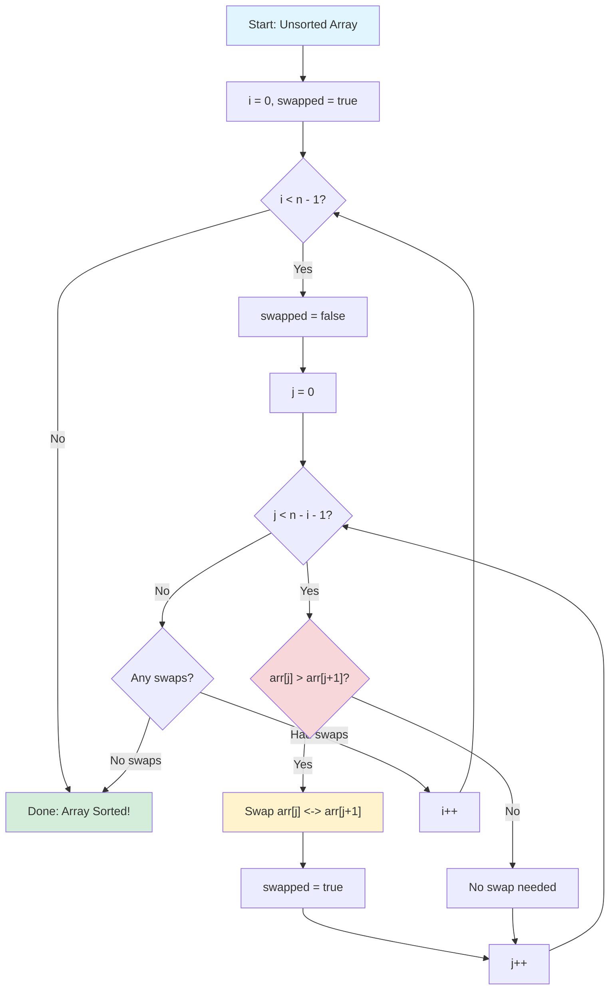
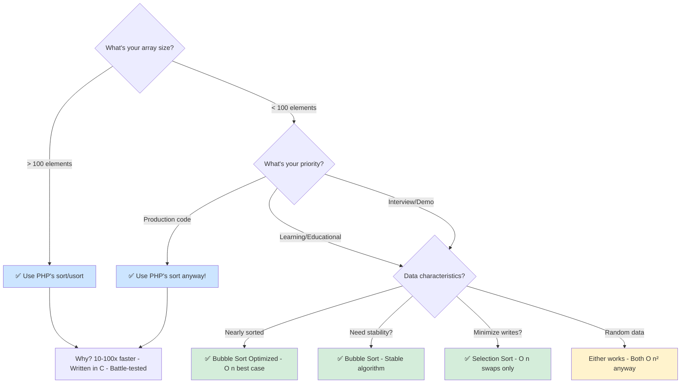

# Bubble Sort & Selection Sort <span class="difficulty-badge difficulty-intermediate">Intermediate</span>

## Overview

Now that we understand algorithm complexity and how to benchmark performance, let's dive into our first sorting algorithms. We'll start with two simple but inefficient sorting algorithms: **Bubble Sort** and **Selection Sort**.

While these algorithms aren't practical for large datasets, they're excellent learning tools that introduce fundamental sorting concepts. You'll implement these algorithms from scratch, understand why they're O(n²), and learn optimization techniques that can dramatically improve performance on certain types of data.

By the end of this chapter, you'll not only understand how sorting works at a fundamental level, but you'll also appreciate why modern sorting algorithms are necessary for real-world applications. You'll benchmark these algorithms against various dataset sizes and patterns, validating theoretical complexity analysis with real measurements.

This hands-on experience will prepare you for more advanced sorting algorithms in upcoming chapters, where you'll see how clever techniques can reduce O(n²) complexity to O(n log n) or even O(n) in special cases.

## What You'll Learn

**Estimated time:** 55 minutes

By the end of this chapter, you will:

- Implement Bubble Sort and Selection Sort from scratch in PHP
- Understand O(n²) time complexity and why it matters for sorting
- Learn optimization techniques like early termination for nearly-sorted data
- Benchmark these algorithms against various dataset sizes to validate complexity analysis
- Recognize when simple sorting algorithms are appropriate vs when to use advanced alternatives

## Prerequisites

Before starting this chapter, you should have:

- ✓ Understanding of Big O notation *(60 mins from [Chapter 01](/series/php-algorithms/chapters/01-introduction-complexity-analysis) if not done)*
- ✓ Familiarity with arrays and loops *(10 mins review if needed)*
- ✓ Completion of [Chapter 00](/series/php-algorithms/chapters/00-php-setup-primer), [Chapter 01](/series/php-algorithms/chapters/01-introduction-complexity-analysis), and [Chapter 02](/series/php-algorithms/chapters/02-benchmarking-profiling) *(180 mins if not done)*
- **Estimated Time**: ~55-65 minutes

## What You'll Build

By the end of this chapter, you will have created:

- ✅ **Complete Bubble Sort implementation** with basic and optimized versions
- ✅ **Selection Sort implementation** with visualization capabilities
- ✅ **Performance benchmark suite** comparing algorithms across different data patterns
- ✅ **Advanced variations** including Cocktail Shaker Sort and Comb Sort
- ✅ **Real-world examples** sorting user data and finding top K elements
- ✅ **Comprehensive test suite** validating algorithm correctness and complexity

## Quick Checklist

Complete these hands-on tasks as you work through the chapter:

- [ ] Implement basic Bubble Sort with nested loops
- [ ] Add optimization flag to detect if array is already sorted (early termination)
- [ ] Implement Selection Sort by finding minimum element in each pass
- [ ] Benchmark both algorithms with different array sizes (100, 500, 1000 items)
- [ ] Compare performance: random, sorted, and reverse-sorted arrays
- [ ] (Optional) Implement bidirectional Bubble Sort (Cocktail Shaker Sort)

## Why Learn "Slow" Algorithms?

You might wonder: "Why learn algorithms that are inefficient?"

Here's why:

1. **Foundation**: They teach core sorting concepts used in advanced algorithms
2. **Interviews**: Simple algorithms are common in technical interviews
3. **Small datasets**: They're perfectly fine for tiny arrays (< 100 items)
4. **Understanding**: You'll appreciate faster algorithms more after seeing slow ones
5. **Comparison**: They serve as benchmarks for better algorithms

## Bubble Sort

**Bubble Sort** repeatedly steps through the array, compares adjacent elements, and swaps them if they're in the wrong order. Larger values "bubble up" to the end.

### How It Works

Imagine sorting `[5, 2, 8, 1, 9]`:

**Pass 1:**
- Compare 5 and 2 → swap → `[2, 5, 8, 1, 9]`
- Compare 5 and 8 → no swap → `[2, 5, 8, 1, 9]`
- Compare 8 and 1 → swap → `[2, 5, 1, 8, 9]`
- Compare 8 and 9 → no swap → `[2, 5, 1, 8, 9]`
- ✅ Largest element (9) is now in place

**Pass 2:**
- Compare 2 and 5 → no swap
- Compare 5 and 1 → swap → `[2, 1, 5, 8, 9]`
- Compare 5 and 8 → no swap
- ✅ Second largest (8) is in place

Continue until the array is sorted.

### Basic Implementation

```php
# filename: bubble-sort-basic.php
<?php

declare(strict_types=1);

function bubbleSort(array $arr): array
{
    $n = count($arr);

    // Outer loop: number of passes
    for ($i = 0; $i < $n - 1; $i++) {
        // Inner loop: comparisons in this pass
        for ($j = 0; $j < $n - $i - 1; $j++) {
            // If current element is greater than next, swap them
            if ($arr[$j] > $arr[$j + 1]) {
                // Swap using array destructuring
                [$arr[$j], $arr[$j + 1]] = [$arr[$j + 1], $arr[$j]];
            }
        }
    }

    return $arr;
}

// Test it
$numbers = [64, 34, 25, 12, 22, 11, 90];
print_r(bubbleSort($numbers));
// Output: Array ( [0] => 11 [1] => 12 [2] => 22 [3] => 25 [4] => 34 [5] => 64 [6] => 90 )
```

### Complexity Analysis

- **Time Complexity:**
  - Best case: O(n) - already sorted, with optimization
  - Average case: O(n²) - random order
  - Worst case: O(n²) - reverse sorted

- **Space Complexity:** O(1) - sorts in place

::: info Why O(n²)?
The nested loop structure creates quadratic complexity:
- Outer loop runs n-1 times
- Inner loop runs (n-1), (n-2), (n-3), ..., 1 times
- Total comparisons: (n-1) + (n-2) + ... + 1 = n(n-1)/2 ≈ n²/2 → O(n²)
:::

### Optimized Bubble Sort

We can optimize by stopping early if no swaps occur (array is sorted):

```php
# filename: bubble-sort-optimized.php
<?php

declare(strict_types=1);

function bubbleSortOptimized(array $arr): array
{
    $n = count($arr);

    for ($i = 0; $i < $n - 1; $i++) {
        $swapped = false;

        for ($j = 0; $j < $n - $i - 1; $j++) {
            if ($arr[$j] > $arr[$j + 1]) {
                [$arr[$j], $arr[$j + 1]] = [$arr[$j + 1], $arr[$j]];
                $swapped = true;
            }
        }

        // If no swaps occurred, array is sorted
        if (!$swapped) {
            break;
        }
    }

    return $arr;
}

// Best case: already sorted array
$sorted = [1, 2, 3, 4, 5];
bubbleSortOptimized($sorted); // Only one pass needed!
```

::: tip Optimization Impact
This optimization improves best-case complexity to **O(n)** when the array is already sorted. This makes bubble sort surprisingly efficient for nearly-sorted data!
:::

### Algorithm Flow Diagram

Here's a visual representation of how bubble sort works:



**Key points:**
- **Outer loop** controls the number of passes (i)
- **Inner loop** compares adjacent elements (j)
- **Optimization**: Exit early if no swaps occur
- Each pass guarantees one more element is in final position

### Visualizing Bubble Sort

```php
function bubbleSortWithVisualization(array $arr): array
{
    $n = count($arr);
    echo "Starting array: " . implode(', ', $arr) . "\n\n";

    for ($i = 0; $i < $n - 1; $i++) {
        echo "Pass " . ($i + 1) . ":\n";

        for ($j = 0; $j < $n - $i - 1; $j++) {
            if ($arr[$j] > $arr[$j + 1]) {
                echo "  Swap {$arr[$j]} and {$arr[$j + 1]}\n";
                [$arr[$j], $arr[$j + 1]] = [$arr[$j + 1], $arr[$j]];
            }
        }

        echo "  Result: " . implode(', ', $arr) . "\n\n";
    }

    return $arr;
}

bubbleSortWithVisualization([5, 2, 8, 1, 9]);
```

**Output:**
```
Starting array: 5, 2, 8, 1, 9

Pass 1:
  Swap 5 and 2
  Swap 8 and 1
  Result: 2, 5, 1, 8, 9

Pass 2:
  Swap 5 and 1
  Result: 2, 1, 5, 8, 9

Pass 3:
  Swap 2 and 1
  Result: 1, 2, 5, 8, 9

Pass 4:
  Result: 1, 2, 5, 8, 9
```

## Selection Sort

**Selection Sort** works by repeatedly finding the minimum element and placing it at the beginning of the unsorted portion.

### How It Works

Sorting `[64, 25, 12, 22, 11]`:

**Pass 1:**
- Find minimum in `[64, 25, 12, 22, 11]` → **11**
- Swap with first element → `[11, 25, 12, 22, 64]`

**Pass 2:**
- Find minimum in `[25, 12, 22, 64]` → **12**
- Swap with first unsorted element → `[11, 12, 25, 22, 64]`

**Pass 3:**
- Find minimum in `[25, 22, 64]` → **22**
- Swap → `[11, 12, 22, 25, 64]`

**Pass 4:**
- Find minimum in `[25, 64]` → **25**
- Already in place → `[11, 12, 22, 25, 64]`

Done!

### Implementation

```php
# filename: selection-sort.php
<?php

declare(strict_types=1);

function selectionSort(array $arr): array
{
    $n = count($arr);

    // Move boundary of unsorted portion
    for ($i = 0; $i < $n - 1; $i++) {
        // Find minimum element in unsorted portion
        $minIndex = $i;

        for ($j = $i + 1; $j < $n; $j++) {
            if ($arr[$j] < $arr[$minIndex]) {
                $minIndex = $j;
            }
        }

        // Swap found minimum with first element of unsorted portion
        if ($minIndex !== $i) {
            [$arr[$i], $arr[$minIndex]] = [$arr[$minIndex], $arr[$i]];
        }
    }

    return $arr;
}

// Test
$numbers = [64, 25, 12, 22, 11];
print_r(selectionSort($numbers));
// Output: Array ( [0] => 11 [1] => 12 [2] => 22 [3] => 25 [4] => 64 )
```

### Complexity Analysis

- **Time Complexity:**
  - Best case: O(n²) - even if sorted
  - Average case: O(n²)
  - Worst case: O(n²)

- **Space Complexity:** O(1) - sorts in place

::: warning No Optimization Possible
Unlike bubble sort, selection sort always performs O(n²) comparisons regardless of input:
- Always makes the same number of comparisons
- No early exit optimization possible
- Comparisons: (n-1) + (n-2) + ... + 1 = n(n-1)/2 → O(n²)

However, it minimizes the number of **swaps** to O(n), making it useful when write operations are expensive.
:::

### Algorithm Flow Diagram

Here's a visual representation of how selection sort works:

```mermaid
flowchart TB
    Start[Start: Unsorted Array] --> Init[i = 0]
    Init --> OuterCheck{i < n - 1?}
    OuterCheck -->|No| Done[Done: Array Sorted!]
    OuterCheck -->|Yes| SetMin[minIndex = i]
    SetMin --> InnerInit[j = i + 1]
    InnerInit --> InnerCheck{j < n?}
    InnerCheck -->|No| CheckSwap{minIndex ≠ i?}
    InnerCheck -->|Yes| Compare{"arr[j] < arr[minIndex]?"}
    Compare -->|Yes| UpdateMin[minIndex = j]
    Compare -->|No| Continue[Continue]
    UpdateMin --> IncrementJ[j++]
    Continue --> IncrementJ
    IncrementJ --> InnerCheck
    CheckSwap -->|Yes| Swap[Swap arr[i] ↔ arr[minIndex]]
    CheckSwap -->|No| NoSwap[No swap needed]
    Swap --> IncrementI[i++]
    NoSwap --> IncrementI
    IncrementI --> OuterCheck
    
    style Start fill:#e1f5ff
    style Done fill:#d4edda
    style Swap fill:#fff3cd
    style Compare fill:#f8d7da
    style UpdateMin fill:#fff3cd
```

**Key points:**
- **Outer loop** moves the boundary between sorted/unsorted portions
- **Inner loop** finds the minimum element in unsorted portion
- Only **one swap per pass** (at most)
- No early termination possible (always does all comparisons)

### Selection Sort with Visualization

```php
function selectionSortWithVisualization(array $arr): array
{
    $n = count($arr);
    echo "Starting array: " . implode(', ', $arr) . "\n\n";

    for ($i = 0; $i < $n - 1; $i++) {
        $minIndex = $i;

        // Find minimum
        for ($j = $i + 1; $j < $n; $j++) {
            if ($arr[$j] < $arr[$minIndex]) {
                $minIndex = $j;
            }
        }

        // Swap if needed
        if ($minIndex !== $i) {
            echo "Pass " . ($i + 1) . ": ";
            echo "Swap {$arr[$i]} (position $i) with {$arr[$minIndex]} (position $minIndex)\n";
            [$arr[$i], $arr[$minIndex]] = [$arr[$minIndex], $arr[$i]];
            echo "  Result: " . implode(', ', $arr) . "\n\n";
        }
    }

    return $arr;
}

selectionSortWithVisualization([64, 25, 12, 22, 11]);
```

## Comparing Bubble Sort vs Selection Sort

Let's benchmark them:

```php
require_once 'Benchmark.php'; // From Chapter 2

$bench = new Benchmark();

// Test with different sizes
$sizes = [100, 500, 1000, 2000];

foreach ($sizes as $size) {
    $data = range(1, $size);
    shuffle($data);

    echo "Array size: $size\n";
    $bench->compare([
        'Bubble Sort' => fn($arr) => bubbleSort($arr),
        'Bubble Sort (Optimized)' => fn($arr) => bubbleSortOptimized($arr),
        'Selection Sort' => fn($arr) => selectionSort($arr),
    ], $data, iterations: 10);
    echo "\n";
}
```

### Key Differences

| Feature | Bubble Sort | Selection Sort |
|---------|-------------|----------------|
| **Comparisons** | O(n²) | O(n²) |
| **Swaps** | O(n²) worst case | O(n) always |
| **Best case** | O(n) with optimization | O(n²) always |
| **Stable?** | Yes | No |
| **When to use** | Nearly sorted data | Minimize writes |

::: info What is Stability?
**Stability** means equal elements maintain their relative order after sorting. This matters when sorting objects by one field while preserving order from a previous sort:

```php
# filename: stability-example.php
<?php

declare(strict_types=1);

$students = [
    ['name' => 'Alice', 'score' => 85],
    ['name' => 'Bob', 'score' => 90],
    ['name' => 'Charlie', 'score' => 85],
];

// Stable sort: Alice stays before Charlie (both scored 85)
// Unstable sort: Charlie might come before Alice

// This matters when you sort by multiple fields:
// 1. First sort by name (alphabetical)
// 2. Then stable-sort by score
// Result: Same scores appear in alphabetical order
```

Bubble sort is **stable** because it only swaps adjacent elements when needed. Selection sort is **unstable** because it can swap non-adjacent elements, disrupting the original order.
:::

### Memory Usage Comparison

Both algorithms are **in-place**, meaning they sort the array without requiring significant extra memory:

| Aspect | Bubble Sort | Selection Sort |
|--------|-------------|----------------|
| **Space complexity** | O(1) | O(1) |
| **Extra variables** | 2-3 temp vars | 2 index vars |
| **Recursion stack** | None | None |
| **Memory efficient?** | ✅ Yes | ✅ Yes |

::: info Why Memory Matters
In-place sorting is crucial for:
- **Memory-constrained environments** (embedded systems, mobile devices)
- **Large datasets** that barely fit in RAM
- **Real-time systems** where memory allocation is expensive
- **Systems with fragmented memory** where large allocations fail

Both bubble and selection sort excel here, unlike merge sort which requires O(n) extra space.
:::

```php
# filename: memory-comparison.php
<?php

declare(strict_types=1);

// Demonstrate memory efficiency
$largeArray = range(1, 100000);
shuffle($largeArray);

// These sorts modify the array in-place
$memoryBefore = memory_get_usage();
bubbleSort($largeArray); // Or selectionSort()
$memoryAfter = memory_get_usage();

echo "Memory used: " . ($memoryAfter - $memoryBefore) . " bytes\n";
// Output: ~0-100 bytes (just a few temporary variables)

// Compare to merge sort which would need ~800KB for the same array
```

## Practical Applications

::: tip When to Use Built-in `sort()`
For production code, **always use PHP's built-in `sort()`** function instead of implementing your own:

```php
# filename: use-builtin-sort.php
<?php

$numbers = [64, 34, 25, 12, 22, 11, 90];

// ✅ Production: Use built-in (uses optimized C implementation)
sort($numbers); // Typically uses Quicksort or Timsort

// ❌ Don't implement your own unless:
// - Learning/educational purposes
// - Special sorting requirements
// - Custom comparison logic not supported by built-ins
```

The examples in this chapter are for **learning** how algorithms work, not for production use!
:::

### When Bubble Sort Is Okay

```php
# filename: bubble-sort-use-cases.php
<?php

declare(strict_types=1);

// Tiny array - bubble sort is fine
function sortThreeNumbers(int $a, int $b, int $c): array
{
    $arr = [$a, $b, $c];
    return bubbleSort($arr); // Only 3 elements!
}

// Nearly sorted data
$almostSorted = [1, 2, 3, 5, 4, 6, 7, 8];
bubbleSortOptimized($almostSorted); // Very fast with optimization
```

### When Selection Sort Is Okay

```php
// When write operations are expensive (e.g., flash memory, network)
function sortExpensiveWrites(array $arr): array
{
    // Selection sort minimizes swaps
    return selectionSort($arr);
}

// Finding top K elements
function findTopK(array $arr, int $k): array
{
    // Use k passes of selection sort
    $n = count($arr);

    for ($i = 0; $i < min($k, $n); $i++) {
        $maxIndex = $i;

        for ($j = $i + 1; $j < $n; $j++) {
            if ($arr[$j] > $arr[$maxIndex]) {
                $maxIndex = $j;
            }
        }

        if ($maxIndex !== $i) {
            [$arr[$i], $arr[$maxIndex]] = [$arr[$maxIndex], $arr[$i]];
        }
    }

    return array_slice($arr, 0, $k);
}

$scores = [45, 92, 67, 88, 71, 95, 53];
print_r(findTopK($scores, 3)); // [95, 92, 88]
```

### When NOT to Use These Algorithms

::: danger Avoid for Large Datasets
**Never use Bubble Sort or Selection Sort for:**

❌ **Arrays larger than 100 elements** — O(n²) becomes painfully slow
- 100 elements: ~10,000 operations
- 1,000 elements: ~1,000,000 operations  
- 10,000 elements: ~100,000,000 operations (minutes to complete!)

❌ **Performance-critical code paths** — Use optimized algorithms instead

❌ **Production sorting** — PHP's built-in functions are 10-100x faster

❌ **Large objects or complex data** — Each swap is expensive

❌ **Parallel/concurrent sorting** — Not parallelizable due to sequential nature

❌ **Real-time applications** — Unpredictable performance on random data
:::

**Example of bad usage:**

```php
# filename: bad-usage-example.php
<?php

declare(strict_types=1);

// ❌ BAD: Sorting large database result set
$customers = $database->query("SELECT * FROM customers")->fetchAll();
// 10,000 records

$start = microtime(true);
$sorted = bubbleSort($customers); // Takes 30+ seconds! ⏱️
$time = microtime(true) - $start;
echo "Bubble sort: {$time}s\n"; // 30+ seconds

// ✅ GOOD: Use built-in sort with custom comparator
$start = microtime(true);
usort($customers, fn($a, $b) => $a['name'] <=> $b['name']);
$time = microtime(true) - $start;
echo "PHP usort: {$time}s\n"; // ~0.05 seconds (600x faster!)
```

**Why built-in functions are faster:**
- Written in C (compiled, not interpreted)
- Use optimized algorithms (Quicksort/Timsort hybrid)
- Cache-friendly memory access patterns
- Decades of performance tuning

**When to use bubble/selection sort:**
- ✅ Educational purposes (learning how sorting works)
- ✅ Tiny arrays (< 10 elements) where simplicity matters
- ✅ Nearly-sorted data (bubble sort optimized only)
- ✅ Embedded systems with extreme memory constraints
- ✅ Technical interviews to demonstrate understanding

## Real-World Example: Sorting User Data

```php
class User
{
    public function __construct(
        public string $name,
        public int $age
    ) {}
}

function sortUsersByAge(array $users): array
{
    $n = count($users);

    // Using bubble sort for small user arrays
    for ($i = 0; $i < $n - 1; $i++) {
        for ($j = 0; $j < $n - $i - 1; $j++) {
            if ($users[$j]->age > $users[$j + 1]->age) {
                [$users[$j], $users[$j + 1]] = [$users[$j + 1], $users[$j]];
            }
        }
    }

    return $users;
}

$users = [
    new User('Alice', 30),
    new User('Bob', 25),
    new User('Charlie', 35),
    new User('David', 25),
];

$sorted = sortUsersByAge($users);

foreach ($sorted as $user) {
    echo "{$user->name}: {$user->age}\n";
}
```

## Quick Decision Guide

Use this flowchart to choose the right sorting approach:



### Decision Table Summary

| Scenario | Best Choice | Reason |
|----------|-------------|--------|
| **Array > 100 elements** | PHP `sort()` | Much faster, optimized |
| **Production code** | PHP `sort()` / `usort()` | Reliable, tested, fast |
| **Nearly sorted data** | Bubble Sort (optimized) | O(n) best case |
| **Need stability** | Bubble Sort | Maintains relative order |
| **Minimize writes** | Selection Sort | Only O(n) swaps |
| **Random small array** | Either (or built-in) | Both O(n²) anyway |
| **Learning/Teaching** | Both | Understand fundamentals |
| **Memory constrained** | Either | Both O(1) space |

## Common Mistakes to Avoid

::: danger Off-by-One Errors
One of the most common bugs in sorting algorithms:

```php
# filename: mistake-off-by-one.php
<?php

// ❌ Wrong: goes out of bounds
for ($j = 0; $j < $n; $j++) { // Should be $n - 1
    if ($arr[$j] > $arr[$j + 1]) { // $j + 1 can exceed bounds!
        // This will cause: "Undefined array key" error
    }
}

// ✅ Correct: stop before the last element
for ($j = 0; $j < $n - 1; $j++) {
    if ($arr[$j] > $arr[$j + 1]) {
        [$arr[$j], $arr[$j + 1]] = [$arr[$j + 1], $arr[$j]];
    }
}
```

Always remember: when comparing `$arr[$j]` with `$arr[$j + 1]`, loop must stop at `$n - 1`.
:::

::: danger Forgetting to Return
Arrays in PHP are passed by value, not reference:

```php
# filename: mistake-no-return.php
<?php

// ❌ Wrong: modifies in place but doesn't return
function bubbleSort(array $arr): void
{
    // ... sorting logic ...
    // Changes are lost! PHP arrays are passed by value
}

// ✅ Correct: return the modified array
function bubbleSort(array $arr): array
{
    // ... sorting logic ...
    return $arr; // Return is required!
}

// Usage
$numbers = [5, 2, 8];
$sorted = bubbleSort($numbers); // Must capture return value
```
:::

::: tip Modern PHP Swapping
Use array destructuring for elegant swaps:

```php
# filename: swapping-techniques.php
<?php

// Old way (still works)
$temp = $arr[$i];
$arr[$i] = $arr[$j];
$arr[$j] = $temp;

// ✅ Modern PHP way: array destructuring (PHP 7.1+)
[$arr[$i], $arr[$j]] = [$arr[$j], $arr[$i]];

// This is cleaner, more readable, and equally fast
```
:::

## Cocktail Shaker Sort (Bidirectional Bubble Sort)

An optimization of bubble sort that sorts in both directions:

```php
function cocktailSort(array $arr): array
{
    $n = count($arr);
    $swapped = true;
    $start = 0;
    $end = $n - 1;

    while ($swapped) {
        $swapped = false;

        // Forward pass (left to right)
        for ($i = $start; $i < $end; $i++) {
            if ($arr[$i] > $arr[$i + 1]) {
                [$arr[$i], $arr[$i + 1]] = [$arr[$i + 1], $arr[$i]];
                $swapped = true;
            }
        }

        if (!$swapped) break;

        $swapped = false;
        $end--;

        // Backward pass (right to left)
        for ($i = $end; $i > $start; $i--) {
            if ($arr[$i] < $arr[$i - 1]) {
                [$arr[$i], $arr[$i - 1]] = [$arr[$i - 1], $arr[$i]];
                $swapped = true;
            }
        }

        $start++;
    }

    return $arr;
}

// Test
$numbers = [5, 1, 4, 2, 8, 0, 2];
print_r(cocktailSort($numbers));
// Output: [0, 1, 2, 2, 4, 5, 8]
```

**Advantages over regular bubble sort:**
- Slightly faster on some inputs
- Better handles "turtles" (small values at the end)
- Still O(n²) worst case but can be faster in practice

### Performance Comparison

```php
require_once 'Benchmark.php';

$bench = new Benchmark();

// Test on different data patterns
$patterns = [
    'Random' => function($n) { $arr = range(1, $n); shuffle($arr); return $arr; },
    'Nearly Sorted' => function($n) {
        $arr = range(1, $n);
        // Swap a few elements
        for ($i = 0; $i < $n / 10; $i++) {
            $j = rand(0, $n - 1);
            $k = rand(0, $n - 1);
            [$arr[$j], $arr[$k]] = [$arr[$k], $arr[$j]];
        }
        return $arr;
    },
    'Reversed' => function($n) { return range($n, 1); },
];

foreach ($patterns as $patternName => $generator) {
    echo "\n{$patternName} data (n=100):\n";
    $data = $generator(100);

    $bench->compare([
        'Bubble Sort' => fn($arr) => bubbleSort($arr),
        'Bubble Sort (Optimized)' => fn($arr) => bubbleSortOptimized($arr),
        'Cocktail Sort' => fn($arr) => cocktailSort($arr),
        'Selection Sort' => fn($arr) => selectionSort($arr),
    ], $data, iterations: 100);
}
```

## Adaptive Bubble Sort

Adaptive sort: performs better on partially sorted data.

```php
function adaptiveBubbleSort(array $arr): array
{
    $n = count($arr);
    $swapped = true;
    $passes = 0;

    while ($swapped) {
        $swapped = false;
        $lastSwap = 0;

        for ($i = 0; $i < $n - $passes - 1; $i++) {
            if ($arr[$i] > $arr[$i + 1]) {
                [$arr[$i], $arr[$i + 1]] = [$arr[$i + 1], $arr[$i]];
                $swapped = true;
                $lastSwap = $i;
            }
        }

        // Optimize: elements after last swap are already sorted
        $passes = $n - $lastSwap - 1;

        if (!$swapped) break;
    }

    return $arr;
}

// Best for nearly sorted data
$nearlySorted = [1, 2, 3, 5, 4, 6, 7, 8, 9, 10];
$start = hrtime(true);
adaptiveBubbleSort($nearlySorted);
$time = (hrtime(true) - $start) / 1_000_000;
echo "Time: {$time}ms\n"; // Very fast!
```

## Comb Sort (Improved Bubble Sort)

Uses a gap larger than 1 and shrinks it:

```php
function combSort(array $arr): array
{
    $n = count($arr);
    $gap = $n;
    $shrink = 1.3;
    $swapped = true;

    while ($gap > 1 || $swapped) {
        // Update gap
        $gap = (int)($gap / $shrink);
        if ($gap < 1) $gap = 1;

        $swapped = false;

        // Compare elements with current gap
        for ($i = 0; $i + $gap < $n; $i++) {
            if ($arr[$i] > $arr[$i + $gap]) {
                [$arr[$i], $arr[$i + $gap]] = [$arr[$i + $gap], $arr[$i]];
                $swapped = true;
            }
        }
    }

    return $arr;
}

// Significantly faster than bubble sort on large arrays
$large = range(1, 1000);
shuffle($large);

$start = hrtime(true);
bubbleSort($large);
$bubbleTime = (hrtime(true) - $start) / 1_000_000;

$start = hrtime(true);
combSort($large);
$combTime = (hrtime(true) - $start) / 1_000_000;

echo "Bubble Sort: {$bubbleTime}ms\n";
echo "Comb Sort: {$combTime}ms\n";
echo "Speedup: " . round($bubbleTime / $combTime, 2) . "x\n";
```

## Interview Questions & Answers

### Q1: When would you use bubble sort in production?

**Answer:**
- Very small datasets (< 10 elements) where code simplicity matters
- Nearly sorted data with optimization enabled
- Educational purposes or as a fallback
- When memory is extremely limited (in-place, no recursion)
- **Realistically:** Almost never. Use `sort()` or better algorithms.

### Q2: What's the space complexity and why?

**Answer:**
O(1) space complexity (constant). Both bubble sort and selection sort are in-place algorithms:
- Only use a few variables for swapping and loop counters
- Don't create additional arrays proportional to input size
- Compare to merge sort which needs O(n) extra space

### Q3: How do you detect if an array is already sorted efficiently?

**Answer:**
```php
function isSorted(array $arr): bool
{
    $n = count($arr);
    for ($i = 0; $i < $n - 1; $i++) {
        if ($arr[$i] > $arr[$i + 1]) {
            return false;
        }
    }
    return true;
}

// Or using optimized bubble sort:
function isSortedViaBubble(array $arr): bool
{
    $n = count($arr);
    $swapped = false;

    for ($i = 0; $i < $n - 1; $i++) {
        if ($arr[$i] > $arr[$i + 1]) {
            return false; // Early exit on first inversion
        }
    }

    return true; // No swaps needed
}
```

### Q4: Implement stable selection sort

**Answer:**
Regular selection sort is unstable. Make it stable by shifting instead of swapping:

```php
function stableSelectionSort(array $arr): array
{
    $n = count($arr);

    for ($i = 0; $i < $n - 1; $i++) {
        $minIndex = $i;

        // Find minimum
        for ($j = $i + 1; $j < $n; $j++) {
            if ($arr[$j] < $arr[$minIndex]) {
                $minIndex = $j;
            }
        }

        // Instead of swapping, shift elements
        if ($minIndex !== $i) {
            $minValue = $arr[$minIndex];

            // Shift elements right
            for ($j = $minIndex; $j > $i; $j--) {
                $arr[$j] = $arr[$j - 1];
            }

            $arr[$i] = $minValue;
        }
    }

    return $arr;
}

// Test stability
$items = [
    ['name' => 'Alice', 'age' => 30],
    ['name' => 'Bob', 'age' => 25],
    ['name' => 'Charlie', 'age' => 30],
];

// Sort by age (stable)
$sorted = stableSelectionSort($items);
// Alice should still come before Charlie (both age 30)
```

### Q5: Optimize bubble sort for a linked list

**Answer:**
```php
class ListNode
{
    public function __construct(
        public int $value,
        public ?ListNode $next = null
    ) {}
}

function bubbleSortLinkedList(?ListNode $head): ?ListNode
{
    if ($head === null) return null;

    $swapped = true;

    while ($swapped) {
        $swapped = false;
        $current = $head;

        while ($current->next !== null) {
            if ($current->value > $current->next->value) {
                // Swap values (easier than rewiring pointers)
                $temp = $current->value;
                $current->value = $current->next->value;
                $current->next->value = $temp;
                $swapped = true;
            }

            $current = $current->next;
        }
    }

    return $head;
}

// Create list: 4 -> 2 -> 1 -> 3
$head = new ListNode(4, new ListNode(2, new ListNode(1, new ListNode(3))));
$sorted = bubbleSortLinkedList($head);

// Print: 1 -> 2 -> 3 -> 4
$current = $sorted;
while ($current !== null) {
    echo $current->value . " ";
    $current = $current->next;
}
```

### Q6: Count minimum swaps needed to sort array

**Answer:**
```php
function minSwapsToSort(array $arr): int
{
    $n = count($arr);
    $arrPos = [];

    // Store value => position
    for ($i = 0; $i < $n; $i++) {
        $arrPos[] = [$arr[$i], $i];
    }

    // Sort by value
    usort($arrPos, fn($a, $b) => $a[0] <=> $b[0]);

    $visited = array_fill(0, $n, false);
    $swaps = 0;

    for ($i = 0; $i < $n; $i++) {
        // Skip if already visited or in correct position
        if ($visited[$i] || $arrPos[$i][1] === $i) {
            continue;
        }

        // Count cycle size
        $cycleSize = 0;
        $j = $i;

        while (!$visited[$j]) {
            $visited[$j] = true;
            $j = $arrPos[$j][1];
            $cycleSize++;
        }

        // Add cycle size - 1 swaps
        if ($cycleSize > 0) {
            $swaps += $cycleSize - 1;
        }
    }

    return $swaps;
}

echo minSwapsToSort([4, 3, 2, 1]); // 2
echo minSwapsToSort([1, 5, 4, 3, 2]); // 2
```

## Comprehensive Benchmark Suite

```php
class SortingBenchmark
{
    private Benchmark $bench;
    private array $results = [];

    public function __construct()
    {
        $this->bench = new Benchmark();
    }

    public function runComprehensiveTests(): void
    {
        $sizes = [10, 50, 100, 500, 1000];
        $dataTypes = [
            'Random' => fn($n) => $this->generateRandom($n),
            'Sorted' => fn($n) => range(1, $n),
            'Reversed' => fn($n) => range($n, 1),
            'Nearly Sorted' => fn($n) => $this->generateNearlySorted($n),
            'Many Duplicates' => fn($n) => $this->generateDuplicates($n),
        ];

        foreach ($sizes as $size) {
            echo "\n" . str_repeat('=', 60) . "\n";
            echo "Array Size: {$size}\n";
            echo str_repeat('=', 60) . "\n";

            foreach ($dataTypes as $typeName => $generator) {
                echo "\n{$typeName}:\n";
                $data = $generator($size);

                $this->bench->compare([
                    'Bubble' => fn($arr) => bubbleSort($arr),
                    'Bubble Optimized' => fn($arr) => bubbleSortOptimized($arr),
                    'Cocktail' => fn($arr) => cocktailSort($arr),
                    'Selection' => fn($arr) => selectionSort($arr),
                    'Comb' => fn($arr) => combSort($arr),
                    'PHP sort()' => function($arr) {
                        sort($arr);
                        return $arr;
                    },
                ], $data, iterations: $size > 500 ? 10 : 100);
            }
        }
    }

    private function generateRandom(int $n): array
    {
        $arr = range(1, $n);
        shuffle($arr);
        return $arr;
    }

    private function generateNearlySorted(int $n): array
    {
        $arr = range(1, $n);
        $swaps = max(1, (int)($n / 10));

        for ($i = 0; $i < $swaps; $i++) {
            $j = rand(0, $n - 1);
            $k = rand(0, $n - 1);
            [$arr[$j], $arr[$k]] = [$arr[$k], $arr[$j]];
        }

        return $arr;
    }

    private function generateDuplicates(int $n): array
    {
        $arr = [];
        $uniqueValues = max(1, (int)($n / 5));

        for ($i = 0; $i < $n; $i++) {
            $arr[] = rand(1, $uniqueValues);
        }

        return $arr;
    }
}

// Run comprehensive benchmarks
$benchmark = new SortingBenchmark();
$benchmark->runComprehensiveTests();
```

## Practice Exercises

Test your understanding with these hands-on challenges:

### Exercise 1: Descending Bubble Sort

**Goal**: Modify bubble sort to sort in descending order instead of ascending.

**Requirements**:
- Create a function `bubbleSortDesc()` that sorts from largest to smallest
- Use the same optimization technique (early termination)
- Test with the array `[5, 2, 8, 1, 9]`

**Validation**: 

```php
# filename: exercise-01-descending-sort.php
<?php

declare(strict_types=1);

function bubbleSortDesc(array $arr): array
{
    // Your code here
}

// Test
$result = bubbleSortDesc([5, 2, 8, 1, 9]);
echo implode(', ', $result);
```

**Expected output:**
```
9, 8, 5, 2, 1
```

<details>
<summary>💡 Click to see solution</summary>

```php
# filename: solution-01-descending-sort.php
<?php

declare(strict_types=1);

function bubbleSortDesc(array $arr): array
{
    $n = count($arr);

    for ($i = 0; $i < $n - 1; $i++) {
        $swapped = false;
        
        for ($j = 0; $j < $n - $i - 1; $j++) {
            // Change > to < for descending order
            if ($arr[$j] < $arr[$j + 1]) {
                [$arr[$j], $arr[$j + 1]] = [$arr[$j + 1], $arr[$j]];
                $swapped = true;
            }
        }
        
        if (!$swapped) break;
    }

    return $arr;
}

// Test
$result = bubbleSortDesc([5, 2, 8, 1, 9]);
echo implode(', ', $result); // Output: 9, 8, 5, 2, 1
```

**Key insight**: Simply flip the comparison operator from `>` to `<` to reverse the sort order.
</details>

### Exercise 2: Count Swaps

**Goal**: Modify bubble sort to track and return the number of swaps performed.

**Requirements**:
- Return both the sorted array and swap count
- Test with random, sorted, and reverse-sorted arrays
- Compare swap counts between the three cases

**Validation**:

```php
# filename: exercise-02-count-swaps.php
<?php

declare(strict_types=1);

function bubbleSortCountSwaps(array $arr): array
{
    $swaps = 0;
    // Your code here
    return ['array' => $arr, 'swaps' => $swaps];
}

// Test
$result = bubbleSortCountSwaps([5, 2, 8, 1, 9]);
echo "Sorted: " . implode(', ', $result['array']) . "\n";
echo "Swaps performed: {$result['swaps']}\n";
```

**Expected output:**
```
Sorted: 1, 2, 5, 8, 9
Swaps performed: 6
```

<details>
<summary>💡 Click to see solution</summary>

```php
# filename: solution-02-count-swaps.php
<?php

declare(strict_types=1);

function bubbleSortCountSwaps(array $arr): array
{
    $n = count($arr);
    $swaps = 0;

    for ($i = 0; $i < $n - 1; $i++) {
        for ($j = 0; $j < $n - $i - 1; $j++) {
            if ($arr[$j] > $arr[$j + 1]) {
                [$arr[$j], $arr[$j + 1]] = [$arr[$j + 1], $arr[$j]];
                $swaps++; // Increment counter
            }
        }
    }

    return ['array' => $arr, 'swaps' => $swaps];
}

// Test different patterns
$patterns = [
    'Random' => [5, 2, 8, 1, 9],
    'Sorted' => [1, 2, 5, 8, 9],
    'Reversed' => [9, 8, 5, 2, 1],
];

foreach ($patterns as $name => $data) {
    $result = bubbleSortCountSwaps($data);
    echo "{$name}: {$result['swaps']} swaps\n";
}
// Output:
// Random: 6 swaps
// Sorted: 0 swaps
// Reversed: 10 swaps
```

**Key insight**: Reverse-sorted arrays require the maximum number of swaps (n(n-1)/2), while sorted arrays require zero.
</details>

### Exercise 3: Find Kth Smallest Element

**Goal**: Use selection sort to efficiently find the Kth smallest element without fully sorting the array.

**Requirements**:
- Only perform K passes of selection sort (not full sort)
- Return the Kth smallest element
- Must work for K from 1 to n

**Validation**:

```php
# filename: exercise-03-kth-smallest.php
<?php

declare(strict_types=1);

function findKthSmallest(array $arr, int $k): int
{
    // Hint: You only need k passes of selection sort
    // Your code here
}

// Test
echo findKthSmallest([7, 10, 4, 3, 20, 15], 3); // Should output: 7
echo "\n";
echo findKthSmallest([7, 10, 4, 3, 20, 15], 1); // Should output: 3
```

**Expected output:**
```
7
3
```

<details>
<summary>💡 Click to see solution</summary>

```php
# filename: solution-03-kth-smallest.php
<?php

declare(strict_types=1);

function findKthSmallest(array $arr, int $k): int
{
    $n = count($arr);

    // Only do k passes instead of n-1
    for ($i = 0; $i < $k; $i++) {
        $minIndex = $i;

        // Find minimum in remaining portion
        for ($j = $i + 1; $j < $n; $j++) {
            if ($arr[$j] < $arr[$minIndex]) {
                $minIndex = $j;
            }
        }

        // Swap if needed
        if ($minIndex !== $i) {
            [$arr[$i], $arr[$minIndex]] = [$arr[$minIndex], $arr[$i]];
        }
    }

    // After k passes, kth smallest is at position k-1
    return $arr[$k - 1];
}

// Test
echo findKthSmallest([7, 10, 4, 3, 20, 15], 3); // Output: 7
echo "\n";
echo findKthSmallest([7, 10, 4, 3, 20, 15], 1); // Output: 3
echo "\n";

// After 3 passes: [3, 4, 7, 10, 20, 15]
//                      ^
//                   3rd smallest
```

**Key insight**: This optimization reduces time complexity from O(n²) to O(k×n), which is much faster when k << n.
</details>

## Key Takeaways

- **Bubble Sort**: Simple but O(n²), good for nearly sorted data with optimization
- **Selection Sort**: Always O(n²), but minimizes swaps
- Both are **in-place** algorithms (O(1) space)
- **Bubble sort is stable**, selection sort is not
- Use only for **small datasets** (< 100 elements)
- Understanding these helps you appreciate better algorithms

## Wrap-up

Congratulations! You've completed Chapter 05. Here's what you accomplished:

- ✅ **Implemented Bubble Sort** from scratch with both basic and optimized versions
- ✅ **Mastered Selection Sort** and understood its unique characteristics
- ✅ **Analyzed time complexity** of O(n²) algorithms with mathematical proofs
- ✅ **Created visualization functions** to see how sorting works step-by-step
- ✅ **Built benchmark suites** comparing algorithms across different data patterns
- ✅ **Explored advanced variations** like Cocktail Shaker Sort and Comb Sort
- ✅ **Understood stability** in sorting and why it matters
- ✅ **Learned when to use** simple algorithms vs advanced alternatives
- ✅ **Applied sorting concepts** to real-world problems like finding top K elements

You now have a solid foundation in sorting algorithms and understand the fundamental trade-offs between simplicity and efficiency. This knowledge will make the more advanced sorting algorithms in the next chapters much easier to understand.

::: tip What You Can Do Now
- Sort small arrays efficiently with appropriate algorithms
- Optimize bubble sort for nearly-sorted data
- Choose between bubble sort and selection sort based on constraints
- Benchmark and compare algorithm performance empirically
- Explain time complexity with both theory and practical examples
:::

## Further Reading

- [Sorting Algorithm - Wikipedia](https://en.wikipedia.org/wiki/Sorting_algorithm) — Comprehensive overview of all sorting algorithms
- [Big-O Cheat Sheet](https://www.bigocheatsheet.com/) — Quick reference for algorithm complexities
- [Visualgo: Sorting Algorithms](https://visualgo.net/en/sorting) — Interactive visualizations of sorting algorithms
- [PHP Manual: Sorting Arrays](https://www.php.net/manual/en/array.sorting.php) — Built-in PHP sorting functions
- [Stable Sorting Algorithms](https://en.wikipedia.org/wiki/Sorting_algorithm#Stability) — Deep dive into sorting stability
- [Chapter 06: Insertion Sort & Merge Sort](/series/php-algorithms/chapters/06-insertion-sort-merge-sort) — Next chapter on more efficient sorting


## What's Next: Leveling Up to O(n log n)

You've mastered O(n²) sorting algorithms—congratulations! But there's a dramatic performance leap waiting in the next chapter.

### Bridge to Chapter 06: Better Algorithms

Here's what changes when we move beyond O(n²):

| This Chapter (05) | Next Chapter (06) | Improvement |
|-------------------|-------------------|-------------|
| **Bubble Sort**: O(n²) | **Insertion Sort**: O(n²) but adaptive | ⚡ 10x faster on nearly-sorted data |
| **Selection Sort**: Always O(n²) | **Merge Sort**: Always O(n log n) | 🚀 100x faster on 10,000 elements |
| Simple nested loops | Divide-and-conquer strategy | 🧠 Powerful new paradigm |
| Good for learning | Good for production | 💼 Real-world applicable |
| 10,000 elements: 100M ops | 10,000 elements: 130K ops | ⚡ 770x improvement! |

**The key difference**: O(n log n) algorithms like Merge Sort use **recursion and divide-and-conquer**—they split problems into smaller subproblems, solve them independently, and combine results. This strategy reduces 100 million operations to just 130,000!

### What You'll Learn Next

In **Chapter 06: Insertion Sort & Merge Sort**, you'll:

1. **Insertion Sort** — Your first adaptive algorithm (speeds up on nearly-sorted data)
2. **Merge Sort** — Your first O(n log n) algorithm (reliably fast on any data)
3. **Divide-and-conquer** — A paradigm you'll use throughout the series
4. **Stable sorting** — Why maintaining order matters for real applications
5. **Recursive thinking** — Breaking problems down to solve them efficiently

**Why this matters**: The jump from O(n²) to O(n log n) is one of the most important leaps in algorithm performance. Once you understand it, you'll never look at nested loops the same way!

**Ready to level up?** → Continue to [Chapter 06: Insertion Sort & Merge Sort](/series/php-algorithms/chapters/06-insertion-sort-merge-sort)

## 💻 Code Samples

All code examples from this chapter are available in the GitHub repository:

**[View Chapter 05 Code Samples](https://github.com/dalehurley/codewithphp/tree/main/code/php-algorithms/chapter-05)**

Files included:
- `01-sorting-algorithms.php` - Complete sorting implementations including Bubble Sort (basic and optimized), Selection Sort, Cocktail Shaker Sort, visualizations, and performance benchmarks
- `README.md` - Complete documentation and usage guide

Clone the repository to run the examples locally:
```bash
git clone https://github.com/dalehurley/codewithphp.git
cd codewithphp/code/php-algorithms/chapter-05
php 01-sorting-algorithms.php
```

---

Continue to [Chapter 06: Insertion Sort & Merge Sort](/series/php-algorithms/chapters/06-insertion-sort-merge-sort).
