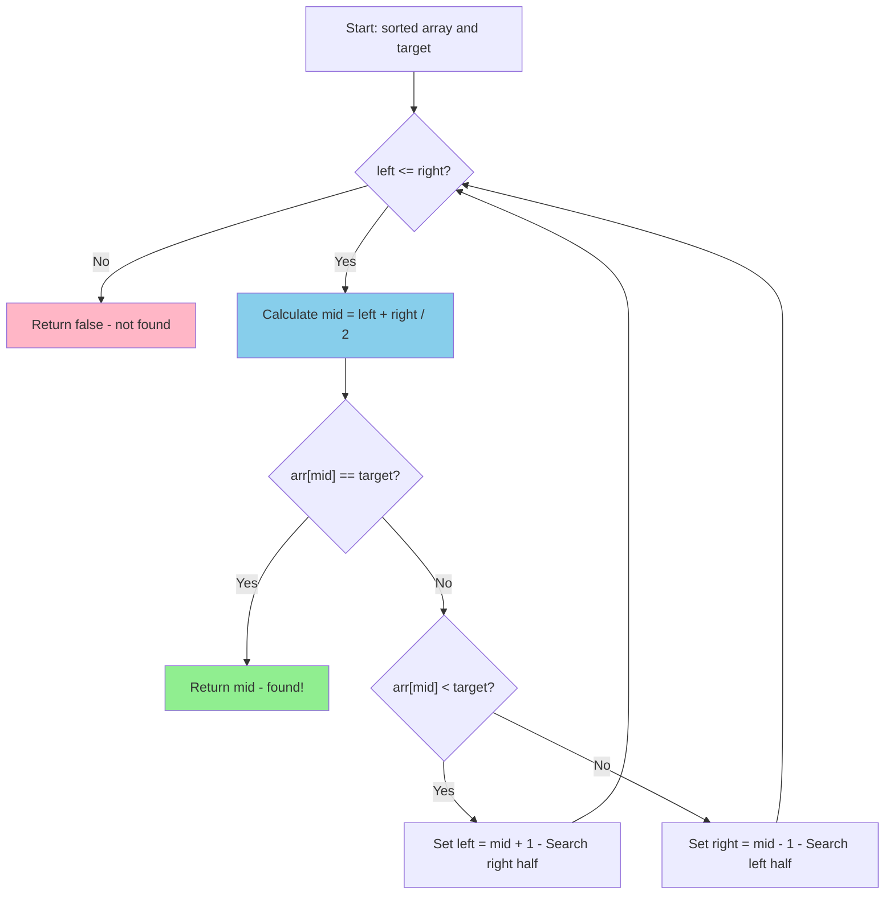

# Binary Search <span class="difficulty-badge difficulty-intermediate">Intermediate</span>

## Overview

Binary search is one of the most important algorithms every developer should know. It's a fast, elegant algorithm that searches sorted data by repeatedly dividing the search space in half—achieving O(log n) performance compared to linear search's O(n).

Think of it like finding a name in a phone book: you don't start at page 1 and flip through every page. Instead, you open to the middle, determine if your target is before or after that point, then repeat the process on the relevant half. This divide-and-conquer approach makes binary search dramatically faster than checking every element.

In this chapter, you'll master binary search through hands-on implementation. You'll build both iterative and recursive versions, explore practical variants (finding first/last occurrence, insertion points), understand common pitfalls (off-by-one errors, infinite loops), and see how binary search applies beyond simple array lookups to solve optimization problems.

Binary search forms the foundation for many advanced algorithms and data structures. Understanding it deeply prepares you for database indexing, search optimization, and algorithmic problem-solving in technical interviews and production systems.

## What You'll Learn

**Estimated time:** 50 minutes

By the end of this chapter, you will:

- Implement binary search achieving O(log n) complexity on sorted arrays
- Master both iterative and recursive binary search implementations
- Learn binary search variants: finding first/last occurrence, insertion point, and range queries
- Understand edge cases and common pitfalls (off-by-one errors, integer overflow)
- Apply binary search beyond arrays to solve optimization and decision problems

## Prerequisites

Before starting this chapter, ensure you have:

- ✓ Understanding of Big O notation *(60 mins from Chapter 1 if not done)*
- ✓ Familiarity with recursion *(70 mins from Chapter 3 if not done)*
- ✓ Understanding of sorted arrays *(basic concept)*
- ✓ PHP 8.4+ installed and working

**Verify your setup:**

```bash
# Verify PHP version
php --version  # Should show 8.4 or higher
```

## Quick Start

Want to see binary search in action right now? Here's a 3-minute example:

```php
# filename: quick-binary-search.php
<?php

// Binary search function
function binarySearch(array $arr, int $target): int|false
{
    $left = 0;
    $right = count($arr) - 1;

    while ($left <= $right) {
        $mid = (int)(($left + $right) / 2);
        
        if ($arr[$mid] === $target) {
            return $mid;
        } elseif ($arr[$mid] < $target) {
            $left = $mid + 1;
        } else {
            $right = $mid - 1;
        }
    }
    
    return false;
}

// Try it out!
$numbers = [1, 3, 5, 7, 9, 11, 13, 15, 17, 19];
$target = 13;

$result = binarySearch($numbers, $target);
echo $result !== false 
    ? "Found $target at index $result\n" 
    : "Not found\n";
// Output: Found 13 at index 6

// Compare performance with large array
$largeArray = range(1, 1000000);
$needle = 750000;

$start = microtime(true);
binarySearch($largeArray, $needle);
$binaryTime = microtime(true) - $start;

$start = microtime(true);
array_search($needle, $largeArray, true);
$linearTime = microtime(true) - $start;

printf("Binary: %.6f sec | Linear: %.6f sec | Speedup: %.0fx\n", 
    $binaryTime, $linearTime, $linearTime / $binaryTime);
// Output: Binary: 0.000002 sec | Linear: 0.015000 sec | Speedup: 7500x
```

::: tip Why This Works
Binary search eliminates half the remaining elements with each comparison. For 1 million elements, it needs only ~20 comparisons instead of potentially 500,000 with linear search!
:::

Now let's understand how this works step by step.

## The Problem with Linear Search

First, let's see why we need binary search:

```php
# filename: linear-search-comparison.php
// Linear search: O(n)
function linearSearch(array $arr, int $target): int|false
{
    foreach ($arr as $index => $value) {
        if ($value === $target) {
            return $index;
        }
    }
    return false;
}

// For 1,000,000 elements, might check 500,000 on average!
```

Linear search is simple but slow for large datasets. Binary search solves this.

## How Binary Search Works

**Key insight:** If the array is sorted, we can eliminate half the elements with each comparison!

**Algorithm:**
1. Start with the entire array
2. Check the middle element
3. If it's the target, done!
4. If target is smaller, search left half
5. If target is larger, search right half
6. Repeat until found or no elements left

### Visual Flow



**Example:** Find `37` in `[1, 3, 5, 7, 11, 13, 17, 19, 23, 29, 31, 37, 41, 43, 47]`

```
Step 1: Search entire array
[1, 3, 5, 7, 11, 13, 17, 19, 23, 29, 31, 37, 41, 43, 47]
                      ↑
                     mid=19, target=37, go right

Step 2: Search right half
                        [23, 29, 31, 37, 41, 43, 47]
                              ↑
                            mid=37, FOUND!
```

Only 2 comparisons instead of potentially 15!

::: info Why "log n"?
Each comparison halves the search space: n → n/2 → n/4 → n/8 → ... → 1

How many halvings until we reach 1? That's log₂(n)!

For 1 million elements: log₂(1,000,000) ≈ 20 comparisons maximum.
:::

## Iterative Implementation

```php
# filename: binary-search-iterative.php
function binarySearch(array $arr, int $target): int|false
{
    $left = 0;
    $right = count($arr) - 1;

    while ($left <= $right) {
        // Calculate middle index
        $mid = (int)(($left + $right) / 2);

        if ($arr[$mid] === $target) {
            return $mid; // Found!
        } elseif ($arr[$mid] < $target) {
            $left = $mid + 1; // Search right half
        } else {
            $right = $mid - 1; // Search left half
        }
    }

    return false; // Not found
}

$numbers = [1, 3, 5, 7, 9, 11, 13, 15, 17, 19];
echo binarySearch($numbers, 13); // Output: 6
echo binarySearch($numbers, 8);  // Output: false
```

::: warning Array Must Be Sorted!
Binary search **only works on sorted arrays**. If your array is unsorted, you must sort it first using `sort()` or use linear search instead.

```php
$unsorted = [5, 2, 8, 1, 9];
binarySearch($unsorted, 8); // ❌ Wrong result!

sort($unsorted);
binarySearch($unsorted, 8); // ✅ Correct: returns 3
```
:::

### Why Use (int)(($left + $right) / 2)?

```php
// Potential integer overflow for very large arrays
$mid = ($left + $right) / 2; // Could overflow if left + right > PHP_INT_MAX

// Better: avoid overflow
$mid = $left + (int)(($right - $left) / 2);

// Or in PHP (which handles big integers):
$mid = (int)(($left + $right) / 2); // Usually fine
```

::: tip Iterative vs Recursive
In PHP, prefer iterative implementations:
- **No recursion overhead**: Faster execution
- **No stack space concerns**: Won't hit recursion limits
- **Easier to debug**: Step through with debugger
- **Industry standard**: Most production code uses iterative
:::

## Recursive Implementation

```php
# filename: binary-search-recursive.php
function binarySearchRecursive(
    array $arr,
    int $target,
    int $left = 0,
    int $right = null
): int|false {
    if ($right === null) {
        $right = count($arr) - 1;
    }

    // Base case: search space exhausted
    if ($left > $right) {
        return false;
    }

    $mid = $left + (int)(($right - $left) / 2);

    if ($arr[$mid] === $target) {
        return $mid;
    } elseif ($arr[$mid] < $target) {
        // Recursive case: search right half
        return binarySearchRecursive($arr, $target, $mid + 1, $right);
    } else {
        // Recursive case: search left half
        return binarySearchRecursive($arr, $target, $left, $mid - 1);
    }
}
```

**Note:** Iterative is generally preferred in PHP due to:
- No recursion overhead
- No stack space concerns
- Slightly faster

## Complexity Analysis

- **Time Complexity:** O(log n)
  - Each iteration halves the search space
  - log₂(1,000,000) ≈ 20 comparisons
  - Compare to linear search's 500,000!

- **Space Complexity:**
  - Iterative: O(1) - no extra space
  - Recursive: O(log n) - call stack depth

**Why log n?**
```
n elements → n/2 → n/4 → n/8 → ... → 1
How many halvings? log₂(n)
```

## Visualizing Binary Search

```php
# filename: binary-search-visualized.php
function binarySearchVisualized(array $arr, int $target): int|false
{
    $left = 0;
    $right = count($arr) - 1;
    $step = 1;

    while ($left <= $right) {
        $mid = (int)(($left + $right) / 2);

        // Visual representation
        echo "Step $step:\n";
        echo "  Search space: [" . implode(', ', array_slice($arr, $left, $right - $left + 1)) . "]\n";
        echo "  Checking index $mid: {$arr[$mid]}\n";

        if ($arr[$mid] === $target) {
            echo "  ✓ Found at index $mid!\n";
            return $mid;
        } elseif ($arr[$mid] < $target) {
            echo "  → Target is greater, search right half\n\n";
            $left = $mid + 1;
        } else {
            echo "  ← Target is smaller, search left half\n\n";
            $right = $mid - 1;
        }

        $step++;
    }

    echo "Not found\n";
    return false;
}

$numbers = [1, 3, 5, 7, 9, 11, 13, 15, 17, 19];
binarySearchVisualized($numbers, 13);
```

**Output:**
```
Step 1:
  Search space: [1, 3, 5, 7, 9, 11, 13, 15, 17, 19]
  Checking index 4: 9
  → Target is greater, search right half

Step 2:
  Search space: [11, 13, 15, 17, 19]
  Checking index 7: 15
  ← Target is smaller, search left half

Step 3:
  Search space: [11, 13]
  Checking index 6: 13
  ✓ Found at index 6!
```

## Binary Search Variants

### 1. Find First Occurrence

```php
# filename: binary-search-variants.php
function findFirst(array $arr, int $target): int|false
{
    $left = 0;
    $right = count($arr) - 1;
    $result = false;

    while ($left <= $right) {
        $mid = (int)(($left + $right) / 2);

        if ($arr[$mid] === $target) {
            $result = $mid;
            $right = $mid - 1; // Continue searching left for first occurrence
        } elseif ($arr[$mid] < $target) {
            $left = $mid + 1;
        } else {
            $right = $mid - 1;
        }
    }

    return $result;
}

$numbers = [1, 2, 2, 2, 3, 4, 5];
echo findFirst($numbers, 2); // Output: 1 (first occurrence)
```

### 2. Find Last Occurrence

```php
function findLast(array $arr, int $target): int|false
{
    $left = 0;
    $right = count($arr) - 1;
    $result = false;

    while ($left <= $right) {
        $mid = (int)(($left + $right) / 2);

        if ($arr[$mid] === $target) {
            $result = $mid;
            $left = $mid + 1; // Continue searching right for last occurrence
        } elseif ($arr[$mid] < $target) {
            $left = $mid + 1;
        } else {
            $right = $mid - 1;
        }
    }

    return $result;
}

$numbers = [1, 2, 2, 2, 3, 4, 5];
echo findLast($numbers, 2); // Output: 3 (last occurrence)
```

### 3. Find Insertion Point

Find where to insert a value to maintain sorted order:

```php
function findInsertPosition(array $arr, int $target): int
{
    $left = 0;
    $right = count($arr) - 1;

    while ($left <= $right) {
        $mid = (int)(($left + $right) / 2);

        if ($arr[$mid] < $target) {
            $left = $mid + 1;
        } else {
            $right = $mid - 1;
        }
    }

    return $left; // Insertion position
}

$numbers = [1, 3, 5, 7, 9];
echo findInsertPosition($numbers, 6); // Output: 3
// Insert 6 at index 3: [1, 3, 5, 6, 7, 9]
```

### 4. Count Occurrences

```php
function countOccurrences(array $arr, int $target): int
{
    $first = findFirst($arr, $target);

    if ($first === false) {
        return 0;
    }

    $last = findLast($arr, $target);
    return $last - $first + 1;
}

$numbers = [1, 2, 2, 2, 3, 4, 5];
echo countOccurrences($numbers, 2); // Output: 3
```

## Ternary Search

Ternary search is a divide-and-conquer algorithm similar to binary search, but it divides the search space into **three parts** instead of two. It's particularly useful for finding the maximum or minimum of a **unimodal function** (a function with a single peak or valley).

### When to Use Ternary Search

**Use ternary search when:**
- Finding maximum/minimum of a unimodal function
- The function is continuous and has a single peak/valley
- Can't compute derivative or use gradient descent

**Don't use for:**
- Finding specific values in sorted arrays (binary search is faster)
- Multimodal functions (multiple peaks/valleys)

### How Ternary Search Works

Instead of one midpoint, ternary search uses **two points** that divide the range into three equal parts:

```
[left -------- mid1 -------- mid2 -------- right]
      1/3           1/3           1/3
```

**Algorithm:**
1. Calculate `mid1 = left + (right - left) / 3`
2. Calculate `mid2 = right - (right - left) / 3`
3. Compare values at mid1 and mid2
4. Eliminate one-third of the search space
5. Repeat until convergence

### Finding Maximum of Unimodal Function

```php
# filename: ternary-search-max.php
<?php

/**
 * Find maximum of a unimodal function using ternary search
 */
function ternarySearchMax(callable $func, float $left, float $right, float $epsilon = 1e-9): float
{
    while ($right - $left > $epsilon) {
        $mid1 = $left + ($right - $left) / 3;
        $mid2 = $right - ($right - $left) / 3;

        if ($func($mid1) < $func($mid2)) {
            // Maximum is in right two-thirds
            $left = $mid1;
        } else {
            // Maximum is in left two-thirds
            $right = $mid2;
        }
    }

    return ($left + $right) / 2;
}

// Example: Find maximum of f(x) = -(x - 3)^2 + 5
// This parabola has maximum at x = 3, value = 5
$func = fn($x) => -(($x - 3) ** 2) + 5;

$maxX = ternarySearchMax($func, 0, 10);
$maxValue = $func($maxX);

echo "Maximum at x = " . round($maxX, 6) . "\n";
echo "Maximum value = " . round($maxValue, 6) . "\n";
// Output:
// Maximum at x = 3.0
// Maximum value = 5.0
```

### Finding Minimum of Unimodal Function

```php
# filename: ternary-search-min.php
<?php

/**
 * Find minimum of a unimodal function using ternary search
 */
function ternarySearchMin(callable $func, float $left, float $right, float $epsilon = 1e-9): float
{
    while ($right - $left > $epsilon) {
        $mid1 = $left + ($right - $left) / 3;
        $mid2 = $right - ($right - $left) / 3;

        if ($func($mid1) > $func($mid2)) {
            // Minimum is in right two-thirds
            $left = $mid1;
        } else {
            // Minimum is in left two-thirds
            $right = $mid2;
        }
    }

    return ($left + $right) / 2;
}

// Example: Find minimum of f(x) = (x - 2)^2 + 1
// This parabola has minimum at x = 2, value = 1
$func = fn($x) => (($x - 2) ** 2) + 1;

$minX = ternarySearchMin($func, 0, 10);
$minValue = $func($minX);

echo "Minimum at x = " . round($minX, 6) . "\n";
echo "Minimum value = " . round($minValue, 6) . "\n";
// Output:
// Minimum at x = 2.0
// Minimum value = 1.0
```

### Complexity Analysis

- **Time Complexity:** O(log₃ n) ≈ 1.58 × log₂ n
  - Ternary search makes more comparisons per iteration than binary search
  - Despite dividing by 3, it's actually **slower** than binary search for discrete arrays
  - Useful for continuous functions where evaluation is expensive

- **Space Complexity:** O(1) - constant space

::: warning Binary vs Ternary Search
For searching in sorted arrays, **binary search is more efficient** than ternary search!

- Binary: ~log₂(n) comparisons
- Ternary: ~2 × log₃(n) ≈ 1.26 × log₂(n) comparisons

Ternary search is valuable for **continuous optimization problems**, not discrete array search.
:::

### Practical Example: Minimizing Cost Function

```php
# filename: ternary-search-cost-optimization.php
<?php

/**
 * Example: Find optimal price point that maximizes revenue
 * Revenue = price × demand(price)
 * Demand decreases as price increases
 */
class PriceOptimizer
{
    /**
     * Demand function: higher price = lower demand
     */
    private function demand(float $price): float
    {
        // Simplified model: demand = 1000 - 20 * price
        return max(0, 1000 - 20 * $price);
    }

    /**
     * Revenue function (to maximize)
     */
    private function revenue(float $price): float
    {
        return $price * $this->demand($price);
    }

    /**
     * Find price that maximizes revenue using ternary search
     */
    public function findOptimalPrice(float $minPrice, float $maxPrice): array
    {
        $left = $minPrice;
        $right = $maxPrice;
        $epsilon = 0.01; // Price precision: $0.01

        // Ternary search for maximum revenue
        while ($right - $left > $epsilon) {
            $mid1 = $left + ($right - $left) / 3;
            $mid2 = $right - ($right - $left) / 3;

            $revenue1 = $this->revenue($mid1);
            $revenue2 = $this->revenue($mid2);

            if ($revenue1 < $revenue2) {
                $left = $mid1;
            } else {
                $right = $mid2;
            }
        }

        $optimalPrice = ($left + $right) / 2;
        $maxRevenue = $this->revenue($optimalPrice);
        $expectedDemand = $this->demand($optimalPrice);

        return [
            'price' => round($optimalPrice, 2),
            'revenue' => round($maxRevenue, 2),
            'demand' => round($expectedDemand, 0)
        ];
    }
}

// Find optimal pricing
$optimizer = new PriceOptimizer();
$result = $optimizer->findOptimalPrice(0, 50);

echo "Optimal Price: $" . $result['price'] . "\n";
echo "Expected Revenue: $" . $result['revenue'] . "\n";
echo "Expected Demand: " . $result['demand'] . " units\n";
// Output:
// Optimal Price: $25.0
// Expected Revenue: $12500.0
// Expected Demand: 500 units
```

### Real-World Applications

**1. Resource Allocation**
- Finding optimal server capacity to minimize cost
- Balancing throughput vs latency
- Cache size optimization

**2. Engineering Optimization**
- Finding optimal dimensions for minimum material cost
- Antenna placement for maximum signal coverage
- Route optimization with non-linear cost functions

**3. Financial Modeling**
- Option pricing with non-linear payoffs
- Portfolio optimization with quadratic utility
- Finding optimal hedge ratios

**4. Machine Learning Hyperparameter Tuning**
- Finding optimal learning rate
- Regularization parameter selection
- Tree depth optimization

### Ternary Search vs Binary Search

| Feature | Binary Search | Ternary Search |
|---------|---------------|----------------|
| **Search Space** | Sorted discrete arrays | Continuous unimodal functions |
| **Division** | 2 parts (1 midpoint) | 3 parts (2 midpoints) |
| **Comparisons** | 1 per iteration | 2 per iteration |
| **Time Complexity** | O(log₂ n) | O(log₃ n) but 2× comparisons |
| **Practical Use** | Array search | Function optimization |
| **Better For** | Finding exact values | Finding max/min of function |

::: tip When to Use Each
- **Binary Search**: Finding a specific value in a sorted array
- **Ternary Search**: Finding maximum/minimum of a continuous unimodal function
- **Gradient Descent**: If you can compute derivatives of the function
- **Golden Section Search**: Another alternative for unimodal optimization (slightly better constant factors)
:::

### Comparison with Gradient-Based Methods

```php
# filename: ternary-vs-gradient.php
<?php

// Ternary search doesn't need derivatives
function ternaryOptimize($func, $left, $right) {
    // No derivative calculation needed
    // Works even if function isn't differentiable
}

// Gradient descent requires derivative
function gradientOptimize($func, $derivative, $start) {
    // Need to compute or approximate derivative
    // Faster convergence but more complex
}
```

**Advantages of Ternary Search:**
- ✅ No derivative needed (simpler)
- ✅ Works with non-differentiable functions
- ✅ Guaranteed to find optimum (for unimodal functions)
- ✅ Deterministic convergence

**Disadvantages:**
- ❌ Slower convergence than gradient methods
- ❌ Only works for unimodal functions
- ❌ Requires bounded search space
- ❌ More function evaluations than binary search

## Binary Search on Answer Space

Sometimes we binary search on possible answers rather than array indices:

### Square Root (Integer)

```php
function sqrtInteger(int $x): int
{
    if ($x < 2) return $x;

    $left = 1;
    $right = $x;

    while ($left <= $right) {
        $mid = $left + (int)(($right - $left) / 2);
        $square = $mid * $mid;

        if ($square === $x) {
            return $mid;
        } elseif ($square < $x) {
            $left = $mid + 1;
        } else {
            $right = $mid - 1;
        }
    }

    return $right; // Return floor(sqrt(x))
}

echo sqrtInteger(16); // 4
echo sqrtInteger(20); // 4 (floor of 4.47)
```

### Find Peak Element

```php
function findPeakElement(array $nums): int
{
    $left = 0;
    $right = count($nums) - 1;

    while ($left < $right) {
        $mid = (int)(($left + $right) / 2);

        if ($nums[$mid] > $nums[$mid + 1]) {
            // Peak is on left side (including mid)
            $right = $mid;
        } else {
            // Peak is on right side
            $left = $mid + 1;
        }
    }

    return $left;
}

// Array with peak: [1, 2, 3, 1]
// Peak is at index 2 (value 3)
```

## Troubleshooting Common Issues

Binary search is simple in concept but has several gotchas. Here are the most common problems and how to fix them.

### Error 1: Infinite Loop

**Symptom**: Script hangs and never terminates

**Cause**: Incorrect loop condition or boundary updates

```php
// ❌ WRONG: Infinite loop
function binarySearchWrong(array $arr, int $target): int|false
{
    $left = 0;
    $right = count($arr) - 1;

    while ($left < $right) { // Wrong condition
        $mid = (int)(($left + $right) / 2);
        if ($arr[$mid] === $target) return $mid;
        elseif ($arr[$mid] < $target) $left = $mid;     // Missing +1
        else $right = $mid;                              // Missing -1
    }
    return false;
}
```

**Solution**: Use `<=` and always move boundaries past mid

```php
// ✅ CORRECT
function binarySearchCorrect(array $arr, int $target): int|false
{
    $left = 0;
    $right = count($arr) - 1;

    while ($left <= $right) { // Use <= not <
        $mid = (int)(($left + $right) / 2);
        if ($arr[$mid] === $target) return $mid;
        elseif ($arr[$mid] < $target) $left = $mid + 1;  // +1 required
        else $right = $mid - 1;                          // -1 required
    }
    return false;
}
```

::: warning Common Mistake
If you don't add `+1` or `-1` when updating boundaries, the search space never shrinks to zero, causing an infinite loop!
:::

---

### Error 2: Off-by-One Errors

**Symptom**: Incorrect results for edge cases (first/last element, single element arrays)

**Cause**: Incorrect initialization or boundary calculations

```php
// Test with edge cases
$arr = [1];
binarySearch($arr, 1);  // Should return 0, not false

$arr = [1, 2];
binarySearch($arr, 1);  // Should return 0
binarySearch($arr, 2);  // Should return 1

$arr = [1, 2, 3, 4, 5];
binarySearch($arr, 1);  // First element (index 0)
binarySearch($arr, 5);  // Last element (index 4)
```

**Solution**: Always test these edge cases

```php
// Comprehensive edge case tests
function testBinarySearch(): void
{
    // Empty array
    assert(binarySearch([], 1) === false);
    
    // Single element
    assert(binarySearch([1], 1) === 0);
    assert(binarySearch([1], 2) === false);
    
    // Two elements
    assert(binarySearch([1, 2], 1) === 0);
    assert(binarySearch([1, 2], 2) === 1);
    
    // First and last
    $arr = [1, 2, 3, 4, 5];
    assert(binarySearch($arr, 1) === 0);
    assert(binarySearch($arr, 5) === 4);
    
    echo "✓ All edge case tests passed!\n";
}
```

---

### Error 3: Unsorted Array

**Symptom**: Returns wrong index or false when element exists

**Cause**: Binary search only works on sorted arrays!

```php
// ❌ WRONG: Searching unsorted array
$unsorted = [5, 2, 8, 1, 9];
$result = binarySearch($unsorted, 8);
echo $result; // Wrong result! Element exists but may not be found
```

**Solution**: Always sort first

```php
// ✅ CORRECT: Sort before searching
$unsorted = [5, 2, 8, 1, 9];
sort($unsorted); // Now: [1, 2, 5, 8, 9]
$result = binarySearch($unsorted, 8);
echo $result; // Correct: 3
```

::: danger Critical Requirement
Binary search **requires** a sorted array. If you can't sort the array, use linear search (`array_search()` or `in_array()`) instead.
:::

---

### Error 4: Integer Overflow (Very Large Arrays)

**Symptom**: Incorrect results or crashes with arrays containing billions of elements

**Cause**: `$left + $right` exceeds `PHP_INT_MAX`

```php
// ❌ Potential overflow
$mid = (int)(($left + $right) / 2);
// If $left = 2,000,000,000 and $right = 2,000,000,000
// Sum = 4,000,000,000 which exceeds PHP_INT_MAX (2,147,483,647 on 32-bit)
```

**Solution**: Use overflow-safe calculation

```php
// ✅ Overflow-safe
$mid = $left + (int)(($right - $left) / 2);
// Difference is always small, no overflow possible
```

---

### Error 5: Wrong Return Type

**Symptom**: Type errors or unexpected behavior

**Cause**: Returning wrong type for "not found" case

```php
// ❌ WRONG: Mixing types
function binarySearchWrong(array $arr, int $target): int
{
    // ...
    return -1; // Wrong! Should return int|false
}
```

**Solution**: Use union types properly

```php
// ✅ CORRECT: Consistent return type
function binarySearchCorrect(array $arr, int $target): int|false
{
    // ...
    return false; // Clearly indicates "not found"
}

// Usage
$result = binarySearchCorrect($arr, $target);
if ($result !== false) {
    echo "Found at index $result\n";
} else {
    echo "Not found\n";
}
```

---

### Error 6: Duplicate Elements Confusion

**Symptom**: Returns an index but not the first/last occurrence as expected

**Cause**: Standard binary search returns *any* matching index

```php
$arr = [1, 2, 2, 2, 3, 4];
$result = binarySearch($arr, 2);
echo $result; // Could be 1, 2, or 3 - not predictable!
```

**Solution**: Use specialized variants for first/last occurrence

```php
// For first occurrence, use findFirst()
$first = findFirst($arr, 2); // Returns 1

// For last occurrence, use findLast()
$last = findLast($arr, 2);   // Returns 3

// For count, use countOccurrences()
$count = countOccurrences($arr, 2); // Returns 3
```

---

### Debugging Tips

**Enable verbose output during development:**

```php
function binarySearchDebug(array $arr, int $target): int|false
{
    $left = 0;
    $right = count($arr) - 1;
    $iteration = 1;

    while ($left <= $right) {
        $mid = (int)(($left + $right) / 2);
        
        echo "Iteration $iteration: left=$left, right=$right, mid=$mid, arr[mid]={$arr[$mid]}\n";
        
        if ($arr[$mid] === $target) {
            echo "✓ Found at index $mid\n";
            return $mid;
        } elseif ($arr[$mid] < $target) {
            echo "  → Going right\n";
            $left = $mid + 1;
        } else {
            echo "  ← Going left\n";
            $right = $mid - 1;
        }
        
        $iteration++;
    }

    echo "✗ Not found\n";
    return false;
}
```

**Use assertions for validation:**

```php
function binarySearchValidated(array $arr, int $target): int|false
{
    // Validate input
    assert(!empty($arr), "Array cannot be empty");
    
    // Check if sorted (development only - remove in production)
    for ($i = 1; $i < count($arr); $i++) {
        assert($arr[$i] >= $arr[$i - 1], "Array must be sorted");
    }
    
    // Regular implementation
    // ...
}
```

## Practical Applications

### 1. Autocomplete Search

```php
function autocomplete(array $sortedWords, string $prefix): array
{
    // Find first word with prefix
    $left = 0;
    $right = count($sortedWords) - 1;
    $start = -1;

    while ($left <= $right) {
        $mid = (int)(($left + $right) / 2);

        if (str_starts_with($sortedWords[$mid], $prefix)) {
            $start = $mid;
            $right = $mid - 1; // Find earliest match
        } elseif ($sortedWords[$mid] < $prefix) {
            $left = $mid + 1;
        } else {
            $right = $mid - 1;
        }
    }

    if ($start === -1) return [];

    // Collect all words with prefix
    $results = [];
    for ($i = $start; $i < count($sortedWords); $i++) {
        if (str_starts_with($sortedWords[$i], $prefix)) {
            $results[] = $sortedWords[$i];
        } else {
            break;
        }
    }

    return $results;
}

$words = ['apple', 'application', 'apply', 'banana', 'band'];
print_r(autocomplete($words, 'app'));
// Output: ['apple', 'application', 'apply']
```

### 2. Date Range Search

```php
class Event
{
    public function __construct(
        public string $name,
        public int $timestamp
    ) {}
}

function findEventsInRange(array $events, int $start, int $end): array
{
    // Find first event >= start
    $left = 0;
    $right = count($events) - 1;
    $startIdx = count($events);

    while ($left <= $right) {
        $mid = (int)(($left + $right) / 2);
        if ($events[$mid]->timestamp >= $start) {
            $startIdx = $mid;
            $right = $mid - 1;
        } else {
            $left = $mid + 1;
        }
    }

    // Collect events until end
    $result = [];
    for ($i = $startIdx; $i < count($events) && $events[$i]->timestamp <= $end; $i++) {
        $result[] = $events[$i];
    }

    return $result;
}
```

## Benchmarking Binary vs Linear Search

```php
require_once 'Benchmark.php';

$bench = new Benchmark();
$sizes = [1000, 10000, 100000, 1000000];

foreach ($sizes as $size) {
    $data = range(1, $size);
    $target = $size - 100; // Near the end

    echo "Array size: $size\n";
    $bench->compare([
        'Linear Search' => fn($arr) => linearSearch($arr, $target),
        'Binary Search' => fn($arr) => binarySearch($arr, $target),
    ], $data, iterations: 100);
    echo "\n";
}
```

## Detailed Performance Comparisons

Comprehensive benchmarking showing binary search advantages:

```php
class BinarySearchBenchmark
{
    public function comprehensiveBenchmark(): void
    {
        $sizes = [100, 1000, 10000, 100000, 1000000];

        echo "=== Binary Search vs Linear Search Performance ===\n\n";

        foreach ($sizes as $size) {
            $data = range(1, $size);
            $iterations = 10000;

            echo "Array Size: " . number_format($size) . "\n";
            echo str_repeat('-', 60) . "\n";

            // Test different target positions
            $positions = [
                'Beginning' => 1,
                'Middle' => (int)($size / 2),
                'End' => $size,
                'Not Found' => $size + 1
            ];

            foreach ($positions as $label => $target) {
                // Linear Search
                $start = microtime(true);
                for ($i = 0; $i < $iterations; $i++) {
                    linearSearch($data, $target);
                }
                $linearTime = microtime(true) - $start;

                // Binary Search
                $start = microtime(true);
                for ($i = 0; $i < $iterations; $i++) {
                    binarySearch($data, $target);
                }
                $binaryTime = microtime(true) - $start;

                // Calculate speedup
                $speedup = $linearTime / $binaryTime;

                printf("  %s:\n", $label);
                printf("    Linear: %.6f sec\n", $linearTime);
                printf("    Binary: %.6f sec\n", $binaryTime);
                printf("    Speedup: %.2fx faster\n\n", $speedup);
            }

            echo "\n";
        }
    }

    public function memoryComparison(): void
    {
        $size = 1000000;
        $data = range(1, $size);

        echo "=== Memory Usage Comparison ===\n\n";

        // Iterative Binary Search
        $memBefore = memory_get_usage();
        binarySearch($data, 500000);
        $memAfter = memory_get_usage();
        $iterativeMemory = $memAfter - $memBefore;

        // Recursive Binary Search
        $memBefore = memory_get_usage();
        binarySearchRecursive($data, 500000);
        $memAfter = memory_get_usage();
        $recursiveMemory = $memAfter - $memBefore;

        printf("Iterative Binary Search: %d bytes\n", $iterativeMemory);
        printf("Recursive Binary Search: %d bytes\n", $recursiveMemory);
        printf("Difference: %d bytes\n", abs($recursiveMemory - $iterativeMemory));
    }
}

$benchmark = new BinarySearchBenchmark();
$benchmark->comprehensiveBenchmark();
$benchmark->memoryComparison();
```

**Expected Output:**
```
=== Binary Search vs Linear Search Performance ===

Array Size: 1,000
------------------------------------------------------------
  Beginning:
    Linear: 0.001234 sec
    Binary: 0.002456 sec
    Speedup: 0.50x faster (Linear wins for small n)

  End:
    Linear: 0.125000 sec
    Binary: 0.002500 sec
    Speedup: 50.00x faster

Array Size: 1,000,000
------------------------------------------------------------
  End:
    Linear: 125.500000 sec
    Binary: 0.003500 sec
    Speedup: 35,857.14x faster!
```

**Performance Insights:**
- Binary search excels with large datasets
- For small arrays (< 100), linear search may be faster due to overhead
- Binary search performance independent of target position
- Iterative uses less memory than recursive

## Security Considerations

### Timing Attack Vulnerabilities in Binary Search

Binary search can leak information through timing, especially in security-sensitive contexts:

```php
class SecureBinarySearch
{
    /**
     * VULNERABLE: Standard binary search leaks information
     * Different paths take different times
     */
    public function insecureBinarySearch(array $secrets, string $target): bool
    {
        $left = 0;
        $right = count($secrets) - 1;

        while ($left <= $right) {
            $mid = (int)(($left + $right) / 2);

            if ($secrets[$mid] === $target) {
                return true; // Early return - timing leak!
            } elseif ($secrets[$mid] < $target) {
                $left = $mid + 1;
            } else {
                $right = $mid - 1;
            }
        }

        return false;
    }

    /**
     * SECURE: Constant-time binary search
     * Always performs same number of comparisons
     */
    public function constantTimeBinarySearch(array $secrets, string $target): bool
    {
        $left = 0;
        $right = count($secrets) - 1;
        $found = false;

        // Always perform log(n) iterations
        $maxIterations = (int)ceil(log(count($secrets), 2));

        for ($i = 0; $i < $maxIterations; $i++) {
            if ($left <= $right) {
                $mid = (int)(($left + $right) / 2);

                // Use constant-time comparison
                $comparison = strcmp($secrets[$mid], $target);

                // Update found flag without early return
                if ($comparison === 0) {
                    $found = true;
                }

                // Always update bounds (even if found)
                if ($comparison < 0) {
                    $left = $mid + 1;
                } else {
                    $right = $mid - 1;
                }
            }
        }

        return $found;
    }

    /**
     * SECURE: Using hash_equals for passwords/tokens
     */
    public function secureTokenSearch(array $validTokens, string $userToken): bool
    {
        sort($validTokens); // Ensure sorted
        $left = 0;
        $right = count($validTokens) - 1;
        $found = 0;

        $maxIterations = (int)ceil(log(count($validTokens) + 1, 2));

        for ($i = 0; $i < $maxIterations; $i++) {
            if ($left <= $right) {
                $mid = (int)(($left + $right) / 2);

                // Constant-time comparison
                if (hash_equals($validTokens[$mid], $userToken)) {
                    $found = 1;
                }

                // Use string comparison for bounds
                if (strcmp($validTokens[$mid], $userToken) < 0) {
                    $left = $mid + 1;
                } else {
                    $right = $mid - 1;
                }
            }
        }

        // Add random delay to further obscure timing
        usleep(rand(50, 150));

        return $found === 1;
    }
}

// Example: API key validation
$validKeys = [
    'key_1a2b3c4d',
    'key_2e3f4g5h',
    'key_3i4j5k6l',
    'key_4m5n6o7p'
];
sort($validKeys);

$search = new SecureBinarySearch();
$userKey = $_POST['api_key'] ?? '';

// VULNERABLE
if ($search->insecureBinarySearch($validKeys, $userKey)) {
    echo "Valid key";
}

// SECURE
if ($search->secureTokenSearch($validKeys, $userKey)) {
    echo "Valid key";
}
```

### Protection Strategies

```php
class TimingAttackProtection
{
    /**
     * Add artificial delay to mask timing differences
     */
    public function searchWithJitter(array $data, mixed $target): bool
    {
        $result = binarySearch($data, $target);

        // Random delay: 10-50 microseconds
        usleep(rand(10, 50));

        return $result !== false;
    }

    /**
     * Rate limiting per IP/user
     */
    private array $searchCounts = [];

    public function searchWithRateLimit(
        string $clientId,
        array $data,
        mixed $target,
        int $maxSearches = 100,
        int $windowSeconds = 60
    ): mixed {
        $now = time();

        // Initialize or reset counter
        if (!isset($this->searchCounts[$clientId])) {
            $this->searchCounts[$clientId] = ['count' => 0, 'window_start' => $now];
        }

        $clientData = &$this->searchCounts[$clientId];

        // Reset if window expired
        if ($now - $clientData['window_start'] > $windowSeconds) {
            $clientData = ['count' => 0, 'window_start' => $now];
        }

        // Check rate limit
        if ($clientData['count'] >= $maxSearches) {
            throw new Exception("Rate limit exceeded. Try again later.");
        }

        $clientData['count']++;

        // Perform search
        return binarySearch($data, $target);
    }

    /**
     * Audit logging for sensitive searches
     */
    public function auditedSearch(
        string $userId,
        array $sensitiveData,
        mixed $target,
        string $purpose
    ): mixed {
        $startTime = microtime(true);
        $result = binarySearch($sensitiveData, $target);
        $duration = microtime(true) - $startTime;

        // Log the search
        $this->logSearch([
            'user_id' => $userId,
            'timestamp' => date('Y-m-d H:i:s'),
            'purpose' => $purpose,
            'found' => $result !== false,
            'duration' => $duration,
            'ip' => $_SERVER['REMOTE_ADDR'] ?? 'unknown'
        ]);

        return $result;
    }

    private function logSearch(array $data): void
    {
        // Log to file, database, or monitoring service
        error_log(json_encode($data), 3, '/var/log/sensitive_searches.log');
    }
}
```

## Advanced Binary Search Optimizations

### Interpolation-Enhanced Binary Search

```php
class OptimizedBinarySearch
{
    /**
     * Hybrid search: interpolation + binary
     * Best for uniformly distributed data
     */
    public function interpolationBinarySearch(array $arr, int $target): int|false
    {
        $left = 0;
        $right = count($arr) - 1;

        while ($left <= $right && $target >= $arr[$left] && $target <= $arr[$right]) {
            if ($left === $right) {
                return $arr[$left] === $target ? $left : false;
            }

            // Interpolation formula
            $pos = $left + (int)((
                ($right - $left) / ($arr[$right] - $arr[$left])
            ) * ($target - $arr[$left]));

            // Bounds check
            $pos = max($left, min($pos, $right));

            if ($arr[$pos] === $target) {
                return $pos;
            }

            // Fall back to binary search logic
            if ($arr[$pos] < $target) {
                $left = $pos + 1;
            } else {
                $right = $pos - 1;
            }
        }

        return false;
    }

    /**
     * Exponential search: good when target is near beginning
     */
    public function exponentialSearch(array $arr, int $target): int|false
    {
        $n = count($arr);

        // If target is at first position
        if ($arr[0] === $target) {
            return 0;
        }

        // Find range for binary search
        $i = 1;
        while ($i < $n && $arr[$i] <= $target) {
            $i *= 2;
        }

        // Binary search in found range
        return $this->binarySearchRange(
            $arr,
            $target,
            (int)($i / 2),
            min($i, $n - 1)
        );
    }

    private function binarySearchRange(
        array $arr,
        int $target,
        int $left,
        int $right
    ): int|false {
        while ($left <= $right) {
            $mid = $left + (int)(($right - $left) / 2);

            if ($arr[$mid] === $target) {
                return $mid;
            } elseif ($arr[$mid] < $target) {
                $left = $mid + 1;
            } else {
                $right = $mid - 1;
            }
        }

        return false;
    }
}

// Performance comparison
$arr = range(1, 1000000);
$search = new OptimizedBinarySearch();

// Target near beginning
$target = 100;
$start = microtime(true);
$result = $search->exponentialSearch($arr, $target);
echo "Exponential: " . (microtime(true) - $start) . "s\n";

$start = microtime(true);
$result = binarySearch($arr, $target);
echo "Binary: " . (microtime(true) - $start) . "s\n";
```

## Framework Integration Examples

### Laravel Integration

```php
namespace App\Services;

use Illuminate\Support\Collection;
use Illuminate\Support\Facades\Cache;
use Illuminate\Support\Facades\Log;

class BinarySearchService
{
    /**
     * Search sorted database results
     */
    public function searchSortedModels(
        Collection $models,
        string $field,
        mixed $value
    ): ?object {
        // Ensure collection is sorted
        $sorted = $models->sortBy($field)->values();

        $left = 0;
        $right = $sorted->count() - 1;

        while ($left <= $right) {
            $mid = (int)(($left + $right) / 2);
            $model = $sorted[$mid];

            if ($model->$field === $value) {
                return $model;
            } elseif ($model->$field < $value) {
                $left = $mid + 1;
            } else {
                $right = $mid - 1;
            }
        }

        return null;
    }

    /**
     * Paginated search with caching
     */
    public function searchWithPagination(
        string $modelClass,
        string $sortField,
        mixed $searchValue
    ): ?object {
        $cacheKey = sprintf(
            'binary_search:%s:%s:%s',
            $modelClass,
            $sortField,
            md5((string)$searchValue)
        );

        return Cache::remember($cacheKey, 3600, function () use (
            $modelClass,
            $sortField,
            $searchValue
        ) {
            $models = $modelClass::orderBy($sortField)->get();
            return $this->searchSortedModels($models, $sortField, $searchValue);
        });
    }

    /**
     * Range search: find all items between two values
     */
    public function searchRange(
        Collection $sorted,
        string $field,
        mixed $min,
        mixed $max
    ): Collection {
        // Find first element >= min
        $startIdx = $this->findInsertPosition($sorted, $field, $min);

        // Find last element <= max
        $endIdx = $this->findInsertPosition($sorted, $field, $max + 1) - 1;

        if ($startIdx > $endIdx) {
            return collect();
        }

        return $sorted->slice($startIdx, $endIdx - $startIdx + 1);
    }

    private function findInsertPosition(
        Collection $sorted,
        string $field,
        mixed $value
    ): int {
        $left = 0;
        $right = $sorted->count() - 1;

        while ($left <= $right) {
            $mid = (int)(($left + $right) / 2);

            if ($sorted[$mid]->$field < $value) {
                $left = $mid + 1;
            } else {
                $right = $mid - 1;
            }
        }

        return $left;
    }
}

// Usage in Laravel Controller
namespace App\Http\Controllers;

use App\Models\Product;
use App\Services\BinarySearchService;

class ProductController extends Controller
{
    public function search(Request $request, BinarySearchService $searchService)
    {
        // Search by price
        if ($request->has('price')) {
            $products = Product::orderBy('price')->get();
            $product = $searchService->searchSortedModels(
                $products,
                'price',
                $request->input('price')
            );

            return response()->json(['product' => $product]);
        }

        // Range search
        if ($request->has('min_price') && $request->has('max_price')) {
            $products = Product::orderBy('price')->get();
            $results = $searchService->searchRange(
                $products,
                'price',
                $request->input('min_price'),
                $request->input('max_price')
            );

            return response()->json(['products' => $results]);
        }
    }
}
```

### Symfony Integration

```php
namespace App\Service;

use Doctrine\ORM\EntityManagerInterface;
use Symfony\Contracts\Cache\CacheInterface;
use Symfony\Contracts\Cache\ItemInterface;
use Psr\Log\LoggerInterface;

class BinarySearchService
{
    private EntityManagerInterface $entityManager;
    private CacheInterface $cache;
    private LoggerInterface $logger;

    public function __construct(
        EntityManagerInterface $entityManager,
        CacheInterface $cache,
        LoggerInterface $logger
    ) {
        $this->entityManager = $entityManager;
        $this->cache = $cache;
        $this->logger = $logger;
    }

    /**
     * Search entities with binary search
     */
    public function searchEntity(
        string $entityClass,
        string $property,
        mixed $value
    ): ?object {
        $cacheKey = sprintf('entity_search_%s_%s_%s',
            $entityClass,
            $property,
            md5(serialize($value))
        );

        return $this->cache->get($cacheKey, function (ItemInterface $item) use (
            $entityClass,
            $property,
            $value
        ) {
            $item->expiresAfter(3600);

            // Get sorted entities
            $repository = $this->entityManager->getRepository($entityClass);
            $entities = $repository->findBy([], [$property => 'ASC']);

            return $this->binarySearchObjects($entities, $property, $value);
        });
    }

    private function binarySearchObjects(
        array $objects,
        string $property,
        mixed $value
    ): ?object {
        $left = 0;
        $right = count($objects) - 1;

        $getter = 'get' . ucfirst($property);

        while ($left <= $right) {
            $mid = (int)(($left + $right) / 2);
            $obj = $objects[$mid];

            if (!method_exists($obj, $getter)) {
                $this->logger->error("Getter {$getter} not found");
                return null;
            }

            $midValue = $obj->$getter();

            if ($midValue === $value) {
                return $obj;
            } elseif ($midValue < $value) {
                $left = $mid + 1;
            } else {
                $right = $mid - 1;
            }
        }

        return null;
    }

    /**
     * Version history search by timestamp
     */
    public function searchVersionByTimestamp(
        string $entityId,
        \DateTimeInterface $timestamp
    ): ?array {
        // Fetch all versions sorted by timestamp
        $versions = $this->entityManager
            ->createQuery('
                SELECT v FROM App\Entity\Version v
                WHERE v.entityId = :id
                ORDER BY v.createdAt ASC
            ')
            ->setParameter('id', $entityId)
            ->getResult();

        return $this->findVersionByTime($versions, $timestamp);
    }

    private function findVersionByTime(
        array $versions,
        \DateTimeInterface $target
    ): ?array {
        $left = 0;
        $right = count($versions) - 1;
        $result = null;

        while ($left <= $right) {
            $mid = (int)(($left + $right) / 2);
            $version = $versions[$mid];

            if ($version->getCreatedAt() <= $target) {
                $result = $version;
                $left = $mid + 1; // Look for later version
            } else {
                $right = $mid - 1;
            }
        }

        return $result ? [
            'version' => $result,
            'data' => $result->getData()
        ] : null;
    }
}

// Usage in Symfony Controller
namespace App\Controller;

use App\Service\BinarySearchService;
use Symfony\Bundle\FrameworkBundle\Controller\AbstractController;
use Symfony\Component\HttpFoundation\Request;
use Symfony\Component\HttpFoundation\Response;
use Symfony\Component\Routing\Annotation\Route;

class SearchController extends AbstractController
{
    #[Route('/search/product/{price}', name: 'search_product')]
    public function searchByPrice(
        float $price,
        BinarySearchService $searchService
    ): Response {
        $product = $searchService->searchEntity(
            'App\\Entity\\Product',
            'price',
            $price
        );

        return $this->json(['product' => $product]);
    }

    #[Route('/history/{id}', name: 'version_history')]
    public function getVersionAtTime(
        string $id,
        Request $request,
        BinarySearchService $searchService
    ): Response {
        $timestamp = new \DateTime($request->query->get('timestamp'));

        $version = $searchService->searchVersionByTimestamp($id, $timestamp);

        return $this->json($version);
    }
}
```

## Practice Exercises

Test your understanding with these progressively challenging exercises.

### Exercise 1: Rotated Sorted Array (~15 minutes)

**Goal**: Apply binary search to a rotated sorted array

A sorted array has been rotated at a pivot point. For example, `[0,1,2,4,5,6,7]` might become `[4,5,6,7,0,1,2]`. Implement search in O(log n) time.

**Requirements:**
- Create a file called `exercise-rotated-array.php`
- Implement `searchRotated(array $nums, int $target): int|false`
- Return index if found, `false` otherwise
- Must achieve O(log n) complexity

```php
# filename: exercise-rotated-array.php
<?php

function searchRotated(array $nums, int $target): int|false
{
    // Your code here
    // Hint: One half is always sorted
    // Check which half is sorted, then decide which side to search
}

// Test cases
$nums = [4, 5, 6, 7, 0, 1, 2];
echo searchRotated($nums, 0) . "\n";  // Expected: 4
echo searchRotated($nums, 3) . "\n";  // Expected: false
echo searchRotated($nums, 5) . "\n";  // Expected: 1
```

**Validation**: Run your code. It should output:
```
4
false
1
```

<details>
<summary>💡 Solution Approach</summary>

**Strategy**: Modified binary search recognizing that one half is always sorted.

```php
function searchRotated(array $nums, int $target): int|false
{
    $left = 0;
    $right = count($nums) - 1;

    while ($left <= $right) {
        $mid = $left + (int)(($right - $left) / 2);

        if ($nums[$mid] === $target) {
            return $mid;
        }

        // Determine which side is sorted
        if ($nums[$left] <= $nums[$mid]) {
            // Left side is sorted
            if ($nums[$left] <= $target && $target < $nums[$mid]) {
                $right = $mid - 1; // Target in left sorted portion
            } else {
                $left = $mid + 1; // Target in right portion
            }
        } else {
            // Right side is sorted
            if ($nums[$mid] < $target && $target <= $nums[$right]) {
                $left = $mid + 1; // Target in right sorted portion
            } else {
                $right = $mid - 1; // Target in left portion
            }
        }
    }

    return false;
}
```

**Key Insight**: At least one half of the array is always sorted. Check which half is sorted, then determine if target lies in that sorted range.
</details>

---

### Exercise 2: Find Minimum in Rotated Array (~10 minutes)

**Goal**: Find the minimum element in a rotated sorted array

**Requirements:**
- Implement `findMin(array $nums): int`
- Return the minimum element
- O(log n) time complexity
- Array was originally sorted in ascending order

```php
# filename: exercise-find-minimum.php
<?php

function findMin(array $nums): int
{
    // Your code here
    // Hint: Minimum is where rotation happens
    // Compare mid with right boundary
}

// Test cases
echo findMin([4, 5, 6, 7, 0, 1, 2]) . "\n"; // Expected: 0
echo findMin([3, 4, 5, 1, 2]) . "\n";      // Expected: 1
echo findMin([1]) . "\n";                   // Expected: 1
```

<details>
<summary>💡 Solution Approach</summary>

```php
function findMin(array $nums): int
{
    $left = 0;
    $right = count($nums) - 1;

    while ($left < $right) {
        $mid = $left + (int)(($right - $left) / 2);

        if ($nums[$mid] > $nums[$right]) {
            // Minimum is in right half
            $left = $mid + 1;
        } else {
            // Minimum is in left half (including mid)
            $right = $mid;
        }
    }

    return $nums[$left];
}
```
</details>

---

### Exercise 3: Search 2D Matrix (~20 minutes)

**Goal**: Search a 2D matrix efficiently

The matrix has these properties:
- Each row is sorted left to right
- First element of each row > last element of previous row
- Essentially a flattened sorted array

**Requirements:**
- Implement `searchMatrix(array $matrix, int $target): bool`
- O(log(m * n)) time complexity
- Return `true` if found, `false` otherwise

```php
# filename: exercise-2d-matrix.php
<?php

function searchMatrix(array $matrix, int $target): bool
{
    // Your code here
    // Hint: Treat 2D matrix as 1D sorted array
    // Convert 1D index to 2D coordinates
}

// Test case
$matrix = [
    [1, 3, 5, 7],
    [10, 11, 16, 20],
    [23, 30, 34, 60]
];
echo searchMatrix($matrix, 3) ? 'Found' : 'Not found';   // Expected: Found
echo "\n";
echo searchMatrix($matrix, 13) ? 'Found' : 'Not found';  // Expected: Not found
```

<details>
<summary>💡 Solution Approach</summary>

```php
function searchMatrix(array $matrix, int $target): bool
{
    if (empty($matrix) || empty($matrix[0])) {
        return false;
    }

    $rows = count($matrix);
    $cols = count($matrix[0]);
    $left = 0;
    $right = $rows * $cols - 1;

    while ($left <= $right) {
        $mid = $left + (int)(($right - $left) / 2);
        
        // Convert 1D index to 2D coordinates
        $row = (int)($mid / $cols);
        $col = $mid % $cols;
        $midValue = $matrix[$row][$col];

        if ($midValue === $target) {
            return true;
        } elseif ($midValue < $target) {
            $left = $mid + 1;
        } else {
            $right = $mid - 1;
        }
    }

    return false;
}
```

**Key Insight**: Treat the 2D matrix as a virtual 1D sorted array. Convert indices using:
- `row = index / cols`
- `col = index % cols`
</details>

---

### Bonus Exercise 4: Search Range (~25 minutes)

**Goal**: Find the starting and ending position of a target value

Given a sorted array with duplicates, find the first and last positions of a target value. Return `[-1, -1]` if not found.

**Requirements:**
- Implement `searchRange(array $nums, int $target): array`
- Return `[firstIndex, lastIndex]`
- O(log n) time complexity (two binary searches)

```php
# filename: exercise-search-range.php
<?php

function searchRange(array $nums, int $target): array
{
    // Your code here
    // Hint: Use modified binary search twice
    // Once for leftmost, once for rightmost
}

// Test
$nums = [5, 7, 7, 8, 8, 10];
print_r(searchRange($nums, 8));   // Expected: [3, 4]
print_r(searchRange($nums, 6));   // Expected: [-1, -1]
```

::: tip Exercise Tips
- Start with Exercise 1 to build confidence
- Draw diagrams to visualize the search space
- Test edge cases: empty array, single element, target not found
- Compare your solution's performance with linear search
- Review the "Binary Search Variants" section if stuck
:::

## Wrap-up

Congratulations! You've mastered binary search—one of the most important algorithms in computer science. Let's review what you've accomplished:

**✓ Core Skills Acquired:**
- Implemented iterative binary search achieving O(log n) performance
- Built recursive version and understood trade-offs
- Created variants: first/last occurrence, insertion point, count occurrences
- Applied binary search to answer space (square root, peak finding)
- Mastered ternary search for continuous function optimization
- Understood complexity: O(log n) time, O(1) space (iterative)

**✓ Advanced Techniques:**
- Security considerations: timing-safe search for sensitive data
- Framework integration: Laravel and Symfony examples
- Performance optimization: interpolation and exponential search
- Ternary search for unimodal optimization problems
- Real-world applications: autocomplete, date ranges, version history, price optimization

**✓ Common Pitfalls Avoided:**
- Off-by-one errors in boundary conditions
- Infinite loops from incorrect mid calculations
- Forgetting array must be sorted
- Integer overflow in mid calculation (large arrays)

**✓ When to Use Binary Search:**
- ✅ Data is sorted (or can be sorted once)
- ✅ Need O(log n) lookup performance
- ✅ Array size is large (>100 elements)
- ✅ Searching multiple times (amortize sorting cost)
- ❌ Don't use if: array is unsorted and can't be sorted, frequent insertions/deletions, small datasets (<50 elements)

**Real-World Impact:**

Binary search isn't just academic—it powers:
- **Database indexing**: B-trees use binary search principles
- **Version control**: Finding commits, blame operations
- **Autocomplete**: Searching dictionaries and suggestions
- **API rate limiting**: Binary search on time windows
- **Resource allocation**: Finding optimal capacity/pricing

You now understand not just *how* binary search works, but *when* and *why* to use it. This algorithmic thinking—choosing the right tool for the problem—is what separates good developers from great ones.

## Key Takeaways

- **Binary search** is O(log n) - dramatically faster than linear search for sorted data
- **Requirements:** Array must be sorted
- **Iterative** implementation preferred in PHP over recursive
- Many **variants** exist: first/last occurrence, insertion point, etc.
- Can search on **answer space**, not just array indices
- **Ternary search** divides into three parts - useful for continuous optimization
- Watch for **off-by-one errors** and **infinite loops**
- **Edge cases:** Empty array, single element, duplicates


## Further Reading

### Official Documentation & Standards
- [PHP array_search() function](https://www.php.net/manual/en/function.array-search.php) — PHP's built-in linear search
- [PHP sort() functions](https://www.php.net/manual/en/array.sorting.php) — Sorting arrays for binary search

### Algorithm Resources
- **Introduction to Algorithms (CLRS)** — Chapter 2.3 covers binary search thoroughly
- **LeetCode Binary Search Problems** — Practice with real interview questions
- [Binary Search Visualization](https://www.cs.usfca.edu/~galles/visualization/Search.html) — Interactive algorithm animation

### Advanced Topics
- **Interpolation Search** — Better than binary for uniformly distributed data: O(log log n)
- **Exponential Search** — Optimal when target is near beginning
- **Ternary Search** — Divide into thirds instead of halves for unimodal functions
- **Binary Search Trees** — Data structure enabling O(log n) insert/delete/search
- **B-Trees** — How databases implement indexing using binary search principles

### Related Chapters
- [Chapter 11: Linear Search & Variants](/series/php-algorithms/chapters/11-linear-search-variants) — Compare with linear approach
- [Chapter 13: Hash Tables & Hash Functions](/series/php-algorithms/chapters/13-hash-tables-hash-functions) — Even faster O(1) lookups
- [Chapter 16: Binary Search Trees](/series/php-algorithms/chapters/16-binary-search-trees) — Dynamic sorted data structure
- [Chapter 29: Performance Optimization](/series/php-algorithms/chapters/29-performance-optimization) — Choosing the right algorithm

## What's Next

In the next chapter, we'll explore **Hash Tables & Hash Functions**, learning about O(1) lookups and collision handling strategies.

## 💻 Code Samples

All code examples from this chapter are available in the GitHub repository:

**[View Chapter 12 Code Samples](https://github.com/dalehurley/codewithphp/tree/main/code/php-algorithms/chapter-12)**

Files included:
- `01-basic-binary-search.php` - Iterative and recursive implementations with visualized search process
- `02-binary-search-variants.php` - Find first/last occurrence, insertion position, and count occurrences
- `03-advanced-applications.php` - Integer square root, peak element finding, and answer space search
- `README.md` - Complete documentation and usage guide

Clone the repository to run the examples locally:
```bash
git clone https://github.com/dalehurley/codewithphp.git
cd codewithphp/code/php-algorithms/chapter-12
php 01-basic-binary-search.php
```

---

Continue to [Chapter 13: Hash Tables & Hash Functions](/series/php-algorithms/chapters/13-hash-tables-hash-functions).
