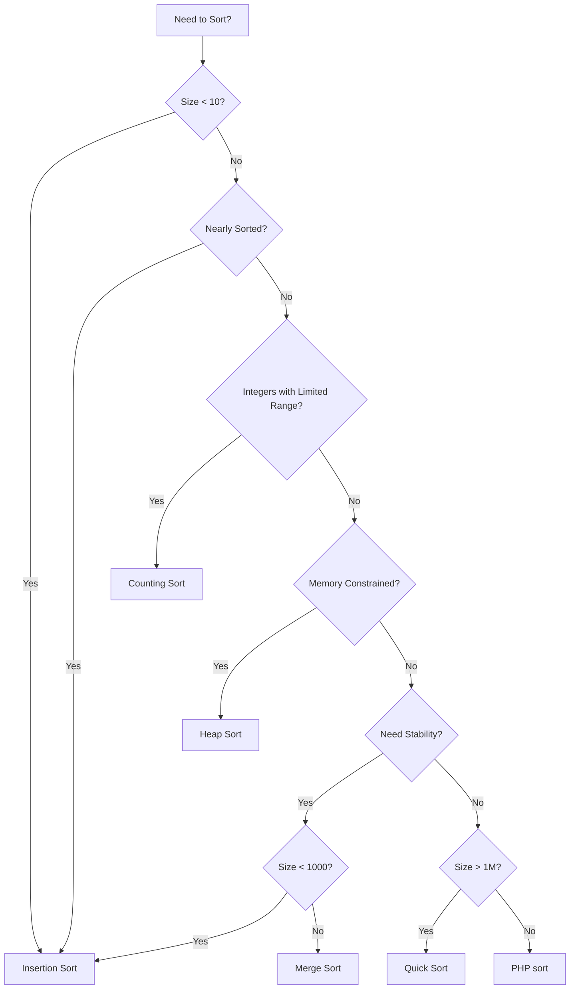
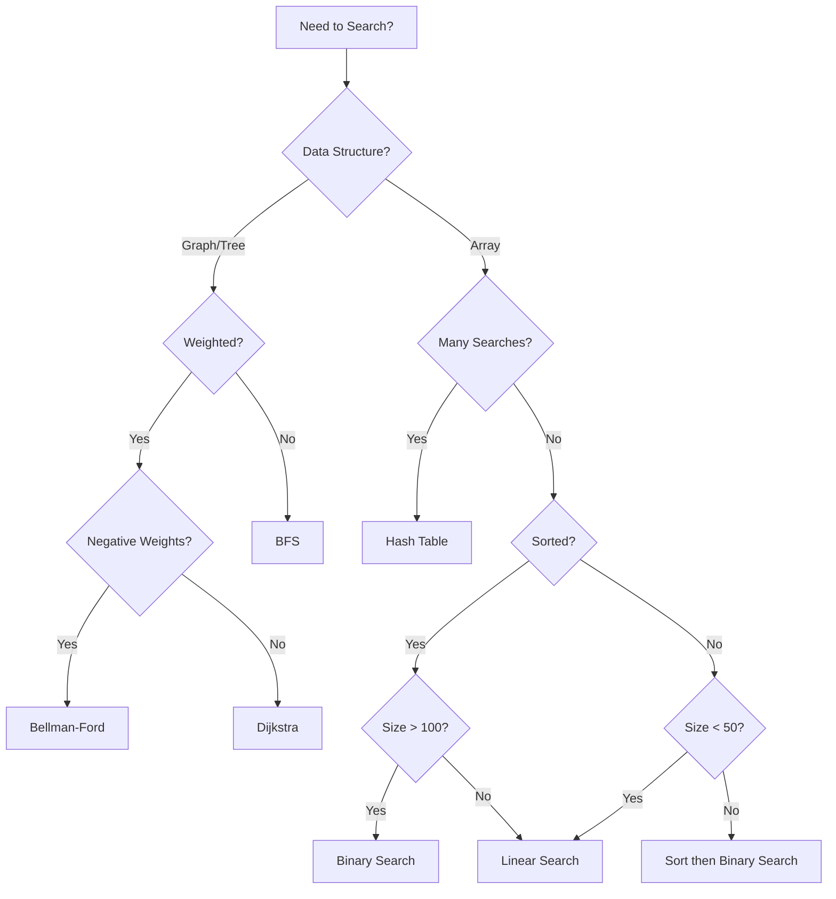
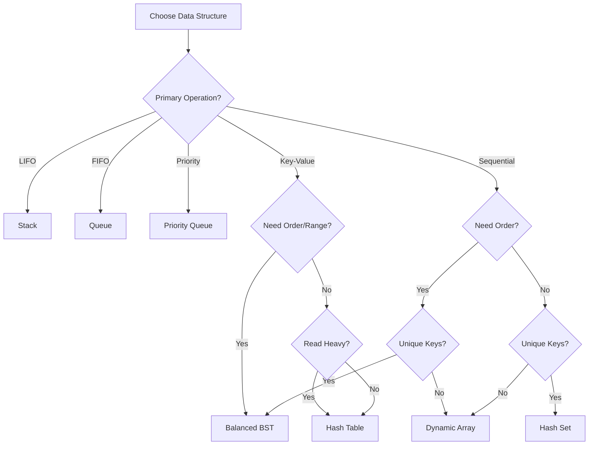
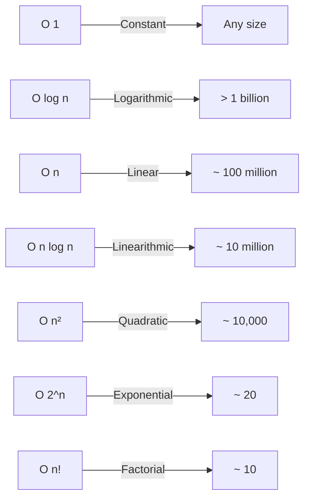

# 28: Algorithm Selection Guide <span class="difficulty-badge difficulty-intermediate">Intermediate</span>

## Overview

Knowing algorithms is one thing - knowing which one to use is what separates great developers from average ones. This chapter gives you the decision-making framework to confidently choose the perfect algorithm for any situation.

Choosing the right algorithm is crucial for application performance and can mean the difference between a snappy user experience and frustrated users. This chapter provides decision trees, guidelines, and practical wisdom for selecting appropriate algorithms based on problem characteristics, data size, and performance requirements.

Throughout this chapter, you'll learn systematic approaches to algorithm selection, understand when to prioritize simplicity over optimization, and develop the intuition needed to make informed choices that dramatically improve application performance.

## Prerequisites

This chapter synthesizes knowledge from throughout the series. You should have:

- ✓ **Completed previous chapters** - Familiarity with sorting, searching, and data structure algorithms
- ✓ **Big O notation understanding** - Ability to analyze and compare algorithm complexity
- ✓ **Problem-solving experience** - Have implemented multiple algorithms in practice
- ✓ **Production context awareness** - Understanding of real-world constraints and requirements

**Estimated Time**: ~75 minutes

## What You'll Build

By the end of this chapter, you will have created:

- Decision-making frameworks for sorting, searching, and data structure selection
- Pattern recognition system for identifying algorithm families
- Performance constraint analysis tools
- Problem-solving decision trees for common scenarios
- Recursion vs iteration selection guidelines
- Static vs dynamic data selection criteria
- Approximation vs exact algorithm decision framework
- Caching considerations in algorithm selection
- Access pattern analysis tools
- Hybrid approach selection strategies
- Practical selection guides you can reference in your daily work

## Quick Start

Here's a quick example showing how to use the algorithm selection framework. This demonstrates the decision-making process for choosing a sorting algorithm:

```php
# filename: quick-start-example.php
<?php

declare(strict_types=1);

class QuickStartSelector
{
    public function chooseAlgorithm(array $data, array $constraints): string
    {
        $size = count($data);
        $nearlySorted = $constraints['nearly_sorted'] ?? false;
        $memoryLimited = $constraints['memory_limited'] ?? false;
        $needsStable = $constraints['stable'] ?? false;

        // Quick decision tree
        if ($size < 10 || $nearlySorted) {
            return 'Insertion Sort';
        }

        if ($memoryLimited) {
            return 'Heap Sort';
        }

        if ($needsStable && $size > 1000) {
            return 'Merge Sort';
        }

        return $size > 1000000 ? 'Quick Sort' : 'PHP sort()';
    }
}

// Example usage
$selector = new QuickStartSelector();

$smallArray = [5, 2, 8, 1, 9];
echo $selector->chooseAlgorithm($smallArray, []) . "\n";
// Output: Insertion Sort

$largeArray = range(1, 1000000);
echo $selector->chooseAlgorithm($largeArray, ['stable' => false]) . "\n";
// Output: Quick Sort
```

**Expected Result**:

```
Insertion Sort
Quick Sort
```

**Why It Works**: The selector uses a simple decision tree based on data size and constraints. For small arrays (< 10), Insertion Sort is fastest due to low overhead. For large arrays without stability requirements, Quick Sort provides the best average-case performance. The framework helps you make these decisions systematically.

## Objectives

- Apply systematic decision trees to select optimal algorithms for your use cases
- Match algorithms to data characteristics (size, distribution, constraints)
- Balance trade-offs between time complexity, space complexity, and code simplicity
- Recognize problem patterns and instantly know which algorithm family applies
- Make informed choices that dramatically improve application performance

## Sorting Algorithm Selection

Selecting the right sorting algorithm depends on several factors: data size, data characteristics, memory constraints, and whether stability matters. The decision tree below guides you through the selection process.

```php
# filename: sorting-selector.php
<?php

declare(strict_types=1);

class SortingSelector
{
    public function recommendSorting(array $options): string
    {
        $size = $options['size'] ?? 0;
        $dataType = $options['type'] ?? 'general';  // general, integers, nearly_sorted
        $memoryConstrained = $options['memory_limited'] ?? false;
        $stable = $options['needs_stable'] ?? false;

        // Decision tree
        if ($size < 10) {
            return 'Insertion Sort - Best for tiny arrays';
        }

        if ($dataType === 'nearly_sorted') {
            return 'Insertion Sort - O(n) for nearly sorted data';
        }

        if ($dataType === 'integers' && $size > 1000) {
            $range = $options['max_value'] ?? PHP_INT_MAX;
            if ($range < $size * 10) {
                return 'Counting Sort - O(n + k) for limited range integers';
            }
        }

        if ($memoryConstrained) {
            return 'Heap Sort - O(n log n) worst case, O(1) extra space';
        }

        if ($stable) {
            if ($size < 1000) {
                return 'Insertion Sort - Simple and stable';
            }
            return 'Merge Sort - O(n log n) guaranteed, stable';
        }

        if ($size > 1000000) {
            return 'Quick Sort - Average O(n log n), best in practice for large data';
        }

        return 'PHP sort() - Optimized hybrid algorithm';
    }

    public function sortingComparison(): array
    {
        return [
            'Bubble Sort' => [
                'Time Best' => 'O(n)',
                'Time Average' => 'O(n²)',
                'Time Worst' => 'O(n²)',
                'Space' => 'O(1)',
                'Stable' => 'Yes',
                'Use When' => 'Educational purposes only'
            ],
            'Insertion Sort' => [
                'Time Best' => 'O(n)',
                'Time Average' => 'O(n²)',
                'Time Worst' => 'O(n²)',
                'Space' => 'O(1)',
                'Stable' => 'Yes',
                'Use When' => 'Small or nearly sorted arrays'
            ],
            'Merge Sort' => [
                'Time Best' => 'O(n log n)',
                'Time Average' => 'O(n log n)',
                'Time Worst' => 'O(n log n)',
                'Space' => 'O(n)',
                'Stable' => 'Yes',
                'Use When' => 'Need guaranteed O(n log n), stability required'
            ],
            'Quick Sort' => [
                'Time Best' => 'O(n log n)',
                'Time Average' => 'O(n log n)',
                'Time Worst' => 'O(n²)',
                'Space' => 'O(log n)',
                'Stable' => 'No',
                'Use When' => 'General purpose, large arrays, average case matters'
            ],
            'Heap Sort' => [
                'Time Best' => 'O(n log n)',
                'Time Average' => 'O(n log n)',
                'Time Worst' => 'O(n log n)',
                'Space' => 'O(1)',
                'Stable' => 'No',
                'Use When' => 'Memory constrained, need O(n log n) guarantee'
            ],
            'Counting Sort' => [
                'Time Best' => 'O(n + k)',
                'Time Average' => 'O(n + k)',
                'Time Worst' => 'O(n + k)',
                'Space' => 'O(k)',
                'Stable' => 'Yes',
                'Use When' => 'Limited integer range, k ≈ n'
            ]
        ];
    }
}

// Usage
$selector = new SortingSelector();

echo $selector->recommendSorting([
    'size' => 100000,
    'type' => 'general',
    'needs_stable' => false
]) . "\n";
// Quick Sort - Average O(n log n), best in practice for large data

echo $selector->recommendSorting([
    'size' => 5000,
    'type' => 'integers',
    'max_value' => 10000,
    'needs_stable' => true
]) . "\n";
// Counting Sort - O(n + k) for limited range integers
```

**Why It Works**: The `recommendSorting()` method implements a decision tree that evaluates multiple factors in priority order. It first checks for edge cases (tiny arrays, nearly sorted data), then considers special data types (integers with limited range), followed by constraints (memory, stability), and finally falls back to general-purpose algorithms. This systematic approach ensures optimal selection based on your specific requirements.

The `sortingComparison()` method provides a comprehensive reference table showing time complexity, space complexity, and stability for each algorithm. Use this table to understand trade-offs when the decision tree suggests multiple viable options.

### Sorting Decision Tree



## Search Algorithm Selection

Choosing a search algorithm depends on whether your data is sorted, how many searches you'll perform, and the data structure you're working with. For unsorted arrays, consider preprocessing costs versus search frequency.

```php
# filename: search-selector.php
<?php

declare(strict_types=1);

class SearchSelector
{
    public function recommendSearch(array $options): string
    {
        $sorted = $options['is_sorted'] ?? false;
        $size = $options['size'] ?? 0;
        $dataStructure = $options['structure'] ?? 'array';  // array, tree, graph
        $frequentSearches = $options['frequent'] ?? false;

        // Search in graph/tree
        if ($dataStructure === 'graph' || $dataStructure === 'tree') {
            $weighted = $options['weighted'] ?? false;

            if ($dataStructure === 'tree') {
                if ($sorted) {
                    return 'Binary Search Tree traversal - O(log n) average';
                }
                return 'DFS or BFS tree traversal - O(n)';
            }

            if ($weighted) {
                $negativeCost = $options['negative_weights'] ?? false;
                if ($negativeCost) {
                    return 'Bellman-Ford - O(VE) handles negative weights';
                }
                return 'Dijkstra - O(E + V log V) for weighted graphs';
            }

            return 'BFS - O(V + E) for unweighted shortest path';
        }

        // Search in array
        if ($frequentSearches && $size > 100) {
            return 'Build hash table - O(1) lookup after O(n) preprocessing';
        }

        if ($sorted) {
            if ($size > 100) {
                return 'Binary Search - O(log n)';
            }
            return 'Linear Search - O(n) but simple for small arrays';
        }

        if ($size < 50) {
            return 'Linear Search - O(n) simple and efficient for small data';
        }

        return 'Consider sorting first, then Binary Search - Overall O(n log n + k log n) for k searches';
    }

    public function searchComparison(): array
    {
        return [
            'Linear Search' => [
                'Time' => 'O(n)',
                'Space' => 'O(1)',
                'Requires Sorted' => 'No',
                'Use When' => 'Unsorted data, small datasets, single search'
            ],
            'Binary Search' => [
                'Time' => 'O(log n)',
                'Space' => 'O(1)',
                'Requires Sorted' => 'Yes',
                'Use When' => 'Sorted data, large datasets, multiple searches'
            ],
            'Hash Table' => [
                'Time' => 'O(1) average',
                'Space' => 'O(n)',
                'Requires Sorted' => 'No',
                'Use When' => 'Many lookups, have extra memory'
            ],
            'BST Search' => [
                'Time' => 'O(log n) average',
                'Space' => 'O(n)',
                'Requires Sorted' => 'No',
                'Use When' => 'Dynamic data, need sorted order, range queries'
            ]
        ];
    }
}

// Usage
$selector = new SearchSelector();

echo $selector->recommendSearch([
    'is_sorted' => true,
    'size' => 10000,
    'frequent' => false
]) . "\n";
// Binary Search - O(log n)

echo $selector->recommendSearch([
    'structure' => 'graph',
    'weighted' => true,
    'negative_weights' => false
]) . "\n";
// Dijkstra - O(E + V log V) for weighted graphs
```

**Why It Works**: The search selector first determines the data structure type (graph/tree vs array), as this fundamentally changes the available algorithms. For graphs and trees, it considers whether edges are weighted and if negative weights exist. For arrays, it evaluates whether data is sorted and how frequently searches occur. The key insight is that preprocessing costs (like building a hash table) are worthwhile when you'll perform many searches, but not for single lookups.

The `searchComparison()` method shows that different search algorithms excel in different scenarios. Hash tables provide O(1) lookups but require O(n) space and preprocessing. Binary search requires sorted data but provides O(log n) performance with O(1) space. Choose based on your search frequency and data characteristics.

### Search Decision Tree



## Data Structure Selection

The right data structure dramatically impacts performance. Consider your primary operations: are you reading more than writing? Do you need ordered traversal? Are you doing range queries? These questions guide your selection.

```php
# filename: data-structure-selector.php
<?php

declare(strict_types=1);

class DataStructureSelector
{
    public function recommendStructure(array $requirements): string
    {
        $operations = $requirements['operations'] ?? [];
        $priority = $requirements['priority'] ?? 'balanced';  // read, write, balanced
        $ordered = $requirements['need_order'] ?? false;
        $unique = $requirements['unique_keys'] ?? false;

        // Determine primary operations
        $needsFIFO = in_array('queue', $operations);
        $needsLIFO = in_array('stack', $operations);
        $needsPriority = in_array('priority', $operations);
        $needsKeyValue = in_array('key_value', $operations);
        $needsRangeQuery = in_array('range_query', $operations);

        if ($needsLIFO) {
            return 'Stack (SplStack or array) - O(1) push/pop';
        }

        if ($needsFIFO) {
            return 'Queue (SplQueue or array) - O(1) enqueue/dequeue';
        }

        if ($needsPriority) {
            return 'Priority Queue (SplPriorityQueue or heap) - O(log n) insert, O(1) peek';
        }

        if ($needsKeyValue) {
            if ($ordered || $needsRangeQuery) {
                return 'Balanced BST (AVL/Red-Black) - O(log n) ops, maintains order';
            }

            if ($priority === 'read') {
                return 'Hash Table (PHP array) - O(1) average lookup, insertion';
            }

            return 'Hash Table (PHP array) - Best all-around key-value store';
        }

        if ($ordered) {
            if ($unique) {
                return 'Balanced BST or SplHeap - O(log n) ops, maintains sorted order';
            }
            return 'Dynamic Array (PHP array) - Maintains insertion order';
        }

        if ($unique) {
            return 'Hash Set (array with keys) - O(1) membership test';
        }

        return 'Dynamic Array (PHP array) - Default choice for sequential data';
    }

    public function dataStructureComparison(): array
    {
        return [
            'Array' => [
                'Access' => 'O(1)',
                'Search' => 'O(n)',
                'Insert End' => 'O(1) amortized',
                'Insert Middle' => 'O(n)',
                'Delete' => 'O(n)',
                'Best For' => 'Random access, append operations'
            ],
            'Linked List' => [
                'Access' => 'O(n)',
                'Search' => 'O(n)',
                'Insert End' => 'O(1)',
                'Insert Middle' => 'O(1) with pointer',
                'Delete' => 'O(1) with pointer',
                'Best For' => 'Frequent insertions/deletions in middle'
            ],
            'Hash Table' => [
                'Access' => 'O(1) average',
                'Search' => 'O(1) average',
                'Insert End' => 'O(1) average',
                'Insert Middle' => 'O(1) average',
                'Delete' => 'O(1) average',
                'Best For' => 'Fast lookups, key-value storage'
            ],
            'BST (Balanced)' => [
                'Access' => 'O(log n)',
                'Search' => 'O(log n)',
                'Insert End' => 'O(log n)',
                'Insert Middle' => 'O(log n)',
                'Delete' => 'O(log n)',
                'Best For' => 'Sorted data, range queries'
            ],
            'Heap' => [
                'Access' => 'O(n)',
                'Search' => 'O(n)',
                'Insert End' => 'O(log n)',
                'Insert Middle' => 'O(log n)',
                'Delete' => 'O(log n)',
                'Best For' => 'Priority queue, finding min/max'
            ]
        ];
    }
}

// Usage
$selector = new DataStructureSelector();

echo $selector->recommendStructure([
    'operations' => ['key_value', 'range_query'],
    'need_order' => true
]) . "\n";
// Balanced BST (AVL/Red-Black) - O(log n) ops, maintains order

echo $selector->recommendStructure([
    'operations' => ['priority'],
    'need_order' => false
]) . "\n";
// Priority Queue (SplPriorityQueue or heap) - O(log n) insert, O(1) peek
```

**Why It Works**: Data structure selection depends primarily on the operations you need to perform most frequently. The selector first checks for specialized operations (LIFO/FIFO/priority), then evaluates key-value needs with ordering requirements, and finally considers sequential data needs. The key principle is matching the data structure's strengths to your access patterns. Hash tables excel at random access but don't maintain order. Balanced BSTs maintain order but have O(log n) operations. Arrays are simple but have O(n) search time. Choose based on your primary use case.

The comparison table shows that no single data structure is optimal for all operations. Arrays provide O(1) random access but O(n) search. Hash tables provide O(1) average operations but don't maintain order. Balanced BSTs provide O(log n) operations with ordering guarantees. Understanding these trade-offs helps you select the right structure.

### Data Structure Decision Tree



## Algorithm Pattern Recognition

Recognizing common algorithm patterns helps you quickly identify the right approach. This pattern matcher analyzes problem descriptions and suggests appropriate algorithm families.

```php
# filename: pattern-recognizer.php
<?php

declare(strict_types=1);

class PatternRecognizer
{
    public function identifyPattern(string $problemDescription): array
    {
        $patterns = [
            'Two Pointers' => [
                'Keywords' => ['sorted array', 'pairs', 'triplets', 'palindrome'],
                'Examples' => 'Two sum in sorted array, container with most water',
                'Time' => 'O(n)',
                'When' => 'Array/string problems with pairs or subsequences'
            ],
            'Sliding Window' => [
                'Keywords' => ['substring', 'subarray', 'consecutive', 'window'],
                'Examples' => 'Longest substring, maximum subarray sum',
                'Time' => 'O(n)',
                'When' => 'Find optimal continuous sequence'
            ],
            'Binary Search' => [
                'Keywords' => ['sorted', 'find', 'search space', 'monotonic'],
                'Examples' => 'Search in rotated array, find peak element',
                'Time' => 'O(log n)',
                'When' => 'Sorted data or search space can be halved'
            ],
            'Backtracking' => [
                'Keywords' => ['all combinations', 'permutations', 'subsets'],
                'Examples' => 'N-Queens, Sudoku solver, combinations',
                'Time' => 'O(2^n) or O(n!)',
                'When' => 'Generate all possible solutions'
            ],
            'Dynamic Programming' => [
                'Keywords' => ['optimal', 'maximum', 'minimum', 'count ways'],
                'Examples' => 'Knapsack, LCS, coin change',
                'Time' => 'O(n²) or O(n×m) typically',
                'When' => 'Overlapping subproblems, optimal substructure'
            ],
            'Graph Traversal' => [
                'Keywords' => ['connected', 'path', 'cycle', 'island'],
                'Examples' => 'Number of islands, course schedule',
                'Time' => 'O(V + E)',
                'When' => 'Relationships between entities'
            ],
            'Greedy' => [
                'Keywords' => ['minimum', 'maximum', 'earliest', 'latest'],
                'Examples' => 'Activity selection, Huffman coding',
                'Time' => 'O(n log n) typically',
                'When' => 'Local optimal choices lead to global optimum'
            ],
            'Divide and Conquer' => [
                'Keywords' => ['divide', 'merge', 'half'],
                'Examples' => 'Merge sort, quick sort, closest pair',
                'Time' => 'O(n log n)',
                'When' => 'Problem can be split into independent subproblems'
            ]
        ];

        $matches = [];
        $description = strtolower($problemDescription);

        foreach ($patterns as $patternName => $info) {
            foreach ($info['Keywords'] as $keyword) {
                if (strpos($description, $keyword) !== false) {
                    $matches[] = [
                        'pattern' => $patternName,
                        'match' => $keyword,
                        'info' => $info
                    ];
                    break;
                }
            }
        }

        return $matches;
    }

    public function suggestApproach(string $problem): string
    {
        $matches = $this->identifyPattern($problem);

        if (empty($matches)) {
            return "No clear pattern detected. Start with brute force, then optimize.";
        }

        $suggestions = "Detected patterns:\n\n";

        foreach ($matches as $match) {
            $suggestions .= "**{$match['pattern']}**\n";
            $suggestions .= "- Matched keyword: '{$match['match']}'\n";
            $suggestions .= "- Time complexity: {$match['info']['Time']}\n";
            $suggestions .= "- When to use: {$match['info']['When']}\n";
            $suggestions .= "- Example problems: {$match['info']['Examples']}\n\n";
        }

        return $suggestions;
    }
}

// Usage
$recognizer = new PatternRecognizer();

$problem1 = "Find the longest substring without repeating characters";
echo $recognizer->suggestApproach($problem1);
// Detected: Sliding Window

$problem2 = "Find minimum coins needed to make a target amount";
echo $recognizer->suggestApproach($problem2);
// Detected: Dynamic Programming

$problem3 = "Check if graph has a cycle";
echo $recognizer->suggestApproach($problem3);
// Detected: Graph Traversal
```

**Why It Works**: Pattern recognition works by matching keywords in problem descriptions to known algorithm families. Each pattern has characteristic keywords that signal its applicability. The `identifyPattern()` method scans the problem description for these keywords and returns matching patterns with their complexity characteristics. This helps you quickly narrow down the solution space from hundreds of algorithms to a few relevant families.

The `suggestApproach()` method formats the matches into actionable recommendations, showing not just which pattern matches, but also when to use it, its time complexity, and example problems. This transforms pattern recognition from guesswork into a systematic process.

## Performance Characteristics Decision Matrix

When you have specific constraints (time limits, memory limits, input size), use this matrix to determine what complexity is acceptable. This helps you quickly rule out approaches that won't meet your requirements.

```php
# filename: performance-matrix.php
<?php

declare(strict_types=1);

class PerformanceMatrix
{
    public function selectByConstraints(array $constraints): string
    {
        $n = $constraints['input_size'] ?? 1000;
        $timeLimit = $constraints['time_limit_ms'] ?? 1000;
        $memoryLimit = $constraints['memory_limit_mb'] ?? 128;

        // Estimate acceptable complexity
        $operationsPerMs = 1000000;  // Rough estimate: 1M ops per ms
        $maxOperations = $timeLimit * $operationsPerMs;

        if ($n <= 10) {
            return "O(n!) possible - Can try brute force";
        }

        if ($n <= 20) {
            return "O(2^n) possible - Backtracking/DP with memoization";
        }

        if ($n <= 100 && $n * $n <= $maxOperations) {
            return "O(n²) acceptable - Simple nested loops";
        }

        if ($n <= 10000 && $n * log($n) <= $maxOperations) {
            return "O(n log n) recommended - Sorting-based or divide-and-conquer";
        }

        if ($n * log($n) > $maxOperations) {
            if ($n <= $maxOperations) {
                return "O(n) required - Linear scan, hash table, or amortized analysis";
            }

            return "O(log n) or O(1) required - Binary search or direct computation";
        }

        return "O(n log n) recommended - Optimal for general sorting/searching";
    }

    public function complexityGuide(): array
    {
        return [
            'O(1)' => [
                'Name' => 'Constant',
                'Max n' => 'Any',
                'Examples' => 'Array access, hash table lookup',
                'Notes' => 'Best possible, not always achievable'
            ],
            'O(log n)' => [
                'Name' => 'Logarithmic',
                'Max n' => '> 1 billion',
                'Examples' => 'Binary search, balanced tree ops',
                'Notes' => 'Very scalable, look for halving'
            ],
            'O(n)' => [
                'Name' => 'Linear',
                'Max n' => '~ 100 million',
                'Examples' => 'Array traversal, counting',
                'Notes' => 'Usually acceptable, single pass'
            ],
            'O(n log n)' => [
                'Name' => 'Linearithmic',
                'Max n' => '~ 10 million',
                'Examples' => 'Merge sort, quick sort',
                'Notes' => 'Optimal for comparison sorting'
            ],
            'O(n²)' => [
                'Name' => 'Quadratic',
                'Max n' => '~ 10,000',
                'Examples' => 'Bubble sort, nested loops',
                'Notes' => 'Avoid for large data'
            ],
            'O(2^n)' => [
                'Name' => 'Exponential',
                'Max n' => '~ 20',
                'Examples' => 'Subset generation, backtracking',
                'Notes' => 'Only for tiny inputs'
            ],
            'O(n!)' => [
                'Name' => 'Factorial',
                'Max n' => '~ 10',
                'Examples' => 'Permutations, TSP brute force',
                'Notes' => 'Impractical beyond small n'
            ]
        ];
    }
}

// Usage
$matrix = new PerformanceMatrix();

echo $matrix->selectByConstraints([
    'input_size' => 100000,
    'time_limit_ms' => 1000
]) . "\n";
// O(n log n) recommended - Sorting-based or divide-and-conquer

echo $matrix->selectByConstraints([
    'input_size' => 15,
    'time_limit_ms' => 1000
]) . "\n";
// O(2^n) possible - Backtracking/DP with memoization
```

**Why It Works**: The performance matrix estimates acceptable complexity based on input size and time constraints. It uses a rough estimate of operations per millisecond (1M ops/ms) to calculate maximum acceptable operations. The method then compares this limit against the complexity of different algorithm classes. For very small inputs (n ≤ 10), even factorial algorithms are feasible. As input size grows, only polynomial or better algorithms become acceptable. This helps you quickly rule out algorithms that won't meet your constraints.

The `complexityGuide()` method provides a reference showing maximum input sizes for each complexity class. This helps you understand scalability limits. For example, O(n²) algorithms work well for n < 10,000, but become impractical for larger inputs. Use this guide to estimate feasibility before implementing an algorithm.

### Complexity Guide Visualization



## Decision Tree for Common Problems

This decision tree provides quick answers for common problem types. Use it as a starting point, then refine based on your specific constraints.

```php
# filename: problem-decision-tree.php
<?php

declare(strict_types=1);

class ProblemDecisionTree
{
    public function solve(string $problemType, array $details = []): string
    {
        return match($problemType) {
            'find_element' => $this->findElementStrategy($details),
            'sort_data' => $this->sortStrategy($details),
            'optimize' => $this->optimizationStrategy($details),
            'count_ways' => $this->countingStrategy($details),
            'path_finding' => $this->pathStrategy($details),
            default => "Unknown problem type"
        };
    }

    private function findElementStrategy(array $details): string
    {
        if ($details['sorted'] ?? false) {
            return "Binary Search - O(log n)";
        }

        if ($details['frequency'] === 'multiple') {
            return "Build hash table first - O(n) preprocessing, O(1) lookups";
        }

        return "Linear Search - O(n)";
    }

    private function sortStrategy(array $details): string
    {
        $size = $details['size'] ?? 0;
        $stable = $details['stable'] ?? false;

        if ($stable) {
            return "Merge Sort - O(n log n), stable";
        }

        if ($size > 1000000) {
            return "Quick Sort - O(n log n) average, fast in practice";
        }

        return "PHP sort() - Optimized built-in";
    }

    private function optimizationStrategy(array $details): string
    {
        if ($details['greedy_works'] ?? false) {
            return "Greedy Algorithm - O(n log n) typical";
        }

        if ($details['overlapping_subproblems'] ?? false) {
            return "Dynamic Programming - Various complexities";
        }

        return "Try greedy first, verify correctness, fall back to DP if needed";
    }

    private function countingStrategy(array $details): string
    {
        return "Dynamic Programming - Build count table bottom-up";
    }

    private function pathStrategy(array $details): string
    {
        if ($details['weighted'] ?? false) {
            if ($details['negative_weights'] ?? false) {
                return "Bellman-Ford - O(VE)";
            }
            return "Dijkstra - O(E + V log V)";
        }

        return "BFS - O(V + E) for unweighted shortest path";
    }
}

// Usage examples
$tree = new ProblemDecisionTree();

echo $tree->solve('find_element', ['sorted' => true]) . "\n";
// Binary Search - O(log n)

echo $tree->solve('path_finding', ['weighted' => true, 'negative_weights' => false]) . "\n";
// Dijkstra - O(E + V log V)
```

**Why It Works**: The problem decision tree uses a match expression to route different problem types to specialized strategy methods. Each strategy method (`findElementStrategy`, `sortStrategy`, etc.) implements a focused decision tree for that problem type. This modular approach makes the code maintainable and allows you to add new problem types easily. The strategies return algorithm recommendations with complexity notation, helping you understand both what to use and why.

## Real-World Selection Examples

Here are practical examples of algorithm selection in common scenarios:

### Example 1: E-Commerce Product Search

**Problem**: Search through 100,000 products by name, with thousands of searches per minute.

**Analysis**:

- Many searches (high frequency)
- Unsorted data initially
- Need fast lookups

**Solution**: Build a hash table index for O(1) lookups after O(n) preprocessing.

**Why This Works**: With thousands of searches per minute, the O(n) preprocessing cost is amortized across many queries. Each search becomes O(1) instead of O(n), dramatically improving performance. The hash table uses O(n) extra space, which is acceptable given the search frequency.

```php
# filename: product-search-example.php
<?php

declare(strict_types=1);

class ProductSearch
{
    private array $productIndex = [];

    public function buildIndex(array $products): void
    {
        // O(n) preprocessing - build hash table
        foreach ($products as $product) {
            $this->productIndex[strtolower($product['name'])] = $product;
        }
    }

    public function search(string $query): ?array
    {
        // O(1) lookup after preprocessing
        return $this->productIndex[strtolower($query)] ?? null;
    }
}
```

### Example 2: Social Media Feed Sorting

**Problem**: Sort user posts by timestamp, with new posts arriving frequently.

**Analysis**:

- Nearly sorted data (new posts at beginning)
- Frequent updates
- Need stable sort (preserve order of same timestamps)

**Why This Works**: Insertion Sort achieves O(n) time complexity on nearly sorted data because it only needs to shift elements a small distance. Since new posts arrive at the beginning and the feed is already sorted, most elements are already in the correct position. This makes Insertion Sort faster than O(n log n) algorithms like Merge Sort or Quick Sort for this specific use case.

```php
# filename: feed-sorting-example.php
<?php

declare(strict_types=1);

class FeedSorter
{
    public function sortFeed(array $posts): array
    {
        // Insertion sort - O(n) for nearly sorted data
        for ($i = 1; $i < count($posts); $i++) {
            $key = $posts[$i];
            $j = $i - 1;

            while ($j >= 0 && $posts[$j]['timestamp'] < $key['timestamp']) {
                $posts[$j + 1] = $posts[$j];
                $j--;
            }
            $posts[$j + 1] = $key;
        }

        return $posts;
    }
}
```

### Example 3: Recommendation System

**Problem**: Find users within 5 miles of a location from a database of 1 million users.

**Analysis**:

- Large dataset (1M users)
- Need to find items within range
- Multiple queries expected

**Why This Works**: For range queries on large datasets, sorting once (O(n log n)) enables efficient binary search for each query (O(log n + k) where k is the number of results). This is much better than scanning all 1 million users for each query (O(n)). The binary search finds the starting point of the range, then collects all users within the distance threshold.

```php
# filename: location-search-example.php
<?php

declare(strict_types=1);

class LocationSearch
{
    private array $sortedUsers = [];

    public function buildIndex(array $users): void
    {
        // Sort by distance from origin - O(n log n)
        usort($users, fn($a, $b) => $a['distance'] <=> $b['distance']);
        $this->sortedUsers = $users;
    }

    public function findNearby(float $maxDistance): array
    {
        // Binary search for range - O(log n + k) where k is results
        $results = [];
        $left = 0;
        $right = count($this->sortedUsers) - 1;

        // Find starting point
        while ($left <= $right) {
            $mid = (int)(($left + $right) / 2);
            if ($this->sortedUsers[$mid]['distance'] <= $maxDistance) {
                $right = $mid - 1;
            } else {
                $left = $mid + 1;
            }
        }

        // Collect all within range
        while ($left < count($this->sortedUsers) &&
               $this->sortedUsers[$left]['distance'] <= $maxDistance) {
            $results[] = $this->sortedUsers[$left];
            $left++;
        }

        return $results;
    }
}
```

## Additional Selection Criteria

Beyond the core algorithm families, several other factors influence algorithm selection. These criteria help you make nuanced decisions that optimize for your specific use case.

### Recursion vs Iteration Selection

Choosing between recursive and iterative implementations affects readability, performance, and memory usage. PHP has a recursion limit (typically 100-256 calls), so understanding when to use each approach is crucial.

```php
# filename: recursion-iteration-selector.php
<?php

declare(strict_types=1);

class RecursionIterationSelector
{
    public function recommendApproach(array $constraints): string
    {
        $problemType = $constraints['problem_type'] ?? 'general';
        $maxDepth = $constraints['max_depth'] ?? 100;
        $memoryConstrained = $constraints['memory_limited'] ?? false;
        $clarityPriority = $constraints['clarity_over_performance'] ?? false;

        // PHP recursion limit is typically 100-256
        if ($maxDepth > 200) {
            return 'Iteration - Exceeds PHP recursion limits';
        }

        if ($memoryConstrained) {
            return 'Iteration - O(1) space vs O(n) stack space for recursion';
        }

        // Natural recursion problems
        if (in_array($problemType, ['tree_traversal', 'backtracking', 'divide_conquer', 'parsing'])) {
            if ($maxDepth < 50) {
                return 'Recursion - More intuitive for hierarchical/recursive structures';
            }
            return 'Iteration with explicit stack - Recursive structure but iterative implementation';
        }

        // Problems that benefit from iteration
        if (in_array($problemType, ['array_processing', 'linear_search', 'simple_loops'])) {
            return 'Iteration - Simpler and more efficient for linear problems';
        }

        if ($clarityPriority) {
            return 'Recursion - Often more readable for recursive problems';
        }

        return 'Iteration - Default choice, avoids stack overflow risks';
    }

    public function comparison(): array
    {
        return [
            'Recursion' => [
                'Space Complexity' => 'O(n) stack space',
                'Readability' => 'Excellent for recursive problems',
                'PHP Limit' => '~100-256 calls',
                'Use When' => 'Tree traversal, backtracking, divide-and-conquer, max depth < 50'
            ],
            'Iteration' => [
                'Space Complexity' => 'O(1) extra space',
                'Readability' => 'Excellent for linear problems',
                'PHP Limit' => 'No limit',
                'Use When' => 'Large depth, memory constrained, simple loops, array processing'
            ],
            'Iteration with Stack' => [
                'Space Complexity' => 'O(n) explicit stack',
                'Readability' => 'Good balance',
                'PHP Limit' => 'No limit',
                'Use When' => 'Recursive structure but need to avoid recursion limits'
            ]
        ];
    }
}

// Usage
$selector = new RecursionIterationSelector();

echo $selector->recommendApproach([
    'problem_type' => 'tree_traversal',
    'max_depth' => 30
]) . "\n";
// Recursion - More intuitive for hierarchical/recursive structures

echo $selector->recommendApproach([
    'problem_type' => 'array_processing',
    'max_depth' => 1000
]) . "\n";
// Iteration - Simpler and more efficient for linear problems
```

**Why It Works**: Recursion is natural for problems with recursive structure (trees, backtracking), but PHP's recursion limit and stack space overhead make iteration preferable for deep or memory-constrained scenarios. The selector evaluates problem type, depth, and constraints to recommend the best approach.

**Decision Guidelines**:

- **Use Recursion**: Tree traversal, backtracking, divide-and-conquer, parsing, when depth < 50 and clarity matters
- **Use Iteration**: Array processing, linear problems, depth > 200, memory constrained, simple loops
- **Use Iteration with Stack**: Recursive structure but need to avoid recursion limits (e.g., deep tree traversal)

### Static vs Dynamic Data Selection

Data that changes frequently (dynamic) requires different algorithms than data that rarely changes (static). Understanding update frequency helps you choose between read-optimized and write-optimized structures.

```php
# filename: static-dynamic-selector.php
<?php

declare(strict_types=1);

class StaticDynamicSelector
{
    public function recommendStructure(array $requirements): string
    {
        $readFrequency = $requirements['reads_per_second'] ?? 0;
        $writeFrequency = $requirements['writes_per_second'] ?? 0;
        $readWriteRatio = $readFrequency > 0 ? $writeFrequency / $readFrequency : 0;
        $needsOrdering = $requirements['needs_order'] ?? false;

        // Static data (rarely updated)
        if ($readWriteRatio < 0.01) {
            // Read-heavy, rarely written
            if ($needsOrdering) {
                return 'Sorted Array or Immutable BST - Pre-sorted, read-optimized';
            }
            return 'Hash Table with Read Cache - O(1) reads, infrequent writes acceptable';
        }

        // Dynamic data (frequently updated)
        if ($readWriteRatio > 0.1) {
            // Write-heavy
            if ($needsOrdering) {
                return 'Balanced BST (AVL/Red-Black) - O(log n) for both reads and writes';
            }
            return 'Hash Table - O(1) average for both operations';
        }

        // Balanced read/write
        if ($needsOrdering) {
            return 'Balanced BST - Good balance for mixed workloads';
        }

        return 'Hash Table - Best all-around for balanced workloads';
    }

    public function updateFrequencyGuide(): array
    {
        return [
            'Static (Read-Heavy)' => [
                'Read/Write Ratio' => '< 0.01 (100+ reads per write)',
                'Best Structures' => 'Sorted arrays, immutable structures, read caches',
                'Optimization' => 'Pre-compute, pre-sort, cache aggressively',
                'Example' => 'Product catalog, reference data, configuration'
            ],
            'Dynamic (Write-Heavy)' => [
                'Read/Write Ratio' => '> 0.1 (10+ writes per read)',
                'Best Structures' => 'Hash tables, balanced BSTs, write-optimized structures',
                'Optimization' => 'Minimize write cost, batch updates',
                'Example' => 'Real-time counters, logs, event streams'
            ],
            'Balanced' => [
                'Read/Write Ratio' => '0.01 - 0.1',
                'Best Structures' => 'Hash tables, balanced BSTs',
                'Optimization' => 'Balance both operations',
                'Example' => 'User sessions, caches with TTL'
            ]
        ];
    }
}

// Usage
$selector = new StaticDynamicSelector();

echo $selector->recommendStructure([
    'reads_per_second' => 1000,
    'writes_per_second' => 5,
    'needs_order' => true
]) . "\n";
// Sorted Array or Immutable BST - Pre-sorted, read-optimized

echo $selector->recommendStructure([
    'reads_per_second' => 100,
    'writes_per_second' => 50,
    'needs_order' => false
]) . "\n";
// Hash Table - Best all-around for balanced workloads
```

**Why It Works**: Static data can be pre-processed and optimized for reads (sorted arrays, caches). Dynamic data requires structures that handle frequent updates efficiently (hash tables, balanced BSTs). The read/write ratio determines which optimization strategy to use.

**Key Insight**: If data changes rarely, invest in preprocessing (sorting, indexing) to optimize reads. If data changes frequently, choose structures with efficient update operations.

### Approximation vs Exact Algorithms

Sometimes "good enough" is better than perfect. Approximation algorithms trade exactness for speed, space, or simplicity. Knowing when approximate solutions are acceptable is crucial for practical algorithm selection.

```php
# filename: approximation-selector.php
<?php

declare(strict_types=1);

class ApproximationSelector
{
    public function recommendApproach(array $requirements): string
    {
        $accuracyRequired = $requirements['accuracy'] ?? 'exact';
        $dataSize = $requirements['data_size'] ?? 0;
        $memoryLimited = $requirements['memory_limited'] ?? false;
        $problemType = $requirements['problem_type'] ?? 'general';

        // Exact required
        if ($accuracyRequired === 'exact' || $requirements['exact_required'] ?? false) {
            return 'Exact Algorithm - Accuracy is mandatory';
        }

        // Very large datasets often benefit from approximation
        if ($dataSize > 1000000 && $memoryLimited) {
            if ($problemType === 'membership_test') {
                return 'Bloom Filter - O(1) space, small false positive rate';
            }
            if ($problemType === 'cardinality') {
                return 'HyperLogLog - O(1) space, ~2% error';
            }
            if ($problemType === 'frequency') {
                return 'Count-Min Sketch - O(1) space, approximate counts';
            }
        }

        // Acceptable error rates
        $acceptableError = $requirements['acceptable_error'] ?? 0.05; // 5% default

        if ($acceptableError > 0.1) {
            // High error tolerance
            if ($problemType === 'membership_test') {
                return 'Bloom Filter - 1-5% false positives acceptable';
            }
            return 'Approximation Algorithm - High error tolerance allows faster/smaller solution';
        }

        if ($acceptableError > 0.01) {
            // Moderate error tolerance
            if ($problemType === 'cardinality') {
                return 'HyperLogLog - ~2% error, massive space savings';
            }
            return 'Approximation Algorithm - Moderate error acceptable for performance gains';
        }

        return 'Exact Algorithm - Low error tolerance requires exact solution';
    }

    public function approximationGuide(): array
    {
        return [
            'Bloom Filter' => [
                'Use Case' => 'Set membership testing',
                'Error Type' => 'False positives (never false negatives)',
                'Error Rate' => '1-5% typical',
                'Space Savings' => '100-1000x smaller than exact',
                'When to Use' => 'Large sets, can tolerate false positives, need fast lookups'
            ],
            'HyperLogLog' => [
                'Use Case' => 'Cardinality estimation',
                'Error Type' => 'Approximate count',
                'Error Rate' => '~2% standard error',
                'Space Savings' => '1000x+ smaller than exact',
                'When to Use' => 'Unique count of billions of items, ~2% error acceptable'
            ],
            'Count-Min Sketch' => [
                'Use Case' => 'Frequency estimation',
                'Error Type' => 'Overestimate (never underestimate)',
                'Error Rate' => 'Configurable (typically 1-5%)',
                'Space Savings' => '100-1000x smaller than exact',
                'When to Use' => 'Frequency queries on massive streams, overestimate acceptable'
            ],
            'Exact Algorithm' => [
                'Use Case' => 'When accuracy is mandatory',
                'Error Type' => 'None',
                'Error Rate' => '0%',
                'Space Savings' => 'None (may require more space)',
                'When to Use' => 'Financial calculations, security, critical decisions'
            ]
        ];
    }
}

// Usage
$selector = new ApproximationSelector();

echo $selector->recommendApproach([
    'problem_type' => 'membership_test',
    'data_size' => 10000000,
    'memory_limited' => true,
    'acceptable_error' => 0.02
]) . "\n";
// Bloom Filter - O(1) space, small false positive rate

echo $selector->recommendApproach([
    'problem_type' => 'cardinality',
    'data_size' => 5000000000,
    'acceptable_error' => 0.03
]) . "\n";
// HyperLogLog - ~2% error, massive space savings
```

**Why It Works**: Approximation algorithms provide massive space and time savings for problems where exact answers aren't required. The selector evaluates accuracy requirements, data size, and acceptable error rates to recommend when approximation is viable. For critical applications (financial, security), exact algorithms are mandatory. For analytics, monitoring, and large-scale systems, approximation often provides the best trade-off.

**Decision Guidelines**:

- **Use Approximation**: Large datasets, memory constraints, analytics/monitoring, acceptable error rates (1-5%)
- **Use Exact**: Financial calculations, security, critical decisions, small datasets, zero tolerance for errors

### Caching Considerations in Algorithm Selection

Caching can fundamentally change which algorithm is optimal. When you can cache results, preprocessing costs become amortized, and algorithms with expensive setup but fast queries become viable.

```php
# filename: caching-algorithm-selector.php
<?php

declare(strict_types=1);

class CachingAlgorithmSelector
{
    public function recommendWithCaching(array $scenario): string
    {
        $queryFrequency = $scenario['queries_per_second'] ?? 0;
        $dataSize = $scenario['data_size'] ?? 0;
        $preprocessingCost = $scenario['preprocessing_time_ms'] ?? 0;
        $queryTimeWithoutCache = $scenario['query_time_ms'] ?? 0;
        $queryTimeWithCache = $scenario['cached_query_time_ms'] ?? 0.001; // 0.001ms typical cache lookup
        $cacheHitRate = $scenario['expected_cache_hit_rate'] ?? 0.8;

        // Calculate amortized cost
        $cacheMissRate = 1 - $cacheHitRate;
        $amortizedQueryTime = ($queryTimeWithCache * $cacheHitRate) +
                             ($queryTimeWithoutCache * $cacheMissRate);

        $totalTimeWithCache = $preprocessingCost + ($amortizedQueryTime * $queryFrequency);
        $totalTimeWithoutCache = $queryTimeWithoutCache * $queryFrequency;

        // If caching makes sense
        if ($totalTimeWithCache < $totalTimeWithoutCache && $queryFrequency > 10) {
            if ($dataSize > 100000 && $preprocessingCost < 1000) {
                return 'Preprocess + Cache - Build index/cache, O(1) cached lookups';
            }
            return 'Cache Results - Cache expensive computations, reuse results';
        }

        // High query frequency makes caching worthwhile
        if ($queryFrequency > 100 && $preprocessingCost < 10000) {
            return 'Preprocess + Cache - High query frequency amortizes preprocessing';
        }

        // Low query frequency, caching not worth it
        if ($queryFrequency < 5) {
            return 'No Caching - Query frequency too low to justify preprocessing';
        }

        return 'Evaluate Caching - Profile to determine if caching improves performance';
    }

    public function cachingDecisionMatrix(): array
    {
        return [
            'High Frequency Queries' => [
                'Queries/Second' => '> 100',
                'Recommendation' => 'Preprocess + Cache',
                'Example' => 'Search index, API response cache, computed values',
                'Break-Even' => 'Usually < 1 second of queries'
            ],
            'Medium Frequency' => [
                'Queries/Second' => '10-100',
                'Recommendation' => 'Cache if preprocessing < 1s',
                'Example' => 'Database query cache, session data',
                'Break-Even' => 'Depends on preprocessing cost'
            ],
            'Low Frequency' => [
                'Queries/Second' => '< 10',
                'Recommendation' => 'No caching or simple memoization',
                'Example' => 'One-time computations, rare lookups',
                'Break-Even' => 'Usually not worth it'
            ]
        ];
    }
}

// Usage
$selector = new CachingAlgorithmSelector();

echo $selector->recommendWithCaching([
    'queries_per_second' => 1000,
    'data_size' => 100000,
    'preprocessing_time_ms' => 500,
    'query_time_ms' => 10,
    'expected_cache_hit_rate' => 0.95
]) . "\n";
// Preprocess + Cache - Build index/cache, O(1) cached lookups

echo $selector->recommendWithCaching([
    'queries_per_second' => 2,
    'query_time_ms' => 50
]) . "\n";
// No Caching - Query frequency too low to justify preprocessing
```

**Why It Works**: Caching transforms algorithm selection by amortizing preprocessing costs across many queries. The selector calculates whether the total time (preprocessing + cached queries) is less than repeated computations. High query frequency makes expensive preprocessing worthwhile, while low frequency favors simpler algorithms without caching.

**Key Insight**: When query frequency is high (>100/sec), consider algorithms with expensive setup but fast cached lookups. The preprocessing cost is paid once, then queries become O(1) or O(log n) instead of O(n).

### Access Pattern Analysis

Understanding whether your data access is sequential or random helps you choose algorithms optimized for your access pattern. This affects cache performance and algorithm efficiency.

```php
# filename: access-pattern-selector.php
<?php

declare(strict_types=1);

class AccessPatternSelector
{
    public function recommendByAccessPattern(array $patterns): string
    {
        $sequentialRatio = $patterns['sequential_access'] ?? 0.5;
        $randomAccessRatio = $patterns['random_access'] ?? 0.5;
        $needsInsertion = $patterns['needs_insertion'] ?? false;
        $needsDeletion = $patterns['needs_deletion'] ?? false;

        // Primarily sequential access
        if ($sequentialRatio > 0.8) {
            if ($needsInsertion || $needsDeletion) {
                return 'Linked List - O(1) insertion/deletion, sequential access efficient';
            }
            return 'Array - Excellent cache locality, O(1) sequential access';
        }

        // Primarily random access
        if ($randomAccessRatio > 0.8) {
            if ($needsInsertion || $needsDeletion) {
                return 'Hash Table - O(1) random access, insertion, deletion';
            }
            return 'Array - O(1) random access by index';
        }

        // Mixed access patterns
        if ($needsInsertion || $needsDeletion) {
            return 'Balanced BST - O(log n) for all operations, handles mixed patterns';
        }

        return 'Array - Good balance for mixed sequential/random access';
    }

    public function accessPatternGuide(): array
    {
        return [
            'Sequential Access' => [
                'Pattern' => 'Access elements in order (0, 1, 2, 3...)',
                'Best Structures' => 'Arrays, linked lists',
                'Optimization' => 'Cache locality, prefetching',
                'Example' => 'Iterating through list, processing stream, reading file'
            ],
            'Random Access' => [
                'Pattern' => 'Access arbitrary elements by key/index',
                'Best Structures' => 'Arrays (by index), hash tables (by key)',
                'Optimization' => 'Direct addressing, hash functions',
                'Example' => 'Database lookups, cache retrievals, map operations'
            ],
            'Mixed Access' => [
                'Pattern' => 'Both sequential and random access',
                'Best Structures' => 'Arrays, balanced BSTs',
                'Optimization' => 'Balance both patterns',
                'Example' => 'General-purpose data structures, caches'
            ]
        ];
    }
}

// Usage
$selector = new AccessPatternSelector();

echo $selector->recommendByAccessPattern([
    'sequential_access' => 0.9,
    'random_access' => 0.1,
    'needs_insertion' => false
]) . "\n";
// Array - Excellent cache locality, O(1) sequential access

echo $selector->recommendByAccessPattern([
    'sequential_access' => 0.2,
    'random_access' => 0.8,
    'needs_insertion' => true
]) . "\n";
// Hash Table - O(1) random access, insertion, deletion
```

**Why It Works**: Sequential access benefits from cache locality (accessing nearby memory), making arrays and linked lists efficient. Random access requires direct addressing (arrays by index, hash tables by key). The selector evaluates access patterns to recommend structures optimized for your specific usage.

**Cache Locality Impact**: Sequential access has excellent cache performance (CPU prefetches nearby data). Random access may cause cache misses, making hash tables with good hash functions important for performance.

### Hybrid Approaches

Sometimes the best solution combines multiple algorithms, using different approaches for different parts of the problem or as fallback strategies.

```php
# filename: hybrid-approach-selector.php
<?php

declare(strict_types=1);

class HybridApproachSelector
{
    public function recommendHybrid(array $scenario): string
    {
        $dataSize = $scenario['data_size'] ?? 0;
        $problemType = $scenario['problem_type'] ?? 'general';
        $hasMultiplePhases = $scenario['multiple_phases'] ?? false;
        $needsFallback = $scenario['needs_fallback'] ?? false;

        // Multi-phase problems
        if ($hasMultiplePhases) {
            $phase1 = $scenario['phase1_type'] ?? 'preprocessing';
            $phase2 = $scenario['phase2_type'] ?? 'query';

            if ($phase1 === 'preprocessing' && $phase2 === 'query') {
                return 'Hybrid: Preprocess with O(n log n) sort, then O(log n) binary search queries';
            }
            if ($phase1 === 'filter' && $phase2 === 'process') {
                return 'Hybrid: Filter with hash table O(n), then process filtered subset';
            }
        }

        // Size-based hybrid
        if ($dataSize > 1000000) {
            if ($problemType === 'sorting') {
                return 'Hybrid: Quick Sort for large partitions, Insertion Sort for small partitions (< 10)';
            }
            if ($problemType === 'search') {
                return 'Hybrid: Hash table for frequent queries, binary search for rare queries';
            }
        }

        // Fallback strategies
        if ($needsFallback) {
            return 'Hybrid: Try fast approximation first, fallback to exact algorithm if needed';
        }

        // Adaptive algorithms
        if ($scenario['data_characteristics_vary'] ?? false) {
            return 'Hybrid: Adaptive algorithm that switches strategies based on data characteristics';
        }

        return 'Single Algorithm - No need for hybrid approach';
    }

    public function hybridExamples(): array
    {
        return [
            'Introsort' => [
                'Combination' => 'Quick Sort + Heap Sort + Insertion Sort',
                'Strategy' => 'Quick Sort normally, Heap Sort if depth too high, Insertion Sort for small arrays',
                'Benefit' => 'Best of all three: fast average case, guaranteed O(n log n), fast for small arrays'
            ],
            'Timsort' => [
                'Combination' => 'Merge Sort + Insertion Sort',
                'Strategy' => 'Merge Sort for large arrays, Insertion Sort for runs',
                'Benefit' => 'O(n) for nearly sorted data, O(n log n) worst case, stable'
            ],
            'Hybrid Search' => [
                'Combination' => 'Hash Table + Binary Search',
                'Strategy' => 'Hash table for frequent queries, binary search for rare/sorted queries',
                'Benefit' => 'O(1) for common cases, O(log n) for others, handles both sorted and unsorted'
            ],
            'Approximation + Exact Fallback' => [
                'Combination' => 'Bloom Filter + Exact Lookup',
                'Strategy' => 'Quick Bloom filter check, exact lookup only if positive',
                'Benefit' => 'Fast rejection of negatives, exact answers for positives'
            ]
        ];
    }
}

// Usage
$selector = new HybridApproachSelector();

echo $selector->recommendHybrid([
    'data_size' => 5000000,
    'problem_type' => 'sorting',
    'multiple_phases' => false
]) . "\n";
// Hybrid: Quick Sort for large partitions, Insertion Sort for small partitions (< 10)

echo $selector->recommendHybrid([
    'has_multiple_phases' => true,
    'phase1_type' => 'preprocessing',
    'phase2_type' => 'query'
]) . "\n";
// Hybrid: Preprocess with O(n log n) sort, then O(log n) binary search queries
```

**Why It Works**: Hybrid approaches combine the strengths of multiple algorithms. Introsort uses Quick Sort's speed, Heap Sort's guarantees, and Insertion Sort's efficiency for small arrays. The selector identifies when combining algorithms provides better overall performance than any single approach.

**Common Hybrid Patterns**:

- **Size-based**: Different algorithms for different data sizes
- **Phase-based**: Different algorithms for different processing phases
- **Fallback**: Fast approximation with exact fallback
- **Adaptive**: Algorithm that adapts to data characteristics

## PHP Built-in Functions vs Custom Implementations

One of the most important decisions PHP developers face is whether to use built-in functions or implement custom algorithms. PHP's built-in functions are highly optimized (often written in C), but custom implementations offer more control and can be optimized for specific use cases.

### When to Use PHP Built-in Functions

**Use built-ins when**:

- You need general-purpose functionality (sorting, searching, filtering)
- Performance is critical and you don't have specific requirements
- Code simplicity and maintainability matter more than customization
- You're working with standard PHP arrays and data types

```php
# filename: built-in-vs-custom.php
<?php

declare(strict_types=1);

class BuiltInVsCustomSelector
{
    public function recommendApproach(array $requirements): string
    {
        $useCase = $requirements['use_case'] ?? 'general';
        $customRequirements = $requirements['custom_requirements'] ?? [];
        $dataSize = $requirements['data_size'] ?? 1000;
        $performanceCritical = $requirements['performance_critical'] ?? false;

        // Sorting
        if ($useCase === 'sorting') {
            if (empty($customRequirements)) {
                return 'PHP sort() - Built-in, highly optimized';
            }

            if (in_array('stable', $customRequirements) && $dataSize < 1000) {
                return 'Custom Insertion Sort - Need stability for small arrays';
            }

            if (in_array('memory_constrained', $customRequirements)) {
                return 'Custom Heap Sort - Need O(1) space';
            }

            return 'PHP sort() - Default choice, optimized hybrid';
        }

        // Searching
        if ($useCase === 'searching') {
            if ($performanceCritical && $dataSize > 10000) {
                return 'PHP array_key_exists() or isset() - Built-in hash table lookup';
            }

            if (in_array('sorted', $customRequirements)) {
                return 'Custom Binary Search - Need O(log n) on sorted data';
            }

            return 'PHP in_array() or array_search() - Built-in, simple';
        }

        // Filtering/Transformation
        if ($useCase === 'filtering') {
            if (empty($customRequirements)) {
                return 'PHP array_filter() - Built-in, functional style';
            }

            if (in_array('memory_efficient', $customRequirements) && $dataSize > 100000) {
                return 'Custom Generator - Need memory efficiency for large datasets';
            }

            return 'PHP array_filter() - Default choice';
        }

        return 'PHP Built-in - Start with built-ins, customize only if needed';
    }

    public function builtInComparison(): array
    {
        return [
            'sort()' => [
                'Complexity' => 'O(n log n) hybrid',
                'Advantages' => 'Highly optimized C implementation, handles edge cases',
                'When to Use' => 'General sorting, no special requirements',
                'When to Customize' => 'Need stability, memory constraints, specific ordering'
            ],
            'array_search()' => [
                'Complexity' => 'O(n) linear',
                'Advantages' => 'Simple, built-in, works with any array',
                'When to Use' => 'Single search, unsorted data, small arrays',
                'When to Customize' => 'Many searches (use hash table), sorted data (use binary search)'
            ],
            'array_filter()' => [
                'Complexity' => 'O(n)',
                'Advantages' => 'Functional style, readable, handles edge cases',
                'When to Use' => 'General filtering, small to medium arrays',
                'When to Customize' => 'Very large arrays (use generators), complex filtering logic'
            ],
            'array_map()' => [
                'Complexity' => 'O(n)',
                'Advantages' => 'Functional style, parallelizable, readable',
                'When to Use' => 'Transform arrays, apply function to all elements',
                'When to Customize' => 'Need early termination, memory efficiency for large arrays'
            ],
            'in_array()' => [
                'Complexity' => 'O(n)',
                'Advantages' => 'Simple, readable, built-in',
                'When to Use' => 'Single membership check, small arrays',
                'When to Customize' => 'Many checks (use hash set), sorted data (use binary search)'
            ]
        ];
    }
}

// Usage
$selector = new BuiltInVsCustomSelector();

echo $selector->recommendApproach([
    'use_case' => 'sorting',
    'data_size' => 50000
]) . "\n";
// PHP sort() - Built-in, highly optimized

echo $selector->recommendApproach([
    'use_case' => 'searching',
    'custom_requirements' => ['sorted'],
    'data_size' => 100000
]) . "\n";
// Custom Binary Search - Need O(log n) on sorted data
```

**Key Guidelines**:

- **Default to built-ins**: PHP's built-in functions are optimized and well-tested
- **Customize only when needed**: Special requirements (stability, memory, specific ordering)
- **Profile before customizing**: Built-ins are often faster than custom implementations
- **Consider readability**: Built-ins are more familiar to other developers

### Spl Classes vs Native Arrays

PHP's Standard PHP Library (Spl) provides object-oriented data structures. Understanding when to use Spl classes versus native arrays helps you write more efficient and maintainable code.

```php
# filename: spl-vs-array-selector.php
<?php

declare(strict_types=1);

class SplVsArraySelector
{
    public function recommendStructure(array $requirements): string
    {
        $operation = $requirements['primary_operation'] ?? 'general';
        $needsTypeSafety = $requirements['type_safety'] ?? false;
        $needsInterfaces = $requirements['needs_interfaces'] ?? false;
        $dataSize = $requirements['data_size'] ?? 1000;

        // Stack operations
        if ($operation === 'stack') {
            if ($needsTypeSafety || $needsInterfaces) {
                return 'SplStack - Type-safe, implements Iterator, Countable';
            }
            return 'Array with array_push/array_pop - Simpler, faster for small data';
        }

        // Queue operations
        if ($operation === 'queue') {
            if ($needsTypeSafety || $needsInterfaces) {
                return 'SplQueue - Type-safe, implements Iterator, Countable';
            }
            if ($dataSize > 10000) {
                return 'SplQueue - Better performance for large queues';
            }
            return 'Array with array_push/array_shift - Simpler for small queues';
        }

        // Priority queue
        if ($operation === 'priority_queue') {
            return 'SplPriorityQueue - Built-in priority queue, no custom implementation needed';
        }

        // Heap
        if ($operation === 'heap') {
            if ($needsTypeSafety) {
                return 'SplHeap or SplMinHeap/SplMaxHeap - Type-safe heap implementation';
            }
            return 'Array with manual heap operations - More control, but more code';
        }

        // General array operations
        return 'Native Array - Default choice, most flexible and performant';
    }

    public function comparison(): array
    {
        return [
            'Native Array' => [
                'Performance' => 'Fastest - C implementation',
                'Flexibility' => 'Highest - Can be used as array, hash table, set',
                'Type Safety' => 'None - Can store mixed types',
                'Interfaces' => 'No - Not object-oriented',
                'Use When' => 'General purpose, performance critical, small to medium data'
            ],
            'SplStack' => [
                'Performance' => 'Good - O(1) push/pop',
                'Flexibility' => 'Limited - Stack operations only',
                'Type Safety' => 'Yes - Can enforce types',
                'Interfaces' => 'Yes - Iterator, Countable, ArrayAccess',
                'Use When' => 'Need type safety, OOP interfaces, stack semantics'
            ],
            'SplQueue' => [
                'Performance' => 'Good - O(1) enqueue/dequeue',
                'Flexibility' => 'Limited - Queue operations only',
                'Type Safety' => 'Yes - Can enforce types',
                'Interfaces' => 'Yes - Iterator, Countable, ArrayAccess',
                'Use When' => 'Need type safety, OOP interfaces, queue semantics'
            ],
            'SplPriorityQueue' => [
                'Performance' => 'Good - O(log n) insert, O(1) peek',
                'Flexibility' => 'Limited - Priority queue only',
                'Type Safety' => 'Yes - Can enforce types',
                'Interfaces' => 'Yes - Iterator, Countable',
                'Use When' => 'Need priority queue, no custom implementation needed'
            ],
            'SplHeap' => [
                'Performance' => 'Good - O(log n) operations',
                'Flexibility' => 'Limited - Heap operations only',
                'Type Safety' => 'Yes - Can enforce types',
                'Interfaces' => 'Yes - Iterator, Countable',
                'Use When' => 'Need heap, type safety, OOP interfaces'
            ]
        ];
    }
}

// Usage
$selector = new SplVsArraySelector();

echo $selector->recommendStructure([
    'primary_operation' => 'stack',
    'type_safety' => true
]) . "\n";
// SplStack - Type-safe, implements Iterator, Countable

echo $selector->recommendStructure([
    'primary_operation' => 'queue',
    'data_size' => 500
]) . "\n";
// Array with array_push/array_shift - Simpler for small queues
```

**Decision Guidelines**:

- **Use Native Arrays**: General purpose, performance critical, flexibility needed
- **Use Spl Classes**: Need type safety, OOP interfaces, specific data structure semantics
- **Performance**: Native arrays are typically faster for small to medium data
- **Maintainability**: Spl classes provide better type safety and clearer intent

## Best Practices

1. **Start Simple**

   - Begin with brute force to understand the problem
   - Optimize only after correctness is verified

2. **Consider Trade-offs**

   - Time vs space
   - Simplicity vs performance
   - Preprocessing vs query time

3. **Know Your Data**

   - Size and growth rate
   - Distribution (random, sorted, nearly sorted)
   - Update frequency

4. **Benchmark in Practice**

   - Theoretical complexity doesn't always match reality
   - PHP array operations are highly optimized
   - Network/IO often dominates algorithm cost

5. **Premature Optimization**
   - Profile before optimizing
   - 80/20 rule: optimize bottlenecks only
   - Readable code > clever code

## Exercises

Practice applying the algorithm selection framework with these exercises:

### Exercise 1: Choose a Sorting Algorithm

**Goal**: Apply the sorting decision tree to real scenarios

Create a file called `exercise-sorting-selection.php` and implement a function that recommends a sorting algorithm based on these scenarios:

1. **Scenario A**: Sorting 50 user records by registration date (already mostly sorted)
2. **Scenario B**: Sorting 10,000 integers between 0-1000
3. **Scenario C**: Sorting 5 million products by price (memory is limited)
4. **Scenario D**: Sorting 100 transactions where order of equal amounts must be preserved

**Validation**: Test your implementation:

```php
# filename: exercise-sorting-selection.php
<?php

declare(strict_types=1);

function recommendSorter(int $size, string $dataType, bool $memoryLimited, bool $stable): string
{
    // Your implementation here
}

// Test cases
echo recommendSorter(50, 'nearly_sorted', false, false) . "\n";
// Expected: Insertion Sort

echo recommendSorter(10000, 'integers', false, false) . "\n";
// Expected: Counting Sort (if range is limited) or Quick Sort

echo recommendSorter(5000000, 'general', true, false) . "\n";
// Expected: Heap Sort

echo recommendSorter(100, 'general', false, true) . "\n";
// Expected: Insertion Sort or Merge Sort
```

### Exercise 2: Pattern Recognition

**Goal**: Identify algorithm patterns from problem descriptions

Create a file called `exercise-pattern-recognition.php` and extend the `PatternRecognizer` class to identify patterns in these problems:

1. "Find all unique triplets in a sorted array that sum to zero"
2. "Count the number of ways to make change for a given amount"
3. "Find the shortest path between two nodes in an unweighted graph"
4. "Generate all possible combinations of k elements from an array"

**Validation**: Your recognizer should identify:

- Problem 1: Two Pointers pattern
- Problem 2: Dynamic Programming pattern
- Problem 3: Graph Traversal (BFS) pattern
- Problem 4: Backtracking pattern

### Exercise 3: Data Structure Selection

**Goal**: Choose appropriate data structures for different use cases

Create a file called `exercise-data-structure.php` and recommend data structures for:

1. **Use Case A**: Implementing a task scheduler that needs to process highest priority tasks first
2. **Use Case B**: Building a cache that needs O(1) lookups and doesn't need ordering
3. **Use Case C**: Storing user preferences that need to be retrieved in sorted order
4. **Use Case D**: Managing a browser history that needs back/forward navigation

**Validation**: Your recommendations should be:

- Use Case A: Priority Queue (Heap)
- Use Case B: Hash Table
- Use Case C: Balanced BST
- Use Case D: Stack (for back) + Queue (for forward) or doubly-linked list

## Troubleshooting

Common mistakes when selecting algorithms and how to avoid them:

### Problem: Choosing O(n²) algorithm for large datasets

**Symptom**: Application slows down significantly with 10,000+ items

**Cause**: Using nested loops or quadratic algorithms without considering data size

**Solution**:

- Check input size first
- Use complexity guide: O(n²) only acceptable for n < 10,000
- Consider O(n log n) alternatives (sorting, divide-and-conquer)
- For very large data, aim for O(n) or O(log n)

```php
// ❌ Wrong - O(n²) for large arrays
function findDuplicates(array $arr): array
{
    $duplicates = [];
    for ($i = 0; $i < count($arr); $i++) {
        for ($j = $i + 1; $j < count($arr); $j++) {
            if ($arr[$i] === $arr[$j]) {
                $duplicates[] = $arr[$i];
            }
        }
    }
    return $duplicates;
}

// ✅ Correct - O(n) using hash table
function findDuplicates(array $arr): array
{
    $seen = [];
    $duplicates = [];
    foreach ($arr as $item) {
        if (isset($seen[$item])) {
            $duplicates[] = $item;
        } else {
            $seen[$item] = true;
        }
    }
    return $duplicates;
}
```

### Problem: Using wrong search algorithm for unsorted data

**Symptom**: Binary search returns incorrect results or fails

**Cause**: Applying binary search to unsorted data

**Solution**:

- Always verify data is sorted before using binary search
- For unsorted data, use linear search (small) or hash table (many searches)
- Consider sorting cost: O(n log n) + k × O(log n) for k searches

```php
// ❌ Wrong - Binary search on unsorted array
function searchUnsorted(array $arr, mixed $target): ?int
{
    $left = 0;
    $right = count($arr) - 1;
    // This will fail - array is not sorted!
    while ($left <= $right) {
        $mid = (int)(($left + $right) / 2);
        if ($arr[$mid] === $target) return $mid;
        if ($arr[$mid] < $target) $left = $mid + 1;
        else $right = $mid - 1;
    }
    return null;
}

// ✅ Correct - Linear search for unsorted
function searchUnsorted(array $arr, mixed $target): ?int
{
    foreach ($arr as $index => $value) {
        if ($value === $target) {
            return $index;
        }
    }
    return null;
}

// ✅ Better - Hash table for many searches
class UnsortedSearch
{
    private array $index = [];

    public function buildIndex(array $arr): void
    {
        foreach ($arr as $index => $value) {
            $this->index[$value] = $index;
        }
    }

    public function search(mixed $target): ?int
    {
        return $this->index[$target] ?? null;
    }
}
```

### Problem: Ignoring memory constraints

**Symptom**: Out of memory errors with large datasets

**Cause**: Using algorithms with high space complexity (O(n) extra space) when memory is limited

**Solution**:

- Check available memory before choosing algorithm
- Prefer in-place algorithms (O(1) space) when memory constrained
- Use Heap Sort instead of Merge Sort for large, memory-limited scenarios
- Consider streaming algorithms for very large data

```php
// ❌ Wrong - Merge Sort uses O(n) extra space
function mergeSort(array $arr): array
{
    // ... implementation uses extra arrays
}

// ✅ Correct - Heap Sort uses O(1) extra space
function heapSort(array $arr): array
{
    // In-place sorting, minimal extra memory
    $n = count($arr);

    // Build heap
    for ($i = (int)($n / 2) - 1; $i >= 0; $i--) {
        heapify($arr, $n, $i);
    }

    // Extract elements
    for ($i = $n - 1; $i > 0; $i--) {
        [$arr[0], $arr[$i]] = [$arr[$i], $arr[0]];
        heapify($arr, $i, 0);
    }

    return $arr;
}
```

### Problem: Over-optimizing simple problems

**Symptom**: Complex code for problems that don't need optimization

**Cause**: Premature optimization without profiling

**Solution**:

- Start with simplest solution
- Profile to identify bottlenecks
- Only optimize if profiling shows it's necessary
- Remember: PHP's built-in functions are highly optimized

```php
// ❌ Over-engineered - Custom binary search for small array
function searchSmallArray(array $arr, mixed $target): ?int
{
    // Complex binary search implementation
    // ... 20 lines of code
}

// ✅ Simple and sufficient - Linear search for small arrays
function searchSmallArray(array $arr, mixed $target): ?int
{
    // For arrays < 50, linear search is fine
    foreach ($arr as $index => $value) {
        if ($value === $target) {
            return $index;
        }
    }
    return null;
}
```

## Wrap-up

Congratulations! You've completed the Algorithm Selection Guide. Here's what you've accomplished:

✓ **Mastered decision-making frameworks** for sorting, searching, and data structure selection
✓ **Built pattern recognition skills** to quickly identify algorithm families
✓ **Learned to balance trade-offs** between time, space, and code simplicity
✓ **Developed performance analysis tools** for constraint-based selection
✓ **Created practical reference guides** you can use in daily development

### Key Takeaways

- Algorithm selection depends on data size, structure, and operations
- No single "best" algorithm - context matters
- Start with simple solutions, optimize bottlenecks
- Consider both time and space complexity
- PHP's built-in functions are highly optimized
- Pattern recognition helps identify approach quickly
- Understand trade-offs between different approaches
- Benchmark with realistic data
- Complexity guide helps estimate feasibility
- Know when brute force is acceptable

This guide serves as a reference you can return to whenever you need to choose the right algorithm for a problem. Bookmark it and use the decision trees and comparison tables to make informed choices.

## Quick Reference Cheat Sheet

Use this quick reference table for fast algorithm selection decisions:

| Problem Type       | Data Size        | Data Characteristics    | Recommended Algorithm  | Complexity             |
| ------------------ | ---------------- | ----------------------- | ---------------------- | ---------------------- |
| **Sorting**        | < 10             | Any                     | Insertion Sort         | O(n²)                  |
|                    | < 10             | Nearly sorted           | Insertion Sort         | O(n)                   |
|                    | < 1K             | Need stability          | Insertion Sort         | O(n²)                  |
|                    | > 1K             | Need stability          | Merge Sort             | O(n log n)             |
|                    | > 1M             | General                 | Quick Sort             | O(n log n) avg         |
|                    | Any              | General                 | PHP sort()             | O(n log n)             |
|                    | Any              | Memory constrained      | Heap Sort              | O(n log n), O(1) space |
|                    | > 1K             | Integers, limited range | Counting Sort          | O(n + k)               |
| **Searching**      | < 50             | Unsorted                | Linear Search          | O(n)                   |
|                    | > 100            | Sorted                  | Binary Search          | O(log n)               |
|                    | Many searches    | Unsorted                | Hash Table             | O(1) after O(n) prep   |
|                    | Dynamic          | Need order              | BST                    | O(log n)               |
| **Data Structure** | Any              | LIFO needed             | Stack (array/SplStack) | O(1)                   |
|                    | Any              | FIFO needed             | Queue (array/SplQueue) | O(1)                   |
|                    | Any              | Priority needed         | Priority Queue         | O(log n) insert        |
|                    | Read-heavy       | Key-value               | Hash Table             | O(1)                   |
|                    | Need order       | Key-value               | Balanced BST           | O(log n)               |
|                    | Sequential       | Random access           | Array                  | O(1)                   |
| **Pattern**        | Sorted array     | Pairs/triplets          | Two Pointers           | O(n)                   |
|                    | Array/String     | Substring/subarray      | Sliding Window         | O(n)                   |
|                    | Sorted/Monotonic | Search space            | Binary Search          | O(log n)               |
|                    | All solutions    | Combinations            | Backtracking           | O(2^n) or O(n!)        |
|                    | Optimal          | Overlapping subproblems | Dynamic Programming    | Varies                 |
|                    | Relationships    | Connected/path          | Graph Traversal        | O(V + E)               |
|                    | Local optimal    | Global optimal          | Greedy                 | O(n log n)             |

### Complexity Quick Guide

| Complexity | Max Input Size | Examples                  |
| ---------- | -------------- | ------------------------- |
| O(1)       | Any            | Array access, hash lookup |
| O(log n)   | > 1 billion    | Binary search, BST ops    |
| O(n)       | ~ 100 million  | Array traversal, counting |
| O(n log n) | ~ 10 million   | Merge sort, quick sort    |
| O(n²)      | ~ 10,000       | Nested loops, bubble sort |
| O(2^n)     | ~ 20           | Subset generation         |
| O(n!)      | ~ 10           | Permutations              |

## Further Reading

- [PHP: Array Functions](https://www.php.net/manual/en/ref.array.php) - Official PHP array function documentation
- [PHP: SPL Data Structures](https://www.php.net/manual/en/book.spl.php) - Standard PHP Library data structures
- [Big O Cheat Sheet](https://www.bigocheatsheet.com/) - Comprehensive complexity reference
- [Algorithm Design Manual](https://www.algorist.com/) - Steven Skiena's comprehensive guide to algorithm design
- [Chapter 5: Sorting Algorithms](/series/php-algorithms/chapters/05-bubble-selection-sort/) - Deep dive into sorting implementations
- [Chapter 13: Hash Tables](/series/php-algorithms/chapters/13-hash-tables-hash-functions/) - Understanding hash table performance characteristics
- [Chapter 17: Stacks and Queues](/series/php-algorithms/chapters/17-stacks-queues/) - Detailed comparison of Spl classes vs arrays


## 💻 Code Samples

All code examples from this chapter are available in the GitHub repository:

**[View Chapter 28 Code Samples](https://github.com/dalehurley/codewithphp/tree/main/code-samples/php-algorithms/chapter-28)**

The code samples include all examples from this chapter:

- `sorting-selector.php` - Sorting algorithm selection framework
- `search-selector.php` - Search algorithm selection framework
- `data-structure-selector.php` - Data structure selection guide
- `pattern-recognizer.php` - Algorithm pattern recognition system
- `performance-matrix.php` - Performance constraint analysis
- `problem-decision-tree.php` - Common problem decision tree
- `product-search-example.php` - E-commerce search example
- `feed-sorting-example.php` - Social media feed sorting
- `location-search-example.php` - Location-based search example
- `recursion-iteration-selector.php` - Recursion vs iteration selection
- `static-dynamic-selector.php` - Static vs dynamic data selection
- `approximation-selector.php` - Approximation vs exact algorithm selection
- `caching-algorithm-selector.php` - Caching considerations in algorithm selection
- `access-pattern-selector.php` - Access pattern analysis
- `hybrid-approach-selector.php` - Hybrid algorithm selection

Clone the repository to run examples:

```bash
git clone https://github.com/dalehurley/codewithphp.git
cd codewithphp/code-samples/php-algorithms/chapter-28
php sorting-selector.php
```

## Next Steps

In the next chapter, we'll explore performance optimization techniques including profiling, benchmarking, and optimization strategies specific to PHP.
